# 六、优化代码以提高性能

优化代码以提高性能可以确保代码充分利用 C++ 所能提供的功能。与其他高级语言不同，C++ 能够在不牺牲性能的情况下提供高级语法自由，尽管不可否认这是以更高的学习曲线为代价的。

这一章很重要，因为它将演示优化代码的更高级方法，包括如何在单元级别对软件进行基准测试，如何检查编译器为潜在优化生成的结果汇编代码，如何减少应用正在使用的内存资源数量，以及为什么像`noexcept`这样的编译器提示很重要。读完这一章，你将有能力写出更高效的 C++。

在本章中，我们将介绍以下食谱:

*   对你的代码进行基准测试
*   查看汇编代码
*   减少内存分配的数量
*   声明 noexcept

# 技术要求

要编译和运行本章中的示例，您必须拥有运行 Ubuntu 18.04 的计算机的管理权限，并且具有功能性互联网连接。在运行这些示例之前，您必须安装以下内容:

```cpp
> sudo apt-get install build-essential git cmake valgrind
```

如果这安装在 Ubuntu 18.04 以外的任何操作系统上，则需要 GCC 7.4 或更高版本以及 CMake 3.6 或更高版本。

# 对你的代码进行基准测试

在这个食谱中，你将学习如何基准测试和优化你的源代码。优化源代码将产生更高效的 C++，从而延长电池寿命，提高性能，等等。这个方法很重要，因为优化源代码的过程始于确定您计划优化的资源，包括速度、内存甚至功耗。如果没有基准测试工具，就很难比较同一问题的不同方法。

C++ 程序员可以使用无数的基准测试工具(任何衡量程序单一属性的工具)，包括诸如 Boost、Folly 和 Abseil 等 c++ API，以及英特尔的 vTune 等 CPU 专用工具。还有一些分析工具(任何有助于理解程序行为的工具)，如 valgrind 和 gprof。在这个食谱中，我们将重点介绍其中的两个:Hayai 和 Valgrind。Hayai 提供了一个简单的微基准测试的例子，而 Valgrind 提供了一个更完整的，虽然更复杂的，动态分析/剖析工具的例子。

# 准备好

开始之前，请确保满足所有技术要求，包括安装 Ubuntu 18.04 或更高版本，并在终端窗口中运行以下内容:

```cpp
> sudo apt-get install build-essential git valgrind cmake
```

这将确保您的操作系统拥有适当的工具来编译和执行本食谱中的示例。完成后，打开一个新的终端。我们将使用这个终端来下载、编译和运行我们的示例。

# 怎么做...

执行以下步骤完成该配方:

1.  从新的终端，运行以下命令下载源代码:

```cpp
> cd ~/
> git clone https://github.com/PacktPublishing/Advanced-CPP-CookBook.git
> cd Advanced-CPP-CookBook/chapter06
```

2.  要编译源代码，请运行以下命令:

```cpp
> cmake -DCMAKE_BUILD_TYPE=Debug .
> make recipe01_examples
```

3.  编译完源代码后，您可以通过运行以下命令来执行该配方中的每个示例:

```cpp
> ./recipe01_example01
[==========] Running 2 benchmarks.
[ RUN ] vector.push_back (10 runs, 100 iterations per run)
[ DONE ] vector.push_back (0.200741 ms)
...
[ RUN ] vector.emplace_back (10 runs, 100 iterations per run)
[ DONE ] vector.emplace_back (0.166699 ms)
...

> ./recipe01_example02
```

在下一节中，我们将逐一介绍这些示例，并解释每个示例程序的功能以及它与本食谱中所教授的课程之间的关系。

# 它是如何工作的...

应用于 C++ 的最常见的优化是执行速度。为了优化 C++ 的速度，我们必须从开发解决同一问题的不同方法开始，然后对每个解决方案进行基准测试，以确定哪个解决方案执行速度最快。基准测试工具，如 GitHub 上基于 C++ 的基准测试库 Hayai，有助于做出这一决定。为了解释这一点，让我们看一个简单的例子:

```cpp
#include <string>
#include <vector>
#include <hayai.hpp>

std::vector<std::string> data;

BENCHMARK(vector, push_back, 10, 100)
{
    data.push_back("The answer is: 42");
}

BENCHMARK(vector, emplace_back, 10, 100)
{
    data.emplace_back("The answer is: 42");
}
```

当我们执行前面的代码时，我们得到以下输出:

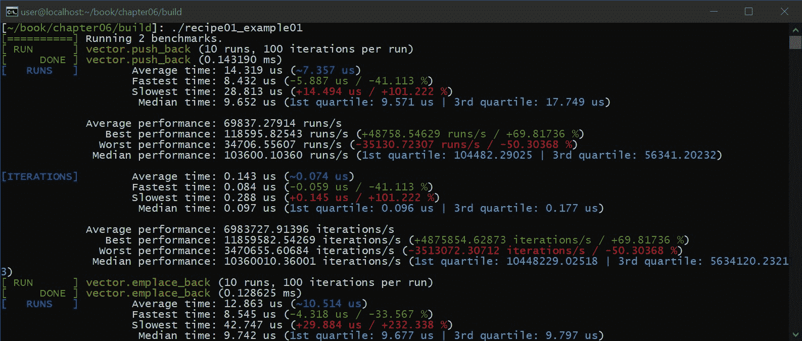

在前面的例子中，我们使用 Hayai 库来测试使用`push_back()`和`emplace_back()`向向量添加字符串之间的性能差异。`push_back()`和`emplace_back()`的区别在于`push_back()`创建对象，然后将其复制或移动到矢量中，而`emplace_back()`在矢量本身中创建对象，不需要临时对象和后续的复制/移动。也就是说，如果使用`push_back()`，必须构建一个对象，然后要么复制，要么移动到向量中。如果使用`emplace_back()`，对象构造简单。不出所料，`emplace_back()`的表现优于`push_back()`，这也是为什么铿锵-Tidy 等工具会尽可能推荐使用`emplace_back()`而不是`push_back()`的原因。

像 Hayai 这样的基准库使用简单，在帮助程序员优化源代码方面非常有效，并且不仅能够对速度进行基准测试，还能够对资源使用进行基准测试。这些库的问题在于它们在*单元*级别得到更好的利用，而不是在*集成*和*系统*级别；也就是说，为了测试整个可执行文件，这些库不太适合帮助程序员，因为随着测试规模的增加，它们不能很好地扩展。为了分析一个完整的可执行文件而不是一个单独的函数，像 Valgrind 这样的工具是存在的，它们可以帮助您分析在优化方面哪些函数最需要关注。从那里，可以使用基准测试工具来分析最需要关注的功能。

Valgrind 是一个动态分析工具，能够检测内存泄漏并跟踪程序的执行。为了看到这一点，让我们来看看下面的例子:

```cpp
volatile int data = 0;

void foo()
{
 data++ ;
}

int main(void)
{
 for (auto i = 0; i < 100000; i++) {
 foo();
 }
}
```

在前面的例子中，我们从名为`foo()`的函数中增加一个全局变量(标记为 volatile，以确保编译器不会优化掉该变量)，然后执行该函数`100,000`次。要分析这个例子，运行以下命令(使用`callgrind`输出每个函数在程序中被调用的次数):

```cpp
> valgrind --tool=callgrind ./recipe01_example02
> callgrind_annotate callgrind.out.*
```

这将产生以下输出:


如我们所见，`foo()`函数列在前一个输出的顶部附近(动态链接器的`_dl_lookup_symbol_x()`函数被调用最多，用于在执行前链接程序)。需要注意的是，程序将`foo()`功能的指令总数列为`800,000`(在左侧)。这是由于`foo()`功能是`8`装配指令长并且被执行`100,000`次。例如，让我们看看使用`objdump`的`foo()`函数的汇编(一种能够输出可执行文件的编译汇编的工具)，如下所示:


使用 Valgrind，可以对可执行文件进行分析，以确定哪些函数执行时间最长。比如我们来看看`ls`:

```cpp
> valgrind --tool=callgrind ls
> callgrind_annotate callgrind.out.*
```

这将产生以下输出:

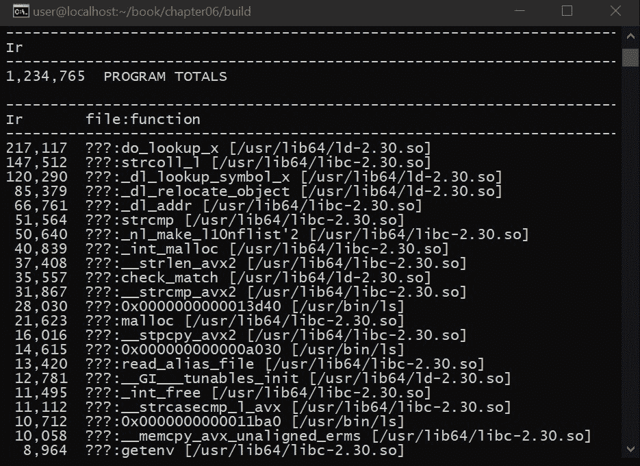

我们可以看到，`strcmp`函数被调用了很多。这些信息可以与*单元*级别的基准应用编程接口相结合，以确定是否可以编写更快版本的`strcmp`(例如，使用手写汇编和特殊的中央处理器指令)。使用 Hayai 和 Valgrind 等工具，可以隔离出程序中哪些函数消耗了最多的 CPU、内存甚至电源，并重写它们以提供更好的性能，同时将精力集中在将提供最佳投资回报的优化上。

# 查看汇编代码

在本食谱中，我们将看看两种不同优化的结果程序集:循环展开和按引用传递参数。这个食谱很重要，因为它将教你如何更深入地研究编译器如何将 C++ 转换成可执行代码。这些信息将阐明为什么 C++ 规范(如 C++ 核心指南)会提出关于优化和性能的建议。当您试图编写更好的 C++ 代码时，这通常是至关重要的，尤其是当您想要优化它时。

# 准备好

开始之前，请确保满足所有技术要求，包括安装 Ubuntu 18.04 或更高版本，并在终端窗口中运行以下内容:

```cpp
> sudo apt-get install build-essential git cmake
```

这将确保您的操作系统拥有适当的工具来编译和执行本食谱中的示例。完成后，打开一个新的终端。我们将使用这个终端来下载、编译和运行我们的示例。

# 怎么做...

执行以下步骤完成该配方:

1.  从新的终端，运行以下命令下载源代码:

```cpp
> cd ~/
> git clone https://github.com/PacktPublishing/Advanced-CPP-CookBook.git
> cd Advanced-CPP-CookBook/chapter06
```

2.  要编译源代码，请运行以下命令:

```cpp
> cmake -DCMAKE_BUILD_TYPE=Debug .
> make recipe02_examples
```

3.  编译完源代码后，您可以通过运行以下命令来执行该配方中的每个示例:

```cpp
> ./recipe02_example01

> ./recipe02_example02

> ./recipe02_example03

> ./recipe02_example04

> ./recipe02_example05
```

在下一节中，我们将逐一介绍这些示例，并解释每个示例程序的功能以及它与本食谱中所教授的课程之间的关系。

# 它是如何工作的...

学习如何优化 C++ 代码的最好方法之一是学习如何分析编译器在编译后生成的结果汇编代码。在这个食谱中，我们将通过观察两个不同的例子来了解这个分析是如何完成的:循环展开和通过引用传递参数。

在我们看这些例子之前，让我们看一个简单的例子:

```cpp
int main(void)
{ }
```

在前面的例子中，我们只有一个`main()`函数。我们没有包含任何 C 或 C++ 库，`main()`函数本身是空的。如果我们编译这个例子，我们会看到生成的二进制文件仍然很大:


在这种情况下，示例的大小为`22kb`。为了显示编译器为此代码生成的结果程序集，我们可以执行以下操作:

```cpp
> objdump -d recipe02_example01
```

前面命令的结果输出应该会令人惊讶，因为应用中有很多代码什么都不做。

为了更好地了解代码的真实数量，我们可以使用`grep`来细化输出，这是一个允许我们从任何命令中过滤文本的工具。让我们看看代码中的所有函数:

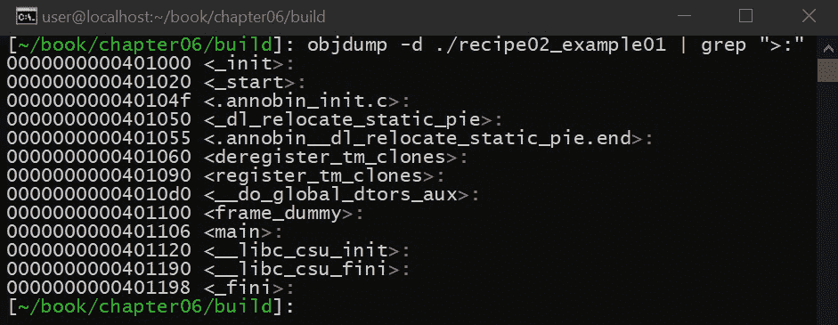

正如我们所看到的，编译器会自动为您在代码中添加几个函数。这包括`_init()`、`_fini()`和`_start()`功能。我们也可以看一个特定的函数，比如我们的主函数，如下所示:


在前面的例子中，我们在`objdump`的输出中搜索`main>:`和`RETQ`。所有函数名都以`>:`结尾，每个函数的最后一条指令(通常)是英特尔 64 位系统上的`RETQ`。

以下是生成的程序集:

```cpp
  401106: push %rbp
  401107: mov %rsp,%rbp
```

首先，它将当前堆栈帧指针(`rbp`)存储到堆栈中，并为`main()`函数加载带有堆栈当前地址(`rsp`)的堆栈帧指针。

这可以在每个函数中看到，称为函数的序言。`main()`执行的唯一代码是`return 0`，由编译器自动添加到代码中:

```cpp
  40110a: mov $0x0,%eax
```

最后，这个函数中的最后一个程序集包含函数的 epilog，它恢复堆栈帧指针并返回:

```cpp

  40110f: pop %rbp
  401110: retq
```

现在，我们已经更好地理解了如何获取和读取编译后的 C++ 的结果程序集，让我们来看一个循环展开的示例，这是用没有循环的指令的等效版本替换指令循环的过程。为此，请使用以下命令进行配置，确保在发布模式下编译示例(即启用编译器优化):

```cpp
> cmake -DCMAKE_BUILD_TYPE=Release .
> make
```

为了理解循环展开，让我们看看下面的代码:

```cpp
volatile int data[1000];

int main(void)
{
    for (auto i = 0U; i < 1000; i++) {
        data[i] = 42;
    }
}
```

当编译器遇到循环时，它生成的结果程序集包含以下代码:


让我们把它分解一下:

```cpp
  401020: xor %eax,%eax
  401022: nopw 0x0(%rax,%rax,1)
```

前两条指令属于代码的`for (auto i = 0U;`部分。在这种情况下，`i`变量存储在`EAX`寄存器中，并使用`XOR`指令设置为`0`(英特尔的`XOR`指令比`MOV`指令更快地将寄存器设置为 0)。`NOPW`指令可以安全忽略。

接下来的几条指令是交错的，如下所示:

```cpp
  401028: mov %eax,%edx
  40102a: add $0x1,%eax
  40102d: movl $0x2a,0x404040(,%rdx,4)
```

这些指令代表`i++ ;`和`data[i] = 42;`代码。第一条指令存储`i`变量的当前值，然后在将`42`存储到由`i`索引的存储地址之前，将其递增 1。方便的是，这个结果程序集展示了一个可能的优化机会，因为编译器可以使用以下内容实现相同的功能:

```cpp
 movl $0x2a,0x404040(,%rax,4)
 add $0x1,%eax
```

前面的代码在执行`i++ `之前存储了值`42`，因此不需要以下内容:

```cpp
  mov %eax,%edx
```

有许多方法可以实现这种潜在的优化，包括使用不同的编译器或手写程序集。下一组指令执行我们的`for`循环的`i < 1000;`部分:

```cpp
  401038: cmp $0x3e8,%eax
  40103d: jne 401028 <main+0x8>
```

`CMP`指令检查`i`变量是否为`1000`，如果不是，则使用`JNE`指令跳到函数顶部继续循环。否则，剩余的代码将执行:

```cpp
  40103f: xor %eax,%eax
  401041: retq 
```

为了了解循环展开是如何工作的，让我们将循环的迭代次数从`1000`更改为`4`，如下所示:

```cpp
volatile int data[4];

int main(void)
{
    for (auto i = 0U; i < 4; i++) {
        data[i] = 42;
    }
}
```

正如我们所看到的，除了循环的迭代次数之外，代码是相同的。产生的组件如下:


我们可以看到，`CMP`和`JNE`指令缺失。现在，下面的代码被编译(*但是还有更多！*):

```cpp
    for (auto i = 0U; i < 4; i++) {
        data[i] = 42;
    }
```

编译后的代码转换为以下代码:

```cpp
        data[0] = 42;
        data[1] = 42;
        data[2] = 42;
        data[3] = 42;
```

`return 0;`显示在分配之间的装配中。这是允许的，因为函数的返回值与赋值无关(因为赋值指令从不接触`RAX`，这为 CPU 提供了额外的优化(因为它可以并行执行`return 0;`，尽管这是本书范围之外的话题)。应该注意的是，循环展开不需要使用少量的循环迭代。一些编译器会部分展开一个循环来实现优化(例如，一次以`4`而不是`1`为组执行循环)。

我们的最后一个示例将关注按引用传递，而不是按值传递。要启动，请在调试模式下重新编译代码:

```cpp
> cmake -DCMAKE_BUILD_TYPE=Debug .
> make
```

让我们看看下面的例子:

```cpp
struct mydata {
    int data[100];
};

void foo(mydata d)
{
    (void) d;
}

int main(void)
{
    mydata d;
    foo(d);
}
```

在这个例子中，我们创建了一个大的结构，并通过值传递给我们主函数中名为`foo()`的函数。主要功能的结果组合如下:

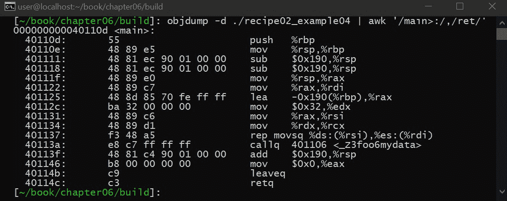

上例中的重要说明如下:

```cpp
  401137: rep movsq %ds:(%rsi),%es:(%rdi)
  40113a: callq 401106 <_Z3foo6mydata>
```

前面的指令将大结构复制到堆栈中，然后调用我们的`foo()`函数。发生复制是因为结构是通过值传递的，这意味着编译器必须执行复制。另外，如果您希望看到可读格式而不是损坏格式的输出，请在选项中添加`C`，如下所示:

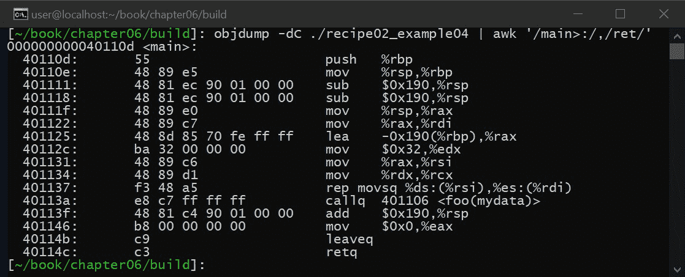

最后，让我们通过引用来看看由此带来的改进:

```cpp
struct mydata {
    int data[100];
};

void foo(mydata &d)
{
    (void) d;
}

int main(void)
{
    mydata d;
    foo(d);
}
```

正如我们所看到的，我们通过引用而不是通过值来传递结构。产生的组件如下:


在这里，代码少得多，导致执行速度更快。正如我们所了解到的，如果我们希望了解编译器正在产生什么，检查编译器产生什么是有效的，因为这提供了更多关于您可以进行哪些潜在更改来编写更高效的 C++ 代码的信息。

# 减少内存分配的数量

当应用运行时，隐藏内存分配一直由 C++ 产生。这个食谱将教你如何确定 C++ 何时分配内存，以及如何在可能的情况下移除这些分配。了解如何移除内存分配很重要，因为像`new()`、`delete()`、`malloc()`和`free()`这样的函数不仅速度慢，而且它们提供的内存也是有限的。删除不需要的分配不仅可以提高应用的整体性能，还有助于降低其整体内存需求。

# 准备好

开始之前，请确保满足所有技术要求，包括安装 Ubuntu 18.04 或更高版本，并在终端窗口中运行以下内容:

```cpp
> sudo apt-get install build-essential git valgrind cmake
```

这将确保您的操作系统拥有适当的工具来编译和执行本食谱中的示例。完成后，打开一个新的终端。我们将使用这个终端来下载、编译和运行我们的示例。

# 怎么做...

执行以下步骤完成该配方:

1.  从新的终端，运行以下命令下载源代码:

```cpp
> cd ~/
> git clone https://github.com/PacktPublishing/Advanced-CPP-CookBook.git
> cd Advanced-CPP-CookBook/chapter06
```

2.  要编译源代码，请运行以下命令:

```cpp
> cmake .
> make recipe03_examples
```

3.  编译完源代码后，您可以通过运行以下命令来执行该配方中的每个示例:

```cpp
> ./recipe03_example01

> ./recipe03_example02

> ./recipe03_example03

> ./recipe03_example04

> ./recipe03_example05

> ./recipe03_example06

> ./recipe03_example07
```

在下一节中，我们将逐一介绍这些示例，并解释每个示例程序的功能以及它与本食谱中所教授的课程之间的关系。

# 它是如何工作的...

在这个食谱中，我们将学习如何监控一个应用消耗了多少内存，以及 C++ 在幕后分配内存的不同方式。首先，让我们看一个简单的应用，它什么也不做:

```cpp
int main(void)
{
}
```

正如我们所看到的，这个应用什么也不做。要查看应用使用了多少内存，我们将使用动态分析工具 Valgrind，如下所示:

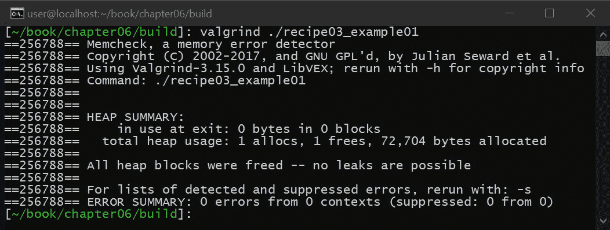

如上例所示，我们的应用已经分配了堆内存(即使用`new()` / `delete()`或`malloc()` / `free()`分配的内存)。为了确定这个分配发生在哪里，让我们再次使用 Valgrind，但是这一次，我们将启用一个名为 **Massif** 的工具，它将跟踪内存分配来自哪里:


要查看前面示例的输出，我们必须输出一个自动为我们创建的文件:

```cpp
> cat massif.out.*
```

这导致我们检索以下输出:

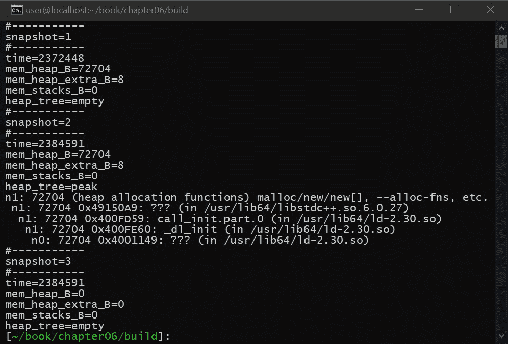

我们可以看到，动态链接器的`init()`函数正在执行分配，大小为`72,704`字节。为了进一步演示如何使用 Valgrind，让我们看一下这个简单的例子，在这里我们执行自己的分配:

```cpp
int main(void)
{
    auto ptr = new int;
    delete ptr;
}
```

要查看前面源代码的内存分配，我们需要再次运行 Valgrind:

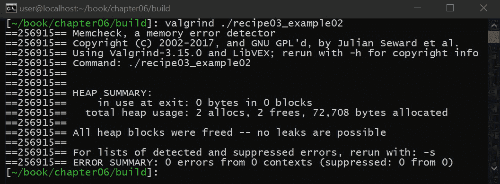

可以看到，我们已经分配了`72,708`字节。因为我们知道应用会自动为我们分配`72,704`字节，所以我们可以看到 Valgrind 已经成功检测到我们分配的`4`字节(在运行 Linux 的英特尔 64 位系统上的整数大小)。要了解这种分配发生在哪里，让我们再次使用 Massif:


正如我们所看到的，我们已经将`--threshold=0.1`添加到命令行选项中，因为这告诉 Valgrind，任何构成`.1%`分配的分配都应该被记录。让我们来看看结果(T3 程序只是将文件的内容回显到控制台):

```cpp
> cat massif.out.*
```

通过这样做，我们得到以下输出:

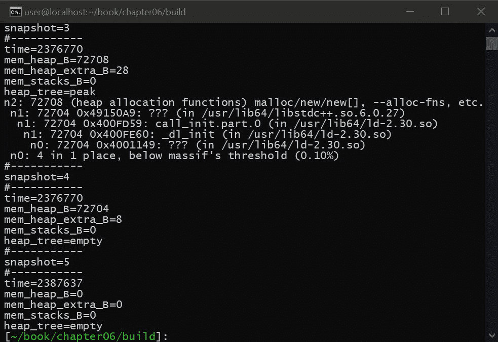

正如我们所看到的，Valgrind 已经检测到了来自`init()`函数以及我们的`main()`函数的内存分配。

现在，我们已经知道如何分析我们的应用进行的内存分配，让我们看看一些不同的 c++ API，看看它们在幕后进行什么类型的内存分配。首先，我们来看一个`std::vector`，如下:

```cpp
#include <vector>
std::vector<int> data;

int main(void)
{
    for (auto i = 0; i < 10000; i++) {
        data.push_back(i);
    }
}
```

这里，我们创建了一个整数的全局向量，然后将`10,000`个整数添加到向量中。使用 Valgrind，我们得到以下输出:

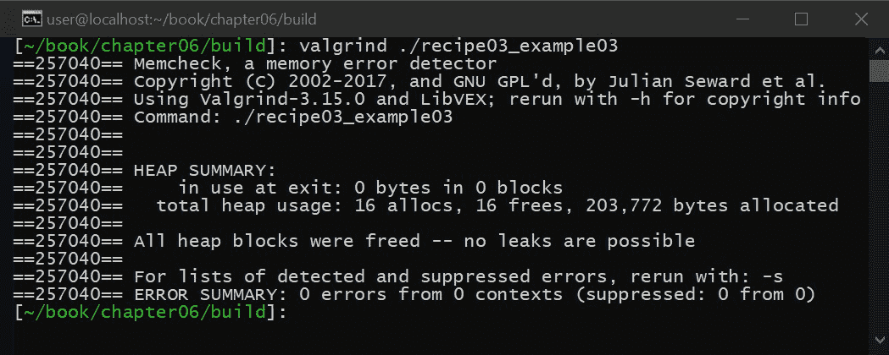

在这里，我们可以看到 16 个分配，总共有`203,772`字节。我们知道应用将为我们分配`72,704`字节，所以我们必须从总数中删除它，为我们留下`131,068`字节的内存。我们也知道我们分配了`10,000`整数，总共是`40,000`字节。那么，问题是，其他`91,068`字节是从哪里来的呢？

答案在于`std::vector`是如何在引擎盖下运作的。`std::vector`必须确保始终连续查看内存，这意味着当发生插入并且`std::vector`空间不足时，它必须分配一个新的、更大的缓冲区，然后将旧缓冲区的内容复制到新缓冲区中。问题是`std::vector`不知道当所有插入完成时缓冲区的总大小是多少，所以当执行第一次插入时，它会创建一个小缓冲区以确保不会浪费内存，然后随着向量的增长以小增量增加`std::vector`的大小，从而导致几个内存分配和内存副本。

为了防止这种分配的发生，C++ 提供了`reserve()`函数，该函数为用户提供了一个`std::vector`来估计用户认为他们需要多少内存。例如，考虑以下代码:

```cpp
#include <vector>
std::vector<int> data;

int main(void)
{
    data.reserve(10000);  // <--- added optimization 

    for (auto i = 0; i < 10000; i++) {
        data.push_back(i);
    }
}
```

上一个例子中的代码和上一个例子中的一样，不同的是我们增加了对`reserve()`函数的调用，它告诉`std::vector`我们认为向量会有多大。Valgrind 的输出如下:


我们可以看到，应用分配了`112,704`字节。如果我们移除应用默认创建的`72,704`字节，我们将剩下`40,000`字节，这是我们期望的确切大小(因为我们将`10,000`整数添加到向量中，每个整数都是`4`字节大小)。

数据结构不是执行隐藏分配的唯一类型的 C++ 标准库 API。我们来看一个`std::any`，如下:

```cpp
#include <any>
#include <string>

std::any data;

int main(void)
{
    data = 42;
    data = std::string{"The answer is: 42"};
}
```

在这个例子中，我们创建了一个`std::any`并给它分配了一个整数和一个`std::string`。让我们看看 Valgrind 的输出:


我们可以看到，`3`分配发生了。第一次分配默认发生，第二次分配由`std::string`产生。最后一次分配由`std::any`产生。出现这种情况是因为`std::any`必须调整其内部存储，以考虑其看到的任何新的随机数据类型。换句话说，为了处理一个*通用*数据类型，C++ 必须执行一个分配。如果我们不断改变数据类型，情况会变得更糟。例如，考虑以下代码:

```cpp
#include <any>
#include <string>

std::any data;

int main(void)
{
    data = 42;
    data = std::string{"The answer is: 42"};
    data = 42;                                 // <--- keep swapping
    data = std::string{"The answer is: 42"};   // <--- keep swapping
    data = 42;                                 // <--- keep swapping
    data = std::string{"The answer is: 42"};   // ...
    data = 42;
    data = std::string{"The answer is: 42"};
}
```

前面的代码与前面的示例相同，唯一的区别是我们在数据类型之间进行了交换。Valgrind 产生以下输出:

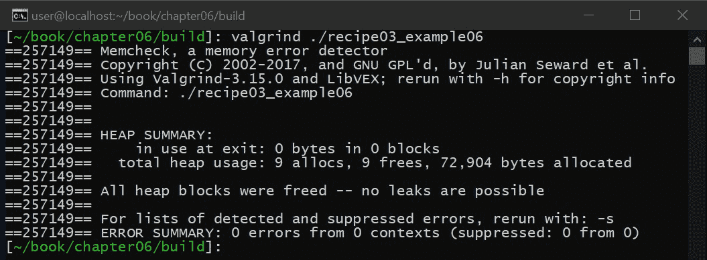

如我们所见，`9`分配代替`3`发生。要解决这个问题，我们需要用一个`std::variant`代替`std::any`，如下:

```cpp
#include <variant>
#include <string>

std::variant<int, std::string> data;

int main(void)
{
    data = 42;
    data = std::string{"The answer is: 42"};
}
```

`std::any`和`std::variant`的区别在于`std::variant`要求用户说明变量必须支持哪些类型，从而消除了分配时动态内存分配的需要。Valgrind 的输出如下:


现在，我们只有`2`分配，正如预期的那样(默认分配和来自`std::string`的分配)。如本食谱所示，包括 C++ 标准库在内的库可以隐藏内存分配，这可能会降低代码的速度，并使用比预期更多的内存资源。像 Valgrind 这样的工具可以用来识别这些类型的问题，允许您创建更高效的 C++ 代码。

# 声明 noexcept

C++ 11 引入了`noexcept`关键字，除了简化异常的一般使用方式之外，它还包括一个更好的 C++ 异常实现，该实现消除了异常的一些性能影响。然而，这并不意味着例外情况不包括*开销*(即绩效处罚)。在本食谱中，我们将探讨异常如何增加应用的开销，以及`noexcept`关键字如何帮助减少这些损失(取决于编译器)。

这个方法很重要，因为它将证明如果一个函数没有抛出异常，那么它应该被标记为异常，以防止关于应用总大小的额外开销，导致应用加载更快。

# 准备好

开始之前，请确保满足所有技术要求，包括安装 Ubuntu 18.04 或更高版本，并在终端窗口中运行以下内容:

```cpp
> sudo apt-get install build-essential git cmake
```

这将确保您的操作系统拥有适当的工具来编译和执行本食谱中的示例。完成后，打开一个新的终端。我们将使用这个终端来下载、编译和运行我们的示例。

# 怎么做...

执行以下步骤完成该配方:

1.  从新的终端，运行以下命令下载源代码:

```cpp
> cd ~/
> git clone https://github.com/PacktPublishing/Advanced-CPP-CookBook.git
> cd Advanced-CPP-CookBook/chapter06
```

2.  要编译源代码，请运行以下命令:

```cpp
> cmake .
> make recipe04_examples
```

3.  编译完源代码后，您可以通过运行以下命令来执行该配方中的每个示例:

```cpp
> ./recipe04_example01 

> ./recipe04_example02
```

在下一节中，我们将逐一介绍这些示例，并解释每个示例程序的功能以及它与本食谱中所教授的课程之间的关系。

# 它是如何工作的...

在这个食谱中，我们将了解为什么如果一个函数不应该抛出异常，那么将它标记为`noexcept`是如此重要。这是因为它为应用消除了额外的异常支持开销，这可以改善执行时间、应用大小甚至加载时间(这取决于编译器、您使用的标准库等等)。为了展示这一点，让我们创建一个简单的例子:

```cpp
class myclass
{
    int answer;

public:
    ~myclass()
    {
        answer = 42;
    }
};
```

我们需要做的第一件事是创建一个类，在析构时设置一个`private`成员变量，如下所示:

```cpp
void foo()
{
    throw 42;
}

int main(void) 
{
    myclass c;

    try {
        foo();
    }
    catch (...) {
    }
}
```

现在，我们可以创建两个函数。第一个函数抛出一个异常，而第二个函数是我们的主函数。这个函数创建了我们类的一个实例，并在一个`try` / `catch`块中调用`foo()`函数。换句话说，`main()`函数在任何时候都不会抛出异常。如果我们查看主函数的程序集，我们将看到以下内容:

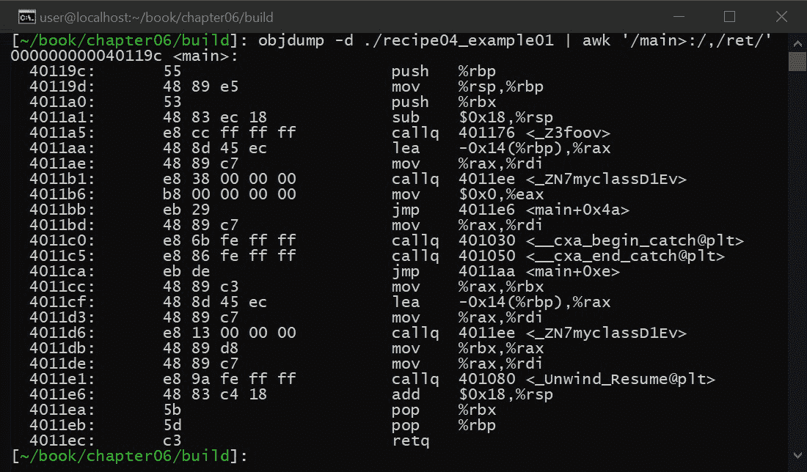

如我们所见，我们的主函数调用`_Unwind_Resume`，由异常解卷器使用。这种额外的逻辑是由于 C++ 必须在函数的末尾添加额外的异常逻辑。要删除这个额外的逻辑，告诉编译器`main()`函数没有被抛出:

```cpp
int main(void) noexcept
{
    myclass c;

    try {
        foo();
    }
    catch (...) {
    }
}
```

添加`noexcept`告诉编译器不能抛出异常。因此，该函数不再包含用于处理异常的额外逻辑，如下所示:

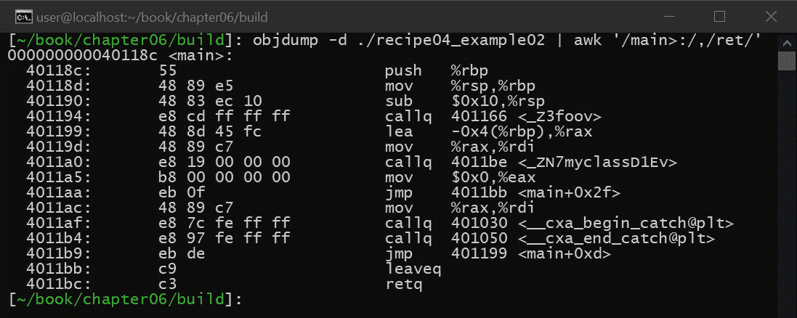

如我们所见，展开功能不再存在。需要注意的是，存在对 catch 函数的调用，这是由于`try` / `catch`块，而不是异常的开销。