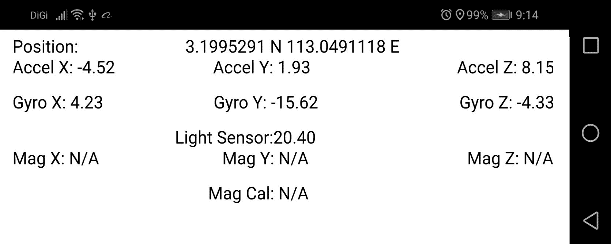
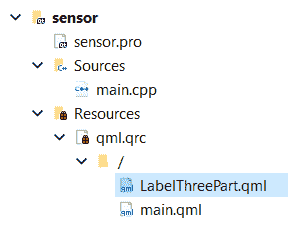
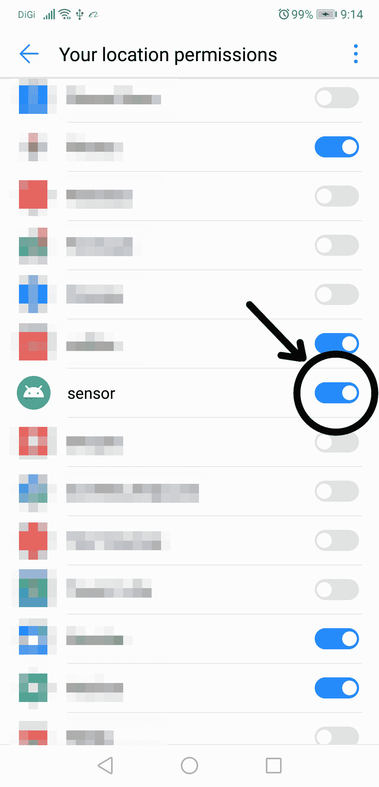
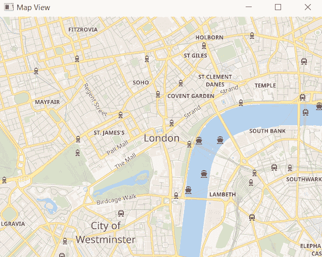
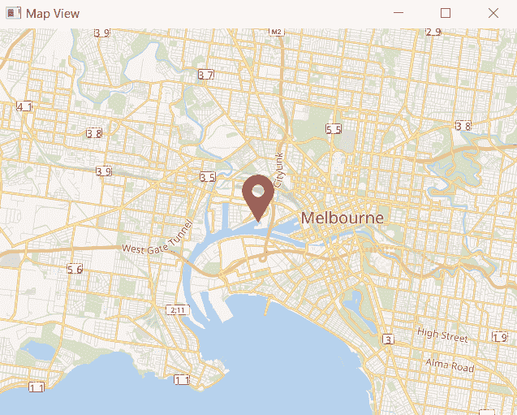
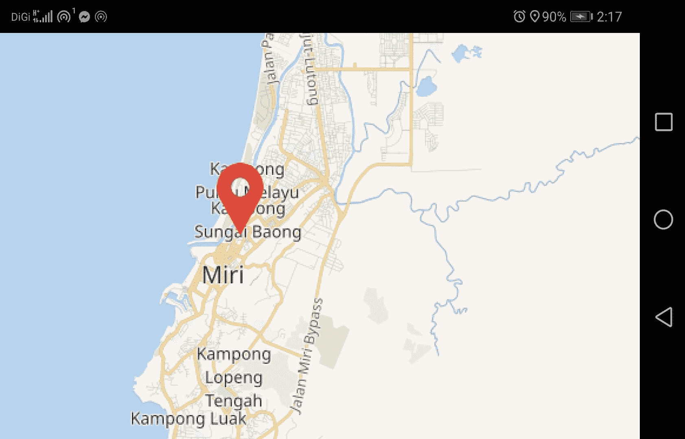

# 九、传感器和 Qt Quick

今天的任何设备都带有无数的传感器，包括一种确定设备位置和方向的方法，以及通过温度计、发光传感器、加速计、陀螺仪和其他传感器测量其周围环境特征的方法。 手机和其他便携式设备尤其如此。 要了解我们移动设备中所有可用的传感器的更多信息，请阅读该文章：[https://gizmodo.com/all-the-sensors-in-your-smartphone-and-how-they-work-1797121002](https://gizmodo.com/all-the-sensors-in-your-smartphone-and-how-they-work-1797121002)。

在本章中，我们将看看 Qt 的传感器和定位框架，因为它们在 QML 中是受支持的。 你将学习如何确定设备在地球表面的位置，以及如何测量其机载传感器报告的环境的其他特征。

在本章中，我们将介绍以下主题：

*   访问 Qt 中的传感器
*   确定设备位置
*   获取设备的位置
*   在地图视图上放置位置标记
*   在 C++ 中访问传感器

# 技术要求

本章的技术要求如下：

*   Qt 5.12.3 arm64-v8a
*   Qt Creator 4.9.0
*   Windows 10

# 访问 Qt 中的传感器

从 Qt Mobility 库开始，Qt 已经为设备传感器提供了一个强大的移植层已有数年之久，该库旨在促进手机软件的开发。 随着 Qt 的不断发展，Qt Quick 增加了对传感器的支持，支持的传感器列表也在增加。 目前，Qt 支持以下传感器：

*   通过`Accelerometer`型支持加速度计。
*   高度计通过`Altimeter`类型支持。
*   通过`AmbientLightSensor`和`LightSensor`类型支持环境光传感器。
*   通过`AmbientTemperatureSensor`类型支持环境温度传感器。
*   指南针通过`Compass`类型被支持。
*   陀螺仪通过`Gyroscope`型支撑。
*   设备是否在皮套中是通过类型`Holster`来确定的。
*   与设备屏幕的接近程度通过`IRProximitySensor`和`ProximitySensor`类型确定。
*   通过`Magnetometer`类型支持环境磁场。
*   通过`OrientationSensor`类型支持设备的方向。
*   通过`RotationSensor`类型支持设备旋转。
*   通过`TapSensor`类型支持设备外壳在其*x*、*y*和*z*轴上轻敲的方式。
*   通过`TiltSensor`类型报告设备的倾斜情况。

这些类型中的每一个都有包含读数的相应类型；例如，`Accelerometer`类型通过`AccelerometerReading`类型报告其当前值。

要访问传感器库，必须将关键字`sensors`添加到`.pro`文件，如下所示：

```cpp
QT += quick sensors
```

使用所有这些类型所遵循的模式本质上是相同的：导入`QtSensors`模块、实例化传感器、激活或停用传感器，然后将脚本连接到其`readingChanged`插槽。 例如，要从加速度计读取数据，您需要编写以下代码：

```cpp
import QtQuick 2.12 
import QtQuick.Window 2.12 
import QtSensors 5.12 
Window { 
    visible: true 
    width: 360 
    height: 360 

    Accelerometer { 
        id: accel 
        dataRate: 100 
        active: true 

        onReadingChanged: { 
            // print out the x, y, and z values from accelerometer
            console.log(x + "," + y + "," + z);
        } 
    } 
} 
```

传感器有三个您需要了解的关键属性：

*   `dataRate`：这表示传感器的采样速率(以毫秒为单位)。
*   `active`：这表示应用是否应该采样传感器(由`true`的值表示)。
*   `onReadingChanged`：它包含处理传感器读数的脚本，该脚本通过访问您提供的脚本中的`reading`变量获得。

每个传感器根据其用途返回不同类型的读数；对于此加速度计传感器，它为我们提供一组三维读数，即`x`、`y`和`z`。

重要的是要认识到，尽管 Qt 有针对所有这些传感器的接口，但并不是每个平台都支持所有这些传感器，甚至在特定平台(比如 Android)上，不同的设备可能有不同的传感器。 例如，在 Qt 5.3 中，Qt 支持加速度计、环境温度传感器、陀螺仪、光传感器、磁力计、接近传感器和旋转传感器，但不支持任何其他传感器。 此外，并不是每台安卓设备都有这些传感器；我的安卓平板电脑没有磁力计。 在设计应用时，您需要考虑这两个事实：目标的 Qt 端口层支持哪些传感器，以及目标受众实际拥有的硬件上的传感器类型。 显示 Qt 支持的平台提供在[http://qt-project.org/doc/qt-5/compatmap.html](http://qt-project.org/doc/qt-5/compatmap.html)上可用的传感器的矩阵。

正如我们将在[的第 12 章](12.html)，*使用 Qt Creator*开发移动应用中了解到的，传感器消耗电池电量，因此您的应用应该明智地使用它们。 当您需要通过设置 Active 属性进行测量时，将其打开，并在完成测量时将其关闭。

在本节中，我们学习了如何从手机上的加速度计读取数据。 接下来，我们将了解如何通过读取 GPS 传感器的数据来确定设备的位置。

# 确定设备位置

许多设备支持位置确定，或者通过诸如**全球定位系统**(**GPS**)接收器之类的硬件或者通过诸如**网际协议**(**IP**)地理位置之类的网络资源来支持位置确定。 与其他传感器支持类似，此功能是在 Qt 4.x 中通过 Qt Mobility 模块引入 Qt 的，现在通过 Qt 定位模块提供支持。 它在许多移动设备上都受支持，包括 Android。

要使用 Qt 定位模块，您需要在`.pro`文件中包含关键字`positioning`，如下所示：

```cpp
QT += quick network positioning 
```

Qt 定位模块提供了三种定位方式，您可以通过导入`QtPositioning`模块来访问：

*   `PositionSource`：它以指定的速率提供位置更新，当位置更新可用时发出`positionChanged`信号。
*   `Position`：在分配给`positionChanged`信号的槽中，您将收到一个`Position`实例。
*   `Coordinate`：`Position`实例具有指定设备位置的`Coordinate`属性。

`PositionSource`类型具有以下属性：

*   `active`：如果为真，则向系统指示应激活定位系统，并将设备定位读数返回给您的应用。
*   `name`：表示当前报告设备位置的定位插件的唯一名称。
*   `preferredPositioningMethods`：这表示您的应用的定位首选项。 首选的定位方法可以是以下方法之一：
    *   `PositionSource.NoPositioningMethods`：这表示没有首选的定位方法。
    *   `PositionSource.SatellitePositioningMethods`：这表明应首选基于卫星的方法，如全球定位系统。
    *   `PositionSource.NonSatellitePositioningMethods`：这表明应首选 IP 地理定位等非卫星方法。
    *   `PositionSource.AllPositioningMethods`：表示可以接受任何定位方式：
        *   `sourceError`：它保存上次使用`PositionSource`方法出现的错误。
        *   `supportedPositioningMethods`：表示支持的可用定位方法。
        *   `updateInterval`：此参数指定所需的更新间隔(以毫秒为单位)。
        *   `valid`：指定定位系统是否已获得有效的后端插件来提供数据。

下面是`PositionSource`的简单用法：

```cpp
PositionSource {
    id: src
    updateInterval: 1000
    active: true

    onPositionChanged: {
        var coord = src.position.coordinate;
        position.text =
                Math.abs(coord.latitude) + (coord.latitude < 0 ? " S " 
                  : " N " ) + Math.abs(coord.longitude) +
                  (coord.longitude < 0 ? " W " : " E " );
    }
}
```

您可以通过调用`start`方法在`PositionSource`上开始定位，通过调用它的`stop`方法停止更新。 除了这样做之外，您还可以通过调用它的`update`方法来请求一次定位报告。

`Position`类型有许多可用于封装设备位置的属性。 这些资料如下：

*   `altitudeValid`：这表示高度读数是否有效。
*   `coordinate`：它包含一个包含纬度、经度和海拔的坐标。
*   `directionValid`：表示方向是否有效。
*   `horizontalAccuracy`：表示报告位置的水平精度程度。
*   `horizontalAccuracyValid`：表示水平精度是否有效。
*   `latitudeValid`和`longitudeValid`：表示纬度和经度是否有效。
*   `speed`：这表示设备的速度。
*   `speedValid`：表示设备的速度是否有效。
*   `timestamp`：这表示测量的时间。
*   `verticalAccuracy`：表示测量的垂直精度。
*   `verticalAccuracyValid`：表示垂直精度是否有效。
*   `verticalSpeed`：表示设备的垂直速度。
*   `verticalSpeedValid`：表示垂直速度是否有效。

所有距离和速度都以公制表示，而纬度和经度则以十进制度表示。 这是通过 WGS-84 基准完成的。

除了提供设备的纬度、经度和海拔高度外，`Coordinate`类型还提供了`distanceTo`和`azimuthTo`方法，使您可以计算两个`Coordinate`实例之间的距离或从一个`Coordinate`实例到另一个实例的方向角。 它还提供了`atDistanceAndAzimuth`方法，用于在从坐标的纬度和经度以特定方位移动特定距离时计算目标点。 这些方法是地图制图中使用的所谓**大地正演问题**和**反大地测量问题**的解决方案。 请转到[http://www.ngs.noaa.gov/TOOLS/Inv_Fwd/Inv_Fwd.html](http://www.ngs.noaa.gov/TOOLS/Inv_Fwd/Inv_Fwd.html)了解如何计算这些参数的详细信息。

下面的代码显示了`PositionSource`类型的用法示例。 但首先，让我们创建一个窗口和一些文本对象：

```cpp
import QtQuick 2.12
import QtQuick.Window 2.12
import QtPositioning 5.12

Window {
    visible: true
    width: 360
    height: 360

    Text {
        id: positionLabel
        text: qsTr("Position:")
        anchors.top: parent.top
        anchors.left: parent.left
    }

    Text {
        id: position
        text: qsTr("Hello World")
        anchors.horizontalCenter: parent.horizontalCenter
        anchors.top: parent.top
    }
```

之后，我们实现`PositionSource`对象，它向我们提供来自 GPS 传感器的数据：

```cpp
    PositionSource {
        id: src
        updateInterval: 1000
        active: true

        onPositionChanged: {
            var coord = src.position.coordinate;
            position.text =
                    Math.abs(coord.latitude) + (coord.latitude < 0 ? " 
                      S " : " N " ) +
                    Math.abs(coord.longitude) + (coord.longitude < 0 ? 
                       " W " : " E " );
        }
    }
}
```

在这里，`PositionSource`类型在应用启动时处于活动状态，并且每秒更新一次。 当它接收到位置报告时，它会发出一个`positionChanged`信号，该信号会触发`onPositionChanged`脚本。 这将从该位置获取坐标，并对其进行格式化，以便在`position`文本字段中显示。

Like other device sensors, obtaining position reports uses additional battery power over normal program execution. Generally, your application should only determine the device's position when it actually needs it, such as before submitting the position to a service in order to determine nearby points of interest or to tag the user's location in some way. In general, you should not run the positioning system all the time (unless you're building an application that needs it, such as a turn-by-turn navigation application), because doing so can greatly diminish battery life.

在前面的示例中，我们了解了如何获取设备的 GPS 位置。 接下来，我们将深入研究我们的设备上可用的其他各种传感器，以及如何从它们获取各自的数据。

# 获取设备的位置

让我们继续看一个简单的示例，它返回设备的位置、加速计、陀螺仪、环境光和磁力计读数。 下面是我们的应用在华为手机上运行时的样子：



请注意，我的华为手机没有磁力计，所以这些读数没有更新。 让我们看看这是如何工作的：

1.  首先，我们需要确保在`.pro`文件中包含定位和传感器模块(如果没有，应用将编译，但无法启动)：

```cpp
QT += quick positioning sensors 
```

2.  接下来，我们将继续讨论 QML 本身。 这很长，但很简单。 首先，我们将必要的模块添加到我们的项目中；然后，我们为我们的程序定义`Window`对象：

```cpp
import QtQuick 2.12
import QtQuick.Window 2.12
import QtPositioning 5.12
import QtSensors 5.12

Window {
    visible: true
    width: 360
    height: 360
```

3.  之后，我们创建一些`Text`对象来显示静态文本：

```cpp
    Text {
        id: positionLabel
        text: qsTr("Position:")
        anchors.top: parent.top
        anchors.left: parent.left
        color: position.valid ? "red" : "black"
    }

    Text {
        id: position
        text: qsTr("Hello World")
        anchors.horizontalCenter: parent.horizontalCenter
        anchors.top: parent.top
    }
```

4.  然后，我们创建一个`PositionSource`对象和一个`Accelerometer`对象来从定位传感器和加速度计传感器获取数据，如下所示：

```cpp
    PositionSource {
        id: src
        updateInterval: 1000
        active: true

        onPositionChanged: {
            var coord = src.position.coordinate;
            position.text =
                    Math.abs(coord.latitude) + (coord.latitude < 0 ? " S " : " N " ) +
                    Math.abs(coord.longitude) + (coord.longitude < 0 ? " W " : " E " );
        }
    }

    LabelThreePart {
        id: accelerometerReading
        label: "Accel"
        anchors.top: position.bottom
        anchors.horizontalCenter: parent.horizontalCenter
    }

    Accelerometer {
        id: accel
        dataRate: 100
        active:true

        onReadingChanged: {
            accelerometerReading.xValue = (reading.x).toFixed(2);
            accelerometerReading.yValue = (reading.y).toFixed(2);
            accelerometerReading.zValue = (reading.z).toFixed(2);
        }
    }

    LabelThreePart {
        id: gyroscopeReading
        label: "Gyro"
        anchors.top: accelerometerReading.bottom
        anchors.horizontalCenter: parent.horizontalCenter
    }
```

5.  紧接着，我们创建了一个`Gyroscope`旋转对象、一个旋转`LightSensor`旋转对象和一个旋转`Magnetometer`旋转对象，以从各自的传感器获得旋转运动、光敏感度和方向数据。 请考虑以下代码：

```cpp

    Gyroscope {
        id: gyroscope
        dataRate: 100
        active: true

        onReadingChanged: {
            gyroscopeReading.xValue = (reading.x).toFixed(2);
            gyroscopeReading.yValue = (reading.y).toFixed(2);
            gyroscopeReading.zValue = (reading.z).toFixed(2);
        }
    }

    Text {
        id: lightSensorLabel
        anchors.top: gyroscopeReading.bottom
        anchors.right: lightSensorValue.left
        text: qsTr("Light Sensor:")
    }

    Text {
        id: lightSensorValue
        anchors.top: lightSensorLabel.top
        anchors.horizontalCenter: parent.horizontalCenter
        text: "N/A"
    }

    // Light Sensor
    LightSensor {
        id: lightSensor
        dataRate: 100
        active: true

        onReadingChanged: {
            lightSensorValue.text = (reading.illuminance).
              toFixed(2);
        }
    }

    // Magnetometer
    LabelThreePart {
        id: magnetometerReading
        label: "Mag"
        anchors.top: lightSensorValue.bottom
        anchors.horizontalCenter: parent.horizontalCenter
    }

    Text {
        id: magcLabel
        anchors.right: magcValue.left
        anchors.top: magnetometerReading.bottom
        text: "Mag Cal: "
    }
    Text {
        id: magcValue
        anchors.horizontalCenter: parent.horizontalCenter
        anchors.top: magcLabel.top
        text: "N/A"
    }

    Magnetometer {
        onReadingChanged: {
            magnetometerReading.xValue = (reading.x).toFixed(2);
            magnetometerReading.yValue = (reading.y).toFixed(2);
            magnetometerReading.zValue = (reading.z).toFixed(2);
            magcValue.text = (reading.calibrationLevel).toFixed(2);
        }
    }
}
```

首先是 Position 标签和 Position 字段，如果`PositionSource`无法获得修复，则将其涂成红色；否则，它将显示为黑色。 生成此结果的代码如下所示：

```cpp
 color: position.valid ? "red" : "black"
```

接下来是剩下的传感器。 在这里，我使用了我编写的一个小`LabelThreePart`控件，如下所示：

```cpp
import QtQuick 2.12 

Rectangle { 
    property string label: "Something" 
    property alias xValue: xValue.text 
    property alias yValue: yValue.text 
    property alias zValue: zValue.text 
    width: parent.width 
    height: 32 

    Text { 
        id: xLabel 
        anchors.left: parent.left 
        anchors.top: parent.top 
        text: label + " X: " 
    } 
    Text { 
        id: xValue 
        anchors.left: xLabel.right 
        anchors.top: parent.top 
        text: "N/A" 
    }
```

我们继续将其余的`text`对象添加到我们的 QML 代码中：

```cpp
    Text { 
        id: yLabel 
        anchors.right: yValue.left 
        anchors.top: parent.top 
        text: label + " Y: " 
    } 
    Text { 
        id: yValue 
        anchors.horizontalCenter: parent.horizontalCenter 
        anchors.top: parent.top 
        text: "N/A" 
    } 
    Text { 
        id: zLabel 
        anchors.right: zValue.left 
        anchors.top: parent.top 
        text: label + " Z: " 
    } 
    Text { 
        id: zValue 
        anchors.right: parent.right 
        anchors.top: parent.top 
        text: "N/A" 
    } 
} 
```

从前面的代码中，我们可以看到这只是一个包含六个字段的矩形；它使用其`label`属性为要显示的`X`、`Y`和`Z`值创建有意义的标签，以及文本字段的属性别名(实际显示这些值)。

确保在项目中包含 LabelThreePart.qml 文件；否则，您将无法编译：



6.  在此之后，如果您正在为移动平台进行构建，还必须确保您已经启用了位置权限。 对于 Android 平台，请转到 Projects(项目)|>Build Steps(构建步骤)|创建 Android APK，然后单击 Create Templates(创建模板)按钮创建`AndroidManifest.xml`文件，然后您可以向该文件添加 android.permission.ACCESS_FINE_LOCATION 权限，然后才能访问手机的位置数据。 下面的屏幕截图显示了我们的应用所需的权限。 您可以通过从位于底部的选择框中选择所需的权限来添加更多权限。 然后，单击添加按钮继续：


对于 Android 6.0 及更高版本，您还必须在手机上启用位置权限才能正常工作。 每部手机都是不同的；对于我的手机，它位于设置|>应用和通知>|权限，如下所示：



到目前为止，我们已经了解了如何从我们的设备和传感器获取位置数据。 让我们继续学习如何通过在地图视图上放置位置标记来可视化定位数据。

# 在地图视图上放置位置标记

从 5.0 版开始，Qt 为我们提供了一个地图视图组件，可以显示地球的地图或图像，类似于谷歌地图。 由于许可问题，Qt 地图视图不支持谷歌地图。 Qt Map View 的默认平铺地图服务提供商是社区地图项目**OpenStreetMap**(**OSM**)，因为它是免费的。 除了 OSM，您还可以使用其他商业服务提供商，例如 Mapbox、ArcGIS 和 HERE。

与其他第三方地图解决方案不同，Qt 地图视图使用本地渲染引擎(由 Qt Quick 提供支持)渲染平铺地图，而不是将 Web 视图嵌入到应用中。 本机渲染可以提高性能，并使应用保持较小的大小，因为它不包含 Web 视图所需的所有不必要的资源。 然而，目前您不能使用 C++ 与地图视图交互，只能使用 QML。 我相信开发人员将在未来的版本中使其成为可能。

让我们从用 QML 编写一个非常简单的地图视图应用开始：

```cpp
import QtQuick 2.12
import QtQuick.Window 2.12

import QtLocation 5.12
import QtPositioning 5.12

Window {
    id: window
    visible: true
    width: 640
    height: 480
    title: qsTr("Map View")

    Plugin {
        id: mapPlugin
        name: "osm"
    }

    Map {
        id: map
        anchors.fill: parent
        plugin: mapPlugin
        zoomLevel: 14
        minimumZoomLevel: 6
        maximumZoomLevel: 18
        copyrightsVisible: false
        gesture.enabled: true
        gesture.acceptedGestures: MapGestureArea.PinchGesture | 
          MapGestureArea.PanGesture
    }
}
```

我们在这里添加的是`Map`对象，它显示平铺地图，旁边还有一个`Plugin`对象，它确定地图视图的服务提供者。 我们还可以定义缩放级别、最大和最小缩放级别、版权文本显示以及手势设置。 手势设置仅适用于触摸屏应用，因此我们无法在桌面上进行测试。

除此之外，我们还必须为我们的 Qt 项目包括`location`模块：

```cpp
QT += quick location positioning
```

前面的代码生成以下输出：



很简单，不是吗？ 如果您看到一个空映射，请确保您已将 OpenSSL 库文件下载到您的计算机，因为 OSM 不再接受 HTTP 请求，而只接受 HTTPS 请求。 您可以从[https://indy.fulgan.com/SSL](https://indy.fulgan.com/SSL)下载最新的 openssl 版本。 对于 Windows 用户，还请确保`libcrypto`和`libssl`DLL 文件与您的可执行文件放在一起。

如果您正在为 Android 开发应用，则必须在您的应用 APK 中包含`.so`个库，方法是在项目文件中使用以下设置：

```cpp
contains(ANDROID_TARGET_ARCH,armeabi-v7a) {
    ANDROID_EXTRA_LIBS = \
        $$PWD/android/32bit/libcrypto.so \
        $$PWD/android/32bit/libssl.so
}

contains(ANDROID_TARGET_ARCH,arm64-v8a) {
    ANDROID_EXTRA_LIBS = \
        $$PWD/android/64bit/libcrypto.so \
        $$PWD/android/64bit/libssl.so
}
```

Please make sure that you only include the 32-bit library if you are building a 32-bit application, and only include a 64-bit library if you're building a 64-bit application.

让我们来看一下以下步骤：

1.  之后，让我们创建另一个空的 QML 文件并将其命名为`marker.qml`。 我们将创建一个单独的 QML 文件，以便可以在我们的主 QML 文件或任何其他我们想要的 QML 文件中重用它。 现在我们已经创建了文件，我们可以添加以下代码来实现我们的地图标记：

```cpp
import QtQuick 2.12
import QtQuick.Controls 2.12
import QtLocation 5.12

MapQuickItem
{
    id: marker
    anchorPoint.x: 0
    anchorPoint.y: icon.height / 2

    sourceItem: Item
    {
        Image
        {
            id: icon
            source: "img/mapmarker.png"
            sourceSize.width: 120
            sourceSize.height: 120
            width: 120
            height: 120
            anchors.centerIn: parent
        }
    }
}
```

2.  接下来，我们需要在`Map`对象中添加以下代码：

```cpp
Component.onCompleted: {
    map.center = QtPositioning.coordinate(-37.8163521,144.9275631);
    map.zoomLevel = 12;

    var component = Qt.createComponent("marker.qml");
    var item = component.createObject(window, { coordinate: 
    QtPositioning.coordinate(-37.8163521,144.9275631) }); 
                                                    //Melbourne
    map.addMapItem(item);
}
```

在前面的代码中，当成功启动`Map`对象时，会调用`onCompleted`槽函数。 然后我们将地图的中心点重新定位到墨尔本的某个地方，并将其缩放级别设置为`12`。 之后，我们根据上一步中创建的`marker.qml`文件创建一个新组件，并将其放置在地图中心点所在的相同坐标上。

3.  再次运行该程序。 现在，您应该看到如下所示：



请注意，您需要将标记图像文件添加到项目资源中；否则，启动程序时它将不会显示在地图上。 如果您尚未创建 QT 资源文件，请转到文件|新建文件或项目，然后在文件和类|.Qt 下选择创建 Qt 资源文件选项。

4.  之后，打开资源文件并添加前缀(其工作原理类似于文件夹)，以对不同的文件组进行分类。 创建前缀后，将标记图像文件添加到前缀并保存：


5.  最后，我们需要添加以下代码来获取设备的位置，并使用上一步中使用的地图标记显示其位置：

```cpp
property MapQuickItem item

PositionSource {
    id: src
    updateInterval: 1000
    active: false

    onPositionChanged: {
        var coord = src.position.coordinate;

        map.center = coord;
        item.coordinate = coord;
    }
}
```

请注意，我们已经将`item`对象变量从`onComplete`函数中移出，因为我们也将在`onPositionChanged`函数中使用它。 默认情况下，我们还将`active`属性设置为`false`，因为我们只希望它在映射成功初始化后才处于活动状态：

```cpp
Component.onCompleted: {
    map.center = QtPositioning.coordinate(-37.8163521,144.9275631);
    map.zoomLevel = 12;

    var component = Qt.createComponent("marker.qml");
    item = component.createObject(window, { coordinate: QtPositioning.
      coordinate(-37.8163521,144.9275631) });
    map.addMapItem(item);

    src.active = true
}
```

如果我们在移动设备上再次运行该应用，我们应该会看到标记已经从初始位置(墨尔本)移到了我们设备的位置。 如果我们开始带着我们的设备四处移动，记号笔也会每秒改变它的位置。 除此之外，我们还可以通过捏手指来放大地图：



就是这样-在这一节中，我们学习了如何使用 Qt 提供的地图视图显示 OSM 地图，在地图视图上显示标记，以及获取设备的位置！

接下来，我们将讨论如何使用 Qt 的 C++ 类访问移动设备上的相同传感器。

# 用 C++ 访问传感器

到目前为止，我们已经了解了如何通过 QML 脚本访问传感器数据。 但是，也可以通过 Qt 的各种 C++ 类访问传感器。 我们将介绍一些这方面的示例，并演示如何实现这一点。

首先，创建一个空的 Qt 项目(不过，如果愿意，您可以从上一个示例继续)。 我们将打开`main.cpp`，而不是在`.qml`文件中编写代码。 之后，我们将包含一些头文件，以便可以访问这些类。 如果要创建新的 Qt 项目，请记住将`sensors`模块添加到您的项目文件(`.pro`)中：

```cpp
#include <QDebug>
#include <QTimer>

#include <QAccelerometer>
#include <QAmbientLightSensor>
#include <QProximitySensor>

#include <QAccelerometerReading>
#include <QAmbientLightReading>
#include <QProximityReading>
```

然后，在`main`函数中添加以下代码：

```cpp
QAccelerometer *accSensor = new QAccelerometer;
accSensor->start();
QSensorReading *accReading = accSensor->reading();

QTimer* timer = new QTimer;
QObject::connect(timer, &QTimer::timeout, [=]{
    qreal x = accReading->property("x").value<qreal>();
    qreal y = accReading->value(1).value<qreal>();
    qDebug() << "Accelerometer:" << x << y;
});
timer->start(1000);
```

在前面的代码中，我们创建了一个名为`accSensor`的`QAccelerometer`对象，该对象激活移动设备中的加速度计传感器。 然后，我们创建了一个名为`accReading`的`QSensorReading`对象，它帮助从`accSensor`检索数据。

在那之后，我们创建了一个计时器，每 1000 毫秒(或 1 秒)触发 lambda 函数。 在 lambda 函数(每次计时器触发其`timeout`信号时都会调用该函数)中，我们从`accReading`对象获得了`x`和`y`属性，这是来自加速度计传感器的最新数据。 最后，我们使用`qDebug`函数打印出了`x`和`y`值。 请注意，我使用属性和值函数来分别获取`x`和`y`数据，只是为了向您展示两种不同的方法，您可以使用它们来实现相同的结果-第一种方法是通过引用属性名称(在本例中为`x`)，第二种方法是通过引用其在属性数组中的位置(在本例中为`1`，用于获取`y`值)。

如果您现在在移动设备上构建并运行该应用，您应该会看到 Qt Creator 上的应用输出窗口上打印了一些值。 尝试旋转您的设备以查看`x`和`y`值的更大变化：

```cpp
D libSensorCPP.so: Accelerometer: 0.699519 0.850353
D libSensorCPP.so: Accelerometer: -0.332152 1.04697
D libSensorCPP.so: Accelerometer: -3.32985 2.8791
D libSensorCPP.so: Accelerometer: 0.562877 9.5493
D libSensorCPP.so: Accelerometer: 0.110468 9.82264
D libSensorCPP.so: Accelerometer: 1.65357 -1.63815
D libSensorCPP.so: Accelerometer: 0.759278 0.8346
```

一旦我们实现了这一点，我们就可以很容易地使用相同的方法来访问我们设备上的其他传感器。 让我们将以下内容添加到我们的代码中：

```cpp
QAmbientLightSensor *ambSensor = new QAmbientLightSensor;
ambSensor->start();
QAmbientLightReading * ambReading = ambSensor->reading();

QProximitySensor *proxSensor = new QProximitySensor;
proxSensor->start();
QProximityReading *proxReading = proxSensor->reading();
```

然后，将以下代码添加到我们之前创建的 lambda 函数中：

```cpp
qDebug() << "Ambient Light:" << ambReading->lightLevel();
qDebug() << "Proximity:" << proxReading->close();
```

如果您现在构建并运行该项目，您应该会看到 Qt Creator 上显示的所有不同数据：

```cpp
D libSensorCPP.so: Accelerometer: 2.46714 0.646176
D libSensorCPP.so: Ambient Light: 3
D libSensorCPP.so: Proximity: false
D libSensorCPP.so: Accelerometer: 2.47853 3.31007
D libSensorCPP.so: Ambient Light: 3
D libSensorCPP.so: Proximity: false
D libSensorCPP.so: Accelerometer: 1.08533 3.96756
D libSensorCPP.so: Ambient Light: 2
D libSensorCPP.so: Proximity: false
```

不同传感器提供的数据各不相同，因此请阅读文档以了解每个传感器提供的数据(可从[https://doc.qt.io/qt-5/qtsensors-cpp.html#reading-classes](https://doc.qt.io/qt-5/qtsensors-cpp.html#reading-classes)获取)。除了我们在上一个示例中使用的类之外，还有许多其他 Qt 类允许您访问其各自的传感器，您可以在文档的同一页上找到这些类。

在本节中，我们了解了如何通过 Qt 的 C++ 类访问设备的传感器，这为您在开发应用时提供了更多的选择。 您不仅可以编写 QML 脚本，还可以使用 C++ 实现相同的功能。

# 简略的 / 概括的 / 简易判罪的 / 简易的

在本章中，您学习了如何从设备传感器(包括设备的定位系统、加速度计和其他传感器)确定测量值。 您还了解了如何在地图上显示设备的位置，以便用户可以看到该位置及其上下文，而不仅仅是协调数字，因为定位帮助我们跟踪准确的位置。

在下一章中，我们将看看如何使用 Qt 的本地化框架和工具来本地化我们的应用。