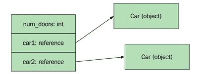
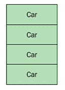

# 一、C++ 简介

这本书旨在为您提供编写高效应用的坚实基础，以及在现代 C++ 中实现库的策略。我试图用一种实用的方法来解释今天 C++ 是如何工作的，从 C++ 11 到 C++ 20 的现代特性是语言的自然组成部分，而不是从历史上来看 C++。

在本章中，我们将:

*   介绍 C++ 的一些特性，这些特性对于编写健壮、高性能的应用非常重要
*   讨论 C++ 相对于竞争语言的优缺点
*   浏览本书中使用的库和编译器

# 为什么是 C++？

让我们从探索今天使用 C++ 的一些原因开始。简而言之，C++ 是一种高度可移植的语言，它提供零成本的抽象。此外，C++ 为程序员提供了编写和管理大型、富于表现力和健壮的代码库的能力。在这一节中，我们将看看我们所说的*零成本抽象*是什么意思，将 C++ 抽象与其他语言中的抽象进行比较，并讨论可移植性和健壮性，以及为什么这些特性很重要。

让我们从零成本抽象开始。

## 零成本抽象

活跃的代码库在增长。开发人员在代码库上工作的越多，代码库就越大。为了管理越来越复杂的代码库，我们需要诸如变量、函数和类这样的语言特性，以便能够用自定义名称和接口创建我们自己的抽象，从而抑制实现的细节。

C++ 允许我们定义自己的抽象，但它也带有内置的抽象。例如，C++ 函数的概念本身就是控制程序流的抽象。基于范围的`for`循环是内置抽象的另一个例子，它可以更直接地迭代一系列值。作为程序员，我们在开发程序的同时不断增加新的抽象。同样，C++ 的新版本为语言和标准库引入了新的抽象。但是不断增加抽象和新的间接层次是有代价的——效率。这就是零成本抽象发挥作用的地方。C++ 提供的许多抽象在空间和时间方面的运行时成本非常低。

有了 C++，当需要的时候，你可以自由谈论内存地址和其他与计算机相关的低级术语。然而，在大型软件项目中，最好用处理应用正在做的任何事情的术语来表达代码，并让库处理与计算机相关的术语。图形应用的源代码可能涉及铅笔、颜色和滤镜，而游戏可能涉及吉祥物、城堡和蘑菇。与计算机相关的低级术语，如内存地址，可能会隐藏在性能至关重要的 C++ 库代码中。

### 编程语言和机器代码抽象

为了让程序员不再需要处理与计算机相关的术语，现代编程语言使用抽象，例如，字符串列表可以被处理并被认为是字符串列表，而不是地址列表，如果我们犯了最轻微的错别字，我们可能会很容易忘记。抽象不仅能让程序员摆脱 bug，还能通过使用应用领域的概念让代码更具表现力。换句话说，代码用更接近口语的术语来表达，而不是用抽象的编程关键字来表达。

C++ 和 C 现在是两种完全不同的语言。尽管如此，C++ 与 C 高度兼容，并且从 C 继承了它的许多语法和习惯用法。为了给你一些 C++ 抽象的例子，我将展示如何在 C 和 C++ 中解决问题。

看看下面的 C/C++ 代码片段，对应的问题是:“这份书单里有多少本《哈姆雷特》？”

我们将从 C 版开始:

```cpp
// C version
struct string_elem_t { const char* str_; string_elem_t* next_; };
int num_hamlet(string_elem_t* books) {
  const char* hamlet = "Hamlet";
  int n = 0;
  string_elem_t* b; 
  for (b = books; b != 0; b = b->next_)
    if (strcmp(b->str_, hamlet) == 0)
      ++ n;
  return n;
} 
```

使用 C++ 的等效版本如下所示:

```cpp
// C++ version
int num_hamlet(const std::forward_list<std::string>& books) {
  return std::count(books.begin(), books.end(), "Hamlet");
} 
```

尽管 C++ 版本更像是一种机器人语言，而不是人类语言，但由于更高层次的抽象，许多编程术语已经不复存在。以下是前两个代码片段之间的一些显著差异:

*   指向原始内存地址的指针根本不可见
*   `std::forward_list<std::string>`容器使用`string_elem_t`代替手工制作的链表
*   `std::count()`功能取代了`for`循环和`if`语句
*   `std::string`类提供了比`char*`和`strcmp()`更高级别的抽象

基本上，`num_hamlet()`的两个版本翻译成大致相同的机器码，但是 C++ 的语言特性使得库隐藏指针等计算机相关术语成为可能。许多现代 C++ 语言特性可以看作是基本 C 功能之上的抽象。

### 其他语言的抽象

大多数编程语言都是基于抽象的，抽象被转换成机器代码，由中央处理器执行。C++ 已经发展成为一种高度表达的语言，就像今天许多其他流行的编程语言一样。C++ 与大多数其他语言的区别在于，虽然其他语言已经以运行时性能为代价实现了这些抽象，但 C++ 一直努力在运行时以零成本实现其抽象。这并不意味着用 C++ 编写的应用在默认情况下比用 C#编写的应用更快。相反，这意味着通过使用 C++，如果需要，您可以对发出的机器代码指令和内存占用进行细粒度控制。

平心而论，现在很少需要最佳性能，在许多情况下，像其他语言一样，为了更低的编译时间、垃圾收集或安全性而牺牲性能更合理。

### 零开销原则

“零成本抽象”是一个常用的术语，但它有一个问题——大多数抽象通常都有成本。如果在运行程序时没有，它几乎总是会花费一些成本，比如很长的编译时间，难以解释的编译错误消息等等。通常更有趣的是零开销原则。C++ 的发明者比雅尼·斯特劳斯特鲁普这样定义零开销原则:

*   你不用的东西，你不用付钱
*   你使用的东西，你不能更好地手工编码

这是 C++ 的一个核心原则，也是语言进化的一个非常重要的方面。为什么，你可能会问？建立在这个原则上的抽象将被性能敏感的程序员广泛接受和使用并且在性能非常关键的环境中。找到许多人都同意并广泛使用的抽象，使我们的代码库更容易阅读和维护。

相反，C++ 语言中不完全遵循零开销原则的特性往往会被程序员、项目和公司抛弃。这一类别中最值得注意的两个特征是**异常**(不幸的是)和**运行时类型信息** ( **RTTI** )。这两项功能即使在不使用时也会对性能产生影响。我强烈建议使用异常，除非你有很好的理由不这样做。与使用其他机制处理错误相比，性能开销在大多数情况下可以忽略不计。

## 轻便

长期以来，C++ 一直是一种流行而全面的语言。它与 C 高度兼容，很少在语言中被弃用，无论好坏。C++ 的历史和设计使它成为一种高度可移植的语言，现代 C++ 的进化确保了它将在未来很长一段时间内保持这种状态。C++ 是一种活的语言，编译器供应商目前在快速实现新的语言特性方面做得非常出色。

## 稳健性

除了性能、表现力和可移植性之外，C++ 还提供了一组语言特性，使程序员能够编写健壮的代码。

根据作者的经验，健壮性不是指编程语言本身的强度——用任何语言编写健壮的代码都是可能的。相反，严格的资源所有权、`const`正确性、值语义、类型安全性和对象的确定性销毁是 C++ 提供的一些特性，这些特性使得编写健壮的代码变得更加容易。也就是说，编写易于使用且不易误用的函数、类和库的能力。

## 今天的 C++

总而言之，今天的 C++ 为程序员提供了编写富于表现力和健壮性的代码库的能力，同时仍然可以选择针对几乎任何硬件平台或实时需求。在当今最常用的语言中，只有 C++ 拥有所有这些属性。

我现在已经提供了一个简短的纲要，说明为什么 C++ 仍然是一种相关的和广泛使用的编程语言。在下一节中，我们将看看 C++ 与其他现代编程语言相比如何。

# C++ 与其他语言相比

自从 C++ 首次发布以来，已经出现了大量的应用类型、平台和编程语言。尽管如此，C++ 仍然是一种广泛使用的语言，其编译器可用于大多数平台。迄今为止，最大的例外是网络平台，JavaScript 及其相关技术是其基础。然而，web 平台正在发展成为能够执行以前只有在桌面应用中才能执行的功能，在这种情况下，C++ 已经找到了使用 Emscripten、asm.js 和 WebAssembly 等技术进入 web 应用的方法。

在本节中，我们将从性能的角度来看竞争语言。接下来，我们将看看与其他语言相比，C++ 如何处理对象所有权和垃圾收集，以及我们如何在 C++ 中避免空对象。最后，我们将介绍 C++ 的一些缺点，用户在考虑该语言是否适合他们的需求时应该记住这些缺点。

## 竞争语言和性能

为了理解与其他编程语言相比，C++ 是如何实现其性能的让我们讨论一下 C++ 与大多数其他现代编程语言之间的一些基本差异。

为简单起见，本节将重点比较 C++ 和 Java，尽管大多数部分的比较也适用于基于垃圾收集器的其他编程语言，如 C#和 JavaScript。

首先，Java 编译成字节码，然后在应用执行时编译成机器码，而大多数 C++ 实现直接将源代码编译成机器码。虽然字节码和即时编译器理论上可能能够获得与预编译机器代码相同(或者理论上甚至更好)的性能，但截至目前，它们通常不能。不过，公平地说，他们在大多数情况下表现得足够好。

其次，Java 处理动态内存的方式与 C++ 完全不同。在 Java 中，内存由垃圾收集器自动释放，而 C++ 程序手动或通过引用计数机制处理内存释放。垃圾收集器确实可以防止内存泄漏，但代价是性能和可预测性。

第三，Java 将其所有对象放在单独的堆分配中，而 C++ 允许程序员将对象放在堆栈和堆上。在 C++ 中，也可以在一次堆分配中创建多个对象。这可能是一个巨大的性能提升，原因有二:可以在不总是分配动态内存的情况下创建对象，并且多个相关对象可以在内存中彼此相邻放置。

在下面的例子中，看看内存是如何分配的。C++ 函数对对象和整数都使用堆栈；Java 将对象放在堆上:

<colgroup><col> <col></colgroup> 
| C++ | Java 语言(一种计算机语言，尤用于创建网站) |
| 

```cpp
class Car {
public:
  Car(int doors)
      : doors_(doors) {}
private:
  int doors_{}; 
};
auto some_func() {
  auto num_doors = 2;
  auto car1 = Car{num_doors};
  auto car2 = Car{num_doors};
  // ...
} 
```

 | 

```cpp
class Car {
  public Car(int doors) { 
    doors_ = doors;
  }
  private int doors_;
  static void some_func() {
    int numDoors = 2;
    Car car1 = new Car(numDoors);
    Car car2 = new Car(numDoors);
    // ...
  }
} 
```

 |
| C++ 将所有东西都放在堆栈上:

<figure class="mediaobject"></figure>

 | Java 将`Car`对象放在堆上:

<figure class="mediaobject"></figure>

 |

现在看下一个例子，看看当分别使用 C++ 和 Java 时，`Car`对象的数组是如何放置在内存中的:

<colgroup><col> <col></colgroup> 
| C++ | Java 语言(一种计算机语言，尤用于创建网站) |
| 

```cpp
auto n = 4;
auto cars = std::vector<Car>{};
cars.reserve(n);
for (auto i=0; i<n;++ i) {
   cars.push_back(Car{2});
} 
```

 | 

```cpp
int n = 4;
ArrayList<Car> cars = 
  new ArrayList<Car>();
for (int i=0; i<n; i++) {
  cars.addElement(new Car(2));
} 
```

 |
| 下图显示了 C++ 中`Car`对象在内存中的布局方式:

<figure class="mediaobject"></figure>

 | 下图显示了 Java 中`Car`对象在内存中的布局方式:

<figure class="mediaobject"></figure>

 |

C++ 向量包含放置在一个连续内存块中的实际`Car`对象，而 Java 中的等价对象是引用到`Car`对象的*的连续内存块。在 Java 中，对象是单独分配的，这意味着它们可以位于堆的任何地方。*

这影响了的性能，因为在这个例子中，Java 实际上必须在 Java 堆空间中执行五次分配。它也意味着每当应用迭代列表时，C++ 都有性能胜利，因为访问附近的内存位置比访问内存中的几个随机点更快。

## 与性能无关的 C++ 语言特性

人们很容易相信，只有在性能是主要考虑因素的情况下，才应该使用 C++ 语言。不就是 C++ 只是由于手工内存处理增加了代码库的复杂度，可能导致内存泄漏和难以追踪的 bug 吗？

这在几个 C++ 版本之前可能是正确的，但是现代 C++ 程序员依赖于提供的容器和智能指针类型，它们是标准库的一部分。过去 10 年中增加的大量 C++ 特性使得这种语言更加强大，使用起来也更加简单。

我想在这里强调 C++ 的一些古老但强大的特性，这些特性与健壮性而不是性能有关，这些特性很容易被忽略:值语义、`const`正确性、所有权、确定性破坏和引用。

### 价值语义学

C++ 支持值语义和引用语义。值语义允许我们通过值传递对象，而不仅仅是传递对对象的引用。在 C++ 中，值语义是默认的，这意味着当传递类或结构的实例时，它的行为与传递`int`、`float`或任何其他基本类型相同。为了使用引用语义，我们需要显式地使用引用或指针。

C++ 类型的系统给了我们显式声明对象所有权的能力。比较 C++ 和 Java 中简单类的以下实现。我们将从 C++ 版本开始:

```cpp
// C++
class Bagel {
public:
  Bagel(std::set<std::string> ts) : toppings_(std::move(ts)) {}
private:
  std::set<std::string> toppings_;
}; 
```

Java 中相应的实现可能如下所示:

```cpp
// Java
class Bagel {
  public Bagel(ArrayList<String> ts) { toppings_ = ts; }
  private ArrayList<String> toppings_;
} 
```

在 C++ 版本中，程序员声明`toppings`被`Bagel`类完全封装。如果程序员打算在几个百吉饼之间共享头名列表，它将被声明为某种指针:`std::shared_ptr`如果所有权在几个百吉饼之间共享，或者`std::weak_ptr`如果其他人拥有头名列表并且应该在程序执行时修改它。

在 Java 中，对象以共享的所有权相互引用。因此，无法区分头名列表是否打算在几个百吉饼之间共享，或者是否在其他地方处理，或者是否像大多数情况下一样完全归`Bagel`类所有。

比较以下功能；由于在 Java(和大多数其他语言)中，默认情况下每个对象都是共享的，因此程序员必须对细微的错误采取预防措施，例如:

<colgroup><col> <col></colgroup> 
| C++ | Java 语言(一种计算机语言，尤用于创建网站) |
| 

```cpp
// Note how the bagels do
// not share toppings:
auto t = std::set<std::string>{};
t.insert("salt");
auto a = Bagel{t};
// 'a' is not affected
// when adding pepper
t.insert("pepper");
// 'a' will have salt
// 'b' will have salt & pepper 
auto b = Bagel{t};
// No bagel is affected
t.insert("oregano"); 
```

 | 

```cpp
// Note how both the bagels
// share toppings:
TreeSet<String> t = 
  new TreeSet<String>();
t.add("salt");
Bagel a = new Bagel(t);
// Now 'a' will subtly 
// also have pepper
t.add("pepper");
// 'a' and 'b' share the
// toppings in 't'
Bagel b = new Bagel(t);
// Both bagels are affected
toppings.add("oregano"); 
```

 |

### 常量正确性

C++ 的另一个强大的特性是能够编写完全`const`正确的代码，这是 Java 和许多其他语言所缺乏的。Const 正确性是指一个类的每个成员函数签名明确告诉调用者对象是否会被修改；如果调用者试图修改声明为`const`的对象，它将不会编译。在 Java 中，可以使用`final`关键字声明常量，但是这缺乏将成员函数声明为`const`的能力。

下面是一个我们如何使用`const`成员函数来防止无意中修改对象的例子。在下面的`Person`类中，成员函数`age()`被声明为`const`，因此不允许变异`Person`对象，而`set_age()`变异该对象，因此*不能被声明为*:

```cpp
class Person {
public:
  auto age() const { return age_; }
  auto set_age(int age) { age_ = age; }
private:
  int age_{};
}; 
```

还可以区分返回成员的可变引用和不可变引用。在下面的`Team`类中，成员函数`leader()` `const`返回一个不可变的`Person`，而`leader()`返回一个可能变异的`Person`对象:

```cpp
class Team {
public:
  auto& leader() const { return leader_; }
  auto& leader() { return leader_; }
private:
  Person leader_{};
}; 
```

现在让我们看看当我们试图变异不可变对象时，编译器如何帮助我们发现错误。在下面的例子中，函数参数`teams`被声明为`const`，明确表示该函数不允许修改它们:

```cpp
void nonmutating_func(const std::vector<Team>& teams) {
  auto tot_age = 0;

  // Compiles, both leader() and age() are declared const
  for (const auto& team : teams) 
    tot_age += team.leader().age();
  // Will not compile, set_age() requires a mutable object
  for (auto& team : teams) 
    team.leader().set_age(20);
} 
```

如果我们想写一个*可以*变异`teams`对象的函数，我们只需去掉`const`。这向调用者发出信号，这个函数可能会改变`teams`:

```cpp
void mutating_func(std::vector<Team>& teams) {
  auto tot_age = 0;

  // Compiles, const functions can be called on mutable objects
  for (const auto& team : teams) 
    tot_age += team.leader().age();
  // Compiles, teams is a mutable variable
  for (auto& team : teams) 
    team.leader().set_age(20);
} 
```

### 对象所有权

除了在非常罕见的情况下，C++ 程序员应该将内存处理留给容器和智能指针，永远不要依赖手动内存处理。

说得明白一点，Java 中的垃圾收集模型几乎可以在 C++ 中通过对每个对象使用`std::shared_ptr`来模拟。请注意，垃圾收集语言不使用与`std::shared_ptr`相同的分配跟踪算法。`std::shared_ptr`是一个基于引用计数算法的智能指针，如果对象有循环依赖，它会泄漏内存。垃圾收集语言有更复杂的方法来处理和释放循环依赖对象。

然而，强制严格的所有权并不依赖于垃圾收集器，而是微妙地避免了默认情况下共享对象可能导致的细微错误，就像 Java 的情况一样。

如果程序员最小化 C++ 中的共享所有权，那么生成的代码就更容易使用，也更难滥用，因为它可以迫使类的用户按照预期的方式使用它。

### C++ 中的确定性破坏

在 C++ 中，对象的销毁是确定性的。这意味着我们(能够)确切地知道一个物体何时被摧毁。对于像 Java 这样的垃圾收集语言来说，情况并非如此，在 Java 中，垃圾收集器决定未被引用的对象何时被最终确定。

在 C++ 中，我们可以可靠地反转对象生命周期中所做的事情。起初，这似乎是一件小事。但事实证明，它对我们如何在 C++ 中提供异常安全保证和处理资源(如内存、文件句柄、互斥锁等)有很大影响。

确定性破坏也是使 C++ 可预测的特性之一。程序员非常重视的东西，也是对性能至关重要的应用的要求。

我们将在本书后面花更多的时间讨论对象所有权、生存期和资源管理。所以如果这在目前没有太大意义，不要太担心。

### 使用 C++ 引用避免空对象

除了严格的所有权外，C++ 还有引用的概念，与 Java 中的引用不同。在内部，引用是不允许为空或重新打印的指针；因此，将它传递给函数时不涉及复制。

因此，C++ 中的函数签名可以明确限制程序员将空对象作为参数传递。在 Java 中，程序员必须使用文档或注释来指示非空参数。

看看这两个计算球体体积的 Java 函数。第一个抛出运行时异常如果一个空对象被传递给它，而第二个默默忽略空对象。

如果传递一个空对象，Java 中的第一个实现会抛出一个运行时异常:

```cpp
// Java
float getVolume1(Sphere s) {
  float cube = Math.pow(s.radius(), 3);
  return (Math.PI * 4 / 3) * cube; 
} 
```

Java 中的第二个实现默默处理空对象:

```cpp
// Java
float getVolume2(Sphere s) { 
  float rad = s == null ? 0.0f : s.radius();
  float cube = Math.pow(rad, 3);
  return (Math.PI * 4 / 3) * cube;
} 
```

在用 Java 实现的两个函数中，函数的调用方必须检查函数的实现，以确定是否允许空对象。

在 C++ 中，第一个函数签名通过使用不能为空的引用，明确地只接受初始化的对象。使用指针作为参数的第二个版本明确显示空对象被处理。

作为引用传递的 C++ 参数指示不允许空值:

```cpp
auto get_volume1(const Sphere& s) {   
  auto cube = std::pow(s.radius(), 3.f);
  auto pi = 3.14f;
  return (pi * 4.f / 3.f) * cube;
} 
```

作为指针传递的 C++ 参数指示正在处理空值:

```cpp
auto get_volume2(const Sphere* s) {
  auto rad = s ? s->radius() : 0.f;
  auto cube = std::pow(rad, 3);
  auto pi = 3.14f;
  return (pi * 4.f / 3.f) * cube;
} 
```

能够在 C++ 中使用引用或值作为参数会立即通知 C++ 程序员该函数打算如何使用。相反，在 Java 中，用户必须检查函数的实现，因为对象总是作为指针传递的，并且它们有可能为空。

## C++ 的缺点

如果不提及 C++ 的一些缺点，将它与其他编程语言进行比较是不公平的。如前所述，C++ 有更多的概念需要学习，因此更难正确使用并发挥其全部潜力。然而，如果一个程序员能掌握 C++，更高的复杂性就变成了优势，代码库变得更健壮，性能也更好。

尽管如此，C++ 也有一些缺点，这些只是缺点。这些缺点中最严重的是编译时间长和导入库的复杂性。直到 C++ 20，C++ 一直依赖于一个过时的导入系统，在这个系统中，导入的头被简单地粘贴到任何包含它们的内容中。C++ 20 中正在引入的 C++ 模块将解决基于包含头文件的系统的一些问题，也将对大型项目的编译时间产生积极影响。

C++ 的另一个明显缺点是缺少提供的库。虽然其他语言通常带有大多数应用所需的所有库，如图形、用户界面、网络、线程、资源处理等，但 C++ 或多或少只提供最基本的算法、线程，以及从 C++ 17 开始的文件系统处理。除此之外，程序员不得不依赖外部库。

综上所述，虽然 C++ 比大多数其他语言有更陡峭的学习曲线，但如果使用正确，C++ 的健壮性与许多其他语言相比是一个优势。因此，尽管编译时间很长，并且缺少提供的库，我相信 C++ 是非常适合大型项目的语言，即使对于性能不是最高优先级的项目也是如此。

# 本书使用的库和编译器

如前所述，就库而言，C++ 只提供了最基本的必需品。因此，在本书中，我们将不得不依赖外部图书馆。C++ 世界中最常用的库可能是 Boost 库([http://www.boost.org](http://www.boost.org))。

本书的某些部分使用了标准 C++ 库不够用的 Boost 库。我们将只使用 Boost 库的仅头部分，这意味着自己使用它们不需要任何特定的构建设置；相反，您只需要包含指定的头文件。

此外，我们将使用 Google Benchmark(一个微基准测试支持库)来评估小代码片段的性能。谷歌基准测试将在*第三章*、*性能分析和测量*中介绍。

在[https://github . com/PacktPublishing/Cpp-High-Performance-Second-Edition](https://github.com/PacktPublishing/Cpp-High-Performance-Second-Edition)上提供的存储库以及该书的附带源代码使用了谷歌测试框架，使您更容易构建、运行和测试代码。

还应该提到的是，这本书使用了很多来自 C++ 20 的新特性。在撰写本文时，我们使用的编译器(Clang、GCC 和 Microsoft Visual C++)还没有完全实现其中的一些功能。所呈现的一些特性完全缺失或仅得到实验支持。在[https://en.cppreference.com/w/cpp/compiler_support](https://en.cppreference.com/w/cpp/compiler_support)可以找到主要 C++ 编译器当前状态的优秀最新摘要。

# 摘要

在这一章中，我强调了 C++ 的一些特性和缺点，以及它是如何发展到今天的状态的。此外，我们还从性能和健壮性的角度讨论了 C++ 与其他语言相比的优缺点。

在下一章中，我们将探索一些对语言发展产生重大影响的现代和基本的 C++ 特性。