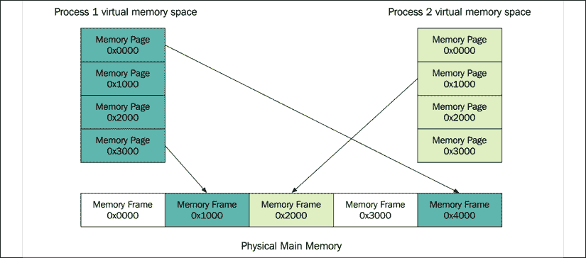
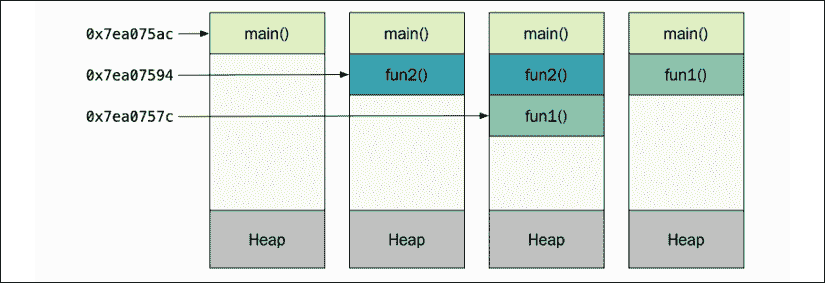
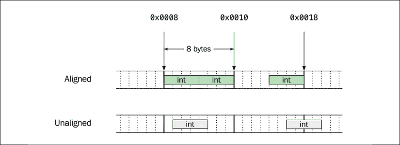

# 七、内存管理

读完前面几章，我们处理内存的方式会对性能产生巨大影响，这应该不再令人惊讶。中央处理器花费大量时间在中央处理器寄存器和主存储器之间洗牌(向主存储器加载数据和从主存储器存储数据)。如*第四章*、*数据结构*所示，CPU 使用内存缓存来加速对内存的访问，程序需要缓存友好才能快速运行。

本章将揭示计算机如何使用内存的更多方面，以便您知道在调整内存使用时必须考虑哪些因素。此外，本章还包括:

*   自动内存分配和动态内存管理。
*   C++ 对象的生命周期以及如何管理对象所有权。
*   高效的内存管理。有时，硬内存限制迫使我们保持数据表示紧凑，有时，我们有足够的可用内存，但需要程序通过提高内存管理效率来加快速度。
*   如何最小化动态内存分配？分配和释放动态内存相对昂贵，有时，我们需要避免不必要的分配，以使程序运行得更快。

在深入研究 C++ 内存管理之前，我们将从解释一些您需要理解的概念开始这一章。本介绍将解释虚拟内存和虚拟地址空间、堆栈内存与堆内存、分页和交换空间。

# 计算机存储器

计算机的物理内存由系统上运行的所有进程共享。如果一个进程占用大量内存，其他进程很可能会受到影响。但是从程序员的角度来看，我们通常不必担心其他进程正在使用的内存。内存的这种隔离是因为当今大多数操作系统都是**虚拟内存**操作系统，这给人一种错觉，以为一个进程拥有自己所有的内存。每个进程都有自己的**虚拟地址空间**。

## 虚拟地址空间

程序员看到的虚拟地址空间中的地址被操作系统和作为处理器一部分的**内存管理单元** ( **MMU** )映射到物理地址。这种映射或转换在我们每次访问内存地址时都会发生。

这种额外的间接层使得操作系统可以将物理内存用于当前正在使用的进程部分，并将剩余的虚拟内存备份到磁盘上。从这个意义上说，我们可以将物理主内存视为虚拟内存空间的缓存，虚拟内存空间位于辅助存储上。二级存储器中用于备份内存页面的区域通常是称为**交换空间**、**交换文件**或简称**页面文件**，具体取决于操作系统。

虚拟内存使进程可以拥有比物理地址空间更大的虚拟地址空间，因为不使用的虚拟内存不必占用物理内存。

## 内存页面

如今实现虚拟内存最常见的方法是将地址空间划分为个固定大小的块，称为**内存页**。当进程访问虚拟地址的内存时，操作系统会检查内存页面是否有物理内存(页面框架)支持。如果内存页面没有映射到主内存中，就会发生硬件异常，页面会从磁盘加载到内存中。这种类型的硬件异常被称为**页面故障**。这不是一个错误，而是将数据从磁盘加载到内存所必需的中断。但是，正如您可能已经猜到的，与读取已经驻留在内存中的数据相比，这非常慢。

当主内存中没有可用的页面框架时，必须逐出一个页面框架。如果要收回的页面是脏的，也就是说，自从上次从磁盘加载以来，它已经被修改过，则需要先将其写入磁盘，然后才能替换它。这个机制叫做**寻呼**。如果该内存页没有被修改，则该内存页被简单地逐出。

并非所有支持虚拟内存的操作系统都支持分页。例如，iOS 确实有虚拟内存，但脏页永远不会存储在磁盘上；只有干净的页面才能从内存中被逐出。如果主内存已满，iOS 将开始终止进程，直到再次有足够的可用内存。安卓也采用了类似的策略。不将内存页面写回移动设备的闪存的一个原因是它会耗尽电池，并且还会缩短闪存本身的寿命。

下图显示了两个正在运行的进程。它们都有自己的虚拟内存空间。有些页面被映射到物理内存，而有些则没有。如果进程 1 需要使用从地址 0x1000 开始的内存页面中的内存，则会发生页面错误。然后，内存页面将被映射到一个空闲的内存帧。另外，请注意虚拟内存地址与物理地址不同。从虚拟地址 0x0000 开始的进程 1 的第一个内存页被映射到从物理地址 0x4000 开始的内存帧:

<figure class="mediaobject"></figure>

图 7.1:虚拟内存页面，映射到物理内存中的内存帧。未使用的虚拟内存页面不必占用物理内存。

## 痛打

**当系统物理内存不足，因此不断分页时，可能会发生系统颠簸**。每当一个进程被安排在中央处理器上的时间，它就试图访问已经被调出的内存。加载新的内存页面意味着其他页面必须首先存储在磁盘上。在磁盘和内存之间来回移动数据通常非常慢；在某些情况下，这或多或少会使计算机停顿，因为系统将所有时间都花在分页上。查看系统的页面故障频率是确定程序是否已经开始颠簸的好方法。

在优化性能时，了解硬件和操作系统如何处理内存的基本知识非常重要。接下来，我们将看到在 C++ 程序执行期间内存是如何处理的。

# 进程内存

堆栈和堆是 C++ 程序中最重要的两个内存段。还有也是静态存储和线程本地存储，不过这个我们后面会多讲。实际上，形式上正确的说，C++ 不谈栈和堆；相反，它讨论了免费存储、存储类和对象的存储持续时间。然而，由于堆栈和堆的概念在 C++ 社区中被广泛使用，并且我们知道的所有 C++ 实现都使用堆栈来实现函数调用和管理局部变量的自动存储，所以理解什么是堆栈和堆是很重要的。

在本书中，我还将使用术语*堆栈*和*堆*而不是对象的存储持续时间。我将交替使用*堆*和*自由商店*这两个术语，不会对它们做任何区分。

堆栈和堆都驻留在进程的虚拟内存空间中。栈是所有局部变量驻留的地方；这也包括函数的参数。每次调用函数时，堆栈都会增长，当函数返回时，堆栈会收缩。每个线程都有自己的堆栈，因此堆栈内存可以被认为是线程安全的。另一方面，堆是一个全局内存区域，由正在运行的进程中的所有线程共享。当我们用`new`(或 C 库函数`malloc()`和`calloc()`)分配内存时，堆增长，当我们用`delete`(或`free()`)释放内存时，堆收缩。通常，堆从低地址开始向上增长，而堆栈从高地址开始向下增长。*图 7.2* 显示了堆栈和堆如何在虚拟地址空间中以相反的方向增长:

<figure class="mediaobject"></figure>

图 7.2:一个进程的地址空间。堆栈和堆向相反的方向增长。

接下来的部分将提供更多关于堆栈和堆的细节，并解释我们在编写的 C++ 程序中何时使用这些内存区域。

## 栈存储器

与堆相比，堆栈在许多方面不同。这里是堆栈的一些独特属性:

*   堆栈是一个连续的内存块。
*   它有一个固定的最大尺寸。如果程序超过最大堆栈大小，程序将崩溃。这种情况称为堆栈溢出。
*   堆栈内存永远不会变得碎片化。
*   从堆栈中分配内存(几乎)总是很快。页面错误是可能的，但很少。
*   程序中的每个线程都有自己的堆栈。

本节接下来的代码示例将研究其中的一些属性。让我们从分配和解除分配开始，了解堆栈在程序中是如何使用的。

通过检查堆栈分配数据的地址，我们可以很容易地发现堆栈向哪个方向发展。下面的示例代码演示了在进入和离开函数时堆栈是如何增长和收缩的:

```cpp
void func1() {
  auto i = 0;
  std::cout << "func1(): " << std::addressof(i) << '\n';
}
void func2() {
  auto i = 0;
  std::cout << "func2(): " << std::addressof(i) << '\n';
  func1();
}

int main() { 
  auto i = 0; 
  std::cout << "main():  " << std::addressof(i) << '\n'; 
  func2();
  func1(); 
} 
```

运行程序时可能的输出如下所示:

```cpp
main():  0x7ea075ac 
func2(): 0x7ea07594 
func1(): 0x7ea0757c 
func1(): 0x7ea07594 
```

通过打印堆栈分配整数的地址，我们可以确定堆栈在我的平台上增长了多少以及向哪个方向增长。每当我们输入`func1()`或`func2()`时，堆栈就会增加 24 个字节。将在堆栈上分配的整数`i`为 4 字节长。剩下的 20 个字节包含函数结束时需要的数据，比如返回地址，也许还有一些对齐的填充。

下图说明了在程序执行期间堆栈如何增长和收缩。第一个方框说明了程序刚进入`main()`功能时内存的样子。第二个框显示了当我们执行`func1()`时堆栈是如何增加的，以此类推:

<figure class="mediaobject"></figure>

图 7.3:当输入函数时，栈增长并收缩

为堆栈分配的总内存是在线程启动时创建的固定大小的连续内存块。那么，堆栈有多大，当我们到达堆栈的极限时会发生什么？

如前所述，每次程序进入一个函数时，栈都会增长，当函数返回时，栈会收缩。每当我们在同一个函数中创建一个新的堆栈变量时，堆栈也会增长，当这样的变量超出范围时，堆栈就会收缩。堆栈溢出最常见的原因是深度递归调用和/或在堆栈上使用大型自动变量。堆栈的最大大小因平台而异，也可以针对单个进程和线程进行配置。

让我们看看我们是否可以写一个程序来看看在我的系统上默认情况下堆栈有多大。我们将从编写一个函数`func()`开始，它将无限递归。在每个函数的开始，我们会分配一个 1 千字节的变量，每次进入`func()`时，这个变量都会被放入栈中。每次执行`func()`时，我们都会打印当前堆栈的大小:

```cpp
void func(std::byte* stack_bottom_addr) { 
  std::byte data[1024];     
  std::cout << stack_bottom_addr - data << '\n'; 
  func(stack_bottom_addr); 
} 

int main() { 
  std::byte b; 
  func(&b); 
} 
```

栈的大小只是一个估计。我们通过从`func()`中定义的第一个局部变量中减去`main()`中第一个局部变量的地址来计算。

当我用 Clang 编译代码时，我得到一个警告`func()`永远不会返回。通常情况下，这是一个我们不应该忽略的警告，但这一次，这正是我们想要的结果，所以我们忽略了这个警告，无论如何都要运行程序。当堆栈达到极限时，程序会在短暂的后崩溃。在程序崩溃之前，它设法用当前的堆栈大小打印出数千行。输出的最后几行如下所示:

```cpp
... 
8378667 
8379755 
8380843 
```

因为我们要减去`std::byte`指针，所以大小是以字节为单位的，所以看起来我的系统上堆栈的最大大小大约是 8 MB。在类似 Unix 的系统上，可以通过使用带有选项`-s`的`ulimit`命令来设置和获取进程的堆栈大小:

```cpp
$ ulimit -s
$ 8192 
```

`ulimit`(用户限制的缩写)以千字节为单位返回最大堆栈大小的当前设置。`ulimit`的输出证实了我们实验的结果:如果我不明确配置，我的 Mac 上的堆栈大约是 8 MB。

在 Windows 上，默认堆栈大小通常设置为 1 MB。如果堆栈大小配置不正确，在 macOS 上运行良好的程序可能会因 Windows 上的堆栈溢出而崩溃。

通过这个例子，我们还可以得出结论，我们不想耗尽堆栈内存，因为当这种情况发生时，程序将崩溃。在本章的后面，我们将看到如何实现一个基本的内存分配器来处理固定大小的分配。然后我们将理解堆栈只是另一种类型的内存分配器，可以非常有效地实现，因为使用模式总是顺序的。我们总是在栈顶(连续内存的末端)请求和释放内存。这确保了堆栈内存永远不会变得碎片化，并且我们可以只通过移动堆栈指针来分配和释放内存。

## 堆内存

堆(或自由存储，这是 C++ 中更正确的术语)是具有动态存储的数据所在的地方。如前所述，堆由多个线程共享，这意味着对堆的内存管理需要考虑并发性。这使得堆中的内存分配比堆栈分配更复杂，堆栈分配是每个线程的本地分配。

堆栈内存的分配和解除分配模式是顺序的，也就是说，内存总是按照与分配顺序相反的顺序解除分配。另一方面，对于动态内存，分配和解除分配可以任意发生。对象的动态寿命和内存分配的可变大小增加了**内存碎片**的风险。

理解内存碎片问题的一个简单方法是看一个内存碎片是如何发生的例子。假设我们有一个 16 KB 的小型连续内存块，从中分配内存。我们正在分配两种类型的对象:类型 **A** ，1kb；类型 **B** ，2 KB。我们首先分配一个类型为**的对象，然后分配一个类型为**的对象。这样重复，直到内存看起来像下图:****

<figure class="mediaobject"></figure>

图 7.4:分配 A 和 B 类型对象后的内存

接下来，不再需要所有类型为 **A** 的对象，因此可以解除分配。现在的记忆是这样的:

<figure class="mediaobject"></figure>

图 7.5:类型 A 的对象被释放后的内存

现在有 10 KB 的内存在使用，6 KB 可用。现在，假设我们要分配一个类型为 **B** 的新对象，即 2 KB。虽然有 6 KB 的空闲内存，但是没有地方我们可以找到 2 KB 的内存块，因为内存已经变得碎片化了。

既然你已经很好地理解了计算机内存是如何构造的，以及在运行过程中是如何使用的，现在是时候探索 C++ 对象是如何生活在内存中的了。

# 内存中的对象

我们在 C++ 程序中使用的所有对象都驻留在内存中。在这里，我们将探索对象是如何从内存中创建和删除的，并描述对象是如何在内存中布局的。

## 创建和删除对象

在这一节中，我们将挖掘使用`new`和`delete`的细节。考虑以下使用`new`在免费商店创建一个对象，然后使用`delete`删除它的方式:

```cpp
auto* user = new User{"John"};  // allocate and construct 
user->print_name();             // use object 
delete user;                    // destruct and deallocate 
```

我不建议你以这种方式明确调用`new`和`delete`，但我们暂时忽略这一点。让我们言归正传；正如评论所暗示的那样，`new`实际上做了两件事，即:

*   分配内存来保存`User`类型的新对象
*   通过调用`User`类的构造函数，在分配的内存空间中构造一个新的`User`对象

`delete`也是如此，它:

*   通过调用其析构函数来析构`User`对象
*   释放放置`User`对象的内存

在 C++ 中，实际上可以将这两个动作(内存分配和对象构造)分开。这很少使用，但是在编写库组件时有一些重要且合法的用例。

### 新位置

C++ 允许我们将内存分配与对象构造分开。例如，我们可以用`malloc()`分配一个字节数组，并在内存区域中构造一个新的`User`对象。看看下面的代码片段:

```cpp
auto* memory = std::malloc(sizeof(User));
auto* user = ::new (memory) User("john"); 
```

使用`::new (memory)`的可能不熟悉的语法被称为**放置新**。是`new`的非分配形式，只构造一个对象。`new`前面的双冒号(`::`)确保了解析是从全局命名空间进行的，以避免拾取过载版本的`operator new`。

在前面的示例中，放置新构造了`User`对象，并将其放置在指定的内存位置。因为我们是用`std::malloc()`为单个对象分配内存，所以它保证是正确对齐的(除非类`User`被声明为过度对齐)。稍后，我们将探讨在使用放置新时必须考虑对齐的情况。

没有放置删除，所以为了销毁对象并释放内存，我们需要显式调用析构函数，然后释放内存:

```cpp
user->~User();
std::free(memory); 
```

这是唯一一次您应该显式调用析构函数。永远不要这样调用析构函数，除非你已经创建了一个新的对象。

C++ 17 在`<memory>`中引入了一组实用函数，用于在不分配或解除分配内存的情况下构造和销毁对象。因此，现在可以使用名称以`std::uninitialized_`开头的`<memory>`中的一些函数来构造、复制对象并将对象移动到未初始化的内存区域，而不是调用 placement new。我们现在可以不用显式调用析构函数，而是使用`std::destroy_at()`在特定的内存地址处销毁一个对象，而无需释放内存。

使用这些新函数可以重写前面的例子。以下是它的外观:

```cpp
auto* memory = std::malloc(sizeof(User));
auto* user_ptr = reinterpret_cast<User*>(memory);
std::uninitialized_fill_n(user_ptr, 1, User{"john"});
std::destroy_at(user_ptr);
std::free(memory); 
```

C++ 20 还引入了`std::construct_at()`，可以用以下内容替换`std::uninitialized_fill_n()`调用:

```cpp
std::construct_at(user_ptr, User{"john"});        // C++ 20 
```

请记住我们展示这些裸低级内存设施是为了更好地理解 C++ 中的内存管理。使用`reinterpret_cast`和这里演示的内存实用程序应该在 C++ 代码库中保持绝对最小。

接下来，您将看到当我们使用`new`和`delete`表达式时，运算符被称为什么。

### 新建和删除运算符

函数`operator new`是在调用新表达式时负责分配内存。`new`运算符可以是一个全局定义的函数，也可以是一个类的静态成员函数。有可能使全球运营商`new`和`delete`超负荷。在本章的后面，我们将看到这在分析内存使用情况时非常有用。

下面是如何做到的:

```cpp
auto operator new(size_t size) -> void* { 
  void* p = std::malloc(size); 
  std::cout << "allocated " << size << " byte(s)\n"; 
  return p; 
} 

auto operator delete(void* p) noexcept -> void { 
  std::cout << "deleted memory\n"; 
  return std::free(p); 
} 
```

我们可以验证在创建和删除`char`对象时，我们的重载操作符实际上正在被使用:

```cpp
auto* p = new char{'a'}; // Outputs "allocated 1 byte(s)"
delete p;                // Outputs "deleted memory" 
```

当使用`new[]`和`delete[]`表达式创建和删除对象数组时，会使用另一对运算符，即`operator new[]`和`operator delete[]`。我们可以用同样的方式让这些操作符过载:

```cpp
auto operator new[](size_t size) -> void* {
  void* p = std::malloc(size); 
  std::cout << "allocated " << size << " byte(s) with new[]\n"; 
  return p; 
} 

auto operator delete[](void* p) noexcept -> void { 
  std::cout << "deleted memory with delete[]\n"; 
  return std::free(p); 
} 
```

切记如果超负荷`operator new`，也要超负荷`operator delete`。分配和释放内存的函数成对出现。分配内存的分配器应该释放内存。例如，使用`std::malloc()`分配的内存应该总是使用`std::free()`释放，而使用`operator new[]`分配的内存应该使用`operator delete[]`释放。

也可以覆盖特定类别的`operator new`或`operator delete`。这可能比重载全局操作符更有用，因为我们更可能需要一个特定类的自定义动态内存分配器。

这里，我们为`Document`类重载`operator new`和`operator delete`:

```cpp
class Document { 
// ...
public:  
  auto operator new(size_t size) -> void* {
    return ::operator new(size);
  } 
  auto operator delete(void* p) -> void {
    ::operator delete(p); 
  } 
}; 
```

当我们创建新的动态分配的`Document`对象时，将使用类特定版本的`new`:

```cpp
auto* p = new Document{}; // Uses class-specific operator new
delete p; 
```

如果我们想使用全局`new`和`delete`，使用全局范围(`::`)仍然是可能的:

```cpp
auto* p = ::new Document{}; // Uses global operator new
::delete p; 
```

我们将在本章后面讨论内存分配器，然后我们将看到重载的`new`和`delete`操作符在使用。

总结一下到目前为止我们所看到的，一个`new`的表达涉及到两件事:分配和建设。`operator new`分配内存，您可以全局或按类重载内存，以自定义动态内存管理。放置新可用于在已分配的内存区域中构建对象。

为了有效利用记忆，我们需要理解的另一个重要但相当低级的话题是记忆的**对齐**。

## 内存对齐

中央处理器一次一个字地将存储器读入寄存器。64 位架构的字长为 64 位，32 位架构的字长为 32 位，依此类推。为了使中央处理器在处理不同数据类型时高效工作，它对不同类型的对象所在的地址有限制。C++ 中的每种类型都有一个对齐要求，它定义了某种类型的对象在内存中应该位于的地址。

如果类型的对齐方式为 1，则意味着该类型的对象可以位于任何字节地址。如果类型的对齐方式为 2，则意味着连续允许地址之间的字节数为 2。或者引用 C++ 标准:

> "对齐是实现定义的整数值，表示给定对象可以分配的连续地址之间的字节数。"

我们可以使用`alignof`找出一个类型的对齐方式:

```cpp
// Possible output is 4  
std::cout << alignof(int) << '\n'; 
```

当我运行这个代码时，它输出`4`，这意味着类型`int`的对齐要求在我的平台上是 4 字节。

下图显示了来自 64 位字系统的两个内存示例。上面一行包含三个 4 字节整数，它们位于 4 字节对齐的地址上。CPU 可以高效地将这些整数加载到寄存器中，在访问其中一个`int`成员时，永远不需要读取多个字。将此与第二行进行比较，第二行包含两个位于未对齐地址的`int`成员。第二个`int`甚至跨越了两个字的界限。在最好的情况下，这只是效率低下，但在某些平台上，程序会崩溃:

<figure class="mediaobject"></figure>

图 7.6:在对齐和未对齐的内存地址中包含整数的两个内存示例

假设我们有一个对齐要求为 2 的类型。C++ 标准没有说明有效地址是 1、3、5 还是 7...或者 0，2，4，6....我们知道的所有平台都从 0 开始计数地址，因此，实际上我们可以通过使用模运算符(`%`)检查对象的地址是否是对齐的倍数来检查对象是否正确对齐。

然而，如果我们想编写完全可移植的 C++ 代码，我们需要使用`std::align()`而不是模来检查对象的对齐。`std::align()`是来自`<memory>`的一个函数，它将根据我们作为参数传递的对齐方式来调整指针。如果我们传递给它的内存地址已经对齐，指针就不会被调整。因此，我们可以使用`std::align()`实现一个名为`is_aligned()`的小实用函数，如下所示:

```cpp
bool is_aligned(void* ptr, std::size_t alignment) {
  assert(ptr != nullptr);
  assert(std::has_single_bit(alignment)); // Power of 2
  auto s = std::numeric_limits<std::size_t>::max();
  auto aligned_ptr = ptr;
  std::align(alignment, 1, aligned_ptr, s);
  return ptr == aligned_ptr;
} 
```

首先，我们确保`ptr`参数不为空，并且`alignment`是 2 的幂，这在 C++ 标准中是一个要求。我们正在使用`<bit>`头中的 C++ 20 `std::has_single_bit()`来检查这一点。接下来，我们打电话给`std::align()`。`std::align()`的典型用例是当我们有一个一定大小的内存缓冲区，我们想要在其中存储一个具有一定对齐要求的对象。在这种情况下，我们没有缓冲区，我们不关心对象的大小，所以我们说对象的大小为 1，缓冲区是 a `std::size_t`的最大值。然后，我们可以比较原始的`ptr`和调整后的`aligned_ptr`，看看原始指针是否已经对齐。在接下来的例子中，我们将会用到这个工具。

当使用`new`或`std::malloc()`分配内存时，我们获得的内存应该与我们指定的类型正确对齐。下面的代码显示在我的平台上分配给`int`的内存至少是 4 字节对齐的:

```cpp
auto* p = new int{};
assert(is_aligned(p, 4ul)); // True 
```

事实上，`new`和`malloc()`保证总是返回对任何标量类型都适当对齐的内存(如果它能够返回内存的话)。`<cstddef>`头为我们提供了一个名为`std::max_align_t`的类型，它的对齐要求至少和所有标量类型一样严格。稍后，我们将看到这种类型在编写自定义内存分配器时非常有用。所以，即使我们在免费商店只为`char`请求内存，它也会为`std::max_align_t`进行适当的对齐。

下面的代码显示了从`new`返回的内存对于`std::max_align_t`以及任何标量类型都是正确对齐的:

```cpp
auto* p = new char{}; 
auto max_alignment = alignof(std::max_align_t);
assert(is_aligned(p, max_alignment)); // True 
```

让我们用`new`连续分配`char`两次:

```cpp
auto* p1 = new char{'a'};
auto* p2 = new char{'b'}; 
```

然后，记忆可能看起来像这样:

<figure class="mediaobject"></figure>

图 7.7:两次单独分配一个字符后的内存布局

`p1`和`p2`之间的间距取决于`std::max_align_t`的对中要求。在我的系统中，它是`16`字节，因此，每个`char`实例之间有 15 个字节，即使`char`的对齐只有 1。

当使用`alignas`说明符声明变量时，可以指定比默认对齐更严格的自定义对齐要求。假设我们的高速缓存行大小为 64 字节，并且出于某种原因，我们希望确保两个变量放在不同的高速缓存行上。我们可以做到以下几点:

```cpp
alignas(64) int x{};
alignas(64) int y{};
// x and y will be placed on different cache lines 
```

定义类型时，也可以指定自定义对齐方式。下面是一个在使用时正好占用一个缓存行的结构:

```cpp
struct alignas(64) CacheLine {
    std::byte data[64];
}; 
```

现在，如果我们创建一个类型为`CacheLine`的堆栈变量，它将按照 64 字节的自定义对齐方式进行对齐:

```cpp
int main() {
  auto x = CacheLine{};
  auto y = CacheLine{};
  assert(is_aligned(&x, 64));
  assert(is_aligned(&y, 64));
  // ...
} 
```

在堆上分配对象时，也满足了更严格的对齐要求。为了支持具有非默认对齐要求的类型的动态分配，C++ 17 引入了`operator new()`和`operator delete()`的新重载，它们接受类型为`std::align_val_t`的对齐参数。还有一个在`<cstdlib>`中定义的`aligned_alloc()`函数，可以用来手动分配对齐的堆内存。

下面是一个例子，在这个例子中，我们分配了一个堆内存块，它应该正好占用一个内存页面。在这种情况下，当使用`new`和`delete`时，将调用`operator new()`和`operator delete()`的对齐感知版本:

```cpp
constexpr auto ps = std::size_t{4096};      // Page size
struct alignas(ps) Page {
    std::byte data_[ps];
};
auto* page = new Page{};                    // Memory page
assert(is_aligned(page, ps));               // True
// Use page ...
delete page; 
```

内存页面不是 C++ 抽象机器的一部分，因此没有可移植的方法来以编程方式获得当前运行的系统的页面大小。但是，您可以在 Unix 系统上使用`boost::mapped_region::get_page_size()`或特定于平台的系统调用，如`getpagesize()`。

最后需要注意的是，支持的对齐集是由您正在使用的标准库的实现定义的，而不是 C++ 标准。

## 填料

编译器有时需要向我们的用户定义类型添加额外的字节，**填充**。当我们在类或结构中定义数据成员时，编译器被迫按照我们定义它们的顺序来放置成员。

但是，编译器还必须确保类内部的数据成员具有正确的对齐方式；因此，如果需要，它需要在数据成员之间添加填充。例如，假设我们有一个定义如下的类:

```cpp
class Document { 
  bool is_cached_{}; 
  double rank_{}; 
  int id_{}; 
};
std::cout << sizeof(Document) << '\n'; // Possible output is 24 
```

可能的输出为 24 的原因是编译器在`bool`和`int`之后插入填充，以满足单个数据成员和整个类的对齐要求。编译器将`Document`类转换成如下形式:

```cpp
class Document {
  bool is_cached_{};
  std::byte padding1[7]; // Invisible padding inserted by compiler
  double rank_{};
  int id_{};
  std::byte padding2[4]; // Invisible padding inserted by compiler
}; 
```

`bool`和`double`之间的第一个填充是 7 字节，因为`double`类型的`rank_`数据成员具有 8 字节的对齐。`int`后添加的第二个填充是 4 字节。这是为了满足`Document`级本身的校准要求。具有最大对齐要求的成员也决定了整个数据结构的对齐要求。在我们的例子中，这意味着`Document`类的总大小必须是 8 的倍数，因为它包含一个 8 字节对齐的`double`值。

我们现在意识到，我们可以通过从具有最大对齐要求的类型开始，以最小化编译器插入的填充的方式重新排列`Document`类中数据成员的顺序。让我们创建一个新版本的`Document`类:

```cpp
// Version 2 of Document class
class Document {
  double rank_{}; // Rearranged data members
  int id_{};
  bool is_cached_{};
}; 
```

随着成员的重新排列，编译器现在只需要在`is_cached_`数据成员后填充，以调整`Document`的对齐。这是填充后类的外观:

```cpp
// Version 2 of Document class after padding
class Document { 
  double rank_{}; 
  int id_{}; 
  bool is_cached_{}; 
  std::byte padding[3]; // Invisible padding inserted by compiler 
}; 
```

新`Document`类的大小现在只有 16 字节，而第一个版本是 24 字节。这里的洞见应该是物体的大小可以通过改变成员的声明顺序来改变。我们还可以在更新版本的`Document`上再次使用`sizeof`运算符来验证这一点:

```cpp
std::cout << sizeof(Document) << '\n'; // Possible output is 16 
```

下图显示了`Document`类版本 1 和版本 2 的内存布局:

<figure class="mediaobject"></figure>

图 7.8:文档类的两个版本的内存布局。对象的大小可以通过改变其成员的声明顺序来改变。

一般来说，您可以将最大的数据成员放在开头，将最小的成员放在结尾。通过这种方式，您可以最大限度地减少由填充引起的内存开销。稍后，我们将看到，在知道我们正在创建的对象的对齐方式之前，我们需要考虑将对象放入我们分配的内存区域时的对齐方式。

从性能的角度来看，也有可能需要将对象与缓存行对齐，以最小化对象跨越的缓存行数量。虽然我们讨论的是缓存友好性的主题，但还应该提到的是，将经常一起使用的多个数据成员放在一起是有益的。

保持数据结构紧凑对性能很重要。许多应用受内存访问时间的限制。内存管理的另一个重要方面是永远不要为不再需要的对象泄漏或浪费内存。通过明确资源的所有权，我们可以有效地避免各种资源泄漏。这是下一节的主题。

# 内存所有权

资源所有权是编程时要考虑的一个基本方面。资源的所有者负责在不再需要资源时释放资源。资源通常是内存块，但也可以是数据库连接、文件句柄等。无论您使用哪种编程语言，所有权都很重要。然而，这在 C 和 C++ 等语言中更为明显，因为默认情况下动态内存不会被垃圾收集。每当我们在 C++ 中分配动态内存时，我们都必须考虑该内存的所有权。幸运的是，现在该语言非常支持通过使用智能指针来表达各种类型的所有权，我们将在本节稍后介绍这一点。

标准库中的智能指针帮助我们指定动态变量的所有权。其他类型的变量已经定义了所有权。例如，局部变量属于当前范围。当范围结束时，在范围内创建的对象将被自动销毁:

```cpp
{
  auto user = User{};
} // user automatically destroys when it goes out of scope 
```

静态和全局变量归程序所有，当程序终止时将被销毁:

```cpp
static auto user = User{}; 
```

数据成员由它们所属的类的实例拥有:

```cpp
class Game {
  User user; // A Game object owns the User object
  // ...
}; 
```

只有动态变量没有默认的所有者，程序员需要确保所有动态分配的变量都有一个所有者来控制变量的生存期:

```cpp
auto* user = new User{}; // Who owns user now? 
```

有了现代 C++，我们可以在不显式调用`new`和`delete`的情况下编写大部分代码，这是一件很棒的事情。手动跟踪对`new`和`delete`的调用很容易成为内存泄漏、双重删除和其他严重错误的问题。原始指针不表示任何所有权，如果我们是只使用原始指针来引用动态内存，这使得所有权很难跟踪。

我建议您明确所有权，但要尽量减少手动内存管理。通过遵循一些处理内存所有权的相当简单的规则，您将增加代码干净和正确的可能性，而不会泄漏资源。接下来的部分将指导您完成一些最佳实践。

## 隐式处理资源

首先，使对象隐式处理动态内存的分配/解除分配:

```cpp
auto func() {
  auto v = std::vector<int>{1, 2, 3, 4, 5};
} 
```

在前面的例子中，我们同时使用了堆栈和动态内存，但是我们不必显式调用`new`和`delete`。我们创建的`std::vector`对象是一个自动对象，它将存在于堆栈中。因为它属于作用域，所以当函数返回时，它将被自动销毁。`std::vector`对象本身使用动态内存来存储整数元素。`v`超出范围时，其析构函数可以安全释放动态内存。这种让析构函数释放动态内存的模式很容易避免内存泄漏。

当我们讨论释放资源的话题时，我认为提到 RAII 是有意义的。 **RAII** 是一种众所周知的 C++ 技术，简称为**资源获取是初始化**，其中资源的生存期由对象的生存期控制。模式很简单，但是对于处理资源(包括内存)非常有用。但是让我们说，作为一个改变，我们需要的资源是某种发送请求的连接。每当我们使用完连接时，我们(所有者)必须记得关闭它。以下是我们手动打开和关闭连接以发送请求时的外观示例:

```cpp
auto send_request(const std::string& request) { 
  auto connection = open_connection("http://www.example.com/"); 
  send_request(connection, request); 
  close(connection); 
} 
```

如您所见，我们必须记住在使用后关闭连接，否则连接将保持打开(泄漏)。在这个例子中，似乎很难忘记，但是一旦代码在插入适当的错误处理和多个退出路径后变得更加复杂，就很难保证连接总是关闭的。RAII 解决这个问题的方法是依靠自动变量的生命周期是以一种可预测的方式为我们处理的。我们需要的是一个与我们从`open_connection()`调用中获得的连接具有相同寿命的对象。我们可以为此创建一个类，称为`RAIIConnection`:

```cpp
class RAIIConnection { 
public: 
  explicit RAIIConnection(const std::string& url) 
      : connection_{open_connection(url)} {} 
  ~RAIIConnection() { 
    try { 
      close(connection_);       
    } 
    catch (const std::exception&) { 
      // Handle error, but never throw from a destructor 
    } 
  }
  auto& get() { return connection_; } 

private:  
  Connection connection_; 
}; 
```

`Connection`对象现在封装在一个控制连接(资源)生存期的类中。我们现在可以让`RAIIConnection`为我们处理这个问题，而不是手动关闭连接:

```cpp
auto send_request(const std::string& request) { 
  auto connection = RAIIConnection("http://www.example.com/"); 
  send_request(connection.get(), request); 
  // No need to close the connection, it is automatically handled 
  // by the RAIIConnection destructor 
} 
```

RAII 让我们的代码更安全。即使`send_request()`在这里抛出异常，连接对象仍然会被析构并关闭连接。我们可以将 RAII 用于许多类型的资源，而不仅仅是内存、文件句柄和连接。另一个例子是 C++ 标准库中的`std::scoped_lock`。它试图在创建时获取锁(互斥体)，然后在销毁时释放锁。你可以在*第十一章*、*并发*中阅读更多关于`std::scoped_lock`的内容。

现在，我们将探索更多在 C++ 中明确内存所有权的方法。

## 容器

您可以使用标准容器来处理对象集合。您使用的容器将拥有动态内存，它需要存储您添加到其中的对象。这是在代码中最小化手动`new`和`delete`表达式的非常有效的方法。

也可以使用`std::optional`来处理可能存在或不存在的对象的生存期。`std::optional`可视为最大尺寸为 1 的容器。

我们在这里不再讨论容器，因为它们已经包含在*第 4 章*、*数据结构*中。

## 智能指针

标准库中的智能指针包装了一个原始的指针，并明确了它所指向的对象的所有权。正确使用时，谁负责删除动态对象是毫无疑问的。三种智能指针类型为:`std::unique_ptr`、`std::shared_ptr`和`std::weak_ptr`。顾名思义，它们代表一个对象的三种所有权:

*   独特的所有权表达了我，也只有我，拥有对象。当我用完后，我会删除它。
*   共享所有权表示我和其他人一起拥有对象。当没有人需要这个对象时，它将被删除。
*   弱所有权表示，如果对象存在，我会使用它，但不要只为了我而让它活着。

我们将在下面的小节中分别讨论这些类型。

### 唯一指针

最安全、最不复杂的所有权是独一无二的所有权，应该是在思考智能指针时首先映入脑海的东西。唯一指针代表唯一的所有权；也就是说，拥有的资源恰好是一个实体。独特的所有权可以转让给别人，但不能复制，因为那样会破坏其独特性。下面是如何使用`std::unique_ptr`:

```cpp
auto owner = std::make_unique<User>("John");
auto new_owner = std::move(owner); // Transfer ownership 
```

唯一指针也非常有效，因为与普通的原始指针相比，它们只增加了很少的性能开销。`std::unique_ptr`有一个非平凡的析构函数，这意味着(不像原始指针)它在传递给函数时不能在 CPU 寄存器中传递，这导致了轻微的开销。这使得它们比原始指针慢。

### 共享指针

共享所有权意味着一个对象可以有多个所有者。当最后一个所有者不再存在时，该对象将被删除。这是一种非常有用的指针类型，但也比唯一指针更复杂。

`std::shared_ptr`对象使用引用计数来跟踪一个对象拥有的所有者数量。当计数器达到 0 时，对象将被删除。计数器需要存储在某个地方，因此与唯一指针相比，它确实有一些内存开销。此外，`std::shared_ptr`是内部线程安全的，因此计数器需要自动更新以防止争用情况。

创建共享指针拥有的对象的推荐方式是使用`std::make_shared<T>()`。这比用`new`手动创建对象，然后将其传递给`std::shared_ptr`构造函数更安全(从异常安全的角度来看)也更有效。通过再次重载`operator new()`和`operator delete()`来跟踪分配，我们可以进行一个实验来找出为什么使用`std::make_shared<T>()`更有效:

```cpp
auto operator new(size_t size) -> void* { 
  void* p = std::malloc(size); 
  std::cout << "allocated " << size << " byte(s)" << '\n'; 
  return p; 
} 
auto operator delete(void* p) noexcept -> void { 
  std::cout << "deleted memory\n"; 
  return std::free(p); 
} 
```

现在我们先来试试推荐的方式，使用`std::make_shared()`:

```cpp
int main() { 
  auto i = std::make_shared<double>(42.0); 
  return 0; 
} 
```

运行程序时的输出如下:

```cpp
allocated 32 bytes 
deleted memory 
```

现在，让我们使用`new`显式分配`int`值，然后将其传递给`std::shared_ptr`构造函数:

```cpp
int main() { 
  auto i = std::shared_ptr<double>{new double{42.0}}; 
  return 0; 
} 
```

该程序将生成以下输出:

```cpp
allocated 4 bytes 
allocated 32 bytes 
deleted memory 
deleted memory 
```

我们可以得出结论，第二个版本需要两个分配，一个用于`double`，一个用于`std::shared_ptr`，而第一个版本只需要一个分配。这也意味着通过使用`std::make_shared()`，由于空间局部性，我们的代码将更加缓存友好。

### 弱指针

弱所有权不能保持任何物体的生命；它只允许我们在别人拥有的情况下使用一个对象。为什么会想要弱所有权这样模糊的所有权？使用弱指针的一个常见原因是打破参考周期。当两个或多个对象使用共享指针相互引用时，就会发生引用循环。即使所有的外部`std::shared_ptr`构造器都消失了，对象也是通过引用自己而保持活着。

为什么不直接使用原始指针呢？弱指针不正是原始指针吗？一点也不。使用弱指针是安全的，因为我们不能引用该对象，除非它实际存在，而悬空的原始指针则不是这样。一个例子将澄清这一点:

```cpp
auto i = std::make_shared<int>(10); 
auto weak_i = std::weak_ptr<int>{i};

// Maybe i.reset() happens here so that the int is deleted... 
if (auto shared_i = weak_i.lock()) { 
  // We managed to convert our weak pointer to a shared pointer 
  std::cout << *shared_i << '\n'; 
} 
else { 
  std::cout << "weak_i has expired, shared_ptr was nullptr\n"; 
} 
```

每当我们试图使用弱指针时，我们需要首先使用成员函数`lock()`将其转换为共享指针。如果对象没有过期，共享指针将是指向该对象的有效指针；否则，我们会得到一个空的`std::shared_ptr`回来。这样，我们在使用`std::weak_ptr`代替原始指针时就可以避免悬空指针。

这将结束我们关于内存中对象的部分。C++ 为处理内存提供了极好的支持，包括低级概念，如对齐和填充，以及高级概念，如对象所有权。

在使用 C++ 时，对所有权、RAII 和引用计数有一个良好的理解非常重要。对 C++ 不熟悉并且之前没有接触过这些概念的程序员可能需要一些时间来完全掌握这一点。同时，这些概念并不是 C++ 独有的。在大多数语言中，它们更加分散，但在其他语言中，它们更加突出(Rust 就是后者的一个例子)。所以，一旦掌握了，它也会提高你其他语言的编程技能。思考对象所有权将对您编写的程序的设计和架构产生积极影响。

现在，我们将转向优化技术，减少动态内存分配的使用，尽可能使用堆栈。

# 小对象优化

像`std::vector`这样的容器有一个很棒的地方，就是它们会在需要的时候自动分配动态内存。然而，有时对只包含少量元素的容器对象使用动态内存会影响性能。将元素保留在容器本身中，并且只使用堆栈内存，而不是在堆上分配小的内存区域，会更有效。`std::string`的大多数现代实现将利用这样一个事实，即正常程序中的许多字符串都很短，并且短字符串在不使用堆内存的情况下处理起来更有效。

一种替代方法是在字符串类本身中保留一个单独的小缓冲区，当字符串内容很短时可以使用。这将增加字符串类的大小，即使不使用短缓冲区。

因此，更节省内存的解决方案是使用 union，当字符串处于短模式时，它可以保存一个短缓冲区，否则，保存处理动态分配的缓冲区所需的数据成员。优化容器以处理小数据的技术通常被称为字符串的小字符串优化，或者其他类型的小对象优化和小缓冲区优化。我们热爱的事物有很多名字。

一个简短的代码示例将演示来自 LLVM 的 libc++ 的`std::string`如何在我的 64 位系统上运行:

```cpp
auto allocated = size_t{0}; 
// Overload operator new and delete to track allocations 
void* operator new(size_t size) {  
  void* p = std::malloc(size); 
  allocated += size; 
  return p; 
} 

void operator delete(void* p) noexcept { 
  return std::free(p); 
} 

int main() { 
  allocated = 0; 
  auto s = std::string{""}; // Elaborate with different string sizes 

  std::cout << "stack space = " << sizeof(s) 
    << ", heap space = " << allocated 
    << ", capacity = " << s.capacity() << '\n'; 
} 
```

为了跟踪动态内存分配，代码从重载全局`operator new`和`operator delete`开始。我们现在可以开始测试不同尺寸的绳子`s`来看看`std::string`的表现。在我的系统上以发布模式构建和运行前面的示例时，它会生成以下输出:

```cpp
stack space = 24, heap space = 0, capacity = 22 
```

这个输出告诉我们`std::string`在堆栈上占据了 24 个字节，并且在不使用任何堆内存的情况下，它有 22 个字符的容量。让我们通过用 22 个字符的字符串替换空字符串来验证这是否是真的:

```cpp
auto s = std::string{"1234567890123456789012"}; 
```

程序仍然产生相同的输出，并验证没有分配动态内存。但是当我们将字符串增加到 23 个字符时会发生什么呢？

```cpp
auto s = std::string{"12345678901234567890123"}; 
```

现在运行程序会产生以下输出:

```cpp
stack space = 24, heap space = 32, capacity = 31 
```

`std::string`类现在被迫使用堆来存储字符串。它分配 32 个字节，并报告容量为 31。这是因为 libc++ 总是在内部存储以 null 结尾的字符串，因此在 null 字符的末尾需要一个额外的字节。仍然值得注意的是，字符串类只能是 24 个字节，并且可以在不分配任何内存的情况下保存长度为 22 个字符的字符串。它是如何做到这一点的？如前所述，通过使用两种不同布局的并集来节省内存是很常见的:一种用于短模式，另一种用于长模式。真正的 libc++ 实现中有很多聪明之处，可以最大限度地利用可用的 24 个字节。为了演示这个概念，这里的代码被简化了。长模式的布局如下所示:

```cpp
struct Long { 
  size_t capacity_{}; 
  size_t size_{}; 
  char* data_{}; 
}; 
```

长布局中的每个成员都是 8 字节，因此总大小是 24 字节。`char`指针`data_`是指向动态分配的内存的指针，该内存将保存长字符串。短模式的布局如下所示:

```cpp
struct Short { 
  unsigned char size_{};
  char data_[23]{}; 
}; 
```

在短模式下，不需要为容量使用变量，因为它是编译时常数。在这种布局中，也可以对`size_`数据成员使用较小的类型，因为我们知道，如果字符串是短字符串，它的长度只能在 0 到 22 之间。

两种布局都使用联合进行组合:

```cpp
union u_ { 
  Short short_layout_; 
  Long long_layout_; 
}; 
```

然而，这里缺少了一点:字符串类如何知道它当前存储的是短字符串还是长字符串？需要一个标志来表明这一点，但是它存储在哪里呢？原来 libc++ 在长模式下使用`capacity_`数据成员上的最低有效位，在短模式下使用`size_`数据成员上的最低有效位。对于长模式，该位是多余的，因为字符串总是分配 2 的倍数的内存大小。在短模式下，可以仅使用 7 位来存储大小，以便一位可以用于标志。当编写这段代码来处理大端字节顺序时，它变得更加复杂，因为位需要放在内存中的相同位置，而不管我们使用的是联合的短结构还是长结构。您可以在 https://github.com/llvm/llvm-project/tree/master/libcxx[的 libc++ 实现](https://github.com/llvm/llvm-project/tree/master/libcxx)中查找细节。

*图 7.9* 总结了小字符串优化的高效实现所使用的并集的简化(但仍然相当复杂)内存布局:

<figure class="mediaobject"></figure>

图 7.9:分别用于处理短字符串和长字符串的两种不同布局的结合

像这样聪明的技巧是你在尝试推出自己的类之前，应该努力使用标准库提供的高效且测试良好的类的原因。然而，了解这些优化以及它们如何工作是重要和有用的，即使你从来不需要自己写一个。

# 自定义内存管理

这一章我们已经走了很长的路。我们已经介绍了虚拟内存、堆栈和堆、`new`和`delete`表达式、内存所有权以及对齐和填充的基础知识。但是在结束本章之前，我们将展示如何在 C++ 中自定义内存管理。我们将看到在编写自定义内存分配器时，本章前面介绍的部分将如何派上用场。

但是首先，什么是自定义内存管理器，为什么我们需要一个？

使用`new`或`malloc()`分配内存时，我们使用 C++ 中内置的内存管理系统。`operator new`的大多数实现使用`malloc()`，这是一个通用的内存分配器。设计和构建一个通用的内存管理器是一个复杂的任务，已经有很多人花了很多时间研究这个课题。尽管如此，还是有几个原因让您想要编写一个定制的内存管理器。以下是一些例子:

*   **调试诊断**:这一章我们已经做了几次了，重载`operator new`和`operator delete`，只是为了打印一些调试信息。
*   **沙箱**:自定义内存管理器可以为不允许分配无限制内存的代码提供一个沙箱。沙盒还可以跟踪内存分配，并在沙盒代码完成执行时释放内存。
*   **性能**:如果我们需要动态内存，又无法避免分配，那么我们可能不得不编写一个定制的内存管理器，能够更好地满足我们的特定需求。稍后，我们将介绍一些我们可以用来超越`malloc()`的情况。

话虽如此，许多经验丰富的 C++ 程序员从未遇到过需要他们定制系统附带的标准内存管理器的问题。这很好地表明了如今通用内存管理器实际上有多好，尽管它们在不了解我们的具体用例的情况下必须满足所有需求。我们对应用中的内存使用模式了解得越多，我们就越有可能写出比`malloc()`更有效的东西。例如，还记得堆栈吗？与堆相比，从堆栈中分配和释放内存非常快，因为它不需要处理多个线程，并且释放总是以相反的顺序进行。

构建自定义内存管理器通常从分析确切的内存使用模式开始，然后实现一个竞技场。

## 建造竞技场

使用内存分配器时最常用的两个术语是**竞技场**和**内存池**。我们不会在这本书里区分这些术语。我所说的竞技场，是指一个连续内存的块，包括分配部分内存并在以后回收的策略。

竞技场在技术上也可以被称为内存资源“T2”或分配器“T4”，但这些术语将被用来指代标准库中的抽象。我们稍后开发的自定义分配器将使用我们在这里创建的竞技场来实现。

在设计竞技场时，有一些通用的策略可以用来使分配和解除分配的性能比`malloc()`和`free()`更好:

*   **单线程**:如果我们知道一个竞技场只能从一个线程使用，就没有需要用同步原语保护数据，比如锁或者原子。使用竞技场的客户端不存在被其他线程阻塞的风险，这在实时环境中很重要。
*   **固定大小分配**:如果竞技场只分发固定大小的内存块，使用空闲列表在没有内存碎片的情况下高效回收内存相对容易。
*   **有限生命期**:如果你知道从竞技场分配的对象只需要在有限且定义明确的生命期内生存，竞技场可以推迟回收并一次性释放所有内存。例如，在服务器应用中处理请求时创建的对象。当请求完成时，在请求期间分发的所有内存都可以一步回收。当然，竞技场需要足够大，以处理请求期间的所有分配，而不需要不断回收内存；否则，这个策略就行不通了。

我不会深入讨论这些策略的细节，但是当在程序中寻找改进内存管理的方法时，意识到这些可能性是很好的。正如优化软件的常见情况一样，关键是要了解程序运行的环境，并分析特定的内存使用模式。与通用内存管理器相比，我们这样做是为了找到改进自定义内存管理器的方法。

接下来，我们将看到一个简单的竞技场类模板，它可以用于需要动态存储持续时间的小对象或少数对象，但是它需要的内存通常很小，可以放在堆栈上。该代码基于霍华德·欣南特的`short_alloc`，发布于[https://howardhinnant.github.io/stack_alloc.html](https://howardhinnant.github.io/stack_alloc.html)。如果您想更深入地了解自定义内存管理，这是一个很好的起点。我认为这是一个很好的演示例子，因为它可以处理多种尺寸的对象，这需要正确处理对齐。

但是，请记住，这是演示概念的简化版本，而不是为您提供生产就绪代码:

```cpp
template <size_t N> 
class Arena { 
  static constexpr size_t alignment = alignof(std::max_align_t); 
public: 
  Arena() noexcept : ptr_(buffer_) {} 
  Arena(const Arena&) = delete; 
  Arena& operator=(const Arena&) = delete; 

  auto reset() noexcept { ptr_ = buffer_; } 
  static constexpr auto size() noexcept { return N; } 
  auto used() const noexcept {
    return static_cast<size_t>(ptr_ - buffer_); 
  } 
  auto allocate(size_t n) -> std::byte*; 
  auto deallocate(std::byte* p, size_t n) noexcept -> void; 

private: 
  static auto align_up(size_t n) noexcept -> size_t { 
    return (n + (alignment-1)) & ~(alignment-1); 
  } 
  auto pointer_in_buffer(const std::byte* p) const noexcept -> bool {
    return std::uintptr_t(p) >= std::uintptr_t(buffer_) &&
           std::uintptr_t(p) < std::uintptr_t(buffer_) + N;
  } 
  alignas(alignment) std::byte buffer_[N]; 
  std::byte* ptr_{}; 
}; 
```

竞技场包含一个`std::byte`缓冲区，其大小在编译时决定。这使得有可能在堆栈上创建一个 arena 对象，或者创建一个具有静态或线程本地存储持续时间的变量。对齐可能在堆栈上分配；因此，除非我们将`alignas`说明符应用于数组，否则不能保证它将与`char`以外的类型对齐。如果您不习惯按位运算，助手`align_up()`功能可能看起来很复杂。然而，它基本上只是达到了我们使用的对齐要求。这个版本将分发的内存将与使用`malloc()`时的相同，因为它适用于任何类型。如果我们将竞技场用于较小对齐要求的小型类型，这有点浪费，但这里我们将忽略这一点。

当回收内存时，我们需要知道被要求回收的指针是否真正属于我们的竞技场。`pointer_in_buffer()`函数通过比较指针地址和竞技场的地址范围来检查这一点。顺便提一下，将原始指针与不相交的对象进行关系比较是未定义的行为；这可能会被优化编译器使用，并产生令人惊讶的效果。为了避免这种情况，我们在比较地址之前将指针指向`std::uintptr_t`。如果你对这背后的细节感到好奇，你可以在的陈雷蒙德的文章*如何检查指针是否在内存范围*中找到一个完整的解释 p=97095 。

接下来，我们需要实现分配和解除分配:

```cpp
template<size_t N> 
auto Arena<N>::allocate(size_t n) -> std::byte* { 
  const auto aligned_n = align_up(n); 
  const auto available_bytes =  
    static_cast<decltype(aligned_n)>(buffer_ + N - ptr_); 
  if (available_bytes >= aligned_n) { 
    auto* r = ptr_; 
    ptr_ += aligned_n; 
    return r; 
  } 
  return static_cast<std::byte*>(::operator new(n)); 
} 
```

`allocate()`函数返回一个指针，指向具有指定大小的正确对齐的内存`n`。如果缓冲区中没有所请求大小的可用空间，它将返回到使用`operator new`来代替。

下面的`deallocate()`函数首先检查指向要解除分配的内存的指针是来自缓冲区，还是已经用`operator new`分配了。如果不是来自缓冲区，我们只需用`operator delete`删除即可。否则，我们检查要解除分配的内存是否是我们从缓冲区分配的最后一个内存，然后通过移动当前的`ptr_`来回收它，就像堆栈一样。我们只是忽略了回收内存的其他尝试:

```cpp
template<size_t N> 
auto Arena<N>::deallocate(std::byte* p, size_t n) noexcept -> void { 
  if (pointer_in_buffer(p)) { 
    n = align_up(n); 
    if (p + n == ptr_) { 
      ptr_ = p; 
    } 
  } 
  else { 
    ::operator delete(p);
  }
} 
```

差不多就是这样；我们的竞技场现在可以使用了。让我们在分配`User`对象时使用它:

```cpp
auto user_arena = Arena<1024>{}; 

class User { 
public: 
  auto operator new(size_t size) -> void* { 
    return user_arena.allocate(size); 
  } 
  auto operator delete(void* p) -> void { 
    user_arena.deallocate(static_cast<std::byte*>(p), sizeof(User)); 
  } 
  auto operator new[](size_t size) -> void* { 
    return user_arena.allocate(size); 
  } 
  auto operator delete[](void* p, size_t size) -> void { 
    user_arena.deallocate(static_cast<std::byte*>(p), size); 
  } 
private:
  int id_{};
}; 

int main() { 
  // No dynamic memory is allocated when we create the users 
  auto user1 = new User{}; 
  delete user1; 

  auto users = new User[10]; 
  delete [] users; 

  auto user2 = std::make_unique<User>(); 
  return 0; 
} 
```

本例中创建的`User`对象将全部驻留在`user_area`对象的缓冲区中。也就是说，当我们在这里调用`new`或`make_unique()`时，不会分配动态内存。但是还有其他方法可以在 C++ 中创建`User`对象，这个例子没有展示。我们将在下一节讨论它们。

## 自定义内存分配器

当尝试使用特定类型的定制内存管理器时，效果非常好！但是有一个问题。事实证明，类特定的`operator new`并没有在我们可能预期的所有场合被调用。考虑以下代码:

```cpp
auto user = std::make_shared<User>(); 
```

当我们想要拥有 10 个用户的`std::vector`时会发生什么？

```cpp
auto users = std::vector<User>{};
users.reserve(10); 
```

在这两种情况下，都没有使用我们的自定义内存管理器。为什么呢？从共享指针开始，我们必须回到前面的例子，我们看到`std::make_shared()`实际上为引用计数数据和它应该指向的对象都分配了内存。`std::make_shared()`不可能用`new User()`这样的表达式只分配一次就创建用户对象和计数器。相反，它分配内存并使用 placement new 构造用户对象。

`std::vector`对象类似。当我们调用`reserve()`时，它不会在一个数组中默认构造 10 个对象。这将需要一个默认的构造函数，用于向量使用的所有类。相反，它分配的内存可以在添加 10 个用户对象时用来存放它们。同样，新的布局是实现这一点的工具。

幸运的是，我们可以为`std::vector`和`std::shared_ptr`提供自定义内存分配器，以便让它们使用我们的自定义内存管理器。对于标准库中的其余容器也是如此。如果我们不提供自定义分配器，容器将使用默认的`std::allocator<T>`类。因此，为了使用我们的竞技场，我们需要编写一个容器可以使用的分配器。

在 C++ 社区中，自定义分配器一直是一个激烈争论的话题。已经实现了许多自定义容器来控制如何管理内存，而不是使用带有自定义分配器的标准容器，这可能是有充分理由的。

然而，对编写自定义分配器的支持和要求在 C++ 11 中得到了改进，现在变得更好了。这里，我们将只关注 C++ 11 及更高版本的分配器。

C++ 11 中的最小分配器现在如下所示:

```cpp
template<typename T> 
struct Alloc {  
  using value_type = T; 
  Alloc(); 
  template<typename U> Alloc(const Alloc<U>&); 
  T* allocate(size_t n); 
  auto deallocate(T*, size_t) const noexcept -> void; 
}; 
template<typename T> 
auto operator==(const Alloc<T>&, const Alloc<T>&) -> bool;   
template<typename T> 
auto operator!=(const Alloc<T>&, const Alloc<T>&) -> bool; 
```

由于 C++ 11 的改进，它真的不再是那么多代码了。使用分配器的容器实际上使用`std::allocator_traits`，如果分配器省略它们，它会提供合理的默认值。我建议你看一下`std::allocator_traits`，看看可以配置哪些特性，默认是什么。

通过使用`malloc()`和`free()`，我们可以非常容易地实现一个最小的定制分配器。在这里，我们将展示最早由 Stephan T. Lavavej 在博客中发布的古老而著名的`Mallocator`，演示如何使用`malloc()`和`free()`编写一个最小定制分配器。从那以后，它被更新为 C++ 11，使其更加苗条。以下是它的外观:

```cpp
template <class T>  
struct Mallocator { 

  using value_type = T; 
  Mallocator() = default;

  template <class U>  
  Mallocator(const Mallocator<U>&) noexcept {} 

  template <class U>  
  auto operator==(const Mallocator<U>&) const noexcept {  
    return true;  
  } 

  template <class U>  
  auto operator!=(const Mallocator<U>&) const noexcept {  
    return false;  
  } 

  auto allocate(size_t n) const -> T* { 
    if (n == 0) {  
      return nullptr;  
    } 
    if (n > std::numeric_limits<size_t>::max() / sizeof(T)) { 
      throw std::bad_array_new_length{}; 
    } 
    void* const pv = malloc(n * sizeof(T)); 
    if (pv == nullptr) {  
      throw std::bad_alloc{};  
    } 
    return static_cast<T*>(pv); 
  } 
  auto deallocate(T* p, size_t) const noexcept -> void { 
    free(p); 
  } 
}; 
```

`Mallocator`是一个**无状态分配器**，这意味着分配器实例本身没有任何可变状态；相反，它使用全局函数进行分配和解除分配，即`malloc()`和`free()`。无状态分配器应该总是与相同类型的分配器进行比较。它表示用`Mallocator`分配的内存也应该用`Mallocator`解除分配，与`Mallocator`实例无关。无状态分配器是编写起来最简单的分配器，但是它也是有限的，因为它依赖于全局状态。

要使用我们的竞技场作为堆栈分配对象，我们需要一个**状态分配器**，它可以引用竞技场实例。在这里，我们实现的竞技场类真正开始有意义了。比方说，我们想在一个函数中使用一个标准容器来做一些处理。我们知道，大多数情况下，我们处理的数据量非常小，可以放入堆栈中。但是一旦我们使用了标准库中的容器，它们将从堆中分配内存，在这种情况下，这将损害我们的性能。

除了使用堆栈来管理数据和避免不必要的堆分配之外，还有什么替代方法？另一种方法是构建一个定制容器，使用我们在`std::string`中看到的小对象优化的变体。

也可以使用 Boost 中的一个容器，比如`boost::container::small_vector`，它是基于 LLVM 的小向量。如果您还没有，我们建议您查看一下:[http://www . boost . org/doc/libs/1 _ 74 _ 0/doc/html/container/non _ standard _ containers . html](http://www.boost.org/doc/libs/1_74_0/doc/html/container/non_standard_containers.html)。

然而，另一种选择是使用自定义分配器，我们接下来将探讨这一点。由于我们已经准备好了一个竞技场模板类，我们可以简单地在堆栈上创建一个竞技场的实例，并让一个自定义分配器将其用于分配。然后我们需要做的是实现一个有状态分配器，它可以保存对堆栈分配的 arena 对象的引用。

同样，我们将实现的这个定制分配器是霍华德·欣南特的`short_alloc`的简化版本:

```cpp
template <class T, size_t N> 
struct ShortAlloc { 

  using value_type = T; 
  using arena_type = Arena<N>; 

  ShortAlloc(const ShortAlloc&) = default; 
  ShortAlloc& operator=(const ShortAlloc&) = default; 

  ShortAlloc(arena_type& arena) noexcept : arena_{&arena} { }

  template <class U>
  ShortAlloc(const ShortAlloc<U, N>& other) noexcept
      : arena_{other.arena_} {}

  template <class U> struct rebind {
    using other = ShortAlloc<U, N>;
  };
  auto allocate(size_t n) -> T* {
    return reinterpret_cast<T*>(arena_->allocate(n*sizeof(T)));
  }
  auto deallocate(T* p, size_t n) noexcept -> void {
    arena_->deallocate(reinterpret_cast<std::byte*>(p), n*sizeof(T));
  }
  template <class U, size_t M>
  auto operator==(const ShortAlloc<U, M>& other) const noexcept {
    return N == M && arena_ == other.arena_;
  }
  template <class U, size_t M>
  auto operator!=(const ShortAlloc<U, M>& other) const noexcept {
    return !(*this == other);
  }
  template <class U, size_t M> friend struct ShortAlloc;
private:
  arena_type* arena_;
}; 
```

分配器持有对竞技场的引用。这是分配器仅有的状态。功能`allocate()`和`deallocate()`只是将他们的请求转发到竞技场。比较操作符确保`ShortAlloc`类型的两个实例使用相同的竞技场。

现在，我们实现的分配器和竞技场可以与标准容器一起使用，以避免动态的内存分配。当我们使用小数据时，我们可以使用堆栈来处理所有的分配。我们来看一个使用`std::set`的例子:

```cpp
int main() { 

  using SmallSet =  
    std::set<int, std::less<int>, ShortAlloc<int, 512>>; 

  auto stack_arena = SmallSet::allocator_type::arena_type{}; 
  auto unique_numbers = SmallSet{stack_arena}; 

  // Read numbers from stdin 
  auto n = int{}; 
  while (std::cin >> n)
    unique_numbers.insert(n); 

  // Print unique numbers  
  for (const auto& number : unique_numbers)
    std::cout << number << '\n'; 
} 
```

该程序从标准输入中读取整数，直到到达文件结尾(在类似 Unix 的系统上为 Ctrl + D，在 Windows 上为 Ctrl + Z)。然后，它以升序打印唯一的数字。根据从`stdin`中读取的数量，程序将使用我们的`ShortAlloc`分配器使用堆栈内存或动态内存。

## 使用多态内存分配器

如果您已经阅读了这一章，您现在知道如何实现一个定制的分配器，它可以与任意容器一起使用，包括那些来自标准库的容器。假设我们想对我们在代码库中找到的一些代码使用新的分配器，这些代码正在处理类型为`std::vector<int>`的缓冲区，如下所示:

```cpp
void process(std::vector<int>& buffer) {
  // ...
}
auto some_func() {
  auto vec = std::vector<int>(64);
  process(vec); 
  // ...
} 
```

我们渴望尝试我们的新分配器，它正在利用堆栈内存，并尝试像这样注入内存:

```cpp
using MyAlloc = ShortAlloc<int, 512>;  // Our custom allocator
auto some_func() {
  auto arena = MyAlloc::arena_type();
  auto vec = std::vector<int, MyAlloc>(64, arena);
  process(vec);
  // ...
} 
```

编译时，我们痛苦地意识到`process()`是一个期望`std::vector<int>`的函数，而我们的`vec`变量现在是另一种类型。GCC 给了我们以下错误:

```cpp
error: invalid initialization of reference of type 'const std::vector<int>&' from expression of type 'std::vector<int, ShortAlloc<int, 512> > 
```

类型不匹配的原因是，我们想要使用的自定义分配器`MyAlloc`被作为模板参数传递给`std::vector`，因此成为我们实例化的类型的一部分。因此，`std::vector<int>`和`std::vector<int, MyAlloc>`不能互换。

对于您正在处理的用例来说，这可能是一个问题，也可能不是，您可以通过让`process()`函数接受`std::span`或者让它成为一个处理范围的通用函数来解决这个问题，而不需要`std::vector`。无论如何，重要的是要认识到，当使用标准库中的分配器感知模板类时，分配器实际上变成了类型的一部分。

那么`std::vector<int>`使用的是什么分配器呢？答案是`std::vector<int>`使用默认模板参数`std::allocator`。所以，写`std::vector<int>`相当于`std::vector<int, std::allocator<int>>`。模板类`std::allocator`是一个空类，当它完成来自容器的分配和解除分配请求时，使用全局`new`和全局`delete`。这也意味着使用空分配器的容器的大小小于使用我们定制分配器的容器的大小:

```cpp
std::cout << sizeof(std::vector<int>) << '\n';
// Possible output: 24
std::cout << sizeof(std::vector<int, MyAlloc>) << '\n';
// Possible output: 32 
```

从 libc++ 中检查`std::vector`的实现，我们可以看到它使用的是一个名为**压缩对**的俏皮类型，而这个压缩对又基于*空基类优化*来摆脱通常由空类成员占用的不必要的存储。这里就不赘述了，不过如果有兴趣的话，可以看看`compressed_pair`的 boost 版本，在[https://www . boost . org/doc/libs/1 _ 74 _ 0/libs/utility/doc/html/compressed _ pair . html](https://www.boost.org/doc/libs/1_74_0/libs/utility/doc/html/compressed_pair.html)上有记载。

在 C++ 17 中，通过引入一个额外的间接层，解决了使用不同分配器时以不同类型结束的问题；名称空间`std::pmr`下的所有标准容器都使用同一个分配器，即`std::pmr::polymorphic_allocator`，它将所有分配/解除分配请求分派给一个**内存资源**类。因此，我们可以使用名为`std::pmr::polymorphic_allocator`的通用多态内存分配器，而不是编写新的自定义内存分配器，而是编写新的自定义内存资源，这些资源将在构建过程中交给多态分配器。内存资源类似于我们的`Arena`类，`polymorphic_allocator`是额外的间接层，包含指向资源的指针。

下图显示了当向量委托给它的分配器实例，分配器又委托给它所指向的内存资源时的控制流:

<figure class="mediaobject"></figure>

图 7.10:使用多态分配器分配内存

要开始使用多态分配器，我们需要将命名空间从`std`更改为`std::pmr`:

```cpp
auto v1 = std::vector<int>{};             // Uses std::allocator
auto v2 = std::pmr::vector<int>{/*...*/}; // Uses polymorphic_allocator 
```

编写一个定制的内存资源是相对简单的，尤其是有了内存分配器和竞技场的知识。但是我们甚至不需要编写自定义内存资源来实现我们想要的。C++ 已经为我们提供了一些有用的实现，我们应该在编写自己的实现之前考虑一下。所有内存资源都来自基类`std::pmr::memory_resource`。以下内存资源位于`<memory_resource>`头中:

*   `std::pmr::monotonic_buffer_resource`:这个和我们`Arena`班挺像的。当我们创建许多生命周期很短的对象时，这个类更好。只有当`monotonic_buffer_resource`实例被析构时，内存才会被释放，这使得分配非常快。
*   `std::pmr::unsynchronized_pool_resource`:这使用包含固定大小内存块的内存池(也称为“板”)，避免了每个池内的碎片。每个池为一定大小的对象分配内存。如果您正在创建许多不同大小的对象，这个类可能会很有用。此内存资源不是线程安全的，除非您提供外部同步，否则无法从多个线程使用。
*   `std::pmr::synchronized_pool_resource`:这是`unsynchronized_pool_resource`的线程安全版本。

内存资源可以被链接。创建内存资源实例时，我们可以为其提供一个**上游内存资源**。如果当前资源无法处理该请求(类似于我们在`ShortAlloc`中使用`malloc()`处理的情况，一旦我们的小缓冲区已满)，或者当资源本身需要分配内存时(例如`monotonic_buffer_resource`需要分配其下一个缓冲区时)，将使用该选项。`<memory_resource>`头为我们提供了自由函数，这些函数返回指向全局资源对象的指针，这些指针在指定上游资源时非常有用:

*   `std::pmr::new_delete_resource()`:使用全局`operator new`和`operator delete`。
*   `std::pmr::null_memory_resource()`:每当被要求分配内存时总是抛出`std::bad_alloc`的资源。
*   `std::pmr::get_default_resource()`:返回一个全局默认的内存资源，可以在运行时由`set_default_resource()`设置。初始默认资源是`new_delete_resource()`。

让我们看看如何从上一节重写我们的例子，但是这次使用了一个`std::pmr::set`:

```cpp
int main() {
  auto buffer = std::array<std::byte, 512>{};
  auto resource = std::pmr::monotonic_buffer_resource{
    buffer.data(), buffer.size(), std::pmr::new_delete_resource()};
  auto unique_numbers = std::pmr::set<int>{&resource};
  auto n = int{};
  while (std::cin >> n) {
    unique_numbers.insert(n);
  }
  for (const auto& number : unique_numbers) {
    std::cout << number << '\n';
  }
} 
```

我们将一个堆栈分配的缓冲区传递给内存资源，然后将从`new_delete_resource()`返回的对象作为上游资源提供给它，以便在缓冲区变满时使用。如果我们省略了上游资源，它将使用默认内存资源，在这种情况下，这将是相同的，因为我们的代码不改变默认内存资源。

## 实现自定义内存资源

实现自定义内存资源相当简单。我们需要从`std::pmr::` `memory_resource`公开继承，然后实现三个将由基类(`std::pmr::memory_resource`)调用的纯虚函数。让我们实现一个简单的内存资源，它打印分配和解除分配，然后将请求转发给默认的内存资源:

```cpp
class PrintingResource : public std::pmr::memory_resource {
public:
  PrintingResource() : res_{std::pmr::get_default_resource()} {}
private:
  void* do_allocate(std::size_t bytes, std::size_t alignment)override {
    std::cout << "allocate: " << bytes << '\n';
    return res_->allocate(bytes, alignment);
  }
  void do_deallocate(void* p, std::size_t bytes,
                     std::size_t alignment) override {
    std::cout << "deallocate: " << bytes << '\n';
    return res_->deallocate(p, bytes, alignment);
  }
  bool do_is_equal(const std::pmr::memory_resource& other) 
    const noexcept override {
    return (this == &other);
  }
  std::pmr::memory_resource* res_;  // Default resource
}; 
```

请注意，我们将默认资源保存在构造函数中，而不是直接从`do_allocate()`和`do_deallocate()`调用`get_default_resource()`。原因是有人可能会在分配和解除分配之间的时间内通过调用`set_default_resource()`来更改默认资源。

我们可以使用自定义内存资源来跟踪`std::pmr`容器的分配。下面是一个使用`std::pmr::vector`的例子:

```cpp
auto res = PrintingResource{};
auto vec = std::pmr::vector<int>{&res};
vec.emplace_back(1);
vec.emplace_back(2); 
```

运行程序时可能的输出是:

```cpp
allocate: 4
allocate: 8
deallocate: 4
deallocate: 8 
```

使用多态分配器时需要非常小心的一点是，我们正在传递指向内存资源的原始非拥有指针。这不是多态分配器所特有的；实际上，我们的`Arena`类和`ShortAlloc`类也有同样的问题，但是当使用来自`std::pmr`的容器时，这可能更容易忘记，因为这些容器使用相同的分配器类型。考虑以下示例:

```cpp
auto create_vec() -> std::pmr::vector<int> {
  auto resource = PrintingResource{};
  auto vec = std::pmr::vector<int>{&resource}; // Raw pointer
  return vec;                                  // Ops! resource
}                                              // destroyed here 
auto vec = create_vec();
vec.emplace_back(1);                           // Undefined behavior 
```

由于资源在`create_vec()`结束范围时被破坏，我们新创建的`std::pmr::vector`是无用的，使用时很可能会崩溃。

自定义内存管理部分到此结束。这是一个复杂的主题，如果您想使用自定义内存分配器来获得性能，我建议您在使用和/或实现自定义分配器之前，仔细测量和分析应用中的内存访问模式。通常，应用中只有一小部分类或对象需要使用自定义分配器进行调整。同时，减少应用中动态内存分配的数量，或者在内存的某些区域将对象分组在一起，都会对性能产生巨大的影响。

# 摘要

本章涵盖了很多内容，从虚拟内存的基础知识开始，最后实现一个自定义分配器，标准库中的容器可以使用这个分配器。很好地理解你的程序如何使用内存是很重要的。动态内存的过度使用可能是一个性能瓶颈，您可能需要对其进行优化。

在您开始实现自己的容器或自定义内存分配器之前，请记住，您之前的许多人可能都遇到过与您可能面临的问题非常相似的内存问题。所以，很有可能适合你的工具已经在图书馆里了。构建快速、安全和健壮的定制内存管理器是一项挑战。

在下一章中，您将学习如何受益于 C++ 概念的新引入特性，以及我们如何使用模板元编程让编译器为我们生成代码。