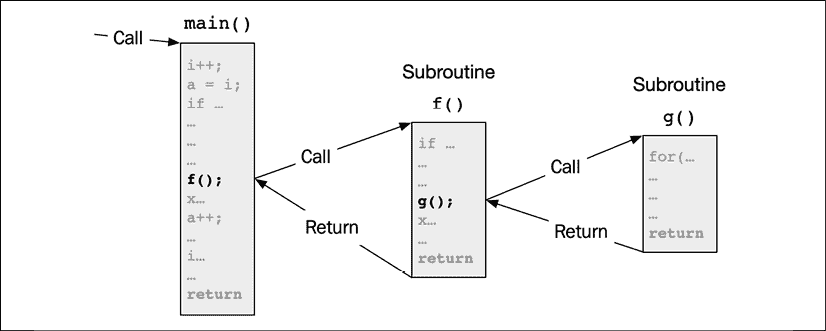
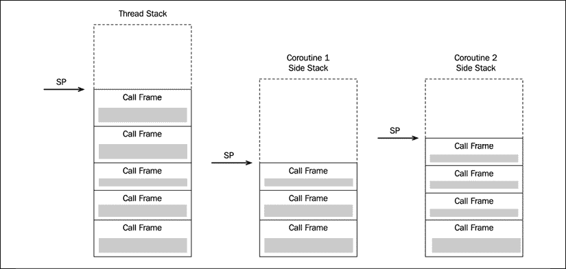
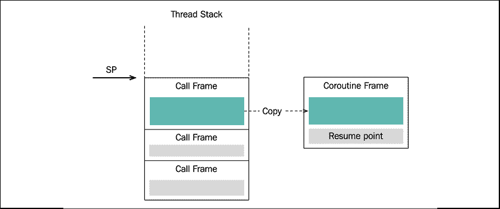
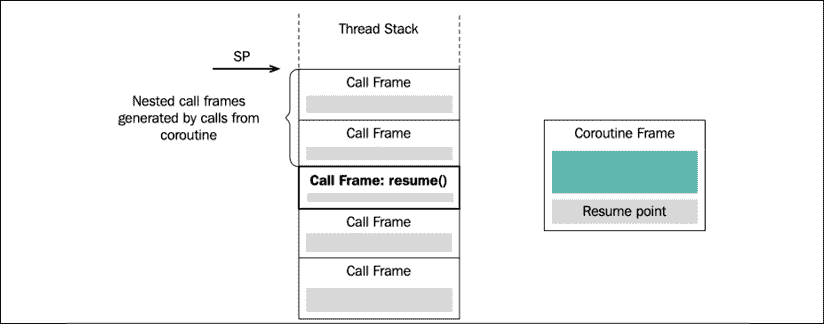
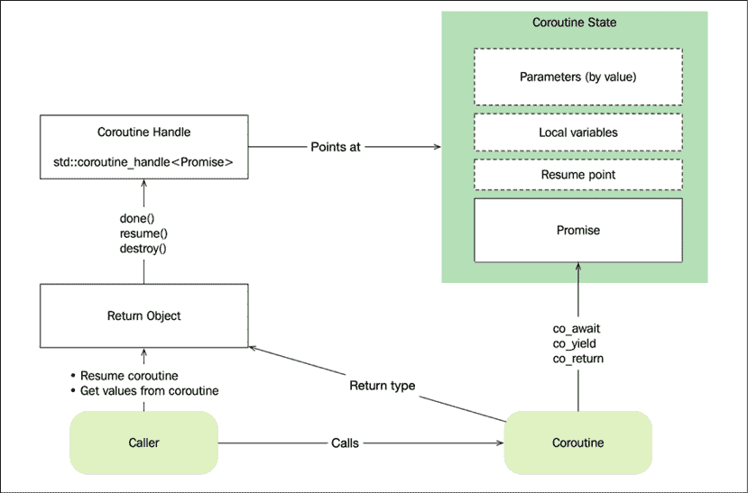
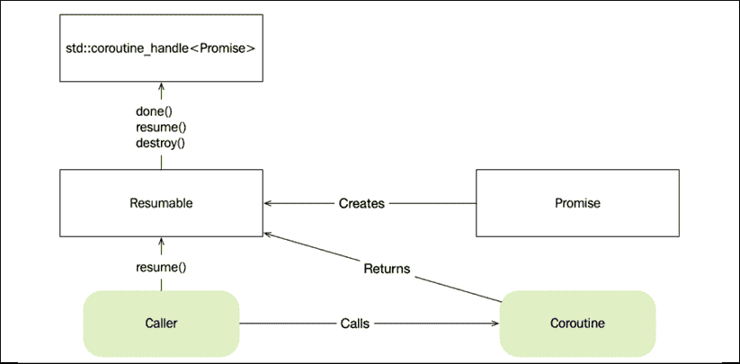
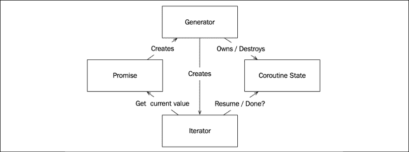
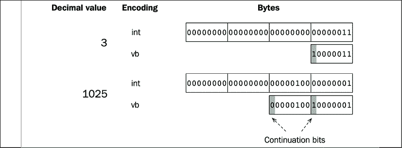

# 十二、协程和延迟生成器

计算已经成为一个等待的世界，我们需要我们的编程语言的支持，以便能够表达*等待*。总的想法是暂停(暂时暂停)当前流程，并将执行移交给其他流程，只要它到达我们知道可能需要等待的点。这个*我们需要等待的东西*可能是网络请求、用户的点击、数据库操作，甚至是我们花费太长时间来阻止的内存访问。相反，我们在代码中说，我们将等待，继续一些其他流程，然后在准备好的时候再回来。花冠允许我们这样做。

在这一章中，我们将主要关注添加到 C++ 20 中的协程。你将了解它们是什么，如何使用它们，以及它们的性能特征。但是我们也将花一些时间从更广泛的意义上来看 coroutines，因为这个概念在许多其他语言中都很明显。

C++ 协程几乎没有标准库的支持。为 coroutines 添加标准库支持是 C++ 23 版本的一个高优先级特性。为了在日常代码中有效地使用协程，我们需要实现一些通用的抽象。这本书将向您展示如何实现这些抽象，以便学习 C++ 协程，而不是为您提供生产就绪的代码。

了解存在的各种类型的协程、协程可以用来做什么以及是什么促使 C++ 增加新的语言特性来支持协程也很重要。

这一章涵盖了很多内容。下一章也是关于协程的，但是重点是异步应用。总之，本章将指导您完成:

*   关于协程的一般理论，包括堆栈式协程和无堆栈式协程的区别，以及它们是如何被编译器转换并在计算机上执行的。
*   C++ 中的无堆栈协程介绍。将讨论和演示在 C++ 20 中使用`co_await`、`co_yield`和`co_return`对协程的新语言支持。
*   使用 C++ 20 协程作为生成器所需的抽象。
*   一些真实的例子显示了使用 coroutine 的可读性和简单性方面的好处，以及我们如何通过使用 coroutine 编写延迟评估的可组合组件。

如果您已经使用过其他语言的 coroutines，那么在阅读本章的其余部分之前，您需要做好两件事的准备:

*   有些内容对你来说可能是基本的。虽然关于 C++ 协程如何工作的细节远非微不足道，但是使用示例可能会让您觉得微不足道。
*   我们将在本章中使用的一些术语(协程、生成器、任务等)可能与您当前对这些术语的看法不一致。

另一方面，如果你对 coroutines 完全陌生，这一章的部分可能看起来很像魔法，需要一些时间来掌握。因此，我将首先向您展示一些使用 coroutines 时 C++ 代码的外观示例。

# 几个激励人心的例子

Coroutines 是类似于 lambda 表达式的特性之一，它提供了一种完全改变我们编写和思考 C++ 代码方式的方法。这个概念非常笼统，可以有许多不同的应用方式。为了让您体验 C++ 在使用 coroutines 时的样子，我们将在这里简单地看两个例子。

yield-expression 可用于实现生成器，即延迟生成值序列的对象。在这个例子中，我们将使用关键字`co_yield`和`co_return`来控制流量:

```cpp
auto iota(int start) -> Generator<int> {
  for (int i = start; i < std::numeric_limits<int>::max(); ++ i) {
    co_yield i;
  }
}
auto take_until(Generator<int>& gen, int value) -> Generator<int> {
  for (auto v : gen) {
    if (v == value) {
      co_return;
    }
    co_yield v;
  }
}
int main() {
  auto i = iota(2);
  auto t = take_until(i, 5);
  for (auto v : t) {          // Pull values
    std::cout << v << ", ";
  }
  return 0;
}
// Prints: 2, 3, 4 
```

在前面的例子中，`iota()`和`take_until()`是并列关系。`iota()`生成一个整数序列，`take_until()`产生值，直到找到指定的值。`Generator`模板是一个自定义类型，我将在本章稍后向您展示如何设计和实现。

构建生成器是协程的一个常见用例，另一个是实现异步任务。下一个例子将演示我们如何使用操作符`co_await`来等待一些东西，而不阻塞当前正在执行的线程:

```cpp
auto tcp_echo_server() -> Task<> {
  char data[1024];
  for (;;) {
    size_t n = co_await async_read(socket, buffer(data));
    co_await async_write(socket, buffer(data, n));
  }
} 
```

`co_await`不是阻塞，而是暂停执行，直到恢复执行，异步读写功能完成。这里给出的例子是不完整的，因为我们不知道什么是`Task`、`socket`、`buffer`，异步输入输出函数是什么。但是我们将在下一章中讨论异步任务。

如果现在还不清楚这些例子是如何工作的，不要担心——我们将在本章的后面花很多时间深入研究细节。这里的例子给你一个提示，如果你以前从未遇到过，我们可以做什么。

在深入研究 C++ 20 协程之前，我们需要讨论一些术语和共同的基础知识，以便更好地理解在 2020 年为 C++ 增加一个相当复杂的语言特性的设计和动机。

# 协同抽象

我们现在将后退一步，一般性地讨论协程，而不仅仅关注 C++ 20 中添加的协程。这将使你更好地理解为什么花冠是有用的，以及有哪些类型的花冠和它们有什么不同。如果您已经熟悉 stackful 和 stackless coroutines 以及它们是如何执行的，那么您可以跳过这一节，直接跳到下一节，C++ 中的*coroutine*。

协同抽象已经存在了 60 多年，许多语言已经在它们的语法或标准库中采用了某种协同。这意味着在不同的语言和环境中，协同词可以表示稍微不同的东西。由于这是一本关于 C++ 的书，我将使用 C++ 标准中使用的术语。

协程非常类似于子程序。在 C++ 中，我们没有任何明确称为子程序的东西；相反，我们编写函数(例如自由函数或成员函数)来创建子程序。我将交替使用术语**普通功能**和 T4 子程序。

## 子程序和协程

为了理解协程和子程序(普通函数)之间的区别，我们将在这里重点介绍子程序和协程的最基本属性，即如何启动、停止、暂停和恢复它们。当我们程序的其他部分调用子程序时，它就会启动。当子程序返回给调用者时，子程序停止:

```cpp
auto subroutine() {
  // Sequence of statements ...

  return;     // Stop and return control to caller
}
subroutine(); // Call subroutine to start it
// subroutine has finished 
```

子程序的调用链是严格嵌套的。在下图中，子程序`f()`不能返回到`main()`，直到子程序`g()`返回:

<figure class="mediaobject"></figure>

图 12.1:子程序调用和返回的链

花冠也可以像子程序一样启动和停止，但也可以**暂停**(暂停)和**恢复**。如果你以前没有使用过 coroutines，这在一开始可能看起来很奇怪。暂停和恢复**的点称为暂停/恢复点**。一些暂停点是隐式的，而另一些以某种方式在代码中被显式标记。以下伪代码显示了使用`await`和`yield`标记的三个显式暂停/恢复点:

```cpp
// Pseudo code
auto coroutine() {
  value = 10;  
  await something;        // Suspend/Resume point
  // ...
  yield value++ ;          // Suspend/Resume point
  yield value++ ;          // Suspend/Resume point
  // ...
  return;
}
auto res = coroutine();    // Call
res.resume();              // Resume 
```

在 C++ 中，使用关键字`co_await`和`co_yield`标记显式暂停点。下图显示了如何从一个子例程调用(调用)一个协程，然后再从代码的不同部分恢复:

<figure class="mediaobject"></figure>

图 12.2:对协程的调用可以暂停和恢复。coroutine 调用在被挂起时保持其内部状态。

协程中局部变量的状态在协程暂停时被保留。这些州属于某个共同诉讼请求。也就是说，它们不像静态局部变量，后者在函数的所有调用中是全局共享的。

总而言之，协程是也可以暂停和恢复的子程序。另一种看待它的方式是说子程序是不能暂停或恢复的协程的特化。

从现在开始，我在区分*呼叫*和*恢复*、*暂停*和*返回*时会非常严格。它们的意思完全不同。调用协程会创建一个可以暂停和恢复的协程的新实例。从协同工作中返回会破坏协同工作实例，并且无法再继续。

为了真正理解 coroutines 如何帮助我们编写高效的程序，您需要了解一些关于 C++ 中的函数通常如何转换为机器代码然后执行的低级细节。

## 在中央处理器上执行子程序和协程

在本书中，我们已经讨论了内存层次结构、缓存、虚拟内存、线程调度以及其他硬件和操作系统概念。但是我们还没有真正讨论过如何使用中央处理器寄存器和堆栈在中央处理器上执行指令。当比较子程序和不同风格的协程时，这些概念很重要。

### 中央处理器寄存器、指令和堆栈

本节将提供一个非常简化的 CPU 模型，用于理解上下文切换、函数调用，以及一些关于调用堆栈的更多细节。当我在这个上下文中说 CPU 时，我指的是一些类似于配备有多个通用寄存器的 x86 系列 CPU 的 CPU。

一个程序包含一系列由中央处理器执行的指令。指令序列存储在计算机内存的某个地方。中央处理器在名为**程序计数器**的寄存器中记录当前执行指令的地址。这样，中央处理器就知道下一步要执行什么指令。

中央处理器包含固定数量的寄存器。寄存器类似于具有预定义名称的变量，可以存储值或内存地址。寄存器是计算机上最快的数据存储设备，它离中央处理器最近。当中央处理器处理数据时，它使用寄存器。一些寄存器对中央处理器有特殊的意义，而其他寄存器可以被当前执行的程序更自由地使用。

对中央处理器有特殊意义的两个非常重要的寄存器是:

*   **程序计数器**(**PC**):存储当前执行指令的内存地址的寄存器。每当执行指令时，该值自动递增。有时也称为*指令指针*。
*   **栈指针** ( **SP** ):存储当前使用的调用栈顶部的地址。分配和解除分配堆栈内存是改变存储在这个寄存器中的值的问题。

<figure class="mediaobject"></figure>

图 12.3:带寄存器的中央处理器

假设寄存器名为 **R0** 、 **R1** 、 **R2** 和 **R3** ，如上图所示。典型的算术指令可能是这样的:

```cpp
add 73, R1   // Add 73 to the value stored in R1 
```

数据也可以在寄存器和存储器之间复制:

```cpp
mov SP, R2   // Copy the stack pointer address to R2
mov R2, [R1] // Copy value of R2 to memory address stored in R1 
```

一组指令隐式引用调用堆栈。中央处理器通过堆栈指针知道调用堆栈的顶部在哪里。在堆栈上分配内存只是更新堆栈指针的问题。该值的增加或减少取决于堆栈是向更高还是更低的地址增长。

以下指令使用堆栈:

```cpp
push R1     // Push value of R1 to the top of the stack 
```

推送指令将寄存器中的值复制到内存中由堆栈指针*指向的位置，并且*递增(或递减)堆栈指针。

我们还可以使用`pop`指令从堆栈中弹出值，该指令也读取并更新堆栈指针:

```cpp
pop R2      // Pop value from the stack into R2 
```

每当执行一条指令时，中央处理器自动递增程序计数器。但是程序计数器也可以通过指令明确更新，例如`jump`指令:

```cpp
jump R3     // Set the program counter to the address in R3 
```

CPU 可以在两种模式下运行:用户模式或内核模式。在用户模式和内核模式下运行时，中央处理器寄存器的使用方式不同。当中央处理器在用户模式下执行时，它以不能访问硬件的受限权限运行。操作系统提供在内核模式下运行的系统调用。一个像`std::puts()`这样的 C++ 库函数，将值打印到`stdout`中，因此必须进行系统调用来完成它的任务，迫使 CPU 在用户模式和内核模式之间切换。

在用户和内核模式之间转换是昂贵的。为了理解为什么，让我们再次思考我们的示意性 CPU。中央处理器通过使用其寄存器有效地运行，因此避免了不必要地将值溢出到堆栈上。但是 CPU 是所有用户进程和操作系统之间的共享资源，每当我们需要在任务之间切换时(例如，进入内核模式时)，处理器的状态，包括它的所有寄存器，都需要保存在内存中，以便以后可以恢复。

### 打电话回来

现在您已经对 CPU 如何使用寄存器和堆栈有了基本的理解，我们可以讨论子程序调用了。调用子程序并从中返回时，会涉及到很多机制，我们可能会认为这是理所当然的。当我们的编译器将 C++ 函数转换为高度优化的机器代码时，他们做得非常好。

下面的列表显示了调用、执行和从子程序返回时需要考虑的方面:

*   调用和返回(在代码中的点之间跳转)。
*   传递参数—参数可以通过寄存器或堆栈传递，或者两者都传递。
*   在堆栈上为局部变量分配存储空间。
*   返回值—从子程序返回的值需要存储在调用者可以找到的地方。通常，这是一个专用的中央处理器寄存器。
*   在不干扰其他功能的情况下使用寄存器——子程序使用的寄存器需要恢复到调用子程序之前的状态。

关于如何执行函数调用的确切细节由称为**调用约定**的东西来指定。它们为呼叫者/被呼叫者提供了一个协议，以就谁负责哪些部分达成一致。调用约定在 CPU 架构和编译器之间有所不同，并且是构成**应用二进制接口** ( **ABI** )的主要部分之一。

当一个函数被调用时，该函数的**调用框架**(或激活框架)被创建。呼叫框包含:

*   传递给函数的*参数*。
*   函数的*局部变量*。
*   我们打算使用的寄存器的*快照，因此需要在返回之前恢复。*
*   一个*返回地址*，链接回内存中调用函数的地方。
*   一个可选的*帧指针*，它指向呼叫者呼叫帧的顶部。当检查堆栈时，帧指针对调试器很有用。我们不会在本书中进一步讨论框架指针。

由于子程序的严格嵌套性质，我们可以将子程序的调用帧保存在堆栈上，以非常高效地支持嵌套调用。存储在堆栈上的调用帧通常称为**堆栈帧**。

下图显示了调用堆栈上的多个调用帧，并突出显示了单个调用帧的内容:

<figure class="mediaobject"></figure>

图 12.4:具有多个调用框架的调用堆栈。右侧的呼叫帧是单个呼叫帧的放大版本。

当一个子例程返回到它的调用者时，它使用返回地址知道跳转到哪里，恢复它已经变异的寄存器，并从堆栈中弹出(解除分配)整个调用帧。这样，堆栈和寄存器都恢复到调用子程序之前的状态。然而，有两个例外。首先，程序计数器(PC)在调用后已经移动到指令。其次，一个向调用者返回一个值的子例程通常将该值存储在一个专用寄存器中，调用者知道在哪里可以找到它。

在理解如何通过暂时使用堆栈来执行子程序，然后在将控制返回给调用方之前恢复中央处理器寄存器之后，我们现在可以开始研究如何暂停和恢复协程。

### 暂停和恢复

考虑下面的伪代码，它定义了一个具有多个暂停/恢复点的协程:

```cpp
// Pseudo code
auto coroutine() { 
  auto x = 0;
  yield x++ ;       // Suspend
  g();             // Call some other function
  yield x++ ;       // Suspend
  return;          // Return 
}
auto co = coroutine(); // Call subroutine to start it
// ...                 // Coroutine is suspended
auto a = resume(co);   // Resume coroutine to get
auto b = resume(co);   // next value 
```

当`coroutine()`挂起时，我们不能再像子程序返回调用方时那样删除调用帧。为什么呢？因为我们需要保持变量`x`的当前值，并且还要记住*在协程中的*位置，我们应该在下次协程恢复时继续执行。这些信息被放入一个叫做**的坐标框架**中。协同帧包含恢复暂停协同所需的所有信息。不过，这也提出了几个新问题:

*   花冠架存放在哪里？
*   花冠框架有多大？
*   当一个协程调用一个子程序时，它需要一个堆栈来管理嵌套的调用框架。如果我们试图从嵌套调用框架中恢复，会发生什么？那么当协同恢复时，我们需要恢复整个堆栈。
*   从协程调用和返回的运行时开销是多少？
*   暂停和恢复协同的运行时开销是多少？

对这些问题的简短回答是，这取决于我们正在讨论的是哪种类型的验尸官:无堆叠或堆叠型验尸官。

Stackful 协程有一个单独的侧栈(类似于线程)，包含协程框架和嵌套的调用框架。这使得从嵌套调用帧挂起成为可能:

<figure class="mediaobject"></figure>

图 12.5:对 stackful coroutine 的每一次调用都会创建一个带有唯一堆栈指针的独立侧堆栈

#### 暂停和恢复无堆栈的协同工作

无堆栈协程需要将协程框架存储在其他地方(通常在堆上)，然后使用当前执行线程的堆栈来存储嵌套的调用框架。

但这并不是全部事实。调用方负责创建调用框架，保存返回地址(程序计数器的当前值)和堆栈上的参数。调用方不知道它正在调用一个将挂起和恢复的协程。因此，协程本身需要创建协程框架，并在调用时将参数和寄存器从调用框架复制到协程框架:

<figure class="mediaobject"></figure>

图 12.6:一个无堆栈的协程有一个单独的协程框架(通常在堆上)，它包含恢复协程所需的状态

当协程最初挂起时，协程的堆栈帧从堆栈中弹出，但协程帧继续存在。指向协同框架的内存地址(句柄/指针)被返回给调用者:

<figure class="mediaobject"></figure>

图 12.7:悬挂的花冠。协同框架包含恢复协同所需的所有信息。

为了恢复协同工作，调用方使用它之前接收到的句柄，并调用一个恢复函数，并将协同工作句柄作为参数传递。恢复功能使用存储在协同框架中的暂停/恢复点来继续执行协同。对 resume 函数的调用也是一个普通的函数调用，它将生成一个堆栈帧，如下图所示:

<figure class="mediaobject"></figure>

图 12.8:恢复协同为恢复调用创建一个新的调用框架。resume 函数使用协同状态的句柄从正确的挂起点恢复。

最后，当一个协程返回时，它通常被挂起并最终被解除分配。堆栈的状态如下图所示:

<figure class="mediaobject"></figure>

图 12.9:协同框架在返回时被解除分配

每个协同调用没有单独的侧栈的一个重要后果是，当一个无栈协同被挂起时，它不能在栈上留下任何嵌套的调用帧。请记住，当控制转移回调用方时，调用方的调用框架必须在堆栈的顶部。

最后，还应该提到的是，在某些情况下，协同帧所需的内存可以在呼叫者的呼叫帧内分配*。我们将在查看 C++ 20 协程时更详细地讨论这一点。*

## 无堆叠与堆叠式花冠

如前一节所述，无栈协程使用当前运行线程的栈来处理嵌套函数调用。这样做的结果是，无堆栈协程永远不会从嵌套调用框架中挂起。

Stackful coroutines 有时被称为**fiber**，在编程语言 Go 中，它们被称为**goroutine**。Stackful coroutines 提醒我们线程，其中每个线程管理自己的堆栈。不过，堆栈式协同线程(或光纤)和操作系统线程之间有两大区别:

*   操作系统线程由内核调度，在两个线程之间切换是内核模式操作。
*   大多数操作系统会先发制人地切换操作系统线程**(线程被调度程序中断)，而两个光纤之间的切换会协同发生**。正在运行的光纤会一直运行，直到它将控制权移交给某个管理器，然后该管理器可以调度另一个光纤。****

 ****还有一类线程叫做**用户级线程**或者**绿色线程**。这些是轻量级线程，不涉及内核模式切换(因为它们在用户模式下运行，因此内核不知道)。纤维是用户级线程的一个例子。但是用户级线程也有可能被用户库或虚拟机抢先调度。Java 线程是抢占式用户级线程的一个例子。

无堆栈协程还允许我们编写和组合多个并发运行的任务，但不需要每个流都有一个独立的侧堆栈。无堆栈协程和状态机紧密相关。有可能将状态机转换成协程，反之亦然。为什么知道这个有用？首先，它让你更好地理解了什么是无堆栈协同。其次，如果您已经擅长识别可以使用状态机解决的问题，那么您可以更容易地看到协程作为一个合适的解决方案可能适合哪里。状态机是非常一般的抽象，可以应用于各种各样的问题。然而，状态机通常应用的一些领域是解析、手势识别和输入/输出复用，仅举几例。这些都是无堆叠协同办公在表现力和性能方面真正大放异彩的领域。

### 绩效成本

Coroutines 是一个抽象，它允许我们以清晰简洁的方式编写延迟评估代码和异步程序。但是，创建和销毁协同工作以及暂停和恢复协同工作会产生性能成本。在比较无堆栈和堆栈式协同的性能成本时，需要解决两个主要方面:*内存占用*和*上下文切换*。

### 内存占用

堆栈式协程需要一个单独的调用堆栈来处理嵌套调用框架中的挂起。因此，当调用协程时，我们需要为这个新的侧栈动态分配一大块内存。这立即引发了一个问题:我们需要分配多大的堆栈？除非我们有一些关于协程及其嵌套调用框架可以消耗多少堆栈的策略，否则我们可能需要一个与普通线程调用堆栈大小大致相同的堆栈。

一些实现已经试验了分段堆栈，这将允许堆栈在必要时增长。另一种选择是从一个小的连续堆栈开始，然后在需要时将堆栈复制到一个更大的新分配的内存区域(类似于`std::vector`的增长方式)。Go(goro tines)中的 coroutine 实现已经从使用分段堆栈切换到动态增长的连续堆栈。

无堆栈协程不需要为单独的侧堆栈分配内存。相反，为了支持挂起和恢复，它们需要一个单独的分配来存储每个协同帧。这种分配发生在调用 coroutine 时(但不是在挂起/恢复时)。当协程返回时，调用框架被解除分配。

总之，stackful coroutines 需要为 coroutine 框架和侧堆栈分配大量的初始内存，或者需要支持不断增长的堆栈。无堆栈协程只需要为协程框架分配内存。调用 coroutine 的内存占用可以总结如下:

*   无堆叠:冠状框架
*   堆栈:协同框架+调用堆栈

性能成本的下一个方面涉及暂停和恢复协同工作。

### 上下文开关程序

上下文切换可以发生在不同的级别。一般来说，当我们需要中央处理器在两个或多个正在进行的任务之间切换时，就会发生上下文切换。即将暂停的任务需要保存 CPU 的整个状态，以便可以在稍后阶段恢复。

在不同进程和操作系统线程之间切换是相当昂贵的操作，涉及系统调用，需要 CPU 进入内核模式。内存缓存失效，对于进程切换，需要替换包含虚拟内存和物理内存之间映射的表。

暂停和恢复协同也是一种上下文切换，因为我们在多个并发流之间切换。在协程之间切换比在进程和操作系统线程之间切换要快得多，部分原因是它不涉及任何需要中央处理器在内核模式下运行的系统调用。

但是在堆叠式花冠之间切换和在无堆叠式花冠之间切换还是有区别的。栈式和无栈式协程的上下文切换的相对运行时性能取决于调用模式。但是，一般来说，stackful coroutine 的上下文切换操作更昂贵，因为与无 stack ful coroutine 相比，它在挂起和恢复期间有更多的信息要保存和恢复。恢复无堆栈的协同工作类似于正常的函数调用。

无栈与栈式的争论已经在 C++ 社区中持续了好几年，我将尽我所能远离这场争论，总结它们都有有效的用例——一些用例会支持栈式协同，而其他用例会支持无栈式协同。

为了让您更好地理解协程是如何执行的，这一部分稍微绕了一下。让我们简单回顾一下你所学的内容。

## 到目前为止你学到了什么

协程是可以暂停和恢复的功能。普通函数没有这种能力，这使得移除返回的函数的调用框架成为可能。但是，挂起的协程需要保持调用帧活动，以便能够在它恢复后恢复协程的状态。协程比子程序更强大，在生成的机器代码中涉及更多的簿记。然而，由于协程和普通函数之间的密切关系，今天的编译器非常擅长优化无堆栈协程。

Stackful 协程可以被视为非抢占式用户级线程，而 stack ful 协程提供了一种以直接命令方式编写状态机的方法，使用关键字`await`和`yield`来指定挂起点。

在介绍了一般的协同抽象之后，现在是时候了解无堆栈协同是如何在 C++ 中实现的了。

# C++ 中的协程

添加到 C++ 20 的协程是无栈协程。通过使用第三方库，也可以选择在 C++ 中使用 stackful 协程。最著名的跨平台库是 Boost.Fiber. C++ 20 无堆栈协程引入了新的语言构造，而 Boost。Fiber 是一个可以与 C++ 11 及更高版本一起使用的库。我们不会在本书中进一步讨论堆栈式协程，而是将重点放在 C++ 20 中已经标准化的无堆栈式协程上。

C++ 20 中的无堆栈协程的设计目标如下:

*   在某种意义上是可扩展的，因为它们增加的内存开销非常小。这使得有可能比可能的线程数量或堆栈数量多得多的活的协程。
*   高效的上下文切换，这意味着暂停和恢复协程应该和普通的函数调用一样便宜。
*   高度灵活。C++ 协程有超过 15 个定制点，这给了应用开发人员和库编写人员很大的自由来配置和塑造他们喜欢的协程。关于协程应该如何工作的决定可以由美国开发人员决定，而不是硬编码在语言规范中。一个例子是协程在被调用后是应该直接挂起还是继续执行到第一个显式挂起点。这样的问题通常用其他语言进行硬编码，但是在 C++ 中，我们可以使用定制点定制这种行为。
*   不需要 C++ 异常来处理错误。这意味着您可以在异常关闭的环境中使用协程。请记住，coroutines 是与普通功能相当的低级功能，在嵌入式环境和有实时要求的系统中非常有用。

考虑到这些目标，一开始理解 C++ 协程有点复杂可能并不奇怪。

## 标准 C++ 包含哪些内容(哪些不包含)？

一些 C++ 特性是纯库特性(如范围库)，而其他特性是纯语言特性(如借助`auto`关键字的类型推断)。然而，一些特性需要添加到核心语言和标准库中。C++ 协程就是这些特性之一；它们为语言引入了新的关键词，但也为标准库添加了新的类型。

在语言方面，总结一下，我们有以下与协同工作相关的关键词:

*   `co_await`:暂停当前协同的操作符
*   `co_yield`:向调用者返回一个值并暂停协同
*   `co_return`:完成一个协同指令的执行，并且可以选择返回值

在库端，有一个新的`<coroutine>`头，包括以下内容:

*   `std::coroutine_handle`:引用协同状态的模板类，支持协同的暂停和恢复
*   `std::suspend_never`:一种从不挂起的微不足道的可唤醒类型
*   `std::suspend_always`:总是挂起的微不足道的可唤醒类型
*   `std::coroutine_traits`:用于定义协同诉讼的承诺类型

C++ 20 附带的库类型是绝对最少的。例如，用于协程和调用者之间通信的基础设施不是 C++ 标准的一部分。为了在我们的应用代码中有效地使用协程，我们需要的一些类型和函数已经在新的 C++ 提案中提出，例如模板类`task`和`generator`以及函数`sync_wait()`和`when_all()`。C++ 协程的库部分很可能在 C++ 23 中得到补充。

在本书中，我将提供一些简化的类型来填补这个空白，而不是使用第三方库。通过实现这些类型，您将深入了解 C++ 协程是如何工作的。然而，如果不引入生命周期问题，很难设计出可与 coroutines 一起使用的健壮库组件。因此，如果您计划在您当前的项目中使用 coroutines，那么使用第三方库可能是从头开始实现它们的更好选择。在撰写本文时， **CppCoro** 库是这些通用原语的事实标准。该图书馆由刘易斯·贝克创建，可在[https://github.com/lewissbaker/cppcoro](https://github.com/lewissbaker/cppcoro)获得。

## 是什么让 C++ 函数成为协程？

如果一个 C++ 函数包含任何一个关键字`co_await`、`co_yield`或`co_return`，那么它就是一个协同词。此外，编译器对 coroutine 的返回类型有特殊要求。但是，尽管如此，我们需要检查定义(身体)，而不仅仅是声明，以知道我们面对的是一个协同作用还是一个普通的功能。这意味着协程的调用方不需要知道它调用的是协程还是普通函数。

与普通函数相比，协程也有以下限制:

*   协程不能使用像`f(const char*...)`这样的变量参数
*   验尸官不能返回`auto`或概念类型:`auto f()`
*   验尸官不能宣布`constexpr`
*   构造函数和析构函数不能是协同的
*   `main()`函数不能是协同函数

一旦编译器确定一个函数是一个协同函数，它就把协同函数和许多类型联系起来，使协同机器工作。下图突出显示了当一个*呼叫者*使用一个*协程*时所涉及的不同组件:

<figure class="mediaobject"></figure>

图 12.10:协程和它的调用者之间的关系

调用者和协程是我们通常在应用代码中实现的实际功能。

**返回对象**是协程返回的类型，通常是为某些特定用例设计的通用类模板，例如*生成器*或*异步任务*。*调用者*与返回对象进行交互，以恢复协程并获取协程发出的值。return 对象通常将其所有调用委托给 coroutine 句柄。

**科罗廷手柄**是**科罗廷状态**的非拥有手柄。通过协同手柄，我们可以恢复和破坏协同状态。

*协同状态*就是我之前所说的协同框架。这是一个不透明的物体，这意味着我们不知道它的大小，除了通过手柄，我们无法以任何其他方式接近它。协同状态存储所有必要的信息，以便从上次暂停的地方恢复协同。协同状态也包含**承诺**。

承诺对象是验尸官本身通过关键词`co_await`、`co_yield`、`co_return`间接沟通的对象。如果值或错误是从协同提交的，它们将首先到达承诺对象。promise 对象就像是 coroutine 和调用者之间的通道，但是两者都不能直接访问 promise。

诚然，乍一看，这可能看起来相当密集。一个完整但最小的例子会帮助你更好地理解不同的部分。

## 一个最小但完整的例子

让我们从一个最小的例子开始，以达到理解协同工作的目的。首先，我们实现一个小的*协程*，在它返回之前被暂停和恢复:

```cpp
auto coroutine() -> Resumable {    // Initial suspend
  std::cout << "3 ";
  co_await std::suspend_always{};  // Suspend (explicit)
  std::cout << "5 ";
}                                  // Final suspend then return 
```

其次，我们创建协程的*调用者*。注意这个程序的输出和控制流程。这是:

```cpp
int main() {            
  std::cout << "1 ";
  auto resumable = coroutine(); // Create coroutine state
  std::cout << "2 ";
  resumable.resume();           // Resume
  std::cout << "4 ";
  resumable.resume();           // Resume
  std::cout << "6 ";
}                               // Destroy coroutine state
// Outputs: 1 2 3 4 5 6 
```

第三，需要定义协程的返回对象`Resumable`:

```cpp
class Resumable {                // The return object
  struct Promise { /*...*/ };    // Nested class, see below
  std::coroutine_handle<Promise> h_;
  explicit Resumable(std::coroutine_handle<Promise> h) : h_{h} {}
public:
  using promise_type = Promise;
  Resumable(Resumable&& r) : h_{std::exchange(r.h_, {})} {}
  ~Resumable() { if (h_) { h_.destroy(); } }
  bool resume() {
    if (!h_.done()) { h_.resume(); }
    return !h_.done();
  }
}; 
```

最后，承诺类型被实现为`Resumable`内的嵌套类，如下所示:

```cpp
struct Promise {
  Resumable get_return_object() {
    using Handle = std::coroutine_handle<Promise>;
    return Resumable{Handle::from_promise(*this)};
  }
  auto initial_suspend() { return std::suspend_always{}; }
  auto final_suspend() noexcept { return std::suspend_always{}; }
  void return_void() {}
  void unhandled_exception() { std::terminate(); }
}; 
```

这个例子很少，但是走过了很多值得关注和需要理解的事情:

*   函数`coroutine()`是一个协同函数，因为它包含使用`co_await`的显式暂停/恢复点
*   协程不产生任何值，但是仍然需要返回一个带有特定约束的类型(T0)，这样调用者就可以继续协程
*   我们使用的是名为`std::suspend_always`的*唤醒型*
*   `resumable`对象的`resume()`功能从暂停的点恢复协同
*   `Resumable`是法定状态的拥有者。当`Resumable`对象被破坏时，它会使用`coroutine_handle`破坏协程

调用方、协程、协程句柄、承诺和可恢复之间的关系如下图所示:

<figure class="mediaobject"></figure>

图 12.11:可恢复示例中涉及的函数/协程和对象之间的关系

现在是时候仔细看看每个部分了。我们将从`Resumable`类型开始。

### 协同返回对象

我们的程序返回一个类型为`Resumable`的对象。这个`Resumable`类很简单。这是协程返回的对象，调用者可以使用它来恢复和销毁协程。为了方便起见，这里再次给出完整的定义:

```cpp
class Resumable {               // The return object
  struct Promise { /*...*/ };   // Nested class
  std::coroutine_handle<Promise> h_;
  explicit Resumable(std::coroutine_handle<Promise> h) : h_{h} {}
public:
  using promise_type = Promise;
  Resumable(Resumable&& r) : h_{std::exchange(r.h_, {})} {}
  ~Resumable() { if (h_) { h_.destroy(); } }
  bool resume() {
    if (!h_.done()) { h_.resume(); }
    return !h_.done();
  }
}; 
```

`Resumable`是只动型，是花冠手柄的拥有者(因此控制着花冠的寿命)。移动构造器通过使用`std::exchange()`确保在源对象中清除协同句柄。当一个`Resumable`对象被破坏时，如果它仍然拥有它，它就破坏了协程。

`resume()`成员函数将继续调用委托给协程句柄，如果协程还活着的话。

为什么我们需要`Resumable`里面的成员类型别名`promise_type = Promise`？每一个承诺都有一个相关的承诺对象。当编译器看到一个协程时(通过检查函数的主体)，它需要找出相关的承诺类型。为此，编译器使用`std::coroutine_traits<T>`模板，其中`T`是协程的返回类型。您可以提供`std::coroutine_traits<T>`的模板专门化，或者利用`std::coroutine_traits`的默认实现将在 coroutine 的返回类型`T`中寻找名为`promise_type`的`public`成员类型或别名的事实。在我们的案例中，`Resumable::promise_type`是`Promise`的别名。

### 承诺类型

承诺类型控制协程的行为。同样，为了方便起见，这里复制了完整的定义:

```cpp
struct Promise {
  auto get_return_object() { return Resumable{*this}; }
  auto initial_suspend() { return std::suspend_always{}; }
  auto final_suspend() noexcept { return std::suspend_always{}; }
  void return_void() {}
  void unhandled_exception() { std::terminate(); }
}; 
```

我们不应该直接调用这些函数；相反，当编译器将协程转换为机器代码时，它会插入对 promise 对象的调用。如果我们不提供这些成员函数，编译器就不知道如何为我们生成代码。你可以把承诺看作一个协同控制器对象，它负责:

*   产生从调用 coroutine 返回的值。这由功能`get_return_object()`处理。
*   通过实现函数`initial_suspend()`和`final_supsend()`，定义协程创建时和销毁前的行为。在我们的`Promise`类型中，我们说应该通过返回`std::suspend_always`在这些点暂停验尸官(见下一节)。
*   定制当协程最终返回时的行为。如果一个协程使用一个`co_return`和一个计算为类型`T`的值的表达式，承诺必须定义一个名为`return_value(T)`的成员函数。我们的 coroutine 没有返回值，但是 C++ 标准要求我们提供名为`return_void()`的定制点，这里我们留空。
*   处理不在协同体内处理的异常。在函数`unhandled_exception()`中，我们简单地称之为`std::terminate()`，但是我们将在后面的例子中更优雅地处理它。

代码的最后一些部分需要更多的关注，即`co_await`表达式和可调用的类型。

### 可识别的类型

我们使用`co_await`在代码中添加了一个显式挂起点，并向其传递了一个可调用类型的实例`std::suspend_always`。`std::suspend_always`的实现看起来是这样的:

```cpp
struct std::suspend_always {
  constexpr bool await_ready() const noexcept { return false; }
  constexpr void await_suspend(coroutine_handle<>) const noexcept {}
  constexpr void await_resume() const noexcept {}
}; 
```

`std::suspend_always`之所以被称为微不足道的唤醒类型，是因为它总是说自己从未准备好，从而导致协同暂停。还有另一种琐碎的唤醒类型总是报告它已经准备好了，称为`std::suspend_never`:

```cpp
struct std::suspend_never {
  constexpr bool await_ready() const noexcept { return true; }
  constexpr void await_suspend(coroutine_handle<>) const noexcept {}
  constexpr void await_resume() const noexcept {}
}; 
```

我们可以创建自己的可调用类型，这将在下一章中介绍，但是现在我们可以使用这两个微不足道的标准类型。

这就完成了这个例子。但是当我们有了`Promise`和`Resumable`类型的时候，我们可以做更多的实验。让我们看看我们能用一个开始的花冠做什么。

### 传递我们的花冠

一旦创建了`Resumable`对象，我们就可以将其传递给其他函数，并从那里恢复它。我们甚至可以将协程传递给另一个线程。以下示例显示了这种灵活性的一部分:

```cpp
auto coroutine() -> Resumable {
  std::cout << "c1 ";
  co_await std::suspend_always{};
  std::cout << "c2 ";
}                                
auto coro_factory() {             // Create and return a coroutine
  auto res = coroutine();
  return res;
}
int main() {
  auto r = coro_factory();
  r.resume();                     // Resume from main
  auto t = std::jthread{[r = std::move(r)]() mutable {
    using namespace std::chrono_literals;
    std::this_thread::sleep_for(2s);
    r.resume();                   // Resume from thread
  }};
} 
```

前面的例子表明，一旦我们调用了我们的协程，并且有了一个句柄，我们就可以像其他可移动类型一样移动它。这种将它传递给其他线程的能力实际上在我们需要避免特定线程上协同状态的可能堆分配的情况下非常有用。

## 分配协同状态

协同状态，或协同框架，是协同在暂停时存储其状态的地方。协同状态的生存期从调用协同时开始，并在协同执行一个`co_return`语句时被销毁(或者控制从协同体的末尾流出)，除非它在更早的时候通过协同句柄被销毁。

协同状态通常在堆上分配。编译器会插入单独的堆分配。然而，在某些情况下，这种单独的堆分配可以通过将协同状态内联到调用者的框架(可以是普通的堆栈框架或另一个协同框架)中来省略。不幸的是，永远无法保证堆分配的省略。

为了让编译器能够省略堆分配，coroutine 状态的完整生存期必须严格嵌套在调用方的生存期内。此外，编译器需要计算出协同状态的总大小，并且通常需要有被调用协同的主体的可见性，以便它的一部分可以被内联。像虚函数调用和对其他翻译单元或共享库中的函数的调用这样的情况通常会使这成为不可能。如果编译器缺少所需的信息，它将插入一个堆分配。

协同状态的堆分配使用`operator` `new`执行。可以在 promise 类型上提供自定义的类级别`operator new`，然后将使用它来代替全局`operator new`。因此，可以检查堆分配是否被取消。如果不是，我们可以找出协同状态需要多少记忆。下面是一个使用我们之前定义的`Promise`类型的例子:

```cpp
struct Promise {
  /* Same as before ... */
  static void* operator new(std::size_t sz) {
    std::cout << "custom new for size " << sz << '\n';
    return ::operator new(sz);
  }
  static void operator delete(void* ptr) {
    std::cout << "custom delete called\n";
    ::operator delete(ptr);
  }
} 
```

另一个使用特定的承诺类型来验证堆分配对于所有的协程是完全省略的技巧是声明`operator new`和`operator delete`，但是省略它们的定义。如果编译器随后插入对这些运算符的调用，程序将由于未解析的符号而无法链接。

## 避免悬空引用

事实上，一个协程可以在我们的代码中传递，这意味着我们需要非常小心传递给协程的参数的生命周期，以避免悬空引用。协同框架包含通常存在于堆栈中的对象的副本，例如传递给协同框架的局部变量和参数。如果一个验尸官通过引用接受一个论点，引用的是*引用*，而不是对象。这意味着，当遵循函数参数的通常准则时，我们很容易以悬空引用结束；也就是参照`const`传递复制成本较高的对象。

### 将参数传递给 coroutines

下面的标题引用了一个`const std::string`:

```cpp
auto coroutine(const std::string& str) -> Resumable { 
  std::cout << str;
  co_return;
} 
```

假设我们有一个工厂函数创建并返回 coroutine，如下所示:

```cpp
auto coro_factory() {
  auto str = std::string{"ABC"};
  auto res = coroutine(str);
  return res;
} 
```

最后，一个`main()`函数使用了协程:

```cpp
int main() {
  auto coro = coro_factory();
  coro.resume();
} 
```

当程序试图访问包含字符串`"ABC"`的`std::string`对象时，该代码表现出未定义的行为。希望这不会让你感到意外。这个问题类似于让 lambda 通过引用捕获变量，然后将 lambda 传递给其他代码，而不保持被引用对象的活动状态。通过引用传递 lambda 捕获变量时，也可以获得类似的例子:

```cpp
auto lambda_factory() {
  auto str = std::string{"ABC"};
  auto lambda = [&str]() {         // Capture str by reference
    std::cout << str;     
  };
  return lambda;                   // Ops! str in lambda becomes
}                                  // a dangling reference
int main() {
  auto f = lambda_factory();
  f();                             // Undefined behavior
} 
```

如你所见，同样的问题也可能发生在 lambdas 身上。在*第 2 章*、*基本 C++ 技术*中，我警告过你要用 lambdas 来捕获引用，通常最好用按值捕获来避免这种情况。

避免使用 coroutines 悬空引用的解决方案类似:在使用 coroutines 时，避免通过引用传递参数。相反，使用按值传递，整个参数对象将安全地放置在协同框架中:

```cpp
auto coroutine(std::string str) -> Resumable {  // OK, by value!
  std::cout << str;
  co_return;
}
auto coro_factory() {
  auto str = std::string{"ABC"};
  auto res = coroutine(str);
  return res;
}
int main() {
  auto coro = coro_factory();
  coro.resume();                                 // OK!
} 
```

使用协程时，参数是寿命问题的一个重要且常见的来源，但它们不是唯一的来源。现在我们将探讨与协程和悬空引用相关的一些其他陷阱。

### 协同的成员函数

成员函数也可以是协同函数。例如，没有什么可以阻止我们在成员函数中使用`co_await`，如下例所示:

```cpp
struct Widget {
auto coroutine() -> Resumable {       // A member function 
    std::cout << i_++ << " ";         // Access data member
    co_await std::suspend_always{};
    std::cout << i_++ << " ";
  }
  int i_{};
};
int main() {
  auto w = Widget{99};
  auto coro = w.coroutine();
  coro.resume();
  coro.resume();
}
// Prints: 99 100 
```

重要的是要理解`coroutine()`(在这种情况下为`main()`)的调用者有责任确保`Widget`对象`w`在验尸官的整个生命周期内保持存活。协程从它所属的对象访问数据成员，但是`Widget`对象本身是*而不是*由协程保持活动。如果我们将协程传递给程序的其他部分，这很容易成为一个问题。

假设我们正在使用前面演示的一些协同工厂函数，但是返回一个成员函数协同:

```cpp
auto widget_coro_factory() {      // Create and return a coroutine
  auto w = Widget{};
  auto coro = w.coroutine();
  return coro; 
}                                 // Object w destructs here
int main() {
  auto r = widget_coro_factory();
  r.resume();                     // Undefined behavior 
  r.resume();                  
} 
```

这段代码展示了未定义的行为，因为我们现在有了一个从 coroutine 到`widget_coro_factory()`函数中创建和析构的`Widget`对象的悬空引用。换句话说，我们最终得到两个具有不同生存期的对象，而其中一个对象引用另一个对象，但没有任何明确的所有权。

### 那些是花冠

不仅仅是成员功能可以成为协程。还可以通过在 lambda 的主体中插入`co_await`、`co_return`和/或`co_yield`来使用 lambda 表达式创建协程。

Coroutine lambdas 可能会有一点额外的棘手处理。理解 coroutine lambdas 最常见的寿命问题的一种方法是考虑函数对象。回想一下*第二章*、*基本 C++ 技术*，一个 lambda 表达式被编译器转换成一个函数对象。此对象的类型是实现了调用运算符的类。现在，假设我们用`co_return`体内的一个λ；这意味着呼叫操作员`operator()()`成为协管员。

考虑以下使用 lambda 的代码:

```cpp
auto lambda = [](int i) -> Resumable {
  std::cout << i;
  co_return;              // Make it a coroutine
};
auto coro = lambda(42);   // Call, creates the coroutine frame
coro.resume();            // Outputs: 42 
```

lambda 对应的类型如下所示:

```cpp
struct LambdaType {
  auto operator()(int i) -> Resumable {  // Member function
    std::cout << i;                      // Body
    co_return;
  }
};
auto lambda = LambdaType{};
auto coro = lambda(42);
coro.resume(); 
```

这里需要注意的重要一点是，实际的协程是一个*成员函数*，即呼叫操作符`operator()()`。上一节已经演示了拥有协同成员函数的缺陷:我们需要在协同的生命周期内保持对象的活力。在前面的例子中，这意味着只要协同框架是活动的，我们就需要保持名为`lambda`的函数对象是活动的。

lambdas 的一些用法使得在 coroutine 框架被破坏之前，很容易意外地破坏函数对象。例如，通过使用立即调用的λ，我们很容易陷入麻烦:

```cpp
auto coro = [i = 0]() mutable -> Resumable { 
  std::cout << i++ ; 
  co_await std::suspend_always{};
  std::cout << i++ ;
}();               // Invoke lambda immediately
coro.resume();     // Undefined behavior! Function object
coro.resume();     // already destructed 
```

这个代码看起来是无辜的；lambda 没有通过引用捕获任何东西。但是，由 lambda 表达式创建的函数对象是一个临时对象，一旦被调用并且 coroutine 捕获到对它的引用，它就会被析构。当协同恢复时，程序可能会崩溃或产生垃圾。

同样，更好地理解这一点的一种方法是将λ转换为定义了`operator()`的普通类:

```cpp
struct LambdaType {
  int i{0};
  auto operator()() -> Resumable {
    std::cout << i++ ; 
    co_await std::suspend_always{};
    std::cout << i++ ;
  }
};
auto coro = LambdaType{}(); // Invoke operator() on temporary object
coro.resume();              // Ops! Undefined behavior 
```

现在你可以看到这个非常类似于我们有一个成员函数是一个协程的情况。协同框架不会使函数对象保持活动状态。

### 防止悬空引用的准则

除非你有很好的理由通过引用接受论点，否则如果你正在写一个协程，选择通过值接受论点。协同框随后会保留你传递给它的对象的完整副本，对象保证和协同框一样长的寿命。

如果您使用的 lambdas 或成员函数是 coroutine，请特别注意 coroutine 所属对象的生存期。请记住，存储在协同框架中的对象(或功能对象)是*而不是*。验尸官的召唤者有责任让它活着。

## 处理错误

有不同的方法将错误从协程转移回调用它或恢复它的代码部分。我们并不被迫对信号错误使用异常。相反，我们可以根据需要定制错误处理。

当客户端从协程中获得一个值时(当协程产生或返回时)，协程可以通过抛出异常或返回错误代码，使用协程将错误传递回客户端。

如果我们正在使用异常，并且一个异常被传播出了协程的主体，那么承诺对象的函数`unhandled_exception()`被调用。这个调用发生在编译器插入的 catch 块中，因此可以使用`std::current_exception()`来获取抛出的异常。来自`std::current_exception()`的结果可以作为`std::exception_ptr`存储在验尸官中，并在以后再次抛出。当使用异步协程时，你将在下一章中看到这样的例子。

## 定制点

你已经看到很多定制点了，我觉得一个有效的问题是:为什么这么多定制点？

*   **通用性**:定制点使得各种方式使用卡罗拉成为可能。很少有关于如何使用 C++ 协程的假设。库作者可以自定义`co_await`、`co_yield`和`co_return`的行为。
*   **效率**:一些定制点可以根据用例实现可能的优化。一个例子是`await_ready()`，如果已经计算了一个值，它可以返回`true`以避免不必要的暂停。

还应该说，我们接触到这些定制点是因为 C++ 标准没有提供任何类型(除了`std::coroutine_handle`)来与协程通信。一旦它们到位，我们就可以重用这些类型，而不用太担心那些定制点。然而，了解定制点对于充分理解如何有效地使用 C++ 协程是有价值的。

# 发电机

生成器是一种向调用者返回值的协程。例如，在本章开头，我演示了生成器`iota()`如何产生不断增加的整数值。通过实现可以充当迭代器的通用生成器类型，我们可以简化实现与基于范围的`for`循环、标准库算法和范围兼容的迭代器的工作。一旦我们有了生成器模板类，我们就可以重用它了。

到目前为止，在本书中，您已经在访问容器元素的上下文中以及在使用标准库算法时看到了迭代器。然而，迭代器不必绑定到容器。可以编写产生值的迭代器。

## 实现生成器

我们即将实现的生成器是基于 CppCoro 库中的生成器的。生成器模板旨在用作产生一系列值的 coroutines 的返回类型。应该可以将这种类型的对象与基于范围的`for`循环以及接受迭代器和范围的标准算法一起使用。为了实现这一点，我们将实现三个组件:

*   `Generator`，是返回对象
*   `Promise`，作为协同控制器
*   `Iterator`，客户端与`Promise`的接口

这三种类型紧密耦合，它们与协同状态之间的关系如下图所示:

<figure class="mediaobject"></figure>

图 12.12:迭代器、生成器、承诺和协同状态之间的关系

返回对象，在本例中为`Generator`类，与`Promise`类型紧密耦合；`Promise`类型负责创建`Generator`对象，`Generator`类型负责向编译器公开正确的 `promise_type`。以下是`Generator`的实现:

```cpp
template <typename T>
class Generator {
  struct Promise { /* ... */ };   // See below
  struct Sentinel {};  
  struct Iterator { /* ... */ };  // See below

  std::coroutine_handle<Promise> h_;
  explicit Generator(std::coroutine_handle<Promise> h) : h_{h} {}
public: 
  using promise_type = Promise;
  Generator(Generator&& g) : h_(std::exchange(g.h_, {})) {}
  ~Generator() { if (h_) { h_.destroy();  } }
  auto begin() {
    h_.resume();
    return Iterator{h_};
  }
  auto end() { return Sentinel{}; }
}; 
```

`Promise`和`Iterator`的实施很快就会到来。`Generator`和我们之前定义的`Resumable`类没什么不同。`Generator`是验尸官的归还对象，也是`std::coroutine_handle`的拥有者。发电机是可移动的。当移动时，协同手柄被转移到新构造的`Generator`物体上。当拥有协同句柄的生成器被销毁时，它通过调用协同句柄上的`destroy`来销毁协同状态。

`begin()`和`end()`功能使得在基于范围的`for`循环和接受范围的算法中使用该生成器成为可能。`Sentinel`类型是空的——它是一个伪类型——并且`Sentinel`实例在那里能够传递一些东西给`Iterator`类的比较运算符。`Iterator`的实现是这样的:

```cpp
struct Iterator {
  using iterator_category = std::input_iterator_tag;
  using value_type = T;
  using difference_type = ptrdiff_t;
  using pointer = T*;
  using reference = T&;

  std::coroutine_handle<Promise> h_;  // Data member

  Iterator& operator++() {
    h_.resume();
    return *this;
  }
  void operator++(int) { (void)operator++(); }
  T operator*() const { return h_.promise().value_; }
  T* operator->() const { return std::addressof(operator*()); }
  bool operator==(Sentinel) const { return h_.done(); }
}; 
```

迭代器需要将协同句柄存储在数据成员中，这样它就可以将调用委托给协同句柄和 promise 对象:

*   当迭代器被取消引用时，它返回承诺持有的当前值
*   当迭代器递增时，它恢复协同工作
*   当迭代器与 sentinel 值进行比较时，迭代器忽略 sentinel 并将调用委托给 coroutine 句柄，coroutine 句柄知道是否有更多的元素要生成

现在只剩下`Promise`型留给我们去实施。`Promise`的完整定义如下:

```cpp
struct Promise {
  T value_;
  auto get_return_object() -> Generator {
    using Handle = std::coroutine_handle<Promise>;
    return Generator{Handle::from_promise(*this)};
  }
  auto initial_suspend() { return std::suspend_always{}; }
  auto final_suspend() noexcept { return std::suspend_always{}; }
  void return_void() {}
  void unhandled_exception() { throw; }
  auto yield_value(T&& value) {
    value_ = std::move(value);
    return std::suspend_always{};
  }
  auto yield_value(const T& value) {
    value_ = value;
    return std::suspend_always{};
  }
}; 
```

我们生成器的承诺对象负责:

*   创建`Generator`对象
*   定义到达初始和最终暂停点时的行为
*   跟踪从验尸官那里得到的最后一个价值
*   处理由协同体引发的异常

就这样！我们现在已经准备好了所有的东西。返回某些`Generator<T>`类型的协程现在可以使用`co_yield`缓慢地产生值。协程的调用者与`Generator`和`Iterator`对象交互来检索值。下面说明对象之间的交互:

<figure class="mediaobject"></figure>

图 12.13:调用者与生成器和迭代器对象通信，从协程中检索值

现在，让我们看看如何使用新的`Generator`模板，以及它如何简化各种迭代器的实现。

## 使用生成器类

这个例子是由戈尔·尼沙诺夫在 CppCon 2016([https://sched.co/7nKt](https://sched.co/7nKt))上的演讲 *C++ Coroutines:在封面下*启发而来的。它清楚地展示了我们如何从刚刚实现的生成器类型中获益。小型可组合生成器现在可以这样实现:

```cpp
template <typename T>
auto seq() -> Generator<T> {
  for (T i = {};; ++ i) {
    co_yield i;
  }
}
template <typename T>
auto take_until(Generator<T>& gen, T value) -> Generator<T> {
  for (auto&& v : gen) {
    if (v == value) {
      co_return;
    }
    co_yield v;
  }
}
template <typename T>
auto add(Generator<T>& gen, T adder) -> Generator<T> {
  for (auto&& v : gen) {
    co_yield v + adder;
  }
} 
```

一个小的使用例子表明，我们可以将我们的生成器传递给基于范围的`for`循环:

```cpp
int main() {
  auto s = seq<int>();
  auto t = take_until<int>(s, 10);
  auto a = add<int>(t, 3);
  int sum = 0;
  for (auto&& v : a) {
      sum += v;
  }
  return sum; // returns 75
} 
```

发电机被懒洋洋地评估。在程序到达`for`循环之前，不产生任何值，该循环将值从生成器链中拉出。

这个程序的另一个有趣的方面是，当我在优化打开的情况下使用 Clang 10 编译它时，*整个*程序的汇编代码如下所示:

```cpp
main:  # @main
mov  eax, 75
ret 
```

太神奇了！程序只是定义了一个返回值`75`的主函数。换句话说，编译器优化器已经能够在编译时完全评估生成器链，并得出单个值`75`。

我们的`Generator`类也可以和距离算法一起使用。在以下示例中，我们使用算法`includes()`来查看序列`{5,6,7}`是否是生成器生成的数字的子范围:

```cpp
int main() { 
  auto s = seq<int>();                           // Same as before
  auto t = take_until<int>(s, 10);
  auto a = add<int>(t, 3);
  const auto v = std::vector{5, 6, 7};
  auto is_subrange = std::ranges::includes(a, v); // True
} 
```

随着`Generator`模板的实现，我们可以将其重用到各种生成器函数中。我们已经实现了一个通用且非常有用的库组件，应用代码在构建延迟生成器时可以在很多地方从中受益。

### 解决发电机问题

我现在将提出一个小问题，我们将尝试使用不同的技术来解决它，以便理解哪些编程习惯用法我们可以用生成器来替代。我们将要编写一个小工具，用于生成起始值和终止值之间的线性间隔序列。

如果您一直在使用 MATLAB/Octave 或 Python NumPy，您可能会认识到这种使用名为`linspace()`的函数生成均匀(线性)间隔数字的方式。这是一个方便的工具，可以在任意范围的各种上下文中使用。

我们将称我们的发电机为`lin_space()`。下面是在`2.0`和`3.0`之间生成五个等距值的用法示例:

```cpp
for (auto v: lin_space(2.0f, 3.0f, 5)) {
  std::cout << v << ", ";
}
// Prints: 2.0, 2.25, 2.5, 2.75, 3.0, 
```

生成浮点值时，我们必须谨慎一点，因为我们不能简单地计算每个步长(在前面的示例中为 0.25)并将其累加，因为步长可能无法使用浮点数据类型来精确表示。可能的舍入误差将在每次迭代中累加，最终我们可能得到完全无意义的值。相反，我们需要做的是使用线性插值计算特定增量下开始值和停止值之间的一个数字。

C++ 20 给`<cmath>`增加了一个方便实用的叫做`std::lerp()`的工具，它可以计算两个值之间具有指定数量的线性插值。在我们的情况下，金额将是一个介于 0.0 和 1.0 之间的值；0 值返回`start`值，1.0 值返回`stop`值。以下是使用`std::lerp()`的几个例子:

```cpp
auto start = -1.0;
auto stop = 1.0;
std::lerp(start, stop, 0.0);    // -1.0
std::lerp(start, stop, 0.5);    //  0.0
std::lerp(start, stop, 1.0);    //  1.0 
```

我们将要编写的`lin_space()`函数都将使用以下小实用函数模板:

```cpp
template <typename T>
auto lin_value(T start, T stop, size_t index, size_t n) {  
  assert(n > 1 && index < n);
  const auto amount = static_cast<T>(index) / (n - 1);
  const auto v = std::lerp(start, stop, amount);   // C++ 20
  return v;
} 
```

该函数返回线性序列中范围为[ `start`，`stop` ]的值。`index`参数是我们将要生成的`n`总数的序列中的当前数字。

有了`lin_value()`助手，我们现在可以轻松实现`lin_space()`生成器了。在看到使用协程的解决方案之前，我们将研究其他常见的技术。接下来的章节将探讨实施`lin_space()`时的以下不同方法:

*   急切地生成并返回所有值
*   使用回调(延迟)
*   使用自定义迭代器(延迟)
*   使用范围库(延迟)
*   与我们的`Generator`类一起使用协程(延迟)

对于每一个例子，都会有每种方法的优缺点的简短反映。

#### 急切的线性范围

我们将首先实现一个简单的急切版本，它计算该范围内的所有值，并返回一个包含所有值的向量:

```cpp
template <typename T>
auto lin_space(T start, T stop, size_t n) {
  auto v = std::vector<T>{};
  for (auto i = 0u; i < n; ++ i)
    v.push_back(lin_value(start, stop, i, n));
  return v;
} 
```

由于此版本返回一个标准容器，因此可以将返回值与基于范围的`for`循环和其他标准算法一起使用:

```cpp
for (auto v : lin_space(2.0, 3.0, 5)) {
  std::cout << v << ", ";
}
// Prints: 2, 2.25, 2.5, 2.75, 3, 
```

这个版本很简单，也很容易阅读。缺点是我们需要分配一个向量并用*填充所有的*值，尽管调用者不一定对所有的值都感兴趣。这个版本也缺乏可组合性，因为没有办法在不首先生成所有值的情况下过滤掉中间的元素。

现在让我们尝试实现一个延迟版本的`lin_space()`生成器。

#### 使用回调的延迟版本

在*第 10 章* *代理对象和*中，我们得出结论:延迟评估可以通过使用回调函数来完成。我们将实现的延迟版本将基于向`lin_space()`传递回调，并在发出值时调用回调函数:

```cpp
template <typename T, typename F>
requires std::invocable<F&, const T&>               // C++ 20 
void lin_space(T start, T stop, std::size_t n, F&& f) {
  for (auto i = 0u; i < n; ++ i) {
    const auto y = lin_value(start, stop, i, n);
    f(y);
  }
} 
```

如果我们想打印生成器产生的值，我们可以这样调用这个函数:

```cpp
auto print = [](auto v) { std::cout << v << ", "; };
lin_space(-1.f, 1.f, 5, print);
// Prints: -1, -0.5, 0, 0.5, 1, 
```

迭代现在发生在`lin_space()`函数中。没有办法取消生成器，但是通过一些改变，我们可以让回调函数返回一个`bool`来指示它是否想要生成更多的元素。

这种方法有效，但不太优雅。当试图组合生成器时，这种设计的问题变得更加明显。如果我们想添加一个过滤器来选择一些特殊的值，我们最终会得到嵌套的回调函数。

我们现在将继续讨论如何实现基于迭代器的解决方案。

### 迭代器实现

另一种选择是通过公开`begin()`和`end()`迭代器来实现符合范围概念的类型。这里定义的类模板`LinSpace`，可以迭代数值的线性范围:

```cpp
template <typename T>
struct LinSpace {
  LinSpace(T start, T stop, std::size_t n)
      : begin_{start, stop, 0, n}, end_{n} {}
  struct Iterator {
    using difference_type = void;
    using value_type = T;
    using reference = T;
    using pointer = T*;
    using iterator_category = std::forward_iterator_tag;
    void operator++() { ++ i_; }
    T operator*() { return lin_value(start_, stop_, i_, n_);}
    bool operator==(std::size_t i) const { return i_ == i; } 
    T start_{};
    T stop_{};
    std::size_t i_{};
    std::size_t n_{};
  };
  auto begin() { return begin_; }
  auto end() { return end_; }
 private:
  Iterator begin_{};
  std::size_t end_{};
};
template <typename T>
auto lin_space(T start, T stop, std::size_t n) {
  return LinSpace{start, stop, n};
} 
```

这个实现非常高效。然而，它受到大量样板代码的困扰，我们试图封装的小算法现在被分散到不同的部分:`LinSpace`构造函数实现了设置开始和停止值的初始工作，而计算值所需的工作最终在`Iterator`类的成员函数中完成。这使得算法的实现与我们已经看到的其他版本相比更难理解。

### 使用范围库的解决方案

另一种选择是使用范围库(C++ 20)的构建块来构建我们的算法，如下所示:

```cpp
template <typename T>
auto lin_space(T start, T stop, std::size_t n) {
  return std::views::iota(std::size_t{0}, n) |
    std::views::transform([=](auto i) {
      return lin_value(start, stop, i, n);
    });
} 
```

这里我们将整个算法封装在一个小函数中。我们正在使用`std::views::iota`为我们生成索引。将索引转换为线性值是一个简单的转换，可以链接到`iota`视图之后。

这个版本是高效且可组合的。从`lin_space()`返回的对象是一个类型为`std::ranges::view`的随机访问范围，可以使用基于范围的`for`循环进行迭代，或者传递给其他算法。

最后，是时候使用我们的`Generator`类来实现我们的算法了。

#### 使用协程的解决方案

看了不少于四个版本的这个非常相同的问题，我们现在已经达到了最后的解决方案。这里我将展示一个版本，它使用了前面实现的通用`Generator`类模板:

```cpp
template <typename T> 
auto lin_space(T start, T stop, std::size_t n) -> Generator<T> {
   for (auto i = 0u; i < n; ++ i) {
     co_yield lin_value(start, stop, i, n);
   }
 } 
```

它简洁明了，易于理解。通过使用`co_yield`，我们可以用看起来类似于简单急切版本的方式编写代码，但是不需要收集容器中的所有值。正如您将在本章末尾看到的那样，可以基于协程来链接多个生成器。

这个版本也兼容基于范围的`for`-循环和标准算法。但是，这个版本公开了一个输入范围，所以不可能跳过任意数量的元素，这在使用范围库的版本中是可能的。

### 结论

显然，做这件事的方法不止一种。但是我为什么要展示所有这些方法呢？

首先，如果你是一个新手，你将有希望开始看到使用协同的模式。

其次，`Generator`模板和`co_yield`的使用让我们能够以非常清晰简洁的方式实现延迟生成器。当我们将该解决方案与其他版本进行比较时，这一点变得显而易见。

最后，对于这个示例问题，有些方法可能看起来很做作，但是经常在其他环境中使用。默认情况下，C++ 是一种渴望的语言，许多人(包括我自己)已经习惯于创建类似于渴望版本的代码。使用回调的版本可能看起来很奇怪，但它是异步代码中常用的模式，在异步代码中，coroutines 可以包装或替换那些基于回调的 API。

我们实现的生成器类型部分基于 CppCoro 库中的同步生成器模板。CppCoro 还提供了一个`async_generator`模板，使得在发电机协同内使用`co_await`操作符成为可能。我在本章中提供了`Generator`模板，目的是演示如何实现生成器，以及我们如何与协程交互。但是如果您计划在代码中开始使用生成器，请考虑使用第三方库。

## 使用生成器的真实例子

当例子稍微高级一点的时候，使用协程来简化迭代器真的很棒。将`co_yield`与`Generator`类一起使用允许我们高效地实现和组合小算法，而不需要样板代码来将它们粘合在一起。下一个例子将试图证明这一点。

### 问题是

我们将在这里通过一个例子来说明我们如何使用我们的`Generator`类来实现一个压缩算法，该算法可以在搜索引擎中用来压缩通常存储在磁盘上的搜索索引。曼宁等人的《信息检索导论》一书中对这个例子进行了详尽的描述，该书可在[https://nlp.stanford.edu/IR-book/](https://nlp.stanford.edu/IR-book/)免费获得。以下是问题的简要背景和简短描述。

搜索引擎使用一种叫做“T2”的倒排索引的数据结构。它就像一本书末尾的索引。使用索引，我们可以找到包含我们正在搜索的术语的所有页面。

现在假设我们有一个充满食谱的数据库，并且我们为这个数据库建立了一个倒排索引。该索引的部分内容可能如下所示:

<figure class="mediaobject"></figure>

图 12.14:一个包含三个术语的倒排索引及其对应的文档引用列表

每个术语都与文档标识符的排序列表相关联。(例如**苹果**一词包含在 id 为 **4** 、 **9** 、 **67** 、 **89** 的食谱中。)如果我们想找到同时包含**豆类** *和* **辣椒**的食谱，我们可以运行类似合并的算法来找到**豆类**和**辣椒**列表的交集:

<figure class="mediaobject"></figure>

图 12.15 术语“豆子”和“辣椒”的文档列表的交集

现在假设我们有一个大数据库，我们选择用一个 32 位整数来表示文档标识符。对于许多文档中出现的术语，文档标识符列表可能会变得非常长，因此我们需要压缩这些列表。一种可能的方法是使用增量编码结合可变字节编码方案。

### 增量编码

由于列表是排序的，我们可以存储两个相邻元素之间的**间隙**，而不是保存文档标识符。这种技术被称为**δ编码**或**间隙编码**。下图显示了使用文档标识和间隙的示例:

<figure class="mediaobject"></figure>

图 12.16:间隙编码将两个相邻元素之间的间隙存储在列表中

Gap 编码非常适合这类数据；经常使用的术语因此会有许多小的空白。真正长的名单只会包含非常小的差距。在对列表进行间隙编码后，我们可以使用可变字节编码方案，通过使用更少的字节来缩小间隙，从而实际压缩列表。

但是首先，让我们开始实现间隙编码功能。我们将从编写两个小的协程开始，这两个程序将进行间隙编码/解码。编码器将排序的整数序列转换为间隙序列:

```cpp
template <typename Range>
auto gap_encode(Range& ids) -> Generator<int> {
  auto last_id = 0;
  for (auto id : ids) {
    const auto gap = id - last_id;
    last_id = id;
    co_yield gap;
  }
} 
```

通过使用`co_yield`，不需要急切地传递一个完整的数字列表和分配一个大的输出差距列表。相反，花冠懒洋洋地一次处理一个数字。注意功能`gap_encode()`如何包含关于如何将文档标识转换为间隙的所有知识。将它实现为传统的迭代器是可能的，但是这将使逻辑分散在迭代器的构造函数和运算符中。

我们可以构建一个小程序来测试我们的 gap 编码器:

```cpp
int main() {
  auto ids = std::vector{10, 11, 12, 14};
  auto gaps = gap_encode();
  for (auto&& gap : gaps) {
    std::cout << gap << ", ";
  }
} // Prints: 10, 1, 1, 2, 
```

解码器做相反的事情；它将一系列间隙作为输入，并将其转换为有序数字列表:

```cpp
template <typename Range>
auto gap_decode(Range& gaps) -> Generator<int> {
  auto last_id = 0;
  for (auto gap : gaps) {
    const auto id = gap + last_id;
    co_yield id;
    last_id = id;
  }
} 
```

通过使用间隙编码，我们将平均存储更小的数字。但是由于我们仍然使用`int`值来存储小间隙，如果我们将这些间隙保存到磁盘上，我们并没有真正获得什么。不幸的是，我们不能只使用较小的固定大小的数据类型，因为我们仍然有可能遇到真正大的差距，这将需要一个完整的 32 位`int`。我们想要的是一种使用更少的位来存储小间隙的方法，如下图所示:

<figure class="mediaobject"></figure>

图 12.17:小数字应该使用更少的字节

为了使这个列表在物理上更小，我们可以使用**可变字节编码**，这样小的间隙比大的间隙用更少的字节编码，如上图所示。

#### 可变字节编码

可变字节编码是一种非常常见的压缩技术。UTF-8 和 MIDI 消息是使用这种技术的一些众所周知的编码。为了在编码时使用可变的字节数，我们将每个字节的 7 位用于实际有效载荷。每个字节的第一位代表一个**延续位**。如果有更多字节要读取，则设置为`0`，或者为编码数的最后一个字节设置为`1`。下图举例说明了编码方案:

<figure class="mediaobject"></figure>

图 12.18:使用可变字节编码，只需要一个字节来存储十进制值 3，两个字节来编码十进制值 1025

现在我们已经准备好实现可变字节编码和解码方案。这比增量编码稍微复杂一点。编码器应该将一个数字转换成一个或多个字节的序列:

```cpp
auto vb_encode_num(int n) -> Generator<std::uint8_t> {
  for (auto cont = std::uint8_t{0}; cont == 0;) {
    auto b = static_cast<std::uint8_t>(n % 128);
    n = n / 128;
    cont = (n == 0) ? 128 : 0;
    co_yield (b + cont);
  }
} 
```

代码中名为`cont`的延续位是 0 或 128，对应于位序列 10000000。这个例子中的细节理解起来并不重要，但是为了使编码更容易，字节以相反的顺序生成，以便最低有效字节优先。这不是问题，因为我们可以在解码过程中轻松处理。

有了数字编码器，就可以很容易地对数字序列进行编码，并将其转换为字节序列:

```cpp
template <typename Range>
auto vb_encode(Range& r) -> Generator<std::uint8_t> {
  for (auto n : r) {
    auto bytes = vb_encode_num(n);
    for (auto b : bytes) {
      co_yield b;
    }
  }
} 
```

解码器可能是最复杂的部分。但同样，它被完全封装成一个具有干净接口的单一功能:

```cpp
template <typename Range>
auto vb_decode(Range& bytes) -> Generator<int> {
  auto n = 0;
  auto weight = 1;
  for (auto b : bytes) {
    if (b < 128) {  // Check continuation bit
      n += b * weight;
      weight *= 128;
    } 
    else {
      // Process last byte and yield
      n += (b - 128) * weight;
      co_yield n;
      n = 0;       // Reset
      weight = 1;  // Reset
    }
  }
} 
```

如您所见，这段代码中几乎不需要样板代码。每个协程封装了所有的状态，并清楚地描述了如何一次处理一个工件。

我们需要的最后一块是将 gap 编码器与可变字节编码器结合起来，以便压缩我们的文档标识符排序列表:

```cpp
template <typename Range>
auto compress(Range& ids) -> Generator<int> {
  auto gaps = gap_encode(ids);
  auto bytes = vb_encode(gaps);
  for (auto b : bytes) {
    co_yield b;
  }
} 
```

解压是一个简单的`vb_decode()`后跟`gap_decode()`的链接:

```cpp
template <typename Range>
auto decompress(Range& bytes) -> Generator<int> {
  auto gaps = vb_decode(bytes);
  auto ids = gap_decode(gaps);
  for (auto id : ids) {
    co_yield id;
  }
} 
```

由于`Generator`类公开了迭代器，我们可以更进一步，使用 iostreams 轻松地将值流式传输到磁盘或从磁盘传输。(虽然，更现实的方法是使用内存映射的输入/输出来获得更好的性能。)这里有两个小函数，用于向磁盘写入压缩数据和从磁盘读取压缩数据:

```cpp
template <typename Range>
void write(const std::string& path, Range& bytes) {
  auto out = std::ofstream{path, std::ios::out | std::ofstream::binary};
  std::ranges::copy(bytes.begin(), bytes.end(),    
                    std::ostreambuf_iterator<char>(out));
}
auto read(std::string path) -> Generator<std::uint8_t> {
  auto in = std::ifstream {path, std::ios::in | std::ofstream::binary};
  auto it = std::istreambuf_iterator<char>{in};
  const auto end = std::istreambuf_iterator<char>{};
  for (; it != end; ++ it) {
    co_yield *it;
  }
} 
```

一个小测试程序将总结这个例子:

```cpp
int main() {
  {
    auto documents = std::vector{367, 438, 439, 440};
    auto bytes = compress(documents);
    write("values.bin", bytes);
  }
  {
    auto bytes = read("values.bin");
    auto documents = decompress(bytes);
    for (auto doc : documents) {
      std::cout << doc << ", ";
    }
  }
}
// Prints: 367, 438, 439, 440, 
```

这个例子旨在说明我们可以将延迟的程序分成小的封装的协程。C++ 协程的低开销使它们适合构建高效的生成器。我们最初实现的`Generator`是一个完全可重用的类，它帮助我们在这样的例子中最大限度地减少样板代码的数量。

关于发电机的部分到此结束。我们现在将继续讨论使用 coroutines 时的一些一般性能考虑。

# 表演

每次创建一个协程时(当它第一次被调用时)，都会分配一个协程帧来保存协程状态。在某些情况下，可以在堆或堆栈上分配帧。但是，不能保证完全避免堆分配。如果您处于禁止堆分配的情况下(例如，在实时上下文中)，可以在不同的线程中创建并立即挂起协程，然后将其传递给程序中需要实际使用协程的部分。挂起和恢复保证不分配任何内存，并且成本与普通函数调用相当。

在撰写本书时，编译器已经对 coroutines 提供了实验支持。小实验显示了与性能相关的有希望的结果，表明 coroutines 对优化器是友好的。然而，我不会在这本书里给你提供任何关于协同的基准。相反，我已经向您展示了如何评估无堆栈协同工作，以及如何以最小的开销实现协同工作。

生成器示例表明，协程可能对编译器非常友好。我们在那个例子中编写的生成器链是在运行时完全评估的。实际上，这是 C++ 协程的一个非常好的特性。它们允许我们编写编译器和人类都容易理解的代码。C++ 协程通常会产生易于优化的干净代码。

在同一个线程上执行的协程可以共享状态，而无需使用任何锁定原语，因此可以避免同步多个线程带来的性能开销。这将在下一章中演示。

# 摘要

在本章中，您已经看到了如何使用关键字`co_yield` 和`co_return`使用 C++ 协程来构建生成器。为了更好地理解 C++ 无堆栈协程与堆栈式协程的区别，我们比较了两者，并查看了 C++ 协程提供的定制点。这让您深刻理解了 C++ 协程有多灵活，以及如何使用它们来实现效率。无堆栈协程与状态机密切相关。通过将传统实现的状态机重写为使用协程的代码，我们探索了这种关系，您看到了编译器如何将我们的协程转换和优化为机器语言。

在下一章中，我们将通过关注异步编程来继续讨论协程，并将加深您对`co_await`关键字的理解。****