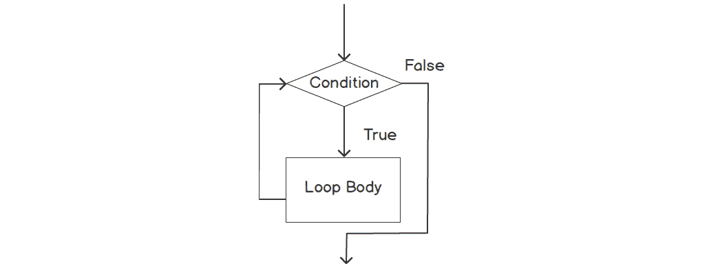
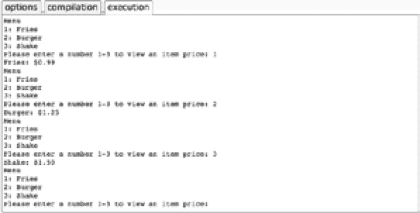
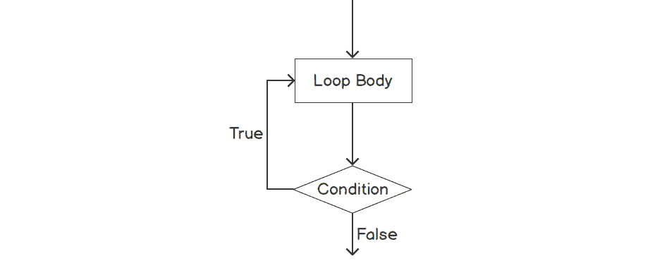
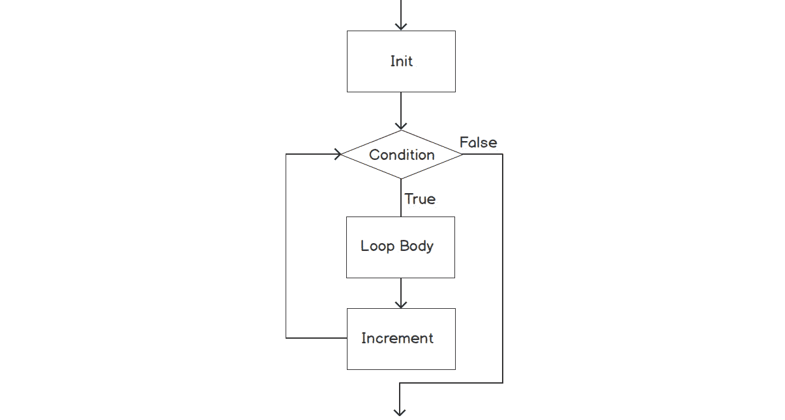

# 二、控制流

概观

本章介绍了用于控制整个应用执行流程的各种工具和技术。这包括但不限于:if 语句、switch 语句和各种循环。我们还将研究如何使用这些技术控制应用的生命周期，以及如何有效地使用它们。本章将以创建一个数字猜测来结束，这个数字猜测将实现各种循环和条件语句。

# 简介

在第一章中，我们介绍了 C++ 的绝对要点，并查看了 C++ 应用的关键组件。我们研究了应用是如何运行的，它们是如何构建的，以及我们如何通过一些基本的输入/输出从它们中获取信息。到目前为止，我们构建的应用主要是按顺序运行的；也就是说，我们编写的代码已经一行一行地按顺序执行了。虽然这对于演示目的来说很好，但这通常不是真实世界应用的工作方式。

为了正确地表示逻辑系统，我们需要在我们做什么和什么时候灵活。例如，我们可能只想在给定语句为真的情况下执行某个操作，或者再次返回到较早的代码段。以这种方式操纵执行被称为控制流(或程序流)，也是本章的主题。

首先，我们来看看最基础的逻辑语句之一`if`语句。然后我们将扩展到查看`switch`语句，这是一个很好的替代长串`if` / `else` 语句的方法。接下来，我们将看看循环。具体来说，我们将看到如何使用它们来重复代码执行，以及如何使用`break`和`continue`语句使它们更加高效和精确。

这一章将以一个有趣的活动结束，在这个活动中，我们将从头开始创建一个猜数字游戏。这不仅需要我们在*第 1 章*、*你的第一个 C++ 应用*中学习的技能，还需要我们即将介绍的程序流技能。当这一章结束时，你不仅会对核心逻辑语句和循环有一个坚实的理解，而且你还会在实际练习中实现它们。

# 如果/否则

最基本也是最重要的控制流语句之一是 if。这个简单的关键字是所有逻辑的核心，只有当指定的条件为真时，才允许我们执行给定的操作。通过创造性地将这些`if`语句链接在一起，我们可以为任何逻辑系统建模。

`if`语句的语法如下:

```cpp
    if (condition) { // do stuff. }
```

如果我们用作条件的语句解析为`true`，那么大括号内的代码将被执行。如果语句为`false`，则跳过。我们的条件可以是任何真实或虚假的东西。这可以是一些简单的事情，比如检查布尔值，也可以是一些更复杂的事情，比如另一个操作或函数的结果。

我们还有`else`语句。这允许在且仅在前面的`if`语句的条件评估为`false`时执行代码。但是，如果条件评估为真，并且`if`语句因此被执行，则`else`语句中的代码将不会被执行。这里有一个例子:

```cpp
    if (MyBool1)
    {
        // Do something.
    }
    else
    {
        // Do something else.
    }
```

在这个例子中，如果`MyBool1`是`true`，那么我们将执行`// Do something`代码，而不是`// Do something else`。然而，如果`MyBool1`评估为`false`，我们将执行`// Do something else`代码而不是`// Do something`。

`else`语句也可以和`if`语句一起使用。有了一个`else` / `if`模块，如果第一个`if`检查失败，那么第二个将被评估。这里有一个例子:

```cpp
    if (MyBool1)
    {
        // Do something.
    }
    else if (MyBool2)
    {
        // Do something else.
    }
```

在本例中，将首先检查`MyBool1`。如果返回`true,`，则`// Do Something`代码将被执行，但`// Do something else`不会。然而，如果`MyBool1`是`false`，那么`MyBool2`将被检查，同样的规则将适用:如果`MyBool2`为真，那么`// Do something else`将被执行。所以，如果`MyBool1`和`MyBool2`都是假的，那么这两个代码都不会被执行。

也可以将`if`语句放在彼此内部。这种做法被称为嵌套。这里有一个例子:

```cpp
    if (MyBool1)
    {
        if (MyBool2)
        {
            // Do something
        }
    }
```

在本例中，如果`MyBool1`返回`true`，则第二条`if`语句将被求值。如果`MyBool2`也是`true`，则执行`// Do Something`；否则，什么都不会被执行。C++ 允许我们嵌套很多层。该标准建议使用 256(虽然没有强制执行)，但是通常来说，层次越深，代码就越混乱。尽可能减少筑巢是一个好的做法。

现在，让我们编写一些代码，看看这些`if` / `else`语句是如何工作的。

## 练习 5:实现 if/else 语句

在本练习中，我们将编写一个简单的应用，根据输入值输出特定的字符串。用户将输入一个数字，应用将使用`if` / `else`语句来确定它是高于还是低于 10。

按照以下步骤完成练习:

注意

完整的代码可以在这里找到:[https://packt.live/2qnQHRV](https://packt.live/2qnQHRV)。

1.  进入`main()`功能，然后定义一个名为`number`的变量:

    ```cpp
    // if/else example 1.
    #include <iostream>
    #include <string>
    int main()
    {
        std::string input;
        int number;
    ```

2.  Write code that prints the `Please enter a number:` string, gets the user input, and then assigns it to the `number` variable:

    ```cpp
        std::cout << "Please enter a number: ";
        getline (std::cin, input);
        number = std::stoi(input);
    ```

    注意

    我们在这里使用了`std::stoi`函数，这是我们在*第一章*、*你的第一个 C++ 应用*中第一次看到的。这个函数将一个字符串值转换成它的整数等价物。例如，字符串`1`将作为`int 1`返回。正如我们之前所做的，将其与`getline`相结合是解析整数输入的好方法。

3.  使用`if` / `else`语句根据用户输入评估条件，然后打印`The number you've entered was less than 10!`或`The number you've entered was greater than 10!` :

    ```cpp
        if (number < 10)
        {
            std::cout << "The number you entered was less than 10!\n";
        }
        else if (number > 10) 
        {
            std::cout << "The number you entered was greater than 10!\n";
        }
        return 0;
    }
    ```

4.  完整的代码如下:

    ```cpp
    // if/else example 1.
    #include <iostream>
    #include <string>
    int main() 
    {
        std::string input;
        int number;
        std::cout << "Please enter a number: ";
        getline(std::cin, input);
        number = std::stoi(input);
        if (number < 10) 
        {
            std::cout << "The number you entered was less than 10!\n";
        } 
        else if (number > 10) 
        {
            std::cout << "The number you entered was greater than 10!\n";
        }
        return 0;
    }
    ```

5.  Run the complete code in your editor. You will see that it evaluates the statements and outputs the correct string, as shown in the following screenshot:

    

图 2.1:if/else 语句允许我们根据条件执行某些代码

在前面的练习中，我们使用了两个`if`语句，这两个语句都评估一个条件，但是如果两个条件都不为真，那么我们想要一个默认操作呢？我们可以通过单独使用`else`语句来实现这一点:

```cpp
    if (condition1)
    {
        // Do stuff.
    }
    else if (condition2)
    {
        // Do different stuff.
    }
    else
    {
        // Do default stuff.
    }
```

在这种情况下，如果`condition1`和`condition2`都不能被证明为真，那么`else`块中的代码将被默认执行。这是因为没有`if`语句，所以没有什么必须是`true`才能进入。

将此应用于我们的简单数字示例，我们当前检查该数字是小于还是大于 10，但如果它正好是 10，则不检查。我们可以用一个`else`语句来处理这个问题，如下所示:

```cpp
    if (number < 10)
    {
        std::cout << "The number you entered was less than 10!\n";
    }
    else if (number > 10) 
    {
        std::cout << "The number you entered was greater than 10!\n";
    }
    else
    {
        std::cout << "The number you entered was exactly 10!\n";
    }
```

## 三元算子

三元运算符是一个简洁的特性，它允许我们基于`if`语句的结果快速赋值。这最好用一个例子来说明。也许我们有一个浮点变量，它的值取决于一个布尔值。如果不使用三元运算符，我们可以这样写:

```cpp
    if (MyBool == true)
    {
        MyFloat = 10.f;
    }
    else
    {
        MyFloat = 5.f;
    }
```

注意

这里，我们使用了`==`而不仅仅是`=`。`=`运算符为变量赋值，而==运算符检查两个值是否相等，如果相等则返回真，否则返回假。这将在后面关于操作符的一章中详细介绍。

使用三元运算符，我们还可以编写如下相同的代码:

```cpp
    MyFloat = MyBool ? 10.f : 5.f;
```

那就简洁多了。让我们在这里分解语法，看看发生了什么。三元语句的写法如下:

```cpp
    variable = condition ? value_if_true : value_if_false;
```

注意

虽然三元语句可以像我们之前看到的`if`语句一样嵌套，但最好还是避免它。它们可能是一个真正的痛苦阅读和理解一目了然。

我们从指定我们想要评估的条件开始，然后用`?`字符跟随它。这就启动了我们的三元陈述。然后，如果值是`true`或`false`，我们定义想要使用的不同值。我们总是从`true`值开始，然后是`false`值，中间用`:`字符隔开。这是一个简洁处理`if/else`场景的好方法。

## 练习 6:使用 if/else 语句创建简单菜单程序

在本练习中，我们将编写一个简单的程序，为一个食品商店提供菜单选项。用户将能够从一个菜单中选择多个选项，我们将根据该选择显示价格信息。

以下是完成练习的步骤:

注意

这个练习的完整代码可以在这里找到:[https://packt.live/35wflPd](https://packt.live/35wflPd)。

1.  创建模板应用，并向用户输出我们的三个菜单选项:

    ```cpp
    // if/else exercise – Menu Program
    #include <iostream>
    #include <string>
    int main()
    {
        std::string input;
        int number;
        std::cout << "Menu\n";
        std::cout << "1: Fries\n";
        std::cout << "2: Burger\n";
        std::cout << "3: Shake\n";
    ```

2.  接下来，我们将要求他们输入他们的选择并存储:

    ```cpp
        std::cout << "Please enter a number 1-3 to view an item price: ";
        getline (std::cin, input);
        number = std::stoi(input);
    ```

3.  现在，我们可以使用我们的`if/else`语句来检查用户输入并输出正确的信息:

    ```cpp
        if (number == 1)
        {
            std::cout << "Fries: $0.99\n";
        }
        else if (number == 2) 
        {
            std::cout << "Burger: $1.25\n";
        }
        else if (number == 3)
        {
            std::cout << "Shake: $1.50\n";
        }
        else
        {
            std::cout << "Invalid choice.";
        }
        return 0;
    }
    ```

4.  完整的代码如下:

    ```cpp
    // if/else exercise – Menu Program
    #include <iostream>
    #include <string>
    int main() 
    {
        std::string input;
        int number;
        std::cout << "Menu\n";
        std::cout << "1: Fries\n";
        std::cout << "2: Burger\n";
        std::cout << "3: Shake\n";
        std::cout << "Please enter a number 1-3 to view an item price: ";
        getline(std::cin, input);
        number = std::stoi(input);
        if (number == 1) 
        {
            std::cout << "Fries: $0.99\n";
        } 
        else if (number == 2) 
        {
            std::cout << "Burger: $1.25\n";
        } 
        else if (number == 3) 
        {
            std::cout << "Shake: $1.50\n";
        } 
        else 
        {
            std::cout << "Invalid choice.";
        }
        return 0;
    }
    ```

5.  运行应用。当我们输入菜单选项时，我们会看到该项目的正确信息，如下图所示:


图 2.2:我们可以选择菜单并输出正确的信息

这种在给定条件为真的情况下执行操作的能力是所有编程的核心。如果你把任何一个系统分解得足够远，它就会包含“如果 x 是真的，就做 y。”有了这些，可能性是无穷无尽的。

# 开关/外壳

正如我们已经看到的，我们可以使用`if` / `else`根据哪些条件为真来执行某些动作。当您评估多个条件语句以确定流程时，这非常有用，例如:

```cpp
    if (checkThisCondition)
    {
        // Do something ...
    }
    else if (checkAnotherCondition)
    {
        // Do something else ...
    }
```

然而，当我们评估单个变量的不同可能性时，我们有一个不同的语句:T0 语句。这允许我们以类似于`if` / `else`语句的方式进行分支，但是每个分支都基于我们正在打开的单个变量的不同可能值。

一个合适的例子是我们在前面的练习中创建的菜单应用。目前，我们链接`if` / `else`语句来处理不同的可能值，但是因为我们打开了单个变量(菜单索引)，所以它更适合作为 switch 语句。

`switch`语句块的基本实现如下:

```cpp
    switch (condition)
    {
        case value1:
            // Do stuff.
        break;
        case value2:
            // Do stuff.
        break;
        default:
            // Do stuff.
        break;
    }
```

将此应用于前面的菜单示例，条件将是我们从用户那里读取的所选菜单索引，不同的值将是我们支持的可能性(1-3)。默认语句会捕捉到用户输入我们没有处理的选项的情况。在这些情况下，我们可以打印一条错误消息，让他们选择不同的选项。

switch 语句包含多个关键字:

*   **开关**:表示我们正在评估的情况。我们将根据它的价值来改变我们的行为。
*   **case** :每个 case 语句后面都是我们要处理的值。然后，我们可以为那个场景定义我们的行为。
*   **break** :这个语句标志着我们给定情况下代码的结束。在下一个主题中有更多关于这些的内容。
*   **default**: This is the default case and is what will get called should none of the other cases match.

    注意

    默认情况不是必需的，但建议使用。它允许我们处理所有其他的值，也许抛出一个异常。

`switch`语句的一个重要限制是只能用于某些类型。这些是整数和`enum`值。这意味着，例如，我们不能在 switch 语句中使用字符串或浮点类型。

注意

枚举类型，或`enum`，是 C++ 中用户生成的数据类型。对此的详细讨论超出了本书的范围。但是，您可以参考以下文档了解更多详细信息:[https://packt.live/35l6QWT](https://packt.live/35l6QWT)。

还值得注意的是，并不是每个案例都需要`break`语句。它们是可选的，尽管在绝大多数情况下可能是必需的。然而，如果省略了`break`语句，那么执行流程将继续到下一个`case`语句，直到遇到中断。这里要小心，因为缺少`break`语句是导致 bug 难找的常见原因；确保每个案例在需要的地方都有一个`break`声明可以为您节省大量潜在的调试时间。

也许看到`switch`语句使用的最好方法是转换一些`if/else`链来切换语句。这将是以下练习的目标。

## 练习 7:将 if/else 链重构为开关/外壳

在本练习中，我们将重用上一练习中的代码，并将其重构为`switch`语句。这将清楚地显示我们如何使用这两种方法来表示相同的功能。然而，因为我们只检查单个变量的不同可能值，所以`switch`语句是优选的。

注意

确保您已经在编译器窗口中复制了上一练习(步骤 1-2)中的代码。完整的代码可以在这里找到:[https://packt.live/32ZZ5Ek](https://packt.live/32ZZ5Ek)。

我们将把它分解成许多简单的步骤:

1.  首先，我们在这里检查的变量是`number`，所以这将是我们打开的条件。将它添加到一个`switch`语句中，并打开我们的花括号，为开关块的其余部分做好准备:

    ```cpp
        switch (number)
        {
    ```

2.  接下来，我们将把第一个`if`语句转换成`case`语句。如果我们看第一个，我们在检查`number`是否等于 1。将此作为我们的第一个`case`值，并将输出复制到`case`体内:

    ```cpp
        case 1:
            std::cout << "Fries: $0.99\n";
        break;
    ```

3.  Now, repeat this for each of the `if` statements, apart from the last one. If you remember, this statement had no condition that it checked; it's simply the last option. This meant that if all other checks failed, execution would fall right through to that final default statement. This is exactly how the default case works, so we will end by moving that `else` statement into a default case. We should end up with the following `switch` statement, which will replace our `if`/`else` chain:

    ```cpp
        switch (number)
        {
            case 1:
                std::cout << "Fries: $0.99\n";
            break;
            case 2:
                std::cout << "Burger: $1.25\n";
            break;
            case 3:
                std::cout << "Shake: $1.50\n";
            break;
            default:
                std::cout << "Invalid choice.";
            break;
        }
    ```

    该语句的功能与链接的`if` / `else`相同，因此您可以使用其中任何一个；然而，你通常会在长长的`if`链上看到 switch 语句。现在，让我们运行这段代码，检查它的行为是否符合我们的预期。

4.  完整的代码如下:

    ```cpp
    // if/else to switch/case
    #include <iostream>
    #include <string>
    int main() 
    {
        std::string input;
        int number;
        std::cout << "Menu\n";
        std::cout << "1: Fries\n";
        std::cout << "2: Burger\n";
        std::cout << "3: Shake\n";
        std::cout << "Please enter a number 1-3 to view an item price: ";
        getline(std::cin, input);
        number = std::stoi(input);
        switch (number) 
        {
        case 1:
            std::cout << "Fries: $0.99\n";
        break;
        case 2:
            std::cout << "Burger: $1.25\n";
        break;
        case 3:
            std::cout << "Shake: $1.50\n";
        break;
        default:
            std::cout << "Invalid choice.";
        break;
        }
    }
    ```

5.  运行完整的代码。您将获得类似于以下内容的输出:


F 图 2.3:代码的工作原理相同，但这次呈现为一个 switch 语句

程序以同样的方式运行，但可以说更整洁，更容易理解。我们可以清楚地看到每个可能的行为分支以及让它执行的案例。

# 循环

除了`if`语句，循环也是最基本的编程概念。如果没有循环，我们的代码将通过逐个运行逻辑语句然后结束来执行。到目前为止，我们的应用就是这样工作的；然而，在现实中，这真的不切实际。系统往往由许多活动的部分组成，代码执行将围绕代码库跳到需要的地方。

我们已经看到了如何通过在代码中创建可以计算语句的分支来实现这一点，并且我们根据结果做了不同的事情。另一种方法是通过循环。循环允许我们重新运行代码段，根据我们选择哪一个，可以是固定次数，也可以是无限次数。我们将看到三个:`while`、`do while`和`for`循环。

## 而

`while`循环是你的武器库中最基本的循环之一，通常是应用中最外层的循环。当执行进入 while 循环时，它通常不会离开，直到条件为假。我们说一般是因为多线程应用可以打破这个规则；然而，它们超出了本入门书的范围。以下是`while`循环的基本实现:

```cpp
    while (condition)
    {
        // Do stuff.
    }
```

以下流程图显示了`while`循环的结构和逻辑流程:



图 2.4:while 循环流程图

在应用中常见的是一个最外面的`while`循环，它将评估一个`bool`，比如`bIsRunning`。这样，您就可以为您的应用设置一个不确定的生命周期，这通常是我们想要的。我们希望软件能运行多久就运行多久。只要我们希望循环停止运行，我们只需将 bool 更改为`false`。然而，我们在这里需要小心，因为很容易形成一个永远不会结束的`while`循环，因为条件永远不会评估`false`。在这种情况下，你的循环将无限期地陷入困境，没有出路。

下面的代码片段展示了使用`while`循环作为最外层循环来控制应用生存期的方法。当`bIsRunning`是`true`时，应用将无限期运行:

```cpp
int main()
{
    bool bIsRunning;

    // Do application setup.
    while (bIsRunning)
    {
        // Run application logic.
    }
    // Do application cleanup.
    return 0;
}
```

我们已经编写了几个接受用户输入的示例应用，但通常在第一次输入后停止。让我们取一个现有的应用，对其进行修改，使其在`while`循环中运行；我们将继续使用我们重构为开关的菜单应用。我们想把所有我们想重新运行的代码放入`while`循环中。这包括输出菜单项、用户选择和输出他们的答案。

## 练习练习 8:实现一个 while 循环

在本练习中，我们将重用*练习 7* 、*中的代码，将 if/else Chain 重新因子化为 switch/case* ，并在菜单程序中实现一个`while`循环。

注意

这个练习的完整代码可以在这里找到:[https://packt.live/35lj81p](https://packt.live/35lj81p)。

按照以下步骤完成练习:

1.  将上一练习中的代码复制到编译器窗口中。
2.  现在，执行一个`while`循环，并将值`true`传递给它，如下所示:

    ```cpp
    #include <iostream>
    #include <string>
    int main()
    bool bIsRunning = true;
    {
        while (bIsRunning)
        {
            std::string input;
            int number;
            std::cout << "Menu\n";
            std::cout << "1: Fries\n";
            std::cout << "2: Burger\n";
            std::cout << "3: Shake\n";
            std::cout << "Please enter a number 1-3 to view an                   item price: ";
            getline (std::cin, input);
            number = std::stoi(input);
            switch (number)
            {
                case 1:
                    std::cout << "Fries: $0.99\n";
                break;
                case 2:
                    std::cout << "Burger: $1.25\n";
                break;
                case 3:
                    std::cout << "Shake: $1.50\n";
                break;
                default:
                    std::cout << "Invalid choice.";
                break;
             }
        }
    }
    ```

3.  完整的代码如下:

    ```cpp
    #include <iostream>
    #include <string>
    int main() 
    bool bIsRunning = true;
    {
       while (bIsRunning)
        {
            std::string input;
            int number;
            std::cout << "Menu\n";
            std::cout << "1: Fries\n";
            std::cout << "2: Burger\n";
            std::cout << "3: Shake\n";
            std::cout << "Please enter a number 1-3 to view an                   item price: ";
            getline(std::cin, input);
            number = std::stoi(input);
            switch (number) 
            {
                case 1:
                    std::cout << "Fries: $0.99\n";
                break;
                case 2:
                    std::cout << "Burger: $1.25\n";
                break;
                case 3:
                    std::cout << "Shake: $1.50\n";
                break;
                default:
                    std::cout << "Invalid choice.";
                break;
            }
        }
    }
    ```

4.  Run the program.

    目前，我们只是希望这个应用无限期运行，因此我们使用`true`作为我们的表达式。我们可以看到它循环，再次要求用户进行选择，如以下输出所示:



图 2.5:应用现在循环，并且能够处理多个用户输入

## 边做边看

do while 循环的结构与`while`循环的结构非常相似，但有一个根本区别:条件检查在身体之后。这种细微的差别意味着身体总是会被执行至少一次。`do` `while`循环的基本结构如下:

```cpp
    do
    {
        // code
    }
    while (condition);
```

以下流程图显示了一个`do` `while`循环的结构和逻辑流程:



图 2.6:边做边循环的示意图

请看下面的例子:

```cpp
    while (false)
    {
        // Do stuff.
    }
```

这个`while`语句中的代码永远不会被执行，因为我们首先计算表达式`false`，从而跳过该代码。然而，如果我们对`do` `while`循环使用相同的条件，如下面的代码片段所示，我们将看到不同的行为:

```cpp
    do
    {
        // Do stuff.
    }
    while (false);
```

在这种情况下，由于执行是从上到下运行的，所以首先执行代码，然后执行条件；即使是`false`，代码也已经运行过一次了。在我们老朋友的帮助下，我们将会看到这个 T2。

## 练习 9:用假条件实现 while 和 do while 循环

在本练习中，我们将编辑我们的“你好世界”程序，以包括一个`while`和一个`do` `while`循环。对于这两个循环，我们将通过`false`条件并观察输出。

注意

这个练习的完整代码可以在这里找到:[https://packt.live/2rc9vU2](https://packt.live/2rc9vU2)。

按照以下步骤完成练习:

1.  Insert the following code, which includes a `while` loop only, in the compiler window, and then execute it:

    ```cpp
    // While loop.
    #include <iostream>
    #include <string>
    int main()
    {
        while (false)
        {
            std::cout << "Hello World!";
        }
        return 0;
    }
    ```

    您将获得以下输出:

    

    图 2.7:使用 while 循环时的输出

    从输出中可以看出，我们在执行窗口中看不到任何东西。因为我们首先进行了评估，所以程序从未执行代码。但是，如果我们用 do while 循环替换 while 循环，这种情况就会改变。

2.  编辑代码以包含一个`do while`循环，如下面的代码片段所示:

    ```cpp
    // do ... while loop.
    #include <iostream>
    #include <string>
    int main()
    {
        do
        {
            std::cout << "Hello World!";
        }
        while (false);
        return 0;
    }
    ```

3.  运行代码。您应该获得以下输出:


图 2.8:一个 do while 循环，显示主体至少被执行一次

现在，我们可以看到我们确实将`Hello` `World`字样打印到了控制台上；所以，虽然这两个循环在本质上是相似的，但它们有很大的区别。`while`循环将首先评估条件，而`do` `while`循环将在之后评估条件。

## 为

`while`和`do while`循环都是不定循环，这意味着它们只有在条件评估为`false`时才会停止。通常，在构建这些循环时，我们不知道需要多少次迭代；我们只是让它运行，并在稍后的某个时刻停止它。`for`然而，当我们知道我们需要多少次迭代时，当我们需要知道我们当前正在进行什么迭代时，就会使用循环。

例如，假设我们有一个联系人集合，我们想要遍历所有联系人，打印出他们的姓名和号码。因为我们知道这个集合的大小，所以我们可以编写一个 for 循环来迭代正确的次数，从而允许我们顺序访问集合中的每个元素。因为我们也知道我们当前在哪个迭代中，我们可以用它来决定我们如何输出数据。也许，对于联系人列表的前半部分，我们希望输出姓名和号码，而对于后半部分，我们只需要号码。或者我们想对列表中的第一个和最后一个联系人做一些特别的事情。一个`for`循环将允许我们做所有这些事情。

注意

一次迭代只是运行一次的循环。如果说一个循环迭代了五次，那只是意味着它运行了五次。

`for`循环的基本结构如下:

```cpp
    for (initialization; condition; iteration expression) 
    {
        statement(s);
    }
```

以下流程图显示了`for`循环的结构和逻辑流程:



图 2.9:循环图

在`for`循环中使用了三个子句:

*   **初始化**:这是一个在循环开始时运行一次的语句。这用于声明将用作计数器的变量。
*   **条件**:这是每次循环运行前检查的条件。如果条件为`true`，则循环运行。如果条件是`false`，那就是`for`循环的结束。这用于检查计数器变量是否低于指定值。这就是我们如何控制循环运行的次数。
*   **迭代表达式**:这是一个在每个循环结束时运行的语句。它用于递增计数器变量。

现在，让我们在下一个练习中实现一个基本的`for`循环来巩固我们的理解。

## 练习 10:实现 for 循环

在本练习中，我们将创建一个`for`循环，该循环将运行五次以打印出一串数字:`01234`。

注意

这个练习的完整代码可以在这里找到:[https://packt.live/332boQl](https://packt.live/332boQl)。

执行以下步骤完成练习:

1.  从主功能开始:

    ```cpp
    #include <iostream>
    #include <string>
    int main()
    {
    ```

2.  创建一个`for`循环，变量`i`初始化为`0`，将`i`设置为小于`5`；递增计数器，最后打印输出。您可以使用以下代码:

    ```cpp
        for (int i = 0; i < 5; ++ i)
        {
            std::cout << i;
        }
    }
    ```

3.  完整的代码如下:

    ```cpp
    #include <iostream>
    #include <string>
    int main() 
    {
        for (int i = 0; i < 5; ++ i) 
        {
            std::cout << i;
        }
    }
    ```

4.  运行代码。您将获得以下输出:


图 2.10:for 循环的输出

我们可以看到打印出了 5 个数字，从 0 到 4，如前面的截图所示。请注意，数字是 0 到 4，因为增量在主循环体之后运行，`i`从值 0 开始。

我们可以将代码分解为前一节中确定的三个语句:**初始化**、**条件**和**增量**。我们在这个循环中的**初始化**语句如下:

```cpp
    int i = 0
```

通过这个语句，我们创建了我们的计数器，并将其值设置为 0。这个计数器将用来记录我们希望循环运行多少次。我们在此循环中的**条件**陈述如下:

```cpp
    i < 5
```

这是**条件**，我们检查以确保循环可以运行，类似于`while`循环如何工作。在每次迭代开始时，检查这个**条件**。如果`I`(我们的计数器变量)小于指定值，那么循环将运行。我们在这个循环中的**增量**语句如下:

```cpp
    ++ i
```

该语句在循环的每次迭代后被调用，并增加我们的计数器，这样我们就可以跟踪循环已经运行了多少次。

## 基于范围的 for 循环

我们要看的最后一个循环，比前三个循环更简单，是基于范围的循环。在 C++ 11 中引入，这个循环允许我们快速迭代集合中的所有对象。我们还没有涉及到集合，所以我们将只在这里讨论基础。

当使用`for`循环迭代集合时，我们使用迭代器。在我们的用例中，这是用来访问元素的`i`变量，如下面的代码片段所示:

```cpp
    int myVector[] {0, 1, 2, 3, 4};
    for (int i = 0; i < myVector.size(); ++ i)
    {
        int currentValue = myVector[i];
        std::cout << "\n" << currentValue;
    }
```

然而，对于基于范围的`for`循环，我们不会通过递增的值手动获取元素。相反，循环只是给我们集合中的每个值:

```cpp
    int myVector[] {0, 1, 2, 3, 4};
    for (int currentValue : myVector)
    {
        std::cout << "\n" << currentValue;
    }
```

这两个循环将产生相同的输出，但是我们可以看到第二个循环更简洁，更不容易出错，因为我们不是手动获取元素，并且也很可能更高效。通常，如果您不需要索引值，那么这种循环将允许您拥有更干净、更可靠的代码。

## 练习 11:使用循环生成随机数

在本练习中，我们将构建一个应用，为用户生成一组随机数。我们的应用将由一个主外部循环和其中的另一个循环组成，以控制我们的数字的生成。

对于外部循环，我们将使用`while`循环，这是应用的常见设置。我们知道这个循环将无限期运行，所以它非常适合控制应用的最外层范围。对于内部循环，我们将使用`for`循环，因为我们将知道用户想要生成多少个数字。

注意

这个练习的完整代码可以在这里找到:[https://packt.live/2s4it6l](https://packt.live/2s4it6l)。

按照以下步骤完成练习:

1.  我们将从创建我们的`main`函数和定义我们的`main`变量开始。这包括`bIsRunning`T3，它将控制我们应用的生命周期:

    ```cpp
    #include <iostream>
    #include <string>
    #include <cstdlib> 
    #include <ctime>
    int main()
    {
        bool bIsRunning = true;
        std::string input = "";
        int count = 0;
    ```

2.  接下来，我们将输出标题内容并创建`main`循环。我们使用的是`while`循环，我们的条件是`bool`我们刚刚定义的:

    ```cpp
        std::cout << "***Random number generator***\n";
        while (bIsRunning)
        {
    ```

3.  With our `while` loop in place, we can now add all the code that we want to run during each iteration of the `main` loop. This starts with outputting our instructions and reading the user input:

    ```cpp
            std::cout << "Enter amount of numbers to generate,                   or 0 to exit: ";
            // Get count from user.
            getline(std::cin, input); 
            count = std::stoi(input);
    ```

    本章已经介绍了`break`，现在我们可以使用它来检查用户是否想要退出应用。如果用户输入了一个`0`，表明这一点，我们可以调用`break`，退出主`while`循环，结束应用。我们还将为我们的随机数生成设置种子。

    注意

    为了生成我们的随机数，我们使用`rand`和`srand`。`rand`给我们我们的随机数，`srand`为随机数生成设置种子。通过使用`time(0)`，以秒为单位的时间自纪元以来，我们获得了一个足够随机的种子和数字来满足我们的需求。

4.  输入以下代码，插入`break`语句，允许用户退出应用。我们稍后将更详细地介绍“`break`”:

    ```cpp
            // Check if user wants to quit application.
            if (count == 0)
            {
                break;
            }
            // Generate and output random numbers.
            srand((unsigned)time(0));
    ```

5.  Now, we can write the `main` loop that will generate our random numbers and output them to the user. Since we got a `count` variable from our user, we can use that to ensure we iterate the correct number of times. Within the loop, we'll generate a random number and do a bit of formatting. After each number, we want to print a comma to create a well-formatted list, but not after the last one. We can use a `continue` statement for this:

    注意

    `continue`语句将在下一个主题中介绍。现在，请注意，它允许我们跳过当前循环的剩余部分，立即开始下一个循环。

    ```cpp
            for (int i = 0; i < count; ++ i)
            {
                std::cout << rand() % 10;
                if (i == count - 1)
                {
                    continue; 
                }
                std::cout << ", ";
            }
    ```

    注意

    模数%运算符返回除法后的余数。在前面的步骤中，我们使用它和`rand()`一起生成 0 到 9 之间的数字。我们将在*第 4 章*、*操作员*中详细介绍这一点和许多其他操作员。

6.  最后，我们将输出几行空白行用于演示，并添加最后的大括号:

    ```cpp
            std::cout << "\n\n";
        }
    }
    ```

7.  完整的代码如下:

    ```cpp
    #include <iostream>
    #include <string>
    #include <cstdlib>
    #include <ctime>
    int main() 
    {
        bool bIsRunning = true;
        std::string input = "";
        int count = 0;
        std::cout << "***Random number generator***\n";
        while (bIsRunning) 
        {
            std::cout << "Enter amount of numbers to generate,                   or 0 to exit: ";
            // Get count from user.
            getline(std::cin, input);
            count = std::stoi(input);
            // Check if user wants to quit application.
            if (count == 0) 
            {
                break;
            }
            // Generate and output random numbers.
            srand((unsigned) time(0));
            for (int i = 0; i < count; ++ i) 
            {
                std::cout << rand() % 10;
                if (i == count - 1) 
                {
                    continue;
                }
                std::cout << ", ";
            }
            std::cout << "\n\n";
        }
    }
    ```

8.  Run the application. When complete, the application should be able to generate the specified number of random integers, as shown here:

    

图 2.11:将无限期运行的程序，如果用户不退出，将输出一系列数字

通过使用`while`循环，我们已经能够创建一个可以无限期使用的应用。想象一下，如果每次你在电脑上做一件事，你只能在它需要重启之前做一件事。这不太实际。拥有循环代码和操作程序流的能力是必不可少的。

# 中断/继续

拥有循环代码段的能力非常重要，但必须谨慎使用。我们已经看到，创建永不结束的循环是可能的，另一个关注点是确保它们得到有效利用。到目前为止，我们看到的循环一直很小，我们很高兴看到它们完整地运行。但是，如果我们需要更多的控制我们的循环，也许提前结束一个循环呢？值得庆幸的是，我们有两个重要的关键词可以帮助我们做到这一点——`break`和`continue`。

## 休息

`break`是一个 C++ 关键字，将退出当前循环，如果有代码，执行将跳转到下一段代码。这个关键字适用于我们已经介绍过的不同类型的循环，我们可以使用一个简单的计数应用很好地演示它，如下面的代码片段所示:

```cpp
// Break example.
#include <iostream>
#include <string>
int main()
{
    std::cout << "Loop Starting ...\n";
    int count = 0;
    while (count < 5)
    {
        ++ count;
        std::cout << "\n" << count;
    }
    std::cout << "\n\nLoop finished.";
}
```

在这个例子中，我们将打印出 5 个数字，0-4。如果我们按原样运行这段代码，我们可以看到循环完整地运行，并给出我们期望的结果。我们在循环的开始和结束都有语句，因此我们可以更清楚地看到流程执行:


图 2.12:示例计数应用将打印出数字 0-4

现在，如果有一个条件意味着我们希望这个循环在计数等于 2 时停止执行呢？嗯，我们可以使用`if`语句将`break`语句放入支票中:

```cpp
#include <iostream>
using namespace std;
int main()
{
    std::cout << "Loop Starting ...\n";
    int count = 1; // init
    while (count <= 5) // condition
    {
        std::cout << "\n" << count;
        if (count == 2)
        break;
        ++ count; // increment
    }
    std::cout << "\n\nLoop finished.";

    return 0;
}
```

有了`break`条件，一旦计数等于`2`(意味着我们将有 2 次循环迭代)，那么断点将被命中，我们将退出循环。现在，让我们运行应用，看看我们得到了什么:


图 2.13:break 语句就位后，我们只执行 2 次循环迭代

我们现在可以看到，一旦满足该条件并且`break`语句被命中，循环就停止迭代，并且代码执行在循环之后立即开始。如果我们把它写成一个`do`……`while`，结果会完全一样:

```cpp
#include <iostream>
using namespace std;
int main()
{
    std::cout << "Loop Starting ...\n";
    int count = 1; // init
    do
    {
        std::cout << "\n" << count;
        if (count == 2)
        break;
        ++ count; // increment
        }
        while (count <= 5); // condition

        std::cout << "\n\nLoop finished.";
        return 0;
}
```

如果我们把它写成一个`for`循环，也是一样的:

```cpp
#include <iostream>
using namespace std;
int main()
{   
    std::cout << "Loop Starting ...\n";
    // init condition increment
    for (int count = 1; count <= 5; ++ count)
    {
        std::cout << "\n" << count;
        if (count == 2)
        break;
    }

    std::cout << "\n\nLoop finished.";
    return 0;
}
```

这两个循环给出完全相同的行为；到达`break`语句并退出循环之前的两次迭代:


图 2.14:所有的循环给出相同的结果:退出前两次迭代

这表明这些循环有时是可以互换的，尽管有些比其他更适合某些用例。例如，对于我们在这里使用的计数示例，一个`for`循环可能是最合适的，因为它带有一个整数值，用于递增每个循环——这是我们必须手动对`while`和`do while`循环进行的操作。然而，当不需要递增整数时，建议使用基于范围的`for`循环。

## 继续

我们可以使用的另一个关键词是`continue`。这个关键字允许我们跳过当前的循环迭代，但保留在循环中，与`break`形成对比。同样，计数示例将允许我们演示这一点。在我们的例子中，我们打印数字 0-4；让我们使用`continue`关键字跳过数字 3 的打印。

就像我们对`break`所做的那样，我们可以写一个条件来检查计数是否等于 3，如果是，就调用`count`:

```cpp
    if (count == 3)
    {
        continue;
    }
```

我们还需要在我们的功能中改变这个位置。`continue`关键字将跳过循环体的其余部分。目前，这段代码位于该主体的末尾，因此我们实际上不会跳过任何内容。为了让`continue`按预期工作，它需要出现在我们想要跳过的任何代码之前，但是在我们想要执行的任何代码之后。

对于本例，我们将把`continue`关键字放在`if`语句中:

```cpp
// continue example.
#include <iostream>
#include <string>
int main() 
{
    std::cout << "Loop Starting ...\n";
    int count = 0;
    while (count < 5) 
    {
        ++ count;
        if (count == 3) 
        {
            continue;
        }
        std::cout << "\n" << count;
    }
    std::cout << "\n\nLoop finished.";
}
```

这里，我们总是要增加我们的`counter`变量，然后检查我们是否想要跳过当前迭代。如果我们跳过它，我们将回到下一个循环的开始，如果我们没有，我们将像往常一样执行循环的剩余部分。运行此代码后，您将获得以下输出:


图 2.15:数字 3 的打印已被跳过

我们已经按照自己的意愿跳过了数字 3 的打印，但是循环继续执行剩下的部分。这在搜索某样东西时非常有用。想象一下，我们有一个名字列表，我们只想用那些以字母 D 开头的名字来做事。我们可以遍历所有的名字，首先检查第一个字母是否是 D；如果没有，我们继续。这样，我们可以有效地跳过我们不感兴趣的用例。

## 练习 12:使用中断和继续使循环更有效

在本练习中，我们将利用`break`和`continue`来提高循环的效率。我们将创建一个在数字 1-100 上运行的循环，只打印给定值的特定倍数。

注意

完整的代码可以在这里找到:[https://packt.live/2KJrnN8](https://packt.live/2KJrnN8)。

按照以下步骤完成练习:

1.  我们首先要求用户选择要打印倍数的值，以及要打印的最大倍数:

    ```cpp
    #include <iostream>
    #include <string>
    int main()
    {
        int multiple = 0;
        int count = 0;
        int numbersPrinted = 0;
        std::string input = "";
        std::cout << "Enter the value whose multiples will be printed: ";
        getline(std::cin, input);
        multiple = std::stoi(input);
        std::cout << "Enter maximum amount of numbers to print: ";
        getline(std::cin, input);
        count = std::stoi(input);
    ```

2.  接下来，我们将创建`for`循环来迭代数字 1-100:

    ```cpp
        for (int i = 1; i <= 100; ++ i)
        {
        }
    ```

3.  现在，在`for`循环中，我们可以编写确定倍数的逻辑。首先，我们有一组要打印的数字，所以我们可以检查一下，如果已经达到了这个数字

    ```cpp
            if (numbersPrinted == count)
            {
                break;
            }
    ```

4.  我们只对给定倍数的数字感兴趣，所以如果不是这样，我们可以使用`continue`语句直接跳到下一个迭代:

    ```cpp
            if (i % multiple != 0)
            {
                continue;
            }
    ```

5.  如果循环迭代通过了这两个语句，那么我们就找到了一个有效的数字。在这种情况下，我们将打印它，然后使用下面的代码片段增加我们的`numbersPrinted`变量:

    ```cpp
                std::cout << i << "\n";
                ++ numbersPrinted;
            }
    ```

6.  完整的代码如下:

    ```cpp
    #include <iostream>
    #include <string>
    int main()
    {
        int multiple = 0;
        int count = 0;
        int numbersPrinted = 0;
        std::string input = "";

        std::cout << "Enter the value whose multiples will be printed: ";
        getline(std::cin, input);
        multiple = std::stoi(input);

        std::cout << "Enter maximum amount of numbers to print: ";
        getline(std::cin, input);
        count = std::stoi(input);
        for (int i = 1; i <= 100; ++ i)
        {
              if (numbersPrinted == count)
              {
                  break;
              }
              if (i % multiple != 0)
              {
                  continue;
              }
              std::cout << i << "\n";
              ++ numbersPrinted;
        }
    }
    ```

7.  运行应用。您将获得以下输出:


图 2.16:我们使用 break 并继续控制循环执行

通过使用 **break** 和 **continue** 语句，我们能够控制循环的执行，使它们更加高效和可控。

## 活动 2:使用循环和条件语句创建猜数字游戏

对于本章的活动，我们将编写一个小的猜数字游戏。这将使我们能够利用我们在本章中已经介绍过的技术。因此，在尝试本练习之前，请确保您已经完成了本章前面的所有练习。

该程序将允许用户选择猜测次数:最小次数和最大次数。应用将在该范围内生成一个数字，然后允许用户猜测该数字。如果他们在开始时指定的猜测次数内这样做，他们就赢得了比赛。赢得游戏后，最终输出应该类似于以下内容:


图 2.17:猜数字游戏输出

注意

这个活动的完整代码可以在这里找到:[https://packt.live/2pBYnPT](https://packt.live/2pBYnPT)。

以下是完成活动的步骤，以及一些提示:

1.  申报我们需要的所有变量。这包括`guessCount`、`minNumber`、`maxNumber`和`randomNumber`。
2.  创建一个运行应用的主外部循环。
3.  Present the user with some introductory text (`"Enter the number of guesses"`) and get from them the following: a number of guesses, a minimum number, and a maximum number.

    注意

    您可以将猜测次数、最小次数和最大次数的用户输入传递给变量。

4.  Generate a random number within the range specified by the user.

    注意

    在*练习 11* 、*使用循环*生成随机数时，我们使用了`rand()`来生成 0 到 9 之间的随机数。这里可以使用类似`rand () % (maxNumber - minNumber + 1)`的函数，生成任意两个极限之间的随机数。

5.  创建一个循环，重复用户指定的猜测次数。
6.  在`count`循环中，获取用户的猜测。
7.  Inside the `count` loop, check whether the user's guess is correct or too high/low. We can use `break` here to exit when the correct value has been guessed.

    提示:参考*练习 7* 、*将 if/else 链重构为开关/外壳*，看看我们如何使用`break`提前退出循环。

8.  When the number has been found, or the user has run out of guesses, present them with the option to either continue or exit the application.

    注意

    这个活动的解决方案可以在第 516 页找到。

在这个应用中，我们使用了许多技术来控制代码流，以复制更复杂的场景。我们使用`while`循环作为主应用循环，因为我们最初不知道需要多少次迭代。然后，我们使用`for`循环运行代码设定的次数，并使用`if/else`语句检查用户的输入并采取相应的行动。

# 总结

在这一章中，我们已经了解了程序流，以及如何通过应用操纵执行流。这是表示逻辑系统的基础。

我们从查看基本的 **if** / **else** 语句开始。这些允许我们根据条件来分支我们的代码，并且是编程中最基本的思想之一。借助这种分支能力，我们能够通过控制应用的执行流程来复制逻辑系统和行为。然后我们看了一些基本的 **if** / **else** 语句的替代语句，比如 **switch** 和**三元**语句。

接下来，我们看了一些不同的循环。我们从**开始，而**和**则在**循环；只要检查的条件为真，循环就会无限期运行。然后我们看一下**的**循环，它运行了设定的迭代次数。最后，我们看一下基于范围的循环，这对于遍历集合很有用。最后，我们看看如何确保我们的循环是有效的，用 **break** 语句提前结束它们，或者用 **continue** 语句跳过迭代。

我们通过构建一个简单的游戏来练习所有这些新技能，该游戏允许用户猜测一个随机选择的数字。我们允许用户输入一些值来设置游戏，然后给他们一些猜测来试图找到这个数字。我们利用了在*第 1 章*、*你的第一个 C++ 应用*中所学的一切，以及我们在本章中看到的 if/else 语句和一些循环。

在下一章中，我们将仔细研究 C++ 提供的各种数据类型。我们将从查看各种内置类型(`int`、`double`、`char`等)开始，然后查看这些类型的数组和集合。然后，我们将讨论存储生存期、范围、类和结构等概念。了解了一般的 C++ 应用、控制执行流程，以及如何用各种数据类型来表示和存储数据，我们很快就能对 C++ 语言有一个功能性的理解。