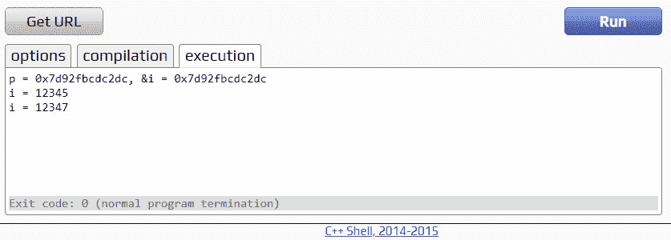
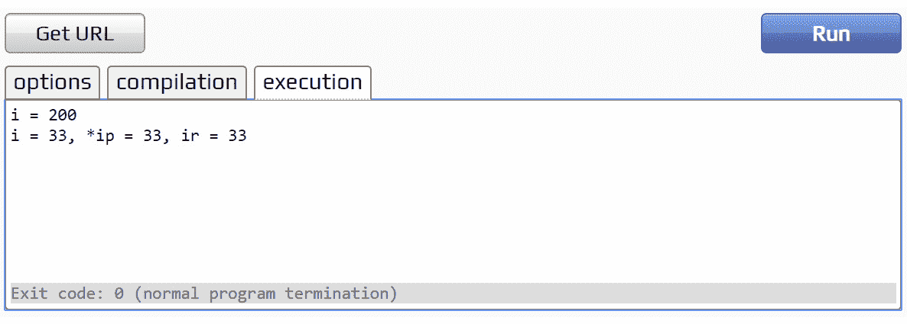
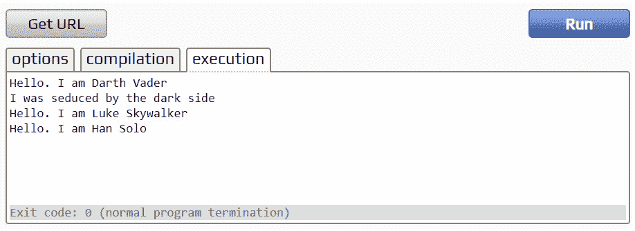

# 五、指针和引用

概观

本章详细介绍了 C++ 内置的指针类型和引用类型，以便您有效地使用它们。指针和引用类型是构建数据结构的重要原材料，因此理解这些简单、原始的类型对于您作为 C++ 开发人员的成功至关重要。

本章结束时，您将能够描述 C++ 使用的内存地址模型；解释指针和引用如何引用其他变量；声明、初始化和使用指针和引用；解释指针和数组是如何相似的；描述指针如何步进通过数组的元素；执行指针算术，并使用指针和引用作为函数参数。

# 简介

到目前为止，这本书已经研究了几种类型的变量:整数、字符、浮点数加数组和由这些简单类型组成的结构。在前几章中，已经向您介绍了指针和引用。在本章中，我们将更详细地研究这些变量。

指针是*指向*另一个变量的变量。指针有类型；也就是说，指向`int` *的指针指向*或者指向一个`int`。`char`的指针指的是`char`。指向`int`的指针可以分配给另一个指向`int`的指针，但不能分配给指向`char`的指针。指向类`foo`的指针引用类`foo`的实例。指针也可以是特殊值`nullptr`，表示指针没有指向任何东西。引用是一个指针，但有一些限制，使用起来更安全，这将在本章后面详细讨论。

C++ 指针可以指向任何数据结构中的任何变量，并且可以遍历数组。为了提高指针的效率，C++ 不检查指针是否指向包含与指针类型相同的变量的有效内存位置。这意味着指针会造成严重破坏，意外地覆盖不小心使用它们的程序中的数据。较新语言的发明者总是将指针命名为避免 C++ 的理由。然而，正如我们将在后面看到的，指针的风险相对容易管理。

在 C++ 的早期，指针使它在遍历数组时比其他语言具有巨大的速度优势。当程序使用指针时，即使是简单的编译器也会产生优秀的代码。这种特殊的优势在现代 C++ 实现中不太重要，因为编译器已经变得更加复杂，但是指针仍然有优势。指针被深深地编织到 C++ 语言的结构和 C++ 编程的文化中。

因为指针和引用可以指向其他数据结构，所以使用指针是一种快捷方式，无需重复编写代码来访问数据。这也可以让 C++ 比其他语言有速度优势。

指针和引用可用于将复杂数据结构的一部分链接到另一部分。指针可以遍历数组，也可以遍历链接的数据结构。本章稍后将介绍遍历数组。下一章将讨论遍历链接数据结构。

指针和引用也很有用，因为指向大数组或类实例的指针可以传递给函数，而不是将数组或实例复制到函数的形式参数中。指针在引用动态变量方面有重要作用；这将在第 6 章中描述。

# 内存地址

计算机的内存可以建模为一个很长的字节数组。每个字节都有一个地址，其作用与数组下标相同。每个变量都有一个地址，它可能是存储变量位的几个字节地址中的第一个。普通变量的名字被编译器翻译成地址。下图将内存区域显示为从左向右延伸的长磁带。磁带上方的十六进制数字是内存地址。为简单起见，我们只显示了每四个字节的地址:


图 5.1:将计算机内存可视化为一长串字节

在程序声明变量之前，内存字节没有固定的意义。在图中，程序已经声明了一个名为`i`的`int`变量，并将其初始化为整数值`12345`。编译器为`int`变量保留了 4 个字节的存储空间，该变量定义了保存整数值的特定存储空间。编译器最初将`12345`放在那个存储器中，尽管程序可以在以后更改它。名称`i`现在是内存地址 **0x12A00404** 的同义词。

## 指针

指针是保存另一个变量地址的变量。也就是说，一个指针*指向另一个变量*。指针用类型名和星号`*`声明；因此，要声明一个名为`ptr`的指向`int`变量的指针，声明看起来像`int* ptr;`。纯粹主义者可能更喜欢把星号和变量名放在一起，就像在`int *ptr;`中一样。这里不涉及这种偏好的原因。

运算符的`&`地址产生其参数的地址，将变量转换为指向该变量的指针。如果`i1`是一个`int`变量，那么`&i1`就是指向`i1`的`int`指针。`&`操作符可理解为“取…的地址”。地址运算符的作用可以通过参考下图来理解:


图 5.2:指针初始化

在该图中，使用声明`int *pi = &i;`，指针`pi`被初始化为指向`int`变量`i`。它指向内存地址 **0x12A00400** ，这是编译器放置`i`的地址。

像 C++ 中的其他基本类型的变量一样，如果指针没有初始化，也没有为指针赋值，那么它就包含了创建时碰巧在内存中的随机位。这些随机位可能不指向任何有效变量的地址。

因为指针中包含的值没有可解释的含义，所以很难判断指针是否被赋值。为了帮助解决这个问题，C++ 将常量`nullptr`定义为一个指针值，保证不指向任何有效的内存地址。`nullptr`可以分配给任何类型的指针。当整数常量`0`被赋值或与指针比较时，其含义与`nullptr`相同。在较旧的 C++ 代码中，您可能还会看到分配给指针的预处理器宏`NULL`，而不是`nullptr`。`NULL`通常定义为零。当所有指针变量被声明时，给它们赋值`nullptr`是个好主意。

`*` ( `dereference`)运算符取消指针引用。也就是说，如果指针`p`引用一个`int`变量，`*p`就是它所引用的`int`变量。如果程序应用`*`运算符取消引用设置为`nullptr`的指针，程序将崩溃并显示一条简短的错误消息，因为程序试图访问一个没有映射到任何实际内存的机器地址。如果取消引用从未设置的指针，它可能会崩溃，或者继续运行，但不会产生有效的结果。

考虑到指针的基本功能，第一个练习提供了一个非常简单的例子，说明如何在一个正常运行的 C++ 程序中把各个部分组合在一起。

## 练习 26:指针

在本练习中，您将编写一个非常简单的程序，创建一个指针，将其设置为指向一个`int`，然后通过指针更改`int`的值。程序将说明指针声明和赋值的语法。程序还将打印指针的值和`int`的地址，以证明它们是相同的，并且通过指针改变前后`int`的值，以验证它已经改变。

注意

这个练习的完整代码可以在这里找到:[https://packt.live/2qnUzCt](https://packt.live/2qnUzCt)。

以下是完成练习的步骤:

1.  首先进入`main()`功能的骨架:

    ```cpp
    #include <iostream>
    using namespace std;
    int main()
    {
        return 0;
    }
    ```

2.  在函数`main()`中，声明一个`int`变量`i`，并将其初始化为`12345` :

    ```cpp
        int i = 12345;
    ```

3.  声明一个指向`int`变量`p`的指针，并将其初始化为指向`int` :

    ```cpp
        int *p = &i;
    ```

4.  Output the value of the pointer and the address of the `int` variable:

    ```cpp
        cout << "p = " << p << ", &i = " << &i << endl;
    ```

    打印的具体十六进制地址可能因编译器而异，因运行而异，但关键是两个数字是一样的；也就是指针指向`int`。

5.  输出`int`变量的值，`i` :

    ```cpp
        cout << "i = " << i << endl;
    ```

6.  使用`*`操作符取消指针引用，产生指向`int`。然后，将`2`添加到值中并再次保存:

    ```cpp
        *p = *p + 2;
    ```

7.  最后，打印出该值，以证明将`2`添加到取消引用的指针也将`2`添加到了`int` :

    ```cpp
        cout << "i = " << i << endl;
    ```

8.  完整的程序如下:

    ```cpp
    #include <iostream>
    using namespace std;
    int main()
    {
        int i = 12345;
        int *p = &i;
        cout << "p = " << p << ", &i = " << &i << endl;
        cout << "i = " << i << endl;
        *p = *p + 2;
        cout << "i = " << i << endl; 
        return 0;
    }
    ```

9.  Compile and run the program. This is the output of one particular run of the compiled program:

    

图 5.3:练习 26 产生的输出

该结果中显示的十六进制地址可能与运行程序时打印的地址不同。这是意料之中的。重要的是这两个地址将是相同的。在为取消引用的指针赋值后，`int`的值也如预期的那样发生了变化。

## 练习 27:取消引用空值

取消引用`nullptr`会在运行时导致错误并停止程序。取消引用`nullptr`不是程序员故意做的事情。当程序中的某个执行路径在指针被使用之前没有将指针初始化为有效的机器地址时，这种情况就会发生。初始化每个指向`nullptr`的指针会产生一个特定的错误消息，而取消对未初始化指针的引用会导致更微妙的错误。以下是您可以执行的一些步骤，以查看其实际效果:

注意

这个练习的完整代码可以在这里找到:[https://packt.live/2pGNtZi](https://packt.live/2pGNtZi)。

1.  Type in the following program:

    ```cpp
    #include <iostream>
    using namespace std;
    int main()
    {
        int *p1 = nullptr;
        cout << "p1 = " << p1 << endl;
        *p1 = 22;
        return 0;
    }
    ```

    您可以将其输入到一个在线 C++ 编译器中，或者使用您选择的编辑器为传统的 C++ 编译器创建一个文件。

2.  现在运行程序。程序的一个特定运行的输出如下所示:


图 5.4:程序崩溃并显示一条错误消息

注意

并非所有的在线 C++ 编译器都从操作系统打印消息。使用诸如 tutorialspoint([https://www.tutorialspoint.com/compile_cpp_online.php](https://www.tutorialspoint.com/compile_cpp_online.php))这样的编译器，确保看到前面的输出。

不出所料，程序因操作系统的错误信息而崩溃。Windows 和 Linux 都会产生一条错误消息。如果您正在使用在线编译器，并且所使用的特定在线编译器没有显示错误消息，请尝试使用不同的在线编译器。

## 指向数组的指针

在 C++ 中，数组和指针几乎无法区分。指向数组开头的指针、第一个元素的地址和裸数组名都表示相同的意思。

数组元素是变量。`&`运算符可用于获取要分配给指针的数组元素的地址。表达式`p = &a[2];`更新`p`指向数组`a`中的第三个条目(记住，数组从零开始)。

指针的工作方式类似于 C++ 中的数组。它可以像数组一样下标。如果`p`指向`a[2]`，则表达式`p[3]`获取数组中的第六个条目(即`a[5]`处的条目)。

## 练习 28:指向数组的指针

这是关于指针和数组的几个练习中的第一个。在这个简单的练习中，您将设置一个指向数组元素的指针，并测试它是否指向预期值。您将下标一个指针，并看到它产生预期的数组元素。记住 C++ 中数组从零开始，这样`a[5]`就是第六个元素。

注意

这个练习的完整代码可以在这里找到:[https://packt.live/2OA77yz](https://packt.live/2OA77yz)。

以下是完成练习的步骤:

1.  Enter the skeleton `main()` function, as follows:

    ```cpp
    #include <iostream>
    using namespace std;
    int main()
    {
        return 0;
    }
    ```

    如果你愿意，你可以编译和运行这个程序的每个部分；否则，您可以等到全部输入后再运行它。

2.  跟随`main()`的左花括号，声明一个名为`a`的`7` `ints`数组，并初始化它。然后，声明一个名为`p`的指向`int`的指针，并将其设置为`nullptr`，这样我们就知道它被设置为未知地址:

    ```cpp
        int a[7]{ 1, 3, 5, 4, 2, 9, -1 };
        int *p = nullptr;
    ```

3.  现在，使用运算符的`&`地址将`p`设置为`a[2]`的地址，以获取数组元素的地址:

    ```cpp
        p = &a[2];
    ```

4.  输出取消引用的指针`*p`和`a[2]`的值，查看指针是否实际指向`a[2]` :

    ```cpp
        cout << "*p = " << *p << ", a[2] = " << a[2] << endl;
    ```

5.  接下来，输出`p[3]`和`a[5]`。这表明指针可以像数组一样下标，`p[3]`指向与`a[5]` :

    ```cpp
        cout << "p[3] = " << p[3] << ", a[5] = " << a[5] << endl;
    ```

    相同的值
6.  完整的程序如下:

    ```cpp
    #include <iostream>
    using namespace std;
    int main() 
    {
        int a[7] {1, 3, 5, 4, 2, 9, -1};
        int * p = nullptr;
        p = & a[2];
        cout << "*p = " << * p << ", a[2] = " << a[2] << endl;
        cout << "p[3] = " << p[3] << ", a[5] = " << a[5] << endl;
        return 0;
    }
    ```

7.  编译并运行程序。下面是这个程序的输出:


图 5.5:练习 28 中程序的输出

正如预期的那样，打印的值是相等的。它们都是同一个数组元素，这可以通过查看数组初始值来验证。订阅指针的工作方式与订阅数组完全一样；然而，由于`a[2]`的地址被分配给指针而不是`a[0]`的地址，所以指针的下标偏离了数组的下标。

## 指针算法

C++ 将数组的名称转换成指向`a[0]`的指针，T0 是数组的第一个条目。其中`a`是数组的语句`p = a;`更新`p`指向`a`中的第一个条目。

程序可以给指针添加一个。如果指针指向一个数组，`p+1`的结果是指向下一个数组元素的指针。指针的十六进制地址值随数组元素的字节大小而变化。

该程序可以将任何整数表达式的值添加到指针上，从而产生一个前进了那么多元素的指针。如果`p`是指针，`k`是`int`，那么指针表达式`p+k`是与`p`相同类型的指针。

如果一个指针指向同一个数组，程序可以从另一个指针中减去一个。结果是两个指针之间的数组元素的数量。如果两个指针没有指向同一个数组，则不能解释减去指针的结果。

如果两个指针指向同一个数组，程序可以使用任何关系运算符(如`==`、`!=`、`<`、`>`、`<=`和`>=`)对它们进行比较。如果指针指向不同的数组，那么就会产生一个无意义的答案。

## 练习 29:指针运算

本练习演示了指针算术和指针关系运算符的工作原理，还将让您习惯于解释指针表达式。

注意

这个练习的完整代码可以在这里找到:[https://packt.live/2KVIvPV](https://packt.live/2KVIvPV)。

以下是完成练习的步骤:

1.  进入骨架`main()`功能。您可以在每一步后运行程序，或者等到全部输入后再运行:

    ```cpp
    #include <iostream>
    using namespace std;
    int main()
    {
        return 0;
    }
    ```

2.  在`main()`的左花括号之后，声明一个五个`ints`的数组，叫做`numbers`。声明一个指向`int`的名为`pint`的指针，并将其初始化为`numbers`。声明另一个指向`int`的名为`p2`的指针，并将其初始化为指向`numbers[3]` :

    ```cpp
        int numbers[5]{ 0, 100, 200, 300, 400 };
        int* pint = numbers;
        int* p2 = &numbers[3];
    ```

3.  接下来，输出`pint`的值、指针表达式`pint+1`的值和`sizeof(int)`，它告诉你一个`int`在这台机器上占用多少字节的内存。虽然为指针打印的十六进制值通常是人类无法解释的，但是你会发现打印的两个十六进制数字有所不同`sizeof(int)`。将`1`添加到指针会增加指向类型的大小:

    ```cpp
        cout << "pint = " << pint << ", pint+1 = " << pint+1 
             << ", sizeof(int) = " << sizeof(int) << endl;
    ```

4.  输出表达式`*(pint+1)`和下标指针的值`pint[1]`，以证明它们是相同的。然后输出`*(pint+4)`和`pint[4]`，也是一样的:

    ```cpp
        cout << "*(pint+1) = " << *(pint+1)
             << ", pint[1] = " << pint[1] << endl;
        cout << "*(pint+4) = " << *(pint+4)
             << ", pint[4] = " << pint[4] << endl;
    ```

5.  输出指针表达式`p2 – pint`。差额应打印为`3` :

    ```cpp
        cout << "p2 - pint = " << p2 - pint << endl;
    ```

6.  使用`==`和`>`运算符输出两个指针比较。输出操纵器`boolalpha`使类型`bool`的表达式打印为`true`或`false`。否则转换为`int`，打印为 1 或 0。此外，比较运算符的运算符优先级低于输出插入运算符`<<`。比较表达式必须加圆括号以避免编译错误:

    ```cpp
        cout << "p2 == pint = " << boolalpha << (p2 == pint) << endl;
        cout << "p2 > pint = " << boolalpha << (p2 > pint) << endl;
    ```

7.  完整的程序如下:

    ```cpp
    #include <iostream>
    using namespace std;
    int main() 
    {
        int numbers[5] {0, 100, 200, 300, 400};
        int * pint = numbers;
        int * p2 = & numbers[3];
        cout << "pint = " << pint << ", pint+1 = " << pint + 1
             << ", sizeof(int) = " << sizeof(int) << endl;
        cout << "*(pint+1) = " << * (pint + 1) 
             << ", pint[1] = " << pint[1] << endl;
        cout << "*(pint+4) = " << * (pint + 4) 
             << ", pint[4] = " << pint[4] << endl;
        cout << "p2 - pint = " << p2 - pint << endl;
        cout << "p2 == pint = " << boolalpha << (p2 == pint) << endl;
        cout << "p2 > pint = " << boolalpha << (p2 > pint) << endl;
        return 0;
    }
    ```

8.  编译并运行程序。程序的输出如下；请注意，在程序的另一次运行中，特定的十六进制地址可能会有所不同:


图 5.6:练习 29 中程序的输出

这是我们期望的输出:`a[1] == *(pint + 1)`和`a[4] == *(pint + 4)`。指针的行为就像 C++ 中的数组，指针减法的工作原理和预期的一样:`p2 – pint == 3`。最后，可以按照预期使用六个比较运算符来比较指针。

## 练习 30:递增指针

本练习将前面的练习组合在一起，做一些有用的工作，即在数组中步进指针并打印每个数组元素。

注意

这个练习的完整代码可以在这里找到:[https://packt.live/2CZzUHs](https://packt.live/2CZzUHs)。

以下是完成练习的步骤:

1.  再次进入骨架`main()`功能:

    ```cpp
    #include <iostream>
    using namespace std;
    int main()
    {
        return 0;
    }
    ```

2.  在`main()`的左花括号之后，声明一个由五个`int`组成的名为`a`的数组并初始化它。声明一个名为`p`的`int`指针。代码如下:

    ```cpp
        int a[5]{ 10, 20, 30, 40, 50 };
        int* p;
    ```

3.  现在进入`for`循环，从`a`的第一个元素开始`p`迭代`a`的每个元素，在 C++ 中是`a[0]`。递增`p`，使其依次指向每个条目。当`p`从`a`末端脱落时停止，即为`a[5]`。在循环中，输出每个条目。请注意，在输出表达式中，末尾有一个空格(`" "`)但没有`endl`，因此这些打印值出现在同一行。不要忘记在循环结束时输出一个`endl`。代码如下:

    ```cpp
        for (p = &a[0]; p < &a[5]; p = p + 1)
        {
            cout << *p << " ";
        }
        cout << endl;
    ```

4.  完整的程序如下:

    ```cpp
    #include <iostream>
    using namespace std;
    int main()
    {
        int a[5]{ 10, 20, 30, 40, 50 };
        int* p;
        for (p = &a[0]; p < &a[5]; p = p + 1)
        {
            cout << *p << " ";
        }
        cout << endl;
        return 0;
    }
    ```

5.  Compile and run the program. Here is its output:

    

    图 5.7:练习 30 中程序的输出

    **细化 for 循环**

    这个程序可以更好。现在，它在几个方面都不整洁。程序依赖于知道数组`a`有五个项目长。依赖数字常量是很危险的，因为如果以后在数组`a`中添加更多的元素，开发人员必须记住在常量出现的任何地方更改它们，而 C++ 在这方面没有提供任何帮助。首先要改变的是让`a`的大小由其初始值设定项来设定。声明`int a[]{ 10, 20, 30, 40, 50 };`表示让`a`的初始化器声明它的大小。

    第二个要改变的是`for`循环。`a`的第一个元素可以写成`&a[0]`，但也可以只写成`a`，看起来比较简单:

    ```cpp
    for (p = a; p < &a[5]; p = p + 1)
    ```

    当`p`从数组`a`的末尾落下时，循环结束。有一种方法可以在不知道`a`大小的情况下构建这个指针表达式。表达式`sizeof(a)/sizeof(a[0])`表示以字节为单位取`a`的大小，除以`a`的一个元素的大小。结果是`a`中的元素数量。因此，终止条件是一个指针表达式，指向`a`结束后的第一个字节。看起来是这样的:

    ```cpp
    for (p = a; p < a + sizeof(a)/sizeof(a[0]); p = p + 1)
    ```

    最后要改变的是`for`循环步表达式。这个本来写的是`p = p + 1`，但是 C++ 里面有另外一个运算符也是这么做的。这叫做前缀增量运算符，`++ `。前缀递增运算符将指针值加 1，将结果保存在指针变量中，然后生成递增的指针。

    此外，还有一个后缀`++ `增量运算符(`p++ `)，其工作原理略有不同。后缀递增运算符在递增指针值之前首先记录指针的值，给指针加 1 并将结果保存到指针变量中，然后在递增之前生成保存的值。

    有前缀和后缀`--`递减运算符，它们的工作方式与它们的`++ `表亲相似，只是它们从指针中减去一。所以，`for`的声明最后看起来是这样的:

    ```cpp
    for (p = a; p < a + sizeof(a)/sizeof(a[0]); ++ p)
    ```

    这看起来像是你在商业 C++ 代码中会遇到的那种`for`循环。

    那么，为什么 C++ 中会有一个特殊的`++ `运算符呢？嗯，这是因为一种被称为 PDP-11 的过时小型计算机可以在一条指令中进行前后递增和递减。大多数现代处理器，受 C 和 C++ 存在的影响，也有做前后递增和递减的指令。现在，你可以看到 C++ 是如何得名的。这是一个双关语，这种语言是在 c 语言中加入最少量的内容而产生的。

6.  完整的更新程序如下。运行该程序，并自己验证它产生的输出是否与之前的版本相同:

    ```cpp
    #include <iostream>
    using namespace std;
    int main()
    {
        int a[]{ 10, 20, 30, 40, 50 };
        int* p;
        for (p = a; p < a + sizeof(a)/sizeof(a[0]); ++ p)
        {
            cout << *p << " ";
        }
        cout << endl;
        return 0;
    }
    ```

在数组元素中递增指针的习惯用法在 C++ 中经常出现。这个`for`循环有多种编写方式——有些使用指针，有些没有。

## 指向指针的指针

一个指针可以引用另一个指针。如果`char* p;`是指向`char`的指针，那么`char** q = &p;`就是指向`char`的指针。这种奇异的类型在哪里可能有用？当然，当处理指针数组时。

## 练习 31:指向指针的指针

在本练习中，您将使用指向指针的指针来操作指针数组。

注意

这个练习的完整代码可以在这里找到:[https://packt.live/2O6jG5t](https://packt.live/2O6jG5t)。

以下是完成练习的步骤:

1.  输入骨架`main()`功能:

    ```cpp
    #include <iostream>
    using namespace std;
    int main()
    {
        return 0;
    }
    ```

2.  Following the opening curly brace of `main()`, declare an array alphabet of literal character strings. `alphabet` is an array of pointers to `const char`:

    ```cpp
        char* alphabet[26] 
        {
            "alpha",
            "bravo",
            "charlie",
            "delta",
            "echo",
            "foxtrot"
        }; 
    ```

    数组字母表被声明为具有`26`条目，大概对应于构成北约无线电字母表的 26 个口语单词。但是，只有前六个数组条目被初始化；编译器将剩余的 20 个条目设置为`nullptr`。在指针数组中创建最后一个条目`nullptr`是提供循环终止条件的另一种方式。

3.  Next, enter a `for` loop to print the entries of `alphabet` until the program comes to one that is equal to `nullptr`:

    ```cpp
        for (char **p = alphabet; *p != nullptr; ++ p)
        {
            cout << *p << " ";
        }
        cout << endl;
    ```

    感应变量`p`是指向`char`的指针类型。现在，`p`最初被设置为`alphabet`(指向`char`的指针数组)，编译器将其转换为指向`char`的指针。`for`循环的继续条件是`*p`不等于`nullptr`。每次迭代结束时，指针`p` 递增。在`for`循环中，我们打印`*p`，这是一个指向 char 的指针，后跟一个空格。

    通过打印不带尾部的条目`endl`，它们都被打印在同一行上。C++ 输出流试图打印一个指向`char`的指针，就像它是一个空终止的字符串一样。像在前面的练习中一样，在循环之后输出`endl`，这样该行实际上就进入了输出。

4.  完整的程序如下:

    ```cpp
    #include <iostream>
    using namespace std;
    int main()
    {
        char* alphabet[26] 
        {
            "alpha",
            "bravo",
            "charlie",
            "delta",
            "echo",
            "foxtrot"
        }; 
        for (char **p = alphabet; *p != nullptr; ++ p)
        {
            cout << *p << " ";
        }
        cout << endl; 
        return 0;
    }
    ```

5.  编译并运行程序。该程序的输出如下:


图 5.8:打印数组字母表的前六个条目

除了输出，编译器还会打印六行警告消息，每一行都表示类似*警告的内容:ISO C++ 禁止将字符串常量转换为‘char *’*或类似的内容。一些在线编译器将这些错误消息打印在与输出相同的窗口中。对于其他人，您必须单击编译按钮来查看错误消息。要使这些错误信息消失，请将`alphabet`的类型更改为`char const* alphabet[26]`，并将`p`(即`for`回路感应变量)的类型更改为`char const** p;`。编译并运行更改后的程序，注意警告信息已经消失。

在 C++ 中，文字字符串是指向`const char`的指针类型。因此，文字字符串数组的类型指针指向`const char`。

声明符`const char`表示程序不能改变指向的字符。在 C 语言中，文字字符串是指向`char`的指针类型。C++ 最初也是这样的，但是 C++ 进行了更新，将这些字符串改为指向`const char`。常量这个话题在 C++ 中是很重要的，但是这个话题的范围太广了，在这本书里谈不到。

注意

消除代码中的警告信息是专业开发人员的标志。

# 参考文献

引用是保存另一个变量地址的第二种变量。也就是说，参考*指向*另一个变量。与指针不同，指针可以引用有效的变量、无效的内存位置或`nullptr`，引用在声明时必须被初始化以指向变量。

引用和指针的一个区别是引用不能被更新；一旦声明，它总是指向同一个变量。这意味着引用不能像指针那样递增来遍历数组。

第二个区别是引用在使用中被隐式取消引用。应用于引用的算术和关系运算符会影响指向的变量。如果`ir`是`int`引用，那么语句`ir = ir – 10;`从引用的`int`中减去 10。因此，涉及引用的数学表达式具有非常自然的外观。开发人员可以使用引用来有效地指向具有数字含义的变量，如复数或矩阵，而表达式如`a = b * c;`有其预期的含义。

相比之下，指针上的算术和关系运算指的是作为指针本身值的机器地址，而不是指向的变量。如果像矩阵这样的数字类型被指针指向，那么得到的数学表达式需要显式的去引用操作符，这样它们可能看起来就像`*a = *b * *c;`一样，聪明的学生可能会注意到它包含许多误解的可能性。

在下一个练习中，我们将练习声明和使用引用。

## 练习 32:参考文献

本练习涉及一个小程序，该程序创建一些引用来说明它们的语法并演示它们的属性。

注意

这个练习的完整代码可以在这里找到:[https://packt.live/33aoIlH](https://packt.live/33aoIlH)。

以下是要完成的步骤:

1.  键入骨架`main()`功能:

    ```cpp
    #include <iostream>
    using namespace std;
    int main()
    {
        return 0;
    }
    ```

2.  跟随`main()`的左花括号，声明一个名为`i`的`int`变量，并将其初始化为`10`。声明一个`int`引用，`ir`，并将其初始化为指向`i`。引用用类型名和`&`声明，并初始化为一个变量，例如`int& ir = i;`或`int& ir {i};` :

    ```cpp
        int i = 10;
        int& ir = i;
    ```

3.  现在将`i + 10`分配给`i`，将`ir * 10`分配给`ir`。请注意，使用`int`的算术表达式看起来和使用`int`引用的一样:

    ```cpp
        i = i + 10;
        ir = ir * 10;
    ```

4.  输出`i`的值，证明当程序改变`ir`时，确实改变了`i`的内容(提示:`(10 + 10) * 10 = 200` ):

    ```cpp
        cout << "i = " << i << endl;
    ```

5.  声明一个名为`ip`的指针，并将其初始化到`ir`的地址。运算符`&`的地址影响`ir`指向的变量，因此`ip`现在指向`i`。取消引用`ip`以更改`ip`指向`33`的变量的值:

    ```cpp
        int* ip = &ir;
        *ip = 33;
    ```

6.  现在输出`i`、`*ip`、`ir`来证明改变`*ip`真的改变了`i`，并且`ir`也改变了:

    ```cpp
        cout << "i = " << i << ", *ip = " << *ip
             << ", ir = " << ir << endl;
    ```

7.  完整的程序如下:

    ```cpp
    #include <iostream>
    using namespace std;
    int main() 
    {
        int i = 10;
        int & ir = i;
        i = i + 10;
        ir = ir * 10;
        cout << "i = " << i << endl;
        int *ip = & ir;
        *ip = 33;
        cout << "i = " << i << ", *ip = " << * ip 
             << ", ir = " << ir << endl;
        return 0;
    }
    ```

8.  编译并运行程序。程序的输出如下所示:



图 5.9:练习 32 中程序的输出

输出显示引用和指针都是指向另一个变量的类型。当程序修改引用或取消引用的指针时，它会修改指向的变量。

## 练习 33:不良参考

声明时引用总是指向变量，有效的引用总是指向变量。不幸的是，引用可能会变得无效。本练习向您介绍了 C++ 的一条黑暗的小巷，在那里引用可以是空的或无效的。

注意

这个练习的完整代码可以在这里找到:[https://packt.live/2KHdpes](https://packt.live/2KHdpes)。

以下是完成练习的步骤:

1.  输入以下非常短的程序:

    ```cpp
    int main()
    {
        char* p = nullptr;
        char& r = *p;
        r = '!';
        return 0;
    }
    ```

2.  Run the program. If you are using an online compiler, use one such as **coliru**, which captures error messages output from the operating system:

    

    图 5.10:取消引用 nullptr 会导致操作系统停止程序

    请注意，它因操作系统错误而崩溃。很明显发生了什么。指针指向`nullptr`。参考设置为指向`nullptr`。取消引用`nullptr`会导致操作系统停止程序。这称为空引用。C++ 在你编译的时候会对你微笑，只有在运行的时候你才会发现你的致命错误。其他编程语言可能会在取消引用`nullptr`之前检查每个引用，但这会降低执行速度，而 C++ 则关乎性能。C++ 允许你编写崩溃的代码，因为它假设你知道你在做什么。

3.  Examine the following function:

    ```cpp
    int& invalid_ref() 
    {
        int a = 10; 
        return a; 
    }
    ```

    此函数返回对函数调用堆栈上局部变量的引用。当函数返回时，变量超出范围并变得无效，从而产生无效的引用。下一个被调用的函数几乎肯定会覆盖先前被`a`占用的存储。程序不一定会崩溃，但也不会可靠地产生正确的答案。

一些专家会告诉你，引用比指针更安全。忽视这个建议是明智的。诚然，有效的引用总是指向一个变量，但是 C++ 允许开发人员创建无效的引用和空引用。指针和引用之间的差异应该被认为是风格上的差异，而不是安全性上的差异。

## 作为函数参数的指针和引用

当表达式是函数调用的参数时，表达式的值被复制到函数调用堆栈上的函数本地存储中。当表达式是基本类型(如`int`或`float`)时，复制成本不是问题，但是当参数是具有许多成员的结构或类实例时，复制会消耗大量时间。这些对象可能包含大型数组或链接数据结构(这些将在下一节中讨论)。

程序可以将实例的引用或指针传递给函数，而不是将结构或类实例直接传递给函数。这允许大数据结构被有效地传递。指针和引用同样有效，所以选择使用哪一个取决于风格。

传递到函数中的指针应检查`nullptr`。使用引用作为函数参数证明了程序员认为引用必须是有效的，并且不会在函数内部被检查。

因为一个指针可以是`nullptr`，所以当一个参数是可选的时候是很有用的。也就是说，计算函数时可能需要参数，也可能不需要参数。必须始终为引用参数提供值。

当参数指向数组时，指针参数是合适的。

因为指针或引用指向的存储来自函数外部，所以当程序想要从函数传递信息时，或者当函数的目的是修改数据结构时，指针或引用参数也很有用。

## 练习 34:指针作为函数参数

这个程序包含一个将`char`的数组复制到另一个数组中的函数。由于函数的参数是数组，指针比函数的形式参数的引用更合适。

注意

这个练习的完整代码可以在这里找到:[https://packt.live/2D3sYcs](https://packt.live/2D3sYcs)。

以下是完成练习的步骤:

1.  进入骨架`main()`功能:

    ```cpp
    #include <iostream>
    using namespace std;
    int main()
    {
        return 0;
    }
    ```

2.  跟随`using namespace std`；进入`copychars()`功能的骨架。`copychars()`使用两个`char`指针，一个用于复制，另一个用于复制。还需要一个`int`T5 的人物来复制:

    ```cpp
    void copychars(char* from, char* to, int count)
    {
    }
    ```

3.  指针应该与`nullptr`进行比较，除非开发人员绝对确定调用者已经检查过它们。这个代码应该在`copychars()`的左括号后面。看起来是这样的:

    ```cpp
        if (from == nullptr || to == nullptr)
            return;
    ```

4.  Now enter the main copy loop, that copies `count` characters:

    ```cpp
        while (count-- > 0)
        {
           *to++ = *from++ ;
        }
    ```

    每个字符从`from`指向的位置复制到`to`指向的位置。循环的核心是语句`*to++ = *from++ ;`，它复制一个字符并增加两个指针，以便它们准备复制下一个字符。这是 C++ 中非常常见的一个成语，所以值得详细看一下。这两个`++ `操作符称为后增量操作符。他们使用将要增加的变量，然后作为副作用增加它。你可以想象这个语句扩展成复合语句{ `*to = *from;` `to = to + 1;` `from = from + 1;` }。编译器知道如何为这个习惯用法生成非常高效的代码。运算符优先级是合理的，因此您不必在任何东西周围加括号来使这个语句起作用。

    现在输入`main()`功能的内容。首先，声明一个名为`string[]`的数组，并将其初始化为`"uvwxyz"`。当你编译这个的时候，你会注意到没有关于`string[]`不是`const char`的消息。那是因为`string[]`初始化时，文字字符串`"uvwxyz"`被复制到`string[]`中。注意程序没有为数组`string[]`指定大小。C++ 编译器知道它是用七个字符初始化的——七个字符，因为一个空字符`'\0'`被附加到文本字符串的末尾以标记它的结尾:

    ```cpp
        char string[] { "uvwxyz" };
    ```

5.  声明一个名为`buffer[]`的`10`字符数组。这是程序将复制到的数组。现在程序可以调用`copychars()`，其中`string[]`在`from`参数位置，`buffer[]`在`to`参数位置。`count`设置为`7` :

    ```cpp
        char buffer[10];
        copychars (string, buffer, 7);
    ```

6.  最后输出`buffer[]`证明`string[]`被移入`buffer[]` :

    ```cpp
        cout << buffer << endl;
    ```

7.  完整的程序如下:

    ```cpp
    #include <iostream>
    using namespace std;
    void copychars(char* from, char* to, int count)
    {
        if (from == nullptr || to == nullptr)
            return;
        while (count-- > 0)
        {
            *to++ = *from++ ;
        }
    }
    int main()
    {
        char string[] { "uvwxyz" };
        char buffer[10];
        copychars (string, buffer, 7);
        cout << buffer << endl;
        return 0;
    }
    ```

8.  编译并运行程序，如果你还没有。程序输出如下:


图 5.11:练习 34 中程序的输出

这证明字符如预期的那样被复制到输出缓冲区。

注意

缓冲区复制功能几乎总是充满安全风险。复制字符直到到达`from`缓冲区的空终止的函数有复制比`to`缓冲区声明保存的更多字符的风险。这会导致意外覆盖其他变量。标准库`strcpy()`功能有这个缺陷。假设调用程序已经检查了缓冲区`to`是否有足够的空间，指定长度只能稍微降低这种风险。完全安全的函数将指定缓冲区的最大大小`to`，并使用空终止或另一个`count`来指定要复制的字符数。

## 指向类或结构的指针

使用`.`成员访问或点运算符选择类或结构的成员，例如`instance.membername`。当指针指向一个实例时，必须首先使用`*`操作符取消指针引用。由于运算符优先级和关联性规则，此表达式必须加上圆括号，例如`(*pinstance).membername`。C++ 的开发人员提供了一种简化的符号。

`pinstance->membername`取消指针引用，然后选择命名成员。

## 练习 35:指向类实例的指针

在本练习中，程序将输出结构实例数组的内容。结构和类在 C++ 中是相似的。一个结构的所有成员都是公共的，因此该结构只需要较少的行。在生产代码中，更有可能使用一个类，这将在另一章中描述。

注意

这个练习的完整代码可以在这里找到:[https://packt.live/2Xw60Eb](https://packt.live/2Xw60Eb)。

以下是完成练习的步骤:

1.  进入骨架`main()`功能。它有下面熟悉的形式:

    ```cpp
    #include <iostream>
    using namespace std;
    int main()
    {
        return 0;
    }
    ```

2.  进入`struct mydata`。它有一个名为`name_`的`char const*`字段和一个名为`hero_`的`int`字段。`mydata`是一个结构，所以字段被自动声明为公共的，因此可以从结构外部访问。请注意，成员名称有一个尾随下划线。我们一会儿再谈。结构`mydata`看起来像这样:

    ```cpp
    struct mydata
    {
        char const* name_;
        bool hero_;
    };
    ```

3.  接下来，创建一个名为`cast`的`mydata`实例数组，并初始化它，如下所示。你可能会认出数组中的条目是一些漫画超级英雄的名字。这里`hero_`成员设置为`true`如果角色是英雄，设置为`false`如果角色是反派。没有给数组一个明确的大小，所以初始化器的数量设置它的大小:

    ```cpp
    mydata heroes[]
    {
        { "Spider Man", true },
        { "The Joker", false },
        { "Doctor Octopus", false },
        { "Thor", true },
        { "Batman", true },
        { "Loki", false }
    };
    ```

4.  接下来，输入`printdata()`功能。该函数打印出一个`mydata`实例:

    ```cpp
    void printdata(mydata * p) 
    {
        cout << "Hello. I am " << ( * p).name_ << ". ";
        if (p - > hero_)
            cout << "I am a hero." << endl;
        else
            cout << "I am a villain." << endl;
    }
    ```

5.  在`main()`中，输出结构`mydata`实例的大小，后跟指向`mydata`的指针的大小。实例更大，因此作为参数复制到函数中比指针更昂贵。在生产代码中，`mydata`可能有数百或数千字节长，或者有一个执行昂贵操作的构造函数。因此，传递指针而不是复制实例更有效:

    ```cpp
        cout << sizeof(mydata) << " " << sizeof(mydata*) << endl;
    ```

6.  接下来，输入一个`for`循环，打印出`heroes[]`数组中的`mydata`实例。您以前见过这样的代码:从第一个实例开始，单步执行下一个实例，当结束时终止。是的，这个代码与使用硬连线常数来描述数组的大小有相同的问题:

    ```cpp
        for (mydata* p = heroes; p < heroes + 6; ++ p)
        {
            printdata(p);
        }
    ```

7.  完整的程序如下:

    ```cpp
    #include <iostream>
    using namespace std;
    struct mydata 
    {
        char const * name_;
        bool hero_;
    };
    mydata heroes[]
    {
        {"Spider Man", true}, 
        {"The Joker", false}, 
        {"Doctor Octopus", false},
        {"Thor", true},
        {"Batman", true},
        {"Loki", false}
    };
    void printdata(mydata * p) 
    {
        cout << "Hello. I am " << ( * p).name_ << ". ";
        if (p - > hero_)
            cout << "I am a hero." << endl;
        else
            cout << "I am a villain." << endl;
    }
    int main() 
    {
        cout << sizeof(mydata) << " " << sizeof(mydata * ) << endl;
        for (mydata * p = heroes; p < heroes + 6; ++ p) \
        {
            printdata(p);
        }
        return 0;
    }
    ```

8.  Compile and run the program. Here is the output of the program:

    

    图 5.12:练习 35 中程序的输出

    我们可以解决硬编码的尺寸问题。我们在使用`sizeof(array) / sizeof(array[0])`之前做过一次。然而，还有另一种方法——使用`std::end()`功能。`std::end()`本质上做了和`sizeof`相同的事情，但是它必须使用沉重的模板魔法将整个数组声明复制到函数中，并防止它衰减成指针。以下是`std::end()`的`for`声明:

    ```cpp
        for (mydata* p = heroes; p < std::end(heroes); ++ p)
    ```

9.  `std::end()` works for arrays and pointers, and it also works for iterators that step through standard library container classes, which you will learn more about in *Chapter 10*, *Advanced Object-Oriented Principles*. There's another function, `std::begin()`, that produces a pointer to the beginning of the array (or an iterator to the beginning of a standard library container).

    完善你的`for`循环还有一个部分。`std::begin()`返回指针或迭代器。然而，`for`语句声明了一个指针。这并不完全通用，但现代 C++ 提供了一个解决方案。叫`auto`。

    现在，`auto`声明一个变量，当它的类型在上下文中很明显时，比如当它是赋值语句的目标时。`auto`非常适合声明`for`循环归纳变量。在我们的程序中，我们已经包含了`namespace` `std`，所以我们不需要使用`std::`前缀。有了所有这些变化，我们的`for`声明看起来非常精简:

    ```cpp
        for (auto p = begin(heroes); p < end(heroes); ++ p)
    ```

    注意

    除非由文字常量初始化，否则使用像`mydata::name_`这样的指针成员是有风险的。`name_`指向的存储必须保持有效，直到类实例超出范围，否则指针将指向无效内存，程序将运行不良。

现在，我们已经进行了一些将指针解引用到类实例的练习，并且我们已经学习了如何构建漂亮且通用的`for`循环。下一个练习是关于使用引用作为函数参数。

## 作为函数参数的引用

引用包含指向数据的指针，就像指针一样。但是，如前所述，应用于引用的运算符也应用于指向的对象。要选择引用所指向的结构或类的成员，请使用`.`成员访问或点运算符。点运算符适用于指向变量；也就是类实例。将`.`用于引用会生成与将`->`用于指针相同的代码。

引用和指针的另一个区别是，可以用变量初始化引用。对于指针，您必须显式获取变量的地址，将其转换为指针，以便将其分配给指针。同样的约定也适用于函数参数。引擎盖下发生的事情是，对实例的类型引用的形式参数被初始化为指向实际的参数实例。

有一种特殊形式的`for`循环，当程序需要引用数组的每个元素时，它适用于遍历数组。它被称为基于范围的`for`循环。语法如下:`for (mydata& ref : arr)`。编译器将变量`arr`识别为数组，并生成代码来遍历数组的每个元素。每个元素依次被分配给`ref`。记得我们说过引用变量一旦设置就不能修改，但是这个引用变量每次通过循环都是新创建的。

这个`for`循环的进一步细化是使用`auto`关键字，就像在`for (auto& ref : arr)`中一样。`auto`关键字要求编译器通过查看`arr`的元素类型来推断`ref`的类型。`&`运算符告诉`for`循环，每次通过循环时，它应该初始化对数组元素的引用，而不是将数组元素复制到实例变量中。

## 练习 36:作为函数参数的引用

这个程序与前面练习中的程序非常相似，只是它使用引用而不是指针。它打印一个类实例数组。

注意

这个练习的完整代码可以在这里找到:[https://packt.live/2QBoj9l](https://packt.live/2QBoj9l)。

以下是完成练习的步骤:

1.  输入之前看过很多次的骨骼`main()`功能:

    ```cpp
    #include <iostream>
    using namespace std;
    int main()
    {
        return 0;
    }
    ```

2.  Next, enter the definition of struct `mydata`. This example is `const-correct` and does not generate any warning messages from the compiler, like the previous exercise did:

    ```cpp
    struct mydata
    {
        char const* name_;
        bool darkside_;
        mydata (char const* name, bool dark) 
        { 
            name_ = name; darkside_ = dark; 
        }
    }
    ```

    请注意，构造函数的`name`参数具有类型`char const*`，并且`name_`成员也具有类型。

    为什么结构`mydata`的成员变量的名字后面有下划线？

    是为了让*8 号线*的施工人员工作。如果构造函数有一个名为`name`的参数，而该结构有一个名为`name`的成员，您将无法在构造函数中设置该成员，因为它的名称将被参数的名称隐藏。大多数 C++ 编码标准要求类字段具有特定格式的名称。尾部下划线是 C++ 标准文档中使用的一种这样的形式。还有很多其他的。

3.  初始化三个`mydata`实例的数组转换:

    ```cpp
    mydata cast[3]
    {
        { "Darth Vader", true },
        { "Luke Skywalker", false },
        { "Han Solo", false }
    };
    ```

4.  输入`printname()`功能。它引用了`mydata`的一个实例作为参数。当使用对结构或类实例的引用时，使用点`.`成员访问运算符来访问成员。点运算符适用于被引用的对象，而不是引用:

    ```cpp
    void printname(mydata& data)
    {
        cout << "Hello. I am " << data.name_ << endl;
        if (data.darkside_)
            cout << "I was seduced by the dark side" << endl;
    }
    ```

5.  Now enter the contents of function `main()`:

    ```cpp
        for (mydata& data : cast)
        {
            printname(data);
        }
    ```

    因为程序使用引用，所以可以使用`for`循环的基于范围的版本。它由一个归纳变量的声明组成，在这个例子中看起来像`mydata&` `data`，后跟一个冒号，然后是可以产生一系列数据的东西。在这种情况下，数组产生一系列数据。

6.  完整的程序如下:

    ```cpp
    #include <iostream>
    using namespace std;
    struct mydata
    {
        char const* name_;
        bool darkside_;
        mydata (char const* name, bool dark) 
        {
            name_ = name; darkside_ = dark; 
        }
    };
    mydata cast[3]
    {
        { "Darth Vader", true },
        { "Luke Skywalker", false },
        { "Han Solo", false }
    };
    void printname(mydata& data)
    {
        cout << "Hello. I am " << data.name_ << endl;
        if (data.darkside_)
            cout << "I was seduced by the dark side" << endl;
    }
    int main()
    {
        for (mydata& data : cast)
        {
            printname(data);
        }
        return 0;
    }
    ```

7.  Compile and run the program. Here is its output:

    

    图 5.13:练习 36 中程序的输出

8.  编辑程序，在`for`循环中使用`auto`，使其显示`for (auto& data : cast)`。编译并运行程序，看看它是如何工作的。
9.  移除`for`循环中的`&`，使其显示`for (auto data : cast)`。编译并运行程序。`auto data`也有效，但效率较低，因为它将数组的元素复制到`data`中，这是类型`mydata`，而不是`mydata&`。如果这些元素中有大量数据，那就是大量复制。

## 活动 5:使用指针和引用来操作字符串数组

这是本章关于指针和参考文献的总结活动。在本练习中，您将被要求使用指针和引用来编写操作字符串数组的函数，并提供测试以确保代码正确工作。这个函数就像世界各地的开发人员每年编写的成千上万个类似的函数。

该函数称为`printarray()`。它将两个指针作为参数放入以 null 结尾的文字字符串数组中。一个指针指向`printarray()`将要打印的数组的第一个条目，另一个指针指向最后一个要打印的条目之后的一个条目。`printarray()`还将`printarray()`设置的`int`引用为非`nullptr`字符串的计数作为参数。此外，`printarray()`向控制台输出非`nullptr`的字符串，每行一个字符串。`printarray()`如果运行成功则返回 1，如果检测到参数有问题则返回 0。该数组的最大大小为 26 个元素。

注意

这个活动的完整代码可以在这里找到:[https://packt.live/2XxhSWt](https://packt.live/2XxhSWt)。

主程序必须用各种参数测试函数，包括无效参数。

以下是完成活动的步骤:

1.  Enter a skeleton `main()` function.

    在`main()`上方，创建一个字符串数组。如果使用按字母顺序排列的字符串，比如`"alpha"`、`"bravo"`、`"charlie"`等，或者`"alphs"`、`"bets"`、`"gamms"`等，代码会更容易调试。

2.  输入`printarray()`功能的框架。因为我们打印的是一个文字字符串数组，所以指针是`char const**`类型的。`count`的论点是`int`的参考。定义返回类型，在分配中指定为`int`。
3.  在`printarray()`中，输入代码以检测`printarray()`的参数中的错误。
4.  清除`count`。
5.  输入控制打印的循环。
6.  Inside `main()`, write some tests. The tests should check whether the returned value is correct for the arguments. You can also look at the count of arguments printed.

    注意

    这个活动的解决方案可以在第 526 页找到。

# 总结

指针和引用是指向其他变量的两种 C++ 类型。它们在重叠的情况下很有用，指针和引用之间的选择主要是风格的选择。指针和引用是“不安全”的 C++ 特性的例子，也就是说，它们必须被有知识地使用来防止导致程序崩溃的错误。到目前为止，指针和引用最重要的用途是遍历数组，并将大型数组或类实例有效地传递到函数中。

下一章探讨指针的另一个非常重要的用途——即引用动态变量。动态变量没有名称，只有引用它们的指针知道。`Dynamic variables`允许 C++ 程序访问现代计算机中的大量内存，并构建复杂的容器。