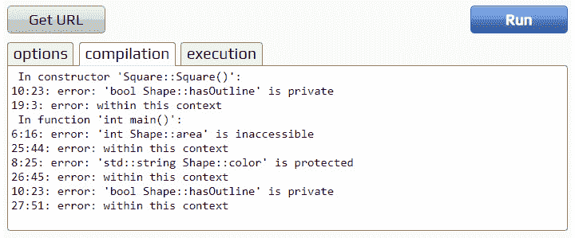
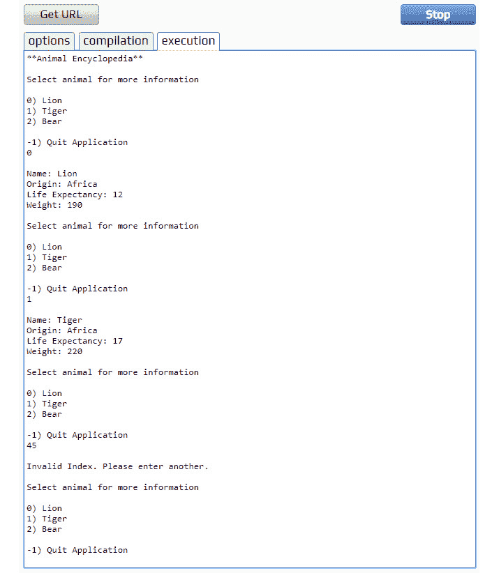

# 十、高级面向对象原则

概观

本章介绍了许多高级的面向对象原则，包括继承和多态，这将允许我们构建更复杂、动态和强大的 C++ 应用。您将通过从基类继承功能来创建新对象，实现虚拟函数和抽象类，使用多态性来创建通用代码，在类型之间安全转换，并使用高级 OOP 原则构建复杂的应用。

# 简介

贯穿*第 8 章*、*类和结构*和*第 9 章*、*面向对象原则*我们在 C++ 中介绍了面向对象原则。我们从查看类和结构开始，创建自己的用户定义对象来封装成员。然后，我们继续讨论一些基本的面向对象原则。

在本章中，我们将讨论一些更高级的面向对象编程概念，如继承、虚拟成员函数、抽象类、多态性和类型间转换。有了对这些原则的理解，我们就可以真正开始利用使 C++ 成为多才多艺和强大的语言的伟大特性。

我们将从继承开始，通过继承，我们可以在单个基类中定义公共功能，然后在唯一的子类中扩展它；这是 OOP 中的基本概念之一。这将引导我们关注虚拟成员函数。这些允许我们在这些公共基类中定义函数，这些函数可以在继承类中被覆盖。

接下来，我们将把注意力转向多态性。通过多态性，我们能够根据调用函数的继承对象来调用同一个函数的不同实现。然后我们将使用`static_cast`和`dynamic_cast`来观察类型之间的转换，观察两者之间的差异。

为了完成我们关于高级面向对象原则的工作，我们将完成一项活动，在这项活动中，我们创建一个小的百科全书应用，它将显示关于选定动物的各种信息。将创建一个基类来定义一个底层结构，然后我们将使用单个动物记录来扩展这个基类，利用多态性来获取它们的数据。当这一章完成时，你将对 OOP 的这些核心原则有一个很好的理解。

# 遗传

在 C++ 中声明一个类时，我们有能力从另一个类继承。事实上，我们可以同时从多个类继承——这是 C++ 的一个特性，不是所有面向对象的语言都有这个特性。当我们从另一个类继承时，我们获得了它的所有成员，这些成员具有公共或受保护的隐私修饰符。私有成员只对定义它们的类可见，而对继承类不可见。这是 OOP 中的基本概念之一，允许我们构建灵活、可维护的对象，其中公共功能只能声明一次，然后在需要的地方实现和扩展。

让我们使用车辆，看一个快速的例子。我们可以定义一个基类`Vehicle`，它定义了一些常见的属性，比如最大速度或门的数量。然后，我们可以继承这个类来创建专门的车辆类，如`Car`、`Bike`或`Lorry`。我们创建共享一个公共基类的多个类，因此共享公共成员。

要从类继承，我们将使用以下语法:

```cpp
class DerivedClassName : [access modifier] BaseClassName
```

我们将我们的类定义为普通类，然后使用`:`操作符开始声明我们想要继承的类。首先，我们提供一个访问修饰符。我们将很快介绍不同修饰符对继承的影响，但结果是它们决定了继承成员的可见性。接下来，我们简单地声明我们希望继承的类的名称:

```cpp
class MyBaseClass
{
};
class MyDerivedClass : public MyBaseClass
{
};
```

我们的派生类现在可以访问基类中声明的所有公共成员和受保护成员。记住，私有成员只能被声明它们的类和朋友类访问。

注意

一个类的私有和受保护成员可以被声明为该类的朋友的其他类访问。朋友课不在这本书的范围之内。不过，更多信息可以在这里找到:[https://packt.live/37vA8ns](https://packt.live/37vA8ns)。

这种关系是从基类继承而来的派生类，可以在下面的简单图表中看到:


图 10.1:单一继承图

如果我们想禁止从继承一个类，C++ 11 为我们提供了`final`关键字:

```cpp
class MyBaseClass final
{
};
class MyDerivedClass : public MyBaseClass
{
};
```

在这种情况下，代码将无法编译，给我们一个错误，说明`MyBaseClass`是`final`:


图 10.2:编译错误，因为我的基类被声明为最终类

使类成为最终类的主要原因之一是，您可以确保它们不是从继承而来的，因此是您想要的确切实现。例如，如果你正在编写一个公共图书馆，你可能有一个`Record`类。这个类的实现应该是完全一样的，这可能是非常重要的，所以您可以将这个类标记为 final，以防止任何人继承它并使用他们的用户定义版本。不管你的理由是什么，将一个类标记为 final 意味着没有类可以继承它。

让我们看一个代码继承的例子。想象我们有三个物体，它们都有一个共同的成员；说出形状和它们的面积。如果我们单独定义这三个类，我们会得到这样的结果:

```cpp
class Square
{
public:
    int area = 10;
};
class Circle
{
public:
    int area = 10;
};
class Triangle
{
public:
    int area = 10;
};
```

我们可以看到这里有共同的代码。我们已经为每个形状声明了相同的成员，这是不必要的。因为它在每个类之间是通用的，所以我们可以把它移到自己的类中，让其他类继承它。这在两者之间创造了一种关系。具有公共功能的类被称为**基**类，继承该行为的类被称为**派生的**类。

让我们将这些类和它们的公共成员移到一个基类中。

## 练习 65:遗传

在前面的代码片段中，我们看到了当我们声明三个 shape 类时，我们是如何以代码重复结束的，每个类都有一个用于 area 的成员变量。让我们利用继承来重构这段代码:

注意

这个练习的完整代码可以在这里找到:[https://packt.live/2XE3HyT](https://packt.live/2XE3HyT)。

1.  Declare a base class, `Shape`, that will contain the shared member. We'll also add a function to return it:

    ```cpp
    #include <iostream>
    class Shape
    {
    public:
        int area = 10;
        int GetArea() { return area; }
    };
    ```

    注意

    由于我们的`area`变量是公共的，这里的`get`函数并不是严格必要的。这里只是用一个函数来演示继承。

2.  接下来，声明我们的三个单独的形状类。然而，这一次，我们不再像以前那样在每个类中声明`area`成员，而是从我们新的`Shape`类中继承它:

    ```cpp
    class Square : public Shape
    {
    };
    class Circle : public Shape
    {
    };
    class Triangle : public Shape
    {
    };
    ```

3.  在我们的`main`函数中实例化这些类中的一个:

    ```cpp
    int main()
    {
        Square mySquare;
        Circle myCircle;
        Triangle myTriangle;
    ```

4.  现在，这就是我们看到继承在发挥作用的地方。对于我们刚刚创建的`Square`类，我们将为`area`成员设置一个值，然后调用`GetArea()`方法将其打印到控制台:

    ```cpp
        mySquare.area = 5;
        std::cout << "Square Area: " << mySquare.GetArea() << std::endl;
    ```

5.  对`Circle`班也这样做，但对`Triangle`班不这样做。我们只打印这个值，不为继承的成员赋予新的值:

    ```cpp
        myCircle.area = 15;
        std::cout << "Circle Area: " << myCircle.GetArea() << std::endl;
        std::cout << "Triangle Area: " << myTriangle.GetArea()               << std::endl;
    }
    ```

6.  运行应用:


图 10.3:访问在基本形状类中定义的区域成员

从输出和我们的程序编译无误的事实可以看出，我们的三个类`Square`、`Circle`和`Triangle`都继承了`Shape`类的两个成员。在`Square`和`Circle`中，我们给继承的成员变量一个新的值，这在我们调用`GetArea`时得到了反映。在`Triangle`中，我们没有看到的地方，我们可以看到`Shape`中定义的原始值被输出。

我们可以继续在这个基类中定义任何进一步的共享属性或功能，让任何派生类自由地给它们唯一的值。这是继承背后的主要原则；我们在基类中定义共享成员，让继承类进行专门化。

# 多重遗传

在前面的例子中，我们创建了一个继承自单个基类的派生类，但是 C++ 的许多伟大特性之一是支持多重继承。这意味着单个派生类可以从多个基类继承变量和功能，以创建更复杂的对象。我们所知道的关于单一继承的一切都是正确的，唯一的区别是继承的成员来自多个来源。

从多个类继承的语法如下:

```cpp
class DerivedClassName : [access modifier] BaseClassName, [access modifier] AnotherBaseClassName
```

下面的继承图显示了定向类如何有两个基类，它将从这两个基类继承成员:


图 10.4:多重继承图

C++ 没有对可以继承的类的数量实施硬性限制；它是特定于实现的，尽管 C++ 标准确实提供了推荐的最小值:

*   直接和间接基类[16，384]
*   单个类的直接基类[1，024]
*   一类的直接和间接虚基[1，024]

让我们来看看多重继承的作用:

```cpp
class MyClassA
{
protected:
    int myInt;
};
class MyClassB
{
protected:
    std::string myString;
};
class MyClassC: public MyClassA, public MyClassB
{
    MyClassC()
    {
        myInt = 1;
        myString = 2;
    }
};
```

在前面的代码片段中，我们定义了两个基类，`MyClassA`和`MyClassB`。然后，我们创建派生类型`MyClassC`，并从它们两者继承。`MyClassC`现在可以访问两者的成员。这有助于我们从多个来源继承价值观和行为，但是有一些事情需要注意。

第一个问题被称为钻石问题，因其继承图的形状而得名，是一个类从两个基类继承的结果，这两个基类本身共享一个公共基。这在图表中可以看得更清楚:


图 10.5:钻石问题

在这个图中，我们可以看到`MyClassB`和`MyClassC`都是从`MyClassA`继承的。`MyClassD`然后去继承`MyClassB`和`MyClassC`。这导致`MyClassD`在`MyClassA`中拥有所有内容的两个副本，因为它被实例化了两次，一次来自`MyClassB`，一次来自`MyClassC`。在代码中，这将如下所示:

```cpp
// Diamond problem example. 
#include <iostream> 
#include <string> 
class MyClassA
{
protected:
    int myInt;
};
class MyClassB: public MyClassA
{
};
class MyClassC: public MyClassA
{
};
class MyClassD: public MyClassB, public MyClassC
{
    MyClassD()
    {
        myInt = 1;
    }
};
int main()
{
}
```

如果我们试着运行这段代码，我们会得到一个错误，说明`myInt`不明确。那是因为`MyClassA`被实例化了两次，所以有两个版本。编译器不知道使用哪一个:


图 10.6:在范围内访问的属性

这可以通过两种方式避免。首先是限定您想要访问的变量版本:

```cpp
class MyClassD : public MyClassB, public MyClassC
{
    MyClassD()
    {
        MyClassB::myInt = 1;
    }
};
```

这很好，因为我们已经通过在它前面加上`MyClassB::`来限定了我们想要使用的`myInt`版本。这确保我们可以访问它的`MyClassB`版本。

第二种解决方案是通过使用虚拟继承。当我们从类继承时使用`virtual`关键字时，我们确保任何派生类都只继承基类成员变量的一个副本:

```cpp
class MyClassB : public virtual MyClassA
{
};
class MyClassC : public virtual MyClassA
{
};
```

现在`MyClassB`、`MyClassC`虚拟继承自`MyClassA`，其构造函数将只从`MyClassD`直接调用一次。这避免了重复的属性，减轻了钻石问题。

## 练习 66:多重遗传

让我们扩展*练习 65* 、*继承*，利用多重继承。我们从`Shape`基类继承来提供区域成员，所以我们从第二个类继承来继承一些颜色成员:

注意

这个练习的完整代码可以在这里找到:[https://packt.live/2OBiGFB](https://packt.live/2OBiGFB)。

1.  将*练习 65* 、*继承*的代码复制到编译器窗口。
2.  添加一个定义`color`变量的新类`Color`，以及一个返回它的方法:

    ```cpp
    class Color
    {
    public:
        std::string color = "";
        std::string GetColor() { return color; }
    };
    ```

3.  接下来，更新我们所有的派生类，也继承这个新类，以及原来的`Shape`类:

    ```cpp
    class Square : public Shape, public Color
    //[...]
    class Circle : public Shape, public Color
    //[...]
    class Triangle : public Shape, public Color
    ```

4.  在代码中，我们设置了`Square`区域变量，然后在`cout`语句中返回它。让我们对我们的新`color`成员

    ```cpp
        mySquare.area = 5;
        mySquare.color = "red";
        std::cout << "Square Area: " << mySquare.GetArea() << std::endl;
        std::cout << "Square Color: " << mySquare.GetColor() << std::endl;
    ```

    做同样的事情
5.  对另外两个派生类重复这些步骤:

    ```cpp
        myCircle.area = 10;
        myCircle.color = "blue";
        std::cout << "Circle Area: " << myCircle.GetArea() << std::endl;
        std::cout << "Circle Color: " << myCircle.GetColor() << std::endl;
        myTriangle.area = 15;
        myTriangle.color = "green";
        std::cout << "Triangle Area: " << myTriangle.GetArea()               << std::endl;
        std::cout << "Triangle Color: " << myTriangle.GetColor()               << std::endl;
    ```

6.  运行应用。您将获得以下输出:


图 10.7:访问两个基类的成员

现在我们已经继承了两个类，我们可以访问两组成员:`Shape`类的`area`和`GetArea`，以及`Color`类的`color`和`GetColor`。

到目前为止，在我们的例子中，我们使用了公共可访问性，因为这意味着所有成员在任何地方都是可见的。然而，这只是为了演示，并不是我们在系统中通常想要的，因为它会导致潜在的误用。一般来说，我们的成员应该尽可能拥有最严格的可见性。在下一节中，看看可访问性是如何与继承一起工作的。

## 访问修饰符和继承

在利用继承时，我们需要注意两个方面的可访问性。第一个是基类成员的可访问性，第二个是从类继承时定义的访问修饰符。我们将从第一个开始，因为它已经在前面的章节中提到过了。

在声明成员时，我们有三个访问修饰符可以用来确定它们的可见性:

*   **公共**:随处可见
*   **受保护的**:对定义它们的类和任何派生类可见
*   **私有**:只对定义它们的类可见

这意味着，如果我们希望一个变量可以被派生类访问，那么它必须具有公共或受保护的可见性。然而，这仅决定了该成员对派生类本身是否可见，而不是对其他成员可见。为此，我们转向从类继承时声明的访问修饰符。

如果您记得，从类继承的语法如下:

```cpp
class DerivedClassName : [access modifier] BaseClassName
```

我们在此提供的访问修饰符与单个基本成员上的修饰符一起使用，以确定它们的可见性；限制性最强的修改器获胜。下表显示了不同的继承类型如何与基类成员的访问修饰符交互:


图 10.8:访问修饰符组合

如果我们看一下这张表中所有可能的组合，前面的说法“限制性最强的修饰语获胜”应该会变得更清楚。每当两个不同的修饰符组合在一起时(比如一个被私有继承的受保护的基类变量)，最具限制性的修饰符就会出现；在这种情况下，它将是私有的。

## 练习 67:访问修饰符和继承

为了更好地了解访问修饰符是如何影响事物的，让我们创建一个利用它们的程序。我们将创建一个包含三个成员的基类:一个公共的、一个受保护的和一个私有的。然后，我们将使用各种访问修饰符从这个类继承，以查看每个成员的可见性:

注意

这个练习的完整代码可以在这里找到:[https://packt.live/2D97LxH](https://packt.live/2D97LxH)。

1.  我们将从声明基类开始。我们将继续形状示例(这是一个经过试验和测试的类比)并声明三个成员，给出三个可能的访问修饰符中的每一个:

    ```cpp
    #include <iostream>
    #include <string>
    class Shape
    {
    public:
        int area = 0;
    protected:
        std::string color = "";
    private:
        bool hasOutline = false;
    };
    ```

2.  接下来，我们将从这个类继承，创建派生的`Square`类。对于第一个例子，我们将使用公共继承:

    ```cpp
    class Square : private Shape
    {
    public:
        Square()
        {
            area = 5;
            color = "red";
            hasOutline = true;
        };
    };
    ```

3.  为了测试成员的可见性，我们将实例化这个派生类，并尝试在`cout`语句中访问它的每个成员:

    ```cpp
    int main()
    {
        Square mySquare;
        std::cout << "Square Area: " << mySquare.area << std::endl;
        std::cout << "Square Color: " << mySquare.color << std::endl;
        std::cout << "Square Has Outline: " << mySquare.hasOutline               << std::endl;
    }
    ```

4.  Let's run this application and see what our compiler gives us:

    

    图 10.9:成员可访问性的错误

    在本例中，我们创建了一个具有公共继承的派生类。首先，我们无法访问`Square`构造函数中的`hasOutline`成员。我们遇到以下错误:

    ```cpp
        error: 'bool Shape::hasOutline' is private
    ```

    该成员在基类中是私有的，因此派生类无法访问它。

    接下来，如果我们查看`main`函数内的代码，我们可以看到访问`area`变量时没有错误。该成员在基类中是公共的，因此它仍然是公共的，可以自由访问。然而，访问`color`成员会给我们以下错误:

    ```cpp
        'std::string Shape::color' is protected
    ```

    即使我们使用了公共继承，基类的受保护修饰符的限制性更强，所以这是被使用的一个。这意味着我们不能公开访问这个变量。我们在试图访问`hasOutline`时也会得到一个错误:

    ```cpp
        'bool Shape::hasOutline' is private
    ```

    这也是因为基类赋予了这个变量私有访问权。它甚至对派生类都不可见，所以肯定不能被公开访问。

5.  现在，将继承中使用的访问修饰符更改为`protected`。运行应用并通读编译器输出，就像我们之前做的那样。
6.  最后，将继承中使用的访问修饰符更改为`private`并再次执行相同的操作。你应该有希望知道这会导致什么样的错误。如果需要，请参考前面给出的图表进行说明。

理解不同的访问修饰符如何影响继承是很重要的，而且经常会引起混淆。首先，不管访问修饰符是什么，所有变量对于定义它们的类都是完全可见的。派生类(从基类继承的那些)可以访问公共和受保护的成员。最后，从基类继承时使用的访问修饰符决定了成员的最终可见性，从而决定了所有其他类如何访问它们。前面的图表显示了所有可能的组合，但请记住，最严格的修饰符将总是被选择。

## 虚拟功能

当我们从基类继承时，我们已经看到我们可以访问任何公共的和受保护的成员。对于成员变量，我们接着在派生类中赋予它们唯一的值；但是有了函数，我们只需访问并调用它们。然而，在派生类中专门化一个函数是可能的，就像给成员变量一个唯一的值一样。我们通过使用虚函数来做到这一点。

在 C++ 中，虚函数是一种可以被派生类重写其功能的函数。要将一个函数标记为虚函数，我们只需在其声明的开头使用`virtual`关键字:

```cpp
virtual return_type function_name();
```

这样就可以在派生类中重写该函数。首先，通过声明一个具有相同签名、返回类型、名称和 override 关键字的函数，然后定义它。让我们看一个例子:

```cpp
class MyBaseClass
{
public:
    virtual void PrintMessage() 
    {
        std::cout << "Hello ";
    }
};
class MyDerivedClass: public MyBaseClass 
{
public: 
    void PrintMessage() override 
    {
        std::cout << "World!";
    }
};
```

在这段代码中，我们定义了两个类:`MyBaseClass`和`MyDerivedClass`。在`MyBaseClass`中，我们声明了一个虚拟的`PrintMessage`函数，它将把`Hello`这个词打印到控制台上。然后我们在`MyDerivedClass`中继承这个类，并覆盖函数来打印单词`World`。如果我们实例化`MyDerivedClass`并调用它的`PrintMessage`函数，你认为我们会看到什么？


图 10.10:我们被覆盖的虚拟函数的输出

我们看到`World!`这个词，表示没有调用基函数，但是派生类中的覆盖函数调用了。如果我们查看源代码，您可以在派生类中的函数定义之后看到' override '关键字。这个可选的标识符不仅让程序员清楚这是一个被覆盖的虚函数，而且导致编译时检查，以确保它是基函数的有效覆盖。没有这个标识符，重写虚函数也能正常工作，但是包含它是一个很好的做法。

注意

与`virtual`不同，override 不是关键字。相反，它是一个具有特殊意义的标识符。它在虚函数的上下文之外没有特殊的意义。

因此，当我们重写一个虚函数并调用它时，它将调用派生类中定义的版本。但是如果我们也要调用基本定义呢？谢天谢地，这是可能的。在我们被覆盖的`virtual`函数中，也可以调用基础实现。这是通过以下语法完成的:

```cpp
void MyFunction()
{
    BaseClass::MyFunction();
}
```

在我们的重写函数中，我们可以通过基类类型调用基类函数。这将在运行覆盖函数的逻辑之前运行函数的基础版本中定义的逻辑。让我们更新我们的示例，看看这个:

```cpp
class MyDerivedClass : public MyBaseClass
{
public:
    void PrintMessage() override
    {
        MyBaseClass::PrintMessage();
        std::cout << "World!";
     }
};
```

我们已经更新了我们的覆盖函数，首先调用`MyBaseClass`实现。让我们看看如果我们现在运行应用会得到什么:


图 10.11:两种实现的功能

由于我们通过调用基本功能开始覆盖函数实现，我们首先输出`Hello`，然后返回处理派生函数中的逻辑。这会将`Hello World!,`全部打印到控制台上。这可能非常有用。您可以在基础实现中定义任何公共功能，然后在派生实现中将其专门化。

再次以电子游戏为例，项目系统可以利用这一点。假设我们定义了一个名为`Item`的基类，它包含一些泛型成员，包括一个从玩家那里获取能量的`Use`函数。然后我们可以继续从这个继承来创建任意多的派生项目类型，在每个类型中实现`Use`函数。也许对于一个`Health Potion`物品，我们给玩家一些生命值；或者对于一个`Torch`物品，我们创造一个光。这两个派生类不仅可以存储在类型为`Item*`的公共容器中，还可以在它们自己的实现之前调用`Use`的基础实现。

## 纯虚函数/抽象类

覆盖正常的`virtual`功能是可选的；然而，如果我们想强迫我们的用户在派生类中实现一个虚函数，我们可以在基类中使它成为纯虚函数。纯虚函数在基类中没有实现，它只是被声明。纯虚函数的语法如下:

```cpp
virtual void MyFunction() = 0;
```

当一个类包含一个或多个纯虚函数时，它就变成了一个抽象类。这是一个不能直接实例化的类。这里有一个例子:

```cpp
class MyAbstractClass
{
    virtual void MyPureVirtualFunction() = 0;
};
class MyDerivedClass : public MyAbstractClass
{
    void MyPureVirtualFunction() override
    {
        std::cout << "Hello World!";
    }
};
int main()
{
    MyAbstractClass myAbstractClass;
}
```

在这段代码中，我们在基类中定义了一个纯虚函数。然后我们在`MyDerivedClass`中继承这个类，并为函数提供一个定义。在我们的主函数中，我们尝试实例化抽象类的一个实例。让我们运行这个，看看编译器给了我们什么:


图 10.12:尝试实例化一个抽象类

编译器对我们试图实例化这个类不满意，因为没有函数的定义。如果我们改为实例化我们的派生类，编译器会同意，因为我们已经提供了一个定义。如果我们从派生类中省略这个定义，它也会变得抽象，因此不能直接实例化。

如果我们不想在基类中提供定义，但仍然想使重写函数成为可选的，我们可以给它一个空的主体:

```cpp
virtual void MyPureVirtualFunction() {}
```

如果我们更新我们的代码来声明`MyPureVirtualFunction`(就像我们之前做的那样)，我们的代码将会编译。因为我们给了它一个空体，类不会变得抽象；我们只是有一个什么都不做的功能。

抽象类对于控制我们的用户可以实例化什么和不能实例化什么非常有用。一个很好的例子是视频游戏引擎中的对象系统。通常有一个基类叫做`Object`之类的东西。这将定义所有对象将拥有的共享特征，例如唯一的 GUID，并将作为所有其他对象的基类——一个`player`对象。由于基类纯粹是为了提供共享的功能和属性，但本身并没有什么用处，所以我们可以将它做成一个抽象类，以确保它不能被直接实例化。它只能从继承以创建派生类。

## 练习 68:虚拟功能

让我们把这种对虚函数的新理解运用起来；`shape`的例子将很好地工作。我们已经声明了一个基类`Shape`并从它继承来创建特殊的形状，比如圆形和正方形。我们的形状类本身不是很有用；它不包含任何特定的内容，主要目的是提供共享的功能和成员，是抽象类的完美候选。

注意

这个练习的完整代码可以在这里找到:[https://packt.live/2D7zNd2](https://packt.live/2D7zNd2)。

我们将抽象这个类，并提供一个虚拟函数来计算形状的面积:

1.  让我们从定义我们的基础`Shape`类开始。我们希望我们的共享成员在这里被宣布；存储形状面积的整数和计算它的函数。我们可以使用一些访问修饰符来确保那些不需要公开的变量不是:

    ```cpp
    #include <iostream>
    #include <string>
    class Shape
    {
    public:
        virtual int CalculateArea() = 0;
    protected:
        int area = 0;
    };
    ```

2.  现在我们将声明我们的第一个派生类`Square`。这个派生类想要用适当的计算覆盖`CalculateArea`函数，并为正方形的高度提供自己的变量。我们将公开继承`Shape`:

    ```cpp
    class Square : public Shape
    {
    public:
        int height = 0;
        int CalculateArea() override
        {
            area = height * height;
            return area;
        }
    };
    ```

3.  接下来，创建另一个派生类`Circle`。这将类似于我们的`Square`类，但是我们将提供一个`radius`变量，而不是提供一个`height`变量。我们还将在`CalculateArea`功能中更新计算:

    ```cpp
    class Circle : public Shape
    {
    public:
        int radius = 0;
        int CalculateArea() override
        {
            area = 3.14 * (radius * radius);
            return area;
        }
    };
    ```

4.  在我们的`main`函数中，我们现在将实例化这些派生类，设置我们为它们声明的成员变量，并调用`CalculateArea`函数。我们从`Square` :

    ```cpp
    int main()
    {
        Square square;
        square.height = 10;
        std::cout << "Square Area: " << square.CalculateArea()               << std::endl;
    ```

    开始
5.  最后，我们将为我们的`Circle`类做同样的事情，完成我们的应用:

    ```cpp
        Circle circle;
        circle.radius = 10;
        std::cout << "Circle Area: " << circle.CalculateArea()               << std::endl;
    }
    ```

6.  运行应用。您将获得以下输出:


图 10.13:我们覆盖了 CalculateArea，在每个派生类中专门化了这个函数

正如我们所看到的，我们被覆盖的`CalculateArea`函数已经被每个派生类成功调用。我们的基类`Shape`提供了泛型基本信息，我们将`CalculateArea`函数设为纯虚函数，以确保它不能被直接实例化。如果您试图在这个应用中这样做，您会得到一个编译器错误。即使是这个微不足道的例子也展示了如何使用这个强大的特性来控制哪些对象可以实例化，哪些对象不能实例化，以及如何创建共享类似接口的类的专用版本。

# 多态性

我们现在已经看到了如何使用继承来创建对象的通用基础版本，然后将它们专门化为派生类。这样做的许多好处包括减少代码重复、实现公共接口的能力以及多态性。

多态性允许我们根据调用函数的继承对象来调用同一个函数的不同实现。我们可以这样做，因为我们可以将派生类型存储在它们的基类型的指针变量中。当我们这样做的时候，我们限制自己只能访问在基类中声明的成员，但是当它被调用的时候，我们将得到派生类的实现。

让我们看看一些代码，看看这是如何操作的:

```cpp
// Polymorphism. 
#include <iostream>
#include <string>
class MyClassA 
{
public:
    virtual std::string GetString() = 0;
};
class MyClassB: public MyClassA 
{
public: 
    std::string GetString() override 
    {
        return "Hello ";
    }
};
class MyClassC: public MyClassA 
{
public: 
    std::string GetString() override 
    {
        return " world!";
    }
};
int main()
{
    MyClassA * myClass = new MyClassB(); 
    std::cout << myClass->GetString(); 
    myClass = new MyClassC(); 
    std::cout << myClass->GetString();
    delete myClass;
    myClass = nullptr;
}
```

我们在这里创建了两个派生对象，`MyClassB`和`MyClassC`，它们都继承自`MyClassA`。由于这些对象共享公共基类`MyClassA`，我们可以将它们存储在指向该类型的指针中(`MyClassA*`)并访问该基类中声明的任何成员。然而，当我们调用它们时，我们得到了它们的派生实现。

如果我们运行代码，我们可以看到这一点:


图 10.14:我们从同一个对象类型中调用了一个函数的两种不同实现

尽管对同一个变量`myClass`调用了函数，但我们得到了不同的结果，因为它存储了不同的派生类。这就是多态性在起作用。需要注意的是，多态性只适用于非值类型，即引用和指针。关于多态性，它们的作用基本相同；但是，引用在法律上不能为空。这意味着`dynamic_cast`将改为对失败的演员抛出异常，而不是返回`nullptr`。

选角很重要，将在本章的下一部分介绍，但是在我们开始之前，让我们在前面的练习基础上继续。我们将以多形态存储我们的派生形状类，并根据最初存储的派生类型来看如何获得不同的实现。

## 练习 69:多态性

在*练习 68* 、*虚拟函数*中，我们使用了虚拟覆盖函数来提供`GetArea()`的多个实现。让我们做一些类似的事情，但是这一次我们将多形态地存储这些类型。我们将看到，即使我们有两个相同类型的变量，因为我们分配了不同的派生类，我们的函数调用的实现也会有所不同。

注意

这个练习的完整代码可以在这里找到:[https://packt.live/2OBx5Bz](https://packt.live/2OBx5Bz)。

1.  将上一练习的代码复制到您的编译器中。
2.  接下来，给出`Square`和`Circle`中的成员变量默认值:

    ```cpp
    class Square : public Shape
    {
    public:
        int height = 10;
        int CalculateArea() override
        {
            area = height * height;
            return area;
        }
    };
    class Circle : public Shape
    {
    public:
        int radius = 10;
        int CalculateArea() override
        {
            area = 3.14 * (radius * radius);
            return area;
        }
    };
    ```

3.  Now we can implement polymorphism. We're currently instantiating an instance of each of our derived classes. The `square` variable is of type `Square`, and the `circle` variable is of type `Circle`. Let's change this so both of them are of type `Shape*`—that is, a pointer to a `Shape` object:

    ```cpp
        Shape* square = new Square();
        Shape* circle = new Circle();
    ```

    注意

    虽然我们在这里使用的是原始指针，但是您也可以使用智能指针，如前一章所述。为了简单起见，这里使用原始指针来保持对手头主题的关注。

4.  因为我们现在使用的是指向基类的指针，所以我们不能再访问`height`和`radius`变量。这将在下一部分中讨论，我们将在这里讨论铸造。现在，取消那些电话。
5.  Finally, with our square and circle variables now pointers, we need to change how we access the `CalculateArea` methods. We need to use the `->` operator instead of the `.` operator. We also need to delete the pointer:

    ```cpp
        std::cout << "Square Area: " << square->CalculateArea()               << std::endl;
        std::cout << "Circle Area: " << circle->CalculateArea()               << std::endl;
        delete square;
        square = nullptr;
        delete circle;
        circle = nullptr;
    ```

    注意

    删除这里的指针并不是绝对必要的，因为我们的应用无论如何都会终止。然而，将任何对`new`的调用与对`delete`的调用相匹配总是一种好的做法。这将节省潜在的内存泄漏。

6.  运行程序。您将获得以下输出:


图 10.15:使用多态性，我们将派生类型存储为指向它们的基的指针

在这个应用中，我们展示了如何将继承的类型多形态地存储为指向它们的基的指针。当我们调用这个对象上的函数时，我们得到了派生类提供的实现。如果没有提供被覆盖的实现，我们将返回到调用基类实现。

# 类型间铸造

既然我们可以多形态地存储和交互类型，我们需要知道如何在它们之间进行转换。铸造是将一个对象从一种类型转换成另一种类型的过程。如果我们将派生类型存储在类型为基的集合中，这一点很重要。在这种情况下，我们需要从基类型转换为派生类型。这称为向下转换，需要进行类型检查。我们也可以从派生类型转换为基类，这称为上转换。这些总是被允许的。

请考虑以下几点:

```cpp
// Casting. 
#include <iostream>
#include <string>
class MyClassA 
{
public:
    int myInt = 0;
};
class MyClassB: public MyClassA 
{
public: 
    std::string myString = "";
};
int main() 
{
    MyClassA * myClass = new MyClassB();
    std::cout << myClass->myInt << std::endl;
    std::cout << myClass->myString << std::endl;
    delete myClass;
    myClass = nullptr;
}
```

在这个例子中，我们有从`MyClassA`继承的`MyClassB`。我们实例化`MyClassB`，将其存储在指向`MyClassA`的指针中，然后尝试访问两者的成员。如果我们运行这个应用，我们会得到什么？


图 10.16:我们无法从基类访问派生类中声明的成员

我们得到一个编译错误。因为我们使用的是`MyClassA`对象，所以我们只能访问该类的成员。为了访问派生成员，我们需要转换为类型。我们将在本章中介绍三种类型的演员阵容:`static_cast`、`dynamic_cast`和 C 风格的演员阵容。

## 静态铸造

让我们从一个`static_cast`开始。当你确定你正在处理一个特定类型的对象时，使用`static_cast`。因此，不进行任何检查。例如，在我们的示例中，我们显然存储了一个类型为`MyClassB`的对象，因此我们可以安全地将`static_cast`转换为该类型。

`static_cast`的语法如下:

```cpp
    static_cast<type_to_cast_to*>(object_to_cast_from);
```

如果我们将它应用于前面的代码示例，我们可以转换为我们的派生类型，然后访问成员就不是问题了:

```cpp
int main()
{
    MyClassA* myClass = new MyClassB();
    std::cout << myClass->myInt << std::endl;
    MyClassB* myClassB = static_cast<MyClassB*>(myClass);
    std::cout << myClassB->myString << std::endl;
    delete myClass;
    myClass = nullptr;
    delete myClassB;
    myClassB = nullptr;
}
```

这段代码现在可以编译了，我们可以访问对象的`myString`成员。

## 动态铸造

当我们不确定使用的是哪种类型的对象时，会使用第二个强制类型`dynamic_cast`。如果我们尝试动态转换，但失败了，就会返回`nullptr`。然后我们可以检查我们的对象是否有效。

`dynamic_cast`的语法如下:

```cpp
    dynamic_cast<type_to_cast_to*>(object_to_cast);
```

要使`dynamic_cast`在向下转换时工作，基类必须包含至少一个虚函数。如果我们试图将`MyClassA`降级为`MyClassB`，我们会得到一个编译器错误，如下图所示:

```cpp
    MyClassB* myClassB = dynamic_cast<MyClassB*>(myClass);
    if (myClassB != nullptr)
    {
    std::cout << myClassB->myString << std::endl;
    }
```

错误如下:


图 10.17:我们无法从我的类 a 向下转换到我的类 b，因为它不是多态类型

然而，如果`MyClassA`包含一个`virtual`函数——因此是一个多态类型——这就可以了。使用`dynamic_cast`比`static_cast`更安全，因为如果强制转换失败，它将返回空指针。

## C 型演员表

最后，C 风格的强制转换，或者常规的强制转换，尝试多种不同的强制转换，选择第一种有效的。然而这还不包括`dynamic_cast`，所以和`static_cast`一样不安全。

C 风格转换的语法如下:

```cpp
(type_to_cast_to *) object_to_cast
```

例如，如果我们使用 C 风格的演员表将`MyClassA`转换为`MyClassB`，我们会这样做:

```cpp
    MyClassB* myClassB = (MyClassB*)myClass;
```

既然我们知道`myClass`是`MyClassB`类型，那么这个施法是可以的，并且会产生一个可用的对象。

你用哪个演员取决于你的场景。目标是在编写 C++ 时使用各种 C++ 风格转换，确定类型时选择`static_cast`，不确定类型时选择`dynamic_cast`。还有其他可用的 C++ 强制转换，例如`const_cast`和`reinterpret_cast`，但是它们不在本章的讨论范围内。

注意

如果你想进一步阅读这些其他的 C++ 强制转换，前往[https://packt.live/37tJksD](https://packt.live/37tJksD)。

为了将我们新发现的铸造技巧付诸实践，让我们在前面的练习基础上再接再厉。

## 练习 70:施法

对于本章的最后一个练习，我们将再次扩展我们的形状应用。在前面的练习中，我们移动到多形态存储我们的各种形状类型。我们没有将它们存储为各自的类型，而是将它们存储为指向基类的指针，并通过多态性访问它们的`CalculateArea`函数。然而，我们必须做的一件事是给它们的半径和高度变量默认值，因为我们没有办法设置它们。让我们用选角来弥补。我们将为此使用`dynamic_cast`。

注意

这个练习的完整代码可以在这里找到:[https://packt.live/37svU07](https://packt.live/37svU07)。

1.  将*练习 69* 、*多态性*的代码复制到编译器窗口。
2.  我们首先将类`Shape`、`Square`和`Circle`中的`area`、`height`和`radius`变量的值分别改回`0` :

    ```cpp
    //[...] 
    public:
        int area = 0;
    //[...]
    public:
        int height = 0;
    //[...]
    public: 
        int radius = 0; 
    //[...]
    ```

3.  现在我们需要将我们的`Shape*`类型转换成它们的派生类型。既然我们恰当地命名了正方形和圆形，我们就可以确定它们的类型。正因为如此，我们才会使用`static_cast`。在`main()`中，我们首先将我们的平方变量转换为类型`Square*`，在它被定义之后:

    ```cpp
        Square* square2 = static_cast<Square*>(square);
    ```

4.  现在我们的对象是 Square 类型，我们可以访问高度变量并将其设置为 10，就像以前一样:

    ```cpp
        square2->height = 10;
    ```

5.  现在，对我们的`Circle`课也这样做:

    ```cpp
        Circle* circle2 = static_cast<Circle*>(circle);
        circle2->radius = 10;
    ```

6.  运行程序:


图 10.18:转换到我们的派生类型允许我们调用特定于它们的成员

在本练习中，我们已经看到了如何从基类型转换为派生类型来访问派生成员。反过来也是如此——从派生类到基类——尽管我们只能访问基类中声明的成员。当我们开始处理多态性和继承时，知道如何在类型之间进行转换是关键。

## 活动 10:百科全书应用

为了完成我们关于高级面向对象原理的工作，我们将做一个活动，在这个活动中，我们创建一个小的百科全书应用，它将显示一些动物的各种信息。将创建一个基类来定义一个底层结构，我们将用单个动物记录来扩展这个基类，利用多态性来获取它们的数据。输出如下所示:



图 10.19:用户可以查看各种动物的信息

注意

这个活动的完整代码可以在这里找到:[https://packt.live/2ODU5Ad](https://packt.live/2ODU5Ad)。

以下是帮助您执行活动的步骤:

1.  首先包含应用所需的所有文件。
2.  创建一个结构`AnimalInfo`，可以存储**名称**、**来源**、**预期寿命**和**重量。**
3.  创建一个函数，以简洁的格式打印数据。命名为`PrintAnimalInfo`。
4.  现在，为我们的动物创建基类。命名为`Animal`。它应该提供一个类型为`AnimalInfo`的成员变量，以及一个返回它的函数。请务必使用适当的访问修饰符。
5.  接下来，创建第一个派生类`Lion`。该类将从`Animal`继承，为最终类，并在其构造函数中填写`AnimalInfo`成员。
6.  接下来，创建第二个派生类`Tiger`。填写相同的数据。
7.  创建最终的派生类`Bear`，同时填充`AnimalInfo`成员。
8.  定义`main`功能。声明一个指向基本`Animal`类型的指针向量，并添加每个动物衍生类型。
9.  输出应用标题。
10.  为应用创建主外部循环，并向用户输出一条消息，提示他们选择索引。
11.  向用户输出可能的选择。为此使用`for`循环，每个选项都应该包括一个索引和动物的名称。此外，还包括一个选项，用户可以通过输入`-1`退出应用。
12.  获取用户输入并将其转换为整数。
13.  检查用户是否进入`-1`并因此想要退出应用。如果他们这么做了，处理好这件事。
14.  接下来，检查用户输入的索引是否无效。无效索引是小于`-1`且大于动物矢量`-1`大小的索引(因为索引从 0 开始，而不是从 1 开始)。如果有，输出一条错误消息，让他们重新选择。
15.  如果用户输入一个有效的索引，调用前面创建的`PrintAnimalInfo`，传入你将从向量中得到的动物信息。
16.  Outside of the `main` loop, clean up the pointers. This means deleting their memory, setting them to `0`, and then clearing the vector.

    注意

    这个活动的解决方案可以在第 559 页找到。

# 总结

在这一章中，我们已经讨论了一些关于 OOP 的进一步主题，从继承开始。我们看到了如何使用它来定义基类中的行为，然后从基类继承来创建一个派生类。我们的派生类专门处理这些更通用的基类，继承任何公共和受保护的成员，同时也定义它们自己的成员。我们可以继续创建继承链，或者一次从多个类继承来创建复杂的对象。

然后我们看了虚拟成员函数。当我们在基类中声明函数时，我们可以将它们标记为虚拟的，这意味着它们的实现可以被覆盖。如果愿意，派生类可以为虚函数提供自己的实现。然而，如果一个函数被标记为纯虚函数——因此基类是抽象的——那么派生类必须提供一个定义或者也变成抽象的。

这导致了多态和类型转换。对于共享类似接口的对象——在共享基类中声明的成员——我们可以将它们存储为指向其基类型的指针。当我们这样做时，我们只能访问基类中声明的成员，但是当我们调用它们时，我们将获得派生类的实现。如果我们想要访问特定的成员，我们需要转换回我们的派生类型，我们介绍了不同的方法:`static_cast`、`dynamic_cast`和 C 风格转换。

我们通过为动物园创建百科全书应用来完成这一章。通过利用本章中涉及的面向对象主题，我们为动物定义了一个基类，并创建了许多派生类。然后，我们允许用户通过索引选择动物，并打印各种信息。

在本书的最后一部分，我们将会看到更高级的概念，包括模板、容器和迭代器，以及异常处理。模板允许我们创建高度可重用的代码，并打开一个充满可能性的世界。我们看了几个基本的容器、数组和向量，所以我们将通过看更多的标准库容器和迭代器来扩展它们。最后，异常处理是我们将在*第 13 章*、*c++ 中的异常处理*中介绍的内容。处理异常是创建稳定软件的关键，当它发现自己处于糟糕状态时不会崩溃。