# 三、面向对象编程的细节

设计、实现和维护一个软件项目的困难来自于项目的复杂性。一个简单的计算器可以使用过程方法(即过程编程范例)编写，而银行账户管理系统太复杂，无法使用相同的方法实现。

C++ 支持**面向对象编程(OOP)** ，这是一种基于将实体分解为存在于紧密互通的网络中的对象的范式。想象一下现实世界中拿遥控器换电视频道的简单场景。至少有三个不同的物体参与了这个动作:遥控器、电视，最重要的是你。为了用编程语言表达现实世界的对象及其关系，我们不必使用类、类继承、抽象类、接口、虚函数等等。上述特性和概念使设计和编码过程变得更加容易，因为它们允许我们以优雅的方式表达和分享想法，但它们不是强制性的。正如 C++ 的创造者比雅尼·斯特劳斯特鲁普所说，“不是每个程序都应该面向对象。”为了理解 OOP 范式的高级概念和特性，我们将尝试从幕后进行观察。在本书中，我们将深入探讨面向对象程序的设计。理解对象的本质及其关系，然后用它们来设计面向对象的程序，是本书的目标之一。

在本章中，我们将详细了解以下主题:

*   面向对象程序设计简介
*   C++ 对象模型
*   类关系，包括继承
*   多态性
*   有用的设计模式

# 技术要求

带有`-std=c++ 2a`选项的 g++ 编译器用于编译本章中的示例。

你可以在[https://github.com/PacktPublishing/Expert-CPP](https://github.com/PacktPublishing/Expert-CPP)找到本章的源文件。

# 理解对象

大多数情况下，我们使用一组以某个名称分组的数据进行操作，从而形成一个**抽象**。像`is_military`、`speed`和`seats`这样的变量，如果分开来看，就没什么意义了。用`spaceship`将它们归类，改变了我们对存储在变量中的数据的感知方式。我们现在把许多变量打包成一个对象。为此，我们使用抽象；也就是说，我们从观察者的角度收集真实世界对象的个体属性。抽象是程序员工具链中的一个关键工具，因为它允许他们处理复杂性。C 语言引入了`struct`作为聚合数据的方式，如下面的代码所示:

```cpp
struct spaceship {
  bool is_military;
  int speed;
  int seats;
};
```

数据分组对于面向对象编程来说有些必要。每组数据被称为一个对象。

# 对象的低级细节

C++ 尽力支持与 C 语言的兼容性。虽然 C 结构只是一个允许我们聚合数据的工具，但是 C++ 让它们等同于类，允许它们拥有构造函数、虚函数、继承其他结构等等。一个`struct`和一个`class`之间唯一的区别是默认的可见性修改器:结构的`public`和类的`private`。在类上使用结构通常没有区别，反之亦然。OOP 需要的不仅仅是数据聚合。为了充分理解面向对象程序设计，让我们找出如果我们只有提供数据聚合的简单结构，我们将如何合并面向对象程序设计范例。

亚马逊或阿里巴巴等电子商务市场的核心实体是`Product`，我们以以下方式表示:

```cpp
struct Product {
  std::string name;
  double price;
  int rating;
  bool available;
};
```

如有必要，我们将向`Product`添加更多成员。`Product`类型对象的内存布局如下图所示:

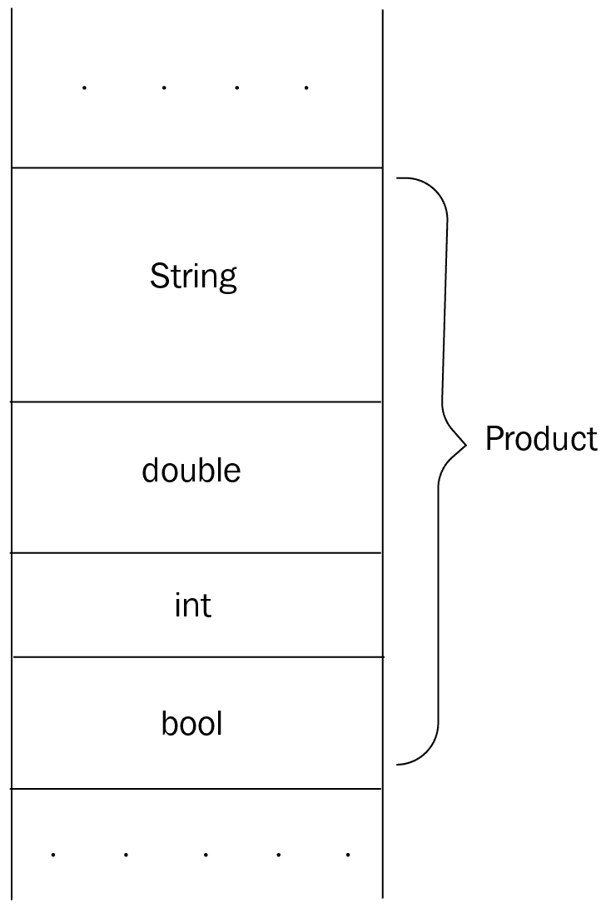

声明一个`Product`对象占用内存中的`sizeof(Product)`空间，而声明一个指向该对象的指针或引用占用存储地址所需的空间(通常为 4 或 8 字节)。请参见以下代码块:

```cpp
Product book;
Product tshirt;
Product* ptr = &book;
Product& ref = tshirt;
```

我们可以将前面的代码描述如下:

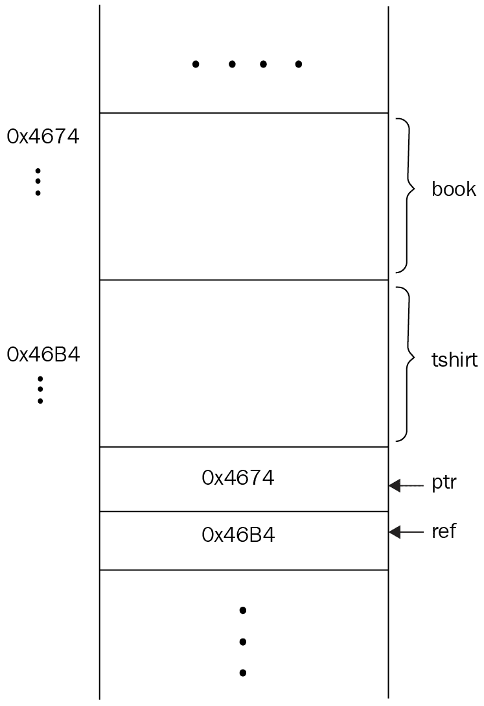

让我们从`Product`对象在内存中占据的空间开始。我们可以通过合计其成员变量的大小来计算`Product`对象的大小。`boolean`变量的大小是 1 字节。在 C++ 标准中没有规定`double`或`int`的确切尺寸。在 64 位机器中，`double`变量通常占用 8 字节，而`int`变量占用 4 字节。

`std::string`的实现在标准中没有规定，所以它的大小取决于库的实现。`string`存储一个指向字符数组的指针，但它也可能存储分配的字符数，以便在调用`size()`时有效地返回。`std::string`的一些实现需要 8、24 或 32 字节的内存，但在我们的示例中，我们将坚持使用 24 字节。综上所述，`Product`的大小将如下:

```cpp
24 (std::string) + 8 (double) + 4 (int) + 1 (bool) = 37 bytes.
```

打印`Product`的尺寸输出不同的值:

```cpp
std::cout << sizeof(Product);
```

它输出`40`而不是计算的 37 字节。冗余字节背后的原因是结构的填充，这是编译器用来优化对对象各个成员的访问的技术。**中央处理器**以固定大小的字读取内存。字的大小由中央处理器定义(通常是 32 或 64 位长)。如果数据是从一个字对齐的地址开始的，那么中央处理器能够立即访问数据。例如，`Product`的`boolean`数据成员需要 1 字节的内存，可以放在评级成员之后。事实证明，编译器会对齐数据以加快访问速度。让我们假设字长是 4 字节。这意味着，如果变量从一个可被 4 整除的地址开始，那么 CPU 将在没有冗余步骤的情况下访问该变量。编译器用额外的字节扩充了前面的结构，以便将成员与字边界地址对齐。

# 对象的高级细节

我们将对象视为代表抽象结果的实体。我们已经提到了观察者的角色，即基于问题域定义对象的程序员。程序员对此的定义代表了抽象的过程。让我们举一个电子商务市场及其产品的例子。两个不同的程序员团队可能对同一产品有不同的看法。实现网站的团队关心对网站访问者至关重要的对象的属性:购买者。我们之前在`Product`结构中展示的属性主要是针对网站访问者的，比如销售价格、产品评级等等。实现网站的程序员触及问题域，并验证定义`Product`对象所必需的属性。

实现帮助管理仓库中产品的在线工具的团队关心对象的属性，这些属性在产品放置、质量控制和装运方面是必不可少的。这个团队实际上不应该关心产品的**评级**，甚至是它的**价格**。这个团队最关心的是产品的**重量**、**尺寸**、**条件**。下图显示了感兴趣的属性:


程序员在开始项目时应该做的第一件事是分析问题并收集需求。换句话说，他们应该熟悉*问题域*并定义*项目需求*。分析的过程导致定义对象及其类型，例如我们前面讨论的`Product`。为了从分析中获得适当的结果，我们应该在对象中思考，而通过在对象中思考，我们意味着考虑对象的三个主要属性:**状态**、**行为**和**身份**。

# 状态

每个对象都有一个状态，该状态可能与其他对象的状态不同，也可能不同。我们已经介绍了`Product`结构，它代表了物理(或数字)产品的抽象。`product`对象的所有成员共同代表该对象的状态。例如，`Product`包含`available`等成员，为布尔型；如果产品有货，它等于`true`。成员变量的值定义了对象的状态。如果为对象成员分配新值，其状态将会改变:

```cpp
Product cpp_book; // declaring the object
...
// changing the state of the object cpp_book
cpp_book.available = true;
cpp_book.rating = 5;
```

对象的状态是其所有属性和值的组合。

# 身份

同一性是区别一个物体和另一个物体的东西。即使我们试图声明两个物理上无法区分的对象，它们的变量仍然会有不同的名称，即不同的标识:

```cpp
Product book1;
book1.rating = 4;
book1.name = "Book";
Product book2;
book2.rating = 4;
book2.name = "Book";
```

上例中的对象具有相同的状态，但它们的不同之处在于我们对它们的称呼，即`book1`和`book2`。假设我们能够以某种方式创建同名的对象，如下面的代码所示:

```cpp
Product prod;
Product prod; // won't compile, but still "what if?"
```

如果是这样的话，它们在内存中仍然会有不同的地址:

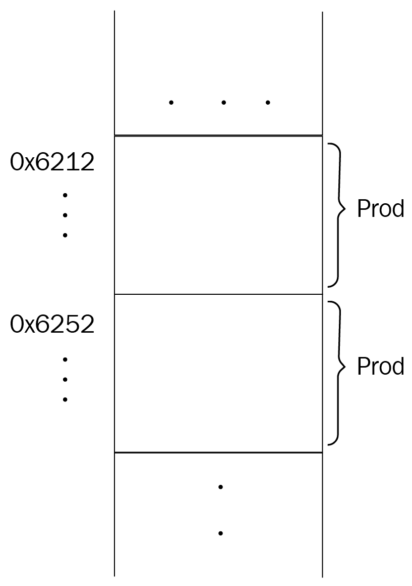

同一性是对象的一个基本属性，也是我们不能创建*空*对象的原因之一，例如:

```cpp
struct Empty {};

int main() {
 Empty e;
  std::cout << sizeof(e);
}
```

前面的代码不会像预期的那样输出`0`。标准中没有指定空对象的大小；编译器开发人员倾向于为这样的对象分配 1 个字节，尽管您可能会遇到 4 或 8 个字节。`Empty`的两个或多个实例在内存中应该有不同的地址，所以编译器必须确保对象将占用至少 1 字节的内存。

# 行为

在前面的例子中，我们将`5`和`4`分配给了`rating`成员变量。我们很容易通过给对象分配无效的值来使事情出乎意料地出错，如下所示:

```cpp
cpp_book.rating = -12;
```

`-12`就产品的评级而言是无效的，如果允许的话，会让用户感到困惑。我们可以通过提供**设置器**功能来控制对对象所做更改的行为:

```cpp
void set_rating(Product* p, int r) {
  if (r >= 1 && r <= 5) {
 p->rating = r;
 }
  // otherwise ignore
}
...
set_rating(&cpp_book, -12); // won't change the state
```

一个对象对其他对象的请求起作用并做出反应。这些请求是通过函数调用来执行的，否则被称为**消息**:一个对象将一条消息传递给另一个对象。在前面的例子中，将相应的`set_rating`消息传递给`cpp_book`对象的对象代表我们在其中调用`set_rating()`函数的对象。在这种情况下，我们假设我们从`main()`调用函数，它实际上根本不代表任何对象。我们可以说它是全局对象，操作`main()`函数的对象，尽管在 C++ 中没有这样的实体。

我们从概念上而不是物理上区分物体。这是思考物体的要点。面向对象编程的一些概念的物理实现并不规范，所以我们可以将`Product`结构命名为类，并声称`cpp_book`是`Product`的**实例**，它有一个名为`set_rating()`的成员函数。C++ 实现几乎做到了同样的事情:它提供了语法上方便的结构(类、可见性修饰符、继承等)，并将它们翻译成具有全局函数的简单结构，如前面例子中的`set_rating()`。现在，让我们深入研究 C++ 对象模型的细节。

# 模仿班级

结构允许我们对变量进行分组、命名和创建对象。类的思想是在对象中包含相应的操作，将适用于特定数据的数据和操作分组。例如，对于`Product`类型的对象，直接调用对象上的`set_rating()`函数是很自然的，而不是有一个单独的全局函数，通过指针获取`Product`对象并对其进行修改。然而，由于我们同意以 C 的方式使用结构，我们不能让它有成员函数。为了模仿使用 C 结构的类，我们必须将与`Product`对象一起工作的函数声明为全局函数，如以下代码所示:

```cpp
struct Product {
  std::string name;
  double price;
  int rating;
  bool available;
};

void initialize(Product* p) {
  p->price = 0.0;
  p->rating = 0;
  p->available = false;
}

void set_name(Product* p, const std::string& name) {
  p->name = name;
}

std::string get_name(Product* p) {
  return p->name;
}

void set_price(Product* p, double price) {
  if (price < 0 || price > 9999.42) return;
  p->price = price;
}

double get_price(Product* p) {
  return p->price;
}

// code omitted for brevity
```

要将结构用作类，我们应该以正确的顺序手动调用函数。例如，要使用具有正确初始化默认值的对象，我们必须首先调用`initialize()`函数:

```cpp
int main() {
  Product cpp_book;
 initialize(&cpp_book);
  set_name(&cpp_book, "Mastering C++ Programming");
  std::cout << "Book title is: " << get_name(&cpp_book);
  // ...
}
```

这似乎是可行的，但是如果添加新的类型，前面的代码将很快变成一团乱麻。例如，考虑跟踪产品的`Warehouse`结构:

```cpp
struct Warehouse {
  Product* products;
  int capacity;
  int size;
};

void initialize_warehouse(Warehouse* w) {
  w->capacity = 1000;
  w->size = 0;
  w->products = new Product[w->capacity];
  for (int ix = 0; ix < w->capacity; ++ ix) {
    initialize(&w->products[ix]); // initialize each Product object
  }
}

void set_size(int size) { ... }
// code omitted for brevity
```

第一个明显的问题是函数的命名。我们必须命名`Warehouse` `initialize_warehouse`的初始化函数，以避免与已经为`Product`声明的`initialize()`函数冲突。我们可以考虑为`Product`类型重新命名函数，以避免将来可能的冲突。接下来是功能混乱。现在，我们有一堆全局函数，随着新类型的增加，它们的数量会增加。如果我们添加一些类型的层次结构，这将更加难以管理。

尽管编译器倾向于将类翻译成具有全局函数的结构，正如我们前面所展示的，C++ 和其他高级编程语言解决了这些和其他以前没有提到的问题，引入了具有平滑机制的类来将它们组织成层次结构。从概念上来说，关键字(`class`、`public`、或`private`)和机制(继承和多态性)是存在的，开发人员可以方便地组织他们的代码，但不会让编译器的生活变得更容易。

# 与班级合作

当处理对象时，类使事情变得容易得多。他们在 OOP 中做最简单的必要的事情:他们把数据和操作数据的函数结合起来。让我们用一个类及其强大的特性重写`Product`结构的例子:

```cpp
class Product {
public:
  Product() = default; // default constructor
  Product(const Product&); // copy constructor
  Product(Product&&); // move constructor

  Product& operator=(const Product&) = default;
  Product& operator=(Product&&) = default;
  // destructor is not declared, should be generated by the compiler
public:
  void set_name(const std::string&);
  std::string name() const;
  void set_availability(bool);
  bool available() const;
  // code omitted for brevity

private:
  std::string name_;
  double price_;
  int rating_;
  bool available_;
};

std::ostream& operator<<(std::ostream&, const Product&);
std::istream& operator>>(std::istream&, Product&);
```

类声明看起来更有组织性，尽管它公开了比我们用来定义类似结构更多的函数。下面是我们应该如何说明这个类:

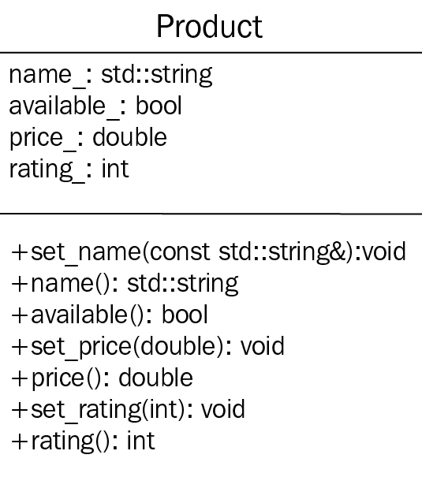

上图有些特殊。如您所见，它有组织的部分，函数名称前的符号，等等。这种类型的图被称为**统一建模语言(UML)** 类图。UML 是一种标准化说明类及其关系的方法。第一部分是类名(粗体)，接下来是成员变量部分，然后是成员函数部分。函数名前面的`+`(加号)表示该函数是公共的。成员变量通常是私有的，但是，如果需要强调这一点，可以使用`-`(减号)。我们可以通过简单地说明这个类来省略所有细节，如下图所示:


我们将在本书中使用 UML 图，并将根据需要引入新类型的图。在处理初始化、复制、移动、默认和删除的函数，当然还有运算符重载之前，让我们先搞清楚几件事。

# 从编译器的角度来看

首先，无论早期的类与之前引入的结构相比看起来有多可怕，编译器都会将其翻译成以下代码(为了简单起见，我们对其进行了略微修改):

```cpp
struct Product {
  std::string name_;
  bool available_;
  double price_;
  int rating_;
};

// we forced the compiler to generate the default constructor
void Product_constructor(Product&); 
void Product_copy_constructor(Product& this, const Product&);
void Product_move_constructor(Product& this, Product&&);
// default implementation
Product& operator=(Product& this, const Product&); 
// default implementation
Product& operator=(Product& this, Product&&); 

void Product_set_name(const std::string&);
// takes const because the method was declared as const
std::string Product_name(const Product& this); 
void Product_set_availability(Product& this, bool b);
bool Product_availability(const Product& this);

std::ostream& operator<<(std::ostream&, const Product&);
std::istream& operator>>(std::istream&, Product&);
```

基本上，编译器生成的代码与我们前面介绍的使用简单结构模拟类行为的方法相同。尽管编译器在实现 C++ 对象模型的技术和方法上有所不同，但前面的例子是编译器开发人员实践的流行方法之一。它平衡了访问对象成员(包括成员函数)的空间和时间效率。

接下来，我们应该考虑编译器通过扩充和修改来编辑我们的代码。下面的代码声明了全局`create_apple()`函数，该函数创建并返回一个`Product`对象，其值特定于一个苹果。它还在`main()`函数中声明了一个图书对象:

```cpp
Product create_apple() {
 Product apple;
  apple.set_name("Red apple");
  apple.set_price("0.2");
  apple.set_rating(5);
  apple.set_available(true);
  return apple;
}

int main() {
 Product red_apple = create_apple();
 Product book;  Product* ptr = &book;
  ptr->set_name("Alice in Wonderland");
  ptr->set_price(6.80);
  std::cout << "I'm reading " << book.name() 
            << " and I bought an apple for " << red_apple.price()
            << std::endl;
}
```

我们已经知道，编译器修改类以将其转换为结构，并将成员函数移动到全局范围，每个成员函数都将类的引用(或指针)作为其第一个参数。为了支持客户端代码中的这些修改，它还应该修改对对象的所有访问。

A line or lines of code that declare or use already declared class objects are referred to as **client code**.

下面是我们如何假设编译器修改了前面的代码(我们使用了单词*假设*，因为我们试图引入一种编译器抽象的方法，而不是编译器特定的方法):

```cpp
void create_apple(Product& apple) {
  Product_set_name(apple, "Red apple");
  Product_set_price(apple, 0.2);
  Product_set_rating(apple, 5);
  Product_set_available(apple, true);
  return;
}

int main() {
  Product red_apple;
 Product_constructor(red_apple);
 create_apple(red_apple);
  Product book;
 Product* ptr;
 Product_constructor(book);
 Product_set_name(*ptr, "Alice in Wonderland");
 Product_set_price(*ptr, 6.80);
  std::ostream os = operator<<(std::cout, "I'm reading ");
  os = operator<<(os, Product_name(book));
  os = operator<<(os, " and I bought an apple for ");
  os = operator<<(os, Product_price(red_apple));
  operator<<(os, std::endl);
  // destructor calls are skipped because the compiler 
  // will remove them as empty functions to optimize the code
  // Product_destructor(book);
  // Product_destructor(red_apple);
}
```

编译器还优化了对`create_apple()`函数的调用，以避免创建临时对象。我们将在本章后面讨论编译器生成的不可见临时对象。

# 初始化和销毁

如前所示，对象的创建是一个两步过程:内存分配和初始化。内存分配是对象声明的结果。C++ 不关心变量的初始化；它分配内存(不管是自动的还是手动的)，然后就完成了。实际的初始化应该由程序员来完成，这就是为什么我们首先有一个构造函数。

析构函数遵循同样的逻辑。如果我们跳过默认构造函数或析构函数的声明，编译器应该隐式生成它们，如果它们是空的，编译器也会删除它们(以消除对空函数的冗余调用)。如果声明了任何带有参数的构造函数，包括复制构造函数，编译器将不会生成默认构造函数。我们可以强制编译器隐式生成默认构造函数:

```cpp
class Product {
public:
 Product() = default;
  // ...
};
```

我们也可以使用`delete`说明符强制其不生成编译器，如下所示:

```cpp
class Product {
public:
 Product() = delete;
  // ...
};
```

这将禁止默认初始化的对象声明，即`Product p`；不会编译。

Destructors are called in the order opposite to object declarations because the automatic memory allocation is managed by a stack and the stack, is a data structure adapter that follows the **last in, first out (****LIFO) **rule.

对象初始化在其创建时发生。当对象不再可访问时，通常会发生破坏。当对象被分配到堆上时，后者可能很棘手。看看下面的代码；它在内存的不同范围和段中声明了四个`Product`对象:

```cpp
static Product global_prod; // #1

Product* foo() {
  Product* heap_prod = new Product(); // #4
  heap_prod->name = "Sample";
  return heap_prod;
}

int main() {
 Product stack_prod; // #2
  if (true) {
    Product tmp; // #3
    tmp.rating = 3;
  }
  stack_prod.price = 4.2;
  foo();
}
```

`global_prod`有一个静态存储时长，放在程序的全局/静态段；在调用`main()`之前进行初始化。当`main()`开始时，`stack_prod`被分配到堆栈上，当`main()`结束时将被销毁(函数的右大括号被认为是它的结束)。虽然条件表达式看起来很奇怪并且过于人为，但它是表达块范围的好方法。

`tmp`对象也将在堆栈上分配，但其存储持续时间仅限于它已经声明的范围:当执行离开`if`块时，它将被自动销毁。这就是为什么堆栈上的变量有*自动存储持续时间*。最后，当调用`foo()`函数时，它声明`heap_prod`指针，该指针指向堆上分配的`Product`对象的地址。

前面的代码包含内存泄漏，因为`heap_prod`指针(本身有自动存储持续时间)在执行到`foo()`结束时会被销毁，而堆上分配的对象不会受到影响。不要混淆指针和它所指向的实际对象:指针只包含对象的值，但它不代表对象。

Don't forget to deallocate the memory that's dynamically allocated on the heap, either by manually calling the delete operator or using smart pointers. Smart pointers will be discussed in [Chapter 5](05.html), *Memory Management and Smart Pointers.*

当函数结束时，堆栈上分配的参数和局部变量的内存将被释放，但当程序结束时，即`main()`函数结束后，`global_prod`将被销毁。当对象即将被销毁时，将调用析构函数。

# 复制对象

复制有两种:一种是对象的*深*复制，一种是对象的*浅*复制。该语言允许我们使用**复制构造器**和**赋值操作符**来管理复制初始化和对象赋值。这是程序员必备的功能，因为我们可以控制复制的语义。看看下面的例子:

```cpp
Product p1;
Product p2;
p2.set_price(4.2);
p1 = p2; // p1 now has the same price
Product p3 = p2; // p3 has the same price
```

第`p1 = p2;`行是对赋值运算符的调用，而最后一行是对复制构造函数的调用。等号不应该让你混淆它是赋值还是复制构造函数调用。每次你看到一个声明后面跟着一个赋值，就认为它是一个复制结构。这同样适用于新的初始值设定项语法(`Product p3{p2};`)。

编译器将生成以下代码:

```cpp
Product p1;
Product p2;
Product_set_price(p2, 4.2);
operator=(p1, p2);
Product p3;
Product_copy_constructor(p3, p2);
```

复制构造函数(和赋值运算符)的默认实现执行对象的成员复制，如下图所示:


如果成员式副本产生无效副本，则需要自定义实现。例如，考虑以下`Warehouse`对象的副本:

```cpp
class Warehouse {
public:
  Warehouse() 
    : size_{0}, capacity_{1000}, products_{nullptr}
  {
    products_ = new Products[capacity_];
  }

  ~Warehouse() {
    delete [] products_;
  }

public:
  void add_product(const Product& p) {
    if (size_ == capacity_) { /* resize */ }
    products_[size_++ ] = p;
  }
  // other functions omitted for brevity

private:
  int size_;
  int capacity_;
  Product* products_;
};

int main() {
  Warehouse w1;
  Product book;
  Product apple;
  // ...assign values to products (omitted for brevity)
  w1.add_product(book);
  Warehouse w2 = w1; // copy
  w2.add_product(apple);
  // something somewhere went wrong...
}
```

前面的代码声明了两个`Warehouse`对象，然后两个不同的产品被添加到仓库中。虽然这个例子有点不自然，但它显示了默认复制实现的危险。下图向我们展示了代码中出现的错误:

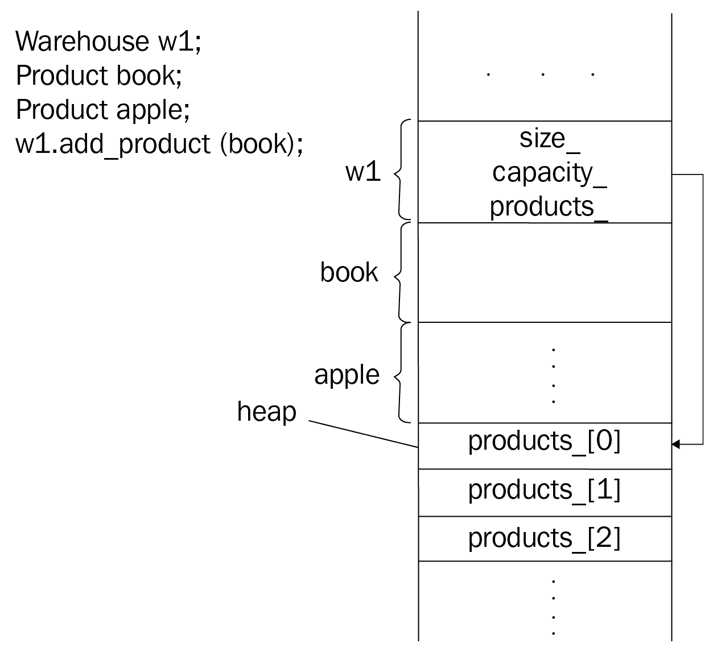

将 **w1** 分配给 **w2** 会产生以下结构:

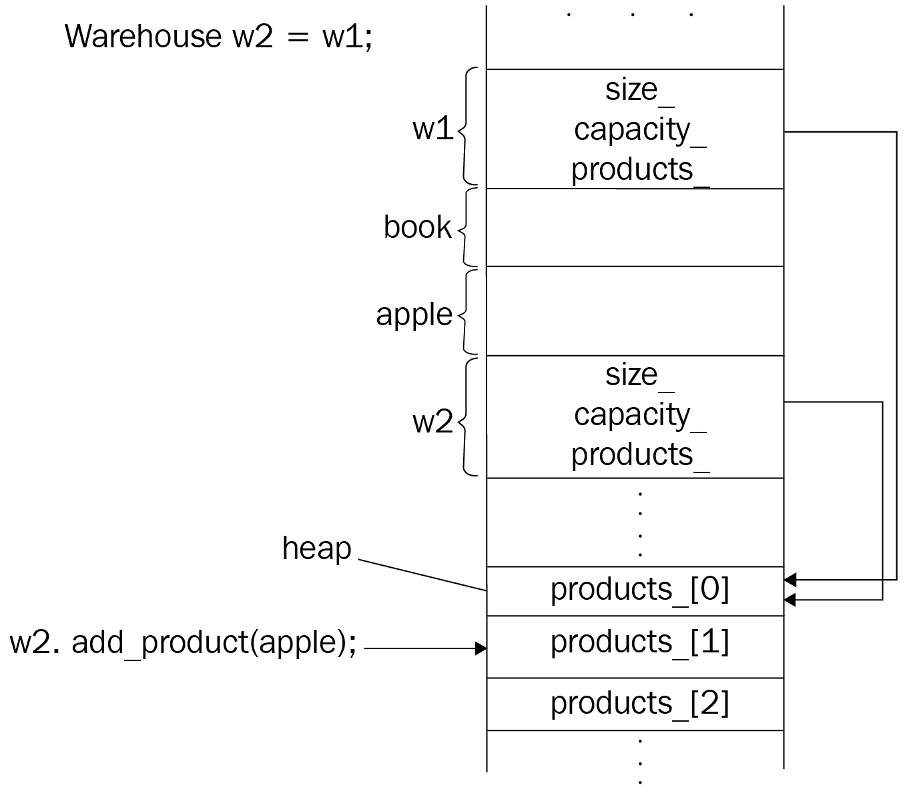

默认实现只是将`w1`的每个成员复制到`w2`。复制后，`w1`和`w2`的`products_`成员都指向堆中相同的位置。当我们给`w2`增加一个新的产品时，`w1`指向的数组受到影响。这是一个逻辑错误，可能会导致程序中出现未定义的行为。我们需要一个*深*而不是*浅*的副本；也就是说，我们实际上需要创建一个新的产品阵列，它有一个 w1 阵列的副本。

复制构造函数和赋值操作符的自定义实现解决了*浅层*复制的问题:

```cpp
class Warehouse {
public:
  // ...
  Warehouse(const Warehouse& rhs) {
 size_ = rhs.size_;
 capacity_ = rhs.capacity_;
 products_ = new Product[capacity_];
 for (int ix = 0; ix < size_; ++ ix) {
 products_[ix] = rhs.products_[ix];
 }
 }
  // code omitted for brevity
};  
```

复制构造函数的自定义实现创建一个新数组。然后，它一个接一个地复制源对象的数组元素，这样就消除了`product_`指针指向错误的内存地址。换句话说，我们通过创建一个新的数组来实现`Warehouse`对象的深度副本。

# 移动物体

临时对象在代码中无处不在。大多数时候，他们需要让代码按预期工作。例如，当我们将两个对象添加在一起时，会创建一个临时对象来保存`operator+`的返回值:

```cpp
Warehouse small;
Warehouse mid;
// ... some data inserted into the small and mid objects
Warehouse large{small + mid}; // operator+(small, mid)
```

让我们来看看全局`operator+()`对于`Warehouse`对象的实现:

```cpp
// considering declared as friend in the Warehouse class
Warehouse operator+(const Warehouse& a, const Warehouse& b) {
  Warehouse sum; // temporary
  sum.size_ = a.size_ + b.size_;
  sum.capacity_ = a.capacity_ + b.capacity_;
  sum.products_ = new Product[sum.capacity_];
  for (int ix = 0; ix < a.size_; ++ ix) { sum.products_[ix] = a.products_[ix]; }
  for (int ix = 0; ix < b.size_; ++ ix) { sum.products_[a.size_ + ix] = b.products_[ix]; }
  return sum;
}
```

前面的实现声明了一个临时对象，并在用必要的数据填充后返回它。上一个示例中的调用可以转换为以下内容:

```cpp
Warehouse small;
Warehouse mid;
// ... some data inserted into the small and mid objects
Warehouse tmp{operator+(small, mid)};
Warehouse large;
Warehouse_copy_constructor(large, tmp);
__destroy_temporary(tmp);
```

C++ 11 中引入的*移动语义*允许我们通过*将返回值移动到`Warehouse`对象中来跳过临时创建。为此，我们应该为`Warehouse`声明一个**移动构造器**，它可以*区分*临时对象并有效地处理它们:*

```cpp
class Warehouse {
public:
  Warehouse(); // default constructor
  Warehouse(const Warehouse&); // copy constructor
  Warehouse(Warehouse&&); // move constructor
  // code omitted for brevity
};
```

移动构造函数的参数是一个**右值引用** ( **& &** )。

# 左值引用

在理解为什么要首先引入右值引用之前，让我们先搞清楚`lvalues`、`references`和`lvalue-references`的事情。当变量是左值时，它可以被寻址，可以被指向，并且它有一个限定范围的存储持续时间:

```cpp
double pi{3.14}; // lvalue
int x{42}; // lvalue
int y{x}; // lvalue
int& ref{x}; // lvalue-reference
```

`ref`是一个`lvalue reference`，一个可以被视为`const`指针的变量的同义词:

```cpp
int * const ref = &x;
```

除了通过引用修改对象的能力之外，我们还通过引用将重对象传递给函数，以优化和避免冗余的对象副本。例如，`Warehouse`的`operator+`通过引用获取两个对象*，从而使其复制对象的地址而不是完整的对象。*

`Lvalue`引用在函数调用方面优化了代码，但是，为了优化临时引用，我们应该继续进行右值引用。

# 右值引用

我们不能将`lvalue`引用绑定到临时对象。以下代码无法编译:

```cpp
int get_it() {
  int it{42};
  return it;
}
...
int& impossible{get_it()}; // compile error
```

我们需要声明一个`rvalue`引用，以便能够绑定到临时对象(包括文字值):

```cpp
int&& possible{get_it()};
```

`Rvalue`引用允许我们尽可能地跳过临时词的生成。例如，通过消除临时对象，将结果作为右值引用的函数运行得更快:

```cpp
void do_something(int&& val) {
  // do something with the val
}
// the return value of the get_it is moved to do_something rather than copied
do_something(get_it()); 
```

为了想象移动的效果，假设前面的代码将被翻译成下面的代码(只是为了获得移动的完整概念):

```cpp
int val;
void get_it() {
  val = 42;
}
void do_something() {
  // do something with the val
}
do_something();
```

在引入 move 之前，前面的代码如下所示(经过一些编译器优化):

```cpp
int tmp;
void get_it() {
  tmp = 42;
}
void do_something(int val) {
  // do something with the val
}
do_something(tmp);
```

当输入参数表示一个`rvalue`时，移动构造函数和移动操作符`=()`具有复制的效果，而不实际执行复制操作。这就是为什么我们也应该在类中实现这些新函数:这样我们就可以在任何有意义的地方优化代码。移动构造函数可以抓取源对象，而不是复制它，如下所示:

```cpp
class Warehouse {
public:
  // constructors omitted for brevity
  Warehouse(Warehouse&& src)
 : size_{src.size_}, 
 capacity_{src.capacity_},
 products_{src.products_}
 {
 src.size_ = 0;
 src.capacity_ = 0;
 src.products_ = nullptr;
 }
};
```

我们没有创建一个新的`capacity_`大小的数组，然后复制`products_`数组的每个元素，而是抓住了指向该数组的指针。我们知道`src`对象是一个右值，它将很快被销毁，这意味着析构函数将被调用，析构函数将删除分配的数组。现在，我们从新创建的`Warehouse`对象指向分配的数组，这就是为什么我们不能让析构函数删除源数组。因此，我们给它分配`nullptr`，以确保析构函数将错过分配的对象。因此，由于移动构造函数，下面的代码将被优化:

```cpp
Warehouse large = small + mid;
```

`+`运算符的结果将被移动而不是复制。请看下图:


上图演示了如何将临时对象移动到大对象。

# 关于运算符重载的注释

C++ 提供了一种强大的机制来重载自定义类型的运算符。使用`+`运算符计算两个对象的和要比调用成员函数好得多。调用成员函数还包括在调用它之前记住它的名字。可能是`add`、`calculateSum`、`calculate_sum`或者别的什么。运算符重载允许在类设计中采用一致的方法。另一方面，重载操作符增加了代码中不必要的冗长。下面的代码片段代表了重载的比较运算符列表，以及`Money`类的加法和减法:

```cpp
constexpr bool operator<(const Money& a, const Money& b) { 
  return a.value_ < b.value_; 
}
constexpr bool operator==(const Money& a, const Money& b) { 
  return a.value_ == b.value_; 
}
constexpr bool operator<=(const Money& a, const Money& b) { 
  return a.value_ <= b.value_; 
}
constexpr bool operator!=(const Money& a, const Money& b) { 
  return !(a == b); 
}
constexpr bool operator>(const Money& a, const Money& b) { 
  return !(a <= b); 
}
constexpr bool operator>=(const Money& a, const Money& b) { 
  return !(a < b); 
}
constexpr Money operator+(const Money& a, const Money& b) { 
  return Money{a.value_ + b.value_}; 
}
constexpr Money operator-(const Money& a, const Money& b) { 
  return Money{a.value_ - b.value_}; 
}
```

如您所见，前面的大多数函数直接访问`Money`实例的值成员。为了让它起作用，我们应该宣布他们为`Money`的朋友。以下是`Money`的样子:

```cpp
class Money
{
public:
  Money() {}
  explicit Money(double v) : value_{v} {}
  // construction/destruction functions omitted for brevity

public:
  friend constexpr bool operator<(const Money&, const Money&);
 friend constexpr bool operator==(const Money&, const Money&);
 friend constexpr bool operator<=(const Money&, const Money&);
 friend constexpr bool operator!=(const Money&, const Money&);
 friend constexpr bool operator>(const Money&, const Money&);
 friend constexpr bool operator>=(const Money&, const Money&);
 friend constexpr bool operator+(const Money&, const Money&);
 friend constexpr bool operator-(const Money&, const Money&);

private:
  double value_;
}; 
```

这个班级看起来很可怕。C++ 20 引入了宇宙飞船运算符，让我们可以跳过比较运算符的定义。`operator<=>()`，也称为三向比较运算符，请求编译器生成关系运算符。对于`Money`类，我们可以使用默认的`operator<=>()`，如下图所示:

```cpp
class Money
{
  // code omitted for brevity
 friend auto operator<=>(const Money&, const Money&) = default;
};
```

编译器将生成`==`、`!=`、`<`、`>`、`<=`、`>=`运算符。`spaceship`运算符减少了运算符的冗余定义，并提供了一种为所有生成的运算符实现通用行为的方法。当实现`spaceship`运算符的自定义行为时，我们应该注意运算符的返回值类型。它可以是以下之一:

*   `std::strong_ordering`
*   `std::weak_ordering`
*   `std::partial_ordering`
*   `std::strong_equality`
*   `std::weak_equality`

所有这些都在`<compare>`标题中定义。编译器根据三向运算符的返回类型生成运算符。

# 封装和公共接口

**封装**是面向对象编程中的一个关键概念。它允许我们对客户端代码隐藏对象的实现细节。以电脑键盘为例；它有字母、数字和符号的按键，如果我们按下它们，每个按键都会起作用。它的用法简单直观，隐藏了很多只有熟悉电子学的人才能处理的低级细节。想象一下一个没有按键的键盘——一个没有标记针脚的裸板。您必须猜测按下哪个键才能实现所需的组合键或文本输入。现在，想象一个没有引脚的键盘——你必须向相应的插座发送适当的信号，才能在特定符号的情况下按下*键。用户可能会因为没有标签而感到困惑，他们也可能会通过按压或向无效插座发送信号来错误地使用标签。我们所知的键盘通过封装实现细节来解决这个问题——就像程序员封装对象一样，这样他们就不会给用户加载冗余成员，并确保用户不会以错误的方式使用对象。*

可见性修饰符通过允许我们定义任何成员的可访问性级别，在类中服务于这个目的。`private`修饰符禁止在客户端代码中使用`private`成员。这允许我们通过提供相应的成员功能来控制`private`成员的修改。一个`mutator`函数，很多人都熟悉它是一个 setter 函数，在针对特定类的特定规则测试了一个`private`成员的值之后，它会修改该值。这方面的一个例子可以在下面的代码中看到:

```cpp
class Warehouse {
public:
  // rather naive implementation
  void set_size(int sz) {
 if (sz < 1) throw std::invalid_argument("Invalid size");
 size_ = sz;
 }
  // code omitted for brevity
private:
  int size_;
};
```

通过`mutator`函数修改数据成员允许我们控制其值。实际的数据成员是私有的，这使得它无法从客户端代码访问，而类本身提供公共函数来更新或读取其私有成员的内容。这些函数以及构造函数通常被称为类的*公共接口*。程序员努力使类的公共界面对用户友好。

看看下面这个类，它代表一个二次方程求解器:一个`ax<sup>2</sup> + bx + c = 0`形式的方程。解决方案之一是使用公式`D  = b2 - 4ac`找到一个判别式，然后基于判别式(D)的值计算`x`的值。下面的类提供了五个功能，分别用于设置`a`、`b`、`c`的值，找到判别式，求解并返回`x`的值:

```cpp
class QuadraticSolver {
public:
  QuadraticSolver() = default;
  void set_a(double a);
 void set_b(double b);
 void set_c(double c);
 void find_discriminant();
 double solve(); // solve and return the x
private:
  double a_;
  double b_;
  double c_;
  double discriminant_;
};
```

公共接口包括前面提到的四个函数和默认构造函数。求解方程 *2x <sup>2</sup> + 5x - 8 = 0* ，我们应该这样使用`QuadraticSolver`:

```cpp
QuadraticSolver solver;
solver.set_a(2);
solver.set_b(5);
solver.set_c(-8);
solver.find_discriminant();
std::cout << "x is: " << solver.solve() << std::endl;
```

类的公共接口应该明智地设计；前面的例子显示了设计不良的迹象。用户必须知道协议，也就是调用函数的确切顺序。如果用户错过对`find_discriminant()`的调用，结果将是未定义或无效的。公共界面强制用户学习协议，按照正确的顺序调用函数，即设置`a`、`b`、`c`的值，然后调用`find_discriminant()`函数，最后调用`solve()`函数得到`x`的期望值。一个好的设计应该提供一个直观简单的公共界面。我们可以覆盖`QuadraticSolver`使其只有一个函数，该函数接受所有必要的输入值，计算判别式本身，并返回解:

```cpp
class QuadtraticSolver {
public:
  QuadraticSolver() = default;
 double solve(double a, double b, double c);
};
```

前面的设计比上一个更直观。下面的代码演示了使用`QuadraticSolver`来求解方程， *2x2 + 5x - 8 = 0* :

```cpp
QuadraticSolver solver;
std::cout << solver.solve(2, 5, -8) << std::endl;
```

这里要考虑的最后一件事是二次方程可以用多种方法求解的想法。我们介绍的是通过找到判别式来实现的。我们应该考虑，将来，我们可以向类中添加更多的实现方法。更改函数的名称可能会增加公共接口的可读性，并确保类的未来更新。我们还应该注意到，前面例子中的`solve()`函数以`a`、`b`和`c`作为参数，我们不需要将它们存储在类中，因为解是直接在函数中计算的。

很明显，仅仅为了能够访问`solve()`功能而声明`QuadraticSolver`的对象似乎是多余的一步。该类的最终设计如下所示:

```cpp
class QuadraticSolver {
public:
  QuadraticSolver() = delete;

  static double solve_by_discriminant(double a, double b, double c);
  // other solution methods' implementations can be prefixed by "solve_by_"
};
```

我们将`solve()`函数重命名为`solve_by_discriminant()`，这也暴露了解决方案的底层方法。我们还使函数*成为静态的*，从而使它对用户可用，而无需声明类的实例。但是，我们也标记了默认构造函数*删除了*，这再次迫使用户不要声明对象:

```cpp
std::cout << QuadraticSolver::solve_by_discriminant(2, 5, -8) << std::endl;
```

客户端代码现在使用类花费的精力更少了。

# c++ 中的 struts

结构几乎和 C++ 中的类一样。它们具有类的所有特性，您可以从结构继承类，反之亦然。`class`和`struct`之间唯一的区别是默认可见性。对于结构，默认可见性修饰符是公共的。这也与继承有关。例如，当您从另一个类继承一个类而不使用修饰符时，它会私下继承。`Base`以下阶级私底下继承:

```cpp
class Base
{
public:
  void foo() {}
};

class Derived : Base
{
  // can access foo() while clients of Derived can't
};
```

遵循相同的逻辑，以下结构公开继承了`Base`:

```cpp
struct Base
{
  // no need to specify the public section
  void foo() {}
};

struct Derived : Base
{
  // both Derived and clients of Derived can access foo()
};
```

这同样适用于从结构继承的类。例如，`Derived`类如果没有直接指定，则从`Base`私有继承:

```cpp
struct Base
{
  void foo() {}
};

// Derived inherits Base privately
class Derived: Base
{
  // clients of Derived can't access foo()
};
```

在 C++ 中，结构和类是可以互换的，但是大多数程序员更喜欢将结构用于简单类型。C++ 标准对简单类型给出了更好的定义，并将它们称为**聚合**。如果类(结构)符合以下规则，则它是一个聚合:

*   没有私有或受保护的非静态数据成员
*   没有用户声明或继承的构造函数
*   没有虚拟、私有或受保护的基类
*   没有虚拟成员函数

当你读完这一章后，这些规则中的大部分会更加清晰。以下结构是聚合的示例:

```cpp
struct Person
{
  std::string name;
  int age;
  std::string profession;
};
```

在深入研究继承和虚函数之前，让我们看看聚合在初始化时会带来什么好处。我们可以通过以下方式初始化`Person`对象:

```cpp
Person john{"John Smith", 22, "programmer"};
```

C++ 20 提供了更奇特的方法来初始化聚合:

```cpp
Person mary{.name = "Mary Moss", .age{22}, .profession{"writer"}};
```

请注意，我们是如何混合使用指示符初始化成员的。

结构化绑定允许我们声明绑定到聚合成员的变量，如以下代码所示:

```cpp
const auto [p_name, p_age, p_profession] = mary;
std::cout << "Profession is: " << p_profession << std::endl;
```

结构化绑定也适用于数组。

# 阶级关系

对象互通是面向对象系统的核心。关系是对象之间的逻辑链接。我们可以在对象类之间区分或建立适当关系的方式定义了系统设计的整体性能和质量。考虑`Product`和`Warehouse`类；他们处于一种叫做聚合的关系中，因为`Warehouse`包含`Products`，也就是`Warehouse`聚合`Products`:


就纯面向对象而言，有几种关系，如关联、聚合、组合、实例化、泛化等。

# 聚集和组成

我们在`Warehouse`类的例子中遇到了聚合。`Warehouse`类存储一系列产品。更一般地说，它可以被称为一个*关联*，但是为了强调确切的包含，我们使用了术语*聚合*或*组合*。在聚合的情况下，包含其他类的一个或多个实例的类可以在没有聚合的情况下被实例化。这意味着我们可以创建和使用一个`Warehouse`对象，而不必创建包含在`Warehouse`中的`Product`对象。

聚合的另一个例子是`Car`和`Person`。一个`Car`可以包含一个`Person`对象(作为驾驶员或乘客)，因为它们是相互关联的，但是包含性不强。我们可以创建一个没有`Driver`的`Car`对象，如下所示:

```cpp
class Person; // forward declaration
class Engine { /* code omitted for brevity */ };
class Car {
public:
  Car();
  // ...
private:
  Person* driver_; // aggregation
  std::vector<Person*> passengers_; // aggregation
  Engine engine_; // composition
  // ...
}; 
```

强遏制由**成分**表示。对于`Car`示例，`Engine`类的一个对象需要构成一个完整的`Car`对象。在此物理表示中，`Engine`成员在创建`Car`时自动创建。

下面是聚合和组合的 UML 表示:

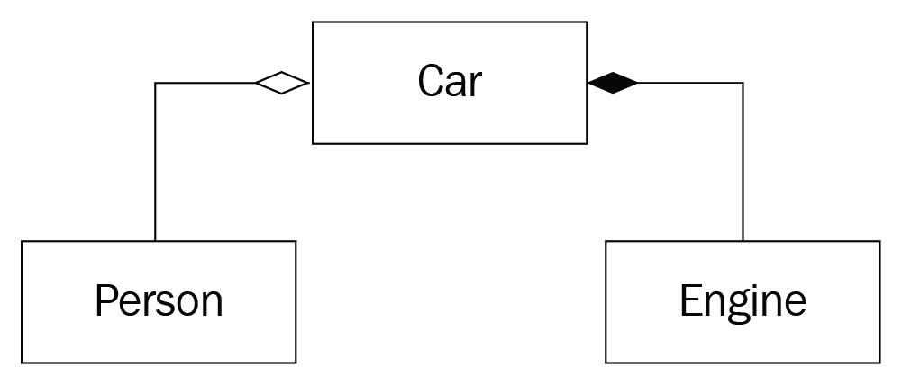

设计班级时，我们必须决定他们之间的关系。定义这两个类别之间的构成的最好方法是*has-一个*关系测试。A `Car`有-a `Engine`，因为汽车有发动机。任何时候你不能决定关系是否应该用构成来表达，就问 *has-a* 问题。聚集和组成有些相似；他们只是描述了联系的强度。对于聚合，正确的问题应该是*可以有一个*；例如，`Car`可以有一个驾驶员(属于`Person`类型)；也就是说，遏制力很弱。

# 遗产

**继承**是一个允许我们重用类的编程概念。编程语言提供了不同的继承实现，但是一般的规则总是成立的:类关系应该回答 *is-a* 的问题。比如一个`Car`就是-一个`Vehicle`，可以让我们从`Vehicle`继承`Car`:

```cpp
class Vehicle {
public:
  void move();
};

class Car : public Vehicle {
public:
  Car();
  // ...
};
```

`Car`现在具有源自`Vehicle`的`move()`成员功能。继承本身代表一种泛化/特化关系，其中父类(`Vehicle`)是泛化，子类(`Car`)是特化。

The parent class could be referred to as the base class or the superclass, while the child class could be referred to as the derived class or the subclass, respectively. 

只有在绝对必要的情况下，才应该考虑使用继承。正如我们前面提到的，类应该满足 *is-a* 关系，有时候，这有点棘手。考虑`Square`和`Rectangle`类。下面的代码以最简单的形式声明了`Rectangle`类:

```cpp
class Rectangle {
public:
  // argument checks omitted for brevity
  void set_width(int w) { width_ = w; }
  void set_height(int h) { height_ = h; }
  int area() const { return width_ * height_; }
private:
  int width_;
  int height_;
};
```

`Square` *是-a* `Rectangle`，所以我们很容易从`Rectangle`继承它:

```cpp
class Square : public Rectangle {
public:
  void set_side(int side) {
 set_width(side);
 set_height(side);
  }

 int area() { 
    area_ = Rectangle::area();
    return area_; 
  }
private:
 int area_;
};
```

`Square`通过添加新的数据成员`area_`，并使用自己的实现覆盖`area()`成员函数，扩展了`Rectangle`。在实践中，`area_`和我们计算其价值的方式都是多余的；我们这样做是为了展示一个糟糕的类设计，并使`Square`在某种程度上扩展其父类。很快，我们会得出结论，在这种情况下，继承是一个糟糕的设计选择。`Square`是`Rectangle`，所以无论在哪里使用`Rectangle`，都应该作为`Rectangle`使用，如下图所示:

```cpp
void make_big_rectangle(Rectangle& ref) {
  ref->set_width(870);
  ref->set_height(940);
}

int main() {
  Rectangle rect;
  make_big_rectangle(rect);
  Square sq;
  // Square is a Rectangle
  make_big_rectangle(sq);
}
```

`make_big_rectangle()`函数引用了`Rectangle`，`Square`继承了它，所以给`make_big_rectangle()`函数发送一个`Square`对象是完全可以的；`Square`T9 是-a a `Rectangle`。这种用子类型成功替换类型的例子被称为**利科夫替换原则**。让我们找出为什么这种替代在实践中有效，然后决定我们是否通过从`Rectangle`继承`Square`而犯了设计错误(是的，我们犯了)。

# 从编译器的角度看继承

我们可以用下面的方式来描述我们之前声明的`Rectangle`类:

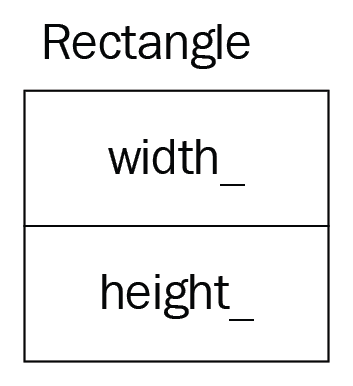

当我们在`main()`函数中声明`rect`对象时，函数的局部对象所需的空间在堆栈中分配。调用`make_big_rectangle()`函数时，也遵循同样的逻辑。它没有局部参数；相反，它有一个`Rectangle&`类型的参数，其行为类似于指针:它占用存储内存地址所需的内存空间(在 32 位和 64 位系统中分别为 4 或 8 字节)。`rect`对象通过引用传递给`make_big_rectangle()`，这意味着`ref`参数引用了`main()`中的局部对象:

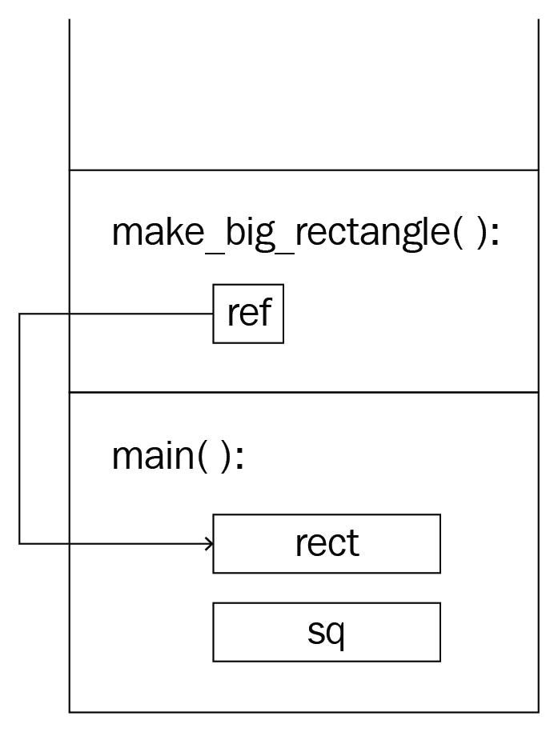

这里有一个`Square`类的例子:

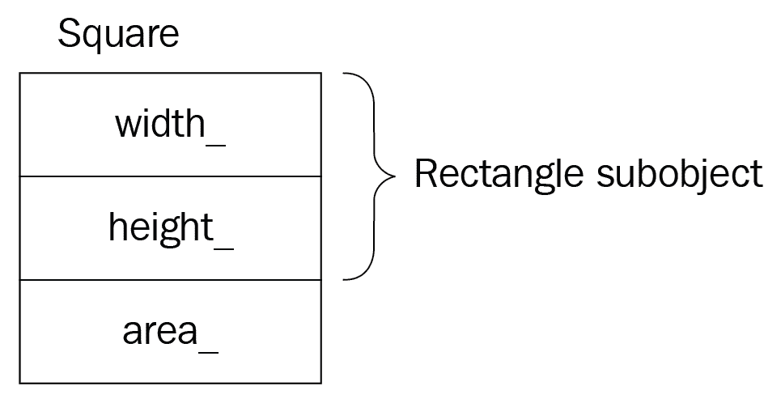

如上图所示，`Square`对象包含`Rectangle`的**子对象**；它部分代表了一个`Rectangle`。在这个特殊的例子中，`Square`类没有用新的数据成员扩展矩形。

`Square`对象被传递给`make_big_rectangle()`，尽管后者采用了`Rectangle&`类型的参数。我们知道访问底层对象时需要指针(引用)的类型。类型定义了应该从指针指向的起始地址读取多少字节。在这种情况下，`ref`存储在`main()`中声明的本地`rect`对象的起始地址的副本。当`make_big_rectangle()`通过`ref`访问成员函数时，它实际上调用了以`Rectangle`引用为第一参数的全局函数。该函数被翻译成如下内容(同样，为了简单起见，我们对其进行了略微修改):

```cpp
void make_big_rectangle(Rectangle * const ref) {
  Rectangle_set_width(*ref, 870);
  Rectangle_set_height(*ref, 940);
}
```

取消引用`ref`意味着从`ref`指向的存储位置开始读取`sizeof(Rectangle)`字节。当我们将一个`Square`对象传递给`make_big_rectangle()`时，我们将`sq`(该`Square`对象)的起始地址分配给`ref`。这将正常工作，因为`Square`对象实际上包含一个`Rectangle`子对象。当`make_big_rectangle()`函数取消引用`ref`时，它只能访问对象的`sizeof(Rectangle)`字节，而*看不到实际`Square`对象的*附加字节。下图说明了子对象`ref`指向的部分:

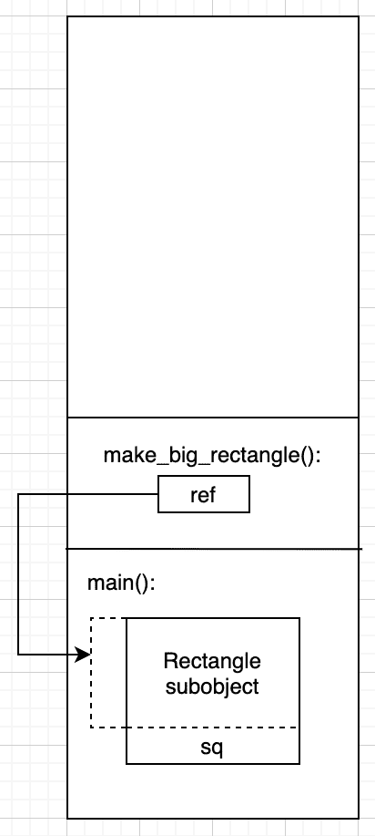

从`Rectangle`继承`Square`几乎与声明两个结构相同，其中一个(子)包含另一个(父):

```cpp
struct Rectangle {
 int width_;
 int height_;
};

void Rectangle_set_width(Rectangle& this, int w) {
  this.width_ = w;
}

void Rectangle_set_height(Rectangle& this, int h) {
  this.height_ = h;
}

int Rectangle_area(const Rectangle& this) {
  return this.width_ * this.height_;
}

struct Square {
 Rectangle _parent_subobject_;
 int area_; 
};

void Square_set_side(Square& this, int side) {
  // Rectangle_set_width(static_cast<Rectangle&>(this), side);
 Rectangle_set_width(this._parent_subobject_, side);
  // Rectangle_set_height(static_cast<Rectangle&>(this), side);
 Rectangle_set_height(this._parent_subobject_, side);
}

int Square_area(Square& this) {
  // this.area_ = Rectangle_area(static_cast<Rectangle&>(this));
 this.area_ = Rectangle_area(this._parent_subobject_); 
  return this.area_;
}
```

前面的代码演示了编译器支持继承的方式。看看`Square_set_side`和`Square_area`函数的注释代码行。我们实际上并不坚持这种实现，但是它表达了编译器如何处理 OOP 代码的完整想法。

# 合成与继承

C++ 语言为我们提供了方便且面向对象的语法，这样我们就可以表达继承关系，但是编译器处理它的方式类似于组合而不是继承。实际上，只要适用，使用组合而不是继承会更好。`Square`级及其与`Rectangle`的关系被认为是一个糟糕的设计选择。原因之一是子类型替换原则，它允许我们以错误的方式使用`Square`:将其传递给一个函数，该函数将其修改为`Rectangle`而不是`Square`。这告诉我们*是-a* 关系不正确，因为`Square`毕竟不是`Rectangle`。它是一个`Rectangle`的改编而不是`Rectangle`本身，也就是说它实际上并不代表一个`Rectangle`；它使用它向类用户提供有限的功能。

`Square`的用户不应该知道它可以作为`Rectangle`；否则，在某些时候，他们会向`Square`实例发送无效或不受支持的消息。无效消息的例子是对`set_width`或`set_height`函数的调用。`Square`实际上不应该支持两个不同的成员函数来分别修改它的边，但是它不能隐藏这一点，因为它宣布它继承了`Rectangle`:

```cpp
class Square : public Rectangle {
  // code omitted for brevity
};
```

如果我们把修饰语从公共改为私人呢？C++ 支持公共和私有继承类型。它也支持受保护的继承。当从类私有继承时，子类打算使用父类，并且可以访问它的公共接口。然而，客户端代码并不知道它处理的是一个派生类。此外，从父类继承的公共接口对于子类的用户来说是私有的。似乎`Square`将继承转化为合成:

```cpp
class Square : private Rectangle {
public:
  void set_side(int side) {
    // Rectangle's public interface is accessible to the Square
    set_width(side);
 set_height(side);
  }
  int area() {
    area_ = Rectangle::area();
    return area_;
  }
private:
  int area_;
};
```

客户端代码无法访问从`Rectangle`继承的成员:

```cpp
Square sq;
sq.set_width(14); // compile error, the Square has no such public member
make_big_rectangle(sq); // compile error, can't cast Square to Rectangle
```

通过在`Square`的私有部分声明一个`Rectangle`成员也可以达到同样的效果:

```cpp
class Square {
public: 
  void set_side(int side) {
 rectangle_.set_width(side);
 rectangle_.set_height(side);
  }
  int area() {
 area_ = rectangle_.area();
    return area_;
  }
private:
 Rectangle rectangle_;
  int area_;
};
```

你要仔细分析使用场景，完整回答*是-a* 问题，才能毫无疑问地使用继承。每次遇到构图和继承之间的选择，选择构图。

我们可以在私下继承时省略修饰语。类的默认访问修饰符是私有的，因此`class Square : private Rectangle {};`与`class Square : Rectangle {};`相同。相反，结构的默认修饰符是公共的。

# 受保护的继承

最后，我们有**保护的**访问修饰符。它指定类成员的访问级别(如果它们在类体中使用的话)。受保护成员对类用户是私有的，但对派生类是公共的。如果修饰符用于指定继承类型，它的行为类似于派生类用户的私有继承。私有继承向所有派生类用户隐藏基类的公共接口，而受保护的继承使派生类的后代可以访问它。

很难想象你需要受保护的继承的场景，但是你应该把它看作一个在意想不到的明显设计中可能有用的工具。假设我们需要设计一个堆栈数据结构适配器。堆栈通常基于向量(一维数组)、链表或出列来实现。

The stack conforms to the LIFO rule, which states that the last element inserted into the stack will be accessed first. Similarly, the first element inserted into the stack will be accessed last. We will discuss data structures and data structure adapters in more detail in [Chapter 6](06.html), *Digging into Data Structures and Algorithms in STL*

堆栈本身并不代表数据结构；它*位于*数据结构之上，并通过限制、修改或扩展其功能来适应其使用。以下是表示一维整数数组的`Vector`类的简单声明:

```cpp
class Vector {
public:
  Vector();
  Vector(const Vector&);
  Vector(Vector&&);
  Vector& operator=(const Vector&);
  Vector& operator=(Vector&&);
  ~Vector();

public:
  void push_back(int value);
  void insert(int index, int value);
  void remove(int index);
  int operator[](int index);
  int size() const;
  int capacity() const;

private:
  int size_;
  int capacity_;
  int* array_;
};
```

前面的`Vector`不是支持随机访问迭代器的 STL 兼容容器；它包含动态增加阵列的最低值。它可以通过以下方式声明和使用:

```cpp
Vector v;
v.push_back(4);
v.push_back(5);
v[1] = 2;
```

虽然`Vector`类提供`operator[]`，允许我们随机访问它的任何项目，`Stack`禁止随机访问。`Stack`提供了`push`和`pop`操作，这样我们就可以分别将一个值插入其底层数据结构和获取该值:

```cpp
class Stack : private Vector {
public:
  // constructors, assignment operators and the destructor are omitted for brevity
 void push(int value) {
 push_back(value);
 }
 int pop() {
 int value{this[size() - 1]};
 remove(size() - 1);
 return value;
 }
};
```

`Stack`可以通过以下方式使用:

```cpp
Stack s;
s.push(5);
s.push(6);
s.push(3);
std::cout << s.pop(); // outputs 3
std::cout << s.pop(); // outputs 6
s[2] = 42; // compile error, the Stack has no publicly available operator[] defined
```

栈*适配*`Vector`，提供两个成员函数，我们可以访问。私有继承允许我们使用`Vector`的全部功能，并对`Stack`用户隐藏继承信息。如果我们想继承`Stack`来创建它的高级版本呢？假设`AdvancedStack`类提供了`min()`函数，该函数以恒定时间返回堆栈中包含的最小值。

私有继承禁止`AdvancedStack`使用`Vector`的公共接口，所以我们需要一种方法允许`Stack`子类使用它的基类，但是对类用户隐藏基类的存在。受保护的继承服务于这个目标，如下面的 coe 所示:

```cpp
class Stack : protected Vector {
  // code omitted for brevity
};

class AdvancedStack : public Stack {
  // can use the Vector
};
```

通过从`Vector`继承`Stack`，我们允许`Stack`的子类使用`Vector`公共接口。但是`Stack`和`AdvancedStack`的用户都不能以`Vector`的身份访问它们。

# 多态性

**多态性**是面向对象编程中的另一个关键概念。它允许子类对从基类派生的函数有自己的实现。假设我们有`Musician`类，它有`play()`成员函数:

```cpp
class Musician {
public:
  void play() { std::cout << "Play an instrument"; }
};
```

现在，我们来声明`Guitarist`类，它具有`play_guitar()`功能:

```cpp
class Guitarist {
public:
  void play_guitar() { std::cout << "Play a guitar"; }
};
```

这是使用继承的明显情况，因为`Guitarist`只是尖叫着它*是-a* `Musician`。`Guitarist`自然不会通过增加新功能(如`play_guitar()`)来扩展`Musician`；相反，它应该提供从`Musician`派生的`play()`功能的自己的实现。为此，我们使用**虚拟功能**:

```cpp
class Musician {
public:
  virtual void play() { std::cout << "Play an instrument"; }
};

class Guitarist : public Musician {
public:
  void play() override { std::cout << "Play a guitar"; }
};
```

现在，很明显很简单，`Guitarist`类为`play()`函数提供了自己的实现，客户端代码只需使用指向基类的指针就可以访问它:

```cpp
Musician armstrong;
Guitarist steve;
Musician* m = &armstrong;
m->play();
m = &steve;
m->play();
```

前面的例子展示了多态性的作用。虽然虚函数的使用是自然而然的，但除非我们正确使用，否则它实际上没有多大意义。首先，`Musician`的`play()`功能根本不应该有任何实现。原因很简单:音乐家应该能够在一种具体的乐器上演奏，因为他们不能同时在一种以上的乐器上演奏。为了摆脱实现，我们通过分配`0`给它，将该函数设置为**纯虚函数**:

```cpp
class Musician {
public:
 virtual void play() = 0;
};
```

当客户端代码试图声明`Musician`的实例时，这会导致编译错误。当然，这肯定会导致编译错误，因为你不应该创建一个具有*未定义*函数的对象。`Musician`只有一个目的:它只能被其他类继承。存在要继承的类称为**抽象类**。实际上，`Musician`被称为一个**接口**而不是一个抽象类。抽象类是一个半接口半类，它可以有两种类型的函数:有和没有实现。

回到我们的例子，让我们添加`Pianist`类，它也实现了`Musician`接口:

```cpp
class Pianist : public Musician {
public: 
 void play() override { std::cout << "Play a piano"; }
};
```

为了表达多态性的全部力量，让我们假设我们在某个地方声明了一个函数，该函数返回一组音乐家，要么是吉他手，要么是钢琴家:

```cpp
std::vector<Musician*> get_musicians();
```

从客户端代码的角度来看，将很难剖析`get_musicians()`函数的返回值，并找出对象的实际子类型是什么。它可能是`Guitarist`或`Pianist`，甚至是纯粹的`Musician`。重点是，客户不应该真正关心对象的实际类型，因为它知道集合包含音乐家，并且一个`Musician`对象具有`play()`功能。因此，要让它们发挥作用，客户端只需遍历集合，让每个音乐家演奏自己的乐器(每个对象都调用它的实现):

```cpp
auto all_musicians = get_musicians();
for (const auto& m: all_musicians) {
 m->play();
}
```

前面的代码表达了多态性的全部力量。现在，让我们理解这种语言是如何在低层次上支持多态性的。

# 引擎盖下的虚拟功能

虽然多态性不限于虚函数，但我们将更详细地讨论它们，因为动态多态性是 C++ 中最流行的多态性形式。同样，更好地理解一个概念或技术的最好方法是自己实现它。无论我们在一个类中声明一个虚拟成员函数，还是它有一个带有虚拟函数的基类，编译器都会用一个额外的指针来扩充这个类。指针指向一个通常被称为虚拟函数表的表，或者简称为*虚拟表*。我们也称指针为*虚拟表指针*。

假设我们正在为银行客户账户管理实现一个类子系统。假设银行要求我们根据账户类型进行提现。例如，储蓄账户允许一年兑现一次钱，而支票账户允许客户随时兑现钱。在不深入探讨`Account`类的任何不必要的细节的情况下，让我们声明将帮助我们理解虚拟成员函数的最低限度。我们来看看`Account`类的定义:

```cpp
class Account
{
public:
 virtual void cash_out() {
 // the default implementation for cashing out 
 }  virtual ~Account() {}
private:
  double balance_;
};
```

编译器将`Account`类转换成一个指向虚函数表的结构。下面的代码表示伪代码，解释当我们在类中声明虚函数时会发生什么。像往常一样，请注意，我们提供的是一般的解释，而不是编译器特定的实现(mangling 这个名称也是通用形式；例如，我们将`cash_out`改名为`Account_cash_out`):

```cpp
struct Account
{
 VTable* __vptr;
  double balance_;
};

void Account_constructor(Account* this) {
 this->__vptr = &Account_VTable;
}

void Account_cash_out(Account* this) {
  // the default implementation for cashing out
}

void Account_destructor(Account* this) {}
```

好好看看前面的伪代码。`Account`结构的第一个成员是`__vptr`。由于之前声明的`Account`类有两个虚函数，我们可以将虚拟表想象成一个数组，其中有两个指向虚拟成员函数的指针。请参见以下图示:

```cpp
VTable Account_VTable[] = {
 &Account_cash_out,
 &Account_destructor
};
```

有了前面的假设，让我们看看当我们调用一个对象上的虚函数时，编译器会生成什么代码:

```cpp
// consider the get_account() function as already implemented and returning an Account*
Account* ptr = get_account();
ptr->cash_out();
```

下面是我们可以想象的编译器生成的代码，与前面的代码类似:

```cpp
Account* ptr = get_account();
ptr->__vptr[0]();
```

虚函数在层次结构中使用时显示了它们的威力。`SavingsAccount`像这样继承自`Account`类:

```cpp
class SavingsAccount : public Account
{
public:
 void cash_out() override {
 // an implementation specific to SavingsAccount
 }
  virtual ~SavingsAccount() {}
};
```

当我们通过指针(或引用)调用`cash_out()`时，虚拟函数基于指针指向的目标对象被调用。例如，假设`get_savings_account()`返回一个`SavingsAccount`作为`Account*`。以下代码将调用`cash_out()`的`SavingsAccount`实现:

```cpp
Account* p = get_savings_account();
p->cash_out(); // calls SavingsAccount version of the cash_out
```

以下是编译器为`SavingsClass`生成的内容:

```cpp
struct SavingsAccount
{
  Account _parent_subobject_;
  VTable* __vptr;
};

VTable* SavingsAccount_VTable[] = {
  &SavingsAccount_cash_out,
  &SavingsAccount_destructor,
};

void SavingsAccount_constructor(SavingsAccount* this) {
  this->__vptr = &SavingsAccount_VTable;
}

void SavingsAccount_cash_out(SavingsAccount* this) {
  // an implementation specific to SavingsAccount
}

void SavingsAccount_destructor(SavingsAccount* this) {}
```

所以，我们有两个不同的虚函数表。当我们创建一个`Account`类型的对象时，它的`__vptr`指向`Account_VTable`，而`SavingsAccount`类型的对象的`__vptr`指向`SavingsAccount_VTable`。让我们看看下面的代码:

```cpp
p->cash_out();
```

前面的代码翻译成这样:

```cpp
p->__vptr[0]();
```

现在，很明显`__vptr[0]`解析为正确的函数，因为它是通过`p`指针读取的。

如果`SavingsAccount`没有覆盖`cash_out()`功能怎么办？在这种情况下，编译器只需将基类实现的地址放在与`SavingsAccount_VTable`相同的槽中，如下所示:

```cpp
VTable* SavingsAccount_VTable[] = {
  // the slot contains the base class version 
  // if the derived class doesn't have an implementation
 &Account_cash_out,
  &SavingsAccount_destructor
};
```

编译器以不同的方式实现虚函数的表示和管理。有些实现甚至使用不同的模型，而不是我们前面介绍的模型。为了简单起见，我们引入了一种流行的方法，并以通用的方式表示它。现在，我们将看看在包含动态多态性的代码的引擎盖下发生了什么。

# 设计模式

设计模式是程序员最具表现力的工具之一。它们让我们能够以一种优雅且久经考验的方式解决设计问题。当你努力为你的类和它们的关系提供最好的设计时，一个著名的设计模式可能会拯救你。

设计模式最简单的例子是**单例**。它为我们提供了一种只声明和使用类的一个实例的方法。比如，假设电商平台只有一个`Warehouse`。要访问`Warehouse`类，项目可能要求我们在许多源文件中包含并使用它。为了保持同步，我们应该让`Warehouse`成为一个单独的个体:

```cpp
class Warehouse {
public:
  static create_instance() {
 if (instance_ == nullptr) {
 instance_ = new Warehouse();
 }
 return instance_;
 }

 static remove_instance() {
 delete instance_;
 instance_ = nullptr;
 }

private:
  Warehouse() = default;

private:
  static Warehouse* instance_ = nullptr;
};
```

我们声明了一个静态`Warehouse`对象和两个静态函数来创建和销毁相应的实例。每次用户试图以旧方式声明`Warehouse`对象时，私有构造函数都会导致编译错误。为了能够使用`Warehouse`，客户端代码必须调用`create_instance()`函数:

```cpp
Warehouse* w = Warehouse::create_instance();
Product book;
w->add_product(book);
Warehouse::remove_instance();
```

`Warehouse`的单例实现并不完整，只是引入设计模式的一个例子。我们将在本书中介绍更多的设计模式。

# 摘要

在本章中，我们讨论了面向对象编程的基本概念。我们谈到了类的底层细节和 C++ 对象模型的编译器实现。知道如何设计和实现类而不实际拥有类有助于以正确的方式使用类。

我们还讨论了继承的必要性，并尝试在可能适用的地方使用组合而不是继承。C++ 支持三种类型的继承:公共继承、私有继承和受保护继承。所有这些类型在特定的类设计中都有应用。最后，我们通过引入一个大大提高客户端代码便利性的例子来理解多态性的用途和威力。

在下一章中，我们将学习更多关于模板和模板元编程的知识，我们将把它们作为基础来深入研究一个名为概念的新的 C++ 20 特性。

# 问题

1.  物体的三个属性是什么？
2.  移动物体而不是复制物体有什么好处？
3.  C++ 中的结构和类有什么区别？
4.  聚合关系和组合关系有什么区别？
5.  私有继承和受保护继承有什么区别？
6.  如果我们在其中定义一个虚函数，类的大小会受到什么影响？
7.  使用 Singleton 设计模式有什么意义？

# 进一步阅读

有关更多信息，请参考:

*   Grady Booch，*面向对象分析与设计*([https://www . Amazon . com/Object-Oriented-Analysis-Design-Applications-3rd/DP/020189551 x/](https://www.amazon.com/Object-Oriented-Analysis-Design-Applications-3rd/dp/020189551X/))
*   斯坦利·利普曼，*c++ 对象模型内部*([https://www . Amazon . com/Inside-Object-Model-Stanley-利普曼/dp/0201834545/](https://www.amazon.com/Inside-Object-Model-Stanley-Lippman/dp/0201834545/) )