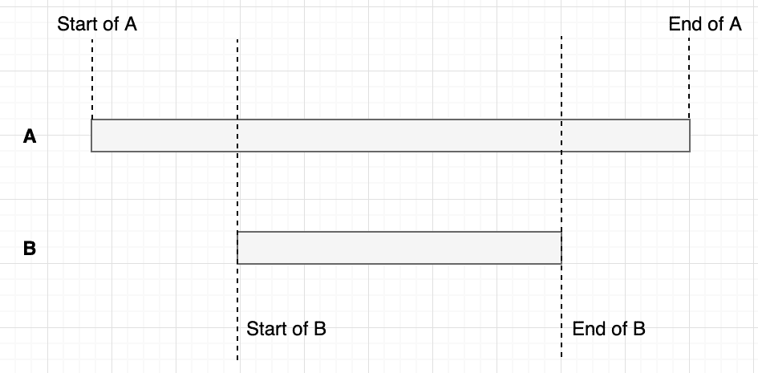
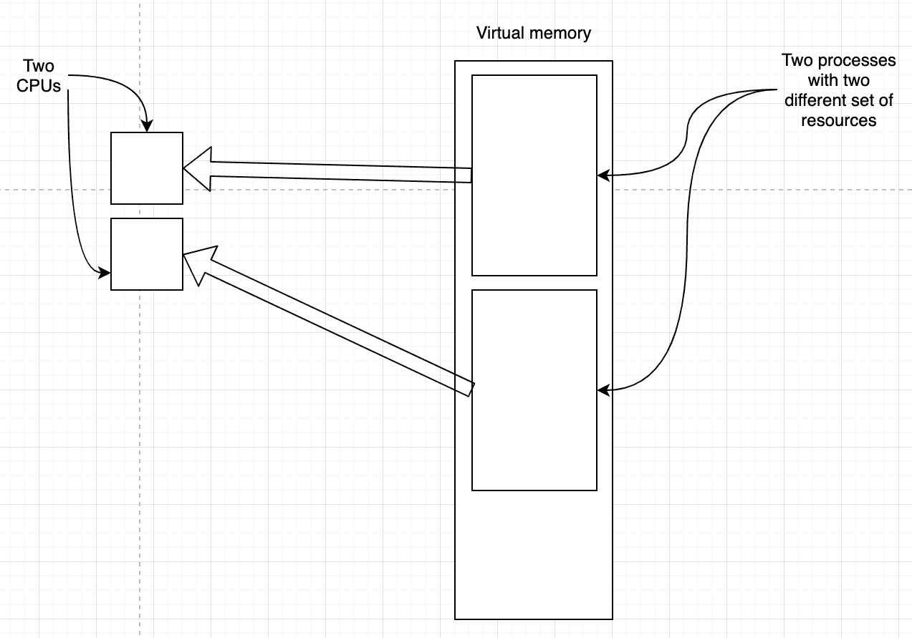
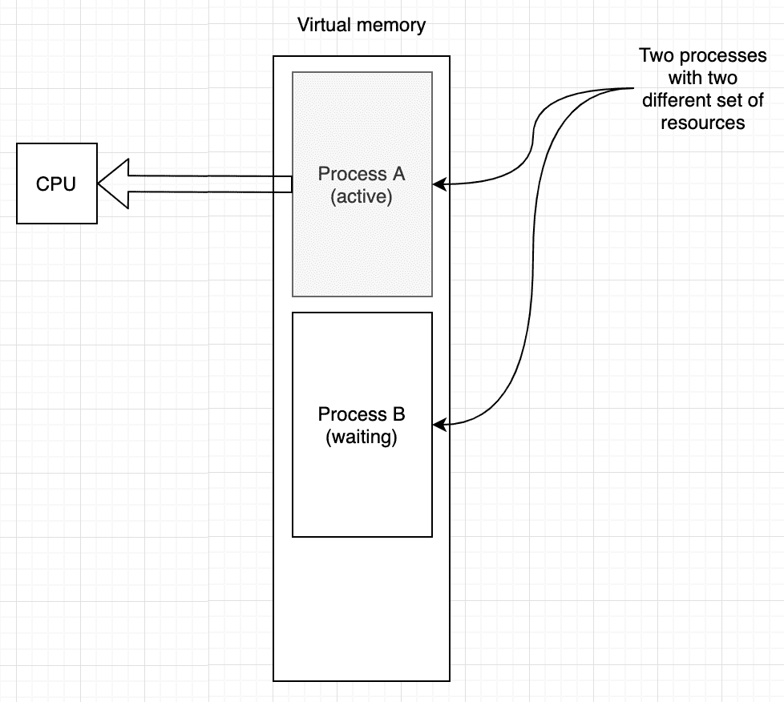
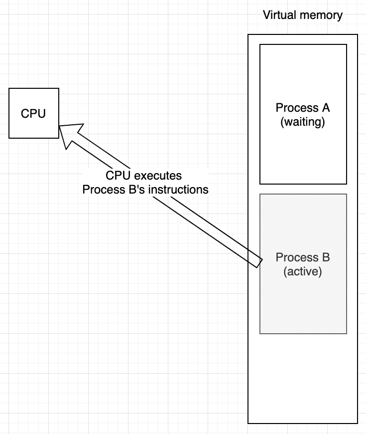
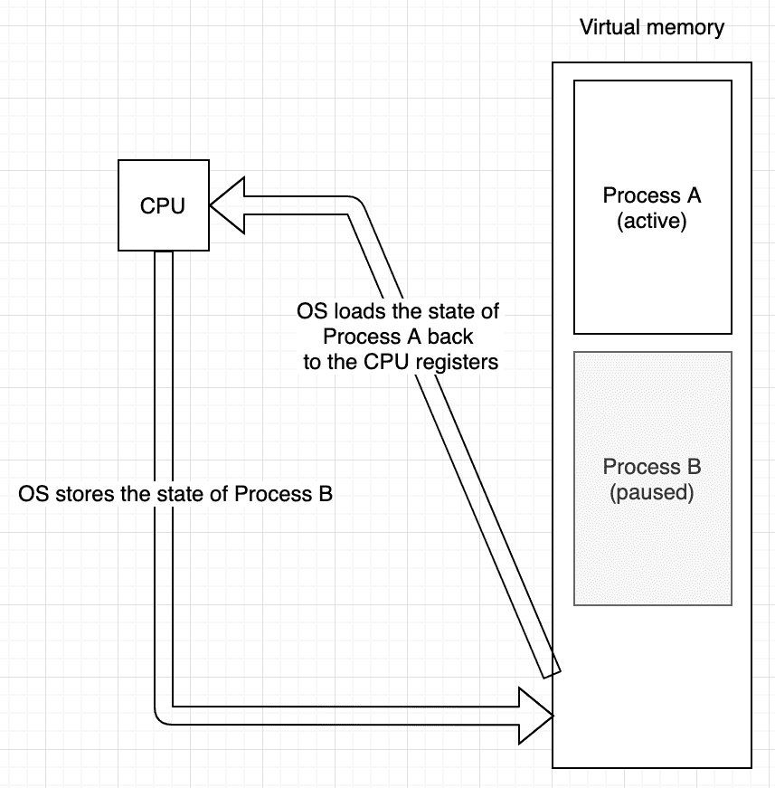
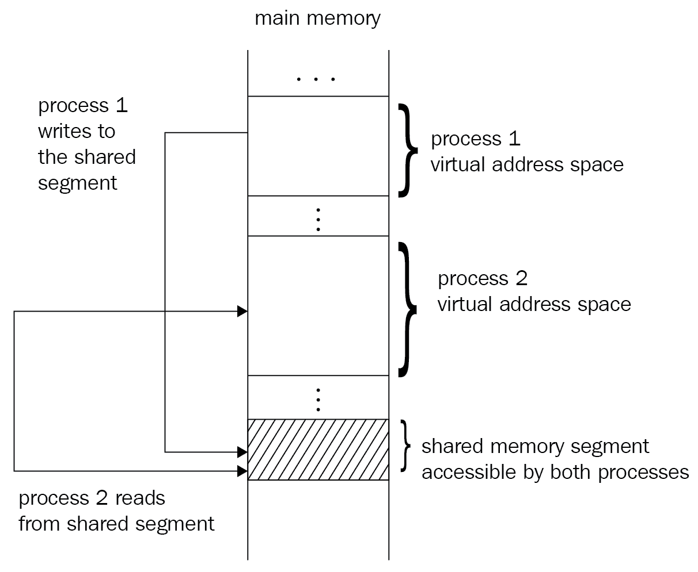
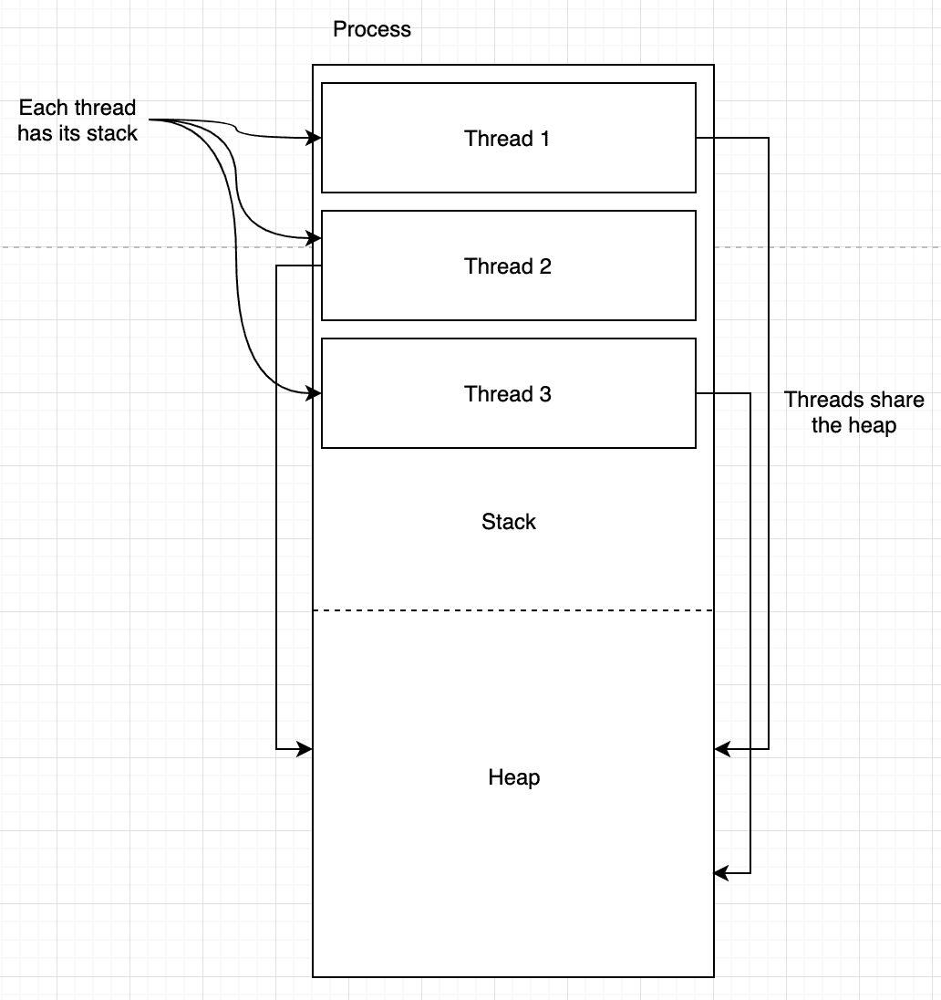
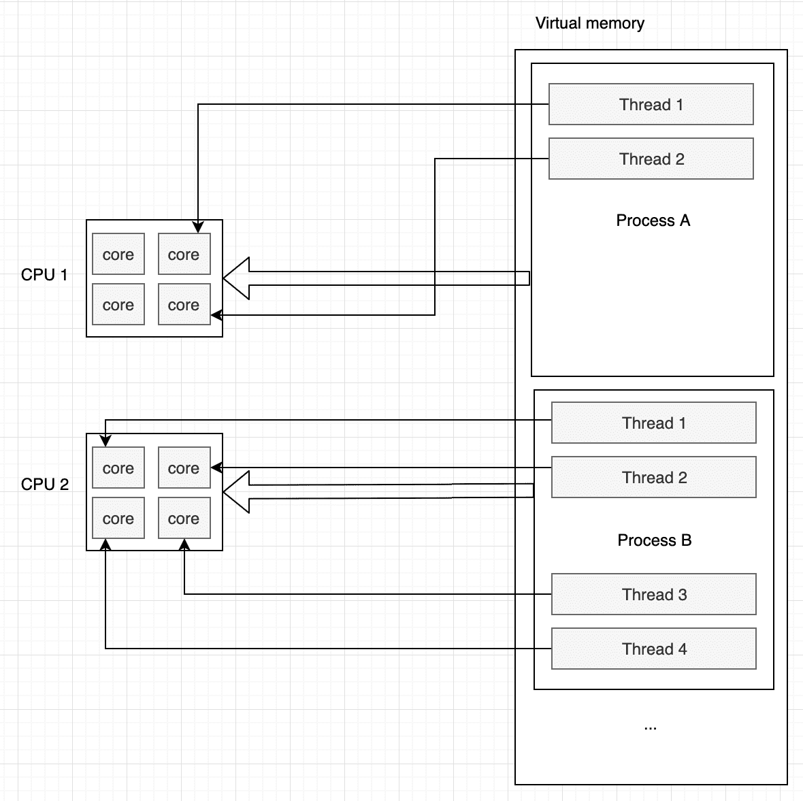
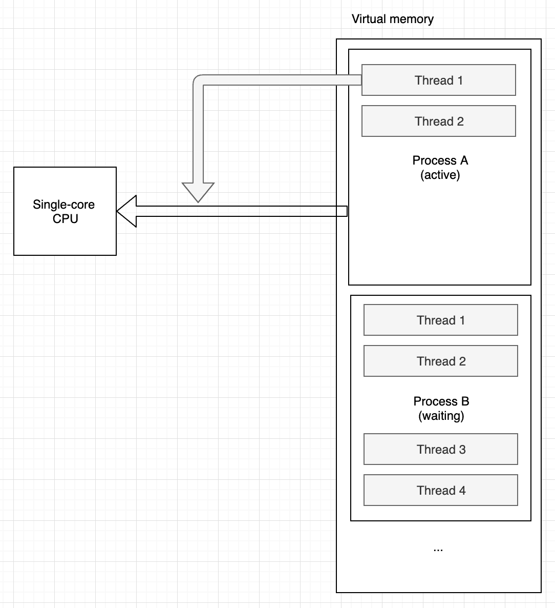
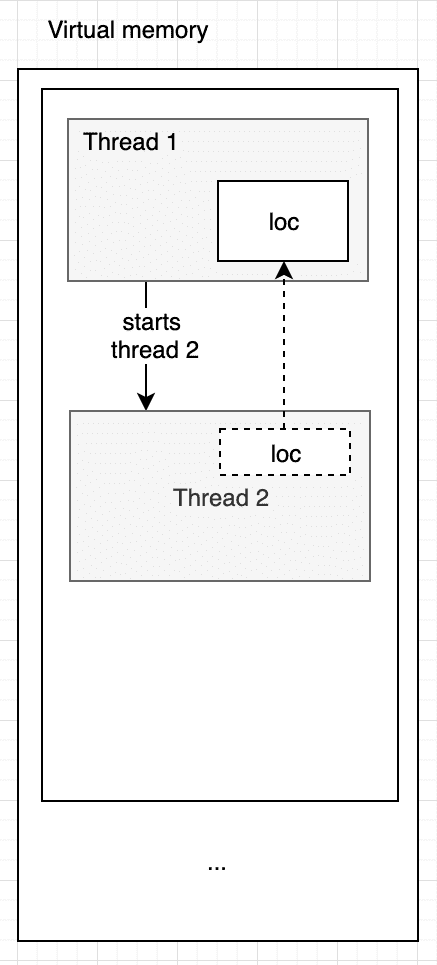

# 八、并发和多线程

并发编程允许创建更高效的程序。C++ 很长一段时间没有内置的并发或多线程支持。现在它完全支持并发编程、线程、线程同步对象以及我们将在本章中讨论的其他功能。

在语言更新为支持线程之前，程序员不得不使用第三方库。最流行的多线程解决方案之一是 **POSIX** ( **便携式操作系统接口**)线程。C++ 从 C++ 11 开始引入线程支持。它使语言更加健壮，适用于更广泛的软件开发领域。理解线程对于 C++ 程序员来说有些至关重要，因为他们倾向于压缩程序的每一个部分，以使其运行得更快。线程向我们介绍了一种完全不同的方法，通过并发运行函数来加快程序的速度。对每个 C++ 程序员来说，在基础水平上学习多线程是必须的。有许多程序无法避免使用多线程，例如网络应用、游戏和图形用户界面应用。本章将向您介绍 C++ 中的并发和多线程基础知识，以及并发代码设计的最佳实践。

本章将涵盖以下主题:

*   理解并发和多线程
*   使用线程
*   管理线程和共享数据
*   设计并发代码
*   使用线程池避免线程创建开销
*   熟悉 C++ 20 中的协同程序

# 技术要求

带有`-std=c++ 2a`选项的 g++ 编译器用于编译本章中的示例。你可以在[https://github.com/PacktPublishing/Expert-CPP](https://github.com/PacktPublishing/Expert-CPP)找到本章使用的源文件。

# 理解并发和多线程

运行一个程序最简单的方式是由**中央处理器** ( **中央处理器**)一个接一个地执行它的指令。从前面几章中你已经知道，一个程序由几个部分组成，其中一个包含程序的指令。每个指令都被加载到一个中央处理器寄存器中，供中央处理器解码和执行。实际上，你用什么样的编程范式来产生一个应用并不重要；结果总是一样的——可执行文件包含机器代码。

我们提到像 Java 和 C#这样的编程语言使用支持环境。但是，如果您在中间削减支持环境(通常是虚拟机)，最终执行的指令应该具有该特定 CPU 熟悉的形式和格式。对程序员来说，很明显，在任何情况下，中央处理器运行的语句顺序都是不混合的。例如，我们确信并且可以继续确信，以便下面的程序将分别输出`4`、`"hello"`和`5`:

```cpp
int a{4};
std::cout << a << std::endl;
int b{a};
++ b;
std::cout << "hello" << std::endl;
b--;
std::cout << (b + 1) << std::endl;
```

我们可以保证`a`变量的值在我们打印到屏幕之前会被初始化。同样的，我们可以保证在减少`b`的值之前打印`"hello"`字符串，并且在将结果打印到屏幕之前计算`(b + 1)`总和。每条指令的执行可能涉及从内存中读取数据或向内存中写入数据。

正如[第 5 章](05.html)、*内存管理和智能指针*中所介绍的，内存层次结构足够复杂，使得我们对程序执行的理解更加困难。例如，上例中的`int b{a};`行假设`a`的值从内存加载到中央处理器的寄存器中，然后将用于写入`b`的内存位置。这里的关键词是*位置*，因为它为我们承载了一点特殊的解读。更具体地说，我们谈论的是记忆位置。并发支持取决于语言的内存模型，也就是一组对内存并发访问的保证。虽然字节是最小的可寻址存储单元，但中央处理器处理数据中的字。也就是说，字是中央处理器从内存中读取或写入内存的最小单位。例如，我们考虑以下两个独立变量的声明:

```cpp
char one;
char two;
```

如果这些变量被分配在同一个单词中(考虑到单词的大小大于`char`的大小)，读写任何一个变量都需要读取包含这两个变量的单词。对变量的并发访问可能会导致意外行为。这是需要内存模型保证的问题。C++ 内存模型保证两个线程可以访问和更新独立的内存位置，而不会相互干扰。内存位置是标量类型。标量类型是算术类型、指针、枚举或`nullptr_t`。非零长度的相邻位字段的最大序列也被认为是存储单元。一个经典的例子是下面的结构:

```cpp
struct S
{
  char a;             // location #1
  int b: 5;           // location #2
  unsigned c: 11;
  unsigned :0;        // :0 separates bit fields
  unsigned d: 8;      // location #3
  struct {
    int ee: 8;
  } e;                // location #4 
};
```

对于前面的例子，两个线程访问同一个结构的独立内存位置不会相互干扰。那么，当谈到并发或多线程时，我们应该考虑什么？

并发通常与多线程混淆。它们性质相似，但在细节上是不同的概念。为了使事情变得简单，只需将并发想象成两个运行时间交错在一起的操作。如果开始和结束时间在任意点交错，操作`A`与操作`B`同时运行，如下图所示:



当两个任务并发运行时，它们不必并行运行。想象一下下面的情况:你一边上网一边看电视。虽然这不是一个好的做法，但是，让我们想象一下，你有一个最喜欢的电视节目，你不能错过，同时，你的朋友让你做一些关于蜜蜂的研究。你实际上不能同时专注于这两项任务；在任何固定的时刻，你的注意力要么被你正在看的节目吸引，要么被你在网上看到的关于蜜蜂的有趣事实吸引。你的注意力不时从节目转移到蜜蜂身上。

就并发性而言，您正在同时执行两项任务。你的大脑给了节目一段时间:你看，享受，然后切换到文章，读几个句子，然后切换回节目。这是并发运行任务的一个简单例子。仅仅因为它们的开始和结束时间交错并不意味着它们同时运行。另一方面，你在做前面提到的任何任务时都会呼吸。呼吸发生在背景中；你的大脑不会把你的注意力从节目或文章转移到你的肺部来吸气或呼气。边看节目边呼吸就是平行跑任务的一个例子。这两个例子都向我们展示了并发的本质。

那么，当您在计算机上运行多个应用时，会发生什么呢？它们是并行运行的吗？当然，它们是并发运行的，但是，实际的并行性取决于您的计算机硬件。大多数大众市场的计算机都由一个中央处理器组成。从前面的章节中我们知道，CPU 的主要工作是逐个运行应用的指令。单个 CPU 如何处理两个应用同时运行？为了理解这一点，我们应该了解过程。

# 处理

进程是运行在内存中的程序的映像。当我们启动一个程序时，OS 从硬盘读取程序的内容，复制到内存中，并将 CPU 指向程序的启动指令。该进程有自己的私有虚拟地址空间、堆栈和堆。两个过程不会以任何方式相互干扰。这是操作系统提供的保证。如果程序员的目标是**进程间通信** ( **IPC** )，那么这也让他们的工作变得非常困难。在本书中，我们不讨论低级硬件特性，但是您应该对我们运行程序时发生的事情有一个大致的了解。这真的取决于底层硬件——更具体地说，是中央处理器的种类和结构。中央处理器的数量、中央处理器内核的数量、高速缓冲存储器的级别以及中央处理器或其内核之间的共享高速缓冲存储器——所有这些都会影响操作系统运行和执行程序的方式。

计算机系统中的 CPU 数量定义了真正并行运行的进程数量。如下图所示:



当我们谈论多处理时，我们考虑一个允许多个进程同时运行的环境。棘手的部分来了。如果进程实际上同时运行，那么我们说它们并行运行。因此，并发不是并行，而并行意味着并发。

如果系统只有一个中央处理器，进程会并发运行，但不会并行运行。操作系统通过一种叫做**上下文切换**的机制来管理这一点。上下文切换意味着暂时冻结进程的工作，复制进程当前使用的所有寄存器值，并存储进程的所有活动资源和值。当一个进程停止时，另一个进程获得运行的权利。在为第二个进程提供指定的时间后，操作系统开始为其切换上下文。同样，它复制了流程使用的所有资源。然后，开始前面的过程。在启动之前，操作系统会将资源和值复制回第一个进程使用的相应插槽，然后继续执行该进程。

有趣的是，这些过程甚至没有意识到这一点。所描述的过程发生得如此之快，以至于用户实际上无法注意到操作系统中运行的程序实际上并没有同时运行。下图描述了由单个中央处理器运行的两个进程。当其中一个进程处于*活动状态*时，CPU 按顺序执行其指令，将任何中间数据存储在其寄存器中(你也应该像在游戏中一样考虑高速缓存)。另一个过程是*等待*操作系统提供其运行的时间部分:



运行多个进程对于操作系统来说是一项复杂的工作。它管理进程的状态，定义哪个进程应该比其他进程占用更多的 CPU 时间，等等。在操作系统切换到另一个进程之前，每个进程都有固定的运行时间。对于一个过程，这个时间可以更长，而对于另一个过程，这个时间可以更短。调度过程使用优先级表进行。操作系统为优先级较高的进程提供了更多的时间，例如，系统进程的优先级高于用户进程。另一个例子是，监视网络运行状况的后台任务比计算器应用具有更高的优先级。当提供的时间片到了，操作系统启动上下文切换，即存储**进程 A** 的状态，稍后继续执行:


存储状态后，如下图所示，它切换到下一个进程来执行它:



显然，如果**进程 B** 之前运行过，那么它的状态应该加载回 CPU。同样，当**进程 B** 的时间片(或时间段)到了，操作系统存储其状态并将**进程 A** 的状态加载回中央处理器(被操作系统暂停之前的状态):



流程没有任何共同点——或者至少他们是这样认为的。每个正在运行的进程的行为就好像它在系统中是单独的一样。它拥有操作系统所能提供的所有资源。实际上，操作系统设法让进程彼此不知道，因此模拟每个进程的自由。最后，将**进程 A** 的状态加载回来后，CPU 继续执行其指令，就像什么都没发生一样:


**进程 B** 被冻结，直到有新的时间片可供其运行。

运行多个进程的单个 CPU 类似于老师检查学生的试卷。老师一次只能检查一张试卷，尽管他们可以通过逐个检查每个考试的答案来引入一些并发性。首先，他们为一个学生检查第一个问题的答案，然后切换到第二个学生的测试的第一个答案，然后切换回第一个学生的第二个答案，以此类推。每当老师从一张试卷换到另一张试卷时，他们都会在停下来的地方记下问题的编号。这样，当他们回到同一篇论文时，他们就会知道从哪里开始。

同样，操作系统在暂停一个进程以恢复另一个进程之前，会记下该进程的执行点。第二个进程可以(并且很可能会)使用暂停的进程使用的相同寄存器组。这迫使操作系统将第一个进程的寄存器值存储在某个地方，以便以后恢复。当操作系统暂停第二个进程以恢复第一个进程时，它会将已经保存的寄存器值加载回相应的寄存器。恢复的进程将不会注意到任何差异，并将像从未暂停一样继续工作。

前面两段所描述的一切都与单 CPU 系统有关。在多 CPU 系统的情况下，系统中的每个 CPU 都有自己的一组寄存器。此外，每个中央处理器可以独立于其他中央处理器执行程序指令，这允许并行运行进程，而无需暂停和恢复它们。在这个例子中，一个有几个助手的老师类似于一个有三个中央处理器的系统。他们每个人可以检查一份试卷；他们都在随时检查三份不同的试卷。

# 流程方面的挑战

当流程需要以某种方式相互联系时，困难就出现了。假设一个过程应该计算一些东西，并将值传递给一个完全不同的过程。有几种方法可以实现 IPC——其中之一是使用进程间共享的内存段。下图描述了访问共享内存段的两个进程:



一个进程将计算结果存储到内存中的共享段中，第二个进程从该段中读取结果。在我们前面的例子中，老师和他们的助手在一份共享的论文中分享他们的检查结果。另一方面，线程共享进程的地址空间，因为它们在进程的上下文中运行。当一个进程是一个程序时，线程是一个函数而不是程序。也就是说，一个进程必须至少有一个线程，我们称之为执行线程。线程是系统中运行的程序指令的容器，而进程封装线程并为其提供资源。我们最感兴趣的是线程及其编排机制。现在让我们亲自去见他们。

# 线

**线程**是进程范围内的一段代码，可以由操作系统调度程序调度。虽然进程是运行程序的映像，但是与利用多线程的项目相比，使用 IPC 管理多进程项目要困难得多，有时甚至毫无用处。程序处理数据，通常是数据的集合。访问、处理和更新数据是通过函数来完成的，这些函数要么是对象的方法，要么是组合在一起以实现最终结果的自由函数。在大多数项目中，我们处理成千上万的函数和对象。每个函数代表一串包装在一个合理名称下的指令，其他函数用来调用它。多线程旨在并发运行函数以获得更好的性能。

例如，计算三个不同向量之和并打印它们的程序调用计算第一个向量之和、第二个向量之和以及最后一个向量之和的函数。这一切都是按顺序发生的。如果单个向量的处理需要一段时间，那么程序将在`3A`时间内运行。下面的代码演示了该示例:

```cpp
void process_vector(const std::vector<int>& vec) 
{
 // calculate the sum and print it
}

int main()
{
 std::vector<int> vec1{1, 2, 3, 4, 5};
 std::vector<int> vec2{6, 7, 8, 9, 10};
 std::vector<int> vec3{11, 12, 13, 14, 15};
 process_vector(vec1); // takes A amount of time
 process_vector(vec2); // takes A amount of time
 process_vector(vec3); // takes A amount of time
}
```

如果有一种方法可以同时对三个不同的向量运行同一个函数，那么在前面的例子中，整个程序只需要 A 的时间。执行线程，或者仅仅是线程，是并发运行任务的确切方式。任务，我们通常指的是一个函数，虽然你也应该记住`std::packaged_task`。同样，并发不应该与并行混淆。当我们讨论并发运行的线程时，您应该考虑前面讨论的进程的上下文切换。线程几乎也是如此。

`std::packaged_task` is similar to `std::function`. It wraps a callable object—a function, lambda, function object, or bind expression. The difference with `std::packaged_task` is that it can be invoked asynchronously. There's more on that later in this chapter. 

每个进程都有一个执行线程，有时称为**主线程**。一个进程可以有多个线程，这就是我们所说的**多线程**。线程的运行方式几乎与进程相同。他们也有语境转换。

线程彼此独立运行，但它们共享进程的大部分资源，因为所有线程都属于该进程。该进程占用硬件和软件资源，如中央处理器寄存器和内存段，包括它自己的堆栈和堆。虽然一个进程不与其他进程共享其堆栈或堆，但其线程必须使用该进程占用的相同资源。线程生命中发生的一切都发生在这个过程中。

但是，线程不共享堆栈。每个线程都有自己的堆栈部分。这种隔离背后的原因依赖于这样一个事实，即线程只是一个函数，函数本身应该可以访问堆栈来管理其参数和局部变量的生命周期。当我们运行两个(或更多)单独运行的线程时，运行时应该以某种方式处理它们的边界。尽管它容易出错，但您可以将变量从一个线程传递到另一个线程(通过值或引用)。让我们假设我们启动了三个线程，为前面例子中的三个向量运行`process_vector()`函数。你应该想象一下，启动一个线程意味着*以某种方式复制*底层函数(它的变量，但不是指令)，并与任何其他线程分开运行。在这种情况下，同一个函数将被复制为三个不同的图像，并且每个图像都将独立于其他图像运行，因此每个图像都应该有自己的堆栈。另一方面，堆在线程之间共享。因此，基本上，我们得出以下结论:



与进程的情况一样，并发运行的线程不一定并行运行。每个线程都有一小部分 CPU 时间要运行，同样，从一个线程切换到另一个线程也有开销。每个暂停线程的状态应该存储在某个地方，以便以后恢复时恢复。中央处理器的内部结构决定了线程是否能够真正并行运行。CPU 内核的数量定义了能够真正并行运行的线程数量。

The C++ thread library provides the `hardware_concurrency()` function to find out the number of threads that can truly run concurrently. You can refer to this number when designing concurrent code. 

下图描述了两个各有四个内核的中央处理器。每个内核可以独立运行一个线程:



不仅两个进程并行运行，而且它们的线程也使用中央处理器内核并行运行。现在，如果我们有几个线程但只有一个单核 CPU，情况会如何改变？几乎与我们之前阐述的流程相同。请看下图——它描述了在一段时间内，中央处理器是如何执行**线程 1** 的:



当前活动的**进程 A** 有两个并发运行的线程。在每个指定的时间点，只执行一个线程。当**线程 1** 的时间片到了，执行**线程 2** 。与我们讨论的进程模型不同的是，线程共享进程的资源，如果我们不关心并发代码设计问题，这将导致不自然的行为。让我们深入研究 C++ 线程支持，并找出使用多线程时会出现什么问题。

# 使用线程

当 C++ 程序启动时，即`main()`函数开始执行时，可以创建并启动新的线程，这些线程将与主线程并发运行。要在 C++ 中启动一个线程，您应该声明一个线程对象，并将您想要并发运行的函数传递给主线程。以下代码演示了使用在`<thread>`中定义的`std::thread`声明和启动线程:

```cpp
#include <thread> #include <iostream>

void foo() { std::cout << "Testing a thread in C++" << std::endl; }

int main() 
{
 std::thread test_thread{foo};
}
```

就这样。我们可以创建一个更好的例子来展示两个线程如何并发工作。假设我们在一个循环中同时打印数字，看看哪个线程打印什么:

```cpp
#include <thread>
#include <iostream>

void print_numbers_in_background() 
{
 auto ix{0};  // Attention: an infinite loop!
 while (true) {
 std::cout << "Background: " << ix++ << std::endl;
 }
}

int main()
{
 std::thread background{print_numbers_in_background};
  auto jx{0};
  while (jx < 1000000) {
    std::cout << "Main: " << jx++ << std::endl;
  }
}
```

前面的示例将打印两个输出，其中`Main:`和`Background:`前缀混合在一起。输出的摘录可能如下所示:

```cpp
...
Main: 90
Main: 91
Background: 149
Background: 150
Background: 151
Background: 152
Background: 153
Background: 
Main: 92
Main: 93
...
```

每当主线程完成它的工作(向屏幕打印一百万次)时，程序都想在不等待后台线程完成的情况下完成。这会导致程序终止。让我们看看我们应该如何修改前面的例子。

# 等待线程

`thread`类提供`join()`功能，如果你想等它完成。以下是之前示例的修改版本，等待`background`线程:

```cpp
#include <thread>
#include <iostream>

void print_numbers_in_background()
{
  // code omitted for brevity
}

int main()
{
  std::thread background{print_numbers_in_background};
  // the while loop omitted for brevity
 background.join();
}
```

正如我们之前已经讨论过的那样，`thread`函数是作为独立于其他线程的独立实体运行的——即使是启动它的线程。它不会等待它刚刚启动的线程，这就是为什么您应该显式地告诉调用者函数等待它完成。有必要发出信号，表明调用线程(主线程)正在等待线程在自己之前完成。

`join()`函数的对称反义词是`detach()`函数。`detach()`功能表示调用方对等待线程完成不感兴趣。在这种情况下，线程可以有独立的生命。如图所示(好像已经 18 岁了):

```cpp
std::thread t{foo};
t.detach(); 
```

虽然分离一个线程看起来很自然，但是有很多情况我们需要等待线程完成。例如，我们可以将调用者变量的局部传递给正在运行的线程。在这种情况下，我们不能让调用者分离线程，因为调用者可能比线程在其中开始的时间更早完成工作。为了清楚起见，我们来说明一下。**线程 1** 声明`loc`变量并将其传递给**线程 2** ，后者已经从**线程 1** 开始:



将`loc`的地址传递给**线程 2** 如果**线程 1** 不加入的话容易出错。如果**线程 1** 在**线程 2** 之前完成其执行，那么通过其地址访问`loc`会导致未定义的行为:


现在已经没有这样的对象了，所以我们对这个程序最大的希望就是崩溃。这将导致意外的行为，因为正在运行的线程将无法再访问调用者的局部变量。您应该连接或分离一个线程。

我们可以将任何可调用对象传递给`std::thread`。下面的示例显示了将 lambda 表达式传递给线程:

```cpp
#include <thread>

int main() {
  std::thread tl{[]{
 std::cout << "A lambda passed to the thread";
 }};
  tl.join();
}
```

此外，我们可以使用可调用对象作为线程参数。看看下面用被覆盖的`operator()`函数声明`TestTask`类的代码:

```cpp
#include <thread>

class TestTask
{
public:
  TestTask() = default;

 void operator()() {
 state_++ ;
 }

private:
  int state_ = 0;
};

int main() {
  std::thread t{TestTask()};
  t.join();
}
```

函子(带有被覆盖的`operator()`函数的`TestTask`类)的优势之一是它存储状态信息的能力。函子是命令设计模式的完美实现，我们将在[第 11 章](11.html)、*中讨论使用设计模式*设计策略游戏。回到线程，让我们继续语言中的一个新的增加，它允许更好的方法来连接线程。

# 使用 std::jthread

C++ 20 引入了一个可连接的线程`std::jthread`。它提供了与提供的相同的接口`std::thread`，所以我们可以在代码中用 jthreads 替换所有线程。它实际上包装了`std::thread`，所以基本上它委托给包装好的线。

如果你的编译器版本不支持`std::jthread`，你可以自由选择 **RAII** ( **资源获取就是初始化**)这个成语，它完全适用于线程。看看下面的代码:

```cpp
class thread_raii
{
public:
  explicit thread_raii(std::thread& t)
    : thread_(std::move(t))
  {}

  ~thread_raii() {
    thread_.join();  
  }

private:
  std::thread thread_;
};

void foo() {
  std::cout << "Testing thread join";
}

int main() {
 std::thread t{foo};
 thread_raii r{t};
  // will automatically join the thread
}
```

但是，前面的代码缺少额外的检查，因为传递给 RAII 类的线程可能已经被分离了。为了查看线程是否可以连接，我们使用`joinable()`函数。我们应该这样覆盖`thread_raii`类:

```cpp
class thread_raii
{
public:
  explicit thread_raii(std::thread& t)
    : thread_(std::move(t))
  {}

 ~thread_raii()
 {
 if (thread_.joinable()) {
 thread_.join();
 }
 }
private:
  std::thread thread_;
};
```

析构函数首先测试线程是否可连接，然后调用`join()`函数。但是，与其处理习惯用法，关心线程在加入之前是否已经加入，我们更喜欢使用`std::jthread`。下面是我们如何使用之前声明的`TestTask`函数来实现这一点:

```cpp
std::jthread jt{TestTask()};
```

就是这样——不需要调用`jt.join()`，一个新的合作可中断特性开箱即用，我们通过合并 jthread 来使用。我们说 jthread 是协作可中断的，因为它提供了`request_stop()`函数，该函数按照它的名字来做——请求线程停止。虽然这个请求实现是由实现定义的，但是这是一个不要永远等待线程的好方法。回想一下线程在无限循环中打印数字的例子。我们修改了主线程来等待它，这导致了永远等待它。以下是我们如何使用`std::jthread`修改线程以利用`request_stop()`功能:

```cpp
int main()
{
 std::jthread background{print_numbers_in_background};
  auto jx{0};
  while (jx < 1000000) {
    std::cout << "Main: " << jx << std::endl;
  }
  // The main thread is about to finish, so we request the background thread to stop
 background.request_stop();
}
```

`print_numbers_in_background()`功能现在接收到一个请求，并可以相应地操作。现在，让我们看看如何将参数传递给线程函数。

# 将参数传递给线程函数

`std::thread`构造函数接受参数并将其转发给底层的`thread`函数。例如，为了将参数`4`和`2`传递给这里的`foo()`函数，我们将参数传递给`std::thread`构造函数:

```cpp
void foo(int one, int two) {
  // do something
}

std::thread t{foo, 4, 2};
```

参数`4`和`2`将作为第一个和第二个参数传递给`foo()`函数。

以下示例说明了通过引用传递参数:

```cpp
class big_object {};

void make_changes(big_object&);

void error_prone()
{
  big_object b;
 std::jthread t{make_changes, b};
  // do something else
}
```

为了理解我们为什么命名函数`error_prone`，我们应该知道线程构造器复制传递给它的值，然后将它们传递给带有`rvalue`引用的线程函数。这样做是为了处理仅移动类型。所以它会尝试用`rvalue`调用`make_changes()`函数，这样会编译失败(你不能把`rvalue`传递给需要非常数引用的函数)。我们需要包装需要在`std::ref:`中引用的参数

```cpp
std::thread t{make_changes, std::ref(b)};
```

前面的代码强调参数应该通过引用传递。使用线程需要更加注意，因为有很多方法可以在程序中获得意想不到的结果或未定义的行为。让我们看看如何管理线程来产生更安全的多线程应用。

# 管理线程和共享数据

如前所述，如果线程的数量超过硬件支持的并行运行线程的数量，线程的执行包括暂停和恢复其中的一些。除此之外，线程的创建也有开销。处理一个项目中有许多线程的一个建议做法是使用线程池。

线程池的概念在于缓存的概念。我们在某个容器中创建并保存线程以备后用。容器被称为池。例如，下面的向量表示一个简单的线程池:

```cpp
#include <thread>
#include <vector>

std::vector<std::thread> pool;
```

每当我们需要一个新的线程时，我们使用一个已经在池中创建的线程，而不是声明相应的`std::thread`对象。当我们完成线程后，如果需要，我们可以将它推回到向量中，以便以后使用。当使用 10 个或更多线程时，这可以节省一些时间。一个恰当的例子是网络服务器。

web 服务器是一个程序，它等待传入的客户端连接，并为每个客户端创建一个单独的连接，以便独立于其他客户端进行处理。典型的网络服务器通常同时处理成千上万的客户端。每次与某个客户端建立新连接时，web 服务器都会创建一个新线程并处理客户端请求。下面的伪代码演示了 web 服务器传入连接管理的简单实现:

```cpp
void process_incoming_connections() {
  if (new connection from client) {
    t = create_thread(); // potential overhead
    t.handle_requests(client);
  }
}
while (true) {
  process_incoming_connections();
}
```

使用线程池时，前面的代码将避免在每次需要处理客户端请求时创建线程。新线程的创建需要操作系统进行额外且相当昂贵的工作。为了节省时间，我们使用了一种机制，省略了在每个请求上创建新线程。为了使池更好，让我们用一个队列替换它的容器。每当我们请求一个线程时，池将返回一个空闲线程，每当我们处理完一个线程时，我们将它推回到池中。线程池的简单设计如下所示:

```cpp
#include <queue>
#include <thread>

class ThreadPool
{
public:
  ThreadPool(int number_of_threads = 1000) {
    for (int ix = 0; ix < number_of_threads; ++ ix) {
      pool_.push(std::thread());
    }
  }

  std::thread get_free_thread() {
    if (pool_.empty()) {
      throw std::exception("no available thread");
    }
    auto t = pool_.front();
    pool_.pop();
    return t;
  }

  void push_thread(std::thread t) {
    pool_.push(t);
  }

private:
  std::queue<std::thread> pool_;
};
```

构造函数创建线程并将其推入队列。在下面的伪代码中，我们用`ThreadPool`代替了直接为客户端请求处理创建线程，我们之前已经看过了:

```cpp
ThreadPool pool;
void process_incoming_connections() {
  if (new connection from client) {
    auto t = pool.get_free_thread();
    t.handle_request(client);
  }
}

while (true) {
  process_incoming_connections();
}
```

假设`handle_request()`函数完成后将线程推回到池中，那么池就像一个连接线程的集中存储。尽管在前面的代码片段中显示的还远未准备好投入生产，但它传达了在密集型应用中使用线程池的基本思想。

# 共享数据

使用多线程的程序员害怕并尽可能避免竞争条件。想象两个函数同时处理相同的数据，如下所示:

```cpp
int global = 0;

void inc() {
  global = global + 1;
}
...
std::thread t1{inc};
std::thread t2{inc};
```

潜在的竞争条件正在发生，因为线程`t1`和`t2`正在用多个步骤修改同一个变量。在单一线程安全步骤中执行的任何操作都称为**原子操作**。在这种情况下，增加变量值不是原子操作，即使我们使用了增量运算符。

# 使用互斥体保护共享数据

为了保护共享数据，被称为**互斥体**的对象被广泛使用。互斥体是控制线程运行的对象。把线程想象成人类在一个接一个地处理数据。当一个线程锁定一个互斥体时，另一个线程等待，直到它完成数据并解锁互斥体。然后另一个线程锁定互斥体并开始处理数据。下面的代码演示了如何使用互斥体解决竞争条件的问题:

```cpp
#include <mutex>
...
std::mutex locker;
void inc() {
  locker.lock();
  global = global + 1;
  locker.unlock();
}
...
std::thread t1{inc};
std::thread t2{inc};

```

当`t1`开始执行`inc()`时，它会锁定一个互斥体，这样可以避免任何其他线程访问全局变量，除非原线程没有解锁下一个线程。

C++ 17 引入了一个锁保护，允许保护互斥体，以免忘记解锁它:

```cpp
std::mutex locker;
void inc() {
  std::lock_guard g(locker);
  global = global + 1;
}
```

如果可能的话，最好使用语言提供的警卫。

# 避免僵局

互斥体出现了新的问题，比如**死锁**。当两个或多个线程锁定一个互斥体并等待另一个线程解锁另一个互斥体时，死锁是多线程代码的一种情况。

避免死锁的常见建议是始终以相同的顺序锁定两个或多个互斥体。C++ 提供了`std::lock()`函数，服务于同样的目的。

下面的代码说明了`swap`函数，它接受两个类型为`X`的参数。我们假设`X`有一个成员，`mt`，是互斥体。`swap`函数的实现首先锁定左对象的互斥体，然后锁定右对象的互斥体:

```cpp
void swap(X& left, X& right)
{
  std::lock(left.mt, right.mt);
  std::lock_guard<std::mutex> lock1(left.mt, std::adopt_lock);
  std::lock_guard<std::mutex> lock2(right.mt, std::adopt_lock);
  // do the actual swapping
}
```

为了避免死锁，请避免嵌套锁。也就是说，如果你已经持有一把锁，就不要获取它。如果不是这样，那么以固定的顺序获取锁。固定顺序可以让你避免僵局。

# 设计并发代码

当引入并发性时，项目的复杂性会急剧上升。与并发代码相比，处理顺序执行的同步代码要容易得多。许多系统通过引入事件驱动的开发概念，比如事件循环，来避免使用多线程。使用事件循环的目的是为异步编程引入一种可管理的方法。为了进一步理解这个概念，想象任何提供**图形用户界面** ( **图形用户界面**)的应用。每当用户点击任何图形用户界面组件，如按钮；字段中的类型；或者甚至移动鼠标，应用接收关于用户动作的所谓事件。无论是`button_press`、`button_release`、`mouse_move`还是任何其他事件，它都代表了一条信息，让应用做出正确的反应。一种流行的方法是结合一个事件循环来对用户交互过程中发生的任何事件进行排队。

当应用忙于当前任务时，用户操作产生的事件会排队等待将来某个时间处理。处理包括调用附加到每个事件的处理函数。他们按照排队的顺序被叫去。

在项目中引入多线程会带来额外的复杂性。您现在应该注意竞争条件和正确的线程处理，甚至可以使用线程池来重用线程对象。在顺序执行的代码中，您只关心代码。使用多线程，您现在更关心相同代码的执行方式。例如，像 singleton 这样的简单设计模式在多线程环境中表现不同。单例的经典实现如下所示:

```cpp
class MySingleton
{
public:
 static MySingleton* get_instance() {
 if (instance_ == nullptr) {
 instance_ = new MySingleton();
 }
 return instance_;
 }

  // code omitted for brevity
private:
  static inline MySingleton* instance_ = nullptr;
};
```

下面的代码启动两个线程，都使用`MySingleton`类:

```cpp
void create_something_unique() 
{
 MySingleton* inst = MySingleton::get_instance();
  // do something useful
}

void create_something_useful() 
{
  MySingleton* anotherInst = MySingleton::get_instance();
  // do something unique
}  

std::thread t1{create_something_unique};
std::thread t2{create_something_useful};
t1.join();
t2.join();
// some other code
```

线程`t1`和`t2`都调用`MySingleton`类的`get_instance()`静态成员函数。有可能`t1`和`t2`都通过了空实例的检查，并且都执行了新的操作符。很明显，我们这里有比赛条件。在这种情况下，应该保护资源，即类实例，使其免受这种情况的影响。这里有一个明显的使用互斥体的解决方案:

```cpp
class MySingleton
{
public:
  static MySingleton* get_instance() {
 std::lock_guard lg{mutex_};
    if (instance_ == nullptr) {
      instance_ = new MySingleton();
    }
    return instance_;
  }

  // code omitted for brevity
private:
 static std::mutex mutex_;
  static MySingleton* instance_;
}
```

使用互斥体可以解决这个问题，但是会使函数运行得更慢，因为每次线程请求实例时，互斥体都会被锁定(这涉及到操作系统内核的额外操作)。正确的解决方案是使用双重检查锁定模式。它的基本思想是这样的:

1.  `instance_`检查后锁定互斥体。
2.  在互斥锁被锁定后再次检查`instance_`，因为另一个线程可能已经通过了第一次检查，等待互斥锁解锁。

有关详细信息，请参见代码:

```cpp
static MySingleton* get_instance() {
  if (instance_ == nullptr) {
 std::lock_guard lg{mutex_};
 if (instance_ == nullptr) {
 instance_ = new MySingleton();
 }
  }
  return instance_;
}
```

几个线程可能会通过第一次检查，其中一个线程会锁定互斥体。只有一个线程可以调用新的运算符。但是，在解锁互斥体后，通过第一次检查的线程将尝试锁定它并创建实例。第二次检查是为了防止这种情况。前面的代码允许我们减少同步代码的性能开销。我们在这里提供的方法是为并发代码设计做准备的方法之一。

并行代码设计在很大程度上是基于语言本身的能力。C++ 的发展是不可思议的。在其早期版本中，它没有内置的多线程支持。现在，它有了一个可靠的线程库，新的 C++ 20 标准为我们提供了更强大的工具，比如 coroutines。

# 引入协同效应

在谈到图形用户界面应用时，我们讨论了一个异步代码执行的例子。图形用户界面组件通过触发相应的事件对用户动作做出反应，这些事件被推入事件队列。然后，通过调用附加的处理函数来逐个处理这个队列。所描述的过程在循环中发生；这就是为什么我们通常称这个概念为事件循环。

异步系统在输入/输出操作中非常有用，因为任何输入或输出操作都会在输入/输出调用时阻塞执行。例如，下面的伪代码从目录中读取一个文件，然后向屏幕输出一条欢迎消息:

```cpp
auto f = read_file("filename");
cout << "Welcome to the app!";
process_file_contents(f);
```

附同步执行模式，我们知道消息欢迎来到 app！只有在`read_file()`功能执行完毕后才会打印。`process_file_contents()`只有在`cout`完成后才会被调用。当处理异步代码时，我们所知道的关于代码执行的一切开始变得不可识别。上例的以下修改版本使用`read_file_async()`函数异步读取文件内容:

```cpp
auto p = read_file_async("filename");
cout << "Welcome to the app!";
process_file_contents(p); // we shouldn't be able to do this
```

考虑到`read_file_async()`是异步功能，消息欢迎来到 app！将比文件内容打印得更快。异步执行的本质允许我们在后台调用要执行的函数，这为我们提供了非阻塞的输入/输出。

但是，我们处理函数返回值的方式略有变化。如果我们处理一个异步函数，它的返回值被认为是一个叫做**承诺**或者**承诺对象**的东西。这是异步函数完成时系统通知我们的方式。承诺对象有三种状态:

*   悬而未决的
*   被拒绝
*   感到满足的

如果函数已经完成，并且结果已经准备好被处理，那么承诺对象被认为已经实现。如果出现错误，承诺对象将处于拒绝状态。如果承诺没有被拒绝或履行，则处于待定状态。

C++ 20 引入了 coroutines，作为对经典异步函数的补充。协同程序将代码的后台执行移动到下一个级别；它们允许功能在必要时暂停和恢复。想象一个函数读取文件内容并在中间停止，将执行上下文传递给另一个函数，然后继续读取文件直到结束。所以，在更深的潜水之前，考虑一个函数，如下所示:

*   出发
*   暂停
*   重新开始
*   完成

要使一个函数成为协同函数，您可以使用关键字`co_await`、`co_yield`或`co_return`中的一个。`co_await`是告诉代码等待异步执行代码的构造。这意味着函数可以在该点暂停，并在结果准备好时恢复执行。例如，以下代码使用套接字从网络请求图像:

```cpp
task<void> process_image()
{
  image i = co_await request_image("url");
  // do something useful with the image
}
```

由于网络请求操作也被视为**输入/输出**操作，它可能会阻止代码的执行。为了防止阻塞，我们使用异步调用。前面例子中使用`co_await`的那一行是可以暂停函数执行的点。简单来说，当执行到达`co_await`的那一行时，会发生以下情况:

1.  它退出该函数一段时间(直到没有准备好的数据)。
2.  它从调用`process_image()`之前的位置继续执行。
3.  然后它再次返回，在离开的地方继续执行`process_image()`。

为了实现这一点，协同程序(函数`process_image()`是协同程序)的处理方式不同于 C++ 中常规函数的处理方式。花冠的一个有趣甚至令人惊讶的特征是它们是无叠层的。我们知道函数离不开栈。这就是函数在执行指令之前推送参数和局部变量的地方。另一方面，Coroutines 不是将任何东西推到堆栈中，而是将它们的状态保存在堆中，并在恢复时恢复它。

This is tricky because there are also stackful coroutines. Stackful coroutines, also referred to as **fibers**, have a separate stack. 

协同程序连接到调用方。在前面的例子中，调用`sprocess_image()`的函数将执行转移到协同程序，协同程序的暂停(也称为**产生**)将执行转移回调用者。正如我们所说的，堆用于存储协同程序的状态，但是实际的特定于函数的数据(参数和局部变量)存储在调用方的堆栈上。就是这样——协同程序与存储在调用者函数堆栈上的对象相关联。显然，花冠和它的目标一样长。

Coroutines 可能会给人一种错误的印象，认为它增加了语言的冗余复杂性，但是它们的用例在改进使用异步输入/输出代码(如前面的例子)或懒惰计算的应用方面非常有用。也就是说，当我们不得不发明新的模式或在项目中引入复杂性来处理，例如，懒惰的计算时，我们现在可以通过在 C++ 中使用协同程序来改善我们的体验。请注意，异步输入/输出或懒惰计算只是协同应用的两个例子。外面还有更多。

# 摘要

在本章中，我们讨论了并发性的概念，并展示了并行性之间的区别。我们了解了进程和线程之间的区别，后者是我们感兴趣的。多线程允许我们更有效地管理程序，尽管它也带来了额外的复杂性。为了处理数据竞争，我们使用同步原语，比如互斥体。互斥体是一种锁定一个线程使用的数据的方法，以避免同时访问多个线程的相同数据而产生的无效行为。

我们还介绍了输入/输出操作被认为是阻塞的想法，异步函数是使其非阻塞的方法之一。C++ 20 引入了作为代码异步执行的一部分的协同程序。

我们学习了如何创建和启动线程。更重要的是，我们学习了如何管理线程之间的数据。在下一章中，我们将深入研究并发环境中使用的数据结构。

# 问题

1.  什么是并发？
2.  并发和并行的区别是什么？
3.  什么是流程？
4.  进程和线程有什么区别？
5.  编写代码来启动线程。
6.  如何使单例模式线程安全？
7.  重写`MySingleton`类，为返回的实例使用`std::shared_ptr`。
8.  什么是协同，什么是`co_await`关键词？

# 进一步阅读

*   *安东尼·威廉姆斯，C++ 并发在行动*，[https://www . Amazon . com/C-Concurrency-Action-Anthony-Williams/DP/1617294691/](https://www.amazon.com/C-Concurrency-Action-Anthony-Williams/dp/1617294691/)