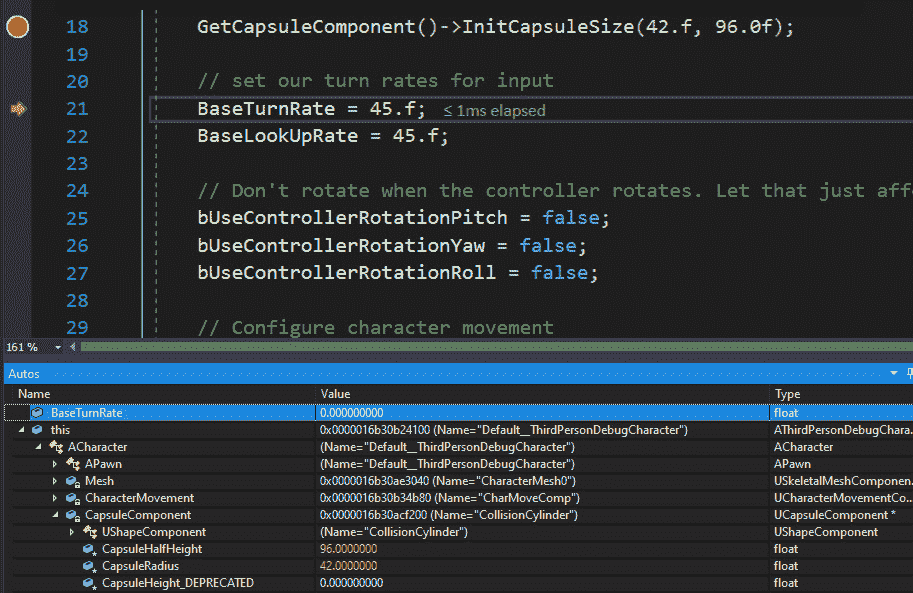
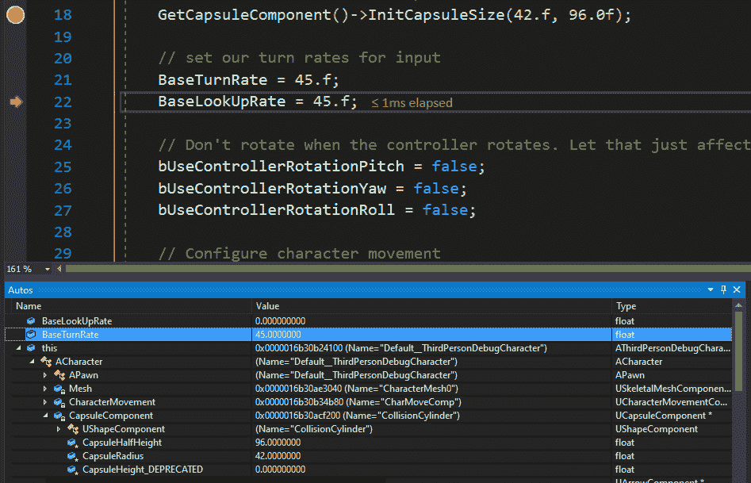
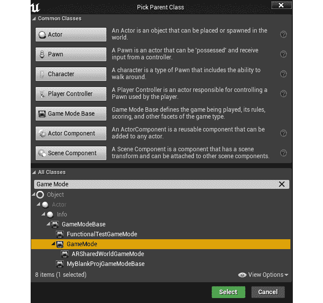
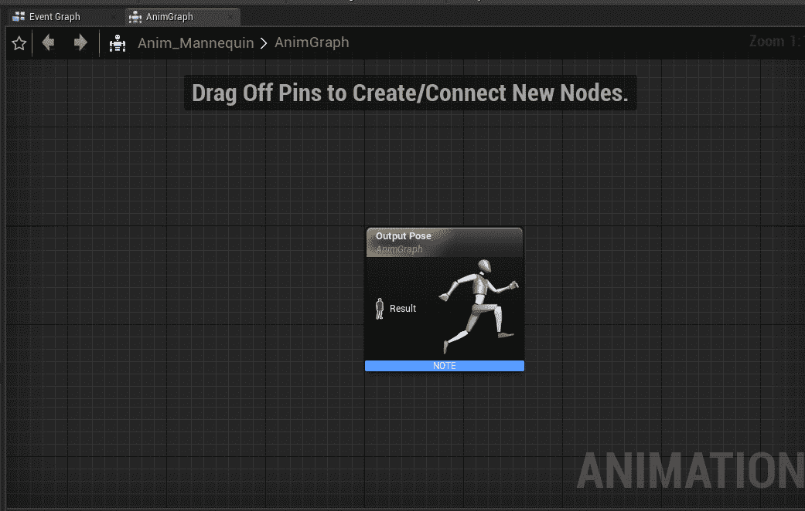
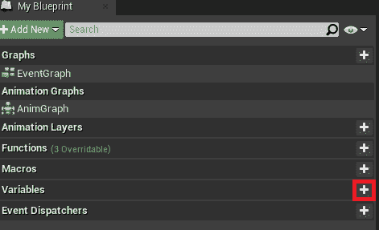
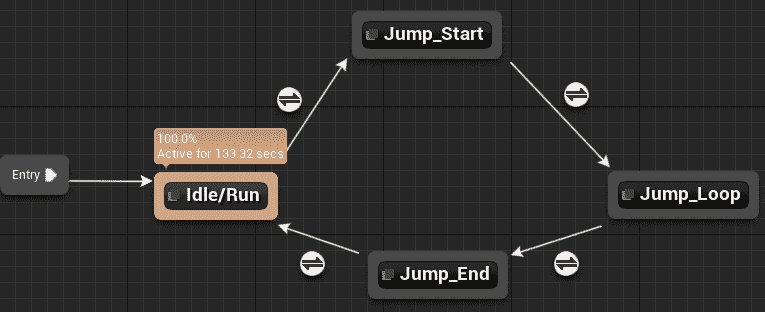
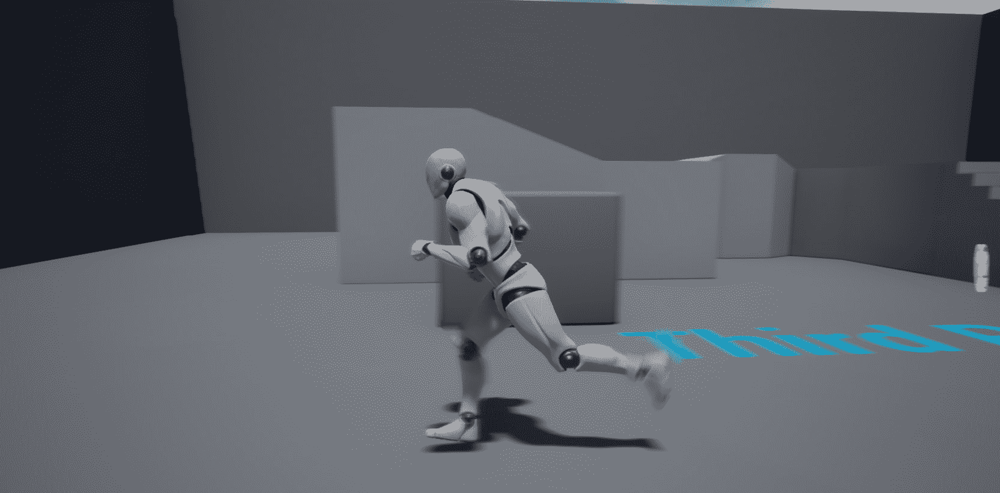

# 二、使用虚幻引擎

概述

本章将重点介绍虚幻引擎中的许多基本概念和特性。将向您展示如何创建 C++ 项目，如何执行一些基本调试，以及如何处理特定于角色的动画。

到本章结束时，您将能够创建 C++ 模板项目，能够在 Visual Studio 中调试代码，了解文件夹结构和涉及的最佳实践，最后，能够根据角色的状态设置角色动画。

# 简介

在前一章中，我们学习了史诗游戏启动器的基础知识，以及虚幻编辑器的基础知识。除了探索第一人称模板之外，我们还了解了如何使用对象以及基本的蓝图。在本章中，我们将通过探索第三人称模板以及使用输入和动画来建立这些基础。

游戏开发可以用各种各样的语言完成，比如 C、C++、Java、C#，甚至 Python。虽然每种语言都有优点和缺点，但我们将在本书中使用 C++ 作为虚幻引擎中使用的主要编程语言。

在本章中，我们将让您了解如何在 UE4 中创建 C++ 项目和基本级别调试。能够调试代码非常重要，因为它有助于开发人员处理 bug。提供的工具非常方便，对任何虚幻引擎开发人员来说都是必不可少的。

接下来，我们将近距离接触在虚幻引擎中创建游戏和体验的核心课程。您将探索游戏模式和相关的课堂概念，然后进行练习，以获得对这一点的实际理解。

本章的最后一节是关于动画的。几乎每一个游戏都有动画，有些是非常基本的，但有些是非常高级的，包括迷人的细节，这些是游戏体验的关键。虚幻引擎提供了几个工具，你可以用来创建和处理动画，包括动画蓝图，它有复杂的图形和一个状态机。

# 创建和设置空白 C++ 项目

在每个项目开始时，您可能希望从 Epic 提供的任何模板(包含准备执行的基本代码)开始，并在此基础上进行构建。大多数/某些时候，你可能需要建立一个空白或空的项目，你可以按照你的要求来塑造和雕刻。我们将在下面的练习中学习如何做到这一点。

## 练习 2.01:创建一个空的 C++ 项目

在本练习中，您将学习如何从 Epic 提供的模板创建一个空的 C++ 项目。这将成为您未来许多 C++ 项目的基础。

以下步骤将帮助您完成本练习:

1.  从史诗游戏启动器中启动虚幻引擎 4.24。
2.  点击`Games`部分，点击`Next`。
3.  确定选择了`Blank`项目模板，点击`Next`。
4.  Click the `Blueprint` section dropdown and select `C++ `.

    注意

    确保项目文件夹和项目名称分别用适当的目录和名称指定。

    一切设置完毕后，点击`Create Project`按钮。在这种情况下，我们的项目目录位于名为`UnrealProjects`的文件夹中，该文件夹位于`E`驱动器中。项目名称设置为`MyBlankProj`(建议您使用这些名称和项目目录，但如果您愿意，也可以使用自己的名称)。

    注意

    项目名称中不能有任何空格。最好让虚幻目录尽可能靠近驱动器的根目录(以避免在创建资产或将资产导入项目的工作目录时遇到 256 个字符的路径限制等问题；对于小项目来说，这可能没问题，但是对于更大规模的项目来说，其中的文件夹层次结构可能会变得过于复杂，这一步很重要)。

    您会注意到，在完成生成代码和创建项目文件之后，该项目及其 Visual Studio 解决方案(`.sln`)文件将被打开。

    注意

    确保将 Visual Studio 解决方案配置设置为“开发编辑器”，并将解决方案平台设置为 Win64 以进行桌面开发:

    

图 2.1: Visual Studio 部署设置

通过完成这个练习，我们现在知道了如何在 UE4 上创建一个空的 C++ 项目，以及它的注意事项。

在下一节中，我们将讨论一下文件夹结构，以及虚幻开发者使用的最基本和最常用的文件夹结构格式。

# 虚幻引擎中的内容文件夹结构

在你的项目目录中(`E:/UnrealProjects/MyBlankProj` *，在我们的例子中是*)，你会看到一个`Content`文件夹。这是项目用于不同类型资产和项目相关数据(包括蓝图)的主要文件夹。C++ 代码进入项目的`Source`文件夹。请注意，最佳做法是直接通过虚幻编辑器创建新的 C++ 代码文件，因为这样可以简化过程，减少错误。

有许多不同的策略可以用来组织`Content`文件夹中的数据。最基本和容易理解的是使用文件夹名称来描述里面的内容类型。因此，`Content`文件夹目录结构可能类似于[https://packt.live/3lCVFkR](https://packt.live/3lCVFkR)的示例。在本例中，您可以看到每个文件都被明确地放在第一级代表其类型的文件夹的名称下，随后的级别进一步将其分组到有意义的文件夹中。

注意

所有蓝图都应该在其名称前加前缀`BP`(以区别于虚幻引擎使用的默认蓝图)。其余的前缀是可选的(但是，最好用前面显示的前缀来格式化它们)。

在下一节中，我们将研究 Visual Studio 解决方案。

# 使用 Visual Studio 解决方案

虚幻引擎中的每个 C++ 项目都有一个 Visual Studio 解决方案。这反过来驱动所有代码，并为开发人员提供在运行状态下设置执行逻辑和调试代码的能力。

### 解决方案分析

Visual Studio 解决方案(。`sln`)在项目目录中生成的文件包含整个项目以及添加到其中的任何相关代码。

让我们看看 Visual Studio 中存在的文件。*双击*的。`sln`文件，在 Visual Studio 内打开。

在`Solution Explorer`中，你会看到两个名为`Engine`和`Games`的项目。

### 发动机项目

在基础级别，虚幻引擎本身是一个 Visual Studio 项目，并且有自己的解决方案文件。这包含了在虚幻引擎中协同工作的所有代码和第三方集成。这个项目中的所有代码都称为“源代码”。

引擎项目由外部依赖项、配置、插件、着色器和当前用于该项目的虚幻引擎源代码组成。您可以随时浏览`UE4 -> Source`文件夹查看任何引擎代码。

注意

由于虚幻引擎是开源的，Epic 允许开发人员查看和编辑源代码以满足他们的需求。但是，您不能编辑通过史诗游戏启动器安装的虚幻引擎版本的源代码。为了能够在源代码中进行和构建更改，您需要下载虚幻引擎的源版本，该版本可以通过 GitHub 找到。您可以使用以下指南下载虚幻引擎的源版本:[https://docs . unrealengine . com/en-US/GettingStarted/downloadinunrealgene/index . html](https://docs.unrealengine.com/en-US/GettingStarted/DownloadingUnrealEngine/index.html)

下载后，还可以参考以下指南编译/构建新下载的引擎:[https://docs . unrealengine . com/en-US/Programming/Development/building unrealengine/index . html](https://docs.unrealengine.com/en-US/Programming/Development/BuildingUnrealEngine/index.html)

### 游戏项目

在`Games`目录下是您项目名称的解决方案文件夹。展开后，您会发现一组文件夹。您将关注以下内容:

*   **配置文件夹**:携带为项目和构建设置的所有配置(这些配置也可以选择具有特定于平台的设置(如视窗、安卓、iOS、Xbox 或 PS))。
*   **插件文件夹**:这是一个可选的文件夹，在添加任何第三方插件时创建(从 Epic Marketplace 下载或通过互联网获得)。这个文件夹将包含与这个项目相关的插件的所有源代码。
*   **源文件夹**:这是我们将要使用的主文件夹。它将包含构建目标文件，以及项目的所有源代码。以下是源文件夹中默认文件的描述:
*   **目标和构建文件**:这些(如下图截图所示)包含指定虚幻构建工具(*构建你的游戏的程序*)的代码，你将使用它来构建你的游戏。它包含任何需要添加到游戏中的额外模块，以及其他与构建相关的设置。默认情况下，有两个目标文件(一个用于虚幻编辑器，另一个用于由它们的名称描述的构建)，它们以`.Target.cs`扩展名结尾，还有一个构建文件以`Build.cs`结尾。
*   **项目名称代码文件(。cpp &。h)** :默认情况下，这些文件是为每个项目创建的，包含用于运行默认游戏模块代码的代码。
*   **项目名称游戏模式库代码文件(。cpp &。h)** :默认创建一个空的项目游戏模式库。大多数情况下不常用。
*   **ProjectName.uproject 文件**:包含用于提供项目基本信息的描述符以及与之相关的插件列表。

## D 在 Visual Studio 中沸腾代码

Visual Studio 借助代码中的断点提供了强大的调试功能。它使用户能够在特定的代码行暂停游戏，这样开发人员就可以看到变量的当前值，并以受控的方式遍历代码和游戏(可以逐行进行，逐函数进行，等等)。

当您的游戏项目中有很多变量和代码文件，并且您希望看到变量的值以逐步的方式被更新和使用来调试代码、找出存在的问题并解决它们时，这是非常有用的。调试是任何开发人员工作的一个基本过程，只有经过多次连续的调试、分析和优化周期，项目才能得到足够的完善以进行部署。

现在，您已经了解了 Visual Studio 解决方案的基本概念，接下来我们将介绍一个关于它的实际练习。

## E 练习 2.02:调试第三人称模板代码

在本练习中，您将使用虚幻引擎的第三人称模板创建一个项目，并将在 Visual Studio 中调试代码。我们将研究这个模板项目的`Character`类中一个名为`BaseTurnRate`的变量的值。当我们一行行地遍历代码时，我们将看到值是如何更新的。

以下步骤将帮助您完成本练习:

1.  从史诗游戏启动器启动虚幻引擎。
2.  点击`Games`部分，点击`Next`。
3.  选择`Third Person`，点击`Next`。
4.  选择 C++，将项目名称设置为`ThirdPersonDebug`，点击`Create Project`按钮。
5.  Now, close Unreal Editor, go to the Visual Studio solution, and open the `ThirdPersonDebugCharacter.cpp` file:

    

    图 2.2:thirdpersondebugcharacter . CPP 文件位置

6.  *Left-click* on the bar on the left-hand side of line `18`. A red dot icon should appear on it (*you can toggle it off by clicking on it again*):

    

    图 2.3:碰撞舱初始化代码

    这里，我们得到了角色的`capsule`组件(在*第三章*、*角色类组件和蓝图设置*中有进一步的解释)，默认情况下，它是根组件。然后，我们调用它的`InitCapsuleSize`方法，该方法接受两个参数:`InRadius`浮点和`InHalfHeight`浮点。

7.  Make sure the solution configuration setting in VS is set to `Development Editor` and click on the `Local Windows Debugger` button:

    

    图 2.4: Visual Studio 构建设置

8.  Wait until you're able to see the following window in the bottom-left corner:

    注意

    如果窗口没有弹出，可以通过打开`Debug` > `Windows` > `Autos`下的`Autos`手动打开窗口。另外，你也可以使用`locals`。

    

    图 2.5: Visual Studio 可变观察窗口

    `this`显示对象本身。对象包含它存储的变量和方法，通过扩展它，我们能够看到整个对象及其变量在当前代码执行行的状态。

9.  展开`this`，然后`ACharacter`，然后`CapsuleComponent`。在这里，您可以看到`CapsuleHalfHeight = 88.0`和`CapsuleRadius = 34.0`变量的值。在第`18`行旁边，也就是红点最初所在的地方，你会看到一个箭头。这意味着代码在第`17`行的末尾，还没有执行第`18`行。
10.  Click the `Step Into` button to go to the next line of code (*Shortcut: F11*). `Step Into` will move into code inside the function (if present) on the line. On the other hand, `Step Over` will just execute the current code and move to the next line. Since there is no function on the current line, `Step Into` will mimic the `Step Over` functionality.

    

    图 2.6:调试步骤

11.  Notice that the arrow has moved to line `21` and that the variables have been updated. `CapsuleHalfHeight = 96.0` and `CapsuleRadius = 42.0` are highlighted in red. Also, notice that the `BaseTurnRate` variable is initialized to `0.0`:

    

    图 2.7:基本周转率初始值

12.  Step in (*F11*) once again to go to line `22`. Now, the `BaseTurnRate` variable has a value of `45.0` and `BaseLookUpRate` is initialized to `0.0`, as shown in the following screenshot:

    

    图 2.8:基本周转率更新值

13.  再次进入( *F11* )进入`27`线。现在，`BaseLookUpRate`变量的值为`45.0`。

同样，我们鼓励您介入并调试代码的其他部分，不仅是为了熟悉调试器，也是为了了解代码在幕后是如何工作的。

通过完成本练习，您已经学习了如何在 Visual Studio 中设置调试点，以及如何在某个点停止调试，然后在观察对象及其变量值的同时继续逐行调试。这对于任何开发人员来说都是一个重要的方面，许多人经常使用这个工具来消除代码中令人讨厌的 bug，尤其是当有大量代码流并且变量数量相当大的时候。

注意

在任意点，可以使用顶部菜单栏上的以下按钮停止调试、重新启动调试或继续剩余的代码:

图 2.9:Visual Studio 中的调试工具

现在，我们将考虑将资产导入到虚幻项目中。

# 导入所需资产

虚幻引擎为用户提供了导入各种文件类型的能力，以便用户自定义他们的项目。有几个导入选项可供开发人员调整和使用，以匹配他们所需的设置。

游戏开发人员经常导入的一些常见文件类型是场景的 FBX、网格、动画(从玛雅和其他类似软件导出)、电影文件、图像(主要用于用户界面)、纹理、声音、CSV 文件中的数据和字体。这些文件可以从 Epic Marketplace 或任何其他方式(如互联网)获得，并在项目中使用。

通过将资产拖放到`Content`文件夹中，或者通过点击`Content Browser`中的`Import`按钮，可以导入资产。

现在，让我们进行一个练习，学习如何导入 FBX 文件，并看看这是如何完成的。

## 练习 2.03:导入角色 FBX 文件

本练习将着重于从 FBX 文件导入三维模型。FBX 文件及其材质、动画和纹理被广泛用于导出和导入三维模型。

以下步骤将帮助您完成本练习:

1.  Download the `SK_Mannequin.FBX`, `ThirdPersonIdle.FBX`, `ThirdPersonRun.FBX` and `ThirdPersonWalk.FBX` files from the `Chapter02` -> `Exercise2.03` -> `ExerciseFiles` directory, which can be found on GitHub.

    注意

    `ExerciseFiles`目录可以在 GitHub 上找到，链接如下:[https://packt.live/2IiqTzq](https://packt.live/2IiqTzq)。

2.  打开我们在*练习 2.01* 、*中创建的空白项目，创建一个空的 C++ 项目*。
3.  In the `Content Browser` interface of the project, click `Import`:

    

    图 2.10:内容浏览器导入按钮

4.  浏览到我们在*第一步*下载的文件目录，选择`SK_Mannequin.FBX`，点击`Open`按钮。
5.  确认`Import Animations`按钮为**未勾选**，点击`Import All`按钮。你可能会在这里得到一个警告`There are no smoothing groups`。你可以暂时忽略这个。至此，您已经成功地从 FBX 文件导入了骨架网格。现在，我们需要导入它的动画。
6.  再次点击`Import`按钮，浏览到我们在*步骤 1* 中创建的文件夹，选择`ThirdPersonIdle.fbx`、`ThirdPersonRun.fbx`和`ThirdPersonWalk.fbx`。然后点击`Open`按钮。
7.  Make sure the skeleton is set to the one you imported in *Step 5* and click `Import All`:

    

    图 2.11:动画 FBX 导入选项

8.  现在可以看到`Content Browser`里面的三个动画(`ThirdPersonIdle`、`ThirdPersonRun`、`ThirdPersonWalk`)。
9.  If you *double-click* on `ThirdPersonIdle`, you'll notice that the left arm is hanging down. This means that there's a retargeting issue. When the animations are imported separately from the skeleton, the Unreal Engine internally maps all the bones from the animation to the skeleton but sometimes that results in a glitch. We're now going to resolve this glitch.

    

    图 2.12:thidppersonidle UE 4 人体模型动画突波

10.  Open the `SK_Mannequin` Skeletal Mesh and open the `Skeleton Tree` tab if not open previously.

    

    图 2.13:选择 SK _ 人体模型骨骼树选项卡

11.  Under `Options` enable the `Show Retargeting Options` checkbox.

    

    图 2.14:启用重定目标选项

12.  现在在骨骼树内部，减少`spine_01`、`thigh_l`和`thigh_r`骨骼，以获得更好的可见性。
13.  现在选择`spine_01`、`thigh_l`和`thigh_r`骨骼。*右键点击*，在菜单中点击`Recursively Set Translation Retargeting Skeleton`按钮。这将解决我们之前遇到的骨骼平移问题。
14.  Re-open the `ThirdPersonIdle` `Animation` to verify the hanging arm has been fixed.

    

图 2.15:修复了第三个人空闲动画

注意

您可以通过以下链接在`Chapter02` - > `Exercise2.03` - > `Ex2.03-Completed.rar`目录中找到 GitHub 上完整的练习代码文件:[https://packt.live/2U8AScR](https://packt.live/2U8AScR)

提取`.rar`文件后，*双击*文件。你会看到一个提示询问`Would you like to rebuild now?`。点击那个提示上的`Yes`，这样它就可以构建必要的中间文件，之后它应该会在虚幻编辑器中自动打开项目。

通过完成本练习，您已经了解了如何导入资源，更具体地说，是如何将 FBX 骨骼网格和动画数据导入到项目中。这对许多游戏开发人员的工作流程至关重要，因为资产是整个游戏的构建模块。

在下一节中，我们将研究用于创建游戏的虚幻核心类，它们对于创建游戏或体验有多重要，以及如何在项目中使用它们。

# 虚幻游戏模式类

考虑一种情况，你希望能够暂停你的游戏。能够暂停游戏所需的所有逻辑和实现都将放在一个类中。这个职业将负责处理玩家进入游戏时的游戏流程。游戏流程可以是游戏中发生的任何动作或一组动作。例如，游戏暂停、播放和重启被认为是简单的游戏流程动作。同样，在多人游戏的情况下，我们要求所有与网络相关的游戏逻辑放在一起。这正是游戏模式类的目的。

游戏模式(Game Mode)是一个驱动游戏逻辑并将游戏相关规则强加给玩家的类。它基本上包含了当前正在玩的游戏的信息，包括游戏变量和事件，这将在本章后面提到。游戏模式可以容纳所有游戏对象的管理器，它是一个单独的类，可以被游戏中的任何对象或抽象类直接访问。

与所有其他类一样，游戏模式类可以在蓝图或 C++ 中扩展。这可以包括额外的功能和逻辑，这可能需要让玩家了解游戏中发生的事情。

让我们看一下游戏模式类中的一些示例游戏逻辑:

*   限制允许进入游戏的玩家数量
*   控制新连接玩家的产卵位置和玩家控制器逻辑
*   记录游戏分数
*   跟踪游戏的输赢情况
*   实施游戏结束/重启游戏场景

在下一节中，我们将看看游戏模式提供的默认类。

### 游戏模式默认职业

除了本身，游戏模式还使用几个类来实现游戏逻辑。它允许您为以下默认值指定类:

*   **游戏会话类**:处理登录审批等管理员级游戏流程。
*   **游戏状态类**:处理游戏的状态，让客户端可以看到游戏内部发生的事情。
*   **玩家控制职业**:用来拥有和控制棋子的主职业。可以被认为是决定做什么的大脑。
*   **玩家状态类**:保存游戏内玩家的当前状态。
*   **HUD 类**:处理显示给玩家的用户界面。
*   **默认卒类**:玩家控制的主要演员。这本质上是玩家角色。
*   **观众类**:作为`DefaultPawn`类的子类，观众棋子类指定负责观看比赛的棋子。
*   **回放观众玩家控制器**:游戏内负责在回放过程中操控回放的玩家控制器。
*   **服务器 stat 复制器类**:负责复制服务器 Stat 网络数据。

您可以按原样使用默认类，也可以为自定义实现和行为指定自己的类。这些类将与游戏模式一起工作，并且将自动运行，而不会被放置在世界内部。

## 游戏事件

就多人游戏而言，当许多玩家进入游戏时，处理逻辑以允许他们进入游戏、保持他们的状态以及允许他们查看其他玩家的状态和处理他们的交互变得至关重要。

游戏模式为你提供了几个可以被覆盖的事件来处理这样的多人游戏逻辑。以下事件对于网络功能和能力(它们最常用于此)特别有用:

*   `On Post Log In`:该事件在玩家成功登录游戏后调用。从这一点开始，在 Player Controller 类上调用复制逻辑(用于多人游戏中的联网)是安全的。
*   `Handle Starting New Player`:这个事件在`On Post Log In`事件之后调用，可以用来定义新进入的玩家会发生什么。默认情况下，它为新连接的玩家创建一个棋子。
*   `SpawnDefaultPawnAtTransform`:此事件触发游戏内实际的棋子产卵。新连接的玩家可以在特定的变换中或者在关卡中预设的玩家开始位置产生(可以通过将玩家开始从模型窗口拖放到世界中来添加)。
*   `On Logout`:当玩家离开游戏或者被破坏时，这个事件被调用。
*   `On Restart Player`:这个事件叫玩家重生。与`SpawnDefaultPawnAtTransform`类似，玩家可以在特定的变换或预先指定的位置(使用玩家开始位置)被重新分配。

## 联网

游戏模式类不会复制到任何客户端或加入的玩家。它的范围只限于产生它的服务器。本质上，客户机-服务器模型规定客户机只作为服务器上正在玩的游戏的输入。因此，游戏逻辑不应该存在于客户端，而应该只存在于服务器。

## 游戏模式基础对游戏模式

从 4.14 版本开始，Epic 引入了`AGameModeBase`类，作为所有游戏模式类的父类。本质上是`AGameMode`类的简化版。

然而，游戏模式类包含一些额外的功能，更适合多人射击类游戏，因为它实现了匹配状态的概念。默认情况下，游戏模式库包含在新的基于模板的项目中。

游戏模式还包含一个状态机，处理和跟踪玩家的状态。

# 级别

在游戏中，关卡是游戏的一部分。由于许多游戏相当大，它们被分成不同的级别。一个感兴趣的等级被加载到游戏中供玩家玩，然后当他们玩完后，另一个等级可以被加载进来(而当前的等级将被加载出去)，这样玩家就可以继续玩了。要完成一个游戏，玩家通常需要完成一组特定的任务才能进入下一关，最终完成游戏。

游戏模式可以直接应用于关卡。该关卡在加载后，将使用分配的游戏模式类来处理该特定关卡的所有逻辑和游戏性，并覆盖该关卡项目的游戏模式。这可以在打开关卡后使用`World Settings`标签来应用。

级别蓝图是随级别运行的蓝图，但不能在级别范围之外访问。`Get Game Mode`节点可以在任意蓝图(包括关卡蓝图)中访问游戏模式。这可以在以后转换到你的游戏模式类，以获得对它的引用。

注意

一个等级只能分配一个游戏模式类别。然而，单个游戏模式类可以被分配到多个级别，以模仿相似的功能和逻辑。

## 虚幻典当类

《虚幻》中的`Pawn`类，是最基本的可以附身的演员类(不是玩家就是 AI)。它还图形化地表示了游戏中的玩家/机器人。这个类中的代码应该与游戏实体有关，包括交互、移动和能力逻辑。玩家在游戏中的任何时候仍然只能拥有一枚棋子。此外，玩家可以在游戏过程中*失去*一枚棋子，*拥有*另一枚棋子。

### 默认棋子

虚幻引擎给开发人员一个`DefaultPawn`类(继承自基础`Pawn`类)。在`Pawn`类之上，这个类包含额外的代码，允许它在世界范围内移动，就像你在游戏的编辑器版本中一样。

### 看客卒

一些游戏提供了观看游戏的功能。假设你在等待一个朋友完成他们的游戏，然后加入你，所以你继续观看他们的游戏。这让你能够通过摄像头观察玩家正在玩的游戏，你可以四处移动来查看玩家或游戏。有些游戏还提供了可以穿越回过去的壮观模式，来展示游戏中发生在过去或游戏中任何一点的特定动作。

顾名思义，这是一种特殊类型的棋子，提供观看游戏的示例功能。它包含了这样做所需的所有基本工具(例如旁观者棋子移动组件)。

## 虚幻玩家控制类

玩家控制器类可以被认为是玩家。本质上是棋子的*灵魂*。玩家控制器接受用户的输入，并将其提供给棋子和其他类，供玩家与游戏交互。但是，在学习本课程时，您必须注意以下几点:

*   与棋子不同，玩家在一个关卡中只能代表一个玩家控制器。(就像你乘电梯旅行一样。在一个电梯里，你只能控制那个电梯，但是你可以离开它，进入另一个电梯来控制那个电梯。)
*   玩家控制器在整个游戏中持续存在，但棋子可能不会(例如，在战斗游戏中，玩家角色可能会死亡并重生，但玩家控制器将保持不变)。
*   由于棋子的临时性质和玩家控制器的永久性质，开发人员需要记住哪些代码应该添加到哪个类中。

让我们通过下一个练习更好地理解这一点。

## 练习 2.04:设置游戏模式、玩家控制器和棋子

本练习将使用我们在*练习 2.01* 、*中创建的空白项目创建一个空的 C++ 项目*。我们将向游戏中添加我们的游戏模式、玩家控制器和`Pawn`类，并将测试我们的代码是否在蓝图中工作。

以下步骤将帮助您完成本练习:

1.  打开我们在*练习 2.01* 、*中创建的项目，创建一个空的 C++ 项目*。
2.  *右键点击`Content Browser`内的*，选择`Blueprint Class`。
3.  Under the `All Classes` section, find and select the `Game Mode` class:

    

    图 2.16:选择游戏模式类别

4.  将其名称设为`BP_MyGameMode`。
5.  重复*步骤 2-4* ，从`Common Classes`部分下选择`Pawn`类，如上图所示。将该类的名称设置为`BP_MyPawn`。
6.  Repeat *Steps 2-4* and select the `Player Controller` class under the `Common Classes` section, as shown in the preceding screenshot. Set the name of this class to `BP_MyPC`:

    

    图 2.17:游戏模式、棋子和玩家控制器名称

7.  Open `BP_MyGameMode` and open the `Event Graph` tab:

    

    图 2.18:蓝图中的事件图选项卡

8.  *Left-click* and drag from the white pin in the `Event BeginPlay` node and then release the *left mouse button* to gain an `Options` menu. Type `print` and select the `print` node highlighted in the list:

    

    图 2.19:打印字符串节点(蓝图)

9.  在置于`In String`参数下的结果`Print String`节点中，键入`My Game Mode has started!`。
10.  现在，按下顶部菜单栏上的`Compile`和`Save`按钮。
11.  对`BP_MyPawn`和`BP_MyPC`类重复*步骤 7-10* ，分别将`In String`参数设置为`My Pawn has started!`和`My PC has started!`。
12.  Finally, open the `World Settings` tab, and under the `Game Mode` section, use the dropdown to set the `GameMode Override`, `Default Pawn Class`, and `Player Controller Class` options to our respective classes:

    

    图 2.20:世界设置和游戏模式设置

13.  Click `Play` to play your game and see the three print statements on the top. This means that the current `GameMode Override`, `Default Pawn Class`, and `Player Controller Class` options have been set to your specified classes and are running their code:

    

图 2.21:输出打印

注意

您可以在 GitHub 上的`Chapter02` - > `Exercise2.04` - > `Ex2.04-Completed.rar`目录中找到已完成的练习代码文件，链接如下:[https://packt.live/3k7nS1K](https://packt.live/3k7nS1K)

提取`.rar`文件后，*双击*文件。你会看到一个提示询问`Would you like to rebuild now?`。点击那个提示上的`Yes`，这样它就可以构建必要的中间文件，之后它应该会在虚幻编辑器中自动打开项目。

现在您已经知道了基本类以及它们在虚幻中的工作方式，在下一节中，我们将研究动画，涉及哪些过程，以及它们是如何完成的。接下来我们将做一个练习。

# 动画

动画对于增加游戏的生命和丰富性至关重要。优秀的动画是区分一般游戏与优秀游戏、优秀游戏与最佳游戏的主要因素之一。视觉保真度让游戏玩家保持兴奋和沉浸在游戏中，因此动画是虚幻引擎中所有游戏和体验的核心部分。

注意

本章试图涵盖动画基础知识。在*第 13 章*、*混合空间 1D、键绑定和状态机*中会有更深入的动画制作方法。

## 动画蓝图

动画蓝图是一种特定的蓝图，允许您控制骨骼网格的动画。它为用户提供了一个专门用于动画相关任务的图表。在这里，您可以定义计算骨骼姿势的逻辑。

注意

骨骼网格是一种基于骨骼的网格，它有骨骼，所有骨骼聚集在一起形成网格，而静态网格(顾名思义)是一种不可动画化的网格。骨骼网格通常用于角色和类似生命的物体(例如玩家英雄)，而静态网格用于基本或无生命的物体(例如墙壁)。

动画蓝图提供两种图形:`EventGraph`和`AnimGraph`。

## 事件图

动画蓝图中的事件图提供了与动画相关的设置事件，正如我们在*第 1 章*、*虚幻引擎介绍*中所了解的，这些事件可用于变量操作和逻辑。事件图主要用于动画蓝图中，以更新混合空间值，进而驱动`AnimGraph`内的动画。这里使用的最常见事件如下:

*   **蓝图初始化动画:**用于初始化动画。
*   **蓝图更新动画:**此事件每帧执行一次，使开发人员能够根据需要执行计算并更新其值:

图 2.22:动画事件图

在前面的截图中，您可以看到默认的事件图。这里有`Event Blueprint Update Animation`和`Try Get Pawn Owner`节点。在*练习 2.04* 、*设置游戏模式、玩家控制器和棋子*中，您创建了新节点并将其附加到图形中以完成一些有意义的任务。

## 动漫图

Ani m Graph 专用于并负责每帧播放动画和输出骨骼的最终姿势。它为开发人员提供了执行不同逻辑的特殊节点。例如，“混合”节点接受多个输入，并用于决定当前在执行中使用哪个输入。这个决定通常依赖于一些外部输入(例如阿尔法值)。

Anim Graph 通过跟踪正在使用的节点上的执行引脚之间的执行流程来评估节点。

在下面的截图中，你可以在图上看到一个单独的`Output Pose`节点。这是动画的最终姿势输出，将在游戏中的相关骨骼网格上可见。我们将在*练习 2.05* 、*创建人体模型动画*中使用它:

图 2.23:动画动画

## 状态机

您已经学习了如何设置动画节点和逻辑，但是缺少了一个必不可少的组件。谁来决定何时播放或执行特定的动画或逻辑？这就是状态机出现的地方。例如，玩家可能需要从蹲伏姿势转换为站立姿势，因此动画需要更新。代码将调用动画蓝图，访问状态机，并让它知道动画的状态需要更改，从而实现平滑的动画过渡。

状态机由状态和规则组成，可以认为它们描述了动画的状态。状态机在特定时间总是处于一种状态。当满足某些条件(由规则定义)时，从一种状态转换到另一种状态。

## 过渡规则

每个转换规则包含一个名为`Result`的布尔节点。如果布尔值为真，则可以发生转换，反之亦然:

图 2.24:过渡规则

## 混合空间

当你获得一堆动画时，你可以创建一个状态机并运行这些动画。但是，当您需要从一个动画过渡到另一个动画时，会出现一个问题。如果你简单地切换动画，它会出现故障，因为新动画的开始姿势可能不同于旧动画的结束姿势。

混合空间是用于根据不同动画的 alpha 值在它们之间进行插值的特殊资源。这反过来消除了毛刺问题，并在两个动画之间进行插值，从而快速平滑地改变动画。

混合空间可以在一维(称为混合空间 1D)或二维(称为混合空间)中创建。它们分别基于一个或两个输入混合任意数量的动画。

## 练习 2.05:创建人体模型动画

现在，您已经了解了大多数与动画相关的概念，我们将通过向默认人体模型添加一些动画逻辑来进行实际操作。我们将创建一个混合空间 1D，一个状态机，和动画逻辑。

我们在这里的目标是创建一个我们角色的运行动画，从而深入了解动画是如何工作的，以及它们在 3D 世界中与实际角色绑定的方式。

以下步骤将帮助您完成本练习:

1.  Download and extract all the contents of the `Chapter02` -> `Exercise2.05` -> `ExerciseFiles` directory, which can be found on GitHub. You can extract this to any directory you're comfortable with using on your machine.

    注意

    `ExerciseFiles`目录可以在 GitHub 上找到，链接如下:[https://packt.live/32tIFGJ](https://packt.live/32tIFGJ)。

2.  *双击*`CharAnim.uproject`文件开始项目。
3.  按下`Play`。使用键盘的 *W* 、 *A* 、 *S* 、 *D* 键移动，*空格键*跳跃。请注意，目前人体模型上没有动画。
4.  在`Content`文件夹中，浏览至`Content`->-`Mannequin`->`Animations`。
5.  *右键单击`Content`文件夹中的*，从`Animation`部分选择`Blend Space 1D`。
6.  选择`UE4_Mannequin_Skeleton`。
7.  将新创建的文件重命名为`BS_IdleRun`。
8.  *双击* `BS_IdleRun`打开。
9.  Under the `Asset Details` tab, inside the `Axis Settings` section, expand the `Horizontal Axis` section and set `Name` to `Speed` and `Maximum Axis Value` to `375.0`:

    

    图 2.25:混合空间 1D 轴设置

10.  前往`Sample Interpolation`部分，将`Target Weight Interpolation Speed Per Sec`设置为`5.0`。
11.  Drag and drop the `ThirdPersonIdle`, `ThirdPersonWalk`, and `ThirdPersonRun` animations into the graph separately:

    

    图 2.26:混合空间预览器

12.  Under the `Asset Details` tab, in `Blend Samples`, set the following variable values:

    

    图 2.27:混合样本

13.  点击`Save`并关闭此`Asset`。
14.  *右键单击`Content`文件夹中的*，从`Animation`部分选择`Animation Blueprint`。
15.  In the `Target Skeleton` section, select `UE4_Mannequin_Skeleton` and then click the `OK` button:

    

    图 2.28:创建动画蓝图资产

16.  命名文件`Anim_Mannequin`并按*进入*。
17.  *双击*新创建的`Anim_Mannequin`文件。
18.  接下来，进入`Event Graph`选项卡。
19.  Create a `boolean` variable called `IsInAir?` by clicking the `+` icon in the variable section on the bottom left side. Be sure to assign the proper type:

    

    图 2.29:添加变量

20.  创建一个名为`Speed`的浮点变量。
21.  Drag off the `Try Get Pawn Owner` return value node and type in `Is Valid`. Select the bottom one:

    

    图 2.30:事件图是有效节点

22.  Connect the `Exec` pin from the `Event Blueprint Update Animation` node to the `Is Valid` node:

    

    图 2.31:连接节点

23.  从`Try Get Pawn Owner`节点，使用`Get Movement Component`节点。
24.  From the node obtained in *Step 22*, get the `Is Falling` node and connect the Boolean return value to a set node for the `Is in Air?` Boolean. Connect the `SET` node exec pin with the `Is Valid` exec pin:

    

    图 2.32:处于空中布尔设置

25.  From the `Try Get Pawn Owner` node, use the `Get Velocity` node, get its `VectorLength`, and connect the output to the `A Variable Set` node of `Speed`:

    

    图 2.33:速度布尔设置

26.  接下来，前往`Anim Graph`选项卡。
27.  *Right-click* anywhere inside `AnimGraph`, type `state machine`, and click on `Add New State Machine`:

    

    图 2.34:添加新状态机选项

28.  确保选中该节点，然后按 *F2* 将其重命名为`MannequinStateMachine`。
29.  Connect the output pin of `MannequinStateMachine` to the input pin for the `Output Pose` node and click the compile button on the top bar:

    

    图 2.35:在输出姿势节点中配置状态机结果

30.  *双击*节点进入状态机。您将看到一个`Entry`节点。将与其连接的状态将成为人体模型的默认状态。在这个练习中，这将是我们的`Idle Animation`。
31.  *右键单击状态机内部的空白区域*，从菜单中选择`Add State`。按 *F2* 将其重命名为`Idle/Run`。
32.  Drag from the icon next to the `Entry` text, point it inside the `Idle/Run` node, and then release it to connect it:

    

    图 2.36:将添加的状态连接到条目

33.  *双击`Idle/Run`状态下的*将其打开。
34.  From the `Asset Browser` menu in the bottom-right corner, select and drag the `BS_IdleRun` Animation onto the graph. Get the `Speed` variable from the `Variable` section on the left and connect it, as shown here:

    

    图 2.37:空闲/运行状态设置

35.  Head back to `MannequinStateMachine` by clicking on its breadcrumb in the top banner:

    

    图 2.38:状态机导航面包屑

36.  从`Asset Browser`菜单中，将`ThirdPersonJump_Start`动画拖放到图形中。改名`Jump_Start`。
37.  Repeat *Step 35* for `ThirdPersonJump_Loop` and `ThirdPerson_Jump` and rename them `Jump_Loop` and `Jump_End`, respectively:

    

    图 2.39:状态设置

38.  打开`Jump_Start`状态。点击`Play ThirdPersonJump_Start`节点。*取消勾选`Settings`部分的* `Loop Animation`。
39.  打开`Jump_Loop`状态，点击`Play ThirdPersonJump_Loop`节点。将`Play Rate`设置为`0.75`。
40.  打开`Jump_End`状态，点击`Play ThirdPerson_Jump`节点。*取消选中*中的`Loop Animation`布尔。
41.  Since we can shift from `Idle/Run` to `Jump_Start`, drag from the `Idle/Run` state and drop it to the `Jump_Start` state. Similarly, `Jump_Start` leads to `Jump_Loop`, then to `Jump_End`, and finally back to `Idle/Run`.

    拖放箭头以设置状态机，如下所示:

    

    图 2.40:状态连接

42.  *Double-click* the `Idle/Run` to `Jump_Start` transition rule icon and connect the output of the `Is in Air?` variable to the result:

    

    图 2.41:空闲/运行到跳转 _ 开始转换规则设置

43.  Open the `Jump_Start` to `Jump_Loop` transition rule. Get the `Time Remaining (ratio)` node for `ThirdPersonJump_Start` and check whether it is less than `0.1`. Connect the resulting bool to the result:

    

    图 2.42:跳转开始到跳转结束转换规则设置

44.  Open the `Jump_Loop` to `Jump_End` transition rule. Connect the output of the inverse of the `Is in Air?` variable to the result:

    

    图 2.43:跳转循环到跳转结束转换规则设置

45.  Open the `Jump_End` to `Idle/Run` transition rule. Get the `Time Remaining (ratio)` node for `ThirdPerson_Jump` and check whether it is less than `0.1`. Connect the resulting bool to the result:

    

    图 2.44:跳转结束到空闲/运行转换规则设置

46.  关闭动画蓝图。
47.  在`Content`文件夹中，浏览至`Content` - > `ThirdPersonBP` - > `Blueprints folder`打开`ThirdPersonCharacter`蓝图。
48.  Select `Mesh` in the `Components` tab:

    

    图 2.45:网格组件

49.  In the `Details` tab, set `Anim Class` to the `Animation Blueprint` class that you created:

    

    图 2.46:在骨骼网格组件中指定动画蓝图

50.  关闭蓝图。
51.  Play the game again and notice the animations.

    下面应该是你实现的输出。如您所见，我们的角色正在运行，并且正在显示运行动画:

    

图 2.47:角色运行动画

注意

您可以在 GitHub 上的`Chapter02` - > `Exercise2.05` - > `Ex2.05-Completed.rar`目录中找到完整的练习代码文件，链接如下:[https://packt.live/3kdIlSL](https://packt.live/3kdIlSL)

提取`.rar`文件后，*双击*文件。你会看到一个提示询问`Would you like to rebuild now?`。点击那个提示上的`Yes`，这样它就可以构建必要的中间文件，之后它应该会在虚幻编辑器中自动打开项目。

通过完成本练习，您已经了解了如何创建状态机、混合空间 1D、动画蓝图，以及如何将其与角色的骨骼网格绑定在一起。您还研究了播放速率、过渡速度和过渡状态，帮助您了解动画世界是如何错综复杂地联系在一起的。

我们通过了解状态机如何用于表示动画状态以及动画状态之间的转换来开始这一部分。接下来，我们要知道混合空间 1D 如何在这些过渡之间给我们混合。动画蓝图使用所有这些来决定角色的当前动画是什么。现在，让我们在一个活动中将所有这些概念结合起来。

## 活动 2.01:将动画链接到角色

假设，作为一名虚幻游戏开发人员，你已经获得了一个角色骨骼网格及其动画，你的任务是将它们集成到一个项目中。为了做到这一点，在本活动中，您将创建一个动画蓝图、状态机和一个新角色的混合空间 1D。通过完成本练习，您应该能够在虚幻引擎中处理动画，并将它们链接到骨骼网格。

活动项目文件夹包含一个第三人称模板项目，以及一个新字符`Ganfault`。

注意

这个角色及其动画是从[mixamo.com](http://mixamo.com)下载的。这些已经放在我们 GitHub 存储库的`Content` - > `Ganfault`文件夹中:[https://packt.live/35eCGrk](https://packt.live/35eCGrk)

*Mixamo.com*是一个销售带有动画的 3D 角色的网站，也是一个仅面向 3D 模型的资产市场。除付费模型外，它还包含一个免费模型库。

以下步骤将帮助您完成本活动:

1.  为行走/跑步动画创建混合空间 1D，并设置动画蓝图。
2.  接下来，转到`Content`->- `ThirdPersonBP`-> `Blueprints`，打开`ThirdPersonCharacter`蓝图。
3.  单击左侧的骨骼网格组件，在右侧的`Details`选项卡中，用`Ganfault`替换`SkeletalMesh`参照。
4.  Similarly, update the `Animations Blueprint` section of the skeletal mesh component with the Animation Blueprint you created for `Ganfault`.

    注意

    对于状态机，只实现空闲/运行和跳转状态。

完成本练习后，行走/跑步和跳跃动画应该可以正常工作，如以下输出所示:

图 2.48:活动 2.01 预期输出(左:运行；右:跳)

注意

这个活动的解决方案可以在:[https://packt.live/338jEBx](https://packt.live/338jEBx)找到。

通过完成本练习，您现在知道了如何在虚幻引擎中导航项目、调试代码和使用动画。您还可以理解状态机，它代表动画状态和过渡中使用的混合空间 1D 之间的过渡。现在，您可以根据游戏事件和输入将动画添加到 3D 模型中。

# 总结

总结本章，我们首先学习了如何创建一个空项目。然后，我们学习了文件夹结构以及如何在项目目录中组织文件。之后，我们看了基于模板的项目。我们还学习了如何在代码中设置断点，这样我们就可以在游戏运行时观察变量值并调试整个对象，这将有助于我们发现并消除代码中的错误。

此后，我们看到了游戏模式、玩家棋子和玩家控制器是如何在虚幻引擎中建立游戏流程(代码的执行顺序)的相关类，以及它们是如何在项目中建立的。

最后，我们向动画基础过渡，并与状态机、混合空间 1D 和动画蓝图合作，根据键盘输入使我们的角色在游戏中动画化(行走/奔跑和跳跃)。

在这一章中，我们更加熟悉了虚幻引擎中对游戏开发至关重要的强大工具。虚幻的游戏模式及其默认职业是在虚幻引擎中制作任何游戏或体验所必需的。此外，动画给你的角色带来了活力，有助于在游戏中增加沉浸感。所有游戏工作室都有动画、角色和游戏逻辑，因为这些是驱动任何游戏的核心组件。这些技能将在你的游戏开发旅程中帮助你无数次。

在下一章中，我们将讨论虚幻引擎中的`Character`类，它的组件，以及如何扩展该类进行额外的设置。你将进行各种练习，然后是一项活动。