# 十三、敌方人工智能

概观

本章首先简要回顾了敌方人工智能在`SuperSideScroller`游戏中的表现。从那里，你将在虚幻引擎 4 的上下文中学习控制器，并学习如何创建人工智能控制器。然后，你将通过在游戏的主关卡中添加一个 Nav Mesh 来了解更多关于虚幻引擎 4 中 AI 导航的知识。

到本章结束时，你将能够创建一个敌人可以移动的可导航空间。你还可以创建一个敌人的人工智能棋子，并使用黑板和行为树在不同的位置导航。最后，你将知道如何创建和实现一个玩家投射类，并添加视觉元素。

# 简介

在上一章中，您使用动画混合为玩家角色添加了分层动画，并结合了动画插槽、动画蓝图和混合功能，如“每骨骼分层混合”。

在这一章中，你将学习如何使用导航网格在游戏世界内部创建一个敌人可以进入的可导航空间。定义一个关卡的可导航空间对于允许**人工智能** ( **AI** )访问并移动到你的关卡的特定区域至关重要。

接下来，你将创建一个敌人的人工智能棋子，它可以使用虚幻引擎 4 中的人工智能工具在游戏世界中的巡逻点位置之间导航，包括*黑板*和*行为树*。

您还将学习如何使用导航网格在游戏世界中创建一个敌人可以移动的可导航空间。定义一个关卡的可导航空间对于允许人工智能访问和移动到你的关卡的特定区域至关重要。

最后，你将学习如何在 C++ 中创建一个玩家投射物类，以及如何实现`OnHit()`碰撞事件函数来识别和记录投射物何时击中游戏世界中的一个对象。除了创建该类，您还将创建该玩家投射类的蓝图，并向玩家投射添加视觉元素，例如静态网格。

`SuperSideScroller`游戏终于要开始了，到本章结束时，你将处于一个很好的位置，可以进入*第 14 章*、*生成玩家抛射物*，在这里你将处理为游戏添加波兰元素，比如 SFX 和 VFX。

本章主要重点是拿你在*第 12 章*、*动画融合和蒙塔格斯*中创建的 C++ 敌人类，用 AI 将这个敌人复活。虚幻引擎 4 使用许多不同的工具来实现人工智能，例如人工智能控制器、黑板和行为树，所有这些您都将在本章中学习和使用。在你进入这些系统之前，让我们花点时间了解一下人工智能在近代史上是如何在游戏中使用的。自从超级马里奥兄弟*时代以来，人工智能已经有了很大的发展。*

 *# 敌方 AI

什么是 AI？这个术语可以有很多含义，这取决于它使用的领域和背景，所以让我们用一种对视频游戏主题有意义的方式来定义它。

**AI** 是一个实体，它知道自己的环境，并执行有助于最佳实现其预期目的的选择。人工智能使用所谓的**有限状态机**根据从用户或其环境接收的输入在多个状态之间切换。例如，视频游戏 AI 可以根据其当前的健康状况在进攻状态和防守状态之间切换。

在《虚幻引擎 4》开发的 *Hello Neighbor* 、 *Alien: Isolation* 等游戏中，AI 的目标是尽可能高效地找到玩家，但也要遵循开发者定义的一些预定模式，确保玩家能够智取。*你好邻居*通过让它从玩家过去的行为中学习，并试图基于它所学到的知识智胜玩家，为它的 AI 增加了一个非常有创意的元素。

你可以在这个视频中找到游戏发行商的人工智能工作原理的详细信息，这里:[https://www.youtube.com/watch?v=Hu7Z52RaBGk](https://www.youtube.com/watch?v=Hu7Z52RaBGk)。

有趣有趣的 AI 对任何游戏都至关重要，根据你正在制作的游戏，这可能意味着一个非常复杂或非常简单的 AI。您将为`SuperSideScroller`游戏创建的人工智能不会像前面提到的那样复杂，但它将满足我们正在寻求创建的游戏的需求。

让我们来分析一下敌人的行为:

*   敌人将是一个非常简单的敌人，有一个基本的来回移动模式，不会支持任何攻击；只有与玩家角色发生碰撞，他们才能造成任何伤害。
*   然而，我们需要为敌人人工智能设置移动的位置。
*   接下来，我们决定人工智能是否应该改变位置，是否应该不断地在位置之间移动，还是应该在选择一个新的位置移动之间暂停？

对我们来说幸运的是，虚幻引擎 4 为我们提供了广泛的工具，我们可以使用它们来开发如此复杂的人工智能。然而，在我们的项目中，我们将使用这些工具来创建一个简单的敌人类型。让我们从讨论什么是虚幻引擎 4 中的人工智能控制器开始。

# 人工智能控制器

我们来讨论一下**玩家控制器**和 **AI 控制器**的主要区别。这两个角色都来自基础**控制器类**，控制器用来控制**棋子**或**角色**，以控制所述棋子或角色的动作。

虽然玩家控制器依赖于实际玩家的输入，但人工智能控制器将人工智能应用于他们拥有的角色，并根据人工智能设定的规则对环境做出响应。通过这样做，人工智能可以根据玩家和其他外部因素做出智能决策，而无需实际玩家明确告诉它这样做。同一个 AI 棋子的多个实例可以共享同一个 AI 控制器，同一个 AI 控制器可以跨不同的 AI 棋子类使用。AI 和虚幻引擎 4 里面的所有演员一样，都是通过`UWorld`类衍生出来的。

注意

您将在*第 14 章**中了解更多关于`UWorld`类的信息，生成玩家投射物*，但作为参考，请在此处阅读更多信息:[https://docs . unrealengine . com/en-US/API/Runtime/Engine/Engine/UWorld/index . html](https://docs.unrealengine.com/en-US/API/Runtime/Engine/Engine/UWorld/index.html)。

玩家控制器和人工智能控制器最重要的方面是他们将控制的棋子。让我们了解更多关于人工智能控制器如何处理这一点。

## 自动拥有人工智能

像所有控制器一样，人工智能控制器必须拥有一个*棋子*。在 C++ 中，您可以使用以下函数来占有棋子:

```cpp
void AController::Possess(APawn* InPawn)
```

您也可以使用以下函数取消典当:

```cpp
void AController::UnPossess()
```

还有`void AController::OnPossess(APawn* InPawn)`和`void AController::OnUnPossess()`函数，分别在调用`Possess()`和`UnPossess()`函数时调用。

说到人工智能，尤其是在虚幻引擎 4 的环境中，有两种方法可以让人工智能控制器拥有人工智能棋子或角色。让我们看看这些选项:

*   `Placed in World`:这个第一种方法就是你在这个项目中会如何处理 AI；你将手动将这些敌方演员放入你的游戏世界，一旦游戏开始，AI 将负责处理剩下的部分。
*   `Spawned`:第二个方法只是稍微复杂一点，因为它需要一个显式的函数调用，无论是在 C++ 还是蓝图中，来`Spawn`一个指定类的实例。`Spawn Actor`方法需要少数参数，包括`World`对象和`Transform`参数，如`Location`和`Rotation`，以确保所产生的实例被正确产生。
*   `Placed in World or Spawned`:如果你不确定你想用哪种方法，安全的选择是`Placed in World or Spawned`；这样，这两种方法都受到支持。

出于`SuperSideScroller`游戏的目的，您将使用`Placed In World`选项，因为您将创建的人工智能将被手动放置在游戏级别。

## 练习 13.01:实现人工智能控制器

在敌方棋子可以做任何事情之前，它需要被一个 AI 控制者附身。这也需要在人工智能执行任何逻辑之前发生。本练习将在虚幻引擎 4 编辑器中进行。在本练习结束时，您将创建一个人工智能控制器，并将其应用于您在上一章中创建的敌人。让我们从创建人工智能控制器角色开始。

以下步骤将帮助您完成本练习:

1.  前往`Content Browser`界面，导航至`Content/Enemy`目录。
2.  *右键单击`Enemy`文件夹中的*，选择`New Folder`选项。命名这个新文件夹`AI`。在新的`AI`文件夹目录中，*右键单击*，选择`Blueprint Class`选项。
3.  在`Pick Parent Class`对话框中，展开`All Classes`，手动搜索`AIController`类。
4.  *Left-click* this class option and then *left-click* on the green `Select` option at the bottom to create a new `Blueprint` from this class. Please refer to the following screenshot to know where to find the `AIController` class. Also, take note of the tooltip that appears when hovering over the class option; it contains useful information about this class from the developers:

    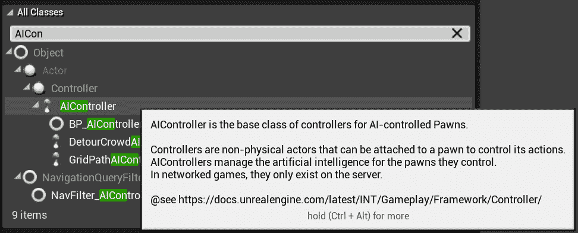

    图 13.1:在“选择父类”对话框中找到的控制者资产类

5.  With this new `AIController Blueprint` created, name this asset `BP_AIControllerEnemy`.

    随着人工智能控制器的创建和命名，是时候将这个资产分配给你在上一章制作的第一个敌人蓝图了。

6.  直接导航到`/Enemy/Blueprints`找到`BP_Enemy`。*双击*打开此蓝图。
7.  在第一个敌人`Blueprint`的`Details`面板中，有一个标有`Pawn`的部分。在这里，您可以为`Pawn`或`Character`的人工智能功能设置不同的参数。
8.  `AI Controller Class`参数决定了，顾名思义，该敌人使用哪个 AI 控制器。*左键单击下拉菜单中的*，找到并选择您之前制作的人工智能控制器；也就是`BP_AIController_Enemy`。

完成这个练习后，敌方人工智能现在知道使用哪个人工智能控制器了。这是至关重要的，因为它在人工智能控制器中，人工智能将使用和执行您将在本章稍后创建的行为树。

人工智能控制器现在被分配给敌人，这意味着你几乎准备好开始为这个人工智能开发实际的智能了。在此之前，还有一个重要的话题需要讨论，那就是导航网格。

# 导航网格

任何人工智能最关键的方面之一，尤其是在视频游戏中，是以复杂的方式在环境中导航的能力。在虚幻引擎 4 中，有一种方法可以让引擎告诉人工智能环境的哪些部分是可导航的，哪些部分是不可导航的。这是通过**导航网格**或**导航网格**完成的。

术语“网格”在这里有误导性，因为它是通过编辑器中的一个卷实现的。我们需要一个导航网格，这样我们的人工智能就可以有效地导航游戏世界的可玩范围。我们将在下面的练习中一起添加一个。

虚幻引擎 4 还支持`Dynamic Navigation Mesh`，当动态对象在环境中移动时，它允许导航网格实时更新。这导致人工智能识别环境中的这些变化，并适当地更新它们的路径/导航。本书不涉及此内容，但您可以通过`Project Settings -> Navigation Mesh -> Runtime Generation`访问配置选项。

## 练习 13.02:为人工智能敌人实现导航网格体积

在本练习中，您将向`SideScrollerExampleMap`添加导航网格，并探索导航网格在虚幻引擎 4 中的工作方式。您还将学习如何根据游戏需要参数化该音量。本练习将在虚幻引擎 4 编辑器中进行。

在本练习结束时，您将对导航网格有更深入的了解。在本练习之后的活动中，您还将能够在自己的水平上实现该音量。让我们从增加导航网格体积开始。

以下步骤将帮助您完成本练习:

1.  如果您还没有打开地图，请通过导航到`File`并在`Open Level`选项上左键单击来打开`SideScrollerExampleMap`。在`Open Level`对话框中，导航至`/SideScrollerCPP/Maps`找到`SideScrollerExampleMap`。用*左键点击*选择该地图，然后*左键点击底部的* `Open`打开地图。
2.  打开地图，导航到右侧找到`Modes`面板。`Modes`面板是一组易于访问的演员类型，如`Volumes`、`Lights`、 `Geometry`等。在`Volumes`类别下，你会发现`Nav Mesh Bounds Volume`选项。
3.  *Left-click* and drag this volume into the map/scene. By default, you will see the outline of the volume in the editor. Press the `P` key to visualize the `Navigation` area that the volume encompasses, but make sure that the volume is intersecting with the ground geometry in order to see the green visualization, as shown in the following screenshot:

    

    图 13.2:引擎和人工智能认为绿色区域是可导航的

    `Nav Mesh`体积就位后，让我们调整它的形状，使体积延伸到水平仪的整个区域。之后，您将学习如何根据游戏目的调整`Nav Mesh`音量的参数。

4.  *Left-click* to select `NavMeshBoundsVolume` and navigate to its `Details` panel. There is a section labeled `Brush Settings` that allows you to adjust the shape and size of the volume. Find the values that fit best for you. Some suggested settings are `Brush Type: Additive`, `Brush Shape: Box`, `X: 3000.0`, `Y: 3000.0`, and `Z: 3000.0`.

    注意当`NavMeshBoundsVolume`的形状和尺寸发生变化时，`Nav Mesh`会调整并重新计算可导航区域。这可以在下面的截图中看到。您还会注意到，上层平台不可导航；稍后您将修复此问题:

    

图 13.3:现在，NavMeshBoundsVolume 扩展到示例地图的整个可玩区域

通过完成本练习，您已经将第一个`NavMeshBoundsVolume`演员放入游戏世界，并使用调试键`'P'`，在默认地图中可视化了可导航区域。接下来，您将了解更多关于`RecastNavMesh`演员的信息，该演员也是在将`NavMeshBoundsVolume`放入关卡时创建的。

# 重铸导航网格

当你添加`NavMeshBoundsVolume`时，你可能已经注意到另一个演员被自动创建:一个名为`RecastNavMesh-Default`的`RecastNavMesh`演员。这个`RecastNavMesh`充当导航网格的“大脑”，因为它包含调整导航网格所需的参数，这些参数直接影响人工智能如何导航给定的区域。

下面的截图显示了这个资产，从`World Outliner`标签可以看到:


图 13.4:从“世界大纲视图”选项卡中看到的 RecastNavMesh 执行元

注意

`RecastNavMesh`中有很多参数存在，我们在这本书中只涵盖重要的参数。更多信息，请查看[。](https://docs.unrealengine.com/en-US/API/Runtime/NavigationSystem/NavMesh/ARecastNavMesh/index.html)

现在只有两个主要部分对您很重要:

1.  `Display`:`Display`部分，顾名思义，只包含影响`NavMeshBoundsVolume`生成的导航区域可视化调试显示的参数。建议您尝试切换此类别下的每个参数，看看它如何影响生成的导航网格的显示。
2.  `Generation`:`Generation`类别包含一组值，作为导航网格如何生成的规则集，并确定几何图形的哪些区域可导航，哪些区域不可导航。这里有很多选择，这可能会使这个概念非常令人生畏，但是让我们讨论这个类别下的一些参数:
    *   `Cell Size`指的是 Nav Mesh 能够在一个区域内生成可导航空间的精度。在本练习的下一步中，您将更新该值，因此您将看到这如何实时影响可导航区域。
    *   `Agent Radius`指将在该区域导航的演员的半径。在你的游戏中，这里设置的半径是半径最大的角色的碰撞部分的半径。
    *   `Agent Height`指将在该区域导航的演员的高度。在你的游戏中，这里设置的高度是半高最大的角色碰撞部分的半高。可以乘以`2.0f`得到全高。
    *   `Agent Max Slope`指的是你的游戏世界中可以存在的斜坡的倾斜角度。默认情况下，该值为`44`度，这是一个参数，除非您的游戏要求它发生变化，否则您将保持不变。
    *   `Agent Max Step Height`指的是台阶的高度，关于楼梯台阶，可以由人工智能导航。很像`Agent Max Slope`，这是一个参数，除非你的游戏特别要求改变这个值，否则你很可能会置之不理。

现在，您已经了解了重铸导航网格参数，让我们在下一个练习中将这些知识付诸实践，我们将指导您更改其中的一些参数。

## 练习 13.03:重新计算导航网格体积参数

现在你在关卡中有了`Nav Mesh`音量，是时候改变`Recast Nav Mesh`演员的参数了，这样 Nav Mesh 就可以让敌方 AI 在比其他人更瘦的平台上导航。本练习将在虚幻引擎 4 编辑器中进行。

以下步骤将帮助您完成本练习:

1.  You will be updating `Cell Size` and `Agent Height` so that they fit the needs of your character and the accuracy needed for the Nav Mesh:

    ```cpp
    Cell Size: 5.0f
    Agent Height: 192.0f
    ```

    下面的截图显示，由于我们对`Cell Size`进行了更改，上层平台现在可以导航了:

    

图 13.5:将单元格大小从 19.0 更改为 5.0 允许狭窄的上层平台可导航

有了自己的`Nav Mesh`设置的`SuperSideScrollerExampleMap`，你现在可以继续前进，为敌人创建人工智能逻辑。在此之前，完成以下活动来创建您自己的关卡，并使用它自己独特的布局和`NavMeshBoundsVolume`演员，您可以在本项目的剩余部分中使用。

## 活动 13.01:创建新级别

现在您已经将`NavMeshBoundsVolume`添加到示例地图中，是时候创建您自己的地图来完成`Super SideScroller`游戏的其余部分了。通过创建您自己的地图，您将更好地了解`NavMeshBoundsVolume`和`RecastNavMesh`的属性如何影响它们所处的环境。

注意

在继续本活动的解决方案之前，如果您需要一个适用于`SuperSideScroller`游戏剩余章节的示例关卡，那么不要担心——这一章附带了`SuperSideScroller.umap`资源，以及一个名为`SuperSideScroller_NoNavMesh`的地图，其中不包含`NavMeshBoundsVolume`。你可以用`SuperSideScroller.umap`作为如何创造自己水平的参考，或者获得如何提高自己水平的想法。你可以在这里下载地图:[https://packt.live/3lo7v2f](https://packt.live/3lo7v2f)。

执行以下步骤创建简单的地图:

1.  创建一个`New Level`。
2.  命名这个等级`SuperSideScroller`。
3.  使用本项目`Content Browser`界面默认提供的静态网格资源，创建一个不同高程的有趣空间进行导航。将你的玩家角色`Blueprint`加到等级，确保被`Player Controller 0`附体。
4.  将`NavMeshBoundsVolume`演员添加到您的级别，并调整其尺寸，使其适合您创建的空间。在为本活动提供的示例图中，尺寸设置应分别为 *X* 、 *Y* 和 *Z* 轴中的`1000.0`、`5000.0`和`2000.0`。
5.  确保按下`P`键启用`NavMeshBoundsVolume`的调试可视化。
6.  Adjust the parameters of the `RecastNavMesh` actor so that `NavMeshBoundsVolume` works well for your level. In the case of the provided example map, the `Cell Size` parameter is set to `5.0f`, `Agent Radius` is set to `42.0f`, and `Agent Height` is set to `192.0f`. Use these values as a reference.

    预期产出:

    

图 13.6:超视频滚动地图

在本活动结束时，您将拥有一个包含所需`NavMeshBoundsVolume`和`RecastNavMesh`演员设置的级别。这将允许我们将在即将到来的练习中开发的人工智能正常运行。同样，如果您不确定关卡应该是什么样子，请参考提供的示例地图`SuperSideScroller.umap`。现在，是时候开始为`SuperSideScroller`游戏开发人工智能了。

注意

这个活动的解决方案可以在:[https://packt.live/338jEBx](https://packt.live/338jEBx)找到。

# 行为树和黑板

行为树和黑板一起工作，允许我们的人工智能遵循不同的逻辑路径，并基于各种条件和变量做出决策。

一个**行为树** ( **BT** )是一个可视化脚本工具，允许你根据某些因素和参数告诉一个棋子该做什么。例如，BT 可以根据人工智能是否能看到玩家来告诉人工智能移动到某个位置。

举一个 BTs 和黑板在游戏中如何使用的例子，我们来看看用虚幻引擎 4 开发的游戏《战争 5 的*齿轮》*。《战争齿轮 5》和整个《战争齿轮》系列中的人工智能总是试图包抄玩家，或者迫使玩家脱离掩护。为了做到这一点，人工智能逻辑的一个关键组成部分是知道玩家是谁，以及玩家在哪里。黑板中有一个玩家的参考变量和一个存储玩家位置的位置向量。决定如何使用这些变量以及人工智能将如何使用这些信息的逻辑在行为树中执行。

黑板是您定义一组变量的地方，这些变量是让行为树执行操作并使用这些值进行决策所必需的。

行为树是您创建希望人工智能执行的任务的地方，例如移动到某个位置，或执行您创建的自定义任务。像虚幻引擎 4 中的许多编辑器内工具一样，行为树在很大程度上是一种非常直观的脚本体验。

**黑板**是定义变量的地方，也称为**键**，然后将被**行为树**引用。您在这里创建的键可以在**任务**、**服务**和**装饰器**中使用，根据您希望人工智能如何工作来服务不同的目的。下面的屏幕截图显示了一组变量 Keys 的示例，这些变量可以被其关联的行为树引用。

如果没有黑板，行为树将无法在不同的任务、服务或装饰者之间传递和存储信息，从而使其变得无用:


图 13.7:可以在行为树中访问的 Blackboard 中的一组示例变量

**行为树**由一组**对象**组成，即**复合**、**任务**、**装饰者**和**服务**，它们共同定义人工智能将如何基于您设置的条件和逻辑流进行行为和响应。所有的行为树都从逻辑流开始的根开始；这不能修改，并且只有一个执行分支。让我们更详细地看看这些对象:

## 复合材料

复合节点的功能是告诉行为树如何执行任务和其他操作。下面的截图显示了虚幻引擎默认给你的合成节点的完整列表:选择器、序列和简单并行。

复合节点还可以附加装饰器和服务，以便在执行行为树分支之前应用可选条件:


图 13.8:复合节点的完整列表——选择器、序列和简单并行

*   `Selector`: The Selector composite node executes its children from left to right and will stop executing when one of the children Tasks succeeds. Using the example shown in the following screenshot, if the `FinishWithResult` task is successful, the parent Selector succeeds, which will cause the Root to execute again and `FinishWithResult` to execute once more. This pattern will continue until `FinishWithResult` fails. The Selector will then execute `MakeNoise`. If `MakeNoise` fails, the `Selector` fails, and the Root will execute again. If the `MakeNoise` task succeeds, then the Selector will succeed, and the Root will execute again. Depending on the flow of the behavior tree, if the Selector fails or succeeds, the next composite branch will begin to execute. In the following screenshot, there are no other composite nodes, so if the Selector fails or succeeds, the Root node will be executed again. However, if there were a Sequence composite node with multiple Selector nodes underneath, each Selector would attempt to successfully execute its children. Regardless of success or failure, each Selector will attempt execution sequentially:

    

图 13.9:如何在行为树中使用选择器复合节点的例子

请注意，添加任务和`Composite`节点时，您会注意到每个节点右上角的数值。这些数字表示这些节点的执行顺序。该模式遵循*顶部*到*底部*、*左侧*到*右侧*的范式，这些值有助于您跟踪订单。任何断开的任务或`Composite`节点将被赋予一个值`–1`，以指示它未被使用。

*   `Sequence`: The `Sequence` composite node executes its children from left to right and will stop executing when one of the children Tasks fails. Using the example shown in the following screenshot, if the `Move To` task is successful, then the parent Sequence node will execute the `Wait` task. If the `Wait` task is successful, then the Sequence is successful, and `Root` will execute again. If the `Move To` task fails, however, the Sequence will fail and `Root` will execute again, causing the `Wait` task to never execute:

    

图 13.10:如何在行为树中使用序列复合节点的示例

*   `Simple Parallel`: The `Simple Parallel` composite node allows you to execute a `Task` and a new standalone branch of logic simultaneously. The following screenshot shows a very basic example of what this will look like. In this example, a task used to `Wait` for `5` seconds is being executed at the same time as a new `Sequence` of Tasks is being executed:

    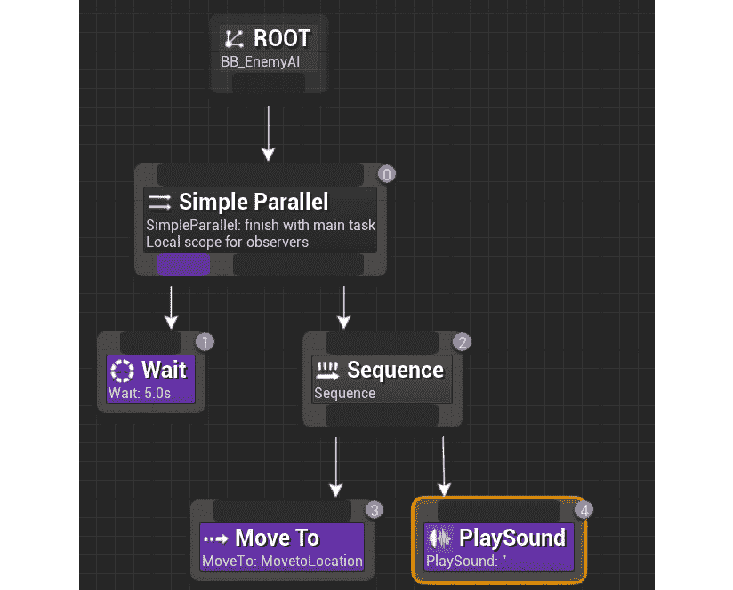

图 13.11:如何在行为树中使用选择器复合节点的例子

`Simple Parallel`复合节点也是其`Details`面板中唯一有参数的`Composite`节点，即`Finish Mode`。有两种选择:

*   `Immediate`:设置为`Immediate`时，一旦主任务完成，简单并行将成功完成。在这种情况下，`Wait`任务完成后，背景树序列将中止，整个`Simple Parallel`将再次执行。
*   `Delayed`:设置为`Delayed`时，一旦后台树完成执行，任务完成，简单并行将成功完成。在这种情况下，`Wait`任务将在`5`秒后完成，但整个`Simple Parallel`将等待`Move To`和`PlaySound`任务执行后再重新启动。

## 任务

这些是我们的人工智能可以执行的任务。虚幻为我们提供了默认使用的内置任务，但我们也可以在蓝图和 C++ 中创建自己的任务。这包括一些任务，比如告诉我们的人工智能到一个特定的位置，甚至告诉人工智能发射它的武器。了解您可以使用蓝图创建自己的自定义任务也很重要。让我们简单讨论一下你将用来为敌方角色开发人工智能的两个任务:

*   `Move To Task`:这是行为树中比较常用的 Tasks 之一，在本章接下来的练习中，你会用到这个任务。`Move To task`根据给定的位置，使用导航系统告诉人工智能如何移动以及移动到哪里。你会用这个任务告诉 AI 敌人去哪里。
*   `Wait Task`:这是行为树中另一个常用的任务，因为如果逻辑需要，它允许任务执行之间有延迟。这可以用来让人工智能在移动到新位置之前等待几秒钟。

## 装饰人员

`Decorators`是可以添加到任务或`Composite`节点的条件，例如允许分支逻辑发生的`Sequence`或`Selector`。例如，我们可以有一个`Decorator`来检查敌人是否知道玩家的位置。如果是这样，我们可以告诉敌人向最后一个已知地点移动。如果没有，我们可以告诉我们的人工智能生成一个新的位置，并转而移动到那里。同样重要的是要知道，您可以使用蓝图创建自己的自定义装饰器。

让我们也简单讨论一下你将用来为敌人角色开发人工智能的装饰器——装饰器。这决定了受控棋子是否在装饰器本身中指定的位置。这将有助于您确保行为树不会执行，直到您知道人工智能已经到达其给定的位置。

## 服务

`Services`的工作方式很像 Decorators，因为它们可以与`Tasks`和`Composite`节点链接。主要区别在于`Service`允许我们根据服务中定义的时间间隔执行节点分支。同样重要的是，您可以使用蓝图创建自己的定制服务。

## 练习 13.04:创建人工智能行为树和黑板

现在，您已经对行为树和黑板有了一个概述，本练习将指导您创建这些资产，告诉人工智能控制器使用您创建的行为树，并将黑板分配给行为树。您将在此创建的黑板和行为树资产将用于`SuperSideScroller`游戏。本练习将在虚幻引擎 4 编辑器中进行。

以下步骤将帮助您完成本练习:

1.  在`Content Browser`界面内，导航至`/Enemy/AI`目录。这与您创建人工智能控制器的目录相同。
2.  在该目录下，*在`Content Browser`界面空白区域内右键*，导航至`Artificial Intelligence`选项，选择`Behavior Tree`创建`Behavior Tree`资产。命名这个资产`BT_EnemyAI`。
3.  In the same directory as the previous step, *right-click* again within the blank area of the `Content Browser` interface, navigate to the `Artificial Intelligence` option, and select `Blackboard` to create the `Blackboard` asset. Name this asset `BB_EnemyAI`.

    在我们继续告诉人工智能控制器运行这个新的行为树之前，让我们首先将黑板分配给这个行为树，以便它们正确连接。

4.  在`Content Browser`界面双击资产，打开`BT_EnemyAI`。打开后，导航到右侧的`Details`面板，找到`Blackboard Asset`参数。
5.  *左键单击该参数的下拉菜单*，找到您之前创建的`BB_EnemyAI` `Blackboard`资产。在关闭行为树之前编译并保存它。
6.  Next, open the AI Controller `BP_AIController_Enemy` asset by *double-clicking* it inside the `Content Browser` interface. Inside the controller, *right-click* and search for the `Run Behavior Tree` function.

    `Run Behavior Tree`函数非常简单:给控制器分配一个`Behavior Tree`，函数返回行为树是否成功开始执行。

7.  Lastly, connect the `Event BeginPlay` event node to the execution pin of the `Run Behavior Tree` function and assign `Behavior Tree asset BT_EnemyAI`, which you created earlier in this exercise:

    。

    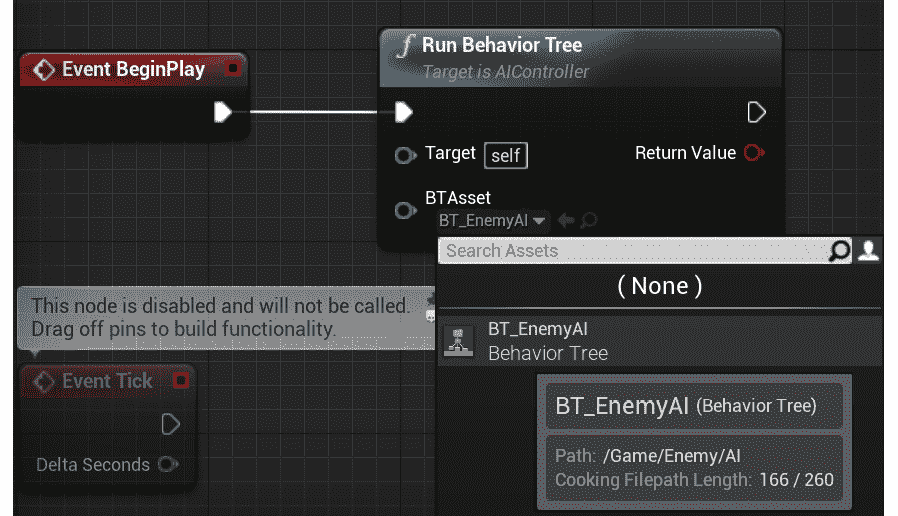

图 13.12:分配 BT_EnemyAI 行为树

完成本练习后，敌方 AI 控制器现在知道运行`BT_EnemyAI`行为树，并且该行为树知道使用名为`BB_EnemyAI`的 Blackboard 资产。有了这些，你可以开始使用行为树逻辑来开发人工智能，这样敌人角色就可以在关卡中移动了。

## 练习 13.05:创建新的行为树任务

本练习的目标是为敌人人工智能开发一个人工智能任务，该任务将允许角色在你的等级中的`Nav Mesh` 体积范围内找到一个随机移动的点。

虽然`SuperSideScroller`游戏只允许二维移动，但还是让 AI 在你在*活动 13.01* 、*创建新关卡*中创建的关卡的 3D 空间内的任何地方移动，然后努力将敌人约束到二维。

按照以下步骤为敌人创建新任务:

1.  首先，打开您在上一个练习中创建的 Blackboard 资产`BB_EnemyAI`。
2.  *Left-click* on the `New Key` option at the top-left of `Blackboard` and select the `Vector` option. Name this vector `MoveToLocation`. You will use this `vector` variable to track the next move for the AI as it decides where to move to.

    为了这个敌人 AI 的目的，你将需要创建一个新的`Task`，因为虚幻里面当前可用的任务不适合敌人行为的需要。

3.  导航并打开您在上一练习中创建的`Behavior Tree`资产`BT_EnemyAI`。
4.  *在顶部工具栏的`New Task`选项上左键单击*。新建`Task`时，会自动为您打开任务资产。但是，如果您已经创建了一个任务，当选择`New Task`选项时，将出现一个选项下拉列表。在处理这个`Task`的逻辑之前，您将重命名资产。
5.  关闭`Task`资产窗口，导航至`/Enemy/AI/`，这是保存`Task`的地方。默认情况下，提供的名称为`BTTask_BlueprintBase_New`。重命名该资产`BTTask_FindLocation`。
6.  新的`Task`资产命名后，*双击*打开`Task Editor`。新任务的蓝图图将完全为空，并且不会向您提供任何要在图中使用的默认事件。
7.  *右键单击图中的*，在上下文相关搜索中，找到`Event Receive Execute AI`选项。
8.  *Left-click* the `Event Receive Execute AI` option to create the event node in the `Task` graph, as shown in the following screenshot:

    

    图 13.13:事件接收执行人工智能返回所有者控制器和受控棋子

    注意

    `Event Receive Execute AI`事件将让您访问**所有者控制者**和**受控棋子**。在接下来的步骤中，您将使用受控棋子来完成此任务。

9.  每个`Task`都需要调用`Finish Execute`函数，以便`Behavior Tree`资产知道何时可以移动到下一个`Task`或从树上分支。*右键单击图中的*，通过上下文相关搜索搜索`Finish Execute`。
10.  *Left-click* the `Finish Execute` option from the context-sensitive search to create the node inside the Blueprint graph of your `Task`, as shown in the following screenshot:

    

    图 13.14:完成执行函数，它有一个布尔参数，决定任务是否成功

    你需要的下一个函数叫做`GetRandomLocationInNavigableRadius`。顾名思义，该函数返回可导航区域定义半径内的随机矢量位置。这将允许敌人角色找到随机位置并移动到这些位置。

11.  *Right-click* in the graph and search for `GetRandomLocationInNavigableRadius` inside the context-sensitive search. *Left-click* the `GetRandomLocationInNavigableRadius` option to place this function inside the graph.

    有了这两个功能，并且`Event Receive Execute AI`准备好了，是时候获取敌方 AI 的随机位置了。

12.  From the `Controlled Pawn` output of `Event Receive Execute AI`, find the `GetActorLocation` function via the context-sensitive search:

    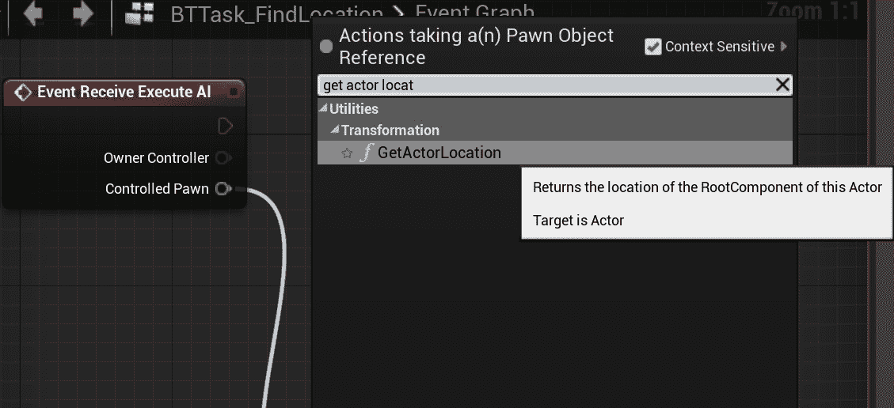

    图 13.15:敌人棋子的位置将作为随机点选择的起点

13.  Connect the vector return value from `GetActorLocation` to the `Origin` vector input parameter of the `GetRandomLocationInNavigableRadius` function, as shown in the following screenshot. Now, this function will use the enemy AI pawn's location as the origin for determining the next random point:

    

    图 13.16:现在，敌方棋子位置将作为随机点矢量搜索的原点

14.  Next, you need to tell the `GetRandomLocationInNavigableRadius` function the `Radius` in which to check for the random point in the navigable area of the level. Set this value to `1000.0f`.

    其余参数`Nav Data`和`Filter Class`可以保持原样。现在您从`GetRandomLocationInNavigableRadius`获得了一个随机位置，您需要能够将该值存储在您在本练习前面创建的`Blackboard`向量中。

15.  要获得对`Blackboard`向量变量的引用，需要在这个`Task`内部创建一个新的变量，它属于`Blackboard Key Selector`类型。创建这个新变量并命名为`NewLocation`。
16.  现在你需要将这个变量变成一个`Public`变量，这样它就可以暴露在行为树里面了。*左键单击“眼睛”图标上的*，使眼睛可见。
17.  With the `Blackboard Key Selector` variable ready, *left-click* and drag out a `Getter` of this variable. Then, pull from this variable and search for `Set Blackboard Value as Vector`, as shown in the following screenshot:

    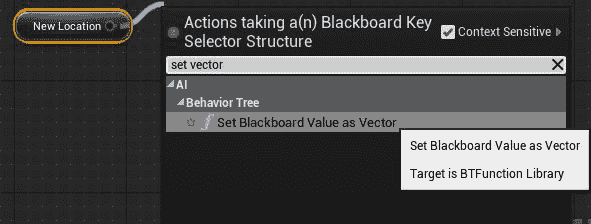

    图 13.17:设置黑板值有多种不同的类型来支持黑板内部可能存在的不同变量

18.  Connect the `RandomLocation` output vector from `GetRandomLocationInNavigableRadius` to the `Value` vector input parameter of `Set Blackboard Value as Vector`. Then, connect the execution pins of these two function nodes. The result will look as follows:

    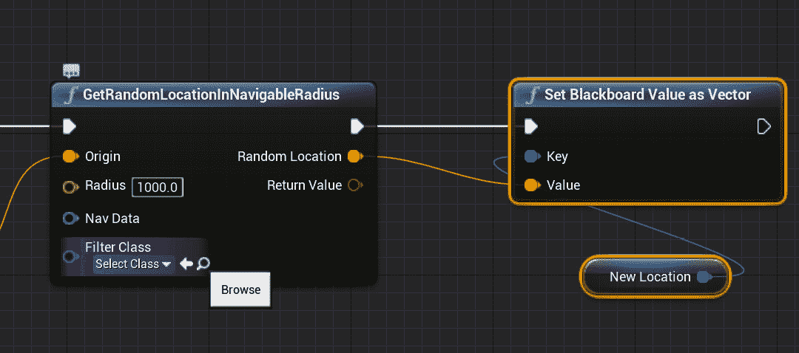

    图 13.18:现在，黑板向量值被分配给这个新的随机位置

    最后，您将使用`GetRandomLocationInNavigableRadius`函数的`Return Value`布尔输出参数作为确定`Task`是否成功执行的手段。

19.  Connect the Boolean output parameter to the `Success` input parameter of the `Finish Execute` function and connect the execution pins of the `Set Blackboard Value as Vector` and `Finish Execute` function nodes. The following screenshot shows the final result of the `Task` logic:

    

图 13.19:任务的最终设置

注意

您可以在以下链接找到前面的全分辨率截图，以便更好地查看:[https://packt.live/3lmLyk5](https://packt.live/3lmLyk5)。

通过完成本练习，您已经使用虚幻引擎 4 中的蓝图创建了第一个自定义`Task`。你现在有一个任务，在你等级的`Nav Mesh Volume`的可导航范围内找到一个随机位置，使用敌人棋子作为这次搜索的起点。在下一个练习中，你将在行为树中实现这个新的`Task`，并看到敌人的人工智能在你的等级周围移动。

## 练习 13.06:创建行为树逻辑

本练习的目标是在行为树中实现您在上一练习中创建的新`Task`，以便让敌人 AI 在您所在级别的导航空间内找到一个随机位置，然后移动到该位置。您将使用`Composite`、`Task`和`Services`节点的组合来完成此行为。本练习将在虚幻引擎 4 编辑器中进行。

以下步骤将帮助您完成本练习:

1.  首先，打开你在*练习 13.04* 、*中创建的行为树，创建 AI 行为树和黑板*，也就是`BT_EnemyAI`。
2.  在此`Behavior Tree`、*中，左键单击*并从`Root`节点的底部拖动，从上下文相关搜索中选择`Sequence`节点。结果将是连接到`Sequence`复合节点的`Root`。
3.  接下来，从`Sequence`节点，*左键单击*并拖动，调出上下文菜单。在此菜单中，搜索您在上一次创建的`BTTask_FindLocation`。
4.  By default, the `BTTask_FindLocation` task should automatically assign the `New Location` key selector variable to the `MovetoLocation` vector variable from `Blackboard`. If this doesn't happen, you can assign this selector manually in the `Details` panel of the Task.

    现在，`BTTask_FindLocation`将从`Blackboard`将`NewLocation`选择器分配给`MovetoLocation`矢量变量。这意味着从任务返回的随机位置将被分配给`Blackboard`变量，并且您可以在其他任务中引用该变量。

    现在，您找到了一个有效的随机位置，并将该位置分配给`Blackboard`变量，即`MovetoLocation`，您可以使用`Move To`任务告诉人工智能移动到该位置。

5.  *Left-click* and pull from the `Sequence` composite node. Then, from the context-sensitive search, find the `Move To` task. Your `Behavior Tree` will now look as follows:

    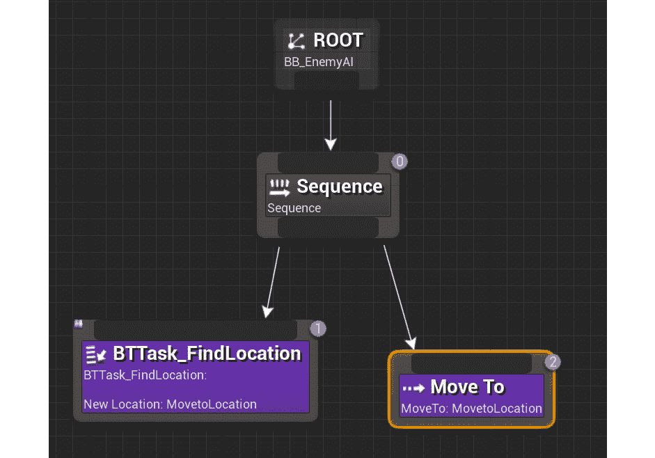

    图 13.20:选择随机位置后，移动到任务会让 AI 移动到这个新位置

6.  By default, the `Move To` task should assign `MoveToLocation` as its `Blackboard Key` value. If it doesn't, select the task. In its `Details` panel, you will find the `Blackboard Key` parameter, which is where you can assign the variable. While in the `Details` panel, also set `Acceptable Radius` to `50.0f`.

    现在，行为树使用`BTTask_FindLocation`自定义任务找到随机位置，并告诉人工智能使用`MoveTo`任务移动到该位置。这两个任务通过引用名为`MovetoLocation`的`Blackboard`向量变量相互传递位置。

    这里要做的最后一件事是在`Sequence`复合节点上添加一个`Decorator`，这样可以确保在再次执行树查找并移动到新位置之前，敌人角色不在随机位置。

7.  *右键单击`Sequence`顶部区域的*，选择`Add Decorator`。从下拉菜单中，左键单击*并选择`Is at Location`。*
8.  既然`Blackboard`里面已经有了矢量参数，这个`Decorator`应该会自动将`MovetoLocation`指定为`Blackboard Key`。通过选择`Decorator`并确保`Blackboard Key`分配给`MovetoLocation`来验证这一点。
9.  With the Decorator in place, you have completed the behavior tree. The final result will look as follows:

    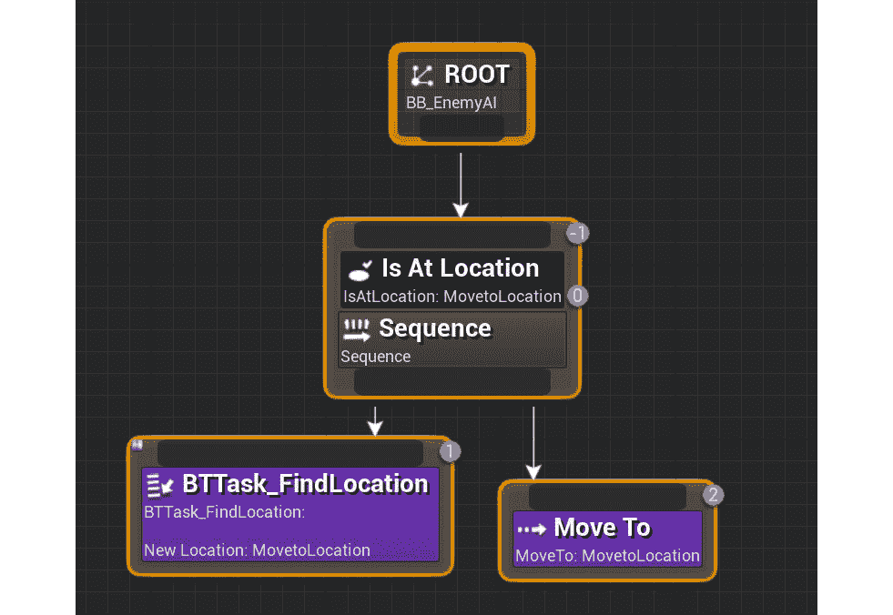

    图 13.21:人工智能敌人行为树的最终设置

    这个行为树告诉人工智能使用`BTTask_FindLocation`找到一个随机位置，并将这个位置分配给名为`MovetoLocation`的 Blackboard 值。当这个任务成功时，行为树将执行`MoveTo`任务，这将告诉人工智能移动到这个新的随机位置。序列被包裹在一个`Decorator`中，确保敌人的人工智能在再次执行之前处于`MovetoLocation`，就像人工智能的安全网一样。

10.  在你可以测试新的人工智能行为之前，确保在你的关卡中放置一个`BP_Enemy AI`，如果你之前的练习和活动中还没有的话。
11.  Now, if you use `PIE`, or `Simulate`, you will see the enemy AI run around the map and move to random locations within `Nav Mesh Volume`:

    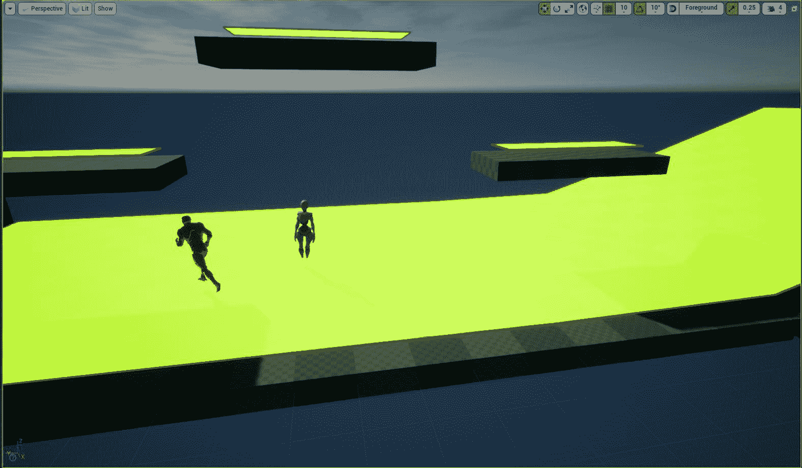

图 13.22:敌人的人工智能现在将从一个位置移动到另一个位置

注意

可以有一些情况是敌方 AI 不会移动。这可能是由于`GetRandomLocationInNavigableRadius`功能没有返回`True`造成的。这是一个已知问题，如果发生，请重新启动编辑器，然后重试。

通过完成这个练习，你已经创建了一个功能齐全的行为树，允许敌人 AI 使用`Nav Mesh Volume`找到并移动到你等级的可导航范围内的一个随机位置。您在上一练习中创建的任务允许您找到这个随机点，而`Move To`任务允许人工智能角色向这个新位置移动。

由于`Sequence`复合节点是如何工作的，每个任务都必须成功完成才能进行下一个任务，所以首先敌人成功找到一个随机位置，然后向这个位置移动。只有当`Move To`任务完成后，整个行为树才会重新开始，选择一个新的随机位置。

现在，你可以继续下一个活动，你将添加到这个行为树，以便让人工智能在选择一个新的随机点之间等待，这样敌人就不会不断移动。

## 活动 13.02: AI 移动到玩家位置

在之前的练习中，通过使用自定义的`Task`和`MoveTo`任务，你可以让人工智能敌人角色移动到`Nav Mesh Volume`范围内的任意位置。

在本练习中，您将继续上一练习并更新行为树。你将通过使用`Decorator`来利用`Wait`任务，并创建自己的新自定义任务，以使人工智能跟随玩家角色并每隔几秒钟更新其位置。

以下步骤将帮助您完成本活动:

1.  在您在上一个练习中创建的`BT_EnemyAI`行为树中，您将从您停止的地方继续并创建一个新的任务。通过从工具栏中选择`New Task`并选择`BTTask_BlueprintBase`来完成。命名这个新任务`BTTask_FindPlayer`。
2.  在`BTTask_FindPlayer`任务中，创建一个名为`Event Receive Execute AI`的新事件。
3.  找到`Get Player Character`功能，获取玩家的参考；确保使用`Player Index 0`。
4.  从玩家角色中，调用`Get Actor Location`功能，以找到玩家的当前位置。
5.  在此任务中创建一个新的黑板键`Selector`变量。命名这个变量`NewLocation`。
6.  *左键单击*并将`NewLocation`变量拖动到图形中。从这个变量中，搜索作为`Vector`的`Set Blackboard Value`函数。
7.  将`Set Blackboard Value`作为`Vector`函数连接到事件的`Receive Execute AI`节点的执行引脚。
8.  增加`Finish Execute`功能，保证布尔`Success`参数为`True`。
9.  最后，将`Set Blackboard Value`作为`Vector`功能连接到`Finish Execute`功能。
10.  保存并编译任务`Blueprint`，返回`BT_EnemyAI`行为树。
11.  用新的`BTTask_FindPlayer`任务替换`BTTask_FindLocation`任务，这样这个新任务就是`Sequence`复合节点下的第一个任务。
12.  按照自定义`BTTask_FindLocation`和`Move To`任务，在`Sequence`复合节点下添加一个新的`PlaySound`任务作为第三个任务。
13.  在`Sound to Play`参数中，添加`Explosion_Cue SoundCue`资产。
14.  给`PlaySound`任务添加一个`Is At Location`装饰器，并确保`MovetoLocation`键被分配给这个`Decorator`。
15.  在`PlaySound`任务之后的`Sequence`复合节点下添加一个新的`Wait`任务作为第四个任务。
16.  Set the `Wait` task to wait `2.0f` seconds before completing successfully.

    预期产出如下:

    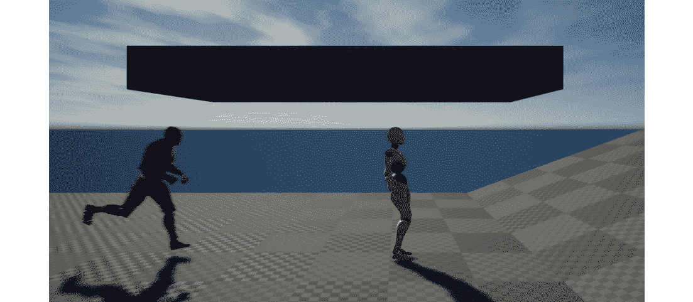

图 13.23:敌人 AI 跟随玩家，每 2 秒更新一次玩家位置

敌方 AI 角色将移动到玩家在关卡导航空间中最后一个已知位置，并在每个玩家位置之间暂停`2.0f`秒。

注意

这个活动的解决方案可以在:[https://packt.live/338jEBx](https://packt.live/338jEBx)找到。

完成本活动后，您已经学会创建一个新的任务，该任务允许人工智能找到玩家位置并移动到玩家最后已知的位置。在进入下一组练习之前，移除`PlaySound`任务，并用您在*练习 13.05* 、*创建新行为树任务*中创建的`BTTask_FindLocation`任务替换`BTTask_FindPlayer`任务。请参考*练习 13.05、* *新建行为树任务*、*练习 13.06* 、*创建行为树逻辑*，确保行为树返回正确。在接下来的练习中，您将使用`BTTask_FindLocation`任务。

在下一个练习中，您将通过开发一个新的`Blueprint`参与者来解决这个问题，该参与者将允许您设置人工智能可以走向的特定位置。

## 练习 13.07:创建敌方巡逻地点

AI 敌人角色目前的问题是他们可以在 3D 可导航空间内自由移动，因为行为树允许他们在该空间内找到一个随机位置。相反，人工智能需要被赋予巡逻点，你可以在编辑器中指定和改变。然后它会随机选择其中一个巡逻点进行移动。这是你将为`SuperSideScroller`游戏做的:创建敌人 AI 可以移动到的巡逻点。本练习将向您展示如何使用简单的*蓝图*演员创建这些巡逻点。本练习将在虚幻引擎 4 编辑器中进行。

以下步骤将帮助您完成本练习:

1.  首先，导航到`/Enemy/Blueprints/`目录。这是您将创建新的`Blueprint`演员的地方，该演员将用于人工智能巡逻点。
2.  在该目录中，*右键单击*，通过*左键单击菜单中的*选择`Blueprint Class`选项。
3.  From the `Pick Parent Class` menu prompt, *left-click* the `Actor` option to create a new `Blueprint` based on the `Actor` class:

    

    图 13.24:Actor 类是游戏世界中所有可以放置或衍生的对象的基类

4.  Name this new asset `BP_AIPoints` and open this `Blueprint` by *double-clicking* the asset in the `Content Browser` interface.

    注意

    `Blueprints`的界面和其他系统有很多相同的特性和布局，比如`Animation Blueprints`和`Tasks`，所以这些你应该都很熟悉。

5.  导航到蓝图界面左侧的`Variables`选项卡，在`+Variable`按钮上左键单击。命名这个变量`Points`。
6.  从`Variable Type`下拉菜单中，*左键单击*并选择`Vector`选项。
7.  接下来，你需要将这个向量变量设为`Array`，这样你就可以存储多个巡逻地点。*左键单击`Vector`旁边的黄色图标*，左键单击选择`Array`选项。
8.  设置`Points`向量变量的最后一步是启用`Instance Editable`和`Show 3D Widget`:
    *   `Instance Editable`参数允许这个向量变量在被放入一个级别时在参与者上公开可见，允许这个参与者的每个实例都有这个变量可供编辑。
    *   `Show 3D Widget` allows you to position the vector value by using a visible 3D transform widget in the editor viewport. You will see what this means in the next steps of this exercise. It is also important to note that the `Show 3D Widget` option is only available for variables that involve an actor transform, such as `Vectors` and `Transforms`.

        随着简单的演员设置，是时候将演员放入关卡并开始设置*巡逻点*位置了。

9.  Add the `BP_AIPoints` actor Blueprint into your level, as shown in the following screenshot:

    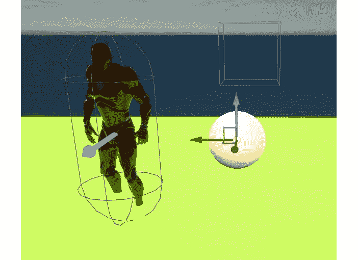

    图 13.25:BP _ AIPointS 参与者现在处于该级别

10.  选择`BP_AIPoints`演员后，导航至其`Details`面板，找到`Points`变量。
11.  Next, you can add a new element to the vector array by *left-clicking* on the `+` symbol, as shown here:

    

    图 13.26:一个数组中可以有许多元素，但是数组越大，分配的内存就越多

12.  When you add a new element to the vector array, you will see a 3D widget appear that you can then *left-click* to select and move around the level, as shown here:

    

    图 13.27:第一个巡逻点矢量位置

    注意

    当您更新代表矢量数组元素的 3D 小部件的位置时，3D 坐标将在`Points`变量的`Details`面板中更新。

13.  Finally, add as many elements into the vector array as you would like for the context of your level. Keep in mind that the positions of these patrol points should line up so that they make a straight line along the horizontal axis, parallel to the direction in which the character will move. The following screenshot shows the setup in the example `SideScroller.umap` level included in this exercise:

    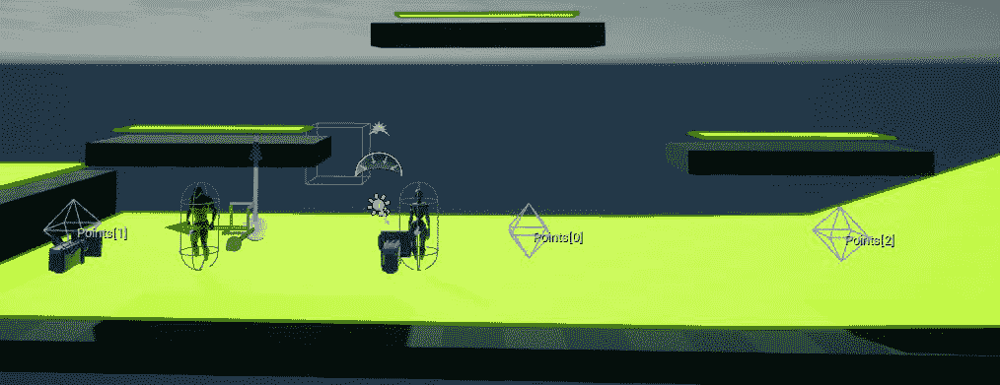

    图 13.28:巡视点路径的例子，如在 SideScroller.umap 示例级别中看到的

14.  继续重复最后一步，创建多个巡逻点，并根据您认为合适的方式定位 3D 小部件。您可以使用提供的`SideScroller.umap`示例级别作为如何设置这些`Patrol Points`的参考。

完成本练习后，您已经创建了一个新的`Actor`蓝图，其中包含一组`Vector` 位置，现在您可以使用编辑器中的 3D 小部件手动设置这些位置。有了手动设置*巡逻点*位置的能力，你可以完全控制人工智能可以移动到哪里，但是有一个问题。没有从这个数组中选择一个点并将其传递给行为树以便人工智能可以在这些*巡逻点*之间移动的功能。在设置此功能之前，让我们了解更多关于向量和向量变换的知识，因为这些知识将在下一个练习中被证明是有用的。

# 矢量变换

在你进入下一个练习之前，了解向量变换是很重要的，更重要的是，`Transform Location`函数的作用。说到演员的位置，有两种对其位置的思考方式:世界空间和局部空间。演员在世界空间中的位置是其相对于世界本身的位置；更简单地说，这是您将实际演员放入关卡的位置。演员的本地位置是其相对于自身或父演员的位置。

让我们把`BP_AIPoints`演员作为世界空间和局部空间是什么的一个例子。`Points`数组的每个位置都是局部空间向量，因为它们是相对于`BP_AIPoints`角色本身的世界空间位置的位置。下面的截图显示了`Points`数组中的向量列表，如前面的练习所示。这些值是相对于您所在级别中`BP_AIPoints`演员位置的位置:


图 13.29:点数组的局部空间位置向量，相对于 BP_AIPoints 参与者的世界空间位置

为了让敌方 AI 移动到这些`Points`的正确世界空间位置，你需要使用一个叫做`Transform Location`的函数。该函数接受两个参数:

*   `T`:这是提供的`Transform`，用于将向量位置参数从局部空间转换为世界空间值。
*   `Location`:这就是要从局部空间转换到世界空间的`location`。

然后，这个向量转换的结果作为函数的返回值返回。在下一个练习中，您将使用该函数从`Points`数组中返回随机选择的向量点，并将该值从局部空间向量转换为世界空间向量。然后，这个新的世界空间向量将被用来告诉敌人人工智能相对于世界移动到哪里。让我们现在就实现它。

## 练习 13.08:选择数组中的随机点

现在您已经有了更多关于矢量和矢量变换的信息，您可以继续这个练习，在这里您将创建一个简单的`Blueprint`函数来选择一个*巡逻点*矢量位置，并使用一个名为`Transform Location`的内置函数将其矢量从局部空间值变换为世界空间值。通过返回向量位置的世界空间值，您可以将该值传递给*行为树*，以便人工智能移动到正确的位置。本练习将在虚幻引擎 4 编辑器中进行。

以下步骤将帮助您完成本练习。让我们从创建新函数开始:

1.  导航回`BP_AIPoints`蓝图，通过在蓝图编辑器左侧的`Functions`类别旁边左键单击按钮`+`创建新功能。命名该功能`GetNextPoint`。
2.  在为该功能添加逻辑之前，通过*在`Functions`类别下左键单击*选择该功能，以访问其`Details`面板。
3.  在`Details`面板中，启用`Pure`参数，使该功能标记为`Pure Function`。在为玩家角色制作动画蓝图时，您在*第 11 章*、*混合空间 1D、键绑定和状态机*中了解了`Pure Functions`；同样的事情正在这里发生。
4.  Next, the `GetNextPoint` function needs to return a vector that the behavior tree can use to tell the enemy AI where to move to. Add this new output by *left-clicking* on the `+` symbol under the `Outputs` category of the `Details` function. Make the variable of type `Vector` and give it the name `NextPoint`, as shown in the following screenshot:

    

    图 13.30:函数可以返回不同类型的多个变量，这取决于您的逻辑需求

5.  When adding an `Output` variable, the function will automatically generate a `Return` node and place it into the function graph, as shown in the following screenshot. You will use this output to return the new vector patrol point for the enemy AI to move to:

    

    图 13.31:该函数自动生成的返回节点，包括新点向量输出变量

    现在功能基础已经完成，让我们开始添加逻辑。

6.  In order to pick a random position, first, you need to find the length of the `Points` array. Create a `Getter` of the `Points` vector and from this vector variable, *left-click* and drag to search for the `Length` function, as shown in the following screenshot:

    

    图 13.32:Length 函数是一个返回数组长度的纯函数

7.  With the integer output of the `Length` function, *left-click* and drag out to use the context-sensitive search to find the `Random Integer` function, as shown in the following screenshot. The `Random Integer` function returns a random integer between `0` and `Max value`; in this case, this is the `Length` of the `Points` vector array:

    

    图 13.33:使用随机整数将允许函数从点向量数组返回一个随机向量

    到目前为止，您正在生成一个介于`0`和`Points`向量数组的长度之间的随机整数。接下来，您需要在返回的`Random Integer`的索引位置找到`Points`向量数组的元素。

8.  通过创建一个新的`Getter of the Points`向量数组来实现这一点。然后，*左键点击*并拖动搜索`Get (a copy)`功能。
9.  Next, connect the Return Value of the `Random Integer` function to the input of the `Get (a copy)` function. This will tell the function to choose a random integer and use that integer as the index to return from the `Points` vector array.

    现在您从`Points`向量数组中获得了一个随机向量，您需要使用`Transform Location`函数将位置从局部空间转换为世界空间向量。

    正如您已经了解的那样，`Points`数组中的向量是相对于级别中`BP_AIPoints`参与者位置的局部空间位置。因此，您需要使用`Transform Location`功能将随机选择的局部空间向量转换为世界空间向量，以便 AI 敌人移动到正确的位置。

10.  *左键单击*并从`Get (a copy)`功能的矢量输出中拖动，通过上下文相关搜索，找到`Transform Location`功能。
11.  将`Get (a copy)`功能的矢量输出连接到`Transform Location`功能的`Location`输入。
12.  最后一步是使用蓝图执行元本身的变换作为`Transform Location`函数的`T`参数。通过右键单击图中的*并通过上下文相关搜索，找到`GetActorTransform`功能并将其连接到`Transform Location`参数`T`。*
13.  Finally, connect the `Return Value` vector from the `Transform Location` function and connect it to the `NewPoint` vector output of the function:

    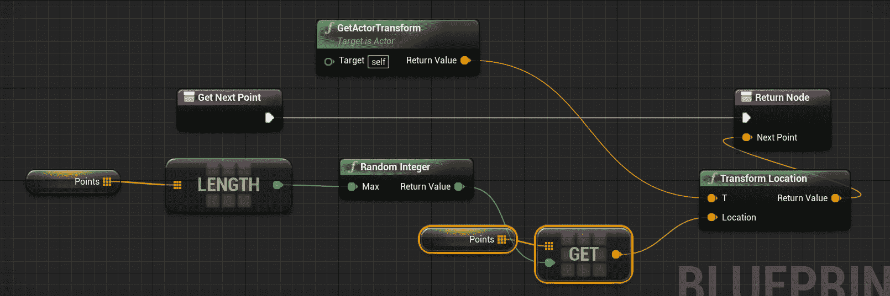

图 13.34:GetNextPoint 函数的最终逻辑设置

注意

您可以在以下链接找到前面的全分辨率截图，以便更好地查看:[https://packt.live/35jlilb](https://packt.live/35jlilb)。

通过完成本练习，您已经在`BP_AIPoints`参与者中创建了一个新的蓝图函数，该函数从`Points`数组变量中获取随机索引，使用`Transform Location`函数将其转换为世界空间向量值，并返回该新向量值。你将在`BTTask_FindLocation`任务里面，在 AI 行为树里面使用这个功能，这样敌人就会移动到你设置的一个点。在你这样做之前，敌方人工智能需要一个`BP_AIPoints`演员的参考，这样它就知道可以选择和移动到哪些点。我们将在下面的练习中这样做。

## 练习 13.09:参考巡逻点演员

现在`BP_AIPoints`行动者有了一个从其矢量巡逻点数组返回随机变换位置的函数，你需要让敌方 AI 在关卡中引用这个行动者，这样它就知道要引用哪些巡逻点了。要做到这一点，你将添加一个新的`Object Reference`变量到敌人角色蓝图中，并分配你之前在你的关卡中放置的`BP_AIPoints`演员。本练习将在虚幻引擎 4 编辑器中进行。让我们从添加*对象引用*开始。

注意

一个`Object Reference Variable`存储对特定类对象或参与者的引用。有了这个引用变量，您就可以访问这个类公开的变量、事件和函数。

以下步骤将帮助您完成本练习:

1.  导航至`/Enemy/Blueprints/`目录，在`Content Browser`界面双击打开敌方角色蓝图`BP_Enemy`。
2.  创建一个`BP_AIPoints`类型的新变量，并确保变量类型为`Object Reference`。
3.  为了引用您的级别中现有的`BP_AIPoints`演员，您需要通过启用`Instance Editable`参数使上一步的变量成为`Public Variable`。命名这个变量`Patrol Points`。
4.  Now that you have the object reference set, navigate to your level and select your enemy AI. The following screenshot shows the enemy AI placed in the provided example level; that is, `SuperSideScroller.umap`. If you don't have an enemy placed in your level, please do so now:

    注意

    将一个敌人放入一个关卡的工作原理与虚幻引擎 4 中的其他演员相同。*左键点击*，将敌方 AI 蓝图从内容浏览器界面拖拽到关卡中。

    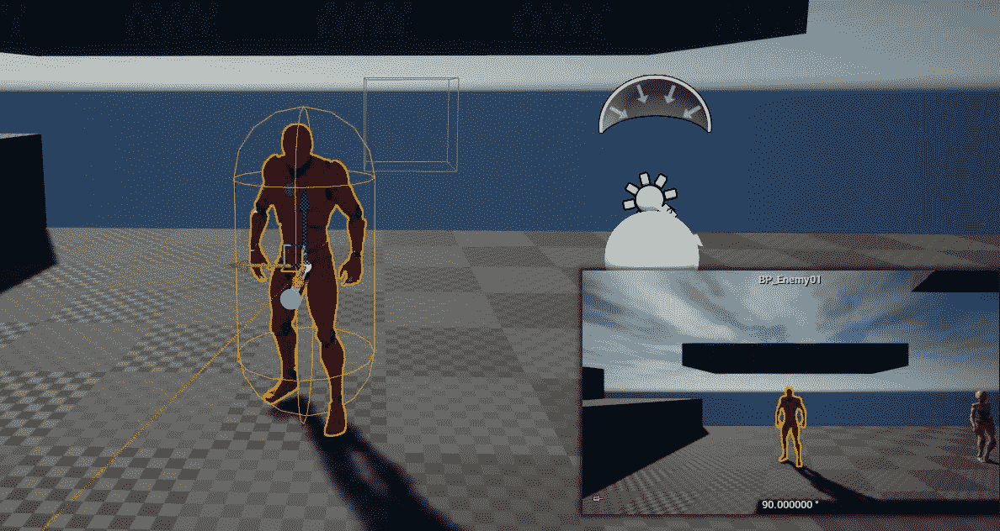

    图 13.35:敌人的人工智能被放置在示例级超视频中

5.  从其`Details`面板中，找到`Default` 类别下的`Patrol Points`变量。这里要做的最后一件事是分配我们已经在*练习 13.07* 、*创建敌人巡逻位置*中放置的`BP_AIPoints`演员。通过*左键单击`Patrol Points`变量的下拉菜单*并从列表中找到演员来完成。

这个练习完成后，你所在等级的敌方 AI 现在有了对你所在等级`BP_AIPoints`演员的引用。有了有效的参考，敌人 AI 可以使用这个演员来决定在`BTTask_FindLocation`任务内部移动哪组点。现在剩下要做的就是更新`BTTask_FindLocation`任务，让它使用这些点，而不是找到一个随机的位置。

## 练习 13.10:更新 BTTask_FindLocation

完成敌方 AI 巡逻行为的最后一步是替换`BTTask_FindLocation`内部的逻辑，使其使用`BP_AIPoints`演员的`GetNextPoint`功能，而不是在你所在等级的可导航空间内寻找随机位置。本练习将在虚幻引擎 4 编辑器中进行。

提醒一下，在开始之前，回头看看*练习 13.05* 、*创建新行为树任务*结束时`BTTask_FindLocation`任务是什么样子的。

以下步骤将帮助您完成本练习:

1.  The first thing to do is take the returned `Controlled Pawn` reference from `Event Receive Execute AI` and cast it to `BP_Enemy`, as shown in the following screenshot. This way, you can access the `Patrol Points` object reference variable from the previous exercise:

    

    图 13.36:施法还能确保返回的受控棋子属于敌人类

2.  接下来，您可以通过*左键单击*并从演员表下的`As BP Enemy`引脚拖动到`BP_Enemy`并通过上下文相关搜索找到`Patrol Points`来访问`Patrol Points`对象引用变量。
3.  从`Patrol Points`参考中，您可以*左键单击*并拖动以搜索您在*练习 13.08* 、*中创建的`GetNextPoint`功能选择阵列中的随机点*。
4.  现在，您可以将`GetNextPoint`功能的`NextPoint`矢量输出参数连接到`Set Blackboard Value as Vector`功能，并将 cast 的执行引脚连接到`Set Blackboard Value as Vector`功能。现在，每次执行`BTTask_FindLocation`任务时，都会设置一个新的随机巡逻点。
5.  最后，将`Set Blackboard Value as Vector`功能连接到`Finish Execute`功能，并将`Success`参数手动设置为`True`，这样，如果演职成功，该任务将始终成功。
6.  As a failsafe, create a duplicate of `Finish Execute` and connect to the `Cast Failed` execution pin of the `Cast` function. Then, set the `Success` parameter to `False`. This will act as a failsafe so that if, for any reason, `Controlled Pawn` is not of the `BP_Enemy` class, the task will fail. This is a good debugging practice to ensure the functionality of the task for its intended AI class:

    

图 13.37:考虑逻辑中的任何转换失败总是一种好的做法

注意

您可以在以下链接找到前面的全分辨率截图，以便更好地查看:[https://packt.live/3n58THA](https://packt.live/3n58THA)。

随着`BTTask_FindLocation`任务更新为在敌人中使用来自`BP_AIPoints`演员参考的随机巡逻点，敌人 AI 现在将在巡逻点之间随机移动。

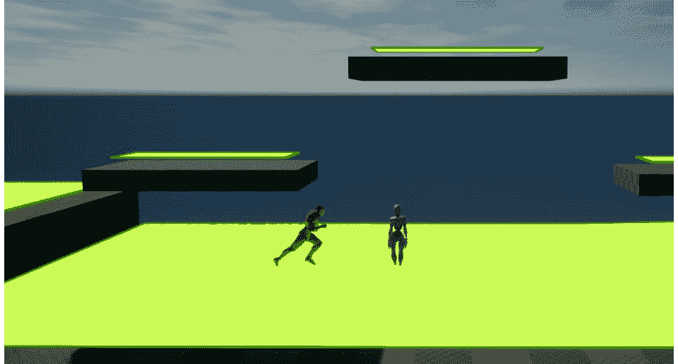

图 13.38:敌人人工智能现在在关卡中巡逻点位置之间移动

完成这个练习后，敌人 AI 现在使用对关卡中`BP_AIPoints`演员的引用来找到并移动到关卡中的巡逻点。关卡中敌人角色的每个实例都可以有自己对`BP_AIPoints`角色的另一个唯一实例的引用，或者可以共享同一个实例引用。这取决于你希望每个敌人的人工智能在整个关卡中如何移动。

# 玩家投射物

在本章的最后一节，你将专注于创建玩家投射物的基础，它可以用来消灭敌人。目标是创建适当的演员类，向该类引入所需的碰撞和射弹运动组件，并为射弹的运动行为设置必要的参数。

为了简单起见，玩家射弹不会使用重力，一击就能消灭敌人，射弹本身打到任何表面都会被消灭；例如，它不会从墙上反弹。玩家投射物的主要目标是拥有一个玩家可以在整个关卡中繁殖并用来消灭敌人的投射物。在本章中，您将设置基本的框架功能，而在*第 14 章*、*中，您将添加声音和视觉效果。让我们从创建玩家投射类开始。*

## 练习 13.11:创建玩家投射物

到目前为止，我们一直在虚幻引擎 4 编辑器中努力创建我们的敌人人工智能。对于玩家投射物，我们将使用 C++ 和 Visual Studio 来创建这个新类。玩家投射物将允许玩家摧毁放置在关卡中的敌人。这种射弹寿命短，速度快，会与敌人和环境相撞。

本练习的目标是为玩家投射体设置基本 actor 类，并开始概述投射体头文件中所需的功能和组件。

以下步骤将帮助您完成本练习:

1.  First, you will need to create a new C++ class using the `Actor` class as the parent class for the player projectile. Next, name this new actor class `PlayerProjectile` and *left-click* on the `Create Class` option at the bottom-right of the menu prompt.

    创建新类后，Visual Studio 将为该类生成所需的源文件和头文件，并为您打开这些文件。actor 基类附带了一些默认函数，玩家投射不需要这些函数。

2.  Find the following lines of code inside the `PlayerProjectile.h` file and remove them:

    ```cpp
    protected:
      // Called when the game starts or when spawned
      virtual void BeginPlay() override;
    public:
      // Called every frame
      virtual void Tick(float DeltaTime) override;
    ```

    这些代码行代表了默认情况下包含在每个基于 Actor 的类中的`Tick()`和`BeginPlay()`函数的声明。`Tick()`功能在每一帧都被调用，并允许你在每一帧上执行逻辑，这可能会变得昂贵，这取决于你正在尝试做什么。当该演员初始化，游戏开始时，调用`BeginPlay()`功能。这可以用来在演员一进入这个世界就对其执行逻辑。这些功能正在被删除，因为它们不是`Player Projectile`所需要的，只会把代码弄得一团糟。

3.  After removing these lines from the `PlayerProjectile.h` header file, you can now remove the following lines from the `PlayerProjectile.cpp` source files as well:

    ```cpp
    // Called when the game starts or when spawned
    void APlayerProjectile::BeginPlay()
    {
      Super::BeginPlay();
    }
    // Called every frame
    void APlayerProjectile::Tick(float DeltaTime)
    {
      Super::Tick(DeltaTime);
    }
    ```

    这些代码行代表您在上一步中删除的两个函数的函数实现；即`Tick()`和`BeginPlay()`。同样，这些被删除是因为它们对`Player Projectile`没有任何作用，只是给代码增加了混乱。此外，如果没有`PlayerProjectile.h`头文件中的声明，如果您试图按原样编译这段代码，您将会收到一个编译错误。剩下的唯一函数是投射类的构造函数，您将在下一个练习中使用它来初始化投射的组件。现在您已经从`PlayerProjectile`类中删除了不必要的代码，让我们添加射弹所需的功能和组件。

4.  Inside the `PlayerProjectile.h` header file, add the following components. Let's discuss these components in detail:

    ```cpp
    public:
      //Sphere collision component
      UPROPERTY(VisibleDefaultsOnly, Category = Projectile)
      class USphereComponent* CollisionComp;

    private:
      //Projectile movement component
      UPROPERTY(VisibleAnywhere, BlueprintReadOnly, Category = Movement, meta =   (AllowPrivateAccess = "true"))
      class UProjectileMovementComponent* ProjectileMovement;
      //Static mesh component
      UPROPERTY(VisibleDefaultsOnly, Category = Projectile)
      class UStaticMeshComponent* MeshComp;
    ```

    您在这里添加了三个不同的组件。第一个是碰撞组件，您将使用它来识别与敌人和环境资产的碰撞。下一个组件是投射物运动组件，您应该从上一个项目中熟悉它。这将允许射弹表现得像射弹。最后的组件是静态网格组件。你将使用这个来给这个投射物一个视觉表示，这样它就可以在游戏中被看到。

5.  Next, add the following function signature code to the `PlayerProjectile.h` header file, under the `public` access modifier:

    ```cpp
    UFUNCTION()
    void OnHit(UPrimitiveComponent* HitComp, AActor* OtherActor,   UPrimitiveComponent* OtherComp, FVector NormalImpulse, const FHitResult&   Hit);
    ```

    这个最终的事件声明将允许玩家投射物从您在上一步中创建的`CollisionComp`组件中响应`OnHit`事件。

6.  Now, in order to have this code compile, you will need to implement the function from the previous step in the `PlayerProjectile.cpp` source file. Add the following code:

    ```cpp
    void APlayerProjectile::OnHit(UPrimitiveComponent* HitComp, AActor*   OtherActor, UPrimitiveComponent* OtherComp, FVector NormalImpulse, const   FHitResult& Hit)
    {
    }
    ```

    `OnHit`事件为您提供了许多关于发生碰撞的信息。您将在下一个练习中使用的最重要的参数是`OtherActor`参数。`OtherActor`参数将告诉您这个`OnHit`事件响应的演员。这将让你知道另一个演员是否是敌人。当炮弹击中敌人时，你将利用这些信息消灭他们。

7.  最后，导航回虚幻引擎编辑器，左键点击`Compile`选项编译新代码。

完成本练习后，您现在已经为`Player Projectile`课准备好了框架。该类具有`Projectile Movement`、`Collision`和`Static Mesh`所需的组件，以及为`OnHit`碰撞准备的事件签名，以便射弹可以识别与其他演员的碰撞。

在下一个练习中，您将继续为`Player Projectile`定制和启用参数，以便它按照您需要的方式为`SuperSideScroller`项目工作。

## 练习 13.12:初始化玩家投射物设置

现在`PlayerProjectile`类的框架已经就位，是时候用投射体所需的默认设置来更新这个类的构造函数了，这样它就可以按照您想要的方式移动和表现了。为此，您需要初始化`Projectile Movement`、`Collision`和`Static Mesh`组件。

以下步骤将帮助您完成本练习:

1.  打开 Visual Studio，导航至`PlayerProjectile.cpp`源文件。
2.  Before adding any code to the constructor, include the following files inside the `PlayerProjectile.cpp` source file:

    ```cpp
    #include "GameFramework/ProjectileMovementComponent.h"
    #include "Components/SphereComponent.h"
    #include "Components/StaticMeshComponent.h"
    ```

    这些头文件将允许您分别初始化和更新射弹运动组件、球体碰撞组件和静态网格组件的参数。如果不包含这些文件，`PlayerProjectile`类就不知道如何处理这些组件以及如何访问它们的函数和参数。

3.  By default, the `APlayerProjectile::APlayerProjectile()` constructor function includes the following line:

    ```cpp
    PrimaryActorTick.bCanEverTick = true;
    ```

    这一行代码可以完全删除，因为它不是玩家投射体所必需的。

4.  In the `PlayerProjectile.cpp` source file, add the following lines to the `APlayerProjectile::APlayerProjectile()` constructor:

    ```cpp
    CollisionComp = CreateDefaultSubobject   <USphereComponent>(TEXT("SphereComp"));
    CollisionComp->InitSphereRadius(15.0f);
    CollisionComp->BodyInstance.SetCollisionProfileName("BlockAll");
    CollisionComp->OnComponentHit.AddDynamic(this, &APlayerProjectile::OnHit);
    ```

    第一行初始化球体碰撞组件，并将其分配给您在上一个练习中创建的`CollisionComp`变量。`Sphere Collision Component`有一个参数叫做`InitSphereRadius`。默认情况下，这将决定碰撞执行器的大小或半径；在这种情况下，`15.0f`的值很有效。接下来，将碰撞组件的`Collision Profile Name`设置为`BlockAll`，从而将碰撞轮廓设置为`BlockAll`，这意味着该碰撞组件在与其他物体碰撞时将响应`OnHit`。最后，您添加的最后一行允许`OnComponentHit`事件使用您在上一个练习中创建的功能进行响应:

    ```cpp
    void APlayerProjectile::OnHit(UPrimitiveComponent* HitComp, AActor*   OtherActor, UPrimitiveComponent* OtherComp, FVector NormalImpulse, const   FHitResult& Hit)
    {
    }
    ```

    这意味着当碰撞组件从碰撞事件中接收到`OnComponentHit`事件时，它将使用该功能进行响应；然而，这个功能目前是空的。在本章的后面，您将向该函数添加代码。

5.  最后一件与`Collision Component`相关的事情是将这个组件设置为玩家投射物演员的`root`组件。在*第 4 步*的代码行之后，在构造函数中添加以下代码行:

    ```cpp
    // Set as root component
    RootComponent = CollisionComp;
    ```

6.  With the collision component set up and ready, let's move on to the `Projectile Movement` component. Add the following lines to the constructor:

    ```cpp
    // Use a ProjectileMovementComponent to govern this projectile's movement
    ProjectileMovement =   CreateDefaultSubobject<UProjectileMovementComponent>
    (TEXT("ProjectileComp"))  ;
    ProjectileMovement->UpdatedComponent = CollisionComp;
    ProjectileMovement->ProjectileGravityScale = 0.0f;
    ProjectileMovement->InitialSpeed = 800.0f;
    ProjectileMovement->MaxSpeed = 800.0f;
    ```

    第一行初始化`Projectile Movement Component`，并将其分配给您在上一练习中创建的`ProjectileMovement`变量。接下来，我们将`CollisionComp`设置为射弹运动组件的更新组件。我们这样做的原因是因为`Projectile Movement`组件将使用演员的`root`组件作为要移动的组件。然后，你正在将弹体的重力刻度设置为`0.0f`，因为玩家弹体应该不会受到重力的影响；该行为应该允许射弹以相同的速度、相同的高度行进，并且不受重力的影响。最后，将`InitialSpeed`和`MaxSpeed`参数设置为`500.0f`。这将允许射弹立即以这个速度开始运动，并在其寿命期间保持这个速度。玩家的投射物将不支持任何形式的加速运动。

7.  With the projectile movement component initialized and set up, it is time to do the same for `Static Mesh Component`. Add the following code after the lines from the previous step:

    ```cpp
    MeshComp = CreateDefaultSubobject<UStaticMeshComponent>(TEXT("MeshComp"));
    MeshComp->AttachToComponent(RootComponent,   FAttachmentTransformRules::KeepWorldTransform);
    ```

    第一行初始化`Static Mesh Component`，并将其分配给您在上一练习中创建的`MeshComp`变量。然后，使用名为`FAttachmentTransformRules` 的结构将此静态网格组件附加到`RootComponent`上，以确保`Static Mesh Component`在此练习的*步骤 5* 开始的附加过程中保持其世界变换。

    注意

    你可以在这里找到更多关于`FAttachmentTransformRules`结构的信息。

8.  最后，让我们给`Player Projectile`一个`3`秒的初始寿命，这样在这个时间之后，如果炮弹没有碰撞到任何东西，它就会自动被摧毁。在构造函数的末尾添加以下代码:

    ```cpp
    InitialLifeSpan = 3.0f;
    ```

9.  最后，导航回虚幻引擎编辑器，左键点击`Compile`选项编译新代码。

通过完成本练习，您已经为`Player Projectile`奠定了基础，这样就可以在编辑器中将其创建为*蓝图*演员。所有三个必需的组件都已初始化，并包含您想要的该射弹的默认参数。我们现在需要做的就是从这个类创建*蓝图*来查看它的等级。

## 活动 13.03:创建玩家射弹蓝图

为了结束本章，您将从新的`PlayerProjectile`类中创建`Blueprint`执行元，并自定义该执行元，以便它使用`Static Mesh Component`的占位符形状进行调试。这可以让你在游戏世界中看到投射物。然后，您将在`PlayerProjectile.cpp`源文件内的`APlayerProjectile::OnHit`函数中添加一个`UE_LOG()`函数，这样您就可以确保当射弹接触到关卡中的对象时调用该函数。您需要执行以下步骤:

1.  在`Content Browser`界面内，在`/MainCharacter`目录中创建新文件夹`Projectile`。
2.  在此目录中，从您在*练习 13.11* 、*创建玩家投射体*中创建的`PlayerProjectile`类创建一个新蓝图。命名这个蓝图`BP_PlayerProjectile`。
3.  打开`BP_PlayerProjectile`并导航至其组件。选择`MeshComp`组件以访问其设置。
4.  将`Shape_Sphere`网格添加到`MeshComp` 组件的静态网格参数中。
5.  更新`MeshComp`的变换，使其适合`Scale and Location of the CollisionComp`组件。使用以下值:

    ```cpp
    Location:(X=0.000000,Y=0.000000,Z=-10.000000)
    Scale: (X=0.200000,Y=0.200000,Z=0.200000)
    ```

6.  编辑并保存`BP_PlayerProjectile`蓝图。
7.  在 Visual Studio 中导航到`PlayerProjectile.cpp`源文件，找到`APlayerProjectile::OnHit`功能。
8.  在该功能中，执行`UE_LOG`调用，使记录的线路为`LogTemp`、`Warning log level`，并显示文本`HIT`。`UE_LOG`在*第 11 章*、*混合空间 1D、键绑定和状态机*中有所涉及。
9.  编译您的代码更改，并导航到您在上一练习中放置`BP_PlayerProjectile`参与者的级别。如果你没有把这个演员加到关卡中，现在就加。
10.  测试前，确保在`Window`选项中打开输出日志。从`Window`下拉菜单中，将鼠标悬停在`Developers Tools`选项上，然后*左键单击*选择`Output Log`。
11.  Use `PIE` and watch out for the log warning inside `Output Log` when the projectile collides with something.

    以下是预期输出:

    

图 13.39:网格组件的比例更适合碰撞组件的大小

日志警告应如下所示:


图 13.40:当射弹击中一个物体时，文本 HIT 显示在输出日志中

随着这个最终活动的完成，`Player Projectile`为下一章做好了准备，当玩家使用`Throw`动作时，你将产生这个投射物。你将更新`APlayerProjectile::OnHit`功能，使其摧毁与之碰撞的敌人，成为玩家对抗敌人的有效进攻工具。

注意

这个活动的解决方案可以在:[https://packt.live/338jEBx](https://packt.live/338jEBx)找到。

# 总结

在本章中，您学习了如何使用虚幻引擎 4 提供的人工智能工具的不同方面，包括黑板、行为树和人工智能控制器。结合自定义创建的任务和虚幻引擎 4 提供的默认任务，以及装饰器，你可以让敌人的人工智能在你添加到自己的导航网格的边界内导航。

除此之外，你创建了一个新的蓝图演员，允许你使用`Vector`数组变量添加巡逻点。然后你给这个角色添加了一个新的函数，随机选择这些点中的一个，将其位置从本地空间转换到世界空间，然后返回这个新值供敌方角色使用。

有了随机选择一个巡逻点的能力，你更新了自定义`BTTask_FindLocation`任务找到并移动到选中的巡逻点，让敌人可以从每个巡逻点随机移动。这使得敌人的人工智能角色与玩家和环境的互动达到了一个全新的水平。

最后，你创造了玩家可以用来消灭环境中的敌人的玩家投射物。你利用了`Projectile Movement Component`和`Sphere Component`来允许投射物运动，并识别和响应环境中的碰撞。

玩家投射物处于功能状态，是时候进入下一章了，当玩家使用`Throw`动作时，你将使用`Anim Notifies`来产生投射物。*