# 五、应用分析和调试

CUDA 为开发者提供了很多编程工具。这些工具是编译器、分析器、集成开发环境及其插件、调试器和内存检查器。了解这些工具将帮助您分析您的应用，并帮助您完成我们将要介绍的开发项目。在本章中，我们将介绍这些工具的基本用法，并讨论如何将它们应用于应用开发。

本章将涵盖以下主题:

*   GPU 应用中聚焦目标范围的剖析
*   针对远程计算机的可视化分析
*   调试有 CUDA 错误的 CUDA 应用
*   使用 CUDA 断言来断言本地 GPU 值
*   用 Nsight Visual Studio 版调试 CUDA 应用
*   用 Nsight Eclipse 版调试 CUDA 应用
*   用 CUDA-GDB 调试 CUDA 应用
*   利用 CUDA-memcheck 进行运行时验证

# 技术要求

要完成本章，建议您使用比帕斯卡架构更晚的 NVIDIA GPU 卡。换句话说，你的图形处理器的计算能力应该等于或大于 60。如果您不确定您的 GPU 的架构，请访问英伟达的网站[https://developer.nvidia.com/cuda-gpus](https://developer.nvidia.com/cuda-gpus)，并确认您的 GPU 的计算能力。

本章的示例代码已经用 CUDA 工具包的 10.1 版进行了开发和测试。一般来说，如果适用，建议您使用最新的 CUDA 版本。

# GPU 应用中聚焦目标范围的剖析

英伟达的视觉分析器是一个方便的工具，用于发现 GPU 应用中的瓶颈并了解它们的操作。虽然它提供了流畅的应用操作信息，但如果您只想专注于特定的代码领域，这些信息可能是多余的。在这种情况下，限制分析的范围更有成效。

剖析目标可以是特定的代码块、GPU 和时间。指定代码块被称为**聚焦剖析**。当您希望专注于特定内核函数的分析，或者大型 GPU 应用的分析时，这种技术非常有用。锁定图形处理器或时间将在我们介绍重点分析之后介绍。

# 在代码中限制分析目标

为了从重点分析中获益，您可能希望在源代码中包含特色头文件，如下所示:

```cpp
#include <cuda_profiler_api.h>
```

然后，您可以使用`cudaProfilerStart()`和`cudaProfilerStop()`指定您的分析目标范围:

```cpp
cudaProfilerStart();
... {target of profile} ...
cudaProfilerStop();
```

现在，您需要用一个特定的标志`--profile-from-start`来描述您的应用。

在请求到达之前，此选项不会让探查器开始探查。如果您想使用英伟达可视化评测器来评测您的应用，请确保在设置视图中勾选“在启用评测的情况下开始执行”复选框。

以下步骤介绍了如何使用一些简单的示例代码来控制 NVIDIA profiler。为了使这变得更容易，我们将重用我们在[第 3 章](03.html)、 *CUDA 线程编程*中用于操作矩阵乘法的示例代码:

1.  用两个简单的 SGEMM CUDA 内核函数编写一个 CUDA 应用。内核函数相同但名称不同，即`sgemm_kernel_A()`和`sgemm_kernel_B()`。
2.  进行两次迭代调用，如下所示:

```cpp
int n_iter = 5;
for (int i = 0; i < n_iter; i++)
    sgemm_gpu_A(d_A, d_B, d_C, N, M, K, alpha, beta);
for (int i = 0; i < n_iter; i++)
    sgemm_gpu_B(d_A, d_B, d_C, N, M, K, alpha, beta);
```

3.  现在，让我们使用`nvprof`来编译代码和概要文件:

```cpp
$ nvcc -m64 -gencode arch=compute_70,code=sm_70 -o sgemm sgemm.cu
$ nvprof -f -o profile-original.nvvp ./sgemm
```

当您使用可视化探查器打开生成的`profile-original.nvvp`文件时，您将获得如下分析结果:


该时间表包括应用启动时的完整概要信息。然而，当我们想要优化我们的内核函数时，我们可以说概要结果包含不必要的信息。

以下步骤介绍了如何指定轮廓聚焦区域:

1.  将`#include <cuda_profiler_api.h>`放在源代码的顶部，以启用聚焦的概要文件 API。然后，我们可以拥抱我们感兴趣使用`cudaProfilerStart()`和`cudaProfilerStop()`的区域，如下所示:

```cpp
cudaProfilerStart();
for (int i = 0; i < n_iter; i++)
    sgemm_gpu_B(d_A, d_B, d_C, N, M, K, alpha, beta);
cudaProfilerStop();
```

2.  编译您的代码，并使用可视化探查器查看更新的分析结果。我们必须向探查器提供`--profile-from-start off`选项，如下所示:

```cpp
$ nvcc -m64 -gencode arch=compute_70,code=sm_70 -o sgemm sgemm.cu
$ nvprof -f -o profile-start-stop.nvvp --profile-from-start off ./sgemm
```

当您打开新生成的配置文件结果时，探查器仅报告应用的指定部分，如下所示:


配置文件结果受到限制。前面的截图显示了内核从开始执行 GPU 时的执行情况。因此，您可以不必分析应用的初始化和其他不相关的操作。

总之，重点简介有以下几个好处:

*   它帮助你专注于你正在开发的模块。
*   它允许您从探查器的报告中删除不相关的操作，例如:

    *   与您的代码没有任何关系的外部模块行为
    *   应用初始化延迟
*   在时间轴视图中查找目标函数时，它可以帮助您节省时间。

# 用时间或图形处理器限制剖析目标

NVIDIA profiler 还有其他选项可以限制配置文件目标。您也可以使用以下选项进行重点分析:

*   `--timeout <second>`选项限制应用执行时间。当您需要通过迭代操作来分析执行时间较长的应用时，此选项非常有用。
*   `--devices <gpu ids>`选项指定要分析的图形处理器。此选项可帮助您缩小多图形处理器应用中图形处理器内核操作的范围。

此外，如果您只想关注少数几个内核函数，则不必收集所有的度量。您可以通过`--kernels`、`--event`和`--metrics`选项向轮廓仪表达您的兴趣。您可以将这些选项与其他配置文件选项一起使用，如下所示:

```cpp
$ nvprof -f -o profile_kernels_metric.nvvp --kernels sgemm_kernel_B --metrics all ./sgemm
```

在将收集的度量导入时间线概要文件结果后，您将发现目标内核只有度量信息。

There are many other versatile profile features in CPU sampling, such as marking profile range, OpenMP and OpenACC profiles, and so on. If you want to take a look at the features of the NVIDIA profiler, check out the following profiler introduction talk by Jeff Larkin from NVIDIA: [https://www.olcf.ornl.gov/wp-content/uploads/2018/12/summit_workshop_Profilers.pdf](https://www.olcf.ornl.gov/wp-content/uploads/2018/12/summit_workshop_Profilers.pdf).

NVIDIA's official profiler user guide provides details about the NVIDIA profiler's functions ([https://docs.nvidia.com/cuda/profiler-users-guide/index.html](https://docs.nvidia.com/cuda/profiler-users-guide/index.html.)). 

# 使用 NVTX 进行分析

通过聚焦剖析，我们可以使用`cudaProfilerStart()`和`cudaProfilerStop()`来剖析有限的特定区域。然而，如果我们想要分析复杂应用中的功能性能，它是有限的。对于这种情况，CUDA 探查器通过 **NVIDIA 工具扩展** ( **NVTX** )提供时间线注释。

使用 NVTX，我们可以注释 CUDA 代码。我们可以如下使用 NVTX 应用编程接口:

```cpp
nvtxRangePushA("Annotation");
.. { Range of GPU operations } ..
cudaDeviceSynchronization();     // in case if the target code block is pure kernel calls
nvtxRangePop();
```

如您所见，我们可以将一个范围定义为一组代码，并手动注释该范围。然后，CUDA 探查器提供了注释的时间线跟踪，这样我们就可以测量代码块的执行时间。这样做的一个缺点是 NVTX APIs 是主机函数，所以如果目标代码块是纯 GPU 内核调用，我们需要同步主机和 GPU。

为了进一步了解这一点，让我们将这个 NVTX 代码应用到前面的重点分析示例中。首先，我们应该包含一个 NVTX 头文件，如下所示:

```cpp
#include "nvToolsExt.h"
```

然后，我们将`nvtxRangePushA()`和`nvtxRangePop()`插入几个地方，如下:

```cpp
    cudaProfileStart();
    // copy initial value for gpu memory
    nvtxRangePushA("Data Transfer");
    cudaMemcpy(d_A, A, N * K * sizeof(float), cudaMemcpyHostToDevice);
    cudaMemcpy(d_B, A, K * M * sizeof(float), cudaMemcpyHostToDevice);
    cudaMemcpy(d_C, A, N * M * sizeof(float), cudaMemcpyHostToDevice);
    nvtxRangePop();

    nvtxRangePushA("Kernel Execution");
    // do operation
    nvtxRangePushA("Kernel A");
    for (int i = 0; i < n_iter; i++)
        sgemm_gpu_A(d_A, d_B, d_C, N, M, K, alpha, beta);
    cudaDeviceSynchronize();
    nvtxRangePop();    // Kernel A

    nvtxRangePushA("Kernel B");
    for (int i = 0; i < n_iter; i++)
        sgemm_gpu_B(d_A, d_B, d_C, N, M, K, alpha, beta);
    cudaDeviceSynchronize();

    nvtxRangePop();    // Kernel B
    nvtxRangePop();    // Kernel Execution
    cudaProfileStop();
```

在前面的代码中，我们扩大了聚焦轮廓区域，以监控 NVTX 操作。我们还有`Data Transfer`、`Kernel A`、`Kernel B`和`Kernel Execution`作为 NVTX 范围。NVTX 支持多级标注，因此`Kernel A`和`Kernel B`范围将包含在`Kernel Execution`时间线中。

为了编译代码，我们应该向`nvcc`编译器提供`-lnvToolsExt`选项，以提供 NVTX API 的定义。我们可以使用以下命令编译代码:

```cpp
$ nvcc -m64 -gencode arch=compute_70,code=sm_70 -lnvToolsExt -o sgemm sgemm.cu
```

然后，NVIDIA profiler 可以在没有额外选项的情况下收集 NVTX 注释。我们可以使用以下命令分析应用:

```cpp
$ nvprof -f --profile-from-start off -o sgemm.nvvp ./sgemm.nvvp
```

以下屏幕截图显示了时间线分析结果。在这个截图中，我们可以看到绿色的标记和范围。这些绿色条有注释:


前面的截图为我们提供了以下信息:

*   我们可以识别在 NVTX 注释之后调用内存复制操作的位置。
*   我们可以通过包裹区域来划分功能位置，例如`kernel A`和`kernel B`。
*   NVTX 注释可以堆叠多级注释。我们可以看到，`kernel A`和`kernel B`包含在`kernel execution`注释中。

以下文档不仅介绍了 NVTX，还解释了如何使用 NVTX 使用不同的颜色:[https://dev blogs . NVIDIA . com/cuda-pro-tip-generate-custom-application-profile-timeline-NVTX](https://devblogs.nvidia.com/cuda-pro-tip-generate-custom-application-profile-timelines-nvtx)。NVTX 的应用之一是用 NVTX 注释来描述深度学习网络。这提供了对网络运行瓶颈的洞察。我们将在本书第 10 章*用 CUDA* 进行深度学习加速中讨论这一点。

# 针对远程计算机的可视化分析

NVIDIA 可视化探查器还可以分析远程应用。当涉及到远程应用开发时，特别是当您在服务器端开发应用时，这个特性简化了分析任务。

有几种使用可视化 profilers 的方法，如下所示:

*   使用主机 CUDA 应用在主机上进行分析
*   通过使用目标端的`nvprof` CLI 收集配置文件数据，将文件复制到主机，并使用可视化 Profiler 打开它
*   使用主机在目标平台上分析应用

直接在主机中进行可视化概要分析既方便又能节省开发时间。此外，远程分析提供了与分析主机上的图形处理器应用相同的用户体验。一个例外是我们应该建立远程连接。操作系统主机管理的可视化分析提供的另一个好处是，分析工具可以按需自动收集度量信息。

NVIDIA profiler 与主机中的 NVIDIA profiler 通信，并收集分析数据。因此，您需要确认您的主机(台式机或笔记本电脑)应该连接到远程机器。下图显示了此连接的概述:

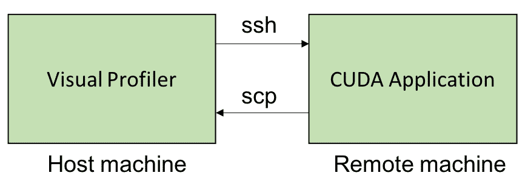

让我们尝试远程剖析一个 GPU 应用。以下步骤介绍了如何在 NVIDIA 可视化探查器中分析远程图形处理器应用:

1.  首先，转到文件|新会话。单击“新建会话”菜单时，您将看到以下对话框窗口:

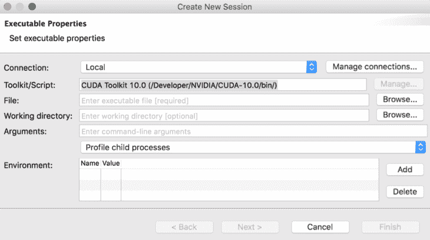

2.  然后，我们需要添加一个连接，这是通过转到管理连接来完成的...菜单。然后，将出现新建远程连接对话框。单击“添加”按钮，将您的远程计算机信息放入相应的部分，以添加您的远程计算机信息。然后，单击“完成”按钮关闭对话框。完成后，您将看到以下输出:


如前所述，主机和远程机器通过 SSH 通信，SSH 的默认端口号是 22。如果主机使用另一个端口进行 SSH，您必须在新的远程会话创建对话框中通知它该端口号。

3.  现在，我们需要通过单击“管理”在远程机器中设置 CUDA 工具包路径...工具箱/脚本*右侧的按钮。*一个好的开始是使用检测按钮。找到`nvcc`路径，自动设置配置信息。如果自动检测失败，您必须手动输入配置信息。完成配置过程后，单击“完成”按钮，如下所示:

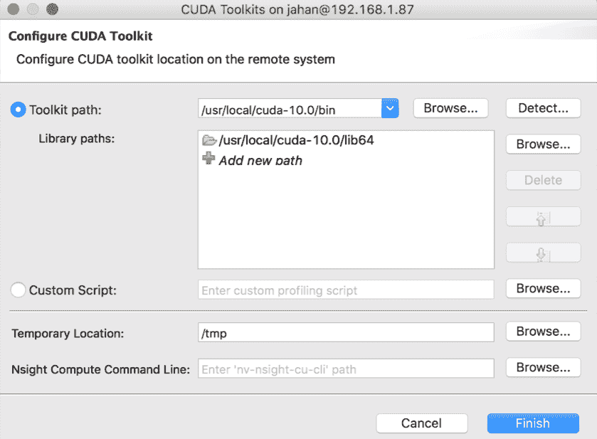

4.  单击文件文本框右侧的浏览按钮，指定图形处理器应用的二进制文件。它会询问您的远程机器登录密码。找到您的应用路径并设置应用的路径。如果需要控制应用的行为，也可以放入应用的参数。设置完应用和连接后，单击“下一步”按钮设置探查器的选项。

5.  现在，我们将设置分析选项。NVIDIA 可视化探查器允许我们使用复选框设置探查器的选项，如下图所示。通过单击“完成”，探查器从应用收集配置文件数据:


您将看到在主机上分析的时间线分析输出。

4.  最后，分析概要时间轴图的性能。单击要分析的任何内核函数。单击执行内核分析按钮；探查器工具将收集相关的度量信息。通过这样做，您可以快速获得关于性能限制器的报告，并找到内核函数的瓶颈。

# 调试有 CUDA 错误的 CUDA 应用

拥有专门的异常检查和错误检查是高质量软件的基本特征之一。CUDA 函数通过返回每个函数调用的状态来报告错误。不仅仅是 CUDA APIs，内核函数和 CUDA 库的 API 调用都遵循这个规则。因此，检测重复出现的错误是识别 CUDA 执行中错误的开始。例如，假设我们已经使用`cudaMalloc()`函数分配了全局内存，如下所示:

```cpp
cudaMalloc((void**)&ptr, byte_size);
```

如果全局内存没有足够的可用空间来分配新的内存空间怎么办？在这种情况下，`cudaMalloc()`函数返回一个错误来报告内存不足异常。内核调用触发的错误可以使用`cudaGetLastError()`从标志中捕获。这将返回记录的错误状态，并重置标志的值。但是，要小心处理这个标志:它的返回不能保证错误发生在 GPU 的最后一次执行，并且标志是手动重置的。

CUDA APIs 的返回和`cudaGetLastError()`函数的返回属于`cudaError_t`类型。这个`cudaError_t`类型是一个预定义的整数类型，应用识别哪种类型的错误已经发生。例如，此类型定义如下:

```cpp
Enum cudaErorr_t {
    cudaSuccess = 0,
    cudaErrorMemoryAllocation = 2, 
    cudaErrorUnknown = 30,
    cudaErrorNoDevice = 38,
    cudaErrorAssert = 59,
    cudaErrorTooManyPeers = 60,
    cudaErrorNotSupported = 71,
    ....
};
```

记忆或翻译所有这些价值观是不切实际的。为此，CUDA 样例代码提供了一个助手函数`checkCudaError()`，它位于`common/inc/cuda_helper.h`中。当 CUDA 函数返回错误时，该函数打印出错误消息。其功能定义如下:

```cpp
#define checkCudaErrors(err) { \
    if (err != cudaSuccess) {  \

        fprintf(stderr, "checkCudaErrors() API error = %04d \"%s\" from file <%s>, line %i.\n", \
                err, cudaGetErrorString(err), __FILE__, __LINE__); \
        exit(-1); \
    } \
}
#endif
```

因为这个函数被定义为一个宏，所以我们可以识别发生错误的行。

我们有两种方法可以使用这个函数。一是在源代码中包含`cuda_helper.h`文件。或者，我们可以将函数代码复制到代码中的某个地方。

然后，我们将用`checkCudaErrors()`拥抱所有的 CUDA API 类，如下所示:

```cpp
checkCudaErrors(cudaMalloc((void **)&d_A, N * K * sizeof(float)));
checkCudaErrors(cudaMalloc((void **)&d_B, K * M * sizeof(float)));
checkCudaErrors(cudaMalloc((void **)&d_C, N * M * sizeof(float)));
```

对于内核函数调用，我们将使用`cudaGetLastError()`函数获取内核调用的错误标志，如下所示:

```cpp
sgemm_kernel_A<<<dimGrid, dimBlock>>>(A, B, C, N, M, K, alpha, beta);
checkCudaErrors(cudaGetLastError());
```

但是这段代码有一个问题:内核操作与主机异步，使得`cudaGetLastError()`只能捕捉到主机端的返回值。很有可能该错误是在应用的某个地方触发的。要解决这种情况，您可以使用任何主机和设备同步功能；例如:

```cpp
sgemm_kernel_A<<<dimGrid, dimBlock>>>(A, B, C, N, M, K, alpha, beta);
checkCudaErrors(cudaDeviceSynchronize());
```

现在，让我们通过修改源代码生成一个错误来测试错误检测代码。例如，您可以请求`cudaMemcpy`复制比分配大小更大的内存空间。在这种情况下，应用返回一条错误消息，如下所示:

```cpp
$ nvcc -run -m64 -gencode arch=compute_70,code=sm_70 -I/usr/local/cuda/samples/common/inc -lnvToolsExt -o sgemm ./sgemm.cu
CUDA error at sgemm.cu:93 code=11(cudaErrorInvalidValue) "cudaMemcpy(d_A, A, N * K * sizeof(float), cudaMemcpyHostToDevice)"
```

或者，您可以为 CUDA 内核传递一个`NULL`点，以便内核访问无效的内存空间。在这种情况下，应用在`cudaDeviceSynchronize()`中报告了一个非法地址错误:

```cpp
$ nvcc -run -m64 -gencode arch=compute_70,code=sm_70 -I/usr/local/cuda/samples/common/inc -lnvToolsExt -o sgemm ./sgemm.cu
CUDA error at sgemm.cu:104 code=77(cudaErrorIllegalAddress) "cudaDeviceSynchronize()"
```

这个错误检查宏非常有用，因为它报告了错误在源代码中出现的位置。但是，该报告有一个遗漏点，即其错误检测位置与实际错误发生位置不匹配。

错误消息应该报告我们复制大于分配内存的内存的位置，这会立即导致非法值错误。因此，开发人员可以在内核调用后立即识别错误消息。但是，这种错误检查代码只在主机上有效。因此，如果没有正确同步，这可能会混淆图形处理器的操作。例如，如果我们没有设置同步，只是检查错误，那么`cudaDeviceSynchronize()`功能可以从错误的地方报告错误。在这种情况下，我们可以设置`CUDA_LAUNCH_BLOCKING=1`环境变量，使所有内核执行与主机同步:

```cpp
$ ./sgemm
CUDA error at sgemm.cu:104 code=77(cudaErrorIllegalAddress) "cudaDeviceSynchronize()" 
$ CUDA_LAUNCH_BLOCKING=1 ./sgemm
CUDA error at sgemm.cu:36 code=77(cudaErrorIllegalAddress) "cudaGetLastError()"
```

第`sgemm.cu`行`36`是`cudaGetLastError()`呼叫，紧接在`sgemm`内核呼叫之后。这就是我们想犯的错误。我们可以在运行时识别正确的错误位置。

有两个官方文档可以帮助您了解不同类型的 CUDA 错误:

*   [https://docs . NVIDIA . com/cuda/cuda-runtime-API/group _ _ CUDART _ _ types . html](https://docs.nvidia.com/cuda/cuda-runtime-api/group__CUDART__TYPES.html)
*   `include/driver_types.h`在 CUDA 工具包根路径中

# 使用 CUDA 断言来断言本地 GPU 值

即使您的图形处理器应用工作没有任何系统错误，您也需要检查计算结果，以确保执行按照设计进行。为此，CUDA 提供了`assert`函数，检查参数值是否为零。如果是，这个函数会引发一个错误标志，这样主机就可以识别内核函数中有错误。

断言用于验证操作结果是否符合预期。在 CUDA 编程中，`assert`函数可以从设备代码中调用，并且可以在给定参数为零时停止内核的执行:

```cpp
void assert(int expression);
```

这是`assert`函数的声明，和 C/C++ 一样。当断言被触发时，应用停止并报告其错误消息。如果应用由调试器启动，它将作为断点工作，以便开发人员可以调试给定的信息。例如，输出消息如下所示:

```cpp
$ nvcc -run -m64 -gencode arch=compute_70,code=sm_70 -I/usr/local/cuda/samples/common/inc -lnvToolsExt -o sgemm ./sgemm.cu
sgemm.cu:29: void sgemm_kernel_A(const float *, const float *, float *, int, int, int, float, float): block: [16,64,0], thread: [0,0,0] Assertion `sum == 0.f` failed.     
```

由于输出消息指导确切的 CUDA 块和线程索引，开发人员可以轻松地分析被指导的 CUDA 线程的执行。

现在，让我们应用断言，看看它如何检测预期的错误。我们将修改我们在*中使用的 SGEMM 操作代码，在 GPU 应用*部分中分析聚焦目标范围。

首先，将断言代码放在内核函数的中间。我们会看到表达式的效果，应该是假的。断言代码可以编写如下:

```cpp
__global__ void sgemm_kernel_A(const float *A, const float *B, float *C, int N, int M, int K, float alpha, float beta)
  {
      int col = blockIdx.x * blockDim.x + threadIdx.x;
      int row = blockIdx.y * blockDim.y + threadIdx.y;
      float sum = 0.f;
      for (int i = 0; i < K; ++ i) 
          sum += A[row * K + i] * B[i * K + col];

      if (row == 0 && col == 0)
 assert(sum == 0.f);

      C[row * M + col] = alpha * sum + beta * C[row * M + col];
  }
```

您可以尝试其他索引值，也可以尝试其他可能的错误。编译代码并运行它以查看输出。以下代码显示了此修改的输出错误:

```cpp
sgemm.cu:29: void sgemm_kernel_A(const float *, const float *, float *, int, int, int, float, float): block: [0,0,0], thread: [0,0,0] Assertion `sum == 0.f` failed.
```

错误消息报告断言触发了代码位置、内核函数的名称和 GPU 的线程索引。有了这些信息，我们可以很容易地找到应该从哪里开始分析。

其实`assert`函数的用法和正常 C/C++ 编程中的`assert`函数是一样的。一个区别是`assert`功能在设备代码中工作。因此，它不仅报告事件位置和表达式，还显示块和线程索引。

然而，使用断言会影响应用的性能。因此，我们应该只将断言用于调试目的。当我们在生产环境中运行时，建议禁用它。通过在包含`assert.h`之前添加`NDEBUG`预处理宏，可以在编译时禁用断言。

# 用 Nsight Visual Studio 版调试 CUDA 应用

对于 Windows 应用开发人员来说，CUDA 工具包提供了 Nsight Visual Studio Edition，它可以在 Visual Studio 中实现 GPU 计算。该工具是 Visual Studio 的扩展，但是您可以与主机一起构建、调试、分析和跟踪 GPU 应用。如果你的工作平台不是 Windows，本节内容不适用，可以跳过。

CUDA 调试器允许我们监控每个 CUDA 线程的 GPU 内核上的本地值。像正常的主机调试一样，您可以在内核代码中设置断点并触发它们。您也可以放置条件，如其他正常断点。有了这个特性，您可以为特定的 CUDA 线程索引触发断点，并查看它们的局部变量。

该工具可以与 CUDA 工具包一起安装。你可以从网站上获得最新版本。它不是强制性的，但是当您的开发环境在最新的 GPU 及其驱动程序上使用旧的 CUDA 工具包时，建议使用它。访问 NVIDIA Nsight 网页([https://developer.nvidia.com/nsight-visual-studio-edition](https://developer.nvidia.com/nsight-visual-studio-edition))下载并安装 Nsight。您需要获得英伟达开发人员会员资格才能获得该软件。您还需要安装推荐的显示驱动程序版本。

您可以通过转到 Visual Studio 菜单栏中的菜单|右键来找到 CUDA 工具。该菜单中有几个工具，其中一些如下:

*   **图形调试**:图形(Direct3D、OpenGL 和 Vulkan)应用的调试器
*   **CUDA 调试(Next-Gen)** :同时调试 CPU 和 GPU 代码的调试器(图灵、Volta、Pascal 用最新的驱动)
*   **CUDA 调试(Legacy)** :一个只针对 GPU 内核的调试器(Pascal 和旧的驱动程序，Maxwell 和 Kepler)
*   **性能分析**:针对当前 GPU 应用性能的分析
*   **CUDA 内存检查器**:用于在运行时检查 GPU 内存违规情况(如前一节所述)

在本节中，我们将重点讨论 CUDA 调试(下一代)。这是因为下一代调试器可以支持最新的架构，包括图灵和 Volta。本章末尾将介绍 CUDA 内存检查器。

现在，让我们配置一个示例项目，看看如何使用 Nsight Visual Studio Edition 调试应用。您可以使用默认的示例代码，或者用我们之前介绍的 CUDA 代码替换该代码。也可以使用`05_debug/05_debug_with_vs`文件中给定的样例代码。这是一些简单的 SAXPY 代码。

设置项目属性以生成正确的设备目标代码。在项目的属性页中，可以指定目标代码版本。在 CUDA C/C++ |代码生成文本框中列出您想要使用的架构版本:

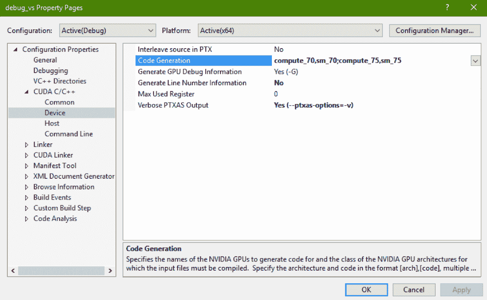

前面的截图显示了 CUDA 设备代码的生成属性页。您可以设置几个`nvcc`选项，例如目标 GPU 的计算能力、每个线程的寄存器限制以及编译时冗长的 CUDA 内核信息。

在内核函数中间的第 34 行和我们将数据从主机复制到设备的第 75 行放置断点。然后，使用以下方法之一编译并开始调试:

*   导航到 Visual Studio 菜单栏中的“调试”，然后单击“开始 CUDA 调试(下一代)”。
*   在解决方案资源管理器中右键单击项目，然后选择调试|开始 CUDA 调试(下一代)。
*   转到 Nsight CUDA 调试工具栏，然后单击开始 CUDA 调试(下一代)。

Window's firewall may ask if you trust and want to allow the network connection of Nsight. This is normal, since Nsight uses the internal network to monitor GPU devices. Click *Accept* and continue the debugging. The current Nsight Visual Studio Edition provides two types of debugging options. It depends on the target GPU architecture version. If your GPU is Volta or Turing, it is recommended to use Next-Gen debugging. If your GPU is Pascal, the proper debugger differs, depending on the driver version. To clarify, please visit the supported GPU list from NVIDIA: [http://developer.nvidia.com/nsight-visual-studio-edition-supported-gpus-full-list](http://developer.nvidia.com/nsight-visual-studio-edition-supported-gpus-full-list).

应用将在应用启动的地方停止。继续追踪。应用将在主机上的第 75 行和设备上的第 34 行停止。由此，我们可以了解到，Nsight 可以同时跟踪主机和设备上的 GPU 应用。

当黄色箭头在内核函数中停止时，您可以查看局部变量。线程索引在全局索引中为`0`。由于 CUDA 并行发布多个 CUDA 经线和 CUDA 线程，您可以通过更改`blockIdx`和`threadIdx`来查看其他线程的局部变量。基本的 CUDA 线程调试控制单元是一个 warp。换句话说，您可以控制调试器，使其遍历活动扭曲。n 右侧调试器在右侧菜单栏的上一个活动扭曲/下一个活动扭曲菜单中提供了此功能。

下面的屏幕截图显示了我们调试时出现的调试控件:

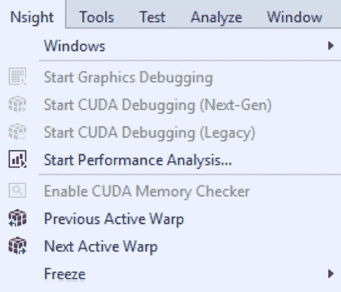

如果更改扭曲，您会发现在“自动”面板中监控的局部变量会随着扭曲更新索引。例如，下面的屏幕截图显示了“自动”窗口，该窗口报告活动扭曲中所选线程的局部变量，即主导线程正在监控的局部变量的值:


自动值会随着所选线程的更改而更新。以下屏幕截图显示了通过移动到下一个活动扭曲所做的更改:

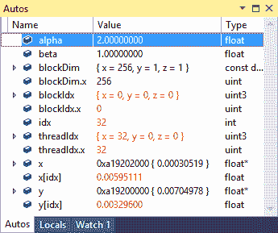

新一代 CUDA 调试器提供三种类型的窗口——扭曲信息、通道和图形处理器寄存器。黄色箭头表示当前 GPU 执行情况，其信息分三个方面显示:

*   “扭曲信息”窗口提供了另一种选择活动扭曲的方式。您可以从菜单栏中的窗口|扭曲信息打开窗口。窗口如下所示:


每行表示 CUDA 网格中的活动扭曲。第四列，着色器信息，显示每个扭曲的块和主导线程索引。第五列，线程，显示了 CUDA 线程在经线中的状态。单元格的颜色代表每个线程的状态。它们都是红色的，因为我们在断点处观察它们，但是在调试过程中您会看到其他颜色。下面的截图解释了每种颜色在线程状态方面的含义:

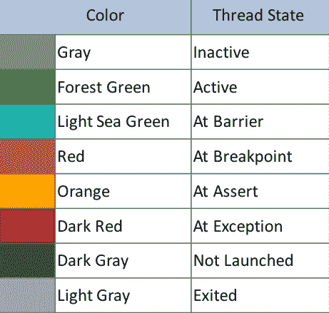

双击任何扭曲以了解自动窗口中的局部变量是如何更新的。

*   “通道”窗口允许您在选定的活动扭曲中选择特定的 CUDA 线程。经线是指经线中的一根线。您可以从右侧|窗口|车道打开窗口。通过双击一个通道，您可以发现自动窗口中的局部变量会根据更新的索引进行更新:

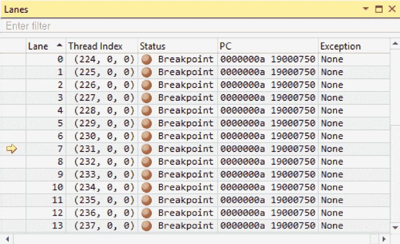

车道在活动曲速中赢得信息。

“寄存器”窗口显示图形处理器寄存器的当前状态。如果它们的值被更新，它们将是红色的。

If you want to learn how to use Nsight Visual Studio Edition, please read the official user guide from NVIDIA. It introduces how to configure a debugging environment, how to use it, and many detailed tips for various situations ([https://docs.nvidia.com/nsight-visual-studio-edition/Nsight_Visual_Studio_Edition_User_Guide.htm](https://docs.nvidia.com/nsight-visual-studio-edition/Nsight_Visual_Studio_Edition_User_Guide.htm)).

# 用 Nsight Eclipse 版调试 CUDA 应用

对于 Linux 和 OSX 平台开发，CUDA 工具包提供了 Nsight Eclipse 版。这个工具是基于 Eclipse 的，让开发人员在 CUDA C 开发中很容易习惯这个工具。

Nsight Eclipse Edition 是在 Eclipse 之上构建的，用于 CUDA 应用开发。您可以使用它来编辑、构建、调试和分析您的 CUDA 应用。它使得在 Linux 和 OSX 开发 CUDA C/C++ 变得容易。这个工具是和 CUDA 工具包作为一个包一起安装的，所以你不需要单独安装这个工具。但是，如果您使用的是 Linux，则需要为其操作配置 Java 7。

Nsight Eclipse Edition was built with Eclipse version 4.4.0 (Luna, released in 2014) and was built based on Java 7.

可以通过终端或 X 窗口应用列表中的`nsight`命令来执行此操作。

现在，让我们从您的终端或 X 窗口桌面打开 Nsight，这样我们就可以编译和分析给定的示例。要么创建一个新的 CUDA 项目，要么在`05_debug/06_debug_with_eclipse`中打开提供的样本项目。如果要创建项目，请选择 CUDA C/C++ 项目。空项目只是给你一个空项目，而 CUDA 运行时项目给你一个里面有一些示例代码的项目。如果要使用示例项目，请使用文件|导入|将现有项目导入工作区。

让我们在`sgemm`内核函数中放置一个断点。就像 Eclipse 中一个普通的 C/C++ 项目一样，可以在`nsight`中构建和调试 CUDA 应用。在第 23 行放置一个断点作为内核函数的起始点，如下所示:


内核函数调试的一个很好的起点就是线程索引计算之后。放置一个断点来暂停 GPU 的执行。现在，通过单击菜单面板中的绿色 bug 来编译并开始调试。当调试窗口切换调试视角时，单击继续，直到到达我们放置的断点。

Nsight 允许您监控活动扭曲中的局部变量和寄存器。首先，它在 CUDA 网格中的领先 CUDA 线程(CUDA 线程`0`)处停止应用。然后，您可以从调试窗口移到另一个 CUDA 活动 warp，并使用 CUDA 窗口检查每个 CUDA 线程，如下所示:

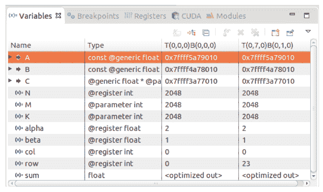

下面的截图显示了所选 CUDA 线程的局部变量信息。每当更新这些值时，Nsight 都会更新它们:


前面的截图显示了 Eclipse 调试透视图窗口中的调试窗口和 CUDA 窗口。调试窗口在选定的图形处理器和 CUDA 窗口上的活动扭曲中提供 CUDA 扭曲选择，并在选定的活动扭曲中启用通道选择。

NVIDIA also has an Nsight Eclipse Edition user guide. You can learn more about this tool by going to [https://docs.nvidia.com/cuda/nsight-eclipse-edition-getting-started-guide/index.html](https://docs.nvidia.com/cuda/nsight-eclipse-edition-getting-started-guide/index.html).

# 用 CUDA-GDB 调试 CUDA 应用

CUDA 工具包提供了 CUDA-GDB，支持 C/C++ GDB 等程序的 CUDA C/C++ 调试。这对于直接调试没有 X 窗口环境或远程调试的 CUDA C/C++ 应用非常有用。

要调试图形处理器应用，`Makefile`应该包括主机的`-g`调试标志和图形处理器的`-G`调试标志。基本上，CUDA 的 GDB 用法与主机调试相同，除了 CUDA 操作之外还有一些额外的调试功能。例如，我们可以设置特定的 CUDA 线程和 CUDA 感知断点。

# CUDA-GDB 的断点

让我们介绍一下`cuda-gdb`如何帮助我们检测代码中的错误。我们将在代码中设置断点，并查看主机和 GPU 上的本地值。为此，请将您的工作目录移动到`05_debug/07_debug_with_gdb directory`。我们将通过匹配适当的线来检查`cuda-gdb`操作。

首先，让我们使用以下命令编译源代码:

```cpp
$ nvcc -run -m64 -g -G -Xcompiler -rdynamic -gencode arch=compute_70,code=sm_70 -I/usr/local/cuda/samples/common/inc -o simple_sgemm ./simple_sgemm.cu
```

然后，我们应该执行`cuda-gdb`以便在终端上调试应用，如下所示:

```cpp
$ cuda-gdb simple_sgemm
```

我们可以在代码的特定行上放置一个断点，如下所示:

```cpp
(cuda-gdb) break simple_gemm.cu:21
```

或者，我们可以在内核函数的名称上放置一个断点，如下所示。这将在函数的入口点触发断点:

```cpp
(cuda-gdb) break sgemm_kernel
```

如果`cuda-gdb`警告指出*断点想要在未来共享库加载*上挂起，则回答`y`。您还可以在宿主代码上设置断点。

使用断点的一个问题是，断点将根据 CUDA 线程的数量来触发。因此，我们应该提供条件信息，以便针对特定的 CUDA 线程设置断点。条件断点如下:

```cpp
(cuda-gdb) break sgemm_kernel if blockIdx.y == 2
```

当然，我们可以修改预定义断点的条件，如下所示:

```cpp
(cuda-gdb) cond 3 // break 3 is defined previously
```

让我们使用`run`命令执行示例应用。如果应用遇到任何断点，CUDA-GDB 会提供相关信息。以下代码显示了应用在第`21`行遇到断点时的`cuda-gdb`报告:

```cpp
(cuda-gdb) run
[Switching focus to CUDA kernel 0, grid 1, block (0,0,0), thread (5,0,0), device 0, sm 0, warp 0, lane 5]
Thread 1 "simple_sgemm" hit Breakpoint 1, sgemm_kernel<<<(128,128,1),(16,16,1)>>> (A=0x7fffb6000000, B=0x7fffb7000000, C=0x7fffb4000000, N=2048, M=2048, K=2048, alpha=2, beta=1) at simple_sgemm.cu:21
21 int col = blockIdx.x * blockDim.x + threadIdx.x;
```

现在，是时候使用 GDB 命令来跟踪代码或监控活动变量了。我们可以用 next(或`n`)、step(或`s`)、continue(或`c`)和 finish(或`fin`来追踪内核函数。然而，当我们到达内核代码的末尾，需要在主机和设备之间切换目标硬件时，我们应该使用`continue`命令。

# 用 CUDA-GDB 检验变量

在默认的 GDB 命令之上，CUDA-GDB 提供了可以与 CUDA 内核一起工作的调试功能。以下是你可以用 CUDA-GDB 做的事情。

# 列出内核函数

像普通函数一样，CUDA-GDB 可以在内核函数上设置断点。一旦应用被断点停止，您可以按如下方式列出它们:

```cpp
(cuda-gdb) info cuda kernels
Kernel Parent Dev Grid Status   SMs Mask     GridDim  BlockDim Invocation
*      0      -   0    1 Active 0xffffffff (128,128,1) (16,16,1) sgemm_kernel(A=0x7ffff5a79010, B=0x7ffff4a78010, C=0x7ffff3a77010, N=2048, M=2048, K=2048, alpha=2, beta=1)
```

如您所见，前面的输出显示了内核的配置信息和输入参数变量。

# 变量调查

CUDA-GDB 通过选择特定的线程块索引和线程索引来帮助我们跟踪特定的 CUDA 线程。使用此功能，您可以将当前焦点移动到指定的线程。在本例中，块大小为 16，`col`变量被定义为`x`维度中的 CUDA 线程索引。以下代码显示了 CUDA-GDB 如何通过更改线程索引来报告所选局部变量的值:

```cpp
(cuda-gdb) print col
$1 = <optimized out>
(cuda-gdb) cuda kernel 0 block 1,2,0 thread 3,4,0
21 int col = blockIdx.x * blockDim.x + threadIdx.x;
(cuda-gdb) s
22 int row = blockIdx.y * blockDim.y + threadIdx.y;
(cuda-gdb) p col
$2 = 19
```

检查当前聚焦线程信息:

```cpp
(cuda-gdb) cuda device kernel block thread
kernel 3, block (1,2,0), thread (3,4,0), device 0
```

有了手头的信息，我们就可以追踪 CUDA 线程了。

If you want to learn more about CUDA-GDB, please check the user guide documentation from NVIDIA: [https://docs.nvidia.com/cuda/cuda-gdb/index.html](https://docs.nvidia.com/cuda/cuda-gdb/index.html).

# 利用 CUDA-memcheck 进行运行时验证

CUDA 编程的一个难点是处理内存空间。由于 CUDA 线程并行运行，边界条件或意外的索引操作可能会破坏有效的内存空间。CUDA memcheck 是一个运行时测试工具，如果任何 GPU 操作超过无效内存空间，它将验证内存访问。此工具检测以下内存错误:

| 

名字

 | 

位置

 | 

描述

 | 

精确的

 |
| 内存访问错误 | 设备 | 无效的内存访问(越界、未对齐) | O |
| 硬件异常 | 设备 | 硬件错误 | X |
| malloc/自由错误 | 设备 | CUDA 内核中`malloc()` / `free()`使用不正确 | O |
| CUDA 应用编程接口错误 | 主持 | CUDA 应用编程接口的错误返回 | O |
| cudaMalloc 内存泄漏 | 主持 | 应用没有释放使用`cudaMalloc()`分配的设备内存 | O |
| 设备堆内存泄漏 | 设备 | 应用不会释放在设备代码中使用`malloc()`分配的设备内存 | X |

精确(0)意味着 memcheck 可以指定崩溃的行和文件。另一方面，不精确(X)意味着工具可以识别错误，但由于并发状态而无法指定错误点。`cuda-memcheck`测试不需要重新编译。然而，如果我们用一些额外的`nvcc`选项进行编译，我们可以跟踪错误点。`nvcc`选项包括生成行号信息的`-lineinfo`和用于保留功能符号的`-Xcompiler -rdynamic`。

基本上，`cuda-memcheck`是一个独立的工具，在运行时验证 GPU 应用。以下命令在独立模式下显示其格式:

```cpp
$ cuda-memcheck [options] <application>
```

该工具还可以与 CUDA-GDB 一起工作，帮助开发人员识别错误并进行调试。在 CUDA-GDB 命令行中，使用`set cuda memcheck on`命令启用内存检查。这样，CUDA-GDB 可以识别与内存相关的异常。

# 检测到内存越界

现在，让我们看看`cuda-memcheck`如何检测内存异常并使用 CUDA-GDB。为了缓解这种情况，我们将制作一些错误的代码，看看`cuda-memcheck`如何报告结果。让我们从一些干净的代码开始。您可以为此使用`05_debug/08_cuda_memcheck`中给定的示例代码。让我们使用`cuda-memcheck`测试代码并验证它:

```cpp
$ nvcc -m64 -g -G -Xcompiler -rdynamic -gencode arch=compute_70,code=sm_70 -I/usr/local/cuda/samples/common/inc -o simple_sgemm ./simple_sgemm.cu
$ cuda-memcheck simple_sgemm
========= CUDA-MEMCHECK
Application finished successfully.========= ERROR SUMMARY: 0 errors
```

现在，让我们将一些错误的代码放入内核函数，如下所示。如果愿意，您可以输入另一个错误:

```cpp
For instance, you may add one to the row value.
__global__ void sgemm_kernel(const float *A, const float *B, float *C, int N, int M, int K, float alpha, float beta)
{
    int col = blockIdx.x * blockDim.x + threadIdx.x;
    int row = blockIdx.y * blockDim.y + threadIdx.y;
    row += 1;

    float sum = 0.f;
    for (int i = 0; i < K; ++ i)
        sum += A[row * K + i] * B[i * K + col];
    C[row * M + col] = alpha * sum + beta * C[row * M + col];
}
```

让我们编译并启动代码。内核将返回一个 CUDA 错误，`checkCudaErrors()`将报告一条错误消息，如下所示:

```cpp
CUDA error at simple_sgemm_oob.cu:78 code=77(cudaErrorIllegalAddress) "cudaDeviceSynchronize()"
```

然而，如果我们想确定内核代码中的哪一行是问题的根本原因，这些信息是不够的。使用`cuda-memcheck`，我们可以用一个堆栈地址来识别是哪个 CUDA 线程和内存空间触发了错误:

```cpp
$ cuda-memcheck simple_sgemm_oob
```

输出如下:

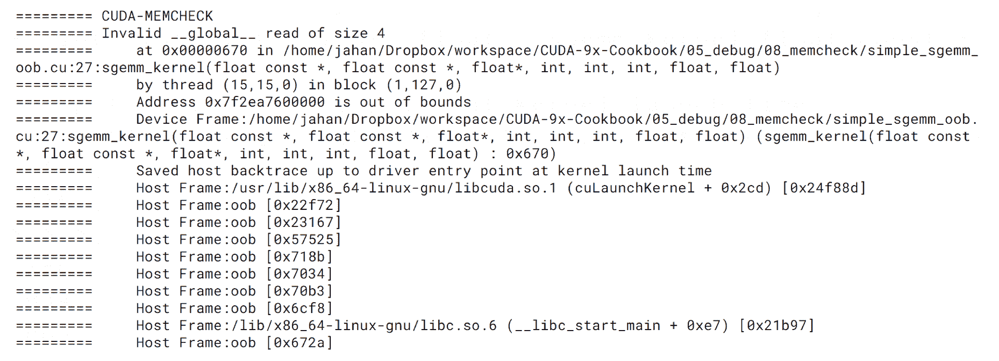

前面的截图显示了`cuda-memcheck`独立执行的一部分，它显示了从发生错误的内核中检测到的所有错误。在这种情况下，`cuda-memcheck`报告在第`27`行检测到内存违规错误。默认情况下，`cuda-memcheck`在检测到错误时停止应用的执行。

在这种情况下，我们可以通过使用`cuda-gdb`检查相关变量来轻松找到根本原因。为此，我们需要使用`cuda-gdb`启动应用并启用`cuda-memcheck`，如下所示:

```cpp
$ cuda-gdb simple_sgemm_oob
(cuda-gdb) set cuda memcheck on
(cuda-gdb) run
```

本程序使`cuda-gdb`从`cuda-memcheck`报告非法内存访问检测:


上面的截图显示了一个来自`cuda-gdb`和`cuda-memcheck`的报告。开发人员可以很容易地识别出`simple_sgemm_oob.cu`中的`27`行触发了报告的错误。根据给定的信息，我们可以开始调查哪块内存访问了无效空间，如下所示:

```cpp
(cuda-gdb) print A[row * K + i]
Error: Failed to read generic memory at address 0x7fffc7600000 on device 0 sm 41 warp 20 lane 16, error=CUDBG_ERROR_INVALID_MEMORY_SEGMENT(0x7).
(cuda-gdb) print row * K + i
$1 = 4194304
```

无需费力，我们就可以确定访问`A[row * K + i]`会触发错误，并且请求的值超过了全局内存的(`A`)分配空间。通过这种方式，你可以不费力地缩小根本原因。

# 检测其他内存错误

CUDA memcheck 工具提供了额外的软件验证功能，其中一些如下:

| **名称** | **描述** | **选项** |
| 内存泄漏 | 用于识别内存泄漏 | `--leak-check full` |
| 比赛检查 | 为了分析多线程之间对共享存储器的冲突访问的竞争危险 | `--tool racecheck` |
| 初始化检查 | 无需初始化即可识别设备全局内存访问 | `--tool initcheck` |
| 同步检查 | 验证同步原语的正确使用，如`__syncthreads()`、`__syncwarp()`和协作组 API | `--tool synccheck` |

这些工具假设内存访问是正确的或经过验证的，并且不检查内存错误。因此，您需要确认应用中不存在内存错误。其他有用的 memcheck 选项包括`--save`，我们可以使用它将输出保存到磁盘，以及`--print-level`，我们可以使用它来控制输出细节级别。

NVIDIA provides a user guide for `cuda-memcheck`. This document will help you validate your application using a GPU and detect unexpected errors ([https://docs.nvidia.com/cuda/cuda-memcheck/index.html](https://docs.nvidia.com/cuda/cuda-memcheck/index.html)).

# 用嵌入式系统分析图形处理器应用

在这一节中，我们将介绍新引入的 CUDA 探查器工具，即 Nsight Systems 和 Nsight Compute。这些 profilers 支持 Volta 架构和更高版本的图形处理器。它是图灵架构图形处理器中的主要剖析器。我们将在下一节介绍恩西计算之前，先介绍恩西系统。

nsight Systems([https://developer.nvidia.com/nsight-systems](https://developer.nvidia.com/nsight-systems))是一款全系统性能分析工具，可以在时间轴中可视化操作，轻松找到优化点。在时间线分析方面，恩希特系统公司提供系统端利用率信息，以便我们分析瓶颈点。我们可以从 NVIDIA 网站获得 Nsight Systems，但是默认情况下 CUDA 10 在工具包包中包含了 Nsight Systems。我们要做的就是确保它安装正确。

对于命令行界面，我们应该设置`PATH`来简化我们的操作，因为它的路径与普通的 CUDA 二进制文件是分开的。让我们使用以下命令将它包含在`PATH`环境变量中:

```cpp
export PATH=$PATH:/usr/local/cuda/bin:/usr/local/cuda-10.1/NsightSystems-2019.3/Target-x86_64/x86_64
```

系统提供两个界面:一个用于图形用户界面，一个用于命令行界面。在主机上，我们可以通过图形用户界面运行应用来收集应用的采样信息。在远程计算机上，我们可以通过命令行界面使用以下命令收集分析数据:

```cpp
$ nsys profile -t osrt,cuda,nvtx,cublas,cudnn -o baseline -w true <command>
```

该选项可以解释如下:

|  | [计]选项 | 开关 |
| 描摹 | `-t` / `--trace` | `cuda`:对于追溯 CUDA 操作，`nvtx`:追踪`nvtx`标签，`cublas`、`cudnn`、`opengl`、`openacc`:为了跟踪 API 操作，`osrt`:跟踪操作系统运行时库，`none`:无 API 痕迹 |
| 输出文件 | `-o` / `--output` | 输出文件名 |
| 显示输出 | `-w` / `--show-`输出 | `true` / `false`:打印出终端上探查器的行为 |

例如，我们可以从`02_nvtx` SGEMM 应用中获取一个名为`sgemm.qdrep`的概要文件。让我们比较一下 Nsight 系统和 NVIDIA 视觉分析器之间的分析输出。我们可以使用以下命令收集导航系统的配置文件数据:

```cpp
$ nsys profile -t osrt,cuda,nvtx -o sgemm -w true ./sgemm
```

这是恩塞特系统公司的时间线视图:


下面的屏幕截图显示了 NVIDIA 可视化探查器中的时间线概要视图:


视觉探查器显示操作事件块，但夜间系统显示系统利用率。因此，我们可以很容易地看出哪种资源——中央处理器内核、图形处理器或 PCIe 总线——对性能有影响。此外，恩希特系统公司还提供了更具互动性的分析体验。当您双击任何功能操作时，系统查看器会扩展时间线以适合窗口，并帮助我们检查操作。此外，Nsight Systems 使我们能够轻松发现在某个 NVTX 区域下发生的内核执行数量。在可视化探查器时间线视图中，内核执行看起来像一个单独的执行，但是 Nsight Systems 显示了单独的执行。

现在，我们已经确定了一个函数应该被优化，我们可以继续进行 Nsight Compute，这是另一个新的探查器，用于检查内核函数的 GPU 操作。

# 使用智能计算分析内核

Nsight Compute 是一个用于计算的内核级分析器。它收集 GPU 度量信息，并帮助我们专注于 CUDA 内核的优化。换句话说，该工具涵盖了可视化探查器的性能分析功能。

n 智能计算提供了两个界面:图形用户界面和命令行界面。图形用户界面支持主机和远程应用配置文件，而命令行界面在目标计算机上工作。但是，我们可以获取概要数据，并使用图形用户界面查看结果。

# 使用命令行界面进行分析

为了方便使用恩西计算命令行界面，我们需要在`/usr/local/cuda-10.1/NsightCompute-2019.3/nv-nsight-cu-cli`中为恩西计算路径设置`PATH`环境变量。然后，我们可以使用以下命令收集配置文件数据:

```cpp
$ nv-nsight-cu-cli -o <output filename> <application command>
```

此命令收集 GPU 执行度量信息，并将数据保存到指定文件中。如果我们不提供输出文件名，Nsight Compute 会将收集到的指标报告报告给控制台，控制台会通过控制台提供快速的指标性能报告。

由于我们可以指定分析目标，因此我们可以将恩西计算限制为收集以下信息:

*   `--kernel-regex`:指定概要文件的内核
*   `--devices`:专注于剖析特定的图形处理器

当我们必须在控制台上查看报告时，此功能非常有用。

# 使用图形用户界面进行分析

通过在 Nsight Compute 中打开一个新项目，我们可以启动概要文件操作。下面的截图显示了配置文件配置。对于主机应用开发，连接到本地主机。或者，您可以指定我们要配置的目标 GPU 服务器:


当然，我们也可以打开`nsight-cuprof-report`文件，它是用 CLI 工具在目标机器上生成的。例如，我们可以使用以下命令创建 sgemm 概要文件:

```cpp
$ nv-nsight-cu-cli -o reduction reduction
```

For OSX users, Nsight Systems will require the target `glib` library for remote profiling. In this case, we should copy the library from the Nsight Compute installation image. It provides the required libraries as a directory named target and copies that directory to the `Applications/NVIDIA Nsight Compute.app/target` directory.

为了便于本实验，我们将使用来自 [第 3 章](07.html)*CUDA 线程编程*的简化示例代码。它有两种不同寻址的并行约简实现。可以从`03_cuda_thread_programming/05_warp_divergence`目录找到代码。完成后，单击启动按钮设置连接和应用可执行文本栏，如连接进度图所示。然后，放 *Ctrl* + *I* ， *Ctrl* + *K* 键运行到下一个内核函数，这时 profiler 会停在`reduction_kernel_1`。放 *Ctrl* + *I* ， *Ctrl* + *P* 键对这个内核进行轮廓化。然后，您将获得以下输出。此图显示了 Nsight Compute 基于图形用户界面的第一个内核概要分析:

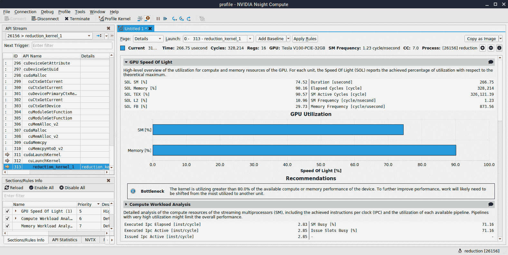

Output showing GUI-based profiling (for the first kernel profiling)

它提供交互式分析和调试。使用步骤控制调试按钮，我们可以调试 CUDA 应用编程接口和内核函数。我们还可以使用左侧 API 流面板上的控制按钮，移动到下一个内核函数或下一个概要文件范围。在右侧面板上，您可以获得内核的详细概要信息。

我们还可以通过以下步骤启用自动配置文件来自动获取配置结果—转到菜单栏并选择配置文件|自动配置文件。然后，继续申请。系统将分析所有的内核函数。或者，您可以通过单击窗口顶部的“配置内核”按钮来手动配置内核函数。当我们使用 CLI 收集的概要结果时，我们将只看到来自所有内核函数的概要数据。

# 性能分析报告

正如我们在交互式配置文件窗口的右侧面板中所看到的，Nsight Compute 提供了一个性能分析报告。从报告中，我们可以发现性能限制因素，并调查未充分利用的资源。此外，Nsight Compute 还根据资源利用率统计数据提供优化建议。我们也可以从直接侧面识别它们。

此外，恩希特计算通过分析图形处理器组件的利用率提供优化建议。它发现了一个瓶颈，并提出了一个优化内核的建议调查。

此报告页面提供了每个组件的利用率，如计算、内存、调度程序、指令、扭曲等。此外，通过扩展每个组件的左上角箭头，您可以获得更多细节。下图显示了内存工作负载分析的示例报告:

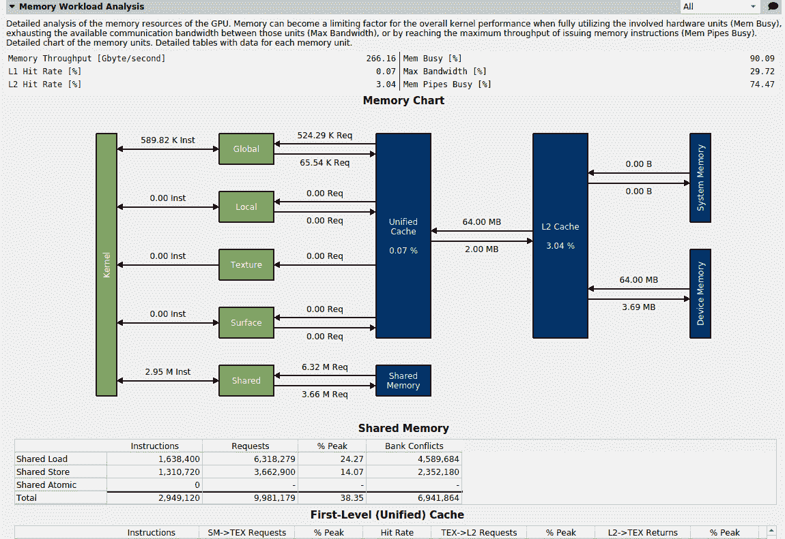

在智能计算中，我们可以很容易地获得如此详细的信息。在之前的 profiler，NVIDIA Profiler 中，我们应该执行每个分析来获取这样的信息。

# 基线比较

在优化过程中，我们应该比较基线操作的新结果。为了让我们轻松完成这项任务，恩塞特计算公司提供了基线比较功能。单击性能报告面板顶部的添加基线按钮，并将其更改为其他内核函数。然后，我们可以使用 Nsight Compute 来比较内核函数的利用率。以下屏幕显示了这一点:

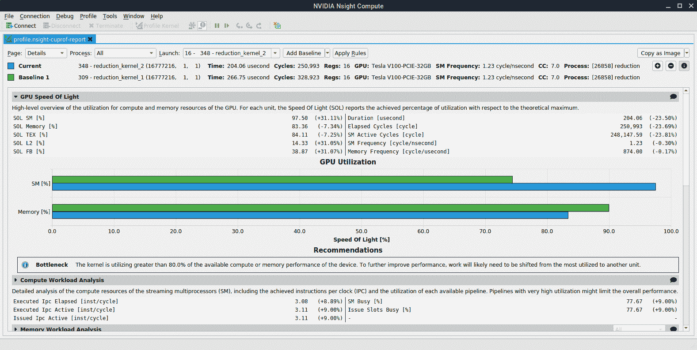

Comparison of kernel function utilizations

如果我们希望跟踪我们的优化工作并确定有效的组件，这将非常有用。

# 源视图

Nsight Compute 提供了我们可以调查的各种页面。其中一个有用的页面是源页面。如果 CUDA 应用是用`-lineinfo`选项构建的，那么 Nsight Compute 可以用 CUDA SASS 代码显示 CUDA C/C++ 源码的相关信息。然后，我们可以分析瓶颈代码，并研究它与 SASS 代码级别的关系。此外，它还提供了一个活动寄存器数，这样我们就可以研究内核函数中所需寄存器的数量。以下屏幕截图显示了“来源”页面:

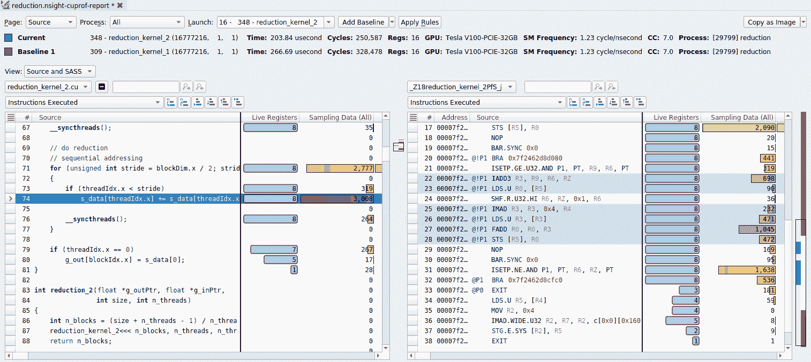

如果您需要了解该功能的更多信息，可以在本文档中找到相关信息—[https://docs . NVIDIA . com/n right-compute/NsightCompute/index . html # profiler-report-source-page](https://docs.nvidia.com/nsight-compute/NsightCompute/index.html#profiler-report-source-page)。

Nsight Compute 提供了一个以 CUDA 内核性能分析为中心的操作，我们可以用它来验证 Night Systems 和 Nsight Compute 有不同的优化范围。

# 摘要

在这一章中，我们已经介绍了如何分析 GPU 应用并调试它。了解这些 CUDA 工具将有助于您高效和有效地开发，因为它们可以帮助您务实地找到瓶颈，并在短时间内找到错误和 bug。

到目前为止，我们一直专注于单 GPU 应用开发。然而，许多 GPU 应用使用多个 GPU 来实现更好的性能。在下一章中，我们将介绍如何编写在多个 GPU 上工作的代码，并以可扩展的性能为目标。您将了解什么会对绩效产生影响，以及如何达到良好的绩效水平。您还将能够应用我们在本章下一章的问题中介绍的工具来增强多个 GPU 系统及其体验。