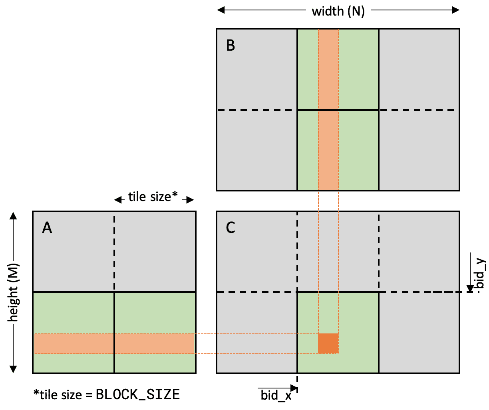
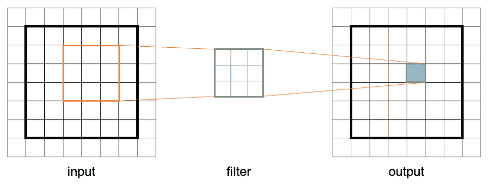
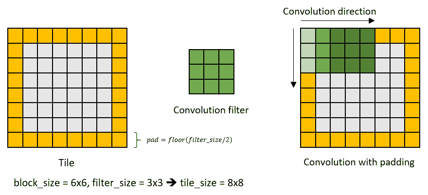
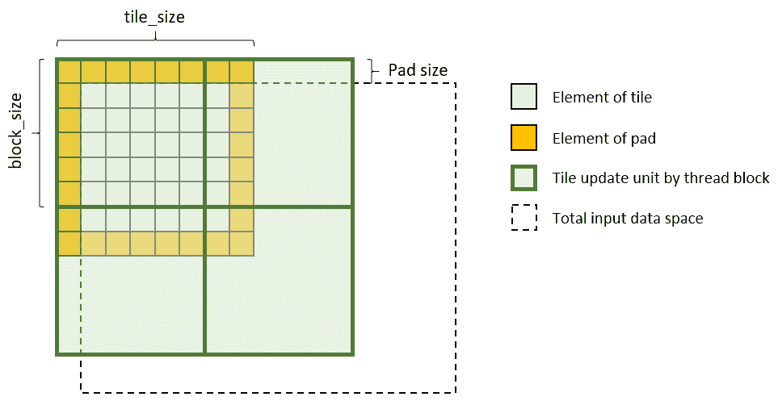
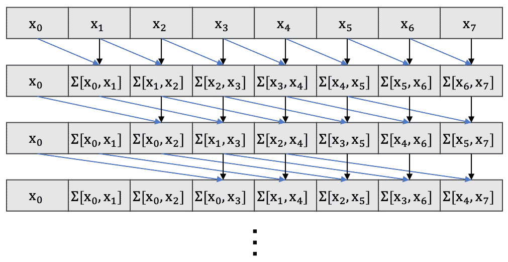
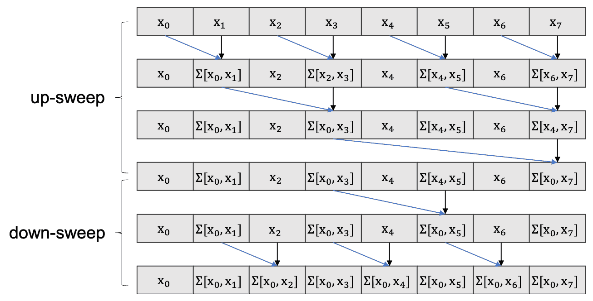
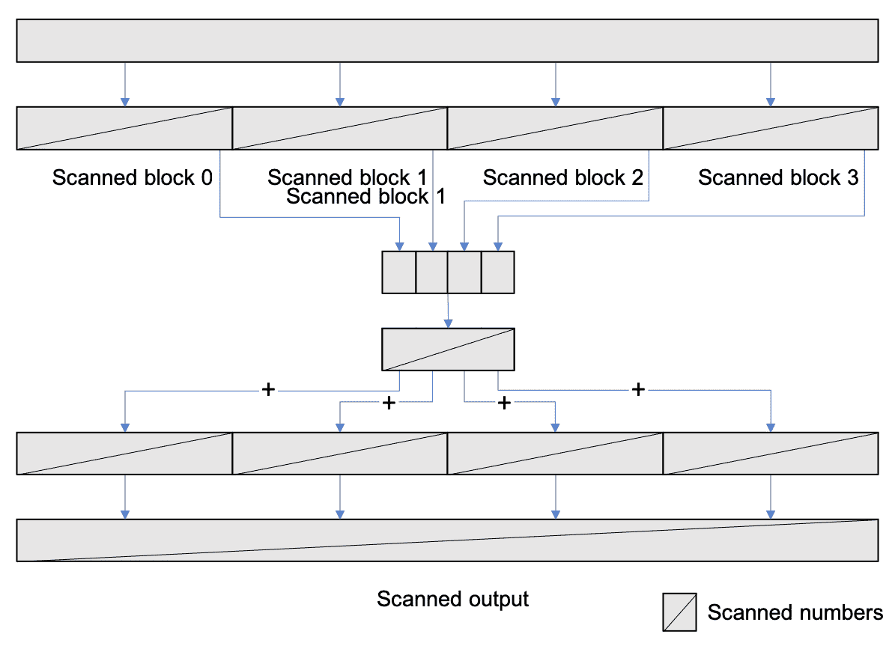
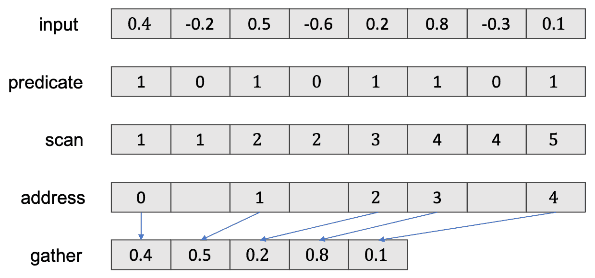
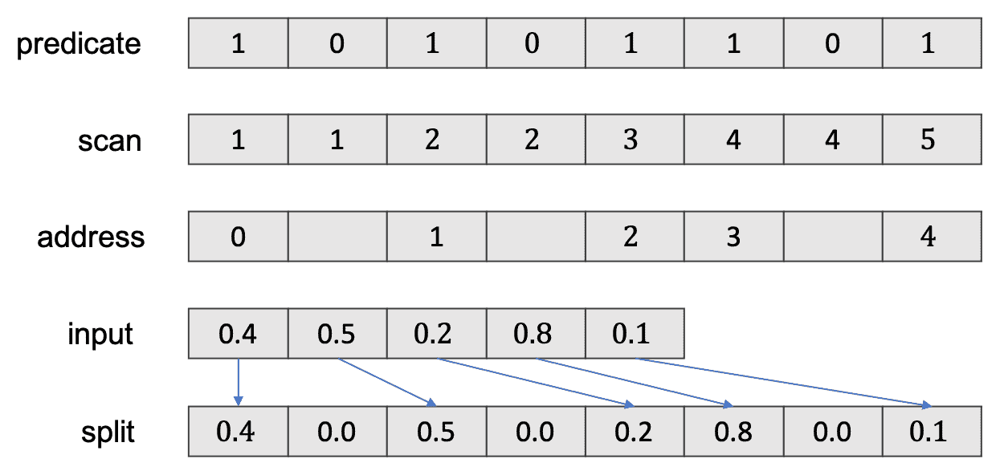

# 七、CUDA 中的并行编程模式

在本章中，我们将介绍并行编程算法，这些算法将帮助您了解如何并行化不同的算法并优化 CUDA。我们将在本章中介绍的技术可以应用于各种问题，例如，我们在[第 3 章](03.html)、 *CUDA 线程编程*中看到的并行约简问题，该问题可用于设计神经网络操作中的高效 softmax 层。

在本章中，我们将涵盖以下主题:

*   矩阵乘法优化
*   图像卷积
*   前缀和
*   打包和拆分
*   全身手术
*   利用动态并行在 CUDA 中快速排序
*   基数排序
*   直方图计算

# 技术要求

要完成本章，建议您使用比帕斯卡架构更晚的 NVIDIA GPU 卡。换句话说，你的图形处理器的计算能力应该等于或大于 60。如果您不确定您的图形处理器的架构，请访问英伟达图形处理器网站([https://developer.nvidia.com/cuda-gpus](https://developer.nvidia.com/cuda-gpus))并确认您的图形处理器的计算能力。

本章中相同的代码已经用 CUDA 版本 10.1 开发和测试。一般来说，如果适用，建议使用最新的 CUDA 版本。

# 矩阵乘法优化

虽然我们在很多例子中使用了矩阵乘法代码，但我们没有调查运算是否优化。现在，让我们回顾一下它的操作，以及如何找到优化的机会。

矩阵乘法是两个矩阵的一组点积运算。我们可以简单地将所有 CUDA 线程完成的操作并行化，以生成元素的点积。然而，这种操作在内存使用方面是低效的，因为从内存加载的数据不会被重用。为了证实我们的类比，让我们测量性能限制器。下图显示了使用恩西计算的特斯拉 V100 卡的图形处理器利用率:


根据我们的性能限制分析，这个利用率可以归类为内存受限。因此，我们应该检查内存利用率以降低利用率。下面的屏幕截图显示了内存工作负载分析部分:


从这个分析中，我们可以看到 L2 缓存命中率低，最大带宽低。我们可以假设这是因为原始的矩阵乘法运算不重用加载的数据，正如我们前面提到的。这可以通过使用共享内存来解决，也就是说，重用加载的数据并减少全局内存使用。现在，让我们回顾一下矩阵乘法，以及我们如何优化它来使用内存空间小的共享内存。

矩阵乘法是一组点积运算，具有一些小尺寸矩阵和输出的累积。小矩阵被称为瓦片，它们沿着输出矩阵映射到矩阵。每个图块将并行计算自己的输出。该操作可以通过以下步骤实现:

1.  确定两个输入和输出矩阵的图块大小。
2.  遍历输入图块及其方向(矩阵 A 向右，矩阵 B 向下)。
3.  计算图块内的矩阵乘法。
4.  继续第二步，直到瓷砖到达终点。
5.  刷新输出。

下图显示了平铺矩阵乘法的概念:



在上图中，我们计算了一个矩阵乘法， *C = AB* 。我们从矩阵 A 和矩阵 b 计算一个较小的矩阵乘法，作为一个绿色的图块。然后，我们分别遍历输入图块位置。运算结果累加到前一个输出，生成矩阵乘法的输出。

这个操作提供了一个优化的机会，因为我们可以用小问题分解大的矩阵操作，并把它放在小的内存空间中。在 CUDA 编程中，我们将小矩阵放在共享内存中，并减少全局内存访问。在我们的实现中，我们将使用 CUDA 线程块匹配切片。图块的位置将由其块索引决定，这是通过`tid_*`变量完成的。

# 平铺方法的实现

现在，让我们使用平铺方法实现一个优化的矩阵乘法。我们将重用之前在 [第三章](03.html)*CUDA 线程编程*中使用的矩阵乘法示例代码。优化后，我们将看看如何提高性能。按照以下步骤开始:

1.  让我们创建一个内核函数，它将是矩阵乘法的优化版本。我们将在`sgemm`操作中命名内核函数`v2`。这个内核函数会计算，所以我们要分别提供相关的参数。我们还将通过`M`、`N`和`K`传递矩阵大小信息:

```cpp
__global__ void sgemm_kernel_v2(const float *A, const float *B, float *C,
    int M, int N, int K, float alpha, float beta) {}
```

2.  对于这个操作，我们将分别使用块索引和线程索引。如前所述，我们需要单独使用块索引来指定切片位置。我们将使用线程索引进行块级矩阵乘法。因此，我们需要创建 CUDA 索引参数，如下所示:

```cpp
int bid_x = blockIdx.x * blockDim.x;
int bid_y = blockIdx.y * blockDim.y;
int tid_x = threadIdx.x;
int tid_y = threadIdx.y;
```

3.  之后，我们将使用共享内存作为切片，并使用本地寄存器保存输出值:

```cpp
float element_c = 0.f;
__shared__ float s_tile_A[BLOCK_DIM][BLOCK_DIM];
__shared__ float s_tile_B[BLOCK_DIM][BLOCK_DIM];
```

4.  然后，我们将编写一个控制图块位置的循环。下面是 for 循环代码，它根据循环的块大小来控制循环。请注意，循环大小是由`K`决定的，它考虑了块应该遍历多少次:

```cpp
for (int k = 0; k < K; k += BLOCK_DIM)
{
   ... {step 5 and 6 will cover } ...
}
```

5.  现在，我们将编写在第二个循环中提供数据的代码。正如我们之前讨论的，每个图块都有自己的移动方向，以及矩阵；平铺`A`遍历矩阵`A`的列，平铺`B`遍历矩阵`B`的行。我们根据*矩阵乘法优化*部分所示的图表放置它们。之后，我们应该将`__syncthreads()`放置在将数据从全局内存复制到共享内存之后，以避免来自上一次迭代的未更新数据:

```cpp
// Get sub-matrix from A
s_tile_A[tid_y][tid_x] = A[ (bid_y + tid_y) * K + tid_x + k ];
// Get sub-matrix from B 
s_tile_B[tid_y][tid_x] = B[ k * N + bid_x + tid_x ]; 

__syncthreads();
```

6.  然后，我们可以从瓷砖上写矩阵乘法代码。被称为`element_c`的局部变量将累加结果:

```cpp
for (int e = 0; e < BLOCK_DIM; e++)
    element_c += s_tile_A[tid_y][e] * s_tile_B[e][tid_x];
```

7.  我们将把结果写入全局内存。以下操作应在第二个循环结束后进行:

```cpp
C[(bid_y + tid_y) * N + (bid_x + tid_x)] = \
 alpha * element_c + beta * C[(bid_y + tid_y) * N + (bid_x + tid_x)];
```

8.  现在，让我们回顾一下这种平铺方法如何有利于矩阵乘法运算。通过在我们的分片矩阵乘法中使用共享内存，我们可以期望通过使用输入数据来减少全局内存流量，从而提高性能。我们可以很容易地用轮廓结果来证实这一点:

```cpp
$ nvcc -m64 -I/usr/local/cuda/samples/common/inc -gencode arch=compute_70,code=sm_70 -o sgemm ./sgemm.cu 
$ nvprof ./sgemm 

        Type Time(%)    Time Calls      Avg      Min      Max Name
GPU activities: 47.79% 9.9691ms     1 9.9691ms 9.9691ms 9.9691ms sgemm_kernel(...)
 32.52% 6.7845ms     1 6.7845ms 6.7845ms 6.7845ms sgemm_kernel_v2(...)
```

9.  由于我们设计内核是为了重用输入数据，增加的块大小可能有助于提高性能。例如，考虑到翘曲大小和共享存储体的数量，32×32 的块大小可能是最佳的，以避免存储体冲突。我们可以很容易地获得它的实验结果使用轮廓:

```cpp
 Type Time(%)    Time Calls      Avg       Min       Max Name
GPU activities: 46.52% 8.1985ms     1 8.1985ms  8.1985ms  8.1985ms sgemm_kernel(...)
 31.24% 5.4787ms     1 5.4787ms  5.4787ms  5.4787ms sgemm_kernel_v2(...)
```

如您所见，增加的图块大小有利于矩阵乘法运算的性能。现在，我们来分析一下它的性能。

# 平铺方法的性能分析

之前，我们研究了切片方法以及它如何实现良好的性能。让我们回顾一下切片方法解决了什么问题，并看看下一步我们可以采取什么步骤。覆盖这一部分通常是可选的，因为英伟达为`GEMM`(通用矩阵乘法的缩写)操作提供了 cuBLAS 和 CUTLASS 库，以提供优化的性能。

下图显示了恩希特计算公司更新后的图形处理器利用率报告。下部配置文件的更新利用率输出是上部配置文件的结果:


由于两种资源的利用率都很高，我们应该检查每种资源的使用情况。首先，让我们回顾一下内存工作负载。下面的截图显示了更新后的结果:


从这个结果中，我们可以看到全局内存访问是通过最大化内存带宽和降低内存吞吐量来优化的。此外，L2 缓存命中率得到了提高。因此，我们的切片方法将矩阵乘法从全局内存转换为芯片级操作。

然而，这并不意味着我们实现了最佳性能。从内存工作负载分析可以看出，内存管道太忙。这是由于我们共享内存的元素乘法。为了解决这个问题，我们需要在共享内存中重新映射数据。我们不会在这本书里讨论这个问题，但是你可以在这篇文章里了解到:https://github.com/NervanaSystems/maxas/wiki/SGEMM。

正如我们前面所讨论的，cuBLAS 库显示了更快的性能。我们将在[第 8 章](08.html)、*用库和其他语言编程*的 *cuBLAS* 部分介绍它的用法。然而，在这个阶段理解切片方法是有用的，这样我们就可以理解图形处理器如何开始优化。

# 盘旋

卷积运算(或滤波)是许多应用中的另一种常见运算，尤其是在图像和信号处理以及深度学习中。虽然这个操作是基于来自输入和滤波器的顺序数据的乘积，但是我们有不同的矩阵乘法方法。

# CUDA 中的卷积运算

卷积运算由源数据和一个滤波器组成。过滤器也被称为内核。通过对输入数据应用过滤器，我们可以获得修改后的结果。下图显示了一个二维卷积:



在实现卷积运算时，我们需要考虑几个概念，即内核和填充。内核是我们想要应用于源数据的一组系数。这也称为过滤器。填充是源数据周围的额外虚拟空间，这样我们就可以将内核函数应用到边缘。当填充大小为 0 时，我们不允许过滤器超出源空间。但是，一般来说，填充大小是过滤器大小的一半。

为了轻松开始，我们可以在设计内核函数时考虑以下几点:

*   每个 CUDA 线程生成一个过滤输出。
*   每个 CUDA 线程将滤波器的系数应用于数据。
*   过滤器形状是一个箱式过滤器。

在这些条件下，我们可以得到一个简单的卷积运算滤波器，如下所示:

```cpp
__global__ void
convolution_kernel_v1(float *d_output, float *d_input, float *d_filter, int num_row, int num_col, int filter_size)
{
    int idx_x = blockDim.x * blockIdx.x + threadIdx.x;
    int idx_y = blockDim.y * blockIdx.y + threadIdx.y;

    float result = 0.f;
    // iterates over the every value in the filter
    for (int filter_row = -filter_size / 2; 
         filter_row <= filter_size / 2; ++ filter_row)
    {
        for (int filter_col = -filter_size / 2; 
             filter_col <= filter_size / 2; ++ filter_col)
        {
            // Find the global position to apply the given filter
            // clamp to boundary of the source
            int image_row = min(max(idx_y + filter_row, 0), 
                                static_cast<int>(num_row - 1));
            int image_col = min(max(idx_x + filter_col, 0), 
                                static_cast<int>(num_col - 1));

            float image_value = static_cast<float>(
                                d_input[image_row * num_col + 
                                image_col]);
            float filter_value = d_filter[(filter_row + 
                                           filter_size / 2) * 
                                           filter_size 
                                           + filter_col + 
                                           filter_size / 2];

            result += image_value * filter_value;
        }
    }

    d_output[idx_y * num_col + idx_x] = result;
}
```

这个内核函数为操作获取输入数据和过滤器，并且不重用所有的数据。考虑到内存低效对性能的影响，我们需要设计我们的内核代码，以便我们可以重用加载的数据。现在，让我们编写卷积的优化版本。

# 优化策略

首先，卷积滤波器是一个只读矩阵，由所有 CUDA 线程使用。在这种情况下，我们可以使用 CUDA 的恒定内存来利用其缓存操作和广播操作。

在卷积实现设计中，我们使用平铺方法，每个平铺将生成映射位置的过滤输出。我们的切片设计有额外的空间来考虑卷积滤波器的大小，这为卷积运算提供了所需的数据。这个额外的空间叫做**填充**。下图显示了一个 6×6 尺寸的线程块和一个 3×3 尺寸的过滤器的例子。

然后，我们需要在共享内存中为每个线程块分配一个 8×8 大小的区块，如下所示:



当源的地址是无效的内存空间时，填充区域可以是输入数据，或者它们被零填充(零填充方法)。通过这样做，我们可以使图块替换输入全局内存，而不会对边界元素产生额外影响。为了填充图块，我们使用线程块大小迭代图块，并通过检查输入数据的边界条件来确定应该填充哪个值。我们的实现将输入数据设置为图块大小的倍数，以便边界条件与每个线程块图块的填充空间相匹配。将源数据映射到切片的简要示意图如下:



在这个设计中，我们需要进行四次迭代来填充图块。但是，这应该根据过滤器的大小进行更改。这样，填充图块的迭代次数由图块大小的天花板数量除以螺纹块大小决定。它的实现很简单，如下面的代码所示:

```cpp
for (int row = 0; row <= tile_size / BLOCK_DIM; row++) {
    for (int col = 0; col <= tile_size / BLOCK_DIM; col++) {
        ... (filter update operation) ...
    }
}
```

现在，让我们使用共享内存作为箱式过滤器来实现优化的卷积运算。

# 利用常数记忆优化滤波系数

首先，我们将学习如何优化滤波器系数数据的使用。

我们将制作`convolution_kernel()`的修改版本。让我们复制内核代码，并将其中一个重命名为`convolution_kernel_v2()`:

1.  首先，我们将创建一个恒定的存储空间来存储滤波器系数。常量内存的大小是有限的，我们不能修改内核代码。然而，我们可以使用这个常数存储器，因为我们的卷积滤波器适合这种情况。我们可以这样使用恒定记忆:

```cpp
#define MAX_FILTER_LENGTH 128
__constant__ float c_filter[MAX_FILTER_LENGTH * MAX_FILTER_LENGTH];
```

2.  然后，我们可以使用`cudaMemcpyToSymbol()`函数将卷积滤波器系数放入常量存储器中:

```cpp
cudaMemcpyToSymbol(c_filter, h_filter, filter_size * filter_size * sizeof(float));
```

3.  让我们切换过滤操作，这样我们就可以使用常量内存。整个内核实现如下。如您所见，只有一个变量的用法发生了变化:

```cpp
__global__ void
convolution_kernel_v2(float *d_output, float *d_input, float *d_filter, int num_row, int num_col, int filter_size)
{
    int idx_x = blockDim.x * blockIdx.x + threadIdx.x;
    int idx_y = blockDim.y * blockIdx.y + threadIdx.y;

    float result = 0.f;
    for (int filter_row = -filter_size / 2; 
         filter_row <= filter_size / 2; ++ filter_row)
    {
        for (int filter_col = -filter_size / 2; 
             filter_col <= filter_size / 2; ++ filter_col)
        {
            int image_row = idx_y + filter_row;
            int image_col = idx_x + filter_col;

            float image_value = (image_row >= 0 
                                 && image_row < num_row 
                                 && image_col >= 0
                                 && image_col < num_col) ?
                                 d_input[image_row * num_col 
                                         + image_col] : 0.f;
            float filter_value = c_filter[(filter_row 
                                          + filter_size / 2) 
                                          * filter_size 
                                          + filter_col 
                                          + filter_size / 2];

            result += image_value * filter_value;
        }
    }

    d_output[idx_y * num_col + idx_x] = result;
}
```

4.  现在，我们可以确认由于过滤数据重用而带来的性能提升`nvprof`:

```cpp
$ nvcc -run -m64 -I/usr/local/cuda/samples/common/inc -gencode arch=compute_70,code=sm_70 -o convolution ./convolution.cu
$ nvprof ./convolution
           Type Time(%) Time Calls Avg Min Max Name
 12.85% 442.21us     1 442.21us 442.21us 442.21us convolution_kernel_v1(...)
 11.97% 412.00us     1 412.00us 412.00us 412.00us convolution_kernel_v2(...)
```

从这个结果中，我们可以看到内核执行时间的减少。

# 使用共享内存平铺输入数据

现在，我们将使用共享内存优化输入数据的使用。为了区分我们的下一个优化步骤，让我们复制前面的卷积核函数，并将其命名为`convolution_kernel_v3()`:

1.  首先，我们需要预先准备好共享内存空间，以便它可以存储输入数据。为了从共享内存中获得过滤操作的好处，我们需要额外的输入数据。为了创建足够的内存空间，我们需要修改内核调用，如下所示:

```cpp
int shared_mem_size = (2*filter_size+BLOCK_DIM) * (2*filter_size+BLOCK_DIM) * sizeof(float);
convolution_kernel_v3<<<dimGrid, dimBlock, shared_mem_size, 0 >>>(d_output, d_input, d_filter, num_row, num_col, filter_size);
```

2.  在内核代码中，我们可以如下声明共享内存空间:

```cpp
extern __shared__ float s_input[];
```

3.  然后，我们可以将输入数据复制到共享内存中，共享内存将由线程块计算。首先，让我们声明一些有助于控制内存操作的变量:

```cpp
int pad_size = filter_size / 2;
int tile_size = BLOCK_DIM + 2 * pad_size;
```

4.  现在，我们可以按照前面讨论的切片设计将加载输入数据复制到共享内存中:

```cpp
for (int row = 0; row <= tile_size / BLOCK_DIM; row++) {
    for (int col = 0; col <= tile_size / BLOCK_DIM; col++) {
        int idx_row = idx_y + BLOCK_DIM * row - pad_size; 
        // input data index row
        int idx_col = idx_x + BLOCK_DIM * col - pad_size; 
        // input data index column
        int fid_row = threadIdx.y + BLOCK_DIM * row; 
        // filter index row
        int fid_col = threadIdx.x + BLOCK_DIM * col; 
        // filter index column

        if (fid_row >= tile_size || fid_col >= tile_size) continue;

        s_input[tile_size * fid_row + fid_col] = \
            (idx_row >= 0 && idx_row < num_row && idx_col >= 0 
                && idx_col < num_col) ? 
                d_input[num_col * idx_row + idx_col] : 0.f;
    }
}

__syncthreads();
```

5.  由于输入存储器已经改变，我们的卷积码应该更新。我们可以按如下方式编写卷积代码:

```cpp
float result = 0.f;
    for (int filter_row = -filter_size / 2; 
         filter_row <= filter_size / 2; ++ filter_row)
    {
        for (int filter_col = -filter_size / 2; 
             filter_col <= filter_size / 2; ++ filter_col)
        {
            // Find the global position to apply the given filter 
            int image_row = threadIdx.y + pad_size + filter_row;
            int image_col = threadIdx.x + pad_size + filter_col;

            float image_value = s_input[tile_size 
                                        * image_row + image_col]; 
            float filter_value = c_filter[(filter_row 
                                          + filter_size / 2) 
                                          * filter_size 
                                          + filter_col 
                                          + filter_size / 2];

            result += image_value * filter_value;
        }
    }
```

6.  最后，我们可以使用`nvprof`来测量性能增益。从结果中，我们可以确认我们的加速速度比最初的操作快了大约 35%:

```cpp
$ nvcc -run -m64 -I/usr/local/cuda/samples/common/inc -gencode arch=compute_70,code=sm_70 -o convolution ./convolution.cu
$ nvprof ./convolution
Processing Time (1) -> GPU: 0.48 ms
Processing Time (2) -> GPU: 0.43 ms
Processing Time (3) -> GPU: 0.30 ms
Processing Time -> Host: 4104.51 ms
... (profiler output) ...
              type Time(%)    Time Calls .    Avg      Min .    Max Name
   GPU activities: 66.85% 2.3007ms     3 766.91us 1.1840us 2.2979ms [CUDA memcpy HtoD]
                   12.85% 442.21us     1 442.21us 442.21us 442.21us convolution_kernel_v1()
                   11.97% 412.00us     1 412.00us 412.00us 412.00us convolution_kernel_v2()
                    8.33% 286.56us     1 286.56us 286.56us 286.56us convolution_kernel_v3()
```

现在，我们已经介绍了如何利用加载的数据，以便我们可以在其他片内缓存而不是全局内存中重用它。我们将在下一节中更详细地讨论这一点。

# 获得更多性能

如果过滤器是对称过滤器或可分离过滤器，我们可以将箱式过滤器分解为两个过滤器:水平过滤器和垂直过滤器。使用两个方向过滤器，我们可以在共享内存使用方面有更多的优化:内存空间和内存利用率。如果你想了解更多这方面的内容，可以看看`3_Imaging/convolutionSeparable`目录中一个名为`convolutionSeparable`的 CUDA 样例。其详细说明也与`doc/convolutionSeparable.pdf`收录在同一目录中。

# 前缀和(扫描)

前缀和(扫描)用于从给定的输入数字数组中获取累积数字数组。例如，我们可以生成如下前缀和序列:

| **输入数字** | one | Two | three | four | five | six | ... |
| **前缀和** | one | three | six | Ten | Fifteen | Twenty-one | ... |

它不同于并行约简，因为约简只是从给定的输入数据生成总运算输出。另一方面，扫描从每个操作产生输出。解决这个问题最简单的方法是迭代所有输入来生成输出。然而，这需要很长时间，而且在图形处理器中效率很低。因此，温和的方法可以并行化前缀求和操作，如下所示:



在这种方法中，我们可以使用多个 CUDA 内核获得输出。但是，这种方法不会减少迭代的总次数，因为应该为所有输出逐个添加第一个输入元素。此外，当数组足够大时，我们无法预测输出结果，因此应该启动多个线程块。这是因为在 CUDA 架构中，所有调度的 CUDA 线程不会同时启动，多个 CUDA 线程之间会有冲突。为了避免这种情况，我们需要对数组使用双缓冲区方法，这是另一个低效之处。下面的代码显示了它的实现:

```cpp
__global__ void
scan_v1_kernel(float *d_output, float *d_input, int length, int offset) {
    int idx = blockDim.x * blockIdx.x + threadIdx.x;

    float element = 0.f;
    for (int offset = 0; offset < length; offset++) {
        if (idx - offset >= 0)
            element += d_input[idx - offset];
    }
    d_output[idx] = element;
}
```

还有另一种优化的方法叫做 **Blelloch scan** 。这种方法通过指数增加和减少步长来产生前缀和输出。下图显示了该方法的过程:



基于步幅控制有两个步骤。当增加步幅时，它相应地获得部分和。然后，它获得部分和，同时相应地减小步幅。每一步都有不同的操作模式，但它们可以通过步幅大小来计算。现在，让我们介绍一下 Blelloch 扫描的实现，并检查一下更新后的性能。

# Blelloch 扫描实现

以下步骤将向您展示如何实现优化的并行扫描算法:

1.  让我们创建一个可以接受输入和输出内存及其大小的内核函数:

```cpp
__global__ void scan_v2_kernel(float *d_output, float *d_input, int length)
{
    ...
}
```

2.  然后，我们将创建一个 CUDA 线程索引和一个全局索引来处理输入数据:

```cpp
int idx = blockDim.x * blockIdx.x + threadIdx.x;
int tid = threadIdx.x;
```

3.  为了加速迭代，我们将使用共享内存。该算法可以生成两倍于 CUDA 线程大小的输出，因此我们会将额外的块大小的输入数据加载到共享内存中:

```cpp
extern __shared__ float s_buffer[];
s_buffer[threadIdx.x] = d_input[idx];
s_buffer[threadIdx.x + BLOCK_DIM] = d_input[idx + BLOCK_DIM];
```

4.  在我们开始迭代之前，我们将声明计算左操作数和右操作数之间间隙的偏移量变量:

```cpp
int offset = 1;
```

5.  然后，我们将输入数据相加，直到偏移量大于输入长度:

```cpp
while (offset < length)
{
    __syncthreads();
    int idx_a = offset * (2 * tid + 1) - 1;
    int idx_b = offset * (2 * tid + 2) - 1;
    if (idx_a >= 0 && idx_b < 2 * BLOCK_DIM) {
        s_buffer[idx_b] += s_buffer[idx_a];
    }
    offset <<= 1;
}
```

6.  之后，我们将再次迭代，同时将缩减大小减少两个:

```cpp
offset >>= 1;
while (offset > 0) {
    __syncthreads();
    int idx_a = offset * (2 * tid + 2) - 1;
    int idx_b = offset * (2 * tid + 3) - 1;
    if (idx_a >= 0 && idx_b < 2 * BLOCK_DIM) {
        s_buffer[idx_b] += s_buffer[idx_a];
    }
    offset >>= 1;
}
__syncthreads();
```

7.  最后，我们将使用内核函数将输出值存储在全局内存中:

```cpp
d_output[idx] = s_buffer[tid];
d_output[idx + BLOCK_DIM] = s_buffer[tid + BLOCK_DIM];
```

8.  现在，我们可以这样调用这个扫描内核函数:

```cpp
void scan_v2(float *d_output, float *d_input, int length)
{
    dim3 dimBlock(BLOCK_DIM);
    dim3 dimGrid(1);
    scan_v2_kernel<<<dimGrid, dimBlock, 
                     sizeof(float) * BLOCK_DIM * 2>>>
                  (d_output, d_input, length);
    cudaDeviceSynchronize();
}
```

你也可以用同样的功能界面写一个幼稚的扫描版本。现在，让我们回顾一下我们的新版本有多快，以及是否有任何其他优化机会可以利用。

9.  以下代码显示了简单扫描和 Blelloch 扫描的性能分析结果:

```cpp
$ nvcc -m64 -std=c++ 11 -I/usr/local/cuda/samples/common/inc -gencode arch=compute_70,code=sm_70 -L/usr/local/cuda/lib -o scan ./scan.cu ./scan_v1.cu ./scan_v2.cu
$ nvprof ./scan
            Type Time(%)     Time Calls      Avg      Min      Max Name
 GPU activities:  68.96% 22.751us     1 22.751us 22.751us 22.751us scan_v1_kernel(float*, float*, int)
 12.71% 4.1920us    1 4.1920us 4.1920us 4.1920us scan_v2_kernel(float*, float*, int)
```

如您所见，由于开销减少，Blolloch 扫描比朴素扫描算法快大约 5 倍。我们还可以通过比较不同实现的输出来验证操作结果:

```cpp
input         :: -0.4508 -0.0210 -0.4774  0.2750 ... 0.0398 0.4869
result[cpu]   :: -0.4508 -0.4718 -0.9492 -0.6742 ... 0.3091 0.7960
result[gpu_v1]:: -0.4508 -0.4718 -0.9492 -0.6742 ... 0.3091 0.7960
SUCCESS!!
result[cpu]   :: -0.4508 -0.4718 -0.9492 -0.6742 ... 0.3091 0.7960
result[gpu_v2]:: -0.4508 -0.4718 -0.9492 -0.6742 ... 0.3091 0.7960
SUCCESS!!
```

到目前为止，我们已经介绍了如何在单个块大小上设计和实现优化的并行前缀求和操作。要对输入数据使用前缀求和操作，输入数据比块大小多，我们需要基于块级缩减代码构建块级前缀求和操作。我们将在下一节中更详细地讨论这一点。

# 构建全局大小扫描

我们实现的前缀和操作在单个线程块中工作。由于第一步有两个输入，并且我们在一个线程块中可以拥有的最大 CUDA 线程数是 1，024，因此最大可用大小是 2，048。在不考虑其他线程块操作的情况下，线程块进行上扫和下扫。

然而，如果我们执行逐块扫描操作，这个操作可以被放大。为此，您需要额外的步骤来收集最后的前缀和结果，扫描它们，并将每个线程块的结果与每个块的块级扫描值相加。该程序可按如下方式实施:



# 追求更好的表现

我们的实现代码执行最佳操作。但是，我们可以通过减少共享内存的存储体冲突来进一步优化。在我们的实现中，CUDA 线程在某些点访问相同的内存库。NVIDIA 的 GPU Gem3 在*第 39 章【与 CUDA*([https://developer . NVIDIA . com/gpugems/gpugems 3/gpugems 3 _ ch39 . html](https://developer.nvidia.com/gpugems/GPUGems3/gpugems3_ch39.html)中介绍了前缀求和(scan)，并在 *39.2.3【避免银行冲突】中指出了这个问题。您可以根据我们的实施调整解决方案，但如果需要，您应该将`NUM_BANKS`更新为`32`，将`LOG_NUM_BANKS`更新为`5`。如今，CUDA 架构有 32 个共享内存库。*

# 并行前缀和运算的其他应用

1993 年，盖尔洛克博士发表了一篇关于他的前缀和的文章，名为*前缀和及其应用*([https://www.cs.cmu.edu/~guyb/papers/Ble93.pdf](https://www.cs.cmu.edu/~guyb/papers/Ble93.pdf))。你可以通过阅读他的文章来了解更多关于并行前缀和算法及其应用。应用有压缩、分割、分段扫描、快速排序、基数排序和合并排序。

Ahmed Sallm 博士的视频讲座，【CUDA 并行处理入门-第 4 讲第 2\3 部分([https://youtu.be/y2HzWKTqo3E](https://youtu.be/y2HzWKTqo3E))很好地介绍了这些。它从概念上介绍了前缀和算法如何用于裁剪图形和构建稀疏矩阵。他还提供了如何使用排序算法的说明。

# 紧凑型和分体式

之前，我们介绍了如何并行化顺序前缀和算法，并讨论了如何将其用于其他应用。现在，让我们来介绍其中的一些应用:紧凑型和分体式。紧凑运算是一种算法，可以合并满足数组中给定条件的值。另一方面，拆分操作是一种将值分配到指定位置的算法。一般来说，这些算法是按顺序工作的。然而，我们将看到并行前缀和操作如何改进它的功能。

紧凑操作用于将满足特定条件的特定数据收集到一个数组中。例如，如果我们想对数组中的正元素使用压缩操作，那么操作如下:


在并行编程中，我们有一种不同的方法，可以使用并行前缀和操作来利用多个内核。首先，我们标记数据来检查它是否满足条件(即谓词)，然后我们进行前缀求和操作。prefix-sum 的输出将是标记值的索引，因此我们可以通过复制它们来获得聚集的数组。下图显示了一个紧凑操作的示例:



由于所有这些任务都可以并行完成，我们可以通过四个步骤获得聚集的数组。

另一方面，拆分意味着将数据分发到多个不同的地方。一般来说，我们从最初的地方分发数据。下图显示了其操作示例:


这个例子显示了聚集的数组元素分布在它们原来的地方。我们也可以使用前缀和并行实现这一点。首先，我们参考谓词数组并进行前缀求和。由于输出是每个元素的地址，我们可以轻松地分发它们。下图显示了如何完成此操作:

`

现在，让我们实现这一点，并讨论它们的性能限制器及其应用。

# 实施契约

紧凑操作是谓词、扫描、寻址和聚集的序列。在这个实现中，我们将从随机生成的数字数组中构建一个正数数组。初始版本只能支持单线程块操作，因为我们将只使用单个块大小的前缀和操作。然而，我们可以了解前缀和如何对其他应用有用，并使用扩展的前缀和操作将此操作扩展到更大的数组。

为了实现一个紧凑的操作，我们将编写几个内核函数来完成每一步所需的操作，并最后调用这些函数:

1.  让我们编写一个内核函数，它可以通过检查每个元素的值是否大于零来生成谓词数组:

```cpp
__global__ void
predicate_kernel(float *d_predicates, float *d_input, int length)
{
    int idx = blockDim.x * blockIdx.x + threadIdx.x;

    if (idx >= length) return;

    d_predicates[idx] = d_input[idx] > FLT_ZERO;
}
```

2.  然后，我们必须对该谓词数组执行前缀求和操作。我们将在这里重用之前的实现。之后，我们可以编写一个内核函数，该函数可以检测被扫描数组的地址，并将目标元素收集为输出:

```cpp
__global__ void
pack_kernel(float *d_output, float *d_input, float *d_predicates, float *d_scanned, int length)
{
    int idx = blockDim.x * blockIdx.x + threadIdx.x;

    if (idx >= length) return;

    if (d_predicates[idx] != 0.f)
    {
        // addressing
        int address = d_scanned[idx] - 1;

        // gather
        d_output[address] = d_input[idx];
    }
}
```

3.  现在，让我们把他们召集在一起，做一个紧凑的操作:

```cpp
// predicates
predicate_kernel<<< GRID_DIM, BLOCK_DIM >>>(d_predicates, d_input, length);
// scan
scan_v2(d_scanned, d_predicates, length);
// addressing & gather (pack)
pack_kernel<<< GRID_DIM, BLOCK_DIM >>>(d_output, d_input, d_predicates, d_scanned, length);
```

4.  现在，我们有一个从随机生成的数组中收集的正数数组:

```cpp
$ nvcc -run -m64 -std=c++ 11 -I/usr/local/cuda/samples/common/inc -gencode arch=compute_70,code=sm_70 -L/usr/local/cuda/lib -o pack_n_split ./pack_n_split.cu
input    :: -0.4508 -0.0210 -0.4774  0.2750 .... 0.0398  0.4869
pack[cpu]::  0.2750  0.3169  0.1248  0.4241 .... 0.3957  0.2958
pack[gpu]::  0.2750  0.3169  0.1248  0.4241 .... 0.3957  0.2958
SUCCESS!!
```

通过使用并行前缀和运算，我们可以很容易地并行实现紧凑运算。我们的实现压缩了给定数组中的正值，但是我们可以将其切换到另一个条件，并毫无困难地应用压缩操作。现在，让我们介绍如何将这些紧凑的元素分布到原始数组中。

# 实施拆分

拆分操作是谓词、扫描、寻址和拆分的序列。在这个实现中，我们将重用上一节中创建的地址数组。因此，我们可以跳过前面的步骤，直接从地址数组中执行拆分操作:

1.  让我们编写拆分内核函数，如下所示:

```cpp
__global__ void
split_kernel(float *d_output, float *d_input, float *d_predicates, float *d_scanned, int length)
{
    int idx = blockDim.x * blockIdx.x + threadIdx.x;

    if (idx >= length) return;

    if (d_predicates[idx] != 0.f)
    {
        // address
        int address = d_scanned[idx] - 1;

        // split
        d_output[idx] = d_input[address];
    }
}
```

2.  现在，我们可以调用内核函数，如下所示:

```cpp
cudaMemcpy(d_input, d_output, sizeof(float) * length, cudaMemcpyDeviceToDevice);
    cudaMemset(d_output, 0, sizeof(float) * length);
    split_kernel<<<GRID_DIM, BLOCK_DIM>>>(d_output, d_input, d_predicates, d_scanned, length);
```

3.  由于我们将使用上一步的扫描输出，我们将把它复制到输入中，并清除原始数组。总之，我们可以使用 CUDA 进行并行压缩和拆分。这是我们实现的输出。您可以确认它是否按要求运行:

```cpp
$ nvcc -run -m64 -std=c++ 11 -I/usr/local/cuda/samples/common/inc -gencode arch=compute_70,code=sm_70 -L/usr/local/cuda/lib -o pack_n_split ./pack_n_split.cu
input    :: -0.4508 -0.0210 -0.4774  0.2750 .... 0.0398  0.4869
pack[cpu]::  0.2750  0.3169  0.1248  0.4241 .... 0.3957  0.2958
pack[gpu]::  0.2750  0.3169  0.1248  0.4241 .... 0.3957  0.2958
SUCCESS!!
split[gpu]   0.0000  0.0000  0.0000  0.2750 .... 0.0398  0.4869
SUCCESS!!
```

在我们的实现中，我们为正元素生成了一个紧凑数组和一个拆分数组。多亏了并行前缀-sum，我们也可以并行地做到这一点。我们版本的一个主要限制是它只支持少于 2，048 个元素，因为我们的实现是基于我们以前的并行前缀和实现。

# n 体

任何 N 体模拟都是对在物理力影响下演化的动力系统的模拟。数值近似是在物体不断相互作用时进行的。例如，在物理学和天文学中广泛进行 n 体模拟，以便科学家能够理解宇宙中粒子的动力学。n 体模拟用于许多其他领域，包括计算流体动力学，以便理解湍流流动模拟。

求解 N 体模拟的一个相对简单的方法是使用具有 *O(N <sup>2</sup> )* 复杂度的蛮力技术。令人尴尬的是，这种方法本质上是平行的。有各种算法规模的优化可以降低计算复杂度。它可以用来确定近距离相互作用中的力，而不是将全对应用于整个模拟。即使在这种情况下，创建一个内核来解决 CUDA 上的力也是非常有用的，因为它也将提高远场组件的性能。加速一个组件将从其他组件中卸载工作，因此整个应用都受益于加速一个内核。

# 在图形处理器上实现 N 体模拟

该算法基本上是一个计算力的全对算法，*f<sub>ij</sub>T3】，为一个 N  N 网格。物体上的总力/加速度*F<sub>I</sub>**I*是第 *i* 行中所有条目相加的结果。从并行的角度来看，这是 *O(N <sup> 2 </sup> )* 的一个令人尴尬的并行任务。*

从性能的角度来看，应用是受内存限制的，并且会受到内存带宽的限制。好的一面是，大部分数据可以重用，并存储在高带宽和低延迟的内存中，例如共享内存。共享内存中的数据重用和存储减少了全局内存的负载，因此有助于达到峰值计算性能。

下图显示了我们将使用的策略:


我们使用平铺，而不是一次又一次地从全局内存加载内存。我们已经演示了平铺在矩阵乘法中的应用，并在前面的章节中介绍了它在成像应用中的用途。上图显示每行都是并行计算的。图块大小由共享内存中可以存储的最大元素数量定义，并且不影响内核的占用率。每个块将数据加载到共享内存中，然后执行同步。一旦数据被加载到共享内存中，力/加速度计算就在每个块中完成。可见，即使并行计算一个单独的行，为了实现最佳的数据重用，每行中的交互都是按顺序进行的。

# N 体仿真实现概述

让我们以伪代码格式回顾一下它的实现，然后解释它的逻辑。在这个例子中，我们使用引力势来说明所有对 N 体模拟中计算的基本形式。实现的代码可以在`07_parallel_programming_pattern/05_n-body`中找到。按照以下步骤开始:

1.  用随机变量初始化 n 空间:

```cpp
data[i] = 2.0f * (rand() / max) - 1.0f
```

2.  声明数据并将其存储在中间共享内存空间中，以便有效地重用。同步它以保证块中的所有线程都能看到共享内存中的更新值:

```cpp
for (int tile = 0; tile < gridDim.x; tile++) {
... 
__shared__ float3 shared_position[blockDim.x];
float4 temp_position = p[tile * blockDim.x + threadIdx.x];
shared_position[threadIdx.x] = make_float3(temp_position.x, temp_position.y, temp_position.z);
__syncthreads();
...
}
```

3.  通过迭代每个块来计算力:

```cpp
for (int j = 0; j < BLOCK_SIZE; j++) {
    //Calculate Force
    __syncthreads();
}
```

4.  最后，用`nvcc`编译器用以下命令编译应用:

```cpp
$nvcc -run --gpu-architecture=sm_70 -o n-body n_body.cu 
```

如您所见，实现 N 体模拟是一项令人尴尬的并行任务，而且非常简单。虽然我们已经在这里实现了代码的基本版本，但是仍然存在各种不同的算法。您可以根据对算法所做的更改，将此版本用作可以改进的模板。

# 直方图计算

在一个令人尴尬的并行作业中，理想情况下，您会将计算分配给每个处理独立数据的线程，从而不会产生数据竞争。到现在，你会意识到有些模式不适合这个类别。其中一种模式是当我们计算直方图时。直方图模式显示数据项的频率，例如，我们在每个 ch 中使用单词 CUDA 的次数

apter，本章中每个字母出现的次数，等等。直方图采用以下形式:


在本节中，我们将使用原子操作来序列化对数据的访问，以便获得正确的结果。

# 编译和执行步骤

直方图提供了关于手头数据集的重要特征，以及关于数据集的有用见解。例如，在整个图像中，只有几个区域可能是感兴趣的区域。创建直方图有时用于找出感兴趣区域在图像中的位置。在这个例子中，我们将利用计算图像上的直方图，其中整个图像被分成块。让我们开始吧:

1.  准备好你的 GPU 应用。这个代码可以在`07_parallel_programming_pattern/08_histogram`找到。
2.  使用以下命令，使用`nvcc`编译器编译您的应用:

```cpp
$ nvcc -c scrImagePgmPpmPackage.cpp 
$ nvcc -c image_histogram.cu
$ nvcc -run -o image_histogram image_histogram.o scrImagePgmPpmPackage.o
```

`scrImagePgmPpmPackage.cpp`文件提供了我们可以用来读写扩展名为`.pgm`的图像的源代码。直方图计算代码可以在`image_histogram.cu`找到。

# 理解平行直方图

直方图等模式需要原子操作，这意味着以序列化方式更新特定地址的值，以消除多个线程的争用，从而更新同一地址。这需要多线程之间的协调。在这个七步走的过程中，你可能已经注意到我们利用了私有化。私有化是一种利用共享内存等低延迟内存来降低吞吐量和延迟的技术，如下图所示:


基本上，我们不是在全局内存上使用原子操作，而是在共享内存上使用原子。你现在应该很清楚原因了。与在共享内存/L1 缓存上执行相同操作相比，在全局内存上执行原子操作的成本更高。从麦克斯韦架构开始，原子操作是硬件支持的。从麦克斯韦架构开始，私有化的共享内存实现应该能为您带来 2 倍的性能。但是，请注意，原子操作仅限于特定的功能和数据大小。

# 用 CUDA 原子函数计算直方图

首先，我们将利用共享内存上的`atomicAdd()`操作来计算共享内存中每个块的直方图。按照以下步骤计算内核中的直方图:

1.  每块分配的共享内存等于每块直方图的大小。由于它是一个字符图像，我们预计元素的范围为 0-255:

```cpp
__shared__ unsigned int histo_private[256];
```

2.  将共享内存阵列初始化为每块`0`:

```cpp
if(localId <256)
    histo_private[localId] = 0;
```

3.  对此进行同步，以确保块中的所有线程都看到已初始化的数组:

```cpp
__syncthreads();
```

4.  从全局/纹理存储器中读取图像数据:

```cpp
unsigned char imageData = tex2D<unsigned char>(texObj,(float)(tidX),(float)(tidY));
```

5.  在共享内存上执行`atomicAdd()`操作:

```cpp
atomicAdd(&(histo_private[imageData]), 1);
```

6.  写入全局内存之前，跨块同步:

```cpp
__syncthreads();
```

7.  将每个块的直方图写入全局内存:

```cpp
if(localId <256)
    imageHistogram[histStartIndex+localId] = histo_private[localId];
```

现在，我们已经在 GPU 上完成了直方图计算。

总而言之，直方图很容易通过共享原子内存来实现。由于在硬件中对共享原子存储器的本地支持，这种方法可以在 Maxwell 前进卡上获得高性能。

# 利用动态并行在 CUDA 中快速排序

排序是任何应用的基本构造块的关键算法之一。有许多排序算法已经被广泛研究。最差的时间复杂度，最好的时间复杂度，输入数据特征(数据几乎是排序的还是随机的？它是键值对吗？它是整数还是浮点数？)，就地或异地内存需求，等等定义哪种算法适合哪种应用。一些排序算法属于分治算法的范畴。这些算法适用于并行性，并适合 GPU 等架构，在这些架构中，要排序的数据可以被划分进行排序。快速排序就是这样一种算法。如前所述，Quicksort 属于“分而治之”的范畴。这是一个三步走的方法，如下所示:

1.  从需要排序的数组中选择一个元素。该元素充当枢轴元素。
2.  第二步是划分所有元素的位置。小于枢轴的所有元素都向左移动，大于或等于枢轴的所有元素都向右移动。这一步也称为分区。
3.  递归地执行步骤 1 和 2，直到所有的子数组都被排序。

Quicksort 最坏情况复杂度为 O( )，与其他最坏情况复杂度为 O( )的排序过程(如合并排序和堆排序)相比，这可能看起来并不理想。然而，快速排序在实践中被认为是有效的。枢轴元素的选择可以仔细考虑，有时也可以随机选择，这样就几乎不会出现最坏情况的复杂性。此外，与其他排序算法(如需要额外存储的合并排序)相比，快速排序的内存负载和要求更低。快速排序的更实际的实现使用随机化版本。随机化版本的预期时间复杂度为 0()。在随机化的版本中，最坏情况的复杂性也是可能的，但是对于特定的模式(如排序数组)不会出现这种情况，随机化的快速排序在实践中效果很好。

虽然我们可以写一整章关于排序算法的特性，但我们计划只涵盖 CUDA 的特性，这些特性将帮助您在 GPU 上高效地实现快速排序。在本节中，我们将利用动态并行，这是从 CUDA 6.0 和具有 3.5 架构的图形处理器开始引入的。

现在，让我们回顾一下动态并行性对排序算法的贡献。

# 快速排序和 CUDA 动态并行

快速排序算法要求递归启动内核。到目前为止，我们看到的算法都是通过 CPU 调用内核一次。内核完成执行后，我们返回到 CPU 线程，然后重新启动它。这样做的结果是将控制权交还给中央处理器，还可能导致中央处理器和图形处理器之间的数据传输，这是一项昂贵的操作。过去，在需要递归等特性的 GPU 上高效实现快速排序等算法非常困难。随着 GPU 架构 3.5 和 CUDA 5.0 的发展，引入了一个新特性，称为动态并行。

动态并行允许内核中的线程从图形处理器启动新内核，而无需将控制权交还给中央处理器。动态这个词来自于它是基于运行时数据的事实。线程可以同时启动多个内核。下图简化了解释:


如果我们将这个概念转化为快速排序的执行方式，它看起来会是这样的:


深度 0 是来自 CPU 的调用。对于每个子阵列，我们启动两个内核:一个用于左阵列，一个用于右阵列。达到内核的最大深度或元素数量小于 32(即扭曲大小)后，递归停止。为了使内核的启动处于非零流和异步状态，以便子阵列内核独立启动，我们需要在每次内核启动之前创建一个流:

```cpp
cudaStream_t s;
cudaStreamCreateWithFlags( &s, cudaStreamNonBlocking );
cdp_simple_quicksort<<< 1, 1, 0, s >>>(data, left, nright, depth+1);
cudaStreamDestroy( s );
```

这是非常重要的一步，因为，否则，内核的启动可能会被序列化。关于流的更多细节，请参考多 GPU 内核。

# 用 CUDA 快速排序

对于我们的快速排序实现，我们将利用动态并行性递归启动 GPU 内核。实施快速排序的主要步骤如下:

1.  **CPU 启动第一个内核**:内核一个块一个线程启动。左边的元素是数组的开始，而右边是数组的最后一个元素(基本上是整个数组):

```cpp
int main(int argc, char **argv)
{ ...
    cdp_simple_quicksort<<< 1, 1 >>>(data, left, right, 0);
}
```

2.  **极限检查**:在从内核内部启动内核之前，检查两个标准。首先，检查我们是否已经达到硬件允许的最大深度限制。其次，我们需要检查子数组中要排序的元素数量是否小于扭曲大小(32)。如果其中一个是真的，那么我们必须按顺序进行选择排序，而不是启动新的内核:

```cpp
__global__ void cdp_simple_quicksort( unsigned int *data, int left, int right, int depth )
{ ...

if( depth >= MAX_DEPTH || right-left <= INSERTION_SORT )
 {
     selection_sort( data, left, right );
     return;
 }
```

3.  **划分**:如果满足前面的条件，那么将数组划分为两个子数组，并启动两个新的内核，一个用于左数组，另一个用于右数组。如果您仔细查看下面的代码，您会看到我们正在从内核内部启动一个内核:

```cpp
__global__ void cdp_simple_quicksort( unsigned int *data, int left, int right, int depth ) {
...
while(lptr <= rptr)
 {
     // Move the left pointer as long as the 
     // pointed element is smaller than the pivot.
     // Move the right pointer as long as the 
     // pointed element is larger than the pivot.
     // If the swap points are valid, do the swap!

     // Launch a new block to sort the left part.
     if(left < (rptr-data))
     { // Create a new stream for the eft sub array
        cdp_simple_quicksort<<< 1, 1, 0, s 
                            >>>(data, left, nright, depth+1);
     }
    // Launch a new block to sort the right part.
    if((lptr-data) < right)
     {//Create stream for the right sub array
         cdp_simple_quicksort<<< 1, 1, 0, s1 
                             >>>(data, nleft, right, depth+1);
     }
 }
```

4.  **执行代码**:执行的代码可以在`07_parallel_programming_pattern/06_quicksort`找到。使用以下命令用`nvcc`编译器编译您的应用:

```cpp
$nvcc -o quick_sort --gpu-architecture=sm_70 -rdc=true quick_sort.cu 
```

如您所见，我们在编译中添加了两个标志:

*   `-- gpu-architecture=sm_70`:这个标志告诉`nvcc`为 Volta GPU 编译生成二进制/ `ptx`。如果您特别没有添加这个标志，编译器会尝试编译从`sm_20`也就是费米生成卡兼容的代码，直到新的架构，也就是`sm_70`，也就是 Volta。编译将失败，因为老一代卡不支持动态并行。
*   `-rdc=true`:这是在 GPU 上实现动态并行的一个关键参数。

# 动态并行准则和约束

尽管动态并行为我们提供了在 GPU 上移植快速排序等算法的机会，但仍有一些基本规则和准则需要遵循。

**编程模型规则**:基本上所有的 CUDA 编程模型规则都适用:

*   每个线程的内核启动是异步的。
*   仅允许每个块同步。
*   创建的流在一个块内共享。
*   事件可用于创建流间依赖关系。

**内存一致性规则**:

*   子内核在启动时看到父内核的状态。
*   父内核可以看到子内核所做的更改，但是只能在同步之后。
*   本地和共享内存通常是私有的，不能被父内核传递或访问。

**指引**:

*   理解每次内核启动都会增加延迟也很重要。随着时间的推移，从另一个内核内部启动一个内核的延迟随着新架构逐渐减少。
*   虽然发射吞吐量比来自主机的高一个数量级，但是可以对最大深度进行限制。最新一代卡允许的最大深度是 24。
*   从内核内部执行`cudaDeviceSynchronize()`是一个非常昂贵的操作，应该尽可能避免。
*   在全局内存上预先分配了额外的内存，这样我们就可以在内核启动之前存储它们。
*   如果内核出现故障，错误只能从主机上看到。因此，建议您使用`-lineinfo`标志和`cuda-memcheck`来定位错误的位置。

# 基数排序

另一种非常流行的排序算法是基数排序，因为它在顺序机器上非常快。基数排序的基本策略是每个元素按数字排序。让我们看一个简单的例子来解释基数排序的步骤:

假设要排序的元素如下:

| 价值 | seven | Fourteen | four | one |

这些数字的等效二进制值如下:

| 位 | 0111 | One thousand one hundred and ten | 0100 | 0001 |

第一步是根据位 0 进行排序。数字的位 0 如下:

| 0 <sup>第</sup>位 | one | Zero | Zero | one |

根据第位的*进行排序，基本上意味着所有的零都在左边。所有的都在右边，同时保持元素的顺序:*

| 第 0<sup>位的排序值</sup> | Fourteen | four | seven | one |
| 基于第 0 <sup>位</sup>位的排序位 | One thousand one hundred and ten | 0100 | 0111 | 0001 |

第 0<sup>位完成后，我们继续第一位。基于第一位排序后的结果如下:</sup>

| 第一位的排序值 | four | Fourteen | seven | one |
| 基于第一位的排序位 | 0100 | One thousand one hundred and ten | 0111 | 0001 |

然后，我们继续到下一个更高的位，直到所有的位都结束。最终结果如下:

| 所有位的排序值 | one | four | seven | one |
| 基于所有位的排序位 | 0001 | 0100 | 0111 | One thousand one hundred and ten |

如您所见，我们在本例中设置的上限是 4 位。对于较大的数字，如整数，这将持续到 32 位，因为整数是 32 位。

现在我们已经理解了这个算法，让我们看看如何在 GPU 中实现它。与本章的其他部分相比，我们将采用两种方法来展示 CUDA 生态系统，以便我们可以实现/使用基数排序。

**选项 1** :我们将利用一个扭曲等级对 32 个元素进行基数排序。这样做的原因是，我们想利用基数排序向您介绍扭曲级原语。

**选项 2** :我们将使用推力库，它是 CUDA 工具包的一部分。它实现了通用基数排序。最好的实现是重用。由于推力已经提供了基数排序的最佳实现之一，我们将使用它。

# 两种方法

为了便于理解，让我们从示例代码开始。在这个例子中，我们将利用扭曲级原语和推力库来实现/使用基数排序。示例代码可以在`07_parallel_programming_pattern/07_radixsort`找到。

使用以下命令，使用`nvcc`编译器编译您的应用:

*   扭曲级原始版本:

```cpp
$ nvcc -run -o radix_warp_sort radix_warp_sort.cu
```

*   推力库版本:

```cpp
$ nvcc -run -o radix_thrust_sort thrust_radix_sort.cu 
```

这两个例子显示了 GPU 给出的排序输出。现在，让我们详细回顾一下这些操作是如何实现的。

# 方法 1–扭曲级原语

让我们看看 CUDA 扭曲级原语是如何在代码中实现我们的算法的:

1.  首先，将数据从全局内存加载到共享内存:

```cpp
__shared__ unsigned int s_data[WARP_SIZE*2];
```

内存的大小等于翘曲大小`*2`，这样就可以实现乒乓缓冲。

2.  从低位循环到高位:

```cpp
for (int i = MIN_BIT_POS; i <= MAX_BIT_POS; i++){ ... }
```

3.  获取当前位掩码:

```cpp
unsigned int bit  = data&bit_mask;
```

4.  获取 1 和 0 的数量(直方图):

```cpp
unsigned int active = __activemask();
unsigned int ones = __ballot_sync(active,bit);
unsigned int zeroes = ~ones;
```

5.  获取当前位(前缀和)中为零(0)的线程的位置。
6.  获取当前位(前缀和)中有一个(1)的线程的位置:

```cpp
if (!bit) // threads with a zero bit
 // get my position in ping-pong buffer
 pos = __popc(zeroes&thread_mask);
 else // threads with a one bit
 // get my position in ping-pong buffer
 pos = __popc(zeroes)+__popc(ones&thread_mask);
```

7.  将数据存储在乒乓共享缓冲存储器中:

```cpp
 s_data[pos-1+offset] = data;
```

8.  重复步骤 2-6，直到达到高位。
9.  将最终结果从共享内存存储到全局内存中:

```cpp
d_data[threadIdx.x] = s_data[threadIdx.x+offset];
```

你可能不清楚直方图和前缀和突然出现在哪里。让我们详细讨论一下这个实现，这样我们就可以理解如何使用 warp 级原语来实现它。

在本节的开头，我们用一个例子描述了如何排序。然而，我们没有涉及的是如何找到需要交换的元素的位置。基数排序可以使用直方图和前缀和等基本原语来实现，因此可以很容易地在 GPU 中实现。

让我们重新回顾一下我们看到的例子，并收集它的细节，包括直方图和前缀总和的步骤。下表显示了在每个位迭代进行的各种计算:

| 价值 | seven | Fourteen | four | one |
| 二进制的 | 0111 | One thousand one hundred and ten | 0100 | 0001 |
| 位 0 | one | Zero | Zero | one |
| 直方图前缀和 | Two | Zero | Two | Two |
| 抵消 | Zero | Zero | one | one |
| 新索引(前缀总和和偏移量) | Two | Zero | one | three |

让我们解释上表中显示的每个计算，如下所示:

1.  首先，我们构建第 0 位位置为 0 的元素数量和第 0 位位置为 1 的元素数量的直方图:

*直方图:0 位(2 个值)，1 位(2 个值)*

2.  然后，我们对这些值执行独占前缀求和。前缀和可以定义为所有先前值的和。在我们的例子中，我们分别对 0 <sup>第</sup>位和 1 <sup>第</sup>位执行此操作。
3.  最后，我们根据前缀和值移动元素。

我们用来找到直方图和前缀和的扭曲级图元分别是`__ballot_sync()`和`__popc()`。

`__ballot_sync()`应用编程接口评估所有经纱活动线程的谓词，并返回一个整数，当且仅当第 n 个经纱的谓词评估为非零时，该整数的第 n 位被设置。计算整数数量的`__popc()`被设置为 1。

在 CUDA 编程模型中，我们已经看到最小的执行单元是一个 warp (32 个线程)。CUDA 提供了各种具有细粒度控制的扭曲级原语，在许多应用中，这些原语可以带来更好的性能。在前一节中，我们介绍了一个这样的原语`__bllot__sync()`。其他重要的扭曲级原语包括`shuffle`指令，这些指令特别用于进行扭曲级缩减。`shuffle`说明书已经包含在这本书里了。如果你在 CUDA 方面已经达到忍者程序员级别的熟练程度，那么我们建议你查看 CUDA API 指南，了解更多这些扭曲级原语。

这就完成了使用扭曲级原语描述基数排序。现在，让我们看看基于推力的库实现。

# 方法 2–基于推力的基数排序

基于推力的基数排序是基数排序的一般实现，对于不同类型的数据非常有效，例如整数、浮点或键值对。我们想再次强调这样一个事实:排序是一种经过大量研究的算法，它的并行实现也是如此。因此，我们建议您在自己实现一个库之前重用现有的库。

将推力用于基数排序的步骤如下:

1.  导入相关头文件(推力是一个只包含头文件的库，类似于 STL):

```cpp
#include <thrust/device_vector.h>
#include <thrust/sort.h>
```

2.  声明并初始化设备向量:

```cpp
//declare a device vector of size N
thrust::device_vector<int> keys(N);
//Generate a random number generator engine
thrust::default_random_engine r(12);
//create a distribution engine which will create integer values
thrust::uniform_int_distribution<int> d(10, 99);
//Fill the array with randon values
for(size_t i = 0; i < v.size(); i++)
    v[i] = d(r);
```

3.  对初始化的设备向量执行排序:

```cpp
thrust::sort(keys.begin(), keys.end());
```

使用这个库提供了一个更容易和健壮的方法。推力提供不同类型的排序方法，包括整数和浮点数的基数排序。或者，您可以创建一个自定义比较器来进行自定义排序，例如对所有事件编号进行排序，然后是奇数，按降序排序，等等。如果您想了解更多基于推力的排序示例，建议您查看 CUDA 提供的示例。

现在，我们已经研究了在 GPU 上实现基数排序的两种方法。

# 摘要

在这一章中，我们研究了 CUDA 中常用算法和模式的实现。这些算法和模式通常是可用的。我们介绍了矩阵乘法和卷积滤波中的基本优化技术。然后，我们扩展了关于如何通过使用前缀和、N 体、直方图和排序来并行化问题的讨论。为此，我们使用了专用的 GPU 知识、库和低级原语。

我们介绍的许多算法都是在 CUDA 库中实现的。比如矩阵乘法在 cuBLAS 库中，卷积在 CUDNN 库中。此外，我们还介绍了基数排序实现中的两种方法:使用推力库或扭曲级图元进行直方图计算。

既然您已经看到了如何在常用的库中实现这些模式，接下来的逻辑步骤就是看看我们如何使用这些库。这就是我们在下一章将要做的。