# 九、打包

在这一章中，我们将清理几个没有进入前几章的主题。通过将对象创建转移到对象工厂，我们将使我们的应用更具可测试性。我们将通过增加缩放功能使我们的用户界面更加动态。`EnumeratorDecorator`属性获得自己的 UI 组件，我们在添加联系人管理的时候会用到它们。最后，我们将通过打包和部署我们的应用来总结一切。我们将涵盖以下主题:

*   对象工厂
*   动态用户界面缩放
*   向仪表板添加图像
*   枚举选择器
*   管理联系人
*   我们应用的部署和安装

# 对象工厂

在一个更大的系统中，有更全面的`MasterController`测试，在私有实现中硬编码所有的对象创建将会引起问题，因为`MasterController`和它的依赖项之间的紧密耦合。一种选择是在`main()`中创建所有其他对象，并将它们注入`MasterController`构造器，就像我们对其他控制器所做的那样。这将意味着注入大量的构造函数参数，并且能够将`MasterController`实例保持为所有其他对象的父对象是很方便的，因此我们将注入控制器可以用于其所有对象创建需求的单个对象工厂。

这个工厂模式的关键部分是将一切隐藏在接口后面，所以在测试`MasterController`时，可以传入一个模拟工厂，控制所有的对象创建。在`cm-lib`中，在`source/framework`中创建新的`i-object-factory.h`头文件:

```cpp
#ifndef IOBJECTFACTORY_H
#define IOBJECTFACTORY_H

#include <controllers/i-command-controller.h>
#include <controllers/i-database-controller.h>
#include <controllers/i-navigation-controller.h>
#include <models/client.h>
#include <models/client-search.h>
#include <networking/i-network-access-manager.h>
#include <networking/i-web-request.h>

namespace cm {
namespace framework {

class IObjectFactory
{
public:
    virtual ~IObjectFactory(){}

    virtual models::Client* createClient(QObject* parent) const = 0;
    virtual models::ClientSearch* createClientSearch(QObject* parent, controllers::IDatabaseController* databaseController) const = 0;
    virtual controllers::ICommandController* createCommandController(QObject* parent, controllers::IDatabaseController* databaseController, controllers::INavigationController* navigationController, models::Client* newClient, models::ClientSearch* clientSearch, networking::IWebRequest* rssWebRequest) const = 0;
    virtual controllers::IDatabaseController* createDatabaseController(QObject* parent) const = 0;
    virtual controllers::INavigationController* createNavigationController(QObject* parent) const = 0;
    virtual networking::INetworkAccessManager* createNetworkAccessManager(QObject* parent) const = 0;
    virtual networking::IWebRequest* createWebRequest(QObject* parent, networking::INetworkAccessManager* networkAccessManager, const QUrl& url) const = 0;
};

}}

#endif
```

除了模型之外，我们将创建的所有对象都将被移到接口后面。这是因为它们本质上只是数据容器，我们可以在没有副作用的测试场景中轻松创建真实的实例。

We will skip that exercise here for brevity and leave it as an exercise for the reader. Use `IDatabaseController` as an example or refer to the code samples.

在工厂界面可用的情况下，更改`MasterController`构造函数，将一个实例作为依赖项:

```cpp
MasterController::MasterController(QObject* parent, IObjectFactory* objectFactory)
    : QObject(parent)
{
    implementation.reset(new Implementation(this, objectFactory));
}
```

我们将对象传递给`Implementation`，并将其存储在私有成员变量中，就像我们之前多次做的那样。有了可用的工厂，我们现在可以将所有基于`new`的对象创建语句移动到`IObjectFactory`接口的具体实现中(即`ObjectFactory`类)，并用更抽象和可测试的东西替换`MasterController`中的那些语句:

```cpp
Implementation(MasterController* _masterController, IObjectFactory* _objectFactory)
    : masterController(_masterController)
    , objectFactory(_objectFactory)
{
    databaseController = objectFactory->createDatabaseController(masterController);
    clientSearch = objectFactory->createClientSearch(masterController, databaseController);
    navigationController = objectFactory->createNavigationController(masterController);
    networkAccessManager = objectFactory->createNetworkAccessManager(masterController);
    rssWebRequest = objectFactory->createWebRequest(masterController, networkAccessManager, QUrl("http://feeds.bbci.co.uk/news/rss.xml?edition=uk"));
    QObject::connect(rssWebRequest, &IWebRequest::requestComplete, masterController, &MasterController::onRssReplyReceived);
    newClient = objectFactory->createClient(masterController);
    commandController = objectFactory->createCommandController(masterController, databaseController, navigationController, newClient, clientSearch, rssWebRequest);
}
```

现在，当测试`MasterController`时，我们可以传入`IObjectFactory`接口的模拟实现，并控制对象的创建。除了实现`ObjectFactory`并在实例化时将其传递给`MasterController`之外，还有一个变化是在`main.cpp`中，我们现在需要将接口注册到`NavigationController`和`CommandController`，而不是具体的实现。我们通过简单地将`qmlRegisterType`语句与`qmlRegisterUncreatableType`伴随语句交换来做到这一点:

```cpp
qmlRegisterUncreatableType<cm::controllers::INavigationController>("CM", 1, 0, "INavigationController", "Interface");
qmlRegisterUncreatableType<cm::controllers::ICommandController>("CM", 1, 0, "ICommandController", "Interface");
```

# 用户界面缩放

在这本书里，我们非常关注响应用户界面，在可能的情况下使用锚点和相对定位，这样当用户调整窗口大小时，内容会适当地缩放和调整。我们还把所有的“硬编码”属性，比如大小和颜色，都放到了一个集中的 Style 对象中。

如果我们选择一个与尺寸相关的属性，例如`sizeScreenMargin`，它当前有一个固定值`20`。如果我们决定增加`MasterView`中**窗口**元素的起始大小，该屏幕边距大小将保持不变。现在，由于 Style 对象，增加屏幕边距也非常容易，但是如果所有硬编码属性都可以随着我们的 **Window** 元素动态地上下缩放，那就太好了。这样，我们可以尝试不同的窗口大小，而不必每次都更新样式。

正如我们已经看到的，内置的 JavaScript 支持进一步扩展了 QML 的灵活性，我们可以做到这一点。

首先，让我们在样式中为窗口创建新的宽度和高度属性:

```cpp
readonly property real widthWindow: 1920
readonly property real heightWindow: 1080
```

在`MasterView`中使用这些新属性:

```cpp
Window {
    width: Style.widthWindow
    height: Style.heightWindow
    ….
}
```

到目前为止，我们在 Style 中创建的所有大小属性都与 1920 x 1080 的窗口大小相关，因此让我们将它记录为 Style 中的新属性:

```cpp
readonly property real widthWindowReference: 1920
readonly property real heightWindowReference: 1080
```

然后，我们可以使用参考尺寸和实际尺寸来计算水平轴和垂直轴的比例因子。所以简单来说，如果我们在设计所有东西的时候都考虑到窗宽为 1000，然后我们把窗宽设置为 2000，我们希望所有东西水平缩放 2 倍。将以下功能添加到样式中:

```cpp
function hscale(size) {
    return Math.round(size * (widthWindow / widthWindowReference))
}
function vscale(size) {
    return Math.round(size * (heightWindow / heightWindowReference))
}
function tscale(size) {
    return Math.round((hscale(size) + vscale(size)) / 2)
}
```

`hscale`和`vscale`功能分别计算水平和垂直比例因子。对于某些大小属性，如字体的像素大小，没有独立的宽度和高度，因此我们可以使用`tscale`函数计算水平和垂直比例的平均值。

然后，我们可以在适当的函数中包装我们想要缩放的任何属性。例如，我们的屏幕边距可以使用`tscale`功能:

```cpp
readonly property real sizeScreenMargin: tscale(20)
```

现在，您不仅可以在样式中增加窗口的初始大小，而且您选择的属性将自动缩放到新的大小。

A really useful module you can add to help with sizing is `QtQuick.Window`. We already added this to `MasterView` in order to access the Window element. There is another object in that module, Screen, which makes available information regarding the user’s display. It contains properties for things like the width and height of the screen, and orientation and pixel density, which can be useful if you’re working with high DPI displays such as the Microsoft Surface or Macbook. You can use these values in conjunction with your Style properties to do things such as making your window fullscreen, or make it 50% of the screen size and positioning it in the center of the display.

# 仪表盘

仪表板或“主页”是欢迎用户和展示当前游戏状态的好地方。每日信息、事实和数字、绩效图表，或者仅仅是一些公司品牌都可以帮助定位和聚焦用户。让我们稍微活跃一下仪表板视图，并演示如何在启动时显示图像。

抓取您选择的纵横比为 1:1 的图像，这意味着宽度与高度相同。不必是方形的，对于本例来说，管理缩放更简单。我选择了 **Packt** 标志，500 x 500 像素，保存为`packt-logo-500x500.jpg`。保存到`cm/cm-ui/assets`并添加到我们的`assets.qrc`资源:

```cpp
<file alias="packt-logo-500x500">img/packt-logo-500x500.jpg</file>
```

利用我们新的扩展功能，添加一些新的样式属性:

```cpp
readonly property color colourDashboardBackground: "#f36f24"
readonly property color colourDashboardFont: "#ffffff"
readonly property int pixelSizeDashboard: tscale(36)
readonly property real sizeDashboardLogo: tscale(500)
```

然后，我们可以将我们的图像添加到`DashboardView`:

```cpp
Item {
    Rectangle {
        anchors.fill: parent
        color: Style.colourDashboardBackground
        Image {
            id: logo
            source: "qrc:/img/packt-logo-500x500"
            anchors.centerIn: parent
            width: Style.sizeDashboardLogo
            height: Style.sizeDashboardLogo
        }
        Text {
            anchors {
                top: logo.bottom
                horizontalCenter: logo.horizontalCenter
            }
            text: "Client Management System"
            color: Style.colourDashboardFont
            font.pixelSize: Style.pixelSizeDashboard
        }
    }
}
```

现在，当我们转到仪表板时，我们可以看到一些更刺激的东西:

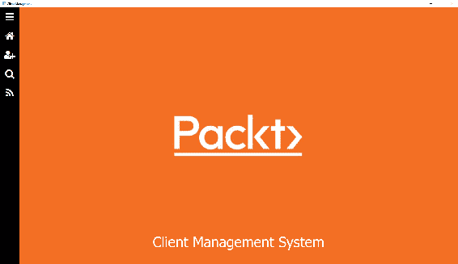

# 枚举选择器

回到[第 5 章](5.html)、*数据*，我们创建了一个联系模型，其中我们用`EnumeratorDecorator`实现了一个`ContactType`属性。对于我们在书中使用的其他基于字符串的属性，简单的 textbox 是捕获数据的好解决方案，但是我们如何捕获枚举值呢？不能期望用户知道枚举器的基础整数值，要求他们键入他们想要的选项的字符串表示形式是自找麻烦。我们真正想要的是一个下拉列表，它以某种方式利用了我们添加到类中的`contactTypeMapper`容器。我们希望向用户呈现字符串描述以供选择，然后将整数值存储在`EnumeratorDecorator`对象中。

桌面应用通常以特定的方式呈现下拉列表，您按下某种选择器，然后弹出(或者更准确地说，下拉！)可供选择的可滚动选项列表。然而，QML 不仅面向跨平台，也面向跨设备应用。许多笔记本电脑都有支持触摸的屏幕，市场上出现了越来越多的兼具笔记本电脑和平板电脑功能的混合设备。因此，考虑我们的应用有多“手指友好”是很重要的，即使我们不打算为移动商店构建下一个大的东西，经典的下拉列表可能很难在触摸屏上使用。让我们改用移动设备上使用的基于按钮的方法。

不幸的是，我们不能真正直接与 QML 现有的`std::map`合作，所以我们需要增加一些新的班级来弥补我们之间的差距。我们将每个键/值对表示为一个`DropDownValue`，并将这些对象的集合保存在一个`DropDown`对象中。一个`DropDown`对象应该在其构造函数中取一个`std::map<int, QString>`，为我们创建`DropDownValue`集合。

在`cm-lib/source/data`中首先创建`DropDownValue`类。

`dropdown-value.h`:

```cpp
#ifndef DROPDOWNVALUE_H
#define DROPDOWNVALUE_H
#include <QObject>
#include <cm-lib_global.h>
namespace cm {
namespace data {
class CMLIBSHARED_EXPORT DropDownValue : public QObject
{
    Q_OBJECT
    Q_PROPERTY(int ui_key MEMBER key CONSTANT )
    Q_PROPERTY(QString ui_description MEMBER description CONSTANT)
public:
    DropDownValue(QObject* parent = nullptr, int key = 0, const QString& description = "");
    ~DropDownValue();
public:
    int key{0};
    QString description{""};
};
}}
#endif
```

`dropdown-value.cpp`:

```cpp
#include "dropdown-value.h"
namespace cm {
namespace data {
DropDownValue::DropDownValue(QObject* parent, int _key, const QString& _description)
        : QObject(parent)
{
    key = _key;
    description = _description;
}
DropDownValue::~DropDownValue()
{
}
}}
```

这里没有什么复杂的，它只是一个整数值和相关字符串描述的 QML 友好包装器。

接下来，再次在`cm-lib/source/data`中创建`DropDown`类。

`dropdown.h`:

```cpp
#ifndef DROPDOWN_H
#define DROPDOWN_H
#include <QObject>
#include <QtQml/QQmlListProperty>
#include <cm-lib_global.h>
#include <data/dropdown-value.h>
namespace cm {
namespace data {
class CMLIBSHARED_EXPORT DropDown : public QObject
{
    Q_OBJECT
    Q_PROPERTY(QQmlListProperty<cm::data::DropDownValue> ui_values READ ui_values CONSTANT)
public:
    explicit DropDown(QObject* _parent = nullptr, const std::map<int, QString>& values = std::map<int, QString>());
    ~DropDown();
public:
    QQmlListProperty<DropDownValue> ui_values();
public slots:
    QString findDescriptionForDropdownValue(int valueKey) const;
private:
    class Implementation;
    QScopedPointer<Implementation> implementation;
};
}}
#endif
```

`dropdown.cpp`:

```cpp
#include "dropdown.h"

namespace cm {
namespace data {
class DropDown::Implementation
{
public:
    Implementation(DropDown* _dropdown, const std::map<int, QString>& _values)
        : dropdown(_dropdown)
    {
        for(auto pair : _values) {
             values.append(new DropDownValue(_dropdown, pair.first, pair.second));
        }
    }
    DropDown* dropdown{nullptr};
    QList<DropDownValue*> values;
};
DropDown::DropDown(QObject* parent, const std::map<int, QString>& values)
   : QObject(parent)
{
    implementation.reset(new DropDown::Implementation(this, values));
}
DropDown::~DropDown()
{
}
QString DropDown::findDescriptionForDropdownValue(int valueKey) const
{
    for (auto value : implementation->values) {
        if (value->key == valueKey) {
            if(!value->description.isEmpty()) {
                return value->description;
            }
            break;
        }
    }
    return "Select >";
}
QQmlListProperty<DropDownValue> DropDown::ui_values()
{
    return QQmlListProperty<DropDownValue>(this, implementation->values);
}
}}
```

如上所述，我们实现了一个构造函数，它采用了我们在`EnumeratorDecorator`类中使用的相同类型的`std::map`，并基于它创建了一个`DropDownValue`对象的集合。然后，用户界面可以通过`ui_values`属性访问该集合。我们为用户界面提供的另一个功能是通过`findDescriptionForDropdownValue`公共槽，这允许用户界面从`EnumeratorDecorator`中选择一个整数值并获得相应的文本描述。如果没有当前选择(即描述为空字符串)，那么我们将返回`Select >`向用户表示他们需要进行选择。

由于我们将在 QML 使用这些新类型，我们需要在`main.cpp`中注册它们:

```cpp
qmlRegisterType<cm::data::DropDown>("CM", 1, 0, "DropDown");
qmlRegisterType<cm::data::DropDownValue>("CM", 1, 0, "DropDownValue");
```

向名为`ui_contactTypeDropDown`的联系人添加一个新的`DropDown`属性，并在构造函数中用`contactTypeMapper`实例化成员变量。现在，每当在用户界面中显示一个联系人时，相关的`DropDown`将可用。如果您想在整个应用中重用下拉列表，这可以很容易地进入一个专门的组件，比如下拉列表管理器，但是对于这个例子，让我们避免额外的复杂性。

我们还需要能够从用户界面添加一个新的联系人对象，因此在`Client`中添加一个新的公共槽:

```cpp
void Client::addContact()
{
    contacts->addEntity(new Contact(this));
    emit contactsChanged();
}
```

C++ 完成后，我们可以继续进行用户界面实现。

我们将需要下拉选择的几个组件。当呈现一个`EnumeratorDecorator`属性时，我们希望显示当前选择的值，就像我们使用字符串编辑器一样。在视觉上，它将类似于一个按钮，相关的字符串描述作为其标签，当按下时，用户将转换到第二个组件，本质上是一个视图。这个子视图将占据整个内容框架，并呈现所有可用枚举选项的列表，同样表示为按钮。当用户通过按下其中一个按钮进行选择时，他们将转换回原始视图，并且他们的选择将在原始组件中更新。

首先，我们将创建用户将转换到的视图，它将列出所有可用的选项。为了支持这一点，我们需要 Style 中的一些附加属性:

```cpp
readonly property color colourDataSelectorBackground: "#131313"
readonly property color colourDataControlsBackgroundSelected: "#f36f24"
readonly property color colourDataSelectorFont: "#ffffff"
readonly property int sizeDataControlsRadius: tscale(5)
```

在`cm-ui/components`中创建`EnumeratorSelectorView.qml`:

```cpp
import QtQuick 2.9
import QtQuick.Controls 2.2
import CM 1.0
import assets 1.0
Item {
    id: stringSelectorView
    property DropDown dropDown
    property EnumeratorDecorator enumeratorDecorator
    property int selectedValue
    ScrollView {
        id: scrollView
        visible: true
        anchors.fill: parent
        anchors {
            top: parent.bottom
             left: parent.left
             right: parent.right
             bottom: parent.top
             margins: Style.sizeScreenMargin
        }
        Flow {
            flow: Grid.TopToBottom
            spacing: Style.sizeControlSpacing
            height: scrollView.height
            Repeater {
                id: repeaterAnswers
                model: dropDown.ui_values
                delegate:
                    Rectangle {
                        property bool isSelected: modelData.ui_key.ui_value === enumeratorDecorator.ui_value
                        width: Style.widthDataControls
                        height: Style.heightDataControls
                        radius: Style.sizeDataControlsRadius
                        color: isSelected ? Style.colourDataControlsBackgroundSelected : Style.colourDataSelectorBackground
                        Text {
                            anchors {
                                fill: parent
                                margins: Style.heightDataControls / 4
                            }
                            text: modelData.ui_description
                            color: Style.colourDataSelectorFont
                            font.pixelSize: Style.pixelSizeDataControls
                            verticalAlignment: Qt.AlignVCenter
                        }
                        MouseArea {
                            anchors.fill: parent
                            onClicked: {
                                selectedValue = modelData.ui_key;
                                contentFrame.pop();
                            }
                        }
                    }
            }
        }
    }
    Binding {
        target: enumeratorDecorator
        property: "ui_value"
        value: selectedValue
    }
}
```

在这里，我们首次使用了**中继器**元件。中继器为它在模型属性中找到的每个项目实例化在其委托属性中定义的 QML 元素。我们将`DropDownValue`对象的集合作为其模型传递给它，并内联创建一个委托。委托本质上是另一个带有选择代码的按钮。我们可以创建一个新的自定义组件，并将其用于委托，以保持代码更干净，但为了简洁起见，我们将在这里跳过它。这个组件的关键部分是`Binding`元素，它为我们提供了到所提供的`EnumeratorDecorator`的双向绑定，以及`MouseArea`中的`onClicked`事件委托，它执行更新并将这个组件从堆栈中弹出，让我们返回到我们来自的任何视图。

在`cm-ui/components`中创建新的`EnumeratorSelector.qml`:

```cpp
import QtQuick 2.9
import QtQuick.Controls 2.2
import CM 1.0
import assets 1.0
Item {
    property DropDown dropDown
    property EnumeratorDecorator enumeratorDecorator
    id: enumeratorSelectorRoot
    height: width > textLabel.width + textAnswer.width ? 
    Style.heightDataControls : Style.heightDataControls * 2
    Flow {
        anchors.fill: parent
        Rectangle {
            width: Style.widthDataControls
            height: Style.heightDataControls
            Text {
                id: textLabel
                anchors {
                    fill: parent
                    margins: Style.heightDataControls / 4
                }
                text: enumeratorDecorator.ui_label
                color: Style.colourDataControlsFont
                font.pixelSize: Style.pixelSizeDataControls
                verticalAlignment: Qt.AlignVCenter
            }
        }
        Rectangle {
            id: buttonAnswer
            width: Style.widthDataControls
            height: Style.heightDataControls
            radius: Style.sizeDataControlsRadius
            enabled: dropDown ? dropDown.ui_values.length > 0 : false
            color: Style.colourDataSelectorBackground
            Text {
                id: textAnswer
                anchors {
                    fill: parent
                    margins: Style.heightDataControls / 4
                }
                text: dropDown.findDescriptionForDropdownValue(enumeratorDecorator.ui_value)
                color: Style.colourDataSelectorFont
                font.pixelSize: Style.pixelSizeDataControls
                verticalAlignment: Qt.AlignVCenter
            }
            MouseArea {
                anchors.fill: parent
                onClicked: contentFrame.push("qrc:/components/EnumeratorSelectorView.qml",
 {dropDown: enumeratorSelectorRoot.dropDown,
 enumeratorDecorator: enumeratorSelectorRoot.enumeratorDecorator})
            }
        }
    }
}
```

这个组件在布局上与`StringEditorSingleLine`有很多相似之处，但是它用按钮表示代替了文本元素。我们从绑定的`EnumeratorDecorator`中获取值，并将其传递给我们在`DropDown`类上创建的槽，以获取当前所选值的字符串描述。当用户按下按钮时，`MouseArea`的`onClicked`事件执行与我们在`MasterView`中看到的相同类型的视图转换，将用户带到新的`EnumeratorSelectorView`。

We’re cheating a bit here in that we are directly referencing the `StackView` in `MasterView` by its `contentFrame` ID. At design time, Qt Creator can’t know what `contentFrame` is as it is in a totally different file, so it may flag it as an error, and you certainly won’t get auto-completion. At runtime, however, this component will be part of the same QML hierarchy as `MasterView`, so it will be able to find it. This is a risky approach, because if another element in the hierarchy is also called `contentFrame`, then bad things may happen. A safer way to do this is to pass `contentFrame` all the way down through the QML hierarchy from `MasterView` as a `QtObject` property.

当我们添加或编辑客户端时，我们当前忽略联系人，并且总是有一个空集合。让我们看看如何向集合中添加对象，并在使用时使用我们闪亮的新`EnumeratorSelector`。

# 联系人

我们将需要一些新的用户界面组件来管理我们的联系人。我们之前已经使用了`AddressEditor`来处理我们的地址细节，所以我们将继续使用该模型并创建一个`ContactEditor`组件。该组件将显示我们的联系人集合，每个联系人将由一个`ContactDelegate`代表。在最初创建一个新的客户端对象时，不会有任何联系人，所以我们也需要一些方法让用户添加一个新的。我们将通过按下按钮来启用它，并且我们将为可以添加到内容视图中的按钮创建一个新组件。让我们先做那个。

为了支持这个新组件，像往常一样，我们将继续向 Style 添加一些属性:

```cpp
readonly property real widthFormButton: 240
readonly property real heightFormButton: 60
readonly property color colourFormButtonBackground: "#f36f24"
readonly property color colourFormButtonFont: "#ffffff"
readonly property int pixelSizeFormButtonIcon: 32
readonly property int pixelSizeFormButtonText: 22
readonly property int sizeFormButtonRadius: 5
```

在`cm-ui/components`中创建`FormButton.qml`:

```cpp
import QtQuick 2.9
import CM 1.0
import assets 1.0
Item {
    property alias iconCharacter: textIcon.text
    property alias description: textDescription.text
    signal formButtonClicked()
    width: Style.widthFormButton
    height: Style.heightFormButton
    Rectangle {
        id: background
        anchors.fill: parent
        color: Style.colourFormButtonBackground
        radius: Style.sizeFormButtonRadius
        Text {
            id: textIcon
            anchors {
                verticalCenter: parent.verticalCenter
                left: parent.left
                margins: Style.heightFormButton / 4
            }
            font {
                family: Style.fontAwesome
                pixelSize: Style.pixelSizeFormButtonIcon
            }
            color: Style.colourFormButtonFont
            text: "\uf11a"
            horizontalAlignment: Text.AlignHCenter
            verticalAlignment: Text.AlignVCenter
        }
        Text {
            id: textDescription
            anchors {
                left: textIcon.left
                bottom: parent.bottom
                top: parent.top
                right: parent.right
            }
            font.pixelSize: Style.pixelSizeFormButtonText
            color: Style.colourFormButtonFont
            text: "SET ME!!"
            horizontalAlignment: Text.AlignHCenter
            verticalAlignment: Text.AlignVCenter
        }
        MouseArea {
            anchors.fill: parent
            cursorShape: Qt.PointingHandCursor
            hoverEnabled: true
            onEntered: background.state = "hover"
            onExited: background.state = ""
            onClicked: formButtonClicked()
        }
        states: [
            State {
                name: "hover"
                PropertyChanges {
                    target: background
                    color: Qt.darker(Style.colourFormButtonBackground)
                }
            }
        ]
    }
}
```

在这里，我们结合了本书前面所写的`NavigationButton`和`CommandButton`控件的各个方面。唯一真正的区别是，它是为了在主内容框架中更自由地使用，而不是局限于其中一个工具栏。

接下来，让我们添加用于显示/编辑单个联系人对象的组件。在`cm-ui/components`中创建`ContactDelegate.qml`:

```cpp
import QtQuick 2.9
import CM 1.0
import assets 1.0
Item {
    property Contact contact
    implicitWidth: flow.implicitWidth
    implicitHeight: flow.implicitHeight + borderBottom.implicitHeight + Style.sizeItemMargin
    height: width > selectorType.width + textAddress.width + Style.sizeScreenMargin
            ? selectorType.height + borderBottom.height + Style.sizeItemMargin
            : selectorType.height + textAddress.height + Style.sizeScreenMargin + borderBottom.height + Style.sizeItemMargin
    Flow {
        id: flow
        width: parent.width
        spacing: Style.sizeScreenMargin
        EnumeratorSelector {
            id: selectorType
            width: Style.widthDataControls
            dropDown: contact.ui_contactTypeDropDown
            enumeratorDecorator: contact.ui_contactType
        }
        StringEditorSingleLine {
            id: textAddress
            width: Style.widthDataControls
            stringDecorator: contact.ui_address
        }
    }
    Rectangle {
        id: borderBottom
        anchors {
            top: flow.bottom
            left: parent.left
            right: parent.right
            topMargin: Style.sizeItemMargin
        }
        height: 1
        color: Style.colorItemBorder
    }
}
```

这和我们在[第八章](8.html)*网页请求*中增加的`RssItemDelegate`差不多。我们添加新的`EnumeratorSelector`并将其绑定到`ui_contactType`属性，使用`ui_contactTypeDropDown`为控件提供所需的下拉信息。

在`cm-ui/components`中创建`ContactsEditor.qml`:

```cpp
import QtQuick 2.9
import CM 1.0
import assets 1.0
Panel {
    property Client client
    id: contactsEditorRoot
    contentComponent:
        Column {
            id: column
            spacing: Style.sizeControlSpacing
            Repeater {
                id: contactsView
                model: client.ui_contacts
                delegate:
                    ContactDelegate {
                        width: contactsEditorRoot.width
                        contact: modelData
                    }
            }
            FormButton {
                iconCharacter: "\uf067"
                description: "Add Contact"
                onFormButtonClicked: {
                    client.addContact();
                }
            }
        }
}
```

我们已经在`ContactDelegate`和`FormButton`控件中完成了所有的辛苦工作，所以这真的很短很甜。我们将所有内容添加到一个`Panel`中，这样外观和感觉将与其余视图保持一致。我们使用另一个`Repeater`，这样我们就可以为集合中的每个联系人旋转一个`ContactDelegate`，在联系人之后，我们会立即显示一个按钮，将新联系人添加到列表中。为了做到这一点，我们称之为我们在本章前面添加的`addContact()`方法。

现在，我们只需要将`ContactsEditor`的实例添加到`CreateClientView`中:

```cpp
ContactsEditor {
    width: scrollView.width
    client: newClient
    headerText: "Contact Details"
}
```

我们也可以在`EditClientView`中使用相同的组件:

```cpp
ContactsEditor {
    width: scrollView.width
    client: selectedClient
    headerText: "Contact Details"
}
```

就这样。构建并运行，您可以添加和编辑联系人到您的心的内容:

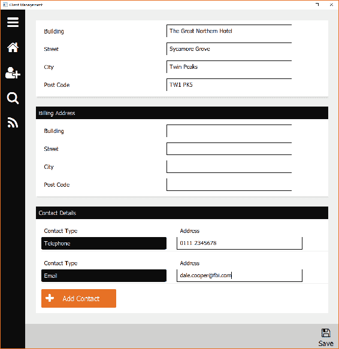

保存新客户端后，如果查看数据库，您会看到联系人阵列已相应更新，如下图所示:


现在剩下的就是约会集合了，我们已经介绍了解决这个问题所需的所有技巧，所以我们将把它作为读者的练习，然后进入最后一个主题——向最终用户部署我们的应用。

# 部署准备

我们应用的中心部分是`cm-ui`可执行文件。这是最终用户启动的文件，它打开图形窗口，编排我们写的所有花哨的东西。当我们在 Qt Creator 中运行`cm-ui`项目时，它为我们打开了可执行文件，一切都很完美。然而，不幸的是，将我们的应用分发给另一个用户比简单地在他们的机器上复制可执行文件并启动它要复杂得多。

我们的可执行文件有各种各样的依赖项，需要这些依赖项才能运行。依赖的一个主要例子是我们自己的`cm-lib`库。我们几乎所有的业务逻辑都隐藏在那里，没有这些功能，我们的用户界面就做不了什么。跨各种操作系统的依赖关系解决的实现细节是复杂的，远远超出了本书的范围。然而，我们的应用的基本要求是相同的，与平台无关。

我们需要考虑四类依赖关系，并确保它们在目标用户的机器上就位，以便我们的应用正常运行:

*   第 1 项:我们手动编写或添加到解决方案中的自定义库。在这种情况下，我们需要担心的只是`cm-lib`库。
*   第 2 项:我们的应用直接或间接链接到的 Qt 框架部分。通过我们添加到`.pro`文件中的模块，我们已经知道了其中的一些，例如`qml`和快速模块需要`QtQml`和`QtQuick`组件。
*   第 3 项:Qt 框架本身的任何内部依赖。这包括特定于平台的文件、QML 子系统的资源以及第三方库，如`sqlite`或`openssl`。
*   第 4 项:我们用来构建应用的 C++ 编译器所需的任何库。

我们已经对第 1 项进行了广泛的研究，回到[第 2 章](2.html)、*项目结构*中，我们投入了大量的工作来精确控制输出的去向。我们真的不需要担心第 2 项和第 3 项，因为我们已经在我们的开发机器上完全安装了 Qt 框架，这为我们处理了一切。同样，第 4 项由我们使用的工具包决定，如果我们的机器上有可用的编译器，那么我们也有它需要的库。

明确我们需要为最终用户(他们很可能没有安装 Qt 或其他开发工具)复制什么是一项非常痛苦的工作。即使我们做到了这一点，将所有东西打包成一个简洁的包或安装程序，让用户可以简单地运行，这本身就是一个项目。幸运的是，Qt 以捆绑工具的形式为我们提供了一些帮助。

Linux 和 macOS X 有一个应用包的概念，由此应用的可执行文件和所有依赖项可以汇总到一个文件中，然后只需点击一个按钮就可以轻松分发和启动。Windows 更自由一点，如果我们想把所有文件打包成一个可安装的文件，我们需要做更多的工作，但是 Qt 又来了，它提供了出色的 Qt Installer Framework，为我们简化了它。

让我们依次看看每个操作系统，并为每个操作系统生成一个应用包或安装程序。

# x 是什么

首先，在发布模式下使用您选择的工具包构建解决方案。你已经知道，如果我们在 Qt Creator 中按下运行按钮，我们的应用就会启动，一切都很好。但是，导航到 Finder 中的`cm-ui.app`文件，尝试直接启动；有了这个，事情就不那么乐观了:


这里的问题是缺少依赖项。我们可以使用**otol**来看看这些依赖项是什么。首先，将`cm-ui.app`包复制到一个新目录— `cm/installer/osx`。

This isn’t strictly necessary, but I like to keep build and deployment files separate. This way, if we make a code change and rebuild the solution, we will only update the app in the binaries folder, and our deployment files remain untouched.

接下来，在应用包中四处看看，看看我们在做什么。在 Finder 中，按住 *Ctrl* 并单击我们刚刚复制到安装程序文件夹中的`cm-ui.app`，然后选择“显示包内容”。我们感兴趣的是`Contents/MacOS`文件夹。在那里，你会发现我们的`cm-ui`应用可执行。

识别后，打开命令终端，导航至`cm/installer/osx`，在可执行文件上运行`otool`:

```cpp
$ otool -L cm-ui.app/Contents/MacOS/cm-ui
```

您将看到与以下内容相同(或相似)的输出:

```cpp
cm-ui:
libcm-lib.1.dylib (compatibility version 1.0.0, current version 1.0.0)
@rpath/QtQuick.framework/Versions/5/QtQuick (compatibility version 5.9.0, current version 5.9.1)
@rpath/QtQml.framework/Versions/5/QtQml (compatibility version 5.9.0, current version 5.9.1)
@rpath/QtNetwork.framework/Versions/5/QtNetwork (compatibility version 5.9.0, current version 5.9.1)
@rpath/QtCore.framework/Versions/5/QtCore (compatibility version 5.9.0, current version 5.9.1)
/System/Library/Frameworks/DiskArbitration.framework/Versions/A/DiskArbitration (compatibility version 1.0.0, current version 1.0.0)
/System/Library/Frameworks/IOKit.framework/Versions/A/IOKit (compatibility version 1.0.0, current version 275.0.0)
@rpath/QtGui.framework/Versions/5/QtGui (compatibility version 5.9.0, current version 5.9.1)
@rpath/QtXml.framework/Versions/5/QtXml (compatibility version 5.9.0, current version 5.9.1)
/System/Library/Frameworks/OpenGL.framework/Versions/A/OpenGL (compatibility version 1.0.0, current version 1.0.0)
/System/Library/Frameworks/AGL.framework/Versions/A/AGL (compatibility version 1.0.0, current version 1.0.0)
/usr/lib/libc++.1.dylib (compatibility version 1.0.0, current version 307.5.0)
/usr/lib/libSystem.B.dylib (compatibility version 1.0.0, current version 1238.50.2)
```

让我们提醒自己需要考虑的依赖关系，并看看它们如何与我们刚刚看到的输出相关联:

*   我们手动编写或添加到解决方案中的自定义库(`cm-lib`)。这是`libcm-lib.1.dylib`的参考。没有路径组件的事实表明，该工具不太确定该文件的位置。它应该和可执行文件在同一个文件夹吗？应该在标准的`/usr/lib/`文件夹里吗？幸运的是，我们可以在打包应用时指定该文件的位置。
*   我们的应用链接到的 Qt 框架部分。`QtQuick`、`QtQml`等都是我们在`cm-ui`代码中直接引用的框架模块。其中一些是通过我们的`cm-ui.pro`文件中的 QT 变量显式引入的，而其他的是使用像 QML 这样的东西隐式引入的。
*   Qt 框架本身的任何内部依赖。我们没有看到前面列出的那些，但是如果我们对`QtQuick`模块运行 otool，你会看到它依赖于`QtQml`、`QtNetwork`、`QtGui`和`QtCore`。还需要几个系统级的库，比如 OpenGL，我们没有明确针对它进行编码，但是 Qt 使用了它。
*   我们用来构建应用的 C++ 编译器所需的任何库；`libc++.1.dylib`在这里脱颖而出。

为了手动绑定我们所有的依赖项，我们可以将它们全部复制到应用包中，然后执行一些重新配置步骤来更新我们从 otool 中看到的位置元数据。

让我们选择一个框架依赖项——`QtQuick`——并快速完成我们必须做的事情来实现这一点，然后我们将转向真正方便的工具，它为我们完成所有这些非常不愉快的繁重工作。

首先，我们将创建一个`Frameworks`目录，系统将在其中搜索捆绑的依赖项:

```cpp
$ mkdir cm-ui.app/Contents/Frameworks
```

接下来，我们将把引用的文件物理复制到新目录中。由于前面的`LC_RPATH`条目，我们知道在我们的开发机器上哪里可以找到现有的文件，在本例中为`/Users/<Your Username>/Qt5.9.1/5.9.1/clang_64/lib`:

```cpp
$ cp -R /Users/<Your Username>  /Qt5.9.1 /5.9.1/clang_64 /lib/ QtQuick.framework cm-ui.app/Contents/Frameworks
```

然后，我们需要使用`install_name_tool`为复制的库文件更改共享库标识名:

```cpp
$ install_name_tool -id @executable_path /../Frameworks / QtQuick.framework/Versions/5/QtQuick cm-ui.app /Contents /Frameworks / QtQuick.framework/Versions/5/QtQuick
```

这里的语法是`install_name_tool -id [New name] [Shared library file]`。为了获得库文件(不是框架包，这是我们复制的)，我们深入到`Versions/5/QtQuick`。我们将该二进制文件的标识设置为可执行文件将查找它的位置，在本例中，该位置在可执行文件本身的上一级(`../`)的`Frameworks`文件夹中。

接下来，我们还需要更新可执行文件的依赖项列表，以便在正确的位置查找这个新文件:

```cpp
$ install_name_tool -change @rpath/QtQuick.framework/Versions/5/QtQuick @executable_path/../Frameworks/QtQuick.framework/Versions/5/QtQuick cm-ui.app/Contents/MacOs/cm-ui
```

这里的语法是`install_name_tool -change [old value] [new value] [executable file]`。我们希望将旧的`QtQuick`条目改为我们刚刚添加的新框架路径。同样，我们使用`@executable_path`变量，以便依赖项总是位于相对于可执行文件的相同位置。现在，可执行文件和共享库中的元数据相互匹配，并且与`Frameworks`文件夹相关，我们现在已经将该文件夹添加到我们的应用包中。

记住，这还不是全部，因为`QtQuick`本身有依赖关系，所以我们也需要复制和重新配置所有那些文件，然后检查它们的依赖关系。一旦我们用完了我们的`cm-ui`可执行文件的整个依赖树，我们还需要为我们的`cm-lib`库重复这个过程。可以想象，这很快就会变得乏味。

幸运的是`macdeployqt` Qt Mac 部署工具正是我们这里需要的。它扫描一个可执行文件中的 Qt 依赖项，并将它们复制到我们的应用包中，以便我们处理重新配置工作。该工具位于已安装工具包的`bin`文件夹中，您已经使用例如`/Qt/5.9.1/5.9.1/clang_64/bin`构建了应用。

在命令终端中，如下执行`macdeployqt`(假设你在`cm/installer/osx`目录中):

```cpp
$ <Path to bin>/macdeployqt cm-ui.app -qmldir=<Qt Projects>/cm/cm-ui -libpath=<Qt Projects>/cm/binaries/osx/clang/x64/release
```

请记住用系统上的完整路径替换尖括号中的参数(或者将可执行路径添加到系统 PATH 变量中)。

`qmldir`标志告诉工具在哪里扫描 QML 进口，并设置为我们的用户界面项目文件夹。`libpath`标志用于指定我们编译的`cm-lib`文件的位置。

该操作的输出如下:

```cpp
File exists, skip copy: "cm-ui.app/Contents/PlugIns/quick/libqtquick2plugin.dylib"
File exists, skip copy: "cm-ui.app/Contents/PlugIns/quick/libqtquickcontrols2plugin.dylib"
File exists, skip copy: "cm-ui.app/Contents/PlugIns/quick/libqtquickcontrols2materialstyleplugin.dylib"
File exists, skip copy: "cm-ui.app/Contents/PlugIns/quick/libqtquickcontrols2universalstyleplugin.dylib"
File exists, skip copy: "cm-ui.app/Contents/PlugIns/quick/libwindowplugin.dylib"
File exists, skip copy: "cm-ui.app/Contents/PlugIns/quick/libqtquicktemplates2plugin.dylib"
File exists, skip copy: "cm-ui.app/Contents/PlugIns/quick/libqtquickcontrols2materialstyleplugin.dylib"
File exists, skip copy: "cm-ui.app/Contents/PlugIns/quick/libqtquickcontrols2materialstyleplugin.dylib"
File exists, skip copy: "cm-ui.app/Contents/PlugIns/quick/libqtquickcontrols2universalstyleplugin.dylib"
File exists, skip copy: "cm-ui.app/Contents/PlugIns/quick/libqtquickcontrols2universalstyleplugin.dylib"
WARNING: Plugin "libqsqlodbc.dylib" uses private API and is not Mac App store compliant.
WARNING: Plugin "libqsqlpsql.dylib" uses private API and is not Mac App store compliant.
ERROR: no file at "/opt/local/lib/mysql55/mysql/libmysqlclient.18.dylib"
ERROR: no file at "/usr/local/lib/libpq.5.dylib"
```

Qt 在 SQL 模块上有点古怪，如果你使用一个 SQL 驱动程序，它会尝试将它们打包；但是，我们知道我们只使用 SQLite，不需要 MySQL 或 PostgreSQL，因此我们可以放心地忽略那些错误。

一旦执行，您应该能够在 Finder 中再次显示包内容，并看到所有已准备好并等待部署的依赖项，如图所示:

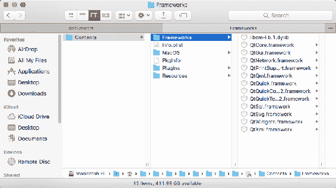

多么节省时间啊！它已经创建了适当的文件结构，并为我们复制了所有 Qt 模块和插件，以及我们的`cm-lib`共享库。现在尝试执行`cm-ui.app`文件，应该可以成功启动应用。

# Linux 操作系统

Linux 打包和部署与 OS X 大体相似，我们不会在相同的细节层次上讨论它，所以如果还没有，至少先浏览一下 OS X 部分。与所有平台一样，首先要做的是在**发布**模式下使用您选择的工具包构建解决方案，以便生成二进制文件。

When building in Release mode for the first time, I received the “cannot find -lGL” error. This was because the `dev` libraries for OpenGL were not installed on my system. One way of obtaining these libraries is to install FreeGlut:
`$ sudo apt-get update`
`$ sudo apt-get install build-essential`
`$ sudo apt-get install freeglut3-dev`

编译完成后，将`cm-ui`二进制文件复制到新的`cm/installer/linux`目录中。

接下来，我们可以看看我们的应用有哪些依赖关系。在命令终端中，切换到`cm/installer/linux`文件夹并运行`ldd`:

```cpp
$ ldd <Qt Projects>/cm/binaries/linux/gcc/x64/release/cm-ui
```

您将看到类似如下的输出:

```cpp
linux-vdso.so.1 => (0x00007ffdeb1c2000)
libcm-lib.so.1 => /usr/lib/libcm-lib.so.1 (0x00007f624243d000)
libQt5Gui.so.5 => /home/nick/Qt/5.9.1/gcc_64/lib/libQt5Gui.so.5 (0x00007f6241c8f000)
libQt5Qml.so.5 => /home/nick/Qt/5.9.1/gcc_64/lib/libQt5Qml.so.5 (0x00007f6241698000)
libQt5Xml.so.5 => /home/nick/Qt/5.9.1/gcc_64/lib/libQt5Xml.so.5 (0x00007f624145e000)
libQt5Core.so.5 => /home/nick/Qt/5.9.1/gcc_64/lib/libQt5Core.so.5 (0x00007f6240d24000)
libstdc++.so.6 => /usr/lib/x86_64-linux-gnu/libstdc++.so.6 (0x00007f62409a1000)
libgcc_s.so.1 => /lib/x86_64-linux-gnu/libgcc_s.so.1 (0x00007f624078b000)
libc.so.6 => /lib/x86_64-linux-gnu/libc.so.6 (0x00007f62403c1000)
libQt5Sql.so.5 => /home/nick/Qt/5.9.1/gcc_64/lib/libQt5Sql.so.5 (0x00007f6240179000)
libQt5Network.so.5 => /home/nick/Qt/5.9.1/gcc_64/lib/libQt5Network.so.5 (0x00007f623fde8000)
libpthread.so.0 => /lib/x86_64-linux-gnu/libpthread.so.0 (0x00007f623fbcb000)
libGL.so.1 => /usr/lib/x86_64-linux-gnu/mesa/libGL.so.1 (0x00007f623f958000)
libz.so.1 => /lib/x86_64-linux-gnu/libz.so.1 (0x00007f623f73e000)
libm.so.6 => /lib/x86_64-linux-gnu/libm.so.6 (0x00007f623f435000)
librt.so.1 => /lib/x86_64-linux-gnu/librt.so.1 (0x00007f623f22c000)
libicui18n.so.56 => /home/nick/Qt/5.9.1/gcc_64/lib/libicui18n.so.56 (0x00007f623ed93000)
libicuuc.so.56 => /home/nick/Qt/5.9.1/gcc_64/lib/libicuuc.so.56 (0x00007f623e9db000)
libicudata.so.56 => /home/nick/Qt/5.9.1/gcc_64/lib/libicudata.so.56 (0x00007f623cff7000)
libdl.so.2 => /lib/x86_64-linux-gnu/libdl.so.2 (0x00007f623cdf3000)
libgthread-2.0.so.0 => /usr/lib/x86_64-linux-gnu/libgthread-2.0.so.0 (0x00007f623cbf1000)
libglib-2.0.so.0 => /lib/x86_64-linux-gnu/libglib-2.0.so.0 (0x00007f623c8df000)
/lib64/ld-linux-x86-64.so.2 (0x0000562f21a5c000)
libexpat.so.1 => /lib/x86_64-linux-gnu/libexpat.so.1 (0x00007f623c6b6000)
libxcb-dri3.so.0 => /usr/lib/x86_64-linux-gnu/libxcb-dri3.so.0 (0x00007f623c4b2000)
libxcb-present.so.0 => /usr/lib/x86_64-linux-gnu/libxcb-present.so.0 (0x00007f623c2af000)
libxcb-sync.so.1 => /usr/lib/x86_64-linux-gnu/libxcb-sync.so.1 (0x00007f623c0a8000)
libxshmfence.so.1 => /usr/lib/x86_64-linux-gnu/libxshmfence.so.1 (0x00007f623bea4000)
libglapi.so.0 => /usr/lib/x86_64-linux-gnu/libglapi.so.0 (0x00007f623bc75000)
libXext.so.6 => /usr/lib/x86_64-linux-gnu/libXext.so.6 (0x00007f623ba63000)
libXdamage.so.1 => /usr/lib/x86_64-linux-gnu/libXdamage.so.1 (0x00007f623b85f000)
libXfixes.so.3 => /usr/lib/x86_64-linux-gnu/libXfixes.so.3 (0x00007f623b659000)
libX11-xcb.so.1 => /usr/lib/x86_64-linux-gnu/libX11-xcb.so.1 (0x00007f623b457000)
libX11.so.6 => /usr/lib/x86_64-linux-gnu/libX11.so.6 (0x00007f623b11c000)
libxcb-glx.so.0 => /usr/lib/x86_64-linux-gnu/libxcb-glx.so.0 (0x00007f623af03000)
libxcb-dri2.so.0 => /usr/lib/x86_64-linux-gnu/libxcb-dri2.so.0 (0x00007f623acfe000)
libxcb.so.1 => /usr/lib/x86_64-linux-gnu/libxcb.so.1 (0x00007f623aadb000)
libXxf86vm.so.1 => /usr/lib/x86_64-linux-gnu/libXxf86vm.so.1 (0x00007f623a8d5000)
libdrm.so.2 => /usr/lib/x86_64-linux-gnu/libdrm.so.2 (0x00007f623a6c4000)
libpcre.so.3 => /lib/x86_64-linux-gnu/libpcre.so.3 (0x00007f623a453000)
libXau.so.6 => /usr/lib/x86_64-linux-gnu/libXau.so.6 (0x00007f623a24e000)
libXdmcp.so.6 => /usr/lib/x86_64-linux-gnu/libXdmcp.so.6 (0x00007f623a048000)
```

这是一些依赖列表！关键是，请注意对我们的`cm-lib`库的依赖:

```cpp
libcm-lib.so.1 => /usr/lib/libcm-lib.so.1
```

这表明可执行文件将在`/usr/lib`文件夹中查找我们的库，所以在我们继续之前，让我们通过将`libcm-lib.so.1`复制到`/usr/lib`来确保它在那里可用:

```cpp
$ sudo cp <Qt Projects>/cm/binaries/linux/gcc/x64/release/libcm-lib.so.1 /usr/lib
```

我们已经可以猜测手动管理所有这些依赖项将会是一场怎样的噩梦，已经讨论了 OS X 过程并看到有多少依赖项，所以在我们的 Kit 的`bin`文件夹中一定有一个工具可以为我们完成这一切，对吗？嗯，有也没有。没有官方的 Qt 工具，我们可以像 OS X 和视窗系统那样开箱即用。幸运的是，Qt 社区`probonopd`的一名优秀成员前来救援，填补了与`linuxdeployqt`的空白。

你可以在[https://github.com/probonopd/linuxdeployqt](https://github.com/probonopd/linuxdeployqt)的 GitHub 项目发布页面获得一个`linuxdeployqt`应用图片。下载文件(`linuxdeployqt-continuous-x86_64.AppImage`)然后使其可执行:

```cpp
$ chmod a+x <Path to downloaded file>/linuxdeployqt-continuous-x86_64.AppImage
```

然后我们可以执行它，让它为我们发挥它基于依赖的魔力。先把目录改成`cm/installer/linux`:

```cpp
$ <Path to downloaded file>/linuxdeployqt-continuous-x86_64.AppImage cm-ui -qmldir=<Qt Projects>/cm/cm-ui -appimage
```

`qmldir`标志告诉工具在哪里扫描 QML 进口，并设置为我们的用户界面项目文件夹。`appimage`标志用来让工具为我们创建一个应用镜像文件，这是一个里面捆绑了所有东西的单个文件。

事情第一次可能不会完美。您的输出可能如下所示:

```cpp
ERROR: Desktop file missing, creating a default one (you will probably want to edit it)
ERROR: Icon file missing, creating a default one (you will probably want to edit it)
ERROR: "/usr/bin/qmake -query" exited with 1 : "qmake: could not exec '/usr/lib/x86_64-linux-gnu/qt4/bin/qmake': No such file or directory\n"
ERROR: Qt path could not be determined from qmake on the $PATH
ERROR: Make sure you have the correct Qt on your $PATH
ERROR: You can check this with qmake -v
```

前两个错误只是因为我们没有提供桌面文件或图标，已经为我们生成了默认值；我们可以忽略这些。剩下的都是因为`linuxdeployqt`不知道`qmake`在哪里。我们可以提供路径作为一个额外的参数(`-qmake=<PATH>`)，或者为了避免我们每次都必须这样做，我们可以将其添加到我们的 path 环境变量中:

```cpp
$ export PATH=<Qt Path>/5.9.1/gcc_64/bin/:$PATH
```

然后，我们可以通过尝试检索版本信息来检查是否可以找到 qmake:

```cpp
$ qmake -v
```

如果是快乐的，你会看到版本信息:

```cpp
QMake version 3.1
Using Qt version 5.9.1 in /home/nick/Qt/5.9.1/gcc_64/lib
```

修复后，我们现在可以再次尝试运行`linuxdeployqt`命令。然而，我们已经解决了一个问题，但现在遇到了另一个问题:

```cpp
ERROR: Desktop file missing, creating a default one (you will probably want to edit it)
ERROR: Icon file missing, creating a default one (you will probably want to edit it)
ERROR: ldd outputLine: "libmysqlclient.so.18 => not found"
ERROR: for binary: "/home/nick/Qt/5.9.1/gcc_64/plugins/sqldrivers/libqsqlmysql.so"
ERROR: Please ensure that all libraries can be found by ldd. Aborting.
```

再次忽略前两个错误。现在它找不到 MySQL 驱动程序，这很烦人，因为我们甚至不是 MySQL，它与我们在 OS X 上看到的 Qt SQL 怪癖是一样的。作为一种变通方法，让我们通过临时重命名来有效地“隐藏”我们不想要的工具中的 SQL 驱动程序:

```cpp
$ cd <Qt Path>/5.9.1/gcc_64/plugins/sqldrivers
$ mv libqsqlmysql.so libqsqlmysql.so_ignore
$ mv libqsqlpsql.so libqsqlpsql.so_ignore
```

再次运行`linuxdeployqt`命令。这次您将获得大量输出，最终得到一条成功消息，包括以下内容:

```cpp
App name for filename: Application
dest_path: Application-x86_64.AppImage
```

这是在告诉我们，我们的 app 图像已经被命名为`Application-x86_64.AppImage`，并保存到`Downloads`文件夹中。

看看文件管理器，您会发现它在我们的可执行文件旁边添加了各种文件和目录:

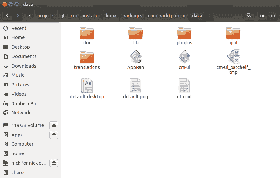

它还将`Application-x86_64.AppImage`文件存放在`Downloads`文件夹中，该文件夹是一个包含所有依赖项的独立可执行包。但是，如果您前往`Downloads`并尝试启动`AppImage`，则可能会出现错误(通过终端命令执行以查看错误消息):

```cpp
QXcbIntegration: Cannot create platform OpenGL context, neither GLX nor EGL are enabled
```

这似乎是`linuxdeployqt`缺少一些依赖关系的问题，但是出于某种原因，第二次运行工具会神奇地获得它们。再次执行`linuxdeployqt`命令，嘿，很快，`AppImage`就可以正常工作了。

# Windows 操作系统

首先，在**发布**模式下使用您选择的套件构建解决方案。完成后，将`cm-ui.exe`和`cm-lib.dll`应用二进制文件复制到新的`cm/installer/windows/packages/com.packtpub.cm/data`目录。这种奇怪的目录结构将在下一节——Qt Installer Framework——中解释，我们只是在后面为自己保存一些额外的拷贝。

接下来，让我们提醒自己需要考虑的依赖性:

*   第 1 项:我们手动编写或添加到解决方案中的自定义库(`cm-lib`)
*   第 2 项:我们的应用链接到的 Qt 框架部分
*   第 3 项:Qt 框架本身的任何内部依赖
*   第 4 项:我们用来构建应用的 C++ 编译器所需的任何库

好消息是第一项已经完成了！Windows 将在可执行文件所在的文件夹中查找该可执行文件的依赖项。这真的很有帮助，通过简单地将 DLL 复制到与可执行文件相同的文件夹中，我们已经处理了这种依赖性。Qt Installer 框架从一个给定的文件夹中获取所有文件，并将它们部署到目标机器上彼此相对的相同位置，因此我们知道这在部署后也会被保留。

坏消息是，手动管理剩余的步骤有点像噩梦。通过查看我们明确添加到`*.pro`文件中的模块，我们可以对我们需要 Qt 的哪些部分进行初步尝试。这将是来自`cm-ui`和`sql`的`qml`、`quick`和`xml`，默认情况下还包括来自`cm-lib`核心的网络和`xml`。在文件浏览器中，导航至`<Qt Installation Folder>/5.9.1/<Kit>/bin`。在那里，您可以找到与这些模块相关的所有二进制文件，例如`qml`模块的`Qt5Qml.dll`。

我们可以使用我们为`cm-lib.dll`所做的方法，并简单地手动将每个 Qt 动态链接库文件复制到数据文件夹中。这将完成第 2 项，虽然非常乏味，但相当简单。然而，第 3 项是一项我们自己真的不想做的痛苦练习。

幸运的是`windeployqt` Qt Windows 部署工具正是我们这里需要的。它扫描一个`.exe`文件寻找 Qt 依赖项，并将它们复制到我们的安装文件夹中。该工具位于已安装工具包的`bin`文件夹中，您已经使用例如`/Qt/5.9.1/mingw32/bin`构建了应用。

在命令终端中，执行`windeployqt`如下:

```cpp
$ <Path to bin>/windeployqt.exe --qmldir <Qt Projects>/cm/cm-ui <Qt Projects>/cm/installer/windows/packages/com.packtpub.cm/data/cm-ui.exe --compiler-runtime
```

请记住用系统上的完整路径替换尖括号中的参数(或者将可执行路径添加到系统 PATH 变量中)。

`qmldir`标志告诉工具在哪里扫描 QML 进口，并设置为我们的用户界面项目文件夹。在我们告诉工具要扫描哪个`.exe`依赖项后，`compiler-runtime`标志表示我们也想要编译器运行时文件，所以它甚至会为我们处理第 4 项作为奖励！

By default, found dependencies will subsequently be copied to the same folder as the executable being scanned. This is a good reason to copy the compiled binaries to a dedicated installer folder first so that development project output and content for deployment remain separate.

一旦执行，您应该会看到一大块输出。虽然很容易让人认为“哦，那是已经完成的事情，所以一切都必须正常”，但浏览输出是个好主意，即使你不确定它在做什么，因为你有时会发现一些明显的问题，你可以采取行动来解决。

例如，当第一次部署 MinGW 工具包构建时，我遇到了给定的行:

```cpp
Warning: Cannot find GCC installation directory. g++.exe must be in the path.
```

尽管该命令已经成功执行，并且我可以在安装程序文件夹中看到一大堆 Qt 依赖项，但实际上我遗漏了 GCC 依赖项。按照说明将`<Qt Installation path>/Tools/mingw530_32/bin`添加到我的系统环境变量中的 PATH 变量是一个简单的修复。在重新启动命令终端并再次运行`windeployqt`命令后，它随后成功完成，没有警告，并且 GCC 文件与所有 Qt 二进制文件一起出现在数据中。如果没有听到这个安静的小警告，我会继续处理一些潜在的关键缺失文件。

如您所见，`windeployqt`是一个巨大的时间节省器，但不幸的是，它不是银弹，有时会错过所需的文件。像 Dependency Walker 这样的工具是存在的，可以帮助详细分析依赖树，但是一个很好的起点就是从数据文件夹手动启动`cm-ui`可执行文件，看看会发生什么。在我们的例子中，是这样的:

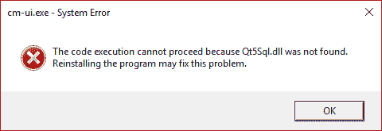

坏消息是它不起作用，但好消息是至少它清楚地告诉我们为什么它不起作用——它缺少`Qt5Sql.dll`依赖。我们知道我们确实有依赖关系，因为当我们开始做数据库工作时，我们必须把`sql`模块添加到我们的`.pro`文件中。但是，等等，我们刚刚执行了一个命令，应该会为我们引入所有的 Qt 依赖项，对吗？是的，我不知道为什么这个工具遗漏了一些它真正应该知道的依赖关系，但是它确实遗漏了。我不知道这是 bug、疏忽还是与底层第三方 SQLite 实现相关的许可限制，但无论如何，简单的解决方案是我们只需要自己复制它。

前往`<Qt Installation>/5.9.1/<kit>/bin`并将`Qt5Sql.dll`复制到我们的数据文件夹。再次启动`cm-ui.exe`并欢呼，它成功开启！

One other thing to look out for apart from missing `.dll` files from the bin directory is missing files/folders from the plugins directory. You will see in our case that several folders have been copied successfully (bearer, iconengines, and such), but sometimes they don’t, and can be very difficult to figure out as you don’t get a helpful error message like we did with the missing DLL. I can only recommend three things in that situation: trial, error, and the internet.

因此，我们现在有了一个包含我们可爱的应用二进制文件和一大堆类似可爱的其他文件和文件夹的文件夹。现在怎么办？我们可以简单地将文件夹批量复制到用户的机器上，让他们像我们一样启动可执行文件。然而，一个更整洁、更专业的解决方案是将所有东西打包成一个漂亮的安装包，这就是 Qt Installer Framework 工具的用途。

# Qt 安装程序框架

让我们编辑我们的 Qt 安装，并获取 Qt 安装程序框架。

从您的 Qt 安装目录启动维护工具应用，您将看到一个与我们第一次安装 Qt 时看到的向导几乎相同的向导。要将 Qt 安装程序框架添加到现有安装中，请执行以下步骤:

1.  登录您的 Qt 帐户或跳过
2.  选择添加或删除组件，然后单击下一步
3.  在选择组件对话框中，选择工具> Qt 安装程序框架 3.0，然后单击下一步
4.  单击更新开始安装

一旦完成，您可以在`Qt/Tools/QtInstallerFramework/3.0`中找到安装的工具。

You can add further modules, kits, and such in exactly the same way. Any components you already have installed will be unaffected unless you actively deselect them.

Qt 安装程序框架需要两个特定的目录:配置和包。Config 是一个单一的配置，它将安装程序描述为一个整体，而您可以将多个包(或组件)捆绑在同一个安装包中。每个组件在 packages 文件夹中都有自己的子目录，一个数据文件夹包含要为该组件安装的所有项目，一个元文件夹保存该包的配置数据。

在我们的例子中，虽然我们有两个项目(`cm-lib`和`cm-ui`)，但是分发一个而不分发另一个是没有意义的，所以我们将把文件聚合到一个包中。包的一个常见命名约定是`com.<publisher>.<component>`，所以我们将命名我们的`com.packtpub.cm.`我们已经在前一节中创建了所需的数据文件夹(对未来计划来说太棒了！)并且`windeployqt`给我们塞了满满的文件。

这里没有必要的命名约定，所以如果您愿意，可以随意将包命名为其他名称。如果我们想将一个额外的可选组件与我们的应用捆绑在一起，我们只需创建一个包含相关数据和元文件的额外包文件夹(例如`com.packtpub.amazingcomponent`)，包括一个单独的`package.xml`来配置该组件。

创建任何丢失的文件夹，以便在`cm/installer/windows`中得到以下文件夹结构:


为了补充这些文件夹，我们还需要提供两个 XML 配置文件。

在配置子文件夹中创建`config.xml`:

```cpp
<?xml version="1.0" encoding="UTF-8"?>
<Installer>
    <Name>Client Management</Name>
    <Version>1.0.0</Version>
    <Title>Client Management Application Installer</Title>
    <Publisher>Packt Software Publishing</Publisher>
    <StartMenuDir>Client Management</StartMenuDir>
    <TargetDir>@HomeDir@/ClientManagement</TargetDir>
</Installer>
```

此配置文件自定义安装程序的行为。我们在此指定的属性如下:

| 财产 | 目的 |
| `Name` | 应用名称 |
| `Version` | 应用版本 |
| `Title` | 标题栏中显示的安装程序名称 |
| `Publisher` | 软件的发行者 |
| `StartMenuDir` | “开始”菜单中的默认程序组 |
| `TargetDir` | 应用安装的默认目标目录 |

You will note strange @ symbols in the `TargetDir` property, and they define a predefined variable `HomeDir` that allows us to dynamically obtain a path to the end user’s home directory. You can also access the values of other properties in the same way, for example, `@ProductName@` will return “Client Management”. Further information is available at [http://doc.qt.io/qtinstallerframework/scripting.html#predefined-variables](http://doc.qt.io/qtinstallerframework/scripting.html#predefined-variables).

接下来，在`packages/com.packtpub.cm/meta`子文件夹中创建`package.xml`:

```cpp
<?xml version="1.0" encoding="UTF-8"?>
<Package>
    <DisplayName>Client Management application</DisplayName>
    <Description>Install the Client Management application.</Description>
    <Version>1.0.0</Version>
    <ReleaseDate>2017-10-30</ReleaseDate>
    <Licenses>
        <License name="Fictional Training License Agreement" file="license.txt" />
    </Licenses>
    <Default>true</Default>
</Package>
```

该文件使用以下属性配置`com.packtpub.cm`包(我们的客户端管理应用):

| 财产 | 目的 |
| `DisplayName` | 组件的名称。 |
| `Description` | 选择组件时显示的文本。 |
| `Version` | 组件的版本(用于促进组件更新)。 |
| `ReleaseDate` | 组件发布的日期。 |
| `Licenses` | 安装软件包必须同意的许可证集合。许可协议的文本是从元文件夹中配置文件旁边的指定文件中获取的。 |
| `Default` | 表示默认情况下是否选择组件的布尔标志。 |

您还需要在元文件夹中创建`license.txt`；在这种情况下，内容并不重要，因为它只是为了演示，所以在里面写任何旧的废话。

有了所有的二进制文件、依赖项和配置，我们现在可以在命令终端中运行 Qt 框架安装程序来生成我们的安装包。首先将目录改为`cm/installer/windows`文件夹，然后执行`binarycreator`:

```cpp
$ <Qt Installation Path> \Tools \QtInstallerFramework \3.0\ bin\ binarycreator.exe -c config\config.xml -p packages ClientManagementInstaller.exe
```

`-c`标志告诉工具`config.xml`文件的位置和`-p`所有包的位置。最后一个参数是您想要给结果安装程序的名称。

随着我们的应用被整齐地打包到一个安装程序文件`ClientManagementInstaller.exe`中，我们现在可以轻松地将其分发给最终用户进行安装。

# 装置

启动安装程序后，您将看到一个欢迎对话框，其内容来自我们的`config.xml`文件:

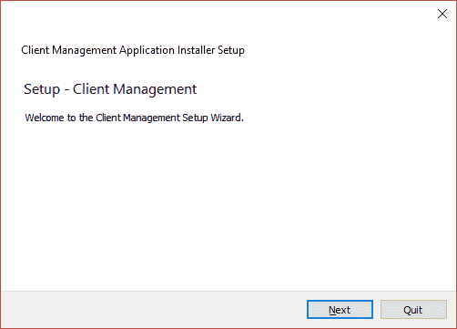

然后，系统会提示我们指定安装的目标目录，我们希望安装后，该文件夹将包含我们在数据文件夹中找到的所有文件和文件夹:

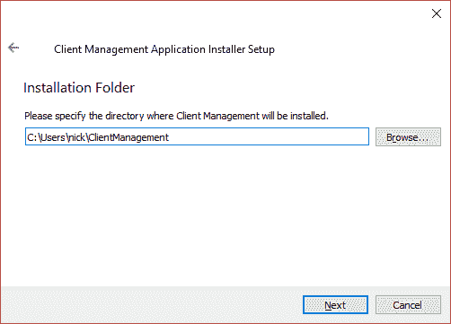

然后，我们会看到一个通过包目录定义的所有组件的列表，在这种情况下，它只是`com.packtpub.cm`文件夹中的应用和依赖项:


接下来，我们将看到我们在`packages.xml`中定义的任何许可证，包括文本文件中提供的许可证信息:

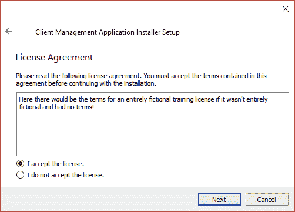

然后系统会提示我们输入开始菜单快捷方式，默认值由`config.xml`提供:

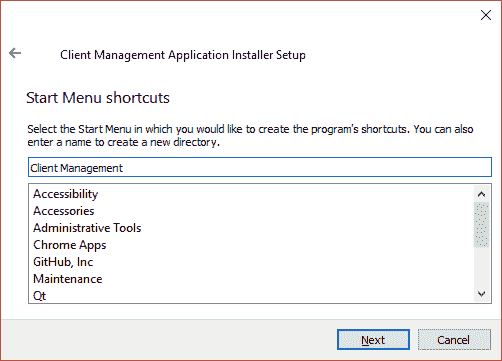

我们现在准备安装，并在确认之前提供磁盘使用统计信息:

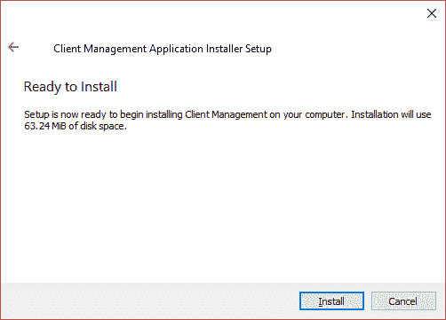

安装完成后，经过短暂的等待，我们会看到一个最终确认对话框:

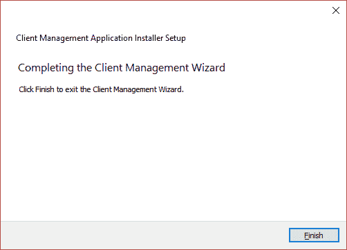

您应该会在目标目录中看到一个新的`ClientManagement`文件夹，其中包含我们安装的应用！

# 摘要

在这一章中，我们通过介绍我们的第一个对象工厂，使我们的应用更加可测试。它们是一个非常有用的抽象层，使得单元测试变得非常容易，在更大的项目中，通常会有几个工厂。然后，我们使我们的用户界面更加动态，拥有可以随窗口缩放的样式属性。`EnumeratorDecorators`得到了一些爱和一个自己的编辑器组件，完全手指友好启动。然后，我们使用该编辑器并实现了联系人管理，展示了如何轻松查看和编辑对象集合。

随着我们的应用变得更加充实，我们接下来看看如何将我们闪亮的天才新作交到最终用户手中。不同的操作系统各有各的特色，你无疑会在自己的特定环境中发现怪癖并遇到挑战，但希望你现在有了能够解决这些问题的工具。

这种情绪不仅适用于部署，也适用于整个项目生命周期。这本书的目的不是讨论理论问题，这些问题虽然有趣，但在你作为开发人员的日常工作中永远不会出现。目标是提出现实世界问题的解决方案。我们从头到尾开发了一个功能性的业务线应用，处理您每天都会遇到的常见任务，无论是工作中的计划还是家中的个人项目。

我希望本书中详细介绍的一些方法对您有用，并且您会像我一样喜欢使用 Qt。