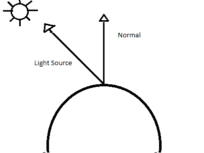
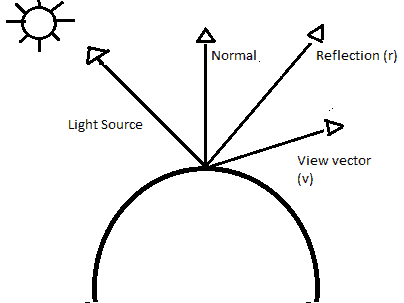
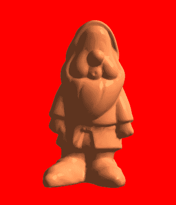
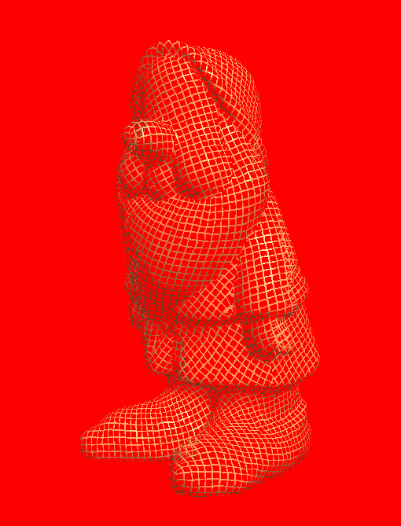

# 七、高级渲染

通常，玩家对你游戏的第一印象是屏幕上的视觉效果。对创建高级渲染技术有深刻的理解对于构建引人注目的沉浸式体验至关重要。在本章中，我们将了解如何通过实现着色器技术来创建一些高级渲染效果。

*   着色器简介
*   照明技术
*   使用着色器创建效果

# 着色器简介

简而言之，着色器是一个计算机程序，用于进行图像处理，如特效、色彩效果、照明以及着色。使用着色器程序中构建的算法，可以在运行时更改用于在屏幕上生成最终图像的所有像素、顶点或纹理的位置、亮度、对比度、色调和其他效果。如今，大多数着色器程序都是直接在**图形处理单元** ( **图形处理器**)上运行的。着色器程序并行执行。这意味着，例如，一个着色器可能每个像素执行一次，每个执行同时在图形处理器的不同线程上运行。并发线程的数量取决于显卡特定的图形处理器，现代显卡配备的处理器数以千计。这意味着着色器程序可以非常高效，并为开发人员提供了很多创造性的灵活性。在本节中，我们将了解着色器，并为示例引擎实现我们自己的着色器基础架构。

# 着色器语言

随着显卡技术的进步，渲染流水线增加了更多的灵活性。在过去，开发人员几乎无法控制固定功能管道渲染等概念，但新的进步使程序员能够更深入地控制图形硬件来渲染他们的作品。最初，这种更深层次的控制是通过用汇编语言编写着色器来实现的，这是一项复杂而繁琐的任务。没过多久，开发人员就渴望一个更好的解决方案。输入着色器编程语言。让我们简单地看一下一些更常用的语言。

**C for graphics** ( **Cg** )是最初由英伟达图形公司开发的着色语言。Cg 基于 C 编程语言，尽管它们共享相同的语法，但 C 的一些特性被修改，并添加了新的数据类型，以使 Cg 更适合编程 GPU。Cg 编译器可以输出 DirectX 和 OpenGL 都支持的着色器程序。虽然 Cg 大部分被否决了，但随着它在 Unity 游戏引擎中的使用，它已经以一种新的形式复兴了。

**高级着色语言** ( **HLSL** )是微软公司开发的着色语言，用于 DirectX 图形 API。HLSL 再次模仿 C 编程语言，与 Cg 着色语言有许多相似之处。HLSL 仍在开发中，并继续是 DirectX 的首选着色语言。自发布以来，HLSL 语言的 DirectX 12 支持更低级别的硬件控制，并且性能有了显著提高。

**OpenGL 着色语言** ( **GLSL** )也是基于 C 语言编程的着色语言。它是由 **OpenGL 架构评审委员会** ( **OpenGL ARB** )创建的，旨在让开发人员无需使用 ARB 汇编语言或其他硬件特定语言就能更直接地控制图形管道。该语言仍处于开放开发阶段，并将成为我们在示例中重点关注的语言。

# 构建着色器程序基础架构

大多数现代着色器程序最多由五种不同类型的着色器文件组成:片段或像素着色器、顶点着色器、几何着色器、计算着色器和镶嵌着色器。在构建着色器程序时，这些着色器文件中的每一个都必须被编译和链接在一起才能使用，就像 C++ 程序是如何被编译和链接的一样。接下来，我们将向您介绍这个过程是如何工作的，并看看我们如何构建一个基础设施，以便更容易地与我们的着色器程序进行交互。

首先，让我们看看如何编译 GLSL 着色器。GLSL 编译器是 OpenGL 库本身的一部分，我们的着色器可以在 OpenGL 程序中编译。我们将构建一个架构来支持这种内部编译。编译着色器的整个过程可以分解为一些简单的步骤。首先，我们必须创建一个着色器对象，然后向着色器对象提供源代码。然后我们可以要求着色器对象被编译。这些步骤可以用下面对 OpenGL API 的三个基本调用来表示。

首先，我们创建着色器对象:

```cpp
GLuint vertexShader = glCreateShader(GL_VERTEX_SHADER);
```

我们使用`glCreateShader()`函数创建着色器对象。我们传递的参数是我们试图创建的着色器的类型。着色器的类型可以是`GL_VERTEX_SHADER`、`GL_FRAGMENT_SHADER`、`GL_GEOMETRY_SHADER`、`GL_TESS_EVALUATION_SHADER`、`GL_TESS_CONTROL_SHADER`或`GL_COMPUTE_SHADER`。在我们的例子中，我们试图编译一个顶点着色器，所以我们使用`GL_VERTEX_SHADER`类型。

接下来，我们将着色器源代码复制到着色器对象中:

```cpp
GLchar* shaderCode = LoadShader("shaders/simple.vert");
glShaderSource(vertexShader, 1, shaderCode, NULL);
```

这里我们使用`glShaderSource()`函数将我们的着色器源加载到内存中。这个函数接受一个字符串数组，所以在我们调用`glShaderSource()`之前，我们使用一个尚待创建的方法创建一个指向`shaderCode`数组对象开始的指针。`glShaderSource()`的第一个参数是着色器对象的句柄。第二个是数组中包含的源代码字符串的数量。第三个参数是指向源代码字符串数组的指针。最后一个参数是一个`GLint`值数组，包含了前一个参数中每个源代码字符串的长度。

最后，我们编译着色器:

```cpp
glCompileShader(vertexShader);
```

最后一步是编译着色器。我们通过调用 OpenGL API 方法`glCompileShader()`，并将句柄传递给我们想要编译的着色器来实现这一点。

当然，因为我们使用内存来存储着色器，所以我们应该知道在完成后如何清理。要删除一个着色器对象，我们可以调用`glDeleteShader()`函数。

删除着色器`ObjectShader`可以通过调用`glDeleteShader()`在不再需要时删除对象。这将释放着色器对象使用的内存。应该注意的是，如果着色器对象已经附加到程序对象，如链接到着色器程序，它将不会被立即删除，而是被标记为删除。如果对象被标记为删除，当它从链接着色器程序对象分离时，它将被删除。

一旦我们编译了着色器，在我们可以在程序中使用它们之前，我们需要采取的下一步是将它们链接到一个完整的着色器程序中。链接步骤的核心方面之一涉及在一个着色器的输入变量和另一个着色器的输出变量之间建立连接，以及在着色器的输入/输出变量和 OpenGL 程序本身的适当位置之间建立连接。

链接很像编译着色器。我们创建一个新的着色器程序，并将每个着色器对象附加到它上面。然后，我们告诉着色器程序对象将所有内容链接在一起。在 OpenGL 环境中实现这一点的步骤可以分解为对 API 的一些调用，如下所示:

首先，我们创建着色器程序对象:

```cpp
GLuint shaderProgram = glCreateProgram();
```

首先，我们调用`glCreateProgram()`方法创建一个空的程序对象。该函数返回着色器程序对象的句柄，在本例中，我们将它存储在名为`shaderProgram`的变量中。

接下来，我们将着色器附加到程序对象:

```cpp
glAttachShader(shaderProgram, vertexShader);
glAttachShader(shaderProgram, fragmentShader);
```

为了将每个着色器加载到着色器程序中，我们使用`glAttachShader()`方法。这个方法需要两个参数。第一个参数是着色器程序对象的句柄，第二个参数是要附加到着色器程序的着色器对象的句柄。

最后，我们链接程序:

```cpp
glLinkProgram(programHandle);
```

当我们准备将着色器链接在一起时，我们称之为`glLinkProgram()`方法。这个方法只有一个参数:我们想要链接的着色器程序的句柄。

重要的是，我们要记得清理所有不再使用的着色器程序。为了从 OpenGL 内存中移除一个着色器程序，我们调用`glDeleteProgram()`方法。`glDeleteProgram()`方法有一个参数:要删除的着色器程序的句柄。此方法调用使句柄无效，并释放着色器程序使用的内存。需要注意的是，如果着色器程序对象当前正在使用，它不会被立即删除，而是被标记为删除。这类似于删除着色器对象。还需要注意的是，删除着色器程序会分离链接时附加到着色器程序的任何着色器对象。然而，这确实意味着着色器对象将被立即删除，除非那些着色器对象已经被先前对`glDeleteShader()`方法的调用标记为删除。

这些就是创建、编译和链接着色器程序所需的简化的 OpenGL API 调用。现在我们将着手实现一些结构，使整个过程更容易操作。为此，我们将创建一个名为`ShaderManager`的新类。这个类将作为编译、链接和管理着色器程序清理的接口。首先，让我们看看`ShaderManager.cpp`文件中`CompileShaders()`方法的实现。我应该注意到，我将重点关注与架构实现相关的代码的重要方面。本章的完整源代码可以在 GitHub 存储库中的`Chapter07`文件夹中找到。

```cpp
void ShaderManager::CompileShaders(const std::string&                        
                        vertexShaderFilePath, const std::string&      
                        fragmentShaderFilepath)
{
   m_programID = glCreateProgram();
   m_vertexShaderID = glCreateShader(GL_VERTEX_SHADER);
   if (m_vertexShaderID == 0){
      Exception("Vertex shader failed to be created!");
   }
   m_fragmentShaderID = glCreateShader(GL_FRAGMENT_SHADER);
   if (m_fragmentShaderID == 0){
    Exception("Fragment shader failed to be created!");
   }
   CompileShader(vertexShaderFilePath, m_vertexShaderID);
   CompileShader(fragmentShaderFilepath, m_fragmentShaderID);
}
```

首先，在这个例子中，我们关注两种着色器类型，因此我们的`ShaderManager::CompileShaders()`方法接受两个参数。第一个参数是顶点着色器文件的文件路径位置，第二个参数是片段着色器文件的文件路径位置。两者都是字符串。在方法体内，我们首先使用`glCreateProgram()`方法创建着色器程序句柄，并将其存储在`m_programID`变量中。接下来，我们使用`glCreateShader()`命令为顶点和片段着色器创建控制柄。我们在创建着色器句柄时会检查任何错误，如果发现任何错误，我们会抛出一个着色器名称失败的异常。一旦创建了句柄，我们就调用`CompileShader()`方法，接下来我们将会看到它。`CompileShader()`函数接受两个参数:第一个是着色器文件的路径，第二个是编译后的着色器将存储在其中的句柄。

以下是完整的`CompileShader()`功能。它处理从存储中查找和加载着色器文件，以及调用着色器文件上的 OpenGL 编译命令。我们将一大块一大块地分解它:

```cpp
void ShaderManager::CompileShader(const std::string& filePath, GLuint id) 
{
  std::ifstream shaderFile(filePath);
  if (shaderFile.fail()){
     perror(filePath.c_str());
     Exception("Failed to open " + filePath);
  }
    //File contents stores all the text in the file
     std::string fileContents = "";
    //line is used to grab each line of the file
    std::string line;
   //Get all the lines in the file and add it to the contents
    while (std::getline(shaderFile, line)){
    fileContents += line + "n";
 }
   shaderFile.close();
   //get a pointer to our file contents c string
   const char* contentsPtr = fileContents.c_str();   //tell opengl that        
   we want to use fileContents as the contents of the shader file 
  glShaderSource(id, 1, &contentsPtr, nullptr);
  //compile the shader
  glCompileShader(id);
  //check for errors
  GLint success = 0;
  glGetShaderiv(id, GL_COMPILE_STATUS, &success);
  if (success == GL_FALSE){
    GLint maxLength = 0;
    glGetShaderiv(id, GL_INFO_LOG_LENGTH, &maxLength);
    //The maxLength includes the NULL character
    std::vector<char> errorLog(maxLength);
    glGetShaderInfoLog(id, maxLength, &maxLength, &errorLog[0]);
    //Provide the infolog in whatever manor you deem best.
    //Exit with failure.
    glDeleteShader(id); //Don't leak the shader.
    //Print error log and quit
    std::printf("%sn", &(errorLog[0]));
        Exception("Shader " + filePath + " failed to compile");
  }
}
```

要启动该功能，我们首先使用一个`ifstream`对象打开包含着色器代码的文件。我们还会检查加载文件是否有任何问题，如果有，我们会抛出一个异常，通知我们文件无法打开:

```cpp
std::ifstream shaderFile(filePath);
if (shaderFile.fail()) {
  perror(filePath.c_str());
  Exception("Failed to open " + filePath);
}
```

接下来，我们需要解析着色器。为此，我们创建了一个名为`fileContents`的字符串变量，它将保存着色器文件中的文本。然后我们创建另一个名为 line 的字符串变量；这将是我们试图解析的着色器文件的每一行的临时持有者。接下来，我们使用`while`循环遍历着色器文件，逐行解析内容并将每个循环保存到`fileContents`字符串中。一旦所有行都被读入 holder 变量，我们调用`shaderFile` `ifstream`对象上的 close 方法来释放用于读取文件的内存:

```cpp
std::string fileContents = "";
std::string line;
while (std::getline(shaderFile, line)) {
  fileContents += line + "n";
}
shaderFile.close();
```

您可能还记得在本章前面我提到过，当我们使用`glShaderSource()`函数时，我们必须将着色器文件文本作为指针传递给字符数组的开头。为了满足这一要求，我们将使用一个巧妙的技巧，使用字符串类中内置的 C 字符串对话方法，允许我们将指针传递回着色器字符数组的开头。如果你不熟悉，这就是字符串的本质:

```cpp
const char* contentsPtr = fileContents.c_str();
```

现在我们有了一个指向着色器文本的指针，我们可以调用`glShaderSource()`方法来告诉 OpenGL 我们想要使用文件的内容来编译我们的着色器。然后，最后，我们调用`glCompileShader()`方法，将着色器的句柄作为参数:

```cpp
glShaderSource(id, 1, &contentsPtr, nullptr);
glCompileShader(id);
```

它处理编译，但是为我们自己提供一些调试支持是一个好主意。我们通过关闭`CompileShader()`函数来实现这种编译调试支持，首先检查编译过程中是否有任何错误。我们通过`glGetShaderiv()`函数向着色器编译器请求信息来实现这一点，该函数的参数中包含一个枚举值，该值指定了我们想要返回的信息。在这个调用中，我们请求编译状态:

```cpp
GLint success = 0;
glGetShaderiv(id, GL_COMPILE_STATUS, &success);
```

接下来，我们检查返回值是否为`GL_FALSE`，如果是，这意味着我们出现了错误，应该向编译器询问有关编译问题的更多信息。为此，我们首先询问编译器错误日志的最大长度是多少。我们使用这个最大长度值来创建一个称为错误日志的字符值向量。然后，我们可以使用`glGetShaderInfoLog()`方法请求着色器编译日志，将我们正在提取的字符数以及我们想要保存日志的位置传递给着色器文件的句柄:

```cpp
if (success == GL_FALSE){
  GLint maxLength = 0;
  glGetShaderiv(id, GL_INFO_LOG_LENGTH, &maxLength);
  std::vector<char> errorLog(maxLength); 
  glGetShaderInfoLog(id, maxLength, &maxLength, &errorLog[0]);
```

一旦我们保存了日志文件，我们继续使用`glDeleteShader()`方法删除着色器。这确保我们的着色器不会有任何内存泄漏:

```cpp
glDeleteShader(id);
```

最后，我们首先将错误日志打印到控制台窗口。这对运行时调试非常有用。我们还抛出了着色器名称/文件路径的异常，以及它未能编译的消息:

```cpp
std::printf("%sn", &(errorLog[0]));
Exception("Shader " + filePath + " failed to compile");
}
...
```

通过为底层的应用编程接口调用提供一个简单的接口，这确实简化了编译我们的着色器的过程。现在，在我们的示例程序中，为了加载和编译我们的着色器，我们使用了一行简单的代码，如下所示:

```cpp
shaderManager.CompileShaders("Shaders/SimpleShader.vert",
"Shaders/SimpleShader.frag");
```

现在已经编译了着色器，我们已经接近一个可用的着色器程序。我们还需要增加一个环节，链接。为了抽象出一些链接着色器的过程，并为我们提供一些调试功能，我们将为我们的`ShaderManager`类创建`LinkShaders()`方法。让我们看一看，然后分解一下:

```cpp
void ShaderManager::LinkShaders() {
//Attach our shaders to our program
glAttachShader(m_programID, m_vertexShaderID);
glAttachShader(m_programID, m_fragmentShaderID);
//Link our program
glLinkProgram(m_programID);
//Note the different functions here: glGetProgram* instead of glGetShader*.
GLint isLinked = 0;
glGetProgramiv(m_programID, GL_LINK_STATUS, (int *)&isLinked);
if (isLinked == GL_FALSE){
  GLint maxLength = 0;
  glGetProgramiv(m_programID, GL_INFO_LOG_LENGTH, &maxLength);
  //The maxLength includes the NULL character
  std::vector<char> errorLog(maxLength);
  glGetProgramInfoLog(m_programID, maxLength, &maxLength,   
  &errorLog[0]);
  //We don't need the program anymore.
  glDeleteProgram(m_programID);
  //Don't leak shaders either.
  glDeleteShader(m_vertexShaderID);
  glDeleteShader(m_fragmentShaderID);
  //print the error log and quit
  std::printf("%sn", &(errorLog[0]));
  Exception("Shaders failed to link!");
}
  //Always detach shaders after a successful link.
  glDetachShader(m_programID, m_vertexShaderID);
  glDetachShader(m_programID, m_fragmentShaderID);
  glDeleteShader(m_vertexShaderID);
  glDeleteShader(m_fragmentShaderID);
}
```

为了启动我们的`LinkShaders()`函数，我们调用`glAttachShader()`方法两次，分别使用之前创建的着色器程序对象的句柄和我们希望链接的每个着色器的句柄:

```cpp
glAttachShader(m_programID, m_vertexShaderID);
glAttachShader(m_programID, m_fragmentShaderID);
```

接下来，我们通过调用`glLinkProgram()`方法，使用程序对象的句柄作为参数，将着色器实际链接到可用的着色器程序中:

```cpp
glLinkProgram(m_programID);
```

然后，我们可以检查链接过程是否已经完成，没有任何错误，并为自己提供任何调试信息，如果有任何错误，我们可能需要这些信息。我不打算一行一行地浏览这段代码，因为它几乎与我们使用`CompileShader()`函数所做的相同。但是，请注意，从链接器返回信息的函数略有不同，它使用的是`glGetProgram*`而不是之前的`glGetShader*`函数:

```cpp
GLint isLinked = 0;
glGetProgramiv(m_programID, GL_LINK_STATUS, (int *)&isLinked);
if (isLinked == GL_FALSE){
  GLint maxLength = 0;
  glGetProgramiv(m_programID, GL_INFO_LOG_LENGTH, &maxLength);
  //The maxLength includes the NULL character
  std::vector<char> errorLog(maxLength);  
  glGetProgramInfoLog(m_programID, maxLength, &maxLength,   
  &errorLog[0]);
  //We don't need the program anymore.
  glDeleteProgram(m_programID);
  //Don't leak shaders either.
  glDeleteShader(m_vertexShaderID);
  glDeleteShader(m_fragmentShaderID);
  //print the error log and quit
  std::printf("%sn", &(errorLog[0]));
  Exception("Shaders failed to link!");
}
```

最后，如果我们在链接过程中成功了，我们需要清理一下。首先，我们使用`glDetachShader()`方法从链接器分离着色器。接下来，由于我们有一个完整的着色器程序，我们不再需要将着色器保存在内存中，因此我们通过调用`glDeleteShader()`方法来删除每个着色器。同样，这将确保我们在着色器程序创建过程中不会泄漏任何内存:

```cpp
  glDetachShader(m_programID, m_vertexShaderID);
  glDetachShader(m_programID, m_fragmentShaderID);
  glDeleteShader(m_vertexShaderID);
  glDeleteShader(m_fragmentShaderID);
}
```

我们现在有了一种将着色器链接到工作着色器程序的简化方法。我们可以通过简单地使用一行代码将这个接口调用到底层的 API 调用，类似于下面的代码:

```cpp
  shaderManager.LinkShaders();
```

这样就处理了编译和链接我们的着色器的过程，但是使用着色器还有另一个关键方面，那就是在运行的程序/游戏和运行在 GPU 上的着色器程序之间传递数据。接下来，我们将研究这个过程，以及如何将其抽象成一个易于使用的界面，供我们的引擎使用。

# 使用着色器数据

使用着色器最重要的一个方面是将数据传入和传出运行在 GPU 上的着色器程序的能力。这可以是一个很深的话题，而且很像本书中的其他话题都有自己的专属书籍。在讨论这个主题时，我们将停留在更高的层次，并将再次关注基本渲染所需的两种着色器类型:顶点着色器和片段着色器。

首先，让我们看看如何使用顶点属性和**顶点缓冲对象** ( **VBO** )将数据发送到着色器。顶点着色器的工作是处理连接到顶点的数据，进行任何修改，然后将其传递到渲染管道的下一阶段。每个顶点发生一次。为了让着色器做它的事情，我们需要能够传递它的数据。为此，我们使用所谓的顶点属性，它们通常与所谓的 VBO 一起工作。

对于顶点着色器，所有逐顶点输入属性都是使用关键字`in`定义的。例如，如果我们想要定义一个名为 VertexColour 的向量 3 输入属性，我们可以编写如下内容:

```cpp
in vec3 VertexColour;
```

现在，`VertexColour`属性的数据必须由程序/游戏提供。这就是 VBO 进来的地方。在我们的主游戏或程序中，我们在输入属性和顶点缓冲区对象之间建立连接，我们还必须定义如何解析或遍历数据。这样，当我们渲染时，OpenGL 可以为顶点着色器的每次调用从缓冲区中提取属性数据。

让我们看看一个非常简单的顶点着色器:

```cpp
#version 410
in vec3 VertexPosition;
in vec3 VertexColour;
out vec3 Colour;
void main(){
  Colour = VertexColour;
  gl_Position = vec4(VertexPosition, 1.0);
}
```

在这个例子中，这个顶点着色器只有两个输入变量，`VertexPosition`和`VertexColor`。我们的主 OpenGL 程序需要为每个顶点提供这两个属性的数据。我们将通过将我们的多边形/网格数据映射到这些变量来实现。我们还有一个名为 Colour 的输出变量，它将被发送到渲染管道的下一个阶段，即片段着色器。在这个例子中，颜色只是`VertexColour`的未被触及的拷贝。`VertexPosition`属性被简单地扩展并传递给 OpenGL API 输出变量`gl_Position`进行更多处理。

接下来，让我们看看一个非常简单的片段着色器:

```cpp
#version 410
in vec3 Colour;
out vec4 FragColour;
void main(){
  FragColour = vec4(Colour, 1.0);
}
```

在这个片段着色器示例中，只有一个输入属性`Colour`。该输入对应于前一渲染阶段的输出，即顶点着色器的`Colour`输出。为了简单起见，我们只是扩展了`Colour`并将其作为变量`FragColour`输出到下一个渲染阶段。

这总结了连接的着色器方面，那么我们如何从引擎内部合成和发送数据呢？我们基本上可以通过四个步骤来完成。

首先，我们创建一个**顶点数组对象** ( **VAO** )实例来保存我们的数据:

```cpp
GLunit vao;
```

接下来，我们为每个着色器的输入属性创建并填充 VBO。我们首先创建一个 VBO 变量，然后使用`glGenBuffers()`方法，为缓冲区对象生成内存。然后，我们为需要缓冲区的不同属性创建句柄，将它们分配给 VBO 数组中的元素。最后，我们通过首先调用`glBindBuffer()`方法来填充每个属性的缓冲区，指定存储的对象类型。在这种情况下，两种属性都是`GL_ARRAY_BUFFER`。然后我们调用`glBufferData()`方法，传递类型、大小和句柄进行绑定。`glBufferData()`方法的最后一个论点是给 OpenGL 一个关于如何使用数据的提示，以便它可以决定如何最好地管理内部缓冲区。有关该参数的完整细节，请查看 OpenGL 文档:

```cpp
GLuint vbo[2];
glGenBuffers(2, vbo);
GLuint positionBufferHandle = vbo[0];
GLuint colorBufferHandle = vbo[1];
glBindBuffer(GL_ARRAY_BUFFER,positionBufferHandle);
glBufferData(GL_ARRAY_BUFFER,
             9 * sizeof(float),
             positionData,
             GL_STATIC_DRAW);
glBindBuffer(GL_ARRAY_BUFFER,
             colorBufferHandle);
glBufferData(GL_ARRAY_BUFFER,
             9 * sizeof(float),
             colorData,
             GL_STATIC_DRAW);
```

第三步是创建和定义 VAO。这就是我们如何定义着色器的输入属性和我们刚刚创建的缓冲区之间的关系。VAO 包含了这些联系的信息。为了创建一个 VAO，我们使用`glGenVertexArrays()`方法。这给了我们一个新对象的句柄，我们将其存储在之前创建的 VAO 变量中。然后，我们通过调用`glEnableVertexAttribArray()`方法来启用通用顶点属性索引 0 和 1。通过调用来启用属性，我们指定它们将被访问并用于呈现。最后一步使我们创建的缓冲区对象和通用顶点属性索引之间的连接也匹配:

```cpp
glGenVertexArrays( 1, &vao );
glBindVertexArray(vao);
glEnableVertexAttribArray(0);
glEnableVertexAttribArray(1);
glBindBuffer(GL_ARRAY_BUFFER, positionBufferHandle);
glVertexAttribPointer(0, 3, GL_FLOAT, GL_FALSE, 0, NULL);
glBindBuffer(GL_ARRAY_BUFFER, colorBufferHandle);
glVertexAttribPointer(1, 3, GL_FLOAT, GL_FALSE, 0, NULL);
```

最后，在我们的`Draw()`函数调用中，我们绑定到 VAO 并调用`glDrawArrays()`来执行实际渲染:

```cpp
glBindVertexArray(vaoHandle);glDrawArrays(GL_TRIANGLES, 0, 3 );
```

在我们转向另一种将数据传递给着色器的方式之前，我们还需要讨论这个属性连接结构的另一部分。如上所述，在链接时，着色器中的输入变量链接到我们刚才看到的通用顶点属性。当我们需要指定关系结构时，我们有几个不同的选择。我们可以在着色器代码本身中使用所谓的布局限定符。以下是一个例子:

```cpp
layout (location=0) in vec3 VertexPosition;
```

另一种选择是让链接器在链接时创建映射，然后再查询它们。第三种，也是我个人比较喜欢的一种，是在链接过程之前通过调用`glBindAttribLocation()`方法来指定关系。当我们讨论如何抽象这些过程时，我们将很快看到这是如何实现的。

我们已经描述了如何使用属性将数据传递给着色器，但是还有另一个选项:统一变量。统一变量专门用于不常变化的数据。例如，矩阵是统一变量的最佳候选。在着色器中，统一变量是只读的。这意味着只能从着色器外部更改该值。它们也可以出现在同一着色器程序中的多个着色器中。它们可以在程序中的一个或多个着色器中声明，但是如果在多个着色器中声明了具有给定名称的变量，则其类型在所有着色器中必须相同。这让我们深入了解了这样一个事实:统一变量实际上被保存在整个着色器程序的共享命名空间中。

要在着色器中使用统一变量，首先必须使用统一标识符关键字在着色器文件中声明它。以下是可能的情况:

```cpp
uniform mat4 ViewMatrix;
```

然后我们需要从我们的游戏/程序内部提供统一变量的数据。为此，我们首先使用`glGetUniformLocation()`方法找到变量的位置。然后，我们使用`glUniform()`方法之一为找到的位置赋值。这个过程的代码可能如下所示:

```cpp
GLuint location = glGetUniformLocation(programHandle," ViewMatrix ");
if( location >= 0 )
{
glUniformMatrix4fv(location, 1, GL_FALSE, &viewMatrix [0][0])
}
```

然后，我们使用`glUniformMatrix4fv()`方法为统一变量的位置赋值。第一个参数是统一变量的位置。第二个参数是被赋值的矩阵的数量。第三种是 GL `bool`类型，指定矩阵是否应该转置。因为我们的矩阵使用 GLM 库，所以不需要转置。如果您正在使用以行为主的顺序而不是以列为主的顺序来实现矩阵，您可能需要使用`GL_TRUE`类型作为这个参数。最后一个参数是指向统一变量数据的指针。

统一变量可以是任何 GLSL 类型，这包括复杂类型，如结构和数组。OpenGL API 提供了一个`glUniform()`函数，该函数具有与每种类型匹配的不同后缀。例如，要分配给类型为`vec3`的变量，我们将使用`glUniform3f()`或`glUniform3fv()`方法。( *v* 表示数组中的多个值)。

因此，这些是在我们的着色器程序之间传递数据的概念和技术。然而，正如我们对着色器的编译和链接所做的那样，我们可以将这些过程抽象成我们的`ShaderManager`类中包含的函数。我们将专注于处理属性和统一变量。我们确实有一个很棒的类，它抽象了 VAO 和 VBO 为模型/网格创建的内容，我们在[第 4 章](05.html)、*构建游戏系统*中详细介绍过，当时我们讨论了构建素材管道。要了解这是如何构建的，请返回到[第 4 章](https://cdp.packtpub.com/mastering_c___game_development/wp-admin/post.php?post=325&action=edit#post_245)、*构建游戏系统、*或查看`BookEngine`解决方案的`Mesh.h`和`Mesh.cpp`文件中的实现。

首先，我们将看看使用`ShaderManger`类的`AddAttribute()`函数添加属性绑定的抽象。这个函数接受一个参数，属性的名称，作为一个字符串绑定。然后我们调用`glBindAttribLocation()`函数，传递程序的句柄和当前的索引或属性数量，我们在调用时增加，最后是`attributeName`字符串的 C 字符串转换，它提供了指向字符串数组中第一个字符的指针。此函数必须在编译之后，但在链接着色器程序之前调用:

```cpp
void ShaderManager::AddAttribute(const std::string& attributeName)
{
glBindAttribLocation(m_programID,
                     m_numAttributes++,
                     attributeName.c_str());
 }
```

对于统一变量，我们创建了一个抽象函数，在着色器程序中查找统一的位置，`GetUniformLocation()`函数。这个函数同样只接受一个变量，它是一个字符串形式的统一名称。然后，我们为该位置创建一个临时持有者，并为其分配`glGetUniformLocation()`方法调用的返回值。我们检查以确保位置是有效的，如果不是，我们抛出一个异常，让我们知道错误。最后，如果找到，我们返回有效位置:

```cpp
GLint ShaderManager::GetUniformLocation(const std::string& uniformName)
{
    GLint location = glGetUniformLocation(m_programID,
    uniformName.c_str());
    if (location == GL_INVALID_INDEX) 
    {
     Exception("Uniform " + uniformName + " not found in shader!");
    }
  return location;
}
```

这给了我们绑定数据的抽象，但是我们仍然需要为某个绘制调用分配应该使用的着色器，并激活我们需要的任何属性。为此，我们在`ShaderManager`中创建了一个名为`Use()`的函数。该函数将首先使用`glUseProgram()`应用编程接口方法调用将当前着色器程序设置为活动着色器程序。然后，我们使用 for 循环遍历着色器程序的属性列表，激活每个属性:

```cpp
void ShaderManager::Use(){
  glUseProgram(m_programID);
  for (int i = 0; i < m_numAttributes; i++) { 
    glEnableVertexAttribArray(i);
  }
}
```

当然，因为我们有一个抽象的方法来启用着色器程序，所以我们应该有一个函数来禁用着色器程序才是有意义的。这个函数与`Use()`函数非常相似，但是在这种情况下，我们将正在使用的程序设置为 0，有效地使其成为`NULL`，并且我们使用`glDisableVertexAtrribArray()`方法禁用 for 循环中的属性:

```cpp
void ShaderManager::UnUse() {
  glUseProgram(0);
  for (int i = 0; i < m_numAttributes; i++) {
    glDisableVertexAttribArray(i);
 }
}
```

这种抽象的净效果是，我们现在可以通过几个简单的调用来设置整个着色器程序结构。类似于下面的代码将创建和编译着色器，添加必要的属性，将着色器链接到程序中，定位统一变量，并为网格创建 VAO 和 VBO:

```cpp
shaderManager.CompileShaders("Shaders/SimpleShader.vert",
                             "Shaders/SimpleShader.frag");
shaderManager.AddAttribute("vertexPosition_modelspace");
shaderManager.AddAttribute("vertexColor");
shaderManager.LinkShaders();
MatrixID = shaderManager.GetUniformLocation("ModelViewProjection");
m_model.Init("Meshes/Dwarf_2_Low.obj", "Textures/dwarf_2_1K_color.png");
```

然后，在我们的`Draw`循环中，如果我们想使用这个着色器程序来绘制，我们可以简单地使用抽象的函数来激活和停用我们的着色器，类似于下面的代码:

```cpp
  shaderManager.Use();
  m_model.Draw();
  shaderManager.UnUse();
```

这使得我们更容易使用着色器来使用和测试高级渲染技术。我们将使用这个结构来构建本章剩余部分以及本书剩余部分的例子。

# 灯光效果

着色器最常见的用途之一是创建照明和反射效果。使用着色器获得的灯光效果有助于提供每个现代游戏都追求的抛光和细节水平。在下一节中，我们将了解一些用于创建不同表面外观效果的著名模型，以及可以实现来复制所讨论的照明效果的着色器示例。

# 逐顶点漫射

首先，我们将看一个更简单的光照顶点着色器，漫反射着色器。漫射被认为是更简单的，因为我们假设我们渲染的表面看起来向各个方向均匀地散射光线。使用此着色器，光线会与表面接触并轻微穿透，然后向各个方向投射出去。这意味着一些光的波长将至少被部分吸收。漫射着色器外观的一个很好的例子是考虑哑光绘画。表面看起来非常暗淡，没有光泽。

让我们快速看一下漫反射的数学模型。这个反射模型采用两个向量。一个是表面接触点到初始光源的方向，第二个是同一个表面接触点的法向量。这看起来如下所示:



值得注意的是，照射到表面的光量部分取决于与光源相关的表面，到达单个点的光量沿法向量将达到最大值，垂直于法向量时达到最小值。掸掉我们的物理知识工具箱，我们能够通过计算点法向量和入射光向量的点积来表达这种关系，给定与点接触的光量。这可以通过以下公式表示:

*Light Density(Source Vector) Normal Vector*

假设这个方程中的源和法向量是归一化的。

如前所述，撞击表面的一些光线会在重新投射之前被吸收。为了将这种行为添加到我们的数学模型中，我们可以添加一个反射系数，也称为漫反射率。该系数值成为入射光的比例因子。我们指定光出射强度的新公式如下所示:

*出射光=(漫射系数×光密度×源矢量)法向矢量*

有了这个新公式，我们现在有了一个代表全向均匀散射的照明模型。

好了，现在我们知道了这个理论，让我们来看看如何在 GLSL 着色器中实现这个照明模型。本例的完整源代码可以在 GitHub 存储库的`Chapter07`文件夹中找到，从顶点着色器开始，如下所示:

```cpp
#version 410
in vec3 vertexPosition_modelspace;
in vec2 vertexUV;
in vec3 vertexNormal;
out vec2 UV;
out vec3 LightIntensity;
uniform vec4 LightPosition;
uniform vec3 DiffuseCoefficient ;
uniform vec3 LightSourceIntensity;
uniform mat4 ModelViewProjection;
uniform mat3 NormalMatrix;
uniform mat4 ModelViewMatrix;
uniform mat4 ProjectionMatrix;
void main(){
    vec3 tnorm = normalize(NormalMatrix * vertexNormal);
    vec4 CameraCoords = ModelViewMatrix *
    vec4(vertexPosition_modelspace,1.0);
    vec3 IncomingLightDirection = normalize(vec3(LightPosition -
    CameraCoords));
    LightIntensity = LightSourceIntensity * DiffuseCoefficient *
                     max( dot( IncomingLightDirection, tnorm ), 0.0 );
    gl_Position = ModelViewProjection *                   
                  vec4(vertexPosition_modelspace,1);
                  UV = vertexUV;
 }
```

我们将一个块一个块地检查这个着色器。首先，我们有我们的属性，`vertexPosition_modelspace`、`vertexUV`和`vertexNormal`。这些将由我们的游戏应用设置，我们将在通过着色器后查看。然后我们有我们的输出变量，紫外线和`LightIntensity`。这些值将在着色器本身中计算。然后我们有我们的制服。这些包括我们讨论的反射计算所需的值。它还包括所有必要的矩阵。像属性一样，这些统一的值将通过我们的游戏来设置。

在这个着色器的主要功能中，我们的漫反射将在相机相对坐标中计算。为此，我们首先通过将顶点法线乘以法线矩阵，并将结果存储在名为`tnorm`的向量 3 变量中，从而对顶点法线进行归一化。接下来，我们通过用模型视图矩阵对其进行变换，将当前在模型空间中的顶点位置转换为相机坐标。然后，我们通过从光线的位置中减去相机坐标中的顶点位置来计算入射光线的方向(归一化)。接下来，我们使用前面的公式计算出出射光强。这里需要注意的一点是 max 函数的使用。这是光线方向大于 90 度的情况，因为光线来自物体内部。因为在我们的情况下，我们不需要支持这种情况，所以当这种情况出现时，我们只使用`0.0`的值。为了关闭着色器，我们将在剪辑空间中计算的模型视图投影矩阵存储在内置的出站变量`gl_position`中。我们也传递纹理的紫外线，没有改变，在这个例子中我们没有实际使用。

现在我们已经有了着色器，我们需要提供计算所需的值。正如我们在本章第一节中所学的，我们通过设置属性和制服来做到这一点。我们构建了一个抽象层来帮助这个过程，所以让我们看看如何在我们的游戏代码中设置这些值。在`GamePlayScreen.cpp`文件中，我们在`Draw()`功能中设置这些值。我应该指出，这是示例，在生产环境中，出于性能原因，您只想在循环中设置不断变化的值。因为这是一个例子，所以我想让它更容易理解:

```cpp
GLint DiffuseCoefficient =    
        shaderManager.GetUniformLocation("DiffuseCoefficient ");
glUniform3f(DiffuseCoefficient, 0.9f, 0.5f, 0.3f);
GLint LightSourceIntensity =    
       shaderManager.GetUniformLocation("LightSourceIntensity ");
glUniform3f(LightSourceIntensity, 1.0f, 1.0f, 1.0f);
glm::vec4 lightPos = m_camera.GetView() * glm::vec4(5.0f, 5.0f, 2.0f,              
                     1.0f);
GLint lightPosUniform =      
                shaderManager.GetUniformLocation("LightPosition");
glUniform4f(lightPosUniform, lightPos[0], lightPos[1], lightPos[2],    
             lightPos[3]);
glm::mat4 modelView = m_camera.GetView() * glm::mat4(1.0f);
GLint modelViewUniform =           
               shaderManager.GetUniformLocation("ModelViewMatrix");
glUniformMatrix4fv(modelViewUniform, 1, GL_FALSE, &modelView[0][0]);
glm::mat3 normalMatrix = glm::mat3(glm::vec3(modelView[0]),     
                         glm::vec3(modelView[1]),  
                         glm::vec3(modelView[2]));
GLint normalMatrixUniform =     
                   shaderManager.GetUniformLocation("NormalMatrix");
glUniformMatrix3fv(normalMatrixUniform, 1, GL_FALSE, &normalMatrix[0][0]);
glUniformMatrix4fv(MatrixID, 1, GL_FALSE, &m_camera.GetMVPMatrix()[0][0]);
```

我不会仔细检查每一行，因为我相信你能看到模式。我们首先使用着色器管理器的`GetUniformLocation()`方法返回制服的位置。接下来，我们使用与值类型匹配的 OpenGL `glUniform*()`方法来设置这个统一的值。我们这样做是为了所有需要的统一价值。我们还必须设置我们的属性，正如本章开头所讨论的，我们在编译和链接过程之间进行设置。在本例中，我们在`GamePlayScreen()`类的`OnEntry()`方法中设置这些值:

```cpp
shaderManager.AddAttribute("vertexPosition_modelspace");
shaderManager.AddAttribute("vertexColor");
shaderManager.AddAttribute("vertexNormal");
```

这将处理顶点着色器并传递所需的值，所以接下来，让我们看看这个示例的片段着色器:

```cpp
#version 410
in vec2 UV;
in vec3 LightIntensity;
// Ouput data
out vec3 color;
// Values that stay constant for the whole mesh.
uniform sampler2D TextureSampler;
void main(){
  color = vec3(LightIntensity);
}
```

对于这个例子，我们的片段着色器非常简单。首先，我们有紫外线和`LightIntensity`的 in 值，这次我们只使用`LightIntensity`。然后我们声明我们的输出颜色值，指定为矢量 3。接下来，我们有了用于纹理的`sampler2D`制服，但是在示例中我们不会使用这个值。最后，我们有主要功能。这是我们通过简单地将`LightIntensity`传递到管道中的下一阶段来设置最终输出颜色的地方。

如果运行示例项目，您将看到漫反射在起作用。输出应该如下图所示。如您所见，这种反射模型适用于非常沉闷但在实际环境中用途有限的表面。接下来，我们将看一个反射模型，它将允许我们描绘更多的表面类型:


# 逐顶点环境、漫反射和镜面反射

**环境**、**漫反射**、**和镜面** ( **ADS** )反射模型，也称为 **Phong 反射模型**，提供了一种创建反射照明着色器的方法。这种技术使用三种不同成分的组合来模拟光在表面上的相互作用。环境组件模拟来自环境的光线；这是为了模拟如果光被多次反射会发生什么，在那里它看起来好像是从任何地方发出的。我们在前面的示例中建模的漫射分量代表全向反射。最后一个分量，镜面分量，是指代表在优选方向上的反射，提供光*眩光*或亮点的外观。

组件的这种组合可以使用下图进行可视化:


Source: Wikipedia

这个过程可以分解成单独的部分进行讨论。首先，我们有代表光线的环境分量，该光线将均等地照亮所有表面，并在所有方向上均匀反射。这种照明效果不依赖于光的入射或出射矢量，因为它是均匀分布的，并且可以通过简单地将光源强度乘以表面反射率来表示。这表现在数学公式*I<sub>a</sub>= L<sub>a</sub>K<sub>a</sub>T7】中。*

下一个组件是我们前面讨论过的漫射组件。漫射组件模拟一个暗淡或粗糙的表面，将光线散射到各个方向。同样，这可以用数学公式*I<sub>d</sub>= L<sub>d</sub>K<sub>d</sub>(sn)*来表示。

最后一个组件是镜面组件，用于建模表面的*光泽*。这会产生一种*眩光*或亮点，这在具有光泽特性的表面上很常见。我们可以使用下图来可视化这种反射效果:



对于镜面反射分量，理想情况下，我们希望反射在与反射矢量对齐时最明显，然后随着角度的增加或减少而减弱。我们可以使用我们的观察向量和反射角之间的角度的余弦来模拟这种效果，该角度随后被提高一些幂，如这个等式所示: *(r v) <sup>p</sup>* 。在这个等式中， *p* 代表镜面高光，*眩光*光斑。为 *p* 输入的数值越大，斑点出现的越小，表面看起来*越闪亮*。将表示表面反射率和镜面光强的值相加后，计算表面镜面效果的公式如下:*I<sub>s</sub>= L<sub>s</sub>K<sub>s</sub>(r v)<sup>p</sup>*。

所以，现在，如果我们把所有的组件放在一个公式中，我们会得出*I = I<sub>a</sub>+I<sub>d</sub>+I<sub>s</sub>T7】或者更细分一些，*I = L<sub>a</sub>K<sub>a</sub>+L<sub>d</sub>K<sub>d</sub>(sn)+L<sub>s</sub>K**

有了我们的理论，让我们看看如何在逐顶点着色器中实现这一点，从顶点着色器开始，如下所示:

```cpp
#version 410
// Input vertex data, different for all executions of this shader.
in vec3 vertexPosition_modelspace;
in vec2 vertexUV;
in vec3 vertexNormal;
// Output data ; will be interpolated for each fragment.
out vec2 UV;
out vec3 LightIntensity;
struct LightInfo {
  vec4 Position; // Light position in eye coords.
  vec3 La; // Ambient light intensity
  vec3 Ld; // Diffuse light intensity
  vec3 Ls; // Specular light intensity
};
uniform LightInfo Light;
struct MaterialInfo {
  vec3 Ka; // Ambient reflectivity
  vec3 Kd; // Diffuse reflectivity
  vec3 Ks; // Specular reflectivity
  float Shininess; // Specular shininess factor
};
  uniform MaterialInfo Material;
  uniform mat4 ModelViewMatrix;
  uniform mat3 NormalMatrix;
  uniform mat4 ProjectionMatrix;
  uniform mat4 ModelViewProjection;
  void main(){
     vec3 tnorm = normalize( NormalMatrix * vertexNormal);
     vec4 CameraCoords = ModelViewMatrix *                
                     vec4(vertexPosition_modelspace,1.0);
     vec3 s = normalize(vec3(Light.Position - CameraCoords));
     vec3 v = normalize(-CameraCoords.xyz);
     vec3 r = reflect( -s, tnorm );
     float sDotN = max( dot(s,tnorm), 0.0 );
     vec3 ambient = Light.La * Material.Ka;
     vec3 diffuse = Light.Ld * Material.Kd * sDotN;
     vec3 spec = vec3(0.0);
     if( sDotN > 0.0 )
      spec = Light.Ls * Material.Ks *
      pow( max( dot(r,v), 0.0 ), Material.Shininess );
      LightIntensity = ambient + diffuse + spec;
      gl_Position = ModelViewProjection *
                vec4(vertexPosition_modelspace,1.0);
}
```

让我们先来看看有什么不同。在这个着色器中，我们引入了一个新概念，统一结构。我们声明两个`struct`，一个描述光，`LightInfo`，一个描述物质，`MaterialInfo`。这是一种非常有用的包含值的方式，这些值将公式中的一部分表示为集合。我们将很快看到如何从游戏代码中设置这些`struct`元素的值。转到函数的主要功能。首先，我们从前面的例子开始。我们计算`tnorm`、`CameraCoords`和光源矢量。接下来，我们计算观察者/摄像机方向的向量(v)，它是归一化`CameraCoords`的负值。然后我们使用提供的 GLSL 方法计算*纯*反射的方向，反射。然后我们继续计算三个分量的值。环境通过将环境光强度与表面的环境反射值相乘来计算。`diffuse`是利用光强度、表面的表面漫反射值以及光源矢量和`tnorm`的点积的结果来计算的，我们就在环境值之前计算的。在计算镜面值之前，我们检查`sDotN`的值。如果`sDotN`为零，那么没有光到达表面，所以计算镜面分量没有意义。如果`sDotN`大于零，我们计算镜面分量。与前面的示例一样，我们使用 GLSL 方法将点积的值的范围限制在`1`和`0`之间。GLSL 函数`pow`将点积提升到表面亮度指数的幂，我们之前在着色器方程中将其定义为`p`。

最后，我们将所有三个分量值相加，并以 out 变量`LightIntensity`的形式将它们的总和传递给片段着色器。最后，我们将顶点位置转换为剪辑空间，并通过将其分配给`gl_Position`变量将其传递给下一阶段。

对于着色器所需的属性和制服的设置，我们像在前面的示例中一样处理该过程。这里的主要区别是，我们需要指定我们在获取统一位置时分配的`struct`的元素。一个示例看起来类似于下面，同样，您可以在 GitHub 存储库的`Chapter07`文件夹中看到示例解决方案的完整代码:

```cpp
GLint Kd = shaderManager.GetUniformLocation("Material.Kd");
glUniform3f(Kd, 0.9f, 0.5f, 0.3f);
```

本例中使用的片段着色器与我们在漫反射示例中使用的片段着色器相同，因此我不再赘述。

当您从 GitHub 存储库的`Chapter07`代码解决方案中运行 ADS 示例时，您将看到我们新创建的着色器生效，其输出如下所示:



在这个例子中，我们计算了顶点着色器中的着色方程；这被称为逐顶点着色器。这种方法可能产生的一个问题是，我们的
*眩光*点，即镜面高光，可能会扭曲或消失。这是由于着色是内插的，而不是为面上的每个点计算的。例如，由于方程是在镜面反射分量接近于零的顶点处计算的，所以设置在面中间附近的点可能不会出现。在下一个示例中，我们将研究一种通过计算片段着色器中的反射来消除该问题的技术。

# 每片段 Phong 插值

在前面的例子中，我们已经使用顶点着色器来处理光照计算。使用顶点着色器评估每个顶点的颜色时，如最后一个示例中所述，一个问题是颜色随后会在整个面上进行插值。这会导致一些不太好的效果。有另一种方法可以实现同样的照明效果，但精度有所提高。我们可以将计算转移到片段着色器。在片段着色器中，我们不是在整个面上插值，而是插值法线和位置，并使用这些值来计算每个片段。这种技术通常被称为 **Phong 插值**。这种技术的结果比使用每个顶点的实现要精确得多。然而，由于这种每个片段的实现评估每个片段，而不仅仅是顶点，这种实现将比每个顶点的技术运行得慢。

让我们先看一下这个例子中的顶点着色器来开始我们对着色器实现的研究:

```cpp
#version 410
in vec3 vertexPosition_modelspace;
in vec2 vertexUV;
in vec3 vertexNormal;
out vec2 UV;
out vec3 Position;
out vec3 Normal;
uniform mat4 ModelViewMatrix;
uniform mat3 NormalMatrix;
uniform mat4 ProjectionMatrix;
uniform mat4 ModelViewProjection;
void main(){
    UV = vertexUV;
    Normal = normalize( NormalMatrix * vertexNormal);
    Position = vec3( ModelViewMatrix *        
               vec4(vertexPosition_modelspace,1.0));
    gl_Position = ModelViewProjection *
                 vec4(vertexPosition_modelspace,1.0);
}
```

因为这项技术使用片段着色器来执行计算，所以我们的顶点着色器相当轻。在大多数情况下，我们做一些简单的方程来计算法线和位置，然后将值传递到下一个阶段。

接下来，我们将看看这个技术在片段着色器中实现的核心。下面是完整的片段着色器，我们将介绍与前面示例的不同之处:

```cpp
#version 410
in vec3 Position;
in vec3 Normal;
in vec2 UV;
uniform sampler2D TextureSampler;
struct LightInfo {
  vec4 Position; // Light position in eye coords.
  vec3 Intensity; // A,D,S intensity
};
uniform LightInfo Light;
struct MaterialInfo {
  vec3 Ka; // Ambient reflectivity
  vec3 Kd; // Diffuse reflectivity
  vec3 Ks; // Specular reflectivity
  float Shininess; // Specular shininess factor
};
uniform MaterialInfo Material;
out vec3 color;
void phongModel( vec3 pos, vec3 norm, out vec3 ambAndDiff, out vec3
spec ) {
  vec3 s = normalize(vec3(Light.Position) - pos);
  vec3 v = normalize(-pos.xyz);
  vec3 r = reflect( -s, norm );
  vec3 ambient = Light.Intensity * Material.Ka;
  float sDotN = max( dot(s,norm), 0.0 );
  vec3 diffuse = Light.Intensity * Material.Kd * sDotN;
  spec = vec3(0.0);
  if( sDotN > 0.0 )
   spec = Light.Intensity * Material.Ks *
        pow( max( dot(r,v), 0.0 ), Material.Shininess );
        ambAndDiff = ambient + diffuse;
}
void main() {
   vec3 ambAndDiff, spec;
   vec3 texColor = texture( TextureSampler, UV ).rbg;
   phongModel( Position, Normal, ambAndDiff, spec );
   color = (vec3(ambAndDiff * texColor) + vec3(spec));
 }
```

这个片段着色器看起来应该很熟悉，因为它与我们前面例子中的顶点着色器几乎相同。最大的区别，除了这将在每个片段而不是每个顶点运行的事实之外，是我们已经通过实现一个函数来处理 Phong 模型计算来清理着色器。我们这次也要通过一个纹理，把我们的纹理还给侏儒。Phong 模型的计算与我们之前看到的完全相同，所以我不再赘述。我们把它移到一个函数中的原因主要是为了可读性，因为它保持了主函数的整洁。在 GLSL 创建一个函数几乎和在 C++ 和 C 中一样。你有一个返回类型、一个后跟参数的函数名和一个主体。我强烈建议在任何比几行更复杂的着色器中使用函数。

为了将我们的着色器连接到我们游戏中的值，我们遵循与之前相同的技术，在这里我们设置所需的属性和统一的值。对于本例，我们必须提供 Ka、Kd、Ks、材料光泽、`LightPosition`和`LightIntensity`的值。这些值与前面描述的 ADS 方程相匹配。我们还需要传入通常的矩阵值。完整的代码可以在 GitHub 存储库的`Chapter07`文件夹中找到。

如果我们从`Chapter07`解决方案运行`Phong_Example`，我们将看到新的着色器正在运行，完成了纹理和更精确的反射表示。以下是输出的屏幕截图:


我们将在这里结束我们关于照明技术的讨论，但我鼓励你继续你对这个话题的研究。使用着色器可以实现许多有趣的灯光效果，我们才真正开始触及表面。在下一节中，我们将了解着色器的另一个常见用途:渲染效果。

# 使用着色器创建效果

着色器不仅仅局限于创建灯光效果。您可以使用不同的着色器技术创建许多不同的视觉效果。在本节中，我们将介绍几个您可以实现的有趣效果，包括使用 discard 关键字*扔掉*像素，以及使用着色器创建一个简单的粒子效果系统。

# 丢弃碎片

通过使用片段着色器工具，我们能够创建一些很酷的效果。这些工具之一是使用 discard 关键字。顾名思义，discard 关键字删除或丢弃片段。当使用 discard 关键字时，着色器会立即停止执行并跳过片段，不会将任何数据写入输出缓冲区。创建的效果是多边形面中的孔，而不使用混合效果。discard 关键字还可以与 alpha 贴图的使用相结合，以允许纹理指定应该丢弃哪些片段。当对物体的损伤等效果建模时，这可能是一种方便的技术。

对于这个例子，我们将创建一个片段着色器，它将使用 discard 关键字根据 UV 纹理坐标移除某些片段。对于我们的 gnome 模型，效果将是一个格子或穿孔外观。

让我们从这个例子的顶点着色器开始:

```cpp
#version 410
// Input vertex data, different for all executions of this shader.
in vec3 vertexPosition_modelspace;
in vec2 vertexUV;
in vec3 vertexNormal;
out vec3 FrontColor;
out vec3 BackColor;
out vec2 UV;
struct LightInfo {
vec4 Position; // Light position in eye coords.
vec3 La; // Ambient light intensity
vec3 Ld; // Diffuse light intensity
vec3 Ls; // Specular light intensity
};
uniform LightInfo Light;
struct MaterialInfo {vec3 Ka; // Ambient reflectivity
vec3 Kd; // Diffuse reflectivity
vec3 Ks; // Specular reflectivity
float Shininess; // Specular shininess factor
};
uniform MaterialInfo Material;
uniform mat4 ModelViewMatrix;
uniform mat3 NormalMatrix;
uniform mat4 ProjectionMatrix;
uniform mat4 ModelViewProjection;
void getCameraSpace( out vec3 norm, out vec4 position )
{
norm = normalize( NormalMatrix * vertexNormal);
position = ModelViewMatrix * vec4(vertexPosition_modelspace,1.0);
}
vec3 phongModel( vec4 position, vec3 norm )
{
...
//Same as previous examples
...}
void main()
{
vec3 cameraNorm;
vec4 cameraPosition;
UV = vertexUV;
// Get the position and normal in eye space
getCameraSpace(cameraNorm, cameraPosition);
FrontColor = phongModel( cameraPosition, cameraNorm );
BackColor = phongModel( cameraPosition, -cameraNorm );
gl_Position = ModelViewProjection *
vec4(vertexPosition_modelspace,1.0);
}
```

在本例中，我们将照明计算移回顶点着色器。您可能已经注意到，这个顶点着色器与前面的示例非常相似，只是略有变化。需要注意的第一个变化是，我们在这个例子中使用了紫外线纹理坐标。我们使用纹理坐标来确定要扔掉的碎片，这次我们不打算渲染模型的纹理。由于我们将丢弃 gnome 模型的一些片段，我们将能够看透模型的其他部分和内部。这意味着我们需要计算脸部前后的照明方程。我们通过计算每一侧的 Phong 模型，改变传入的法向量来实现这一点。然后，我们将每个顶点的这些值存储在`FrontColor`和`BackColor`变量中，以传递给片段着色器。为了再次使我们的主类稍微容易阅读，我们还将相机空间转换移动到一个函数。

接下来，让我们看看这个例子的片段着色器:

```cpp
#version 410
in vec3 FrontColor;
in vec3 BackColor;
in vec2 UV;
out vec4 FragColor;
void main() {
const float scale = 105.0;
bvec2 toDiscard = greaterThan( fract(UV * scale), vec2(0.2,0.2) );
if( all(toDiscard) )
discard;
else {
if( gl_FrontFacing )
FragColor = vec4(FrontColor, 1.0);
else
FragColor = vec4(BackColor, 1.0);
}
}
```

在我们的片段着色器中，我们正在计算丢弃哪个片段以获得所需的穿孔效果。为了实现这一点，我们首先使用我们的缩放因子缩放紫外线坐标。该比例因子表示每个纹理坐标的穿孔矩形数量。接下来，我们使用 GLSL 函数`fract()`计算纹理坐标分量的分数部分。然后，我们使用另一个 GLSL 函数`greaterThan()`将每个 *x* 和 *y* 组件与 0.2 的浮点值进行比较。

如果`toDiscard`变量中向量的 *x* 和 *y* 分量都评估为真，这意味着片段位于穿孔矩形的框架内，我们想要丢弃它。我们可以使用 GLSL 函数来帮助我们执行此检查。如果参数向量的所有分量都为真，函数调用将返回真。如果函数返回真，我们执行`discard`语句扔掉那个片段。

接下来，我们有一个`else`块，我们根据碎片是面向后的还是面向前的多边形来给它上色。为了帮助我们，我们使用`gl_FronFacing()`函数根据多边形的法线返回真或假。

就像我们在前面的例子中一样，我们必须再次确保在我们的游戏程序中设置着色器所需的属性和统一变量。要查看示例的完整实现，请参见`Chapter07`、`DiscardExample`项目。如果我们运行这个示例程序，你会看到我们的 gnome 模型看起来好像是由格子做成的。以下是输出的屏幕截图:



# 产生粒子

通过使用着色器可以实现的另一个效果是通常所说的粒子效果。您可以将粒子系统视为一组对象，这些对象一起用于创建烟雾、火灾、爆炸等的视觉外观。系统中的单个粒子被认为是有位置但没有大小的点对象。为了渲染这些点对象，`GL_POINTS`图元通常是最常用的方法。但是，您可以像渲染任何其他对象一样，使用三角形或四边形渲染粒子。

对于我们的例子，我们将实现一个简单的粒子系统，它将具有喷泉外观。我们系统中的每个粒子都会遵循这些规则。它将有一个有限的生命周期，它将根据定义的标准创建和动画，然后终止。在一些粒子系统中，你可以回收粒子，但为了简单起见，我们这里的例子不会。粒子的动画标准通常基于运动学方程，该方程基于重力加速度、风、摩擦和其他因素定义粒子的运动。同样，为了保持我们的例子简单，我们将使用恒定加速度下对象的标准运动学计算来动画化我们的粒子。以下方程描述了粒子在给定时间 *t* 的位置，其中*P<sub>0</sub>T5】为初始位置， *V <sub>0</sub> t* 为初始速度， *a* 代表加速度:*

*P(t) = P<sub>0</sub>+ V­<sub>0</sub>t + ½at<sup>2</sup>*

在我们的例子中，我们将定义粒子的初始位置在原点(0，0，0)。初始速度将在一定范围内随机计算。因为在我们的方程中，每个粒子将在不同的时间间隔产生，所以时间将与该粒子的产生时间相关。

由于所有粒子的初始位置都是相同的，因此我们不需要将其作为属性提供给着色器。我们只需要提供两个顶点属性:粒子的初始速度和开始时间。如前所述，我们将使用`GL_POINTS`渲染每个粒子。使用`GL_POINTS`的最酷之处在于它很容易将纹理应用于点精灵，因为 OpenGL 会自动生成纹理坐标，并通过 GLSL 变量`gl_PointCoord`将其传递给片段着色器。为了使粒子的外观逐渐消失，我们还将在粒子的生命周期内线性增加点对象的透明度。

让我们从这个例子的顶点着色器开始:

```cpp
#version 410
in vec3 VertexInitVel; // Particle initial velocity
in float StartTime; // Particle "birth" time
out float Transp; // Transparency of the particle
uniform float Time; // Animation time
uniform vec3 Gravity = vec3(0.0,-0.05,0.0); // world coords
uniform float ParticleLifetime; // Max particle lifetime
uniform mat4 ModelViewProjection;
void main()
{
// Assume the initial position is (0,0,0).
vec3 pos = vec3(0.0);
Transp = 0.0;
// Particle dosen't exist until the start time
if( Time > StartTime ) {
float t = Time - StartTime;
if( t < ParticleLifetime ) {
pos = VertexInitVel * t + Gravity * t * t;
Transp = 1.0 - t / ParticleLifetime;
}
}
// Draw at the current position
gl_Position = ModelViewProjection * vec4(pos, 1.0);
}
```

我们的着色器从两个必需的输入属性开始，粒子的初始速度`VertexInitVel`和粒子的开始时间`StartTime`。然后，我们有了输出变量`Transp`，它将保存粒子透明度的计算，以传递给下一个着色器阶段。接下来，我们有我们的统一变量:时间，动画运行时间，重力，用于计算恒定加速度，以及`ParticleLifetime`，它指定了粒子可以保持活动的最长时间。在主函数中，我们首先将粒子的初始位置设置为原点，在本例中为(0，0，0)。然后我们将透明度设置为 0。接下来，我们有一个条件来检查粒子是否已经被激活。如果当前时间大于开始时间，则粒子处于活动状态，否则粒子不处于活动状态。如果粒子未激活，该位置将保留在原点，粒子将以完全透明的方式渲染。然后，如果粒子是活的，我们通过从当前时间中减去开始时间来确定粒子的当前*年龄*，并将结果存储在浮点值`t`中。然后我们对照`ParticleLiftime`值检查`t`，如果`t`大于粒子的寿命值，则粒子已经运行了它的寿命动画，然后被渲染为完全透明。如果`t`不大于寿命值，则粒子处于活动状态，我们对粒子进行动画制作。我们使用前面讨论的等式来完成这个动画。透明度是根据粒子的运行时间或*年龄*通过插值确定的。

现在让我们看看这个例子的片段着色器:

```cpp
#version 410
in float Transp;
uniform sampler2D ParticleTex;
out vec4 FragColor;
void main()
{
FragColor = texture(ParticleTex, gl_PointCoord);
FragColor.a *= Transp;
}
```

这个例子中的片段着色器非常基础。这里，我们根据片段的纹理查找值来设置它的颜色。如前所述，因为我们使用的是`GL_POINT`图元，所以纹理坐标是由 OpenGL 的`gl_PointCoord`变量自动计算的。总结一下，我们将片段最终颜色的 alpha 值乘以`Transp`输入变量。随着粒子运行时间的流逝，这将会给我们带来渐弱效果。

在我们的游戏代码中，我们需要创建两个缓冲。第一个缓冲区将存储每个粒子的初始速度。第二个缓冲区将存储每个粒子的开始时间。我们还必须设置所需的统一变量，包括粒子纹理的`ParticleTex`、动画开始后经过的时间量的`Time`变量、表示加速度常数的`Gravity`变量以及定义粒子动画运行时间的`ParticleLifetime`变量。为了简洁起见，我不在此赘述代码，但是您可以看到`Chapter07`文件夹的粒子示例项目的实现。

在测试我们的示例之前，我们还需要确保关闭深度测试，并启用 alpha 混合。您可以通过下面几行代码来实现这一点:

```cpp
glDisable(GL_DEPTH_TEST);
glEnable(GL_BLEND);
glBlendFunc(GL_SRC_ALPHA, GL_ONE_MINUS_SRC_ALPHA);
```

您可能还想将点对象大小更改为更合理的值。您可以使用下面一行代码将该值设置为 10 像素:

```cpp
glPointSize(10.0f);
```

如果我们现在运行我们的示例项目，我们将看到类似喷泉的粒子效果。几个捕获的帧可以如下所示:


虽然这是一个简单的例子，但它有很大的性能和灵活性提高的空间，它应该为您实现基于 GPU 的粒子系统提供一个很好的起点。随意尝试不同的输入值，甚至可能在粒子动画计算中添加更多的因素。实验可以带来很多有趣的结果。

# 摘要

在本章中，我们介绍了使用着色器的基础知识。我们学习了如何构建编译器和链接抽象层来节省时间。我们获得了关于照明技术理论以及如何用着色器语言实现它们的知识。最后，我们通过查看着色器的其他用途来结束这一章，例如创建粒子效果。在下一章中，我们将通过创建高级游戏系统来进一步扩展我们的示例游戏框架。