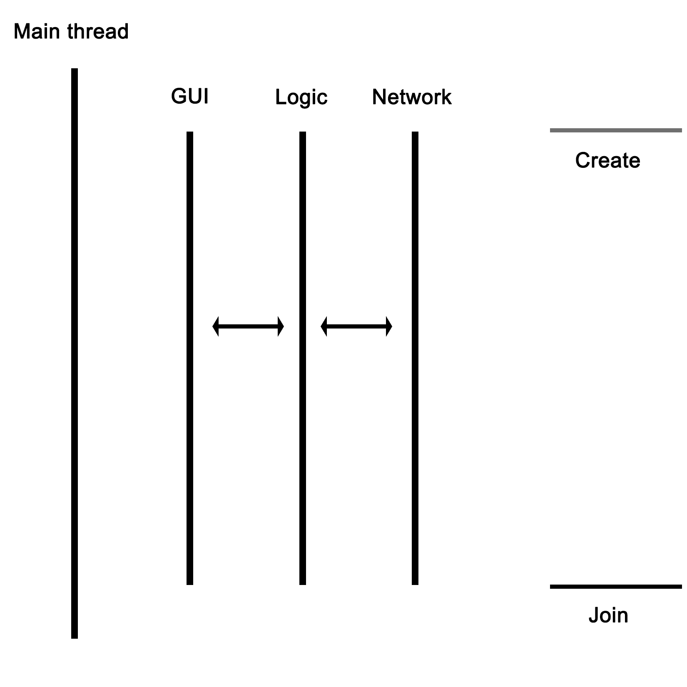

# 一、重温多线程

如果你正在读这本书，你可能已经用 C++ 或者其他语言完成了一些多线程编程。本章旨在从 C++ 的角度来回顾这个主题，介绍一个基本的多线程应用，同时也涵盖了我们将在整本书中使用的工具。本章结束时，您将拥有继续下一章所需的所有知识和信息。

本章涵盖的主题包括:

*   使用本机应用编程接口的 C++ 基本多线程
*   编写基本的 makefiles 和使用 GCC/MinGW
*   使用`make`编译程序并在命令行上执行

# 入门指南

在本书的过程中，我们将假设使用基于 GCC 的工具链(GCC 或 Windows 上的 MinGW)。如果您希望使用替代工具链(铿锵、MSVC、ICC 等)，请参考这些工具链提供的文档以获得兼容的命令。

为了编译本书中提供的例子，将使用 makefiles。对于那些不熟悉 makefiles 的人来说，它们是一种简单但强大的基于文本的格式，与`make`工具一起使用，用于自动化构建任务，包括编译源代码和调整构建环境。`make`于 1977 年首次发布，至今仍是最受欢迎的构建自动化工具之一。

假设熟悉命令行(Bash 或同等工具)，建议使用 Windows 的人使用 MSYS2(Windows 上的 Bash)。

# 多线程应用

在最基本的形式中，多线程应用由一个具有两个或更多线程的单一进程组成。这些线程可以以多种方式使用；例如，通过每个传入事件或事件类型使用一个线程，允许进程以异步方式响应事件，或者通过将工作拆分到多个线程来加快数据处理速度。

对事件的异步响应的例子包括在单独的线程上处理图形用户界面和网络事件，使得两种类型的事件都不必等待另一种，或者可以阻止事件被及时响应。通常，单个线程执行单个任务，如图形用户界面或网络事件的处理，或数据的处理。

对于这个基本示例，应用将从一个单一的线程开始，然后启动多个线程，并等待它们完成。这些新线程中的每一个都将在完成之前执行自己的任务。


让我们从应用的包含变量和全局变量开始:

```cpp
#include <iostream>
#include <thread>
#include <mutex>
#include <vector>
#include <random>

using namespace std;

// --- Globals
mutex values_mtx;
mutex cout_mtx;
vector<int> values;

```

任何使用过 C++ 的人都应该熟悉输入/输出流和向量头:前者在这里用于标准输出(`cout`)，向量用于存储一系列值。

随机头在`c++ 11`中是新的，顾名思义，它提供了生成随机序列的类和方法。我们在这里使用它来让我们的线程做一些有趣的事情。

最后，线程和互斥包含是我们多线程应用的核心；它们提供了创建线程的基本方法，并允许它们之间的线程安全交互。

接下来，我们创建两个互斥体:一个用于全局向量，一个用于`cout`，因为后者不是线程安全的。

接下来，我们创建如下主要功能:

```cpp
int main() {
    values.push_back(42);

```

我们将一个固定值推送到向量实例上；我们稍后创建的线程将使用这个:

```cpp
    thread tr1(threadFnc, 1);
    thread tr2(threadFnc, 2);
    thread tr3(threadFnc, 3);
    thread tr4(threadFnc, 4);

```

我们创建新的线程，并向它们提供要使用的方法的名称，传递任何参数——在本例中，只是一个整数:

```cpp

    tr1.join();
    tr2.join();
    tr3.join();
    tr4.join();

```

接下来，我们等待每个线程完成，然后在每个线程实例上调用`join()`继续:

```cpp

    cout << "Input: " << values[0] << ", Result 1: " << values[1] << ", Result 2: " << values[2] << ", Result 3: " << values[3] << ", Result 4: " << values[4] << "\n";

    return 1;
}

```

在这一点上，我们期望每个线程已经做了它应该做的任何事情，并将结果添加到向量中，然后我们将向量读出并展示给用户。

当然，这几乎没有显示应用中真正发生了什么，大部分只是使用线程的基本简单性。接下来，让我们看看传递给每个线程实例的这个方法内部发生了什么:

```cpp
void threadFnc(int tid) {
    cout_mtx.lock();
    cout << "Starting thread " << tid << ".\n";
    cout_mtx.unlock();

```

在前面的代码中，我们可以看到传递给 thread 方法的整数参数是一个线程标识符。为了指示线程正在启动，输出包含线程标识符的消息。由于我们对此使用了`non-thread-safe`方法，因此我们使用`cout_mtx`互斥体实例来安全地做到这一点，确保在任何时候只有一个线程可以写入`cout`:

```cpp
    values_mtx.lock();
    int val = values[0];
    values_mtx.unlock();

```

当我们获得向量中的初始值集时，我们将其复制到一个局部变量中，这样我们就可以立即释放向量的互斥体，以使其他线程能够使用该向量:

```cpp
    int rval = randGen(0, 10);
    val += rval;

```

最后两行包含了所创建的线程的本质:它们获取初始值，并向其添加随机生成的值。`randGen()`方法取两个参数，定义返回值的范围:

```cpp

    cout_mtx.lock();
    cout << "Thread " << tid << " adding " << rval << ". New value: " << val << ".\n";
    cout_mtx.unlock();

    values_mtx.lock();
    values.push_back(val);
    values_mtx.unlock();
}

```

最后，在向向量添加新值之前，我们(安全地)记录一条消息，通知用户该操作的结果。在这两种情况下，我们使用各自的互斥来确保在访问资源时不会与任何其他线程重叠。

一旦方法到达这一点，包含它的线程将终止，主线程将少一个等待重新加入的线程。线程的连接基本上意味着它停止存在，通常将返回值传递给创建线程的线程。这可以显式发生，主线程等待子线程完成，或者在后台发生。

最后，我们来看看`randGen()`方法。在这里，我们还可以看到一些多线程的特定添加:

```cpp
int randGen(const int& min, const int& max) {
    static thread_local mt19937 generator(hash<thread::id>()(this_thread::get_id()));
    uniform_int_distribution<int> distribution(min, max);
    return distribution(generator)
}

```

前面的方法采用前面解释的最小值和最大值，这限制了该方法可以返回的随机数的范围。其核心是使用基于 mt19937 的`generator`，该算法采用 32 位**默森扭转器**算法，状态大小为 19937 位。对于大多数应用来说，这是一个常见且合适的选择。

这里值得注意的是`thread_local`关键字的使用。这意味着即使它被定义为一个静态变量，它的范围也将被限制在使用它的线程上。因此，每个线程都将创建自己的`generator`实例，这在 STL 中使用随机数应用编程接口时非常重要。

内部线程标识符的散列被用作`generator`的种子。这确保了每个线程为其`generator`实例获得一个相当唯一的种子，从而允许更好的随机数序列。

最后，我们使用提供的最小和最大限制创建一个新的`uniform_int_distribution`实例，并将其与`generator`实例一起使用来生成我们返回的随机数。

# Makefile

为了编译前面描述的代码，可以使用集成开发环境，或者在命令行上键入命令。正如本章开头提到的，我们将使用 makefiles 作为本书的示例。这样做的最大好处是不需要重复输入相同的扩展命令，并且可以移植到任何支持`make`的系统中。

进一步的优势包括能够自动移除先前生成的工件，并且只编译那些已经改变的源文件，以及对构建步骤的详细控制。

这个例子的 makefile 相当基本:

```cpp
GCC := g++

OUTPUT := ch01_mt_example
SOURCES := $(wildcard *.cpp)
CCFLAGS := -std=c++ 11 -pthread

all: $(OUTPUT)

$(OUTPUT):
    $(GCC) -o $(OUTPUT) $(CCFLAGS) $(SOURCES)

clean:
    rm $(OUTPUT)

.PHONY: all

```

从上到下，我们首先定义我们将使用的编译器(`g++ `)，设置输出二进制文件的名称(Windows 上的`.exe`扩展将自动后修复)，然后收集源代码和任何重要的编译器标志。

通配符功能允许一次收集与其后面的字符串匹配的所有文件的名称，而不必单独定义文件夹中每个源文件的名称。

对于编译器标志，我们只对启用`c++ 11`特性感兴趣，为此 GCC 仍然需要一个来提供这个编译器标志。

对于`all`方法，我们只是告诉`make`用提供的信息运行`g++ `。接下来我们定义一个简单的清理方法，它只是删除生成的二进制文件，最后，我们告诉`make`不要解释文件夹中任何名为`all`的文件夹或文件，而是在`.PHONY`部分使用内部方法。

当我们运行这个 makefile 时，我们会看到下面的命令行输出:

```cpp
$ make
g++ -o ch01_mt_example -std=c++ 11 ch01_mt_example.cpp

```

之后，我们在同一个文件夹中找到了一个名为`ch01_mt_example`的可执行文件(Windows 上附带了`.exe`扩展名)。执行该二进制文件将产生类似于以下内容的命令行输出:

```cpp
$ ./ch01_mt_example.exe

Starting thread 1.

Thread 1 adding 8\. New value: 50.

Starting thread 2.

Thread 2 adding 2\. New value: 44.

Starting thread 3.

Starting thread 4.

Thread 3 adding 0\. New value: 42.

Thread 4 adding 8\. New value: 50.

Input: 42, Result 1: 50, Result 2: 44, Result 3: 42, Result 4: 50

```

这里已经可以看到线程及其输出的异步特性。虽然线程`1`和`2`看起来是同步运行的，似乎是按顺序启动和退出，但是线程`3`和`4`显然是异步运行的，因为两者在记录它们的动作之前同时启动。由于这个原因，尤其是在运行时间较长的线程中，实际上不可能说出日志输出和结果将按什么顺序返回。

虽然我们用一个简单的向量来收集线程的结果，但无法说明`Result 1`是否真正来源于我们在开始时分配了 ID 1 的线程。如果我们需要这些信息，我们需要通过使用一个信息结构来扩展我们返回的数据，该信息结构包含处理线程或类似的细节。

例如，可以这样使用`struct`:

```cpp
struct result {
    int tid;
    int result;
};

```

然后，向量将被更改为包含结果实例，而不是整数实例。可以将初始整数值作为其参数的一部分直接传递给线程，或者通过其他方式传递。

# 其他应用

本章中的示例主要适用于必须并行处理数据或任务的应用。对于前面提到的具有业务逻辑和网络相关特性的基于图形用户界面的应用的用例，启动所需线程的主应用的基本设置将保持不变。然而，每个线程不是相同的，而是完全不同的方法。

对于这种类型的应用，线程布局如下所示:



如图所示，主线程将启动图形用户界面、网络和业务逻辑线程，后者与网络线程通信以发送和接收数据。业务逻辑线程还将从图形用户界面线程接收用户输入，并将更新发送回以在图形用户界面上显示。

# 摘要

在这一章中，我们学习了使用本机线程应用编程接口的 C++ 多线程应用的基础知识。我们研究了如何让多个线程并行执行一个任务，并探讨了如何在多线程应用中正确使用 STL 中的随机数应用编程接口。

在下一章中，我们将讨论如何在硬件和操作系统中实现多线程。我们将看到这种实现如何因处理器架构和操作系统而异，以及这如何影响我们的多线程应用。