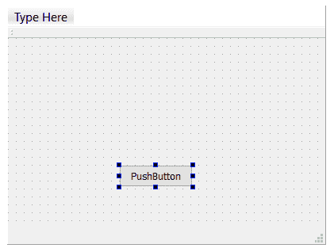
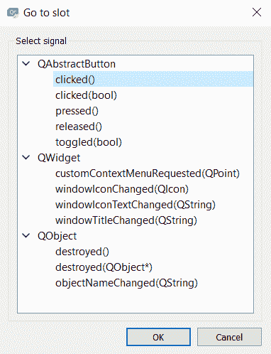
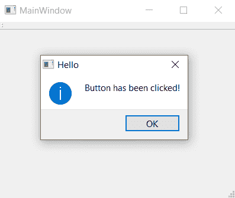
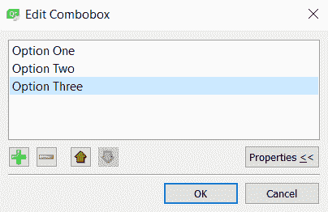
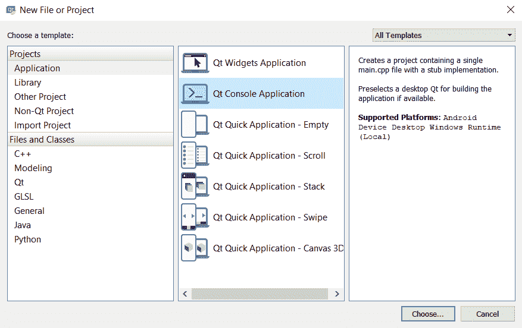
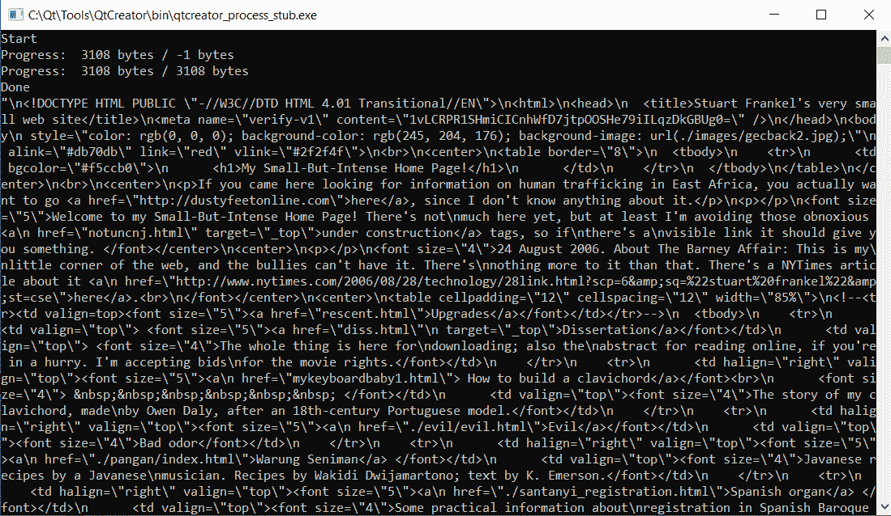

# 二、事件处理——信号和插槽

在本章中，我们将介绍以下食谱:

*   新的信号和时隙语法
*   带有信号和插槽的用户界面事件
*   异步编程变得更加容易
*   函数回调

# 介绍

Qt 5 中的信号和时隙机制是它最重要的特性之一。这是一种允许对象间通信的方法，是程序图形用户界面的关键部分。信号可以从任何`QObject`对象或其子类发出，这将触发连接到信号的任何对象的任何槽功能。

与回调(Qt 5 也支持)相比，信号和槽机制对于程序员来说使用起来更加灵活。信号和槽机制都是类型安全的，并且没有强耦合到处理函数，这使得它比回调的实现更好。

A signal of an arbitrary class can trigger any private slots of an unrelated class that is going to be invoked, which is not possible with callbacks.

# 技术要求

本章的技术要求包括 Qt 5.11.2 MinGW 32 位、Qt Creator 4.8.2 和 Windows 10。

本章使用的所有代码可从以下 GitHub 链接下载:[https://GitHub . com/PacktPublishing/Qt5-CPP-GUI-Programming-cook book-第二版/树/主/第 02 章](https://github.com/PacktPublishing/Qt5-CPP-GUI-Programming-Cookbook-Second-Edition/tree/master/Chapter02)。

查看以下视频，查看正在运行的代码:[http://bit.ly/2FozGKA](http://bit.ly/2FozGKA)

# 新的信号和时隙语法

信号和时隙机制在 Qt 的最新版本中经历了一些变化，最明显的是它的编码语法。Qt 5 在未来的版本中继续支持旧的语法，但是没有提到它要过多久才会被完全删除。因此，我们最好在那一天到来之前开始学习新的语法。

# 怎么做...

让我们从以下步骤开始:

1.  让我们创建一个 Qt 小部件应用项目并打开`mainwindow.ui`。
2.  将按钮从小部件框拖放到用户界面画布上:



3.  右键单击按钮并选择转到插槽。将出现一个窗口:



4.  您将看到按钮可用的内置插槽功能列表。让我们选择单击的()选项，然后按确定。名为`on_pushButton_clicked()`的槽函数现在将同时出现在`mainwindow.h`和`mainwindow.cpp`中。Qt Creator 会在您按下“转到插槽”窗口上的“确定”按钮后，自动将插槽功能添加到您的源代码中。如果您现在查看您的`mainwindow.h`，您应该能够在`private slots`关键字下看到一个额外的功能:

```cpp
class MainWindow : public QMainWindow {
    Q_OBJECT
public:
    explicit MainWindow(QWidget *parent = 0);
    ~MainWindow();
private slots:
 void on_pushButton_clicked();
private:
    Ui::MainWindow *ui;
};
```

5.  `mainwindow.cpp`也是如此，这里已经为你添加了`on_pushButton_clicked()`功能:

```cpp
void MainWindow::on_pushButton_clicked()
{
}
```

6.  现在，让我们在您的源文件顶部添加一个`QMessageBox`标题:

```cpp
#include <QMessageBox>
```

7.  然后，在`on_pushButton_clicked()`功能中添加以下代码:

```cpp
void MainWindow::on_pushButton_clicked() {
    QMessageBox::information(this, "Hello", "Button has been clicked!");
}
```

8.  现在，构建并运行该项目。然后，点击按钮；您应该会看到弹出一个消息框:



9.  接下来，我们想创建自己的信号和槽函数。转到文件|新文件或项目，然后在文件和类类别下创建一个新的 C++ 类:


10.  然后，我们需要命名我们的类`MyClass`，并确保基类是 QObject:


11.  创建完类后，打开`myclass.h`并添加以下代码，为了清楚起见，这里突出显示了这些代码:

```cpp
#include <QObject>
#include <QMainWindow>
#include <QMessageBox>
class MyClass : public QObject {
    Q_OBJECT
public:
    explicit MyClass(QObject *parent = nullptr);
signals:
public slots:
 void doSomething();
};
```

12.  然后，打开`myclass.cpp`，实现`doSomething()`槽功能。我们将复制前面例子中的消息框函数:

```cpp
#include "myclass.h"

MyClass::MyClass(QObject *parent) : QObject(parent) {}
void MyClass::doSomething() {
    QMessageBox::information(this, "Hello", "Button has been clicked!");
}
```

13.  现在，打开`mainwindow.h`并在顶部包含`myclass.h`标题:

```cpp
#ifndef MAINWINDOW_H
#define MAINWINDOW_H

#include "myclass.h"

namespace Ui {
class MainWindow;
}
```

14.  另外，在`myclass.h`中声明一个`doNow()`信号:

```cpp
signals:
 void doNow();

private slots:
    void on_pushButton_clicked();
```

15.  之后，打开`mainwindow.cpp`并定义一个`MyClass`对象。然后，我们将把上一步创建的`doNow()`信号与我们的`doSomething()`插槽功能连接起来:

```cpp
MainWindow::MainWindow(QWidget *parent) : QMainWindow(parent), ui(new Ui::MainWindow){
    ui->setupUi(this);
 MyClass* myclass = new MyClass;
 connect(this, &MainWindow::doNow, myclass, &MyClass::doSomething);
}
```

16.  然后，我们必须将`on_pushButton_clicked()`函数的代码更改如下:

```cpp
void MainWindow::on_pushButton_clicked() {
 emit doNow();
}
```

17.  如果您现在构建并运行该程序，您将获得与上一个示例类似的结果。但是，我们将消息框代码放在了`MyClass`对象中，而不是`MainWindow`中。

# 它是如何工作的...

在过去，我们通常会将信号连接到这样的插槽:

```cpp
connect(
    sender, SIGNAL(valueChanged(QString)),
    receiver, SLOT(updateValue(QString))
);
```

然而，从那以后情况略有变化。在新的语法中，`SIGNAL`和`SLOT`宏现在已经不存在了，您必须指定对象的类型，如下面的代码所示:

```cpp
connect(
    sender, &Sender::valueChanged,
    receiver, &Receiver::updateValue
);
```

新语法还允许您将信号直接连接到函数，而不是`QObject`:

```cpp
connect(
    sender, &Sender::valueChanged, myFunction
);
```

此外，您还可以将信号连接到 lambda 表达式。我们将在*异步编程变得更容易*食谱中更多地讨论这一点。

# 带有信号和插槽的用户界面事件

在前面的示例中，我们演示了按钮上信号和插槽的使用。现在，让我们来探索其他常见小部件类型中可用的信号和插槽。

# 怎么做...

要了解如何将信号和插槽用于用户界面事件，请执行以下步骤:

1.  让我们创建一个新的 Qt 小部件应用项目。
2.  将按钮、组合框、线条编辑、旋转框和滑块从小部件框拖放到用户界面画布中:


3.  然后，右键点击按钮，选择`clicked()`，按确定按钮继续。Qt 创建者将为您创建一个槽函数:


4.  重复上一步，但这一次，选择下一个选项，直到`QAbstractButton`中的每个函数都被添加到源代码中:

```cpp
void on_pushButton_clicked();
void on_pushButton_clicked(bool checked);
void on_pushButton_pressed();
void on_pushButton_released();
void on_pushButton_toggled(bool checked);
```

5.  接下来，在组合框上再次重复相同的步骤，直到`QComboBox`类下所有可用的槽函数都被添加到源代码中:

```cpp
void on_comboBox_activated(const QString &arg1);
void on_comboBox_activated(int index);
void on_comboBox_currentIndexChanged(const QString &arg1);
void on_comboBox_currentIndexChanged(int index);
void on_comboBox_currentTextChanged(const QString &arg1);
void on_comboBox_editTextChanged(const QString &arg1);
void on_comboBox_highlighted(const QString &arg1);
void on_comboBox_highlighted(int index);
```

6.  `lineEdit`也是如此，都属于`QLineEdit`类:

```cpp
void on_lineEdit_cursorPositionChanged(int arg1, int arg2);
void on_lineEdit_editingFinished();
void on_lineEdit_returnPressed();
void on_lineEdit_selectionChanged();
void on_lineEdit_textChanged(const QString &arg1);
void on_lineEdit_textEdited(const QString &arg1);
```

7.  之后，也为我们的旋转盒小部件添加来自`QSpinBox`类的槽函数，它相对较短:

```cpp
void on_spinBox_valueChanged(const QString &arg1);
void on_spinBox_valueChanged(int arg1);
```

8.  最后，对我们的滑块小部件重复相同的步骤，得到类似的结果:

```cpp
void on_horizontalSlider_actionTriggered(int action);
void on_horizontalSlider_rangeChanged(int min, int max);
void on_horizontalSlider_sliderMoved(int position);
void on_horizontalSlider_sliderPressed();
void on_horizontalSlider_sliderReleased();
void on_horizontalSlider_valueChanged(int value);
```

9.  完成后，打开`mainwindow.h`并添加`QDebug`标题，如以下代码所示:

```cpp
#ifndef MAINWINDOW_H
#define MAINWINDOW_H

#include <QMainWindow>
#include <QDebug>

namespace Ui {
class MainWindow;
}
```

10.  让我们实现按钮的插槽功能:

```cpp
void MainWindow::on_pushButton_clicked() {
 qDebug() << "Push button clicked";
}
void MainWindow::on_pushButton_clicked(bool checked) {
 qDebug() << "Push button clicked: " << checked;
}
void MainWindow::on_pushButton_pressed() {
 qDebug() << "Push button pressed";
}
void MainWindow::on_pushButton_released() {
 qDebug() << "Push button released";
}
void MainWindow::on_pushButton_toggled(bool checked) {
 qDebug() << "Push button toggled: " << checked;
}
```

11.  如果您现在构建并运行项目，然后单击按钮，您将看到一个不同的状态被打印出来，但时间略有不同。这是因为在整个点击过程中，不同的动作会发出不同的信号:

```cpp
Push button pressed
Push button released
Push button clicked
Push button clicked: false
```

12.  接下来，我们将进入组合框。由于默认的组合框是空的，让我们通过从`mainwindow.ui`双击它并添加弹出窗口中显示的选项来添加一些选项:



13.  然后，我们来实现`mainwindow.cpp`中组合框的槽功能:

```cpp
void MainWindow::on_comboBox_activated(const QString &arg1) {
 qDebug() << "Combo box activated: " << arg1;
}
void MainWindow::on_comboBox_activated(int index) {
 qDebug() << "Combo box activated: " << index;
}
void MainWindow::on_comboBox_currentIndexChanged(const QString &arg1) {
 qDebug() << "Combo box current index changed: " << arg1;
}
void MainWindow::on_comboBox_currentIndexChanged(int index) {
 qDebug() << "Combo box current index changed: " << index;
}
```

14.  我们将继续为组合框实现剩余的槽函数:

```cpp
void MainWindow::on_comboBox_currentTextChanged(const QString &arg1) {
 qDebug() << "Combo box current text changed: " << arg1;
}
void MainWindow::on_comboBox_editTextChanged(const QString &arg1) {
 qDebug() << "Combo box edit text changed: " << arg1;
}
void MainWindow::on_comboBox_highlighted(const QString &arg1) {
 qDebug() << "Combo box highlighted: " << arg1;
}
void MainWindow::on_comboBox_highlighted(int index) {
 qDebug() << "Combo box highlighted: " << index;
}
```

15.  构建并运行项目。然后，尝试单击组合框，将鼠标悬停在其他选项上，并通过单击选择一个选项。您应该会在调试输出中看到类似于以下内容的结果:

```cpp
Combo box highlighted: 0
Combo box highlighted: "Option One"
Combo box highlighted: 1
Combo box highlighted: "Option Two"
Combo box highlighted: 2
Combo box highlighted: "Option Three"
Combo box current index changed: 2
Combo box current index changed: "Option Three"
Combo box current text changed: "Option Three"
Combo box activated: 2
Combo box activated: "Option Three"
```

16.  接下来，我们将继续进行行编辑并实现它的槽函数，如下面的代码所示:

```cpp
void MainWindow::on_lineEdit_cursorPositionChanged(int arg1, int arg2) {
 qDebug() << "Line edit cursor position changed: " << arg1 << arg2;
}
void MainWindow::on_lineEdit_editingFinished() {
 qDebug() << "Line edit editing finished";
}
void MainWindow::on_lineEdit_returnPressed() {
 qDebug() << "Line edit return pressed";
}
```

17.  我们将继续实现行编辑的剩余槽功能:

```cpp
void MainWindow::on_lineEdit_selectionChanged() {
 qDebug() << "Line edit selection changed";
}
void MainWindow::on_lineEdit_textChanged(const QString &arg1) {
 qDebug() << "Line edit text changed: " << arg1;
}
void MainWindow::on_lineEdit_textEdited(const QString &arg1) {
 qDebug() << "Line edit text edited: " << arg1;
}
```

18.  构建并运行项目。然后，点击线路编辑并输入`Hey`。您应该会在调试输出面板上看到类似如下的结果:

```cpp
Line edit cursor position changed: -1 0
Line edit text edited: "H"
Line edit text changed: "H"
Line edit cursor position changed: 0 1
Line edit text edited: "He"
Line edit text changed: "He"
Line edit cursor position changed: 1 2
Line edit text edited: "Hey"
Line edit text changed: "Hey"
Line edit cursor position changed: 2 3
Line edit editing finished
```

19.  之后，我们需要为旋转框小部件实现 slot 函数，如下面的代码所示:

```cpp
void MainWindow::on_spinBox_valueChanged(const QString &arg1){
 qDebug() << "Spin box value changed: " << arg1;
}
void MainWindow::on_spinBox_valueChanged(int arg1) {
 qDebug() << "Spin box value changed: " << arg1;
}
```

20.  尝试构建和运行程序。然后，单击数字显示框上的箭头按钮，或者直接编辑框中的值–您应该会看到类似的内容:

```cpp
Spin box value changed: "1"
Spin box value changed: 1
Spin box value changed: "2"
Spin box value changed: 2
Spin box value changed: "3"
Spin box value changed: 3
Spin box value changed: "2"
Spin box value changed: 2
Spin box value changed: "20"
Spin box value changed: 20
```

21.  最后，我们将实现水平滑块小部件的插槽功能:

```cpp
void MainWindow::on_horizontalSlider_actionTriggered(int action) {
 qDebug() << "Slider action triggered" << action;
}
void MainWindow::on_horizontalSlider_rangeChanged(int min, int max) {
 qDebug() << "Slider range changed: " << min << max;
}
void MainWindow::on_horizontalSlider_sliderMoved(int position) {
 qDebug() << "Slider moved: " << position;
}
```

22.  继续为滑块实现插槽功能，如以下代码所示:

```cpp
void MainWindow::on_horizontalSlider_sliderPressed() {
 qDebug() << "Slider pressed";
}
void MainWindow::on_horizontalSlider_sliderReleased() {
 qDebug() << "Slider released";
}
void MainWindow::on_horizontalSlider_valueChanged(int value) {
 qDebug() << "Slider value changed: " << value;
}
```

23.  构建并运行程序。然后，单击并向左和向右拖动滑块–您应该会看到类似以下的结果:

```cpp
Slider pressed
Slider moved: 1
Slider action triggered 7
Slider value changed: 1
Slider moved: 2
Slider action triggered 7
Slider value changed: 2
Slider moved: 3
Slider action triggered 7
Slider value changed: 3
Slider moved: 4
Slider action triggered 7
Slider value changed: 4
Slider released
```

# 它是如何工作的...

几乎每个小部件都有一组与其用途或目的相关的插槽功能。例如，当按钮被按下或释放时，它将开始发出触发与其相关的插槽功能的信号。定义小部件的这些预期行为具有槽函数，当用户触发一个动作时，这些槽函数被调用。作为程序员，我们所需要做的就是实现槽函数，并告诉 Qt 当这些槽函数被触发时该做什么。

# 异步编程变得更加容易

由于信号和槽机制本质上是异步的，我们可以将它用于用户界面之外的事情。在编程术语中，异步操作是一个独立工作的进程，允许程序继续其操作，而无需等待进程完成，这可能会使整个程序停滞。

Qt 5 允许您利用它的信号和槽机制轻松实现异步进程，而无需太多努力。在 Qt 5 引入了信号和槽的新语法后，这一点更加真实，新语法允许信号从`QObject`触发正常功能，而不是槽功能。

在下面的例子中，我们将进一步探索这个机会，并学习如何通过 Qt 5 提供的信号和槽机制使用异步操作来提高程序的效率。

# 怎么做...

要了解如何使用信号和槽机制实现异步操作，让我们遵循以下示例:

1.  创建 Qt 控制台应用项目:



2.  这种类型的项目只会为您提供一个`main.cpp`文件，而不是像我们之前的示例项目那样提供`mainwindow.h`和`mainwindow.cpp`。让我们打开`main.cpp`并添加以下标题:

```cpp
#include <QNetworkAccessManager>
#include <QNetworkReply>
#include <QDebug>
```

3.  然后，将以下代码添加到我们的`main()`函数中。我们将使用`QNetworkAccessManager`类向以下网址发起`GET`请求:

```cpp
int main(int argc, char *argv[]) {
    QCoreApplication a(argc, argv);

    QString *html = new QString;
    qDebug() << "Start";

    QNetworkAccessManager manager;
    QNetworkRequest req(QUrl("http://www.dustyfeet.com"));
    QNetworkReply* reply = manager.get(req);
```

4.  然后，我们使用 C++ 11 的 lambda 表达式将`QNetworkReply`信号连接到内联函数:

```cpp
    QObject::connect(reply, &QNetworkReply::readyRead,
    [reply, html]() {
        html->append(QString(reply->readAll()));
    });

    QObject::connect(reply, &QNetworkReply::downloadProgress,
    [reply](qint64 bytesReceived, qint64 bytesTotal) {
        qDebug() << "Progress: " << bytesReceived << "bytes /" << bytesTotal << "bytes";
    });
```

5.  我们也可以使用带有`connect()`的 lambda 表达式来调用不在`QObject`类下的函数:

```cpp
    QObject::connect(reply, &QNetworkReply::finished,
    [=]() {
        printHTML(*html);
    });

    return a.exec();
}
```

6.  最后，我们定义`printHTML()`函数，如下代码所示:

```cpp
void printHTML(QString html) {
    qDebug() << "Done";
    qDebug() << html;
}    
```

7.  如果您现在构建并运行该程序，您将会看到它即使没有声明任何槽函数也是有效的。Lambda 表达式使声明一个槽函数成为可选的，但是只有当您的代码非常短时才建议这样做:



# 它是如何工作的...

前面的例子是一个非常简单的应用，展示了使用 lambda 表达式将信号与 lambda 函数或正则函数连接起来，而不需要声明任何 slot 函数，因此不需要从`QObject`类继承。这对于调用不在 UI 对象下的异步进程特别有用。

Lambda 表达式是在另一个函数中匿名定义的函数，这与 JavaScript 中的匿名函数非常相似。lambda 函数的格式如下所示:

```cpp
[captured variables](arguments) {
    lambda code
}
```

您可以通过将变量放入捕获的变量部分来将变量插入 lambda 表达式，就像我们在本食谱的示例项目中所做的那样。我们捕获名为`reply`的`QNetworkReply`对象和名为`html`的`QString`对象，并将它们放入我们的λ表达式中。

然后，我们可以在 lambda 代码中使用这些变量，如下面的代码所示:

```cpp
[reply, html]() {
    html->append(QString(reply->readAll()));
}
```

参数部分类似于一个普通的函数，您可以向参数输入值，并在 lambda 代码中使用它们。在这种情况下，`bytesReceived`和`bytesTotal`的值来自`downloadProgress`信号:

```cpp
QObject::connect(reply, &QNetworkReply::downloadProgress,
[reply](qint64 bytesReceived, qint64 bytesTotal) {
    qDebug() << "Progress: " << bytesReceived << "bytes /" << bytesTotal << "bytes";
});
```

您还可以使用等号捕获函数中使用的所有变量。在这种情况下，我们捕获了`html`变量，但没有在捕获的变量区域中指定它:

```cpp
[=]() {
    printHTML(*html);
}
```

# 函数回调

尽管 Qt 5 支持信号和插槽机制，但 Qt 5 中的一些功能仍然使用函数回调，如键盘输入、窗口大小调整、图形绘制等。由于这些事件只需要实现一次，因此不需要使用信号和时隙机制。

# 怎么做...

让我们从这个例子开始:

1.  创建`Qt Widgets Application`项目，打开`mainwindow.h`，添加如下标题:

```cpp
#include <QDebug>
#include <QResizeEvent>
#include <QKeyEvent>
#include <QMouseEvent>
```

2.  然后，在`mainwindow.h`中声明这些函数:

```cpp
public:
    explicit MainWindow(QWidget *parent = 0);
    ~MainWindow();

 void resizeEvent(QResizeEvent *event);
 void keyPressEvent(QKeyEvent *event);
 void keyReleaseEvent(QKeyEvent *event);
 void mouseMoveEvent(QMouseEvent *event);
 void mousePressEvent(QMouseEvent *event);
 void mouseReleaseEvent(QMouseEvent *event);
```

3.  之后，打开`mainwindow.cpp`，将以下代码添加到类构造函数中:

```cpp
MainWindow::MainWindow(QWidget *parent) : QMainWindow(parent), ui(new Ui::MainWindow) {
    ui->setupUi(this);
 this->setMouseTracking(true);
 ui->centralWidget->setMouseTracking(true);
}
```

4.  然后，定义`resizeEvent()`和`keyPressedEvent()`功能:

```cpp
void MainWindow::resizeEvent(QResizeEvent *event) {
    qDebug() << "Old size:" << event->oldSize() << ", New size:" << event->size();
}

void MainWindow::keyPressEvent(QKeyEvent *event) {
    if (event->key() == Qt::Key_Escape) {
        this->close();
    }
    qDebug() << event->text() << "has been pressed";
}
```

5.  继续执行其余功能:

```cpp
void MainWindow::keyReleaseEvent(QKeyEvent *event) {
    qDebug() << event->text() << "has been released";
}

void MainWindow::mouseMoveEvent(QMouseEvent *event) {
    qDebug() << "Position: " << event->pos();
}

void MainWindow::mousePressEvent(QMouseEvent *event) {
    qDebug() << "Mouse pressed:" << event->button();
}

void MainWindow::mouseReleaseEvent(QMouseEvent *event) {
    qDebug() << "Mouse released:" << event->button();
}
```

6.  构建并运行程序。然后，试着移动鼠标，重新缩放主窗口，按下键盘上的一些随机键，最后按下键盘上的 *Esc* 键关闭程序。您应该会看到类似于应用输出窗口中打印出来的调试文本:

```cpp
Old size: QSize(-1, -1) , New size: QSize(400, 300)
Old size: QSize(400, 300) , New size: QSize(401, 300)
Old size: QSize(401, 300) , New size: QSize(402, 300)
Position: QPoint(465,348)
Position: QPoint(438,323)
Position: QPoint(433,317)
"a" has been pressed
"a" has been released
"r" has been pressed
"r" has been released
"d" has been pressed
"d" has been released
"\u001B" has been pressed
```

# 它是如何工作的...

Qt 5 对象，尤其是主窗口，有十几个作为虚函数存在的内置回调。这些函数可以被覆盖，以便在被调用时执行预期的行为。Qt 5 可能会在满足预期条件时调用这些回调函数，如按下键盘按钮、移动鼠标光标、调整窗口大小等。

我们在`mainwindow.h`文件中声明的函数是构建在`QWidget`类中的虚拟函数。我们只是用我们自己的代码覆盖它，以定义它被调用时的新行为。

请注意，您必须为主窗口和中央窗口调用`setMouseTracking(true)`，以使`mouseMoveEvent()`回调生效。