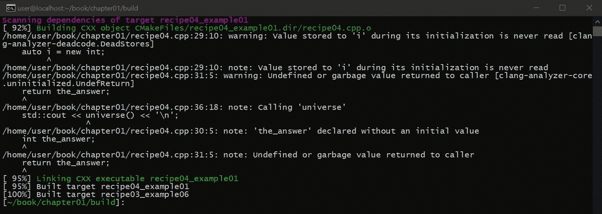
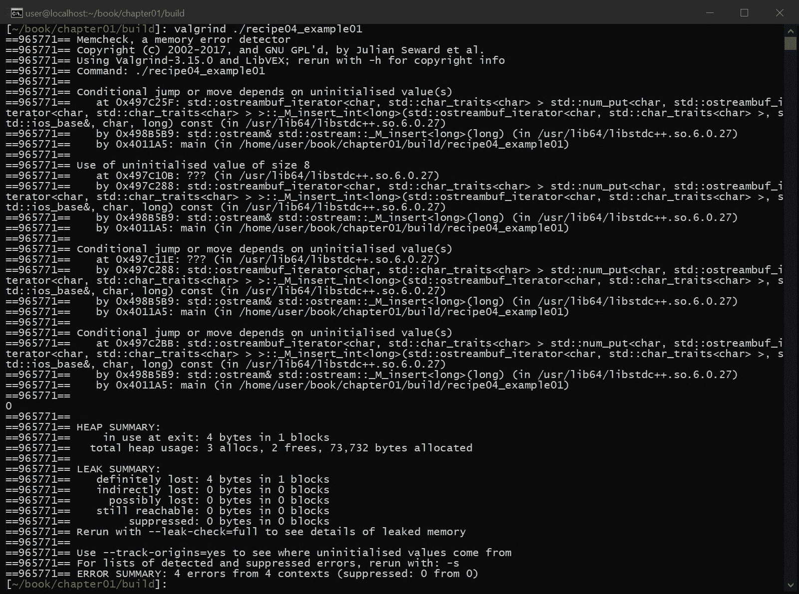

# 图书馆开发入门

在本章中，我们将介绍一些创建自己的库的有用方法，包括对最小惊奇原则的解释，它鼓励我们使用用户已经熟悉的语义来实现库。我们还将研究如何命名一切，以确保我们的自定义库不会与其他库冲突。此外，我们将研究如何创建仅头库，以及一些与库开发相关的最佳实践。最后，我们将以 boost 库的演示来结束本章，向您展示大型库是什么样子的，以及用户如何在自己的项目中使用它。

在本章中，我们将介绍以下食谱:

*   理解最少惊喜的原则
*   如何命名一切
*   仅标题库
*   学习图书馆开发最佳实践
*   学习如何使用增强应用编程接口

我们开始吧！

# 技术要求

要编译和运行本章中的示例，您必须拥有运行 Ubuntu 18.04 的计算机的管理权限，并且具有功能性互联网连接。在运行这些示例之前，您必须使用以下命令安装以下软件包:

```cpp
> sudo apt-get install build-essential git cmake
```

如果这安装在 Ubuntu 18.04 以外的任何操作系统上，则需要 GCC 7.4 或更高版本以及 CMake 3.6 或更高版本。

# 理解最少惊喜的原则

无论是使用现有的 C++库还是创建自己的库，理解最少惊奇的**原则**(也称为最少惊奇的**原则**)对于高效和有效地开发源代码至关重要。这个原则简单地说明了 C++库提供的任何特性都应该是直观的，并且应该按照开发人员的期望运行。另一种说法是，库的 API 应该是自文档化的。虽然这个原则在设计库的时候非常重要，但是它可以并且应该应用于所有形式的软件开发。在这个食谱中，我们将深入探讨这个原理。

# 准备好

与本章中的所有方法一样，确保满足所有技术要求，包括安装 Ubuntu 18.04 或更高版本，并在终端窗口中运行以下内容:

```cpp
> sudo apt-get install build-essential git cmake
```

这将确保您的操作系统拥有适当的工具来编译和执行本食谱中的示例。完成后，打开一个新的终端。我们将使用这个终端来下载、编译和运行我们的示例。

# 怎么做...

执行以下步骤完成该配方:

1.  从新的终端，运行以下代码下载源代码:

```cpp
> cd ~/
> git clone https://github.com/PacktPublishing/Advanced-CPP-CookBook.git
> cd Advanced-CPP-CookBook/chapter01
```

2.  要编译源代码，请运行以下代码:

```cpp
> mkdir build && cd build
> cmake ..
> make recipe01_examples
```

3.  编译完源代码后，您可以通过运行以下命令来执行该配方中的每个示例:

```cpp
> ./recipe01_example01
The answer is: 42

> ./recipe01_example02
The answer is: 42

> ./recipe01_example03
The answer is: 42

> ./recipe01_example04
The answer is: 42
The answer is: 42

> ./recipe01_example05
The answer is: 42
The answer is: 42

> ./recipe01_example06
The answer is: 42
The answer is: 42

> ./recipe01_example07
The answer is: 42

> ./recipe01_example08
The answer is: 42

> ./recipe01_example09
The answer is: 42
```

在下一节中，我们将逐一介绍这些示例，并解释每个示例程序的功能以及它与本食谱中所教授的课程之间的关系。

# 它是如何工作的...

如前一节所述，最少惊喜原则规定库的 API 应该是直观的和自我记录的，并且这个原则通常适用于所有形式的软件开发，而不仅仅是库设计。为了理解这一点，我们将看一些例子。

# 例 1

示例 1 演示了最小惊喜的原则，如下所示:

```cpp
#include <iostream>

int sub(int a, int b)
{ return a + b; }

int main(void)
{
    std::cout << "The answer is: " << sub(41, 1) << '\n';
    return 0;
}
```

如前面的例子所示，我们已经实现了一个将两个整数相加并返回结果的库 API。问题是我们把函数命名为`sub`，大多数开发者会联想到减法而不是加法；尽管 API 的功能与设计一样，但它打破了最不令人惊讶的原则，因为 API 的名称并不直观。

# 例 2

示例 2 演示了最少惊喜的原则，如下所示:

```cpp
#include <iostream>

void add(int a, int &b)
{ b += a; }

int main(void)
{
    int a = 41, b = 1;
    add(a, b);

    std::cout << "The answer is: " << b << '\n';
    return 0;
}
```

如前面的例子所示，我们已经实现了与我们在前面练习中实现的相同的库 API 它被设计为将两个数字相加并返回结果。这个例子的问题是应用编程接口正在实现以下内容:

```cpp
b += a;
```

在这个例子中，最少惊喜的原则以两种不同的方式被违反:

*   加法函数的参数是`a`然后是`b`，即使我们将这个方程写成`b += a`，这意味着参数的顺序直观上是向后的。
*   对于这个应用编程接口的用户来说，在不阅读源代码的情况下，结果会在`b`中返回并不明显。

函数的签名应该使用用户已经习惯的语义来记录函数将如何执行，从而降低导致用户错误执行应用编程接口的概率。

# 例 3

示例 3 演示了最少惊喜的原则，如下所示:

```cpp
#include <iostream>

int add(int a, int b)
{ return a + b; }

int main(void)
{
    std::cout << "The answer is: " << add(41, 1) << '\n';
    return 0;
}
```

如前面的例子所示，我们在这里坚持最少惊喜的原则。API 的设计是将两个整数相加并返回结果，API 直观地按照预期执行这个动作。

# 例 4

示例 4 演示了最少惊喜的原则，如下所示:

```cpp
#include <stdio.h>
#include <iostream>

int main(void)
{
    printf("The answer is: %d\n", 42);
    std::cout << "The answer is: " << 42 << '\n';
    return 0;
}
```

如前例所示，最小惊喜原则的另一个很好的例子是`printf()`和`std::cout`的区别。`printf()`函数需要添加格式说明符来输出整数到`stdout`。`printf()`不直观的原因有很多:

*   对于初学者来说，`printf()`函数的名字代表打印格式，并不直观(或者换句话说，函数的名字不是自记录的)。其他语言通过为打印功能选择更直观的名称来避免这个问题，例如`print()`或`console()`，它们更好地坚持了最少惊喜的原则。
*   整数的格式说明符符号是`d`。同样，对于初学者来说，这是不直观的。在这种特殊情况下，`d`代表十进制，这是*有符号整数*的另一种说法。一个更好的格式说明符可能是`i`来匹配语言对`int`的使用。

对比一下`std::cout`，代表字符输出。虽然这与`print()`或`console()`相比不太直观，但比`printf()`更直观。此外，为了向`stdout`输出一个整数，用户不需要记住一个格式说明符表来完成他们的任务。相反，他们可以简单地使用`<<`运算符。然后，API 为您处理格式，这不仅更直观，而且更安全(尤其是在使用`std::cin`而不是`scanf()`时)。

# 例 5

示例 5 演示了最小惊喜的原则，如下所示:

```cpp
#include <iostream>

int main(void)
{
    auto answer = 41;

    std::cout << "The answer is: " << ++answer << '\n';
    std::cout << "The answer is: " << answer++ << '\n';

    return 0;
}
```

如前例所示，`++`操作者秉持最少惊喜的原则。虽然初学者必须学习`++`代表增量运算符，这意味着变量由`1`增量，但是`++`相对于变量的位置非常有帮助。

要理解`++variable`和`variable++`的区别，用户所要做的就是正常的从左到右读代码。当`++`在左边时，变量递增，然后返回变量的内容。当`++`在右边时，返回变量的内容，然后变量递增。关于`++`位置的唯一问题是左边的`++`通常更有效(因为在增量操作之前，实现不需要额外的逻辑来存储变量值)。

# 例 6

示例 6 展示了最少惊喜的原理如下:

```cpp
#include <iostream>

int add(int a, int b)
{ return a + b; }

int Sub(int a, int b)
{ return a - b; }

int main(void)
{
    std::cout << "The answer is: " << add(41, 1) << '\n';
    std::cout << "The answer is: " << Sub(43, 1) << '\n';

    return 0;
}
```

如前面的代码所示，我们已经实现了两个不同的 API。第一个将两个整数相加并返回结果，而第二个减去两个整数并返回结果。减法功能有两个问题:

*   加法函数是小写的，而减法函数是大写的。这是不直观的，API 的用户必须了解哪些 API 是小写的，哪些是大写的。
*   C++标准的 API 都是蛇的大小写，也就是说它们利用小写字母`_`来表示一个空格。总的来说，用 snake case 设计 C++库 API 更好，因为初学者更容易发现这种直观性。需要注意的是，虽然一般都是这样，但是使用 snake case 是非常主观的，有几种语言并不遵循这个指导。最重要的是选择一个惯例并坚持下去。

同样，确保您的应用编程接口模仿现有的语义可以确保用户可以快速轻松地学习使用您的应用编程接口，同时降低用户错误编写应用编程接口导致编译错误的可能性。

# 例 7

示例 7 展示了最小惊喜的原则，如下所示:

```cpp
#include <queue>
#include <iostream>

int main(void)
{
    std::queue<int> my_queue;

    my_queue.emplace(42);
    std::cout << "The answer is: " << my_queue.front() << '\n';
    my_queue.pop();

    return 0;
}
```

如前例所示，我们向您展示了如何使用`std::queue`向队列添加整数，将队列输出到`stdout`，并从队列中移除元素。这个例子的重点是强调这样一个事实，即 C++已经有了一套标准的命名约定，应该在 C++库开发过程中加以利用。

如果您正在设计一个新的库，使用与 C++已经定义的相同的命名约定对您的库的用户是有帮助的。这样做将降低进入门槛，并提供更直观的应用编程接口。

# 例 8

示例 8 展示了如下最少惊喜的原则:

```cpp
#include <iostream>

auto add(int a, int b)
{ return a + b; }

int main(void)
{
    std::cout << "The answer is: " << add(41, 1) << '\n';
    return 0;
}
```

如前面的例子所示，我们正在演示如何使用`auto`，它告诉编译器自动计算出函数的返回类型是什么，不坚持最少惊喜的原则。虽然`auto`对于编写泛型代码非常有帮助，但是在设计库 API 时应该尽可能避免使用它。具体来说，为了让应用编程接口的用户理解应用编程接口的输入和输出是什么，用户必须阅读应用编程接口的实现，因为`auto`没有指定输出类型。

# 例 9

示例 9 展示了最少惊喜的原则，如下所示:

```cpp
#include <iostream>

template <typename T>
T add(T a, T b)
{ return a + b; }

int main(void)
{
    std::cout << "The answer is: " << add(41, 1) << '\n';
    return 0;
}
```

如前面的例子所示，我们正在演示一种更合适的方法来支持最少惊奇的原则，同时支持泛型编程。泛型编程(也称为模板元编程或使用 C++模板编程)为程序员提供了一种创建算法的方法，而无需说明算法中使用的类型。在这种情况下，`add`函数不指定输入类型，允许用户添加任意类型的两个值(在这种情况下，类型称为`T`，它可以采用支持`add`运算符的任何类型)。我们返回一个类型`T`，而不是返回一个不会说明输出类型的`auto`。虽然`T`在这里没有定义，因为它代表任何类型，但它确实告诉应用编程接口的用户，我们输入到该函数中的任何类型也将由该函数返回。同样的逻辑在 C++标准库中大量使用。

# 如何命名一切

当创建一个库时，命名所有内容是很重要的。这样做可以确保库提供的 API 的名称与用户代码或其他库提供的工具冲突。在本食谱中，我们将展示如何在自己的库中做到这一点。

# 准备好

与本章中的所有方法一样，确保满足所有技术要求，包括安装 Ubuntu 18.04 或更高版本，并在终端窗口中运行以下内容:

```cpp
> sudo apt-get install build-essential git cmake
```

这将确保您的操作系统拥有适当的工具来编译和执行本食谱中的示例。完成后，打开一个新的终端。我们将使用这个终端来下载、编译和运行我们的示例。

# 怎么做...

您需要执行以下步骤来完成此配方:

1.  从新的终端，运行以下命令下载源代码:

```cpp
> cd ~/
> git clone https://github.com/PacktPublishing/Advanced-CPP-CookBook.git
> cd Advanced-CPP-CookBook/chapter01
```

2.  要编译源代码，请运行以下代码:

```cpp
> mkdir build && cd build
> cmake ..
> make recipe02_examples
```

3.  编译完源代码后，您可以通过运行以下命令来执行该配方中的每个示例:

```cpp
> ./recipe02_example01
The answer is: 42

> ./recipe02_example02
The answer is: 42
```

在下一节中，我们将逐一介绍这些示例，并解释每个示例程序的功能以及它与本食谱中所教授的课程之间的关系。

# 它是如何工作的...

C++为我们提供了将代码包装在`namespace`中的能力，它只是将`namespace`的名称添加到`namespace`代码内部的所有函数和变量中(应该注意的是，C 风格的宏不包含在`namespace`中，应该小心使用，因为 C 宏是预处理器特性，不会对代码的编译语法产生影响)。为了解释为什么我们在创建自己的库时应该什么都用`namespace`，我们将看一些例子。

# 例 1

示例 1 演示了如何在 C++中包装库的应用编程接口:

```cpp
// Contents of library.h

namespace library_name
{
    int my_api() { return 42; }
    // ...
}

// Contents of main.cpp

#include <iostream>

int main(void)
{
    using namespace library_name;

    std::cout << "The answer is: " << my_api() << '\n';
    return 0;
}
```

如前面的例子所示，库的内容被包装在一个`namespace`中并存储在标题中(这个例子演示了一个只有标题的库，这是一个非常有用的设计方法，因为最终用户不必编译库，将它们安装在他/她的系统上，然后链接它们)。库用户只需包含库头文件，并使用`using namespace library_name`语句打开库的应用编程接口。如果用户有多个具有相同 API 名称的库，可以省略该语句以消除任何歧义。

# 例 2

示例 2 扩展了前面的示例，并演示了如何将您的库的 API 包装在一个 C++命名空间头文件库中，同时仍然包含全局变量:

```cpp
// Contents of library.h

namespace library_name
{
    namespace details { inline int answer = 42; }

    int my_api() { return details::answer; }
    // ...
}

// Contents of main.cpp

#include <iostream>

int main(void)
{
    using namespace library_name;

    std::cout << "The answer is: " << my_api() << '\n';
    return 0;
}
```

如前面的例子所示，C++17 被用来创建一个`inline`全局变量，该变量被包装在我们库的`namespace`中。`inline`变量是必需的，因为只有头文件的库没有定义全局变量的源文件；如果没有`inline`关键字，在头中定义一个全局变量将导致变量被多次定义(也就是说，结果将是编译期间的链接错误)。C++17 通过添加`inline`全局变量解决了这个问题，这允许一个只有头文件的库定义全局变量，而不需要复杂的魔法(比如从单例风格的函数返回一个静态变量的指针)。

除了库的`namespace`，我们将全局变量包装在一个`details namespace`中。这样做是为了在您的库中创建一个`private`位置，以防库的用户声明`using namespace library_name`。如果用户这样做，所有由`library_name`命名空间包装的 API 和变量在`main()`函数的范围内变得全局可访问。出于这个原因，任何不打算被用户访问的私有 API 或变量应该被第二个`namespace`(通常称为`details`)包装，以防止它们的全局可访问性。最后，利用 C++17 的`inline`关键字，我们可以创建一个全局变量，在我们的库中使用，同时仍然支持一个仅头设计。

# 仅标题库

只有头文件的库和它们听起来完全一样；整个库是使用头文件(通常是单个头文件)实现的。只包含头文件的库的好处是它们很容易包含在您的项目中，因为您只需包含头文件就完成了(不需要编译库，因为没有要编译的源文件)。在这个食谱中，我们将了解一些在试图创建一个只有标题的库时出现的问题以及如何克服它们。这个方法很重要，因为如果你计划创建自己的库，一个只有头文件的库是一个很好的开始，并且很可能会提高你的采用率，因为下游用户将很容易将你的库集成到他们的代码库中。

# 准备好

与本章中的所有方法一样，确保满足所有技术要求，包括安装 Ubuntu 18.04 或更高版本，并在终端窗口中运行以下内容:

```cpp
> sudo apt-get install build-essential git cmake
```

这将确保您的操作系统拥有适当的工具来编译和执行本食谱中的示例。完成后，打开一个新的终端。我们将使用这个终端来下载、编译和运行我们的示例。

# 怎么做...

您需要执行以下步骤来完成此配方:

1.  从新的终端，运行以下命令下载源代码:

```cpp
> cd ~/
> git clone https://github.com/PacktPublishing/Advanced-CPP-CookBook.git
> cd Advanced-CPP-CookBook/chapter01
```

2.  要编译源代码，请运行以下代码:

```cpp
> mkdir build && cd build
> cmake ..
> make recipe03_examples
```

3.  编译完源代码后，您可以通过运行以下命令来执行该配方中的每个示例:

```cpp
> ./recipe03_example01
The answer is: 42

> ./recipe03_example02
The answer is: 42

> ./recipe03_example03
The answer is: 42

> ./recipe03_example04
The answer is: 42
The answer is: 2a

> ./recipe03_example05

> ./recipe03_example06
The answer is: 42

> ./recipe03_example07
The answer is: 42
```

在下一节中，我们将逐一介绍这些示例，并解释每个示例程序的功能以及它与本食谱中所教授的课程之间的关系。

# 它是如何工作的...

要创建只包含头文件的库，只需确保所有代码都在头文件中实现，如下所示:

```cpp
#ifndef MY_LIBRARY
#define MY_LIBRARY

namespace library_name
{
    int my_api() { return 42; }
}

#endif
```

前面的示例实现了一个具有单个函数的简单库。这个库的整个实现可以在一个头文件中实现，并包含在我们的代码中，如下所示:

```cpp
#include "my_library.h"
#include <iostream>

int main(void)
{
    using namespace library_name;

    std::cout << "The answer is: " << my_api() << '\n';
    return 0;
}
```

虽然创建仅头库看起来很简单，但是在尝试创建仅头库时会出现一些需要考虑的问题。

# 如何处理包括

在前面的示例中，您可能已经注意到，当我们使用自定义的仅头库时，我们首先包含了该库。这是编写纯头文件库必不可少的第一步。当为纯头文件库编写示例或测试时，我们的库应该是我们要包含的第一件事，以确保所有头文件的依赖项都是在纯头文件库中定义的，而不是在我们的示例或测试中。

例如，假设我们按如下方式更改库:

```cpp
#ifndef MY_LIBRARY
#define MY_LIBRARY

namespace library_name
{
    void my_api()
    {
        std::cout << "The answer is: 42" << '\n';
    }
}

#endif
```

如前面的代码片段所示，我们的 API 现在输出到`stdout`而不是返回一个整数。我们可以使用新的应用编程接口，如下所示:

```cpp
#include <iostream>
#include "my_library.h"

int main(void)
{
    library_name::my_api();
    return 0;
}
```

虽然前面的代码按预期编译和运行，但是代码中有一个错误，可能只有库的用户才能识别。具体来说，如果您的库的用户交换包含或不包含的顺序`#include <iostream>`，代码将无法编译并产生以下错误:


这是因为纯头文件库本身并不包含它的所有依赖项。由于我们的示例将库放在其他包含之后，因此我们的示例意外地隐藏了这个问题。因此，在创建您自己的只包含标题的库时，一定要在您的测试和示例中首先包含该库，以确保这种类型的问题永远不会发生在您的用户身上。

# 全局变量

纯头文件库的最大限制之一是，在 C++17 之前，没有办法创建全局变量。尽管应该尽可能避免全局变量，但在某些情况下还是需要全局变量的。为了演示这一点，让我们创建一个简单的输出到`stdout`的应用编程接口，如下所示:

```cpp
#ifndef MY_LIBRARY
#define MY_LIBRARY

#include <iostream>
#include <iomanip>

namespace library_name
{
    void my_api(bool show_hex = false)
    {
        if (show_hex) {
            std::cout << std::hex << "The answer is: " << 42 << '\n';
        }
        else {
            std::cout << std::dec << "The answer is: " << 42 << '\n';
        }
    }
}

#endif
```

前面的例子创建了一个输出到`stdout`的应用编程接口。如果用`true`而不是默认的`false`执行该应用编程接口，它将以十六进制而不是十进制格式输出整数。在这个例子中，从十进制到十六进制的改变实际上是我们库中的一个配置设置。然而，如果没有全局变量，我们将不得不求助于其他机制来实现这一点，包括宏，或者在前面的例子中，函数参数；后一种选择更糟糕，因为它将库的配置与其 API 相耦合，这意味着任何额外的配置选项都会改变 API 本身。

解决这个问题的最好方法之一是在 C++17 中使用全局变量，如下所示:

```cpp
#ifndef MY_LIBRARY
#define MY_LIBRARY

#include <iostream>
#include <iomanip>

namespace library_name
{
    namespace config
    {
        inline bool show_hex = false;
    }

    void my_api()
    {
        if (config::show_hex) {
            std::cout << std::hex << "The answer is: " << 42 << '\n';
        }
        else {
            std::cout << std::dec << "The answer is: " << 42 << '\n';
        }
    }
}

#endif
```

如前面的例子所示，我们在库中添加了一个名为`config`的新名称空间。我们的应用编程接口不再需要任何参数，而是基于内联全局变量来确定如何运行。现在，我们可以如下使用这个应用编程接口:

```cpp
#include "my_library.h"
#include <iostream>

int main(void)
{
    library_name::my_api();
    library_name::config::show_hex = true;
    library_name::my_api();

    return 0;
}
```

结果如下所示:


需要注意的是，我们将配置设置放在一个`config`命名空间中，以确保我们库的命名空间不会被名称冲突污染，这最终确保了全局变量的意图是显而易见的。

# C 风格宏的问题

C 风格宏的最大问题是，如果将它们放在 C++命名空间中，它们的名称不会被命名空间修饰。这意味着宏总是污染全局命名空间。例如，假设您正在编写一个需要检查变量值的库，如下所示:

```cpp
#ifndef MY_LIBRARY
#define MY_LIBRARY

#include <cassert>

namespace library_name
{
    #define CHECK(a) assert(a == 42)

    void my_api(int val)
    {
        CHECK(val);
    }
}

#endif
```

如前面的代码片段所示，我们创建了一个简单的 API，它使用 C 风格的宏来检查其实现中的整数值。前面例子的问题是，如果您试图将单元测试库与您自己的库一起使用，您很可能会遇到名称空间冲突。

C++20 可以使用 C++20 模块来解决这个问题，这个话题我们将在[第 13 章](13.html)、*奖励-使用 C++20 特性*中详细讨论。具体来说，C++20 模块不向库的用户公开 C 风格的宏。积极的一面是，您将能够使用没有命名空间问题的宏，因为您的宏不会暴露给用户。这种方法的缺点是，许多库作者使用 C 风格的宏来配置库(例如，他们在包含库之前定义一个宏来更改其默认行为)。这种类型的库配置不适用于 C++模块，除非在编译库时在命令行上定义了宏。

在 C++20 可用之前，如果需要使用宏，请确保手动为宏名称添加装饰，如下所示:

```cpp
#define LIBRARY_NAME__CHECK(a) assert(a == 42)
```

前一行代码将执行与将宏放在 C++命名空间中相同的操作，确保您的宏不会与其他库中的宏或用户可能定义的宏冲突。

# 如何将大型库实现为仅头库

理想情况下，仅头库使用单个头来实现。也就是说，用户只需要将一个标题复制到他们的源代码中就可以使用这个库。这种方法的问题是，对于非常大的项目，单个标题可能会变得非常大。一个很好的例子是一个流行的 c++ JSON 库，位于这里:[https://github . com/nlohmann/JSON/blob/develop/single _ include/nlohmann/JSON . HPP](https://github.com/nlohmann/json/blob/develop/single_include/nlohmann/json.hpp)。

在撰写本文时，前面的库有 22，000 多行代码。试图修改一个有 22，000 行代码的文件是很糟糕的(如果你的编辑器能够处理的话)。一些项目通过使用几个头文件来实现它们的纯头文件库来克服这个问题，其中一个头文件根据需要包括各个头文件(例如，微软的 C++指南支持库就是这样实现的)。这种方法的问题在于，用户必须复制和维护多个头文件，随着头文件库的复杂性增加，这就开始违背了头文件库的目的。

处理这个问题的另一种方法是使用像 CMake 这样的东西从多个头文件中自动生成一个头文件。例如，在下面的示例中，我们有一个只有标题的库，其标题如下:

```cpp
#include "config.h"

namespace library_name
{
    void my_api()
    {
        if (config::show_hex) {
            std::cout << std::hex << "The answer is: " << 42 << '\n';
        }
        else {
            std::cout << std::dec << "The answer is: " << 42 << '\n';
        }
    }
}
```

如前面的代码片段所示，这与我们的配置示例相同，只是示例的配置部分已被包含到`config.h`文件中的内容所替换。我们可以如下创建第二个头文件:

```cpp
namespace library_name
{
    namespace config
    {
        inline bool show_hex = false;
    }
}
```

这实现了示例的剩余部分。换句话说，我们已经把我们的标题分成了两个标题。我们仍然可以使用如下标题:

```cpp
#include "apis.h"

int main(void)
{
    library_name::my_api();
    return 0;
}
```

然而，问题是我们库的用户需要两个标题的副本。为了解决这个问题，我们需要自动生成一个头文件。有许多方法可以做到这一点，但以下是使用 CMake 的一种方法:

```cpp
file(STRINGS "config.h" CONFIG_H)
file(STRINGS "apis.h" APIS_H)

list(APPEND MY_LIBRARY_SINGLE
    "${CONFIG_H}"
    ""
    "${APIS_H}"
)

file(REMOVE "my_library_single.h")
foreach(LINE IN LISTS MY_LIBRARY_SINGLE)
    if(LINE MATCHES "#include \"")
        file(APPEND "my_library_single.h" "// ${LINE}\n")
    else()
        file(APPEND "my_library_single.h" "${LINE}\n")
    endif()
endforeach()
```

前面的代码使用`file()`函数将两个头都读入到 CMake 变量中。这个函数将每个变量转换成一个字符串列表(每个字符串都是文件中的一行)。然后，我们将这两个文件合并成一个列表。为了创建新的、自动生成的单个头文件，我们遍历列表，并将每一行写到一个名为`my_library_single.h`的新头文件中。最后，如果我们看到对本地 include 的引用，我们会对其进行注释，以确保没有对附加头的引用。

现在，我们可以使用新的单头文件，如下所示:

```cpp
#include "my_library_single.h"

int main(void)
{
    library_name::my_api();
    return 0;
}
```

使用前面的方法，我们可以使用任意多的包含来开发我们的库，并且我们的构建系统可以自动生成我们的单个头文件，该文件将被最终用户使用，从而使我们两全其美。

# 学习图书馆开发最佳实践

在编写自己的库时，所有库作者都应该遵循某些最佳实践。在本食谱中，我们将探索一些更高优先级的最佳实践，并以一些关于致力于定义这些最佳实践的项目的信息作为结束，包括一个注册系统，该系统为您的库提供了关于它编译得如何的评分。这个食谱很重要，因为它将教你如何制作最高质量的图书馆，确保强大和充满活力的用户群。

# 准备好

与本章中的所有方法一样，确保满足所有技术要求，包括安装 Ubuntu 18.04 或更高版本，并在终端窗口中运行以下内容:

```cpp
> sudo apt-get install build-essential git cmake clang-tidy valgrind
```

这将确保您的操作系统拥有适当的工具来编译和执行本食谱中的示例。完成后，打开一个新的终端。我们将使用这个终端来下载、编译和运行我们的示例。

# 怎么做...

您需要执行以下步骤来完成此配方:

1.  从新的终端，运行以下命令下载源代码:

```cpp
> cd ~/
> git clone https://github.com/PacktPublishing/Advanced-CPP-CookBook.git
> cd Advanced-CPP-CookBook/chapter01
```

2.  要编译源代码，请运行以下代码:

```cpp
> mkdir build && cd build
> cmake ..
> make recipe04_examples
```

3.  编译完源代码后，您可以通过运行以下命令来执行该配方中的每个示例:

```cpp
> ./recipe04_example01 
21862
```

在下一节中，我们将逐一介绍这些示例，并解释每个示例程序的功能以及它与本食谱中所教授的课程之间的关系。

# 它是如何工作的...

每个图书馆作者都应该确保他们的图书馆易于使用，并融入到用户自己的项目中。这样做将确保您的用户继续使用您的库，从而随着时间的推移增加用户群。让我们来看看其中的一些最佳实践。

# 警告呢？

对于任何一个库作者来说，最不可能的结果就是确保您的代码在编译时尽可能多地启用警告。可悲的是，GCC 并没有使这个过程变得简单，因为没有一个警告标志来统治它们，特别是因为 GCC 有许多警告标志对现代版本的 C++没有用(换句话说，在某种意义上，它们是互斥的)。最好从以下警告开始:

```cpp
-Wall -Wextra -pedantic -Werror
```

这将打开大多数重要的警告，同时确保您的示例或测试编译的任何警告都将生成错误。然而，对于一些库来说，这还不够。在撰写本文时，以下是微软指南支持库使用的标志:

```cpp
-Wall -Wcast-align -Wconversion -Wctor-dtor-privacy -Werror -Wextra -Wpedantic -Wshadow -Wsign-conversion
```

GSL 使用的另一个警告是转换警告，当您在不同的整数类型之间转换时，它会告诉您。如果你使用的是 Clang，这个过程会容易很多，因为它提供了`-Weverything`。如果清除 GCC 提供的所有警告工作量太大，解决这个问题的一种方法是确保您的库在启用此警告的情况下用 Clang 编译器编译，这将确保您的代码在 GCC 提供的大多数警告下编译。这样，当您的用户必须确保在他们的代码中启用特定的警告时，他们就不会对您的库有任何问题，因为您已经测试了尽可能多的警告。

# 静态和动态分析

除了测试警告，还应该使用静态和动态分析工具测试库。同样，作为一个库的作者，您必须假设您的用户可能使用静态和动态分析工具来支持他们自己的应用程序的质量。如果你的库触发了这些工具，你的用户更有可能寻找已经被更彻底测试过的替代工具。

对于 C++，有大量的工具可以用来分析您的库。在这个食谱中，我们将重点介绍 Clang Tidy 和 Valgrind，这两个都是免费使用的。让我们看看下面这个简单的例子:

```cpp
#include <iostream>

int universe()
{
    auto i = new int;
    int the_answer;
    return the_answer;
}

int main()
{
    std::cout << universe() << '\n';
    return 0;
}
```

在前面的例子中，我们创建了一个名为`universe()`的函数，它返回一个整数并分配一个整数。在我们的主功能中，我们的`universe()`功能将结果输出到`stdout`。

为了静态地分析前面的代码，我们可以如下使用 CMake:

```cpp
set(CMAKE_CXX_CLANG_TIDY clang-tidy)
```

前一行代码告诉 CMake 在编译前一个例子时使用`clang-tidy`。当我们编译代码时，我们会得到以下结果:



如果您的库的用户已经使用 Clang Tidy 打开了静态分析，这是他们可能收到的错误，即使他们的代码非常好。如果您正在使用其他人的库，并遇到了这个问题，克服这个问题的一种方法是将库作为系统包含包括在内，这将告诉工具(如 Clang Tidy)忽略这些错误。然而，这并不总是有效的，因为有些库需要使用宏，这会将库的逻辑暴露给您自己的代码，从而导致混乱。一般来说，如果你是一个库开发人员，尽可能地静态分析你的库，因为你不知道你的用户会如何使用你的库。

动态分析也是如此。前面的分析没有检测到明显的内存泄漏。为了识别这一点，我们可以使用`valgrind`，如下所示:



如前面的截图所示，`valgrind`能够检测到我们代码中的内存泄漏。实际上，`valgrind`也检测到了这样一个事实，即我们从来没有在`universe()`函数中初始化我们的临时变量，但是输出过于冗长，无法在这里显示。同样，如果您不能识别您的库的这些类型的问题，您将最终向您的用户暴露这些错误。

# 证明文件

对于任何好的图书馆来说，文档都是绝对必要的。除了有问题的代码，缺少文档绝对会阻止其他人使用你的库。库应该易于设置和安装，甚至更易于学习和整合到您自己的应用程序中。使用现有 C++库最令人沮丧的一个方面是缺少文档。

# CII 最佳实践

在这个食谱中，我们已经提到了一些所有库开发人员都应该纳入到他们的项目中的常见最佳实践。除了这些最佳实践，CII 最佳实践项目还提供了更完整的最佳实践列表:https://bestpractices.coreinfrastructure.org/en。

CII 最佳实践计划提供了一个全面的最佳实践列表，该列表会随着时间的推移而更新，库开发人员(以及一般的任何应用程序)都可以利用。这些最佳实践分为及格、银牌和金牌，金牌实践最难实现。您的分数越高，用户越有可能使用您的库，因为它显示了承诺和稳定性。

# 学习如何使用增强应用编程接口

增强库是一组旨在与标准 C++库协同工作的库。事实上，目前由 C++提供的许多库都源于 boost 库。增强库提供了从容器、时钟和计时器到更复杂的数学应用编程接口(如图形和循环冗余校验计算)的一切。在本食谱中，我们将学习如何使用增强库，特别是演示大型库是什么样子的，以及这样的库如何包含在用户的项目中。这个食谱很重要，因为它将展示一个库有多复杂，教你如何相应地编写自己的库。

# 准备好

与本章中的所有方法一样，确保满足所有技术要求，包括安装 Ubuntu 18.04 或更高版本，并在终端窗口中运行以下内容:

```cpp
> sudo apt-get install build-essential git cmake libboost-all-dev
```

这将确保您的操作系统拥有适当的工具来编译和执行本食谱中的示例。完成后，打开一个新的终端。我们将使用这个终端来下载、编译和运行我们的示例。

# 怎么做...

您需要执行以下步骤来完成此配方:

1.  从新的终端，运行以下命令下载源代码:

```cpp
> cd ~/
> git clone https://github.com/PacktPublishing/Advanced-CPP-CookBook.git
> cd Advanced-CPP-CookBook/chapter01
```

2.  要编译源代码，请运行以下代码:

```cpp
> mkdir build && cd build
> cmake ..
> make recipe05_examples
```

3.  编译完源代码后，您可以通过运行以下命令来执行该配方中的每个示例:

```cpp
> ./recipe05_example01
Date/Time: 1553894555446451393 nanoseconds since Jan 1, 1970
> ./recipe05_example02
[2019-03-29 15:22:36.756819] [0x00007f5ee158b740] [debug] debug message
[2019-03-29 15:22:36.756846] [0x00007f5ee158b740] [info] info message
```

在下一节中，我们将逐一介绍这些示例，并解释每个示例程序的功能以及它与本食谱中所教授的课程之间的关系。

# 它是如何工作的...

增强库提供了一组用户 API，这些 API 实现了大多数程序中通常需要的功能。这些库可以包含在您自己的项目中，以简化您的代码，并提供一个成品库可能是什么样子的示例。为了解释你自己的库如何被其他人利用，让我们看一些如何使用增强库的例子。

# 例 1

在本例中，我们使用 boost APIs 将当前日期和时间输出到`stdout`，如下所示:

```cpp
#include <iostream>
#include <boost/chrono.hpp>

int main(void)
{
    using namespace boost::chrono;

    std::cout << "Date/Time: " << system_clock::now() << '\n';
    return 0;
}
```

如前例所示，当前日期和时间作为自 Unix 纪元(1970 年 1 月 1 日)以来的纳秒总数输出到`stdout`。除了在源代码中包含 boost 之外，还必须将应用程序与 boost 库进行链接。在这种情况下，我们需要针对以下内容进行链接:

```cpp
-lboost_chrono -lboost_system -lpthread
```

如何做到这一点的一个例子可以在这个食谱下载的`CMakeLists.txt`文件中看到。一旦这些库被链接到您的项目，您的代码将能够利用其中的 API。这一额外的步骤就是为什么只有标题的库在创建自己的库时如此有用，因为它们消除了额外链接的需要。

# 例 2

在本例中，我们演示了如何使用 boost 的简单日志记录 API 登录到控制台，如下所示:

```cpp
#include <boost/log/trivial.hpp>

int main(void)
{
    BOOST_LOG_TRIVIAL(debug) << "debug message";
    BOOST_LOG_TRIVIAL(info) << "info message";
    return 0;
}
```

如前例所示，`"debug message"`和`"info message"`消息被输出到`stdout`。除了与适当的增强库链接之外，我们还必须在编译过程中包含以下定义:

```cpp
-DBOOST_LOG_DYN_LINK -lboost_log -lboost_system -lpthread
```

同样，链接这些库可以确保您在代码中使用的 API(如前面的示例所示)存在于可执行文件中。

# 请参见

有关增强库的更多信息，请查看[https://www.boost.org/](https://www.boost.org/)。