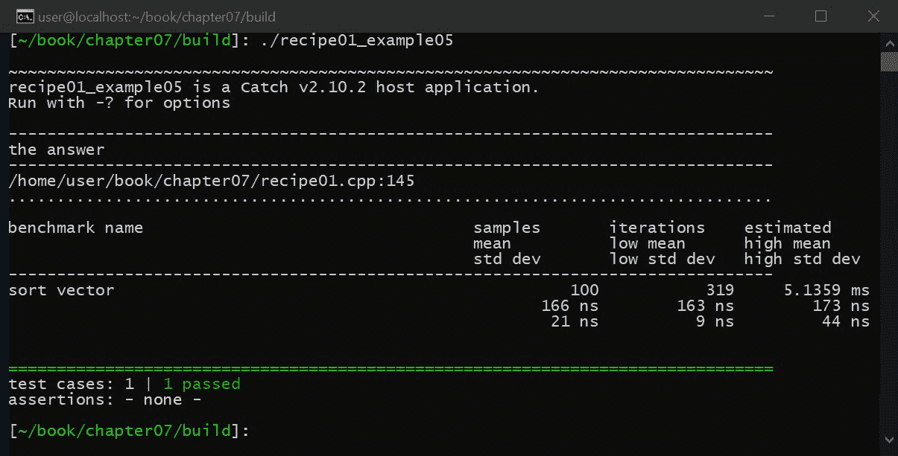
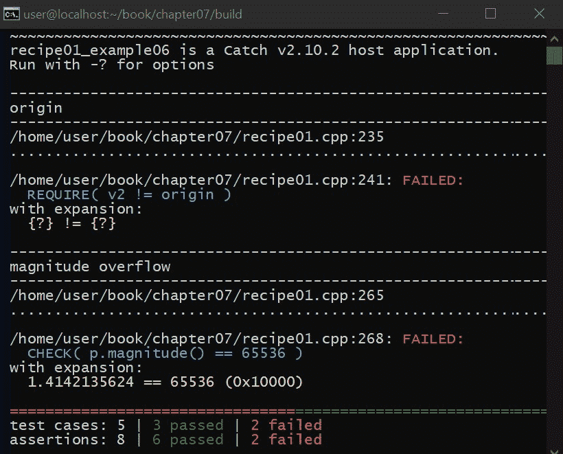
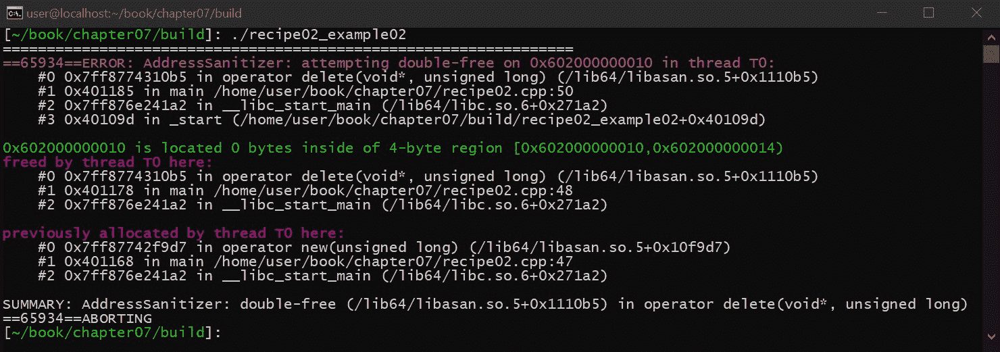

# 七、调试和测试

在本章中，您将学习如何正确测试和调试您的 C++ 应用程序。这一点很重要，因为如果没有良好的测试和调试，您的 C++ 应用程序很可能包含难以检测的错误，这会降低它们的整体可靠性、稳定性和安全性。

本章将从单元测试的全面概述开始，单元测试是在单元级别测试代码的行为，本章还将研究如何利用现有的库来加快编写测试的过程。接下来，它将演示如何使用 ASAN 和瑞银动态分析工具来检查内存损坏和未定义的行为。最后，本章将以快速查看如何在您自己的代码中利用`NDEBUG`宏在尝试解决问题时添加调试逻辑来结束。

本章包含以下配方:

*   掌握单元测试
*   和 ASAN 一起工作，地址消毒剂
*   与未定义的行为消毒剂瑞银合作
*   使用`#ifndef NDEBUG`有条件地执行附加检查

# 技术要求

要编译和运行本章中的示例，您必须拥有运行 Ubuntu 18.04 的计算机的管理权限，并且具有功能性互联网连接。在运行这些示例之前，您必须安装以下内容:

```cpp
> sudo apt-get install build-essential git cmake
```

如果这安装在 Ubuntu 18.04 以外的任何操作系统上，则需要 GCC 7.4 或更高版本以及 CMake 3.6 或更高版本。

章节的代码文件可以在[https://github . com/packt publishing/Advanced-CPP-cook book/tree/master/chapter 07](https://github.com/PacktPublishing/Advanced-CPP-CookBook/tree/master/chapter07)找到。

# 掌握单元测试

在这个食谱中，我们将学习如何单元测试我们的 C++ 代码。有几种不同的方法可以确保您的 C++ 代码以可靠、稳定、安全和符合规范的方式执行。

单元测试是在基本单元级别测试代码的行为，是任何测试策略的关键组成部分。这个食谱很重要，不仅因为它将教你如何对代码进行单元测试，还因为它将解释为什么单元测试如此关键，以及如何使用现有的库加快对 C++ 进行单元测试的过程。

# 准备好

开始之前，请确保满足所有技术要求，包括安装 Ubuntu 18.04 或更高版本，并在终端窗口中运行以下内容:

```cpp
> sudo apt-get install build-essential git cmake
```

这将确保您的操作系统拥有适当的工具来编译和执行本食谱中的示例。完成后，打开一个新的终端。我们将使用这个终端来下载、编译和运行我们的示例。

# 怎么做...

按照以下步骤完成配方:

1.  从新的终端，运行以下命令下载源代码:

```cpp
> cd ~/
> git clone https://github.com/PacktPublishing/Advanced-CPP-CookBook.git
> cd Advanced-CPP-CookBook/chapter07
```

2.  要编译源代码，请运行以下命令:

```cpp
> cmake .
> make recipe01_examples
```

3.  编译源代码后，您可以通过运行以下命令来执行该配方中的每个示例:

```cpp
> ./recipe01_example01
===========================================================================
All tests passed (1 assertion in 1 test case)

> ./recipe01_example02
===========================================================================
All tests passed (6 assertions in 1 test case)

> ./recipe01_example03
===========================================================================
All tests passed (8 assertions in 1 test case)

> ./recipe01_example04
===========================================================================
All tests passed (1 assertion in 1 test case)

> ./recipe01_example05
...
===========================================================================
test cases: 1 | 1 passed
assertions: - none -

> ./recipe01_example06
...
===========================================================================
test cases: 5 | 3 passed | 2 failed
assertions: 8 | 6 passed | 2 failed

> ./recipe01_example07
===========================================================================
test cases: 1 | 1 passed
assertions: - none -

> ./recipe01_example08
===========================================================================
All tests passed (3 assertions in 1 test case)
```

在下一节中，我们将逐一介绍这些示例，并解释每个示例程序的功能以及它与本食谱中所教授的课程之间的关系。

# 它是如何工作的...

简单地编写 C++ 应用程序，并希望它不需要任何测试就能如预期那样工作，肯定会导致可靠性、稳定性和安全性相关的错误。这个方法很重要，因为在发布前测试应用程序可以确保应用程序按预期执行，最终为您节省时间和金钱。

测试代码有几种不同的方法，包括系统级、集成、长期稳定性、静态和动态分析等。在本食谱中，我们将重点介绍**单元测试**。单元测试将一个应用程序分解成功能性的**单元**，并测试每个单元以确保它按预期执行。通常，在实践中，每个函数和对象(即类)都是一个应该独立测试的单元。

关于如何执行单元测试，有几种不同的理论，整本书都是关于这个主题的。一些人认为应该测试函数或对象中的每一行代码，利用覆盖工具来确保符合性，而另一些人认为单元测试应该是需求驱动的，使用黑盒方法。一个被称为**测试驱动开发**的常见开发过程规定，所有的测试，包括单元测试，都应该在任何源代码被编写之前被编写，而**行为驱动开发**通过一个特定的、故事驱动的单元测试方法，将测试驱动开发向前推进了一步。

每个测试模型都有它的优缺点，你选择哪种方法将取决于你正在编写的应用程序的类型，你坚持的软件开发过程的类型，以及你可能需要或不需要遵循的任何策略。不管这种选择如何，单元测试都可能是您的测试方案的一部分，这个方法将为如何单元测试您的 C++ 应用程序提供基础。

虽然单元测试可以用标准的 C++ 来完成(例如`libc++ `就是这样进行单元测试的)，但是单元测试库有助于简化这个过程。在这个食谱中，我们将利用`Catch2`单元测试库，它可以在
[https://github.com/catchorg/Catch2.git](https://github.com/catchorg/Catch2.git)找到。

虽然我们将回顾 Catch2，但是正在讨论的原则适用于大多数可用的单元测试库，或者即使是标准的 C++，如果您选择不使用助手库的话。要利用 Catch2，只需执行以下步骤:

```cpp
> git clone https://github.com/catchorg/Catch2.git catch
> cd catch
> mkdir build
> cd build
> cmake ..
> make
> sudo make install
```

您也可以使用 CMake 的`ExternalProject_Add`，正如我们在 GitHub 上的例子中所做的那样，来利用库的本地副本。

为了了解如何使用 Catch2，让我们看下面这个简单的例子:

```cpp
#define CATCH_CONFIG_MAIN
#include <catch.hpp>

TEST_CASE("the answer")
{
   CHECK(true);
}
```

运行时，我们会看到以下输出:


在前面的例子中，我们从定义`CATCH_CONFIG_MAIN`开始。这告诉 Catch2 库，我们希望它为我们创建`main()`函数。这必须在我们包含 Catch2 `include`语句之前定义，我们在前面的代码中已经这样做了。

下一步是定义一个测试用例。每一个单元都被分解成测试用例来测试有问题的单元。每个测试用例的粒度由您决定:一些人选择为每个被测试的单元拥有一个测试用例，而另一些人，例如，选择为每个被测试的功能拥有一个测试用例。`TEST_CASE()`接受一个字符串，该字符串允许您提供测试用例的描述，这在测试失败时很有帮助，因为 Catch2 将输出该字符串来帮助您识别测试代码中失败发生的位置。我们简单例子的最后一步是使用`CHECK()`宏。这个宏执行特定的测试。每个`TEST_CASE()`可能会有几个`CHECK()`宏，旨在为设备提供特定的输入，然后验证结果输出。

一旦编译并执行，单元测试库将提供一些描述如何执行测试的输出文本。在这种情况下，库声明所有的测试都通过了，这就是期望的结果。

为了更好地理解如何在自己的代码中利用单元测试，让我们看看下面这个更复杂的例子:

```cpp
#define CATCH_CONFIG_MAIN
#include <catch.hpp>

#include <vector>
#include <iostream>
#include <algorithm>

TEST_CASE("sort a vector")
{
    std::vector<int> v{4, 8, 15, 16, 23, 42};
    REQUIRE(v.size() == 6);

    SECTION("sort descending order") {
        std::sort(v.begin(), v.end(), std::greater<int>());

        CHECK(v.front() == 42);
        CHECK(v.back() == 4);
    }

    SECTION("sort ascending order") {
        std::sort(v.begin(), v.end(), std::less<int>());

        CHECK(v.front() == 4);
        CHECK(v.back() == 42);
    }
}
```

像前面的例子一样，我们用`CATCH_CONFIG_MAIN`宏包含 Catch2，然后用描述定义一个测试用例。在这个例子中，我们正在测试对向量进行排序的能力，所以这就是我们提供的描述。我们在测试中做的第一件事是创建一个带有预定义整数列表的整数向量。

接下来我们要做的是使用`REQUIRE()`宏进行测试，确保向量中有`6`元素。`REQUIRE()`宏与`CHECK()`类似，两者都检查以确保宏中的语句是真实的。区别在于`CHECK()`宏将报告错误，然后继续执行，而`REQUIRE()`宏将停止执行，停止单元测试。这有助于确保单元测试是基于测试可能做出的任何假设而正确构建的。`REQUIRE()`的使用很重要，因为单元测试随着时间的推移而成熟，并且其他程序员添加和修改单元测试，确保随着时间的推移 bug 不会被引入单元测试，因为没有什么比测试和调试您的单元测试更糟糕的了。

`SECTION()`宏用于用更好的描述进一步分解我们的测试，并提供为每个测试添加通用设置代码的能力。在前面的例子中，我们测试了向量的`sort()`函数。`sort()`函数可以向不同的方向排序，这是单元测试必须验证的。没有`SECTION()`宏，如果测试失败，很难知道失败是来自升序还是降序排序。此外，`SECTION()`宏确保每个测试不影响其他测试的结果。

最后，我们使用`CHECK()`宏来确保`sort()`功能按预期工作。单元测试也应该检查异常。在下面的示例中，我们将确保正确抛出异常:

```cpp
#define CATCH_CONFIG_MAIN
#include <catch.hpp>

#include <vector>
#include <iostream>
#include <algorithm>

void foo(int val)
{
    if (val != 42) {
        throw std::invalid_argument("The answer is: 42");
    }
}

TEST_CASE("the answer")
{
    CHECK_NOTHROW(foo(42));
    REQUIRE_NOTHROW(foo(42));

    CHECK_THROWS(foo(0));
    CHECK_THROWS_AS(foo(0), std::invalid_argument);
    CHECK_THROWS_WITH(foo(0), "The answer is: 42");

    REQUIRE_THROWS(foo(0));
    REQUIRE_THROWS_AS(foo(0), std::invalid_argument);
    REQUIRE_THROWS_WITH(foo(0), "The answer is: 42");
}
```

和前面的例子一样，我们定义`CATCH_CONFIG_MAIN`宏，添加我们需要的包含，并定义一个单独的`TEST_CASE()`。我们还定义了一个`foo()`函数，如果`foo()`函数的输入无效，就会抛出这个函数。

在我们的测试案例中，我们首先用有效的输入测试`foo()`函数。由于`foo()`函数没有输出(也就是说，函数返回`void`，我们通过使用`CHECK_NOTHROW()`宏确保没有抛出异常来检查以确保函数已经正确执行。需要注意的是，和`CHECK()`宏一样，`CHECK_NOTHROW()`宏也有等效的`REQUIRE_NOTHROW()`，如果检查失败将会暂停执行。

最后，我们确保`foo()`函数在其输入无效时抛出异常。有几种不同的方法可以做到这一点。`CHECK_THROWS()`宏只是确保抛出了一个异常。`CHECK_THROWS_AS()`宏确保不仅抛出了异常，而且该异常属于`std::runtime_error`类型。两者都必须为真，测试才能通过。最后，`CHECK_THROWS_WITH()`宏确保抛出了异常，并且`what()`字符串返回了我们期望的与异常匹配的结果。与其他版本的`CHECK()`宏一样，这些宏也有`REQUIRE()`版本。

虽然 Catch2 库提供了宏，可以让您深入了解每种异常类型的具体细节，但应该注意的是，除非异常类型和字符串在您的 API 要求中有明确定义，否则应该使用通用的`CHECK_THROWS()`宏——例如，`at()`函数由规范定义，当索引无效时总是返回一个`std::out_of_range`异常。在这种情况下，应该使用`CHECK_THROWS_AS()`宏来确保`at()`功能与规范相匹配。该异常返回的字符串未被指定为规范的一部分，因此应避免使用`CHECK_THROWS_WITH()`。这很重要，因为编写单元测试时的一个常见错误是编写了过度指定的单元测试。当被测试的代码被更新时，过度指定的单元测试必须经常被更新，这不仅成本高，而且容易出错。

单元测试应该足够详细，以确保单元按预期执行，但足够通用，以确保对源代码的修改不需要更新单元测试本身，除非应用编程接口的要求发生变化，导致一组单元测试老化良好，同时仍然为确保可靠性、稳定性、安全性甚至合规性提供必要的测试。

一旦有了一组单元测试来验证每个单元都按预期执行，下一步就是确保每当代码被修改时，单元测试都被执行。这可以手动完成，也可以通过**持续集成** ( **CI** )服务器自动完成，如 TravisCI 但是，当您决定这样做时，请确保单元测试返回正确的错误代码。在前面的例子中，当单元测试通过时，单元测试本身以`EXIT_SUCCESS`退出，并打印一个简单的字符串，说明所有测试都通过了。对于大多数配置项来说，这已经足够了，但是在某些情况下，让 Catch2 以易于解析的格式输出结果可能会很有用。

例如，考虑以下代码:

```cpp
#define CATCH_CONFIG_MAIN
#include <catch.hpp>

TEST_CASE("the answer")
{
    CHECK(true);
}
```

让我们用下面的代码来运行:

```cpp
> ./recipe01_example01 -r xml
```

如果我们这样做，我们会得到以下结果:


在前面的示例中，我们创建了一个简单的测试用例(与本食谱中的第一个示例相同)，并指示 Catch2 使用`-r xml`选项将测试结果输出到 XML。Catch2 有几种不同的输出格式，包括 XML 和 JSON。

除了输出格式之外，Catch2 还可以用来对我们的代码进行基准测试。例如，考虑以下代码片段:

```cpp
#define CATCH_CONFIG_MAIN
#define CATCH_CONFIG_ENABLE_BENCHMARKING
#include <catch.hpp>

#include <vector>
#include <iostream>

TEST_CASE("the answer")
{
    std::vector<int> v{4, 8, 15, 16, 23, 42};

    BENCHMARK("sort vector") {
        std::sort(v.begin(), v.end());
    };
}
```

在前面的例子中，我们创建了一个简单的测试用例，用预定义的向量编号对向量进行排序。然后，我们在一个`BENCHMARK()`宏中对这个列表进行排序，执行时会产生以下输出:



如上图截图所示，Catch2 多次执行该函数，平均花费`197`纳秒对向量进行排序。`BENCHMARK()`宏有助于确保代码不仅在给定特定输入的情况下以正确的输出按预期执行，而且在给定特定时间内执行。与更详细的输出格式(如 XML 或 JSON)相结合，这种类型的信息可以用来确保随着源代码的修改，生成的代码在相同的时间内或更快地执行。

为了更好地理解单元测试如何真正提高你的 C++，我们将通过两个额外的例子来结束这个食谱，这两个例子旨在提供更真实的场景。

在第一个例子中，我们将创建一个**向量**。与`std::vector`不同，在 C++ 中`std::vector`是一个动态的 C 风格的数组，数学中的向量是 *n* 维空间中的一个点(在我们的例子中，我们将其限制在 2D 空间中)，其大小是该点和原点之间的距离(即 0，0)。我们在示例中实现了这个向量，如下所示:

```cpp
#define CATCH_CONFIG_MAIN
#include <catch.hpp>

#include <cmath>
#include <climits>

class vector
{
    int m_x{};
    int m_y{};
```

我们做的第一件事(除了通常的宏和 includes)是用`x`和`y`坐标定义一个类:

```cpp
public:

    vector() = default;

    vector(int x, int y) :
        m_x{x},
        m_y{y}
    { }

    auto x() const
    { return m_x; }

    auto y() const
    { return m_y; }

    void translate(const vector &p)
    {
        m_x += p.m_x;
        m_y += p.m_y;
    }

    auto magnitude()
    {
        auto a2 = m_x * m_x;
        auto b2 = m_y * m_y;

        return sqrt(a2 + b2);
    }
};
```

接下来，我们添加一些帮助函数和构造函数。当 *x* 和 *y* 被设置为原点时，默认构造函数会生成一个没有方向或大小的向量。为了创建具有方向和大小的向量，我们还提供了另一个构造函数，允许您提供向量的初始 *x* 和 *y* 坐标。为了得到向量的方向，我们提供了 getters 返回向量的 *x* 和 *y* 值。最后，我们提供了两个助手函数。第一个辅助函数**翻译**向量，在数学中这是另一个术语，用于改变给定另一个向量的向量的 *x* 和 *y* 坐标。最后一个辅助函数返回向量的大小，如果向量的 *x* 和 *y* 值被用来构造三角形(也就是说，我们必须使用毕达哥拉斯定理来计算向量的大小)，那么它就是向量斜边的长度。接下来，我们继续添加运算符，具体如下:

```cpp
bool operator== (const vector &p1, const vector &p2)
{ return p1.x() == p2.x() && p1.y() == p2.y(); }

bool operator!= (const vector &p1, const vector &p2)
{ return !(p1 == p2); }

constexpr const vector origin;
```

我们增加了一些等价算子，可以用来检查两个向量是否相等。我们还定义了一个表示原点的向量，这个向量的 *x* 和 *y* 值为 0。

为了测试这个向量，我们添加了以下测试:

```cpp
TEST_CASE("default constructor")
{
    vector p;

    CHECK(p.x() == 0);
    CHECK(p.y() == 0);
}

TEST_CASE("origin")
{
    CHECK(vector{0, 0} == origin);
    CHECK(vector{1, 1} != origin);
}

TEST_CASE("translate")
{
    vector p{-4, -8};
    p.translate({46, 50});

    CHECK(p.x() == 42);
    CHECK(p.y() == 42);
}

TEST_CASE("magnitude")
{
    vector p(1, 1);
    CHECK(Approx(p.magnitude()).epsilon(0.1) == 1.4);
}

TEST_CASE("magnitude overflow")
{
    vector p(INT_MAX, INT_MAX);
    CHECK(p.magnitude() == 65536);
}
```

第一个测试确保默认构造的向量实际上是原点。我们的下一个测试确保我们的全局**原点**向量是原点。这一点很重要，因为我们不应该假设原点是默认构造的——也就是说，未来有人可能会意外地将原点更改为`0,0`以外的其他东西。这个测试用例保证了原点实际上是`0,0`，这样以后如果有人不小心更改了这个，这个测试就会失败。由于原点必须导致 *x* 和 *y* 都为 0，因此该测试没有超出规定。

接下来，我们测试平移和幅度函数。在幅度测试的情况下，我们使用`Approx()`宏。这是必要的，因为返回的幅度是一个浮点，其大小和精度取决于硬件，与我们的测试无关。`Approx()`宏允许我们陈述精度水平，我们希望验证`magnitude()`函数的结果，该函数使用`epsilon()`修改器来实际陈述精度。在这种情况下，我们只希望验证到小数点后一位。

最后一个测试用例用于演示如何测试这些函数的所有输入。如果一个函数取整数，那么有效、无效和极端的输入都应该被测试。在这种情况下，我们正在通过 *x* 和 *y* 的`INT_MAX`。产生的`magnitude()`函数没有提供有效的结果。这是因为计算大小的过程溢出了整数类型。这种类型的错误要么应该在代码中考虑(也就是说，您应该检查可能的溢出并抛出异常)，要么 API 的规范应该调用这些类型的问题(也就是说，C++ 规范可能会声明这种类型的输入的结果是未定义的)。无论哪种方式，如果一个函数取一个整数，那么所有可能的整数值都应该被测试，并且这个过程应该对所有输入类型重复。

该测试的结果如下:



如前面的截图所示，该单元没有通过最后一次测试。如前所述，要解决这个问题，幅度函数应该更改为当发生溢出时抛出，找到防止溢出的方法，或者删除测试并声明此类输入未定义。

在最后一个例子中，我们将演示如何处理不返回值的函数，而是处理输入。

让我们通过创建一个写入文件的类和另一个使用第一个类将字符串写入所述文件的类来开始这个示例，如下所示:

```cpp
#define CATCH_CONFIG_MAIN
#include <catch.hpp>

#include <string>
#include <fstream>

class file
{
    std::fstream m_file{"test.txt", std::fstream::out};

public:

    void write(const std::string &str)
    {
        m_file.write(str.c_str(), str.length());
    }
};

class the_answer
{
public:

    the_answer(file &f)
    {
        f.write("The answer is: 42\n");
    }
};
```

如前面的代码所示，第一个类写入一个名为`test.txt`的文件，而第二个类将第一个类作为输入，并使用它向该文件写入一个字符串。

我们测试第二类如下:

```cpp
TEST_CASE("the answer")
{
    file f;
    the_answer{f};
}
```

前面测试的问题是我们没有任何`CHECK()`宏。这是因为，除了`CHECK_NOTHROW()`，我们没有什么可查的。在这个测试中，我们正在测试以确保`the_answer{}`类调用`file{}`类并且`write()`功能正常。我们可以打开`test.txt`文件并检查以确保它是用正确的字符串编写的，但是这是一项大量的工作。这种类型的检查也是过度指定的，因为我们不是在测试`file{}`类——我们只是在测试`the_answer{}`类。如果将来我们决定`file{}`类应该写入网络文件，而不是磁盘上的文件，单元测试将不得不改变。

为了解决这个问题，我们可以利用一个叫做**嘲讽**的概念。一个`Mock`类是一个假装是输入的类的类，为单元测试提供**接缝**，允许单元测试验证测试结果。这与提供虚假输入的`Stub`不同。可悲的是，与其他语言相比，C++ 并不支持嘲讽。帮助程序库(如 GoogleMock)试图解决这个问题，但代价是要求您的所有可模拟类都包含一个 vTable(即继承纯虚拟基类)，并定义每个可模拟类两次(一次在代码中，第二次在测试中，使用 Google 定义的一组 API)。这远非最佳。像希波克拉底这样的库试图解决这些问题，但代价是一些只在特定环境下有效的虚拟黑魔法，并且在出现问题时几乎不可能调试。虽然希波莫克可能是最好的选择之一(也就是说，直到 C++ 启用本机嘲讽)，但以下示例是使用标准 C++ 进行嘲讽的另一种方法，唯一的缺点是冗长:

```cpp
#define CATCH_CONFIG_MAIN
#include <catch.hpp>

#include <string>
#include <fstream>

class file
{
    std::fstream m_file{"test.txt", std::fstream::out};

public:
    VIRTUAL ~file() = default;

    VIRTUAL void write(const std::string &str)
    {
        m_file.write(str.c_str(), str.length());
    }
};

class the_answer
{
public:
    the_answer(file &f)
    {
        f.write("The answer is: 42\n");
    }
};
```

和前面的例子一样，我们创建了两个类。第一类写入文件，而第二类使用第一类将字符串写入所述文件。不同的是我们增加了`VIRTUAL`宏。当代码被编译到我们的应用程序中时，`VIRTUAL`被设置为无，这意味着它被编译器从代码中移除。然而，当代码在我们的测试中编译时，它被设置为`virtual`，这告诉编译器给类一个 vTable。因为这只是在我们的测试中完成的，所以增加的开销是可以接受的。

既然我们的类在我们的测试用例中支持继承，我们可以创建我们的`file{}`类的子类版本，如下所示:

```cpp
class mock_file : public file
{
public:
    void write(const std::string &str)
    {
        if (str == "The answer is: 42\n") {
            passed = true;
        }
        else {
            passed = false;
        }
    }

    bool passed{};
};
```

前面的类定义了我们的模拟。我们的模拟检查不是写入文件，而是查看是否有特定的字符串被写入我们的假文件，并根据测试结果将全局变量设置为`true`或`false`。

然后我们可以如下测试我们的`the_answer{}`类:

```cpp
TEST_CASE("the answer")
{
    mock_file f;
    REQUIRE(f.passed == false);

    f.write("The answer is not: 43\n");
    REQUIRE(f.passed == false);

    the_answer{f};
    CHECK(f.passed);
}
```

执行此操作时，我们会得到以下结果:


如前面的截图所示，我们现在可以检查以确保我们的类按照预期写入文件。需要注意的是，在执行我们的测试之前，我们使用`REQUIRE()`宏来确保模拟处于`false`状态。这确保了如果我们的实际测试注册为已经通过，那么它实际上已经通过，而不是因为我们的测试逻辑中的错误而注册为通过。

# 和 ASAN 一起工作，地址消毒剂

在这个食谱中，我们将学习如何利用谷歌的**地址消毒剂**(**ASAN**)——这是一个动态分析工具——来检查我们代码中的内存损坏错误。这个方法很重要，因为它提供了一种简单的方法来确保您的代码既可靠又稳定，对构建系统的更改也很少。

# 准备好

开始之前，请确保满足所有技术要求，包括安装 Ubuntu 18.04 或更高版本，并在终端窗口中运行以下内容:

```cpp
> sudo apt-get install build-essential git cmake
```

这将确保您的操作系统拥有适当的工具来编译和执行本食谱中的示例。完成后，打开一个新的终端。我们将使用这个终端来下载、编译和运行我们的示例。

# 怎么做...

按照配方执行以下步骤:

1.  从新的终端，运行以下命令下载源代码:

```cpp
> cd ~/
> git clone https://github.com/PacktPublishing/Advanced-CPP-CookBook.git
> cd Advanced-CPP-CookBook/chapter07
```

2.  要编译源代码，请运行以下命令:

```cpp
> cmake -DCMAKE_BUILD_TYPE=ASAN ..
> make recipe02_examples
```

3.  编译源代码后，您可以通过运行以下命令来执行该配方中的每个示例:

```cpp
> ./recipe02_example01
...

> ./recipe02_example02
...

> ./recipe02_example03
...

> ./recipe02_example04
...

> ./recipe02_example05
...
```

在下一节中，我们将逐一介绍这些示例，并解释每个示例程序的功能，以及它与本食谱中所教授的课程之间的关系。

# 它是如何工作的...

谷歌的地址消毒剂是对 GCC 和 LLVM 编译器的一组修改，以及一组在测试时必须链接到您的应用程序中的库。为此，我们必须在编译测试代码时添加以下编译器标志(但不要将这些标志添加到生产版本中):

```cpp
-fsanitize=address 
-fno-optimize-sibling-calls 
-fsanitize-address-use-after-scope 
-fno-omit-frame-pointer 
-g -O1
```

这里要注意的最重要的标志是`-fsanitize=address`标志，它告诉编译器启用 ASAN。洗手液需要其余的彩旗才能正常工作，最引人注目的彩旗是`-g`和`-01`。`-g`标志启用调试，`-O1`标志将优化级别设置为 1，以提供一些性能改进。请注意，一旦启用 ASAN 工具，编译器将自动尝试链接到 ASAN 库，该库必须存在于您的计算机上。

为了演示这种消毒剂的工作原理，让我们看几个例子。

# 内存泄漏错误

`AddressSanitizer`是一个动态分析工具，旨在识别内存损坏错误。它类似于 Valgrind，但直接构建在您的可执行文件中。演示这一点最简单的例子(也是最常见的错误类型之一)是内存泄漏，如以下代码所示:

```cpp
int main(void)
{
    new int;
}
```

这将产生以下输出:


在前面的例子中，我们使用`new`运算符在程序中分配一个整数，但是在退出程序之前，我们永远不会释放这个分配的内存。ASAN 工具能够检测到这个问题，并在应用程序完成执行时输出一个错误。

# 内存删除了两次

检测内存泄漏的能力非常有用，但这不是 ASAN 能够检测到的唯一类型的错误。另一种常见的错误是两次删除内存。例如，考虑以下代码片段:

```cpp
int main(void)
{
    auto p = new int;
    delete p;

    delete p;
}
```

执行时，我们会看到以下输出:



在前面的例子中，我们使用`new`运算符分配一个整数，然后使用删除运算符分配`delete`整数。由于指向先前分配的内存的指针仍然在我们的`p`变量中，我们可以再次删除它，这是我们在退出程序之前做的。在某些系统上，这将产生分段错误，因为它是未定义的行为。ASAN 工具能够检测到此问题，并输出一条错误消息，说明出现了`double-free`错误。

# 访问无效内存

另一种类型的错误是试图访问从未分配的内存。这通常是由试图取消引用空指针的代码引起的，但当指针损坏时也会发生这种情况，如下所示:

```cpp
int main(void)
{
    int *p = (int *)42;
    *p = 0;
}
```

这将产生以下输出:


在前面的例子中，我们创建了一个指向整数的指针，然后为它提供了一个损坏的值`42`(这不是一个有效的指针)。然后，我们尝试取消引用损坏的指针，这将导致分段错误。应该指出的是，ASAN 工具能够发现这个问题，但它不能提供任何有用的信息。这是因为 ASAN 工具是一个连接到内存分配例程的库，跟踪每个分配以及如何使用分配。如果一个分配从未发生，它将不会有任何关于发生了什么的信息，除了典型的 Unix 信号处理程序已经能够提供的信息之外，其他动态分析工具，如 Valgrind，更适合处理这些信息。

# 删除后使用内存

为了进一步演示地址消毒器是如何工作的，让我们看下面的例子:

```cpp
int main(void)
{
    auto p = new int;
    delete p;

    *p = 0;
}
```

当我们执行此操作时，我们会看到以下内容:


前面的示例分配一个整数，然后删除该整数。然后，我们尝试使用之前删除的内存。因为这个内存位置最初是被分配的，所以 ASAN 缓存了这个地址。当取消对先前删除的内存的引用时，ASAN 能够检测到该问题为`heap-use-after-free`错误。它只能检测到这个问题，因为内存是以前分配的。

# 删除从未分配的内存

作为最后一个例子，让我们看看下面的内容:

```cpp
int main(void)
{
    int *p = (int *)42;
    delete p;
}
```

这将导致以下结果:


在前面的示例中，我们创建了一个指向指针的整数，然后再次为它提供了一个损坏的值。与前面的例子不同，在这个例子中，我们试图删除损坏的指针，这将导致分段错误。同样，ASAN 能够发现这个问题，但没有任何有用的信息，因为分配从未发生过。

应该注意的是，C++ 核心指南——这是现代 C++ 的编码标准——在防止我们之前描述的问题类型方面非常有帮助。具体来说，《核心指南》规定`new()`、`delete()`、`malloc()`、`free()`和好友绝对不能直接使用，而应使用`std::unique_ptr`和`std::shared_ptr`进行*所有内存分配*。这些应用编程接口自动为您分配和释放内存。如果我们再看一下前面的例子，很容易看出使用这些 API 来分配内存，而不是手动使用`new()`和`delete()`可以防止这些类型的问题发生，因为前面的大多数例子都与无效使用`new()`和`delete()`有关。

# 与未定义的行为消毒剂瑞银合作

在本食谱中，我们将学习如何在我们的 C++ 应用程序中使用 UBSAN 动态分析工具，该工具能够检测未定义的行为。在我们的应用程序中可能会引入许多不同类型的错误，未定义的行为可能是最常见的类型，因为 C 和 C++ 规范定义了几种可能出现未定义行为的情况。

这个食谱很重要，因为它将教你如何启用这个简单的功能，以及如何在你的应用程序中使用它。

# 准备好

开始之前，请确保满足所有技术要求，包括安装 Ubuntu 18.04 或更高版本，并在终端窗口中运行以下内容:

```cpp
> sudo apt-get install build-essential git cmake
```

这将确保您的操作系统拥有适当的工具来编译和执行本食谱中的示例。完成后，打开一个新的终端。我们将使用这个终端来下载、编译和运行我们的示例。

# 怎么做...

按照以下步骤完成配方:

1.  从新的终端，运行以下命令下载源代码:

```cpp
> cd ~/
> git clone https://github.com/PacktPublishing/Advanced-CPP-CookBook.git
> cd Advanced-CPP-CookBook/chapter07
```

2.  要编译源代码，请运行以下命令:

```cpp
> cmake -DCMAKE_BUILD_TYPE=UBSAN .
> make recipe03_examples
```

3.  编译源代码后，您可以通过运行以下命令来执行该配方中的每个示例:

```cpp
> ./recipe03_example01
Floating point exception (core dumped)

> ./recipe03_example02
Segmentation fault (core dumped)

> ./recipe03_example03
Segmentation fault (core dumped)

> ./recipe03_example04

```

在下一节中，我们将逐一介绍这些示例，并解释每个示例程序的功能，以及它与本食谱中所教授的课程之间的关系。

# 它是如何工作的...

UBSAN 工具能够检测几种类型的未定义行为，包括:

*   越界错误
*   浮点错误
*   除以零
*   整数溢出
*   空指针取消引用
*   缺少退货
*   有符号/无符号转换错误
*   执行不到的代码

在本食谱中，我们将看几个这样的例子，但是首先，我们必须在我们的应用程序中启用 UBSAN 工具。为此，我们必须在应用程序的构建系统中启用以下标志:

```cpp
-fsanitize=undefined
```

该标志将告诉 GCC 或 LLVM 使用 UBSAN 工具，该工具为我们的应用程序添加了额外的逻辑以及指向 UBSAN 库的链接。应该注意的是，随着时间的推移，UBSAN 工具的功能会不断增强。因此，海湾合作委员会和 LLVM 对瑞银集团的支持程度不同。为了充分利用这个工具，您的应用程序应该针对 GCC 和 LLVM 进行编译，并且您应该对这两者使用最新的编译器。

# 除以零误差

用 UBSAN 演示最简单的例子之一是被零除的误差，如下所示:

```cpp
int main(void)
{
    int n = 42;
    int d = 0;

    auto f = n/d;
}
```

运行时，我们会看到以下内容:


在前面的例子中，我们创建了两个整数(分子和分母)，分母设置为`0`。然后，我们对分子和分母进行除法运算，得到一个被零除的误差，当程序崩溃时，瑞银会检测并输出该误差。

# 空指针取消引用

C++ 中更常见的问题类型是空指针取消引用，如下所示:

```cpp
int main(void)
{
    int *p = 0;
    *p = 42;
}
```

这将导致以下结果:


在前面的例子中，我们创建了一个指向整数的指针，并将其设置为`0`(即`NULL`指针)。然后我们取消引用`NULL`指针并设置它的值，导致一个分段错误，当程序崩溃时，UBSAN 能够检测到这个错误。

# 越界错误

前面的两个例子都可能是使用 Unix 信号处理程序检测到的。在下一个示例中，我们将访问一个越界的数组，这在 C++ 规范中是未定义的，并且更难检测:

```cpp
int main(void)
{
    int numbers[] = {4, 8, 15, 16, 23, 42};
    numbers[10] = 0;
}
```

执行时，我们会得到以下结果:


如前例所示，我们创建一个带有`6`元素的数组，然后尝试访问数组中的第 10 个元素，这个元素是不存在的。尝试访问数组中的这个元素不一定会产生分段错误。无论如何，瑞银能够检测到这种类型的错误，并在退出时将问题输出到`stderr`。

# 溢出错误

最后，我们还可以检测有符号整数溢出错误，这种错误在 C++ 中是未定义的，但极不可能产生崩溃，反而会导致程序进入损坏状态(通常会产生无限循环、越界错误等)。考虑以下代码:

```cpp
#include <climits>

int main(void)
{
    int i = INT_MAX;
    i++ ;
}
```

这将导致以下结果:


如前面的例子所示，我们创建一个整数并将其设置为最大值。然后我们尝试增加这个整数，这通常会翻转整数的符号，这是瑞银能够检测到的一个错误。

# 使用#ifndef NDEBUG 有条件地执行附加检查

在这个食谱中，我们将学习如何利用`NDEBUG`宏，它代表*无调试*。这个方法很重要，因为大多数构建系统在编译*版本*或*产品*构建时会自动定义这个宏，这可以用来在创建这样的构建时禁用调试逻辑。

# 准备好

开始之前，请确保满足所有技术要求，包括安装 Ubuntu 18.04 或更高版本，并在终端窗口中运行以下内容:

```cpp
> sudo apt-get install build-essential git cmake
```

这将确保您的操作系统拥有适当的工具来编译和执行本食谱中的示例。完成后，打开一个新的终端。我们将使用这个终端来下载、编译和运行我们的示例。

# 怎么做...

按照以下步骤完成配方:

1.  从新的终端，运行以下命令下载源代码:

```cpp
> cd ~/
> git clone https://github.com/PacktPublishing/Advanced-CPP-CookBook.git
> cd Advanced-CPP-CookBook/chapter07
```

2.  要编译源代码，请运行以下命令:

```cpp
> cmake .
> make recipe04_examples
```

3.  编译源代码后，您可以通过运行以下命令来执行该配方中的每个示例:

```cpp
> ./recipe04_example01
The answer is: 42

> ./recipe04_example02
recipe04_example02: /home/user/book/chapter07/recipe04.cpp:45: int main(): Assertion `42 == 0' failed.
Aborted (core dumped)
```

在下一节中，我们将逐一介绍这些示例，并解释每个示例程序的功能以及它与本食谱中所教授的课程之间的关系。

# 它是如何工作的...

`NDEBUG`宏源于 C，用于改变`assert()`函数的行为。`assert()`功能可以编写如下:

```cpp
void __assert(int val, const char *str)
{
    if (val == 0) {
        fprintf(stderr, "Assertion '%s' failed.\n", str);
        abort();
    }
}

#ifndef NDEBUG
    #define assert(a) __assert(a, #a)
#else
    #define assert(a)
#endif 
```

如前面的代码所示，如果给`__assert()`函数一个评估为`false`的布尔值(用 C 写，这是一个等于`0`的整数)，则向`stderr`输出一条错误消息，应用程序中止。然后使用`NDEBUG`宏来确定`assert()`函数是否存在，如果应用程序处于发布模式，那么所有断言逻辑都将被移除，从而减小应用程序的大小。使用 CMake 时，我们可以通过以下方式启用`NDEBUG`标志:

```cpp
> cmake -DCMAKE_BUILD_TYPE=Release ..
```

这将自动定义`NDEBUG`宏并启用优化。为了防止这个宏被定义，我们可以做相反的事情:

```cpp
> cmake -DCMAKE_BUILD_TYPE=Debug ..
```

前面的 CMake 代码将*而不是*定义`NDEBUG`宏，而是启用调试，并禁用大多数优化(尽管这取决于编译器)。

在我们自己的代码中，`assert`宏可以如下使用:

```cpp
#include <cassert>

int main(void)
{
    assert(42 == 0);
}
```

这将导致以下结果:


如前例所示，我们创建了一个应用程序，该应用程序使用`assert()`宏来检查一个 false 语句，这会导致应用程序中止。

虽然`assert()`功能使用了`NDEBUG`宏，但是您也可以自己使用，如下所示:

```cpp
int main(void)
{
#ifndef NDEBUG
    std::cout << "The answer is: 42\n";
#endif
}
```

如前代码所示，如果应用程序不是在*发布*模式下编译的(即编译时命令行上没有定义`NDEBUG`宏)，那么应用程序将输出到`stdout`。同样的逻辑可以在您的代码中使用，创建您自己的调试宏和函数，以确保您的调试逻辑在*发布*模式中被删除，允许您添加您需要的调试逻辑，而无需修改您交付给客户的最终应用程序。