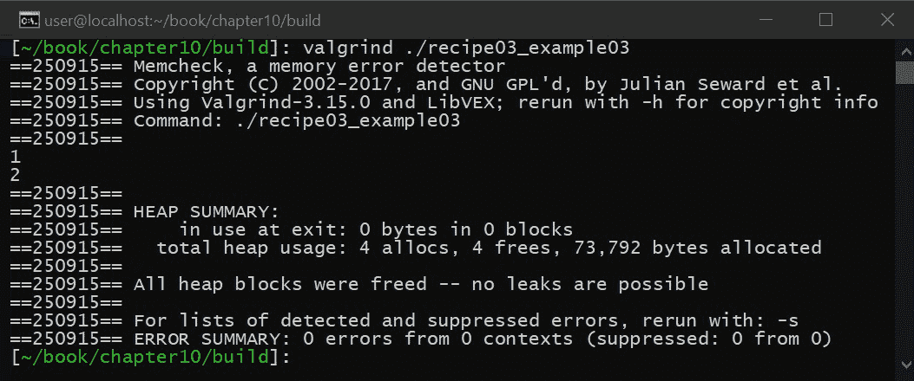
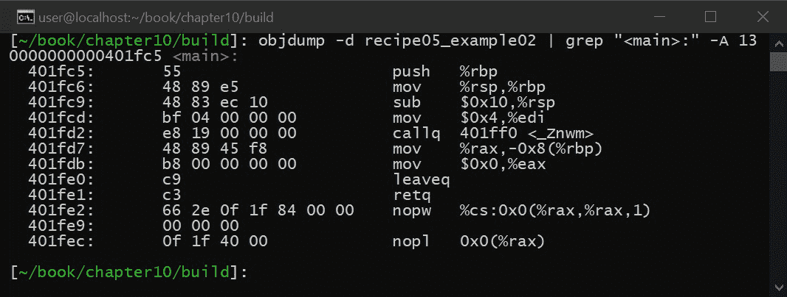
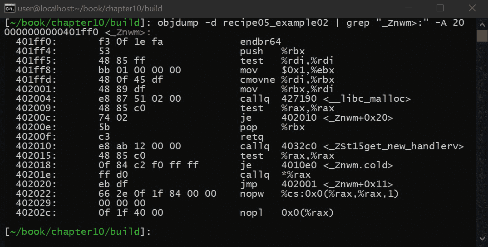

# 对动态分配的深入研究

在本章中，您将学习如何使用动态内存分配。本章很重要，因为并非所有变量都可以全局定义或在堆栈上定义(即从函数内部定义)，因为应该尽可能避免使用全局内存，堆栈内存通常比堆内存(用于动态内存分配的内存)更有限。然而，堆内存的使用多年来导致了大量关于泄漏和悬空指针的错误。

本章不仅将教您这种动态内存分配是如何工作的，还将教您如何以符合 C++核心指南的方式从堆中正确分配内存。

从我们为什么使用智能指针以及它们之间的区别、转换和其他引用开始，我们将在这一章结束时简要解释一下在 Linux 下堆是如何工作的，以及为什么动态内存分配如此缓慢。

在本章中，我们将介绍以下食谱:

*   比较标准::共享 _ptr 和标准::唯一 _ptr
*   从唯一 ptr 转换为共享 ptr
*   使用循环引用
*   使用智能指针进行类型转换
*   显微镜下的堆

# 技术要求

要编译和运行本章中的示例，您必须拥有运行 Ubuntu 18.04 的计算机的管理权限，并且具有功能性互联网连接。在运行这些示例之前，必须使用以下命令安装 Valgrind:

```cpp
> sudo apt-get install build-essential git cmake valgrind 
```

如果这安装在 Ubuntu 18.04 以外的任何操作系统上，则需要 GCC 7.4 或更高版本以及 CMake 3.6 或更高版本。

本章的代码文件可以在[https://github . com/packt publishing/Advanced-CPP-cook book/tree/master/chapter 10](https://github.com/PacktPublishing/Advanced-CPP-CookBook/tree/master/chapter10)找到。

# 比较标准::共享 _ptr 和标准::唯一 _ptr

在本食谱中，我们将了解为什么 C++核心指南不鼓励使用手动调用 new 和 delete，以及为什么他们建议使用`std::unique_ptr`和`std::shared_ptr`。我们还将了解 a `std::unique_ptr`和 a `std::shared_ptr`之间的区别，以及为什么 a `std::shared_ptr`应该只在某些场景中使用(也就是为什么`std::unique_ptr`可能是您应该在大多数场景中使用的智能指针类型)。这个方法很重要，因为它将教你如何在现代 C++中正确分配动态(堆)内存。

# 准备好

开始之前，请确保满足所有技术要求，包括安装 Ubuntu 18.04 或更高版本，并在终端窗口中运行以下内容:

```cpp
> sudo apt-get install build-essential git cmake
```

完成后，打开一个新的终端。我们将使用这个终端来下载、编译和运行我们的示例。

# 怎么做...

按照以下步骤完成该配方:

1.  从新的终端，运行以下命令下载源代码:

```cpp
> cd ~/
> git clone https://github.com/PacktPublishing/Advanced-CPP-CookBook.git
> cd Advanced-CPP-CookBook/chapter10
```

2.  要编译源代码，请运行以下命令:

```cpp
> cmake .
> make recipe01_examples
```

3.  编译完源代码后，您可以通过运行以下命令来执行该配方中的每个示例:

```cpp
> ./recipe01_example01

> ./recipe01_example02
free(): double free detected in tcache 2
Aborted (core dumped)

> ./recipe01_example03

> ./recipe01_example04

> ./recipe01_example05

> ./recipe01_example06
count: 42

> ./recipe01_example07
count: 33320633

> ./recipe01_example08
count: 42
```

在下一节中，我们将逐一介绍这些示例，并解释每个示例程序的功能以及它与本食谱中所教授的课程之间的关系。

# 它是如何工作的...

在 C++中，有三种不同的方法来声明变量:

*   **全局变量**:这些是全局可访问的变量。在 Linux 上，这些通常存在于可执行文件的`.data`、`.rodata`或`.bss`部分。
*   **栈变量**:这些变量是您在函数内部定义的，驻留在应用程序的栈内存中，由编译器管理。
*   **堆变量**:这些是使用`malloc()` / `free()`或`new()` / `delete()`创建的变量，使用由动态内存管理算法管理的堆内存(例如，`dlmalloc`、`jemalloc`、`tcmalloc`等)。

在本章中，我们将重点讨论后者，即堆风格的内存分配。您可能已经知道，在 C++中，内存是使用`new()`和`delete()`分配的，如下所示:

```cpp
int main(void)
{
    auto ptr = new int;
    *ptr = 42;
}
```

我们可以看到，分配了一个整数指针(即指向整数的指针)，然后设置为`42`。我们在 C++中使用`new()`而不是`malloc()`，原因如下:

*   `malloc()`返回`void *`而不是我们关心的类型。这可能会导致分配不匹配的错误(也就是说，您打算分配一辆汽车，而不是分配一辆橙色汽车)。换句话说，`malloc()`不提供类型安全。
*   `malloc()`需要一个尺寸参数。为了分配内存，我们需要知道为我们关心的类型分配多少字节。这可能会导致分配大小不匹配的错误(也就是说，您打算为一辆汽车分配足够的字节，但实际上您只为一辆橙色汽车分配了足够的字节)。
*   `malloc()`出错时返回`NULL`，要求`NULL`对每次分配进行检查。

`new()`操作员解决所有这些问题:

*   `new()`返回`T*`。如上例所示，这甚至允许使用`auto`，防止冗余，因为 C++的类型系统有足够的信息来正确分配和跟踪所需的类型。
*   `new()`不接受大小论证。相反，您告诉它您想要分配什么类型，它已经隐式地拥有了关于该类型的大小信息。再一次，通过简单地陈述你想要分配什么，你得到了你想要分配的，包括适当的指针和大小。
*   `new()`如果分配失败，抛出异常。这防止了对`NULL`检查的需要。如果执行了下一行代码，就可以保证分配成功(假设没有禁用异常)。

然而`new()`操作者还有一个问题；`new()`不跟踪所有权。像`malloc()`一样，`new()`操作符返回一个指针，这个指针可以在函数之间传递，而不知道谁真正拥有这个指针，这意味着它应该在不再需要的时候删除这个指针。

这种所有权的概念是 C++核心指南(除了内存跨度之外)的一个关键组成部分，该指南试图解决 C++中导致不稳定、可靠性和安全性错误的常见错误。让我们看一个例子:

```cpp
int main(void)
{
    auto p = new int;
    delete p;

    delete p;
}
```

在前面的例子中，我们分配了一个整数指针，然后删除该指针两次。在前面的例子中，我们从未在退出程序之前删除整数指针。现在，考虑以下代码块:

```cpp
int main(void)
{
    auto p = new int;
    delete p;

    *p = 42;
}
```

在前面的例子中，我们分配一个整数指针，删除它，然后使用它。虽然这些例子看起来很简单，很容易避免，但是在大型复杂的项目中，这些类型的错误经常发生，以至于 C++社区开发了静态和动态分析工具来自动为我们识别这些类型的错误(尽管它们并不完美)，以及 C++核心指南本身，试图从一开始就防止这些类型的错误。

在 C++11 中，标准委员会引入了`std::unique_ptr`来解决与`new()`和`delete()`的所有权问题。以下是它的工作原理:

```cpp
#include <memory>

int main(void)
{
    auto ptr = std::make_unique<int>();
    *ptr = 42;
}
```

在前面的例子中，我们使用`std::make_unique()`函数分配了一个整数指针。这个函数创建一个`std::unique_ptr`，并给它一个使用`new()`分配的指针。这里，得到的指针(大部分)看起来和行为都像一个常规指针，除了当`std::unique_ptr`失去作用域时指针会被自动删除。也就是说，`std::unique_ptr`拥有使用`std::make_unique()`分配的指针，并对指针本身的生存期负责。在本例中，我们不需要手动运行`delete()`，因为`delete()`是在`main()`功能完成时为我们运行的(也就是当`std::unique_ptr`失去作用域时)。

使用这个管理所有权的简单技巧，可以避免前面代码中显示的所有错误(大部分，我们将在后面讨论)。虽然下面的代码不符合 c++ Core guide(因为不建议使用下标运算符)，但是您也可以使用`std::unique_ptr`分配数组，如下所示:

```cpp
#include <memory>
#include <iostream>

int main(void)
{
    auto ptr = std::make_unique<int[]>(100);
    ptr[0] = 42;
}
```

如前面的代码所示，我们分配一个大小为`100`的 C 风格数组，然后设置数组中的第一个元素。一般来说，你唯一需要的指针类型是`std::unique_ptr`。然而，仍然会出现一些问题:

*   未正确跟踪指针的生存期，例如，在函数中分配`std::unique_ptr`并返回结果指针。一旦函数返回，`std::unique_ptr`将失去作用域，从而删除刚刚返回的指针。`std::unique_ptr` *不*实行自动垃圾收集。您仍然需要了解指针的生存期以及它如何影响您的代码。
*   永远不为`std::unique_ptr`提供失去作用域的机会，仍然有可能泄漏内存(尽管难度要大得多)；例如，将`std::unique_ptr`添加到全局列表中，或者在用`new()`手动分配的类中分配`std::unique_ptr`，然后泄漏。`std::unique_ptr` *又一次没有*实现自动垃圾回收，仍然需要你保证`std::unique_ptr`在需要的时候失去作用。
*   `std::unique_ptr`也没有能力支持共享所有权。虽然这是一个问题，但这种情况很少发生。在大多数情况下，您只需要`std::unique_ptr`就可以确保正确的所有权。

经常提出的一个问题是，*一旦分配了指针，我们如何安全地将这个指针传递给其他函数？*答案是，使用`get()`函数，将指针作为常规的 C 风格指针传递。`std::unique_ptr`定义的是所有权，而不是`NULL`的指针安全。`NULL`指针安全由带有`gsl::not_null`包装器和`expects()`宏的指南支持库提供。

如何使用这些取决于您的指针哲学:

*   一些人认为任何以指针为参数的函数都应该检查`NULL`指针。这种方法的优点是可以快速识别并安全处理`NULL`指针，缺点是您在代码中引入了额外的分支逻辑，这会降低性能和可读性。
*   一些人认为应该检查以指针为参数的*公共*函数是否有`NULL`指针。这种方法的优点是提高了性能，因为并非所有函数都需要`NULL`指针检查。这种方法的缺点是公共接口仍然有额外的分支逻辑。
*   一些人认为函数应该简单地记录它的期望(称为契约)。这种方法的好处是`assert()`和`expects()`宏可以用来在调试模式下检查`NULL`指针以强制执行该约定，而在发布模式下，没有性能损失。这种方法的缺点是，在释放模式下，所有赌注都被取消。

您采取哪种方法将在很大程度上取决于您正在编写的应用程序的类型。如果你正在写下一个 Crush 游戏，你可能会更关心后一种方法，因为它表现最好。如果你正在编写一个自动驾驶飞机的应用程序，我们都希望你使用第一种方法。

为了演示如何使用`std::unique_ptr`传递指针，让我们看下面的例子:

```cpp
std::atomic<int> count;

void inc(int *val)
{
    count += *val;
}
```

假设您有一个作为线程执行的超关键函数，以整数指针作为参数，并将提供的整数添加到全局计数器中。这个线程的前一个实现是*下注*，祈祷最好的方法。该功能可以如下实现:

```cpp
void inc(int *val)
{
    if (val != nullptr) {
        count += *val;
    }
    else {
        std::terminate();
    }
}
```

如果提供的指针是`NULL`指针，前面的函数调用`std::terminate()`(不是一个非常容错的方法)。正如我们所看到的，这种方法很难理解，因为这里有很多额外的逻辑。我们可以这样实现:

```cpp
void inc(gsl::not_null<int *> val)
{
    count += *val;
}
```

这与`NULL`指针检查做了同样的事情(取决于您如何定义`gsl::not_null`工作，因为这也可能引发异常)。您也可以如下实现:

```cpp
void inc(int *val)
{
    expects(val);
    count += *val;
}
```

前面的例子总是检查`NULL`指针，而前面的方法使用契约方法，允许在发布模式下取消检查。您也可以使用`assert()`(如果您没有使用 GSL...这开玩笑地说，当然，不应该是这种情况)。

还应该注意的是，C++标准委员会正致力于通过使用 C++契约来添加`expects()`逻辑作为语言的核心组件，这一特性不幸地从 C++20 中删除了，但有望在标准的未来版本中添加，因为我们可能能够如下编写前面的函数(并告诉编译器我们希望使用哪种方法，而不是必须手动编写它):

```cpp
void inc(int *val) [[expects: val]]
{
    count += *val;
}
```

我们可以如下使用这个函数:

```cpp
int main(void)
{
    auto ptr = std::make_unique<int>(1);
    std::array<std::thread, 42> threads;

    for (auto &thread : threads) {
        thread = std::thread{inc, ptr.get()};
    }

    for (auto &thread : threads) {
        thread.join();
    }

    std::cout << "count: " << count << '\n';

    return 0;
}
```

从前面的代码示例中，我们可以观察到以下内容:

*   我们使用`std::make_unique()`从堆中分配一个整数指针，返回`std::unique_ptr()`。
*   我们创建一个线程数组并执行每个线程，将新分配的指针传递给每个线程。
*   最后，我们等待所有线程完成并输出结果计数。由于`std::unique_ptr`的作用域是`main()`函数，我们必须确保线程在从`main()`函数返回之前完成。

前面的示例产生以下输出:


正如我们前面提到的，前面的例子将`std::unique_ptr`定义为`main()`函数的范围，这意味着我们必须确保线程在`main()`函数返回之前完成。这种情况并不总是如此。让我们看看下面的例子:

```cpp
std::atomic<int> count;

void inc(int *val)
{
    count += *val;
}
```

在这里，我们创建了一个函数，当给定一个整数指针时，该函数增加一个计数:

```cpp
int main(void)
{
    std::array<std::thread, 42> threads;

    {
        auto ptr = std::make_unique<int>(1);

        for (auto &thread : threads) {
            thread = std::thread{inc, ptr.get()};
        }
    }

    for (auto &thread : threads) {
        thread.join();
    }

    std::cout << "count: " << count << '\n';

    return 0;
}
```

如前面的代码所示，`main()`函数也与我们前面的例子相同，只是`std::unique_ptr`是在自己的作用域中创建的，它是在线程需要完成之前释放的。这将产生以下输出:


如前面的截图所示，当线程试图从已被删除的内存中读取时，结果输出是垃圾(也就是说，线程被赋予了一个悬空指针)。

虽然这是一个简单的例子，但这种类型的场景可能发生在更复杂的场景中，问题的根源是共享所有权。在这个例子中，每个线程都拥有指针。换句话说，没有一个线程试图获得指针的唯一所有权(包括分配和执行其他线程的主线程)。虽然这种类型的问题通常发生在没有主线程设计的多线程应用程序中，但这也可能发生在异步逻辑中，在异步逻辑中，指针被分配，然后被传递给生命周期和执行点未知的多个异步作业。

为了处理这些特定类型的问题，C++提供了`std::shared_ptr`。这是托管对象的包装。每次复制`std::shared_ptr`时，被管理对象都会增加一个内部计数器，用于跟踪指针(被管理对象存储的)有多少个所有者。每当`std::shared_ptr`失去作用域时，被管理对象减少内部计数器，并且一旦该计数达到`0`就删除指针。使用这种方法，`std::shared_ptr`能够支持一对多所有权模型，该模型可以处理我们之前定义的场景。

让我们看看下面的例子:

```cpp
std::atomic<int> count;

void inc(std::shared_ptr<int> val)
{
    count += *val;
}
```

如前面的代码所示，我们有相同的递增计数器的线程函数，但不同的是它采用`std::shared_ptr`而不是常规的整数指针。现在，我们可以如下实现前面的示例:

```cpp
int main(void)
{
    std::array<std::thread, 42> threads;

    {
        auto ptr = std::make_shared<int>(1);

        for (auto &thread : threads) {
            thread = std::thread{inc, ptr};
        }
    }

    for (auto &thread : threads) {
        thread.join();
    }

    std::cout << "count: " << count << '\n';

    return 0;
}
```

如前面的代码所示，指针是在其自己的作用域中创建的，该作用域在线程需要完成之前被移除。但是，与前面的示例不同，这段代码会产生以下结果:


前面的代码正确执行的原因是指针的所有权在所有线程之间共享，指针本身在所有线程完成之前不会被删除(即使作用域丢失)。

最后一个注意事项:当应该使用`std::unique_ptr`时，对所有指针类型使用`std::shared_ptr`可能很有诱惑力，因为它有很好的类型转换 API，并且在理论上确保函数有有效的指针。现实情况是，不管使用`std::shared_ptr`还是`std::unique_ptr`，一个函数都必须按照应用程序的需求执行其`NULL`检查，因为`std::shared_ptr`仍然可以被创建为`NULL`指针。

`std::shared_ptr`也增加了开销，因为它必须在内部存储所需的删除程序。它还需要为托管对象分配额外的堆。`std::shared_ptr`和`std::unique_ptr`都定义了指针所有权。它们不提供自动垃圾收集(也就是说，它们不自动处理指针生存期)，也不保证某个指针不是`NULL`。`std::shared_ptr`应该只在多个事物必须拥有指针的生存期时使用，以确保应用程序的正确执行；否则，使用`std::unique_ptr`。

# 从标准::唯一 _ptr 转换为标准::共享 _ptr

在这个食谱中，我们将学习如何从`std::unique_ptr`转换成`std::shared_ptr`。这个配方很重要，因为当应用编程接口本身确实需要`std::shared_ptr`用于内部使用时，将应用编程接口定义为接受`std::unique_ptr`通常很方便。一个很好的例子是在创建图形用户界面应用编程接口时。您可能会将一个小部件传递给应用编程接口来存储和拥有，而不知道以后图形用户界面的实现是否需要添加线程，在这种情况下`std::shared_pointer`可能是一个更好的选择。该配方将为您提供将`std::unique_ptr`转换为`std::shared_ptr`的技能，如果需要的话，无需修改 API 本身。

# 准备好

开始之前，请确保满足所有技术要求，包括安装 Ubuntu 18.04 或更高版本，并在终端窗口中运行以下内容:

```cpp
> sudo apt-get install build-essential git cmake
```

完成后，打开一个新的终端。我们将使用这个终端来下载、编译和运行我们的示例。

# 怎么做...

按照以下步骤完成该配方:

1.  从新的终端，运行以下命令下载源代码:

```cpp
> cd ~/
> git clone https://github.com/PacktPublishing/Advanced-CPP-CookBook.git
> cd Advanced-CPP-CookBook/chapter10
```

2.  要编译源代码，请运行以下命令:

```cpp
> cmake .
> make recipe02_examples
```

3.  编译完源代码后，您可以通过运行以下命令来执行该配方中的每个示例:

```cpp
> ./recipe02_example01 
count: 42
```

在下一节中，我们将逐一介绍这些示例，并解释每个示例程序的功能以及它与本食谱中所教授的课程之间的关系。

# 它是如何工作的...

`std::shared_ptr`用于在多个事物必须拥有指针才能使应用程序正常执行时管理指针。但是，假设您提供了一个必须接受整数指针的 API，如下所示:

```cpp
void execute_threads(int *ptr);
```

前面的 API 建议调用这个函数的人拥有整数指针。也就是说，无论谁调用这个函数，都需要分配整数指针，并在函数完成后删除它。但是，如果我们打算让前面的应用编程接口拥有指针，那么我们真的应该这样编写这个应用编程接口:

```cpp
void execute_threads(std::unique_ptr<int> ptr);
```

这个 API 说，*请给我分配一个整数指针，但是它一旦通过，我就拥有它，并且会保证在需要的时候删除它。*现在，假设这个函数将在一对多所有权场景中使用这个指针。你是做什么的？您可以按如下方式编写您的应用编程接口:

```cpp
void execute_threads(std::shared_ptr<int> ptr);
```

然而，这将阻止您的应用编程接口在未来优化一对多关系(也就是说，如果您能够在未来删除这种关系，您仍然会被`std::shared_ptr`卡住，即使它是次优的，而不必修改应用编程接口的函数签名)。

为了解决这个问题，c++ API 提供了将`std::unique_ptr`转换为`std::shared_ptr`的能力，如下所示:

```cpp
std::atomic<int> count;

void
inc(std::shared_ptr<int> val)
{
    count += *val;
}
```

假设我们有一个内部函数，就目前而言，将一个整数指针作为`std::shared_ptr`，使用它的值来递增`count`，并将其作为一个线程来执行。然后，我们为它提供一个公共 API 来使用这个内部函数，如下所示:

```cpp
void
execute_threads(std::unique_ptr<int> ptr)
{
    std::array<std::thread, 42> threads;
    auto shared = std::shared_ptr<int>(std::move(ptr));

    for (auto &thread : threads) {
        thread = std::thread{inc, shared};
    }

    for (auto &thread : threads) {
        thread.join();
    }
}
```

如前面的代码所示，我们的 API 声明了先前分配的整数指针的所有权。然后，它创建一系列线程，执行每个线程并等待每个线程完成。问题是，我们的内部函数需要一个`std::shared_ptr`(例如，可能这个内部函数在代码中的其他地方使用，那里有一对多的所有权场景，我们目前无法移除)。

为了防止需要用`std::shared_ptr`定义我们的公共 API，我们可以通过将`std::unique_ptr`移动到新的`std::shared_ptr`中，然后从那里调用我们的线程，将`std::unique_ptr`转换为`std::shared_ptr`。

`std::move()`是必需的，因为传递`std::unique_ptr`所有权的唯一方式是通过使用`std::move()`(因为在任何给定时间只有一个`std::unique_ptr`可以拥有指针)。

现在，我们可以如下执行这个公共 API:

```cpp
int main(void)
{
    execute_threads(std::make_unique<int>(1));
    std::cout << "count: " << count << '\n';

    return 0;
}
```

这将产生以下输出:


将来，我们也许能够消除对`std::shared_ptr`的需求，并使用`get()`函数将`std::unique_ptr`传递给我们的内部函数，并且，当那个时候到来时，我们将不必修改公共 API。

# 使用循环引用

在这个食谱中，我们将学习如何使用循环引用。当我们使用多个`std::shared_ptr`时，循环引用发生，其中每个`std::shared_ptr`拥有对另一个的引用。这个方法很重要，因为当我们处理循环依赖对象时，这种类型的循环引用可能会发生(尽管这应该尽可能避免)。如果真的发生了，`std::shared_ptr`的共享特性会导致内存泄漏。本食谱将为您提供使用`std::weak_ptr`避免上述内存泄漏的技巧。

# 准备好

开始之前，请确保满足所有技术要求，包括安装 Ubuntu 18.04 或更高版本，并在终端窗口中运行以下内容:

```cpp
> sudo apt-get install build-essential git cmake valgrind 
```

完成后，打开一个新的终端。我们将使用这个终端来下载、编译和运行我们的示例。

# 怎么做...

要使用循环引用，请执行以下步骤:

1.  从一个新的终端，运行以下程序来下载该配方的源代码:

```cpp
> cd ~/
> git clone https://github.com/PacktPublishing/Advanced-CPP-CookBook.git
> cd Advanced-CPP-CookBook/chapter10
```

2.  要编译源代码，请运行以下命令:

```cpp
> cmake .
> make recipe03_examples
```

3.  编译完源代码后，您可以通过运行以下命令来执行该配方中的每个示例:

```cpp
> valgrind ./recipe03_example01
...
==7960== HEAP SUMMARY:
==7960== in use at exit: 64 bytes in 2 blocks
==7960== total heap usage: 3 allocs, 1 frees, 72,768 bytes allocated
...

> valgrind ./recipe03_example02
...
==7966== HEAP SUMMARY:
==7966== in use at exit: 64 bytes in 2 blocks
==7966== total heap usage: 4 allocs, 2 frees, 73,792 bytes allocated
...

> valgrind ./recipe03_example03
...
==7972== HEAP SUMMARY:
==7972== in use at exit: 0 bytes in 0 blocks
==7972== total heap usage: 4 allocs, 4 frees, 73,792 bytes allocated
...

> valgrind ./recipe03_example04
...
==7978== HEAP SUMMARY:
==7978== in use at exit: 0 bytes in 0 blocks
==7978== total heap usage: 4 allocs, 4 frees, 73,792 bytes allocated
...
```

在下一节中，我们将逐一介绍这些示例，并解释每个示例程序的功能以及它与本食谱中所教授的课程之间的关系。

# 它是如何工作的...

尽管应该避免循环引用，但是随着项目变得越来越复杂和庞大，循环引用很可能会出现。如果在这些循环引用发生时利用共享智能指针，可能会发生难以发现的内存泄漏。为了理解这是如何实现的，让我们看下面的例子:

```cpp
class car;
class engine;
```

如前面的代码所示，我们从两个类原型开始。循环引用几乎总是以这种方式开始，因为一个类依赖于另一个类，反之亦然，需要使用类原型。

让我们定义一个`car`如下:

```cpp
class car
{
    friend void build_car();
    std::shared_ptr<engine> m_engine;

public:
    car() = default;
};
```

如前面的代码所示，这是一个简单的类，它存储了一个指向`engine`的共享指针和一个名为`build_car()`的友元函数。现在，我们可以定义一个`engine`如下:

```cpp
class engine
{
    friend void build_car();
    std::shared_ptr<car> m_car;

public:
    engine() = default;
};
```

如前面的代码所示，一个`engine`类似于一个`car`，区别在于引擎存储了一个指向汽车的共享指针。不过，两者都有`build_car()`功能。两者都创建默认构造的共享指针，这意味着它们的共享指针在构造时是`NULL`指针。

`build_car()`功能用于完成每个对象的构建，如下所示:

```cpp
void build_car()
{
    auto c = std::make_shared<car>();
    auto e = std::make_shared<engine>();

    c->m_engine = e;
    e->m_car = c;
}
```

如前面的代码所示，我们创建每个对象，然后设置汽车的引擎，反之亦然。由于汽车和发动机都在`build_car()`函数的范围内，我们预计一旦`build_car()`函数返回，这些指针将被删除。现在，我们可以如下执行这个`build_car()`功能:

```cpp
int main(void)
{
    build_car();
    return 0;
}
```

这看起来像一个简单的程序，但它有一个很难发现的内存泄漏。为了演示这一点，让我们在`valgrind`中运行这个应用程序，这是一个能够检测内存泄漏的动态内存分析工具:


如前面截图所示，`valgrind`表示内存泄露。如果我们用`--leak-check=full`运行`valgrind`，它会告诉我们内存泄漏是汽车和发动机共享指针。发生这种内存泄漏的原因是汽车拥有对引擎的共享引用。同样的引擎拥有对汽车本身的共享引用。

例如，考虑以下代码:

```cpp
void build_car()
{
    auto c = std::make_shared<car>();
    auto e = std::make_shared<engine>();

    c->m_engine = e;
    e->m_car = c;

    std::cout << c.use_count() << '\n';
    std::cout << e.use_count() << '\n';
}
```

如前面的代码所示，我们添加了对`use_count()`的调用，该调用输出`std::shared_ptr`包含的所有者数量。如果执行此操作，我们将看到以下输出:


我们能看到两个车主的原因是因为`build_car()`函数在这里保存了对一辆车和一台发动机的引用:

```cpp
    auto c = std::make_shared<car>();
    auto e = std::make_shared<engine>();
```

汽车第二次提到发动机是因为:

```cpp
    c->m_engine = e;
```

发动机和汽车也是如此。当`build_car()`功能完成时，以下内容首先失去作用域:

```cpp
    auto e = std::make_shared<engine>();
```

然而，引擎并没有被删除，因为汽车仍然保存着对引擎的引用。然后，汽车失去了作用范围:

```cpp
    auto c = std::make_shared<car>();
```

然而，汽车并没有被删除，因为引擎(还没有被删除)也保存着对汽车的引用。这导致`build_car()`返回时，汽车和引擎都没有被删除，因为两者仍然保持相互引用，没有办法告诉任何一个对象删除它们的引用。

这种类型的循环内存泄漏虽然在我们的示例中很容易识别，但在复杂的代码中却非常难识别，这是应该避免共享指针和循环依赖的许多原因之一(通常更好的设计可以消除对两者的需求)。如果无法避免，可以使用`std::weak_ptr`代替，如下所示:

```cpp
class car
{
    friend void build_car();
    std::shared_ptr<engine> m_engine;

public:
    car() = default;
};
```

如前面的代码所示，我们仍然将我们的汽车定义为持有对引擎的共享引用。我们这样做是因为我们假设汽车的寿命更长(也就是说，在我们的模型中，你可以有一辆没有发动机的汽车，但你不能有一个没有汽车的发动机)。然而，发动机的定义如下:

```cpp
class engine
{
    friend void build_car();
    std::weak_ptr<car> m_car;

public:
    engine() = default;
};
```

如前面的代码所示，引擎现在存储了对汽车的弱引用。我们的`build_car()`功能定义如下:

```cpp
void build_car()
{
    auto c = std::make_shared<car>();
    auto e = std::make_shared<engine>();

    c->m_engine = e;
    e->m_car = c;

    std::cout << c.use_count() << '\n';
    std::cout << e.use_count() << '\n';
}
```

如前代码所示，`build_car()`功能不变。现在的不同之处在于，当我们使用`valgrind`执行这个应用程序时，我们会看到以下输出:



如上图截图所示，没有内存泄漏，汽车的`use_count()`为`1`，而发动机的`use_count()`与上例相比仍为`2`。在引擎类中，我们使用`std::weak_ptr`，它可以访问`std::shared_ptr`管理的托管对象，但是在创建时不会增加托管对象的内部计数。这为`std::weak_ptr`提供了查询`std::shared_ptr`是否有效的能力，而不必持有对指针本身的强引用。

内存泄漏被清除的原因是，当发动机失去作用域时，其使用次数从`2`减少到`1`。一旦汽车失去作用范围，只有`1`的使用计数，它被删除，这反过来减少发动机的使用计数到`0`，这导致发动机也被删除。

我们在引擎中使用`std::weak_ptr`而不是 C 风格指针的原因是`std::weak_ptr`为我们提供了查询托管对象的能力，以查看指针是否仍然有效。例如，假设我们需要检查汽车是否仍然存在，如下所示:

```cpp
class engine
{
    friend void build_car();
    std::weak_ptr<car> m_car;

public:
    engine() = default;

    void test()
    {
        if (m_car.expired()) {
            std::cout << "car deleted\n";
        }
    }
};
```

使用`expired()`功能，我们可以在使用前测试看看车是否还存在，这是 C 型指针无法做到的。现在，我们可以将我们的`build_car()`函数编写如下:

```cpp
void build_car()
{
 auto e = std::make_shared<engine>();

 {
 auto c = std::make_shared<car>();

 c->m_engine = e;
 e->m_car = c;
 }

 e->test();
}
```

在前面的例子中，我们创建了一个引擎，然后创建了一个新的范围来创建我们的汽车。然后，我们创建循环引用并失去作用域。这导致汽车如预期的那样被删除。不同的是，我们的引擎还没有被删除，因为我们仍然拥有对它的引用。现在，我们可以运行我们的测试函数，当它与`valgrind`一起运行时，会产生以下输出:


如前面的截图所示，没有内存泄漏。`std::weak_ptr`成功去除了循环引用引入的鸡和蛋问题。因此，`std::shared_ptr`能够按预期运行，以正确的顺序释放内存。一般来说，应该尽可能避免循环引用和依赖关系，但是，如果无法避免，可以使用`std::weak_ptr`，如本食谱所示，来防止内存泄漏。

# 使用智能指针进行类型转换

在本食谱中，我们将学习如何使用`std::unique_ptr`和`std::shared_ptr`进行打字。类型转换允许您将一种类型转换成另一种类型。这个方法很重要，因为它展示了当试图转换智能指针的类型时(例如，当使用虚拟继承进行向上转换或向下转换时)使用`std::unique_ptr`和`std::shared_ptr`处理类型转换的正确方法。

# 准备好

开始之前，请确保满足所有技术要求，包括安装 Ubuntu 18.04 或更高版本，并在终端窗口中运行以下内容:

```cpp
> sudo apt-get install build-essential git cmake
```

完成后，打开一个新的终端。我们将使用这个终端来下载、编译和运行我们的示例。

# 怎么做...

要了解类型转换的工作原理，请执行以下步骤:

1.  从新的终端，运行以下命令下载源代码:

```cpp
> cd ~/
> git clone https://github.com/PacktPublishing/Advanced-CPP-CookBook.git
> cd Advanced-CPP-CookBook/chapter10
```

2.  要编译源代码，请运行以下命令:

```cpp
> cmake .
> make recipe04_examples
```

3.  编译完源代码后，您可以通过运行以下命令来执行该配方中的每个示例:

```cpp
> ./recipe04_example01
downcast successful!!

> ./recipe04_example02
downcast successful!!
```

在下一节中，我们将逐一介绍这些示例，并解释每个示例程序的功能以及它与本食谱中所教授的课程之间的关系。

# 它是如何工作的...

使用智能指针进行类型转换并不像您预期的那样简单。

为了更好地解释这一点，让我们看一个简单的例子，说明如何使用`std::unique_ptr`从基类向子类进行类型转换:

```cpp
class base
{
public:
    base() = default;
    virtual ~base() = default;
};
```

让我们看看这是如何工作的:

1.  我们从一个虚拟基类开始，如前面的代码所示，然后我们将基类子类化如下:

```cpp
class subclass : public base
{
public:
    subclass() = default;
    ~subclass() override = default;
};
```

2.  接下来，我们在`main()`函数中创建一个`std::unique_ptr`，并将指针传递给一个`foo()`函数:

```cpp
int main(void)
{
    auto ptr = std::make_unique<subclass>();
    foo(ptr.get());

    return 0;
}
```

`std::unique_ptr`只是拥有指针的生存期。指针的任何使用都需要使用`get()`函数，该函数从该点开始将`std::unique_ptr`转换为正常的 C 型指针。这是`std::unique_ptr`的预期用途，因为它不是为了确保指针安全而设计的，而是为了确保谁拥有指针被很好地定义，最终决定何时删除指针。

3.  现在`foo()`功能可以定义如下:

```cpp
void foo(base *b)
{
    if (dynamic_cast<subclass *>(b)) {
        std::cout << "downcast successful!!\n";
    }
}
```

如前面的代码所示，`foo()`函数可以将指针视为普通的 C 风格指针，使用`dynamic_cast()`从基指针向下转换回原始子类。

这种相同风格的类型转换是标准的 C++，不适用于`std::shared_ptr`。原因是因为需要类型转换版本的`std::shared_ptr`的代码可能还需要保存对指针的引用(也就是说，`std::shared_ptr`的副本以防止删除)。

也就是说，不可能从`base *b`到`std::shared_ptr<subclass>`，因为`std::shared_ptr`没有指针的引用；相反，它保存对托管对象的引用，托管对象存储对实际指针的引用。由于`base *b`不存储托管对象，因此无法从中创建`std::shared_ptr`。

然而，C++确实提供了`static_cast()`、`reinterpret_cast()`、`const_cast()`和`dynamic_cast()`的`std::shared_ptr`版本来执行共享指针的类型转换，这在类型转换时保留了托管对象。让我们看一个例子:

```cpp
class base
{
public:
    base() = default;
    virtual ~base() = default;
};

class subclass : public base
{
public:
    subclass() = default;
    ~subclass() override = default;
};
```

如前面的代码所示，我们从相同的基类和子类开始。区别出现在我们的`foo()`函数中:

```cpp
void foo(std::shared_ptr<base> b)
{
    if (std::dynamic_pointer_cast<subclass>(b)) {
        std::cout << "downcast successful!!\n";
    }
}
```

不取`base *b`，取`std::shared_ptr<base>`。现在，我们可以使用`std::dynamic_pointer_cast()`功能代替`dynamic_cast()`将`std::shared_ptr<base>`降频至`std::shared_ptr<subclass>`。`std::shared_ptr`类型转换功能为我们提供了类型转换的能力，同时根据需要保持对`std::shared_ptr`的访问。

产生的`main()`函数如下所示:

```cpp
int main(void)
{
    auto ptr = std::make_shared<subclass>();
    foo(ptr);

    return 0;
}
```

这将产生以下输出:


应该注意的是，我们不需要显式上转换，因为这可以自动完成(类似于常规指针)。我们只需要显式向下转换。

# 显微镜下的堆

在这个食谱中，我们将学习堆在 Linux 中是如何工作的。我们将深入研究当您使用`std::unique_ptr`时，Linux 实际上是如何提供堆内存的。

虽然这个方法是为那些拥有更高级功能的人准备的，但它很重要，因为它将教会你应用程序如何从堆中分配内存(也就是说，使用`new()` / `delete()`)，这反过来将向你展示为什么堆分配永远不应该从时间关键的代码中完成，因为它们很慢。当堆分配可以安全执行时，当应用程序中应该避免堆分配时，即使我们检查的一些汇编代码很难遵循，这个方法也会教你所需的技能。

# 准备好

开始之前，请确保满足所有技术要求，包括安装 Ubuntu 18.04 或更高版本，并在终端窗口中运行以下内容:

```cpp
> sudo apt-get install build-essential git cmake
```

完成后，打开一个新的终端。我们将使用这个终端来下载、编译和运行我们的示例。

# 怎么做...

要尝试本章的代码文件，请执行以下步骤:

1.  从新的终端，运行以下命令下载源代码:

```cpp
> cd ~/
> git clone https://github.com/PacktPublishing/Advanced-CPP-CookBook.git
> cd Advanced-CPP-CookBook/chapter10
```

2.  要编译源代码，请运行以下命令:

```cpp
> cmake .
> make recipe05_examples
```

3.  编译完源代码后，您可以通过运行以下命令来执行该配方中的每个示例:

```cpp
> ./recipe05_example01
```

在下一节中，我们将逐一介绍这些示例，并解释每个示例程序的功能以及它与本食谱中所教授的课程之间的关系。

# 它是如何工作的...

为了更好地理解代码必须执行到什么程度才能在堆上分配变量，我们将从下面的简单示例开始:

```cpp
int main(void)
{
    auto ptr = std::make_unique<int>();
}
```

如前例所示，我们使用`std::unique_ptr()`分配一个整数。我们使用`std::unique_ptr()`作为我们的起点，因为这是大多数 C++核心指南代码在堆上分配内存的方式。

`std::make_unique()`函数使用以下伪逻辑分配一个`std::unique_ptr`(这是一个简化的例子，因为它没有显示如何处理自定义删除程序):

```cpp
namespace std
{
    template<typename T, typename... ARGS>
    auto make_unique(ARGS... args)
    {
        return std::unique_ptr(new T(std::forward<ARGS>(args)...));
    }
}
```

如前面的代码所示，`std::make_unique()`函数创建了一个`std::unique_ptr`，并给它一个指针，该指针是用`new()`运算符分配的。一旦`std::unique_ptr`失去作用域，它将使用`delete()`删除指针。

当编译器看到新的运算符时，它会用对运算符`new(unsigned long)`的调用来替换代码。要看到这一点，让我们看下面的例子:

```cpp
int main(void)
{
    auto ptr = new int;
}
```

在前面的例子中，我们使用`new()`分配了一个简单的指针。现在，我们可以查看结果编译的程序集，可以在下面的截图中看到:



如下图截图所示，对`_Znwm`进行了一次调用，这是对`operator new(unsigned long)`进行了撕裂的 C++代码，很容易解缠:


`new()`运算符本身看起来像下面的伪代码(注意，这没有考虑到禁用异常支持或为新处理程序提供支持的能力):

```cpp
void* operator new(size_t size)
{
    if (auto ptr = malloc(size)) {
        return ptr;
    }

    throw std::bad_alloc();
}
```

现在，我们可以看看新的操作符，看到`malloc()`被调用:



如前面截图所示，调用`malloc()`。如果得到的指针不是`NULL`，操作员返回；否则，它将进入错误状态，这涉及到调用新的处理程序并最终抛出`std::bad_alloc()`(至少在默认情况下)。

对`malloc()`的调用本身要复杂得多。当一个应用程序本身启动时，它做的第一件事就是保留堆空间。操作系统给每个应用程序一个连续的虚拟内存块进行操作，Linux 上的堆是应用程序中的最后一块内存(即`new()`返回的内存来自应用程序内存空间的末端)。将堆放在这里为操作系统提供了一种根据需要向应用程序添加额外内存的方法(因为操作系统只是扩展了应用程序的虚拟内存)。

应用程序本身使用`sbrk()`函数，在内存耗尽时向操作系统请求更多内存。调用此函数时，操作系统从其内部页面池中分配页面内存，并通过移动应用程序内存空间的末尾将此内存映射到应用程序中。映射过程本身很慢，因为操作系统不仅必须从池中分配页面，这需要某种搜索和保留逻辑，而且还必须遍历应用程序的页面表，以将这些额外的内存添加到其虚拟地址空间中。

一旦`sbrk()`为应用程序提供了额外的内存，`malloc()`引擎就会接管。正如我们前面提到的，操作系统只是将内存页面映射到应用程序中。根据请求的不同，每个页面可以小到 4k 字节，大到 2 MB 甚至 1 GB。然而，在我们的例子中，我们分配了一个简单的整数，它的大小只有`4`字节。为了在不浪费内存的情况下将页面转换成小对象，`malloc()`本身有一种算法，可以将操作系统提供的内存分解成小块。该引擎还必须处理何时释放这些内存块，以便它们可以再次使用。这需要复杂的数据结构来管理应用程序的所有内存，对`malloc()`、`free()`、`new()`和`delete()`的每次调用都必须运用这一逻辑。

使用`std::make_unique()`创建`std::unique_ptr`的简单调用必须使用从`new()`分配的内存创建`std::unique_ptr`，而`new()`实际上是调用`malloc()`，它必须在复杂的数据结构中搜索，以找到最终可以返回的空闲内存块，也就是说，假设`malloc()`有空闲内存，并且不必使用`sbrk()`向操作系统请求更多内存。

换句话说，动态(即堆)内存很慢，应该只在需要的时候使用，理想情况下，不要在时间关键的代码中使用。