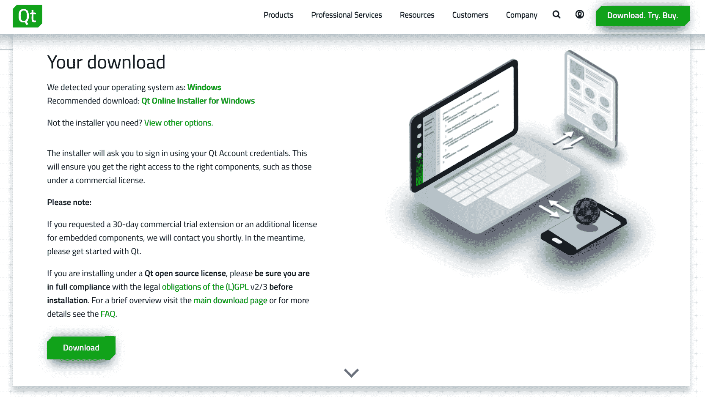
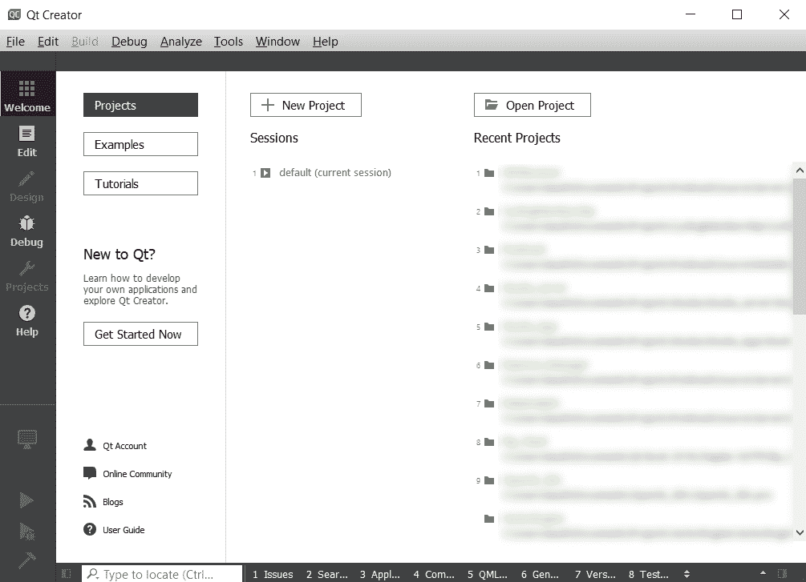
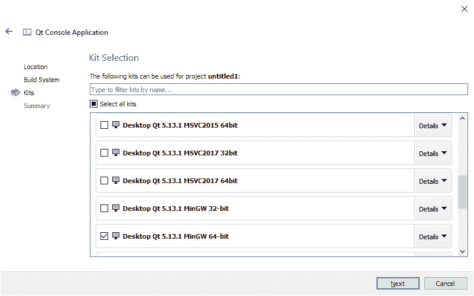
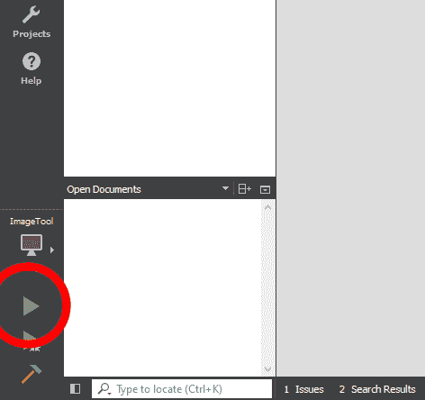
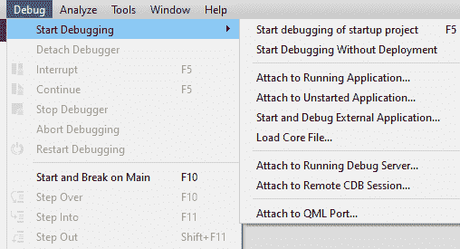
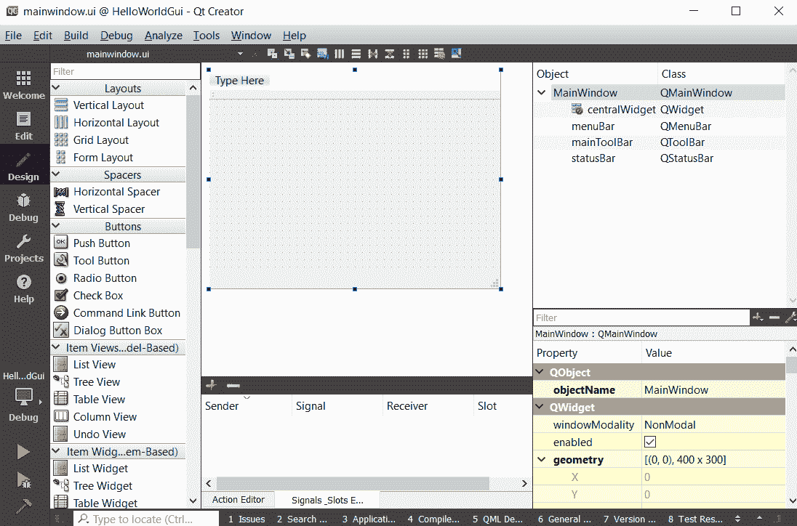
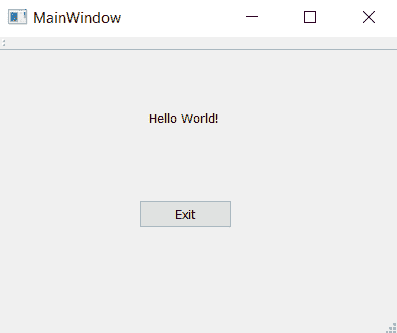
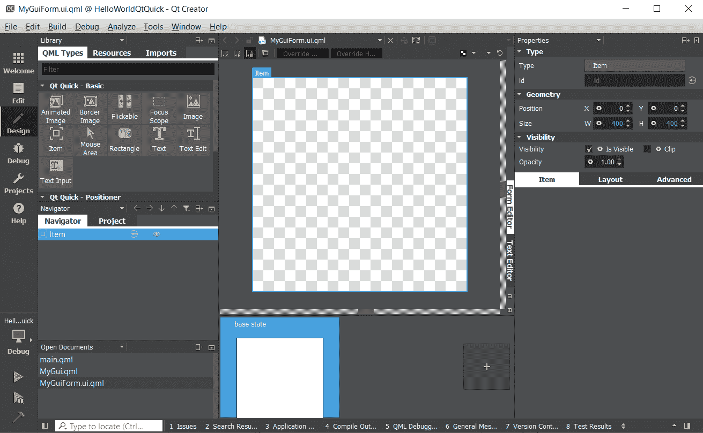

# Qt Creator 入门

Qt Creator 是一个集成的软件开发环境，既支持传统的 C++应用程序开发，也支持使用 Qt 项目库(统称为**Qt**，发音为**CUIT**)的开发。

Qt 可以在商业许可下使用，也可以在 GPL v3 和 LGPL v2 下使用。 它的发展可以追溯到 1991 年。 在其生命的前 10 年，它是用于 Windows 和 X11 的跨平台工具包；到 2001 年，添加了对 MacOS X 的支持。

在本章中，我们将介绍入门所需的所有内容，如下所示：

*   从哪里下载 Qt Creator Linux、MacOS X 和 Windows 版
*   最新版本 Qt 中的新功能
*   如何确保基本配置正在运行
*   快速了解简单的 Qt 小部件应用程序以及 Qt Quick 应用程序

# 技术要求

本章的技术要求包括 Qt 5.12.3 MinGW 64 位、Qt Creator 4.9.0 和 Windows 10。

本章的代码可在[https://github.com/PacktPublishing/Application-Development-with-Qt-Creator-Third-Edition/tree/master/Chapter01](https://github.com/PacktPublishing/Application-Development-with-Qt-Creator-Third-Edition/tree/master/Chapter01)中找到。

# 下载 Qt 和 Qt Creator

Qt 是 Qt Creator 背后的跨平台工具包，有着悠久而辉煌的历史。 目前是 Qt 公司的一个项目，它有自己的 url：[http://www.qt.io](http://www.qt.io)。 它还拥有商业和非商业许可证。 要开始免费使用非商业版本，请访问[http://www.qt.io/download-qt-installer](http://www.qt.io/download-qt-installer)。 您应该会看到类似以下屏幕截图的内容：



One of the most popular platforms for application development with Qt is Linux. On many Linux variants—notably Ubuntu, my personal favorite – you can get Qt Creator using the package manager. On my Ubuntu box, Qt Creator is just a `sudo apt-get install qtcreator` command away. You'll get a version of Qt that matches your flavor of Linux, although it might not be the latest and greatest build from The Qt Company. If you need to install the latest official version of Qt, it's recommended to download it from the preceding link.

一些下载内容包括您需要的 C++编译器和链接器。 通过点击链接并下载 Qt，您现在应该已经拥有了 Qt、Qt Creator 和用于在 Windows 上开发软件的 MinGW 工具包。 如果您在 Linux 或 Mac 上进行开发，过程将类似，尽管它不会在您的开发中包含 MinGW。 在 Windows 上，有一个包含 MinGW 工具链的变体，因此您拥有构建应用程序所需的一切。

但是，您也可以下载 Qt Creator for Windows，它使用 Microsoft Visual Studio 编译器。 因此，如果您更喜欢使用 Visual Studio 进行编译，使用 Qt Creator 作为 IDE，这也是一个选择。 在 MacOSX 上，您需要首先安装 Xcode 和命令行开发工具；您可以从 MacOSX 应用商店下载 Xcode，然后使用 Xcode 下载命令行开发工具。

下载安装程序后，按常规方式运行它，它将启动适用于您的平台的安装向导。 根据您运行的是**在线安装程序**还是**离线安装程序**，后者的安装通常需要 3 到 4 分钟；但是，如果您运行的是在线安装程序，则可能需要几个小时。 这是因为当您运行安装过程时，在线安装程序会从 Qt 服务器下载每个未压缩的工具和库文件。 另一方面，离线安装程序包含所有工具和库，它们都是以高度压缩的格式打包在安装程序本身中的，这就是为什么安装过程相对更快、更简单的原因，但与在线安装程序相比，安装程序的尺寸更大。

除此之外，您还需要有足够的磁盘空间。 Qt Creator 不会消耗那么多磁盘空间，但软件开发会消耗那么多磁盘空间；工具和库至少需要 500MB 的空闲空间，并且需要在主驱动器上预算几 GB 的空闲空间来存放源代码、中间目标文件、调试符号，当然还有编译后的应用程序。 (如果您在虚拟机上运行 Qt Creator，为此做好计划尤其重要；请确保虚拟机映像的虚拟硬盘驱动器有足够的磁盘空间。)

您还应该确保您的开发箱有足够的 RAM；越多越好。 Qt Creator 在 2 GB 的 RAM 上运行得很愉快，但是如果有更多的 RAM 可用，Qt Creator 使用的编译器和链接器可以运行得更快。

# Qt 中的新功能

Qt 开发人员不断向 Qt 添加新功能，同时修复影响其用户的关键错误。 这意味着我们可以期待 Qt 的每一次更新都有新功能，特别是在一个主要版本中。 在撰写本章时，Qt 的最新稳定版本是 5.12.3，这意味着它是其主要版本 5.12 的第三个小更新。

自本书第二版以来，Qt 的一些重要变化如下：

*   Qt WebView(WebKit)已被弃用，取而代之的是 Qt WebEngine(Chromium)。
*   MinGW 64 位编译器现在包含在 Qt 的 Windows 安装程序中。
*   移动平台增加了许多功能，包括支持应用内购买。
*   Qt 脚本、Qt 快速控件 1 和 Qt Canvas 3D 已弃用。
*   添加了对新平台的支持，如 twOS 和 watchOS。
*   以前仅供商业使用的功能，如 Qt 图表、Qt 数据可视化、Qt 虚拟键盘、Qt 采购和 Qt Quick 2D 渲染器现在都是免费的。
*   添加了对嵌入式平台的支持。
*   增加了 Qt Automotive Suite。
*   添加了 Python 的 Qt 绑定(使用 PySide 2 模块)。
*   新的信号和插槽连接语法--现在您可以直接将信号连接到 C++11 的 lambda 函数。
*   添加了对 JSON 格式的支持。
*   增加了 Qt 3D Studio。
*   在 Qt Creator 中添加了 SCXML 和状态机工具。

...除此之外还有更多！

To learn more about the new features and changes in the latest Qt release, please check out the official introduction for Qt 5 at [https:/](https://doc.qt.io/qt-5/qt5-intro.html)[/doc.qt.io/qt-5/qt5-intro.html](https://doc.qt.io/qt-5/qt5-intro.html), or head over to the wiki page at [https://wiki.qt.io/Main](https://wiki.qt.io/Main).

# 熟悉 Qt Creator

下面的屏幕截图显示了第一次启动 Qt Creator 时您将看到的内容。 让我们仔细看看屏幕的每个部分：



主窗口(当前显示 New Project 和 Open Project 的按钮)是您的工作区。 工作区还包括指向 Qt 项目、示例和教程的链接，以及 Qt 的开发人员文档，如其在线社区和博客。 在正常情况下，这将位于您将看到应用程序源代码的位置。 屏幕左侧有一系列图标，可让您选择应用程序中的各种视图。 这些建议如下：

*   欢迎模式，显示有关 Qt Creator 的基本信息
*   编辑模式，允许您编辑组成应用程序的文件
*   设计模式，允许您使用 Qt Designer 来设计应用程序的用户界面
*   调试模式，允许您在应用程序运行时对其进行调试，包括执行诸如查看内存和变量、设置断点以及单步执行应用程序等操作
*   项目模式，该模式允许您调整项目的生成和链接设置
*   分析模式，允许您分析应用程序的运行时性能
*   帮助模式，提供有关 Qt Creator 和 Qt 框架的文档

让我们使用 C++创建一个新项目。

# 您的第一个应用程序-Hello World

在 Qt Creator 中，从文件菜单中选择新建文件或项目向导。 Qt Creator 将向您显示 New File or Project 向导，该向导允许您选择要创建的项目类型，并为其命名，等等。 要创建第一个应用程序，请执行以下步骤：

1.  如果尚未选择“新建文件”或“项目名称”，请选择“新建文件”或“项目名称”。
2.  Qt Creator 向您展示了一个对话框，其中包含一系列令人眼花缭乱的项目选择。 选择应用程序，然后选择 Qt 控制台应用程序，然后单击选择...。
3.  Qt Creator 要求您输入要存储项目文件的目录的名称和路径。 对于名称，请输入`HelloWorldConsole`，然后选择对您有意义的路径(或接受默认路径)。 然后，单击 Next(下一步)。
4.  Qt Creator 会询问您要用于项目的构建系统。 如果您对此没有任何具体要求，只需保留默认选项：qmake。 然后，单击 Next(下一步)：



5.  Qt Creator 可以支持各种工具包和库，您可以根据这些工具包和库构建应用程序。 选择桌面 Qt 工具包，默认情况下应已安装该工具包。 如果您在 Windows 上运行 Qt，请确保使用**MinGW**选择桌面 Qt 工具包，因为它是默认安装的。 如果选择桌面 Qt**MSVC**工具包，请确保事先安装了 Microsoft Visual Studio。 然后，单击 Next(下一步)。
6.  下一步，Qt Creator 会提示您有关项目的版本控制系统。 Qt Creator 可以使用您安装的版本控制客户端来执行项目的更改跟踪。 目前，跳过此选项，并将“添加到版本控制”设置为“无”。 然后，单击 Finish。

Qt Creator 将创建您的项目并切换到编辑视图。 在`main.cpp`文件的源代码编辑器中，输入突出显示的代码：

```cpp
#include <QCoreApplication> 
#include <iostream> 

using namespace std; 

int main(int argc, char *argv[]) 
{ 
    QCoreApplication a(argc, argv); 
    cout << "Hello world!"; 

    return a.exec(); 
} 
```

You can download the example code files for all Packt books you have purchased from your account at [http://www.packtpub.com](http://www.packtpub.com). If you purchased this book elsewhere, you can visit [http://www.packtpub.com/support](http://www.packtpub.com/support) and register to have the files emailed directly to you.

`QCoreApplication`任务处理应用程序的整个系统启动，每个 Qt 控制台应用程序都需要创建一个并调用其`exec`方法作为`main`方法的一部分。 它设置 Qt 的事件处理程序，并提供一组移植帮助器来确定应用程序目录、库路径和其他详细信息。

对于控制台应用程序，这就是您需要的全部内容；您可以自由地将 Qt 类与 C++标准库和**标准模板库**(**STL**)混合搭配，尽管一旦您掌握了 Qt 的基础类，许多 STL 构造可能会感觉有些受限。

接下来，让我们编译并运行该应用程序。 有几种方法可以做到这一点：

1.  单击左侧帮助视图按钮下面的绿色运行箭头以运行应用程序，如下所示：



2.  点击*F5*在调试器中构建并运行您的应用程序。
3.  从 Debug(调试)菜单中单击 Start Debug(开始调试)，如下所示：



4.  单击绿色的 Run 箭头，并将 Bug 放在箭头上方，以便调试左侧的应用程序。
5.  从 Build 菜单中选择 Run(或按*Ctrl*+*R*)。

If you only want to build the application, you can click on the hammer icon under the Run and Debug icons.

应用程序启动后，您将看到 Hello world！ 控制台视图中的消息，如下所示：


当您选择这些选项之一时，Qt Creator 将调用编译器和链接器来构建您的应用程序。 如果选择 Debug 选项，Qt Creator 会在启动应用程序时切换到 Debug 视图(我们将在[第 2 章](02.html)，*使用 Qt Creator*构建应用程序中详细讨论)。

# 使用 Qt 小部件库的 Hello World

Qt 的优势之一是其丰富的 GUI 元素集合，您可以使用这些元素来创建有窗口的应用程序。 创建 GUI 应用程序在原则上类似于创建控制台应用程序；当您选择 New File 或 Project 时，从出现的 New 对话框中选择 Qt widgets Application，而不是选择 Qt 控制台应用程序。 现在就试试吧：

1.  首先，通过单击文件菜单中的关闭所有项目和编辑器来关闭当前文件和项目。
2.  接下来，再次单击 New File 或 Project，然后从向导的第一步单击 Qt Widgets Application。
3.  再次浏览向导，将您的项目命名为`HelloWorldGui`。

4.  然后，选择默认套件。 New project 向导将提示您输入实现主窗口的类的名称。 保留`QMainWindow`子类不变，名称为`MainWindow`。 跳过向导的生成系统和版本控制对话框部分。

Qt Creator 在`mainwindow.h`和`mainwindow.cpp`文件中创建提供平台基本窗口的类的默认子类，并创建包含应用程序窗口小部件的表单。

下面的屏幕截图显示了您在 Qt Designer 中编辑的默认表单。 如果此时运行应用程序，您将看到一个空窗口。 相反，在 Qt Creator 的项目树(第二个窗格)中双击`Forms`文件夹，然后双击`mainwindow.ui`文件。 Qt Creator 切换到`Design`视图，您将看到类似以下屏幕截图的内容：



正如您从前面的屏幕截图中看到的，左侧是一个布局列表，您可以选择这些布局来组织小部件。 其中包括间隔符、视图、容器、按钮和其他小部件；除此之外，还有各种编辑和布局选项。 窗口中间是应用程序主窗口布局的预览。 再往右是一些窗格，它们显示主窗口中对象的层次结构以及您在主窗口中单击的任何项目的属性。

# 在 Qt Designer 中放置小工具

虽然我们将在[第 3 章](03.html)，*使用 Qt Designer 设计您的应用程序*中更多地探讨 Qt Designer，但是您可以通过构建一个简单的 UI 来体验它的使用。 首先确保您处于设计器模式，然后按以下步骤操作：

1.  在显示“在此键入”的位置，单击鼠标右键并选择“删除菜单栏”。
2.  拖动一个标签(在左侧窗格中的 Display Widgets 下)，并将其放入中间窗格的窗口预览中。
3.  双击出现的标签，然后键入`Hello world!`。

4.  抓住标签的一角并调整其大小，以便显示整个文本。 您也可以在窗口中移动它。
5.  请注意，当您单击标签时，右下角窗格中的属性字段将更新以显示新标签的属性。
6.  拖动一个按钮(位于左侧窗格中的按钮下)，并将其放入中间窗格的窗口预览中。
7.  双击该按钮并将其文本更改为`Exit`。
8.  选择新按钮后，将属性浏览器中的 objectName 字段更改为`exitButton`。 您必须遵循此处描述的名称，以便在添加 Slot 函数时生成的代码与下一个示例代码片段中显示的代码相同。
9.  右键单击该按钮，然后选择 Go to Slot...(转到插槽...)。 将出现一个带有插槽列表的窗口(目前，您可以将插槽视为在某个操作上触发的东西；我们将在[第 2 章](02.html)，*使用 Qt Creator 构建应用程序*中详细讨论它们)。
10.  从显示的列表中选择已单击()。
11.  Qt Creator 返回到您的`mainwindow.cpp`文件的编辑视图。 将其更改为如下所示：

```cpp
#include "mainwindow.h" 
#include "ui_mainwindow.h" 
#include <QApplication> 
MainWindow::MainWindow(QWidget *parent) : 
    QMainWindow(parent), 
    ui(new Ui::MainWindow) 
{ 
    ui->setupUi(this); 
} 

MainWindow::~MainWindow() 
{ 
    delete ui; 
} 

voidMainWindow::on_exitButton_clicked() 
{ 
    QApplication::exit(); 
}
```

在运行应用程序之前，让我们确保您了解`MainWindow`类的实现。 `MainWindow`类的构造函数加载主窗口的用户界面描述，并使用 Qt Creator 生成的`Ui::MainWindow`类设置它。 析构函数删除代码布局的实现，`on_exitButton_clicked`方法通过调用`QApplication`类实现的`exit`静态方法简单地终止应用程序。

最后，我们必须将`on_exitButton_clicked`方法声明添加到`mainwindow.h`中(如果尚未添加)。 在左侧浏览器中双击此文件，并确保其内容如下所示：

```cpp
#ifndef MAINWINDOW_H 
#define MAINWINDOW_H 

#include <QMainWindow> 

namespaceUi { 
class MainWindow; 
} 

class MainWindow : public QMainWindow 
{ 
    Q_OBJECT 

public: 
    explicit MainWindow(QWidget *parent = 0); 
    ~MainWindow(); 

private slots: 
    void on_exitButton_clicked(); 

private: 
    Ui::MainWindow *ui; 
}; 

#endif // MAINWINDOW_H 
```

您需要添加的关键行在前面的清单中突出显示。

我们将在下一章学习更多关于信号和槽的内容；现在，您只需知道您声明的是一个私有函数，当您单击该按钮时将触发该函数。

运行应用程序。 它应该会打开一个带有文本 Hello World！的窗口；单击窗口中的退出按钮(或右上角的关闭框按钮)应该会关闭应用程序：



此时，如果您想了解有关 Qt 小部件应用程序的更多信息，请继续尝试将其他 GUI 项拖到窗口，或者通过切换到帮助视图并单击帮助项列表中的 Qt GUI 来浏览 Qt 小部件应用程序的帮助文档。

# Hello World Using Qt Quick

Qt Quick 是 Qt 较新的用户界面声明性框架。 有了这一点，创建具有动画过渡和流畅用户界面的流畅应用程序就变得非常容易。 使用 Qt Quick，您可以使用 QML 来描述您的用户界面，QML 是一种类似 JavaScript 的语言，允许您声明用户界面元素以及它们之间的关系；Qt Quick 运行时完成了应用程序实现中的大部分繁重任务。

至此，您可以猜测如何创建一个 Qt Quick 项目。 从文件菜单中选择新建文件或项目，单击 Qt Quick Application-Empty，然后按照向导操作。

向导将询问您一个额外的问题：要使用的 Qt 快速版本。 您只需选择最新版本即可。 完成向导后，您将得到一个简单的应用程序，该应用程序在其自己的窗口中实际显示 Hello World。 它提供的代码如下：

```cpp
import QtQuick 2.12
import QtQuick.Window 2.12

Window {
    visible: true
    width: 640
    height: 480
    title: qsTr("Hello World")
}
```

如果您了解 JavaScript，那么它的语法可能看起来有点眼熟，但仍然是不同的。 前两行是`import`语句；它们指示哪些类应该可用于 QML 运行时。 至少，您的所有 Qt Quick 应用程序都必须导入`QtQuick`，就像本例所做的那样。

QML 紧随其后。 它声明了一个 640x480 像素的窗口对象，该对象决定了应用程序窗口的大小。 在窗口内部，除了窗口大小之外，我们还可以看到另外两个属性：`visible`和`title`。`visible`属性只是表示是否要默认显示项目，在本例中我们是这样做的。 `title`属性就是：放置在应用程序窗口标题上的`Hello World`文本。 请注意，`title`属性的值实际上是对`qsTr`函数的函数调用的结果，该函数是 Qt 的内置本地化函数。 这将查看应用程序资源以返回`Hello World`的本地化版本(如果已提供)。

值得一提的是，这里有必要使用这个函数`qsTr`；如果您希望您的应用程序支持多语言，则可以使用此函数。 函数的作用是根据所选的区域设置以不同的语言显示文本。 如果您不打算支持多种语言，可以忽略它。

此时，您可以按常规方式运行应用程序，您将看到一个窗口，窗口标题为文本 Hello World。

虽然基本概念和原理相似，但由于 Qt Quick Designer 的本质，Qt Quick Designer 实际上与 Qt Widgets Designer 有很大不同--Qt Quick Designer 专门为创建基于触摸的应用程序进行了优化，而 Qt Widget 则是为创建桌面程序而设计的。 在我们演示 Qt Quick Designer 之前，让我们先转到“文件”、“新建文件”或“项目”来创建一个 QtQuick UI 文件，然后在“Qt”类别下选择“QtQuick UI 文件”。 之后，使用`MyGui`的组件名称，并保留`MyGuiForm`的组件表单名称。 然后，按 Next(下一步)，然后按 Finish(完成)按钮。

完成后，Qt Creator 会将`MyGui.ui.qml`和`MyGui.qml`添加到您的项目中，Qt Quick Designer 将自动启动。 请看下面的屏幕截图：



它显示了可以添加到画布的内容列表，以及画布上对象的层次结构，以及各个对象的属性。

然而，与 Qt 小部件相比，可以使用的 Qt Quick 小部件要少得多。 除此之外，Qt Quick 中的小部件与原生平台的外观和感觉几乎在相同程度上不匹配。 这是经过设计的；Qt 小部件用于通过使用具有本机外观的本机控件来构建与本机平台匹配的传统应用程序，而 Qt Quick 则用于创建具有自己外观的独立于设备的应用程序。 例如，您可能会使用 Qt 小部件编写企业数据收集应用程序，而使用 Qt Quick 创建媒体中心应用程序。

但是，在这两种情况下使用设计器的方式是相同的。 让我们将`mouseArea`添加到主视图中，并让它有所作为：

1.  从 Qt Creator 的文件列表中选择`MyGuiForm.ui.qml`，然后单击设计以查看设计视图。
2.  在“库”窗格中，选择“QML 类型”并向下滚动，直到看到“矩形”。 将矩形拖到中央窗格，并将其放在名为 Item 的父对象下的某个位置。
3.  在窗格中选择矩形后，在“颜色”下选择矩形的红色。
4.  在选中矩形对象的情况下，单击属性选项卡中的布局选项卡，然后将鼠标悬停在布局上，直到您看到填充到父对象为止。 (这是 The Anchors 下的第五个图标，看起来像一个有边框的方框。)。 点击它。
5.  现在，将一个 MouseArea 对象拖出 Library 窗格，并将其放到新矩形上。
6.  选择 MouseArea 对象后，重复*步骤 4*使其填充父 Rectangle 对象。
7.  单击 MouseArea 的`id`属性旁边带有箭头的小圆圈图标。 一旦点击图标就会变成红色。 这将允许其他 QML 脚本访问此对象。
8.  对 Rectangle 对象也重复*步骤 7*。
9.  返回到编辑视图并修改`main.qml`，使其与以下代码片段类似：

```cpp
import QtQuick 2.12
import QtQuick.Window 2.12

Window {
    visible: true
    width: 640
    height: 480
    title: qsTr("Hello World")

    MyGuiForm {
 anchors.fill: parent
 mouseArea.onClicked: {
 rectangle.color = "blue";
 }
 }
}
```

在较新版本的 Qt 中，QML 脚本分为两种格式：`.qml`和`.ui.qml`。 第一种格式(`.qml`)用于编写用户触发 GUI 事件时要执行的逻辑和操作。 第二种格式(`.ui.qml`)仅用于您的 GUI 的表面定义--对象的位置、对象的大小和颜色等。

您可以看到，对`MyGui.ui.qml`文件所做的所有更改都是在 Design 视图中完成的；对于`main.qml`，我们必须使用文本编辑器来编写前面演示的逻辑代码。 您可以直接在`main.qml`中使用`MyGuiForm`类，并告诉它在用户按下鼠标区域按钮时要做什么。 您需要设置 MouseArea 的默认 ID，以便`onClicked`处理程序知道哪个对象将触发事件(在本例中，它使用默认名称：`mouseArea`)。 `id`属性还允许其他 QML 按名称访问矩形(在本例中，其名称只是默认名称)，当用户按下 MouseArea 项时，`onClicked`处理程序会将矩形项的 color 属性更改为蓝色。

运行应用程序。 您将看到红色的矩形填充整个窗口，单击该矩形会将其颜色更改为蓝色。

# 简略的 / 概括的 / 简易判罪的 / 简易的

获取 Qt Creator 很简单；在大多数 Linux 平台上，可以通过 web 下载，也可以通过本地包管理器进行可选安装(尽管包管理器提供的版本可能比您从 Qt 项目网站获得的版本稍早)。

Qt Creator 在项目中为您组织其源代码；当您第一次启动它时，您可以创建一个默认项目，也可以创建一个新项目来包含应用程序的源代码和资源。 Qt Creator 中提供了编译和调试应用程序所需的所有选项。 此外，它还支持用于开发 Qt 小部件和 Qt Quick 应用程序的设计器工具。

在下一章中，我们将深入研究如何配置 Qt Creator 来编译和编辑您的代码，包括如何向项目添加源文件、配置编译器和链接器选项、向第三方库添加依赖关系等等。