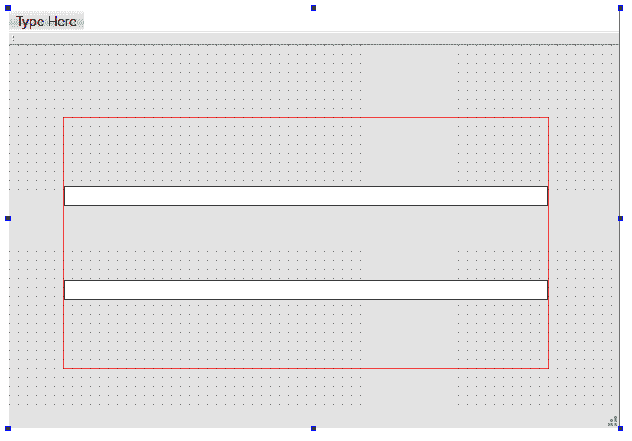
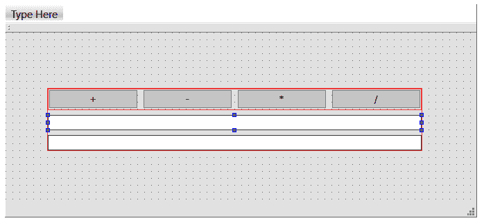
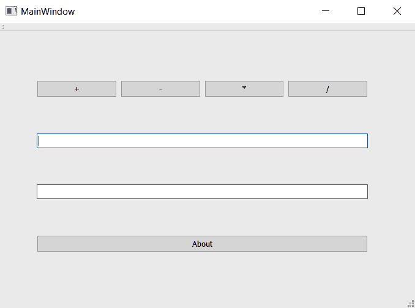
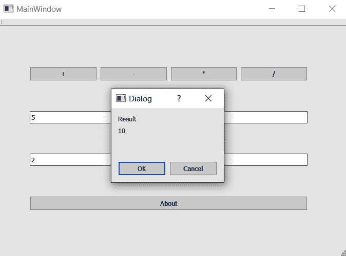

# 使用 Qt Designer 设计应用程序

Qt 最为人所知的可能是一个跨平台的用户界面工具包，直到最近几年，Qt Creator 才真正发展成为一个完整的软件开发环境。 然而，即使在其早期版本中，Qt 也有一个很好的工具，可以用 Qt Designer(现在是 Qt Creator 的一部分)来构建用户界面。 最近，构建 Qt 的开发人员添加了 Qt Quick，作为用户界面开发的第二种选择。 Qt Quick 扩展了 Qt Creator 的 Qt 库和 Qt 设计器功能，为触摸屏和**机顶盒**(**STB**)构建流畅的界面。 这得益于 Qt Quick 和**Qt 元对象语言**(**QML**)的声明性质。

在本章中，我们将介绍以下主题：

*   介绍信号和时隙
*   使用 Qt Designer 创建用户界面
*   在应用程序中实例化窗体、消息框和对话框
*   连接 Qt 小部件应用程序逻辑
*   介绍 Qt Quick 对声明式用户界面开发的支持
*   了解 Qt 应用程序的构建
*   创建 Qt 应用程序

这些主题将让您深入了解使用 Qt 创建应用程序的基础知识，无论是在 C++中还是通过 QML 方法。 您将学习如何使用 Qt 窗体设计器和 Qt 快速设计器来设计您的第一个用户界面。 然后，您还将学习如何使用 Qt 提供的基本功能，例如实例化消息框以及通过信号和槽机制将用户界面交互与事件函数连接起来。

在本章结束时，您将可以决定您的应用程序应该使用 Qt 窗口小部件还是 Qt Quick 来编写，并在 Qt Creator 附带的文档的帮助下构建您的应用程序。

# 技术要求

本章的技术要求包括 Qt 5.12.3 MinGW 64 位、Qt Creator 4.9.0 和 Windows 10。

# 介绍信号和时隙

在软件系统中，经常需要耦合不同的对象。 理想情况下，这种耦合应该是松散的-也就是说，不依赖于系统的编译时配置。 当您考虑用户界面时，这一点尤其明显-例如，按下按钮可能会调整文本小部件的内容，或者导致某些内容出现或消失。 许多系统将事件用于此目的；提供数据的组件将数据封装在事件中，事件循环(或最近的事件侦听器)捕获事件并执行某些操作。 这称为**事件驱动**编程或事件模型。

Qt 提供了*信号和槽*机制作为界面来管理事件，如单击事件、选择更改事件、文本输入事件等。 当用户执行某项操作并触发事件时，该对象(即按钮)会生成一个信号，该信号将被发送到 Qt 的事件系统。 然后，事件系统将通知链接到该信号的另一个对象这样的事件已经发生。 最终，作为对信号的反应，它将触发接收对象的`slot`函数(有点类似于回调函数)。 换句话说，当对象 A 被激发(即，单击按钮)时，它将向对象 B 发送信号，并通知它执行其`slot`函数(即，关闭窗口)。 Qt 对象可能会发出多个信号，并且信号可能带有参数；此外，多个 Qt 对象可以具有连接到同一信号的槽，这使得安排一对多通知变得容易。

Qt 提供了一个宏`connect`，它允许您将信号连接到插槽。 同样重要的是，如果没有对象对信号感兴趣，则可以安全地忽略该信号，并且不会将任何插槽连接到该信号。 同样重要的是，如果没有插槽连接到信号，它将被简单地忽略。 从 Qt 的对象基类`QObject`继承的任何对象都可以发出信号或提供用于连接到信号的插槽。 在幕后，Qt 提供了对 C++语法的扩展，以声明信号和槽。

一个简单的例子将有助于阐明这一点。 您在 Qt 文档中找到的经典示例是一个很好的示例，我们将在这里再次使用它，并进行一些扩展。 假设您需要一个计数器，即一个容纳整数的容器。 在 C++中，您可能会编写类似以下代码块的代码：

```cpp
class Counter 
{ 
public: 
    Counter() {} 

    int getValue() { return myValue; } 
    void setValue(int value); 

 private: 
    int myValue = 0; 
 }; 
```

`Counter`类有一个私有成员`myValue`，承载其值。 客户端可以调用`getValue`来获取计数器的值，或者通过使用新值调用`setValue`来设置其值。 请注意，在 C++11 中，您可以直接初始化类数据成员的默认值-在本例中，我们将`myValue`的默认值设置为`0`。

在 Qt 中，我们可以这样编写类，使用信号和槽：

```cpp
#include <QObject> 

class Counter : public QObject 
{ 
Q_OBJECT 

public: 
    Counter(QObject *parent = 0) {}
    int getValue() { return myValue; } 

public slots: 
    void setValue(int value); 
    void increment(); 
    void decrement(); 

signals: 
    void valueChanged(int newValue); 

private: 
    int m_value = 0; 
};
```

此`Counter`类从`QObject`继承所有 Qt 对象的基类。 要使`QObject`的所有功能(如信号槽机制)可用，`QObject`的子类必须包括声明`Q_OBJECT`作为其定义的第一个元素；此宏扩展到 Qt 代码，实现 Qt 对象和信号槽机制所需的子类特定粘合剂。 构造函数保持不变，将我们的私有成员初始化为 0。 同样，访问器方法值保持不变，返回计数器的当前值。 如果开头没有包含`Q_OBJECT`宏，则编译将失败。

对象的槽必须是公共的，并且使用 C++公共槽的 Qt 扩展来声明。 该代码定义了三个时隙：`setValue`时隙，用于接受计数器的新值；以及`increment`和`decrement`时隙，用于递增和递减计数器的值。 槽可以接受参数，但不能返回它们；信号与其槽之间的通信是单向的：以信号开始，以连接到信号的槽终止。 这种机制是 Qt 开发人员故意设计的。

计数器提供单一信号。 信号也是使用 C++信号的 Qt 扩展声明的。 `Counter`对象发出`valueChanged`信号的单个参数，这是计数器的新值。 信号是函数签名，而不是方法；Qt 对 C++的扩展使用信号和槽的类型签名，以确保信号槽连接之间的类型安全，这是信号和槽相对于其他解耦消息传递方案的关键优势。

作为开发人员，使用任何有意义的应用程序逻辑实现类中的每个槽是我们的责任。 `Counter`类的插槽如下所示：

```cpp
void Counter::setValue(int newValue) 
{ 
    myValue = newValue; 
    emit valueChanged(newValue); 
} 

void Counter::increment() 
{ 
    setValue(getValue() + 1); 
} 

void Counter::decrement() 
{ 
    setValue(getValue() - 1); 
}
```

我们使用`setValue`槽的实现作为方法，这是所有槽的核心。 `setValue`槽接受一个新值，如果它们不相同，则将新值赋给`Counter`的私有成员变量。 然后，该信号使用 Qt 扩展`emit`发出`valueChanged`信号，该信号触发对连接到该信号的时隙的调用。

This is a common pattern for signals that handle object properties: testing the property to be set for equality with the new value, and only assigning and emitting a signal if the values are unequal.

如果我们有一个按钮--比如说`QPushButton`--我们可以把它的点击信号连接到`increment`或`decrement`槽上，这样点击按钮就可以递增或递减计数器。 我会使用`QObject::connect`方法完成此操作，如下所示：

```cpp
QPushButton* button = new QPushButton(tr("Increment"), this); 
Counter* counter = new Counter(this); 
QObject::connect(button, &QPushButton::clicked, counter, &Counter::increment); 
```

我们首先创建`QPushButton`和`Counter`对象。 `QPushButton`构造函数接受一个字符串，即按钮的标签，我们将其表示为`Increment`字符串或其本地化的对应物。

为什么我们要将它传递给每个构造函数？ Qt 在`QObject`对象及其子代之间提供了父子内存管理，在使用完对象后可以轻松地进行清理。 当您释放一个对象时，Qt 还会释放父对象的所有子对象，这样您就不必这样做了。 父子关系是在构造时设置的：这个信号告诉构造函数，当调用此代码的对象被释放时，`PushButton`和`counter`也可以被释放。 (当然，调用方法也必须是`QObject`的子类才能正常工作。)

接下来，调用`QObject::connect`，首先传递源对象和要连接的信号，然后传递接收器对象和信号应该发送到的槽。

Ever since Qt version 5, you are not recommended to use the old `SIGNAL` and `SLOT` macros when calling `QObject::connect`.

信号也可以连接到信号，当这种情况发生时，信号被链接并触发连接到下游信号的任何时隙。 例如，我可以编写以下代码：

```cpp
Counter a, b; 
QObject::QObject::connect(&a, &Counter::valueChanged, &b, &Counter::setValue); 
```

这会将`b`计数器与`a`计数器连接起来，因此对`a`计数器的值的任何更改也会改变`b`计数器的值。

除此之外，您还可以将信号直接连接到函数，如下所示：

```cpp
connect(a, &Counter::valueChanged, someFunction);
```

如果您正在编写 C++11 代码，您甚至可以将您的信号连接到 lambda 函数，如下所示：

```cpp
connect(a, &Counter::valueChanged, [=](const QString &newValue)
{
    b->updateValue("senderValue", newValue);
});
```

Lambda 函数是我们所说的匿名函数，它不需要名称或标识符。 Lambda 函数总是被更高阶的函数立即触发，用外行的话说，它是在函数中声明的函数。 一旦它的任务完成，它将不复存在；因此，不需要标识符。

在这种情况下，当`valueChanged`信号被触发时，我们直接在`connect`函数中声明一个 lambda 函数，该函数随后调用`updateValue`并将`newValue`变量传递给它。 当您不打算在其他地方重用相同的槽函数时，这很有帮助，因此，如果您以前编写过 JavaScript，您应该非常熟悉这一点。

还有`disconnect`，它会中断信号和特定插槽之间的连接。 调用`disconnect`类似于调用`connect`，如下所示：

```cpp
disconnect(&a, &Counter::valueChanged(int), &b, &Counter::setValue(int));
```

这会断开我们在上一个示例中建立的连接。

信号和槽在整个 Qt 中使用，既用于用户界面元素，也用于处理异步操作，如网络套接字上的数据存在、HTTP 事务结果等。 在幕后，信号和槽非常高效，归根结底是函数分派操作，因此您应该毫不犹豫地在自己的设计中使用抽象。

Qt 提供了一个特殊的构建工具，元对象编译器，它编译 C++的扩展，是信号和槽所必需的。 它生成实现该机制所需的附加代码。

使用这些工具，我们将在 Qt Designer 的帮助下创建一个示例表单。

# 使用 Qt Designer 创建用户界面

让我们使用 Qt Designer 和两个窗体创建一个简单的计算器应用程序：一个窗体接受算术运算的参数，第二个对话框窗体显示结果。

请记住，我们也将在本章的后续部分使用这些表单。 在本章中，我们将做两次，第一次是展示如何使用 Qt 窗口小部件完成这项工作，第二次是使用 Qt Quick。 该示例是精心设计的，但将向您展示如何在这两种环境中创建多个用户界面窗体，并让您练习如何使用信号和插槽。

*F1* is the keystroke you can use in Qt Creator to get help. As you write code in this and subsequent chapters, for any class or method you're curious about, select it and hit *F1*. You'll be taken to Qt's `Help` mode, with documentation about that class or method.

# 创建主窗体

在[章](01.html)，*Qt Creator 快速入门*中，您了解了 Qt 小部件设计器的基本元素，包括可以使用的小部件调色板、中心编辑窗格、对象树和属性视图。 下面的屏幕截图再次显示了 Qt 设计器：


从左到右排列，您看到的屏幕部分如下所示：

1.  视图选择器，当前指示 Qt Designer 视图处于活动状态。
2.  可以在表单上布局的可能小部件的调色板。
3.  表单编辑器，位于连接编辑器上方，允许您在小部件之间连接信号和插槽。
4.  对象树，通过使用嵌套列表，指示表单上已布局的所有对象，并显示它们的父子关系。

5.  对象树下是属性编辑器，您可以在其中编辑在表单编辑器上选择的任何项的编译时属性。

让我们首先创建一个新的 Qt 小部件项目(从 New File or Projects 对话框中单击 Qt Widgets Application)，并将该项目命名为`QtGuiCalculator`，然后执行以下步骤：

1.  在项目的`Forms`文件夹中，双击`mainwindow.ui`文件。 设计器将打开。
2.  从调色板中拖出垂直布局。
3.  右键单击布局并选择 Layout(布局)，然后选择 Adjust Size...(调整大小...)。 布局将缩小到某一点。
4.  拖动两个行编辑器并将其放到对象查看器(最右侧窗格)的垂直布局上。 您将看到垂直布局变大，以接受每个行编辑器。 您现在应该有类似以下屏幕截图的内容，其中布局现在有两个文本字段：



5.  拖动水平布局，并将其放到对象查看器中的垂直布局上。
6.  将四个按钮拖放到您刚刚添加的水平布局上。

7.  调整包含窗口的大小，以便在窗口中显示整个布局。
8.  使用屏幕右下角区域的属性浏览器重命名按钮`plusButton`、`minusButton`、`timesButton`和`divideButton`。 执行此操作时，向下滚动到 Text 属性(在 QAbstractButton 下)，并为每个按钮指定一个逻辑标签，如`+`、`-`、`*`和`/`。
9.  选择顶行输入，并将其命名为`argument1Input`。
10.  选择底线输入，并将其命名为`argument2Input`。

下一个屏幕截图显示了到目前为止您应该在 Qt Designer 表单编辑器窗格中看到的内容。 您也可以通过打破布局并使用鼠标定位按钮来手动排列按钮，但这通常会降低布局对窗口大小调整的健壮性，通常不是一个好主意。 下面的屏幕截图描述了我们的计算器用户界面：



到目前为止，这是相当简单的。 我们使用垂直布局和水平布局来布局各种控件；这利用了 Qt 对小部件布局和大小的动态约束。 所有小部件都有最小和最大大小属性，布局使用这些属性来确定小部件消耗的实际大小。 有些小部件是有弹性的；也就是说，它们可以伸展以填充其内容。 指定小工具的实际大小时，可以指定它在*x*和*y*轴的每个轴上采用下列值之一：

*   小工具的最小大小。
*   小工具的最大大小。
*   介于其最小值和最大值之间的固定大小。
*   扩展大小，扩展以适合小工具的内容。

Qt 提供了四种布局，您可以混合搭配，就像我们刚才所做的那样。 您已经遇到了垂直和水平布局；还有网格布局和表单布局，前者允许您在*m x n*网格中组织事物，后者组织小部件的方式类似于本机平台枚举表单上的字段的方式。

现在，我们的布局有点杂乱无章。 让我们添加一些间隔符，以便更好地填充窗口中的空间，同时，为关于框添加一个按钮：

1.  拖动一个垂直间隔符并将其放在输入行之间，并在包含按钮行的水平布局和输入行之间拖放第二个垂直间隔符。
2.  将一个按钮拖到垂直布局，并在底线和按钮之间添加一个间隔符。
3.  将最后一个按钮命名为`aboutButton`，并将其文本命名为`About`。 我们稍后将添加一个图标。

下一个屏幕截图显示了我们在设计器中构建的应用程序。 如果您单击 Run(运行)按钮，您应该会看到以下内容：



现在，让我们进行结果对话。 右键单击项目并选择 Add New...(添加新的...)；然后，执行以下步骤：

1.  在出现的对话框中，选择左侧的 Qt，然后选择中间的 Qt Designer 窗体。 点击 Choose(选择)。
2.  为您的对话框选择一种对话样式；选择底部带有按钮的对话框，然后单击下一步。
3.  将文件命名为`resultdialog.ui`，然后单击 Next。
4.  单击 Finish(完成)。
5.  在出现的对话框中，拖出一个表单布局。 右键单击对话框窗口(不是窗体布局)，然后选择 Layout(布局)，然后选择 Layout(垂直布局)。
6.  将标签添加到窗体布局。 将其文本更改为`Result`。
7.  拖出另一个标签，并将其命名为`result`。 在`Property`下的`objectName`字段中，将名称更改为`result`。
8.  调整窗口大小，使其更小，以使其看起来更好。

您应该有一个类似以下屏幕截图的对话框：

<q></q>

现在是尝试布局和间隔符的好时机，并可以随心所欲地设置对话框样式。 要了解这是如何实现的，让我们看看如何使用这些资源。

# 使用应用程序资源

现在，让我们为应用程序添加一个用于 About 按钮的图标。 你可以画一个，或者在线下载一个免费的图标。 图标可以是**便携网络图形**(**PNG**)、**联合图像专家组**(**JPEG**)或其他格式；最好选择**可伸缩矢量图形**(**SVG**)格式，因为 SVG 图像是基于矢量的，并且可以正确缩放到不同的大小。 将资源文件放入项目目录，然后执行以下步骤：

1.  在 Qt Creator 中选择编辑视图。
2.  右键单击该项目，然后选择 Add New...(添加新的...)。 在打开的 New File 对话框中，单击 Files and Classes 下的 Qt，然后单击 Qt Resource file。
3.  将文件命名为`resources`。
4.  将其添加到当前项目。
5.  如果`resources.qrc`尚未在编辑器中打开，请在解决方案窗格中双击它。 资源文件编辑器将出现。
6.  单击 Add(添加)，选择 Add Prefix(添加前缀)，然后创建前缀`/`。
7.  再次单击 Add(添加)，然后单击 Add Files(添加文件)，并选择您的图标。

图标通过 Qt 资源编译器加载到应用程序的只读部分。 只要在资源的路径和名称前加上冒号，就可以在访问文件的任何位置访问它们。 例如，我们可以在应用程序资源中放置一个文本文件，然后打开该文件进行阅读，如下所示：

```cpp
QFile file(":/folder/fileName.txt"); 
file.open(QIODevice::ReadOnly | QIODevice::Text); 

while (!file.atEnd()) { 
    QByteArray line = file.readLine(); 
    processLine(line); // Calling your own function
} 
```

应用程序资源适用于文本和小媒体文件，如图标或图像。 但是，您应该避免将它们用于较大的项目，如电影和较大的声音，因为它们会不必要地增加应用程序二进制文件的大小。 出于这些目的，最好将媒体文件与您的应用程序一起打包，然后直接从磁盘加载它们。

在下一节中，当我们将 About 框添加到应用程序时，我们将使用您添加的资源。

# 在应用程序中实例化窗体、消息框和对话框

Qt Designer 为您在 Designer 中创建的每个表单生成一个基于 XML 的布局文件(以`.ui`结尾)。 在编译时，Qt Creator 将布局编译为一个头文件，该文件为您的用户界面布局构造组件。 Qt 应用程序通常使用的模式是构造主类实例化的私有布局类。 下面是它在主窗口中的工作方式：

```cpp
#ifndef MAINWINDOW_H 
#define MAINWINDOW_H 

#include <QMainWindow> 

namespace Ui { 
  class MainWindow; 
} 

class MainWindow : public QMainWindow 
{ 
    Q_OBJECT 

public: 
    explicit MainWindow(QWidget *parent = nullptr); 
    ~MainWindow(); 

private: 
    Ui::MainWindow *ui; 
}; 

#endif // MAINWINDOW_H 
```

在`mainwindow.cpp`中，我们有以下内容：

```cpp
#include "mainwindow.h" 
#include "ui_mainwindow.h"
#include "resultdialog.h" 
#include <QMessageBox> 

MainWindow::MainWindow(QWidget *parent) : 
    QMainWindow(parent), 
    ui(new Ui::MainWindow)
{ 
    ui->setupUi(this); 
} 

MainWindow::~MainWindow()
{
    delete ui;
}
```

Why is the constructor declared explicitly? This prevents the C++ compiler from providing implicit casts so that callers can't use anything but the `MainWindow` instances when referring to `MainWindow`. Qt provides this by default.

`Ui::MainWindow`类由 Qt Designer 自动构造；通过将其声明包含在`mainwindow.cpp`中，我们创建了它的一个实例，并将该实例分配给`ui`字段。 初始化后，我们调用它的`setupUi`函数，该函数创建您在 Qt Designer 中勾勒出的整个用户界面。

我们在 Qt 设计器中布局的控件可以作为字段名访问。 例如，我们可以修改`mainwindow.cpp`来调用 About 框，方法是向`mainwindow.h`添加一个槽来处理单击 About 按钮时的情况，然后，我们可以在槽的实现中添加代码来调用 About 框。 为此，请执行以下步骤：

1.  向`mainwindow.h`添加一个公共槽声明，以及名为`aboutClicked`的槽。 它现在读起来应该类似于以下代码：

```cpp
class MainWindow : public QMainWindow 
{ 
    Q_OBJECT 

public: 
    explicit MainWindow(QWidget *parent = 0); 
    ~MainWindow(); 

public slots: 
    void aboutButtonClicked(); 

private: 
    Ui::MainWindow *ui; 
}; 
```

2.  在`mainwindow.cpp`的顶部，为`QMessageBox`类添加一条`include`语句，如下所示：

```cpp
#include <QMessageBox>
```

3.  将`aboutClicked`槽的实现添加到`mainwindow.cpp`。 这段代码在堆栈上构造`QMessageBox`，并将其图标设置为您先前在资源中添加的图标，将对话框的文本设置为`Lorem ipsum`，将消息框的标题设置为`About`。 调用`QMessageBox`的`exec`方法打开消息框并阻塞应用程序流，直到您关闭消息框。 它应该读取类似以下代码的内容：

```cpp
void MainWindow::aboutButtonClicked() 
{ 
    QMessageBox messageBox; 
    messageBox.setIconPixmap(QPixmap(":/icon.png")); 
    messageBox.setText("Lorem ipsum."); 
    messageBox.setWindowTitle("About"); 
    messageBox.exec(); 
} 
```

4.  在`MainWindow`构造函数中，将信号从 About 按钮连接到您刚刚创建的插槽。 您的构造函数现在应该如下所示：

```cpp
MainWindow::MainWindow(QWidget *parent) : 
    QMainWindow(parent), 
    ui(new Ui::MainWindow), 
{ 
    ui->setupUi(this); 
    QObject::connect(ui->aboutButton, &QPushButton::clicked, 
                     this, &MainWindow::aboutButtonClicked); 
} 
```

如果我们构建应用程序，我们现在有一个功能齐全的 About 框，包括您选择的应用程序图标。 `connect`调用就像我们前面看到的信号槽连接；它将主窗口用户界面的`aboutButton`单击信号连接到您的`aboutClicked`槽。

A word on naming signals and slots before we continue: a signal is typically named a verb in its past tense, denoting the semantics of the event that just occurred that it's trying to signal. A slot should somehow match those semantics, preferably including more detail as to how the signal is being handled. So, Qt names the button's clicked signal logically, and I expand on this by giving a slot named `aboutClicked`. Of course, you can name your signals and slots whatever you like, but this is a good practice to follow.

在连接其他按钮并实现计算器逻辑之前，我们需要为结果对话框设置类。 Qt 使用将表单编译成类的**用户界面编译器**(**UIC**)自动创建此类。 我们将遵循`MainWindow`类的模式，创建一个私有的`ui`成员，其中包含编译时生成的对象的一个实例，该对象构造结果对话框的用户界面。 通过右键单击项目，您可以使用可用的 New File 向导创建`ResultDialog`类；选择 C++Class，并将其命名为`ResultDialog`。 类本身应该继承自`QDialog`。 头文件应如下所示：

```cpp
#ifndef RESULTDIALOG_H 
#define RESULTDIALOG_H 

#include <QDialog> 

namespace Ui { 
    class Dialog; 
} 

class ResultDialog : public QDialog 
{ 
    Q_OBJECT 
public: 
    explicit ResultDialog(QWidget *parent = nullptr); 
    ~ResultDialog(); 

private: 
    Ui::Dialog *ui; 

}; 

#endif // RESULTDIALOG_H 
```

我们需要做的第一件事是向前声明由 Qt Designer 创建的`Dialog`类；我们在`Ui`命名空间中这样做，这样它就不会与应用程序中的任何其他代码冲突，如下所示：

```cpp
namespace Ui { 
    class Dialog; 
} 
```

然后，我们需要将指向该类实例的指针声明为私有成员变量；我们将该指针命名为`ui`，就像对`MainWindow`类所做的那样。

您可以猜测我们的`ResultDialog`实现是什么样子，如下所示：

```cpp
#include "resultdialog.h" 
#include "ui_resultdialog.h" 

ResultDialog::ResultDialog(QWidget *parent) : 
    QDialog(parent), 
    ui(new Ui::Dialog) 
{ 
    ui->setupUi(this); 
} 

ResultDialog::~ResultDialog() 
{ 
    delete ui; 
} 
```

在构造时，它创建`Ui:Dialog`类的实例，然后调用其`setupUi`方法，在运行时创建用户界面的实例。

除了使用表单文件(`.ui`)之外，您还可以仅使用 C++代码手动实例化表单小部件。 让我们试试看吧。 在开始之前，请查看[https://doc.qt.io/qt-5/qtwidgets-module.html](https://doc.qt.io/qt-5/qtwidgets-module.html)，了解您可以在应用程序中使用的所有 Qt 小部件类。

假设您想要使用 C++手动将一个按钮实例化到您的程序中。 您必须先包含其标头，然后才能访问其属性和功能，如下所示：

```cpp
#include <QPushButton>
```

然后，您可以继续实例化按钮，如下所示：

```cpp
QPushButton * button = new QPushButton("Click me", this);
```

在前面的代码中，我们声明了一个`QPushButton`对象，并将其标题设置为`Click me`。 第二个参数是按钮的父对象，我们使用`this`关键字来指示父对象是`MainWindow`对象。 如果我们希望它是其他的东西，我们可以这样做：

```cpp
QPushButton * button = new QPushButton("Click me", this);
QPushButton * button2 = new QPushButton("Click me", button);
```

在前面的代码中，我们实例化了第二个按钮，并使第一个按钮成为其父按钮。 一旦小部件被赋予了父对象，它将跟随父对象到达任何地方，并且如果父对象被删除，它也将被删除。 在下面的代码块中可以看到这种情况的示例：

```cpp
QPushButton * button = new QPushButton("Click me", this);
QPushButton * button2 = new QPushButton("Click me", button);
button->deleteLater();
```

由于我们要删除`button`对象，它的子对象`button2`也将被删除。

现在，发布此实例化，让我们看看如何连接 Qt 小部件逻辑以了解其工作原理。

# 连接 Qt 小部件应用程序逻辑

计算器的应用程序逻辑很简单：我们向`ResultDialog`添加一个属性设置器，允许我们设置对话框的结果字段，然后在`MainWindow`中连接一些算术、信号和槽，以进行实际计算并显示对话框。 让我们来看一下以下步骤：

1.  首先，对`ResultDialog`进行以下更改：

```cpp
void ResultDialog::setResult(float r) 
{ 
    ui->result->setText(QString::number(r)); 
} 
```

此方法接受一个浮点数(要在对话框中显示的值)，并使用 Qt 的默认格式将结果格式化为字符串。 Qt 是完全国际化的；如果您在讲英语的语言环境中执行此操作，它将使用小数点，而如果您在将区域设置为使用逗号作为小数点分隔符的区域中执行此操作，则它将使用逗号。 Number 方法非常方便，重载使用双精度和浮点数以及整数和参数来表示返回字符串的精度和求幂。

2.  现在，我们转到修改后的`MainWindow`类。 首先，让我们看一下修改后的类声明，如下所示：

```cpp
#ifndef MAINWINDOW_H 
#define MAINWINDOW_H 

#include <QMainWindow> 
#include <QPair> 

namespace Ui { 
    class MainWindow; 
} 

class ResultDialog; 

class MainWindow : public QMainWindow 
{ 
    Q_OBJECT 

    typedef QPair<float, float> Arguments; 
public: 
    explicit MainWindow(QWidget *parent = nullptr); 
    ~MainWindow(); 
    Arguments arguments(); 
signals: 
    void computed(float f); 
```

3.  我们继续声明类的槽函数和私有变量，如下所示：

```cpp
public slots: 
    void aboutClicked(); 
    void plusButtonClicked(); 
    void minusButtonClicked(); 
    void timesButtonClicked(); 
    void divideButtonClicked(); 

    void showResult(float r); 

private: 
    Ui::MainWindow *ui; 
    ResultDialog* results; 
}; 

#endif // MAINWINDOW_H
```

除了基类`QMainWindow`之外，我们现在还包括`QPair`，这是一个简单的 Qt 模板，允许我们传递成对的值。 我们将使用`QPair`模板(一种定义为`Arguments`的类型)传递算术运算的一对参数。

4.  我们添加一个信号`computed`，该类在任何时候执行算术运算时都会触发该信号。 我们还为每个算术按钮单击添加槽：`plusButtonClicked`、`minusButtonClicked`、`timesButtonClicked`和`divideButtonClicked`。 最后，我们添加了一个`showResult`槽，它显示了发生计算时的结果。
5.  现在，`MainWindow`构造函数需要为我们所有的按钮、信号和插槽执行一系列信号插槽连接。 将突出显示的代码部分添加到`mainwindow.cpp`中，如下所示：

```cpp
MainWindow::MainWindow(QWidget *parent) : 
    QMainWindow(parent), 
    ui(new Ui::MainWindow), 
    results(0) 
{ 
    ui->setupUi(this); 
    QObject::connect(ui->aboutButton, &QPushButton::clicked, 
                     this, &MainWindow::aboutButtonClicked); 
    QObject::connect(this, &MainWindow::computed, 
                     this, &MainWindow::showResult); 
    QObject::connect(ui->plusButton, &QPushButton::clicked, 
                     this, &MainWindow::plusButtonClicked); 
    QObject::connect(ui->minusButton, &QPushButton::clicked, 
                     this, &MainWindow::minusButtonClicked); 
    QObject::connect(ui->timesButton, &QPushButton::clicked, 
                     this, &MainWindow::timesButtonClicked); 
    QObject::connect(ui->divideButton, &QPushButton::clicked, 
                     this, &MainWindow::divideButtonClicked); 
}
```

6.  将 About 按钮连接到显示 About 对话框的插槽后，接下来我们将计算出的信号从`MainWindow`连接到它的`showResult`插槽。 请注意，此信号/槽带有一个参数，该参数是要显示的值。 剩下的四个连接将每个操作按钮与代码连接起来，以执行特定的算术运算。
    如果还没有新的`ResultDialog`，则`showResult`槽创建一个新的`ResultDialog`，将其结果设置为传入的值，并调用该对话框，如以下代码块所示：

```cpp
void MainWindow::showResult(float r) 
{ 
    if (!results) 
    { 
        results = new ResultDialog(this); 
    } 
    results->setResult(r); 
    results->exec(); 
} 
```

`arguments`方法是每个算术函数使用的辅助方法，它从每个输入行获取值，将它们从字符串转换为浮点数，并执行一些错误检查，以确保条目是有效的浮点数，如以下代码块所示：

```cpp
MainWindow::Arguments MainWindow::arguments() 
{ 
    bool ok1, ok2; 
    float a1 = ui->argument1Input->text().toFloat(&ok1); 
    float a2 = ui->argument2Input->text().toFloat(&ok2); 
    if (!ok1 || !ok2) 
    { 
        QMessageBox messageBox; 
        messageBox.setIconPixmap(QPixmap(":/icon.png")); 
        messageBox.setText("One of your entries is not a valid number."); 
        messageBox.setWindowTitle("Error"); 
        messageBox.exec(); 
    } 
    return Arguments(a1, a2); 
}
```

`QString`的`toFloat`方法就是这样做的：它将字符串转换为浮点数，如果转换成功，则返回该数字并设置传递给`true`的布尔值，否则设置为`false`。 代码对两个参数输入行都执行此操作，然后检查生成的布尔值，如果其中一个参数格式错误，则在将参数的`QPair`类返回给调用方之前报告错误。

7.  剩余的代码实际执行算术运算，表示在操作完成时发生了计算。 例如，以`plusButtonClicked`插槽为例，如下所示：

```cpp
void MainWindow::plusButtonClicked() 
{ 
    Arguments a = arguments(); 
    emit computed(a.first + a.second); 
} 
```

这将使用`arguments`函数从输入行获取参数，计算总和，然后发出具有求和值的计算信号。 当我们将计算信号连接到`showResult`插槽时，这会触发对`showResult`的调用，这将在必要时创建`ResultDialog`，并显示带有计算结果的对话框。 `minusButtonClicked`、`timesButtonClicked`和`divideButtonClicked`方法都是相似的。

最终结果类似于以下屏幕截图：



让我们拭目以待吧！

# 了解有关 Qt 小工具的更多信息

有很多关于使用 Qt 小部件集进行编程的书籍；它是一个非常丰富的小部件集，几乎包括构建普通 Mac、Windows 或 Linux 应用程序所需的一切，并且具有大多数计算机用户都熟悉的用户界面控件的优势。

我们将在[第 5 章](05.html)，*使用 Qt 小部件*开发应用程序中详细讨论它，但是您也可以参考[https://doc.qt.io/qt-5/qtwidgets-index.html](https://doc.qt.io/qt-5/qtwidgets-index.html)上的 Qt 文档。

接下来，我们将了解 Qt Quick 和语法如何在编程的代码间歇中工作。

# 介绍 Qt Quick 对声明式用户界面开发的支持

您在最低级别所做的大多数编程都是必需的：您要描述算法应该如何工作(取此值并将其平方；搜索此字符串的第一个匹配项并替换它；以此方式格式化此数据；依此类推)。 使用 Qt Quick，您的编程在很大程度上是声明性的：不是说*如何*，而是说*什么*。 例如，在使用 Qt 的 C++中，我们可能会编写如下代码来绘制一个矩形：

```cpp
QRect r(0, 0, 16, 16); 
QPainter p; 
p.setBrush(QBrush(Qt::blue)); 
p.drawRect(r); 
```

此代码创建一个 16x16 像素的矩形，分配一个执行绘制的`QPainter`对象，告诉绘制程序其画笔应为蓝色，然后通知绘制程序绘制该矩形。 在 QML 中，我们只需按如下方式编写矩形代码：

```cpp
import QtQuick 2.12 
Rectangle { 
    width: 16 
    height: 16 
    color: "blue" 
} 
```

区别是显而易见的：我们只是说有一个 16x16 像素的蓝色矩形。 如何绘制矩形取决于 Qt Quick 运行时。

Qt Quick 的底层语言是 QML。 QML 在很大程度上是基于 JavaScript 的，事实上，您可以用 JavaScript 编写的大多数内容，您也可以用 QML 表达。 表达式语法本质上没有变化；赋值、算术等都是相同的，名称/值系统在功能上也是相同的，尽管对象框架前面可能有类型声明(正如您从我刚才展示的`Rectangle`示例中可以看到的那样)。

A key exception to the *what works in JavaScript works in QML rule* is the lack of a **document object model** (**DO****M**), and things such as the document root for global variables because there's no root context or DOM on which other things hang. If you're porting a web application to QML, be prepared to refactor those parts of your application's architecture.

QML 中的对象必须以树的方式作为父对象；每个 QML 文件都必须包含一个封装对象，然后可以有包含子对象的子对象。 但是，文件顶部的层次结构必须有一个根。 通常，这个根是一个`Rectangle`对象，它绘制一个显示其子元素的基本矩形，或者是一个`Item`对象，它是一个更复杂的用户界面元素的容器，实际上并不绘制任何内容。 每个项都可以有一个名称，该名称存储在它的`id`属性中。

大多数可见的 QML 项都可以有状态，即当特定状态处于活动状态时应用的属性集合。 这使您可以执行一些操作，如声明按钮的休眠状态和按下状态之间的差异；按下按钮只需在状态之间切换，按钮的颜色、阴影等都可以更改，而不需要更改每个单独的属性。

A key concept in QML that's not present in JavaScript is that of binding: if two QML object properties share the same value, changing one changes the other. Binding is a method that couples values with notifications about value changes; it's similar to how references work in C++, or how pass-by-reference works in other languages. This is very handy in coding things such as animations because you can use the value of one object as the value for another object, and when the underlying value changes in one place, both objects are updated.

QML 文件可以相互依赖，也可以包含业务逻辑的 JavaScript 文件。 您已经在每个 QML 文件的顶部看到了一个这样的示例：import 指令指示运行库包括指定的文件和版本；因此，当我们编写`import QtQuick 2.12`时，运行库会找到 Qt Quick 模块版本 2.12 的声明，并在解析文件时包含其符号。 这就是封装功能的方式。 默认情况下，项目中包含 QML 文件，而您也可以包含 JavaScript 文件并将其分配给特定的 JavaScript 变量。

例如，我们可以有一个实现计算器所有功能的 JavaScript 文件`calculatorLogic.js`。 在 QML 中，编写以下代码：

```cpp
import QtQuick 2.12 
import "calculatorLogic.js" as CalculatorLogic 
Item { 
    // someplace in code 
    CalculatorLogic.add(argument1, argument2); 
} 
```

最初的`import`语句加载 JavaScript 文件并将其值赋给 QML 对象`CalculatorLogic`；然后我们可以分派该对象的方法和访问属性，就像它是任何其他 QML 对象一样。

Qt Quick 声明了许多基本数据类型；这些数据类型与编写 C++代码时在 Qt 中找到的数据类型非常匹配，尽管语法可能不同。 您将遇到的一些最重要的类型如下：

*   具有*x*和*y*属性的点。
*   一个矩形，具有*x*、*y*、Width 和 Height 属性。
*   具有宽度和高度属性的大小。
*   颜色，它是 HTML ARGB 表示法中的引号字符串或 Qt 颜色词典中的命名颜色。 (您能想到的大多数颜色都有 QML 名称。)
*   2D、3D 或 4D 矢量。
*   基本类型，包括布尔值、字符串、整数和浮点数。

There are also a lot of visible types for user interface construction; in this chapter, there's only room to touch on a few. For a detailed list of all QML types and the documentation about those types, see [https://doc.qt.io/qt-5/qmlreference.html](https://doc.qt.io/qt-5/qmlreference.html).

QML 是创建 Qt 应用程序的另一种方式，无需使用 C++编程语言。 如果您熟悉 JavaScript 等 Web 脚本语言，那么学习 QML 对您来说绝对是一件容易的工作。 接下来，让我们看看如何构建一个 Qt 应用程序。

# 了解 Qt 应用程序的构建

在[第 1 章](01.html)，*Qt Creator*快速入门中，您已经基本熟悉了 Qt Designer for Qt Quick Applications。 由于我们在前面的示例中使用 C++语言创建了一个计算器程序，作为比较，我们还使用 QML 创建了一个计算器程序，以便您可以了解其中的区别。

在我们用 QML 重新创建计算器应用程序之前，让我们再看一看。 下面的屏幕截图显示了 Qt 快速窗口的 Qt 设计器：


再次从左侧开始，我们有以下组件：

1.  视图选择器，显示 Qt Designer 视图处于活动状态。
2.  正在编辑的文件的对象层次结构，显示该文件中可见项之间的父子关系。
3.  在对象层次结构的上方是一个调色板，其中包含可以拖到 QML 编辑器窗格上的项。
4.  对象层次结构旁边是对象状态的摘要。
5.  状态摘要上方是 QML 文件的对象编辑器。
6.  最后，还有一个属性编辑器，它允许您调整当前选定的 QML 项的属性。

Personally, I find it easier to just write QML than to use the designer. The syntax takes a little getting used to, but what the designer is good for is previewing the QML you've written by hand, and making minor adjustments to its layout.

说到布局，在我们详细查看示例代码之前，值得注意的是，QML 有一个丰富的动态布局系统。 可见项目具有锚定属性，您可以相对于其相邻视图或父视图锚定项目的侧面。 您在[章](01.html)，*《Qt Creator 入门》*中简要看到了这一点，其中我们创建了一个与其父对象一样大的`MouseArea`对象。 我们也将使用它来控制计算器参数输入行和操作符按钮的布局。

现在让我们开始制作我们的示例代码，方法是从 File 菜单中单击 New File 或 Project，然后浏览向导以创建一个 Qt Quick2.3 应用程序。 将应用程序命名为`QtQuickCalculator`。

# 创建 Qt 应用程序

我们的计算器每一次操作都有一个按钮。 虽然我们可以将每个按钮设置为单独的矩形和`MouseArea`，但使单个 QML 按钮封装按钮的行为(包括按下按钮时外观的变化、按钮标签的位置等)要容易得多。

右键单击项目并选择 Add New...创建一个新的 QML 文件，然后从 Qt 项中选择 QML 文件(Qt Quick2)。 按钮是一个`Rectangle`对象，它包含第二个`Rectangle`对象、按钮的`Text`标签和处理按钮单击的`MouseArea`对象。 将文件命名为`Button.qml`，并对其进行编辑，如下所示：

```cpp
import QtQuick 2.12 

Rectangle { 
    id: button 

    width: 64 
    height: 64 
    property alias operation: buttonText.text 
    signal clicked 

    color: "green" 

    Rectangle { 
        id: shade 
        anchors.fill: button; 
        color: "black";
        opacity: 0 
    } 

    Text { 
        id: buttonText 
        anchors.centerIn: parent; 
        color: "white" 
        font.pointSize: 16 
    } 

    MouseArea { 
        id: mouseArea 
        anchors.fill: parent 
        onClicked: { 
            button.clicked(); 
        } 
    } 
    states: State { 
        name: "pressed"; when: mouseArea.pressed == true 
          PropertyChanges
        { target: shade; opacity: .4 }
    } 
}
```

从代码的顶部开始，我们可以看到以下内容：

*   在此文件的范围内，按钮的 ID 仅为`button`。
*   它的宽度和高度都是 64 像素。
*   该按钮有一个可由其客户端配置的属性，即`operation`属性。 该属性实际上是一个别名，这意味着它自动设置`buttonText`的`text`属性的值，而不是一个单独的字段。
*   该按钮发出单一信号：`clicked`信号。
*   按钮的颜色是绿色。
*   有一个矩形填充黑色但不透明度为零的按钮，这意味着在正常使用中它是不可见的(透明)。 当按钮被按下时，我们调整这个矩形的不透明度，以使按钮在被按下时变得更暗。
*   按钮的文本标签大小为 16 磅，白色，居中。
*   接受按钮点击的`MouseArea`区域与按钮大小相同，并发出点击的信号。
*   该按钮有两种状态：默认状态和当`mouseArea.pressed`属性为 true 时出现的第二种状态(因为您在`MouseArea`中按下了鼠标按钮)。 当按下状态时，我们请求一个`PropertyChanges`属性，稍微改变共享矩形的不透明度，使按钮上有阴影，使其变暗。

如果您进入 Qt Designer，您实际上可以看到按钮的两种状态，如您在下一个屏幕截图中所看到的。 状态只是一个名称，一个`when`子句指示状态何时处于活动状态，而`PropertyChanges`属性的集合指示当状态处于活动状态时应更改哪些属性。 所有可见的 QML 项都有一个`state`属性，该属性只是当前活动状态的名称。

QML uses signals and slots similar to Qt in C++, but there's no `emit` keyword. Instead, you declare the signal directly, using the signal keyword and the name of the signal, and then, you invoke the signal as if it were a function call. For each QML item's signal, the slot is named `on` and the signal name. Thus, when we use the button, we write an `onClicked` handler for the `clicked` signal. Note that this is different from when writing slots in C++, where you can name a slot anything you want and connect it to a signal with `connect`.

# 计算器的主视图

在上一节中，我们已经成功创建了自定义按钮对象。 现在，我们希望在计算器的用户界面中使用 Button 对象。 让我们回到编辑器，直接编辑`main.qml`。 我们将直接在代码中声明我们的输入行、结果行和四个操作按钮；如果愿意，您可以对设计器执行相同的操作，然后编辑代码以匹配以下内容：

```cpp
import QtQuick 2.12 
import QtQuick.Window 2.12

Window { 
    visible: true
    width: 360 
    height: 200 
    title: qsTr("Calculator")
    color: "grey" 

    TextInput { 
        id: argument1 
        anchors.left: parent.left 
        width: 160 
        anchors.top: parent.top 
        anchors.topMargin: 10 
        anchors.leftMargin: 10 
        anchors.rightMargin: 10 
        text: "2" 
        font.pointSize: 18 
    } 

    TextInput { 
        id: argument2 
        anchors.right: parent.right 
        width: 160 
        anchors.top: parent.top 
        anchors.topMargin: 10 
        anchors.leftMargin: 10 
        anchors.rightMargin: 10 
        text: "2" 
        font.pointSize: 18 
    } 

    Text { 
        id: result 
        anchors.left: parent.left 
        anchors.right: parent.right 
        anchors.top: argument2.bottom 
        anchors.topMargin: 10 
        anchors.leftMargin: 10 
        anchors.rightMargin: 10 
        text: "4" 
        font.pointSize: 24 
    } 
```

然后，我们继续添加`Row`布局，并将操作按钮放置到布局中：

```cpp
     Row { 
        id: buttonRow 
        anchors.bottom: parent.bottom 
        anchors.bottomMargin: 20 
        anchors.left: parent.left
        anchors.leftMargin: 20
        spacing: 20 
        Button { 
            id: plusButton 
            operation: "+" 
            onClicked: result.text = parseFloat(argument1.text) + parseFloat(argument2.text) 
        } 

        Button { 
            id: minusButton 
            operation: "-" 
            onClicked: result.text = parseFloat(argument1.text) - parseFloat(argument2.text) 
        } 

        Button { 
            id: timesButton 
            operation: "*" 
            onClicked: result.text = parseFloat(argument1.text) * parseFloat(argument2.text) 
        } 

        Button { 
            id: divideButton 
            operation: "/" 
            onClicked: result.text = parseFloat(argument1.text) / parseFloat(argument2.text) 
        } 
    } 
}
```

该视图有两个文本输入行：只读文本结果行和操作按钮，包装在行项目中以提供水平布局。 计算器的基本视图是灰色的，这是我们用`color`属性设置的，它位于一个 360×200 像素的窗口中。 控件的位置如下所示：

*   第一个输入行定位在父窗口的左上角，边距为 10 像素。 它有 160 像素长，默认高度为 18 磅的文本输入字段。
*   第二个输入线锚定在父项的右侧，在顶部和右侧有 10 个像素的边距。 它也有 160 像素长，默认高度为 18 磅的文本输入域。
*   结果输入行的顶部锚定在输入行的底部和父矩形的左侧。 它的两边各有 10 个像素的边距。
*   按钮之间的间距为 20 像素，排成一行固定在父级的底部。

如果您调整应用程序窗口的大小，这些锚点可以让视图很好地回流；输入线分布在窗口的宽度上，底部的按钮栏随着窗口的放大而向下移动。

每个按钮都有一个`click`槽，该槽获得每个输入行的浮点解释并执行适当的算术运算。 它们每个都是`Button`的实例；QML 类是您在上一节中编写的类。 请注意，在`onClicked`处理程序中使用了 JavaScript 函数`parseFloat`。 正如您在前面提到的那样，QML 中的 JavaScript 运行时支持函数，因此我们可以直接调用 JavaScript 函数。

以下屏幕截图显示了完整的计算器应用程序：


请注意，在运行该应用程序时，如果您将鼠标悬停在一个按钮上并按下鼠标按钮，您将看到阴影变暗(这在屏幕截图中没有显示)。 这反映了我在上一节中向您展示的按钮中的两个状态。

# 了解有关 Qt Quick 和 QML 的更多信息

Qt Quick 的设计初衷是创建流畅的应用程序，这些应用程序没有太多的小部件复杂性。 媒体集线器、照片查看器、电话拨号器、Web 浏览器和其他类型的应用程序不需要与主机平台的外观和感觉相匹配(或者在主机平台都是用 Qt Quick 编写的嵌入式系统上)，这些都是适合 Qt Quick 范例的应用程序的很好示例。

For more information about Qt Quick, with a plethora of examples that show you the breadth and power of the platform, see [https://doc.qt.io/qt-5/qtquick-touchinteraction-example.html](https://doc.qt.io/qt-5/qtquick-touchinteraction-example.html).

# 简略的 / 概括的 / 简易判罪的 / 简易的

在本章的前半部分，我们使用 C++编程语言成功创建了一个 Qt 应用程序。 然后，我们还学习了如何使用 Qt Quick 和 QML 脚本语言创建相同的计算器程序。 通过这两个示例，我们了解了这两种方法之间的区别，从而使我们能够决定哪种方法最适合我们的项目。

Qt 附带了不是一个而是两个互补的**图形用户界面**(**GUI**)工具包：Qt 小部件，它采用传统的基于小部件的方法进行 GUI 开发；Qt Quick，它提供了一种更适合于媒体盒、某些手机应用程序、汽车仪表盘和其他嵌入式环境的平台无关用户界面的声明性方法。 对于两者，Qt 都提供了 Qt Designer，这是一个拖放环境，允许您在构建应用程序时构建、配置和预览用户界面。

接下来，我们了解了 Qt 的核心是信号和槽的概念，这是 Qt 对回调和事件的回答，用于处理当今 GUI 应用程序所需的后期绑定。 Qt 对象可以发出信号，这些信号是类型安全的函数声明，其他对象可以连接到这些信号，在发出信号时触发方法调用。

在下一章中，您将暂停学习 Qt Creator 和 GUI 开发，专注于 Qt 提供的一些基本功能，如数据结构、文件 I/O、使用 HTTP 的联网和 XML 解析。