# 七、使用 Qt Quick 实现更多功能

正如您在[第 3 章](03.html)，*使用 Qt Designer 设计应用*中看到的，Qt Quick 是 Qt 用于应用开发的声明性环境。 Qt Quick 是流畅的动画用户界面的理想之选，在这些界面中，您可以更多地使用触摸和鼠标事件，并且应用的样式基于图形资源，而不需要镜像主机平台的窗口小部件集。

Qt Quick 提供了几个基本的图形元素，并提供了使用基于 JavaScript 的脚本语言将它们组合在一起的能力，使您能够利用网页设计的现有技能来创建用户体验，如果没有大量的额外工作，这些用户体验是不可能完全用 HTML 和 CSS 创建的。 但是，您可以通过使用 Qt Quick 的其他一些我们在上一章中没有探索的功能来做更多的事情。 让我们看看使用 Qt Quick 还能实现什么！

在本章中，我们将比在[第 3 章](03.html)，*使用 Qt Designer 设计应用*中更详细地了解 Qt Quick。

在本章中，我们将介绍以下内容：

*   理解 Qt Quick 的基本概念
*   在 Qt Quick 中使用状态和转换
*   Qt Quick 与 C++ 的集成
*   将所有这些放在一起-一个图片库应用
*   介绍新的 Qt 快速控件 2
*   了解 SCXML 的新图形编辑器

# 技术要求

本章的技术要求包括 Qt 5.13.1 MinGW 64 位、Qt Creator 4.10.0 和 Windows 10。

本章的 GitHub 链接可在此处找到：

[https：//github.com/PacktPublishing/Application-Development-with-Qt-Creator-Third-Edition/tree/master/Chapter07](https://github.com/PacktPublishing/Application-Development-with-Qt-Creator-Third-Edition/tree/master/Chapter07).

# 理解 Qt Quick 的基本概念

正如您在[第 3 章](03.html)，*使用 Qt Designer 设计应用*中看到的，Qt Quick 使您能够专注于声明屏幕上可见的内容以及它的行为方式，而不是创建对象。 Qt Quick 使用**Qt 建模语言**语言(**QML**)来实现这一点，它使用类似 JavaScript 的语法和树结构来定义可见对象及其关系，并编写它们的行为脚本。 对象具有严格的父子层次结构，该层次结构定义了它们的视觉关系；父对象在显示时包含其子对象。

要创建新的 Qt Quick 项目，请转到文件|新建文件或项目|创建 Qt Quick Application-Empty。

使用传统坐标系将对象放置在 Qt Quick 的主窗口中，其中(0，0)位于显示的左上角。 子对象可以使用相对于父对象左上角的坐标放置在其父对象中，也可以通过相对于对象边界的灵活锚点系统来放置。

每个项目都有七条不可见的锚线：`left`、`horizontalCenter`、`right`、`top`、`verticalCenter`、`bottom`和`baseline`。 所有这些都是不言而喻的，除了`baseline`，它对应于文本所在的行。 (对于没有文本的项目，Qt 将基线定义为与`top`锚定线相同。)。 锚点是相对于其他对象的；每条锚定线都是锚定字段中的一个字段，您可以将其设置为另一个对象的锚定线。 例如，让我们写下以下内容：

```cpp
import QtQuick 2.12
import QtQuick.Window 2.12

Window {
    visible: true
    width: 360
    height: 360
    Rectangle {
        id: rect1
        height: 100 
        width: 100 
        anchors.centerIn: parent 
        color: "gray" 
    }
    Rectangle { 
        id: rect2 
        height: 100 
        width: 100 
        anchors.left: rect1.right 
        anchors.top: rect1.top 
        color: "black" 
    } 
} 
```

在前面的代码中，我们创建了两个`Rectangle`对象，即`rect1`和`rect2`。 `rect1`对象以灰色显示，并位于其父对象(即应用窗口)的中心。 然后，我们将`rect2`对象定位到`rect1`的右侧，并将其垂直位置与`rect1`对齐。

这将产生以下输出：

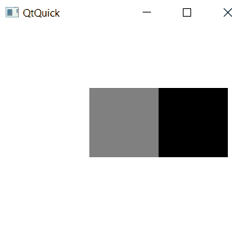

此代码创建一个高度和宽度均为 360 像素的窗口和两个矩形。 Qt 将第一个矩形放置在父窗口的中心，并将第二个矩形放置在具有相同顶线的第一个矩形的右侧。

锚定不仅会影响位置，还会影响大小。 请考虑以下 QML：

```cpp
import QtQuick 2.12 
import QtQuick.Window 2.12

Window { 
    visible: true 
    width: 360 
    height: 360 

    Rectangle { 
        id: rect1 
        height: 100 
        width: 100 
        anchors.left: parent.left; 
        anchors.verticalCenter: parent.verticalCenter 
        color: "gray" 
    } 

    Rectangle { 
        id: rect2 
        anchors.left: rect1.right 
        anchors.top: rect1.top; 
        anchors.bottom: rect1.bottom 
        anchors.right: rect3.left 
        color: "black" 
    } 

    Rectangle { 
        id: rect3 
        height: 100 
        width: 100 
        anchors.right: parent.right; 
        anchors.verticalCenter: parent.verticalCenter 
        color: "gray" 
    } 
} 
```

这会在父窗口的两侧放置两个正方形，在这两个正方形之间拉伸一个矩形。 请注意，将`rect2`的`anchor.left`参数设置为`rect1.right`值，并将`rect2`的`anchor.right`设置为`rect3.left`值。 下面的屏幕截图显示了它的外观：

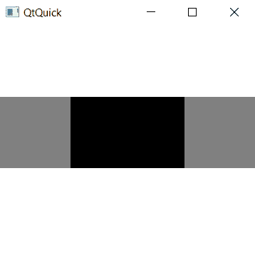

对于更复杂的布局，Qt Quick 定义了四个定位元素：`Column`、`Row`、`Grid`和`Flow`。 这些代码的行为与您预期的大致相同：

*   `Column`：这会在垂直列中布局其子项。
*   `Row`：这会在水平条中布局其子项。
*   `Grid`：这会在网格中布局其子对象。
*   `Flow`：这将并排排列子元素，并在必要时包装元素。

下面的代码使用`Flow`元素根据窗口大小均匀排列`Rectangle`对象：

```cpp
import QtQuick 2.12
import QtQuick.Window 2.12

Window {
    visible: true
    width: 360
    height: 360

    Flow {
        anchors.fill: parent
        anchors.margins: 4
        spacing: 10

        Rectangle { height: 40; width: 40; color: "gray" }
        Rectangle { height: 40; width: 40; color: "black" }
        Rectangle { height: 40; width: 40; color: "gray" }
        Rectangle { height: 40; width: 40; color: "black" }
        Rectangle { height: 40; width: 40; color: "gray" }
        Rectangle { height: 40; width: 40; color: "black" }
        Rectangle { height: 40; width: 40; color: "gray" }
        Rectangle { height: 40; width: 40; color: "black" }
        Rectangle { height: 40; width: 40; color: "gray" }
    }
}
```

这将产生一个从左到右的矩形流，间隔为 10 个像素，左侧为 4 个像素，如下所示：

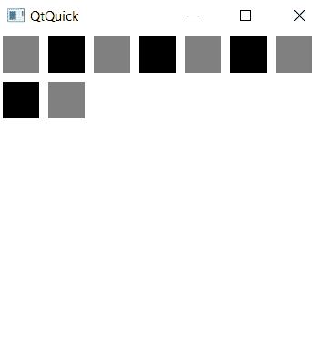

通常，只要您不能完全控制目标硬件，就应该使用锚定布局和更复杂的`Row`、`Column`、`Grid`和`Flow`元素。 相对间隔的布局让 Qt 在运行时做出布局决策，这样您就不会在大屏幕上出现奇怪的空间，或者布局会溢出小屏幕的边界。 当然，在设计时需要更多考虑，因为您需要确定各种项的相对间距，将最大空间分配给需要它的项。

当然，除了`Rectangle`之外，Qt Quick 还定义了几个可见元素。 视觉类型包括以下内容：

*   `Window`：这是应用的顶级窗口。
*   `Item`：这是所有可见对象继承的基本视觉对象类型。
*   `Image`：用于渲染位图。
*   `AnimatedImage`：用于播放 GIF 动画图像。
*   `AnimatedSprite`：用于播放存储为单个图像中的一系列精灵的动画图像。
*   `Text`：用于在场景中绘制文本。

所有这些都需要您导入`QtQuick`模块，除了需要`QtQuick.Window`的`Window`。 撰写本文时，此模块的当前版本是 2.2，但您可以查看文档以了解有关特定版本的信息。

类(如`Image`类)有一个`source`属性，该属性从获取其内容的位置获取 URL。 通常，您的图像要么来自应用的资源段，要么来自 Web；如果您需要从其他来源加载它们或动态创建它们，您可以提供图像提供程序。 (我将在本章末尾的示例中向您展示如何做到这一点。)

还有`WebEngineView`，这是一个使用 Qt WebEngine 构建的控件，您可以将其包含在 QML 中，并且可以呈现 Web 内容。 与其他可视化元素不同，您需要使用`import QtWebEngine`导入它，并启用项目文件中的`webengine`模块来访问`WebEngineView`。 QML 中的网页查看器非常简单，如下所示：

```cpp
import QtQuick 2.12
import QtQuick.Window 2.12
import QtWebEngine 1.8

Window {
    visible: true
    width: 640
    height: 480

    WebEngineView {
        anchors.top: parent.top;
        anchors.left: parent.left
        anchors.right: parent.right;
        anchors.bottom: parent.bottom;
        id: web
        url: "http://www.zhieng.com"
    }
}
```

前面的代码产生以下结果：


Note that the current version of the Qt WebEngine module only works with MSVC compiler under windows and not any other compilers. This is because the Chromium engine in the Qt WebEngine module has not been ported to other compilers, so we can only use MSVC for now.

QML 定义了一个接受输入的对象集合，而不是像 Qt 小部件那样通过事件方法处理用户输入。 这些对象包括以下对象：

*   `MouseArea`：用于鼠标点击和移动。
*   `Keys`：这是用来处理击键的。
*   `KeyNavigation`：用于处理箭头导航。
*   `Flickable`：用于处理鼠标轻击或触摸轻击以进行滚动。
*   `PinchArea`：这用于处理捏到缩放或其他两指交互。
*   `MultiPointTouchArea`：用于处理通用多点触控输入。
*   `Drag`：这用于处理可视项的拖放事件。
*   `DropArea`：此选项用于接受从拖动区放置的项目。
*   `TextInput`：用于捕获简单输入字段中的自由格式文本输入。
*   `TextEdit`：用于多行文本输入。

正如您在[第 3 章](03.html)，*使用 Qt Designer 设计您的应用*中看到的那样，这些定义中的每一个都定义了您可以绑定 JavaScript 的信号。 例如，`MouseArea`定义了以下信号：

*   `onClicked`：当用户单击鼠标区域时会发出此消息。
*   `onDoubleClicked`：当用户双击鼠标区域时会发出此消息。
*   `onEntered`：当用户将鼠标指针移入鼠标区域时会发出此消息。
*   `onExited`：当用户将鼠标指针移出鼠标区域时发出。
*   `onPressed`：当用户在鼠标区域按下鼠标时会发出此信息。
*   `onReleased`：当用户在鼠标区域松开鼠标按键时会发出此消息。
*   `onWheel`：当用户在鼠标区域操作鼠标滚轮时会发出此消息。

信号伴随着一个包含信号细节的事件；例如，`MouseArea`元素将`MouseEvent`事件发送到信号处理程序。 这些不是绑定 JavaScript 的参数，而是作为特殊变量出现在 JavaScript 中。

Qt Quick 还为需要数据模型的用户交互定义了其他一些视图；这些视图如下所示：

*   `ListView`：正如您可以想象的那样，`ListView`在垂直或水平列表中布局其项目。
*   `GridView`：这将在`gridPathView`中布局其项目。`PathView`采用任意路径，并将其项目布局在您提供的路径上。

所有这些都使用`ListModel`来包含它们的数据，遵循我们在上一章中讨论的 MVC 模式。 执行此操作时，使用 QML 绑定将视图绑定到模型，视图依赖于模型更改来显示模型中的更改。 您可以在 Qt Quick 中为`ListModel`容器提供项，也可以提供`QAbstractItemModel`的子类，并通过 Qt Quick C++ 绑定提供您自己的数据。 (我将在本章后面的*集成 Qt Quick 和 C++*一节中讨论如何绑定 QML 和 C++。)。 这些视图完全支持触摸，支持轻击和惯性滚动。 他们使用模型和委托来执行绘图；委托只是引用模型中的字段的 QML`Item`元素。 例如，此 QML 创建一个包含三个元素的列表，每个元素都有两个字段`name`和`number`：

```cpp
import QtQuick 2.12
import QtQuick.Window 2.12

Window {
    visible: true
    width: 360
    height: 360

    ListModel {
        id: model
        ListElement {
            name: "Bill Smith"
            number: "555 3264"
        }
        ListElement {
            name: "John Brown"
            number: "555 8426"
        }
        ListElement {
            name: "Sam Wise"
            number: "555 0473"
        }
    }

    ListView {
        model: model
        anchors.top: parent.top;
        anchors.bottom: parent.bottom;
        anchors.left: parent.left;
        anchors.right: parent.right;
        delegate: Item {
            width: 180
            height: 100
            Column {
                Text { text: name }
                Text { text: number }
            }
        }
    }
}
```

`ListModel`容器就是：`ListView`的数据列表。 `ListView`委托是一个`Item`元素，其中`Column`包含两个文本字段。 请注意，每个字段的文本只是`ListModel`字段中的字段名称。 前面的代码产生以下结果：

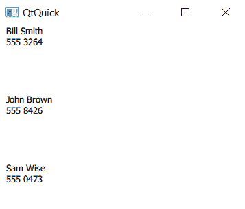

当然，我们可以将其分成三个文件。 我们可以将`ListModel`保存在名为`ContactModel.qml`的文件中，并将委托项保存在名为`ListModelDelegate.qml`的文件中，如下所示：

```cpp
// ContactModel.qml 
import QtQuick 2.12 

ListModel { 
    id: model 
    ListElement { 
        name: "Bill Smith" 
        number: "555 3264" 
    } 
    ListElement { 
        name: "John Brown" 
        number: "555 8426" 
    } 
    ListElement { 
        name: "Sam Wise" 
        number: "555 0473" 
    } 
} 

// ListModelDelegate.qml 
import QtQuick 2.12

Item { 
    width: 180 
    height: 100 
    Column { 
        Text { text: name } 
        Text { text: number } 
    } 
} 
```

然后，我们的主应用将类似于以下代码：

```cpp
import QtQuick 2.12 
import QtQuick.Window 2.12 

Window { 
    visible: true 
    width: 360 
    height: 360 

    ListView { 
        model: ContactModel {} 
        anchors.top: parent.top; 
        anchors.bottom: parent.bottom; 
        anchors.left: parent.left; 
        anchors.right: parent.right; 
        delegate: ListModelDelegate {} 
    } 
} 
```

如果您认为您将拥有一个可重用的组件，或者当您的代码太长而无法理解时，将您的 QML 划分为单独的文件是一个好主意。

就是这样--我们已经学习了如何使用 Qt Quick 中的一些基本功能，比如定位元素、Web 引擎和列表视图。 这将使您能够更好地了解 Qt Quick 项目和 Qt 窗体项目之间的区别，同时为您的项目选择正确的项目。 在此之后，让我们继续下一节，了解如何为我们的 Qt Quick 项目创建状态机。

# 在 Qt Quick 中使用状态和转换

传统的 GUI 编程通常涉及易于编写的样板状态机，用于跟踪控件和应用状态。 例如，一个按钮可能有几种状态：当鼠标悬停在它上面时；当它被按下时；然后一旦按下，在复选框或按钮的情况下，一个单独的状态用于打开或关闭。 虽然这段代码并不难写，但它确实涉及到一些编写，而且更复杂的界面需要更多的代码。

Qt Quick 通过其`State`构造为此提供了抽象，该构造将状态名称、状态名称发生的条件以及对象的哪些属性应采用新值进行分组。 我们在[第 3 章](03.html)，*使用 Qt Designer 设计您的应用*中第一次看到了这一点，当时我们编写了自己的按钮组件，转载如下：

```cpp
import QtQuick 2.12
import QtQuick.Window 2.12

Window {
 visible: true
    width: 256
    height: 256

    Rectangle
    {
        id: button

        anchors.fill: parent

        property alias operation: buttonText.text
        signal clicked

        color: "green"

        Rectangle {
            id: shade
            anchors.fill: button;
            color: "black";
            opacity: 0
        }
```

我们继续在此处编写代码的其余部分：

```cpp
        Text {
            id: buttonText
            anchors.centerIn: parent;
            color: "white"
            font.pointSize: 16
        }

        MouseArea {
            id: mouseArea
            anchors.fill: parent
            onClicked: {
                button.clicked();
            }
        }

        states: State {
            name: "pressed";
            when: mouseArea.pressed === true;
            PropertyChanges {
                target: shade; opacity: .4
            }
        }
    }
}

```

在这里，按钮有两种状态：默认状态，即阴影完全透明；当用户按下按钮(由按下状态表示)时，将阴影的`opacity`属性设置为`0.4`。 前面的代码生成以下结果-左侧为默认状态，右侧为按下状态：


项的`states`字段实际上可以是一个数组；编写这些状态的另一种方法是显式声明这两种状态，如下所示：

```cpp
states: [ 
    State { 
        name: "pressed"; when: mouseArea.pressed === true 
        PropertyChanges { target: shade; opacity: .4 } 
    }, 
    State { 
        name: "released"; when: mouseArea.pressed !== true 
        PropertyChanges { target: shade; opacity: 0.0 } 
    } 
] 
```

每个`State`构造可以有多个`PropertyChanges`元素，每个元素都有自己的目标和属性，因此可以使用简单的声明创建复杂的状态转换。

发生状态更改时，Qt Quick 使用过渡来控制属性的动画。 要创建过渡，需要定义动画；可以在任何可以更改的属性上应用动画，指定动画的起始值和结束值。 考虑一个简单的鼠标按下动画，如下所示：

```cpp
import QtQuick 2.12
import QtQuick.Window 2.12

Window
{
    visible: true
 height: 360
    width: 360

    Rectangle {
        id: rect1
        width: 100; height: 100
        color: "red"

        MouseArea {
            id: mouseArea
            anchors.fill: parent
        }

        states: State {
            name: "moved"; when: mouseArea.pressed
            PropertyChanges { target: rect1; x: 100; y: 100 }
        }

        transitions: Transition {
            NumberAnimation {
                properties: "x,y"
                easing.type: Easing.InOutQuad
            }
        }
    }
}
```

前面的代码产生以下结果-默认状态在左侧，按下状态在右侧：


在这里，矩形从父坐标系的原点开始，矩形中有`MouseArea`。 当您在矩形中按下鼠标时，矩形的状态将更改为`moved`，并且矩形的左上角将移动到父画布上的(100,100)。 但是，我们还在`x`和`y`属性上指定了动画`NumberAnimation`，因此属性更改将使用我们指定的缓动曲线(动画开始和结束时的二次曲线)设置为此值的动画。以下是我们可以用来为 Qt Quick 对象设置动画的一些动画类型：

*   不同类型的属性有不同的动画。 您可以使用`NumberAnimation`来设置数字属性的动画，如您在此处所见。
*   还有`ColorAnimation`，用于设置颜色动画，以及`RotationAnimation`，用于设置旋转动画。

下面是单击一个红色矩形时将其旋转成半圆形的 QML：

```cpp
import QtQuick 2.12
import QtQuick.Window 2.12

Window
{
    visible: true
    height: 360
    width: 360

    Item {
        width: 300; height: 300

        Rectangle {
            id: rect
            width: 150; height: 100;
            anchors.centerIn: parent
            color: "red"
            antialiasing: true

            states: State {
                name: "rotated"
                PropertyChanges { target: rect; rotation: 180 }
            }

            transitions: Transition {
                RotationAnimation {
                    duration: 1000
                    direction: RotationAnimation.Counterclockwise
                }
            }
        }

        MouseArea {
            anchors.fill: parent;
            onClicked: rect.state = "rotated"
        }
    }
}
```

前面的代码产生以下结果-默认状态为左侧，按下状态为右侧：

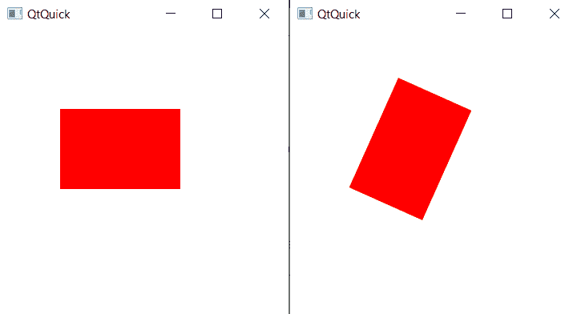

同样，模式是相同的：我们使用`PropertyChanges`定义状态，表示新属性值，然后使用动画(在本例中为`RotationAnimation`)指定在该属性上的转换。 在这里，转换具有以毫秒为单位指定的持续时间。 请注意，旋转仅发生一次，并且旋转角度由-360 度和 360 度的值限制。

For more information on the animation and transition framework in Qt Quick, see the Qt Quick documentation at [https://doc.qt.io/qt-5/qtquick-statesanimations-animations.html](https://doc.qt.io/qt-5/qtquick-statesanimations-animations.html) and the Qt Quick Animation samples at [https://doc.qt.io/qt-5/qtquick-animation-example.html](https://doc.qt.io/qt-5/qtquick-animation-example.html).

我们已经学习了如何利用 Qt 提供的状态机来基于状态转换操作对象属性。 让我们继续下一节，学习如何将我们的 Qt Quick 项目与 C++ 编程语言集成。

# Qt Quick 与 C++ 的集成

您可以使用`qmlviewer`应用运行一个简单的 Qt Quick 应用，该应用是作为 Qt SDK 的一部分提供的。 但是，在大多数情况下，您将使用 Qt Creator 中的 Qt Quick 应用向导创建一个 Qt Quick 应用，这将导致一个混合应用，该混合应用由 Qt C++ 应用容器和 QML 文件组成，作为应用在运行时加载和播放的资源。

如果我们查看使用此向导创建的项目中的`main.cpp`，我们将看到以下代码：

```cpp
#include <QGuiApplication>
#include <QQmlApplicationEngine>

int main(int argc, char *argv[])
{
    QCoreApplication::setAttribute(Qt::AA_EnableHighDpiScaling);

    QGuiApplication app(argc, argv);

    QQmlApplicationEngine engine;
 const QUrl url(QStringLiteral("qrc:/main.qml"));
 QObject::connect(&engine, &QQmlApplicationEngine::objectCreated, &app, 
   [url](QObject *obj, const QUrl &objUrl)
    {
        if (!obj && url == objUrl)
            QCoreApplication::exit(-1);
    }, Qt::QueuedConnection);
    engine.load(url);

    return app.exec();
}
```

这非常简单：它创建`QQmlApplicationEngine`的实例(继承自`QGuiApplication`的类)，并实例化包含 Qt 快速播放引擎`QQmlEngine`的单个实例的顶级窗口。 其中，`QQmlEngine`类保存一个称为根上下文的对象，它是 QML 环境中所有命名属性的列表。 我们可以访问这个根上下文，并向其中添加任何我们想要的 Qt 对象。

例如，让我们创建一个具有属性的本机 C++ 对象，如下所示：

```cpp
#ifndef NATIVEOBJECT_H 
#define NATIVEOBJECT_H 

#include <QObject> 

class NativeObject : public QObject 
{ 
    Q_OBJECT 

public: 
    explicit NativeObject(QObject *parent = nullptr) : 
    QObject(parent) 
    { 
        m_text = "Hello world!"; 
    } 

    Q_PROPERTY(QString text READ text) 
    const QString& text() { return m_text; } 

private: 
    QString m_text; 

}; 

#endif // NATIVEOBJECT_H 
```

我们可以在应用启动时将其中一个实例化并绑定到 QML 引擎的根上下文。 为此，我们只需创建一个，然后调用`rootContext`的`setContextProperty`方法，传递对象的一个实例和引擎应将其绑定到的名称，如下所示：

```cpp
#include <QGuiApplication>
#include <QQmlApplicationEngine>
#include <QQmlContext> 

#include "nativeobject.h" 

int main(int argc, char *argv[])
{
    QCoreApplication::setAttribute(Qt::AA_EnableHighDpiScaling);
    QGuiApplication app(argc, argv);
    QQmlApplicationEngine engine;

    NativeObject object; 
 engine.rootContext()->setContextProperty("object", 
 dynamic_cast<QObject*>(&object)); 

    const QUrl url(QStringLiteral("qrc:/main.qml"));
    QObject::connect(&engine, &QQmlApplicationEngine::objectCreated, 
      &app, [url](QObject *obj, const QUrl &objUrl)
    {
        if (!obj && url == objUrl)
            QCoreApplication::exit(-1);
    }, Qt::QueuedConnection);
    engine.load(url);

    return app.exec();
}
```

然后，我们可以在 QML 中的任何位置使用`object`名称访问此对象，如下所示：

```cpp
import QtQuick 2.12 
import QtQuick.Window 2.12

Window 
{ 
    visible: true 
    height: 360 
    width: 360 

    Text { 
        anchors.top: parent.top 
        anchors.horizontalCenter: parent.horizontalCenter 
        text: object.text 
    } 
} 
```

在这里，我们对象的`Text`属性被 QML 引擎取消引用，并用于 QML 中文本字段的文本值。

这对于列表模型特别方便；我们可以使用 C++ 中的文件系统或网络资源创建任意复杂的模型，然后将它们指定为`ListView`、`GridView`或`PathView`对象的模型，从而使我们能够在利用 Qt 的 MVC 和灵活的网络体系结构的同时，在 Qt Quick 中创建丰富的用户界面。 我们将在下一节创建自定义模型以在混合多媒体捕获应用中存储图像数据时执行此操作。

For more information about how Qt Quick binds with C++, see the documentation for the `QQmlContext` class at [https://doc.qt.io/qt-5/qqmlcontext.html](https://doc.qt.io/qt-5/qqmlcontext.html) and [https://doc.qt.io/qt-5/qtquick-modelviewsdata-cppmodels.html](https://doc.qt.io/qt-5/qtquick-modelviewsdata-cppmodels.html).

# 把所有这些放在一起-一个图片库应用

让我们将我们在前几章中讨论的内容应用到一个简单的图片库应用中，就像智能手机上的图片库一样。 我们将在网格中显示系统目录中的图像，让用户轻触即可滚动图像。 下面是我们的应用的外观：

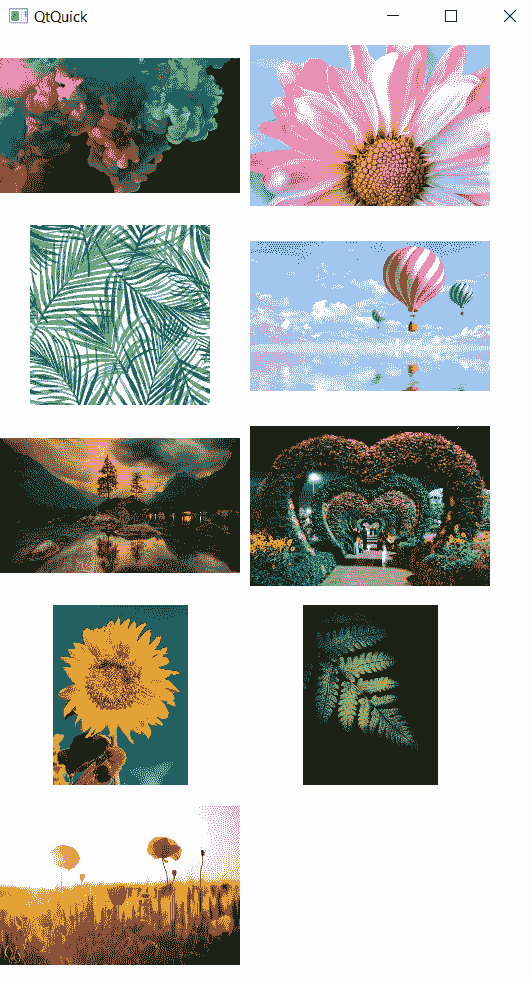

为此，我们需要以下组件：

*   包含要显示图像的路径的模型
*   负责创建模型的控制器
*   可以从系统的图像目录加载图像的图像提供程序
*   QML 用户界面

让我们先来看看应用的 QML：

```cpp
import QtQuick 2.12
import QtQuick.Window 2.12

Window {
    visible: true
    width: 1080 / 2
    height: 1920 / 2

    Item {
        anchors.top: parent.top
        anchors.left: parent.left
        anchors.bottom: parent.bottom
        anchors.right: parent.right
        clip: true
```

在前面的代码中，我们创建了应用窗口和一个`Item`对象，该对象充当`GridView`对象的父对象。 之后，我们将定义`GridView`，它从我们定义的源位置加载图像文件，如下所示：

```cpp

        GridView {
            id: grid
            anchors.fill: parent;
            cellHeight: 190
            cellWidth: 250
            model: ListModel {}
            delegate: Image {
                width: 240; height: 180
                fillMode: Image.PreserveAspectFit
                source: "image://file/" + path
            }
        }
    }
```

然后，我们创建一个`Timer`对象，以在`10`毫秒后触发我们的 C++ 函数：

```cpp
    Timer {
        interval: 10
        running: true
        repeat: false
        onTriggered: {
            controller.deferredInit()
            grid.model = model
        }
    }
}
```

有一个`GridView`和一个代表，它使用单个`Image`元素来显示库中的每个元素。 通过指定以`image`开头的 URL，我们告诉 Qt Quick 引擎我们希望使用自定义图像提供程序；在本例中，它是我们将在`main`函数中初始化时提供的文件图像提供程序。 网格中的图像将被缩放以适合网格单元格，同时保留图像的纵横比。 网格开始于一个空的列表模型，一旦计时器在启动后触发并指示控制器初始化该模型，我们就会将其替换为一个初始化的列表模型。

计时器启动有点麻烦；原因是我们将使用一个依赖于 Qt 多线程的文件系统类来监控图像目录，并且直到我们进入应用的主循环之后，才会初始化 Qt 多线程系统。 因此，我们启动主循环，初始化 QML，然后初始化应用控制器，应用控制器将初始化模型并从目录中获取图像文件列表。

应用的主入口点创建控制器和模型以及图像提供程序，并将它们绑定到 Qt Quick 引擎，如下所示：

```cpp
#include <QGuiApplication>
#include <QQmlApplicationEngine>
#include <QDir>
#include <QQmlContext>

#include "imagegallerycontroller.h"
#include "imagegallerymodel.h"
#include "fileimageprovider.h"

int main(int argc, char *argv[])
{
    QGuiApplication app(argc, argv);
    QQmlApplicationEngine engine;

    ImageGalleryController *controller = new 
      ImageGalleryController(&engine);
    ImageGalleryModel *model = controller->model();

    QQmlContext *context = engine.rootContext();
    context->setContextProperty("controller", controller);
    context->setContextProperty("model", model);
    engine.addImageProvider(QLatin1String("file"),
    new FileImageProvider(QQuickImageProvider::Pixmap));
```

在初始化自定义 C++ 类(如`ImageGalleryController`和`ImageGalleryModel`)之后(稍后我们将查看它们)，然后启动`main.qml`并运行应用：

```cpp
    const QUrl url(QStringLiteral("qrc:/main.qml"));
    QObject::connect(&engine, &QQmlApplicationEngine::objectCreated,
    &app, [url](QObject *obj, const QUrl &objUrl) {
        if (!obj && url == objUrl)
            QCoreApplication::exit(-1);
    }, Qt::QueuedConnection);
    engine.load(url);

    return app.exec();
}
```

此代码创建控制器的一个实例，从控制器获取指向模型的指针，然后将它们绑定到 Qt Quick 引擎。 接下来，我们向引擎注册我们的自定义图像提供程序的一个实例，说明文件的基本路径引用的任何内容都应该调用我们的图像提供程序，获取像素图。

图像提供程序可以返回像素图或`QImage`实例；像素图的绘制速度稍快一些。 您返回的是您的图像提供程序的函数；您的图像提供程序只需从磁盘加载图像或像素图，并对其进行缩放以适应显示。 以下代码用于执行此操作：

```cpp
#ifndef FILEIMAGEPROVIDER_H
#define FILEIMAGEPROVIDER_H

#include <QQuickImageProvider>

class FileImageProvider : public QQuickImageProvider
{
public:
    FileImageProvider(QQuickImageProvider::ImageType type);
    QImage requestImage(const QString& id, QSize* size, const QSize& 
      requestedSize);
    QPixmap requestPixmap(const QString& id, QSize* size, const QSize& 
      requestedSize);
};

#endif // FILEIMAGEPROVIDER_H
```

在声明了头文件中的函数之后，让我们在源文件中定义代码：

```cpp
#include "fileimageprovider.h"

FileImageProvider::FileImageProvider(QQuickImageProvider::ImageType type) :
  QQuickImageProvider(type)
{
}

QImage FileImageProvider::requestImage(const QString& filename, QSize* size, const QSize& requestedSize)
{
    QImage image(filename);
    QImage result;
    if (requestedSize.isValid()) {
        result = image.scaled(requestedSize, Qt::KeepAspectRatio);
    } else {
        result = image;
    }
    *size = result.size();
    return result;
}
```

`requestPixmap`函数与`requestImage`函数相同，但以不同的格式返回数据：

```cpp
QPixmap FileImageProvider::requestPixmap(const QString& filename, QSize* size, const QSize& requestedSize)
{
    QPixmap image(filename);
    QPixmap result;

    if (requestedSize.isValid()) {
        result = image.scaled(requestedSize, Qt::KeepAspectRatio);
    } else {
        result = image;
    }
    *size = result.size();
    return result;
}
```

图像提供程序接口定义了两个方法，您需要为其中至少一个方法提供实现。 当您的方法返回图像时，该接口指定图像的 ID、所需的图像大小以及指向图像实际大小的指针，然后返回一个`QImage`实例或一个像素图。

在本例中，我提供了这两种实现，以便让您了解如何做到这一点，尽管您只需要在映像提供程序中提供一种实现。

For more information on the interface, see the documentation at [https://doc.qt.io/qt-5/qquickimageprovider.html](https://doc.qt.io/qt-5/qquickimageprovider.html).

我们的实现将所需的图像从磁盘加载为像素图或`QImage`，如果调用方提供了有效的大小，它将在不更改纵横比的情况下调整图像的大小。 缩放之后，我们确定图像的大小，将其赋给 size 参数，然后返回结果图像或像素图。

我们的应用很简单，因此控制器的唯一目的是初始化数据模型；因此，控制器是一个非常简单的类：

```cpp
#ifndef IMAGEGALLERYCONTROLLER_H
#define IMAGEGALLERYCONTROLLER_H

#include <QObject>

class ImageGalleryModel;
class QAbstractItemModel;

class ImageGalleryController : public QObject
{
    Q_OBJECT

public:
    explicit ImageGalleryController(QObject *parent = 0);
    ImageGalleryModel* model() const;

signals:

public slots:
    void deferredInit();

private:
    ImageGalleryModel *imageGalleryModel;

};

#endif // IMAGEGALLERYCONTROLLER_H
```

声明了类头之后，让我们在源文件中定义它的函数：

```cpp
#include <QDir>
#include <QDesktopServices>
#include <QStandardPaths>

#include "imagegallerycontroller.h"
#include "imagegallerymodel.h"

ImageGalleryController::ImageGalleryController(QObject *parent) :
    QObject(parent)
{
    imageGalleryModel = new ImageGalleryModel();
}

ImageGalleryModel *ImageGalleryController::model() const
{
    return imageGalleryModel;
}

void ImageGalleryController::deferredInit()
{
    imageGalleryModel->setRootPath(QStandardPaths::standardLocations(
    QStandardPaths::PicturesLocation)[0]);
}
```

这并不奇怪：控制器在构造时创建一个模型，其延迟的初始化将模型的根路径设置为系统图片标准位置中的第一个元素。 (这实际上有一点风险；有些平台可能没有定义这样的目录，但对于本例来说没问题。)

模型是应用的大部分逻辑所在的位置。

首先，我们来看一下模型的界面：

```cpp
#ifndef IMAGEGALLERYMODEL_H
#define IMAGEGALLERYMODEL_H

#include <QStandardItemModel>

class QFileSystemWatcher;

class ImageGalleryModel : public QStandardItemModel
{
  Q_OBJECT
public:
    enum ImageGalleryRoles {
        PathRole = Qt::UserRole + 1
    };

    explicit ImageGalleryModel(QObject *parent = nullptr);

    QHash<int, QByteArray> roleNames() const;
    void setRootPath(const QString& path);
signals:

public slots:
    void onDirectoryChanged(const QString& path);

private:
    QString path;
    QFileSystemWatcher *watcher;
};

#endif // IMAGEGALLERYMODEL_H
```

模型中的每个元素都可以存储由不同角色访问的不同数据片段；我们定义了一个角色`PathRole`，它将包含到单个图像的绝对路径。 为此，我们需要做两件事：为角色定义一个数字值(通过`ImageGalleryRoles`枚举)，然后提供一个`roleNames`方法，该方法返回由角色值索引的角色名的散列。 Qt Quick 使用返回的散列中的角色名称来确定如何访问数据模型的单个值中的各个角色：在散列中查找角色名称，然后获取角色值，最后调用具有所需角色的模型条目上的数据。

模型类是应用中最大的类，尽管即使在这里，我们也使用`QStandardItemModel`来实际执行模型的大部分工作。 具体实现如下：

```cpp
#include "imagegallerymodel.h"
#include <QDir>
#include <QFile>
#include <QFileSystemWatcher>

ImageGalleryModel::ImageGalleryModel(QObject *parent) :
  QStandardItemModel(parent)
{
    watcher = new QFileSystemWatcher(this);
    connect(watcher, SIGNAL(directoryChanged(QString)),
        this, SLOT(onDirectoryChanged(QString)));
}

QHash<int, QByteArray> ImageGalleryModel::roleNames() const
{
    QHash<int, QByteArray> roles;
    roles[PathRole] = "path";
    return roles;
}
```

然后我们声明`setRootPath`函数，该函数允许我们设置图片库的目录：

```cpp
void ImageGalleryModel::setRootPath(const QString &p)
{
    this->clear();

    if (path != "") {
        watcher->removePath(path);
    }

    path = p;
    watcher->addPath(path);

    // Sync the model
    onDirectoryChanged(path);
}
```

然后我们实现`onDirectoryChanged`槽函数，该函数有点长：

```cpp
void ImageGalleryModel::onDirectoryChanged(
    const QString &path)
{
    QStringList nameFilters;
    nameFilters << "*.png" << "*.jpg";
    QDir directory(path);
    directory.setNameFilters(nameFilters);
    QStringList files = directory.entryList();

    QHash<QString, int> fileIndexes;

    // Sync the model with the list.

    // Now delete anything in the model not on the filesystem
    for(int i = 0; i < rowCount(); i++) {
        QString absolutePath = data(index(i, 0), PathRole).toString();
        QString name = directory.relativeFilePath(absolutePath);
        if (!files.contains(name)) {
            removeRow(i);
            i--;
            continue;
        }
        fileIndexes[absolutePath] = i;
    }
```

我们继续实现`onDirectoryChanged`函数。 我们遍历位于源目录中的所有文件，并获得其绝对文件路径：

```cpp
    // Add anything to the model that's on disk
    // and not in the model
    foreach(const QString &file, files) {
        QString absolutePath = directory.absoluteFilePath(file);
        if (!fileIndexes.contains(absolutePath)) {
            QStandardItem *item = new QStandardItem();
            item->setData(absolutePath, PathRole);
            appendRow(item);
        }
    }
}
```

让我们一个方法地看这个方法：

*   构造函数创建一个`QFileSystemWatcher`的实例，该实例在后台监视您给出的文件或目录更改的路径，分别为更改的目录或文件发出`directoryChanged`和`fileChanged`信号。 我们将使用`setPath`方法中所需的路径来初始化此观察器。
*   `roleNames`方法建立数据角色的名称、路径和我们用来从模型获取此数据的枚举值之间的关系。 如前所述，Qt 在角色枚举及其文本名称的哈希表中期望这种关系。 Qt Quick 将使用散列中的值来确定适当的角色来获取数据，因此我可以简单地引用 QML 中的字段路径，并且在幕后，Qt Quick 引擎从相应的角色值获取值。
*   `setRootPath`方法必须首先重置模型的内容，然后如果观察器正在监视某个目录，则在监视您经过的目录之前停止监视旧目录。 一旦代码初始化了观察器，它就会通过调用观察器所调用的相同槽来强制模型更新(还记得构造函数中的`connect`实例吗？)。 每当目录更改时。
*   `onDirectoryChanged`槽获取它所传递的目录中的 PNG 和 JPEG 文件列表；然后，它通过首先删除模型中不在磁盘上的所有内容，然后将磁盘上的所有内容添加到模型中来同步模型。 当我们第一次遍历模型以处理任何删除操作时，我们为模型中的文件构建了一个哈希表；稍后，当我们向模型中添加项时，我们可以只检查哈希表中的条目。 这比顺序搜索模型或模型内容列表要快一点，因为哈希表搜索通常比顺序搜索快。

我们已经成功地使用 Qt Quick 创建了图片库。 让我们继续下一节，了解 Qt Quick Control2 有哪些新功能。

# 介绍新的 Qt 快速控件 2

自从 Qt 5.6 以来，Qt Quick Controls 2 已经发布，取代了版本 1，后者存在性能问题和技术问题，这导致了它的弃用。 有了 Qt Quick Controls 2，一切都是从零开始重建的，并考虑到了性能。 Qt Quick Controls 2 不仅可以在 PC 上流畅运行，还可以在移动设备和嵌入式设备上流畅运行。

要在项目中使用 Qt Quick Controls 2，请执行以下步骤：

1.  将以下模块添加到您的 QML 文件中：

```cpp
import QtQuick.Controls 2.12
```

2.  如果您需要在 C++ 代码中使用 Qt Quick Control 2，则必须首先将`quickcontrols2`模块添加到`qmake`项目文件中：

```cpp
QT += quickcontrols2
```

3.  之后，您可以在 C++ 源代码中包含`QtQuickControls2`头：

```cpp
#include <QtQuickControls2>
```

以下是 Qt Quick Control 2 中提供的一些 QML 类型：

*   按钮-按钮允许用户点击或按下按钮并触发事件。
*   复选框-可以打开或关闭复选框以表示启用或禁用选项。
*   组合框-组合框是一个向下列出供用户选择的选项的选择框。
*   TextField--文本字段是允许用户键入一行文本的最简单的文本输入。
*   TextArea-与文本字段不同，文本区域是多行文本输入字段，也支持文本修饰。
*   菜单栏-菜单栏是位于应用窗口边缘的下拉菜单数组。
*   圆形按钮-圆形按钮与按钮相同，不同之处在于它支持圆角。
*   滑块-滑块允许用户通过沿轨迹移动手柄来操纵值。
*   SpinBox-数字调整框是一个整数选择框，带有向上和向下指示器按钮，用于操作整数值。

比这里列出的要多得多。 有关 qml 类型的完整列表，请访问[https://doc.qt.io/archives/qt-5.11/qtquick-controls2-qmlmodule.html](https://doc.qt.io/archives/qt-5.11/qtquick-controls2-qmlmodule.html)。

让我们看一下在我们的应用中应用 Qt Quick Control 2 的一些示例代码：

```cpp
import QtQuick 2.13
import QtQuick.Window 2.13
import QtQuick.Controls 2.12

ApplicationWindow {
    visible: true
    width: 200
    height: 200
    title: qsTr("Hello World")

    Button {
        text: "Push Me"
        anchors.centerIn: parent
    }
}
```

在前面的代码中，我们将`QtQuick.Controls`模块导入到 QML 文件中，然后创建了一个标签为“Push Me”的`Button`对象。 结果如下所示：

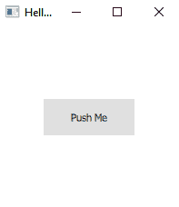

Qt Quick Control 2 自带`Default Style`，主要由灰色和黑色组成，如上图截图所示。

您还可以选择其他几种样式来使您的应用与您正在运行的操作系统相匹配。 其他一些选项如下所示：

*   **Fusion Style**：Fusion Style`Fusion Style`是一种看起来非常类似桌面操作系统原生 Widget 的风格，适合用于桌面应用。
*   **IMAGINE STYLE：**`Imagine Style`依靠图像资产来显示小部件，这些小部件适用于需要更多定制外观的应用。
*   **Material Style**：`Material Style`是专门为让您的应用看起来像原生 Android 应用而设计的，因为它完全遵循 Google 官方发布的材料设计指南。
*   **通用样式**：`Universal Style`使您的应用看起来像是本机通用 Windows 平台应用，因为它遵循微软通用设计指南。

有关此处列出的所有样式的更多信息，请查看[https://doc.qt.io/archives/qt-5.11/qtquickcontrols2-styles.html](https://doc.qt.io/archives/qt-5.11/qtquickcontrols2-styles.html)。

要将样式应用于您的应用，需要执行以下几个步骤：

1.  您需要创建一个名为`qtquickcontrols2.conf`的文件，并将其添加到您的项目资源中。 然后，将以下代码添加到文件中：

```cpp
[Controls]
Style=Material

[Material]
Theme=Light
Accent=Teal
Primary=BlueGrey
```

2.  在`[Controls]`下，我们将 Qt Quick Control2 样式设置为`Material`。
3.  之后，在`[Material]`下，我们设置材质样式的颜色。 如果我们再次运行我们的程序，您应该看到按钮已更改：


我们的应用现在看起来像是在 Android 操作系统上运行！ 每种样式都有其独特的配置，因此您必须查看各自的文档才能了解更多信息。

To get information about various styles, please visit the following:

*   有关`Fusion Style`，请查看[https://doc.qt.io/archives/qt-5.11/qtquickcontrols2-fusion.html](https://doc.qt.io/archives/qt-5.11/qtquickcontrols2-fusion.html)。
*   对于`Imagine Style`，请查看[https://doc.qt.io/archives/qt-5.11/qtquickcontrols2-imagine.html](https://doc.qt.io/archives/qt-5.11/qtquickcontrols2-imagine.html)。
*   有关`Material Style`，请查看[https://doc.qt.io/archives/qt-5.11/qtquickcontrols2-material.html](https://doc.qt.io/archives/qt-5.11/qtquickcontrols2-material.html)。
*   最后，查看`Universal Style`的[https://doc.qt.io/archives/qt-5.11/qtquickcontrols2-universal.html](https://doc.qt.io/archives/qt-5.11/qtquickcontrols2-universal.html)。

除了在`qtquickcontrols2.conf`文件中设置颜色之外，还可以在 QML 文件中覆盖它。 如果您希望特定的 QML 文件具有与其他文件不同的样式，这将非常有用。 下面的代码显示了这一点：

```cpp
ApplicationWindow {
    visible: true
    width: 200
    height: 200
    title: qsTr("Hello World")

    Material.theme: Material.Dark
    Material.accent: Material.Green

    Button {
        text: "Push Me"
        anchors.centerIn: parent
    }
}
```

前面的代码产生以下结果：

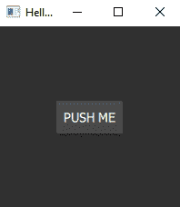

您还可以覆盖每个单独 QML 对象的样式，如下所示：

```cpp
ApplicationWindow {
    visible: true
    width: 200
    height: 200
    title: qsTr("Hello World")

    Material.theme: Material.Dark
    Material.accent: Material.Green

    Button {
        text: "Push Me"
        anchors.centerIn: parent
        highlighted: true
        Material.accent: Material.Blue
        Material.background: Material.Orange
        Material.foreground: Material.Pink
    }
}
```

由于按钮现在有自己的`Material.accent`属性，它将覆盖我们在顶部设置的属性。 该代码产生以下结果：

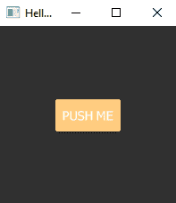

最后，Qt 还提供了一个 C++ 方法，用于通过`QQuickStyle`类更改 Qt Quick Control2 样式。 您可以调用`QQuickStyle`下的`setStyle`函数来更改样式：

```cpp
QQuickStyle::setStyle("Material");
```

我们已经了解了 Qt Quick Control2 的一些功能以及如何更改其外观。 在下一节中，我们将研究 SCXML 的新图形编辑器，以及如何使用它创建一个简单的状态机。

# 了解 SCXML 的新图形编辑器

Qt 在 5.7 中引入了 SCXML 这一新特性，作为为应用构建复杂状态机的符号格式。 状态机是程序或程序的小部件根据您为其定义的当前状态更改其属性的一种机制。 我们已经看到当鼠标悬停在`Push Button`上或被用户按下时，`Push Button`如何改变其外观。 这是`Push Button`的不同状态，其行为由状态机确定和执行。

使用 SCXML，您可以为程序定义更复杂的状态机，并将其保存为人类可读的 SCXML 文件格式，以便 Qt 进行解析和处理。 然后，Qt 将根据 SCXML 文件的内容生成 C++ 类，以驱动您先前定义的状态机。 Qt 还提供了一个图形编辑器，使您可以轻松定义状态机，而无需手动编写 SCXML 文件的内容。 编辑器如下所示：

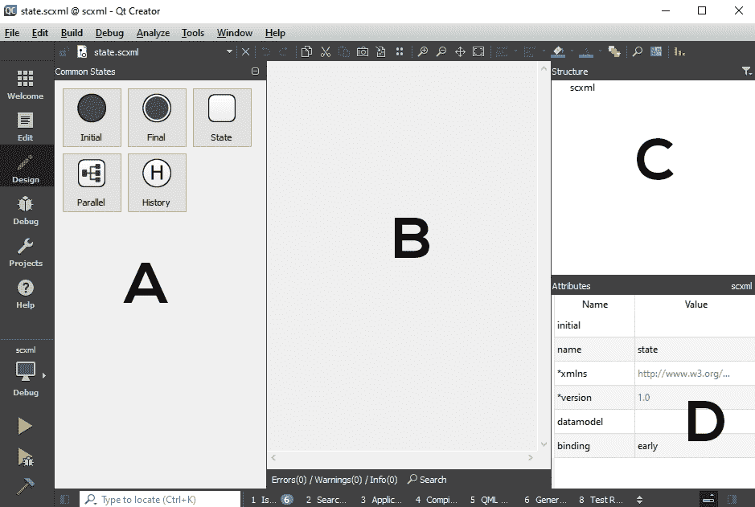

编辑器由四个不同部分组成：

*   通用状态面板(A)：这是您挑选和选择要添加到状态编辑器的状态类型的位置。
*   状态编辑器(B)：这是定义状态机的地方。 您可以从此处的 Common States 面板拖放不同类型的状态，并将它们链接在一起以形成状态转换。
*   结构面板(C)：这里的面板以树列表的形式显示您的状态机的结构。 您放置在状态编辑器中的所有状态及其层次关系都将在此处显示。
*   属性面板(D)：此窗口显示所选状态的属性，您可以根据需要查看和编辑这些属性。

要创建 SCXML 文件，请执行以下操作：

1.  转到文件|新建文件或项目。
2.  然后，选择文件和类|建模下的状态图选项，然后按 Choose...(选择...)。 纽扣。
3.  一旦您创建了该文件，Qt Creator 将使用 SCXML 编辑器自动将其打开。 您将看到一个空的 SCXML 文件，就像前面的屏幕截图所示。
4.  您可以通过将`Initial`节点拖动到状态编辑器来启动状态机，从而开始创建您的第一个状态机。
5.  之后，您可以将一些`State`节点拖到状态编辑器中，并通过首先选择其中一个节点并单击箭头图标将它们链接在一起。 然后，无论您何时移动，都会有一个虚线箭头跟随您的光标。
6.  左键单击状态编辑器以创建断点以更改箭头的方向，或右键单击其他节点之一以建立与您已选择的上一个节点的过渡。当`State`节点与多个其他节点链接时，它会创建一个供状态机选择的选项。 状态机将通过遵循您稍后在代码中设置的条件来选择适当的路径。 现在，您只需定义状态机可以使用的状态。 下图显示了 SCXML 编辑器内状态机的外观示例：

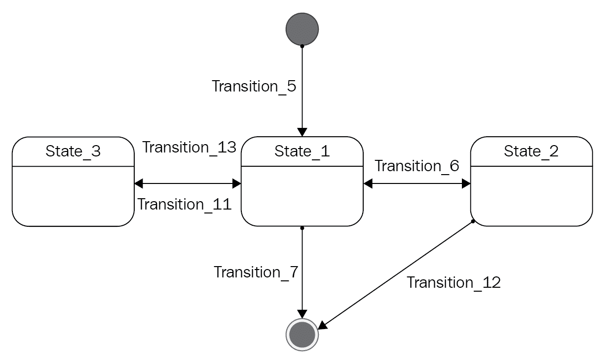

上图显示了
SCXML 部分的新图形编辑器，我们看到，从顶部开始，有一个`Initial`节点，它表示程序的初始状态，然后它将向下移动到名为 State_1 的`State`节点。从那里开始，它可能会转到不同的状态，具体取决于您在代码中设置的条件。 箭头指示国家可以移动的方向。 最后，状态最终将在第二`Final`节点结束，在该节点，状态机将停止其操作。

7.  最后，放置一个`Final`节点来定义状态机可以达到的最终状态。 一旦达到此状态，状态机就完成了任务并停止运行。

除此之外，如果满足您的需要，还可以使用`Parallel`节点。 与一次只转到一个其他节点的`State`节点不同，`Parallel`节点可以同时移动到多个其他状态，因此得名。

`History`节点比其他节点复杂得多。 它表示以前保存的历史状态。 您可以使用此节点从未直接链接的遥远状态返回到以前的状态。 要将状态保存到历史堆栈，请创建一个`History`节点作为`State`节点的子节点。 当状态机在运行时检测到`History`节点的存在时，它将自动记录当前状态。 在转换期间，只要状态机到达`History`节点，它就会返回到此状态。 下图显示了如何使用`History`节点的示例：

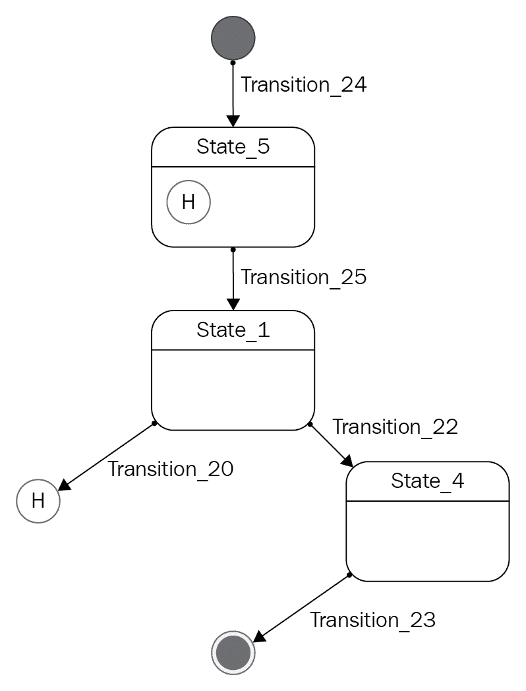

从上图中我们可以看到，当通过 Transition_20 从 State_1 状态移动到`History`状态时，您的程序的状态将返回到 State_5，这是另一个`History`节点位于 State_1 之前的位置。如果您的状态机中有多个`History`状态，则它将挑选它偶然发现的最后一个状态。

除了将`History`节点添加到`State`节点之外，还可以将`State`节点添加到另一个`State`节点以建立父子关系。 像这样的递归状态会增加状态机的复杂性，使用这种方法时应该格外小心。

对于每个`State`节点，可以对其应用其他元素，称为`Executable Content`。 以下是可以添加到您的州的`Executable Content`元素的列表：

*   `raise`：引发事件。
*   `send`：与外部实体沟通。
*   `script`：运行脚本并对数据模型中的值执行某些操作。
*   `assign`：在数据模型中添加或修改值。
*   `cancel`：取消动作执行。
*   `log`：将信息记录到日志中。
*   `if`：根据条件执行操作。
*   `foreach`：遍历一组值并对每个值执行操作。

您可以将这些元素添加到状态，方法是右键单击其节点，然后从弹出菜单上的`onentry`或`onexit`选项中选择前述元素之一。 这些`Executable Content`元素中的大多数都是用于在进入或退出该州时操作该州的数据模型的方法。 因此，只能将这些元素添加到分配了`datamodel`的`State`节点或`Parallel`节点。 如果尚未执行此操作，请右键单击要应用的`State`节点，然后选择`datamodel`。

要将`data`添加到`datamodel`，请在结构面板中右键单击它，然后在弹出菜单中选择`data`。 现在，您可以将数据分配给`datamodel`，并通过我们前面提到的`Executable Content`元素对其进行操作。

让我们自己试一试吧：

1.  首先，创建一个新的 Qt Quick 项目，并将`scxml`模块添加到我们的项目中：

```cpp
QT += quick scxml
```

2.  然后，按如下方式设置我们的 GUI：

```cpp
import QtQuick 2.12
import QtQuick.Window 2.12

Window {
    id: window
    visible: true
    width: 640
    height: 480
    title: qsTr("State Machine")

    Rectangle {
        id: rectangle
        width: 200
        height: 200
        color: "red"
        anchors.verticalCenter: parent.verticalCenter
        anchors.horizontalCenter: parent.horizontalCenter
    }
}
```

3.  这里没有什么花哨的东西，只是一个位于窗口中央的简单矩形：

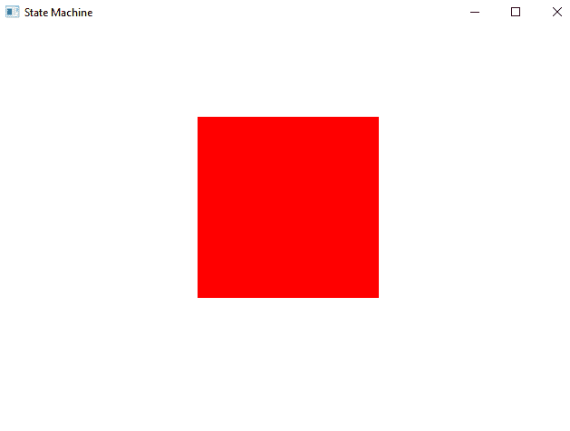

4.  之后，创建一个 SCXML 文件并将其命名为`statemachine.scxml`。
5.  创建文件后，请确保也将此文件添加到项目资源中，因为我们稍后将在 QML 代码中使用它。
6.  之后，使用 Qt Creator 打开该文件，并创建一个简单的状态机，如下所示：

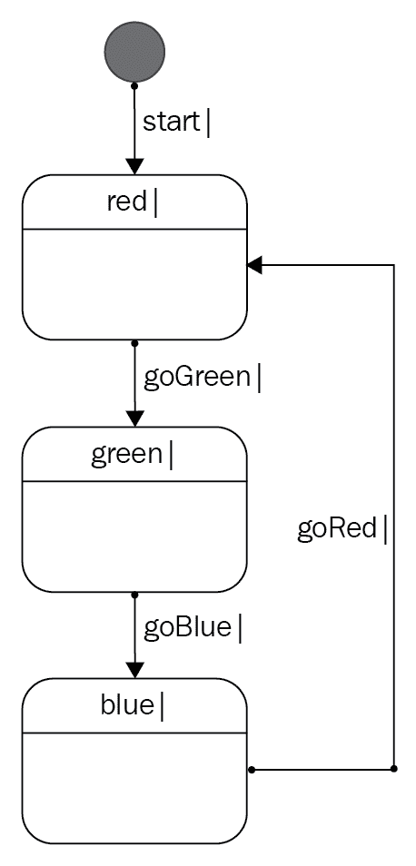

从上图可以看出，前面的状态机由三种不同的状态组成：**红色**、**绿色**和**蓝色**。 我们将使用这些状态来更改前面在 QML 代码中定义的矩形的颜色。 您可以从状态机中看到的其他名称(如`start`、`goGreen`、`goBlue`和`goRed`)是转换的名称。

7.  完成后，右键单击每个`State`节点(**红色**、**绿色**和**蓝色**)，然后从弹出菜单中选择 onentry|Send。

8.  将`red`的`send`可执行内容的`event`属性设置为`goGreen`，并将其延迟设置为`2s`。 这将允许状态机在进入`red`状态两秒后自动触发`goGreen`转换。 下面的屏幕截图显示了在属性窗口中设置值的位置：

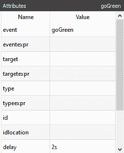

对`green`和`blue`状态重复上述步骤，但将`event`属性分别更改为`goBlue`和`goRed`。 这意味着状态机将继续循环运行，直到我们停止程序。

9.  接下来，打开我们的`main.qml`文件并将`QtScxml`模块导入到我们的 QML 代码中：

```cpp
import QtScxml 5.8
```

10.  之后，在我们的窗口对象下添加以下代码：

```cpp
StateMachineLoader {
    source: "qrc:///statemachine.scxml"
    stateMachine.onReachedStableState: {
        if (stateMachine.red)
            rectangle.color = "red"
        else if (stateMachine.green)
            rectangle.color = "green"
        else if (stateMachine.blue)
            rectangle.color = "blue"
    }
}
```

我们创建了一个`StateMachineLoader`对象，该对象用于加载前面创建的 SCXML 文件，并自动为我们生成状态机代码。 但是，我们必须自己编写逻辑，这可以在`onReachedStableState`槽函数下看到。 当我们的状态机成功更改其状态时，将触发此函数。 然后，我们检查每个状态是否为当前状态(如果是当前状态，则返回 TRUE)，并相应地更改矩形形状的颜色。

如果我们现在运行代码，我们将看到矩形每两秒更改一次颜色。 就是这样--我们已经了解了如何利用 Qt 提供的新的 SCXML 编辑器，并为我们的应用创建一个简单的状态机。

# 简略的 / 概括的 / 简易判罪的 / 简易的

在本章中，您快速了解了 Qt Quick，这是 Qt 用于应用开发的声明性框架。 您了解了 Qt Quick 提供的作为应用开发基础的基本可见项目，以及如何使用 Qt Quick 的布局系统定位项目，如何使用 Web 引擎组件创建简单的 Web 浏览器，以及如何使用 Qt Quick 的列表视图创建简单的列表。

除此之外，您还了解了 Qt Quick 对动画和过渡的支持。 我们了解了如何利用状态构造根据对象的当前状态更改对象的属性，还了解了如何利用最新的 SCXML 编辑器创建更复杂的状态机。

最后，我们了解了如何将 Qt Quick 和 C++ 链接起来，为您提供了 Qt 开发中的两全其美。 通过遵循本章中的示例，我们学习了如何从头开始创建图片库！

在下一章中，我们将了解 Qt Quick 对多媒体录制和回放的支持。 敬请关注！