# 十二、使用 Qt Creator 开发移动应用

Qt 和手机开发由来已久。 Qt 的开端包括 90 年代末和本世纪初 Linux 个人数字助理的早期版本。 从那时起，它已经移植到了许多移动环境中，包括诺基亚发布的 Linux 的移动版本，如 MeeGo 和 Symbian。 虽然 Symbian 和 MeeGo 来来去去，但 Qt 对移动平台的接受依然存在，最近的一次是对 Android 的支持。

在本章中，我们将简单介绍一下如何编写移动应用，然后学习如何设置 Qt Creator 来编写 Android 应用。 值得注意的是，虽然我们将在开发移动应用时利用您所学到的有关 Qt 开发的所有知识，但我们还需要了解移动软件运行的环境与传统台式机和笔记本电脑环境的不同之处，以及如何设计这些约束。 一旦我们了解了这些不同之处，用 Qt 为 Android 等移动平台编写软件就像打个响指一样简单！

我们将在本章介绍以下主题：

*   了解移动软件开发
*   为 Android 设置 Qt Creator
*   将应用部署到 Android 设备
*   为 iOS 设置 Qt Creator
*   改进对 iOS 和 Android 应用的支持

# 技术要求

本章的技术要求包括 Qt 5.12.3`arm64-v8a`、Qt Creator 4.9.0 和 Windows 10。

# 了解移动软件开发

在为任何移动平台(如手机或平板电脑)开发软件时，需要记住的关键一点是，每种资源都是溢价的。 该设备较小，这意味着：

*   您的用户将较少关注您的应用，并在较短的时间内使用它。
*   屏幕更小了，所以你可以在显示屏上显示更少的信息(不要被今天的显示器的高点距所愚弄；在 4 英寸的显示器上阅读六点字体并不好玩，不管像素密度高不好。)
*   处理器和图形处理单元速度较慢。
*   内存更少，图形内存也更少。
*   应用数据的持久化存储较少。
*   网络速度更慢，最高可达三个数量级。

让我们更详细地看一下其中的每一个。

# 用户关注度非常高

你能一边走路一边嚼口香糖吗？ 我不能，但很多人一边走路，一边嚼口香糖，一边使用他们的移动设备(更糟糕的是，有些人甚至一边开车一边使用他们的设备)。 手机或平板电脑上的应用一次只吸引用户 100%的注意力超过几分钟，这是非常罕见的。 一个很好的经验法则是，设备越小，用户就越有可能在做其他事情时把它当作可以拿起来看一眼或使用的东西。

您的用户对您的应用的关注有限有三个主要后果：

*   **您的应用必须快速**：移动设备不能放置额外的进度条、旋转光标或冗长的闪屏。
*   **您的应用必须简洁**：最好的移动应用只在一两个页面上显示数据，具有非常扁平的导航层次结构。 一种常见的结构是有一个带有信息的单一屏幕和一个带有首选项的单一屏幕，这些首选项允许您配置应该显示哪些信息(例如，您从中获取信息的位置)。 喜欢清晰的图标而不是冗长的文字--如果你不会画画，找一个会画的人，或者从 Noun Project([http://thenounproject.com/](http://thenounproject.com/))这样的网站上买图标。

*   **你的应用必须是可访问的**：按钮应该很大(一个很好的指导原则是，你的应用中的任何点击目标都不应该小于你的指垫，大约一平方厘米)，如果可能的话，文本应该更大。

出于这些原因，Qt Quick 对于您将要编写的大多数移动应用是更好的选择。 您可以创建流畅、响应迅速的应用，这些应用在视觉上令人愉悦，并且不会让您的用户不知所措。

# 计算资源非常宝贵。

移动设备必须随身携带电源：电池。 虽然电池在过去 20 年里有所改进，但它们并没有跟上摩尔定律；大部分改进都是在处理器方面做出的，因为处理器变得更小，在正常运行过程中散热更少。

尽管如此，移动设备还是不如台式机或笔记本电脑快。 思考这一问题的一个好方法是，上一代的处理器设计可能对今天的移动设备具有很好的伸缩性。 这并不是说移动设备速度慢，只是说它们速度更慢。 需要考虑的同样重要的一点是，您无法在不严重影响电池寿命的情况下全速运行处理器或图形处理器。

Qt，特别是 Qt Quick，针对低功耗进行了优化，但您仍然可以做以下几件事来帮助您的移动应用获得最佳性能：

*   **不要投票**：这可能是最重要的一点。 尽可能使用 Qt 的异步信号槽机制，如果需要在后台执行某些操作，请考虑使用`QThread`和 Qt 多线程环境的其余部分进行多线程。 您的应用休眠时间越长，电池续航时间就越长。
*   **避免不必要的动画**：在当今的应用中，一定数量的动画既是惯例，也是重要的；精心设计的动画可以帮助用户了解它们在应用用户界面中的位置以及它们的去向。 然而，不要仅仅为了看到像素移动而闪烁、眨眼或以其他方式设置动画；在幕后，必须进行大量操作才能移动这些像素，这会消耗电池。
*   **明智地使用网络**：大多数移动设备至少有两个无线电(蜂窝和 Wi-Fi)；有些甚至更多。 访问网络应该被视为一种必要的罪恶，因为无线电在发送和接收数据时会消耗电能。 另外，别忘了数据解析：如果您要解析大量数据，很可能会全速运行 CPU 来完成繁重的任务，这意味着电池续航时间较短。

接下来，让我们来看看网络资源是如何影响设备的。

# 网络资源非常宝贵

你已经被警告过使用网络的电池费用很高。 雪上加霜的是，大多数移动设备运行的网络速度可能比台式机慢三个数量级；你的办公室台式机可能有千兆位以太网，但在世界上许多地方，每秒一兆位被认为是很快的。 随着网络运营商在各地部署蜂窝无线网络，如**长期演进**(**LTE**)和 Wi-Fi 热点，这种情况正在迅速改善，但这些网络绝不是统一可用的。 在最近一次去加州的旅行中，在 8 个小时的时间里，我的蜂窝网络连接吞吐量比我的有线调制解调器(运行速度为每秒 25 兆位)快了很多，低到令人恐惧的每秒兆位，这可能会让一个大网页爬行。

对于大多数应用，您应该可以使用**Hypertext Transfer Protocol**(**HTTP**)；Qt 的`QNetworkAccessManager`类实现了 HTTP 和 HTTPS，使用 HTTP 意味着您可以构建 Web 服务来以标准方式支持您的后端。

如果您正在开发游戏或自定义应用，则可能需要构建一个自定义协议。 考虑使用`QTcpSocket`或`QUdpSocket`作为您的网络协议，当然要记住 TCP 是一种可靠的协议。 但是，使用 UDP 不能保证您的数据到达目的地；可靠性取决于您。

Something to make a special note of is error handling in networked applications. Unlike a desktop, where network failures are likely to be rare because your computer is tethered to the network, wireless networks can suffer all sorts of transitory problems. These don't necessarily lead to logical failures; a short drop in network connectivity can result in **Domain Name Service** (**DNS**) problems, **Transport Layer Security **(**TLS**) timeouts, or retry timeouts.

Handle errors in your application, and ensure that there are mechanisms to retry important network operations, such as data synchronization and content uploads. Be prepared for duplicate requests and uploads too, in cases where your device uploads something to a server, but doesn't get an acknowledgment from the server because of a network problem, and so tries again.

接下来，我们来看看存储资源是如何工作的。

# 存储资源非常宝贵

移动设备通常都使用固态存储器。 尽管固态存储器的价格在过去几年里大幅下降，但它仍然没有构成大多数台式机和许多笔记本电脑磁盘驱动器的旋转磁存储器那么便宜。在过去的几年里，固态存储器的价格已经大幅下降，但它仍然没有构成大多数台式机和许多笔记本电脑磁盘驱动器的旋转磁存储器便宜。 因此，移动设备可能只有 8 GB 的闪存用于永久存储，或者如果你幸运的话，16 或 32 GB。 这是在系统和所有应用之间共享的；您的应用最多不应该使用超过几千兆字节的空间，而且只有在您的用户期望使用的情况下，比如播客应用才会使用。 这应该是应用大小的总和：它的静态资源，如音频和视频，以及它可能从网络下载和缓存的任何内容。

同样重要的一点是，您的应用的运行时大小需要更小。 大多数移动设备有半 GB 到 2 GB 的动态 RAM 可用；系统在所有正在运行的应用之间共享这些内存，因此重要的是只分配您需要的，并在完成后释放它。

最后，别忘了你的图形纹理和东西也会消耗宝贵的 GPU 内存。 当 Qt 为您管理 GPU 时，无论您使用的是 Qt 还是 Qt Quick，您都可以编写一个消耗设备所有纹理内存的应用，从而使本机操作系统很难或不可能在需要使用另一个应用或系统消息中断您的应用时呈现所需的内容。

接下来，让我们讨论一下是否应该将我们的应用移植到不同的平台。

# 去港口还是不去港口？

套用这位不朽的吟游诗人的话，这就是问题所在。 由于 Qt 在众多平台上具有难以置信的灵活性，抢占现有应用并将其移植的诱惑可能是不可抗拒的，特别是在垂直市场中，您有一款用 Qt 编写的桌面定制软件，并且有一位客户想要*相同的东西*用于他们的移动员工的最新移动设备。 一般来说，我能提供给您的最好建议是避免移植 UI，只在移动设备上表现良好的应用中移植业务逻辑。

从台式机或笔记本电脑环境移植的 UI 在移动设备上很难正常工作。 用户的操作模式太不同了：一个人坐在台式机或笔记本电脑前想做的事情，与他们站起来、四处走动或在会议室、食堂或咖啡馆里短暂冲刺时想做或能做的事情完全不同。 如果你正在从一台移动设备移植到另一台移动设备上，情况可能不会那么糟糕；例如，一个开发了 Android 版 Qt 应用的开发人员将他们的应用移植到 iOS 上应该不会有太大的困难。

假设移植业务逻辑不会大量使用 CPU、网络或动态或静态存储，那么移植业务逻辑可能是更安全的选择。 Qt 通过`QtSql`为 SQLite 提供了包装器，许多企业应用将其用于本地存储。 这是一种合理的数据存储替代方案，而且大多数基于 HTTP 的网络应用在网络层上应该不会太难，只要它们有合理的缓存策略，并且不会太频繁地请求数据。 但是，如果应用使用大量存储或具有持久的网络连接，则需要重新架构和重写。

# 一句关于测试的话

测试任何应用都很重要，但移动应用需要额外的测试工作，尤其是 Android 应用。 市场上有各种各样的设备可供选择，用户希望您的应用在他们可能拥有的任何设备上都能很好地运行。

如果您对商业发布应用感兴趣，那么您可以做的最重要的事情就是在真实的设备上测试您的应用--尽可能多地测试您能接触到的设备。 虽然 Qt Creator 使用的 Android SDK 附带了可以在台式机或笔记本电脑上运行 Android 应用的仿真器，但在仿真器上运行并不能替代在设备上运行。 很多东西都不一样，从硬件本身的尺寸到触摸屏，当然还有网络连接和原始处理能力。

幸运的是，安卓设备并不是特别贵，而且市面上的安卓设备非常多。 如果你刚刚起步，eBay 或 Google Play 商店可能是一个购买便宜的二手或新设备的好地方。 如果你是一名学生或初露头角的企业家，别忘了很多家庭成员可能都有一部 Android 设备可以借给你；或者，你也可以使用你已经拥有的 Android 手机。

你应该在什么时候测试什么？ 经常，还有所有的事！ 在一个为期数周的项目中，离在设备上运行的生成的时间永远不应该超过几天。 你花在编写没有在设备上测试的代码上的时间越长，你就会对设备的性能做出越多的假设，而这些假设中的许多都会被证明是错误的。

请确保不仅在良好的环境下测试您的应用，也要在糟糕的环境下测试您的应用。 网络连接就是一个很好的例子；您应该在没有网络覆盖的情况下测试错误处理。 如果你工作的地方有良好的网络覆盖，你可以使用的一个诀窍是把设备放在金属饼干罐或油漆罐里；这种金属会衰减信号，并与现实世界中(比如在隧道或地铁中)失去的信号具有相同的效果。

在下一节中，我们将学习如何设置我们的 Qt Creator 来创建 Android 应用。

# 为 Android 设置 Qt Creator

Android 的功能是以 API 级别划分的；Qt for Android 支持 Android 级别 16 及更高级别：即 Android 4.1，它是姜饼的变体。 幸运的是，今天市场上的大多数设备至少是棉花糖(Android 6.0)，这使得 Qt for Android 成为数百万设备的可行开发平台。

Qt 不需要 Java 编程语言来开发 Android 应用，因为它使用 Android NDK 工具集，该工具集支持开箱即用的 C++。 您可以像往常一样编写 C++ 或 QML 代码，而不必担心其他任何事情，因为 Qt 会为您处理这些问题。

不用再费劲了，让我们开始下载项目所需的所有组件。

# 正在下载所有的片段

要开始使用 Qt Creator for Android，你需要下载很多东西。 让我们开始吧：

1.  从发布适用于 Android 的 Qt 开始。 如果它不是您在[第 1 章](01.html)，*Qt Creator*快速入门中下载的 Qt 安装的一部分，您需要返回并从[https://www.qt.io/download](https://www.qt.io/download)下载它。

2.  Android 开发人员工具需要当前版本的**Java Development Kit**(**JDK**)(不仅是运行时、Java Runtime Environment，而且是整个工具包和堆)；您可以从[http://www.oracle.com/technetwork/java/javase/downloads/jdk7-downloads-1880260.html](http://www.oracle.com/technetwork/java/javase/downloads/jdk7-downloads-1880260.html)下载。
3.  您需要最新的 Android**软件开发工具包**(**SDK**)，它与 Android Studio 安装包一起提供。 您可以从[https://developer.android.com/studio](https://developer.android.com/studio)下载适用于 MacOSX、Linux 或 Windows 的 Android Studio。
4.  您需要最新的 Android Native Development Kit(NDK)，可以从[https://developer.android.com/ndk/downloads](https://developer.android.com/ndk/downloads)下载。
5.  与旧版本不同，你不再需要安装 Ant 来构建你的 Android 应用。 取而代之的是，Qt 使用与 Android SDK 一起提供的 Gradle Build 系统。

按照给定的顺序下载、解压缩并安装其中的每一个。 在 Windows 上，我通过安装 Android Studio 来安装 Android SDK，然后通过将其解压缩到我的硬盘驱动器根目录来安装 NDK。 最后，我在提供的默认位置安装了 JDK。

# 设置环境变量

安装 JDK 后，需要确保已将`JAVA_HOME`环境变量设置为指向安装它的目录，以便 Qt Creator 可以自动检测 JDK 目录。 否则，您必须在 Qt Creator 中手动设置目录路径，稍后我也会解释。

具体操作方式因平台而异；在 MacOS X 或 Linux 机器上，您可以编辑`.bashrc`、`.tcshrc`等；在 Windows 上，请转到系统属性，单击环境变量，然后添加`JAVA_HOME`变量。 路径应该指向 JDK 目录的基目录；对我来说，它是`C:\Program Files\Java\jdk1.8.0_221\`，不过您的路径将取决于您安装 JDK 的位置和安装的版本。

Make sure you set the path with the trailing directory separator; the Android SDK is pretty fussy about that sort of thing.

接下来，您需要更新您的`PATH`以指向您刚刚安装的所有内容。 同样，这是一个环境变量，您需要添加以下内容：

*   JDK 的`bin`目录
*   `Android\Sdk\tools`目录
*   `Android\Sdk\platform-tools`目录

对我来说，在我的 Windows 10 电脑上，我的`PATH`文件现在包括以下内容：

```cpp
...C:\Program Files\Java\jdk1.8.0_221\bin;C:\Users\YourName\AppData\Local\Android\Sdk\tools;;C:\Users\YourName\AppData\Local\Android\Sdk\platform-tools;... 
```

不要忘记分隔符：在 Windows 上，它是分号(`;`)，而在 MacOSX 和 Linux 上，它是冒号(`:`)。 此外，请注意，Windows 中的 Android SDK 路径隐藏在`AppData`目录中，除非您打开了用户文件夹的查看属性下的隐藏项目选项，否则您不会立即看到该目录。

An environment variable is a variable maintained by your operating system that affects its configuration; see [http://en.wikipedia.org/wiki/Environment_variable](http://en.wikipedia.org/wiki/Environment_variable) for more details.

此时，最好重新启动计算机(如果您运行的是 Windows)，或者注销并重新登录(在 Linux 或 MacOS X 上)，以确保所有这些设置都生效。 如果你使用的是 MacOS X 或 Linux 机器，你或许可以启动一个新的终端并获得相同的效果(或者重新加载你的外壳配置文件)，但是我喜欢现在重新启动的想法，以确保我下次启动所有东西时，它都能正常工作。

# 完成 Android SDK 安装

现在，我们需要使用 Android SDK 工具来确保您安装了至少一个 Android API 级别的完整版 SDK。 我们需要启动 Android Studio 并运行 Android SDK 管理器。 为此，请执行以下步骤：

1.  Android Studio 启动后，查找配置按钮：(在下一个屏幕截图中圈出)：

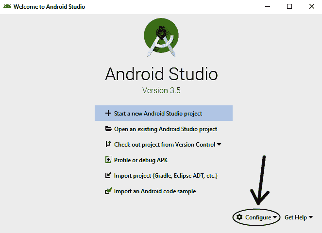

2.  点击弹出菜单中的 SDK 管理器按钮，打开 Android SDK 管理器。
3.  确保您至少安装了一个高于 API 级别 16 的 Android API 级别，以及 Google USB 驱动程序(您需要此驱动程序才能在硬件上进行调试)。
4.  退出 Android Studio。

接下来，让我们看看**Android Debug Bridge**(**ADP**)-将可执行文件传输到 Android 设备并支持设备上调试的软件组件-是否正常工作。 启动 shell 提示符并键入`adb`。 如果您看到大量输出且没有错误，则网桥安装正确。 如果没有，请返回并检查您的`PATH`变量以确保它是正确的。

同时，你也应该让你的 Android 设备支持开发者，这样它就可以和 ADB 一起工作了。 按照[http://bit.ly/1a29sal](http://bit.ly/1a29sal)提供的步骤操作。

让我们进入下一节，开始配置我们的 Qt Creator。

# 配置 Qt 创建器

现在，是时候告诉 Qt Creator 您刚刚安装的所有东西了。 执行以下步骤：

1.  启动 Qt Creator，但不创建新项目。
2.  在 Tools(工具)菜单下，选择 Options(选项)，然后点击 Devices(设备)和 Android(安卓)。
3.  填空，如下一个屏幕截图所示。 它们应该设置如下：
    *   SDK 目录的路径，在您安装 Android SDK 的目录中
    *   安装 Android NDK 的路径
    *   选中自动为 Android 工具链创建工具包
    *   安装 JDK 的目录(可能会自动从您的`JAVA_HOME`目录中获取)，如以下屏幕截图所示：

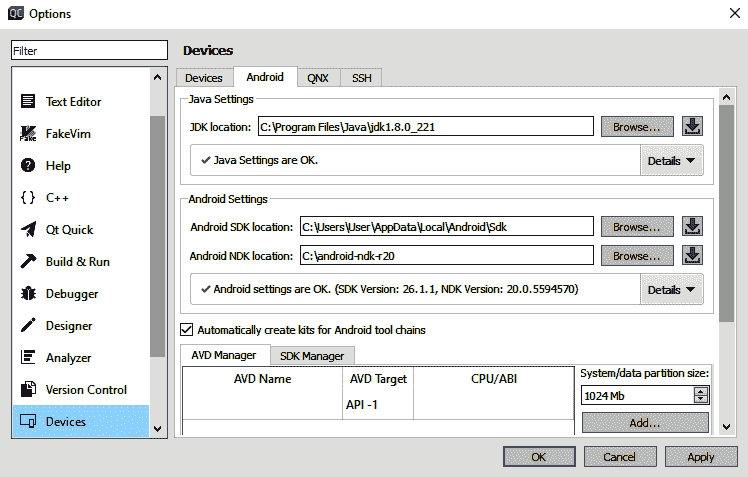

4.  单击确定关闭选项窗口。

您现在应该能够为 Android 创建一个新的 Qt GUI 或 Qt Quick 应用了！ 这样做，并确保 Android 是向导中的目标选项，如下一个屏幕截图所示；确保至少为您的桌面环境选择一个 ARM 目标、一个 x86 目标和一个目标：

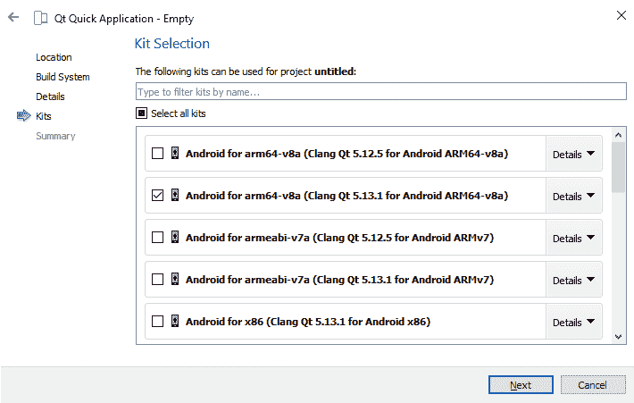

如果您想要将 Android 构建配置添加到现有项目中，则过程略有不同。 执行以下步骤：

1.  像往常一样加载项目。
2.  单击左侧窗格中的项目。 项目窗格将打开。
3.  在 Build&Run(构建和运行)选项下点击所需的 Android(或其他)设备构建工具包，它将为您的项目启用。

下面的屏幕截图显示了项目按钮和构建和运行选项在 Qt Creator 中的位置：

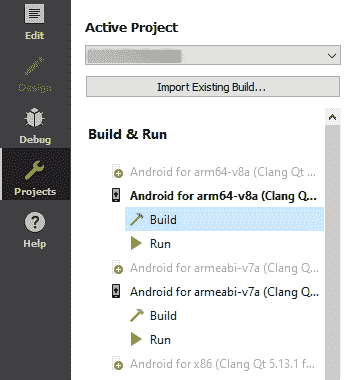

接下来，我们将继续学习如何构建和运行我们的 Android 应用。

# 构建和运行您的应用

正常编写和构建您的应用。 一个好主意是，在您进城进行大量更改之前，首先为 Android 构建 Qt Quick`Hello World`应用，然后通过为该设备编译来测试环境。 当您准备好在设备上运行时，请执行以下步骤：

1.  导航到项目(在左侧)，然后选择 Android for ARM 工具包的 Run Settings。
2.  在 Package Configurations 下，确保 Android SDK 级别设置为您安装的 SDK 级别。
3.  确保包名称类似于`org.qtproject.example`，后跟您的项目名称。
4.  使用 USB 电缆将 Android 设备连接到计算机。
5.  选择 Android for ARM Run 目标，然后单击 Debug 或 Run 在设备上调试或运行您的应用。

就这样!。 现在我们已经为 Android 设置了 Qt Creator，并了解了如何在它上构建和运行我们的应用。 接下来，我们将了解如何部署这些应用。

除了支持 Android，Qt 还支持 iOS；未来可能还会支持其他平台。 有关 Qt 对移动平台支持的更多信息，请参阅[https://doc.qt.io/qt-5/mobiledevelopment.html](https://doc.qt.io/qt-5/mobiledevelopment.html)上的 Qt 文档。

# 将应用部署到 Android 设备

在本节中，我们将学习如何构建和部署专门用于 Android 设备的 Qt 应用。 部署到 Android 设备与桌面或 iOS 有很大不同。 在将该应用部署到 Android 设备之前，我们需要进行一些设置：

1.  让我们通过单击显示位于左侧面板上的项目的扳手图标来打开 Build and Settings(构建和设置)界面。 请确保您已经选择了其中一个 Android 工具包(例如，用于 arm64-v8a 的 Android)：

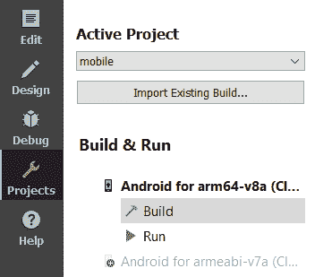

2.  之后，您将在 Build Settings 界面上看到一些可用的附加设置，称为 Build Android APK，它仅适用于 Android 平台。 您将不会在其他生成平台上看到这些设置：


让我们逐一来看一下设置：

如果您尚未生成证书，请单击 Create...(创建...)。 按钮启动该过程。 将弹出一个名为 Create a KeyStore 和证书的窗口，您必须在按下保存按钮之前填写所有信息：

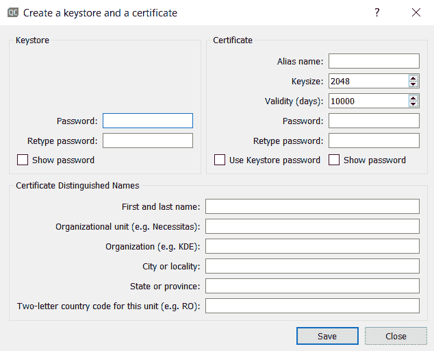

按下保存按钮后，将生成`.keystore`文件。 请确保此文件妥善保管，不要遗失。 如果你丢失了证书，你将无法再将你的应用上传到应用商店，除非你更改了你的应用的标识符，这被认为是应用商店上的新应用。

如果你只是在开发阶段测试你的应用，你不需要给它签名。 但是，如果您要将应用发布到应用商店，则必须在构建应用之前对其进行签名。

要为您的应用签名，请执行以下操作：

3.  让我们继续到下一节关于构建 Android APK 的界面。 高级操作部分下的选项大多是可选的：
    *   **构建后打开包位置**：成功构建后自动打开文件夹。
    *   **详细输出**：输出每个包含的插件缺少的依赖项列表。
    *   **使用 Ministro 服务安装 Qt**：Ministro 充当 Qt 库的中央存储库，允许 Qt 应用共享库，从而最小化您的应用大小。 不过，系统会要求用户安装 Ministro，然后才能运行您的应用。
4.  之后，您将看到“高级操作”设置下的“创建模板”按钮。 如果您以前没有生成过模板，请现在通过单击按钮进行生成：

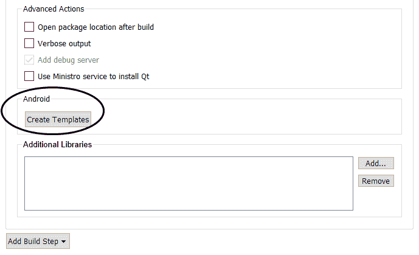

5.  通过单击创建模板，将弹出一个窗口。 保留默认设置，然后单击 Finish 按钮：

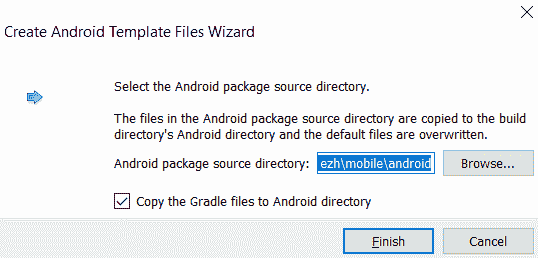

然后，将在项目目录的`android`文件夹下为您创建一组文件，如下所示：

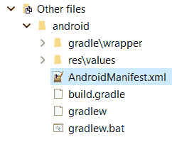

包含单词 Gradle 的文件是 Android Gradle 构建工具包的一部分，该工具包管理依赖项和构建逻辑。 它类似于桌面上的 CMake，用于定制、配置和扩展构建过程。 我们现在不需要碰这些文件。

更重要的文件是`AndroidManifest.xml`，我们需要打开并配置它：

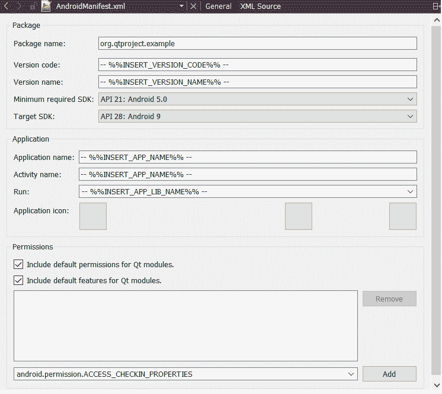

首先，在 Package 部分下，我们有以下选项：

*   包名：这是我们应用的标识符。 根据需要将其设置为类似于`com.companyname.appname`的值。 在你将应用上载到应用商店后，无法更改此设置，因为应用商店使用包名称来标识你的应用。
*   版本代码：这是您的应用的数字格式版本。 版本代码不会显示给用户，但由应用商店用来识别应用的实际构建版本。 每次将更新上载到应用商店时，此数字都必须递增。

*   版本名称：这是用户在应用商店上看到的版本标签。 你可以设置任何你想要的东西，因为应用商店不依赖它来识别版本。
*   最低 SDK 要求：这是用户设备必须支持的最低 Android SDK 版本。 如果用户的设备不符合最低要求，他们将无法安装这款应用。 请注意，如果您的应用依赖于仅在较高版本上支持的特定功能，则不能简单地将其设置为可用的最低版本。
*   目标 SDK：这是您当前用来构建 Android 应用的实际 Android SDK 版本。 如果用户的设备运行的是较高版本，则可能会警告用户可能不兼容，甚至在系统更新后，您的应用可能会自动从用户的设备中删除。

接下来，我们将介绍应用部分：

*   应用名称：应用的名称，通常显示在应用图标下。
*   活动名称：应用主要活动的名称，可以与应用名称相同。 用外行人的话说，Android 应用中的活动就像是应用中的单个进程，有自己的用户界面。 一个 Android 应用可以有许多不同的活动，这些活动可以做不同的事情。 例如，您可以触发一个从主活动捕获照片的相机活动，然后生成另一个将照片上传到服务器并显示上传进度的活动。
*   Run：这是您要运行的应用的名称。 大多数项目只有一个应用，所以我们可以只保留默认值。
*   应用图标：这是您为应用设置图标的位置。 您需要设置几种不同的大小-低 DPI、中 DPI 和高 DPI 图标。

最后，我们将查看权限部分。 除了下面解释的两个选项(顾名思义)之外，底部的巨大空间是您向 Android 应用添加权限的地方。 某些功能需要获得用户的许可才能由您的应用使用，例如获取设备位置、访问文件存储和访问摄像头。 有关安卓系统可用权限的完整列表，请访问[https://developer.android.com/reference/android/Manifest.permission](https://developer.android.com/reference/android/Manifest.permission)。 您可以通过从组合框中选择权限，然后按添加按钮来向应用添加权限。 要删除权限，请在组合框上方的权限列表中选择该权限，然后单击删除按钮。

一旦准备好了`AndroidManifest.xml`，现在就可以构建项目并生成 APK 文件了。 如果您打算将您的应用上传到应用商店，请记住对其进行签名。 要在我们的手机上运行这款应用，我们只需像往常一样点击 Run 按钮即可。 这一次，将弹出一个窗口，要求您选择要在其上运行的 Android 设备。 请确保您已使用 USB 电缆将电话连接到 PC，以便该设备将显示在此处的列表中：

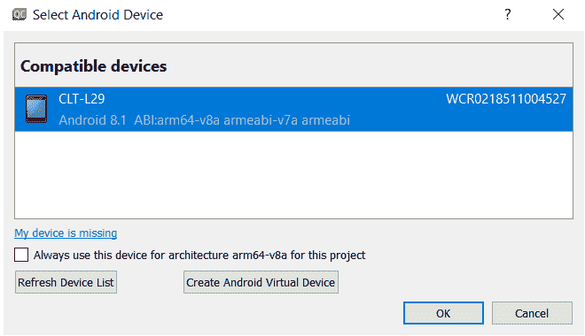

按下 OK 按钮，等待构建过程完成。 一旦该应用成功构建，Qt 将自动在您的 Android 设备上启动该应用。

请注意，您也可以在 Android 模拟器上运行您的应用，而不是在实际的物理设备上运行。 在将应用部署到 Android 仿真器之前，首先需要设置仿真器。 您可以打开 Android Studio，单击窗口右下角的配置按钮，然后选择 AVD 管理器：

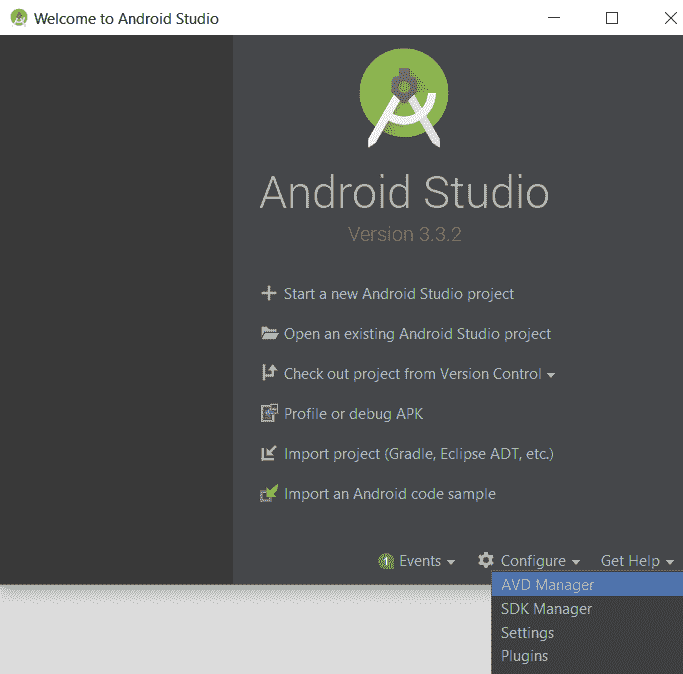

将弹出一个窗口，显示可供部署的仿真器(Android 虚拟设备)列表。 默认情况下，您应该看到一个空列表。 您可以通过按 Create Virtual Device...(创建虚拟设备...)来创建新的仿真器。 位于窗口左下角的按钮：


之后，选择要模拟的设备类别(即电话)，选择设备型号，然后单击下一步：


然后，为您的模拟器选择 Android 版本。 如果您的计算机还没有 Android 镜像，请单击 Android 版本名称旁边的下载链接。 下载后，您可以选择版本并单击下一步：

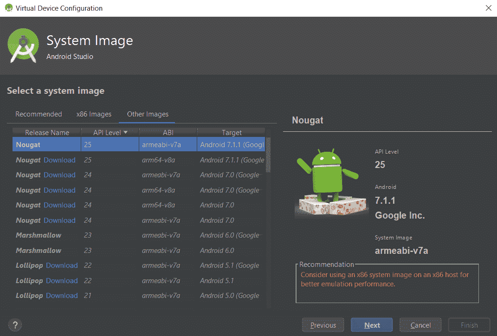

最后，为您的模拟器命名，设置其启动方向，然后单击 Finish：

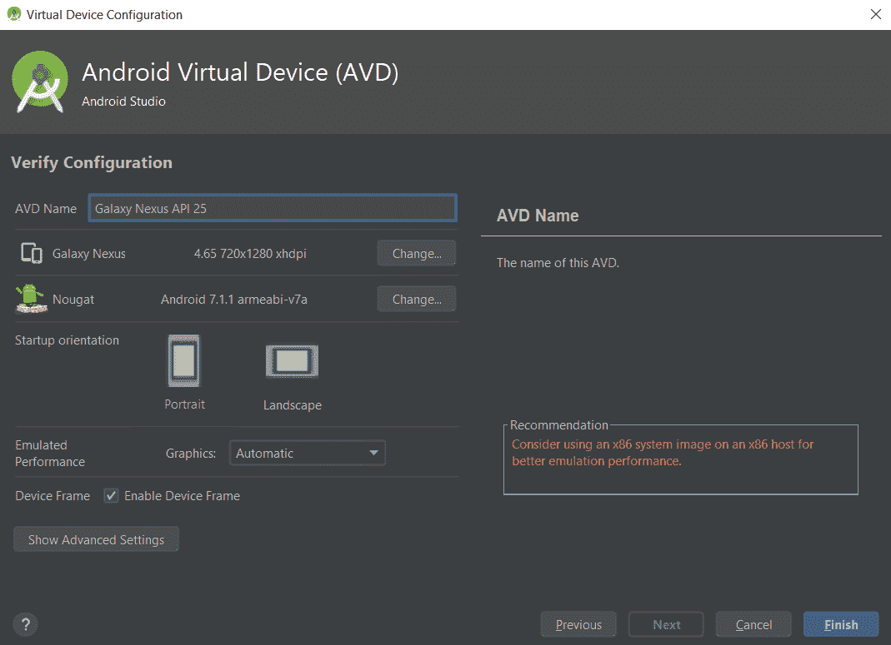

一旦设置了仿真器，您就可以测试运行仿真器并查看它的运行情况：


设置仿真器后，当您从 Qt Creator 运行 Android 应用时，该仿真器将出现在设备列表中：

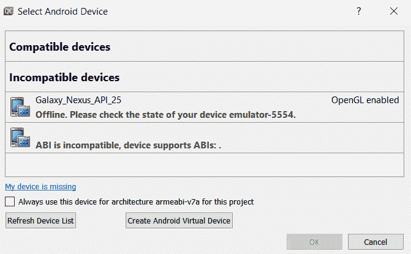

请注意，Android 模拟器速度非常慢，不推荐用于关键产品。 使用实际的物理设备仍然是应用开发的最佳方式，无论是 Android 还是 iOS。

在本节中，我们了解了如何设置 Qt 应用并将其部署到 Android 设备。 接下来，我们将学习如何在 iOS 和 Android 应用中实现原生功能，以更好地支持功能。

# 为 iOS 设置 Qt Creator

使用 Qt 开发 Android 和 iOS 之间的一个主要区别是，你根本不能在 Qt Creator 上构建和运行 iOS 应用，因为这是苹果不允许的。 因此，Qt Creator 只能用于开发应用和生成 Xcode 文件。 Xcode 是适用于所有 Apple 平台(包括 iOS)的*事实上的*编程工具和编译器。 一旦 Qt Creator 生成了所需的 Xcode 文件，您就必须在 Xcode 上完成其余的工作。

让我们来看看如何为 iOS 开发设置我们的 Qt Creator。

首先，当您创建一个新项目时，您将看到许多不同的工具包可供您使用。 带有单词 clang 的工具包是为 MacOS 开发的，在部署到 iOS 模拟器或设备之前，你也可以用它来测试你的应用的 GUI。 关键字为 iOS 的工具包用于部署到物理 iOS 设备(iPhone 或 iPad)，而关键字为的工具包用于部署到随 Xcode 安装一起提供的 iOS 模拟器：

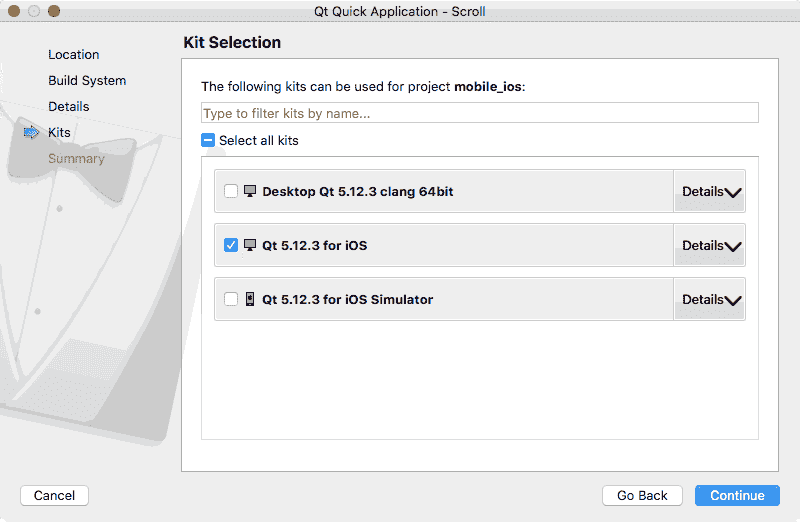

因为你不能为 Qt Creator 构建和运行你的 iOS 应用，所以你只能通过构建|运行 qmake 来生成它的 Xcode 文件。 这将在您的 Build 文件夹中生成以下文件：

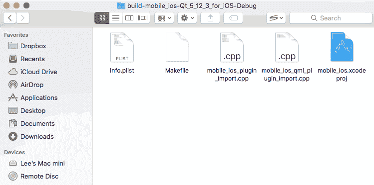

每次运行 qmake 时，它都会生成 make 文件、Xcode 项目文件、用于配置的 plist 文件以及一些用于链接 Qt 插件的 CPP 文件。 请注意，每次在这里，qmake 都会替换任何现有的文件，所以最好不要直接编辑这些文件，因为您所做的任何更改都将在下一次运行后消失。 但是，您可以通过将数据写入项目文件(`.pro`)来告诉 qmake 在生成这些文件时要替换哪些数据。 例如，请考虑以下内容：

```cpp
ios {
    QMAKE_TARGET_BUNDLE_PREFIX = com.mycompany
    QMAKE_BUNDLE = myapp
    QMAKE_INFO_PLIST = ios/Info.plist
}
```

如您所见，我已经在一个`ios`宏中添加了代码，这样如果我们不是为 iOS 构建项目，它将被忽略。 首先，我们将应用的包前缀设置为`com.mycompany`，然后将包名称设置为`myapp`。 这将导致`com.mycompany.myapp`作为完整的捆绑包名称。 然后，我们复制由 qmake 生成的`Info.plist`文件，并将其放入项目目录内的`ios`文件夹(如果该文件夹不存在，则创建一个)。 然后，我们告诉 qmake 将特定的`Info.plist`文件复制到 build 目录，而不是生成一个全新的文件。 这样，我们所做的任何更改也将被复制。

就这样。 让我们进入下一个主题，了解如何通过支持原生功能来改善对 iOS 和 Android 应用的支持。

# 改进对 iOS 和 Android 应用的支持

Qt 不仅使得在 iOS 和 Android 上编译和部署应用变得容易，而且它还通过 Java(Android)和 Objective C++(IOS)编码支持原生功能。 在接下来的几节中，我们将同时研究这两个问题。

# 从 Qt 调用 Android 函数

要从 Qt 调用 Android 函数，需要执行以下几个步骤：

1.  创建一个空的 Qt Quick 项目，我们已经做过无数次了。
2.  打开项目文件(`.pro`)，将以下`androidextras`模块添加到项目中：

```cpp
QT += quick
android: QT += androidextras
CONFIG += c++ 11
```

3.  通过单击 Create Template 按钮创建`AndroidManifest.xml`和其他重要的 Android 文件，我们在前面的*将应用部署到 Android 设备的*一节中了解了这一点。
4.  然后，在您的 Qt 项目目录中创建一个`MyToast.java`文件，并使用 Qt Creator 将其打开。 您必须将其放置在存储`AndroidManifest.xml`的 Android 文件夹中，并确保文件夹结构如以下屏幕截图所示，否则，您将无法在后面的步骤中从代码中调用它：


5.  之后，重新打开我们的项目文件(`.pro`)，并添加以下文本以告诉 Qt 在目录中查找 Java 源代码：

```cpp
contains(ANDROID_TARGET_ARCH,arm64-v8a) {
    ANDROID_PACKAGE_SOURCE_DIR = \
    $$PWD/android
    ANDROID_JAVA_SOURCES.path = $$PWD/android/src/org
      /qtproject/example
 INSTALLS += ANDROID_JAVA_SOURCES
}
```

`MyToast.java`的代码非常简单。 当调用`notify`函数时，我们只需在 Toast 小部件上显示一行消息：

```cpp
package org.qtproject.example;

import android.content.Context;
import android.widget.Toast;

public class MyToast extends org.qtproject.qt5.android.bindings.QtActivity
{
    public MyToast() {}
    public static void notify(Context context, String message)
    {
        int duration = Toast.LENGTH_SHORT;
        Toast toast = Toast.makeText(context, message, duration);
        toast.show();
    }
}
```

完成后，创建一个名为`MyToast`的 C++ 类，并包含`QObject`作为其父类。 头文件`mytoast.h`如下所示：

```cpp
#ifndef MYTOAST_H
#define MYTOAST_H

#include <QObject>
#ifdef Q_OS_ANDROID
  #include <QtAndroidExtras>
  #include <QAndroidJniObject>
#endif

class MyToast : public QObject
{
    Q_OBJECT
public:
    explicit MyToast(QObject *parent = nullptr);
    Q_INVOKABLE void callToast(QString message);
};
#endif // MYTOAST_H
```

在前面的代码中，如果我们通过检查`Q_OS_ANDROID`宏来编译 Android 平台的项目，那么我们只包含`QtAndroidExtras`和`QAndroidJniObject`头。 这将防止在为其他平台(如 Windows 或 iOS)编译项目时出现编译错误。 然后，我们使用`Q_INVOKABLE`宏声明一个`callToast`函数，以便稍后可以从 QML 调用它。

下面的`mytoast.cpp`源文件看起来也非常简单，您可以在这里看到：

```cpp
#include "mytoast.h"

MyToast::MyToast(QObject *parent) : QObject(parent) {}

void MyToast::callToast(QString message)
{
    #ifdef Q_OS_ANDROID
    QtAndroid::runOnAndroidThread([=]
    {
        QAndroidJniObject::callStaticMethod<void>
          ("org/qtproject/example/MyToast",
            "notify", "(Landroid/content/Context;Ljava/lang/String;)V",
            QtAndroid::androidActivity().object(),
            QAndroidJniObject::fromString(message).object<jstring>());
    });
    #endif
}
```

在前面的代码中，我们实现了`callToast`函数，该函数通过`QAndroidJniObject`类触发 Java`notify`函数。 `QAndroidJniObject`类为我们提供了`callStaticMethod`函数，该函数可用于调用静态的 Java 本机函数。 我们在 Java 代码中声明了静态函数，因为静态函数不属于类的实例，而是类本身，类的所有实例都可以访问它，因此我们更容易以这种跨语言的方式实现。

这个特定的`callStaticMethod`不需要返回，因此我们将其放在函数名后面。 至于函数输入，第一个变量是我们要查找的 Java 类，它是`org/qtproject/example/MyToast`，我们要调用的函数名是`notify`。

然后，我们告诉 Java 函数应该从输入变量获得什么数据类型，第一个变量是`android/content/Contact`，后面是`java/lang/String`。 末尾的`V`是返回变量的数据类型，在本例中为`void`。 之后，我们提交`notify`函数所需的变量，第一个变量是我们应用的上下文，第二个变量是我们希望在 Toast 小部件上显示的消息。

请注意，我们在 Android 线程中运行整个代码块，而不是在 Qt 线程中运行，因为 Toast 小部件是 Android UI 的一部分。 我们调用了`QtAndroid::runOnAndroidThread`并在 lambda 函数中运行了`notify`函数，这意味着只有在切换回 Android 线程之后才会调用`notify`。

一旦您理解了前面的代码，让我们继续打开`main.cpp`。 这里我们要做的第一件事是包括`mytoast.h`和`QQmlContext`标头：

```cpp
#include <QQmlContext>
#include "mytoast.h"
```

然后，我们将`MyToast`类注册为自声明的`MyLib 1.o`库下的 QML 类型。 您将在后面的步骤中看到这是如何实现的：

```cpp
QCoreApplication::setAttribute(Qt::AA_EnableHighDpiScaling);
QGuiApplication app(argc, argv);
QQmlApplicationEngine engine;

QQmlContext *context = engine.rootContext();
qmlRegisterType<MyToast>("MyLib", 1, 0, "MyToast");
```

之后，我们想要在点击屏幕时调用`callToast`函数。 因此，让我们打开`main.qml`并导入我们在上一步中声明的`MyLib 1.0`库：

```cpp
import QtQuick 2.12
import QtQuick.Window 2.12

import MyLib 1.0
```

一旦我们导入库，我们现在就可以访问`MyToast`QML 类型。 让我们在 QML 代码中创建一个，并将其命名为`toast`：

```cpp
Window {
    visible: true
    width: 640
    height: 480
    title: qsTr("Hello World")

 MyToast {
 id: toast
 }
```

之后，为我们创建一个`MouseArea`对象来显示祝酒词消息。 然后，当触发`onClicked`事件时，我们调用`toast.callToast`：

```cpp
    MouseArea {
        anchors.fill: parent
        onClicked: toast.callToast("My message here. Hello World!")
    }
}
```

就这样!。 让我们构建该应用并将其部署到您的 Android 设备上。 它在启动时看起来空空如也，但如果你点击屏幕，神奇的事情就会发生：


尽管 Qt 不支持一些原生 Android 特性，比如 Toast 小部件，但我们仍然可以通过 Java 自己实现它，并将其连接到我们的 Qt 代码。 这真是太棒了，让 Qt 成为一个非常强大的开发平台。

# 从 Qt 调用 IOS 函数

调用 iOS 函数与我们为 Android 调用的函数有很大不同。 第一个区别是 iOS 的编程语言，它是 Objective C++(带“加号”)，而不是 Java。 为了让我们在 Qt 项目中集成 iOS 函数，我们不能对将集成到 Qt 项目中的类使用通常的 Objective C 语言。 取而代之的是目标 C++ 语言，它在 MacOS 和 iOS 环境下与 C++ 兼容。 其次，没有像 Android 那样的**iOS Extras**模块。 这是因为 Objective C++ 与 C++ 兼容，因此我们只需在 Objective C++ 中创建一个`trampoline`参数函数并直接调用它，进而触发您想要调用的本机 iOS 函数。

让我们用一个简单的例子来尝试一下。 首先，在 Qt 项目中创建一个名为`MyClass`的新类，并将`.cpp`文件的扩展名更改为`.mm`，这将告诉 Apple 编译器 Xcode 这是一个目标 C++ 源文件(使用目标 C 的`.m`扩展名)。 只有`.mm`扩展允许您在同一源文件中混合使用 Objective C 代码和您的 C++ 代码，这就是它被称为 Objective C++ 的原因。

然后，打开您的 Qt 项目文件(`.pro`)，并确保只有在为 iOS 平台编译时这两个文件才会包含在您的项目中。 这是因为其他平台无法识别 Objective C++，在编译过程中会给您带来大量错误：

```cpp
ios {
    HEADERS += ios/MyClass.h
    SOURCES += ios/MyClass.mm
}
```

之后，打开`MyClass.h`，将`doSomethingT`功能添加到您的文件中：

```cpp
#ifndef MYCLASS_H
#define MYCLASS_H
#include <QObject>

class MyClass : public QObject
{
    Q_OBJECT

    public:
        MyClass(QObject *parent = NULL);
 void doSomethingT(QString arg1, QString arg2);

    private:
};

#endif
```

正如您从前面的代码中看到的，它看起来与我们的普通 C++ Qt 代码一样。 我们将函数命名为`doSomethingT`，在函数名的末尾加上大写的`T`，这样我们就可以记住这只是一个蹦床函数。 然后，在`MyClass.mm`文件中，我们实现了我们的`MyClass`函数，该函数看起来与我们的普通 C++ 代码略有不同：

```cpp
#import <Foundation/Foundation.h>
#include "MyClass.h"

@interface MyObject : NSObject
{
    - (void) doSomething:(NSString*)arg1 :(NSString*)arg2
}
@end

@implementation MyObject
- (void) doSomething:(NSString*)arg1 :(NSString*)arg2
{
    NSLog(@"The actual doSomething function being called!");
}
@end

MyClass::MyClass(QObject *parent) : QObject(parent) {}

void MyClass::doSomethingT(QString arg1, QString arg2)
{
    [[MyObject alloc] doSomething:arg1.toNSString() 
      :arg2.toNSString()];
    qDebug() << "Doing something:" << arg1 << ", " << arg2;
}
```

如果您不熟悉 Objective C 语法，最初在这里看起来可能有点奇怪。 我有意在前两行中同时使用了`#import`和`#include`，以向您展示您可以在一个完整的`.mm`源文件中将目标 C 和 C++ 代码混合在一起。 然后，我们创建一个名为`MyObject`的目标 C 类，它携带实际的`doSomething`函数。 我们首先在关键字`@interface`和`@end`之间声明类及其函数，然后在关键字`@implementation`和`@end`之间实现类及其函数。 `doSomething`函数接受两个`NSString`变量，即`arg1`和`arg2`，这与`doSomethingT`函数类似。

之后，我们继续编写代码，但这一次是用 C++。 我们实现了我们的`MyClass`类和`doSomethingT`蹦床函数。 在`doSomethingT`函数中，我们初始化了目标 C`MyObject`类，并在这里调用了实际的`doSomething`代码。 幸运的是，Qt 在`QString`类下为我们提供了一个`toNSString()`函数，这使得数据类型转换变得无缝。 我们还使用了`qDebug`函数来确保成功调用了这个蹦床函数。 在`doSomething`函数中，我们使用了`NSLog`函数打印出一条调试消息，以确保它被成功调用。

为了更好地理解这里讨论的整个过程，让我们看一下下图，以总结所有内容：


我们使用了驻留在 C++ `MyClass`类中的`doSomethingT`蹦床函数来调用`MyObject`类中的实际目标 C 函数：`doSomething`。 然后，`doSomething`函数基本上可以用来调用您喜欢的任何其他本机 IOS 函数。 换句话说，我们通过一个简单的蹦床函数在两个不同的领域之间跳跃，并且充分利用了 Objective C++ 允许我们做的事情。

就这样。

在本节中，我们了解了如何从 C++ 源代码调用 IOS 函数。 这使得 Qt 成为一个真正强大的开发平台，因为我们现在可以将我们的应用部署到不同的平台，而无需创建不同的项目集。 取而代之的是，我们只使用一个 Qt 项目来管理所有这些项目。

# 简略的 / 概括的 / 简易判罪的 / 简易的

Qt for Android 为你在移动开发方面提供了极好的帮助，但它并不是万能的。 如果您计划以移动设备为目标，则应该确保很好地了解应用用户的使用模式，以及移动应用必须在其上运行的 CPU、GPU、内存和网络方面的限制。

然而，一旦我们理解了这些，我们使用 Qt Creator 和 Qt 的所有技能就会延续到移动领域。 要为 Android 进行开发，首先要安装 JDK、Android Studio、Android NDK，然后像往常一样开发应用：为设备编译并频繁地在设备上运行，以解决在此过程中出现的任何意想不到的问题。

在我们的最后一章中，我们将了解 Qt Creator 和 Qt 中的一些零碎内容，这将使软件开发变得更加容易。