# 十四、QT 提示和技巧

在前面的章节中，我们讨论了 Qt 对于软件开发的伟大之处：如何编辑、编译和调试应用；如何分析它们的执行和内存性能；如何针对世界不同地区本地化它们；以及如何制作在 Android 手机和平板电脑上运行的移动应用。

在本章中，我们将讨论在使用 Qt Creator 和 Qt 时应该知道的一些提示和技巧，它们会让您像专业人士一样编写软件。

我们将在本章介绍以下主题：

*   使用 Qt Creator 编写控制台应用
*   与版本控制系统集成
*   配置编码样式和编码格式选项
*   将新主题应用于 Qt Creator
*   设置 Qt 快速窗口显示选项
*   从 CMake 和命令行生成项目
*   同时运行多个调试器
*   了解有关 Qt 的更多信息

# 技术要求

本章的技术要求包括 Qt 5.12.3、MinGW 64 位、Qt Creator 4.9.0 和 Windows 10。

# 使用 Qt Creator 编写控制台应用

还记得[第 1 章](01.html)中的`Hello World`，*Qt Creator 入门*吗？ 这是一个控制台应用--几乎是您所能编写的最简单的控制台应用。 让我们回顾一下代码：我们创建了一个新的 Qt 控制台应用，并在`main.cpp`中编写了以下代码行：

```cpp
#include <QCoreApplication> 
#include <iostream> 

using namespace std; 

int main(int argc, char *argv[]) 
{ 
    QCoreApplication a(argc, argv); 

    cout << "Hello world!"; 

    return a.exec(); 
} 
```

任何有效的 C++文件在 Qt 应用中都是有效的，包括**标准模板库**(**STL**)代码。 如果您需要用 C++编写一个小工具，并且还没有学到很多关于 Qt 的知识--您知道的关于 C++(如果您愿意，甚至可以使用 C)的所有内容都可以在 Qt Creator 中访问，那么这就特别方便了。

尽管 Qt 是最广为人知的 GUI 工具包，但值得一提的是，Qt Core 库是每个 Qt 应用(包括 Qt 控制台应用)的一部分，它包含大量实用程序和模板类，包括：

*   集合类，包括`QList`、`QVector`、`QStack`和`QQueue`，用于保存列表和向量以及用于后进先出和先进先出数据存储
*   字典类(也称为**哈希表**)，包括`QMap`和`QHash`

*   具有`QFile`和`QDir`的跨平台文件的 I/O
*   `QString`支持 Unicode 字符串

为什么要选择 Qt 的类，而不是普通的 C++提供的类？ 原因有几个：

*   **内存性能**：与 STL 集合不同，Qt 集合是基于引用的，并使用写入时复制来节省内存。 Qt 集合通常比其对应的 STL 集合占用更少的内存。
*   **Iteration**：迭代 Qt 集合是安全的，有保护的访问以防止您走出集合的末尾。
*   **可读性**：在整个应用中使用 Qt 代码和库可以提供统一的外观，从而使代码更易于维护。
*   **可移植性**：在某些可用 Qt 的嵌入式平台上，STL 可能不存在。 然而，这几乎不是第一次编写 Qt 时的问题。

值得注意的是，Qt 的集合通常比 STL 对应的集合稍微慢一些。 在使用 Qt 类处理数据时，您通常会牺牲内存性能来换取速度。 然而，在实践中，这很少是问题。

`QFile`和`QDir`类值得特别提及，因为有一件事-可移植性。 即使是目录分隔符也是以可移植的方式处理的；无论您是在 MacOS、Linux 还是 Windows 上运行，目录始终由单个`/`分隔，这使得以与平台无关的方式编写代码并确保其在所有平台上运行都很容易。 在幕后，Qt 转换目录字符串，以便在访问文件时使用特定于平台的目录分隔符。

接下来，我们将学习如何将我们的 Qt Creator 与版本控制系统集成。

# Qt Creator 与版本控制系统的集成

几乎所有的大型项目都需要某种版本控制来协调不同用户对同一文件所做的更改，并确保源代码库的更改和谐进行。 即使是单个开发人员也可以从使用版本控制中受益，因为版本控制提供了开发人员编辑的每个文件中更改内容的记录，并提供了一段时间以来项目的宝贵历史记录。 Qt Creator 支持以下版本控制系统：

*   Bazaar(Qt Creator 2.2 版及更高版本支持)
*   绒毛膜绒毛取样
*   讨厌的人 / 卑鄙的人 / 饭桶
*   Mercurial(Qt Creator 2.0 版及更高版本支持)
*   PERFORCE(支持 PERFORCE 服务器版本 2006.1 和更高版本)
*   颠覆

除了这些，Qt Creator 还支持一些商业版本控制托管服务，包括：

*   GitHub
*   GitLab

您需要做的第一件事是为您的项目设置一些版本控制软件。 如何做到这一点取决于您选择的版本控制系统(例如，它可能由您的组织规定，或者您可能对过去的项目有个人偏好)，并且会因系统而异。 因此，我们不会在这里深入讨论。 但是，您需要有一个存储库来存储源代码的版本，并在您的工作站上安装相应的版本控制软件，并在系统的`PATH`变量中包含版本控制二进制文件的相应目录，以便 Qt Creator 可以找到它们。 重要的是，您能够从系统的 Shell(如 PowerShell 或本地终端提示符)访问版本控制命令，因为 Qt Creator 以相同的方式访问它们。

完成此操作后，您可以通过导航到 Tools|Options...来配置 Qt Creator 与版本控制的交互方式。 |版本控制。 以下屏幕截图显示了此窗口：

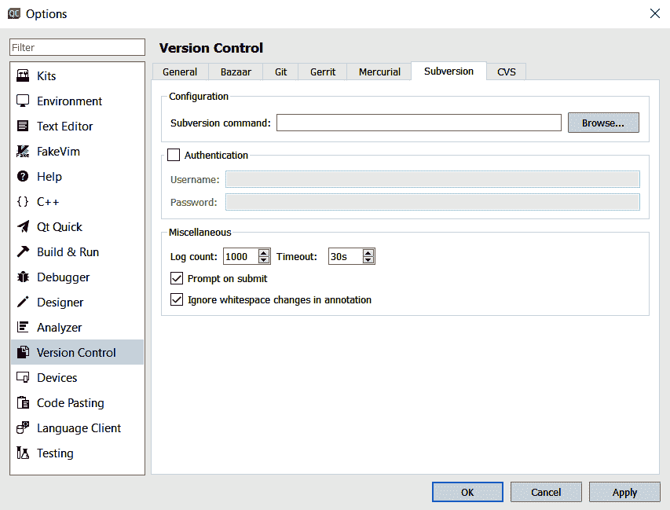

有适用于您正在使用的任何版本控制系统的通用配置选项，然后还有针对 Qt 支持的每种版本控制风格的特定选项。 以下是常规选项：

*   可在任何提交邮件上运行以确保邮件格式正确或包含正确信息的脚本
*   源代码控制系统的名称和别名列表
*   要包括在每封提交邮件中的字段列表
*   在使用 SSH 访问版本控制系统时，用于提示您输入 SSH 密码的 SSH 提示符命令

一些版本控制系统，如 Git 和 Mercurial，支持本地版本控制存储库。 如果您单独执行开发项目，并且只需要一个地方来备份您的更改(当然，请记住也要备份源代码存储库目录)，这将非常方便。 如果您使用的是其中一个系统，则可以使用 Qt 直接创建本地存储库目录，方法是选择 Tools(工具)下的 Create Repository(创建存储库)，或者转到 File|New File(新建文件)或 Project(项目)，然后转到最后一个项目管理页面。 当然，要做到这一点，您需要先安装版本控制软件。

You can find out more about how Qt Creator integrates with version control systems by taking a look at the Qt documentation at [https://doc.qt.io/qtcreator/creator-version-control.html](https://doc.qt.io/qtcreator/creator-version-control.html).

如果安装和配置版本控制系统，则此系统提供的各种命令将添加到 Qt Creator 的工具菜单的子菜单中。 从那里，您可以执行以下步骤：

*   导航到窗口|输出窗格|版本控制，查看版本控制命令输出。
*   从您的版本控制系统中查看不同的输出(两个同名不同版本的文件之间的比较)，使您可以看到您正在编辑的文件中与存储库中的文件相比发生了哪些更改。
*   通过选择日志或文件日志，查看受版本控制的文件的 ChangeLog。
*   通过选择提交或提交将文件更改提交到系统。
*   通过选择还原将更改还原到文件。
*   单击 Update，使用版本控制系统的当前内容更新您的工作目录。
*   使用附加的按版本控制命令来支持分支、存储和远程存储库。

If you're just starting out and need to choose a version control system, perhaps the best thing to do is to look at the comparison of various systems on Wikipedia, at [http://en.wikipedia.org/wiki/Comparison_of_revision_control_software](http://en.wikipedia.org/wiki/Comparison_of_revision_control_software), and get familiar with one. Personally, I prefer Git for my work, using both local repositories and hosted repositories such as GitHub. It's free, fast, has good support for branching, and is well supported by Qt Creator.

接下来，我们将介绍如何为您的版本控制系统设置第三方托管服务，如 GitHub 和 GitLab。 实际上，这些服务非常简单。 您可以通过 Git 登录到这些服务，就像您的自托管存储库一样。

# 设置您的 GitHub 存储库

首先，如果你还没有 GitHub 账户，那就注册一个。 注册页面位于网站首页，地址为[https://github.com](https://github.com)。 然后，完成注册过程后，单击位于右上角的个人资料图片，然后单击下拉菜单上的 Your Repositories(您的存储库)选项：

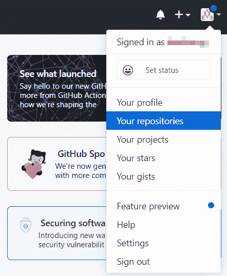

在那里，您将看到绿色的 New 按钮。 按 New 按钮为您的项目创建一个新的 GitHub 存储库。 然后，系统将指示您创建一个新的存储库页面，在该页面中，您可以通过在所有者下拉框旁边插入存储库名称来创建新的存储库：


之后，您可以通过选中其中一个选项来设置项目是公共项目还是私人项目。 然后，选中 Initialize this pository with a readme 选项，因为您正在创建一个全新的存储库。 GitHub 创建的`README`文件将成为存储库的首页。

您还可以设置`.gitignore`选项，该选项告诉 GitHub 忽略一些作为临时文件或用户特定文件的文件，例如`make`文件和用户的项目设置文件(`.pro.user`)。 在本例中选择 Qt 选项，因为我们在本书中开发的是 Qt 项目。 您还可以通过选择 Add a License 下拉框中的一个选项将许可证添加到您的项目中：


单击创建存储库按钮后，您将进入以下页面：


这些命令可用于将项目链接到 GitHub。 不过，您也可以在 Qt Creator 中执行此操作。 转到工具|Git|创建存储库...，然后选择您的项目文件夹并单击选择文件夹。 这将创建一个在您的 PC 上运行的本地存储库。 Git 系统能够链接到两个存储库-一个本地存储库和一个远程存储库。 您必须先将代码提交到本地存储库，然后才能将其推送到远程服务器。

现在您已经创建了本地存储库，让我们继续远程存储库：

1.  转到工具|Git|远程存储库|管理远程....。 将打开一个窗口，其中显示您已连接到的当前远程服务器，该窗口目前为空。
2.  单击 Add...(添加...)。 按钮，并将您的 GitHub URL 添加到远程列表中。 URL 可以在快速设置网页上找到，如上一个屏幕截图所示。
3.  一旦您链接了 GitHub 帐户，您就可以尝试并单击 FETCH 或按钮来验证连接：

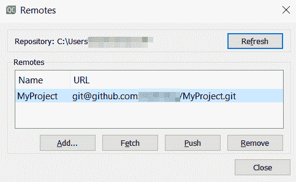

如果 SSH 链接无法工作，您也可以通过单击快速设置网页上的 HTTPS 按钮切换到 HTTPS 链接。

要将代码提交到本地存储库，只需转到工具|Git|本地存储库|提交...。 Qt Creator 上将出现一个窗口，如下所示：

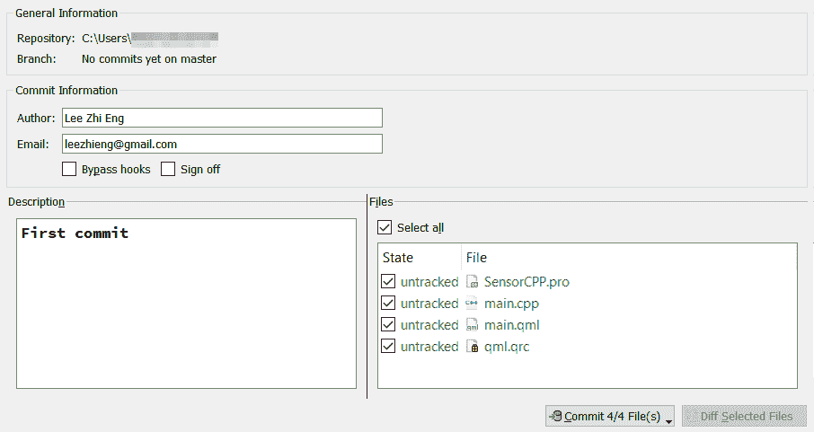

选择要提交的文件，键入描述，然后单击提交按钮。 在此之后，您可以继续将代码推送到 GitHub 存储库。 如果转到工具|Git|远程存储库|推送，您可能会看到如下错误：

```cpp
fatal: No configured push destination.
Either specify the URL from the command-line or configure a remote repository using

    git remote add <name> <url>

and then push using the remote name

    git push <name>

The command "C:\Program Files\Git\cmd\git.exe" terminated with exit code 128.
```

这是因为 Git 不知道默认推送到哪台远程服务器，Qt Creator 中也没有解决方案，所以需要使用`git`命令来实现：

```cpp
git push -u "resp" master
```

这里，`resp`是您的存储库名称，`master`是存储库的主分支。

或者，您也可以在每次要推送项目时使用**Git Gui**工具。 转到工具|Git|Git Tools(Git 工具)|Git Gui(Git 图形用户界面)。 将出现如下所示的窗口：

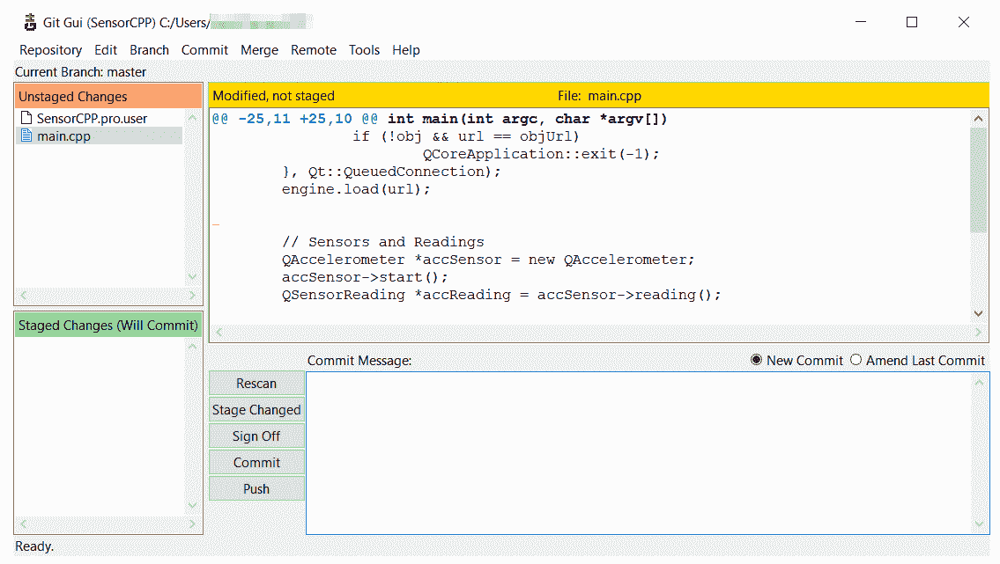

你也可以在这里做出承诺和推送。 如果您进入远程推流|推流，会弹出一个窗口，您可以在该窗口中选择您要推送到的远程服务器：

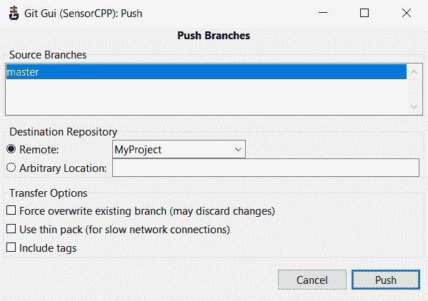

单击按钮后，您将看到如下成功状态：


在本节中，我们了解了如何将 Qt Creator 链接到 GitHub 帐户。 接下来，我们将看看如何为 GitLab 做同样的事情。

# 设置 GitLab 存储库

GitLab 实际上与 GitHub 大同小异。 要创建帐户，请转到[http://gitlab.com](http://gitlab.com)，然后单击右上角的注册按钮。 创建帐户并登录 GitLab 后，您将看到以下屏幕：

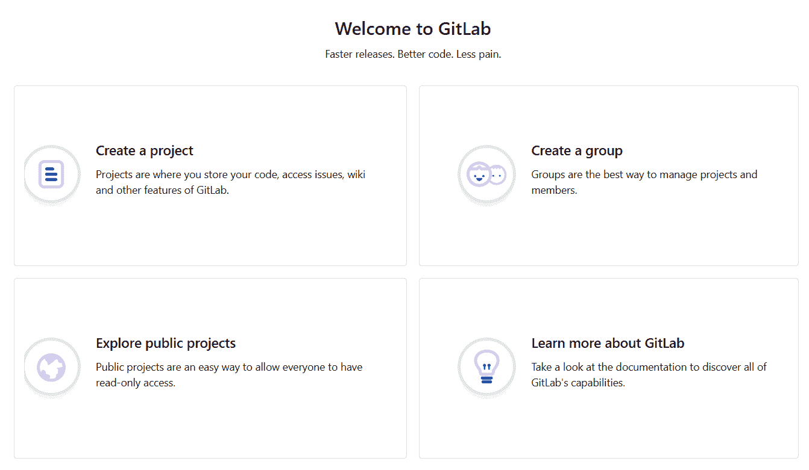

单击 Create a project 按钮，它将带您进入新的项目页面。 与 GitHub 类似，您需要填写项目名称和有关项目的其他信息：


完成后，单击 Create Project 按钮以完成该过程。 要获取 URL，请从顶部面板转到 Project 页面，然后单击您的存储库。 之后，点击 Clone 按钮，URL 将出现在弹出的面板上：

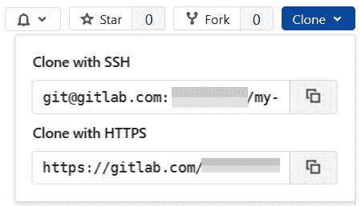

之后，您可以按照 GitHub 示例中的步骤将 URL 应用到您的 Qt Creator。

接下来，我们将了解如何在 Qt Creator 中配置编码样式和编码格式。

# 配置编码样式和编码格式选项

代码的可读性至关重要，而 Qt Creator 的默认编码风格是大多数人认为非常易读的样式。 但是，您可能正在使用不同的编码指导原则，或者您可能只是发现您无法忍受 Qt Creator 编辑器如何处理代码格式化的特定方面；可能是方括号的位置或 Switch 语句的格式化方式。 幸运的是，Qt Creator 具有极强的可配置性。 转到工具|选项...。 |C++并配置 Qt Creator 如何格式化您的代码，如下图所示：


Basic 对话框允许您选择流行的格式样式，例如 Qt 的默认格式或大多数 GNU 代码使用的格式。 您还可以单击 Edit...，这将打开代码样式编辑器，您可以在下一个屏幕截图中看到：

<q></q>

您需要首先复制内置样式并根据您的喜好对其进行编辑；从编辑代码样式对话框中，您可以选择制表符是空格还是制表符、每个制表位的空格数以及如何处理行连续。 每个窗格允许您调整代码格式的特定方面，如下所示：

*   内容窗格允许您调整类主体的格式，包括公共声明、受保护声明和私有声明的间距。
*   “花括号”窗格允许您控制与花括号相关的格式设置。
*   “Switch”窗格允许您控制`switch`和`case`语句的格式。
*   “对齐”窗格允许您控制代码如何在连续行之间对齐。
*   “指针”窗格允许您控制指针声明周围的间距。

人们很容易为所有这些选项而疯狂，但我劝你不要这么做；乍看起来不错的东西，当你日复一日地看到它时，往往会变得一团糟。 如果您刚刚开始使用 Qt，请坚持默认格式，并记住一句古老的格言：在编辑现有代码时“不做坏事”-与已有的格式相匹配。

继续外观，让我们继续学习如何更改 Qt Creator 实例的外观。

# 将新主题应用到 Qt Creator

除了代码样式的配置，Qt Creator 还允许我们更改整个程序的配色方案和样式。 这有助于我们更改用户界面外观！ 要执行此操作，请转至工具|选项...|环境，您将在用户界面和设置下看到主题设置选项：

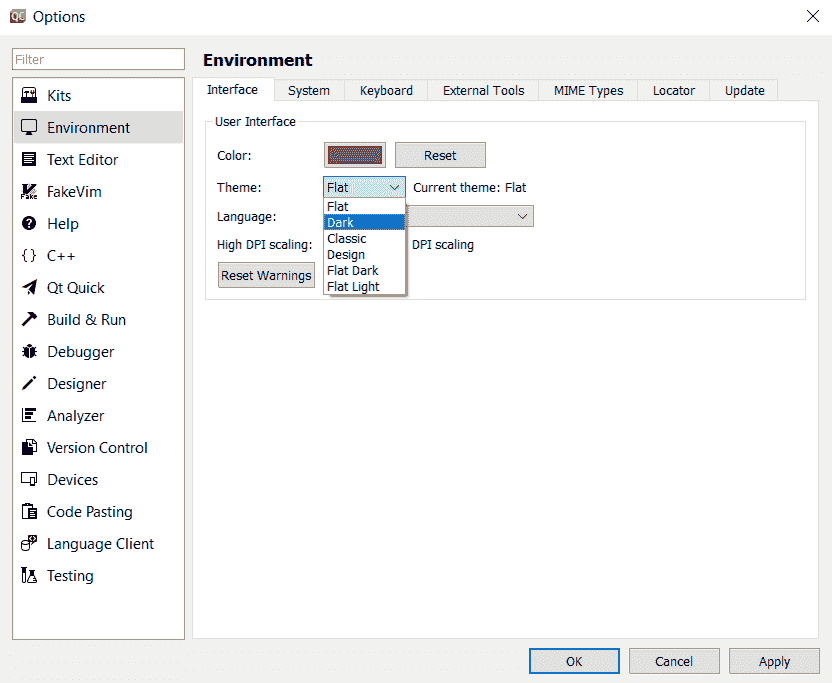

默认情况下，QT Creator 使用的是扁平主题，这也是我们一直熟悉的。 Qt 还为我们提供了一些较新的选项，如平板深色、平板设计、平板深色和平板灯光。 一定要试一试，看看有没有适合你口味的！ 请注意，您可能需要重新启动 Qt Creator 才能进行更改。

这里值得一提的是 Qt Creator 的其他一些第三方主题：

*   德古拉主题：11-13[HTTPS：//draculaheme.com/qtcreator](https://draculatheme.com/qtcreator)
*   蓝天主题：[https://github.com/foxoman/bluesky](https://github.com/foxoman/bluesky)
*   伊尔达尔·吉尔马诺夫的黑暗与光明主题：[https://github.com/gilmanov-ildar/qtcreator-themes](https://github.com/gilmanov-ildar/qtcreator-themes)
*   弧形主题：https://github.com/elmodos/qt-creator-arc-theme

您可以下载这些主题，并将文件`.xml`复制到以下目录：

*   **窗口**：↔`%APPDATA%\QtProject\qtcreator\themes`
*   **MacOS**：`~/.config/QtProject/qtcreator/themes/`
*   **Linux**：11-13`~/.config/QtProject/qtcreator/themes/`

然后，重新启动 Qt Creator，您应该可以在`Theme`选择框中找到主题名称。

如果你对主题的配色方案不满意，你仍然可以通过转到“工具”|“选项”来对其进行一些调整……。 |文本编辑器|字体和颜色。 在这里，您将看到一个允许您更改代码编辑器配色方案的选择框：

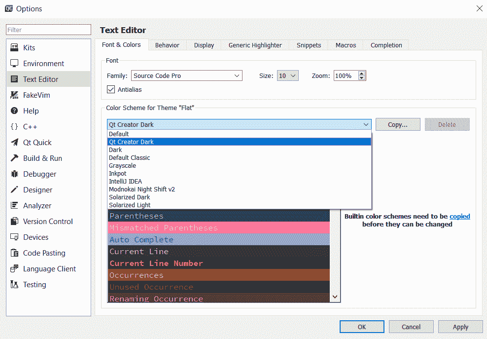

通过更改配色方案的每个可用选项，您可以更上一层楼。 但是，您不能更改原始设置，而是需要首先通过按下复制...按钮复制选定的配色方案。 然后，将弹出一个小窗口，要求您为新复制的配色方案插入一个名称。 一旦使用从上一个配色方案复制的属性创建了新的配色方案，您就可以开始胡乱操作并更改任何您喜欢的设置。 这就是我要说的！

Qt Creator 确实让我们可以灵活地定制工具的外观，让我们在使用它时有宾至如归的感觉。

让我们来看看一些不同的东西，除了调整 Qt Creator 的主题之外，我们还可以让我们的 Qt Quick 窗口脱颖而出。 让我们来看看如何更改 Qt 快速窗口显示选项的设置。

# 设置 Qt 快速窗口显示选项

Qt Quick 非常适合为机顶盒或汽车电脑等非传统计算环境构建应用。 通常，在使用 Qt Quick 时，您会希望应用在这些设置中的窗口内容周围没有所有常见的窗口(如关闭框)，因为您试图基于 Qt Quick 应用(而不是主机平台上的窗口工具箱)呈现统一的用户界面。

您可以通过编辑 Qt Quick 项目中的`main.cpp`文件轻松设置窗口选项。 默认情况下，它类似于以下代码片段：

```cpp
#include <QGuiApplication>
#include <QtQuick/QQuickView>

int main(int argc, char *argv[])
{
  QGuiApplication a(argc, argv);

  QQuickView view;
  view.setSource(QUrl("qrc:/qml/main.qml"));
  view.show();

  return a.exec();
}
```

此代码创建一个 Qt Quick Application Viewer，将其主 QML 文件(要加载的第一个文件)设置为指定的文件，然后在启动应用的事件循环之前显示该文件。 幸运的是，`QQuickView`有一个参数`setFlags`参数方法，允许您将参数`Qt::Window`参数传递给它初始化的窗口，以便显示您的 Qt Quick 应用。 这些标志包括以下内容：

*   `Qt::FramelessWindowHint`：这表示窗口应该是无边框的(这适用于 Linux 系统，但不适用于 Windows)。
*   `Qt::Popup`：表示弹出窗口。 您可以在 Windows 上使用此选项来获得几乎无边框的窗口，并带有轻微的投射阴影。
*   `Qt::WindowStaysOnTopHint`：这表示该窗口应位于所有其他窗口之上。
*   `Qt::WindowStaysOnBottomHint`：这表示该窗口应位于所有其他窗口之下。
*   `Qt::Desktop`：表示窗口应在桌面上运行。

我们将向您展示如何在即将到来的示例 C++代码中使用这些标志。

A complete list of the flags can be found in the Qt documentation at [https://doc.qt.io/qt-5.9/qt.html#WindowType-enum](https://doc.qt.io/qt-5.9/qt.html#WindowType-enum).

您还可以使用`QQuickView`的方法调整窗口的不透明度。

例如，假设我们想要一个没有边框的蓝色窗口，但是希望有一个 75%不透明度的轻微阴影悬停在 Qt Quick 应用的所有其他窗口上。 我们将 QML 更改为如下所示：

```cpp
import QtQuick 2.12 

Rectangle { 
    width: 360 
    height: 360 
    color: "blue" 
    Text { 
        text: qsTr("Hello World") 
        anchors.centerIn: parent 
        font.pointSize: 18 
    } 
    MouseArea { 
        anchors.fill: parent 
        onClicked: { 
            Qt.quit(); 
        } 
    } 
} 
```

请注意我们的顶级矩形的声明`color: blue`。 接下来，我们将把`main.cpp`公式修改如下：

```cpp
#include <QGuiApplication>
#include <QtQuick/QQuickView>

int main(int argc, char *argv[])
{
  QGuiApplication a(argc, argv);

  QQuickView view;
  view.setOpacity(0.75);
  view.setFlags(Qt::Popup | Qt::WindowStaysOnTopHint);
  view.setSource(QUrl("qrc:/qml/main.qml"));
  view.show();

  return a.exec();
}
```

这里的关键代码行恰好在`view.setSource`之前：`setOpacity`方法设置主窗口的不透明度，而`setFlags`方法将主窗口的标志设置为将位于所有其他窗口之上的弹出窗口。 在运行应用时，我们将看到类似以下屏幕截图的内容：


您可以使用此技巧为 Qt Quick 应用的显示方式提供各种效果。

我们已经了解了如何为 Qt Quick 应用设置窗口显示选项。因此，接下来，我们将学习如何直接从命令行构建我们的项目。

# 从 CMake 和命令行构建项目

有时，您需要从命令行构建项目。 可能您正在 Linux 上工作，只是在那里更舒服，或者您在开会时在桌面上运行了一个远程会话。 或者，您可能希望在构建服务器上自动构建，并且需要知道 Qt 如何为您的构建执行编译魔术。

# 使用 qmake 构建

诀窍在于 qmake：qt 的 meta-make 系统，它为您已经安装的编译器工具链管理 make 文件的生成。 Qmake 命令获取您在[第 2 章](02.html)，*使用 Qt Creator*构建应用中第一次看到的`.pro`文件，并生成工具链构建应用所需的`make`或`nmake`文件。 让我们看看这是如何工作的：

1.  首先，确保您的系统路径中有编译器和 set 实用程序；如何做到这一点在不同的开发环境中有所不同。 接下来，请确保路径中有用于 Qt 构建系统的命令-如果您已使用包管理器在 Linux 上安装了 Qt，则默认情况下会发生这种情况；在 MacOS 或 Windows 上，只需编辑路径以包含先前安装的 Qt 工具中相应的`bin`目录，即可轻松完成此操作。
2.  接下来，打开一个命令窗口并切换到包含您的项目的目录：您的`.pro`文件应该在此目录的根目录下。 键入`qmake`，然后输入`make`(如果您的构建系统使用 make)或`nmake`(如果您使用的是 Microsoft Windows 工具链)。 这就是一切！
3.  如果您有一个 C++项目，无论是否有 Qt，并且您错过了`.pro`文件，qmake 可以使用以下命令为您创建该文件：

```cpp
qmake -project
```

使用此命令，qmake 可以浏览文件夹和子文件夹中的所有 C++文件，并写入一个通用的 PRO 文件。 然后，您可以编辑此文件以更改目标名称或添加一些`qt`模块，如下面的语句所示，但一般来说，您会得到一个好的结果：

```cpp
qt += qt network xml
```

我们已经了解了如何使用 qmake 构建我们的 Qt 项目。 接下来，我们将学习如何使用 CMake 构建我们的项目。

# 使用 CMake 构建

CMake 是一组跨平台的工具，用于为不同类型的项目生成 make 文件，例如 Visual Studio 和 Qt。 CMake 使用一个名为“`CMakeLists.txt`”的简单配置文件，可以很容易地进行修改以满足您的需要。 由于 CMake 是第三方工具，因此您无法从 Qt 的官方文档中获得太多信息。 相反，您可以在[https://cmake.org/documentation](https://cmake.org/documentation)上阅读 CMake 提供的文档。

因此，如果您决定使用 CMake 而不是 Qt 提供的默认 qmake，则不再为 Qt 项目创建`.pro`项目文件。 相反，您可以将`CMakeLists.txt`创建为项目文件，并手动将源文件、库和编译器设置的路径添加到`CMakeLists.txt`文件中。 您也不能从 Qt Creator 创建新的 Qt 项目，因为默认情况下它附带了 qmake 项目文件(`.pro`)。

Qt Creator 支持 CMake 3.0 及更高版本，这意味着最新版本将在您的 Qt Creator 上开箱即用。 如果您已在计算机上安装了 CMake，Qt Creator 将通过`PATH`设置自动查找 CMake。 如果您还没有，请访问[https://cmake.org](https://cmake.org)并下载最新版本的 CMake。

您可以通过转到工具|选项...在 Qt Creator 中设置 CMake。 然后选择套件|CMake：

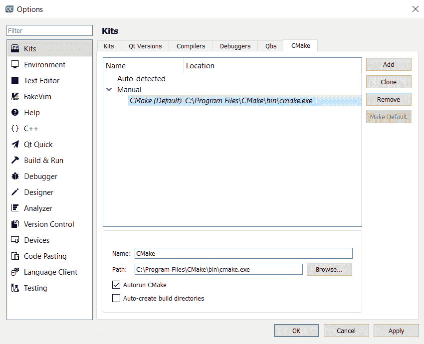

如果 Qt Creator 没有检测到您的 CMake 目录，您可以单击 Add 按钮手动设置目录路径。 选中自动运行 CMake 复选框后，Qt Creator 将在您对任何`CMakeLists.txt`文件进行任何更改时自动运行 CMake。

之后，转到 Kits 选项卡，并确保您在项目上运行的工具包选择了 CMake 工具：


完成后，我们现在可以开始创建第一个运行 CMake 的 Qt 项目，方法是在所需的目录中创建一个`CMakeLists.txt`文件。 之后，使用 Qt Creator 打开该文件。 您需要添加到该文件的第一件事是最低 CMake 要求，以便在我们的计算机上安装的 CMake 低于该版本时通知我们：

```cpp
cmake_minimum_required(VERSION 3.0.0)
```

然后，设置您的项目名称并让 CMake 在构建目录中查找头文件：

```cpp
project(MyProject)
set(CMAKE_INCLUDE_CURRENT_DIR ON)
```

之后，启用以下三个选项，以便 CMake 在构建时通过扫描头文件和源文件自动处理`moc`、`uic`和`rcc`构建目标，这将使您的工作更轻松：

```cpp
set(CMAKE_AUTOMOC ON)
set(CMAKE_AUTOUIC ON)
set(CMAKE_AUTORCC ON)
```

然后，我们需要在我们的项目中包含 Qt5 组件，这样它才能被正确编译和运行。 我们可以通过两种方式添加这些组件-第一种是逐个添加：

```cpp
find_package(Qt5Core REQUIRED)
find_package(Qt5Widgets REQUIRED)
```

不过，我更喜欢第二种方式，即一次添加所有必需的组件：

```cpp
find_package(Qt5 COMPONENTS Core Widgets REQUIRED)
```

如果您有任何要添加到项目中的 C++源文件、Qt 快速文件(`.qml`)、Qt 表单文件(`.ui`)、Qt 资源文件(`.qrc`)等，可以使用`add_executable`命令进行添加。 例如，请考虑以下内容：

```cpp
add_executable(MyProject main.cpp mainwindow.cpp mainwindow.ui resource.qrc)
```

保存`CMakeLists.txt`文件后，Qt Creator 现在将刷新项目并在左侧的项目面板上显示源文件。 您可能注意到，项目树看起来与 qmake 使用的普通 Qt 结构略有不同：

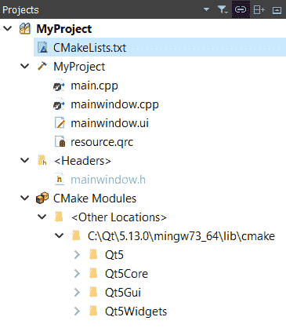

最后，我们必须将 Qt 库链接到我们的项目，以便它可以正确编译和运行：

```cpp
target_link_libraries(MyProject Qt5::Widgets)
```

现在，我们的`CMakeLists.txt`文件看起来像这样，非常简短简单：

```cpp
cmake_minimum_required(VERSION 3.0.0)
project(MyProject)
set(CMAKE_INCLUDE_CURRENT_DIR ON)

set(CMAKE_AUTOMOC ON)
set(CMAKE_AUTOUIC ON)
set(CMAKE_AUTORCC ON)

find_package(Qt5 COMPONENTS Core Widgets REQUIRED)
add_executable(MyProject main.cpp mainwindow.cpp mainwindow.ui resource.qrc)
target_link_libraries(MyProject Qt5::Widgets)
```

您现在可以点击 Qt Creator 上的 Run 按钮来启动构建过程。 如果构建过程中没有错误，您的程序应该会在几秒钟内自动运行。 当然，前面的示例只是在 CMake 中启动项目的最基本配置。 如果您需要了解更高级的设置，请访问[https://doc.qt.io/qt-5/cmake-manual.html](https://doc.qt.io/qt-5/cmake-manual.html)和[https://cmake.org/documentation](https://cmake.org/documentation)。

就这样。 我们已经了解了如何在 Qt 项目中使用 CMake，并熟悉了`CMakeLists.txt`文件的基本配置。 接下来，我们将学习如何同时运行多个调试器。

# 同时运行多个调试器

通常，我们的项目不仅仅是一个仅运行单个可执行文件的简单`hello world`应用，还可以是同时在服务器、客户端计算机甚至移动设备上运行的不同类型的可执行文件的集合。 例如，您的最终用户可能正在运行您从 Qt 构建的应用，该应用在他们的移动设备上运行。 然后，您就有了一个服务器应用，该应用也是从 Qt 构建的，它处理从用户的应用发送的信息。 最后，向您的服务器管理员提供使用 Qt 构建的管理软件，该软件在他们的 PC 上运行。

要构建和维护这样一个庞大的应用，我们需要确保它总是容易的，并且让事情保持在一起。 为了确保我们可以轻松地编辑、构建和调试所有不同的应用，我们使用名为`subdir`的东西将这些项目组合到 Qt 中的一个项目中。 为此，我们将描述的所有三个示例程序放到一个文件夹中，并在其中创建一个空的`.pro`文件。 该目录如下所示：


每个项目子文件夹就像一个普通的 Qt 项目文件夹，都有自己的项目文件(`.pro`)，但是我们将使用这些文件夹之外的主项目文件将它们组合到一个主项目中。 然后，打开主项目文件并添加以下代码：

```cpp
TARGET = Multiple_Projects
TEMPLATE = subdirs
CONFIG += ordered

SUBDIRS += \
    Console \
    Widget \
    QtQuick \
```

正如我们所看到的，它非常简短和简单。 `TARGET`设置只是给这个项目起了一个名字，在本例中，我只是简单地将其命名为`Multiple_Projects`。 我们通常将`TEMPLATE`设置为`app`，现在改为`subdirs`，因为我们只使用此项目文件将其他项目组合在一起，而不是构建实际的程序。 我们将关键字`ordered`添加到`CONFIG`设置中，以便按照给定的顺序处理后面列出的所有目录。 最后，通过将单个项目文件夹添加到`SUBDIRS`设置变量，将其添加到主项目文件中。 保存项目文件后，您将看到项目结构现在已更新。 现在，您将能够看到项目树中的所有子项目：

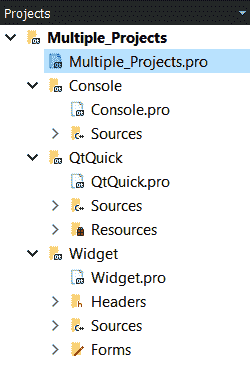

这样，您可以更轻松地编辑、生成和调试所有子项目，而无需单独打开每个项目。 现在，您甚至可以将它们放入相同的版本控制存储库中，并动态提交/更新整个项目。 这在与程序员团队协作时特别方便。

您可能会注意到，当您尝试运行所有这些程序时，Qt Creator 可能会在运行第二个程序之前关闭第一个程序，依此类推。 可以通过转到工具|选项...更改此默认行为。 |Build&Run|常规，修改构建前停止应用选项为无：

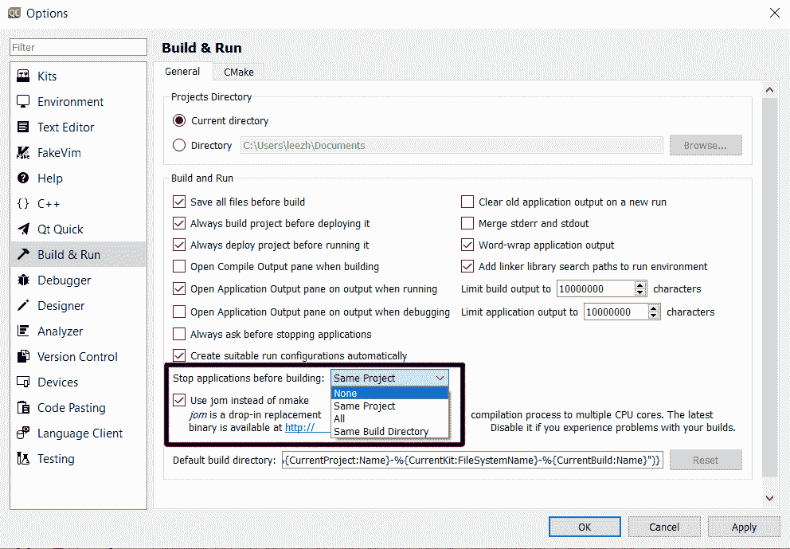

这样，您可以同时运行和调试程序，并同时查看 Qt Creator 上所有程序的调试消息，从而使您的调试过程更简单、更快捷：


最后一个提示是，如果您希望 Qt Creator 同时启动这三个程序，而不是逐个运行它们，您可以转到项目界面，然后通过单击首选工具包下的运行图标打开运行设置页面：

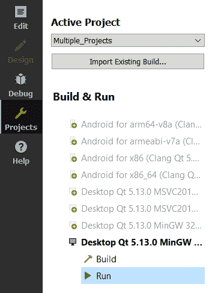

之后，通过选择 Custom Executable(自定义可执行文件)选项添加新的运行配置：

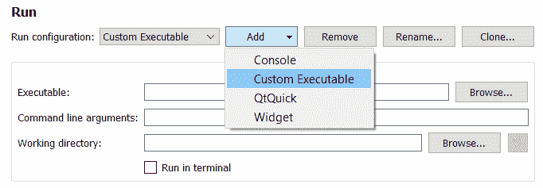

然后，单击浏览...。 按钮，并将其链接到帮助您同时启动所有三个程序的批处理脚本。 您还需要通过单击 Browse...(浏览...)选择工作目录。 按钮的工作目录设置。 不推荐使用批处理脚本，但如果您真的想这样做，您可以这样做。

我们已经了解了如何将不同的 Qt 项目分组在一起，并同时在这些项目上运行调试器。 接下来，我们将进一步了解 Qt 助手是什么，以及如何从我们的 Qt Creator 访问它。

# 了解有关 Qt 的更多信息

在前几章中，我向您介绍了 Qt Creator 的帮助面板，以及编辑代码时用于自动完成类成员的编辑器工具。 Qt Creator 的帮助视图实际上是**Qt 助手**的子视图，后者是 Qt 的完整文档。 如果您安装了所有的 Qt 安装，则默认情况下应该安装该文件；文档在本地打包为 HTML 文件。 这些文档中的大部分也可以在 Web 上找到，但通过这种方式访问要快得多。

当我们从 Qt SDK 启动 Qt Assistant 时(或者从`assistant`的命令行启动，或者通过在安装的应用列表中找到它)，我们应该会看到类似以下屏幕截图的内容：

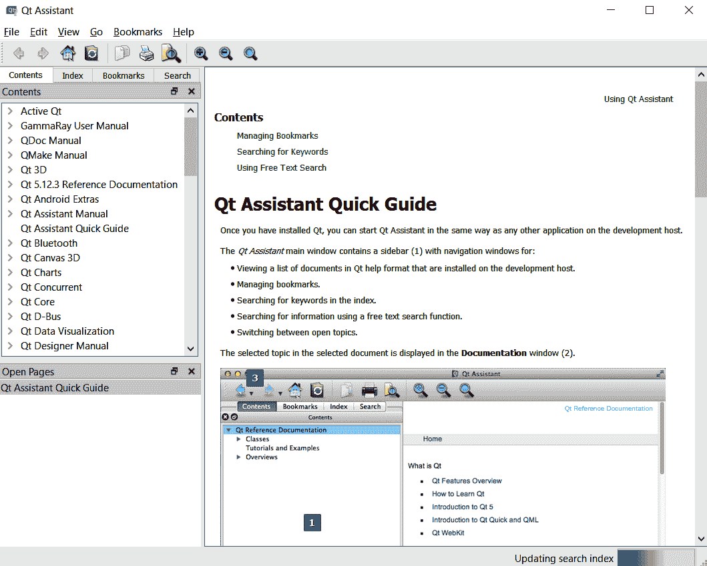

Qt 助手是了解 Qt 的最佳场所。 在左侧的列中，您可以看到一个目录；最好的开始位置是 Qt Core，然后是 Qt GUI 或 Qt Quick，具体取决于您想要编写 GUI 还是 Qt Quick 应用。 右侧的主视图就像一个浏览器窗口，带有指向相关部分的超链接。

此外，在 Qt 助手中，您可以为经常访问的页面添加书签，查看文档中所有术语的索引，并使用左侧列中的搜索选项卡快速搜索术语。 这是一种无价的资源，像电子书一样容易使用。

最后，如果您更喜欢使用 Web 来了解一些事情，请不要忘记 Qt 的大量在线文档，可从[https://doc.qt.io](https://doc.qt.io)获取。 在[https://forum.qt.io](https://forum.qt.io)上还有 Qt 项目论坛。

# 简略的 / 概括的 / 简易判罪的 / 简易的

Qt 和 Qt Creator 为应用开发提供了一个很好的环境，无论您是在编写控制台、GUI 还是 Qt Quick 应用。 您可以将标准 C++代码与 Qt 混合使用，从而最大限度地利用您现有的技能。 在执行此操作时，您可以将版本控制和命令行构建等功能添加到工具中，从而使您能够在大型团队中工作，并使用 Qt 执行大型项目的无人参与构建。 Qt 也有很棒的文档，既与 Qt Creator 捆绑在一起，也在网络上捆绑在一起。

根据您在本书中学到的知识和可用的内容，您的应用开发目标是无穷无尽的！