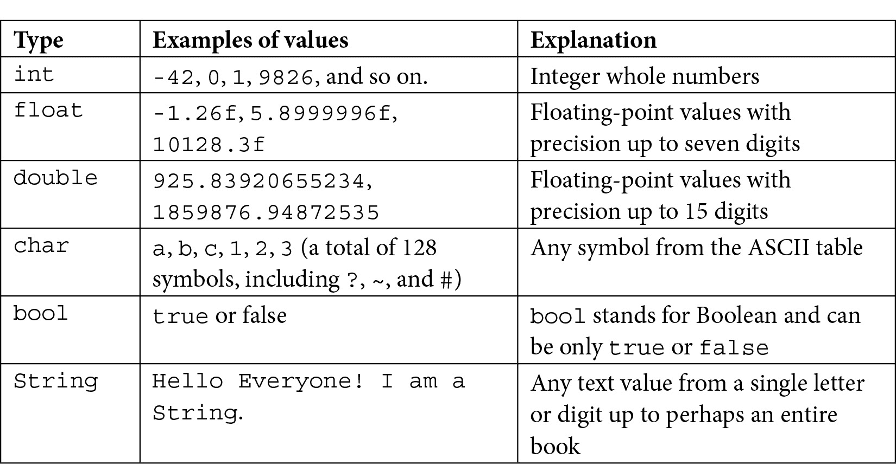
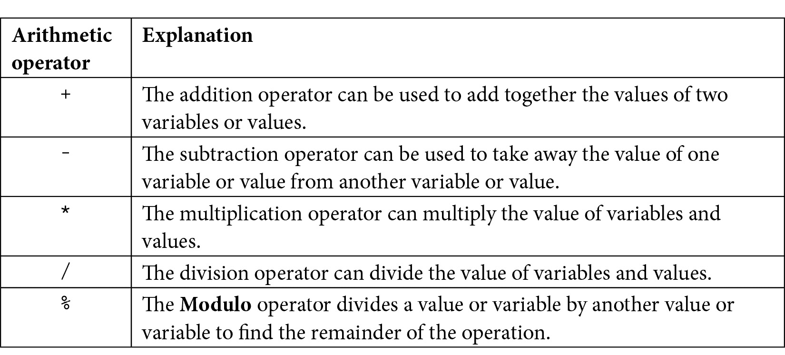
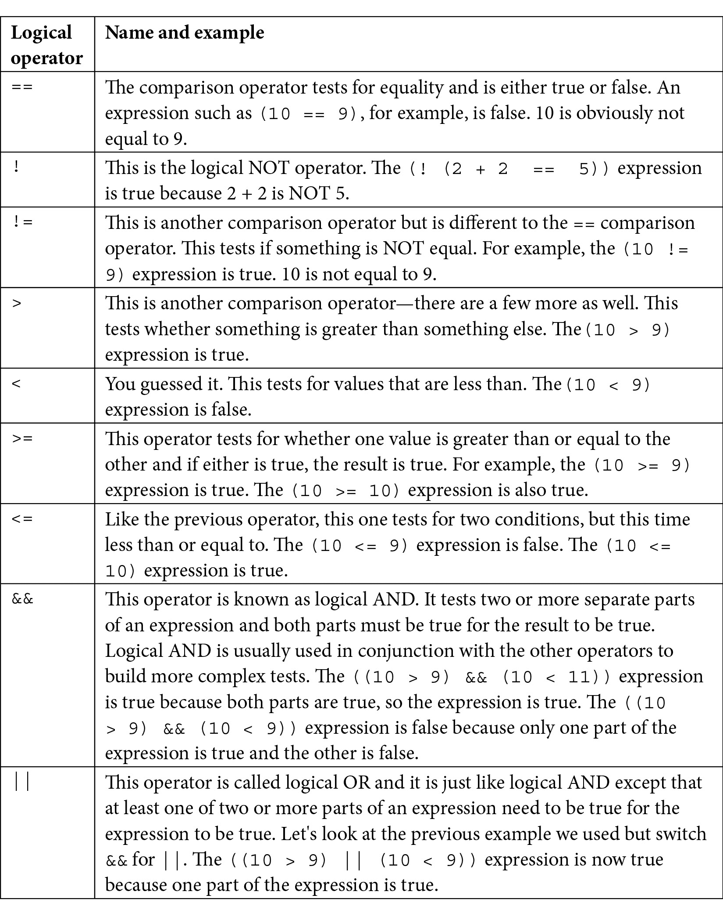

# *第 2 章*：变量、运算符和决策–设置精灵动画

在本章中，我们将在屏幕上做更多的绘制，为了实现这一点，我们将需要学习 C++的一些基础知识。我们将学习如何使用变量来记忆和操作值，并开始在游戏中添加更多图形。随着本章的深入，我们将了解如何操纵这些值来设置图形动画。这些值称为变量。

以下是即将推出的产品：

*   学习 C++变量的所有知识
*   了解如何操作存储在变量中的值
*   添加一个静态树图形，准备让玩家切掉
*   绘制一只蜜蜂和三朵云并设置其动画

# C++变量

变量 T1 是我们的 C++游戏存储和操作值/数据的方式。如果我们想知道玩家有多健康，我们需要一个变量。也许你想知道在当前的浪潮中还有多少僵尸。这也是一个变量。如果你需要记住得到高分的球员的名字，你猜到了，我们需要一个变量。比赛结束了还是还在继续？是的，这也是一个变量。

变量是 PC 内存中位置的命名标识符。PC 内存是计算机程序执行时存储的位置。因此，我们可以将一个变量命名为`numberOfZombies`，该变量可以引用内存中的一个位置，该位置存储一个值来表示当前 wave 中剩余的僵尸数量。

计算机系统在内存中寻址位置的方式很复杂。编程语言使用变量为我们提供了一种人性化的方法来管理内存中的数据。

我们刚才提到的少量变量意味着必须有不同的**类型**变量。

## 变量类型

有各种各样的 C++变量类型（参见下面几页关于变量在两页中的提示）。很容易用一整章的时间来讨论它们。下面是本书中最常用的变量类型表。然后，在下一节中，我们将了解如何使用这些变量类型：



必须告诉编译器它是什么类型的变量，以便它能够为它分配适当的内存量。最好为您使用的每个变量使用最佳和最合适的类型。然而，在实践中，您通常可以通过提升变量而侥幸逃脱。也许您需要一个只有五个有效数字的浮点数？如果将其存储为`double`，编译器不会抱怨。但是，如果您尝试将`float`或`double`存储在`int`中，它将**更改**/**转换**值以适合`int`。随着本书的深入，我将明确在每种情况下使用的最佳变量类型是什么，我们甚至会看到一些在变量类型之间进行转换/强制转换的实例。

上表中值得注意的一些额外细节包括所有`float`值旁边的`f`后缀。这个`f`后缀告诉编译器该值是`float`类型，而不是`double`。假定不带`f`前缀的浮点值为`double`。有关这方面的更多信息，请参阅下一个关于变量的提示。

正如我们前面提到的，还有更多的类型。如果您想了解更多关于类型的信息，请参阅下一个关于变量的提示。

### 用户定义类型

用户定义的类型比我们刚才看到的类型要高级得多。当我们在 C++中讨论用户定义类型时，我们通常会谈论类。在上一章中，我们简要介绍了类及其相关对象。我们将在一个单独的文件中编写代码，有时是两个文件。然后我们可以声明、初始化和使用它们。我们将把如何定义/创建自己的类型留到[*第 6 章*](06.html#_idTextAnchor154)*【面向对象编程——开始乒乓游戏*。

## 声明和初始化变量

到目前为止，我们知道变量用于存储我们的游戏工作所需的数据/值。例如，一个变量表示一个玩家的生命数或玩家的名字。我们还知道，这些变量可以表示多种不同类型的值，例如`int`、`float`、`bool`等等。当然，我们还没有看到的是如何实际使用变量。

创建和准备新变量分为两个阶段。这些阶段称为**声明**和**初始化**。

### 声明变量

我们可以在 C++中声明变量，如下所示：

```cpp
// What is the player's score?
int playerScore;
// What is the player's first initial
char playerInitial;
// What is the value of pi
float valuePi;
// Is the player alive or dead?
bool isAlive;
```

一旦我们编写了声明变量的代码，它就存在了，可以在代码中使用了。然而，我们通常希望给变量一个合适的值，这就是初始化的作用。

### 初始化变量

现在我们已经用有意义的名称声明了变量，我们可以用适当的值初始化这些变量，如下所示：

```cpp
playerScore = 0;
playerInitial = 'J';
valuePi = 3.141f;
isAlive = true;
```

此时，变量存在并持有特定值。很快，我们将看到如何改变、测试和响应这些值。接下来，我们将看到可以将声明和初始化合并到一个步骤中。

### 一步声明和初始化

如果适合我们，我们可以将声明和初始化步骤合并为一个步骤。有时，我们知道变量必须以什么值启动程序，一步声明和初始化是合适的。通常，我们不会，我们会先声明变量，然后在程序中初始化它，如下所示：

```cpp
int playerScore = 0;
char playerInitial = 'J';
float valuePi = 3.141f;
bool isAlive = true;
```

变量提示

正如所承诺的，这里是关于变量的提示。如果您想查看 C++类型的完整列表，请查看此网页：http://www.tutorialspoint.com/cplusplus/cpp_data_types.htm 。如果您想对`float`、`double`和`f`后缀进行更深入的讨论，请阅读以下内容：[http://www.cplusplus.com/forum/beginner/24483/](http://www.cplusplus.com/forum/beginner/24483/) 。最后，如果您想知道 ASCII 字符代码的输入和输出，那么这里有更多信息：[http://www.cplusplus.com/doc/ascii/](http://www.cplusplus.com/doc/ascii/) 。请注意，这些链接是为特别好奇的读者准备的，为了继续，我们已经讨论了足够多的内容。

### 常数

有时，我们需要确保一个值永远不能更改。为此，我们可以使用`const`关键字声明并初始化**常量**：

```cpp
const float PI = 3.141f;
const int PLANETS_IN_SOLAR_SYSTEM = 8;
const int NUMBER_OF_ENEMIES = 2000;
```

按照惯例，声明常量都是大写的。前面常量的值永远不能更改。我们将在[*第 4 章*](04.html#_idTextAnchor110)*中看到一些常量在起作用，循环、数组、开关、枚举和函数——实现游戏机制*。

### 声明和初始化用户定义类型

我们已经看到了如何声明和初始化一些 SFML 定义类型的示例。这是因为我们可以非常灵活地创建/定义这些类型（类），因此我们声明和初始化它们的方式也非常不同。下面是前一章中关于声明和初始化用户定义类型的几个提示。

创建一个名为`vm`的`VideoMode`类型的对象，并使用两个`int`值`1920`和`1080`对其进行初始化：

```cpp
// Create a video mode object
VideoMode vm(1920, 1080);
```

创建一个名为`textureBackground`的`Texture`类型的对象，但不进行任何初始化：

```cpp
// Create a texture to hold a graphic on the GPU
Texture textureBackground;
```

请注意，尽管我们没有建议使用任何特定值来初始化`textureBackground`，但一些变量设置可能会在内部进行，这是可能的（事实上，很有可能的）。在这一点上，对象是否需要/具有提供初始化值的选项完全取决于类的编码方式，并且几乎是无限灵活的。这进一步表明，当我们开始编写自己的类时，会有一些复杂性。幸运的是，这也意味着我们将拥有强大的能力来设计我们的类型/类，使之成为我们制作游戏所需要的！将这种巨大的灵活性添加到 SFML 设计类的强大功能中，我们游戏的潜力几乎是无限的。

在本章中，我们还将看到 SFML 提供的更多用户创建的类型/类，并在本书中加载更多。

我们现在已经看到，变量是计算机内存中的一个命名位置，变量可以是一个简单的整数，也可以是一个更强大的对象。既然我们知道可以初始化这些变量，我们将看看如何操作它们所持有的值。

# 操纵变量

此时，我们确切地知道变量是什么，它们可以是什么主要类型，以及如何声明和初始化它们。然而，我们仍然不能对他们做那么多。我们需要操纵我们的变量；添加它们；把他们带走；然后进行乘法、除法和测试。

首先，我们将讨论如何操纵它们，然后我们将研究如何以及为什么测试它们。

## C++算法与赋值算子

为了操纵变量，C++有一个范围的算术运算算子，即 T1 和 Ty2 T2 赋值算子 T3。幸运的是，大多数算术运算符和赋值运算符使用起来非常直观，而那些不直观的运算符则很容易解释。首先，让我们看看算术运算符表，然后是赋值运算符表，我们将在本书中经常使用这些运算符：



现在，对于赋值运算符：


重要提示

从技术上讲，除了`=`、`--`和`++`之外，所有这些运算符都被称为**复合赋值运算符**，因为它们包含多个运算符。

现在我们已经看到了大量的算术运算符和赋值运算符，我们实际上可以看看如何通过组合运算符、变量和值来形成**表达式**来操作变量。

## 用表情做事

**表达式**是组合变量、运算符和值的结果。使用表达式，我们可以得到一个结果。此外，我们很快就会看到，我们可以在测试中使用表达式。这些测试可以用来决定我们的代码下一步应该做什么。首先，让我们看看一些可能在游戏代码中看到的简单表达式。下面是一个简单表达式的示例：

```cpp
// Player gets a new high score
hiScore = score;
```

在前面的代码中，`score`变量中保存的值用于更改`hiScore`变量中的值。这两个变量现在具有相同的值，但请注意，它们仍然是独立的、不同的变量（内存中的位置）。这可能正是我们需要的球员击败高分。下面是另一个例子：

```cpp
// Set the score to 100
score = 100;
```

让我们看看加法运算符，它与赋值运算符一起使用：

```cpp
// Add to the score when an alien is shot
score = aliensShot + wavesCleared;
```

在前面的代码中，使用加法运算符将`aliensShot`和`wavesCleared`持有的值相加，然后将相加结果分配给`score`变量。现在，让我们来看看下面的代码：

```cpp
// Add 100 to whatever the score currently is
score = score + 100;
```

请注意，在运算符的两侧使用相同的变量是完全可以接受的。在前面的代码中，将 100 添加到`score`变量所持有的值中，然后将该新值分配回`score`。

将减法运算符与赋值运算符结合使用。以下代码将减法运算符右侧的值与左侧的值相减。它通常与赋值运算符一起使用，可能类似于：

```cpp
// Uh oh lost a life
lives = lives - 1;
```

它也可以这样使用：

```cpp
// How many aliens left at end of game
aliensRemaining = aliensTotal - aliensDestroyed;
```

接下来，我们将了解如何使用除法运算符。下面的代码将左侧的数字除以右侧的数字。同样，它通常与赋值运算符一起使用，如下所示：

```cpp
// Make the remaining hit points lower based on swordLevel
hitPoints = hitPoints / swordLevel;
```

它也可以这样使用：

```cpp
// Give something, but not everything, back for recycling a block
recycledValueOfBlock = originalValue / .9f;
```

显然，在前面的示例中，`recycledValueOfBlock`变量必须是`float`类型，才能准确地存储类似计算的答案。

也许毫不奇怪，我们可以这样使用乘法运算符：

```cpp
// answer is equal to 100, of course
answer = 10 * 10;
```

它也可以这样使用：

```cpp
// biggerAnswer = 1000, of course
biggerAnswer = 10 * 10 * 10;
```

重要提示

另一方面，你有没有想过 C++的名字是怎么来的？C++是 C 语言的扩展。它的发明者，**比亚恩·斯特劳斯特鲁普**最初称它为“带类的 C”，但这个名字后来演变而来。如果你感兴趣的话，你可以阅读在 T2 T2 上的 C++故事。http://www.cplusplus.com/info/history/ 。

现在，让我们看一下增量操作符的作用。这是一种巧妙的方法，可以将 1 添加到游戏变量的值中。

请看下面的代码：

```cpp
// Add one to myVariable
myVariable = myVariable + 1;
```

上述代码给出的结果与以下代码相同：

```cpp
// Much neater and quicker
myVariable ++;
```

减量运算符`--`，你猜到了，是从某物中减去 1 的一种快速方法，如下所示：

```cpp
playerHealth = playerHealth -1;
```

这与执行以下操作相同：

```cpp
playerHealth --;
```

让我们看看更多的运营商的行动，然后我们可以回到建设木材！！！游戏加法、减法、乘法和除法运算符都有一个相关的运算符，该运算符将其主要功能（加法、减法等）与赋值相结合。当我们想要执行操作符的主要功能，然后是赋值时，它们允许我们使用更简洁的代码。请看以下四个示例（每个操作员一个）：

```cpp
someVariable = 10;
// Multiply the variable by 10 and put the answer 
// back in the variable
someVariable *= 10;
// someVariable now equals 100
// Divide someVariable by 5 put the answer back 
// into the variable
someVariable /= 5;
// someVariable now equals 20
// Add 3 to someVariable and put the answer back 
// into the variable
someVariable += 3;
// someVariable now equals 23
// Take 25 from someVariable and put the answer back 
// into the variable
someVariable -= 25;
// someVariable now equals -2
```

在前面的四个示例中，我们可以看到，当我们要使用四个算术运算符中的一个并后跟赋值时，可以使用`*=`、`/=`、`+=`和`-=`运算符来缩短语法。在这本书中，我们会做很多。

是时候给我们的游戏添加更多的精灵了。

# 添加云、树和嗡嗡叫的蜜蜂

在本节中，我们将为我们的木材添加云、树和嗡嗡叫的蜜蜂！！！游戏首先，我们将添加一棵树。这很容易。这是因为树不会移动。我们将使用上一章绘制背景时使用的相同程序。蜜蜂和云层也会很容易在它们的起始位置绘制，但是我们需要结合我们刚刚学到的关于操纵变量和一些新的 C++主题来让它们移动的知识。

## 准备树

让我们准备好画这棵树吧！添加以下突出显示的代码。请注意未高亮显示的代码，这是我们已经编写的代码。这将帮助您确定新代码应该在设置背景位置之后，但在主游戏循环开始之前立即键入。在添加新代码后，我们将对其进行概述：

```cpp
int main()
{
    // Create a video mode object
    VideoMode vm(1920, 1080);
    // Create and open a window for the game
    RenderWindow window(vm, "Timber!!!", Style::Fullscreen);
    // Create a texture to hold a graphic on the GPU
    Texture textureBackground;
    // Load a graphic into the texture
    textureBackground.loadFromFile("graphics/background.png");
    // Create a sprite
    Sprite spriteBackground;
    // Attach the texture to the sprite
    spriteBackground.setTexture(textureBackground);
    // Set the spriteBackground to cover the screen
    spriteBackground.setPosition(0, 0);
    // Make a tree sprite
    Texture textureTree;
    textureTree.loadFromFile("graphics/tree.png");
    Sprite spriteTree;
    spriteTree.setTexture(textureTree);
    spriteTree.setPosition(810, 0);

    while (window.isOpen())
    {
```

以下五行代码（不包括注释）就是这样做的：

1.  首先，我们创建一个名为`textureTree`的`Texture`类型的对象。
2.  接下来，我们从`tree.png`图形文件将图形加载到纹理中。
3.  然后，我们声明一个名为`spriteTree`的`Sprite`类型的对象
4.  之后，我们将`textureTree`与`spriteTree`关联。无论何时我们绘制`spriteTree`，它都会显示`textureTree`纹理，这是一个整洁的树图形。
5.  最后，我们使用*x*轴上的坐标`810`和*y*轴上的坐标`0`设置树的位置。

树精灵和树纹理已准备好绘制。让我们继续讨论 bee 对象，它的处理方式几乎相同。

## 准备蜜蜂

准备蜜蜂雪碧与准备树雪碧非常相似，但并不完全相同。下面的代码与树代码之间的差异很小，但很重要。由于蜜蜂需要移动，我们还声明了两个与蜜蜂相关的变量。添加以下突出显示的代码，看看您是否能够了解如何使用`beeActive`和`beeSpeed`变量：

```cpp
// Make a tree sprite
Texture textureTree;
textureTree.loadFromFile("graphics/tree.png");
Sprite spriteTree;
spriteTree.setTexture(textureTree);
spriteTree.setPosition(810, 0);
// Prepare the bee
Texture textureBee;
textureBee.loadFromFile("graphics/bee.png");
Sprite spriteBee;
spriteBee.setTexture(textureBee);
spriteBee.setPosition(0, 800);
// Is the bee currently moving?
bool beeActive = false;
// How fast can the bee fly
float beeSpeed = 0.0f;
while (window.isOpen())
{
```

我们创建蜜蜂的方式与创建背景和树的方式相同。我们使用一个`Texture`，一个`Sprite`，并将两者关联起来。注意，在前面的 bee 代码中，有一些我们以前没有见过的新代码。有一个`bool`变量用于确定蜜蜂是否活跃。记住，`bool`变量可以是`true`或`false`。我们暂时将`beeActive`初始化为`false`。

接下来，我们声明一个名为`beeSpeed`的新`float`变量。这将保持蜜蜂在屏幕上以每秒像素的速度飞行。

很快，我们将看到如何使用这两个新变量来移动蜜蜂。在此之前，让我们以几乎相同的方式设置一些云。

## 准备云彩

添加以下突出显示的代码。研究新代码，并尝试找出它的作用：

```cpp
// Prepare the bee
Texture textureBee;
textureBee.loadFromFile("graphics/bee.png");
Sprite spriteBee;
spriteBee.setTexture(textureBee);
spriteBee.setPosition(0, 800);
// Is the bee currently moving?
bool beeActive = false;
// How fast can the bee fly
float beeSpeed = 0.0f;
// make 3 cloud sprites from 1 texture
Texture textureCloud;
// Load 1 new texture
textureCloud.loadFromFile("graphics/cloud.png");
// 3 New sprites with the same texture
Sprite spriteCloud1;
Sprite spriteCloud2;
Sprite spriteCloud3;
spriteCloud1.setTexture(textureCloud);
spriteCloud2.setTexture(textureCloud);
spriteCloud3.setTexture(textureCloud);
// Position the clouds on the left of the screen
// at different heights
spriteCloud1.setPosition(0, 0);
spriteCloud2.setPosition(0, 250);
spriteCloud3.setPosition(0, 500);
// Are the clouds currently on screen?
bool cloud1Active = false;
bool cloud2Active = false;
bool cloud3Active = false;
// How fast is each cloud?
float cloud1Speed = 0.0f;
float cloud2Speed = 0.0f;
float cloud3Speed = 0.0f;
while (window.isOpen())
{
```

我们刚刚添加的代码中唯一一件看起来有点奇怪的事情是我们只有一个`Texture`类型的对象。多个`Sprite`对象共享一个纹理是完全正常的。一旦`Texture`存储在 GPU 内存中，它就可以很快与`Sprite`对象关联。只有在`loadFromFile`代码中的图形的初始加载是一个相对缓慢的操作。当然，如果我们想要三种不同形状的云，那么我们需要三种纹理。

除了轻微的纹理问题，我们刚刚添加的代码与蜜蜂相比并不是什么新鲜事。唯一的区别是有三个云精灵，三个`bool` 变量用于确定每个云是否处于活动状态，三个`float`变量用于保持每个云的速度。

在这个阶段，所有的精灵和变量都已经准备好了。现在我们可以继续绘制它们。

## 画树、蜜蜂和云

最后，通过在绘图部分添加以下突出显示的代码，我们可以将它们全部绘制到屏幕上：

```cpp
/*
****************************************
Draw the scene
****************************************
*/
// Clear everything from the last run frame
window.clear();
// Draw our game scene here
window.draw(spriteBackground);
// Draw the clouds
window.draw(spriteCloud1);
window.draw(spriteCloud2);
window.draw(spriteCloud3);
// Draw the tree
window.draw(spriteTree);
// Draw the insect
window.draw(spriteBee);
// Show everything we just drew
window.display();
```

绘制三朵云、蜜蜂和树的方式与绘制背景的方式相同。但是，请注意，我们在屏幕上绘制不同对象的顺序。我们必须在背景后绘制所有图形，否则它们将被覆盖，我们必须在树前绘制云，否则它们将看起来有点奇怪，在树前漂移。蜜蜂在树前或树后看起来都很好。我选择把蜜蜂画在树前，这样它就可以分散伐木工人的注意力，有点像真正的蜜蜂。

跑木材！！！敬畏地凝视着那棵树，三朵云，还有一只蜜蜂……什么都不做！他们看起来像是在排队参加比赛；蜜蜂必须后退的比赛：


利用我们对操作符的了解，我们可以尝试移动刚刚添加的图形，但有一个问题。问题是，真正的云和蜜蜂以不均匀的方式移动。它们没有固定的速度或位置，这些因素取决于风速或蜜蜂可能有多匆忙等因素。对于不经意的观察者来说，他们所走的道路和速度似乎是*随机*。

# 随机数

**随机数**在游戏中有很多用途，可能决定玩家使用哪张牌，或者从敌人的健康中减去一定范围内的伤害。现在我们将学习如何生成随机数，以确定蜜蜂和云的起始位置和速度。

## 在 C++中生成随机数的方法

为了生成随机数，我们将需要使用更多的 C++函数，更精确。不要在游戏中添加任何代码。让我们看看一些假设代码所需的语法和步骤。

计算机不能真正地挑选随机数。他们只能使用**算法**/**计算**来挑选*看似*随机的数字。为了使该算法不会不断返回相同的值，我们必须**对**随机数生成器进行种子设定。种子可以是任何整数，但每次需要唯一的随机数时，它必须是不同的种子。请看以下代码，该代码为随机数生成器种子：

```cpp
// Seed the random number generator with the time
srand((int)time(0));
```

前面的代码使用`time`函数从 PC 获取时间，即`time(0)`。对`time`函数的调用随附为发送给`srand`函数的值。其结果是将当前时间用作种子。

前面的代码看起来有点复杂，因为看起来有点不寻常的`(int)`语法。这样做的目的是将从`time`返回的值转换/强制转换为`int`。在这种情况下，`srand`功能需要这样做。

重要提示

用于描述从一种类型到另一种类型的转换的术语是**cast**。

总之，前一行代码执行以下操作：

*   使用`time`获取时间
*   将其转换为`int`
*   将此结果值发送到`srand`，由`srand`为随机数生成器种子

当然，时间总是在变化。这使得`time`函数成为为随机数生成器播种的好方法。但是，想想如果我们多次给随机数生成器播种，并且以如此快速的连续方式，`time`返回相同的值，可能会发生什么。当我们为云设置动画时，我们将看到并解决这个问题。

在这个阶段，我们可以在一个范围内创建随机数，并将其保存到一个变量中供以后使用，如下所示：

```cpp
// Get the random number & save it to a variable called number
int number = (rand() % 100);
```

注意我们给`number`赋值的方式很奇怪。通过使用模运算符（`%`和`100`的值，我们要求将`rand`返回的数字除以 100，得到余数。当你除以 100 时，你可以得到的最大余数是 99。可能的最低数字是 0。因此，前面的代码将生成一个介于 0 和 99 之间（含 0 和 99）的数字。这些知识将有助于为我们的蜜蜂和云生成随机速度和起始位置。

但是在我们实现随机蜜蜂和云之前，我们需要学习如何在 C++中做出决定。

# 与 if 和 else 一起做出决策

如果我们允许作出决定的话，我们可以做决定。在上一章中，我们已经看到了`if`在动作中，当我们检测到播放器是否在每一帧按下*Esc*键时：

```cpp
if (Keyboard::isKeyPressed(Keyboard::Escape))
{
    window.close();
}
```

到目前为止，我们已经了解了如何使用算术和赋值运算符来创建表达式。现在，我们将介绍一些新的运营商。

## 逻辑运算符

**逻辑运算符**将通过构建可以测试值为真或假的表达式来帮助我们做出决策。起初，这似乎是一个非常狭窄的选择，对于高级 PC 游戏中可能需要的选择来说是不够的。一旦我们再深入一点，我们就会发现，我们只需要几个逻辑运算符就可以做出所需的所有决策。

下面是最有用的逻辑运算符表。查看它们和相关示例，然后我们将了解如何使用它们：



让我们来看看 C++的 To0T0T 和 OutT1 AES 关键字，这将允许我们把所有这些逻辑运算符好好利用。

## C++IF 和其他

让我们让前面的例子不那么抽象。满足 C++HOLT T1。我们将使用`if`和一些操作符以及一个小故事来演示它们的使用。接下来是一个虚构的军事局势，希望它不会像前面的例子那样抽象。

## 如果他们过桥，开枪打死他们！

上尉快要死了，他知道自己剩下的下属经验不足，所以决定写一个 C++程序来传达他死后的最后命令。部队在等待增援时必须守住桥的一侧。

上尉想让他的部队明白的第一个命令是：

“如果他们过桥，就开枪！”

那么，我们如何模拟 C++中的这种情况呢？我们需要一个`bool`变量`isComingOverBridge`。以下代码位假定`isComingOverBridge`变量已声明并初始化为`true`或`false`。

然后我们可以这样使用`if`：

```cpp
if(isComingOverBridge)
{
    // Shoot them
}
```

如果`isComingOverBridge`变量等于`true`，则会运行打开和关闭花括号`{...}`内的代码。如果没有，程序将在`if`块之后继续运行，而不运行其中的代码。

## 射杀他们……否则就这样做

上尉还想告诉他的部队，如果敌人没有从桥上过来，就待在原地不动。

现在，我们可以介绍另一个 C++关键字，当我们想要在`if`没有**求值为`true`的情况下显式地做某事时，我们可以使用`else`。**

例如，如果敌人没有从桥上过来，我们可以编写以下代码来告诉部队待在原地：

```cpp
if(isComingOverBridge)
{
    // Shoot them
}
else
{
    // Hold position
}
```

船长随后意识到问题并不像他最初想的那么简单。如果敌人从桥上过来，但是军队太多怎么办？他的小队将被消灭。因此，他提出了以下代码（这次我们还将使用一些变量）：

```cpp
bool isComingOverBridge;
int enemyTroops;
int friendlyTroops;
// Initialize the previous variables, one way or another
// Now the if
if(isComingOverBridge && friendlyTroops > enemyTroops)
{
    // shoot them
}
else if(isComingOverBridge && friendlyTroops < enemyTroops) 
{
    // blow the bridge
}
else
{
    // Hold position
}
```

前面的代码有三种可能的执行路径。首先，如果敌人正在过桥，而友军人数较多：

```cpp
if(isComingOverBridge && friendlyTroops > enemyTroops)
```

第二种情况发生在敌军越过桥梁，但人数超过友军时：

```cpp
else if(isComingOveBridge && friendlyTroops < enemyTroops)
```

然后，第三个也是最后一个可能的结果（如果其他两个都不是`true`将执行）被最终`else`捕获，没有`if`条件。

## 读者挑战

你能用前面的代码发现一个缺陷吗？一个可能让一群没有经验的军队陷入完全混乱的人？敌军和友军人数完全相等的可能性尚未明确处理，因此将由最终`else`处理。最后的`else`是为了在没有敌军的情况下进行的。我想任何自尊的上尉都会希望他的部队在这种情况下作战。他可以更改第一个`if`语句以适应这种可能性，如下所示：

```cpp
if(isComingOverBridge && friendlyTroops >=  enemyTroops)
```

最后，上尉最后担心的是，如果敌人挥舞着投降的白旗跨过桥来并被迅速屠杀，那么他的士兵最终将成为战犯。需要的 C++代码是显而易见的。使用`wavingWhiteFlag`布尔变量，他编写了以下测试：

```cpp
if (wavingWhiteFlag)
{
    // Take prisoners
}
```

但这段代码放在哪里还不太清楚。最后，机长选择了以下嵌套解决方案，并将`wavingWhiteFlag`的测试改为逻辑非，如下所示：

```cpp
if (!wavingWhiteFlag)
{
    // not surrendering so check everything else	
    if(isComingOverTheBridge && friendlyTroops >= enemyTroops)
    {
        // shoot them
    }

    else if(isComingOverTheBridge && friendlyTroops < enemyTroops) 
    {
        // blow the bridge
    }
}
else
{
    // this is the else for our first if
    // Take prisoners
}
// Holding position
```

这表明我们可以在彼此内部嵌套`if`和`else`语句，以创建相当深入和详细的决策。

我们可以通过`if`和`else`继续做出越来越复杂的决策，但我们所看到的作为一个介绍已经足够了。也许值得一提的是，解决问题的方法往往不止一种。*正确的*方法通常是以最清晰、最简单的方式解决问题的方法。

我们越来越接近所有的 C++知识，我们需要能够动画我们的云和蜜蜂。我们还有最后一个动画问题要讨论，然后我们可以回到游戏。

# 定时

在我们移动蜜蜂和云层之前，我们需要考虑时机。我们已经知道，主游戏循环会重复执行，直到玩家按下*退出*键。

我们还知道 C++和 SFML 是非常快的。事实上，我老化的笔记本电脑以每秒 5000 次的速度执行一个简单的游戏循环（就像现在的循环一样）。

## 帧速率问题

让我们考虑蜜蜂的速度。为了便于讨论，我们可以假设它将以每秒 200 像素的速度移动。在 1920 像素宽的屏幕上，穿过整个宽度大约需要 10 秒，因为 10 x 200 等于 2000（接近 1920）。

此外，我们知道我们可以用`setPosition(...,...)`定位任何精灵。我们只需要把 x 和 y 坐标放在括号里。

除了设置精灵的位置外，我们还可以获取精灵的当前位置。例如，为了获得蜜蜂的水平 x 坐标，我们将使用以下代码：

```cpp
int currentPosition = spriteBee.getPosition().x;
```

蜜蜂的当前 x 坐标现在存储在`currentPosition`中。要将蜜蜂移动到右侧，我们需要将 200（我们的预期速度）除以 5000（我的笔记本电脑上的每秒大约帧数）的适当分数添加到`currentPosition`，如下所示：

```cpp
currentPosition += 200/5000;
```

现在，我们将使用`setPosition` 移动我们的蜜蜂。它将平滑地从左向右移动 200 除以每帧 5000 像素。但这种方法存在两大问题。

帧速率是每秒处理游戏循环的次数。也就是说，我们处理玩家输入、更新游戏对象并将其绘制到屏幕上的次数。在本书的其余部分，我们将进一步讨论帧速率问题。

我笔记本电脑上的帧速率可能并不总是恒定的。蜜蜂可能看起来像是间歇性地在屏幕上“助推”。

当然，我们希望我们的游戏有更多的观众，而不仅仅是我的笔记本电脑！每台电脑的帧速率都会有所不同，至少略有不同。如果你有一台旧电脑，这只蜜蜂似乎被铅压得喘不过气来，如果你有最新的游戏装备，它可能是一只模糊的涡轮蜜蜂。

幸运的是，每个游戏的问题都是一样的，SFML 提供了一个解决方案。理解此解决方案的最简单方法是实现它。

## SFML 帧速率解决方案

现在我们将测量并使用帧速率来控制我们的游戏。要开始实现此功能，请在主游戏循环之前添加以下代码：

```cpp
// How fast is each cloud?
float cloud1Speed = 0;
float cloud2Speed = 0;
float cloud3Speed = 0;

// Variables to control time itself
Clock clock;
while (window.isOpen())
{
```

在前面的代码中，我们声明了一个`Clock`类型的对象，并将其命名为`clock`。类名以大写字母开头，对象名（我们将实际使用）以小写字母开头。对象名称是任意的，但是`clock`似乎是时钟的合适名称。我们也将在这里添加更多与时间相关的变量。

现在，在游戏代码的更新部分，添加以下突出显示的代码：

```cpp
/*
****************************************
Update the scene
****************************************
*/
// Measure time
Time dt = clock.restart();
/*
****************************************
Draw the scene
****************************************
*/
```

正如您所料，`clock.restart()`功能会重新启动时钟。我们希望每一帧重新启动时钟，这样我们就可以计算出每一帧需要多长时间。但是，除此之外，它还返回自上次重新启动时钟以来经过的时间量。

因此，在前面的代码中，我们声明了一个名为`dt`的`Time`类型的对象，并使用它存储`clock.restart()`函数返回的值。

现在，我们有一个名为`dt`的`Time`对象，它保存自上次更新场景并重新启动时钟以来经过的时间量。也许你能看到这是怎么回事？我们将使用每帧经过的时间来控制我们移动蜜蜂和云的距离。

让我们在游戏中添加更多的代码，并使用到目前为止我们所学到的关于操作变量、生成随机数、`if`关键字和`else`关键字的所有知识。然后，我们将看到如何使用`Clock`对象和`dt`来克服帧率问题。

重要提示

`dt`代表**增量时间**，是两次更新之间的时间。

# 移动云和蜜蜂

让我们使用从最后一帧开始经过的时间来为蜜蜂和云彩呼吸生命。这将解决在不同 PC 之间具有一致帧速率的问题。

## 赋予蜜蜂生命

我们要做的第一件事是将蜜蜂设置在一定的高度和速度。我们只想在蜜蜂不活动时这样做。因此，我们将以下代码包装在一个`if`块中。检查并添加以下突出显示的代码，然后我们将对其进行讨论：

```cpp
/*
****************************************
Update the scene
****************************************
*/
// Measure time
Time dt = clock.restart();
// Setup the bee
if (!beeActive)
{
    // How fast is the bee
    srand((int)time(0));
    beeSpeed = (rand() % 200) + 200;
    // How high is the bee
    srand((int)time(0) * 10);
    float height = (rand() % 500) + 500;
    spriteBee.setPosition(2000, height);
    beeActive = true;
}
/*
****************************************
Draw the scene
****************************************
*/
```

现在，如果蜜蜂没有激活，就像游戏第一次启动时没有一样，`if(!beeActive)`将是`true`，前面的代码将按照以下顺序执行以下操作：

*   为随机数生成器设定种子。
*   获取一个介于 200 和 399 之间的随机数，并将结果分配给`beeSpeed`。
*   再次为随机数生成器设定种子。
*   获取一个介于 500 和 999 之间的随机数，并将结果分配给一个名为`height`的新`float`变量。
*   将蜜蜂的位置设置为 x 轴上的`2000`（屏幕右侧）和 y 轴上的`height`相等值。
*   Set `beeActive` to true.

    重要提示

    注意，`height`变量是我们在游戏循环中声明的第一个变量。此外，因为它是在`if`块内声明的，所以它实际上在`if`块外是“不可见的”。这对我们来说很好，因为一旦我们设定了蜜蜂的高度，我们就不再需要它了。这种影响变量的现象称为**范围**。我们将在[*第 4 章*](04.html#_idTextAnchor110)*【循环、数组、开关、枚举和函数——实现游戏机制*中对此进行更全面的探讨。

如果我们运行游戏，蜜蜂还不会发生任何事情，但是现在蜜蜂处于活动状态，我们可以编写一些代码，在`beeActive`为`true`时运行。

添加以下突出显示的代码，如您所见，无论何时`beeActive`为`true`都会执行。这是因为在`if(!beeActive)`块后面跟有`else`：

```cpp
// Set up the bee
if (!beeActive)
{
    // How fast is the bee
    srand((int)time(0) );
    beeSpeed = (rand() % 200) + 200;
    // How high is the bee
    srand((int)time(0) * 10);
    float height = (rand() % 1350) + 500;
    spriteBee.setPosition(2000, height);
    beeActive = true;
}
else
// Move the bee
{
    spriteBee.setPosition(
spriteBee.getPosition().x - 
         (beeSpeed * dt.asSeconds()),
        spriteBee.getPosition().y);
    // Has the bee reached the left-hand edge of the screen?
    if (spriteBee.getPosition().x < -100)
    {
        // Set it up ready to be a whole new bee next frame
        beeActive = false;
    }
}
/*
****************************************
Draw the scene
****************************************
*/
```

在`else`块中，发生了以下事情。

蜜蜂的位置根据以下标准改变。`setPosition`函数使用`getPosition`函数获取蜜蜂当前的水平坐标。然后从该坐标中减去`beeSpeed * dt.asSeconds()`。

`beeSpeed`变量值为每秒多个像素，在上一个`if` 块中随机分配。`dt.asSeconds()`的值将是 1 的一小部分，表示上一帧动画所用的时间。

假设蜜蜂当前的水平坐标为**1000**。现在，假设一台基本 PC 以每秒 5000 帧的速度循环。这意味着`dt.asSeconds`将是**0.0002**。现在，我们还假设`beeSpeed`设置为每秒最大**399**像素。有了这些信息，我们可以说确定`setPosition`用于水平坐标的值的代码如下：

```cpp
1000 - 0.0002 x 399
```

因此，蜜蜂在水平轴上的新位置为 999.9202。我们可以看到蜜蜂非常非常平滑地向左漂移，每帧的像素数低于一个。如果帧速率波动，则公式将生成一个新的值以适合。如果我们在一台每秒只有 100 帧的电脑或一台每秒有一百万帧的电脑上运行相同的代码，蜜蜂将以相同的速度移动。

`setPosition`功能使用`getPosition().y`使蜜蜂在整个活动周期内保持完全相同的垂直坐标。

我们刚才添加的`else`块中代码的最后一部分如下：

```cpp
// Has the bee reached the right hand edge of the screen?
if (spriteBee.getPosition().x < -100)
{
    // Set it up ready to be a whole new bee next frame
    beeActive = false;
}
```

该代码在每一帧中（当`beeActive`为`true`时）测试蜜蜂是否从屏幕左侧消失。如果`getPosition`函数返回的值小于-100，则肯定会在玩家的视野之外。当这种情况发生时，`beeActive`被设置为`false`，在下一帧，一只“新”蜜蜂将被设置为以新的随机高度和新的随机速度飞行。

试着运行游戏，看着我们的蜜蜂尽职尽责地从右向左飞，然后以新的高度和速度再次回到右侧。每次都像一只新蜜蜂。

提示

当然，一只真正的蜜蜂会在你试图集中精力砍树时纠缠你很久。我们将在以后的项目中制作一些更聪明的游戏角色。

现在，我们将让云以一种非常相似的方式移动。

## 吹云

我们要做的第一件事是在一定的高度和速度设置第一个云。我们只希望在云处于非活动状态时执行此操作。因此，我们将把下面的代码包装在一个`if`块中。在我们为蜜蜂添加的代码之后，检查并添加以下突出显示的代码，然后我们将讨论它。这与我们在 bee 上使用的代码几乎相同：

```cpp
else
// Move the bee
{
    spriteBee.setPosition(
        spriteBee.getPosition().x - 
         (beeSpeed * dt.asSeconds()),
        spriteBee.getPosition().y);
    // Has the bee reached the right hand edge of the screen?
    if (spriteBee.getPosition().x < -100)
    {
        // Set it up ready to be a whole new bee next frame
        beeActive = false;
    }
}
// Manage the clouds
// Cloud 1
if (!cloud1Active)
{
    // How fast is the cloud
    srand((int)time(0) * 10);
    cloud1Speed = (rand() % 200);
    // How high is the cloud
    srand((int)time(0) * 10);
    float height = (rand() % 150);
    spriteCloud1.setPosition(-200, height);
    cloud1Active = true;
}
/*
****************************************
Draw the scene
****************************************
*/
```

我们刚刚添加的代码与蜜蜂相关代码之间的唯一区别是，我们使用不同的精灵，并对随机数使用不同的范围。此外，我们将`time(0)`返回的结果乘以 10（`* 10`），因此我们总是保证为每个云获得不同的种子。当我们接下来对另一个云运动进行编码时，您将看到我们分别使用了`* 20`和`* 30`。

现在，我们可以在云活动时采取行动。我们将在`else`块中这样做。与`if`块一样，该代码与 bee 相关代码相同，只是所有代码都在云上工作，而不是在 bee 上工作：

```cpp
// Manage the clouds
if (!cloud1Active)
{
    // How fast is the cloud
    srand((int)time(0) * 10);
    cloud1Speed = (rand() % 200);
    // How high is the cloud
    srand((int)time(0) * 10);
    float height = (rand() % 150);
    spriteCloud1.setPosition(-200, height);
    cloud1Active = true;
}
else
{
    spriteCloud1.setPosition(
spriteCloud1.getPosition().x + 
        (cloud1Speed * dt.asSeconds()),
        spriteCloud1.getPosition().y);
    // Has the cloud reached the right hand edge of the screen?
    if (spriteCloud1.getPosition().x > 1920)
    {
        // Set it up ready to be a whole new cloud next frame
        cloud1Active = false;
    }
}
/*
****************************************
Draw the scene
****************************************
*/
```

现在我们知道该做什么了，我们可以为第二个和第三个云复制相同的代码。在第一个云的代码之后添加以下高亮显示的代码，该代码处理第二个和第三个云：

```cpp
...
// Cloud 2
if (!cloud2Active)
{
    // How fast is the cloud
    srand((int)time(0) * 20);
    cloud2Speed = (rand() % 200);
    // How high is the cloud
    srand((int)time(0) * 20);
    float height = (rand() % 300) - 150;
    spriteCloud2.setPosition(-200, height);
    cloud2Active = true;
}
else
{
    spriteCloud2.setPosition(
spriteCloud2.getPosition().x + 
         (cloud2Speed * dt.asSeconds()),
        spriteCloud2.getPosition().y);
    // Has the cloud reached the right hand edge of the screen?
    if (spriteCloud2.getPosition().x > 1920)
    {
        // Set it up ready to be a whole new cloud next frame
        cloud2Active = false;
    }
}
if (!cloud3Active)
{
    // How fast is the cloud
    srand((int)time(0) * 30);
    cloud3Speed = (rand() % 200);
    // How high is the cloud
    srand((int)time(0) * 30);
    float height = (rand() % 450) - 150;
    spriteCloud3.setPosition(-200, height);
    cloud3Active = true;
}
else
{
    spriteCloud3.setPosition(
spriteCloud3.getPosition().x + 
        (cloud3Speed * dt.asSeconds()),
        spriteCloud3.getPosition().y);
    // Has the cloud reached the right hand edge of the screen?
    if (spriteCloud3.getPosition().x > 1920)
    {
        // Set it up ready to be a whole new cloud next frame
        cloud3Active = false;
    }
}
/*
****************************************
Draw the scene
****************************************
*/
```

现在，你可以运行游戏，云彩将随机地、连续地飘过屏幕。蜜蜂也会从右到左嗡嗡叫，然后再次从右侧重生。以下屏幕截图显示了我们在本章中取得的成就：


提示

所有这些云和蜜蜂的处理看起来有点重复吗？我们将看到如何节省大量的打字，使我们的代码更可读，因为在 C++中，有多种方法处理同一类型的变量或对象。其中一种方法叫做**数组**，我们将在[*第 4 章*](04.html#_idTextAnchor110)*中学习它们，循环、数组、开关、枚举和函数——实现游戏机制*。在本项目结束时，一旦我们了解了阵列，我们将讨论如何改进云代码。

请看一些与本章主题相关的常见问题。

# 总结

在本章中，我们了解到变量是内存中的命名存储位置，我们可以在其中保存特定类型的值。类型包括`int`、`float`、`double`、`bool`、`String`和`char`。

我们可以声明和初始化我们需要为游戏存储数据的所有变量。一旦我们有了变量，我们就可以使用算术运算符和赋值运算符来操作它们，也可以使用逻辑运算符在测试中使用它们。与`if`和`else`关键字结合使用，我们可以根据游戏中的当前情况对代码进行分支。

利用所有这些新知识，我们制作了一些云和一只蜜蜂的动画。在下一章中，我们将更多地使用这些技能来添加**平视显示器**（**HUD**），并为玩家添加更多的输入选项，以及使用时间条直观地表示时间。

# 常见问题

Q） 当蜜蜂达到-100 时，我们为什么要将其设置为非活动状态？既然零是窗户的左边，为什么不干脆零呢？

A） 蜜蜂图形的宽度为 60 像素，其原点位于左上角的像素处。因此，当蜜蜂的原点为 x 等于零时，整个蜜蜂图形仍在屏幕上供玩家查看。等到-100 时，我们可以确定它不在玩家的视野之内。

Q） 我如何知道我的游戏循环有多快？

A） 如果您有现代 NVIDIA 图形卡，您可能已经能够通过配置 GeForce Experience overlay 来显示帧速率。然而，为了使用我们自己的代码明确地度量这一点，我们需要学习更多的东西。我们将在[*第 5 章*](05.html#_idTextAnchor138)*中添加测量和显示当前帧速率的功能，碰撞、声音和结束条件–使游戏可玩*。