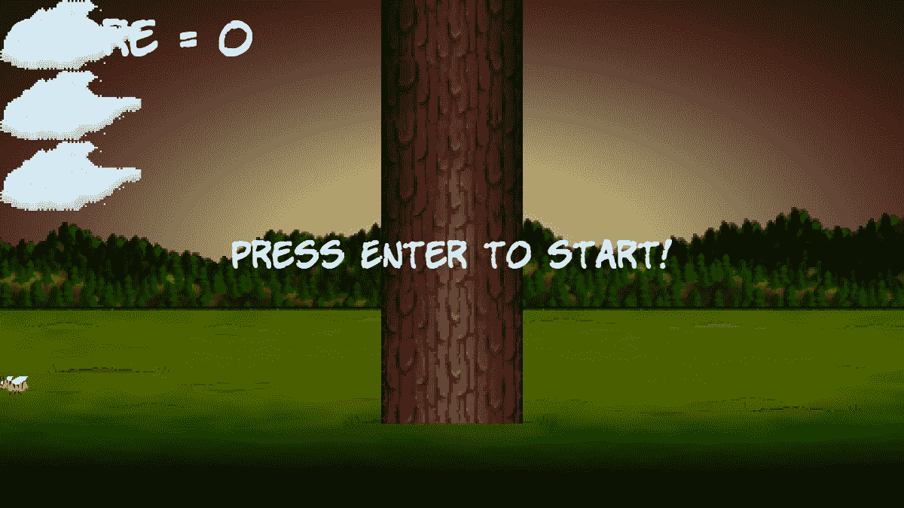
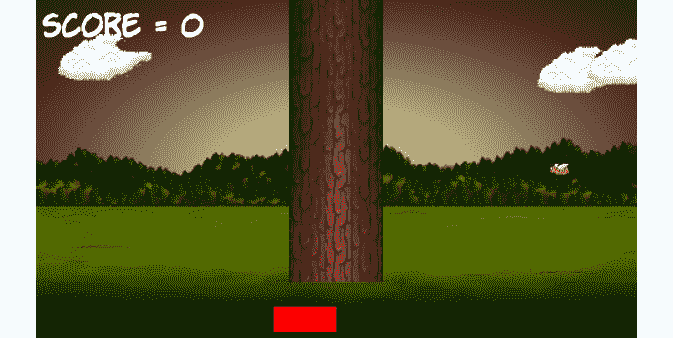
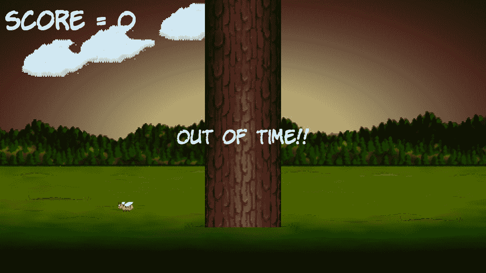

# 第 3 章 A:T2A: C++字符串和 SFML 时间-播放器输入和胡德

在本章中，我们将继续介绍木材！！游戏我们将在本章中花大约一半的时间学习如何操作文本并在屏幕上显示，另一半时间学习计时以及视觉时间条如何告知玩家剩余时间并在游戏中产生紧迫感。

我们将讨论以下主题：

*   暂停并重新启动游戏
*   C++字符串
*   SFML 文本和 SFML 字体类
*   为木材添加 HUD！！！
*   为木材添加时间条！！！

# 暂停并重新启动游戏

当我们在接下来的三章中研究这个游戏时，代码显然会越来越长。因此，现在似乎是一个提前思考并为代码添加更多结构的好时机。我们将添加此结构，以便暂停并重新启动游戏。

我们将添加代码，这样当游戏第一次运行时，它将处于暂停状态。然后，玩家可以按*回车*键开始游戏。然后，游戏将一直运行，直到玩家被压扁或时间用完为止。此时，游戏将暂停，等待玩家按下*回车*，以便重新开始游戏。

让我们一步一步地设置它。

首先，在主游戏循环外声明一个名为`paused`的新`bool`变量，并将其初始化为`true`：

```cpp
// Variables to control time itself
Clock clock;
// Track whether the game is running
bool paused = true;
while (window.isOpen())
{
    /*
    ****************************************
    Handle the players input
    ****************************************
    */
```

现在，每当游戏运行时，我们都有一个`paused`变量，它将是`true`。

接下来，我们将添加另一个`if`语句，其中表达式将检查*Enter*键当前是否被按下。如果正在按下，则将`paused`设置为`false`。在其他键盘处理代码之后添加以下突出显示的代码：

```cpp
/*
****************************************
Handle the players input
****************************************
*/
if (Keyboard::isKeyPressed(Keyboard::Escape))
{
    window.close();
}
// Start the game
if (Keyboard::isKeyPressed(Keyboard::Return))
{
 paused = false; 
}
/*
****************************************
Update the scene
****************************************
*/
```

现在，我们有一个名为`paused`的`bool`，它从`true`开始，但在玩家按下*回车*键时变为`false`。此时，我们必须根据`paused`的当前值做出适当的游戏循环响应。

我们将这样做。我们将把代码的整个更新部分，包括我们在上一章中为移动蜜蜂和云编写的代码，包装在一个`if`语句中。

在下面的代码中，请注意，`if`块只有在`paused`不等于`true`时才会执行。换句话说，游戏暂停时不会移动/更新。

这正是我们想要的。仔细看看我们添加新的`if`语句及其相应的开始和结束花括号`{...}`的地方。如果把它们放错地方，事情就不会像预期的那样进行。

添加以下突出显示的代码以包装代码的更新部分，并密切注意下面的上下文。我在几行上添加了`...`来表示隐藏代码。明显地不是真实的代码，不应该添加到游戏中。您可以通过其周围未高亮显示的代码来确定新代码（高亮显示）在起点和终点的放置位置：

```cpp
/*
****************************************
Update the scene
****************************************
*/
if (!paused)
{
    // Measure time
                ...
        ...
        ...

        // Has the cloud reached the right hand edge of the screen?
        if (spriteCloud3.getPosition().x > 1920)
        {
            // Set it up ready to be a whole new cloud next frame
            cloud3Active = false;
        }
    }
} // End if(!paused)
/*
****************************************
Draw the scene
****************************************
*/
```

请注意，当您放置新`if`块的右大括号时，VisualStudio 会整齐地调整所有缩进以保持代码整洁。

现在，您可以运行游戏，在按下*回车*键之前，一切都将是静态的。现在可以开始为我们的游戏添加功能了。我们只需要记住，当玩家死亡或时间用完时，我们需要将`paused`设置为`true`。

在前一章中，我们首先研究 C++字符串。我们需要更多地了解它们，以便实现玩家的 HUD。

# C++字符串

在上一章中，我们简要地提到了字符串，并了解到字符串可以保存字母数字数据——从单个字符到整本书。我们没有考虑声明、初始化或操作字符串，所以现在让我们这样做。

## 声明字符串

声明字符串变量很简单。这与我们在前一章中用于其他变量的过程相同：我们声明类型，后跟名称：

```cpp
String levelName;
String playerName;
```

一旦我们声明了一个字符串，我们就可以给它赋值。

## 给字符串赋值

要为字符串赋值，就像常规变量一样，我们只需输入名称，后跟赋值运算符，然后输入值：

```cpp
levelName = "DastardlyCave";
playerName = "John Carmack";
```

请注意，这些值需要用引号括起来。与常规变量一样，我们也可以在一行中声明和赋值：

```cpp
String score = "Score = 0";
String message = "GAME OVER!!";
```

在下一节中，我们将看到如何更改字符串变量的值。

## 操纵弦

我们可以使用`#include <sstream>`指令为字符串提供一些额外的操作选项。`sstream`类允许我们一起“添加”一些字符串。当我们一起添加字符串时，这被称为**串联**：

```cpp
String part1 = "Hello ";
String part2 = "World";
sstream ss;
ss<< part1 << part2;
// ss now holds "Hello World"
```

此外，通过使用`sstream`对象，字符串变量甚至可以与不同类型的变量连接。以下代码开始揭示字符串如何对我们有用：

```cpp
String scoreText = "Score = ";
int score = 0;
// Later in the code
score ++;
sstream ss;
ss<<scoreText<< score;
// ss now holds "Score = 1"
```

在前面的代码中，`ss`用于将`scoreText`的内容与`score`的值连接起来。注意，尽管 score 持有一个`int`值，`ss`持有的最终值仍然是一个持有等价值的字符串；在本例中，“1”。

提示

`<<`运算符是位运算符之一。但是，C++允许您编写自己的类并覆盖特定操作符在类的上下文中所做的操作。`sstream`类这样做是为了让`<<`操作符按照它的方式工作rk。复杂性隐藏在类中。我们可以使用它的功能，而不用担心它是如何工作的。如果您有冒险精神，可以在[上阅读有关操作员过载的信息 http://www.tutorialspoint.com/cplusplus/cpp_overloading.htm](http://www.tutorialspoint.com/cplusplus/cpp_overloading.htm) 。你不需要更多的信息来继续这个项目。

现在我们知道了 C++字符串的基本原理以及如何使用 AutoT0T，我们将研究如何使用一些 SFML 类来在屏幕上显示它们。

# SFML 的文本和字体类

在我们继续将代码添加到游戏之前，让我们先讨论一下使用一些假设代码的`Text`和`Font`类。

能够在屏幕上绘制文本的第一步是使用字体。在 T1 T1 中，第 1 章 AUTT3，Ty4T4，Ont5，C++，SFML，VisualStudio，并开始第一个游戏 To.T6.，我们在项目文件夹中添加了一个字体文件。现在，我们可以将字体加载到 SFML`Font`对象中，这样它就可以使用了。

执行此操作的代码如下所示：

```cpp
Font font;
font.loadFromFile("myfont.ttf");
```

在前面的代码中，我们首先声明`Font`对象，然后加载一个实际的字体文件。请注意，`myfont.ttf`是一种假设字体，我们可以使用项目文件夹中的任何字体。

加载字体后，我们需要一个 SFML`Text`对象：

```cpp
Text myText;
```

现在，我们可以配置我们的`Text`对象。这包括大小、颜色、屏幕上的位置、保存消息的字符串，当然还有将消息与`font`对象关联的行为：

```cpp
// Assign the actual message
myText.setString("Press Enter to start!");
// assign a size
myText.setCharacterSize(75);
// Choose a color
myText.setFillColor(Color::White);
// Set the font to our Text object
myText.setFont(font);
```

现在，我们可以创建和操作字符串值以及分配、声明和初始化 SFML`Text`对象，我们可以进入下一节，在这里我们将向木材添加 HUD！！！

# 实施 HUD

现在，我们已经对字符串、SFML`Text`和 SFML`Font`有了足够的了解，可以开始实现 HUD 了。**HUD**代表**平视显示器**。它可以像屏幕上的分数和文字信息一样简单，也可以包括更复杂的元素，如表示玩家角色所面对方向的时间条、迷你地图或指南针。

要开始使用 HUD，我们需要在代码文件的顶部添加另一个`#include`指令，以添加对`sstream`类的访问。正如我们已经知道的，`sstream`类添加了一些非常有用的功能，用于将字符串和其他变量类型组合到字符串中。

添加以下突出显示的代码行：

```cpp
#include <sstream>
#include <SFML/Graphics.hpp>
using namespace sf;
int main()
{
```

接下来，我们将设置我们的 SFML`Text`对象：一个用来保存消息，我们将根据游戏的状态进行更改，另一个用来保存分数并需要定期更新。

代码声明`Text`和`Font`对象，加载字体，将字体分配给`Text`对象，然后添加字符串消息、颜色和大小。从上一节的讨论来看，这应该很熟悉。此外，我们还添加了一个名为`score`的新`int`变量，我们可以对其进行操作，以便它保存玩家的分数。

提示

请记住，如果您选择了一个不同的字体从 AutoT0T，返回到 To.T3A.Ty4T.第 1 章 AutoT5，AutoT6A. Ty7T7，C++，SFML，VisualStudio，并开始第一个游戏 Ty8T8，您需要改变代码的那部分，以匹配在 Type T2AY 文件夹中的 OutT1 文件。

通过添加以下突出显示的代码，我们将准备继续更新 HUD：

```cpp
// Track whether the game is running
bool paused = true;
// Draw some text
int score = 0;
Text messageText;
Text scoreText;
// We need to choose a font
Font font;
font.loadFromFile("fonts/KOMIKAP_.ttf");
// Set the font to our message
messageText.setFont(font);
scoreText.setFont(font);
// Assign the actual message
messageText.setString("Press Enter to start!");
scoreText.setString("Score = 0");
// Make it really big
messageText.setCharacterSize(75);
scoreText.setCharacterSize(100);
// Choose a color
messageText.setFillColor(Color::White);
scoreText.setFillColor(Color::White);
while (window.isOpen())
{
    /*
    ****************************************
    Handle the players input
    ****************************************
    */
```

在上述代码中，我们实现了以下目标：

*   声明一个变量来保存分数
*   声明了一些 SFML`Text`和`Font`对象
*   通过从文件加载字体初始化`Font`对象
*   使用字体和一些字符串初始化`Text`对象
*   使用`setCharacterSize`和`setFillColor`功能设置`Text`对象的大小和颜色

下面的代码片段可能看起来有点复杂。然而，当你把它分解一点的时候，它是很简单的。检查并添加新突出显示的代码。我们将在这之后进行讨论：

```cpp
// Choose a color
messageText.setFillColor(Color::White);
scoreText.setFillColor(Color::White);
// Position the text
FloatRect textRect = messageText.getLocalBounds();
messageText.setOrigin(textRect.left +
 textRect.width / 2.0f,
 textRect.top +
 textRect.height / 2.0f);
messageText.setPosition(1920 / 2.0f,	1080 / 2.0f);
scoreText.setPosition(20, 20);
while (window.isOpen())
{
    /*
    ****************************************
    Handle the players input
    ****************************************
    */
```

我们将在屏幕上显示两个`Text`类型的对象。我们想用一点填充物将`scoreText`放置在左上角。这不是挑战；我们只需使用`scoreText.setPosition(20, 20)`，将其定位在左上角，水平和垂直填充为 20 像素。

然而，定位`messageText`并不那么容易。我们想把它放在屏幕的正中间。起初，这似乎不是问题，但我们必须记住，我们绘制的所有内容的原点都在左上角。因此，如果我们简单地将屏幕的宽度和高度除以 2，并在`mesageText.setPosition...`中使用结果，那么文本的左上角将位于屏幕的中心，它将不整齐地向右侧展开。

以下是为方便起见再次讨论的代码：

```cpp
// Position the text
FloatRect textRect = messageText.getLocalBounds();
messageText.setOrigin(textRect.left +
    textRect.width / 2.0f,
    textRect.top +
    textRect.height / 2.0f);
```

代码所做的是将`messageText`的*中心*设置到屏幕的中心。我们正在回顾的代码中相当复杂的部分将`messageText`的起源重新定位到了自身的中心。

在前面的代码中，我们首先声明一个名为`textRect`的`FloatRect`类型的新对象。顾名思义，`FloatRect`对象持有一个带有浮点坐标的矩形。

然后，代码使用`mesageText.getLocalBounds`函数以包裹`messageText`的矩形的坐标初始化`textRect`。

下一行代码由于相当长而分散在四行上，使用`messageText.setOrigin`函数将原点（用于绘制的点）更改为`textRect`的中心。当然，`textRect`保存一个与包裹`messageText`的坐标相匹配的矩形。然后，执行以下代码行：

```cpp
messageText.setPosition(1920 / 2.0f,	1080 / 2.0f);
```

现在，`messageText`将整齐地定位在屏幕的正中央。每次更改`messageText`的文本时，我们都会使用此代码，因为更改消息会更改`messageText`的大小，因此其来源将需要重新计算。

接下来，我们声明一个名为`ss`的`stringstream`类型的对象。注意，我们使用全名，包括名称空间，即`std::stringstream`。我们可以通过在代码文件的顶部添加`using namespace std`来避免这种语法。不过，我们不打算在这里讨论，因为我们很少使用它。看看下面的代码，并将其添加到游戏中；然后，我们可以更详细地了解它。由于我们只希望在游戏未暂停时执行此代码，请确保将其与其他代码一起添加到`if(!paused)`块中，如下所示：

```cpp
else
    {
        spriteCloud3.setPosition(
            spriteCloud3.getPosition().x +
            (cloud3Speed * dt.asSeconds()),
            spriteCloud3.getPosition().y);
        // Has the cloud reached the right hand edge of the screen?
        if (spriteCloud3.getPosition().x > 1920)
        {
            // Set it up ready to be a whole new cloud next frame
            cloud3Active = false;
        }
    }
 // Update the score text
 std::stringstream ss;
 ss<< "Score = " << score;
 scoreText.setString(ss.str());
}// End if(!paused)
/*
****************************************
Draw the scene
****************************************
*/
```

我们使用`ss`和`<<`操作符提供的特殊功能，将变量连接成`stringstream`。在这里，`ss << "Score = " << score`具有使用`"Score = "`创建字符串的效果。无论`score`的值是什么，都会连接在一起。例如，当游戏第一次开始时，`score`等于零，因此`ss`将保留`"Score = 0"`值。如果`score`发生变化，`ss`将调整每个帧。

下面的代码行只是将`ss`中包含的字符串设置为`scoreText`：

```cpp
scoreText.setString(ss.str());
```

现在可以将其绘制到屏幕上了。

下面的代码同时绘制了`Text`对象（`scoreText`和`messageText`，但是绘制`messageText`的代码被包装在`if`语句中。此`if`语句导致`messageText` 仅在游戏暂停时绘制。

添加以下突出显示的代码：

```cpp
// Now draw the insect
window.draw(spriteBee);
// Draw the score
window.draw(scoreText);
if (paused)
{
 // Draw our message
 window.draw(messageText);
}
// Show everything we just drew
window.display();
```

我们现在可以运行游戏，并看到我们的 HUD 正在屏幕上绘制。您将看到**分数=0**和**按 ENTER 键启动**消息。当您按*进入*时，后者将消失：



如果您想看到分数更新，请在`while(window.isOpen)`循环中的任意位置添加一行临时代码`score ++;`。如果你加上这条临时线，你会看到分数上升得很快，非常快！

如果您添加了临时代码，即`score ++;`，请确保在继续之前将其删除。

# 增加时间条

由于时间是游戏中的一个关键机制，因此有必要让玩家意识到它。他们需要知道分配给他们的六秒钟是否即将用完。当比赛接近尾声时，这会给他们一种紧迫感，如果他们表现得足够好，能够维持或增加剩余时间，就会给他们一种成就感。

在屏幕上绘制剩余的秒数不容易阅读（当专注于树枝时），也不是实现目标的特别有趣的方法。

我们需要的是时间条。我们的时间条将是一个简单的红色矩形，突出显示在屏幕上。它将开始很好和广泛，但随着时间的推移，迅速缩小。当玩家的剩余时间为零时，时间条将完全消失。

在添加时间条的同时，我们将添加必要的代码来跟踪玩家的剩余时间，并在时间用完时做出响应。让我们一步一步地看一遍。

找到前面的`Clock clock;`声明，并在其后面添加突出显示的代码，如下所示：

```cpp
// Variables to control time itself
Clock clock;
// Time bar
RectangleShape timeBar;
float timeBarStartWidth = 400;
float timeBarHeight = 80;
timeBar.setSize(Vector2f(timeBarStartWidth, timeBarHeight));
timeBar.setFillColor(Color::Red);
timeBar.setPosition((1920 / 2) - timeBarStartWidth / 2, 980);
Time gameTimeTotal;
float timeRemaining = 6.0f;
float timeBarWidthPerSecond = timeBarStartWidth / timeRemaining;
// Track whether the game is running
bool paused = true;
```

首先，我们声明一个`RectangleShape`类型的对象，并将其命名为`timeBar`。`RectagleShape`是一个 SFML 类，非常适合绘制简单的矩形。

接下来，我们将添加几个`float`变量`timeBarStartWidth`和`timeBarHeight`。我们分别将它们初始化为`400`和`80`。这些变量将帮助我们跟踪在每帧绘制`timeBar`所需的大小。

接下来，我们使用`timeBar.setSize`函数设置`timeBar`的大小。我们不只是传递两个新的`float`变量。首先，我们创建一个`Vector2f`类型的新对象。然而，这里的不同之处在于，我们没有给新对象命名。相反，我们只需使用两个浮点变量初始化它，并将其直接传递给`setSize`函数。

提示

`Vector2f`是一个包含两个`float`变量的类。它还有一些其他功能，将在本书中介绍。

之后，我们使用`setFillColor`功能将`timeBar`涂成红色。

在前面的代码中，我们对`timeBar`所做的最后一件事是设置其位置。垂直坐标是完全直接的，但是我们设置水平坐标的方式有点复杂。计算结果如下：

```cpp
(1920 / 2) - timeBarStartWidth / 2
```

首先，法典将 1920 除以 2。然后，它将`timeBarStartWidth`除以 2。最后，它从前者中减去后者。

结果是`timeBar`以水平的方式整齐地坐在屏幕中央。

我们讨论的最后三行代码声明了一个名为`gameTimeTotal`的新`Time`对象，一个名为`timeRemaining`的新`float`对象，该对象被初始化为`6`，以及一个名为`timeBarWidthPerSecond`的奇怪声音`float`，我们将在下一步讨论。

用`timeBarStartWidth`除以`timeRemaining`初始化`timeBarWidthPerSecond`变量。结果就是游戏中每秒钟`timeBar`需要缩小的像素数量。当我们在每一帧中调整`timeBar`的大小时，这将非常有用。

显然，每次玩家开始新游戏时，我们都需要重置剩余时间。这样做的逻辑位置是按下*回车*键。我们也可以同时将`score`设置回零。现在让我们通过添加以下突出显示的代码来实现这一点

```cpp
// Start the game
if (Keyboard::isKeyPressed(Keyboard::Return))
{
    paused = false;
 // Reset the time and the score
 score = 0;
 timeRemaining = 6;
}
```

现在，我们必须减少每一帧的剩余时间，并相应地调整`timeBar`的大小。将以下突出显示的代码添加到更新部分，如下所示：

```cpp
/*
****************************************
Update the scene
****************************************
*/
if (!paused)
{
    // Measure time
    Time dt = clock.restart();
 // Subtract from the amount of time remaining
 timeRemaining -= dt.asSeconds();
 // size up the time bar
 timeBar.setSize(Vector2f(timeBarWidthPerSecond *
 timeRemaining, timeBarHeight));
    // Set up the bee
    if (!beeActive)
    {
        // How fast is the bee
        srand((int)time(0) * 10);
        beeSpeed = (rand() % 200) + 200;
        // How high is the bee
        srand((int)time(0) * 10);
        float height = (rand() % 1350) + 500;
        spriteBee.setPosition(2000, height);
        beeActive = true;
    }
    else
        // Move the bee
```

首先，我们用以下代码减去播放器剩余的时间，减去前一帧执行所需的时间：

```cpp
timeRemaining -= dt.asSeconds();
```

然后，我们用以下代码调整了`timeBar`的大小：

```cpp
timeBar.setSize(Vector2f(timeBarWidthPerSecond *
        timeRemaining, timeBarHeight));
```

当乘以`timeRemaining`时，`Vector2F`的 x 值初始化为`timebarWidthPerSecond`。这就产生了正确的宽度，相对于玩家的剩余时间。高度保持不变，使用`timeBarHeight`时无需任何操作。

当然，我们必须检测时间何时已过。现在，我们只需检测时间已过，暂停游戏，并更改`messageText`的文本。稍后，我们将在这里做更多的工作。在前面添加的代码之后添加以下突出显示的代码。我们将在后面详细介绍：

```cpp
// Measure time
Time dt = clock.restart();
// Subtract from the amount of time remaining
timeRemaining -= dt.asSeconds();
// resize up the time bar
timeBar.setSize(Vector2f(timeBarWidthPerSecond *
    timeRemaining, timeBarHeight));
if (timeRemaining<= 0.0f) {

 // Pause the game
 paused = true;
 // Change the message shown to the player
 messageText.setString("Out of time!!");
 //Reposition the text based on its new size
 FloatRect textRect = messageText.getLocalBounds();
 messageText.setOrigin(textRect.left +
 textRect.width / 2.0f,
 textRect.top +
 textRect.height / 2.0f);
 messageText.setPosition(1920 / 2.0f, 1080 / 2.0f);
}
// Set up the bee
if (!beeActive)
{
    // How fast is the bee
    srand((int)time(0) * 10);
    beeSpeed = (rand() % 200) + 200;
    // How high is the bee
    srand((int)time(0) * 10);
    float height = (rand() % 1350) + 500;
    spriteBee.setPosition(2000, height);
    beeActive = true;
}
else
    // Move the bee
```

让我们逐步浏览前面的代码：

1.  首先，我们使用`if(timeRemaining<= 0.0f).`测试时间是否已用完
2.  然后，我们将`paused`设置为`true`，因此这将是最后一次执行代码的更新部分（直到播放器再次按下*Enter*。
3.  然后，我们更改`messageText`的消息，计算其新中心以设置为原点，并将其定位在屏幕中心。

最后，对于这部分代码，我们需要绘制`timeBar`。这段代码中没有我们以前见过很多次的新内容。请注意，我们在树后绘制`timeBar`，这样它就不会被部分遮挡。添加以下高亮显示的代码以绘制时间条：

```cpp
// Draw the score
window.draw(scoreText);
// Draw the timebar
window.draw(timeBar);
if (paused)
{
    // Draw our message
    window.draw(messageText);
}
// Show everything we just drew
window.display();
```

现在，您可以运行游戏，按*回车*键开始游戏，然后看着时间条平滑地消失为零：



然后游戏暂停，**超时！！**信息将出现在屏幕中央：



当然，您可以按*回车*再次开始游戏，并观看游戏从头开始运行。

# 总结

在本章中，我们学习了字符串、SFML`Text`和 SFML`Font`。在他们之间，他们允许我们在屏幕上绘制文本，这为玩家提供了一个 HUD。我们还使用了`sstream`，它允许我们连接字符串和其他变量来显示分数。

我们还研究了 SFML`RectangleShape`类，它完全按照其名称进行操作。我们使用了一个`RectangleShape`类型的对象和一些精心规划的变量来绘制一个时间条，直观地向玩家显示他们还剩多少时间。一旦我们实施了可以压扁玩家的切碎和移动分支，时间条将提供视觉反馈，从而产生紧张和紧迫感。

在下一章，我们将学习一系列新的 C++特性，包括循环、数组、切换、枚举和函数。这将允许我们移动树枝，跟踪它们的位置，并挤压玩家。

# 常见问题

Q） 我可以预见，将精灵放在左上角有时会很不方便。还有别的选择吗？

A） 幸运的是，您可以选择精灵的哪个点用作定位/原点像素，就像我们使用`messageText`一样，使用`setOrigin`功能。

Q） 代码越来越长，我正努力跟踪所有东西的位置。我们如何解决这个问题？

A） 是的，我同意。在下一章中，我们将介绍几种可以组织代码并使其更具可读性的方法中的第一种。当我们学习 C++函数时，我们将对此进行研究。另外，当我们学习 C++数组时，我们将学习一种新的方法来处理同一类型的多个对象/变量（如云）。