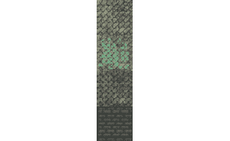
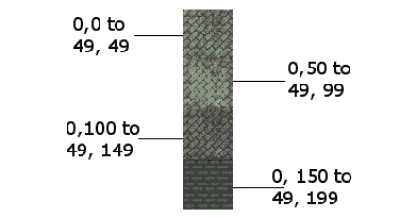
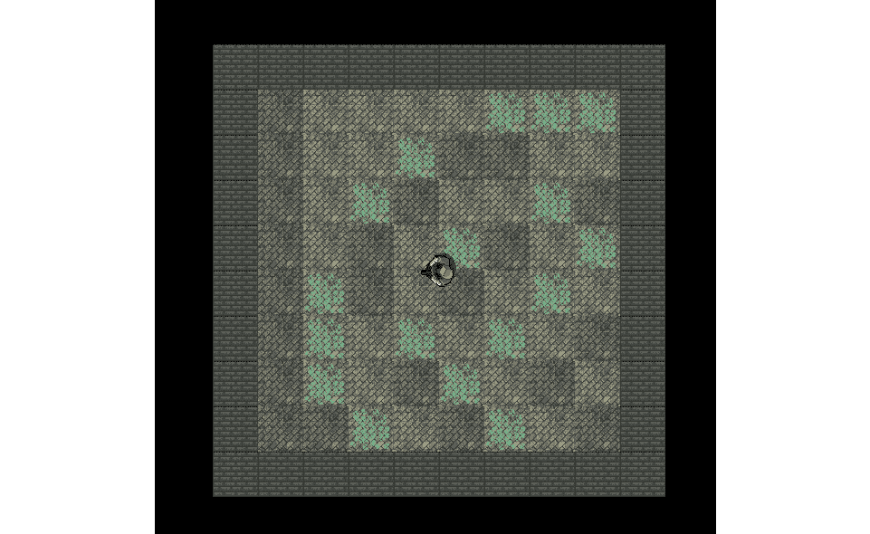

# 第 9 章第 2 章：C++ 参考文献、精灵列表和顶点数组

在[*第 4 章*](04.html#_idTextAnchor110)*循环、数组、开关、枚举和函数——实现游戏机制*中，我们讨论了范围。这是一个概念，即在函数或内部代码块中声明的变量在该函数或代码块中仅具有作用域（即，可以*看到*或使用）。只使用当前的 C++ 知识，这可能会导致问题。如果我们需要处理`main`函数中需要的一些复杂对象，我们该怎么办？这可能意味着所有代码都必须在`main`函数中。

在本章中，我们将探讨 C++ OrthT0 引用参考文献 To1-T1，它允许我们研究变量或对象，这些变量和对象在范围之外。除此之外，这些引用将帮助我们避免在函数之间传递大型对象，这是一个缓慢的过程。它很慢，因为每次我们这样做时，都必须创建变量或对象的副本。

有了这些新的参考知识，我们将研究 SFML`VertexArray`类，它允许我们建立一个大图像，可以使用单个图像文件中的多个部分快速有效地绘制到屏幕上。到本章结束时，我们将拥有一个可伸缩、随机、滚动的背景，它是使用引用和`VertexArray`对象制作的。

在本章中，我们将讨论以下主题：

*   C++ 参考文献
*   SFML 顶点数组
*   对随机滚动的背景进行编码

# C++ 参考文献

当我们将值传递给函数或从函数返回值时，这正是我们所做的-通过**值**传递/返回。所发生的事情是，创建变量所持有的值的副本，然后将其发送到函数，在函数中使用它。

这具有双重意义：

1.  如果我们希望函数对变量进行永久性更改，那么这个系统对我们没有好处。
2.  当副本作为参数传入或从函数返回时，会消耗处理能力和内存。对于一个简单的`int`，甚至可能是一个`Sprite`，这是无关紧要的。然而，对于一个复杂的对象，可能是整个游戏世界（或背景），复制过程将严重影响我们游戏的性能。

参考文献是这两个问题的解决方案。**参考**是一种特殊类型的变量。参考*指的是*另一个变量。下面是一个帮助您更好地理解这一点的示例：

```cpp
int numZombies = 100;
int& rNumZombies = numZombies;
```

在前面的代码中，我们声明并初始化了一个名为`numZombies`的常规`int`。然后我们声明并初始化一个名为`rNumZombies`的`int`引用。类型后面的引用运算符`&`确定正在声明引用。

提示

引用名称前面的`r`前缀是可选的，但对于记住我们正在处理引用非常有用。

现在，我们有一个名为`numZombies`的`int`变量，它存储值 100，还有一个名为`rNumZombies`的`int`引用，它表示`numZombies`。

我们对`numZombies`所做的任何事情都可以通过`rNumZombies`看到，而我们对`rNumZombies`所做的任何事情实际上都是对`numZombies`所做的。请看下面的代码：

```cpp
int score = 10;
int& rScore = score;
score ++ ;
rScore ++ ;
```

在前面的代码中，我们声明了一个名为`score`的`int`。接下来，我们声明一个名为`rScore`的`int`引用，它引用`score`。记住，我们对`score`所做的任何事情都可以被`rScore`看到，而我们对`rScore`所做的任何事情实际上都是对`score`所做的。

因此，考虑当我们这样增加增量 T0 时会发生什么：

```cpp
score ++ ;
```

`score`变量现在存储值 11。除此之外，如果我们要输出`rScore`，它也会输出 11。下一行代码如下：

```cpp
rScore ++ ;
```

现在，`score`实际上保留值 12，因为我们对`rScore`所做的任何事情实际上都是对`score`所做的。

提示

如果您想知道*这是如何工作的，那么我们将在下一章讨论**指针**时介绍更多内容。但是简单地说，你可以考虑在计算机内存中存储一个位置/地址。内存中的位置与它引用的变量存储其值的位置相同。因此，对引用或变量的操作具有完全相同的效果。*

现在，更重要的是讨论参考文献的*为什么*。使用参考文献有两个原因，我们已经提到了它们。这里再次总结了它们：

1.  在另一个函数中更改/读取变量/对象的值，否则超出范围。
2.  在不制作副本的情况下传递/返回函数（因此，效率更高）。

研究以下代码，然后我们将对其进行讨论：

```cpp
void add(int n1, int n2, int a);
void referenceAdd(int n1, int n2, int& a);
int main()
{
    int number1 = 2;
    int number2 = 2;
    int answer = 0;

    add(number1, number2, answer);
    // answer still equals zero because it is passed as a copy
    // Nothing happens to answer in the scope of main
    referenceAdd(number1, number2, answer);
    // Now answer equals 4 because it was passed by reference
    // When the referenceAdd function did this:
    // answer = num1 + num 2;
    // It is actually changing the value stored by answer
    return 0;
}
// Here are the two function definitions
// They are exactly the same except that
// the second passes a reference to a
void add(int n1, int n2, int a)
{
    a = n1 + n2;
    // a now equals 4
    // But when the function returns a is lost forever
}
void referenceAdd(int n1, int n2, int& a)
{
    a = n1 + n2;
    // a now equals 4
    // But a is a reference!
    // So, it is actually answer, back in main, that equals 4
}
```

前面的代码以两个函数的原型开始：`add`和`referenceAdd`。`add`函数使用三个`int`变量，`referenceAdd`函数使用两个`int`变量和一个`int`引用。

调用`add`函数并传入`number1`、`number2`和`answer`变量时，会制作一份值的副本，并操作`add`（即，`n1`、`n2`和`a`本地的新变量。因此，返回到`main`中的`answer`保持为零。

调用`referenceAdd`函数时，`number1`和`number2`再次按值传递。但是，`answer`是通过引用传递的。当添加到`n2`的`n1`值被分配给参考`a`时，实际发生的情况是该值被分配回`main`函数中的`answer`。

很明显，对于如此简单的事情，我们永远不需要使用引用。然而，它确实演示了通过引用传递的机制。

让我们总结一下我们对参考资料的了解。

## 参考文献综述

前面的代码演示了如何使用引用在一个范围内使用另一个范围内的代码更改变量的值。除了非常方便之外，通过引用传递也非常有效，因为不需要复制。我们的示例，即使用对`int`的引用，有点含糊不清，因为`int`太小，没有实际的效率增益。在本章的后面，我们将使用一个参考来通过整个级别布局，效率的提高将是显著的。

提示

有一个有参考资料的！必须在创建变量时将引用指定给该变量。这意味着它不是完全灵活的。现在不要担心这个。在下一章中，我们将进一步探讨参考文献以及它们更灵活（稍微复杂）的关系，例如**指针**。

这在很大程度上与`int`无关，但对于类的大型对象可能意义重大。我们将在本章后面实现僵尸竞技场游戏的滚动背景时使用这种精确的技术。

# SFML 顶点数组和精灵表

我们几乎准备好实现滚动背景。我们只需要了解 SFML 顶点数组和精灵表。

## 什么是雪碧床单？

**精灵表**是一组图像，可以是动画帧，也可以是包含在一个图像文件中的完全独立的图形。请仔细查看此精灵表，其中包含四个单独的图像，将用于在我们的僵尸竞技场游戏中绘制背景：



SFML 允许我们加载一个精灵表作为一个常规纹理，就像我们在本书中迄今为止对每个纹理所做的那样。当我们将多个图像作为单个纹理加载时，GPU 可以更有效地处理它。

提示

事实上，一台现代 PC 可以处理这四种纹理，而无需使用精灵表。然而，这些技术值得学习，因为我们的游戏对硬件的要求越来越高。

当我们从 sprite 表中绘制图像时，我们需要做的是确保参考我们需要的 sprite 表部分的精确像素坐标，如下所示：



上一个图表使用坐标及其在精灵工作表中的位置标记每个零件/平铺。这些坐标称为**纹理坐标**。我们将在代码中使用这些纹理坐标来绘制所需的正确部分。

## 什么是顶点数组？

首先，我们需要问，什么是顶点？**顶点**是单个图形点，即坐标。该点由水平和垂直位置定义。顶点的复数形式是顶点。因此，顶点数组是一个完整的顶点集合。

在 SFML 中，顶点数组中的每个顶点还具有一种颜色和一个相关的附加顶点（即一对坐标），称为**纹理坐标**。纹理坐标是我们想要在精灵表中使用的图像的位置。稍后，我们将看到如何定位图形并选择精灵表的一部分显示在每个位置，所有这些都使用单个顶点数组。

SFML`VertexArray`类可以保存不同类型的顶点集。但每个`VertexArray`只能容纳一种类型的集合。我们使用适合这种场合的电视机。

视频游戏中常见的场景包括但不限于以下**原语**类型：

*   **点**：每个点一个顶点。
*   **线条**：每组两个顶点，定义线条的起点和终点。
*   **三角形**：每点三个顶点。对于复杂的 3D 模型，这是最常用的（以千计），或者成对地创建一个简单的矩形，例如精灵。
*   **四边形**：每套四个顶点。这是从精灵图纸映射矩形区域的便捷方法。

我们将在这个项目中使用四边形。

## 用瓷砖搭建背景

僵尸竞技场背景将由随机排列的方形图像组成。你可以把这种安排想象成地板上的瓷砖。

在这个项目中，我们将使用带有**四元组**集合的顶点数组。每个顶点都是一组四个顶点（即四边形）的一部分。每个顶点将从我们的背景定义一个平铺的一个角，而每个纹理坐标将根据精灵工作表中的特定图像保留一个适当的值。

让我们看一些代码来开始。这不是我们将在项目中使用的确切代码，但它非常接近，允许我们在继续使用实际实现之前研究顶点数组。

## 构建顶点数组

当我们创建一个类的实例时，我们声明我们的新对象。下面的代码声明了一个名为`background`的`VertexArray`类型的新对象：

```cpp
// Create a vertex array
VertexArray background;
```

我们想让`VertexArray`的实例知道我们将使用哪种类型的原语。请记住，点、线、三角形和四边形都有不同数量的顶点。通过将`VertexArray`实例设置为保存特定类型，可以知道每个原语的开始。在我们的例子中，我们需要四个。以下是执行此操作的代码：

```cpp
// What primitive type are we using
background.setPrimitiveType(Quads);
```

与常规 C++ 数组一样，需要将一个 AUT0T0L 实例设置为特定的大小。然而，`VertexArray`类比常规数组更灵活。它允许我们在游戏运行时更改其大小。可以在声明的同时配置大小，但是我们的背景需要随着每个 wave 而扩展。`VertexArray`类通过`resize`函数提供此功能。以下是将竞技场大小设置为 10 x 10 瓷砖大小的代码：

```cpp
// Set the size of the vertex array
background.resize(10 * 10 * 4);
```

在前一行代码中，第一个`10`是宽度，第二个`10`是高度，4 是四边形中的顶点数。我们本可以通过 400 分，但这样的计算让我们清楚地知道我们在做什么。当我们将项目编码为 real 时，我们将更进一步，以帮助澄清，并为计算的每个部分声明变量。

我们现在有一个`VertexArray`实例，可以配置它的数百个顶点。下面是我们如何设置前四个顶点（即第一个四边形）上的位置坐标：

```cpp
// Position each vertex in the current quad
background[0].position = Vector2f(0, 0);
background[1].position = Vector2f(49, 0);
background[2].position = Vector2f(49,49);
background[3].position = Vector2f(0, 49);
```

下面是我们如何将这些相同顶点的纹理坐标设置为精灵工作表中的第一个图像。图像文件中的这些坐标从 0,0（左上角）到 49,49（右下角）：

```cpp
// Set the texture coordinates of each vertex
background[0].texCoords = Vector2f(0, 0);
background[1].texCoords = Vector2f(49, 0);
background[2].texCoords = Vector2f(49, 49);
background[3].texCoords = Vector2f(0, 49);
```

如果我们想将纹理坐标设置为 sprite 工作表中的第二个图像，我们将编写如下代码：

```cpp
// Set the texture coordinates of each vertex
background[0].texCoords = Vector2f(0, 50);
background[1].texCoords = Vector2f(49, 50);
background[2].texCoords = Vector2f(49, 99);
background[3].texCoords = Vector2f(0, 99);
```

当然，如果我们像这样单独定义每个顶点，那么即使是一个简单的 10 乘 10 竞技场，我们也要花很长时间来配置。

当我们实现真实背景时，我们将设计一组嵌套的`for`循环，循环通过每个四边形，选择一个随机背景图像，并指定适当的纹理坐标。

代码需要相当智能。它需要知道何时是边缘平铺，以便可以使用“精灵”工作表中的墙图像。它还需要使用适当的变量，知道每个背景瓷砖在精灵表中的位置，以及所需竞技场的总体大小。

我们将通过将所有代码放在一个单独的函数和一个单独的文件中来管理这种复杂性。我们将使用 C++ 引用使 ALE T0.实例在 ALE T1 中使用。

我们稍后会研究这些细节。您可能已经注意到，我们从未将纹理（精灵表与顶点数组）关联起来。现在让我们看看怎么做。

## 使用顶点数组进行绘制

我们可以以加载任何其他纹理的相同方式加载精灵表作为纹理，如下代码所示：

```cpp
// Load the texture for our background vertex array
Texture textureBackground;
textureBackground.loadFromFile("graphics/background_sheet.png");
```

然后我们可以通过一次调用`draw`来绘制整个`VertexArray`：

```cpp
// Draw the background
window.draw(background, &textureBackground);
```

前面的代码比将每个瓷砖作为单个精灵绘制要高效得多。

重要提示

在我们继续之前，请注意在`textureBackground`代码之前有点奇怪的`&`符号。你的直接想法可能是这与参考文献有关。这里发生的事情是我们传递的是`Texture`实例的地址，而不是实际的`Texture`实例。我们将在下一章中进一步了解这一点。

我们现在能够使用我们对引用和顶点数组的知识来实现僵尸竞技场项目的下一阶段。

# 创建随机生成的滚动背景

在本节中，我们将创建一个函数，在单独的文件中创建背景。通过使用顶点数组引用，我们将确保`main`函数可以使用背景（在范围内）。

当我们编写与`main`函数共享数据的其他函数时，我们将把它们都写在它们自己的`.cpp`文件中。我们将在一个新的头文件中为这些函数提供原型，我们将在`ZombieArena.cpp`中包含（带有`#include`指令）。

为了实现这一点，让我们创建一个名为`ZombieArena.h`的新头文件。现在，我们已经准备好为新函数编写头文件。

在这个新的`ZombieArena.h`头文件中，添加以下突出显示的代码，包括函数原型：

```cpp
#pragma once
using namespace sf;
int createBackground(VertexArray& rVA, IntRect arena);
```

前面的代码允许我们编写名为`createBackground`的函数的定义。为了匹配原型，函数定义必须返回一个`int`值，并接收一个`VertexArray`引用和一个`IntRect`对象作为参数。

现在，我们可以创建一个新的`.cpp`文件，在其中我们将对函数定义进行编码。创建一个名为`CreateBackground.cpp`的新文件。现在，我们已经准备好编写将创建我们的背景的函数定义。

将以下代码添加到`CreateBackground.cpp`文件中，然后我们将对其进行查看：

```cpp
#include "ZombieArena.h"
int createBackground(VertexArray& rVA, IntRect arena)
{
    // Anything we do to rVA we are really doing
    // to background (in the main function)

    // How big is each tile/texture
    const int TILE_SIZE = 50;
    const int TILE_TYPES = 3;
    const int VERTS_IN_QUAD = 4;
    int worldWidth = arena.width / TILE_SIZE;
    int worldHeight = arena.height / TILE_SIZE;
    // What type of primitive are we using?
    rVA.setPrimitiveType(Quads);
    // Set the size of the vertex array
    rVA.resize(worldWidth * worldHeight * VERTS_IN_QUAD);
    // Start at the beginning of the vertex array
    int currentVertex = 0;
    return TILE_SIZE;
}
```

在前面的代码中，我们编写了函数签名以及标记函数体的开始和结束花括号。

在函数体中，我们声明并初始化三个新的`int`常量，以保存在函数其余部分中需要引用的值。它们是`TILE_SIZE`、`TILE_TYPES`和`VERTS_IN_QUAD`。

`TILE_SIZE`常数是指 sprite 表中每个瓷砖的大小（以像素为单位）。`TILE_TYPES`常数是指 sprite 表中不同瓷砖的数量。我们可以在 sprite 表中添加更多的块，并更改`TILE_TYPES`以匹配更改，我们将要编写的代码仍然可以工作。`VERTS_IN_QUAD`表示每个四边形中有四个顶点。与总是键入不太清晰的数字`4`相比，使用此常量不太容易出错。

然后我们声明并初始化两个`int`变量：`worldWidth`和`worldHeight`。这些变量的用途可能显而易见。它们的名字背叛了它们，但值得指出的是，它们指的是世界的宽度和高度，是瓷砖的数量，而不是像素。`worldWidth`和`worldHeight`变量通过将进入竞技场的高度和宽度除以`TILE_SIZE`常数来初始化。

接下来，我们将第一次使用我们的参考资料。记住，我们对`rVA`所做的任何事情，实际上都是对传入的变量所做的，它在`main`函数的作用域中（或者在编写代码时）。

然后，我们使用`rVA.setType`准备顶点数组以使用四边形，然后通过调用`rVA.resize`使其大小刚好合适。对于`resize`函数，我们传入`worldWidth * worldHeight * VERTS_IN_QUAD`的结果，这正好等于我们准备完成顶点数组时将拥有的顶点数。

最后一行代码声明并将`currentVertex`初始化为零。我们将使用`currentVertex`循环遍历顶点数组，初始化所有顶点。

现在我们可以编写嵌套`for`循环的第一部分，该循环将准备顶点数组。添加以下突出显示的代码，并根据我们对顶点数组的了解，尝试了解它的功能：

```cpp
    // Start at the beginning of the vertex array
    int currentVertex = 0;
 for (int w = 0; w < worldWidth; w++)
 {
 for (int h = 0; h < worldHeight; h++)
 {
 // Position each vertex in the current quad
 rVA[currentVertex + 0].position = 
 Vector2f(w * TILE_SIZE, h * TILE_SIZE);

 rVA[currentVertex + 1].position =
 Vector2f((w * TILE_SIZE) + TILE_SIZE, h * TILE_SIZE);

 rVA[currentVertex + 2].position =
 Vector2f((w * TILE_SIZE) + TILE_SIZE, (h * TILE_SIZE) 
 + TILE_SIZE);

 rVA[currentVertex + 3].position =
 Vector2f((w * TILE_SIZE), (h * TILE_SIZE) 
 + TILE_SIZE);

 // Position ready for the next four vertices
 currentVertex = currentVertex + VERTS_IN_QUAD;
 }
 }
    return TILE_SIZE;
}
```

我们刚刚使用嵌套的`for`循环添加了通过顶点数组的步骤的代码，该循环首先通过前四个顶点进行步骤：`currentVertex + 1`、 `currentVertex + 2`等等。

我们使用数组符号`rvA[currentVertex + 0]..`等访问数组中的每个顶点。使用数组表示法，我们调用`position`函数`rvA[currentVertex + 0].position...`。

对于`position`函数，我们传递每个顶点的水平和垂直坐标。我们可以通过组合使用`w`、`h`和`TILE_SIZE`以编程方式计算出这些坐标。

在上一个代码的末尾，我们定位了`currentVertex`，通过将嵌套的`for`循环向前推进四位（即添加四位），为下一次通过该循环做好准备，即`currentVertex = currentVertex + VERTS_IN_QUAD`。

当然，所有这些都是设置顶点的坐标；它不会从“精灵”工作表中指定纹理坐标。这就是我们下一步要做的。

为了明确新代码的去向，我在上下文中展示了它，以及我们刚才编写的所有代码。添加并研究以下突出显示的代码：

```cpp
for (int w = 0; w < worldWidth; w++)
    {
        for (int h = 0; h < worldHeight; h++)
        {
            // Position each vertex in the current quad
            rVA[currentVertex + 0].position = 
                Vector2f(w * TILE_SIZE, h * TILE_SIZE);

            rVA[currentVertex + 1].position =
                Vector2f((w * TILE_SIZE) + TILE_SIZE, h * TILE_SIZE);

            rVA[currentVertex + 2].position =
                Vector2f((w * TILE_SIZE) + TILE_SIZE, (h * TILE_SIZE) 
                + TILE_SIZE);

            rVA[currentVertex + 3].position =
                Vector2f((w * TILE_SIZE), (h * TILE_SIZE) 
                + TILE_SIZE);

 // Define the position in the Texture for current quad
 // Either grass, stone, bush or wall
 if (h == 0 || h == worldHeight-1 || 
 w == 0 || w == worldWidth-1)
 {
 // Use the wall texture
 rVA[currentVertex + 0].texCoords = 
 Vector2f(0, 0 + TILE_TYPES * TILE_SIZE);

 rVA[currentVertex + 1].texCoords = 
 Vector2f(TILE_SIZE, 0 + 
 TILE_TYPES * TILE_SIZE);

 rVA[currentVertex + 2].texCoords = 
 Vector2f(TILE_SIZE, TILE_SIZE + 
 TILE_TYPES * TILE_SIZE);

 rVA[currentVertex + 3].texCoords = 
 Vector2f(0, TILE_SIZE + 
 TILE_TYPES * TILE_SIZE);
 }

            // Position ready for the next for vertices
            currentVertex = currentVertex + VERTS_IN_QUAD;
        }
    }
    return TILE_SIZE;
}
```

前面突出显示的代码在精灵图纸内设置每个顶点相关的坐标。注意有点长的`if`条件。该条件检查当前四元组是竞技场中第一个四元组还是最后一个四元组。如果它是（第一个或最后一个），则表示它是边界的一部分。然后，我们可以使用一个简单的公式，使用`TILE_SIZE`和`TILE_TYPES`从 sprite 床单中瞄准墙壁纹理。

依次为每个顶点初始化数组符号和`texCoords`成员，以指定精灵表中墙纹理的适当角。

下面的代码被包装在一个`else`块中。这意味着，每当四边形不表示边框/墙砖时，它将通过嵌套的`for`循环运行。在现有代码中添加以下突出显示的代码，然后我们将对其进行检查：

```cpp
            // Define position in Texture for current quad
            // Either grass, stone, bush or wall
            if (h == 0 || h == worldHeight-1 ||
                w == 0 || w == worldWidth-1)
            {
                // Use the wall texture
                rVA[currentVertex + 0].texCoords = 
                    Vector2f(0, 0 + TILE_TYPES * TILE_SIZE);

                rVA[currentVertex + 1].texCoords = 
                    Vector2f(TILE_SIZE, 0 + 
                    TILE_TYPES * TILE_SIZE);

                rVA[currentVertex + 2].texCoords = 
                    Vector2f(TILE_SIZE, TILE_SIZE + 
                    TILE_TYPES * TILE_SIZE);

                rVA[currentVertex + 3].texCoords = 
                    Vector2f(0, TILE_SIZE + 
                    TILE_TYPES * TILE_SIZE);
            }
 else
 {
 // Use a random floor texture
 srand((int)time(0) + h * w - h);
 int mOrG = (rand() % TILE_TYPES);
 int verticalOffset = mOrG * TILE_SIZE;
 rVA[currentVertex + 0].texCoords = 
 Vector2f(0, 0 + verticalOffset);

 rVA[currentVertex + 1].texCoords = 
 Vector2f(TILE_SIZE, 0 + verticalOffset);

 rVA[currentVertex + 2].texCoords = 
 Vector2f(TILE_SIZE, TILE_SIZE + verticalOffset);

 rVA[currentVertex + 3].texCoords = 
 Vector2f(0, TILE_SIZE + verticalOffset);
 } 
            // Position ready for the next for vertices
            currentVertex = currentVertex + VERTS_IN_QUAD;
        }
    }
    return TILE_SIZE;
}
```

前面突出显示的代码首先在随机数生成器中植入一个公式，该公式在循环的每个过程中都是不同的。然后，`mOrG`变量被初始化为一个介于 0 和`TILE_TYPES`之间的数字。这正是我们随机选择一种瓷砖类型所需要的。

重要提示

`mOrG`代表“泥或草”。名称是任意的。

现在，我们通过将`mOrG`乘以`TileSize`来声明并初始化一个名为`verticalOffset`的变量。现在，在精灵表中有一个垂直参考点，指向当前四边形的随机选择纹理的起始高度。

现在，我们使用一个涉及到`TILE_SIZE`和`verticalOffset`的简单公式将纹理每个角的精确坐标指定给适当的顶点。

我们现在可以在游戏引擎中使用我们的新功能。

# 使用背景

我们已经做了一些棘手的事情，所以这很简单。有三个步骤，如下所示：

1.  创建一个`VertexArray`。
2.  在调平每个波浪后初始化它。
3.  在每一帧中绘制它。

添加以下突出显示的代码以声明名为`background`的`VertexArray`实例并将`background_sheet.png`文件作为纹理加载：

```cpp
// Create an instance of the Player class
Player player;
// The boundaries of the arena
IntRect arena;
// Create the background
VertexArray background;
// Load the texture for our background vertex array
Texture textureBackground;
textureBackground.loadFromFile("graphics/background_sheet.png");
// The main game loop
while (window.isOpen())
```

添加以下代码调用`createBackground`函数，传入`background`作为引用，并按值传入`arena`。注意，在突出显示的代码中，我们还修改了初始化`tileSize`变量的方式。添加高亮显示的代码，如图所示：

```cpp
if (state == State::PLAYING)
{
    // Prepare the level
    // We will modify the next two lines later
    arena.width = 500;
    arena.height = 500;
    arena.left = 0;
    arena.top = 0;
 // Pass the vertex array by reference 
 // to the createBackground function
 int tileSize = createBackground(background, arena);
    // We will modify this line of code later
 // int tileSize = 50;
    // Spawn the player in the middle of the arena
    player.spawn(arena, resolution, tileSize);
    // Reset the clock so there isn't a frame jump
    clock.restart();
}
```

请注意，我们已经替换了代码的`int tileSize = 50`行，因为我们直接从`createBackground`函数的返回值获取值。

提示

为了将来代码的清晰性，您应该删除代码的`int tileSize = 50`行及其相关注释。我只是对它进行了注释，以便为新代码提供更清晰的上下文。

最后，是画图的时候了。这真的很简单。我们所做的就是调用`window.draw`并传递`VertexArray`实例，以及`textureBackground`纹理：

```cpp
/*
 **************
 Draw the scene
 **************
 */
if (state == State::PLAYING)
{
    window.clear();
    // Set the mainView to be displayed in the window
    // And draw everything related to it
    window.setView(mainView);
 // Draw the background
 window.draw(background, &textureBackground);
    // Draw the player
    window.draw(player.getSprite());
}
```

提示

如果你想知道在`textureBackground`前面的奇怪的`&`标志是怎么回事，那么在下一章中，所有的一切都会被弄清楚。

您现在可以运行游戏了。您将看到以下输出：



他re，注意玩家精灵如何在竞技场的范围内平滑地滑行和旋转。尽管`main`函数中的当前代码绘制了一个小竞技场，`CreateBackground`函数可以创建任何大小的竞技场。我们将在[*第 13 章*](13.html#_idTextAnchor279)、*音效、文件 I/O 和游戏结束*中看到比屏幕更大的竞技场。

# 总结

在本章中，我们发现 C++ 引用，它们是作为另一变量别名的特殊变量。当我们通过引用而不是通过值传递变量时，我们对引用所做的任何操作都会发生在调用函数中的变量上。

我们还学习了顶点数组，并创建了一个充满四边形的顶点数组，以从精灵表中绘制瓷砖作为背景。

当然，房间里的大象是我们的僵尸游戏没有任何僵尸。我们将在下一章中通过学习 C++ 指针和 ALE T0 标准模板库 ALE T1（St2）来学习这一点。

# 常见问题

以下是您可能想到的一些问题：

Q） 你能再总结一下这些参考资料吗？

A） 必须立即初始化引用，并且不能将其更改为引用其他变量。将引用与函数一起使用，以便不处理副本。这有利于提高效率，因为它避免了复制，并帮助我们更容易地将代码抽象为函数。

Q） 有没有一种简单的方法可以记住使用引用的主要好处？

a）为了帮助你记住引用的内容，请考虑这个简短的押韵：

*移动大型物体会让我们的游戏变得波涛汹涌，*

*引用传递比复制快。*