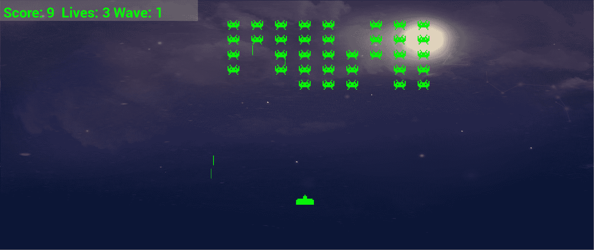
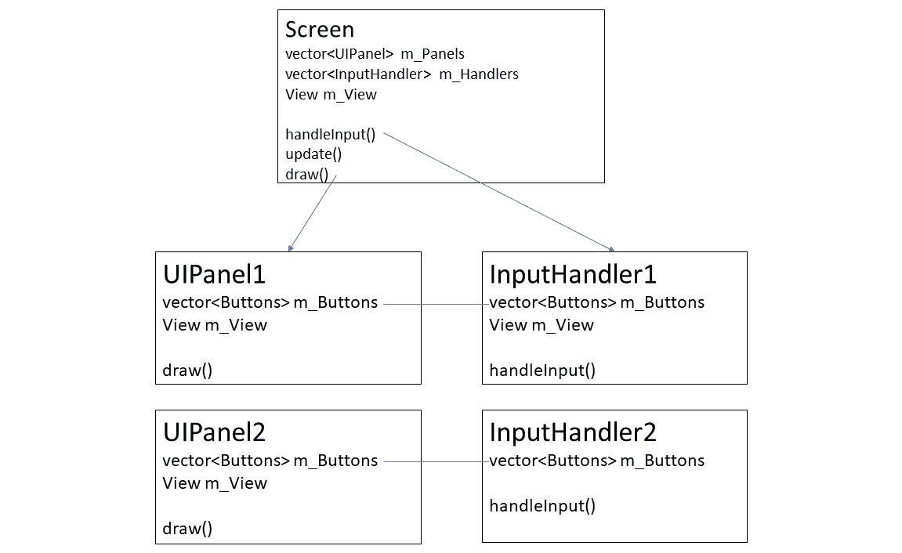
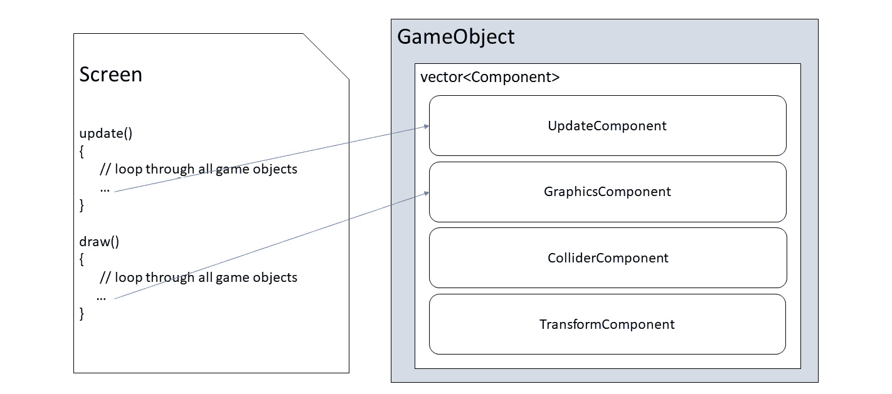
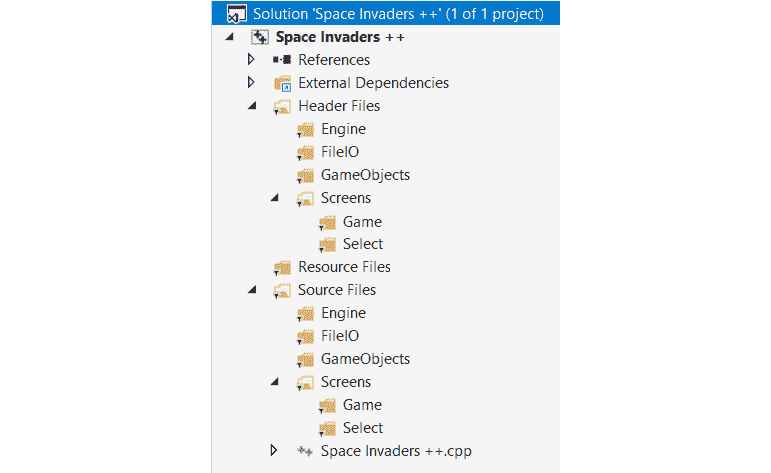
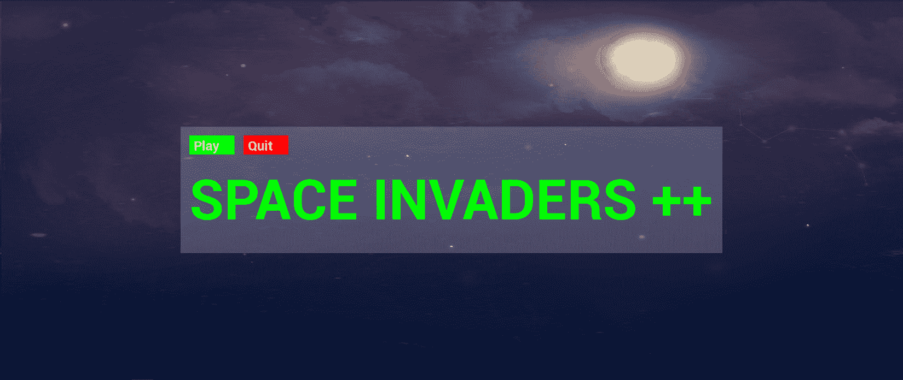
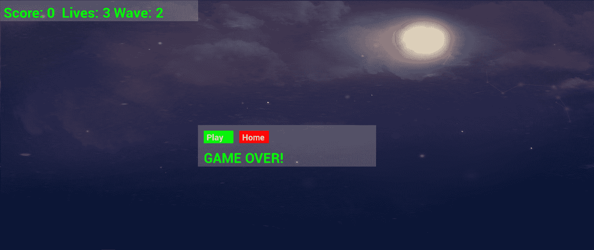

# *第十九章*:游戏编程设计模式——启动太空入侵者++游戏

欢迎来到最终项目。正如您现在已经预料到的，这个项目将在学习新的 C++技术方面向前迈出重要的一步。接下来的四章将关注诸如**智能指针**、C++ **断言、**使用游戏手柄控制器、使用 Visual Studio 进行调试、**将基类的**指针转换为特定派生类的指针、调试以及首先关注**设计模式**等主题。

我的猜测是，如果你打算用 C++制作深度、大规模的游戏，那么设计模式将成为你未来几个月和几年学习日程的一大部分。为了介绍这个至关重要的话题，我选择了一个相对简单但有趣的游戏作为例子。在这一章中，我们将了解更多关于太空入侵者++游戏的信息，然后我们可以进入设计模式以及我们为什么需要它们的话题。

在这一章中，我们将涉及以下主题:

*   了解太空入侵者++以及我们为什么选择它作为最终项目。
*   了解什么是设计模式，以及为什么它们对游戏开发者很重要。
*   研究太空入侵者++项目中的设计模式，该项目将在接下来的四章中使用。
*   我们将开始太空入侵者++项目。
*   编写大量的类来充实游戏。

先说说游戏本身。

# 太空入侵者++

看看下面三张截图，直观地解释了我们需要了解的关于太空入侵者++的大部分内容。以防你还不知道，《太空入侵者》是最早的街机游戏之一，发行于 1978 年。如果你喜欢一点历史，可以在这里阅读维基百科太空入侵者游戏页面:[https://en.wikipedia.org/wiki/Space_Invaders](https://en.wikipedia.org/wiki/Space_Invaders)。

第一张截图显示了我们游戏的简单开始屏幕。为了讨论下一步要做的屏幕，我们将其称为**选择屏幕**。玩家有两个选择:退出或玩。但是，到本章结束时，您将知道如何添加和切换任意多个屏幕:


如你所见，在前面的截图中，有一个我们之前没有实现的新功能:可点击按钮。我们将很快更多地讨论按钮和它们的对应物，例如用户界面面板和屏幕。

下面的截图显示了游戏的运行情况。玩起来很简单。为了讨论下一步要做的屏幕，我们将下面的截图称为**播放屏幕**。入侵者向玩家射击时从左向右移动。当他们到达屏幕边缘时，他们下降一点，加快速度，并返回左侧:



玩家可以左右移动，也可以上下移动，但垂直移动仅限于屏幕的下半部分。

重要说明

最初的太空入侵者游戏只允许水平移动。

下面的截图显示了玩家失去三条生命时的选项。他们可以选择再次播放或退出并返回选择屏幕:


虽然空间入侵者++确实允许我们引入许多新的 C++主题，我已经在本章的介绍中提到过，以及一些更与游戏相关的主题，例如使用游戏手柄控制器，但与以前的项目相比，这确实在复杂性方面没有真正提高。那么，为什么选择这个作为最终项目呢？

重要说明

在这个项目中，有很多代码。我们以前见过的大部分，要么在同一个语境中，要么在不同的语境中。不可能解释每一行，因为新书需要这样做。我已经非常仔细地选择了要完整解释的代码，要提到的代码，以及我猜你能自己解决的代码。我建议您随着进度学习本书和下载包中的所有代码。然而，我将详细讨论代码的结构，因为这是这个项目真正的学习目标。此外，本书显示了所有的 C++代码，因此没有遗漏任何内容，尽管只显示了`level1.txt`文件的概述。

## 为什么太空入侵者++？

开始讨论之前，请考虑一下我写这本书的两个目标:

1.  这本书的第一个目标是向你介绍使用视频游戏学习材料的 C++编程。我已经在几个场合和几个话题上承认，这只是一个介绍。C++和游戏开发太大了，不适合单独写这本书。
2.  这本书的第二个目标是让你能够继续学习，同时仍然使用游戏作为学习材料。

问题是，正如我们所看到的，每次我们构建一个比上一个功能更多的游戏时，我们最终得到的是更复杂的代码结构，代码文件也变得越来越长。在这本书里，我们学习了改进代码结构的新方法，在每个阶段，我们都取得了成功，但是游戏日益增加的复杂性似乎总是超过了我们学习的代码改进。

这个项目旨在解决这个复杂的问题，并收回我们的源代码控制。尽管这个游戏没有前一个项目那么深入，但要处理的类会多得多。

这显然意味着相当复杂的结构。然而，这也意味着，一旦你掌握了这个结构，你将能够在更复杂的游戏中重用它，而没有任何代码文件超过几百行代码。

这个项目的目的是让你提出你自己的游戏想法，甚至是复杂的想法，并使用我们将在下一节讨论的设计模式立即开始。

小费

然而，请注意，我绝对不是建议我们将在这里学习的代码结构(设计模式)是您的游戏开发未来的最终解决方案；事实上，他们远非如此。你将学到的是解决方案，让你开始你的梦想项目，而不会让复杂性阻止你前进。在这个过程中，你仍然需要学习更多关于设计模式、C++和游戏开发的知识。

那么，什么是设计模式呢？

# 设计图案

一个**设计模式**是一个编码问题的可重用解决方案。事实上，大多数游戏(包括这个)都会使用多种设计模式。设计模式的关键点在于:它们已经被证明为一个常见问题提供了一个好的解决方案。我们不会发明任何设计模式——我们只是使用一些已经存在的模式来解决我们不断扩展的代码的问题。

许多设计模式相当复杂，如果你想开始学习它们，需要在本书的水平之外进一步学习。接下来是一些关键的游戏开发相关模式的简化，这将有助于实现本书的第二个目标。我们敦促你继续你的研究，以便更全面地实现它们，并与比这里将要讨论的更多的模式一起实现它们。

让我们看看空间入侵者++项目中使用的设计模式。

## 屏幕、输入栏、界面和按钮

这个项目将比任何其他项目更进一步抽象一些概念。太空入侵者++将引入**屏幕**的概念。通过给出一些例子，屏幕的概念最容易理解。游戏可以有菜单屏幕、设置屏幕、高分屏幕和游戏屏幕。一个**屏幕**是游戏各部分的逻辑划分。每个屏幕都有一些与其他屏幕相同的地方，但是每个屏幕也需要自己独特的功能。例如，一个菜单屏幕可能有按钮，使玩家能够转换到另一个屏幕，以及一个整洁的图形图像，甚至是一个动态场景。当然，高分屏幕将有一个所有高分的列表，也许还有一个返回菜单屏幕的按钮。每个屏幕将有不同的布局，不同的按钮点击，不同的键盘按下反应，但它们都需要以 60 FPS 绘制，并以相同的方式与游戏引擎交互。

在之前的项目中，我们将屏幕的概念塞进了一个地方。这意味着我们有大量长的`if`、`else`和`else if`代码块来处理更新、绘制和响应用户交互。我们的代码已经变得很难处理了。如果我们要构建更复杂的游戏，我们需要在这方面进行改进。屏幕的概念意味着我们可以创建一个类来处理每个屏幕发生的所有事情，例如更新、绘制和用户交互，然后为每种类型的屏幕创建一个派生类，即菜单、游戏、高分等等，它处理特定屏幕需要更新、绘制和响应用户的独特方式。

在太空入侵者++中，我们将有一个`Screen`类。然后我们将继承`Screen`来处理两个屏幕，`SelectScreen`和`GameScreen`。此外，我们将有一个知道如何显示按钮的`Button`类，一个知道如何绘制文本的`UIPanel`类，`Button`实例以及一个知道如何检测键盘和游戏手柄交互的`InputHandler`类。然后，我们将能够从`UIPanel`和`InputHandler`派生，让所有不同的`Screen`实例按照要求精确地运行，而不需要多次编码屏幕、用户界面面板、输入处理程序或按钮的基础。你的游戏越大，屏幕越多，这样做的好处就越大。这也意味着每个屏幕的细节不会像我们到目前为止所做的那样被塞进长的`if`、`else`和`else if`结构中。

这有点像我们如何对`PlayableCharacter`类进行编码并从中导出`Thomas`和`Bob`。然而，正如我们将看到的，我们这次在抽象上走得更远。请看下图，它展示了这个想法的一个表现，并且只显示了一个屏幕:



在上图中，我们可以看到一个屏幕有一个或多个`UIPanel`实例可以选择性显示，`UIPanel`实例可以有零个或多个`Button`实例。每个`UIPanel`将有一个相关的`InputHandler`，因为每个`UIPanel`将有不同的按钮组合和布局。按钮通过`UIPanel`和`InputHandler`实例之间的指针共享。

如果你想知道哪个类处理游戏循环的更新阶段，答案是`Screen`类。然而，一旦你了解了这个模式是如何工作的，添加让`UIPanel`实例也在更新阶段工作的能力将会很简单。例如，如果面板需要移动或者可能显示加载进度条，这可能会很有用。

屏幕将决定哪些`UIPanel`(因此，`InputHandler`)实例当前可见并响应。但是，玩家一次只能看到一个屏幕。我们将编写一个`ScreenManager`类，它将是游戏引擎的一个基本部分，用于处理调用相应(当前)屏幕的关键功能。`ScreenManager`类还将为`InputHandler`实例提供一种在需要更改屏幕时通知我们的方式，例如，当玩家单击选择屏幕上的**播放**按钮进入播放屏幕时。

`ScreenManager`会保存每个屏幕的一个实例，记住玩家当前所在的屏幕，在正确的屏幕上调用`update`、`draw`、`handleInput`，并在需要时切换屏幕。下图有望帮助您可视化这个概念，我们也将很快对其进行编码:


请注意，这些图表和解释是我们将要编码的解决方案的简化，但是它们给出了一个很好的概述。

如果您想在现有屏幕上添加高分屏幕或另一个`UIPanel`实例，您将在 [*第 22 章*](22.html#_idTextAnchor445)*使用游戏对象和构建游戏*结束时知道如何操作。当然，很可能你会想开始自己的游戏。您将能够根据需要将您的下一个游戏分割成尽可能多的屏幕，并提供专用的布局和输入处理。

## 实体-组件模式

我们现在将花五分钟时间沉浸在显然无法解决的混乱的痛苦中。然后，我们将看到实体-组件模式是如何拯救的。

### 为什么许多不同的对象类型难以管理

在前面的项目中，我们为每个对象编写了一个类。我们有蝙蝠、球、爬虫和托马斯等课程。然后，在`update`函数中，我们会更新它们，在`draw`函数中，我们会绘制它们。每个对象决定更新和绘制的方式。

我们可以开始使用空间入侵者++的相同结构。这是可行的，但是我们正在尝试学习一些更容易管理的东西，这样我们的游戏就可以变得更加复杂。

这种方法的另一个问题是我们不能利用继承。例如，所有的入侵者、子弹和玩家都以相同的方式绘制自己，但是除非我们改变做事的方式，否则我们最终会得到三个代码几乎相同的`draw`函数。如果我们改变调用`draw`函数的方式或处理图形的方式，我们将需要更新所有三个类。

肯定有更好的办法。

### 使用通用游戏对象来获得更好的代码结构

如果每个对象、玩家、外星人和所有子弹都是一个通用类型，那么我们可以将它们打包成一个`vector`实例，并循环遍历它们的每个`update`函数，然后遍历它们的每个`draw`函数。

我们已经知道了一种方法——继承。乍一看，继承似乎是一个完美的解决方案。我们可以创建一个抽象的`GameObject`类，然后用`Player`、`Invader`和`Bullet`类扩展它。

在所有三个类中相同的`draw`函数可以保留在父类中，我们不会有浪费重复代码的问题。太好了。

这种方法的问题在于——在某些方面——游戏对象的多样性。多样性不是一种力量；它是多样的。例如，所有对象类型的移动方式都不同。子弹向上或向下，入侵者向左或向右，偶尔会下降，玩家的船会对输入做出反应。

我们如何将这种多样性放入`update`中，以便它能够控制这种运动？也许我们可以用这样的东西:

```cpp
update(){
   switch(objectType){
          case 1:
                // All the player's logic
                break;
          case 2:
                // All the invader's logic here
                Break;
          case 3:
                // All the bullet's logic here
                break;
   }
}
```

光是`update`功能就比整个`GameEngine`类都大！

大家可能还记得 [*第 15 章*](15.html#_idTextAnchor306)*高级 OOP 继承和多态*中，当我们从一个类继承时，我们也可以覆盖特定的函数。这意味着我们可以对每种对象类型使用不同版本的`update`函数。然而不幸的是，这种方法也有一个问题。

`GameEngine`引擎必须“知道”它正在更新哪种类型的对象，或者至少能够查询它正在更新的`GameObject`实例，以便调用正确版本的`update`函数。真正需要的是`GameObject`在内部选择需要哪个版本的更新`function`。

不幸的是，即使是解决方案中看起来有效的部分，在仔细观察后也会分崩离析。我说过`draw`函数中的代码对于所有三个对象都是相同的，因此`draw`函数可以是父类的一部分，并且被所有子类使用，而不是我们必须编码三个单独的`draw`函数。那么，当我们引入一个需要以不同方式绘制的新对象时会发生什么，比如一个飞过屏幕顶部的动画 UFO？在这种情况下，平局解决方案也会分崩离析。

现在，我们已经看到了当对象彼此不同，但却来自同一个父类时会出现的问题，现在是时候看看我们将在空间入侵者++项目中使用的解决方案了。

我们需要的是一种新的思维方式来构建我们所有的游戏对象。

## 重成分轻遗传

重组合轻继承是指用其他对象组合对象的思想。

重要说明

这一概念最初是在以下出版物中提出的:

*设计模式:可重用面向对象软件的元素*

作者 Erich Gamma，Richard Helm 等人。

如果我们可以编写一个处理对象绘制方式的类(而不是函数)会怎么样？然后对于所有以相同方式绘制自己的类，我们可以在`GameObject`中实例化这些特殊的绘制类中的一个，任何需要以不同方式绘制的对象都可以有不同的绘制对象。然后，当`GameObject`做了不同的事情时，我们只需用不同的绘图或更新相关的类来适应它。我们所有对象中的所有相似之处都可以从使用相同的代码中受益，而所有差异不仅可以从封装中受益，还可以从基类中抽象出来。

请注意，本节的标题是组合而不是继承，不是组合而不是继承。组合并不能取代继承和你在 [*第 15 章*](15.html#_idTextAnchor306)*高级 OOP 继承和多态*中学到的一切，依然成立。但是，在可能的情况下，不要继承，而要作曲。

`GameObject`类是实体，而它将由做诸如更新其位置并将其绘制到屏幕上的事情的类组成，这就是为什么它被称为实体-组件模式。

请看下图，它以我们将在本项目中实现的形式表示实体-组件模式:



在上图中，我们可以看到一个`GameObject`实例由多个`Component`实例组成。从`Component`类派生出多个不同的类，包括`UpdateComponent`和`GraphicsComponent`。此外，还可以有更多从它们派生的特定类。例如`BulletUpdateComponent`和`InvaderUpdateComponent`类将从`UpdateComponent`类派生而来。这些类将处理子弹和入侵者(分别)如何在游戏的每一帧中更新自己。这对于封装来说很棒，因为我们不需要大的`switch`块来区分不同的对象。

当我们使用组合而不是继承来创建一组表示行为/算法的类时，正如我们将在这里看到的，这被称为**策略**模式。你可以利用你在这里学到的一切，并把它称为战略模式。实体组件是一个不太为人所知但更具体的实现，这就是为什么我们称之为。区别在于学术性，但如果你想进一步探索事物，请随时求助于谷歌。在 [*第 23 章*](23.html#_idTextAnchor457)*你走之前……*我会给大家展示一些这类详细研究的好资源。

实体-组件模式，以及优先于继承的组合使用，乍看起来很棒，但也带来了一些问题。这意味着我们新的`GameObject`类需要知道游戏中所有不同类型的组件和每一种类型的对象。它将如何向自身添加所有正确的组件？

让我们来看看解决方案。

## 工厂模式

的确，如果我们要拥有这个通用的`GameObject`类，它可以是我们想要的任何东西，无论是子弹、玩家、入侵者，还是其他任何东西，那么我们将不得不编写一些逻辑来“知道”如何构建这些超灵活的`GameObject`实例，并用正确的组件来组成它们。但是，将所有这些代码添加到类本身会使它异常笨拙，并首先否定使用实体-组件模式的全部理由。

我们需要一个构造函数来完成类似于这个假设的`GameObject`代码:

```cpp
class GameObject
{
   UpdateComponent* m_UpdateComponent;
   GraphicsComponent* m_GraphicsComponent;
   // More components
   // The constructor
   GameObject(string type){
      if(type == "invader")
      {
            m_UpdateComp = new InvaderUpdateComponent();   
            m_GraphicsComponent = new StdGraphicsComponent();
      }
      else if(type =="ufo")
       {
              m_UpdateComponent = new 
                   UFOUpdateComponentComponent();
              m_GraphicsComponent = new AnimGraphicsComponent();
       }
      // etc.
      …
   }
};
```

`GameObject`类不仅需要知道哪些组件与哪个`GameObject`实例一起使用，还需要知道哪些不需要某些组件，例如用于控制播放器的输入相关组件。对于太空入侵者++项目，我们可以做到这一点，并且在复杂的环境中生存，但是仅仅生存并不是目标；我们想要完全控制。

`GameObject`类也需要理解所有这些逻辑。在实体-组件模式中使用组合而不是继承所获得的任何好处或效率都将主要丧失。

此外，如果我们决定想要一种新的入侵者，也许是一个“隐形人”外星人，它会传送到玩家附近，开枪，然后再次传送走呢？编写一个新的`GraphicsComponent`类是没问题的，也许是一个在可见和不可见时“知道”的`CloakingGraphicsComponent`，以及一个新的`UpdateComponent`，也许是一个以传统方式传送而不是移动的`CloakerUpdateComponent`，但是不太好的是我们将不得不向`GameObject`类构造器添加一大堆新的`if` 语句。

事实上，情况甚至比这更糟。如果我们决定普通入侵者现在可以隐身呢？入侵者现在不仅仅需要一个不同类型的`GraphicsComponent`职业。我们必须回到`GameObject`类，再次编辑所有那些`if`语句。

其实可以想象的场景更多，最终都是越来越大的`GameObject`类。**工厂**模式是这些`GameObject`类相关问题的解决方案，也是实体-组件模式的完美合作伙伴。

重要说明

工厂模式的这种实现是开始学习工厂模式的一种更简单的方式。完成这个项目后，为什么不在网上搜索工厂模式，看看如何改进？

游戏设计者将为游戏中每一种类型的对象提供一个规范，程序员将提供一个工厂类，根据游戏设计者的规范构建`GameObject`实例。当游戏设计师为实体提出新的想法时，我们所需要做的就是要求一个新的规范。有时，这将涉及到在使用现有组件的工厂中增加一条新的生产线，有时，这将意味着编码新的组件或者更新现有组件。关键是游戏设计者有多有创造力并不重要-`GameObject`和`GameEngine`类保持不变。

在工厂代码中，检查当前对象类型，并向其中添加适当的组件(类)。子弹、玩家和入侵者有相同的图形组件，但都有不同的更新组件。

当我们使用合成时，会不太清楚哪个类负责记忆。是创建它的类，使用它的类，还是其他类？让我们学习更多的 C++来帮助我们更简单地管理内存。

# C++智能指针

**智能指针**是我们可以用来获得与常规指针相同功能的类，但有一个额外的特性——该特性是它们可以自行删除。到目前为止，在我们使用指针的有限方式中，删除我们自己的内存并不是一个问题，但是随着您的代码变得更加复杂，当您在一个类中分配新的内存但在另一个类中使用它时，当我们使用完它时，哪个类负责删除内存就变得不太清楚了。一个类或函数如何知道另一个类或函数是否已经用完了一些分配的内存？

解决方案是智能指针。智能指针有几种类型；我们将在这里看两个最常用的。智能指针成功的关键是使用正确的类型。

我们要考虑的第一种类型是**共享指针**。

## 共享指针

共享指针可以安全删除它所指向的内存的方法是记录内存区域中不同引用的数量。如果将指针传递给函数，计数将增加 1。如果你把一个指针放入一个向量中，计数就会增加一。如果函数返回，计数将减少 1。如果向量超出范围或调用了`clear`函数，智能指针会将引用计数减少 1。当引用计数为零时，不再有任何东西指向内存区域，智能指针类调用`delete`。所有智能指针类都是在幕后使用常规指针实现的。我们只是得到了这样的好处，不用担心在哪里或者什么时候给`delete`打电话。让我们看看使用共享智能指针的代码。

下面的代码创建了一个名为`myPointer`的新共享智能指针，它将指向`MyClass`的一个实例:

```cpp
shared_ptr<MyClass> myPointer;
```

`shared_ptr<MyClass>`为类型，`myPointer`为名称。下面的代码是我们如何初始化`myPointer`:

```cpp
 myPointer = make_shared<MyClass>();
```

对`make_shared`的调用在内部调用`new`来分配内存。括号`()`是构造函数括号。例如，如果`MyClass`类构造函数采用了一个`int`参数，那么前面的代码可能如下所示:

```cpp
myPointer = make_shared<MyClass>(3);
```

前面代码中的`3`是一个任意的例子。

当然，如果需要，可以在一行代码中声明和初始化共享智能指针，如以下代码所示:

```cpp
shared_ptr<MyClass> myPointer = make_shared<MyClass>();
```

正是因为`myPointer`是一个`shared_ptr`，所以它有一个内部引用计数，跟踪有多少引用指向它创建的内存区域。如果我们复制指针，引用计数就会增加。

复制指针包括将指针传递给另一个函数，将其放入`vector`、`map`或其他结构中，或者简单地复制它。

我们可以使用与常规指针相同的语法来使用智能指针。有时很容易忘记它不是一个常规指针。以下代码调用`myPointer`上的`myFunction`功能:

```cpp
myPointer->myFunction();
```

通过使用共享智能指针，有一些性能和内存**开销**。开销，我的意思是我们的代码运行得更慢，使用更多的内存。毕竟，智能指针需要一个变量来跟踪引用计数，并且它必须在每次引用超出范围时检查引用计数的值。然而，这种开销很小，并且仅在最极端的情况下才是一个问题，因为大部分开销发生在创建智能指针的时候。通常，我们会在游戏循环之外创建智能指针。在智能指针上调用函数和常规指针一样有效。

有时候，我们知道我们永远只想要一个对智能指针的引用，在这种情况下，**独特的** **指针**是最好的选择。

## 唯一指针

当我们知道我们只需要一个对内存区域的引用时，我们可以使用一个唯一的智能指针。唯一指针失去了我提到的共享指针的大部分开销。此外，如果你试图复制一个唯一的指针，编译器会警告我们，代码要么不编译，要么崩溃，给我们一个明确的错误。这是一个非常有用的特性，可以防止我们不小心复制了一个不应该被复制的指针。你可能想知道这个禁止复制规则是否意味着我们永远不能把它传递给一个函数，甚至不能把它放在一个数据结构中，比如`vector`。为了找到答案，让我们看看一些独特的智能指针的代码，并探索它们是如何工作的。

下面的代码创建了一个名为`myPointer`的唯一智能指针，它指向`MyClass`的一个实例:

```cpp
unique_ptr<MyClass> myPointer = make_unique<MyClass>();
```

现在。假设我们想给`vector`添加一个`unique_ptr`。首先要注意的是`vector`必须是正确的类型。下面的代码声明了一个`vector`，它包含指向`MyClass`实例的唯一指针:

```cpp
vector<unique_ptr<MyClass>> myVector;
```

`vector`被称为`myVector`，你放入其中的任何东西都必须是`MyClass`的唯一指针类型。但是我不是说唯一指针不能复制吗？当我们知道我们将永远只想要对一个记忆区域的单一引用时，我们应该使用`unique_ptr`。然而，这并不意味着不能移动引用。这里有一个例子:

```cpp
// Use move() because otherwise 
// the vector has a COPY which is not allowed
mVector.push_back(move(myPointer));
// mVector.push_back(myPointer); // Won't compile!
```

在前面的代码中，我们可以看到`move`函数可以用来将一个唯一的智能指针放入一个`vector`中。请注意，当您使用`move`函数时，您并没有给予编译器打破规则并复制唯一指针的权限，而是将责任从`myPointer`变量转移到了`myVector`实例。如果您在此时之后尝试使用`myPointer`变量，代码将执行，游戏将崩溃，给您一个**空指针访问违规错误**。以下代码将导致崩溃:

```cpp
unique_ptr<MyClass> myPointer = make_unique<MyClass>();
vector<unique_ptr<MyClass>> myVector;
// Use move() because otherwise 
// the vector has a COPY which is not allowed
mVector.push_back(move(myPointer));
// mVector.push_back(myPointer); // Won't compile!
myPointer->myFunction();// CRASH!!
```

将唯一指针传递给函数时，也适用完全相同的规则；使用`move`功能传递责任。我们将再次查看所有这些场景，当我们在几页时间内完成项目时，还会查看更多的场景。

# 铸造智能指针

我们经常会希望将派生类的智能指针打包到基类的数据结构或函数参数中，比如所有不同的派生类`Component`中。这就是多态性的本质。智能指针可以使用强制转换来实现这一点。但是当我们以后需要访问派生类的功能或数据时会发生什么呢？

一个很好的例子是，当我们处理游戏对象内部的组件时，这将是经常必要的。会有一个抽象的`Component`类，并由此衍生出`GraphicsComponent`、`UpdateComponent`等等。

例如，我们希望在游戏循环的每一帧的所有`UpdateComponent`实例上调用`update`函数。但是如果所有的组件都存储为基类`Component`实例，那么我们似乎不能这样做。从基类到派生类的转换解决了这个问题。

下面的代码将一个基类`Component`实例`myComponent`转换为一个`UpdateComponent`类实例，然后我们可以在上面调用`update`函数:

```cpp
shared_ptr<UpdateComponent> myUpdateComponent =
                static_pointer_cast<UpdateComponent>(MyComponent);
```

在等号之前，声明一个新的`shared_ptr`到一个`UpdateComponent`实例。在等号后面，`static_pointer_cast`函数在尖括号`<UpdateComponent>`中指定要转换的类型，在圆括号`(MyComponent)`中指定要转换的实例。

我们现在可以使用`UpdateComponent`类的所有功能，在我们的项目中包括`update`功能。我们将`update`函数称为:

```cpp
myUpdateComponent->update(fps);
```

有两种方法可以将一个类智能指针转换为另一个类智能指针。一种是用`static_pointer_cast`，就像我们刚才看到的，另一种是用`dynamic_pointer_cast`。不同的是`dynamic_pointer_cast`可以用，如果你不确定剧组是否会工作。当您使用`dynamic_pointer_cast`时，您可以通过测试结果是否为空指针来检查它是否有效。当你确定结果是你想要的类型时，你就使用`static_pointer_class`。我们将在整个太空入侵者++项目中使用`static_pointer_cast`。

我们将定期将`Component`实例转换为不同的派生类型。随着项目的进展，我们如何确定我们要铸造的类型是正确的类型将变得显而易见。

# C++断言

在这个项目中，我们将使用 C++ **断言**。像往常一样，这个话题比我们在这里讨论的要多，但是我们仍然可以做一些有用的事情，只需要一个介绍。

我们可以在一个类中使用`#define`预处理器语句为整个项目定义一个值。我们使用以下代码来实现:

```cpp
#define debuggingOnConsole
```

这段代码将写在头文件的顶部。现在，在整个项目中，我们可以编写如下代码:

```cpp
#ifdef debuggingOnConsole
    // C++ code goes here
#endif
```

`#ifdef debuggingOnConsole`语句检查`#define` `debuggingOnConsole`语句是否存在。如果是，那么任何 C++代码直到`#endif`语句都将包含在游戏中。然后我们可以选择注释掉`#define`语句来打开或关闭我们的调试代码。

通常，我们会在`#ifdef`块中包含如下代码:

```cpp
#ifdef debuggingOnConsole         
        cout << 
            "Problem x occurred and caused a crash!" 
            << endl;
#endif
```

前面的代码使用`cout`语句将调试信息打印到控制台窗口。

这些断言相当于一种在开发过程中从游戏中获得反馈的方法，然后在`#define`语句前面快速添加`//`，当我们完成时，从游戏中剥离所有调试代码。

# 创建太空入侵者++项目

您可以在`Space Invaders ++`文件夹中找到本章末尾代表项目的可运行代码。第 20 章、第 21 章和第 22 章都需要完成，才能使项目再次运行。在 [*第 22 章*](22.html#_idTextAnchor445) 、*使用游戏对象和构建游戏*的末尾，可以在`Space Invaders ++ 2`文件夹中找到可运行的代表项目的完整代码。

使用我们在前面四个项目中使用的相同设置，在 Visual Studio 中创建新项目。调用新项目`Space Invaders ++`。

在`Space Invaders ++`文件夹中，复制并粘贴下载包中的`fonts`、`graphics`和`sound`文件夹及其内容。正如你所料，`fonts`、`graphics`和`sound`文件夹包含了我们将在这个游戏中使用的字体、图形和音频资源。

另外需要从[https://opengameart.org/content/background-night](https://opengameart.org/content/background-night)下载后台文件。

重要说明

这张图是[https://opengameart.org/users/alekei](https://opengameart.org/users/alekei)的作品。

可以从[https://opengameart.org/content/background-night](https://opengameart.org/content/background-night)下载。

你可以在[https://creativecommons.org/licenses/by/3.0/](https://creativecommons.org/licenses/by/3.0/)找到牌照。

将刚下载的文件重命名为`background.png`，放入项目的`graphics`文件夹。

现在，添加`world`文件夹，包括`level1.txt`文件。该文件包含所有游戏对象的布局，我们将在 [*第 21 章*](21.html#_idTextAnchor432)*文件 I/O 和游戏对象工厂*中进一步讨论。

## 用过滤器组织代码文件

接下来，我们将做一些新的事情。由于这个项目中的类文件比我们以前的项目多，所以我们在 Visual Studio 中会更有条理一些。我们将创建一系列**过滤器**。这些是我们用来创建文件结构的逻辑组织器。这将允许我们以更有条理的方式查看所有的头文件和源文件。

右键单击**解决方案资源管理器**窗口中的**头文件**文件夹，并选择**新过滤器**。给过滤器取`Engine`的名字。我们将把所有的核心头文件添加到这个过滤器中。

再次右键单击**头文件**，并添加另一个名为`FileIO`的过滤器。我们将添加所有在`level1.txt`之间读取文本的文件，以及一些支持类。

在**头文件**中制作另一个名为`GameObjects`的新过滤器。与所有游戏对象相关的一切，包括`GameObject`类和所有`Component`类相关的头文件，都将放在这里。

添加另一个名为`Screens`的过滤器。右键单击刚刚添加的**屏幕**过滤器，并在**屏幕**内创建一个名为`Select`的过滤器。现在，在**屏幕**内创建另一个名为`Game`的过滤器。我们会将`Screen`、`InputHandler`、`UIPanel`的所有衍生版本放在**游戏**或**选择**(视情况而定)并将所有基类放在**屏幕**中。

现在，重复前面创建过滤器的所有步骤，在**源文件**文件夹中创建完全相同的结构。现在，您应该有一个如下所示的解决方案资源管理器布局:



注 t 前面的布局只是为了我们组织的利益；它对代码或完成的游戏没有影响。事实上，如果你使用操作系统的文件浏览器查看`Space Invaders ++`文件夹，你会发现没有额外的文件夹。随着这个项目的进展和新类的添加，我们将在特定的过滤器中添加它们，以使它们更有条理，不那么混乱。

## 添加开发状态文件

为了将调试数据输出到控制台，我们将创建`DevelopState`类，该类除了定义`debuggingOnConsole`什么也不做。

在`Header Files/Engine`过滤器中创建`DevelopState.h`文件，并添加以下代码:

```cpp
#pragma once
#define debuggingOnConsole
class DevelopState {};
```

我们可以在游戏运行时注释掉`#define debuggingOnConsole`，但是，当我们遇到无法解释的崩溃时，我们可以取消注释。如果我们在代码的各个部分添加断言，我们可以看到这些部分是否会导致游戏崩溃。

## 编码太空入侵者++。卡片打印处理机（Card Print Processor 的缩写）

接下来，将我们创建项目时自动生成的`SpaceInvaders ++.cpp`文件拖放到`Source Files/Engine`过滤器中。这不是必需的，只是为了保持事情有条不紊。这个文件是游戏的入口点，因此是一个核心文件，尽管很短。

编辑`SpaceInvaders ++.cpp`使其只有以下代码:

```cpp
#include "GameEngine.h"
int main()
{
    GameEngine m_GameEngine;
    m_GameEngine.run();
    return 0;
}
```

前面的代码创建了一个`GameEngine`的实例，并调用了它的`run`函数。在我们对`GameEngine`类进行编码之前会有错误。我们下一步会这么做。请注意，在整个项目中，通常会有一个、多个甚至多个错误。这是由于类的相互依赖性。我通常会提到什么时候有错误，什么时候会处理，但也许不是每一个错误。到本章结束时，我们将有一个无错误的、可执行的项目，但是，在此之后，它将需要直到 [*第 22 章*](22.html#_idTextAnchor445) 、*使用游戏对象并构建一个游戏*，直到该项目再次无错误且可执行。

## 编码游戏引擎类

在名为`GameEngine.h`的`Header Files/Engine`过滤器中创建新的头文件，并添加以下代码:

```cpp
#pragma once
#include <SFML/Graphics.hpp>
#include "ScreenManager.h"
#include "SoundEngine.h"
using namespace sf;
class GameEngine {
private:
    Clock m_Clock;
    Time m_DT;
    RenderWindow m_Window;
    unique_ptr<ScreenManager> m_ScreenManager;
    float m_FPS = 0;
    Vector2f m_Resolution;
    void handleInput();
    void update();
    void draw();
public:
    SoundEngine m_SoundEngine;
    GameEngine();
    void run();
};
```

学习前面的代码来熟悉它。新的是，我们第一次看到智能指针在起作用。我们有一个独特的指针`ScreenManager`类型。这意味着这个指针不会被传递给任何其他类，但是，如果它被传递了，那么所有权也将被传递。

除了智能指针，没有什么是我们以前没有见过的。有一个`Clock`实例、`Time`实例、`RenderWindow`实例，以及跟踪帧速率和屏幕分辨率的变量。此外，我们还有处理输入、更新和绘制每一帧的功能。这也不是什么新鲜事。然而，我们在这些功能中所做的将是新的。我们还有一个`SoundEngine`实例，它将与我们在其他项目中处理声音的方式几乎相同。我们还有`run`功能，这是公共的，将启动所有的私人功能。

有错误是因为我们需要实现`ScreenManager`和`SoundEngine`类。我们很快就会找到他们。

在名为`GameEngine.cpp`的`Source Files/Engine`过滤器中创建新的源文件，并添加以下代码:

```cpp
#include "GameEngine.h"
GameEngine::GameEngine()
{
    m_Resolution.x = VideoMode::getDesktopMode().width;
    m_Resolution.y = VideoMode::getDesktopMode().height;
    m_Window.create(VideoMode(m_Resolution.x, m_Resolution.y),
        "Space Invaders++", Style::Fullscreen);
    m_ScreenManager = unique_ptr<ScreenManager>(new ScreenManager(
        Vector2i(m_Resolution.x, m_Resolution.y)));
}
void GameEngine::run()
{
    while (m_Window.isOpen())
    {
        m_DT = m_Clock.restart();
        m_FPS = m_DT.asSeconds();
        handleInput();
        update();
        draw();
    }
}
void GameEngine::handleInput()
{
    m_ScreenManager->handleInput(m_Window);
}
void GameEngine::update()
{
    m_ScreenManager->update(m_FPS);
}
void GameEngine::draw()
{
    m_Window.clear(Color::Black);
    m_ScreenManager->draw(m_Window);
    m_Window.display();
}
```

在`GameEngine`构造函数中，`RenderWindow`实例被初始化，指向`ScreenManager`实例的唯一智能指针使用`new`初始化，该指针将解析传递给`ScreenManager`构造函数。

重要说明

这是调用`make_unique`函数的替代方法。

`run`功能应该看起来很熟悉；它重启时钟并存储时间，就像我们到目前为止在每个项目中所做的那样。然后调用`handleInput`、`update`和`draw`功能。

在`handleInput`函数中，调用`ScreenManager`实例的`handleInput`函数。在`update`函数中，调用`ScreenManger`实例的`update`函数。最后在`draw`功能中，清除`RenderWindow`，调用`ScreenManager`实例的`draw`功能，显示`RenderWindow`实例的内容。

我们已经成功地将处理输入、更新和绘制每一帧的全部责任交给了`ScreenManager`类。正如我们将在*编码屏幕管理器*部分看到的那样，`ScreenManager`类将进一步将所有这些任务的责任委托给从`Screen`类派生的适当类。

和相关的`GameEngine.h`头文件一样，也有错误，因为我们需要实现`ScreenManager`和`SoundEngine`类。

## 对声音引擎类进行编码

在名为`SoundEngine.h`的`Header Files/Engine`过滤器中创建新的头文件，并添加以下代码:

```cpp
#pragma once
#ifndef SOUND_ENGINE_H
#define SOUND_ENGINE_H
#include <SFML/Audio.hpp>
using namespace sf;
class SoundEngine
{
private:
    SoundBuffer m_ShootBuffer;
    SoundBuffer m_PlayerExplodeBuffer;
    SoundBuffer m_InvaderExplodeBuffer;
    SoundBuffer m_ClickBuffer;
    Sound m_ShootSound;
    Sound m_PlayerExplodeSound;
    Sound m_InvaderExplodeSound;
    Sound m_UhSound;
    Sound m_OhSound;
    Sound m_ClickSound;
public:
    SoundEngine();
    static void playShoot();
    static void playPlayerExplode();
    static void playInvaderExplode();
    static void playClick();
    static SoundEngine* m_s_Instance;
};
#endif
```

在名为`SoundEngine.cpp`的`Source Files/Engine`过滤器中创建新的源文件，并添加以下代码:

```cpp
#include <SFML/Audio.hpp>
#include <assert.h>
#include "SoundEngine.h"
using namespace std;
using namespace sf;
SoundEngine* SoundEngine::m_s_Instance = nullptr;
SoundEngine::SoundEngine()
{
    assert(m_s_Instance == nullptr);
    m_s_Instance = this;
    // Load the sound into the buffers
    m_ShootBuffer.loadFromFile("sound/shoot.ogg");
    m_PlayerExplodeBuffer.loadFromFile("sound/playerexplode.ogg");
    m_InvaderExplodeBuffer.loadFromFile("sound/invaderexplode.ogg");
    m_ClickBuffer.loadFromFile("sound/click.ogg");
    // Associate the sounds with the buffers
    m_ShootSound.setBuffer(m_ShootBuffer);
    m_PlayerExplodeSound.setBuffer(m_PlayerExplodeBuffer);
    m_InvaderExplodeSound.setBuffer(m_InvaderExplodeBuffer);
    m_ClickSound.setBuffer(m_ClickBuffer);
}
void SoundEngine::playShoot()
{
    m_s_Instance->m_ShootSound.play();
}
void SoundEngine::playPlayerExplode()
{
    m_s_Instance->m_PlayerExplodeSound.play();
}
void SoundEngine::playInvaderExplode()
{
    m_s_Instance->m_InvaderExplodeSound.play();
}
void SoundEngine::playClick()
{
    m_s_Instance->m_ClickSound.play();
}
```

`SoundEngine`类使用的策略与之前项目中的`SoundManager`类完全相同。事实上，`SoundEngine`比`SoundManager`稍微简单一点，因为我们没有使用空间化特征。有关`SoundEngine`课程如何运作的复习资料，请参考第 17 章*声音空间化和抬头显示器*。

现在，我们可以进入`ScreenManager`课了。

## 编写屏幕管理器类的代码

在名为`ScreenManager.h`的`Header Files/Engine`过滤器中创建新的头文件，并添加以下代码:

```cpp
#pragma once
#include <SFML/Graphics.hpp>
#include <map>
#include "GameScreen.h"
#include "ScreenManagerRemoteControl.h"
#include "SelectScreen.h"
//#include "LevelManager.h"
#include "BitmapStore.h"
#include <iostream>
using namespace sf;
using namespace std;
class ScreenManager : public ScreenManagerRemoteControl {
private:
    map <string, unique_ptr<Screen>> m_Screens;
    //LevelManager m_LevelManager;
protected:
    string m_CurrentScreen = "Select";
public:
    BitmapStore m_BS;
    ScreenManager(Vector2i res);
    void update(float fps);
    void draw(RenderWindow& window);
    void handleInput(RenderWindow& window);
    /****************************************************
    *****************************************************
    From ScreenManagerRemoteControl interface
    *****************************************************
    *****************************************************/
    void ScreenManagerRemoteControl::
        SwitchScreens(string screenToSwitchTo)
    {
        m_CurrentScreen = "" + screenToSwitchTo;
        m_Screens[m_CurrentScreen]->initialise();
    }
    void ScreenManagerRemoteControl::
        loadLevelInPlayMode(string screenToLoad)
    {
        //m_LevelManager.getGameObjects().clear();
        //m_LevelManager.
            //loadGameObjectsForPlayMode(screenToLoad);
        SwitchScreens("Game");
    }
    //vector<GameObject>& 
        //ScreenManagerRemoteControl::getGameObjects()
    //{
        //return m_LevelManager.getGameObjects();
    //}
    //GameObjectSharer& shareGameObjectSharer()
    //{
        //return m_LevelManager;
    //}
};
```

在前面的代码中，有一些`#include`语句和一些函数被注释掉了。这是因为直到 [*第 21 章*](21.html#_idTextAnchor432)*文件输入输出和游戏对象工厂*我们才会对`LevelManager`类进行编码。

接下来要注意的是`ScreenManager`继承自`ScreenManagerRemoteControl`。关于这门课的更多内容。

我们用一对键值对`string`和一个指向`Screen`的唯一指针来编码`map`。这将允许我们通过使用相应的`string`来获取特定`Screen`实例的功能。接下来，我们声明名为`m_CurrentScreen`的`string`，并将其初始化为`Select`。

接下来，我们声明一个名为`m_BS`的`BitmapStore`实例。这将是我们在前面两个项目中看到的`TextureHolder`类的一个稍加修改的版本。接下来我们将对`BitmapStore`类进行编码。

请注意，`ScreenManager`的构造函数采用了一个`Vector2i`实例，这是我们在`GameEngine`类中初始化一个`ScreenManager`实例时所期望的。

接下来是`update`、`draw`和`handleInput`函数原型，它们是从`GameEngine`类中调用的。

接下来的两个函数是最有趣的。请注意，它们来自`ScreenManager`继承自的`ScreenManagerRemoteControl`类。这些是`ScreenManagerRemoteControl`中的纯虚函数，我们这样做是为了与其他类共享`ScreenManager`类的一些功能。我们将在几节时间内对`ScreenManagerRemoteControl`类进行编码。请记住，当您从具有纯虚函数的类继承时，如果您想要创建一个实例，就必须实现这些函数。此外，实现应该包含在声明类的同一个文件中。有四个函数，其中两个已经被注释掉了。直接感兴趣的两个功能是`SwitchScreens`和`loadLevelInPlayMode`。

`SwitchScreen`函数改变`m_CurrentScreen`的值，而`loadLevelInPlayMode`函数有一些临时注释掉的代码和一行用`Game`的值调用`SwitchScreens`的活动代码。

让我们进入`ScreenManager.cpp`文件，这样我们就可以查看所有的函数定义。

在名为`ScreenManager.cpp`的`Source Files/Engine`过滤器中创建新的源文件，并添加以下代码:

```cpp
#include "ScreenManager.h"
ScreenManager::ScreenManager(Vector2i res)
{
    m_Screens["Game"] = unique_ptr<GameScreen>(
        new GameScreen(this, res));
    m_Screens["Select"] = unique_ptr<SelectScreen>(
        new SelectScreen(this, res));
}
void ScreenManager::handleInput(RenderWindow& window)
{
    m_Screens[m_CurrentScreen]->handleInput(window);
}
void ScreenManager::update(float fps)
{
    m_Screens[m_CurrentScreen]->update(fps);
}
void ScreenManager::draw(RenderWindow& window)
{
    m_Screens[m_CurrentScreen]->draw(window);
}
```

在前面的代码中，构造函数向`map`实例添加了两个`Screen`实例——首先是一个键为`"Game"`的`GameScreen`实例，然后是一个键为`"Select"`的`SelectScreen`实例。`handleInput`、`update`、`draw`三个函数，不管当前屏幕是什么，都使用对应的`Screen`实例，调用其`handleInput`、`update`和`draw`函数。

第一次执行游戏时，会调用`SelectScreen`开始的这些函数的版本，但如果调用了`ChangeScreen`或`loadLevelInPlayMode`函数，那么就可以从`map`开始在`GameScreen`实例上调用`handleInput`、`update`和`draw`。您可以向地图添加任意多种不同类型的`Screen`实例。然而，我建议你在开始做你自己的定制或者开始你自己的游戏之前完成太空入侵者++项目。

## 对位图存储类进行编码

在名为`BitmapStore.h`的`Header Files/Engine`过滤器中创建新的头文件，并添加以下代码:

```cpp
#pragma once
#ifndef BITMAP_STORE_H
#define BITMAP_STORE_H
#include <SFML/Graphics.hpp>
#include <map>
class BitmapStore
{
private:
    std::map<std::string, sf::Texture> m_BitmapsMap;
    static BitmapStore* m_s_Instance;
public:
    BitmapStore();
    static sf::Texture& getBitmap(std::string const& filename);
    static void addBitmap(std::string const& filename);
};
#endif
```

在名为`BitmapStore.cpp`的`Source Files/Engine`过滤器中创建新的源文件，并添加以下代码:

```cpp
#include "BitmapStore.h"
#include <assert.h>
using namespace sf;
using namespace std;
BitmapStore* BitmapStore::m_s_Instance = nullptr;
BitmapStore::BitmapStore()
{
    assert(m_s_Instance == nullptr);
    m_s_Instance = this;
}
void BitmapStore::addBitmap(std::string const& filename)
{
    // Get a reference to m_Textures using m_S_Instance
    auto& bitmapsMap = m_s_Instance->m_BitmapsMap;
    // auto is the equivalent of map<string, Texture>
    // Create an iterator to hold a key-value-pair (kvp)
    // and search for the required kvp
    // using the passed in file name
    auto keyValuePair = bitmapsMap.find(filename);
    // auto is equivalent of map<string, Texture>::iterator
    // No match found so save the texture in the map
    if (keyValuePair == bitmapsMap.end())
    {
        // Create a new key value pair using the filename
        auto& texture = bitmapsMap[filename];
        // Load the texture from file in the usual way
        texture.loadFromFile(filename);
    }
}
sf::Texture& BitmapStore::getBitmap(std::string const& filename)
{
    // Get a reference to m_Textures using m_S_Instance
    auto& m = m_s_Instance->m_BitmapsMap;
    // auto is the equivalent of map<string, Texture>
    // Create an iterator to hold a key-value-pair (kvp)
    // and search for the required kvp
    // using the passed in file name
    auto keyValuePair = m.find(filename);
    // auto is equivalent of map<string, Texture>::iterator    
    // Did we find a match?
    if (keyValuePair != m.end())
    {
        return keyValuePair->second;
    }
    else
    {
#ifdef debuggingOnConsole         
        cout << 
            "BitmapStore::getBitmap()Texture not found Crrrashh!" 
            << endl;
#endif
        return keyValuePair->second;
    }
}
```

前面的代码几乎是从前面两个项目的`BitmapStore`类复制粘贴而来的，除了最后的`else`块。在最后的`else`块中，我们第一次使用 C++断言在没有找到纹理的情况下向控制台输出所请求纹理的名称。这只有在定义`debuggingOnConsole`时才会发生。请注意，这也会使游戏崩溃。

## 对 ScreenManagerRemoteControl 类进行编码

在名为`ScreenManagerRemoteControl.h`的`Header Files/Screens`过滤器中创建新的头文件，并添加以下代码:

```cpp
#pragma once
#include <string>
#include <vector>
//#include "GameObject.h"
//#include "GameObjectSharer.h"
using namespace std;
class ScreenManagerRemoteControl
{
public:
    virtual void SwitchScreens(string screenToSwitchTo) = 0;
    virtual void loadLevelInPlayMode(string screenToLoad) = 0;
    //virtual vector<GameObject>& getGameObjects() = 0;
    //virtual GameObjectSharer& shareGameObjectSharer() = 0;
};
```

注意在前面的代码中，有一些`#include`语句和一些函数被注释掉了。这是因为在下一章之前，我们不会对`GameObject`和`GameObjectSharer`类进行编码。

代码的其余部分是与我们之前在`ScreenManager.h`文件中看到的定义相匹配的原型。正如您所期望的，所有的函数都是纯虚函数，因此必须由我们希望拥有实例的任何类来实现。

在名为`ScreenManagerRemoteControl.cpp`的`Source Files/Screens`过滤器中创建新的源文件，并添加以下代码:

```cpp
/*********************************
******THIS IS AN INTERFACE********
*********************************/
```

该代码文件为空，因为所有代码都在`.h`文件中。其实你不需要创建这个文件，但是我总觉得它是一个方便的提醒，以防我忘记了类的所有函数都是纯虚的，浪费时间去找`.cpp`文件，这个文件是不存在的。

# 我们现在在哪里？

在这个阶段，代码中唯一剩下的错误是引用`SelectScreen`类和`GameScreen`类的错误。要消除这些错误并拥有一个可运行的程序需要相当多的工作。这样做的原因是`SelectScreen`和`GameScreen`来源于`Screen`，反过来`Screen`类也依赖于`InputHandler`、`UIPanel`和`Button`。我们接下来会去找他们。

# 对屏幕类及其依赖项进行编码

我们现在要做的是对所有与屏幕相关的类进行编码。此外，我们游戏中的每一个屏幕都将有它们自己对所有这些类的具体实现。

接下来，我们将对所有的基类进行编码；`Screen`、`InputHandler`、`UIPanel`和`Button`。接下来，我们将完成这些类的`SelectScreen`派生的完整实现和`GameScreen`派生的部分实现。此时，我们将能够运行游戏并看到我们的屏幕、用户界面面板和按钮正在运行，并且还能够在屏幕之间切换。在下一章中，我们将对游戏进行适当的工作，并实现`GameObject`和`LevelManager`。在 [*第 22 章*](22.html#_idTextAnchor445)*使用游戏对象和构建游戏中，*我们将看到如何在`GameScreen`类中使用它们。

## 对按钮类进行编码

在名为`Button.h`的`Header Files/Screens`过滤器中创建新的头文件，并添加以下代码:

```cpp
#pragma once
#include <SFML/Graphics.hpp>
using namespace sf;
class Button
{
private:
    RectangleShape m_Button;
    Text m_ButtonText;
    Font m_Font;
public:
    std::string m_Text;
    FloatRect m_Collider;
    Button(Vector2f position, 
        float width, float height, 
        int red, int green, int blue, 
        std::string text);
    void draw(RenderWindow& window);
};
```

从前面的代码中可以看到，一个按钮在视觉上由一个 SFML `RectangleShape`实例和一个 SFML `Text`实例表示。还要注意的是，有一个名为`m_Collider`的`FloatRect`实例将用于检测鼠标点击按钮。构造函数将接收参数来配置按钮的位置、大小、颜色和文本。该按钮将在游戏循环的每一帧绘制一次，并有一个`draw`功能，该功能接收一个`RenderWindow`引用以启用该功能。

在名为`Button.cpp`的`Source Files/Screens`过滤器中创建新的源文件，并添加以下代码:

```cpp
#include "Button.h"
Button::Button(Vector2f position, 
    float width, float height, 
    int red, int green, int blue, 
    std::string text)
{
    m_Button.setPosition(position);
    m_Button.setFillColor(sf::Color(red, green, blue));
    m_Button.setSize(Vector2f(width, height));
    m_Text = "" + text;
    float textPaddingX = width /10;
    float textPaddingY= height / 10;
    m_ButtonText.setCharacterSize(height * .7f);
    m_ButtonText.setString(text);
    m_Font.loadFromFile("fonts/Roboto-Bold.ttf");
    m_ButtonText.setFont(m_Font);
    m_ButtonText.setPosition(Vector2f((position.x + textPaddingX),
        (position.y + textPaddingY)));
    m_Collider = FloatRect(position, Vector2f(width, height));
}
void Button::draw(RenderWindow& window)
{
    window.draw(m_Button);
    window.draw(m_ButtonText);
}
```

大多数动作发生在构造器中，在所有其他项目中，没有什么是我们在无数场合中没有见过的。按钮准备使用传递给构造函数的所有值来绘制。

`draw`功能使用`RenderWindow`参照在先前配置的`RectangleShape`实例上绘制先前配置的`Text`实例。

## 对 UIPanel 类进行编码

在名为`UIPanel.h`的`Header Files/Screens`过滤器中创建新的头文件，并添加以下代码:

```cpp
#pragma once
#include <SFML/Graphics.hpp>
#include "Button.h"
using namespace std;
class UIPanel {
private:
    RectangleShape m_UIPanel;
    bool m_Hidden = false;
    vector<shared_ptr<Button>> m_Buttons;
protected:
    float m_ButtonWidth = 0;
    float m_ButtonHeight = 0;
    float m_ButtonPadding = 0;
    Font m_Font;
    Text m_Text;
    void addButton(float x, float y, int width, int height,
        int red, int green, int blue,
        string label);

public:
    View m_View;
    UIPanel(Vector2i res, int x, int y, 
        float width, float height, 
        int alpha, int red, int green, int blue);
    vector<shared_ptr<Button>> getButtons();
    virtual void draw(RenderWindow& window);
    void show();
    void hide();
};
```

`UIPanel`类的`private`部分由一个`RectangleShape`和一个`vector`组成，前者将直观地表示面板的背景，后者将跟踪面板当前是否对玩家可见，后者将保存该面板的所有`Button`实例。请注意，智能指针是共享的，因此我们可以传递它们，并让`shared_pointer`类负责计算引用，并在必要时删除内存。

在`protected`部分，有成员变量用于记住按钮的大小和间距，还有一个`Text`和一个`Font`实例用于在面板上绘制文本。这个项目中的所有面板只有一个`Text`实例，但是特定的派生类可以根据需要自由添加额外的成员。例如，一个`HighScoreUIPanel`类可能需要一个充满`vector`实例的`Text`来绘制最高分数的列表。

还有一个`addButton`函数，就是这个函数将调用`Button`类构造函数，并将实例添加到`vector`中。

在`public`部分，我们可以看到每个`UIPanel`实例都有自己的`View`实例。这使得每个面板和屏幕可以随意配置其`View`。所有`View`实例将被绘制并添加到图层中的`RenderWindow`中。

`UIPanel`构造器接收所有必要的尺寸和颜色来配置其`RectangleShape`。`getButtons`功能共享`Button`实例的`vector`，以便其他类可以与按钮交互。例如，`InputHandler`类需要按钮来检测鼠标点击。这就是为什么我们使用共享智能指针。

`draw`函数当然在游戏循环的每一帧都被调用一次，是`virtual`，所以它可以被派生类可选地覆盖和自定义。`show`和`hide`功能将切换`m_Hidden`的值，以跟踪该面板当前是否对玩家可见。

在名为`UIPanel.cpp`的`Source Files/Screens`过滤器中创建新的源文件，并添加以下代码:

```cpp
#include "UIPanel.h"
UIPanel::UIPanel(Vector2i res, int x, int y, 
    float width, float height, 
    int alpha, int red, int green, int blue)
{
    m_UIPanel.setFillColor(sf::Color(red, green, blue, alpha));
    // How big in pixels is the UI panel
    m_UIPanel.setSize(Vector2f(width, height));
    // How big in pixels is the view
    m_View.setSize(Vector2f(width, height));

    // Where in pixels does the center of the view focus
    // This is most relevant when drawing a portion 
   // of the game world
    // width/2, height/2 ensures it is exactly centered around the
    // RectangleShape, mUIPanel
    m_View.setCenter(width / 2, height / 2);
    // Where in the window is the view positioned?
    float viewportStartX = 1.f / (res.x / x);
    float viewportStartY = 1.f / (res.y / y);
    float viewportSizeX = 1.f / (res.x / width);
    float viewportSizeY = 1.f / (res.y / height);
    // Params from left to right
    // StartX as a fraction of 1, startY as a fraction of 1 
    // SizeX as a fraction of 1
    // SizeY as a fraction of 1
    m_View.setViewport(FloatRect(viewportStartX, viewportStartY, 
        viewportSizeX, viewportSizeY));
}
vector<shared_ptr<Button>> UIPanel::getButtons()
{
    return m_Buttons;
}
void UIPanel::addButton(float x, float y, 
    int width, int height,
    int red, int green, int blue,
    string label)
{
    m_Buttons.push_back(make_shared<Button>(Vector2f(x, y), 
        width, height,
        red, green, blue, 
        label));
}
void UIPanel::draw(RenderWindow & window)
{
    window.setView(m_View);
    if (!m_Hidden) {
        window.draw(m_UIPanel);
        for (auto it = m_Buttons.begin(); 
            it != m_Buttons.end(); ++it)
        {
            (*it)->draw(window);
        }
    }
}
void UIPanel::show()
{
    m_Hidden = false;
}
void UIPanel::hide()
{
    m_Hidden = true;
}
```

在构造函数中，`RectangleShape`实例被缩放、着色和定位。`View`实例也会根据面板的大小进行缩放。`View`类的`setViewport`功能与一些额外的计算一起使用，以确保`View`占据屏幕相对于分辨率的正确比例，因此在不同分辨率的屏幕上看起来大致相同。

`getButtons`功能只是将按钮的`vector`返回到调用代码。`addButtons`函数使用`make_shared`函数在堆上分配新的`Button`实例，并将它们放入`vector`中。

`draw`功能使用`setView`功能使该面板的特定`View`实例成为被绘制的实例。接下来是`RectangleShape`，代表这个面板是画出来的。然后，`vector`中的每个按钮被循环穿过并画在`RectangleShape`的顶部。只有当`m_Hidden`为假时，才会出现这种情况。

`show`和`hide`功能允许该类用户切换`m_Hidden`。

## 对输入命令类进行编码

在名为`InputHandler.h`的`Header Files/Screens`过滤器中创建新的头文件，并添加以下代码:

```cpp
#pragma once
#include <SFML/Graphics.hpp>
#include <vector>
#include "Button.h"
#include "Screen.h"
#include "ScreenManagerRemoteControl.h"
using namespace sf;
using namespace std;
class Screen;
class InputHandler
{
private:
    Screen* m_ParentScreen;
    vector<shared_ptr<Button>> m_Buttons;
    View* m_PointerToUIPanelView;
    ScreenManagerRemoteControl* m_ScreenManagerRemoteControl;
public:
    void initialiseInputHandler(
        ScreenManagerRemoteControl* sw, 
        vector<shared_ptr<Button>>,
        View* pointerToUIView, 
        Screen* parentScreen);
    void handleInput(RenderWindow& window, Event& event);
    virtual void handleGamepad();
    virtual void handleKeyPressed(Event& event, 
        RenderWindow& window);
    virtual void handleKeyReleased(Event& event, 
        RenderWindow& window);
    virtual void handleLeftClick(string& buttonInteractedWith, 
        RenderWindow& window);
    View* getPointerToUIView();
    ScreenManagerRemoteControl* 
        getPointerToScreenManagerRemoteControl();
    Screen* getmParentScreen();
};
```

这个文件有错误，因为`Screen`类还不存在。

首先，研究一下这个头文件的`private`部分。每个`InputHandler`实例都有一个指向其所在屏幕的指针。随着项目的继续，这在我们会遇到的一些情况下会很有用。还有一个共享智能指针的`vector`指向`Button`实例。这些都是我们刚刚编码的`UIPanel`中相同的`Button`实例。每个派生的`UIPanel`将有一个匹配的派生的`InputHandler`，与之共享一组`vector`按钮。

`InputHandler`类还持有指向`UIPanel`中`View`实例的指针。当我们在`InputHandler.cpp`中对函数定义进行编码时，我们将看到我们如何获得这个指针以及它是如何有用的。

还有一个指向`ScreenManagerRemoteControl`的指针。记得在`ScreenManager`类中，我们已经从`ScreenManagerRemoteControl`实现了一些功能。这将使我们能够使用`SwitchScreen`等功能。当您考虑到`InputHandler`是我们将检测按钮点击的类时，这非常有用。当然，我们需要看看如何初始化这个指针，使其可用。我们将很快在`InputHandler.cpp`文件中看到如何。

在`public`部分，有一个`initialiseInputHandler`功能。这就是我们刚才谈到的`private`成员准备使用的地方。看参数；它们与私有成员的类型完全匹配。

接下来是`handleInput`功能。记住`GameEngine`类每帧调用一次；`ScreenManager`在当前屏幕上调用它，而`Screen`类(编码在下一个)将依次在它持有的所有`InputHandler`实例上调用它。它接收一个`RenderWindow`和一个`Event`实例。

接下来，有四个`virtual`函数，每个函数都是从`InputHandler`类派生的，如果需要，它可以选择覆盖这些函数。它们如下:

*   `handleGamepad`
*   `handleKeyPressed`
*   `handleKeyReleased`
*   `handleLeftClick`

正如我们将很快看到的，在`InputHandler.cpp`文件中，`handleInput`函数将循环遍历`Event`中的数据，就像我们以前经常做的那样。但是，它不会像我们过去那样直接处理所有事件，而是将响应委托给四个虚拟函数之一。然后，派生类将只接收它们决定要处理的事件和数据。在`InputHandler.cpp`文件中提供了四个虚拟函数的默认和空定义。

`getPointerToUIView`函数将指针返回到该`InputHandler`实例保存的面板`View`。我们将很快看到我们需要`View`来对按钮进行鼠标点击碰撞检测。

`getPointerToScreenManagerRemoteControl`和`getmParentScreen`返回指向由函数名称建议的成员变量的指针。

重要说明

请注意，如果您使私有数据受到保护，那么派生的`InputHandler`类可以访问数据，而无需通过我们刚刚讨论的函数。项目完成后，如果您愿意，可以随时重新访问这一部分并进行更改。

现在，我们可以对所有函数定义进行编码。

在名为`InputHandler.cpp`的`Source Files/Screens`过滤器中创建新的源文件，并添加以下代码:

```cpp
#include <sstream>
#include "InputHandler.h"
using namespace sf;
using namespace std;
void InputHandler::initialiseInputHandler(
    ScreenManagerRemoteControl* sw, 
    vector<shared_ptr<Button>> buttons,
    View* pointerToUIView, 
    Screen* parentScreen)
{
    m_ScreenManagerRemoteControl = sw;
    m_Buttons = buttons;
    m_PointerToUIPanelView = pointerToUIView;
    m_ParentScreen = parentScreen;
}
void InputHandler::handleInput(RenderWindow& window, 
    Event& event)
{
    // Handle any key presses
    if (event.type == Event::KeyPressed)
    {
        handleKeyPressed(event, window);
    }
    if (event.type == Event::KeyReleased)
    {
        handleKeyReleased(event, window);
    }
    // Handle any left mouse click released
    if (event.type == Event::MouseButtonReleased)
    {
        auto end = m_Buttons.end();
        for (auto i = m_Buttons.begin();
            i != end;
            ++i) {
            if ((*i)->m_Collider.contains(
                window.mapPixelToCoords(Mouse::getPosition(), 
                (*getPointerToUIView()))))
            {
                // Capture the text of the button that was interacted 
                // with and pass it to the specialised version 
                // of this class if implemented
                handleLeftClick((*i)->m_Text, window);
                break;
            }
        }
    }
    handleGamepad();    
}
void InputHandler::handleGamepad()
{}// Do nothing unless handled by a derived class
void InputHandler::handleKeyPressed(Event& event, 
    RenderWindow& window)
{}// Do nothing unless handled by a derived class
void InputHandler::handleKeyReleased(Event& event, 
    RenderWindow& window)
{}// Do nothing unless handled by a derived class
void InputHandler::handleLeftClick(std::
    string& buttonInteractedWith, 
    RenderWindow& window)
{}// Do nothing unless handled by a derived class
View* InputHandler::getPointerToUIView()
{
    return m_PointerToUIPanelView;
}
ScreenManagerRemoteControl* 
    InputHandler::getPointerToScreenManagerRemoteControl()
{
    return m_ScreenManagerRemoteControl;
}
Screen* InputHandler::getmParentScreen() {
    return m_ParentScreen;
}
```

`initialiseInputHandler`函数初始化私有数据，正如我们已经讨论过的，四个`virtual`函数是空的，正如预期的那样，getter 函数返回指向私有成员的指针，就像我们说的那样。

有趣的函数定义是`handleInput`函数，让我们来浏览一下。

有一系列`if`语句，从之前的项目看应该很熟悉。每个`if`语句测试不同类型的事件，例如一个键被按下或一个键被释放。然而，调用适当的`virtual`函数，而不是处理事件。如果派生的`InputHandler`类覆盖了`virtual`函数，它将接收数据并开始处理事件。如果没有，那么就调用空的默认函数定义，什么都不会发生。

当`MouseButtonReleased`事件发生时，`vector`中的每个`Button`实例被测试以查看点击是否发生在按钮内。这是通过在每个按钮中使用碰撞器上的`contains`功能并通过鼠标点击的位置来实现的。注意按钮坐标是相对于面板`View`而不是屏幕坐标。为此，`mapPixelToCoords`功能用于将鼠标点击的屏幕坐标转换为`View`对应的坐标。

当检测到碰撞时，调用`handleLeftClick virtual`功能，来自按钮的文本被传入。派生的`InputHandler`类将根据按钮的文本处理按钮点击时发生的事情。

`handleInput`函数中的最后一行代码调用最后一个`virtual`函数`handleGamepad`。任何实现该功能的衍生`InputHandler`类都有机会用游戏手柄对玩家的动作做出反应。在这个项目中，只有`GameInputHandler`会关心游戏手柄在做什么。如果你想的话，你可以调整这个项目，让玩家可以使用游戏手柄来浏览其他屏幕的菜单。

## 对屏幕类进行编码

在名为`Screen.h`的`Header Files/Screens`过滤器中创建新的头文件，并添加以下代码:

```cpp
#pragma once
#include <SFML/Graphics.hpp>
#include <vector>
#include "InputHandler.h"
#include "UIPanel.h"
#include "ScreenManagerRemoteControl.h"
class InputHandler;
class Screen {
private:
    vector<shared_ptr<InputHandler>> m_InputHandlers;
    vector<unique_ptr<UIPanel>> m_Panels;
protected:
    void addPanel(unique_ptr<UIPanel> p, 
        ScreenManagerRemoteControl* smrc, 
        shared_ptr<InputHandler> ih);

public:
    virtual void initialise();
    void virtual update(float fps);
    void virtual draw(RenderWindow& window);
    void handleInput(RenderWindow& window);
    View m_View;
};
```

在前面代码的`private`部分，有一个指向`InputHandler`实例的共享智能指针向量。这是我们将存储所有派生的`InputHandler`实例的地方。`SelectScreen`实际上只会有一个`InputHandler`，而`GameScreen`会有两个，但是你可以想吃多少就吃多少。例如，考虑一个假设的设置屏幕，其中您可能有图形、声音、控制器、游戏性等选项。然后可以单击这些选项中的每一个，以显示一个唯一的`UIPanel`实例和一个相关的`InputHandler`。因此，我们本可以避免在这个项目中使用`vector`，但任何重大项目最终几乎肯定都需要`vector`。智能指针属于共享类型，这表明我们将在某个时候通过函数传递内容。

下一个成员是指向`UIPanel`实例的唯一智能指针的`vector`。这是所有衍生的`UIPanel`实例将去的地方。指针的独特多样性表明我们将不共享指针；如果我们这样做，我们将不得不转移责任。

在受保护的部分是`addPanel`功能，这是一个`Screen`将传入一个新的`UIPanel`实例的所有细节的地方，包括它相关的`InputHandler`。注意接收`ScreenManagerRemoteControl`指针的参数；请记住，这是传递到`InputHandler`所必需的。

还有一个`initialise`函数，我们将很快看到它的用途。最后三个函数是`virtual`函数，即`update`、`draw`和`handleInput`，派生的`Screen`类可以根据需要覆盖这些函数。

最后，注意`View`实例。每个`Screen`实例也会有自己的`View`实例来绘制，就像每个`UIPanel`一样。

让我们看看刚刚讨论的功能的实现。

在名为`Screen.cpp`的`Source Files/Screens`过滤器中创建新的源文件，并添加以下代码:

```cpp
#include "Screen.h"
void Screen::initialise(){}
void Screen::addPanel(unique_ptr<UIPanel> uip, 
    ScreenManagerRemoteControl* smrc, 
    shared_ptr<InputHandler> ih)
{
    ih->initialiseInputHandler(smrc, 
        uip->getButtons(), &uip->m_View, this);
    // Use move() because otherwise 
    // the vector has a COPY which is not allowed
    m_Panels.push_back(move(uip));        
    m_InputHandlers.push_back(ih);
}
void Screen::handleInput(RenderWindow& window)
{
    Event event;
    auto itr = m_InputHandlers.begin();
    auto end = m_InputHandlers.end();
    while (window.pollEvent(event))
    {
        for (itr;
            itr != end;
            ++itr)
        {
            (*itr)->handleInput(window, event);
        }
    }
}
void Screen::update(float fps){}
void Screen::draw(RenderWindow& window)
{    
    auto itr = m_Panels.begin();
    auto end = m_Panels.end();
    for (itr;
        itr != end;
        ++itr)
    {
        (*itr)->draw(window);
    }    
}
```

`initialise`功能为空。它被设计为被覆盖。

我们已经知道，`addPanel`函数存储传递给它的`InputHandler`和`UIPanel`实例。当传入一个`InputHandler`时，调用`initialiseInputHandler`函数，传入三个东西。首先是`Button`实例的`vector`，其次是相关`UIPanel`实例的`View`实例，第三是`this`参数。在当前上下文中，`this`是指向`Screen`实例本身的指针。为什么不参考`InputHandler`类，验证这些论点是否正确，它们会发生什么？

接下来，面板和输入处理器被添加到适当的`vector`中。然而，如果你仔细观察，会发现一些有趣的事情。再看看将名为`uip`的`UIPanel`实例添加到`m_Panels`向量的代码行:

```cpp
m_Panels.push_back(move(uip));
```

传递给`push_back`的参数包含在对`move`的调用中。这将唯一指针的责任转移到了`vector`中的`UIPanel`。在此点之后使用`uip`的任何尝试都将导致读取访问冲突，因为`uip`现在是空指针。然而`m_Panels`中的指针是好走的。您可能会同意这比使用常规指针并计算出在哪里删除它更简单。

`handleInput`函数循环遍历每个事件，依次传递给每个`InputHandler`。

`update`函数在基类中没有功能，为空。

`draw`函数循环遍历每个`UIPanel`实例，并调用它们的`draw`函数。

现在，我们准备好对所有的派生类进行编码。我们将从选择屏幕(`SelectScreen`)开始，然后进入游戏屏幕(`GameScreen`)。不过，我们会先增加一节快速课。

# 添加 WorldState.h 文件

在名为`WorldState.h`的`Header Files/Engine`过滤器中创建新的头文件，并添加以下代码:

```cpp
#pragma once
class WorldState
{
public:
    static const int WORLD_WIDTH = 100;
    static int WORLD_HEIGHT;
    static int SCORE;
    static int LIVES;
    static int NUM_INVADERS_AT_START;
    static int NUM_INVADERS;
    static int WAVE_NUMBER;
};
```

这些变量是公共的和静态的。因此，它们在整个项目中都是可访问的，并且保证只有一个实例。

# 为选择屏幕编码派生类

到目前为止，我们已经对代表用户界面的基本类进行了编码，并对游戏进行了合理的屏幕划分。接下来，我们将为它们中的每一个编写具体的实现。请记住，太空入侵者++将有两个屏幕:选择和游戏。选择屏幕将由`SelectScreen`类表示，并将有一个`UIPanel`实例、一个`InputHandler`实例和两个按钮。播放屏幕将由`GameScreen`类表示，它将有两个`UIPanel`实例。一个叫做`GameUIPanel`，会显示分数、生命和入侵者波数。另一个叫做`GameOverUIPanel`，会显示两个按钮，让玩家可以选择返回选择画面或者再次播放。由于`GameScreen`类由两个`UIPanel`实例组成，因此它也将由两个`InputHandler`实例组成。

## 编码选择屏幕类别

在名为`SelectScreen.h`的`Header Files/Screens/Select`过滤器中创建新的头文件，并添加以下代码:

```cpp
#pragma once
#include "Screen.h"
class SelectScreen : public Screen
{
private:
    ScreenManagerRemoteControl* m_ScreenManagerRemoteControl;
    Texture m_BackgroundTexture;
    Sprite m_BackgroundSprite;
public:
    SelectScreen(ScreenManagerRemoteControl* smrc, Vector2i res);
    void virtual draw(RenderWindow& window);
};
```

`SelectScreen`类继承自`Screen`。在前面代码的`private`部分，有一个用于切换屏幕的`ScreenManagerRemoteControl`指针，以及一个用于绘制背景的`Texture`实例和`Sprite`实例。

在`public`部分，我们可以看到覆盖`draw`函数的构造函数和原型。`SelectScreen`类不需要覆盖`update`功能。

在名为`SelectScreen.cpp`的`Source Files/Screens/Select`过滤器中创建新的源文件，并添加以下代码:

```cpp
#include "SelectScreen.h"
#include "SelectUIPanel.h"
#include "SelectInputHandler.h"
SelectScreen::SelectScreen(
    ScreenManagerRemoteControl* smrc, Vector2i res)
{
    auto suip = make_unique<SelectUIPanel>(res);
    auto sih = make_shared<SelectInputHandler>();
    addPanel(move(suip), smrc, sih);
    m_ScreenManagerRemoteControl = smrc;
    m_BackgroundTexture.loadFromFile("graphics/background.png");
    m_BackgroundSprite.setTexture(m_BackgroundTexture);
    auto textureSize = m_BackgroundSprite.
        getTexture()->getSize();

    m_BackgroundSprite.setScale(float(
        m_View.getSize().x) / textureSize.x,        
        float(m_View.getSize().y) / textureSize.y);
}
void SelectScreen::draw(RenderWindow& window)
{
    // Change to this screen's view to draw
    window.setView(m_View);
    window.draw(m_BackgroundSprite);
    // Draw the UIPanel view(s)
    Screen::draw(window);
}
```

在构造函数中，到目前为止所有编码的目的开始结合在一起。`make_unique`函数用于创建指向`SelectUIPanel`实例的唯一智能指针。我们将在几节时间内对`SelectUIPanel`进行编码。接下来，`make_shared`函数用于创建指向`SelectInputHandler`实例的共享智能指针。接下来我们将对`SelectInputHandler`类进行编码。现在我们有了适当形式的`UIPanel`和`InputHandler`，我们可以调用`addPanel`函数，并将它们都传入。注意，在对`addPanel`的调用中，`suip`被包装在对`move`的调用中。在此点之后，任何使用`suip`的操作都不可能不使程序崩溃，因为它现在是一个空指针，因为所有权已经转移到函数参数。请记住，在`Screen`类`addPanel`函数中，当指向`UIPanel`的唯一指针隐藏在`UIPanel`实例的`vector`中时，所有权会再次移动。

随后，`ScreenManagerRemoteControl`指针被初始化，现在可以在需要时切换到另一个屏幕。

构造函数中的最后几行代码创建并缩放一个使用`background.png`图像的`Sprite`实例，该图像将填充整个屏幕。

在`draw`函数中，对`setView`函数的调用使该面板的`View`实例成为要绘制的实例，然后`Sprite`实例被绘制到`RenderWindow`实例。

最后在基础`Screen`类上调用`draw`函数，绘制所有面板及其相关按钮。在这个具体的例子中，它只绘制了一个面板`SelectUIPanel`，我们将在编码完`SelectInputHandler`后立即对其进行编码。

## 编码选择作者类

在名为`SelectInputHandler.h`的`Header Files/Screens/Select`过滤器中创建新的头文件，并添加以下代码:

```cpp
#pragma once
#include "InputHandler.h"
class SelectInputHandler : public InputHandler
{
public:
    void handleKeyPressed(Event& event, 
        RenderWindow& window) override;
    void handleLeftClick(std::string& buttonInteractedWith, 
        RenderWindow& window) override;
};
```

`SelectInputHandler`类继承自`InputHandler`并覆盖`handleKeyPressed`和`handleLeftClick`函数。让我们看看这些功能是如何实现的。

在名为`SelectInputHandler.cpp`的`Source Files/Screens/Select`过滤器中创建新的源文件，并添加以下代码:

```cpp
#include "SelectInputHandler.h"
#include "SoundEngine.h"
#include "WorldState.h"
#include <iostream>
int WorldState::WAVE_NUMBER;
void SelectInputHandler::handleKeyPressed(
    Event& event, RenderWindow& window)
{
    // Quit the game
    if (Keyboard::isKeyPressed(Keyboard::Escape))
    {
        window.close();
    }
}
void SelectInputHandler::handleLeftClick(
    std::string& buttonInteractedWith, RenderWindow& window)
{
    if (buttonInteractedWith == "Play") {
        SoundEngine::playClick();
        WorldState::WAVE_NUMBER = 0;
        getPointerToScreenManagerRemoteControl()
            ->loadLevelInPlayMode("level1");
    }
    if (buttonInteractedWith == "Quit") {
        SoundEngine::playClick();
        window.close();
    }
}
```

`handleKeyPressed`功能只需一个键盘按键即可交互。按下*退出*键，游戏退出。

在`handleLeftClick`功能中，有两个`if`语句。请记住，`InputHandler`类的`handleInputFunction`传递被点击的按钮的文本，以及对`RenderWindow`的引用。如果点击**播放**按钮，则播放一声点击声，`WAVE_NUMBER`变量置零，`ScreenManagerRemoteControl`指针调用`loadLevelInPlayMode`功能。`loadLevelInPlayMode`功能在`ScreenManagerClass`中有定义。最终，这个函数确实会从传入的文件名中加载一个级别，但现在，它只是将屏幕更改为播放屏幕。

如果点击**退出**按钮，则退出游戏。

重要说明

在此阶段，尽管包含`WorldState.h`，但使用`WorldState::WaveNumber`时可能会出现错误。这很好；发生这种情况是因为 Visual Studio 解析类的顺序。当我们添加所有同样使用`WorldState.h`的游戏画面相关类时，也就是在这个文件之前解析的时候，错误就会消失。

我们来编码`SelectUIPanel`。然后，我们可以继续进行`GameScreen`课。

## 编码选择面板类

在名为`SelectUIPanel.h`的`Header Files/Screens/Select`过滤器中创建新的头文件，并添加以下代码:

```cpp
#pragma once
#include "UIPanel.h"
class SelectUIPanel : public UIPanel
{
private:
    void initialiseButtons();
public:
    SelectUIPanel(Vector2i res);
    void virtual draw(RenderWindow& window);
};
```

`SelectUIPanel`类继承自`UIPanel`并覆盖`draw`函数。在前面的头文件中，还可以看到有一个名为`initialiseButtons`的函数，以及一个构造函数。让我们对定义进行编码。

在名为`SelectUIPanel.cpp`的源`Files/Screens/Select`过滤器中创建新的源文件，并添加以下代码:

```cpp
#include "SelectUIPanel.h"
#include <iostream>
SelectUIPanel::SelectUIPanel(Vector2i res) :
    // Create a new UIPanel  
    // by calling the super-class constructor
    UIPanel(res,
        (res.x / 10) * 2, // Start 2/10 across
        res.y / 3, // 1/3 of the resolution from the top
        (res.x / 10) * 6, // as wide as 6/10 of the resolution
        res.y / 3, // and as tall as 1/3 of the resolution
        50, 255, 255, 255) // a, r, g, b
{
    m_ButtonWidth = res.x / 20;
    m_ButtonHeight = res.y / 20;
    m_ButtonPadding = res.x / 100;
    m_Text.setFillColor(sf::Color(0, 255, 0, 255));
    m_Text.setString("SPACE INVADERS ++");
    //https://www.dafont.com/roboto.font
    m_Font.loadFromFile("fonts/Roboto-Bold.ttf");
    m_Text.setFont(m_Font);
    m_Text.setPosition(Vector2f(m_ButtonPadding,
        m_ButtonHeight + (m_ButtonPadding * 2)));
    m_Text.setCharacterSize(160);
    initialiseButtons();
}
void SelectUIPanel::initialiseButtons()
{
    // Buttons are positioned relative to the top left 
    // corner of the UI panel(m_View in UIPanel)
    addButton(m_ButtonPadding,
        m_ButtonPadding,
        m_ButtonWidth,
        m_ButtonHeight,
        0, 255, 0,
        "Play");
    addButton(m_ButtonWidth + (m_ButtonPadding * 2),
        m_ButtonPadding,
        m_ButtonWidth,
        m_ButtonHeight,
        255, 0, 0,
        "Quit");
}
void SelectUIPanel::draw(RenderWindow& window)
{    
        show();
        UIPanel::draw(window);
        window.draw(m_Text);        
}
```

构造函数接收屏幕分辨率，并立即使用该数据调用超类构造函数。通过计算`res`中存储的值，计算面板的起始位置和尺寸。重要的是，这个计算在这里进行，而不是在`UIPanel`类中进行，因为每个`UIPanel`都有不同的大小和不同的位置。如果您对每个特定计算的效果感兴趣，请查看前面代码中的注释。颜色也使用 alpha、红色、绿色和蓝色值传递。

接下来，基类中决定按钮大小和间距的成员变量被初始化。`20`的值只是一个可以工作的任意值，但重要的是所有的值都是基于屏幕的分辨率，所以它们会在不同的屏幕分辨率上很好地缩放。

接下来的几行代码准备了一个`Text`实例，准备在 draw 函数中显示。最后，在构造函数中，调用`initialiseButtons`函数。

在`initialiseButtons`功能中，`addButton`功能被调用了两次，创建了一个上面有“播放”的绿色按钮和一个上面有“退出”的红色按钮。

由于使用了`WorldState.h` 文件，可能会出现一些错误。这些可以忽略，因为它们会在我们接下来的几节课中自我纠正。

现在，我们可以对所有与游戏屏幕相关的类进行编码。

# 为游戏画面编码派生类

所有这些类的结构都与选择屏幕相关的类相同。不过，我一定会指出它们的不同之处。然而，大多数显著的差异将在接下来的三章中讨论，因为那时我们将对所有游戏对象和组件进行编码，然后将它们放在`GameScreen`类中工作。

第一个区别是`GameScreen`类有两个`UIPanel`实例和两个`InputHandler`实例。

## 编写游戏屏幕类的代码

在名为`GameScreen.h`的`Header Files/Screens/Game`过滤器中创建新的头文件，并添加以下代码:

```cpp
#pragma once
#include "Screen.h"
#include "GameInputHandler.h"
#include "GameOverInputHandler.h"
class GameScreen : public Screen
{
private:
    ScreenManagerRemoteControl* m_ScreenManagerRemoteControl;
    shared_ptr<GameInputHandler> m_GIH;
    Texture m_BackgroundTexture;
    Sprite m_BackgroundSprite;
public:
    static bool m_GameOver;
    GameScreen(ScreenManagerRemoteControl* smrc, Vector2i res);
    void initialise() override;
    void virtual update(float fps);
    void virtual draw(RenderWindow& window);    
};
```

请注意，这不是完成的代码，我们将在下一章向该文件添加更多功能。这只是足够的代码，以便我们可以运行游戏，并在本章末尾看到一些基本功能。

该代码是`SelectScreen`类所熟悉的。我们也覆盖了`initialise`和`update`功能。此外，我们还添加了一个名为`m_GameOver`的布尔值，它将跟踪游戏当前是否正在进行。

让我们继续讨论函数实现。

在名为`GameScreen.cpp`的`Source Files/Screens/Game`过滤器中创建新的源文件，并添加以下代码:

```cpp
#include "GameScreen.h"
#include "GameUIPanel.h"
#include "GameInputHandler.h"
#include "GameOverUIPanel.h"
#include "WorldState.h"
int WorldState::WORLD_HEIGHT;
int WorldState::NUM_INVADERS;
int WorldState::NUM_INVADERS_AT_START;
GameScreen::GameScreen(ScreenManagerRemoteControl* smrc,
    Vector2i res)
{
    m_GIH = make_shared<GameInputHandler>();
    auto guip = make_unique<GameUIPanel>(res);
    addPanel(move(guip), smrc, m_GIH);
    auto m_GOIH = make_shared<GameOverInputHandler>();
    auto gouip = make_unique<GameOverUIPanel>(res);
    addPanel(move(gouip), smrc, m_GOIH);
    m_ScreenManagerRemoteControl = smrc;
    float screenRatio = VideoMode::getDesktopMode().width /
        VideoMode::getDesktopMode().height;
    WorldState::WORLD_HEIGHT = WorldState::WORLD_WIDTH /
        screenRatio;
    m_View.setSize(
        WorldState::WORLD_WIDTH, WorldState::WORLD_HEIGHT);
    m_View.setCenter(Vector2f(WorldState::WORLD_WIDTH /
        2, WorldState::WORLD_HEIGHT / 2));

    m_BackgroundTexture.loadFromFile("graphics/background.png");
    m_BackgroundSprite.setTexture(m_BackgroundTexture);
    auto textureSize = m_BackgroundSprite.getTexture()->getSize();
    m_BackgroundSprite.setScale(float(m_View.getSize().x) / 
      textureSize.x,
        float(m_View.getSize().y) / textureSize.y);
}
void GameScreen::initialise()
{
    m_GIH->initialize();
    WorldState::NUM_INVADERS = 0;
    m_GameOver = false;
    if (WorldState::WAVE_NUMBER == 0)
    {
        WorldState::NUM_INVADERS_AT_START = 
            WorldState::NUM_INVADERS;

        WorldState::WAVE_NUMBER = 1;
        WorldState::LIVES = 3;
        WorldState::SCORE = 0;
    }
}
void GameScreen::update(float fps)
{
    Screen::update(fps);
    if (!m_GameOver)
    {
        if (WorldState::NUM_INVADERS <= 0)
        {
            WorldState::WAVE_NUMBER++;
            m_ScreenManagerRemoteControl->
                loadLevelInPlayMode("level1");
        }
        if (WorldState::LIVES <= 0)
        {
            m_GameOver = true;
        }
    }
}
void GameScreen::draw(RenderWindow& window)
{
    // Change to this screen's view to draw
    window.setView(m_View);
    window.draw(m_BackgroundSprite);
    // Draw the UIPanel view(s)
    Screen::draw(window);
}
```

除了两个`UIPanel`实例和两个`InputHandler`实例，在`SelectScreen`类中发生的一切都在这里发生。下一个区别是`GameScreen`确实实现了`update`功能。这是所有游戏对象将在游戏的每一帧更新的地方。

下一个区别是我们在`initialise`和`update`功能中加入了一些游戏的基本逻辑。

重要说明

很抱歉`initialise`和`initialize`功能的拼写不一致。在目前的制作阶段改变它们更有可能在书中引入错误，而不是帮助你。

在`initialize`函数中，代码调用`GameInputHandler`类的`initialize`函数，我们接下来将对其进行编码。`NUM_INVADERS`变量设置为零，`m_GameOver`设置为假。接下来，测试`WAVE_NUMBER`变量，如果它等于零，则`WorldState`类初始化其静态变量，为新游戏做好准备。

在`update` 功能中，`m_GameOver`变量用于确定游戏是否正在运行，如果正在运行，则再进行两次测试。第一个测试是否所有的入侵者都被消灭了。在这个发展阶段，因为没有任何入侵者，这具有不断增加波数的效果。

第二个测试检查玩家是否已经耗尽生命，如果已经耗尽，则`m_GameOver`设置为真。

## 对 GameInputHandler 类进行编码

在名为`GameInputHandler.h`的`Header Files/Screens/Game`过滤器中创建新的头文件，并添加以下代码:

```cpp
#pragma once
#include "InputHandler.h"
class GameScreen;
class GameInputHandler : public InputHandler
{
public:
    void initialize();
    void handleGamepad() override;
    void handleKeyPressed(Event& event,
        RenderWindow& window) override;
    void handleKeyReleased(Event& event,
        RenderWindow& window) override;
};
```

这个类的工作方式与`SelectInputHandler`相同，但是我们需要覆盖更多的函数。我们将在这里为`initialize`、`handleGamepad`、`handleKeyPressed`和`handleKeyReleased`功能添加代码。

这还不是完成的代码——我们将在下一章中为这个文件添加更多的特性。这只是足够的代码，这样我们就可以运行游戏，并在本章末尾看到一些基本功能。

在名为`GameInputHandler.cpp`的`Source Files/Screens/Game`过滤器中创建新的源文件，并添加以下代码:

```cpp
#include "GameInputHandler.h"
#include "SoundEngine.h"
#include "GameScreen.h"
void GameInputHandler::initialize() {
}
void GameInputHandler::handleGamepad()
{
}
void GameInputHandler::handleKeyPressed(
    Event& event, RenderWindow& window)
{
    // Handle key presses
    if (event.key.code == Keyboard::Escape)
    {
        SoundEngine::playClick();
        getPointerToScreenManagerRemoteControl()->
            SwitchScreens("Select");
    }    
}
void GameInputHandler::handleKeyReleased(
    Event& event, RenderWindow& window)
{
}
```

现在，我们只想给`handleKeyPressed`函数添加代码，但是为什么不添加前面代码中显示的其他空函数呢？当玩家按下*退出*键时，`ScreenMangerRemoteControl`指针调用`SwitchScreen`功能返回选择画面。

这还不是完成的代码——我们将在下一章中为这个文件添加更多的特性。这只是足够的代码，这样我们就可以运行游戏，并在本章末尾看到一些基本功能。

## 编码游戏面板类

在名为`GameUIPanel.h`的`Header Files/Screens/Game`过滤器中创建新的头文件，并添加以下代码:

```cpp
#pragma once
#include "UIPanel.h"
class GameUIPanel : public UIPanel
{
public:
    GameUIPanel(Vector2i res);
    void draw(RenderWindow& window) override;
};
```

像前面的`UIPanel`子类一样，我们将覆盖`draw`函数，并实现构造函数。现在让我们对这些函数进行编码。

在名为`GameUIPanel.cpp`的`Source Files/Screens/Game`过滤器中创建新的源文件，并添加以下代码:

```cpp
#include "GameUIPanel.h"
#include <sstream>
#include "WorldState.h"
int WorldState::SCORE;
int WorldState::LIVES;
GameUIPanel::GameUIPanel(Vector2i res) :
    UIPanel(res,
        1, // The left
        1, // The top
        res.x / 3, // 1/3 width screen
        res.y / 12, 
        50, 255, 255, 255) // a, r, g, b 
{
    m_Text.setFillColor(sf::Color(0, 255, 0, 255));
    m_Text.setString("Score: 0 Lives: 3 Wave: 1");
    m_Font.loadFromFile("fonts/Roboto-Bold.ttf");
    m_Text.setFont(m_Font);
    m_Text.setPosition(Vector2f(15,15));
    m_Text.setCharacterSize(60);    
}
void GameUIPanel::draw(RenderWindow& window)
{
    UIPanel::draw(window);
    std::stringstream ss;
    ss << "Score: " << WorldState::SCORE << "  Lives: " 
        << WorldState::LIVES << " Wave: " 
        << WorldState::WAVE_NUMBER;
    m_Text.setString(ss.str());
    window.draw(m_Text);
}
```

构造函数和`SelectUIPanel`类一样，调用基类构造函数来配置面板的位置、大小和颜色。此外，在构造器中，准备了一个`Text`实例来绘制到屏幕上。

在`draw`功能中，`stringstream`实例用于连接一串显示玩家得分、剩余生命和清除波数的文本。`RenderWindow`实例然后将`Text`实例传递给其`draw`功能。

## 对 GameOverInputHandler 类进行编码

请记住，游戏屏幕将有两个面板和两个输入处理类。当玩家失去最后一条生命时，将显示面板上的游戏。这就是我们现在要编码的内容。

在名为`GameOverInputHandler.h`的`Header Files/Screens/Game`过滤器中创建新的头文件，并添加以下代码:

```cpp
#pragma once
#include "InputHandler.h"
class GameOverInputHandler :
    public InputHandler
{
public:
    void handleKeyPressed(Event& event, 
        RenderWindow& window) override;
    void handleLeftClick(std::string& 
        buttonInteractedWith, RenderWindow& window) override;
};
```

与前面两个`InputHandler`派生类的头文件相比，前面的代码没有什么不同。

在名为`GameOverInputHandler.cpp`的`Source Files/Screens/Game`过滤器中创建新的源文件，并添加以下代码:

```cpp
#include "GameOverInputHandler.h"
#include "SoundEngine.h"
#include "WorldState.h"
#include <iostream>
void GameOverInputHandler::handleKeyPressed(Event& event, 
    RenderWindow& window)
{
    if (event.key.code == Keyboard::Escape)
    {
        SoundEngine::playClick();
        getPointerToScreenManagerRemoteControl()->
            SwitchScreens("Select");
    }
}
void GameOverInputHandler::handleLeftClick(
    std::string& buttonInteractedWith, RenderWindow& window)
{
    if (buttonInteractedWith == "Play") {
        SoundEngine::playClick();
        WorldState::WAVE_NUMBER = 0;
        getPointerToScreenManagerRemoteControl()->
            loadLevelInPlayMode("level1");
    }
    else if (buttonInteractedWith == "Home") {
        SoundEngine::playClick();
        getPointerToScreenManagerRemoteControl()->
            SwitchScreens("Select");
    }
}
```

前面的代码处理两种类型的事件。首先，如果按下*退出*键盘键，游戏切换到选择画面。

在`handleLeftClick`功能中，有两个不同的按钮被处理。如果点击**播放**按钮，则通过调用`loadLevelInPlayMode`开始新的游戏，而如果点击**主页**按钮，则显示选择屏幕。

## 对游戏面板类进行编码

在名为`GameOverUIPanel.h`的`Header Files/Screens/Game`过滤器中创建新的头文件，并添加以下代码:

```cpp
#pragma once
#include "UIPanel.h"
class GameOverUIPanel :
    public UIPanel
{
private:    
    void initialiseButtons();
public:
    GameOverUIPanel(Vector2i res);
    void virtual draw(RenderWindow& window);
};
```

在前面的头文件中没有什么新内容，所以让我们看看函数的实现

在名为`GameOverUIPanel.cpp`的`Source Files/Screens/Game`过滤器中创建新的源文件，并添加以下代码:

```cpp
#include "GameOverUIPanel.h"
#include "GameScreen.h"
bool GameScreen::m_GameOver;
GameOverUIPanel::GameOverUIPanel(Vector2i res) :
    UIPanel(res,
        (res.x / 10) * 3, 
        res.y / 2, // 50% of the resolution from the top
        (res.x / 10) * 3, // as wide as 1/3 of the resolution
        res.y / 6, // and as tall as 1/6 of the resolution
        50, 255, 255, 255) // a, r, g, b    
{
    m_ButtonWidth = res.x / 20;
    m_ButtonHeight = res.y / 20;
    m_ButtonPadding = res.x / 100;
    m_Text.setFillColor(sf::Color(0, 255, 0, 255));// Green
    m_Text.setString("GAME OVER!");
    m_Font.loadFromFile("fonts/Roboto-Bold.ttf");
    m_Text.setFont(m_Font);
    m_Text.setPosition(Vector2f(m_ButtonPadding, 
        (m_ButtonPadding * 2)+ m_ButtonHeight));
    m_Text.setCharacterSize(60);
    initialiseButtons();
}
void GameOverUIPanel::initialiseButtons()
{
    addButton(m_ButtonPadding,
        m_ButtonPadding,
        m_ButtonWidth,
        m_ButtonHeight,
        0, 255, 0,
        "Play");
    addButton(m_ButtonWidth + (m_ButtonPadding * 2),
        m_ButtonPadding,
        m_ButtonWidth,
        m_ButtonHeight,
        255, 0, 0,
        "Home");
}
void GameOverUIPanel::draw(RenderWindow& window) 
{
    if (GameScreen::m_GameOver)
    {
        show();
        UIPanel::draw(window);
        window.draw(m_Text);
    }
    else
    {
        hide();
    }
}
```

前面的代码在屏幕中间配置了一个面板，文本为**游戏结束！**和两个按钮，允许玩家重启游戏或退出，并返回开始屏幕(主页/选择)。

# 运行游戏

如果你运行游戏，你会看到选择屏幕，如下图所示:



按**播放**过渡到游戏画面:


按**退出**退出，返回选择画面。

退出游戏，在`GameScreen`类找到下面一行代码:

```cpp
if (WorldState::LIVES <= 0)
```

将其更改为以下内容:

```cpp
if (true)
```

现在，再次运行游戏并选择**播放**按钮。将显示“游戏结束”面板，并且可以与以下内容进行交互:



现在，把`GameScreen`班的`if (true)`改回`if (WorldState::LIVES <= 0)`。

让我们休息一下；那是很长的一章。

# 总结

你在这一章取得了很大的成就。你已经为太空入侵者++游戏打下了坚实的基础，你还编写了一个可重用的系统，几乎可以用于任何被分成不同“屏幕”的游戏。

我们现在有了一个输入处理系统，可以检测键盘按压和鼠标点击，并将处理它们的责任分配给特定屏幕的特定面板。此外，屏幕概念的抽象允许我们设置任意多的不同游戏循环。`GameScreen`类将是处理这个游戏逻辑的主要类，但是，一旦你看到在接下来的几章中，你可以很容易地编写另一个屏幕来玩一个完全不同的游戏。当然，你最有可能做的事情是从自己的想法开始。

在下一章中，我们将对游戏对象和组件进行编码，这是实体-组件模式实现的基础。