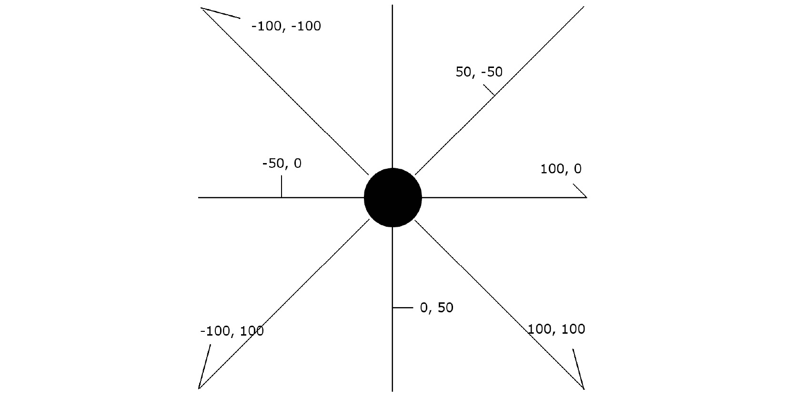
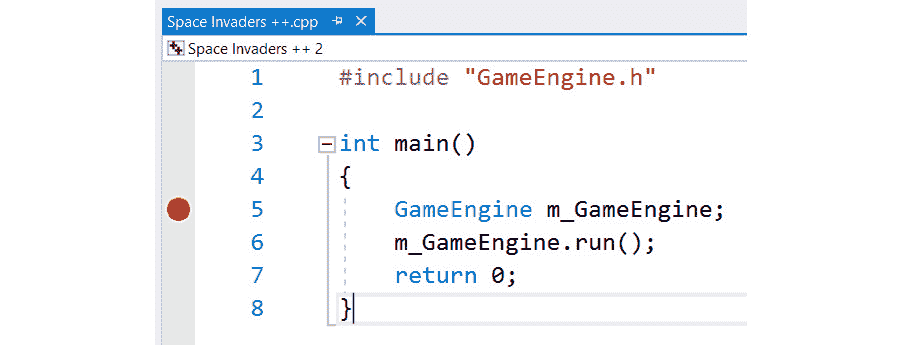

# *第 22 章*:使用游戏物件和构建游戏

本章是太空入侵者++项目的最后阶段。我们将学习如何使用 SFML 从游戏手柄接收输入，并编写一个类来处理入侵者和`GameScreen`类以及玩家和`GameScreen`类之间的通信。该类将允许玩家和入侵者生成子弹，但完全相同的技术可以用于您自己游戏不同部分之间所需的任何类型的通信，因此了解这一点很有用。游戏的最后部分(像往常一样)将是碰撞检测和游戏本身的逻辑。一旦空间入侵者++启动并运行，我们将学习如何使用 Visual Studio 调试器，这在您设计自己的逻辑时将是无价的，因为它允许您一次一行地遍历代码，并查看变量的值。它也是一个有用的工具，用于研究我们在这个项目过程中组装的模式的执行流程。

以下是我们在本章中要做的事情:

*   为生成项目符号编写解决方案
*   处理玩家的输入，包括用游戏手柄
*   检测所有必要对象之间的冲突
*   编写游戏的主要逻辑
*   了解调试并了解执行流程

让我们从产生子弹开始。

# 产卵子弹

我们需要一种从玩家和每个入侵者身上产生子弹的方法。两者的解决方案非常相似，但并不完全相同。我们需要一种方法，当按下键盘按键或游戏手柄按钮时，允许`GameInputHandler`产生子弹，我们需要`InvaderUpdateComponent`使用它已经存在的逻辑来产生子弹。

`GameScreen`类有一个保存所有`GameObject`实例的`vector`，因此`GameScreen`是将子弹移动到位并设置其在屏幕上上下移动的理想候选，这取决于谁或什么触发了射击。我们需要一种方式让`GameInputHandler`类和`InvaderUpdateComponenet`类与`GameScreen`类进行沟通，但我们也需要将沟通限制在只是产卵子弹；我们不希望他们能够控制`GameScreen`类的任何其他部分。

让我们编写一个`GameScreen`可以继承的抽象类。

## 对 BulletSpawner 类进行编码

在名为`BulletSpawner.h`的`Header Files/GameObjects`过滤器中创建新的头文件，并添加以下代码:

```cpp
#include <SFML/Graphics.hpp>
class BulletSpawner
{
public:
    virtual void spawnBullet(
        sf::Vector2f spawnLocation, bool forPlayer) = 0;
};
```

前面的代码创建了一个名为`BulletSpawner`的新类，它有一个名为`spawnBullet`的纯虚函数。`spawnBullet`功能有两个参数。第一个是`Vector2f`实例，它将确定产卵位置。事实上，我们很快就会看到，当子弹产生时，这个位置会稍微调整，这取决于子弹是在屏幕上(作为玩家子弹)还是在屏幕下(作为入侵者子弹)。第二个参数是一个布尔值，如果子弹属于玩家，则为真；如果子弹属于入侵者，则为假。

在名为`BulletSpawner.cpp`的`Source Files/GameObjects`过滤器中创建新的源文件，并添加以下代码:

```cpp
/*********************************
******THIS IS AN INTERFACE********
*********************************/
```

小费

和往常一样，这个`.cpp`文件是可选的。我只是想平衡一下源头。

现在，转到`GameScreen.h`，因为这是我们要实现这个类的功能的地方。

## 更新游戏画面

首先，更新 include 指令和类声明，如下面的代码所示，使`GameScreen`类继承自`BulletSpawner`:

```cpp
#pragma once
#include "Screen.h"
#include "GameInputHandler.h"
#include "GameOverInputHandler.h"
#include "BulletSpawner.h"
class GameScreen : public Screen, public BulletSpawner
{
   …
   …
```

接下来，向`GameScreen.h`添加一些额外的函数和变量声明，如下面的代码所示:

```cpp
private:
    ScreenManagerRemoteControl* m_ScreenManagerRemoteControl;
    shared_ptr<GameInputHandler> m_GIH;
 int m_NumberInvadersInWorldFile = 0;
 vector<int> m_BulletObjectLocations;
 int m_NextBullet = 0;
 bool m_WaitingToSpawnBulletForPlayer = false;
 bool m_WaitingToSpawnBulletForInvader = false;
 Vector2f m_PlayerBulletSpawnLocation;
 Vector2f m_InvaderBulletSpawnLocation;
 Clock m_BulletClock;
    Texture m_BackgroundTexture;
    Sprite m_BackgroundSprite;
public:
    static bool m_GameOver;
    GameScreen(ScreenManagerRemoteControl* smrc, Vector2i res);
    void initialise() override;
    void virtual update(float fps);
    void virtual draw(RenderWindow& window);
 BulletSpawner* getBulletSpawner();
```

新的变量包括`int`值的`vector`，该值将保存`vector`中所有项目符号的位置，该位置保存所有游戏对象。它还有一些控制变量，这样我们就可以跟踪下一个要使用的子弹，子弹是给玩家的还是给入侵者的，以及产生子弹的位置。我们还声明了一个新的`sf::Clock`实例，因为我们想限制玩家的射速。最后，我们有`getBulletSpawner`函数，它将以`BulletSpawner`的形式返回一个指向这个类的指针。这将给予接收者对`spawnBullet`功能的访问权，但除此之外别无他法。

现在，我们可以添加`spawnBullet`功能的实现。在所有其他代码的末尾，但在`GameScreen`类的右花括号内，向`GameScreen.h`添加以下代码:

```cpp
/****************************************************
*****************************************************
From BulletSpawner interface
*****************************************************
*****************************************************/
void BulletSpawner::spawnBullet(Vector2f spawnLocation, 
    bool forPlayer)
{
    if (forPlayer)
    {
        Time elapsedTime = m_BulletClock.getElapsedTime();
        if (elapsedTime.asMilliseconds() > 500) {
            m_PlayerBulletSpawnLocation.x = spawnLocation.x;
            m_PlayerBulletSpawnLocation.y = spawnLocation.y;
            m_WaitingToSpawnBulletForPlayer = true;
            m_BulletClock.restart();
        }
    }
    else
    {
        m_InvaderBulletSpawnLocation.x = spawnLocation.x;
        m_InvaderBulletSpawnLocation.y = spawnLocation.y;
        m_WaitingToSpawnBulletForInvader = true;
    }
}
```

`spawnBullet`功能的实现是一个简单的`if`–`else`结构。如果玩家需要子弹，则执行`if`模块，如果入侵者需要子弹，则执行`else`模块。

`if`块检查自请求最后一个项目符号以来至少已经过去了半秒钟，如果已经过去了，则将`m_WaitingToSpawnBulletForPlayer`变量设置为真，复制项目符号所在的位置，并重新启动时钟，准备测试玩家的下一个请求。

`else`区块记录入侵者子弹的产卵位置并将`m_WaitingToSpawnBulletForInvader`设定为`true`。不需要与`Clock`实例交互，因为入侵者的射速是在`InvaderUpdateComponent`级控制的。

`BulletSpawner`谜题的最后一部分，在我们真正产生子弹之前，是在`GameScreen.cpp`的结尾加上`getBulletSpawner`的定义。下面是要添加的代码:

```cpp
BulletSpawner* GameScreen::getBulletSpawner()
{
    return this;
}
```

这将返回一个指向`GameScreen`的指针，这使我们可以访问`spawnBullet`功能。

# 处理玩家的输入

向`GameInputHandler.h`文件中添加更多的声明，以便您的代码与下面的内容相匹配。我强调了要添加的新代码:

```cpp
#pragma once
#include "InputHandler.h"
#include "PlayerUpdateComponent.h"
#include "TransformComponent.h"
class GameScreen;
class GameInputHandler : public InputHandler
{
private:
 shared_ptr<PlayerUpdateComponent> m_PUC;
 shared_ptr<TransformComponent> m_PTC;
 bool mBButtonPressed = false;
public:
    void initialize();
    void handleGamepad() override;
    void handleKeyPressed(Event& event, 
        RenderWindow& window) override;
    void handleKeyReleased(Event& event, 
        RenderWindow& window) override;    
};
```

`GameInputHandler`类现在可以访问玩家的更新组件和玩家的转换组件。这非常有用，因为这意味着我们可以告诉`PlayerUpdateComponent`实例和玩家的`TransformComponent`实例玩家正在操作什么键盘按键和游戏手柄。我们还没有看到这两个共享指针是如何初始化的——毕竟`GameObject`实例和它们的所有组件不是打包在`vector`中吗？你大概能猜到解决办法和`GameObjectSharer`有关。让我们继续编码，了解更多信息。

在`GameInputHanldler.cpp`文件中，在 include 指令之后但在 initialize 函数之前添加一个`BulletSpawner`类的正向声明，如以下代码所示:

```cpp
#include "GameInputHandler.h"
#include "SoundEngine.h"
#include "GameScreen.h"
class BulletSpawner;
void GameInputHandler::initialize() {
…
```

在`GameInputHandler.cpp`文件中，将以下高亮显示的代码添加到`handleKeyPressed`功能中:

```cpp
void GameInputHandler::handleKeyPressed(
    Event& event, RenderWindow& window)
{
    // Handle key presses
    if (event.key.code == Keyboard::Escape)
    {
        SoundEngine::playClick();
        getPointerToScreenManagerRemoteControl()->
            SwitchScreens("Select");
    }

if (event.key.code == Keyboard::Left)
 {
 m_PUC->moveLeft();
 }
 if (event.key.code == Keyboard::Right)
 {
 m_PUC->moveRight();
 }
 if (event.key.code == Keyboard::Up)
 {
 m_PUC->moveUp();
 }
 if (event.key.code == Keyboard::Down)
 {
 m_PUC->moveDown();
 }
}
```

请注意，我们正在响应键盘按压，就像我们在本书中一直在做的那样。然而，在这里，我们从我们在 [*第 20 章*](20.html#_idTextAnchor414)*游戏对象和组件*中编码的`PlayerUpdateComponent`类调用函数，以便采取所需的操作。

在`GameInputHandler.cpp`文件中，将以下高亮显示的代码添加到`handleKeyReleased`功能中:

```cpp
void GameInputHandler::handleKeyReleased(
    Event& event, RenderWindow& window)
{
 if (event.key.code == Keyboard::Left)
 {
 m_PUC->stopLeft();
 }
 else if (event.key.code == Keyboard::Right)
 {
 m_PUC->stopRight();
 }
 else if (event.key.code == Keyboard::Up)
 {
 m_PUC->stopUp();
 }
 else if (event.key.code == Keyboard::Down)
 {
 m_PUC->stopDown();
 }
 else if (event.key.code == Keyboard::Space)
 {
 // Shoot a bullet
 SoundEngine::playShoot();
 Vector2f spawnLocation;
 spawnLocation.x = m_PTC->getLocation().x + 
 m_PTC->getSize().x / 2;
 spawnLocation.y = m_PTC->getLocation().y;
 static_cast<GameScreen*>(getmParentScreen())->
 spawnBullet(spawnLocation, true);
 }
}
```

前面的代码也依赖于从`PlayerUpdateComponent`类调用函数来处理当玩家释放一个键盘键时发生的事情。`PlayerUpdateComponent`类然后可以停止在适当的方向上移动，这取决于哪个键盘键刚刚被释放。当释放*空间*键时，`getParentScreen`功能与`spawnBullet`功能连锁，触发子弹产生。请注意，产卵坐标(`spawnLocation`)是使用指向`PlayerTransformComponent`实例的共享指针计算的。

让我们了解一下 SFML 如何帮助我们与游戏手柄进行交互，然后我们可以返回`PlayerInputHandler`类来添加更多的功能。

## 使用游戏手柄

SFML 让处理游戏手柄输入变得异常容易。游戏手柄(或操纵杆)输入由`sf::Joystick`类处理。SFML 可以处理多达八个游戏手柄的输入，但本教程将只坚持一个。

你可以把拇指操纵杆的位置想象成一个 2D 图，从左上角的-100，-100 开始，到右下角的 100，100。因此，拇指操纵杆的位置可以用 2D 坐标来表示。下图用几个坐标示例说明了这一点:



我们所需要做的就是抓取该值，并为游戏循环的每一帧将其报告给`PlayerUpdateComponent`类。捕捉位置就像下面两行代码一样简单:

```cpp
float x  = Joystick::getAxisPosition(0, sf::Joystick::X);
float y = Joystick::getAxisPosition(0, sf::Joystick::Y);
```

零参数从主游戏手柄请求数据。您可以使用值 0 到 7 从八个游戏手柄获得输入。

我们还需要考虑其他一些事情。大多数游戏垫，尤其是拇指棒，在机械上是不完美的，即使没有被触摸也会记录很小的值。如果我们将这些值发送到`PlayerUpdateComponent`类，那么飞船将在屏幕上漫无目的地漂移。为此，我们将创建一个**死区**。这是一个我们将忽略任何价值的运动范围。10%的运动范围效果相当好。因此，如果从`getAxisPosition`函数中检索到的值在任一轴上介于-10 和 10 之间，我们将忽略它们。

要从游戏手柄的 B 按钮获取输入，我们使用以下代码行:

//玩家是否按了 B 键？

```cpp
if (Joystick::isButtonPressed(0, 1))
{
    // Take action here
}
```

前面的代码检测 Xbox One 游戏手柄上的 B 按钮何时被按下。其他控制器会有所不同。0，1 参数指的是主游戏手柄和 1 号按钮。为了检测按钮何时被释放，我们需要编写一些自己的逻辑代码。因为我们想在释放时而不是按下时发射子弹，所以我们将使用一个简单的布尔值来跟踪它。让我们对`GameInputHandler`类的其余部分进行编码，看看我们如何将刚刚学到的知识付诸行动。

在`GameInputHandler.cpp`文件中，将以下高亮显示的代码添加到`handleGamepad`功能中:

```cpp
void GameInputHandler::handleGamepad()
{
 float deadZone = 10.0f;
 float x  = Joystick::getAxisPosition(0, sf::Joystick::X);
 float y = Joystick::getAxisPosition(0, sf::Joystick::Y); 

 if (x < deadZone && x > -deadZone)
 {
 x = 0;
 }
 if (y < deadZone && y > -deadZone)
 {
 y = 0;
 }
 m_PUC->updateShipTravelWithController(x, y); 
 // Has the player pressed the B button?
 if (Joystick::isButtonPressed(0, 1))
 {
 mBButtonPressed = true;
 }
 // Has player just released the B button?
 if (!Joystick::isButtonPressed(0, 1) && mBButtonPressed)
 {
 mBButtonPressed = false;
 // Shoot a bullet
 SoundEngine::playShoot();
 Vector2f spawnLocation;
 spawnLocation.x = m_PTC->getLocation().x + 
 m_PTC->getSize().x / 2;
 spawnLocation.y = m_PTC->getLocation().y;

 static_cast<GameScreen*>(getmParentScreen())->
 getBulletSpawner()->spawnBullet(
 spawnLocation, true);
 }
}
```

我们首先定义一个 10 的死区，然后开始捕捉拇指棒的位置。接下来的两个`if`块测试拇指操纵杆位置是否在死区内。如果是，则适当的值被设置为零以避免船只漂移。然后，我们可以在`PlayerUpdateComponent`实例上调用`updateShipTravelWithController`函数。那是处理过的拇指棒。

如果按下游戏手柄上的 B 按钮，下一条`if`语句会将布尔值设置为`true`。下一个`if`语句检测 B 按钮何时未被按下，布尔值被设置为`true`。这表明 B 按钮刚刚被释放。

在`if`块内部，我们将布尔设置为`false`，准备处理下一个按钮释放，播放射击声音，获取子弹的产卵位置，通过链接`getmParentScreen`和`getBulletSpawner`功能调用`spawnBullet`功能。

# 对物理引擎播放模式类进行编码

这个类将完成所有的碰撞检测。在这个游戏中，我们要注意几个碰撞事件:

*   入侵者到达了屏幕的左侧还是右侧？如果是这样的话，所有的入侵者都需要下降一排，向另一个方向返回。
*   有入侵者和玩家相撞吗？随着入侵者越来越低，我们希望他们能够撞上玩家，导致一条生命损失。
*   入侵者的子弹击中玩家了吗？每次入侵者的子弹打中玩家，我们都需要把子弹藏起来，准备再次使用，从玩家身上扣除一条命。
*   玩家子弹击中入侵者了吗？玩家每打一个入侵者，入侵者就应该被消灭，子弹被隐藏(准备重复使用)，玩家的分数增加。

这个类将有一个`GameScreen`类调用的`initialize`函数，为检测碰撞做准备，`GameScreen`类将在所有游戏对象更新后为每一帧调用一次`detectCollisions`函数，以及另外三个将从`detectCollisions`函数调用的函数，以分离出我刚才列出的检测不同碰撞的工作。

这三个功能分别是`detectInvaderCollisions`、`detectPlayerCollisionsAndInvaderDirection`和`handleInvaderDirection`。希望这些函数的名字能清楚地说明每个函数中会发生什么。

在名为`PhysicsEnginePlayMode.h`的`Header Files/Engine`过滤器中创建新的源文件，并添加以下代码:

```cpp
#pragma once
#include "GameObjectSharer.h"
#include "PlayerUpdateComponent.h"
class PhysicsEnginePlayMode
{
private:
    shared_ptr<PlayerUpdateComponent> m_PUC;
    GameObject* m_Player;
    bool m_InvaderHitWallThisFrame = false;
    bool m_InvaderHitWallPreviousFrame = false;
    bool m_NeedToDropDownAndReverse = false;
    bool m_CompletedDropDownAndReverse = false;
    void detectInvaderCollisions(
        vector<GameObject>& objects,
        const vector<int>& bulletPositions);
    void detectPlayerCollisionsAndInvaderDirection(
        vector<GameObject>& objects,
        const vector<int>& bulletPositions);
    void handleInvaderDirection();
public:
    void initilize(GameObjectSharer& gos);
    void detectCollisions(
        vector<GameObject>& objects,
        const vector<int>& bulletPositions);
};
```

研究前面的代码，记下传递给每个函数的参数。还要注意将在整个类中使用的四个成员布尔变量。此外，请注意，有一个指向正在声明的`GameObject`类型的指针，这将是对玩家船的永久引用，因此我们不需要在游戏循环的每一帧中不断找到代表玩家的`GameObject`。

在名为`PhysicsEnginePlayMode.cpp`的`Source Files/Engine`过滤器中创建新的源文件，并添加以下包含指令和`detectInvaderCollisions`函数。研究代码，然后我们将讨论它:

```cpp
#include "DevelopState.h"
#include "PhysicsEnginePlayMode.h"
#include <iostream>
#include "SoundEngine.h"
#include "WorldState.h"
#include "InvaderUpdateComponent.h"
#include "BulletUpdateComponent.h"
void PhysicsEnginePlayMode::
detectInvaderCollisions(
    vector<GameObject>& objects, 
    const vector<int>& bulletPositions)
{
Vector2f offScreen(-1, -1);
auto invaderIt = objects.begin();
auto invaderEnd = objects.end();
for (invaderIt;
    invaderIt != invaderEnd;
    ++invaderIt)
{
    if ((*invaderIt).isActive()
        && (*invaderIt).getTag() == "invader")
    {
        auto bulletIt = objects.begin();
        // Jump to the first bullet
        advance(bulletIt, bulletPositions[0]);
        auto bulletEnd = objects.end();
        for (bulletIt;
            bulletIt != bulletEnd;
            ++bulletIt)
        {
            if ((*invaderIt).getEncompassingRectCollider()
                .intersects((*bulletIt)
                    .getEncompassingRectCollider())
                && (*bulletIt).getTag() == "bullet"
                && static_pointer_cast<
                      BulletUpdateComponent>(
                (*bulletIt).getFirstUpdateComponent())
                ->m_BelongsToPlayer)
            {
                SoundEngine::playInvaderExplode();
                (*invaderIt).getTransformComponent()
                    ->getLocation() = offScreen;
                (*bulletIt).getTransformComponent()
                    ->getLocation() = offScreen;
                WorldState::SCORE++;
                WorldState::NUM_INVADERS--;
                (*invaderIt).setInactive();
            }
        }
    }
}
}
```

前面的代码遍历了所有的游戏对象。第一个`if`语句检查当前游戏对象是否是活动的和入侵者:

```cpp
if ((*invaderIt).isActive()
        && (*invaderIt).getTag() == "invader")
```

如果是主动入侵者，则进入另一个循环，代表子弹的每个游戏对象循环通过:

```cpp
auto bulletIt = objects.begin();
// Jump to the first bullet
advance(bulletIt, bulletPositions[0]);
auto bulletEnd = objects.end();
for (bulletIt;
    bulletIt != bulletEnd;
    ++bulletIt)
```

下一个`if` 语句检查当前入侵者是否与当前子弹相撞，以及该子弹是否由玩家发射(我们不希望入侵者自己射击自己):

```cpp
if ((*invaderIt).getEncompassingRectCollider()
        .intersects((*bulletIt)
        .getEncompassingRectCollider())
        && (*bulletIt).getTag() == "bullet"
        && static_pointer_cast<BulletUpdateComponent>(
        (*bulletIt).getFirstUpdateComponent())
        ->m_BelongsToPlayer)
```

当该测试为真时，播放声音，子弹移出屏幕，入侵者数量减少，玩家分数增加，入侵者设置为非活动状态。

现在，我们将检测玩家碰撞和入侵者的行进方向。

添加`detectPlayerCollisionsAndInvaderDirection`功能，如下:

```cpp
void PhysicsEnginePlayMode::
detectPlayerCollisionsAndInvaderDirection(
    vector<GameObject>& objects, 
    const vector<int>& bulletPositions)
{
Vector2f offScreen(-1, -1);
FloatRect playerCollider = 
    m_Player->getEncompassingRectCollider();
shared_ptr<TransformComponent> playerTransform = 
    m_Player->getTransformComponent();
Vector2f playerLocation = 
    playerTransform->getLocation();
auto it3 = objects.begin();
auto end3 = objects.end();
for (it3;
    it3 != end3;
    ++it3)
{
    if ((*it3).isActive() &&
        (*it3).hasCollider() &&
        (*it3).getTag() != "Player")
    {
        // Get a reference to all the parts of 
        // the current game object we might need
        FloatRect currentCollider = (*it3)
            .getEncompassingRectCollider();
        // Detect collisions between objects 
        // with the player
        if (currentCollider.intersects(playerCollider))
        {
            if ((*it3).getTag() == "bullet")
            {
                SoundEngine::playPlayerExplode();
                WorldState::LIVES--;
                (*it3).getTransformComponent()->
                    getLocation() = offScreen;
            }
            if ((*it3).getTag() == "invader")
            {
                SoundEngine::playPlayerExplode();
                SoundEngine::playInvaderExplode();
                WorldState::LIVES--;
                (*it3).getTransformComponent()->
                    getLocation() = offScreen;
                WorldState::SCORE++;
                (*it3).setInactive();
            }
        }
        shared_ptr<TransformComponent> 
            currentTransform =
            (*it3).getTransformComponent();
        Vector2f currentLocation = 
            currentTransform->getLocation();
        string currentTag = (*it3).getTag();
        Vector2f currentSize = 
            currentTransform->getSize();
        // Handle the direction and descent 
        // of the invaders
        if (currentTag == "invader")
        {
            // This is an invader
            if (!m_NeedToDropDownAndReverse && 
                !m_InvaderHitWallThisFrame)
            {
                // Currently no need to dropdown 
                // and reverse from previous frame 
                // or any hits this frame
                if (currentLocation.x >= 
                    WorldState::WORLD_WIDTH – 
                            currentSize.x)
                {
                    // The invader is passed its 
                    // furthest right position
                    if (static_pointer_cast
                        <InvaderUpdateComponent>((*it3)
                        .getFirstUpdateComponent())->
                        isMovingRight())
                    {
                        // The invader is travelling 
                        // right so set a flag that
                        // an invader has collided

                        m_InvaderHitWallThisFrame 
                                         = true;
                    }
                }
                else if (currentLocation.x < 0)
                {
                    // The invader is past its furthest 
                    // left position
                    if (!static_pointer_cast
                        <InvaderUpdateComponent>(        
                            (*it3).getFirstUpdateComponent())
                        ->isMovingRight())
                    {
                        // The invader is travelling 
                        // left so set a flag that an
                        // invader has collided 
                        m_InvaderHitWallThisFrame 
                                         = true;
                    }
                }
            }
            else if (m_NeedToDropDownAndReverse 
                && !m_InvaderHitWallPreviousFrame)
            {
                // Drop down and reverse has been set
                if ((*it3).hasUpdateComponent())
                {
                    // Drop down and reverse
                    static_pointer_cast<
                            InvaderUpdateComponent>(            
                            (*it3).getFirstUpdateComponent())
                    ->dropDownAndReverse();
                }
            }
        }
    }
}
}
```

前面的代码比前面的函数长，因为我们正在检查更多的条件。在代码遍历所有游戏对象之前，它会获取所有相关玩家数据的引用。这样我们就不必每次检查都这样做:

```cpp
FloatRect playerCollider = 
    m_Player->getEncompassingRectCollider();
shared_ptr<TransformComponent> playerTransform = 
    m_Player->getTransformComponent();
Vector2f playerLocation = 
    playerTransform->getLocation();
```

接下来，循环遍历每个游戏对象。第一个`if`测试检查当前物体是否是活动的，有碰撞器，不是玩家。我们不想测试玩家与自己的碰撞:

```cpp
if ((*it3).isActive() &&
    (*it3).hasCollider() &&
    (*it3).getTag() != "Player")
```

下一个`if`测试进行实际碰撞检测，看当前游戏对象是否与玩家相交:

```cpp
if (currentCollider.intersects(playerCollider))
```

接下来，有两个嵌套的`if`语句:一个处理与属于入侵者的子弹的碰撞，一个处理与入侵者的碰撞。

接下来，代码检查每一个入侵者的游戏对象，看它是否击中了屏幕的左侧或右侧。请注意，`m_NeedToDropDownAndReverse`和`m_InvaderHitWallLastFrame`布尔变量被使用，因为它不会总是击中屏幕侧面的向量中的第一个入侵者。因此，检测冲突并触发下拉和反转是在连续的帧中处理的，以保证所有入侵者都下拉和反转，而不管是哪一个触发它。

最后，当两个条件都为`true`时，调用`handleInvaderDirection`。

添加`handleInvaderDirection`功能，如下:

```cpp
void PhysicsEnginePlayMode::handleInvaderDirection()
{
    if (m_InvaderHitWallThisFrame) {
        m_NeedToDropDownAndReverse = true;
        m_InvaderHitWallThisFrame = false;
    }
    else {
        m_NeedToDropDownAndReverse = false;
    }
}
```

该函数只是相应地设置和取消布尔，以便下一次通过`detectPlayerCollisionAndDirection`函数时，实际上会下拉入侵者并改变他们的方向。

添加`initialize`功能修复动作类:

```cpp
void PhysicsEnginePlayMode::initilize(GameObjectSharer& gos) {
    m_PUC = static_pointer_cast<PlayerUpdateComponent>(
        gos.findFirstObjectWithTag("Player")
        .getComponentByTypeAndSpecificType("update", "player"));
    m_Player = &gos.findFirstObjectWithTag("Player");
}
```

在前面的代码中，指向`PlayerUpdateComponent`的指针以及指向玩家`GameObject`的指针被初始化。这将避免在游戏循环中调用这些相对较慢的函数。

添加`detectCollisions`函数，每帧从`GameScreen`类调用一次:

```cpp
void PhysicsEnginePlayMode::detectCollisions(
    vector<GameObject>& objects,
    const vector<int>& bulletPositions)
{
    detectInvaderCollisions(objects, bulletPositions);
    detectPlayerCollisionsAndInvaderDirection(
        objects, bulletPositions);
    handleInvaderDirection();    
}
```

`detectCollisions`函数调用处理碰撞检测不同阶段的三个函数。你可以把所有的代码都集中到这个单一的函数中，但是那样会很笨拙。或者，您可以将这三个大功能分成它们自己的`.cpp`文件，就像我们在托马斯迟到游戏中对`update`和`draw`功能所做的那样。

在下一节中，我们将创建一个`PhysicsEngineGameMode`类的实例，并在`GameScreen`类中使用它，让游戏变得生动起来。

# 制作游戏

在本节结束时，我们将有一个可玩的游戏。在这一节中，我们将向`GameScreen`类添加代码，以汇集我们在过去三章中编码的所有内容。首先，通过添加额外的 include 指令，向`GameScreen.h`添加一个`PhysicsEngineGameMode`实例，如下所示:

```cpp
#include "PhysicsEnginePlayMode.h"
```

然后，声明一个实例，如下面的代码所示:

```cpp
private:
    ScreenManagerRemoteControl* m_ScreenManagerRemoteControl;
    shared_ptr<GameInputHandler> m_GIH;
 PhysicsEnginePlayMode m_PhysicsEnginePlayMode;
…
…
```

现在，打开`GameScreen.cpp`文件，添加一些额外的 include 指令，并正向声明`BulletSpawner`类，如下代码所示:

```cpp
#include "GameScreen.h"
#include "GameUIPanel.h"
#include "GameInputHandler.h"
#include "GameOverUIPanel.h"
#include "GameObject.h"
#include "WorldState.h"
#include "BulletUpdateComponent.h"
#include "InvaderUpdateComponent.h"
class BulletSpawner;
int WorldState::WORLD_HEIGHT;
int WorldState::NUM_INVADERS;
int WorldState::NUM_INVADERS_AT_START;
```

接下来，在`GameScreen.cpp`文件中，通过在现有代码中添加以下高亮显示的代码来更新`initialize`功能:

```cpp
void GameScreen::initialise()
{
    m_GIH->initialize();
 m_PhysicsEnginePlayMode.initilize(
 m_ScreenManagerRemoteControl->
 shareGameObjectSharer());
    WorldState::NUM_INVADERS = 0;
 // Store all the bullet locations and
 // Initialize all the BulletSpawners in the invaders
 // Count the number of invaders
 int i = 0;
 auto it = m_ScreenManagerRemoteControl->
 getGameObjects().begin();
 auto end = m_ScreenManagerRemoteControl->
 getGameObjects().end();
 for (it;
 it != end;
 ++it)
 {
 if ((*it).getTag() == "bullet")
 {
 m_BulletObjectLocations.push_back(i);
 }
 if ((*it).getTag() == "invader")
 {
 static_pointer_cast<InvaderUpdateComponent>(
 (*it).getFirstUpdateComponent())->
 initializeBulletSpawner(
 getBulletSpawner(), i);
 WorldState::NUM_INVADERS++;
 }
 ++i;
 }
    m_GameOver = false;
    if (WorldState::WAVE_NUMBER == 0)
    {
        WorldState::NUM_INVADERS_AT_START = 
            WorldState::NUM_INVADERS;

        WorldState::WAVE_NUMBER = 1;
        WorldState::LIVES = 3;
        WorldState::SCORE = 0;
    }
}
```

`initialize`函数中的前一个代码初始化了将处理所有碰撞检测的物理引擎。接下来，它循环遍历所有游戏对象，并执行两个任务:每个`if`块中一个任务。

第一`if`块测试当前游戏对象是否为子弹。如果是，则它在游戏对象向量中的整数位置存储在`m_BulletObjectLocations vector`中。还记得我们对物理引擎进行编码时，这个`vector`在碰撞检测时很有用。当玩家或入侵者想要射击时，这个向量也将在这个类中用来跟踪下一个要使用的子弹。

第二个`if`块检测当前游戏对象是否是入侵者，如果是，则在其更新组件上调用`initializeBulletSpawner`函数，并通过调用`getBulletSpawner`函数传递指向`BulletSpawner`的指针。入侵者现在有能力制造子弹。

现在，我们需要在`update`函数中添加一些代码来处理更新阶段游戏的每一帧中发生的事情。这在下面的代码中突出显示。所有新代码都进入已经存在的`if(!m_GameOver)`块:

```cpp
void GameScreen::update(float fps)
{
    Screen::update(fps);
    if (!m_GameOver)
    {
 if (m_WaitingToSpawnBulletForPlayer)
 {
 static_pointer_cast<BulletUpdateComponent>(
 m_ScreenManagerRemoteControl->
 getGameObjects()
 [m_BulletObjectLocations[m_NextBullet]].
 getFirstUpdateComponent())->
 spawnForPlayer(
 m_PlayerBulletSpawnLocation);

 m_WaitingToSpawnBulletForPlayer = false;
 m_NextBullet++;
 if (m_NextBullet == m_BulletObjectLocations
 .size())
 {
 m_NextBullet = 0;
 }
 }
 if (m_WaitingToSpawnBulletForInvader)
 {
 static_pointer_cast<BulletUpdateComponent>(
 m_ScreenManagerRemoteControl->
 getGameObjects()
 [m_BulletObjectLocations[m_NextBullet]].
 getFirstUpdateComponent())->
 spawnForInvader(
 m_InvaderBulletSpawnLocation);

 m_WaitingToSpawnBulletForInvader = false;
 m_NextBullet++;
 if (m_NextBullet == 
 m_BulletObjectLocations.size())
 {
 m_NextBullet = 0;
 }
 }
 auto it = m_ScreenManagerRemoteControl->
 getGameObjects().begin();
 auto end = m_ScreenManagerRemoteControl->
 getGameObjects().end();
 for (it;
 it != end;
 ++it)
 {
 (*it).update(fps);
 }

 m_PhysicsEnginePlayMode.detectCollisions(
 m_ScreenManagerRemoteControl->getGameObjects(), 
 m_BulletObjectLocations);
        if (WorldState::NUM_INVADERS <= 0)
        {
            WorldState::WAVE_NUMBER++;
            m_ScreenManagerRemoteControl->
                loadLevelInPlayMode("level1");
        }

        if (WorldState::LIVES <= 0)
        {
            m_GameOver = true;            
        }
    }
}
```

在前面的新代码中，第一个`if`块检查玩家是否需要新的子弹。如果它是下一个可用的项目符号，`GameObject`实例调用其`BulletUpdateComponent`实例的`spawnForPlayer`函数。使用带有`m_BulletObjectLocations`向量的`m_NextBulletObject`变量来标识要使用的特定`GameObject`实例。第一个`if`块中剩余的代码准备发射下一颗子弹。

如果入侵者正在等待发射子弹，则执行第二个`if`块。使用完全相同的技术来激活子弹，除了使用`spawnForInvader`功能，将它设置为向下移动。

接下来，有一个循环，循环通过每个游戏对象。这是一切的关键，因为在循环内部，每个`GameObject`实例都会调用`update`函数。

前面新代码的最后一行代码调用`detectCollisions`函数，查看是否有任何`GameObject`实例(在其刚刚更新的位置)发生了冲突。

最后，我们将在`GameScreen.cpp`中给`draw`函数添加一些代码。在下面的列表中，新代码在现有代码中突出显示:

```cpp
void GameScreen::draw(RenderWindow & window)
{    
    // Change to this screen's view to draw
    window.setView(m_View);
    window.draw(m_BackgroundSprite);
 // Draw the GameObject instances
 auto it = m_ScreenManagerRemoteControl->
 getGameObjects().begin();
 auto end = m_ScreenManagerRemoteControl->
 getGameObjects().end();
 for (it;
 it != end;
 ++it)
 {
 (*it).draw(window);
 }
    // Draw the UIPanel view(s)
    Screen::draw(window);
}
```

前面的代码只是依次调用每个`GameObject`实例上的`draw`函数。现在，你已经完成了太空入侵者++项目，可以运行游戏了。恭喜你！

# 了解执行和调试流程

最后四章的大部分内容都是关于代码结构的。对于哪个类实例化哪个实例，或者各种函数的调用顺序，您很可能仍然有疑问和不确定性。如果在`Space Invaders ++.cpp`文件中有一种方法可以执行项目，并遵循从`int main()`一直到`return 0;`的执行路径，那不是很有用吗？事实证明我们可以，下面是如何做到的。

我们现在将探索 Visual Studio 中的调试工具，同时尝试理解项目的结构。

打开`Space Invaders ++.cpp`文件，找到第一行代码，如下:

```cpp
GameEngine m_GameEngine;
```

前面的代码是执行的第一行代码。它声明了`GameEngine`类的一个实例，并启动了我们所有的努力工作。

右键单击前一行代码，选择**断点** | **插入断点**。以下是屏幕的外观:



请注意，代码行旁边有一个红色圆圈。这是一个断点。当您运行代码时，执行将在这一点上暂停，我们将有一些有趣的选项可供选择。

以通常的方式运行游戏。当执行暂停时，箭头指示当前的执行行，如下图所示:


如果您将鼠标悬停在`m_GameEngine`文本上，然后单击箭头(以下截图中的左上角)，您将预览`m_GameEngine`实例中的所有成员变量及其值:


让我们来看看代码。在主菜单中，查找以下图标集:


如果您单击上一个屏幕截图中突出显示的箭头图标，它将移动到下一行代码。该箭头图标是**进入**按钮。下一行代码将是`GameEngine`构造函数的顶部。您可以继续点击**进入**按钮，在任何阶段检查任何变量的值。

如果你点击进入`m_Resolution`的初始化，那么你会看到代码跳转到 SFML 提供的`Vector2i`类。继续点击查看组成我们游戏的所有步骤的代码流进度。

如果想跳到下一个功能，可以点击**步出**按钮，如下图截图所示:


只要你感兴趣，就跟着执行的流程走。完成后，只需点击**停止**按钮，如下图截图所示:


或者，如果你想在不单步执行代码的情况下运行游戏，可以点击如下截图所示的**继续**按钮。但是，请注意，如果断点位于循环内部，则每次执行流到达断点时，它都会停止:


如果你想从不同的起点来检查代码的流程，而不想一开始就必须点进每一行或每一个函数，那么你所需要做的就是设置不同的断点。

可以通过停止调试(用**停止**按钮)，右键单击红色圆圈，选择**删除断点**来删除断点。

然后，您可以通过在`GameEngine.cpp`的`update`函数的第一行代码中设置断点来开始遍历游戏循环。您可以在任何地方放置一个断点，因此可以随意探索单个组件或其他任何地方的执行流程。代码中值得检查的关键部分之一是`GameScreen`类的*更新*函数中的执行流程。为什么不试试呢？

虽然我们刚刚探索的内容是有用的和有指导意义的，但是 Visual Studio 提供的这些工具的真正目的是调试我们的游戏。每当您得到不符合您预期的行为时，只需在任何可能导致问题的行中添加一个断点，逐步执行，并观察变量值。

# 重用代码制作不同的游戏，构建设计模式

有几次，我们已经讨论过我们编码的这个系统可以被重用来制作一个完全不同的游戏的可能性。我只是觉得完全听取这个事实是值得的。

制作不同游戏的方法如下。我已经提到过，您可以将游戏对象的外观编码到从`GraphicsComponent`类派生的新组件中，并且可以将新行为编码到从`UpdateComponent`类派生的类中。

假设您想要一组具有重叠行为的游戏对象；考虑一个 2D 游戏，在这个游戏中，敌人追捕玩家，然后在一定距离向玩家射击。

也许你可以有一个接近玩家并向玩家发射手枪的敌人类型和一个向玩家远距离射击的敌人类型，就像狙击手可能会做的那样。

你可以编写一个`EnemyShooterUpdateComponent`类和一个`EnemySniperUpdateComponent`类。您可以在`start`函数中获得一个指向玩家转换组件的共享指针，并编写一个抽象类(如`BulletSpawner`)来触发玩家的产卵射击，您就完成了。

然而，考虑到这两个游戏对象都有拍摄的代码和接近玩家的代码。然后考虑一下，在某个阶段，你可能想要一个“打架”的敌人，他试图打玩家。

当前系统也可以有多个更新组件。然后你可以有一个`ChasePlayerUpdateComponent`类来接近玩家，并分离更新组件来打卡、射击或狙击玩家。打孔/射击/狙击组件将在追逐组件上强制执行一些关于何时停止和开始追逐的值，然后更具体的组件(打孔、射击或狙击)将在提示时间合适时攻击玩家。

正如我们已经提到的，在多个不同的更新组件上调用`update`函数的能力已经内置在代码中，尽管它从未经过测试。如果你看一下`GameObject.cpp`中的`update`功能，你会看到这个代码:

```cpp
    for (int i = m_FirstUpdateComponentLocation; i < 
        m_FirstUpdateComponentLocation + 
        m_NumberUpdateComponents; i++) 
    {
   …
}
```

在前面的代码中，`update`函数将在存在的尽可能多的更新组件上被调用。你只需要将它们编码并添加到`level1.txt`文件中的特定游戏对象中。使用这个系统，一个游戏对象可以有任意多的更新组件，允许您封装非常具体的行为，并根据需要围绕所需的游戏对象共享它们。

当您想要创建一个对象池时，就像我们为入侵者和子弹所做的那样，您可以比我们在太空入侵者++项目中更高效。为了向您展示如何在游戏世界中定位对象，我们单独添加了所有入侵者和子弹。在实际项目中，您只需设计一个代表子弹池的类型，也许是一个子弹盒，如下所示:

```cpp
[NAME]magazine of bullets[-NAME]
```

你可以对一队入侵者做同样的事情:

```cpp
[NAME]fleet of invaders[-NAME]
```

然后，您将对工厂进行编码，以处理一个杂志或舰队，可能带有一个`for`循环，稍微麻烦的文本文件将得到改进。当然，您可以跨多个文本文件设计的不同级别的数量没有限制。这些文本文件更可能的名称是`beach_level.txt`或`urban_level.txt`。

你可能想知道一些类的名字，比如`PhysicsEnginePlayMode`或者`GameObjectFactoryPlayMode`。这意味着`…PlayMode`只是这些班级的一个选择。

我在这里提出的建议是，即使你在你的关卡设计文件中使用了舰队/弹匣策略，随着它们的增长，它们仍然会变得笨重。如果您可以查看级别并在屏幕上编辑它们，然后将更改保存回文件，那就更好了。

您肯定需要新的物理引擎规则(检测对象上的点击和拖动)、新的屏幕类型(不更新每一帧)以及可能用于从文本文件解释和构建对象的新类。然而，关键是实体-组件/屏幕/用户界面面板/输入处理系统可以保持不变。

甚至没有任何东西可以阻止你设计一些全新的组件类型，例如，一个滚动的背景对象，可以检测玩家移动的方向并相应地移动，或者一个交互式的提升对象，可以检测玩家何时站在上面，然后接受输入上下移动。我们甚至可以有一扇门可以打开和关闭，或者一个传送对象，当玩家触摸它时，它会检测输入，并从另一个文本文件加载一个新的级别。这里的重点是，这些都是游戏机制，可以很容易地集成到同一个系统。

我可以继续谈论这些可能性更长的时间，但你可能宁愿自己做游戏。

# 总结

在这一章中，我们最终完成了太空入侵者++游戏。我们为游戏对象编写了一种请求产生子弹的方法，学习了如何从游戏手柄接收输入，并加入了游戏的最终逻辑来实现它。

然而，也许这一章最重要的是，最后四章的辛劳将如何帮助你开始下一个项目。

这本书有最后一章，有点厚，我保证，这是一个简短的一章。