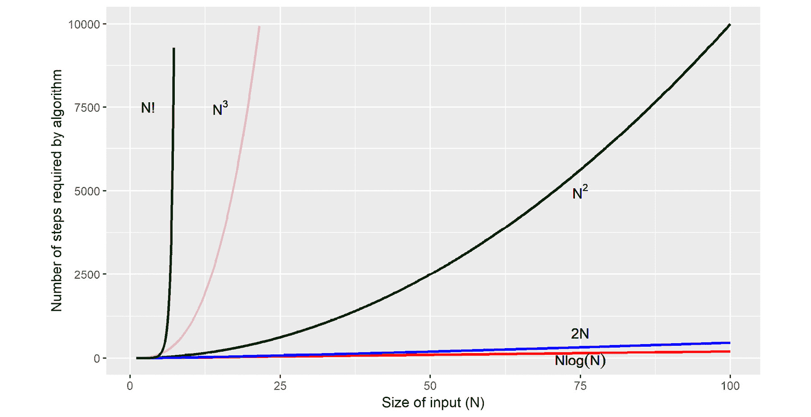
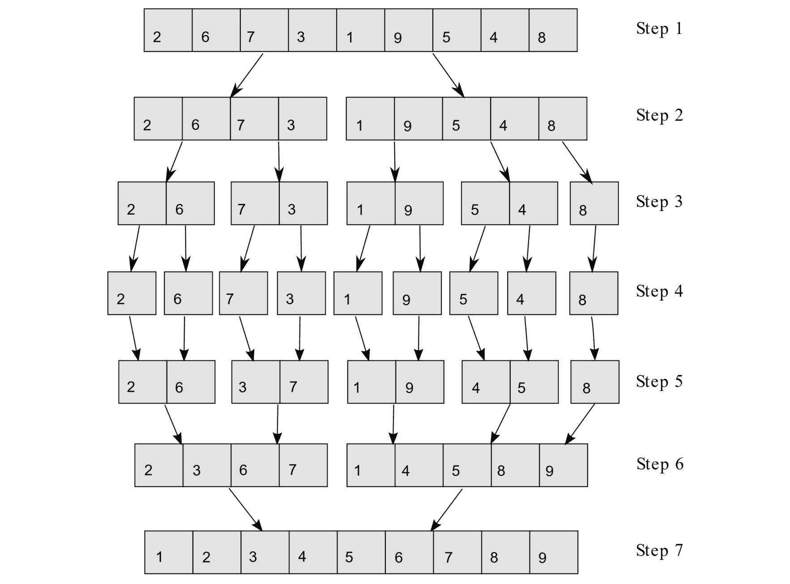
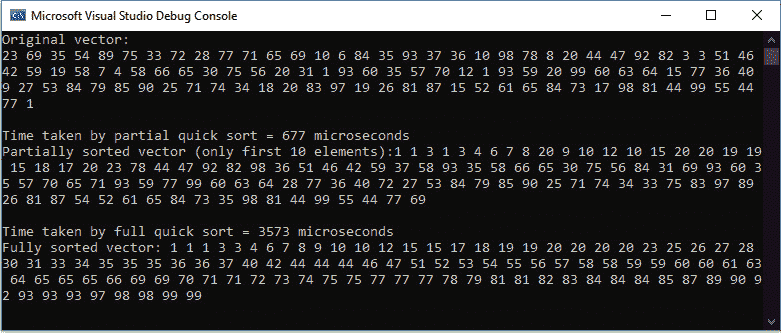
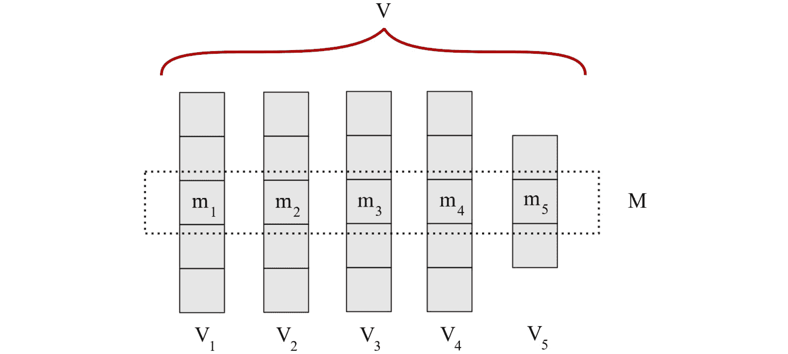
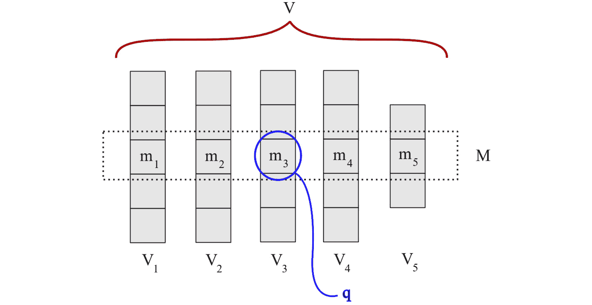
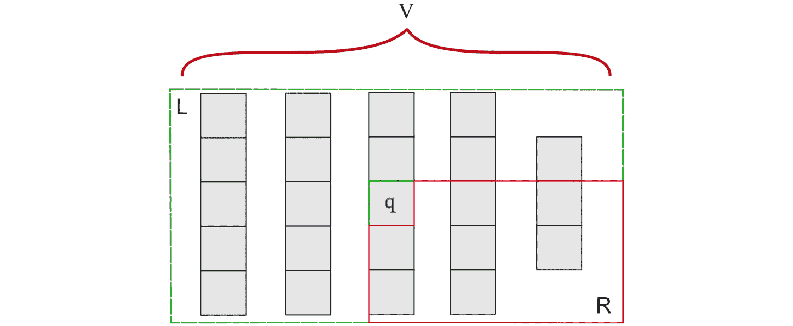
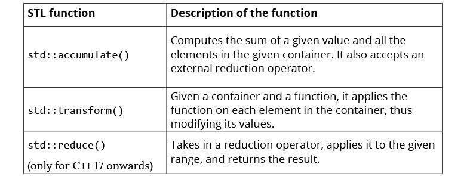
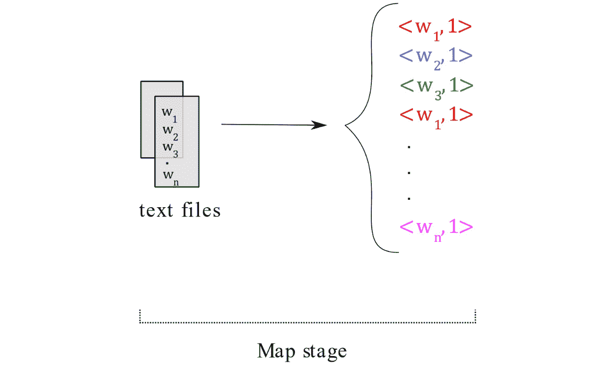
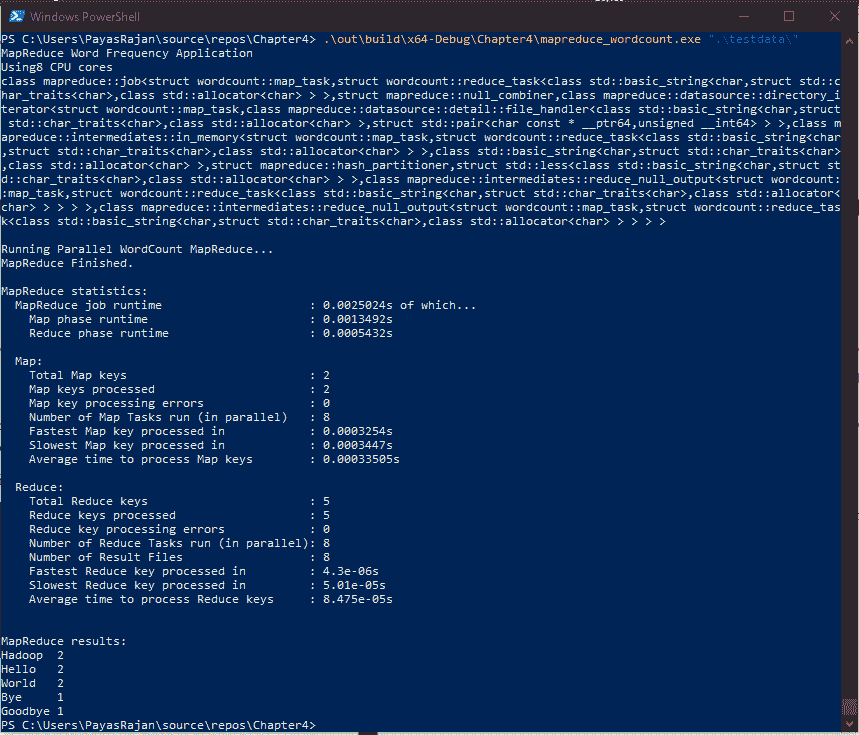

# 4。分治法

## 学习目标

本章结束时，您将能够:

*   描述各个击破的设计范例
*   实现标准的分治算法，如合并排序、快速排序和线性时间选择
*   使用 MapReduce 编程模型解决问题
*   了解如何使用多线程 C++ MapReduce 实现

在本章中，我们将研究分治算法设计范式，并学习如何使用它来解决计算问题。

## 简介

在前一章中，我们研究了一些常用的数据结构。数据结构是不同形式的数据组织，数据结构支持并控制对存储在其中的数据的访问成本。然而，使软件有用的不仅仅是以各种 us 格式存储和检索数据的能力，而是对数据进行转换以解决计算问题的能力。对于一个给定的问题，数据转换的精确定义和顺序是由一系列被称为**算法**的指令决定的。

算法接受一组定义问题实例的输入，应用一系列转换，并输出一组结果。如果这些结果是手头计算问题的正确解，我们的算法就说是*正确*。一个算法的*优秀程度*取决于它的效率，或者说算法需要执行多少条指令才能产生正确的结果:



###### 图 4.1:算法相对于输入大小所采取的步骤的比例

上图显示了算法所需步骤数的增长，作为输入大小的函数。更复杂的算法随着输入的大小增长得更快，如果输入足够大，即使在现代计算机系统上，它们也可能变得不可行。例如，让我们假设我们有一台每秒可以执行一百万次操作的计算机。对于大小为 50 的输入，需要 *N log(N)* 步的算法需要 283 微秒才能完成；一个需要 *N* *2* 步的算法需要 2.5 毫秒；以及一个需要 *N 的算法！*(N*的阶乘*)步数大约需要 9，637，644，561，599，544，267，027，654，516，581，964，749，586，575，812，734.82 **个世纪**才能跑完！

*如果对于输入 N 的大小，算法以 N 的多项式的多个步骤来解决问题，则算法被认为是有效的*

将**多项式时间算法**表示为解的问题，据说也属于计算复杂度的类 *P* (多项式)。还有其他几个计算复杂性问题可以划分，这里给出了几个例子:

*   **NP** ( **非确定性多项式时间**)问题有可以在多项式时间内验证的解，但没有任何已知的多项式时间解。
*   **EXPTIME** ( **指数时间**)问题的解决方案的运行时间与输入的大小成指数关系。
*   **PSPACE** ( **多项式空间**)问题需要多项式量的空间。

找出 *P* 中的问题集是否与 *NP* 中的问题集完全相同，就是著名的 *P = NP* 问题，经过几十年的努力，这个问题依然没有解决，甚至为任何能解决它的人带来 100 万美元的奖金。我们再来看看*第 9 章*、*动态规划二*中的 *P* 和 *NP* 类问题。

数十年来，计算机科学家一直将算法作为数学对象进行研究，并且已经确定了一套设计高效算法的通用方法(或**范例**)，可用于解决各种各样的问题。最广泛应用的算法设计范例之一叫做*分而治之*，这将是我们本章研究的主题。

A **分而治之**型算法将给定的问题分解成更小的部分，尝试为每个部分求解问题，最后将每个部分的解组合成整个问题的解。几个广泛使用的算法属于这一类别，例如，二分搜索法，快速排序，合并排序，矩阵乘法，快速傅立叶变换，以及天际线算法。这些算法几乎出现在今天使用的所有主要应用程序中，包括数据库、网络浏览器，甚至语言运行时，如 Java 虚拟机和 V8 JavaScript 引擎。

在本章中，我们将向您展示使用分治法解决问题意味着什么，以及您如何确定您的问题是否适合这样的解决方案。接下来，我们将练习递归思维，并向您展示现代 C++标准库提供的工具，以便您可以使用分治法解决问题。我们将通过查看 MapReduce 来结束这一章，包括讨论它为什么和如何扩展，以及您如何使用相同的范例来使用 CPU 级和机器级并行化来扩展您的程序。

让我们深入研究一种使用分治法的基本算法——二分搜索法算法。

## 二分搜索法

让我们从标准的搜索问题开始:假设给我们一个正整数的排序序列，并要求我们找出序列中是否存在一个数字 *N* 。有几个地方搜索问题自然会出现；例如，接待员在一组按客户 id 排序的文件中查找客户的文件，或者教师在他们的学生登记册中查找学生获得的分数。实际上，它们都在解决搜索问题。

现在，我们可以用两种不同的方法来解决这个问题。在第一种方法中，我们迭代整个序列，检查每个元素是否等于 *N* 。这称为**线性搜索**，如以下代码所示:

```cpp
bool linear_search(int N, std::vector<int>& sequence)
{
    for (auto i : sequence)
    {
        if (i == N)
            return true;      // Element found!
    }

    return false;
}
```

这种方法的一个好处是，它适用于所有数组，无论是排序的还是未排序的。但是，这种方法效率低下，并且没有考虑给定数组的排序。就其算法复杂度而言，是一种 *O(N)* 算法。

利用序列排序的另一种解决方案如下:

1.  从`range`中的整个序列开始。
2.  比较当前`range`和 *N* 的中间元素。让这个中间元素成为 *M* 。
3.  如果 *M = N* ，我们已经在序列中找到了 *N* ，因此搜索停止。
4.  Otherwise, we modify the `range` according to two rules:

    –如果 *N < M* ，这意味着如果 *N* 出现在`range`中，它将在 *M* 的左侧，因此，我们可以安全地从`range`中移除 *M* 右侧的所有元素。

    –如果 *N > M* ，算法将从`range`中移除 *M* 左侧的所有元素。

5.  如果`range`中剩余 1 个以上的元素，进入*步骤 2* 。
6.  否则，序列中不存在 *N* ，搜索停止。

为了说明这个算法，我们将展示二分搜索法是如何工作的，其中 *S* 是从 *1* 到 9 和 *N = 2* 的有序整数序列:

1.  The algorithm starts with putting all the elements of *S* in range. The middle element in this step is found to be *5*. We compare *N* and *5*:

    

    ###### 图 4.2:二进制搜索算法–步骤 1

2.  Since *N < 5*, if *N* was present in the sequence, it would have to be to the left of *5*. Therefore, we can safely discard all the elements of the sequence lying toward the right of *5* from our search. Our range now has elements only between *1* and *5*, and the middle element is now *3*. We can now compare *N* and *3*:

    

    ###### 图 4.3:二进制搜索算法–步骤 2

3.  我们发现当前中间元素 *3* 仍然大于 *N* ，范围可以进一步删减，只包含 *1* 和 *3* 之间的元素。新的中间元素现在是 *2* ，等于 *N* ，搜索终止:


###### 图 4.4:二进制搜索算法–步骤 3

在下面的练习中，我们将研究二分搜索法算法的实现。

### 练习 18:二分搜索法基准

在本练习中，我们将编写一个二分搜索法实现并对其进行基准测试。按照以下步骤完成本练习:

1.  首先添加以下标题:

    ```cpp
    #include <iostream>
    #include <vector>
    #include <chrono>
    #include <random>
    #include <algorithm>
    #include <numeric>
    ```

2.  像这样添加线性搜索代码:

    ```cpp
    bool linear_search(int N, std::vector<int>& S)
    {
            for (auto i : S)
            {
                if (i == N)
                    return true;       // Element found!
            }

            return false;
    }
    ```

3.  添加此处显示的二分搜索法代码:

    ```cpp
    bool binary_search(int N, std::vector<int>& S)
    {
        auto first = S.begin();
        auto last = S.end();
        while (true)
        {
            // Get the middle element of current range
            auto range_length = std::distance(first, last);
            auto mid_element_index = first + std::floor(range_length / 2);
            auto mid_element = *(first + mid_element_index);
            // Compare the middle element of current range with N
            if (mid_element == N)
                return true;
            else if (mid_element > N)
                std::advance(last, -mid_element_index);
            if (mid_element < N)
                std::advance(first, mid_element_index);
            // If only one element left in the current range
            if (range_length == 1)
                return false;
        }
    }
    ```

4.  为了评估二分搜索法的表现，我们将实现两个功能。首先，写小测试:

    ```cpp
    void run_small_search_test()
    {
        auto N = 2;
        std::vector<int> S{ 1, 3, 2, 4, 5, 7, 9, 8, 6 };
        std::sort(S.begin(), S.end());
        if (linear_search(N, S))
            std::cout << "Element found in set by linear search!" << std::endl;
        else
            std::cout << "Element not found." << std::endl;
        if (binary_search(N, S))
            std::cout << "Element found in set by binary search!" << std::endl;
        else
            std::cout << "Element not found." << std::endl;
    }
    ```

5.  现在，添加大测试功能，如下:

    ```cpp
    void run_large_search_test(int size, int N)
    {
        std::vector<int> S;
        std::random_device rd;
        std::mt19937 rand(rd());
          // distribution in range [1, size]
        std::uniform_int_distribution<std::mt19937::result_type> uniform_dist(1, size); 
        // Insert random elements
        for (auto i=0;i<size;i++)
            S.push_back(uniform_dist(rand));
        std::sort(S.begin(), S.end());
        // To measure the time taken, start the clock
        std::chrono::steady_clock::time_point begin = std::chrono::steady_clock::now();

        bool search_result = binary_search(111, S);
        // Stop the clock
        std::chrono::steady_clock::time_point end = std::chrono::steady_clock::now();

        std::cout << "Time taken by binary search = " << 
    std::chrono::duration_cast<std::chrono::microseconds>
    (end - begin).count() << std::endl;

        if (search_result)
            std::cout << "Element found in set!" << std::endl;
        else
            std::cout << "Element not found." << std::endl;
    }
    ```

6.  最后，添加以下驱动代码，在随机生成的不同大小的向量中搜索数字`36543`:

    ```cpp
    int main()
    {
        run_small_search_test();
        run_large_search_test(100000, 36543);
        run_large_search_test(1000000, 36543);
        run_large_search_test(10000000, 36543);
        return 0;
    }
    ```

7.  在 x64 调试模式下编译程序并运行。输出应该如下所示:


###### 图 4.5:启用调试的二分搜索法

请注意，三个输入数组中的每一个都比前一个数组大 10 倍，因此第三个数组比第一个数组大 100 倍，第一个数组本身包含 10 万个元素。尽管如此，使用二分搜索法搜索阵列所花费的时间仅增加了 10 微秒。

在之前的测试中，我们不允许任何编译器优化，并使用附加到程序的调试器运行。现在，让我们看看当我们的编译器被允许在没有附加调试器的情况下优化 C++代码时会发生什么。尝试在 x64-发布模式下编译*练习 18* 、*二分搜索法基准测试*中的代码并运行。输出应该如下所示:


###### 图 4.6:打开编译器优化的二分搜索法

在所有三种情况下，二分搜索法所用时间大致相等，即使向量大小有很大差异！

请注意，我们的二分搜索法实现使用迭代器和 C++标准库函数，如`std::distance()`和`std::advance()`。这在现代 C++中被认为是好的实践，因为它有助于保持我们的代码与底层数据类型无关，并且不会出现索引越界错误。

现在，假设我们想在浮点数的向量上执行搜索。在前面的练习中，我们将如何修改我们的函数？答案非常简单。我们可以如下修改函数签名:

```cpp
bool linear_search(float N, std::vector<float>& S)
bool binary_search(float N, std::vector<float>& S)
```

搜索函数内部的其余代码仍然可以保持完全相同，因为它完全独立于底层数据类型，并且只依赖于容器数据类型的行为。**核心算法逻辑与算法运行的底层数据类型的分离是在现代 C++中编写可重用代码的基石。**我们将在本书中看到几个这样分离的例子，并深入研究标准库提供的更多功能，这些功能可以帮助我们编写可重用和健壮的代码。

### 活动 8:接种疫苗

想象一下，现在是流感季节，卫生部门官员正计划访问一所学校，以确保所有入学的儿童都注射了流感疫苗。然而，有一个问题:一些孩子已经接种了流感疫苗，但不记得他们是否接种了卫生官员计划为所有学生接种的特定类别的流感疫苗。寻找官方记录，该部门能够找到已经接种疫苗的学生名单。此处显示了该列表的一小部分:


###### 图 4.7:疫苗接种记录摘录

假设所有的名字都是正整数，并且给定的列表是排序的。你的任务是编写一个程序，可以在列表中查找给定学生的疫苗接种状态，并向官员输出该学生是否需要接种疫苗。学生在两种情况下需要接种疫苗:

*   如果它们不在列表中
*   如果他们在名单上，但没有注射流感疫苗

因为这个列表可以有大量的学生，你的程序应该尽可能的快速和高效。程序的最终输出应该如下所示:


###### 图 4.8:活动 8 的示例输出

**高级步骤**

本练习的解决方案使用了二分搜索法算法的稍加修改的版本。让我们开始吧:

1.  将每个学生表示为`Student`类的对象，可以定义如下:

    ```cpp
     class Student
    {
        std::pair<int, int> name;
        bool vaccinated;
    }
    ```

2.  重载`Student`类所需的操作符，以便使用标准库的`std::sort()`功能对学生向量进行排序。
3.  用二分搜索法看看这个学生是否在名单上。
4.  如果学生不在列表中，您的函数应该返回 *true* ，因为学生需要接种疫苗。
5.  否则，如果学生在列表中，但尚未接种疫苗，则返回 *true* 。
6.  Else, return *false*.

    #### 注意

    这个活动的解决方案可以在 506 页找到。

## 理解分治法

分治法的核心是一个简单而直观的想法:如果你不知道如何解决一个问题的大实例，那就找出你能解决的问题的一小部分，然后解决它。然后，迭代更多这样的部分，一旦你解决了所有的部分，将结果组合成一个大的连贯的原始问题的解决方案。使用分治法解决问题有三个步骤:

1.  **划分**:取原问题，分成几个部分，这样每个部分都需要解决同一个问题。
2.  **征服**:解决各部分问题。
3.  **组合**:取不同部位的解决方案，组合成原问题的解决方案。

在前一节中，我们看了一个使用分治法在序列中搜索的例子。在每一步中，二分搜索法试图只搜索序列的一部分，这部分被标记为`range`。当找到元素或不再有方法将`range`进一步分成更小的部分时，搜索终止。然而，搜索问题与大多数分治算法的不同之处在于:在搜索问题中，如果一个元素可以在序列的较小的`range`中找到，那么它也肯定存在于完整的序列中。换句话说，在序列的一小部分中对问题的解决给了我们整个问题的解决方案。因此，该解决方案不需要实施一般各个击破方法的组合步骤。不幸的是，这一特性并没有在大多数可以用分治法解决的计算问题中得到体现。在下一节中，我们将深入探讨并查看更多使用分治法解决问题的示例。

## 使用分治法进行排序

我们现在将探讨在解决另一个标准问题——排序时，如何实现分治法。拥有高效的排序算法的重要性怎么强调都不为过。在 20 世纪 60 年代计算的早期，计算机制造商估计，他们机器中 25%的 CPU 周期用于对数组元素进行排序。尽管计算环境在过去几年中发生了显著变化，但排序在今天仍然被广泛研究，并且仍然是几个应用程序中的基本操作。例如，这是数据库中索引背后的关键思想，它允许使用类似于二分搜索法的对数时间搜索来快速访问存储的数据。

排序算法实现的一般要求如下:

*   该实现应该能够处理任何数据类型。它应该能够对整数、浮点小数甚至 C++结构或类进行排序，在这些结构或类中可以定义不同元素之间的顺序。
*   排序算法应该能够处理大量数据，也就是说，相同的算法应该能够处理比计算机主内存更大的数据。
*   排序算法应该是快速的，渐进的和实际的。

虽然列出的三个目标都是可取的，但在实践中，很难同时实现第二个和第三个目标。第二个目标需要外部排序，即对不在计算机主内存中的数据进行排序。外部排序算法可以在执行过程中的任何时候只将整个数据的一小部分保存在内存中。

在本节中，我们将介绍两种排序算法:合并排序和快速排序。合并排序是一种外部排序算法，因此实现了我们的第二个目标，而快速排序，顾名思义，是实践中已知最快的排序算法之一，并作为 C++标准库的`std::sort()`函数的一部分出现。

### 合并排序

**合并排序**是已知最古老的排序算法之一，出现在 20 世纪 40 年代末的报告中。当时的计算机有几百字节的主存储器，经常用于复杂的数学分析。因此，排序算法能够工作是至关重要的，即使要操作的所有数据不能保存在主存储器中。合并排序通过利用一个简单的想法解决了这个问题——对一大组元素进行排序与对元素的一个小子集进行排序相同，然后合并排序后的子集，以保持元素的递增或递减顺序:



###### 图 4.9:合并排序

上图显示了使用合并排序对整数数组进行排序的示例。首先，该算法将原始阵列分成子阵列，直到每个子阵列仅由一个元素组成(*步骤 1* 至*步骤 4* )。在随后的所有步骤中，算法将元素合并到更大的数组中，保持每个子数组中的元素以递增的顺序排列。

### 练习 19:合并排序

在本练习中，我们将实现合并排序算法。步骤如下:

1.  导入以下标题:

    ```cpp
    #include <iostream>
    #include <vector>
    #include <chrono>
    #include <random>
    #include <algorithm>
    #include <numeric>
    ```

2.  The C++ code for the merge operation on two vectors is as follows. Write the `merge()` function like so:

    ```cpp
    template <typename T>
    std::vector<T> merge(std::vector<T>& arr1, std::vector<T>& arr2)
    {
        std::vector<T> merged;
        auto iter1 = arr1.begin();
        auto iter2 = arr2.begin();
        while (iter1 != arr1.end() && iter2 != arr2.end())
        {
            if (*iter1 < *iter2)
            {
                merged.emplace_back(*iter1);
                iter1++;
            }
            else
            {
                merged.emplace_back(*iter2);
                iter2++;
            }
        }
        if (iter1 != arr1.end())
        {
            for (; iter1 != arr1.end(); iter1++)
                merged.emplace_back(*iter1);
        }
        else
        {
            for (; iter2 != arr2.end(); iter2++)
                merged.emplace_back(*iter2);
        }
        return merged;
    }
    ```

    templated`merge()`函数接受对两个类型为`T`的向量的引用，并返回一个包含输入数组中元素的新向量，但按递增顺序排序。

3.  我们现在可以使用合并操作来编写递归合并排序实现，如下所示:

    ```cpp
    template <typename T>
    std::vector<T> merge_sort(std::vector<T> arr)
    {
        if (arr.size() > 1)
        {
            auto mid = size_t(arr.size() / 2);
            auto left_half = merge_sort<T>(std::vector<T>(arr.begin(), arr.begin() + mid));
            auto right_half = merge_sort<T>(std::vector<T>(arr.begin() + mid, arr.end()));
            return merge<T>(left_half, right_half);
        }

        return arr;
    }
    ```

4.  添加以下函数打印矢量:

    ```cpp
    template <typename T>
    void print_vector(std::vector<T> arr)
    {
        for (auto i : arr)
            std::cout << i << " ";

        std::cout << std::endl;
    }
    ```

5.  下面的函数允许我们测试合并排序算法的实现:

    ```cpp
    void run_merge_sort_test()
    {
        std::vector<int>    S1{ 45, 1, 3, 1, 2, 3, 45, 5, 1, 2, 44, 5, 7 };
        std::vector<float>  S2{ 45.6f, 1.0f, 3.8f, 1.01f, 2.2f, 3.9f, 45.3f, 5.5f, 1.0f, 2.0f, 44.0f, 5.0f, 7.0f };
        std::vector<double> S3{ 45.6, 1.0, 3.8, 1.01, 2.2, 3.9, 45.3, 5.5, 1.0, 2.0,  44.0, 5.0, 7.0 };
        std::vector<char>   C{ 'b','z','a','e','f','t','q','u','y' };
        std::cout << "Unsorted arrays:" << std::endl;
        print_vector<int>(S1);
        print_vector<float>(S2);
        print_vector<double>(S3);
        print_vector<char>(C);
        std::cout << std::endl;
        auto sorted_S1 = merge_sort<int>(S1);
        auto sorted_S2 = merge_sort<float>(S2);
        auto sorted_S3 = merge_sort<double>(S3);
        auto sorted_C = merge_sort<char>(C);
        std::cout << "Arrays sorted using merge sort:" 
                    << std::endl;
        print_vector<int>(sorted_S1);
        print_vector<float>(sorted_S2);
        print_vector<double>(sorted_S3);
        print_vector<char>(sorted_C);
        std::cout << std::endl;
    }
    int main()
    {
        run_merge_sort_test();
        return 0;
    }
    ```

6.  编译并运行程序。输出应该如下所示:


###### 图 4.10:按合并排序排序

在本练习中，我们对合并排序的实现延续了我们的主题，即不将算法的实现与底层数据类型捆绑在一起，而只依赖于容器公开的函数。

### 快速排序

虽然合并排序的目标是对大量数据进行排序，但 quicksort 试图减少平均运行时间。quicksort 中的基本思想也与 merge sort 相同——将原始输入数组分成更小的子数组，对子数组进行排序，并将结果合并得到排序后的数组。但是，快速排序使用的基本操作是**划分**而不是合并。

**分区操作的工作**

给定一个数组和一个**枢轴元素**、 *P* ，在数组中，**分区操作**做两件事:

1.  它将原始阵列分成两个子阵列， *L* 和 *R* ，其中 *L* 包含给定阵列中小于或等于 *P* 的所有元素， *R* 包含给定阵列中大于 *P* 的所有元素。
2.  它按照 *L* 、 *P* 、 *R* 的顺序重组数组中的元素。

下图显示了应用于未排序数组的分区结果，其中第一个元素被选为轴心:


###### 图 4.11:选择一个枢轴并围绕它分割向量

分割操作的一个有用的特性是，在应用它之后，向量中枢轴的新位置 *P* 变成了如果向量被排序的话 *P* 将具有的位置。例如，元素 *5* 在我们应用分区操作后出现在数组中的第 5 个位置，如果数组按升序排序，该位置与元素 *5* 的位置相同。

前面的属性也是 quicksort 算法背后的核心思想，其工作原理如下:

1.  如果输入数组 *A* 中有 1 个以上的元素，则对 *A* 进行分区操作。这就产生了子阵 *L* 和 *R* 。
2.  使用 *L* 作为*步骤 1* 的输入。
3.  使用 *R* 作为*步骤 1* 的输入。

*步骤 2* 和 *3* 是对数组上的分区操作的递归调用，这些调用由分区操作生成并应用于原始输入数组。分区操作的这种简单递归应用导致以递增的顺序对元素进行排序。由于快速排序递归树可以很快变深，下图显示了在六个元素的小数组上应用快速排序的示例， *{5，6，7，3，1，9}* :


###### 图 4.12:快速排序算法的可视化

算法的每一次迭代都显示了分区操作的结果，该结果被应用到使用突出显示的枢轴在上一步中生成的子阵列。应该注意的是，我们选择数组的第一个元素作为轴是任意的。数组中的任何元素都可以被选为轴心，而不会影响快速排序算法的正确性。

### 练习 20:快速排序

在本练习中，我们将实现并测试快速排序的实现。让我们开始吧:

1.  导入以下标题:

    ```cpp
    #include <iostream>
    #include <vector>
    #include <chrono>
    #include <random>
    #include <algorithm>
    #include <numeric>
    ```

2.  The C++ code for the partition operation is as follows. Write the `partition()` function as shown here:

    ```cpp
    template <typename T>
    auto partition(typename std::vector<T>::iterator begin,
                typename std::vector<T>::iterator last)
    {
          // Create 3 iterators, 
          // one pointing to the pivot, one to the first element and 
          // one to the last element of the vector.
        auto pivot_val = *begin;
        auto left_iter = begin+1;
        auto right_iter = last;
        while (true)
        {
            // Starting from the first element of vector, find an element that is greater than pivot.
            while (*left_iter <= pivot_val && 
                       std::distance(left_iter, right_iter) > 0)
                left_iter++;
            // Starting from the end of vector moving to the beginning, find an element that is lesser than the pivot.
            while (*right_iter > pivot_val && 
                       std::distance(left_iter, right_iter) > 0)
                right_iter--;
            // If left and right iterators meet, there are no elements left to swap. Else, swap the elements pointed to by the left and right iterators
            if (left_iter == right_iter)
                break;
            else
                std::iter_swap(left_iter, right_iter);
        }
        if (pivot_val > *right_iter)
            std::iter_swap(begin, right_iter);

        return right_iter;
    }
    ```

    这里显示的实现只接收底层容器对象上的迭代器，并返回指向数组中分区索引的另一个迭代器。这意味着向量的所有元素都大于右分区中的轴，所有小于或等于轴的元素都在左分区中。

3.  快速排序算法递归使用分区操作，如下面的代码所示:

    ```cpp
    template <typename T>
    void quick_sort(typename std::vector<T>::iterator begin, 
            typename std::vector<T>::iterator last)
    {
        // If there are more than 1 elements in the vector
        if (std::distance(begin, last) >= 1)
        {
            // Apply the partition operation
            auto partition_iter = partition<T>(begin, last);

            // Recursively sort the vectors created by the partition operation
            quick_sort<T>(begin, partition_iter-1);
            quick_sort<T>(partition_iter, last);
        }
    }
    ```

4.  `print_vector()`用于向控制台打印矢量，实现如下:

    ```cpp
    template <typename T>
    void print_vector(std::vector<T> arr)
    {
        for (auto i : arr)
            std::cout << i << " ";

        std::cout << std::endl;
    }
    ```

5.  从*练习 19* 、*合并排序*中改编驾驶员代码，如下所示:

    ```cpp
    void run_quick_sort_test()
    {
        std::vector<int> S1{ 45, 1, 3, 1, 2, 3, 45, 5, 1, 2, 44, 5, 7 };
        std::vector<float>  S2{ 45.6f, 1.0f, 3.8f, 1.01f, 2.2f, 3.9f, 45.3f, 5.5f, 1.0f, 2.0f, 44.0f, 5.0f, 7.0f };
        std::vector<double> S3{ 45.6, 1.0, 3.8, 1.01, 2.2, 3.9, 45.3, 5.5, 1.0, 2.0,  44.0, 5.0, 7.0 };
        std::vector<char> C{ 'b','z','a','e','f','t','q','u','y'};
        std::cout << "Unsorted arrays:" << std::endl;
        print_vector<int>(S1);
        print_vector<float>(S2);
        print_vector<double>(S3);
        print_vector<char>(C);
        std::cout << std::endl;
        quick_sort<int>(S1.begin(), S1.end() - 1);
        quick_sort<float>(S2.begin(), S2.end() - 1);
        quick_sort<double>(S3.begin(), S3.end() - 1);
        quick_sort<char>(C.begin(), C.end() - 1);
        std::cout << "Arrays sorted using quick sort:" << std::endl;
        print_vector<int>(S1);
        print_vector<float>(S2);
        print_vector<double>(S3);
        print_vector<char>(C);
        std::cout << std::endl;
    }
    ```

6.  写一个`main()`函数，调用`run_quick_sort_test()` :

    ```cpp
    int main()
    {
        run_quick_sort_test();
        return 0;
    }
    ```

7.  您的最终输出应该如下所示:


###### 图 4.13:按快速排序排序

然而，quicksort 的运行时间确实取决于我们对 pivot 的选择有多“好”。快速排序的最佳情况是任何一步的轴都是当前数组的中间元素；在这种情况下，快速排序能够在每一步将元素划分成大小相等的向量，因此，递归树的深度正好是 *log(n)* 。如果没有选择中间值作为枢轴，就会导致分区大小不平衡，从而导致更深的递归树和更长的运行时间。

快速排序和合并排序的渐近复杂性如下所示:


###### 图 4.14:快速排序和合并排序的渐近复杂性

### 活动 9:部分排序

在最后两个练习中，我们实现了**全排序**算法，该算法以递增(或递减)的顺序对向量的所有元素进行排序。然而，在几个问题实例中，这可能会有些过分。例如，假设给你一个包含地球上所有人类年龄的向量，并要求你找出人口中最年长的 10%的年龄中位数。

这个问题的一个天真的解决方案是对年龄向量进行排序，从向量中提取年龄最大的 10%的人的年龄，然后找到提取的向量的中值。然而，这种解决方案是浪费的，因为它所做的远远超过计算解决方案所严格需要的，也就是说，它对整个数组进行排序，最终只使用排序数组的 10%作为所需的解决方案。

通过将合并排序、快速排序等全排序算法专门化为**部分排序算法**，可以得出此类问题的更好解决方案。部分排序算法只对给定向量中指定数量的元素进行排序，而对向量的其余部分不进行排序。

部分快速排序描述如下:

1.  假设给我们一个向量 *V* ，我们需要创建一个 *k* 元素的排序子向量。
2.  在 *V* 上应用分区操作，假设 *V* 的第一个元素为枢轴(同样，这个选择完全是任意的)。分割操作的结果是两个向量， *L* 和 *R* ，其中 *L* 包含小于枢轴的 *V* 的所有元素， *R* 包含大于枢轴的所有元素。此外，透视的新位置是透视在排序数组中的“正确”位置。
3.  使用 *L* 作为*步骤 1* 的输入。
4.  如果*步骤 2* 中枢轴的新位置小于 *k* ，则使用 *R* 作为*步骤 1* 的输入。

在本练习中，您的任务是实现部分快速排序算法，该算法使用随机生成的数组来测试算法的输出。具有大小为 *100* 和 *k = 100* 的向量的最终输出应该如下所示:



###### 图 4.15:活动 9 的示例输出

#### 注意

这个活动的解决方案可以在第 510 页找到。

### 线性时间选择

在前一节中，我们看了一些简单的算法示例，这些算法使用了分治的模式，并被引入到了分区和合并操作中。到目前为止，我们对分治算法的看法仅限于递归地将每个中间步骤分成两个子步骤的算法。然而，存在某些问题，将每一步分成更多的子部分可以产生实质性的好处。在下一节中，我们将研究一个这样的问题——线性时间选择。

想象一下，你负责为你的学校组织游行乐队。为了确保所有乐队成员看起来都一样，学生的身高保持一致是很重要的。此外，所有年级的学生都必须参加。为了解决这些问题，你提出了以下解决方案——你将只选择每个年级第 15 名最矮的学生参加游行。问题可以形式化为:给定一组随机排序的元素， *S* ，要求你在 *S* 中找到*I*T4 的最小元素。一个简单的解决方案是对输入进行排序，然后选择第 *i* *第*元素。但是这个解决方案的算法复杂度是 *O(n log n)* 。在本节中，我们将通过一个分治的解决方案来解决 *O(n)* 中的问题。

我们的解决方案取决于正确使用分区操作。我们在前一小节中介绍的分区操作接收一个向量和一个轴，然后将向量分成两部分，一部分包含小于轴的所有元素，另一部分包含大于轴的所有元素。最终算法的工作原理如下:

1.  假设给我们一个输入向量 *V* ，我们需要找到具有最小元素的*。*
2.  将输入向量 *V* 划分为向量 *V* *1* 、 *V* *2* 、 *V* *3* 、*……*、 *V* *n/5* ，每个向量包含五个元素(如果需要，最后一个向量可以少于五个元素)。
3.  接下来，我们对每个 *V* *i* 进行排序。
4.  For each *V**i*, find the median, *m**i*, and collect all medians into a set, *M*, as shown here:

    

    ###### 图 4.16:找到每个子向量的中间

5.  Find the median element, *q*, of *M*:

    

    ###### 图 4.17:求一组中位数的中位数

6.  Use the partition operation on *V* using *q* as the pivot to get two vectors, *L* and *R*:

    

    ###### 图 4.18:分割整个向量

7.  By the definition of the partition operation, *L* contains all the elements less than *q* and *R* contains all the elements greater than *q*. Let's say *L* has *(k – 1)* elements:

    –如果 *i = k* ，那么 *q* 就是 *V* 中的*I*T6 第个元素。

    –如果 *i < k* ，设置 *V = L* ，进入*步骤 1* 。

    –如果 *i > k* ，设置 *V = R* 和*I = I–k*，进入*步骤 1* 。

下面的练习演示了这个算法在 C++中的实现。

### 练习 21:线性时间选择

在本练习中，我们将实现线性时间选择算法。让我们开始吧:

1.  导入以下标题:

    ```cpp
    #include <iostream>
    #include <vector>
    #include <chrono>
    #include <random>
    #include <algorithm>
    #include <numeric>
    ```

2.  编写这里显示的助手函数:

    ```cpp
    template<typename T>
    auto find_median(typename std::vector<T>::iterator begin, typename std::vector<T>::iterator last)
    {
        // Sort the array
        quick_sort<T>(begin, last);

        // Return the middle element, i.e. median
        return begin + (std::distance(begin, last)/2); 
    }
    ```

3.  在*练习 20* 、*快速排序*中，我们的分区函数假设给定向量中的第一个元素始终是要使用的轴。我们现在需要一种更通用的分区操作形式，它可以处理任何枢轴元素:

    ```cpp
    template <typename T>
    auto partition_using_given_pivot(
    typename std::vector<T>::iterator begin, 
    typename std::vector<T>::iterator end, 
    typename std::vector<T>::iterator pivot)
    {
            // Since the pivot is already given,
            // Create two iterators pointing to the first and last element of the vector respectively
        auto left_iter = begin;
        auto right_iter = end;
        while (true)
        {
            // Starting from the first element of vector, find an element that is greater than pivot.
            while (*left_iter < *pivot && left_iter != right_iter)
                left_iter++;
            // Starting from the end of vector moving to the beginning, find an element that is lesser than the pivot.
            while (*right_iter >= *pivot && 
                      left_iter != right_iter)
                right_iter--;
            // If left and right iterators meet, there are no elements left to swap. Else, swap the elements pointed to by the left and right iterators.
            if (left_iter == right_iter)
                break;
            else
                std::iter_swap(left_iter, right_iter);
        }
        if (*pivot > *right_iter)
            std::iter_swap(pivot, right_iter);
        return right_iter;
    }
    ```

4.  使用以下代码实现我们的线性时间搜索算法:

    ```cpp
    // Finds ith smallest element in vector V
    template<typename T>
    typename std::vector<T>::iterator linear_time_select(
    typename std::vector<T>::iterator begin,
    typename std::vector<T>::iterator last, size_t i)
    {
        auto size = std::distance(begin, last);
        if (size > 0 && i < size) {
            // Get the number of V_i groups of 5 elements each
            auto num_Vi = (size+4) / 5; 
            size_t j = 0;
            // For each V_i, find the median and store in vector M
            std::vector<T> M;
            for (; j < size/5; j++)
            {
                auto b = begin + (j * 5);
                auto l = begin + (j * 5) + 5;
                M.push_back(*find_median<T>(b, l));
            }
            if (j * 5 < size)
            {
                auto b = begin + (j * 5);
                auto l = begin + (j * 5) + (size % 5);
                M.push_back(*find_median<T>(b, l));
            }
            // Find the middle element ('q' as discussed)
               auto median_of_medians = (M.size() == 1)? M.begin():
          linear_time_select<T>(M.begin(), 
                                M.end()-1, M.size() / 2);

             // Apply the partition operation and find correct position 'k' of pivot 'q'.
            auto partition_iter = partition_using_given_pivot<T>(begin, last, median_of_medians);
            auto k = std::distance(begin, partition_iter)+1;
            if (i == k)
                return partition_iter;
            else if (i < k)
                return linear_time_select<T>(begin, partition_iter - 1, i);
            else if (i > k)
                return linear_time_select<T>(partition_iter + 1, last, i-k);
        }
        else {
            return begin;
        }
    }
    ```

5.  添加下面代码中显示的合并排序实现。我们将使用排序算法来证明我们实现的正确性:

    ```cpp
    template <typename T>
    std::vector<T> merge(std::vector<T>& arr1, std::vector<T>& arr2)
    {
        std::vector<T> merged;
        auto iter1 = arr1.begin();
        auto iter2 = arr2.begin();
        while (iter1 != arr1.end() && iter2 != arr2.end())
        {
            if (*iter1 < *iter2)
            {
                merged.emplace_back(*iter1);
                iter1++;
            }
            else
            {
                merged.emplace_back(*iter2);
                iter2++;
            }
        }
        if (iter1 != arr1.end())
        {
            for (; iter1 != arr1.end(); iter1++)
                merged.emplace_back(*iter1);
        }
        else
        {
            for (; iter2 != arr2.end(); iter2++)
                merged.emplace_back(*iter2);
        }
        return merged;
    }
    template <typename T>
    std::vector<T> merge_sort(std::vector<T> arr)
    {
        if (arr.size() > 1)
        {
            auto mid = size_t(arr.size() / 2);
            auto left_half = merge_sort(std::vector<T>(arr.begin(),
                arr.begin() + mid));
            auto right_half = merge_sort(std::vector<T>(arr.begin() + mid,
                arr.end()));
            return merge<T>(left_half, right_half);
        }
        return arr;
    }
    ```

6.  最后，添加以下驱动和测试功能:

    ```cpp
    void run_linear_select_test()
    {
        std::vector<int> S1{ 45, 1, 3, 1, 2, 3, 45, 5, 1, 2, 44, 5, 7 };
        std::cout << "Original vector:" << std::endl;
        print_vector<int> (S1);
        std::cout << "Sorted vector:" << std::endl;
        print_vector<int>(merge_sort<int>(S1));
        std::cout << "3rd element: " 
                     << *linear_time_select<int>(S1.begin(), S1.end() - 1, 3) << std::endl;
        std::cout << "5th element: " 
                     << *linear_time_select<int>(S1.begin(), S1.end() - 1, 5) << std::endl;
        std::cout << "11th element: " 
                     << *linear_time_select<int>(S1.begin(), S1.end() - 1, 11) << std::endl;
    }
    int main()
    {
        run_linear_select_test();
        return 0;
    }
    ```

7.  编译并运行代码。您的最终输出应该如下所示:


###### 图 4.19:使用线性时间选择查找第 3、5 和 11 个元素

虽然对给定算法的详细理论分析超出了本章的范围，但该算法的运行时间值得讨论。前面算法工作的基本思想是，每次用输入 *V* 调用`linear_time_select()`时，应用一个分区操作，然后函数只在其中一个分区上递归调用自己。在每个递归步骤中，问题的大小至少减少 30%。因为找到五个元素的中值是一个恒定的时间操作，所以通过前面的算法得到的递归方程可以使用归纳法来求解，从而看到运行时间确实是 *O(n)* 。

#### 注意

线性时间选择算法的一个有趣的性质是，当 *V* 被分成每个都是五个元素的子向量时，它的众所周知的渐近复杂性(线性)被实现。找到一个恒定大小的子向量，从而产生更好的渐近复杂度，这仍然是一个公开的问题。

## C++分而治之的标准库工具

在前一节中，我们手动实现了各个击破算法的必要功能。然而，C++标准库附带了一大组预定义的函数，可以在编程时为我们节省大量工作。下表提供了在实现使用分治模式的算法时使用的最常用函数的便捷列表。我们将简要描述这些功能以供参考，但为了简洁起见，详细的实现不在本章讨论范围之内。请随意探索关于这些功能的更多信息；您应该能够根据我们在本章中介绍的概念来理解它们:




###### 图 4.20:算法的一些有用的 STL 函数

## 在更高的抽象层次上划分和征服——MapReduce

到目前为止，在本章中，我们已经将分治看作是一种算法设计技术，并使用它来解决我们的问题，使用一组预定义的分治-合并步骤。在本节中，我们将稍微绕一下路，看看当我们需要将软件扩展到单台机器的计算能力之外，并使用计算机集群来解决问题时，将问题分成更小的部分并分别解决每个部分的相同原理会有什么特别的帮助。

原 **MapReduce** 论文开始如下:

*“MapReduce 是一个用于处理和生成大型数据集的编程模型和相关实现。用户指定一个映射函数来处理键值对以生成一组中间键/值对，指定一个缩减函数来合并与同一中间键相关联的所有中间值。”*

#### 注意

你可以参考 Jeffrey Dean 和 Sanjay Ghemawat 在 2004 年发表的关于 MapReduce 模型的原始研究论文，这里:[https://static . googleuser content . com/media/research . Google . com/en/us/archive/MapReduce-osdi 04 . pdf](https://static.googleusercontent.com/media/research.google.com/en/us/archive/mapreduce-osdi04.pdf)。

自从最初的论文出现以来，已经出现了几种 MapReduce 编程模型的开源实现，其中最引人注目的是 Hadoop。Hadoop 为用户提供了一个编程工具包，用于编写映射和简化功能，这些功能可以应用于存储在称为 Hadoop 分布式文件系统(HDFS)的分布式文件系统中的数据。由于 HDFS 可以很容易地扩展到通过网络连接的几千台机器的集群，因此 MapReduce 程序能够随着集群的大小进行扩展。

然而，在这一节中，我们感兴趣的不是 Hadoop，而是作为编程范式的 MapReduce，以及它与手头主题的关联，即各个击破技术。我们将不再使用 Hadoop，而是坚持使用 MapReduce 的开源单机实现，该实现使用多线程来模拟任务并行化的原始工作者模型。

### 映射和简化抽象

术语*映射*和*简化*起源于函数式编程语言，如 Lisp。

**映射**是一个操作，它接收一个容器 *C* ，并对 *C* 的每个元素应用一个给定的函数 *f(x)* 。使用 *f(x) = x* *2* 的例子如下图所示:


###### 图 4.21:映射容器的值

**Reduce** 是一个操作，通过对 *C* 的每个元素 *x* 应用给定的函数 *f(acc，x)* ，来聚合容器 *C* 中的值，并返回单个值。如下图所示:


###### 图 4.22:减少容器的值

C++标准库包含映射和约简操作，即分别为`std::transform()`和`std::accumulate()`(`std::reduce()`在 C++ 17 中也有)。

#### 注意

`std::accumulate()`是仅使用加法函数的 reduce 运算的受限形式。较新的编译器还提供了`std::reduce()`，它更通用，可以并行化。

下面的练习演示了使用 C++标准库实现 MapReduce。

### 练习 22:在 C++标准库中映射和减少

在本练习中，我们将了解如何使用这些函数来进一步理解地图并减少操作。让我们开始吧:

1.  导入以下标题:

    ```cpp
    #include <iostream>
    #include <vector>
    #include <chrono>
    #include <random>
    #include <algorithm>
    #include <numeric>
    ```

2.  首先用随机元素创建一个数组:

    ```cpp
    void transform_test(size_t size)
    {
        std::vector<int> S, Tr;
        std::random_device rd;
        std::mt19937 rand(rd());
        std::uniform_int_distribution<std::mt19937::result_type> uniform_dist(1, size);
        // Insert random elements
        for (auto i = 0; i < size; i++)
            S.push_back(uniform_dist(rand));
        std::cout << "Original array, S: ";
        for (auto i : S)
            std::cout << i << " ";
        std::cout << std::endl;
        std::transform(S.begin(), S.end(), std::back_inserter(Tr), 
                          [](int x) {return std::pow(x, 2.0); });
        std::cout << "Transformed array, Tr: ";
        for (auto i : Tr)
            std::cout << i << " ";
        std::cout << std::endl;
        // For_each
        std::for_each(S.begin(), S.end(), [](int &x) {x = std::pow(x, 2.0); });
        std::cout << "After applying for_each to S: ";
        for (auto i : S)
                std::cout << i << " ";
        std::cout << std::endl;
    }
    ```

3.  The `transform_test()` function randomly generates a vector of a given size and applies a transformation, *f(x) = x**2*, to the vector.

    #### 注意

    `std::transform()`不改变原始向量，而是以单独的向量返回结果，而`std::for_each()`修改输入向量。两者的另一个区别是`std::transform()`不保证输入函数 *f* 会从容器的第一个元素应用到最后一个元素；也就是说，函数应用的顺序不一定与元素的顺序匹配。从 C++ 17 开始，`std::transform()`也支持本机并行化，接受`ExecutionPolicy`作为第一个参数。

    减少操作在 C++标准库中实现为`std::accumulate()`和`std::reduce()`(仅在 C++ 17 及更高版本中可用):

    ```cpp
    void reduce_test(size_t size)
    {
        std::vector<int> S;
        std::random_device rd;
        std::mt19937 rand(rd());
        std::uniform_int_distribution<std::mt19937::result_type> uniform_dist(1, size);
        // Insert random elements
        for (auto i = 0; i < size; i++)
            S.push_back(uniform_dist(rand));
        std::cout << std::endl << "Reduce test== " << std::endl << "Original array, S: ";
        for (auto i : S)
            std::cout << i << " ";
        std::cout << std::endl;
        // Accumulate
        std::cout<<"std::accumulate() = " << std::accumulate(S.begin(), S.end(), 0, [](int acc, int x) {return acc+x; });
        std::cout << std::endl;
    }
    ```

4.  添加以下驱动代码:

    ```cpp
    int main() 
    {
        transform_test(10);
        reduce_test(10);
        return 0;
    }
    ```

5.  编译并运行代码。您的输出应该如下所示:


###### 图 4.23:映射和缩减数组

### 集成零件–使用 MapReduce 框架

要使用 MapReduce 模型编写程序，我们必须能够在一系列两个阶段中表达我们想要的计算: **Map** (也称为 **Partition** )，其中程序读取输入并创建一组中间的 *<键、值>* 对，以及 **Reduce** ，其中中间的 *<键、值>* 对然后以所需的方式进行组合以生成最终结果。下图说明了这个想法:


###### 图 4.24:广义 MapReduce 框架

Hadoop 等框架为 MapReduce 编程模型增加的主要价值在于，它们使映射和减少操作变得分布式和高度可扩展，从而使计算在机器集群上运行，并减少了总耗时。

在下面的练习中，我们将使用 MapReduce 框架来执行一个示例任务。

#### 注意

以下练习和活动需要在您的系统上安装 Boost C++库。按照以下链接获取 Boost 库:

windows:[https://www . boost . org/doc/libs/1 _ 71 _ 0/more/入门/windows.html](https://www.boost.org/doc/libs/1_71_0/more/getting_started/windows.html)

Linux/macOS:[https://www . boost . org/doc/libs/1 _ 71 _ 0/more/入门/unix-variants.html](https://www.boost.org/doc/libs/1_71_0/more/getting_started/unix-variants.html)

### 练习 23:使用 MapReduce 检查素数

给定一个正整数 *N* ，我们希望找出 *1* 和 *N* 之间的素数。在本练习中，我们将了解如何使用 MapReduce 编程模型实现这一点，并使用多线程解决问题。让我们开始吧:

1.  让我们首先包含所需的库，并定义一个函数，使用质因数分解来检查给定的数是否是质数:

    ```cpp
    #include <iostream>
    #include "mapreduce.hpp"
    namespace prime_calculator {
        bool const is_prime(long const number)
        {
            if (number > 2)
            {
                if (number % 2 == 0)
                    return false;
                long const n = std::abs(number);
                long const sqrt_number = static_cast<long>(std::sqrt(
    static_cast<double>(n)));
                for (long i = 3; i <= sqrt_number; i += 2)
                {
                    if (n % i == 0)
                        return false;
                }
            }
            else if (number == 0 || number == 1)
                return false;
            return true;
        }
    ```

2.  下面的类用于生成连续数字之间具有给定差值的数字范围(也称为**步长** ):

    ```cpp
        template<typename MapTask>
        class number_source : mapreduce::detail::noncopyable
        {
        public:
            number_source(long first, long last, long step)
                : sequence_(0), first_(first), last_(last), step_(step)
            {
            }
            bool const setup_key(typename MapTask::key_type& key)
            {
                key = sequence_++;
                return (key * step_ <= last_);
            }
            bool const get_data(typename MapTask::key_type const& key, typename MapTask::value_type& value)
            {
                typename MapTask::value_type val;
                val.first = first_ + (key * step_);
                val.second = std::min(val.first + step_ - 1, last_);
                std::swap(val, value);
                return true;
            }
        private:
            long sequence_;
            long const step_;
            long const last_;
            long const first_;
        };
    ```

3.  以下功能定义了地图阶段要执行的步骤:

    ```cpp
        struct map_task : public mapreduce::map_task<long, std::pair<long, long> >
        {
            template<typename Runtime>
            void operator()(Runtime& runtime, key_type const& key, 
    value_type const& value) const
            {
                for (key_type loop = value.first; 
                    loop <= value.second; loop++)
                runtime.emit_intermediate(is_prime(loop), loop);
            }
        };
    ```

4.  Now, let's implement the reduce stage:

    ```cpp
        struct reduce_task : public mapreduce::reduce_task<bool, long>
        {
            template<typename Runtime, typename It>
            void operator()(Runtime& runtime, key_type const& key, It it, It ite) const
            {
                if (key)
                    std::for_each(it, ite, std::bind(&Runtime::emit, 
    &runtime, true, std::placeholders::_1));
            }
        };
        typedef
            mapreduce::job<
                prime_calculator::map_task,
                prime_calculator::reduce_task,
                mapreduce::null_combiner,
                prime_calculator::number_source<prime_calculator::map_task>> job;
    } // namespace prime_calculator
    ```

    前面的命名空间有三个功能:首先，它定义了一个检查给定数字是否是质数的函数；其次，它定义了一个函数，该函数在给定的范围内生成一系列数字；第三，它定义了地图并减少了任务。如前所述，映射函数发出 *< k，v >* 对，其中 *k* 和 *v* 都属于`long`类型，如果 *v* 是素数，则 *k* 是 *1* ，如果 *v* 不是素数，则 *0* 。然后，reduce 函数充当过滤器，仅在 *k = 1* 时输出 *< k，v >* 对。

5.  The following driver code then sets the relevant parameters and starts the MapReduce computation:

    ```cpp
    int main()
    {
        mapreduce::specification spec;
        int prime_limit = 1000;
        // Set number of threads to be used
        spec.map_tasks = std::max(1U, std::thread::hardware_concurrency());
        spec.reduce_tasks = std::max(1U, std::thread::hardware_concurrency());
        // Set the source of numbers in given range
        prime_calculator::job::datasource_type datasource(0, prime_limit, prime_limit / spec.reduce_tasks);
        std::cout << "\nCalculating Prime Numbers in the range 0 .. " << prime_limit << " ..." << std::endl;

    std::cout << std::endl << "Using "
            << std::max(1U, std::thread::hardware_concurrency()) << " CPU cores";
        // Run mapreduce
        prime_calculator::job job(datasource, spec);
        mapreduce::results result;
        job.run<mapreduce::schedule_policy::cpu_parallel<prime_calculator::job> >(result);

        std::cout << "\nMapReduce finished in " 
    << result.job_runtime.count() << " with " 
    << std::distance(job.begin_results(), job.end_results()) 
    << " results" << std::endl;

    // Print results
        for (auto it = job.begin_results(); it != job.end_results(); ++it)
            std::cout << it->second << " ";
        return 0;
    }
    ```

    驱动程序代码设置 MapReduce 框架所需的参数，运行计算，从 Reduce 函数收集结果，最后输出结果。

6.  编译并运行前面的代码。您的输出应该如下所示:


###### 图 4.25:使用 MapReduce 框架计算素数

使用 MapReduce 模型编程的主要好处是，它产生了可大规模扩展的软件。我们在本练习中使用的 MapReduce 框架仅在单台机器上使用多线程来实现并行化。但是，如果它能够支持分布式系统，我们在这里编写的相同代码就可以在大型服务器集群上运行，使计算能够扩展到大规模。将前面的代码移植到诸如 Hadoop 之类的系统在 Java 中是一个微不足道的练习，但是超出了本书的范围。

### 活动 10:在 MapReduce 中实现字数统计

在本章中，我们已经看到了分治技术背后的思想作为一种非常有用的算法设计技术，以及在提供处理大型复杂计算的有用工具方面是多么强大。在本练习中，我们将练习使用上一节中介绍的 MapReduce 模型，将一个大问题分成更小的部分，求解更小的部分，并合并后续的结果。

我们的问题定义取自原始的 MapReduce 论文，给出如下:给定一组包含文本的文件，找到每个单词在文件中出现的频率。例如，假设给你两个文件，内容如下:

文件 1:

```cpp
The quick brown fox jumps over a rabbit
```

文件 2:

```cpp
The quick marathon runner won the race
```

考虑到输入文件，我们的程序应该输出以下结果:

```cpp
The         2
quick       2
a           1
brown       1
fox         1
jumps       1
marathon    1
over        1
rabbit      1
race        1
runner      1
the         1
won         1
```

这样的问题经常出现在索引工作负载中，也就是说，当您被给予一个大的文本语料库并且需要索引内容以便可以更快地对文本进行后续搜索时。谷歌和必应等搜索引擎大量使用此类索引。

在本练习中，您需要实现映射并减少字数问题的阶段。由于这涉及到特定于我们库的很大一部分代码，所以在`mapreduce_wordcount_skeleton.cpp`中已经为您提供了样板代码。

**活动指南:**

1.  Read through and understand the given code in `mapreduce_wordcount_skeleton.cpp`. You will notice that we need to import the Boost libraries in the header. Another thing to note is that the map stage in the given code creates *< k, v >* pairs, where *k* is a string and *v* is set to *1*. For example, say your set of input files contained a random combination of words, *w**1*, *w**2*, *w**3*, …, *w**n*. If so, the map stage should output *< k, 1>* pairs with *k = {w**1**, w**2**, w**3**, …, w**n**}*, as illustrated in the following diagram:

    

    ###### 图 4.26:映射阶段

2.  地图阶段的骨架代码如下:

    ```cpp
    struct map_task : public mapreduce::map_task<
        std::string,                            // MapKey (filename)
        std::pair<char const*, std::uintmax_t>> // MapValue (memory mapped file               
                                                   // contents)
    {
    template<typename Runtime>
        void operator()(Runtime& runtime, key_type const& key, 
                                             value_type& value) const
        {
            // Write your code here.
            // Use runtime.emit_intermediate() to emit <k,v> pairs
        }
    };
    ```

3.  Since the map stage of the problem generated *< k, 1 >* pairs, the reduce task of our program should now combine the pairs with matching values of *k*, as shown here:

    

    ###### 图 4.27:缩小阶段

4.  在给定的代码中，reduce 任务接受两个迭代器，可以用来迭代具有相同键的元素，即`it`和`ite`之间的所有元素保证具有相同的键。然后，您的 reduce 阶段应该创建一个新的 *< k，v >* 对，其中 *k* 设置为输入对的键，而 *v* 等于输入对的数量:

    ```cpp
    template<typename KeyType>
    struct reduce_task : public mapreduce::reduce_task<KeyType, unsigned>
    {
        using typename mapreduce::reduce_task<KeyType, unsigned>::key_type;
        template<typename Runtime, typename It>
        void operator()(Runtime& runtime, key_type const& key, It it, It const ite) const
        {
            // Write your code here.
            // Use runtime.emit() to emit the resulting <k,v> pairs
        }
    };
    ```

5.  `testdata/`给你一组测试数据。编译并运行您的代码。输出应该如下所示:



###### 图 4.28:获取给定输入文件中的词频

#### 注意

这个活动的解决方案可以在第 514 页找到。

## 总结

在这一章中，我们以两种不同的方式讨论了分而治之:首先是作为一种算法设计范式，然后是它在设计帮助我们扩展软件的其他工具中的使用。我们介绍了一些标准的分治算法(合并排序和快速排序)。我们还看到了像**划分**这样的简单操作是如何成为解决不同问题的基础的，例如部分排序和线性时间选择。

在实践中实现这些算法时要记住的一个重要思想是将保存数据的数据结构与算法本身的实现分离。使用 C++模板通常是实现这种分离的好方法。我们看到 C++标准库附带了一大组可用于实现分治算法的原语。

分而治之背后的基本思想的简单性使它成为解决问题的一个非常有用的工具，并允许创建并行化框架，如 MapReduce。我们还看到了一个使用 MapReduce 编程模型在给定范围内查找素数的例子。

在下一章中，我们将介绍贪婪算法的设计范式，这种设计范式产生了像 Dijkstra 算法这样的解决方案来寻找图中的最短路径。