# Qt 小部件和样式表

使用 Qt 进行软件开发的一个优势是，使用 Qt 提供的工具设计程序的**图形用户界面** ( **GUI** )非常容易。在本书中，我们将尝试创建一个单一的项目，该项目涉及 Qt 的许多不同组件和模块。我们将在每一章中浏览项目的每一部分，这样您最终将能够掌握整个 Qt 框架，同时完成演示项目，这是一个非常有价值的项目，可以添加到您的投资组合中。你可以在[找到所有的源代码。](https://github.com/PacktPublishing/Hands-On-GUI-Programming-with-C-QT5)

在本章中，我们将涵盖以下主题:

*   Qt 设计器简介
*   基本 Qt 小部件
*   qt 样式表

在本章中，我们将深入研究 Qt 在轻松设计外观流畅的图形用户界面方面能为我们提供什么。在本章的开始，您将会被介绍 Qt 提供的小部件类型及其功能。之后，我们将通过一系列步骤，使用 Qt 设计我们的第一个表单应用程序。

# Qt 设计器简介

Qt 中有两种类型的图形用户界面应用程序，即 Qt 快速应用程序和 Qt 小部件应用程序。在本书中，我们将主要介绍后者，因为这是为桌面应用程序设计图形用户界面的标准方式，而 Qt Quick 更广泛地用于移动和嵌入式系统:

1.  我们需要做的第一件事是打开 Qt Creator 并创建一个新项目。您可以通过转到文件|新建文件或项目，或单击欢迎屏幕上的新建项目按钮来完成此操作:

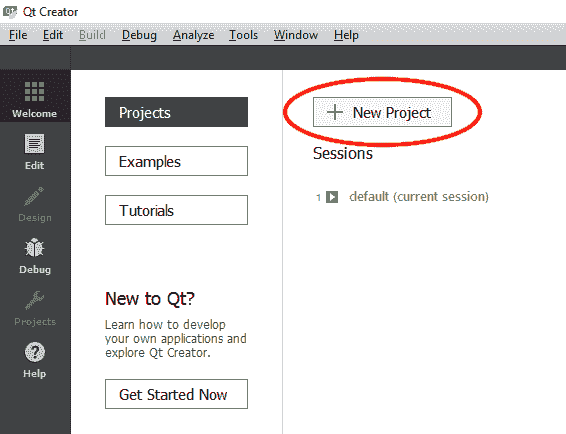

2.  之后，会弹出一个新窗口，要求您选择要创建的项目类型。在应用程序类别下选择 Qt 小部件应用程序，然后单击选择...，然后，为您的项目创建一个名称(我选择了`Chapter2`作为我的项目名称)，并通过单击浏览来选择项目目录...按钮:

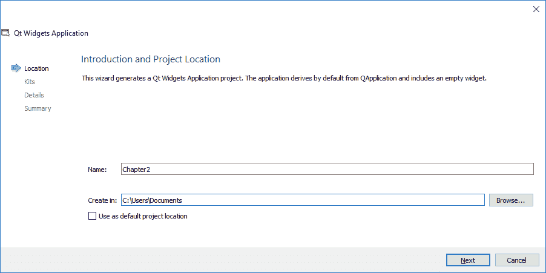

3.  接下来，您将被要求为您的项目选择一个工具包。如果您在 Windows 系统上运行此程序，并且安装了 Microsoft Visual Studio，则可以使用 MSVC 编译器选择相关的工具包；否则，选择运行 MinGW 编译器的版本。Qt 通常预装 MinGW 编译器，所以你不需要单独下载。如果你在 Linux 系统上运行这个，那么你会看到 GCC 工具包，或者如果你在 macOS 上运行这个，会看到 Clang 工具包。要了解更多关于*套件和构建设置*的信息，请查看[第 15 章](14.html)、*跨平台开发*:

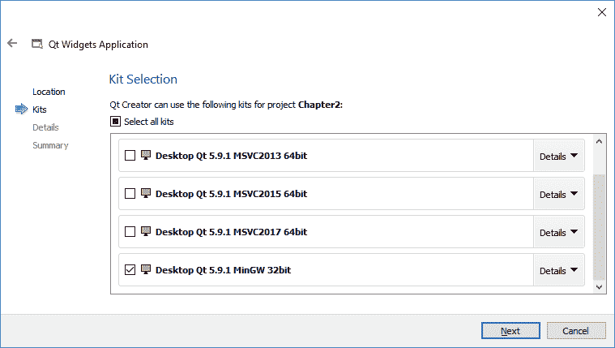

4.  之后，新项目向导将要求您命名主窗口类。我们将使用默认设置，然后单击“下一步”按钮继续:

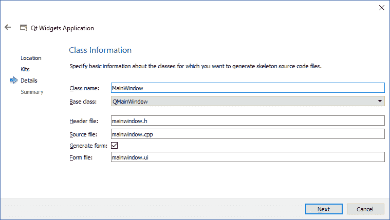

5.  最后，您将被要求将您的版本控制工具链接到您的项目。通过将版本控制工具链接到您的项目，您将能够在远程服务器上保留代码的每个修订版，并跟踪对项目所做的所有更改。如果你在一个团队中工作，这尤其有用。但是，在本教程中，我们将不使用任何版本控制，因此我们只需单击“完成”按钮继续:

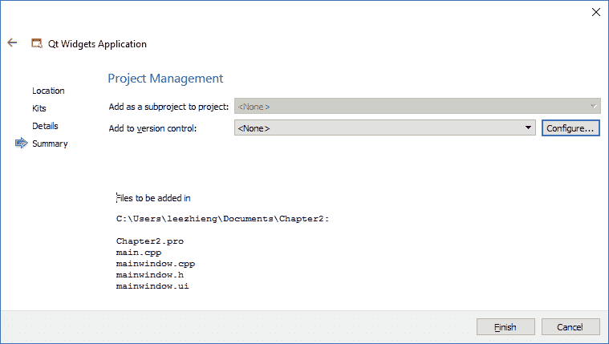

6.  完成后，Qt Creator 将打开您的新项目，您将能够看到左上角显示的项目目录，如下所示:

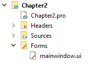

7.  现在，在项目目录面板上双击打开`mainwindow.ui`。然后，Qt Creator 将切换到另一种模式，称为 Qt Designer，它本质上是一种用于为程序设计基于小部件的图形用户界面的工具。一旦 Qt 设计器被激活，您将在左侧面板上看到一个可用的小部件列表，并在右侧看到一个供您设计图形用户界面的地方。在开始学习如何设计自己的 UI 之前，让我们花点时间熟悉一下 Qt Designer 的界面:

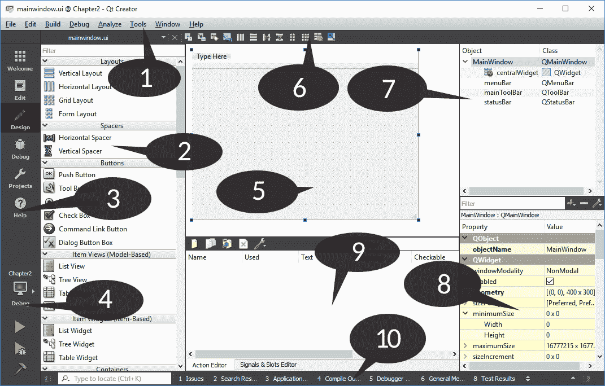

以下数字代表上一张截图中显示的用户界面:

1.  **菜单栏**:菜单栏是你找到 Qt Creator 所有基本功能的地方，比如新建项目、保存文件、更改编译器设置等等。
2.  **小部件框**:小部件框有点像工具箱，里面显示着 Qt Designer 提供的所有不同的小部件，随时可以使用。您可以将小部件框中的任何小部件直接拖放到表单编辑器的画布上，它们将出现在您的程序中。

3.  **模式选择器**:模式选择器是可以通过点击“编辑”或“设计”按钮，在源代码编辑或 UI 设计之间快速轻松切换的地方。您还可以通过单击位于模式选择器面板上的调试器和探查器工具各自的按钮来轻松导航到它们。
4.  **构建快捷方式**:这里显示了三个不同的快捷按钮——构建、运行和调试。您可以通过按这里的按钮而不是菜单栏上的按钮来轻松地构建和测试运行您的应用程序。
5.  **表单编辑器**:这里是你应用你的创意，设计应用程序 UI 的地方。您可以将任何小部件从小部件框拖放到表单编辑器的画布上，以便它出现在您的程序中。
6.  **表单工具栏**:表单工具栏是可以快速选择不同表单进行编辑的地方。您可以通过单击小部件框上方的下拉框并选择要用 Qt 设计器打开的用户界面文件来更改为不同的表单。还有一些按钮允许您在表单编辑器和用户界面布局的不同模式之间切换。
7.  **对象检查器**:这是当前`.ui`文件中的所有小部件以分层方式列出的地方。小部件按照其与其他小部件的父子关系排列在树列表中。通过在表单编辑器中移动小部件，可以轻松地重新排列它的层次结构。
8.  **属性编辑器**:当您从对象检查器窗口(或表单编辑器窗口)中选择一个小部件时，该特定小部件的属性将显示在属性编辑器中。您可以在这里更改任何属性，结果将立即显示在表单编辑器上。
9.  **动作编辑器和信号及槽编辑器**:动作编辑器和信号及槽编辑器都位于此窗口。您可以使用动作编辑器创建链接到菜单栏和工具栏按钮的动作。信号和插槽编辑器是您
10.  **输出窗格**:输出窗格是您在测试应用程序时查找问题或调试信息的地方。它由几个显示不同信息的窗口组成，如问题、搜索结果、应用程序输出等。

简而言之，Qt 提供了一个名为 Qt Creator 的一体化编辑器。Qt Creator 与 Qt 附带的几个不同工具协同工作，例如脚本编辑器、编译器、调试器、分析器和 UI 编辑器。在前面的截图中可以看到，用户界面编辑器叫做 Qt 设计器。Qt Designer 是设计人员设计程序用户界面的完美工具，无需编写任何代码。这是因为 Qt Designer 采用了**所见即所得** ( **所见即所得**)的方法，提供了最终结果的精确可视化表示，这意味着无论你用 Qt Designer 设计什么，当程序编译和运行时，结果都是完全相同的。请注意，Qt 附带的每个工具实际上都可以单独运行，但是如果您是初学者或者只是在做一个简单的项目，建议只使用 Qt Creator，它将所有这些工具连接在一个界面中。

# 基本 Qt 小部件

现在，我们将看看 Qt 设计器中可用的默认小部件集。您实际上可以自己创建自定义小部件，但这是一个高级主题，不在本书的讨论范围内。让我们看一下小部件框中列出的前两个类别——布局和间隔:


布局和间隔实际上不是您可以直接观察到的，但是它们会影响小部件的位置和方向:

1.  垂直布局:垂直布局小部件在垂直列中从上到下布局小部件。
2.  水平布局:水平布局小部件将小部件从左到右(对于从右到左的语言，从右到左)排列成水平行。

3.  网格布局:网格布局小部件在二维网格中布局小部件。每个小部件可以占用多个单元格。
4.  表单布局:表单布局小部件以两列字段样式布局小部件。顾名思义，这种类型的布局最适合输入小部件的形式。

Qt 提供的布局对于创建高质量的应用程序非常重要，并且非常强大。Qt 程序通常不会使用固定的位置来布局元素，因为布局允许对话框和窗口以合理的方式动态调整大小，同时在本地化为不同语言时处理不同长度的文本。如果你不在你的 Qt 程序中使用布局，它的 UI 在不同的计算机或设备上可能看起来非常不同，这在大多数情况下会造成不愉快的用户体验。

接下来，让我们看一下间隔小部件。间隔器是一个不可见的小部件，它沿着特定的方向推动小部件，直到到达布局容器的极限。布局中必须使用间隔物，否则它们不会产生任何效果。

间隔器有两种类型，即水平间隔器和垂直间隔器:

1.  水平间隔器:水平间隔器小部件是占据布局内空间并沿着水平空间推动布局内其他小部件的小部件。
2.  垂直间隔器:垂直间隔器类似于水平间隔器，只是它沿着垂直空间推动小部件。

很难想象布局和间隔器在没有实际操作的情况下如何工作。别担心，因为我们马上就要试用了。Qt Designer 最强大的功能之一是，您可以试验和测试您的布局，而不必在每次更改后都更改和编译您的代码。

除了布局和间隔，还有几个类别，即按钮、项目视图、容器、输入小部件和显示小部件。我不会去解释他们每一个人，因为他们的名字不言自明。您也可以将小部件拖放到表单编辑器上，查看它的功能。让我们开始吧:

1.  单击按钮小部件并将其从小部件框拖动到表单编辑器，如下图所示:

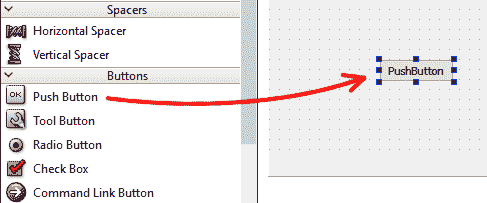

2.  然后，选择新添加的按钮小部件，您将看到与此特定小部件相关的所有信息现在都出现在属性编辑器面板上:


3.  您可以在 C++代码中以编程方式更改小部件的属性，如外观、焦点策略、工具提示等。有些属性也可以在表单编辑器中直接编辑。让我们双击按钮并更改按钮的文本，然后通过拖动按钮的边缘来调整按钮的大小:

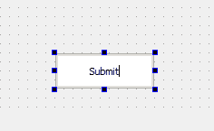

4.  完成后，让我们将水平布局拖放到表单编辑器中。然后，将按钮拖到新添加的布局中。现在，您将看到按钮自动适应布局:

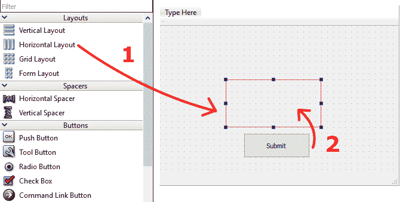

5.  默认情况下，主窗口不带有任何布局效果，因此小部件将停留在原来的位置，即使窗口正在调整大小，这看起来也不太好。要向主窗口添加布局效果，请在表单编辑器中的窗口上单击鼠标右键，选择“布局”，最后选择“垂直布局”。您现在将看到我们之前添加的水平布局小部件现在正在自动扩展以适合整个窗口。这是 Qt 中布局的正确行为:


6.  接下来，我们可以玩一下间隔器，看看它有什么效果。我们将把一个垂直间隔拖放到包含按钮的布局的顶部，然后在按钮的布局内，在按钮的两侧放置两个水平间隔:

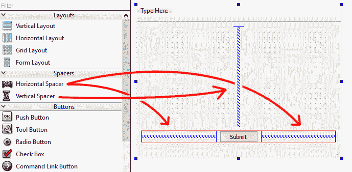

间隔器将推动位于两端的所有小部件，并占据空间本身。在本例中，提交按钮将始终停留在窗口的底部，并保持其中间位置，而不管窗口的大小如何。这使得图形用户界面看起来很好，即使在不同的屏幕尺寸上。

自从我们在窗户上加了垫片后，我们的按钮就被压缩到最小尺寸。让我们通过将其`minimumSize`属性设置为 120 x 40 来放大按钮，您会看到按钮现在看起来大了很多:

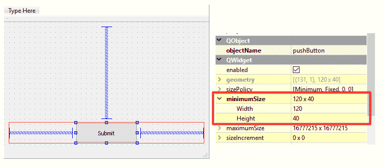

7.  之后，让我们在按钮布局的上方添加一个表单布局，并在它的下方添加一个垂直间隔。现在，您将看到表单布局非常薄，因为它被我们之前放置在主窗口上的垂直间隔器挤压，当您想要将小部件拖放到表单布局中时，这可能会很麻烦。要解决这个问题，暂时将`layoutTopMargin`属性设置为`20`或更高:

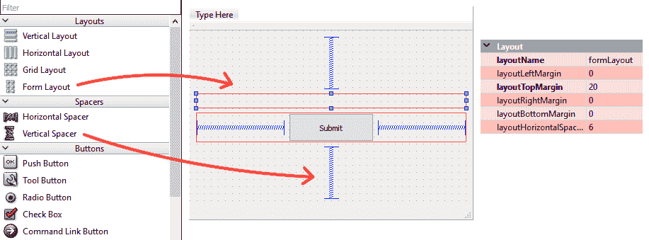

8.  然后，将两个标签拖放到表单布局的左侧，将两行编辑拖放到表单布局的右侧。双击两个标签，分别将其显示文本更改为`Username:`和`Password:`。完成后，将表单布局的`layoutTopMargin`属性设置回`0`:


目前，图形用户界面看起来很棒，但是表单布局现在占据了中间的整个空间，当主窗口最大化时，这并不令人愉快。为了保持表单紧凑，我们将执行以下步骤，这些步骤有点棘手:

9.  首先，在表单上方拖放一个水平布局，将其`layoutTopMargin`和`layoutBottomMargin`设置为`20`，这样我们稍后放置在其中的小部件就不会离提交按钮太近。接下来，拖放整个表单布局，我们之前将它放入水平布局。然后，在表单的两侧放置水平间隔以保持居中。下面的截图说明了这些步骤:


10.  之后，我们可以进一步调整图形用户界面，使其看起来整洁，然后再进入下一部分，在那里我们将定制小部件的样式。让我们从将两个线编辑小部件的`minimumSize`属性设置为 150 x 25 开始。然后，将表单布局的`layoutLeftMargin`、`layoutRightMargin`、`layoutTopMargin`和`layoutBottomMargin`属性设置为`25`。我们之所以要这样做，是因为我们将在下一节中向表单布局添加一个大纲。

11.  由于按钮现在距离表单布局太远，让我们设置水平布局的`layoutBottomMargin`属性，它将表单布局设置为`0`。这将使按钮稍微移动到表单布局的上方并靠近表单布局。之后，我们将调整按钮的大小，使其与表单布局对齐。让我们将按钮的`minimumSize`属性设置为 260 x 35，我们就完成了！：

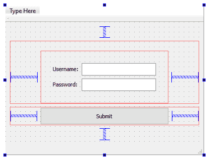

您也可以通过转到工具|表单编辑器|预览来预览图形用户界面，而无需构建程序。在没有陡峭学习曲线的情况下，为 Qt 程序设计圆滑的图形用户界面时，Qt 设计器是一个非常方便的工具。在下一节中，我们将学习如何使用 Qt 样式表定制小部件的外观。

# qt 样式表

Qt 的 Widgets 应用程序使用了一个名为 Qt 样式表的样式系统，它类似于 web 技术的样式系统— **CSS** ( **层叠样式表**)。您所需要做的就是编写小部件的样式描述，Qt 将相应地呈现它。Qt 样式表的语法与 CSS 非常相似。

Qt 样式表的灵感来自于 CSS，因此它们彼此非常相似:

*   Qt 样式表:

```cpp
QLineEdit { color: blue; background-color: black; } 
```

*   CSS:

```cpp
h1 { color: blue; background-color: black; } 
```

在前面的例子中，Qt 样式表和 CSS 都包含一个声明块和一个选择器。每个声明由属性和值组成，用冒号分隔。

您可以使用两种方法来更改小部件的样式表——直接使用 C++代码或使用属性编辑器。如果使用 C++代码，可以调用`QObject::setStyleSheet()`函数，如下所示:

```cpp
myButton->setStyleSheet("background-color: green"); 
```

前面的代码将我们的按钮小部件的背景颜色更改为绿色。您也可以通过将相同的声明写入 Qt 设计器中小部件的`styleSheet`属性来获得相同的结果:

```cpp
QPushButton#myButton { background-color: green } 
```

要了解更多关于 Qt 样式表的语法和属性，请参考以下链接:[http://doc.qt.io/qt-5/stylesheet-reference.html](http://doc.qt.io/qt-5/stylesheet-reference.html)

让我们继续我们的项目，并应用一个自定义的 Qt 样式表到我们的图形用户界面！

1.  首先，右键单击提交按钮并选择更改样式表...将弹出一个窗口，供您编辑小部件的样式表:


2.  然后，将以下内容添加到样式表编辑器窗口:

```cpp
border: 1px solid rgb(24, 103, 155); 
border-radius: 5px; 
background-color: rgb(124, 203, 255); 
color: white;
```

3.  完成后，单击“确定”按钮，您应该能够看到“提交”按钮将其外观更改为:

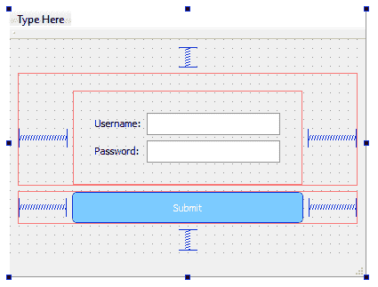

我们之前使用的样式表几乎是不言自明的。它启用按钮的边界线，并使用 RGB 值将边框颜色设置为深蓝色。然后，它还对按钮应用圆角效果，并将其背景颜色更改为浅蓝色。最后，提交文本也被更改为白色。

4.  接下来，我们希望将自定义样式表应用于表单布局。但是，您会注意到没有变更样式表...选项。这是因为布局不带有该属性。为了将样式应用于表单布局，我们必须首先将其转换为 QWidget 或 QFrame 对象。为此，右键单击表单布局并选择变形到| QFrame:


5.  完成后，您会注意到它现在带有`styleSheet`属性，因此我们现在可以自定义它的外观。让我们右键单击它并选择“更改样式表”...打开样式表编辑器窗口。然后，插入以下脚本:

```cpp
#formFrame { 
border: 1px solid rgb(24, 103, 155); 
border-radius: 5px; 
background-color: white; } 
```

单词`formFrame`指的是小部件的`objectName`属性，它必须与小部件的确切名称相匹配，否则样式将不会应用于它。我们为这个例子定义小部件名称的原因(我们在上一个例子中没有这样做)是因为如果我们不指定小部件名称，样式也将应用于它的所有子代。你可以试着从前面的脚本中删除`#formFrame {}`，看看会发生什么——现在，即使是标签和线编辑也有边界线，这不是我们想要做的。图形用户界面现在如下所示:


6.  最后，我们希望有一个好看的背景，我们可以通过附加一个背景图像来做到这一点。为此，我们首先需要将图像导入 Qt 的资源系统。转到文件|新文件或项目...然后，在文件和类类别下选择 Qt。之后，选择 Qt 资源文件并点击选择...按钮。Qt 资源系统是一种独立于平台的机制，用于在应用程序的可执行文件中存储二进制文件。您基本上可以使用 Qt 资源文件将所有这些重要的文件，如图标图像或语言文件，直接存储到您的可执行文件中。这些重要文件将在编译过程中直接嵌入到您的程序中。

7.  然后，在按下“下一步”按钮之前键入文件名并设置其位置，然后单击“完成”按钮。现在，您将看到一个新的资源文件正在创建，我将其命名为`resource.qrc`:

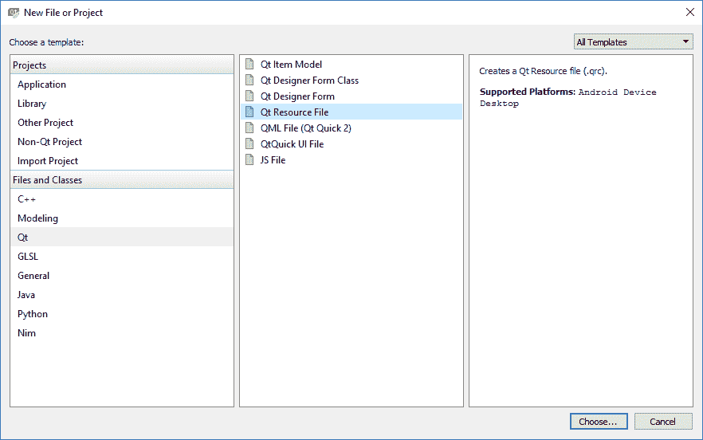

8.  用 Qt 创建器打开`resource.qrc`，选择添加|添加前缀。之后，键入您喜欢的前缀，例如，`/images`。完成后，再次选择添加，这次选择添加文件。添加名为`login_bg.png`的示例项目提供的图像文件。然后，保存`resource.qrc`并右键单击图像，选择将资源路径复制到剪贴板。然后关闭`resource.qrc`，再次打开`mainwindow.ui`:


9.  我们需要做的下一件事是从对象检查器中右键单击`centralWidget`对象，然后选择更改样式表...，然后插入以下脚本:

```cpp
#centralWidget { 
border-image: urlimg/login_bg.png); }
```

10.  `url()`内的文字可以通过按 *Ctrl* + *V* (或粘贴)来插入，因为在上一步中我们选择了将资源路径复制到剪贴板时，它被复制到了剪贴板。最终结果如下:

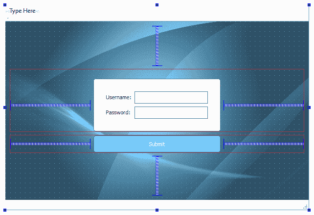

请确保您也构建并运行了应用程序，然后检查最终结果是否与预期的一样。为了让它看起来真正专业，还有很多东西需要调整，但是到目前为止，它看起来非常棒！

# 摘要

Qt Designer 确实彻底改变了我们设计程序图形用户界面的方式。它不仅包括所有常见的小部件，而且还有一些便利的东西，如布局和间隔，这使得我们的程序在不同类型的显示器和屏幕尺寸上运行得非常好。此外，请注意，我们已经成功地创建了一个具有漂亮用户界面的工作应用程序，而无需编写一行 C++代码！

我们在这一章学到的仅仅是 Qt 的皮毛，因为我们还有很多特性需要学习！加入我们的下一章，了解我们如何让我们的程序真正发挥作用！