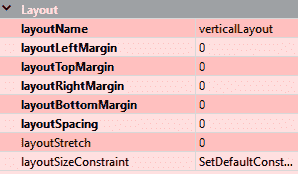
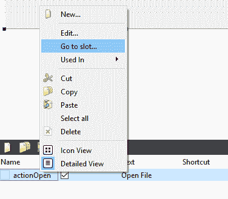
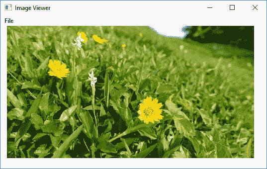
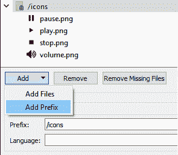
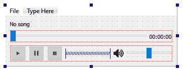
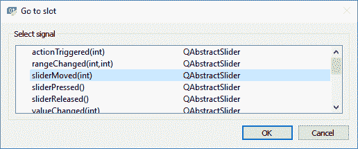
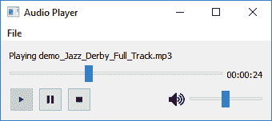
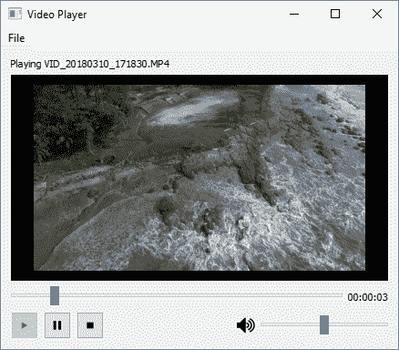

# 多媒体观众

在前一章中，我们学习了如何通过云存储上传和下载文件。现在，在本章中，我们将学习如何使用 Qt 的多媒体模块打开这些文件，特别是媒体文件，如图像、音乐和视频。

在本章中，我们将涵盖以下主题:

*   重温多媒体模块
*   图像查看器
*   音乐播放器
*   视频播放器

我们开始吧！

# 重温多媒体模块

在本章中，我们将再次使用多媒体模块，我们之前在[第 9 章](08.html)、*摄像机模块*中已经介绍过。然而，这次我们将使用模块的一些其他部分，所以我认为解剖模块并看看里面有什么是个好主意。

# 剖析模块

多媒体模块是一个非常大的模块，由许多不同的部分组成，提供非常不同的特性和功能。主要类别如下:

*   声音的
*   录像
*   照相机
*   收音机

请注意，处理图像格式的类，如`QImage`、`QPixmap`等，不是多媒体模块的一部分，而是图形用户界面模块的一部分。这是因为它们是 GUI 中不可分割的重要部分。尽管如此，我们仍将在本章中介绍`QImage`课。

每个类别下都有子类别，如下所示:

*   音频:
    *   音频输出
    *   录音机
*   视频:
    *   录像机
    *   影像播放机
    *   视频播放列表
*   摄像机:
    *   照相机取景器
    *   相机图像捕捉
    *   照相机录像机
*   收音机:
    *   无线电调谐器(适用于支持模拟无线电的设备)

每个类都被设计来实现不同的目的。例如`QSoundEffect`用于播放低延时音频文件(如 WAV 文件)。`QAudioOutput`另一方面，将原始音频数据输出到特定的音频设备，这使您可以对音频输出进行低级控制。最后，`QMediaPlayer`是一个高级音频(和视频)播放器，支持许多不同的高延迟音频格式。在为您的项目选择合适的课程之前，您必须了解所有课程之间的差异。

Qt 中的多媒体模块是一个巨大的野兽，经常会让新手感到困惑，但如果你知道该选择哪个，它可能会很有优势。多媒体模块的另一个问题是，它可能在您的目标平台上工作，也可能不工作。这是因为所有这些类下面都是特定平台的本机实现。如果某个特定平台不支持某个功能，或者还没有实现该功能，那么您将无法使用这些功能。

For more information regarding the different classes provided by Qt's multimedia module, please visit the following link:
[https://doc.qt.io/qt-5.10/qtmultimedia-index.html](https://doc.qt.io/qt-5.10/qtmultimedia-index.html)

# 图像查看器

数字图像已经成为我们日常生活的一个重要方面。无论是自拍、舞会之夜的照片，还是搞笑的迷因，我们都会花很多时间看数字图像。在下一节中，我们将学习如何使用 Qt 和 C++创建我们自己的图像查看器。

# 为图像查看器设计用户界面

让我们开始创建我们的第一个多媒体程序。在本节中，我们将创建一个图像查看器，顾名思义，它会打开一个图像文件并将其显示在窗口上:

1.  让我们打开 Qt Creator 并创建一个新的 Qt Widgets 应用程序项目。
2.  之后，打开`mainwindow.ui`并在中心小部件中添加一个`Label`(命名为`imageDisplay`，它将作为渲染我们图像的画布。然后，通过选择布局并垂直按下位于画布顶部的布局，将布局添加到中心视图获取:


3.  You can remove the tool bar and status bar to give space to the `Label`. Also, set the layout margins of the central widget to `0`:

    

4.  之后，双击菜单栏并添加一个文件操作，然后在它下面打开文件:


5.  然后，在操作编辑器下，右键单击打开文件操作，并选择转到插槽...：



6.  将弹出一个窗口，要求您选择一个信号，因此选择“触发的”()，然后单击“确定”:


将自动为您创建一个`slot`功能，但我们将在下一节保留该功能。我们已经完成了用户界面，它真的很简单。接下来，让我们继续前进，开始编写我们的代码！

# 为图像查看器编写 C++代码

让我们从以下步骤开始:

1.  首先，打开`mainwindow.h`并添加以下标题:

```cpp
#include <QMainWindow> 
#include <QFileDialog> 
#include <QPixmap> 
#include <QPainter>
```

2.  然后，添加以下名为`imageBuffer`的变量，该变量将作为重新缩放前指向实际图像数据的指针。然后，添加以下功能:

```cpp
private: 
   Ui::MainWindow *ui; 
 QPixmap* imageBuffer; 

public:
   void resizeImage();
 void paintEvent(QPaintEvent *event);

public slots:
   void on_actionOpen_triggered();
```

3.  接下来，打开`mainwindow.cpp`并初始化类构造函数中的`imageBuffer`变量:

```cpp
MainWindow::MainWindow(QWidget *parent) : 
   QMainWindow(parent), 
   ui(new Ui::MainWindow) 
{ 
   ui->setupUi(this); 
   imageBuffer = nullptr; 
} 
```

4.  之后，将以下代码添加到上一节为我们创建的`slot`函数 Qt 中:

```cpp
void MainWindow::on_actionOpen_triggered() 
{ 
   QString fileName = QFileDialog::getOpenFileName(this, "Open Image File", qApp->applicationDirPath(), "JPG (*.jpg *.jpeg);;PNG (*.png)"); 

   if (!fileName.isEmpty()) 
   { 
         imageBuffer = new QPixmap(fileName); 
         resizeImage(); 
   } 
}
```

5.  前面的代码基本上打开了文件选择对话框，用选择的图像文件创建了一个`QPixmap`对象。所有这些完成后，它将调用`resizeImage()`函数，如下代码所示:

```cpp
void MainWindow::resizeImage() 
{ 
   if (imageBuffer != nullptr) 
   { 
         QSize size = ui->imageDisplay->size(); 
         QPixmap pixmap = imageBuffer->scaled(size, 
            Qt::KeepAspectRatio); 

         // Adjust the position of the image to the center 
         QRect rect = ui->imageDisplay->rect(); 
         rect.setX((this->size().width() - pixmap.width()) / 2); 
         rect.setY((this->size().height() - pixmap.height()) / 2); 

         QPainter painter; 
         painter.begin(this); 
         painter.drawPixmap(rect, pixmap, ui->imageDisplay->rect()); 
         painter.end(); 
   } 
} 
```

`resizeImage()`函数所做的只是从`imageBuffer`变量中复制图像数据，并在窗口画布上显示图像之前调整图像大小以适合窗口大小。您可能正在打开比屏幕分辨率大得多的图像，我们不希望打开如此大的图像文件时图像被裁剪。

我们使用`imageBuffer`变量的原因是为了保留原始数据的副本，并且不会因为多次调整大小而影响图像质量。

最后，我们也在`paintEvent()`函数中调用这个`resizeImage()`函数。每当主窗口调整大小或从最小化状态恢复时，`paintEvent()`将自动被调用，并且`resizeImage()`功能也将被调用，如下所示:

```cpp
void MainWindow::paintEvent(QPaintEvent *event) 
{ 
   resizeImage(); 
} 
```

就这样。如果您现在构建并运行项目，您应该会得到一个非常简洁的图像查看器，如下所示:



# 音乐播放器

在下一节中，我们将学习如何使用 Qt 和 C++构建我们自己的定制音乐播放器。

# 为音乐播放器设计用户界面

让我们继续下一个项目。在这个项目中，我们将使用 Qt 构建一个音频播放器。请执行以下步骤:

1.  与上一个项目一样，我们将创建一个`Qt Widgets Application`项目。
2.  打开`project file (.pro)`，加入`multimedia`模块:

```cpp
QT += core gui multimedia 
```

3.  We added the `multimedia` text so that Qt includes classes related to the multimedia module in our project. Next, open up `mainwindow.ui`, and refer to the following screenshot to construct the user interface:

    

我们基本上在顶部添加了一个标签，后面是一个水平滑块和另一个标签来显示音频的当前时间。之后，我们在底部添加了三个按钮，分别是播放按钮、暂停按钮和停止按钮。位于这些按钮右侧的是另一个控制音量的水平布局。

如你所见，所有的按钮现在都没有图标，很难理解哪个按钮是为了什么目的。

1.  To add icons to the buttons, let's go to File | New File or Project and select Qt Resource File under the Qt category. Then, create a prefix called `icons`, and add the icon images to the prefix:

    

2.  After that, add those icons to the Push Button by setting its icon property and selecting Choose Resource.... Then, set the `pixmap` property of the label, located beside the volume slider, as the volume icon:

    

3.  After you have added the icons to the Push Button and Label, the user interface should look a lot better:

    

我们已经完成了用户界面；让我们进入编程部分！

# 为音乐播放器编写 C++代码

要为音乐播放器编写 C++代码，请执行以下步骤:

1.  首先，打开`mainwindow.h`并添加以下标题:

```cpp
#include <QMainWindow> 
#include <QDebug> 
#include <QFileDialog> 
#include <QMediaPlayer> 
#include <QMediaMetaData> 
#include <QTime> 
```

2.  之后，添加`player`变量，这是一个`QMediaPlayer`指针。然后，声明我们稍后要定义的函数:

```cpp
private: 
   Ui::MainWindow *ui; 
   QMediaPlayer* player; 

public:
 void stateChanged(QMediaPlayer::State state);
 void positionChanged(qint64 position);
```

3.  接下来，打开`mainwindow.cpp`并初始化玩家变量:

```cpp
MainWindow::MainWindow(QWidget *parent) : 
   QMainWindow(parent), 
   ui(new Ui::MainWindow) 
{ 
   ui->setupUi(this); 

   player = new QMediaPlayer(this); 
   player->setVolume(ui->volume->value()); 
   connect(player, &QMediaPlayer::stateChanged, this, &MainWindow::stateChanged); 
   connect(player, &QMediaPlayer::positionChanged, this, &MainWindow::positionChanged); 
} 
```

`QMediaPlayer`类是我们的应用程序用来播放它加载的任何音频文件的主类。因此，我们需要知道音频播放的状态及其当前位置。我们可以通过将其`stateChanged()`和`positionChanged()`信号连接到我们的自定义`slot`功能来获取这些信息。

4.  `stateChanged()`信号允许我们获取音频播放的当前状态信息。然后，我们相应地启用和禁用按钮:

```cpp
void MainWindow::stateChanged(QMediaPlayer::State state) 
{ 
   if (state == QMediaPlayer::PlayingState) 
   { 
         ui->playButton->setEnabled(false); 
         ui->pauseButton->setEnabled(true); 
         ui->stopButton->setEnabled(true); 
   } 
   else if (state == QMediaPlayer::PausedState) 
   { 
         ui->playButton->setEnabled(true); 
         ui->pauseButton->setEnabled(false); 
         ui->stopButton->setEnabled(true); 
   } 
   else if (state == QMediaPlayer::StoppedState) 
   { 
         ui->playButton->setEnabled(true); 
         ui->pauseButton->setEnabled(false); 
         ui->stopButton->setEnabled(false); 
   } 
} 

```

5.  至于`positionChanged()`和`slot`功能，我们用它们来设置时间线滑块，以及计时器显示:

```cpp
 void MainWindow::positionChanged(qint64 position) 
{ 
   if (ui->progressbar->maximum() != player->duration()) 
         ui->progressbar->setMaximum(player->duration()); 

   ui->progressbar->setValue(position); 

   int seconds = (position/1000) % 60; 
   int minutes = (position/60000) % 60; 
   int hours = (position/3600000) % 24; 
   QTime time(hours, minutes,seconds); 
   ui->durationDisplay->setText(time.toString()); 
} 

```

6.  完成后，打开`mainwindow.ui`并右键单击每个按钮，然后选择转到插槽...接着选择`clicked()`信号。这将为每个按钮生成一个`slot`功能。这些`slot`功能的代码非常简单:

```cpp
void MainWindow::on_playButton_clicked() 
{  
   player->play(); 
} 

void MainWindow::on_pauseButton_clicked() 
{ 
   player->pause(); 
} 

void MainWindow::on_stopButton_clicked() 
{ 
   player->stop(); 
} 
```

7.  After that, right-click on both of the Horizontal Sliders, and select Go to slot... followed by choosing the `sliderMoved()` signal, and click OK:

    

8.  只要用户拖动滑块改变位置，就会调用`sliderMoved()`信号。我们需要将此位置发送给媒体播放器，并告诉它调整音频音量或更改当前音频位置。请注意不要将音量滑块的默认位置设置为零。考虑以下代码:

```cpp
void MainWindow::on_volume_sliderMoved(int position) 
{ 
   player->setVolume(position); 
} 

void MainWindow::on_progressbar_sliderMoved(int position) 
{ 
   player->setPosition(position); 
} 
```

9.  然后，我们需要将“文件”和“打开文件”操作添加到菜单栏中，就像我们在前面的示例项目中所做的那样。

10.  然后，右键单击操作编辑器中的打开文件操作，并选择转到插槽...之后选择`triggered()`，让 Qt 为你生成一个`slot`函数。将以下代码添加到音频文件选择的`slot`功能中:

```cpp
 void MainWindow::on_actionOpen_File_triggered() 
{ 
   QString fileName = QFileDialog::getOpenFileName(this,
      "Select Audio File", qApp->applicationDirPath(), 
       "MP3 (*.mp3);;WAV (*.wav)"); 
   QFileInfo fileInfo(fileName); 

   player->setMedia(QUrl::fromLocalFile(fileName)); 

   if (player->isMetaDataAvailable()) 
   { 
         QString albumTitle = player-
         >metaData(QMediaMetaData::AlbumTitle).toString(); 
         ui->songNameDisplay->setText("Playing " + albumTitle); 
   } 
   else 
   { 
         ui->songNameDisplay->setText("Playing " + 
           fileInfo.fileName()); 
   } 

   ui->playButton->setEnabled(true); 
   ui->playButton->click(); 
} 

```

前面只是打开了一个文件选择对话框，只接受 MP3 和 WAV 文件。如果您愿意，您也可以添加其他格式，但是支持的格式因平台而异；因此，您应该测试它，以确保您想要使用的格式得到支持。

之后，它会将选定的音频文件发送到媒体播放器进行预加载。然后，我们尝试从元数据中获取音乐的标题，并将其显示在`Labelwidget`上。但是，此功能(获取元数据)可能在您的平台上受支持，也可能不受支持，所以为了以防它不会出现，我们将其替换为音频文件名。最后，我们启用播放按钮并自动开始播放音乐。

就这样。如果您现在构建并运行该项目，您应该能够获得一个简单但功能齐全的音乐播放器！



# 视频播放器

在前一节中，我们已经学习了如何创建音频播放器。在这一章中，我们将进一步即兴创作我们的程序，并使用 Qt 和 C++创建一个视频播放器。

# 为视频播放器设计用户界面

下一个例子是视频播放器。由于`QMediaPlayer`也支持视频输出，所以我们可以使用和前面音频播放器例子相同的用户界面和 C++代码，只需对其做一些小的改动。

1.  首先打开`project file (.pro)`，再加入另一个关键词，叫做`multimediawidgets`:

```cpp
QT += core gui multimedia multimediawidgets 
```

2.  然后，打开`mainwindow.ui`并在时间线滑块上方添加一个水平布局(命名为`movieLayout`)。之后，右键单击布局并选择变形为| QFrame。然后，我们将其大小策略属性设置为扩展，扩展:


3.  之后，我们通过设置其`styleSheet`属性将 QFrame 的背景设置为黑色，如下所示:

```cpp
background-color: rgb(0, 0, 0); 
```

4.  用户界面应该如下所示，我们就完成了:


# 为视频播放器编写 C++代码

要为视频播放器编写 C++代码，我们执行以下步骤:

1.  对于`mainwindow.h`，并没有太多的改动。我们所需要做的就是在标题中加入`QVideoWidget`:

```cpp
#include <QMainWindow> 
#include <QDebug> 
#include <QFileDialog> 
#include <QMediaPlayer> 
#include <QMediaMetaData> 
#include <QTime> 
#include <QVideoWidget> 
```

2.  然后，打开`mainwindow.cpp`。我们必须定义一个`QVideoWidget`对象并将其设置为视频输出目标，然后将其添加到我们在上一步中刚刚添加的`QFrame`对象的布局中:

```cpp
MainWindow::MainWindow(QWidget *parent) : 
   QMainWindow(parent), 
   ui(new Ui::MainWindow) 
{ 
   ui->setupUi(this); 

   player = new QMediaPlayer(this); 

   QVideoWidget* videoWidget = new QVideoWidget(this); 
   player->setVideoOutput(videoWidget); 
   ui->movieLayout->addWidget(videoWidget); 

   player->setVolume(ui->volume->value()); 
   connect(player, &QMediaPlayer::stateChanged, this, &MainWindow::stateChanged); 
   connect(player, &QMediaPlayer::positionChanged, this, &MainWindow::positionChanged); 
} 
```

3.  在`slot`函数中，当打开文件动作被触发时，我们简单地改变文件选择对话框，只接受`MP4`和`MOV`格式。如果您愿意，也可以添加其他视频格式:

```cpp
QString fileName = QFileDialog::getOpenFileName(this, "Select Movie File", qApp->applicationDirPath(), "MP4 (*.mp4);;MOV (*.mov)"); 
```

就这样。代码的其余部分与音频播放器示例完全相同。这个例子的主要区别是我们定义了视频输出小部件，Qt 将为我们处理剩下的部分。

如果我们现在构建并运行这个项目，我们应该会得到一个非常流畅的视频播放器，就像你在这里看到的:



On a windows system, there was a case where the video player would throw an error. This problem is similar to the one reported here: [https://stackoverflow.com/questions/32436138/video-play-returns-directshowplayerservicedoseturlsource-unresolved-error-cod](https://stackoverflow.com/questions/32436138/video-play-returns-directshowplayerservicedoseturlsource-unresolved-error-cod)
To resolve this error, simply download and install the K-Lite_Codec_Pack which you can find here: [https://www.codecguide.com/download_k-lite_codec_pack_basic.htm](https://www.codecguide.com/download_k-lite_codec_pack_basic.htm). After this, the video should play like a charm!

# 摘要

在本章中，我们学习了如何使用 Qt 创建自己的多媒体播放器。接下来是与我们通常的话题完全不同的事情。在下一章中，我们将学习如何使用 QtQuick 和 QML 来创建触摸屏友好、移动友好和面向图形的应用程序。