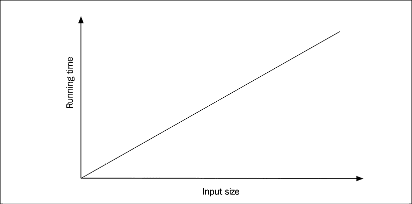
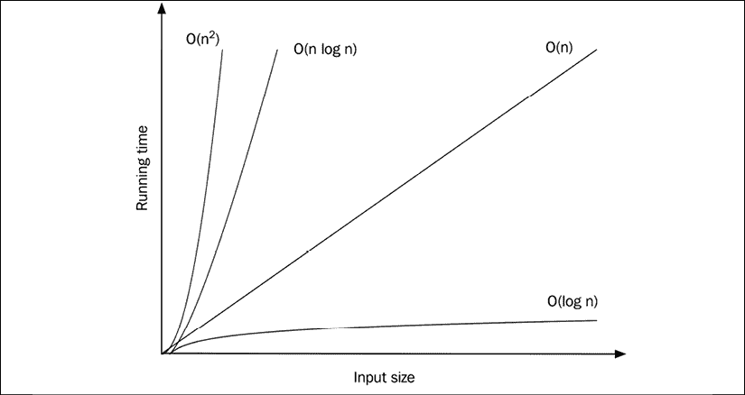
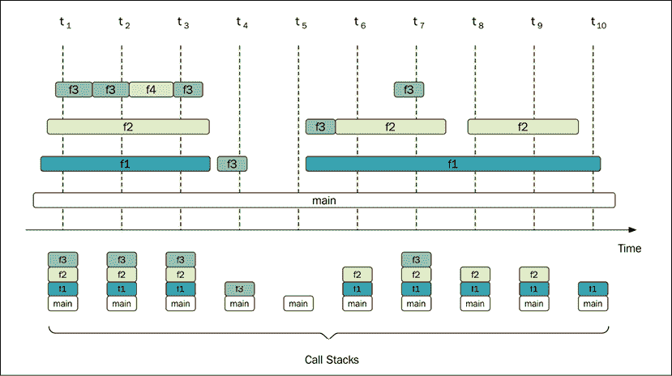
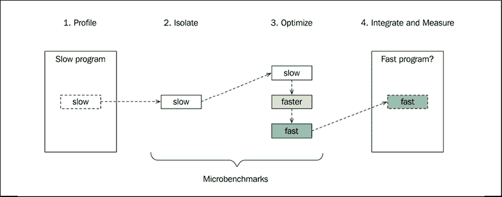

# three

# 分析和测量性能

由于这是一本关于编写高效运行的 C++ 代码的书，我们需要涵盖一些关于如何衡量软件性能和评估算法效率的基础知识。本章中的大多数主题都不是针对 C++ 的，只要遇到性能问题，就可以使用。

您将学习如何使用大 O 符号来估计算法效率。这是从 C++ 标准库中选择算法和数据结构时必不可少的知识。如果你是大 O 符号的新手，这部分可能需要一些时间来消化。但是不要放弃！为了理解这本书的其余部分，更重要的是，为了成为一名有性能意识的程序员，这是一个非常重要的主题。如果你想对这些概念有一个更正式或更实用的介绍，有大量的书籍和在线资源专门讨论这个话题。另一方面，如果您已经掌握了大 O 符号，并且知道什么是摊销时间复杂度，那么您可以浏览下一节，转到本章的后面部分。

本章包括以下几节:

*   使用大 O 符号估计算法效率
*   优化代码时的建议工作流程，这样您就不会在没有充分理由的情况下花时间微调代码
*   中央处理器剖析器——它们是什么，为什么要使用它们
*   微基准标记

让我们首先看一下如何使用大 O 符号来估计算法效率。

# 渐近复杂性和大 O 符号

解决一个问题的方法通常不止一种，如果效率是一个考虑因素，你应该首先通过选择正确的算法和数据结构来关注高级优化。评估和比较算法的一个有用方法是分析它们的渐近计算复杂度——也就是说，分析当输入的大小增加时，运行时间或内存消耗是如何增加的。此外，C++ 标准库规定了所有容器和算法的渐近复杂性，这意味着如果您正在使用这个库，对这个主题的基本理解是必须的。如果您已经对算法复杂性和大 O 符号有了很好的理解，您可以放心地跳过这一部分。

让我们从一个例子开始。假设我们想写一个算法，如果它在数组中找到一个特定的键就返回`true`，否则返回`false`。为了找出我们的算法在通过不同大小的数组时的行为，我们想要分析作为其输入大小的函数的该算法的运行时间:

```cpp
bool linear_search(const std::vector<int>& vals, int key) noexcept { 
  for (const auto& v : vals) { 
    if (v == key) { 
      return true; 
    } 
  } 
  return false; 
} 
```

算法很简单。它遍历数组中的元素，并将每个元素与键进行比较。如果我们幸运的话，我们在数组的开头找到了键，它会立即返回，但是我们可能会在整个数组中循环，根本找不到键。这将是算法的最坏情况，一般来说，这是我们要分析的情况。

但是当我们增加输入大小时，运行时间会发生什么呢？假设我们将数组的大小加倍。好吧，在最坏的情况下，我们需要比较数组中的所有元素，这将使运行时间翻倍。输入大小和运行时间之间似乎是线性关系。我们称之为线性增长率:

<figure class="mediaobject"></figure>

图 3.1:线性增长率

现在考虑以下算法:

```cpp
struct Point { 
  int x_{}; 
  int y_{}; 
}; 

bool linear_search(const std::vector<Point>& a, const Point& key) { 
  for (size_t i = 0; i < a.size(); ++ i) { 
    if (a[i].x_ == key.x_ && a[i].y_ == key.y_) { 
      return true; 
    } 
  } 
  return false; 
} 
```

我们比较的是点而不是整数，我们使用一个带有下标操作符的索引来访问每个元素。这些变化对运行时间有何影响？与第一种算法相比，绝对运行时间可能更长，因为我们做了更多的工作——例如，点的比较涉及两个整数，而不是数组中每个元素一个整数。然而，在这个阶段，我们对算法显示的增长率感兴趣，如果我们将运行时间与输入大小进行比较，我们仍然会得到一条直线，如上图所示。

作为搜索整数的最后一个例子，让我们看看如果我们假设数组中的元素是排序的，是否能找到更好的算法。不管元素的顺序如何，我们的第一个算法都可以工作，但是如果我们知道它们是排序的，我们可以使用二分搜索法。它通过查看中间的元素来决定是继续在数组的前半部分搜索还是后半部分搜索。为简单起见，索引`high`、`low`和`mid`属于`int`类型，需要一个`static_cast`。更好的选择是使用迭代器，这将在后面的章节中介绍。以下是算法:

```cpp
bool binary_search(const std::vector<int>& a, int key) {
  auto low = 0; 
  auto high = static_cast<int>(a.size()) - 1;
  while (low <= high) {
    const auto mid = std::midpoint(low, high); // C++ 20
    if (a[mid] < key) {
      low = mid + 1;
    } else if (a[mid] > key) {
      high = mid - 1;
    } else {
      return true;
    }
  }
  return false;
} 
```

可以看到，这个算法比简单的线性扫描更难得到的正确。它通过*猜测*在数组的中间来寻找指定的键。如果不是，它会将键与中间的元素进行比较，以决定应该在数组的哪一半继续查找键。因此，在每次迭代中，它会将数组切成两半。

假设我们用包含 64 个元素的数组来调用`binary_search()`。在第一次迭代中，我们拒绝 32 个元素，在下一次迭代中，我们拒绝 16 个元素，在下一次迭代中，我们拒绝 8 个元素，以此类推，直到没有更多的元素可以比较，或者直到我们找到关键字。对于 64 的输入大小，最多有 7 次循环迭代。如果我们*把输入尺寸*增加一倍到 128 呢？由于我们在每次迭代中将规模减半，这意味着我们只需要*再进行一次循环迭代*。显然，增长率不再是线性的——它实际上是对数的。如果我们测量`binary_search()`的运行时间，我们会看到增长率看起来如下:

<figure class="mediaobject"></figure>

图 3.2:对数增长率

在我的机器上，三个算法的快速计时以不同的输入大小重复调用 10000 次( *n* )产生了下表所示的结果:

<colgroup><col> <col> <col> <col></colgroup> 
| 算法 | n = 10 | n = 1，000 | n = 10 万 |
| 通过`int`进行线性搜索 | 0.04 毫秒 | 4.7 毫秒 | 458 毫秒 |
| 通过`Point`进行线性搜索 | 0.07 毫秒 | 6.7 毫秒 | 725 毫秒 |
| 二分搜索法与`int` | 0.03 毫秒 | 0.08 毫秒 | 0.16 毫秒 |

表 3.1:不同版本搜索算法的比较

比较算法 1 和 2，我们可以看到比较点而不是整数需要更多的时间，但是即使输入大小增加，它们仍然在同一个数量级。然而，如果我们在输入大小增加时比较所有三种算法，真正重要的是算法表现出的增长率。通过利用数组被排序的事实，我们可以用很少的循环迭代来实现搜索功能。对于大型阵列，与线性扫描阵列相比，二分搜索法实际上是自由的。

在确定已经为问题选择了正确的算法和数据结构之前，花时间调优代码通常不是一个好主意。

如果我们能以一种有助于我们决定使用哪种算法的方式来表达算法的增长率，那不是很好吗？这里是大 O 符号派上用场的地方。

下面是一个非正式的定义:

如果 *f(n)* 是一个用输入大小 *n* 指定算法运行时间的函数，我们说 *f(n)* 是*O(g(n)】*如果有一个常数 *k* 使得。

这意味着我们可以说`linear_search()`的时间复杂度是 *O(n)* ，对于两个版本(用整数运算的和用点运算的)，而`binary_search()`的时间复杂度是 *O(log n)* 或者 *log n* 的大 O。

在实践中，当我们想要找到一个函数的大 O 时，我们可以通过消除除增长率最大的项之外的所有项，然后移除任何常数因子来实现。例如，如果我们有一个时间复杂度由*f(n)= 4n*<sup class="italic">2</sup>*+30n+100*描述的算法，我们挑选出增长率最高的术语，4 *n* <sup class="italic">2</sup> 。接下来，我们去掉常数因子 4，以 *n* <sup class="italic">2</sup> 结束，这意味着我们可以说我们的算法运行在*O(n*<sup class="italic">2</sup>*)*中。找到算法的时间复杂度可能很难，但是在编写代码时，你越开始考虑它，它就会变得越容易。在大多数情况下，跟踪循环和递归函数就足够了。

让我们试着找出以下排序算法的时间复杂度:

```cpp
void insertion_sort(std::vector<int>& a) { 
  for (size_t i = 1; i < a.size(); ++ i) { 
    auto j = i; 
    while (j > 0 && a[j-1] > a[j]) {  
      std::swap(a[j], a[j-1]); 
      --j;  
    } 
  } 
} 
```

输入大小是数组的大小。运行时间可以通过查看迭代所有元素的循环来近似估计。首先，有一个迭代 *n - 1* 元素的外部循环。内循环不同:我们第一次到达`while`-循环，`j`为 1，循环只运行一次迭代。在下一次迭代中，`j`从 2 开始，减少到 0。对于外部`for`循环中的每次迭代，内部循环需要做的工作越来越多。最后，`j`从 *n - 1* 开始，这意味着在最坏的情况下，我们已经执行了`swap()` *1 + 2 + 3 +...+ (n - 1)* 次。我们可以用 *n* 来表示，注意这是一个算术级数。该系列的总和为:

<figure class="mediaobject"></figure>

因此，如果我们设置 *k = (n - 1)* ，则排序算法的时间复杂度为:

<figure class="mediaobject"></figure>

现在，我们可以通过首先消除除增长率最大的项之外的所有项来找到该函数的大 O，剩下的是 *(1/2)n* <sup class="italic">2</sup> 。之后我们去掉常数 *1/2* ，得出排序算法的运行时间为 *O(n* <sup class="italic">2</sup> *)* 。

## 增长率

如前所述，寻找一个复杂度函数的大 O 的第一步是去掉除了增长率最高的项之外的所有项。为了能够做到这一点，我们必须知道一些常见函数的增长率。在下图中，我绘制了一些最常见的函数:

<figure class="mediaobject"></figure>

图 3.3:增长率函数的比较

增长率与机器或编码方式等无关。当两种算法之间的增长率不同时，当输入大小变得足够大时，增长率最慢的算法总是会赢。让我们看看，如果我们假设执行 1 个单位的工作需要 1 毫秒，那么对于不同的增长率，运行时间会发生什么。下表列出了增长函数及其常用名称和不同的输入大小， *n* :

<colgroup><col> <col> <col> <col> <col></colgroup> 
| 大 O | 名字 | n = 10 | n = 50 | n = 1000 |
| *O(1)* | 常数 | 0.001 秒 | 0.001 秒 | 0.001 秒 |
| *O(对数 n)* | 对数的 | 0.003 秒 | 0.006 秒 | 0.01 秒 |
| *O(n)* | 线性的 | 0.01 秒 | 0.05 秒 | 1 秒 |
| *O(n 对数 n)* | 线性或 *n 对数* | 0.03 秒 | 0.3 秒 | 10 秒 |
| *O(n* <sup class="italic">2</sup> *)* | 二次的 | 0.1 秒 | 2.5 秒 | 16.7 分钟 |
| *O(2* <sup class="italic">n</sup> *)* | 指数的 | 1 秒 | 35700 年 | 3.4 * 10 <sup class="Superscript--PACKT-">290</sup> 年 |

表 3.2:不同增长率和不同输入大小值的绝对运行时间

请注意，右下角单元格中的数字是一个 291 位数！把这个和宇宙的年龄对比一下，13.7 * 10 <sup class="Superscript--PACKT-">9</sup> 年，这只是一个 11 位数。

接下来，我将介绍 C++ 标准库中经常使用的摊销时间复杂度。

## 摊销时间复杂性

通常，算法在不同的输入下表现不同。回到我们的线性搜索数组中元素的算法，我们正在分析一个键根本不在数组中的情况。对于该算法来说，这是最坏的情况——也就是说，它使用了该算法所需的大部分资源。最佳情况是指算法将需要的*最少的*资源量，而平均情况是指算法在不同输入下平均使用的资源量。

标准库通常指对容器进行操作的函数的*摊销运行时间*。如果一个算法在恒定的摊销时间内运行，这意味着它几乎在所有情况下都会在 *O(1)* 中运行，只有极少数情况下它的性能会更差。乍一看，摊销运行时间可能与平均时间混淆，但正如您将看到的，它们是不一样的。

为了理解摊销时间的复杂性，我们将花一些时间思考`std::vector::push_back()`。让我们假设向量内部有一个固定大小的数组来存储它的所有元素。如果在调用`push_back()`时固定大小数组中有更多元素的空间，操作将在恒定时间内运行，*O(1)*—也就是说，只要内部数组还有一个空间，它就不依赖于向量中已经有多少元素:

```cpp
if (internal_array.size() > size) { 
  internal_array[size] = new_element; 
  ++ size; 
} 
```

但是当内部数组已满时会发生什么？处理增长向量的一种方法是创建一个新的更大的空内部数组，然后将所有元素从旧数组移动到新数组。这显然不再是恒定时间，因为我们需要数组中每个元素移动一次，也就是说， *O(n)* 。如果我们认为这是最坏的情况，那就意味着`push_back()`是 *O(n)* 。但是如果我们多次调用`push_back()`的话，我们知道昂贵的`push_back()`不可能经常发生，所以会比较悲观，也不是很有用，如果我们知道`push_back()`连续多次调用的话，说`push_back()`就是 *O(n)* 。

摊销运行时间用于分析一个*操作序列*，而不是单个操作序列。我们仍然在分析最坏的情况，但是对于一系列的操作。摊销运行时间可以通过首先分析整个序列的运行时间，然后除以序列的长度来计算。假设我们正在执行一系列的 *m* 操作，总运行时间 *T(m)* :

<figure class="mediaobject"></figure>

其中 *t* <sub class="italic">0</sub> *= 1* ， *t* <sub class="italic">1</sub> *= n* ，*t*<sub class="italic">2</sub>*= 1*，*t*<sub class="italic">3</sub>*= n*等等。换句话说，一半的操作以恒定时间运行，另一半以线性时间运行。所有 *m* 操作的总时间 *T* 可表示如下:

<figure class="mediaobject"></figure>

每项操作的摊余复杂度为总时间除以操作次数，变为 *O(n)* :

<figure class="mediaobject"></figure>

然而，如果我们能够保证昂贵操作的数量与恒定时间操作的数量相比相差几个数量级，我们将实现更低的摊余运行成本。例如，如果我们能保证一个昂贵的操作在一个序列中只发生一次*T(n)+T(1)+T(1+)...*，则摊销运行时间为 *O(1)* 。因此，根据昂贵操作的频率，摊余运行时间会发生变化。

现在，回到`std::vector`。C++ 标准规定`push_back()`需要在摊销常数时间内运行， *O(1)* 。图书馆供应商是如何做到这一点的？如果容量在每次向量变满时增加固定数量的元素，我们将有一个类似于前面的例子，其中我们有一个运行时间 *O(n)* 。即使我们使用一个大的常数，容量变化仍然会以固定的时间间隔发生。关键的见解是，向量需要指数增长，以使昂贵的操作很少发生。在内部，向量使用增长因子，这样新阵列的容量就是当前大小乘以增长因子。

一个大的增长因素可能会浪费更多的内存，但会降低昂贵操作的发生频率。为了简化数学运算，让我们使用一个通用策略，即每次向量需要增长时将容量增加一倍。我们现在可以估计昂贵的电话发生的频率。对于大小为 *n* 的向量，我们需要将内部数组 *log* <sub class="italic">2</sub> *(n)* 次增长，因为我们一直在将大小翻倍。每次我们扩展数组时，我们都需要移动当前数组中的所有元素。第 *i* <sup class="italic">第</sup>次我们生长阵列时会有 *2* <sup class="italic">i</sup> 元素移动。因此，如果我们执行 *m* 个`push_back()`操作，增长操作的总运行时间将为:

<figure class="mediaobject"></figure>

这是一个几何级数，也可以表示为:

<figure class="mediaobject"></figure>

将这个除以序列的长度 *m* ，我们得到摊销运行时间 *O(1)* 。

正如我已经说过的，摊销时间复杂度在标准库中被大量使用，所以理解分析很好。思考如何在摊销常数时间中实现`push_back()`帮助我记住了摊销常数时间的简化版本:它几乎在所有情况下都会在 *O(1)* 中运行，除了极少数情况下它会表现得更差。

这就是我们将要讨论的关于渐近复杂性的全部内容。现在我们将继续讨论如何通过优化代码来解决性能问题并有效工作。

# 测量什么以及如何测量？

优化几乎总是会增加代码的复杂性。高级别的优化，比如选择算法和数据结构，可以让代码的意图更加清晰，但在很大程度上，优化会让代码更难阅读和维护。因此，我们希望绝对确保我们添加的优化对我们试图实现的性能有实际影响。我们真的需要让代码更快吗？用什么方式？代码真的占用了太多内存吗？为了理解哪些优化是可能的，我们需要很好地理解需求，例如延迟、吞吐量和内存使用。

优化代码很有趣，但也很容易迷失，没有任何可衡量的收益。我们将从优化代码时要遵循的建议工作流开始本节:

1.  **定义一个目标**:如果你有一个明确的量化目标，那么更容易知道如何优化以及何时停止优化。对于一些应用程序来说，从一开始就很清楚需求是什么，但是在许多情况下，它往往更加模糊。尽管代码运行太慢可能是显而易见的，但知道什么足够好是很重要的。每个领域都有自己的限制，所以一定要了解与你的应用相关的限制。下面是一些让它更具体的例子:
    *   用户交互应用的响应时间为 100 毫秒；参考[https://www . nngroup . com/articles/response-times-3-重要-限制](https://www.nngroup.com/articles/response-times-3-important-limits)。
    *   每秒 60 帧(FPS)的显卡为您提供每帧 16 毫秒的时间。
    *   以 44.1 千赫采样速率使用 128 个采样缓冲器的实时音频意味着略低于 3 毫秒。
2.  **测量**:一旦我们知道要测量什么以及极限是什么，我们就开始测量应用程序现在的性能。从*第一步*开始，如果我们对平均时间、峰值、负荷等感兴趣，应该是显而易见的。在这一步中，我们只关心衡量我们设定的目标。根据不同的应用，测量可以是从使用秒表到使用高度复杂的性能分析工具。
3.  **找到瓶颈**:接下来，我们需要找到应用程序的瓶颈——那些太慢而使应用程序无用的部分。此时不要相信自己的直觉！也许你通过在*步骤 2* 中的不同点测量代码获得了一些见解——这很好，但是你通常需要进一步剖析你的代码，以便找到最重要的热点。
4.  **进行有根据的猜测**:想出一个如何提高成绩的假设。可以使用查找表吗？我们能否缓存数据以获得整体吞吐量？我们能改变代码以便编译器能够向量化它吗？我们可以通过重用内存来减少关键部分的分配数量吗？如果你知道想法只是有根据的猜测，那么想出想法通常并不难。错了也没关系——以后你会发现它们是否有影响。
5.  **优化**:我们来实现我们在*第四步*中勾画的假设。不要花太多时间在这一步上，在你知道它真的有效果之前，让它变得完美。准备好拒绝这种优化。它可能没有预期的效果。
6.  **评估**:再次测量。进行与*步骤 2* 完全相同的测试，并比较结果。我们得到了什么？如果我们一无所获，拒绝代码并返回*步骤 4* 。如果优化实际上产生了积极的效果，你需要问自己是否足够好，可以花更多的时间在上面。优化有多复杂？值得付出努力吗？这是总体性能提升还是高度特定于某个案例/平台？它可维护吗？我们能封装它吗，还是它遍布整个代码库？如果不能激励优化，回到*步骤 4* ，否则继续最后一步。
7.  **重构**:如果你按照*第五步*中的说明，没有花太多时间在第一时间编写完美代码，那么是时候重构优化，让它更干净了。优化几乎总是需要一些注释来解释我们为什么以不同寻常的方式做事。

遵循这个过程将确保你保持在正确的轨道上，不会以没有动力的复杂优化结束。花时间定义具体目标和衡量的重要性怎么估计也不过分。为了在这方面取得成功，您需要了解哪些性能属性与您的应用程序相关。

## 性能属性

在开始测量之前，您必须知道哪些性能属性对您正在编写的应用程序很重要。在本节中，我将解释一些在衡量性能时经常使用的术语。根据您正在编写的应用程序，有些属性比其他属性更相关。例如，如果您正在编写在线图像转换器服务，吞吐量可能是比延迟更重要的属性，而在编写具有实时需求的交互式应用程序时，延迟是关键。以下是一些有价值的术语和概念，值得在绩效评估过程中熟悉:

*   **延迟/响应时间**:根据领域的不同，延迟和响应时间可能有非常精确和不同的含义。然而，在本书中，我指的是操作的请求和响应之间的时间——例如，图像转换服务处理一个图像所需的时间。
*   **吞吐量**:这是指单位时间内处理的事务(操作、请求等)数量——例如，图像转换服务每秒可以处理的图像数量。
*   **I/O 绑定或 CPU 绑定**:一个任务通常大部分时间都是在 CPU 上计算事情或者等待 I/O(硬盘、网络等)。如果一个任务在中央处理器更快的情况下运行得更快，它就被称为是受中央处理器限制的。如果它通过加快输入/输出速度来运行得更快，那么它就被称为是输入/输出绑定的。有时你也会听说内存受限的任务，这意味着主内存的数量或速度是当前的瓶颈。
*   **功耗**:对于在带电池的移动设备上执行的代码来说，这是一个非常重要的考虑因素。为了降低功耗，应用程序需要更高效地使用硬件，就像我们在优化 CPU 使用率、网络效率等一样。除此之外，应该避免高频轮询，因为它会阻止 CPU 进入睡眠状态。
*   **数据聚合**:性能测量时采集大量样本时，通常需要对数据进行聚合。有时候*平均值*是一个很好的指标，可以反映程序的表现，但是更多时候*中值*可以告诉你更多关于实际表现的信息，因为它对异常值的反应更强。如果您对异常值感兴趣，您可以随时测量*最小值*和*最大值*值(例如，第 10 个百分位数)。

这个列表并不详尽，但这是一个好的开始。这里需要记住的重要一点是，在衡量绩效时，我们可以使用既定的术语和概念。花一些时间来定义我们优化代码的真正含义有助于我们更快地达到目标。

## 加速执行时间

当我们比较一个程序或功能的两个版本之间的相对性能时，习惯上谈论**加速**。在这里，我将给你一个比较执行时间(或延迟)时加速的定义。假设我们已经测量了一些代码的两个版本的执行时间:旧的较慢版本和新的较快版本。然后可以相应地计算执行时间的加速:

<figure class="mediaobject"></figure>

其中 *T* <sub class="italic">旧的</sub>是代码初始版本的执行时间，*T*T6【新的】T7 是优化版本的执行时间。这个加速的定义意味着 1 的加速意味着根本没有加速。

让我们通过一个例子来确保您知道如何测量相对执行时间。假设我们有一个在 10 毫秒内执行的函数( *T* <sub class="italic">旧的</sub> = 10 毫秒)，经过一些优化后，我们设法让它在 4 毫秒内运行( *T* <sub class="italic">新的</sub> = 4 毫秒)。然后，我们可以计算加速比如下:

<figure class="mediaobject"></figure>

换句话说，我们新的优化版本提供了 2.5 倍的加速。如果我们想用百分比来表示这个改进，我们可以用下面的公式将加速转换成百分比改进:

<figure class="mediaobject"></figure>

然后，我们可以说新版本的代码比旧版本的代码运行速度快 60%，这相当于 2.5 倍的加速。在本书中，当比较执行时间时，我将始终使用加速，而不是百分比改进。

最后，我们通常对执行时间感兴趣，但时间并不总是最好的衡量标准。通过检查硬件上的其他值，硬件可能会为我们优化代码提供一些其他有用的指导。

## 性能计数器

除了显而易见的属性，如执行时间和内存使用情况，它有时对测量其他东西也是有益的。要么是因为它们更可靠，要么是因为它们可以让我们更好地了解是什么导致我们的代码运行缓慢。

许多中央处理器都配备了硬件性能计数器，可以为我们提供诸如指令数量、中央处理器周期、分支预测错误和高速缓存未命中等指标。我还没有在本书中介绍这些硬件方面，我们也不会深入探讨性能计数器。不过，很高兴知道它们的存在，并且有现成的工具和库(可通过 API 访问)供所有主要操作系统在运行程序时收集**性能监控计数器** ( **PMC** )。

对性能计数器的支持因 CPU 和操作系统而异。英特尔提供了一个名为 VTune 的强大工具，可用于监控性能计数器。FreeBSD 提供`pmcstat`。macOS 配备了 DTrace 和 Xcode 仪器。Microsoft Visual Studio 提供了在 Windows 上收集 CPU 计数器的支持。

另一个流行的工具是`perf`，它在 GNU/Linux 系统上可用。运行命令:

```cpp
perf stat ./your-program 
```

会揭示很多有趣的事件，比如上下文切换的次数、页面错误、预测错误的分支等等。以下是运行小程序时输出的示例:

```cpp
Performance counter stats for './my-prog':
     1 129,86 msec task-clock               # 1,000 CPUs utilized          
            8      context-switches         # 0,007 K/sec                  
            0      cpu-migrations           # 0,000 K/sec                  
       97 810      page-faults              # 0,087 M/sec                  
3 968 043 041      cycles                   # 3,512 GHz                    
1 250 538 491      stalled-cycles-frontend  # 31,52% frontend cycles idle
  497 225 466      stalled-cycles-backend   # 12,53% backend cycles idle    
6 237 037 204      instructions             # 1,57  insn per cycle         
                                            # 0,20  stalled cycles per insn
1 853 556 742      branches                 # 1640,516 M/sec                  
    3 486 026      branch-misses            # 0,19% of all branches        
  1,130355771 sec  time elapsed
  1,026068000 sec  user
  0,104210000 sec  sys 
```

我们现在将继续强调测试和评估性能时的一些最佳实践。

## 性能测试—最佳实践

由于某种原因，回归测试覆盖功能需求比性能需求或测试中覆盖的其他非功能需求更常见。性能测试通常更零星地进行，而且在开发过程中往往太晚了。我的建议是，通过向您的夜间构建添加性能测试，尽早进行度量并尽快检测回归。

如果要处理大量输入，请明智地选择算法和数据结构，但不要在没有充分理由的情况下微调代码。尽早用真实的测试数据测试应用程序也很重要。在项目早期询问有关数据大小的问题。应用程序应该处理多少个表行，并且仍然能够平滑滚动？不要仅仅用 100 个元素来尝试它，并希望你的代码能够扩展——测试它！

绘制数据图是了解您收集的数据的一种非常有效的方式。今天有这么多好用的标图工具，真的没有不标图的借口。RStudio 和 Octave 都提供了强大的绘图功能。其他例子包括 gnuplot 和 Matplotlib (Python)，它们可以在各种平台上使用，并且在收集数据后只需要最少的脚本就可以生成有用的图。一个情节不一定要看起来漂亮才有用。一旦你绘制了你的数据，你将会看到异常值和模式，这些通常很难在满是数字的表格中找到。

我们的*要测量什么以及如何测量*到此结束？部分。接下来，我们将继续探索寻找代码中浪费太多资源的关键部分的方法。

# 了解您的代码和热点

自 100 多年前意大利经济学家维尔弗雷多·帕累托首次观察到帕累托原则(即 80/20 规则)以来，该原则已被应用于各个领域。他能够证明 20%的意大利人口拥有 80%的土地。在计算机科学中，它被广泛使用，甚至可能被过度使用。在软件优化中，它建议 20%的代码负责程序使用的 80%的资源。

当然，这只是一个经验法则，不应该太随便。然而，对于尚未优化的代码，通常会发现一些相对较小的热点，它们占用了总资源的绝大部分。作为一名程序员，这实际上是一个好消息，因为这意味着我们可以编写大部分代码，而无需出于性能原因对其进行调整，而是专注于保持代码干净。也意味着在做优化的时候，我们需要知道*在*哪里做；否则，我们很有可能优化不会对整体性能产生影响的代码。在这一节中，我们将研究寻找可能值得优化的 20%代码的方法和工具。

使用探查器通常是识别程序中热点的最有效方法。分析器分析程序的执行，并输出统计概要，即程序中函数或指令被调用的频率。

此外，分析程序通常还会输出一个调用图，显示函数调用之间的关系，即分析过程中调用的每个函数的调用方和被调用方。下图中可以看到`sort()`函数是从`main()`(调用者)调用的，`sort()`调用了函数`swap()`(被调用者):

<figure class="mediaobject"></figure>

图 3.4:调用图的例子。函数 sort()被调用一次，swap()被调用 50 次。

profiler 主要有两大类:采样 profiler 和仪器 profiler。这些方法也可以混合起来，形成采样和仪器的混合。 Unix 性能分析工具`gprof`就是一个例子。接下来的章节将重点介绍仪器分析器和采样分析器。

## 仪表分析器

所谓插装，我指的是将代码插入到要分析的程序中，以便收集关于每个函数执行频率的信息。通常，插入的检测代码记录每个入口点和出口点。您可以通过自己手动插入代码来编写自己的原始检测探查器，也可以使用自动插入必要代码的工具作为构建过程中的一个步骤。

对于您的目的来说，一个简单的实现可能已经足够好了，但是要注意添加的代码对性能的影响，这会使概要文件产生误导。像这样幼稚的实现的另一个问题是，它可能会阻止编译器优化，或者冒被优化的风险。

仅举一个工具分析器的例子，这里是我在以前的项目中使用的计时器类的简化版本:

```cpp
class ScopedTimer { 
public: 
  using ClockType = std::chrono::steady_clock;
  ScopedTimer(const char* func) 
      : function_name_{func}, start_{ClockType::now()} {}
  ScopedTimer(const ScopedTimer&) = delete; 
  ScopedTimer(ScopedTimer&&) = delete; 
  auto operator=(const ScopedTimer&) -> ScopedTimer& = delete; 
  auto operator=(ScopedTimer&&) -> ScopedTimer& = delete;
  ~ScopedTimer() {
    using namespace std::chrono;
    auto stop = ClockType::now(); 
    auto duration = (stop - start_); 
    auto ms = duration_cast<milliseconds>(duration).count(); 
    std::cout << ms << " ms " << function_name_ << '\n'; 
  } 

private: 
  const char* function_name_{}; 
  const ClockType::time_point start_{}; 
}; 
```

`ScopedTimer`类将测量从它被创建到它超出范围，也就是被破坏的时间。我们正在使用类`std::chrono::steady_clock`，从 C++ 11 开始可用，它是为测量时间间隔而设计的。`steady_clock`是单调的，这意味着它在两次连续调用`clock_type::now()`之间永远不会减少。例如，系统时钟就不是这样，它可以随时调整。

我们现在可以使用我们的计时器类，通过在每个函数的开头创建一个`ScopedTimer`实例来测量程序中的每个函数:

```cpp
auto some_function() {
  ScopedTimer timer{"some_function"};
  // ...
} 
```

尽管我们一般不建议使用预处理器宏，但这可能是使用预处理器宏的一种情况:

```cpp
#if USE_TIMER 
#define MEASURE_FUNCTION() ScopedTimer timer{__func__} 
#else 
#define MEASURE_FUNCTION() 
#endif 
```

我们使用自 C++ 11 以来唯一预定义的函数-局部`__func__`变量来获取函数的名称。C++ 20 还引入了得心应手的`std::source_location`类，为我们提供了`function_name()`、`file_name()`、`line()`和`column()`等功能。如果您的编译器还不支持`std::source_location`，那么还有其他非标准的预定义宏被广泛支持，对调试非常有用，例如`__FUNCTION__`、`__FILE__`和`__LINE__`。

现在，我们的`ScopedTimer`类可以这样使用:

```cpp
auto some_function() { 
  MEASURE_FUNCTION(); 
  // ...
} 
```

假设我们在编译我们的计时器时定义了`USE_TIMER`，那么每次`some_function()`返回时，它都会产生以下输出:

```cpp
2.3 ms some_function 
```

我已经演示了如何通过插入打印代码中两点之间经过时间的代码来手动检测代码。虽然这对于某些场景来说是一个方便的工具，但是请注意像这样一个简单的工具可能会产生误导性的结果。在下一节中，我将介绍一种不需要对执行代码进行任何修改的分析方法。

## 取样剖面仪

采样分析器通过以均匀的时间间隔查看运行中的程序的状态来创建一个概要文件——通常是每 10 毫秒一次。采样分析器通常对程序的实际性能影响最小，并且也可以在所有优化都打开的情况下在发布模式下构建程序。采样剖析器的一个缺点是它们的不准确性和统计方法，只要你意识到这一点，这通常不是问题。

下图显示了一个运行程序的采样会话，它有五个功能:`main()`、`f1()`、`f2()`、`f3()`和`f4()`。**t**<sub class="bold">1</sub>-**t**<sub class="bold">10</sub>标签指示每个样品的采集时间。方框指示每个执行功能的入口和出口点:

<figure class="mediaobject"></figure>

图 3.5:采样分析器会话的示例

概况如下表所示:

<colgroup><col> <col> <col></colgroup> 
| 功能 | 总数 | 自己 |
| `main()` | 100% | 10% |
| `f1()` | 80% | 10% |
| `f2()` | 70% | thirty percent |
| `f3()` | 50% | 50% |

表 3.3:对于每个函数，概要文件显示了它出现在调用堆栈中的总百分比(总计)和它出现在堆栈顶部的调用堆栈的百分比(自)。

上表中的**总计**列显示了包含某个函数的调用堆栈的百分比。在我们的示例中，主函数出现在 10 个调用栈中的所有 10 个中(100%)，而`f2()`函数仅在 7 个调用栈中被检测到，这对应于所有调用栈的 70%。

**Self** 列显示了每个函数在调用堆栈顶部出现的次数。在第五个样本 **t** <sub class="bold">5</sub> 的调用堆栈顶部检测到一次`main()`函数，而在样本 **t** <sub class="bold">6</sub> 、 **t** <sub class="bold">8</sub> 和 **t** <sub class="bold">9</sub> 的调用堆栈顶部检测到一次`main()`函数，对应于 3/10 = 30%。

`f3()`函数具有最高的**自我**值(5/10)，并且每当检测到它时，它都在调用堆栈的顶部。

从概念上讲，采样分析器以均匀的时间间隔存储调用堆栈的样本。它检测当前在中央处理器上运行的内容。纯采样分析器通常只检测当前正在运行的线程中执行的函数，因为睡眠线程不会在中央处理器上被调度。这意味着，如果一个函数正在等待一个导致线程休眠的锁，那么这个时间将不会出现在时间配置文件中。这很重要，因为您的瓶颈可能是由线程同步引起的，而线程同步对于采样探查器来说可能是不可见的。

`f4()`功能怎么了？根据图表，它是由样本 2 和样本 3 之间的`f2()` 函数调用的，但它从未出现在我们的统计数据中，因为它从未在任何调用堆栈中注册过。这是采样剖面仪的一个重要特性。如果每个采样之间的时间太长或总采样时间太短，那么短且不经常调用的函数将不会出现在配置文件中。这通常不是问题，因为这些函数很少是您需要调整的函数。你可能会注意到`f3()`功能在 **t** <sub class="bold">5</sub> 和 **t** <sub class="bold">6</sub> 之间也被错过了，但是由于`f3()`被调用的非常频繁，不管怎么说对侧面的影响还是很大的。

确保你理解你的时间分析器实际记录了什么。意识到它的局限性和优势，以便尽可能有效地使用它。

# 微基准标记

概要分析可以帮助我们找到代码中的瓶颈。如果这些瓶颈是由低效的数据结构(参见*第 4 章*、*数据结构*)、错误的算法选择(参见*第 5 章*、*算法*)或不必要的争用(参见*第 11 章*、*并发*造成的，那么这些更大的问题应该首先解决。但是有时候我们会发现一个小函数或者一小段代码需要优化，在这种情况下，我们可以使用一种叫做**微基准标记**的方法。通过这个过程，我们创建了一个微基准——一个独立于程序的其他部分运行一小段代码的程序。微基准标记的过程包括以下步骤:

1.  找到需要调整的热点，最好使用探查器。
2.  将其与代码的其余部分分开，并创建一个独立的微基准。
3.  优化微基准。在优化过程中，使用基准框架来测试和评估代码。
4.  将新优化的代码集成到程序中，并再次*测量*以查看当代码在更大的上下文中以更相关的输入运行时，优化是否相关。

过程的四个步骤如下图所示:

<figure class="mediaobject"></figure>

图 3.6:微基准标记过程

微基准测试很有趣。但是，在深入尝试加快某个特定功能的过程之前，我们应该首先确保:

*   运行程序时在函数内部花费的时间会显著影响我们想要加速的程序的整体性能。剖析和阿姆达尔定律将帮助我们理解这一点。阿姆达尔定律将在下面解释。
*   我们不能轻易减少函数被调用的次数。消除对昂贵函数的调用通常是优化程序整体性能的最有效方法。

使用微基准测试优化代码通常应该被视为最后的手段。预期的整体性能提升通常很小。然而，有时我们无法避免这样一个事实，即我们需要通过调整一小段代码的实现来使其运行得更快，在这种情况下，微基准测试可能非常有效。

接下来，您将了解微基准测试的加速如何影响程序的整体加速。

## 阿姆达尔定律

使用微基准时，一定要记住隔离代码的优化对整个程序的影响有多大(或多小)。我们的经验是，在改进微基准时，有时很容易有点过于兴奋，只是意识到整体效果几乎可以忽略不计。这种无处可去的风险部分是通过使用合理的分析技术来解决的，但也要记住优化的整体影响。

假设我们正在微基准中优化程序的一个孤立部分。然后可以使用阿姆达尔定律计算整个程序的整体加速上限。为了计算整体加速比，我们需要知道两个值:

*   首先，我们需要知道孤立部分占总执行时间的比例是多少。我们用字母 *p* 表示*比例执行*时间的值。
*   其次，我们需要知道我们正在优化的部分的加速——也就是微基准。我们用字母 *s* 表示*本地加速*的这个值。

使用 *p* 和 *s* ，我们现在可以使用阿姆达尔定律来计算整体加速比:

<figure class="mediaobject"></figure>

希望这看起来不要太复杂，因为投入使用后非常直观。为了获得对阿姆达尔定律的直觉，您可以看到当使用 *p* 和 *s* 的各种极值时，整体加速变得如何:

*   设置*p = 0**s = 5x*意味着我们优化的零件对整体执行时间没有影响。因此，无论*的*值多少，整体加速永远是 1x。
*   设置 *p = 1* ， *s = 5x* 意味着我们优化了一个占程序整个执行时间的部分，在这种情况下，整体加速将始终等于我们在优化部分实现的加速——在这种情况下为 5x。
*   设置 *p = 0.5* 和*s =∩*意味着我们完全去掉了程序中占一半执行时间的部分。整体加速将是 2 倍。

结果总结如下表:

<colgroup><col> <col> <col></colgroup> 
| p | s | 整体加速 |
| Zero | 5x | 1x |
| one | 5x | 5x |
| Zero point five | ∞ | 2x |

表 3.4:p 和 s 的极值以及实现的整体加速

一个完整的例子将演示我们如何在实践中使用阿姆达尔定律。假设你正在优化一个功能，使优化后的版本比原版本快 2 倍，即 *2x (s = 2)* 的加速比。此外，让我们假设这个函数只负责一个程序总执行时间的 1%(*p = 0.01*)，那么整个程序的总加速可以计算如下:

<figure class="mediaobject"></figure>

因此，即使我们设法将孤立代码的速度提高了 2 倍，整体加速也只有 1.005 倍——并不是说这种加速必然可以忽略不计，而是我们需要不断回头，根据更大的图景来审视我们的收益。

## 微基准测试的陷阱

一般来说，在度量软件性能，尤其是微基准测试时，有很多隐藏的困难。在这里，我将列出使用微基准时需要注意的事项:

*   结果有时过于一般化，被视为普遍真理。
*   编译器优化独立代码的方式可能与优化完整程序的方式不同。例如，一个函数可能在微基准中内联，但在完整程序中编译时不会内联。或者，编译器可能能够预计算微基准的部分。
*   基准测试中未使用的返回值可能会使编译器移除我们试图测量的函数。
*   微基准中提供的静态测试数据可能会在优化代码时给编译器带来不切实际的优势。例如，如果我们硬编码一个循环将被执行多少次，并且编译器知道这个硬编码的值恰好是 8 的倍数，它可以不同地向量化循环，跳过可能与 SIMD 寄存器大小不一致的部分的序言和结尾。然后在真正的代码中，这个硬编码的编译时常数被一个运行时值替换，优化就不会发生。
*   运行基准测试时，不切实际的测试数据会对分支预测产生影响。
*   由于频率缩放、缓存污染和其他进程的调度等因素，多个测量之间的结果可能会有所不同。
*   代码性能的限制因素可能是由于缓存未命中，而不是执行指令实际花费的时间。因此，在许多场景中，微基准测试的一个重要规则是，在进行测量之前，您必须对缓存进行彻底的研究，否则您就没有真正测量任何东西。

我希望我有一个简单的公式来避免上面列出的所有陷阱，但不幸的是，我没有。然而，在下一节中，我们将看一个具体的例子，看看如何通过使用微基准标记支持库来解决这些缺陷。

## 微基准示例

我们将通过从这一章回到线性搜索和二分搜索法的初始例子来结束这一章，并演示如何使用基准框架对它们进行基准测试。

本章开始时，我们比较了两种在`std::vector`中搜索整数的方法。如果我们知道向量已经排序，我们可以使用二分搜索法，它优于简单的线性搜索算法。我在这里不再重复函数的定义，但是声明是这样的:

```cpp
bool linear_search(const std::vector<int>& v, int key);
bool binary_search(const std::vector<int>& v, int key); 
```

一旦输入足够大，这些函数的执行时间差异就非常明显，但对于我们的目的来说，这将是一个足够好的例子。我们将从测量`linear_search()`开始。然后，当我们有了一个工作基准，我们将添加`binary_search()`并比较两个版本。

为了制作一个测试程序，我们首先需要一种方法来生成一个排序的整数向量。如下所示，一个简单的实现就足以满足我们的需求:

```cpp
auto gen_vec(int n) {
  std::vector<int> v;
  for (int i = 0; i < n; ++ i) { 
    v.push_back(i); 
  }
  return v;
} 
```

返回的向量将包含 0 到 *n - 1* 之间的所有整数。一旦我们做好了这些，我们就可以创建这样一个简单的测试程序:

```cpp
int main() { // Don't do performance tests like this!
  ScopedTimer timer("linear_search");
  int n = 1024;
  auto v = gen_vec(n);
  linear_search(v, n);
} 
```

我们正在搜索值`n`，我们知道它不在向量中，所以算法将使用这个测试数据展示它的最坏情况性能。这就是这次测试的精彩之处。除此之外，它还受到许多缺陷的困扰，这些缺陷将使该基准变得无用:

*   使用优化编译这段代码很可能会完全删除代码，因为编译器可以看到函数的结果没有被使用。
*   我们不想测量创建和填充`std::vector`所需的时间。
*   只运行一次`linear_search()`函数，我们不会得到统计上稳定的结果。
*   测试不同的输入大小很麻烦。

让我们看看如何通过使用微基准标记支持库来解决这些问题。对标的工具/库有很多种，但我们会用 **Google Benchmark** 、[https://github.com/google/benchmark](https://github.com/google/benchmark)，因为它的使用非常广泛，作为加分项，也可以在[http://quick-bench.com](http://quick-bench.com)页面轻松在线测试，不需要任何安装。

以下是使用谷歌基准测试时`linear_search()`的简单微基准测试结果:

```cpp
#include <benchmark/benchmark.h> // Non-standard header
#include <vector>
bool linear_search(const std::vector<int>& v, int key) { /* ... */ }
auto gen_vec(int n) { /* ... */ }
static void bm_linear_search(benchmark::State& state) {
  auto n = 1024;
  auto v = gen_vec(n);
  for (auto _ : state) {
    benchmark::DoNotOptimize(linear_search(v, n));
  }
}
BENCHMARK(bm_linear_search); // Register benchmarking function
BENCHMARK_MAIN(); 
```

就这样！我们唯一没有解决的问题是输入大小被硬编码为 1024。我们会尽快解决的。编译和运行这个程序将生成如下内容:

```cpp
-------------------------------------------------------------------
Benchmark                Time   CPU           Iterations
-------------------------------------------------------------------
bm_linear_search         361 ns 361 ns        1945664 
```

最右边一列中报告的迭代次数报告了在获得统计稳定结果之前需要执行的循环次数。传递给我们的基准函数的`state`对象决定何时停止。每次迭代的平均时间分为两栏:**时间**是挂钟时间，**中央处理器**是主线程在中央处理器上花费的时间。在这种情况下，它们是相同的，但是如果`linear_search()`被阻塞等待输入/输出(例如)，中央处理器时间将低于挂钟时间。

另一个需要注意的重要事项是，生成向量的代码不包含在报告的时间中。唯一被测量的代码是这个循环中的代码:

```cpp
for (auto _ : state) {   // Only this loop is measured
  benchmark::DoNotOptimize(binary_search(v, n));
} 
```

从我们的搜索函数返回的布尔值被包装在`benchmark::DoNotOptimize()`中。这是用于确保返回值不会被优化掉的机制，这可能会使对`linear_search()`的整个调用消失。

现在，让我们通过改变输入大小来让这个基准测试更有趣一点。我们可以通过使用`state`对象将参数传递给我们的基准函数来实现这一点。下面是如何做到的:

```cpp
static void bm_linear_search(benchmark::State& state) {
  auto n = state.range(0);
  auto v = gen_vec(n);
  for (auto _ : state) {
    benchmark::DoNotOptimize(linear_search(v, n));
  }
}
BENCHMARK(bm_linear_search)->RangeMultiplier(2)->Range(64, 256); 
```

这将从开始，输入大小为 64，然后加倍，直到达到 256。在我的机器上，测试生成了以下输出:

```cpp
-------------------------------------------------------------------
Benchmark                Time    CPU          Iterations
-------------------------------------------------------------------
bm_linear_search/64      17.9 ns 17.9 ns      38143169
bm_linear_search/128     44.3 ns 44.2 ns      15521161
bm_linear_search/256     74.8 ns 74.7 ns      8836955 
```

作为最后一个例子，我们将使用可变的输入大小对`linear_search()`和`binary_search()`函数进行基准测试，并尝试让框架估计我们函数的时间复杂度。这可以通过使用`SetComplexityN()`功能向`state`对象提供输入尺寸来实现。完整的微基准示例如下所示:

```cpp
#include <benchmark/benchmark.h>
#include <vector>
bool linear_search(const std::vector<int>& v, int key) { /* ... */ }
bool binary_search(const std::vector<int>& v, int key) { /* ... */ }
auto gen_vec(int n) { /* ... */ }
static void bm_linear_search(benchmark::State& state) {
  auto n = state.range(0); 
  auto v = gen_vec(n);
  for (auto _ : state) { 
    benchmark::DoNotOptimize(linear_search(v, n)); 
  }
  state.SetComplexityN(n);
}
static void bm_binary_search(benchmark::State& state) {
  auto n = state.range(0); 
  auto v = gen_vec(n);
  for (auto _ : state) { 
    benchmark::DoNotOptimize(binary_search(v, n)); 
  }
  state.SetComplexityN(n);
}
BENCHMARK(bm_linear_search)->RangeMultiplier(2)->
  Range(64, 4096)->Complexity();
BENCHMARK(bm_binary_search)->RangeMultiplier(2)->
  Range(64, 4096)->Complexity();
BENCHMARK_MAIN(); 
```

运行基准时，我们会将以下结果打印到控制台:

```cpp
-------------------------------------------------------------------
Benchmark                Time     CPU         Iterations
-------------------------------------------------------------------
bm_linear_search/64      18.0 ns  18.0 ns     38984922
bm_linear_search/128     45.8 ns  45.8 ns     15383123
...
bm_linear_search/8192    1988 ns  1982 ns     331870
bm_linear_search_BigO    0.24 N   0.24 N
bm_linear_search_RMS        4 %   4 %
bm_binary_search/64      4.16 ns  4.15 ns     169294398
bm_binary_search/128     4.52 ns  4.52 ns     152284319
...
bm_binary_search/4096    8.27 ns  8.26 ns     80634189
bm_binary_search/8192    8.90 ns  8.90 ns     77544824
bm_binary_search_BigO    0.67 lgN 0.67 lgN
bm_binary_search_RMS        3 %   3 % 
```

输出与我们在本章中的初始结果一致，我们得出结论，算法分别表现出线性运行时间和对数运行时间。如果我们在表格中绘制这些值，我们可以清楚地看到函数的线性和对数增长率。

下图是使用 Python 和 Matplotlib 生成的:

<figure class="mediaobject"></figure>

图 3.7:绘制不同输入大小的执行时间揭示了搜索函数的增长率

您现在有很多工具和见解来发现和提高代码的性能。我再怎么强调衡量和设定目标对工作绩效的重要性也不为过。引用安德烈·亚历山德雷斯库的话来结束这一节:

> “测量让你比不需要测量的专家更有优势。”

> -安德烈·亚历山德雷斯库，2015 年，编写快速代码一，代码::潜水会议，2015 年，https://codedive.pl/2015/writing-fast-code-part-1.

# 摘要

在本章中，您学习了如何使用大 O 符号来比较算法的效率。您现在知道 C++ 标准库为算法和数据结构提供了复杂性保证。所有的标准库算法都指定了它们的最坏情况或平均情况的性能保证，而容器和迭代器则指定了分摊的或精确的复杂性。

您还发现了如何通过测量延迟和吞吐量来量化软件性能。

最后，您学习了如何通过使用 CPU 剖析器来检测代码中的热点，以及如何执行微基准测试来改进程序中的孤立部分。

在下一章中，您将了解如何有效地使用 C++ 标准库提供的数据结构。