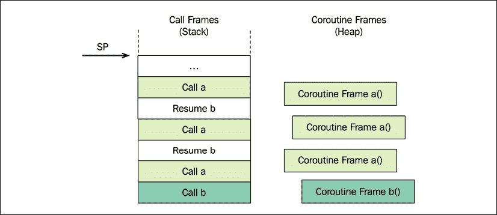
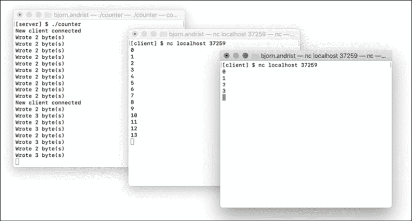

# Thirteen

# 用协同程序进行异步编程

在前一章中实现的生成器类帮助我们使用 coroutines 来构建延迟评估的序列。C++协同程序也可以用于异步编程，方法是让协同程序表示异步计算或**异步任务**。虽然异步编程是在 C++中拥有协同程序的最重要的驱动因素，但是在标准库中不支持基于协同程序的异步任务。如果你想使用协同程序进行异步编程，我建议你找到并使用一个补充 C++20 协同程序的库。我已经推荐了 CppCoro([https://github.com/lewissbaker/cppcoro](https://github.com/lewissbaker/cppcoro)，在撰写本文时，这似乎是最有希望的选择。还可以使用异步协同程序和完善的库 Boost。Asio，正如你将在本章后面看到的。

本章将展示使用协同程序进行异步编程是可能的，并且有一些库可以补充 C++20 协同程序。更具体地说，我们将重点关注:

*   `co_await`关键字和可选类型
*   基本任务类型的实现——可以从执行一些异步工作的协同程序中返回的类型
*   助推。Asio 用 coroutines 举例说明异步编程

在继续之前，还应该指出的是，本章中没有与性能相关的主题，提供的指南和最佳实践也很少。相反，这一章更多的是介绍 C++中异步协同程序的新特性。我们将从探索可感知的类型和`co_await`语句开始介绍。

# 重新审视可识别的类型

在上一章中，我们已经讨论了一点唤醒类型。但是现在我们需要更具体地了解一下`co_await`是做什么的，以及什么是可感知的类型。关键字`co_await`是一元运算符，意思是它接受单个参数。我们传递给`co_await`的论点需要满足一些我们将在本节探讨的要求。

当我们在代码中说`co_await`时，我们表示我们是*在等待*一些可能已经准备好，也可能还没有准备好的东西。如果还没有准备好，`co_await`暂停当前正在执行的协同程序，并将控制权返回给调用者。当异步任务完成时，它应该将控制转移回最初等待任务完成的协同程序。从这里开始，我通常将等待功能称为**延续**。

现在考虑以下表达式:

```cpp
co_await X{}; 
```

要编译这段代码，`X`需要是一个可调用的类型。到目前为止，我们只使用了微不足道的唤醒类型:`std::suspend_always`和`std::suspend_never`。任何直接实现下面列出的三个成员函数的类型，或者定义`operator co_wait()`来产生具有这些成员函数的对象的类型，都是一个可选择的类型:

*   `await_ready()`返回`bool`，表示结果是否准备好(`true`)或者是否需要暂停当前的协同并等待结果准备好。
*   `await_suspend(coroutine_handle)`–如果`await_ready()`返回`false`，这个函数将被调用，并带有执行`co_await`的程序的句柄。这个函数让我们有机会开始异步工作，并订阅一个通知，该通知将在任务完成时触发，然后恢复协同工作。
*   `await_resume()`是负责将结果(或错误)解包回协同程序的函数。如果在`await_suspend()`启动的工作过程中出现错误，该功能可能会重新抛出捕获的错误或返回错误代码。整个`co_await`表达式的结果就是无论`await_resume()`返回什么。

为了演示`operator co_await()`的使用，这里有一个片段，其灵感来自 C++20 标准中定义`operator co_await`时间间隔的部分:

```cpp
using namespace std::chrono;
template <class Rep, class Period> 
auto operator co_await(duration<Rep, Period> d) { 
  struct Awaitable {     
    system_clock::duration d_;
    Awaitable(system_clock::duration d) : d_(d) {} 
    bool await_ready() const { return d_.count() <= 0; }
    void await_suspend(std::coroutine_handle<> h) { /* ... */ } 
    void await_resume() {}
  }; 
  return Awaitable{d};
} 
```

有了这个过载，我们现在可以将一个时间间隔传递给`co_await`操作员，如下所示:

```cpp
std::cout << "just about to go to sleep...\n";
co_await 10ms;                   // Calls operator co_await()
std::cout << "resumed\n"; 
```

这个例子并不完整，但是给了你一个如何使用一元运算符`co_await`的提示。大家可能已经注意到了，三个`await_*()`函数不是我们直接调用的；相反，它们由编译器插入的代码调用。另一个例子将阐明编译器进行的转换。假设编译器在我们的代码中偶然发现了以下语句:

```cpp
auto result = co_await expr; 
```

然后，编译器会(非常)粗略地将代码转换为如下内容:

```cpp
// Pseudo code
auto&& a = expr;         // Evaluate expr, a is the awaitable
if (!a.await_ready()) {  // Not ready, wait for result
  a.await_suspend(h);    // Handle to current coroutine
                         // Suspend/resume happens here
}
auto result = a.await_resume(); 
```

首先调用`await_ready()`功能，检查是否需要暂停。如果是这样的话，`await_suspend()`会被调用一个将被暂停的验尸官的句柄(带有`co_await`语句的验尸官)。最后，请求唤醒的结果并将其分配给`result`变量。

## 隐式暂停点

正如在很多例子中看到的，一个协同程序通过使用`co_await`和`co_yield`来定义*显式的*暂停点。每个花冠也有两个*隐含*暂停点:

*   **初始暂停点**，出现在执行协同体之前协同体的初始调用
*   **最终暂停点**，出现在验尸官尸体被执行之后，在验尸官被销毁之前

承诺类型通过实现`initial_suspend()`和`final_suspend()`来定义这两点的行为。这两个函数都返回可调用的对象。通常，我们从`initial_suspend()`函数中传递`std::suspend_always`，这样花冠就懒洋洋地而不是急切地开始了。

最终暂停点对异步任务起着重要作用，因为它使我们可以调整`co_await`的行为。正常情况下，已经`co_await:`执行的协同程序应该在最终暂停点恢复等待的协同程序。

接下来，让我们更好地理解这三个可调用的函数是如何使用的，以及它们是如何与`co_await`操作符协作的。

# 实现基本的任务类型

我们将要实现的任务类型是一种可以从代表异步任务的协同程序中返回的类型。任务是呼叫者可以使用`co_await`等待的东西。目标是能够编写如下所示的异步应用程序代码:

```cpp
auto image = co_await load("image.jpg");
auto thumbnail = co_await resize(image, 100, 100);
co_await save(thumbnail, "thumbnail.jpg"); 
```

标准库已经提供了一种类型，允许函数返回一个对象，调用方可以使用该对象等待计算结果，即`std::future`。我们有可能将`std::future`包装成符合可感知界面的东西。然而，`std::future`不支持延续，这意味着每当我们试图从`std::future`获取值时，我们会阻塞当前线程。换句话说，当使用`std::future`时，没有办法在不阻塞的情况下合成异步操作。

另一种选择是使用`std::experimental::future`或 Boost 库中支持延续的未来类型。但是这些未来的类型分配堆内存，并包含同步原语，这些原语在为我们的任务设置的用例中是不需要的。相反，我们将创建一个开销最小的新类型，其职责是:

*   将返回值和异常转发给调用方
*   让来电者继续等待结果

提出了一个协同任务类型(见[处的 p 1056 r0 http://www 7 . open-STD . org/JTC 1/SC22/WG21/docs/papers/2018/p 1056 r0 . html](http://www7.open-std.org/JTC1/SC22/WG21/docs/papers/2018/p1056r0.html))，这个提议给了我们一个很好的提示我们需要什么组件。接下来的实现是基于戈尔·尼沙诺夫的工作和刘易斯·贝克共享的源代码，该源代码可以在 CppCoro 库中找到。

下面是用于表示异步任务的类模板的实现:

```cpp
template <typename T>
class [[nodiscard]] Task {
  struct Promise { /* ... */ };          // See below
  std::coroutine_handle<Promise> h_;
  explicit Task(Promise & p) noexcept
      : h_{std::coroutine_handle<Promise>::from_promise(p)} {}
 public:
  using promise_type = Promise;
  Task(Task&& t) noexcept : h_{std::exchange(t.h_, {})} {}
  ~Task() { if (h_) h_.destroy(); }
  // Awaitable interface
  bool await_ready() { return false; }
  auto await_suspend(std::coroutine_handle<> c) {
    h_.promise().continuation_ = c;
    return h_;
  }
  auto await_resume() -> T {
    auto& result = h_.promise().result_;
    if (result.index() == 1) {
      return std::get<1>(std::move(result));
    } else {
      std::rethrow_exception(std::get<2>(std::move(result)));
    }
  }
}; 
```

每个部分的解释将在随后的部分中进行，但是首先我们需要使用`std::variant`保存值或错误的 promise 类型的实现。承诺还使用`continuation_`数据成员引用等待任务完成的协同程序:

```cpp
struct Promise {
  std::variant<std::monostate, T, std::exception_ptr> result_;
  std::coroutine_handle<> continuation_;  // A waiting coroutine
  auto get_return_object() noexcept { return Task{*this}; }
  void return_value(T value) { 
    result_.template emplace<1>(std::move(value)); 
  }
  void unhandled_exception() noexcept {
    result_.template emplace<2>(std::current_exception());
  }
  auto initial_suspend() { return std::suspend_always{}; }
  auto final_suspend() noexcept {
    struct Awaitable {
      bool await_ready() noexcept { return false; }
      auto await_suspend(std::coroutine_handle<Promise> h) noexcept {
        return h.promise().continuation_;
      }
      void await_resume() noexcept {}
    };
    return Awaitable{};
  }
}; 
```

区分我们正在使用的两个协同手柄很重要:标识*当前协同*的手柄和标识*延续*的手柄。

请注意，由于`std::variant`的限制，以及`return_value()`和`return_void()`不能同时在同一个承诺类型上的限制，该实现不支持`Task<void>`。不支持`Task<void>`是不幸的，因为不是所有的异步任务都必须返回值。我们将通过为`Task<void>`提供模板专门化来克服这个限制。

由于我们在前一章中实现了一些协同返回类型(`Resumable`和`Generator`)，您已经熟悉了可以从协同返回的类型的要求。在这里，我们将关注对您来说是新的东西，例如异常处理和恢复当前等待我们的呼叫者的能力。让我们开始看看`Task`和`Promise`如何处理返回值和异常。

## 处理返回值和异常

异步任务可以通过返回(一个值或`void`)或抛出异常来完成。值和错误需要交给调用者，调用者一直在等待任务完成。像往常一样，这是承诺对象的责任。

`Promise`类使用一个`std::variant`来存储三种可能结果的结果:

*   一点价值都没有(第`std::monostate`)。在我们的变体中，我们使用这个来使它成为默认可构造的，但是不要求其他两种类型是默认可构造的。
*   类型为`T`的返回值，其中`T`是`Task`的模板参数。
*   一个`std::exception_ptr`，它是一个对之前抛出的异常的句柄。

使用功能`Promise::unhandled_exception()`中的`std::current_exception()`功能捕获异常。通过存储一个`std::exception_ptr`，我们可以稍后在另一个上下文中重新抛出这个异常。这也是在线程之间传递异常时使用的机制。

使用`co_return value;`的协同程序必须有实现`return_value()`的承诺类型。但是，使用`co_return;`或在不返回值的情况下从主体中运行的协同程序必须具有实现`return_void()`的承诺类型。实现同时包含`return_void()`和`return_value()`的承诺类型会产生编译错误。

## 继续等待验尸官

当异步任务完成后，它应该将控制权转移回协同程序，等待任务完成。为了能够恢复这个延续，`Task`对象需要`coroutine_handle`到延续的关联。这个句柄被传递给了`Task`对象的`await_suspend()`函数，方便的是，我们确保将这个句柄保存到承诺对象中:

```cpp
class Task {
  // ...
  auto await_suspend(std::coroutine_handle<> c) {
    h_.promise().continuation_ = c;      // Save handle
    return h_;
  }
  // ... 
```

`final_suspend()`功能负责在该协同的最终暂停点暂停，并将执行转移到等待协同。这是为方便大家转载的`Promise`的相关部分:

```cpp
auto Promise::final_suspend() noexcept {
  struct Awaitable {
    bool await_ready() noexcept { return false; } // Suspend
    auto await_suspend(std::coroutine_handle<Promise> h) noexcept{
      return h.promise().continuation_;  // Transfer control to
    }                                    // the waiting coroutine
    void await_resume() noexcept {}
  };
  return Awaitable{};
} 
```

首先，从`await_ready()`返回`false`将会在最后的暂停点使花冠暂停。我们这样做的原因是为了让承诺仍然存在，并且可以让延续者有机会从这个承诺中得出结果。

接下来我们来看看`await_suspend()`功能。这是我们想要恢复延续的地方。我们可以直接在`continuation_`手柄上调用`resume()`并等待它完成，如下所示:

```cpp
// ...
auto await_suspend(std::coroutine_handle<Promise> h) noexcept {
  h.promise().resume();         // Not recommended
}
// ... 
```

然而，这将冒在堆栈上创建一长串嵌套调用帧的风险，最终可能导致堆栈溢出。让我们用一个简短的例子来看看这是如何发生的，这个例子使用了两个协程:`a()`和`b()`:

```cpp
auto a() -> Task<int> {  co_return 42; } 
auto b() -> Task<int> {         // The continuation
  auto sum = 0;
  for (auto i = 0; i < 1'000'000; ++i) {
    sum += co_await a();
  }
  co_return sum;
} 
```

如果与协同`a()`关联的`Promise`对象直接将手柄上的`resume()`调用到协同`b()`，则在`a()`的调用帧顶部的堆栈上将创建一个新的调用帧来恢复`b()`。这个过程将在循环中一遍又一遍地重复，为每次迭代在堆栈上创建新的嵌套调用框架。当两个函数相互调用时，这种调用序列是一种递归形式，有时称为相互递归:

<figure class="mediaobject"></figure>

图 13.1: Coroutine b()调用 coroutine a()，后者恢复 b()，后者调用 a()，后者恢复 b()，以此类推

即使只为`b()`创建了一个协同帧，对`resume()` 的每次调用都会恢复协同`b()`在堆栈上创建一个新帧。避免这个问题的解决方案是称为**对称转移**。任务对象不是直接从即将完成的协同程序中恢复延续，而是从`await_suspend()`返回识别延续的`coroutine_handle`:

```cpp
// ...
auto await_suspend(std::coroutine_handle<Promise> h) noexcept {
  return h.promise().continuation_;     // Symmetric transfer
}
// ... 
```

然后编译器保证会发生一个名为*尾调用优化*的优化。在我们的例子中，这意味着编译器将能够直接将控制转移到延续，而无需创建新的嵌套调用框架。

我们不会花更多的时间在对称转移和尾调用的细节上，但是这些主题的优秀和更深入的解释可以在刘易斯·贝克的文章 *C++ Coroutines:了解对称转移*中找到，可在[https://lewissbaker . github . io/2020/05/11/Understanding _ Symmetric _ Transfer](https://lewissbaker.github.io/2020/05/11/understanding_symmetric_transfer)上找到。

如前所述，我们的`Task`模板有不处理`void`类型模板参数的限制。现在是时候解决这个问题了。

## 支持无效任务

为了克服前面提到的无法处理不产生任何价值的任务的限制，我们需要一个模板专门化`Task<void>`。为了完整起见，此处对其进行了详细说明，但除了前面定义的通用`Task`模板之外，它并没有增加许多新的见解:

```cpp
template <>
class [[nodiscard]] Task<void> {

  struct Promise {
    std::exception_ptr e_;   // No std::variant, only exception
    std::coroutine_handle<> continuation_; 
    auto get_return_object() noexcept { return Task{*this}; }
    void return_void() {}   // Instead of return_value() 
    void unhandled_exception() noexcept { 
      e_ = std::current_exception(); 
    }
    auto initial_suspend() { return std::suspend_always{}; }
    auto final_suspend() noexcept {
      struct Awaitable {
        bool await_ready() noexcept { return false; }
        auto await_suspend(std::coroutine_handle<Promise> h) noexcept {
          return h.promise().continuation_;
        }
        void await_resume() noexcept {}
      };
      return Awaitable{};
    }
  };
  std::coroutine_handle<Promise> h_;
  explicit Task(Promise& p) noexcept 
      : h_{std::coroutine_handle<Promise>::from_promise(p)} {}
public:
  using promise_type = Promise;

  Task(Task&& t) noexcept : h_{std::exchange(t.h_, {})} {}
  ~Task() { if (h_) h_.destroy(); }
  // Awaitable interface
  bool await_ready() { return false; }
  auto await_suspend(std::coroutine_handle<> c) {
    h_.promise().continuation_ = c;
    return h_;
  }
  void await_resume() {
    if (h_.promise().e_)
      std::rethrow_exception(h_.promise().e_);
  }
}; 
```

该模板专门化中的 promise 类型只保留对潜在未处理异常的引用。而不是定义`return_value()`，承诺包含成员函数`return_void()`。

我们现在可以表示返回值或`void`的任务。但是在我们真正构建一个独立的程序来测试我们的`Task`类型之前，还有一些工作要做。

## 同步等待任务完成

`Task`类型的一个重要方面是，任何调用返回`Task`的协同程序的东西都必须在其上`co_await`，因此也是协同程序。这就产生了一系列的关联(延续)。例如，假设我们有一个像这样的推论:

```cpp
Task<void> async_func() {      // A coroutine
  co_await some_func();
} 
```

那么，就不可能用下面的方式来使用它:

```cpp
void f() {                          
  co_await async_func(); // Error: A coroutine can't return void
} 
```

一旦我们调用了一个返回`Task`的异步函数，我们需要对其进行`co_await`，否则什么都不会发生。这也是我们将`Task`声明为`nodiscard`的原因；这样如果忽略返回值就会产生编译警告；如下所示:

```cpp
void g() {        
  async_func();          // Warning: Does nothing
} 
```

协同程序的强制链接有一个有趣的效果，我们最终得到了程序的的`main()`函数，C++标准说这是不允许的协同程序。这需要以某种方式解决，建议的解决方案是提供至少一个同步等待异步链完成的函数。比如 CppCoro 库就包含了函数`sync_wait()`，它具有这种打破协同程序链的效果，使得一个普通的函数使用协同程序成为可能。

不幸的是，实现`sync_wait()`相当复杂，但为了至少能够编译和测试我们的`Task`类型，我将在这里提供一个基于标准 C++提案 P1171R0、[https://wg21.link/P1171R0](https://wg21.link/P1171R0)的简化版本。我们的目标是能够编写这样的测试程序:

```cpp
auto some_async_func() -> Task<int> { /* ... */ }
int main() { 
  auto result = sync_wait(some_async_func());
  return result;
} 
```

以测试和运行异步任务为目的，让我们继续`sync_wait()`的实现。

### 正在实现同步等待()

`sync_wait()`内部使用专门为我们设计的自定义任务类，称为`SyncWaitTask`。它的定义一会儿就要揭晓了，不过先来看看功能模板`sync_wait()`的定义:

```cpp
template<typename T>
using Result = decltype(std::declval<T&>().await_resume());
template <typename T>
Result<T> sync_wait(T&& task) {
  if constexpr (std::is_void_v<Result<T>>) {
    struct Empty {};
    auto coro = [&]() -> detail::SyncWaitTask<Empty> {
      co_await std::forward<T>(task);
      co_yield Empty{};
      assert(false);
    };
    coro().get();
  } else {
    auto coro = [&]() -> detail::SyncWaitTask<Result<T>> {
      co_yield co_await std::forward<T>(task);
      // This coroutine will be destroyed before it
      // has a chance to return.
      assert(false);
    };
    return coro().get();
  }
} 
```

首先，为了指定任务返回的类型，我们使用了`decltype`和`declval`的组合。相当繁琐的`using-e`表达式给出了`T::await_resume()`返回的类型，其中`T`是传递给`sync_wait()`的任务类型。

在`sync_wait()`内部，我们区分返回值的任务和返回`void`的任务。我们在这里进行了区分，以避免需要实现`SyncWaitTask`的模板专门化来处理`void`和非空类型。通过引入一个空的`struct`，这两种情况都得到类似的处理，这个空的【】可以作为模板参数提供给`SyncWaitTask`来处理`void`任务。

在返回一个实际的值的情况下，一个λ表达式被用来定义一个对结果进行`co_await`运算，然后最终得出它的值。需要注意的是，协同程序可能会从另一个线程上的`co_await`恢复，这需要我们在`SyncWaitTask`的实现中使用同步原语。

调用协同λ上的`get()`继续协同，直到它产生一个值。`SyncWaitTask`的实现保证了在`co_yield`声明之后，coroutine lambda 再也没有机会恢复。

我们在前一章中大量使用了`co_yield`，但没有提到它与`co_await`的关系；即以下`co_yield`的表述:

```cpp
 co_yield some_value; 
```

被编译器转换成:

```cpp
co_await promise.yield_value(some_value); 
```

其中`promise`是与当前执行的协同程序相关联的承诺对象。了解这一点有助于理解`sync_wait()`和`SyncWaitTask`类之间的控制流。

### 实现同步等待任务

现在我们准备检查`SyncWaitTask`，这是一个只打算作为`sync_wait()`助手的类型。为此，我们将其添加到名为`detail`的名称空间下，以明确该类是一个实现细节:

```cpp
namespace detail { // Implementation detail
template <typename T>
class SyncWaitTask {  // A helper class only used by sync_wait()
  struct Promise { /* ... */ }; // See below
  std::coroutine_handle<Promise> h_;
  explicit SyncWaitTask(Promise& p) noexcept
      : h_{std::coroutine_handle<Promise>::from_promise(p)} {}
 public:
  using promise_type = Promise;

  SyncWaitTask(SyncWaitTask&& t) noexcept 
      : h_{std::exchange(t.h_, {})} {}
  ~SyncWaitTask() { if (h_) h_.destroy();}
  // Called from sync_wait(). Will block and retrieve the
  // value or error from the task passed to sync_wait()
  T&& get() {
    auto& p = h_.promise();
    h_.resume();
    p.semaphore_.acquire();               // Block until signal
    if (p.error_)
      std::rethrow_exception(p.error_);
    return static_cast<T&&>(*p.value_);
  }
  // No awaitable interface, this class will not be co_await:ed
};
} // namespace detail 
```

最有趣的部分需要注意的是函数`get()`及其对由 promise 对象拥有的信号量`acquire()`的阻塞调用。这就是这个任务类型同步等待结果为我们准备好的原因。拥有二进制信号量的承诺类型如下所示:

```cpp
struct Promise {
  T* value_{nullptr};
  std::exception_ptr error_;
  std::binary_semaphore semaphore_;
  SyncWaitTask get_return_object() noexcept { 
    return SyncWaitTask{*this}; 
  }
  void unhandled_exception() noexcept { 
    error_ = std::current_exception(); 
  }
  auto yield_value(T&& x) noexcept {     // Result has arrived
    value_ = std::addressof(x);
    return final_suspend();
  }
  auto initial_suspend() noexcept { 
    return std::suspend_always{}; 
  }
  auto final_suspend() noexcept { 
  struct Awaitable {
      bool await_ready() noexcept { return false; }
      void await_suspend(std::coroutine_handle<Promise> h) noexcept {
        h.promise().semaphore_.release();          // Signal! 
      }
      void await_resume() noexcept {}
    };
    return Awaitable{};
  }
  void return_void() noexcept { assert(false); }
}; 
```

这里有很多我们已经讨论过的样板代码。但是要特别注意`yield_value()`和`final_suspend()`，这是这节课有趣的部分。回想一下`sync_wait()`中的 coroutine lambda 产生了如下的返回值:

```cpp
// ...
auto coro = [&]() -> detail::SyncWaitTask<Result<T>> {
  co_yield co_await std::forward<T>(task);  
  // ... 
```

所以，一旦价值产生，我们就在承诺对象的`yield_value()`结束。而事实上`yield_value()`可以返回一个可选择的类型，这给了我们定制`co_yield`关键词行为的机会。在这种情况下，`yield_value()`返回一个唤醒信号，该信号将通过二进制信号量表明来自原始`Task`对象的值已经产生。

信号量在`await_suspend()`内部发出信号。我们不能在此之前发出信号，因为等待信号的代码的另一端最终会破坏协同程序。只有当验尸官处于暂停状态时，销毁验尸官才会发生。

对`semaphore_`的阻塞调用。`acquire()`将从`SyncWaitTask::get()`内部返回信号，最后计算出的值将被传递给调用`sync_wait()`的客户端。

## 使用 sync_wait()测试异步任务

最后，一个使用`Task`和`sync_wait()`的小型异步测试程序可以这样构建:

```cpp
auto height() -> Task<int> { co_return 20; }     // Dummy coroutines
auto width() -> Task<int> { co_return 30; }
auto area() -> Task<int> { 
  co_return co_await height() * co_await width(); 
}

int main() {
  auto a = area();
  int value = sync_wait(a);
  std::cout << value;          // Outputs: 600
} 
```

我们已经实现了使用 C++协同程序的异步任务的绝对最低基础设施。然而，为了有效地将协同程序用于异步编程，还需要更多的基础设施。这与生成器(在前一章中介绍)有很大的不同，生成器只需要相当少量的基础工作，我们就可以真正从中受益。为了更接近真实世界，我们将在接下来的部分中探索一些使用 Boost.Asio 的例子。我们要做的第一件事是尝试将基于回调的 API 包装在与 C++ coroutines 兼容的 API 中。

# 包装基于回调的应用编程接口

基于回调的异步API 有很多。通常，异步函数采用调用者提供的回调函数。异步函数立即返回，然后当异步函数有一个计算值或等待某件事完成时，最终调用回调(完成处理程序)。

为了向您展示基于异步回调的应用编程接口是什么样子，我们将浏览一个名为 **Boost 的异步输入/输出的 Boost 库。Asio** 。关于 Boost 有很多需要学习的地方。这里不涉及的 Asio 我将只描述 Boost 代码的绝对最小值，而是关注与 C++协同程序直接相关的部分。

为了使代码适合本书的页面，这些示例假设每当我们使用 Boost 中的代码时，都已经定义了以下名称空间别名。Asio:

```cpp
namespace asio = boost::asio; 
```

下面是使用 Boost 的完整示例。Asio 用于延迟函数调用，但不阻塞当前线程。这个异步示例在一个线程中运行:

```cpp
#include <boost/asio.hpp>
#include <chrono>
#include <iostream>
using namespace std::chrono;
namespace asio = boost::asio;
int main() {
  auto ctx = asio::io_context{};
  auto timer = asio::system_timer{ctx};
  timer.expires_from_now(1000ms);
  timer.async_wait([](auto error) {       // Callback
    // Ignore errors..                          
    std::cout << "Hello from delayed callback\n"; 
  });
  std::cout << "Hello from main\n";
  ctx.run();
} 
```

编译和运行该程序将生成以下输出:

```cpp
Hello from main
Hello from delayed callback 
```

使用 Boost 时。Asio，我们总是需要创建一个`io_context`对象来运行一个事件处理循环。对`async_wait()`的调用是异步的；它立即返回到`main()`并在定时器到期时调用回调(lambda)。

计时器示例不使用协同程序，而是使用回调应用编程接口来提供异步性。助推。Asio 也与 C++20 coroutines 兼容，我将在后面演示。但是在我们探索可唤醒类型的道路上，我们将绕道而行，而是假设我们需要在 Boost.Asio 的基于回调的 API 之上提供一个返回可唤醒类型的基于 coroutine 的 API。这样，我们可以使用`co_await`表达式来调用和等待(但不阻塞当前线程)异步任务的完成。我们不希望使用回调，而是希望能够这样写:

```cpp
std::cout << "Hello! ";
co_await async_sleep(ctx, 100ms);
std::cout << "Delayed output\n"; 
```

让我们看看如何实现`async_sleep()`功能，以便与`co_await`一起使用。我们将遵循的模式是让`async_sleep()`返回一个可实现三个必需功能的可调用对象:`await_ready()`、`await_suspend()`和`await_resume()`。接下来将对代码进行解释:

```cpp
template <typename R, typename P>
auto async_sleep(asio::io_context& ctx,
                 std::chrono::duration<R, P> d) {
  struct Awaitable {
    asio::system_timer t_;
    std::chrono::duration<R, P> d_;
    boost::system::error_code ec_{};
    bool await_ready() { return d_.count() <= 0; }
    void await_suspend(std::coroutine_handle<> h) {
      t_.expires_from_now(d_);
      t_.async_wait([this, h](auto ec) mutable {
        this->ec_ = ec;
        h.resume();
      });
    } 
    void await_resume() {
      if (ec_) throw boost::system::system_error(ec_);
    }
  };
  return Awaitable{asio::system_timer{ctx}, d};
} 
```

我们再次创建了一个自定义的唤醒类型，它可以完成所有必要的工作:

*   `await_ready()`将返回`false`，除非计时器已经达到零。
*   `await_suspend()`启动异步操作，并传递一个回调，当定时器到期或产生错误时将调用该回调。回调保存错误代码(如果有)并恢复挂起的协同工作。
*   `await_resume()`没有要解包的结果，因为我们正在包装的异步函数`boost::asio::timer::async_wait()`除了一个可选的错误代码之外，不返回任何值。

在我们可以在独立程序中实际测试`async_sleep()`之前，我们需要一些方法来启动`io_context`运行循环并打破协同链，就像我们之前测试`Task`类型时所做的那样。在这里，我们将通过实现两个函数`run_task()`和`run_task_impl()`以及一个名为`Detached`的简单的 coroutine 返回类型来实现这一点，该返回类型忽略错误处理并且可以被调用者丢弃:

```cpp
// This code is here just to get our example up and running
struct Detached { 
  struct promise_type {
    auto get_return_object() { return Detached{}; }
    auto initial_suspend() { return std::suspend_never{}; }
    auto final_suspend() noexcept { return std::suspend_never{};}
    void unhandled_exception() { std::terminate(); } // Ignore
    void return_void() {}
  };
};
Detached run_task_impl(asio::io_context& ctx, Task<void>&& t) {
  auto wg = asio::executor_work_guard{ctx.get_executor()};
  co_await t;
}
void run_task(asio::io_context& ctx, Task<void>&& t) {
  run_task_impl(ctx, std::move(t));
  ctx.run();
} 
```

`Detached`类型立即启动协同程序，并运行与调用方分离的协同程序。`executor_work_guard`阻止`run()`呼叫返回，直到验尸官`run_task_impl()`完成。

通常应避免启动和分离操作。它类似于分离的线程或没有任何引用的分配内存。然而，这个例子的目的是演示我们可以使用什么样的可用类型，以及我们如何编写异步程序并单线程运行它们。

一切就绪；名为`async_sleep()`的包装器返回一个`Task`和一个函数`run_task()`，可以用来执行一个任务。是时候写一个小程序来测试我们实现的新代码了:

```cpp
auto test_sleep(asio::io_context& ctx) -> Task<void> {
  std::cout << "Hello!  ";
  co_await async_sleep(ctx, 100ms);
  std::cout << "Delayed output\n";
}
int main() {
  auto ctx = asio::io_context{};
  auto task = test_sleep(ctx);
  run_task(ctx, std::move(task));  
}; 
```

执行该程序将生成以下输出:

```cpp
Hello! Delayed output 
```

您已经看到了基于回调的应用编程接口如何被包装在`co_await`可以使用的函数中，从而允许我们在异步编程中使用协同程序而不是回调。该程序还提供了一个典型的例子，说明如何使用唤醒类型中的功能。然而，如前所述，事实证明，从 1.70 开始的最新版本的 Boost 已经提供了一个与 C++20 coroutines 兼容的接口。在下一节中，我们将在构建一个小型的 TCP 服务器时使用这个新的协同应用编程接口。

# 使用 Boost 的并发服务器。Asio

本节将演示如何编写具有多个执行线程但只使用一个操作系统线程的并发程序。我们即将实现一个可以处理多个客户端的初级并发单线程 TCP 服务器。C++标准库中没有联网功能，但幸运的是有 Boost。Asio 为我们提供了一个平台无关的接口来处理套接字通信。

而不是包装基于回调的 Boost。Asio API，我将演示如何使用`boost::asio::awaitable`类，目的是展示一个使用 coroutines 的异步应用程序编程的更现实的例子。类模板`boost::asio::awaitable`对应我们之前创建的`Task`模板；它被用作代表异步计算的协同程序的返回类型。

## 实现服务器

服务器很简单；一旦客户端连接，它就开始更新一个数字计数器，并在每次更新时写回该值。这次我们将按照代码从上到下，从`main()`功能开始:

```cpp
#include <boost/asio.hpp>
#include <boost/asio/awaitable.hpp>
#include <boost/asio/use_awaitable.hpp>
using namespace std::chrono;
namespace asio = boost::asio;
using boost::asio::ip::tcp;
int main() {
  auto server = [] {
    auto endpoint = tcp::endpoint{tcp::v4(), 37259};
    auto awaitable = listen(endpoint);
    return awaitable;
  };
  auto ctx = asio::io_context{};
  asio::co_spawn(ctx, server, asio::detached);
  ctx.run(); // Run event loop from main thread
} 
```

强制`io_context`运行事件处理循环。如果我们希望我们的服务器执行多个操作系统线程，也可以从多个线程调用`run()`。在我们的例子中，我们只使用一个线程，但是有多个并发流。功能`boost::asio::co_spawn()`启动一个分离的并发流程。服务器是使用 lambda 实现的；它定义了一个 TCP 端点(端口为 37259)，并开始侦听端点上的传入客户端连接。

验尸官`listen()`相当简单，看起来像这样:

```cpp
auto listen(tcp::endpoint endpoint) -> asio::awaitable<void> {
  auto ex = co_await asio::this_coro::executor;
  auto a = tcp::acceptor{ex, endpoint};
  while (true) {
    auto socket = co_await a.async_accept(asio::use_awaitable);
    auto session = [s = std::move(socket)]() mutable {
      auto awaitable = serve_client(std::move(s));
      return awaitable;
    };
    asio::co_spawn(ex, std::move(session), asio::detached);
  }
} 
```

执行器是负责实际执行我们的异步函数的对象。例如，执行器可以代表线程池或单个系统线程。我们很可能会在即将到来的 C++版本中看到某种形式的执行器，以使我们程序员能够更好地控制代码在何时何地执行(包括 GPU)。

接下来，程序运行一个无限循环，等待 TCP 客户端连接。第一个`co_await`表达式在新客户端成功连接到我们的服务器时返回一个套接字。然后，套接字对象被移动到协同程序`serve_client()`，该程序将为新连接的客户端提供服务，直到客户端断开连接。

服务器的主要应用逻辑发生在处理每个客户端的协同程序中。以下是它的外观:

```cpp
auto serve_client(tcp::socket socket) -> asio::awaitable<void> {
  std::cout << "New client connected\n";
  auto ex = co_await asio::this_coro::executor;
  auto timer = asio::system_timer{ex};
  auto counter = 0;
  while (true) {
    try {
      auto s = std::to_string(counter) + "\n";
      auto buf = asio::buffer(s.data(), s.size());
      auto n = co_await async_write(socket, buf, asio::use_awaitable);
      std::cout << "Wrote " << n << " byte(s)\n";
      ++counter;
      timer.expires_from_now(100ms);
      co_await timer.async_wait(asio::use_awaitable);
    } catch (...) {
      // Error or client disconnected
      break;
    }
  }
} 
```

在整个客户端会话期间，每个协同调用服务于一个唯一的客户端；它会一直运行，直到客户端与服务器断开连接。协同程序定期(每 100 毫秒)更新一个计数器，并使用`async_write()`将该值异步写回客户端。注意我们如何以线性方式编写函数`serve_client()`，尽管它调用了两个异步操作:`async_write()`和`async_wait()`。

## 运行并连接到服务器

一旦我们启动了这个服务器，我们就可以在端口 37259 上连接客户端。为了尝试这一点，我正在使用一个名为`nc` (netcat)的工具，它可以用于通过 TCP 和 UDP 进行通信。下面是一个短会话示例，其中客户端连接到运行在 localhost 上的服务器:

```cpp
[client] $ nc localhost 37259              
0
1
2
3 
```

我们可以启动多个客户端，它们都将由一个专用的`serve_client()`协同调用提供服务，并拥有自己的递增计数器变量副本，如下图所示:

<figure class="mediaobject"></figure>

图 13.2:一台运行着的服务器，有两个相连的客户端

创建同时服务多个会话的应用程序的另一种方法是为每个连接的新客户端创建一个线程。然而，线程的内存开销会将会话数量的限制设置得比使用 coroutines 的模型低得多。

这个例子中的协同程序都是在同一个线程上执行的，这样就不需要锁定共享资源了。假设我们有一个全局计数器，每个会话都会更新。如果我们使用多线程，对全局计数器的访问将需要某种同步(使用互斥或原子数据类型)。对于在同一个线程上执行的协同程序，这是不必要的。换句话说，在同一线程上执行的协同程序可以共享状态，而无需使用任何锁定原语。

## 我们在服务器方面取得的成就(以及我们没有取得的成就)

使用 Boost 的示例应用程序。Asio 演示了 coroutines 可以用于异步编程。我们可以使用`co_await`语句以线性方式编写代码，而不是用嵌套回调实现延续。然而，这个例子是最小的，并且避免了异步编程的一些真正重要的方面，例如:

*   异步读写操作。服务器只向其客户端写入数据，而忽略了同步读写操作的挑战。
*   取消异步任务和正常关机。服务器在无限循环中运行，完全忽略了干净关闭的挑战。
*   使用多个`co_await`语句时的错误处理和异常安全。

这些主题非常重要，但超出了本书的范围。我已经提到最好避免分离操作。使用`boost::asio::co_spawn()`创建分离的任务，如示例所示，应该非常小心。一个相当新的避免分离工作的编程范例叫做**结构化并发**。它的目标是通过将并发性封装到通用的可重用算法中，如`when_all()`和`stop_when()`，来解决异常安全和多个异步任务的取消。关键思想是绝不允许某个子任务超过其父任务的生命周期。这使得通过引用异步子操作安全、更好地传递局部变量成为可能。并发任务的严格嵌套生存期也使代码更容易推理。

另一个重要的方面是异步任务应该总是懒惰的(立即挂起)，以便在抛出任何异常之前可以附加延续。如果您希望能够以安全的方式取消任务，这也是一项要求。

在未来的几年里，很可能会有很多与这个重要主题相关的讲座、图书馆和文章。CppCon 2019 年的两次会谈探讨了这一主题:

*   *c++中异步的统一抽象*，埃里克·内布勒和 D. S .霍尔曼，[https://sched.co/SfrC](https://sched.co/SfrC)
*   *结构化并发:用协同程序和算法编写更安全的并发代码*，刘易斯·贝克，[https://sched.co/SfsU](https://sched.co/SfsU)

# 摘要

在本章中，您已经看到了如何使用 C++协同程序来编写异步任务。为了能够以`Task`类型和`sync_wait()`函数的形式实现基础设施，您需要完全理解可调用类型的概念，以及如何使用它们来定制 C++中协同程序的行为。

通过使用 Boost。Asio，我们可以构建一个真正最小但功能齐全的并发服务器应用程序，在一个线程上执行，同时处理多个客户端会话。

最后，我简要介绍了一种称为结构化并发的方法，并给出了一些关于这个主题的更多信息。

在下一章中，我们将继续探索并行算法，这是一种利用多核加速并发程序的方法。