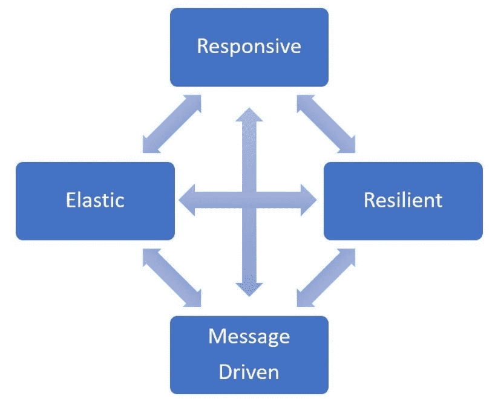
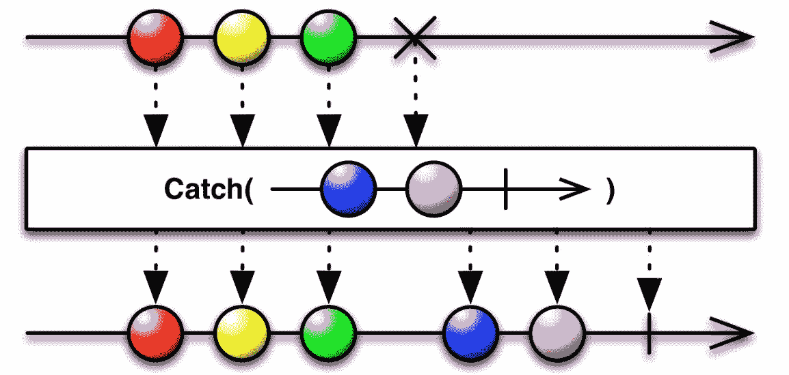
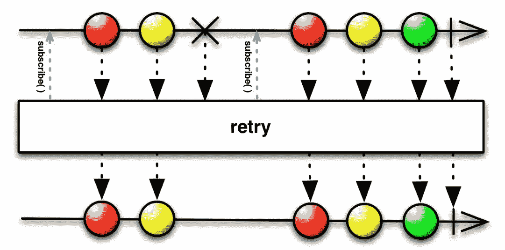

# 高级流和错误处理

在这本书里，我们在解释现代 C++ 技术和 RxCpp 库方面覆盖了相当多的内容。我们从使用 C++ 进行反应式编程的一组先决条件开始。前六章主要是关于先决条件和适应功能反应式编程，特别是 RxCpp 库中的特性。我们在松散的意义上使用了函数式反应式编程这个术语——我们正在利用函数式编程技术来编写反应式程序。一些纯粹主义者在这一点上与我们不同。他们不认为 Rx 系列库是功能反应式编程的完整实现。程序员必须经历的最大转变是心态的改变，以采用声明式编程范式。

传统上，我们设计复杂的数据结构，并在这些数据结构上编写算法，来编写我们的程序。这适用于操作空间中存在的数据的程序。当时间进入画面时，异步是自然的结果。在反应式编程中，我们将复杂的数据结构简化为数据流，并将操作符放在数据流中，然后根据通知得到执行某些操作的通知。我们已经看到了在使用 C++ 编程语言的图形用户界面程序、网络程序和控制台应用程序中，这是如何简化编程的。

在我们的例子中，我们省略了反应式程序中的异常处理(和错误处理)逻辑。这是有目的的，以便集中关注核心反应要素及其相互作用。现在我们已经涵盖了所有的要点，接下来，我们将重点关注反应式程序中的异常处理。在进入错误和异常处理之前，我们将讨论反应系统的特性。

在本章中，我们将涵盖以下主题:

*   简单回顾一下反应系统的特征
*   `RxCpp`—错误处理操作员
*   调度和错误处理
*   基于事件的流处理—一些示例

# 简单回顾一下反应系统的特征

我们现在生活在一个需要增强可扩展性和快速响应的世界。反应式编程的概念是为了满足高可用性、可伸缩性和快速响应的需求而出现的。根据无功宣言([https://www.reactivemanifesto.org/](https://www.reactivemanifesto.org/))，无功系统为:

*   **响应性**:(系统)在时间范围内完成指定任务的能力。响应性也意味着问题被快速发现，并得到有效处理。关键是系统的一致行为。一致性帮助用户建立对系统的信心。
*   **弹性**:在行为变化的背景下，系统防御失败的能力就是弹性。它与响应性相关，因为一致性也保证了错误处理。弹性是通过隔离和遏制容易出错的组件并保护系统免受故障影响来实现的。
*   **弹性**:弹性是系统通过自动重新分配所需资源来适应工作负载变化的能力。反过来，在每个时间实例中，使用的资源尽可能与需求匹配。反应系统通过提供相关的实时性能测量来实现弹性。
*   **消息驱动**:反应式系统通过异步消息传递机制的通信能力，实现系统的隔离和松耦合。通过使用消息队列，不同模块和命令的相互依赖的处理在反应系统中成为可能。通过消息驱动架构的非阻塞通信允许接收者仅在活动时使用资源:



通过将这些原则应用于其结构的所有层面，反应系统变得可组合。

本章的重点将是反应系统的弹性，通过解释高级流和错误处理。

# RxCpp 错误和异常处理运算符

在现实场景中，没有一个系统是完美的。正如我们在上一节中讨论的，弹性是反应系统的品质之一。一个系统如何处理错误和异常决定了这个系统的未来。早期检测和对错误的无缝处理使系统具有一致性和响应性。与命令式编程方法相比，当系统检测到错误或抛出异常时，反应式编程模型帮助用户单独处理错误。

在本节中，我们将了解如何使用 RxCpp 库处理异常和错误。有多种 RxCpp 操作符可用于对 Observables 的`on_error`通知做出反应。例如，我们可以:

*   通过优雅地退出序列来处理错误
*   忽略错误并切换到备份可观察到的继续序列
*   忽略错误并发出默认值
*   忽略错误，并立即尝试重新启动失败的可观察
*   忽略该错误，并在一段时间后尝试重新启动失败的可观测值

异常处理是可能的，因为`observer<>`包含三种方法:

*   `on_next`
*   `on_completed`
*   `on_error`

`on_error`方法意味着当异常发生时，或者当它们被`observable<>`或组合链中的任何操作符抛出时，处理异常。迄今为止的例子忽略了系统的错误处理方面。观测器方法的原型如下:

*   `void observer::on_next(T);`
*   `void observer::on_error(std::exception_ptr);`
*   `void observer::on_completed();`

# 对错误执行操作

当错误发生时，我们需要以优雅的方式处理它。到目前为止，在本书讨论的 RxCpp 程序中，编写的程序只处理`subscribe`方法中的`on_next`和`on_completed`场景。`subscribe`函数还有一个方法，它也可以为`on_error`场景接受一个λ函数。让我们看一个简单的例子来理解如何使用`subscribe`函数中的错误处理程序:

```cpp
//------ OnError1 
#include "rxcpp/rx.hpp" 

int main() 
{ 
    //------ Creating Observable with an error appended 
    //------ A canned example to demonstrate error 
    auto values = rxcpp::observable<>::range(1, 3). 
                  concat(rxcpp::observable<>:: 
                  error<int>(std::runtime_error("Error from producer!"))); 

    values. 
        subscribe( 
         //--------------- on_next 
            [](int v) { printf("OnNext: %dn", v); }, 
            //---------------- on_error 
            [](std::exception_ptr ep) { 
                 printf("OnError: %sn", rxcpp::util::what(ep).c_str()); 
            }, 
            //---------------- on_completed 
            []() { printf("OnCompletedn"); }); 
} 
```

对于第二个 Lambda，传递到`subscribe`函数的函数调用出现错误时所需的操作。代码的输出如下所示:

```cpp
OnNext: 1 
OnNext: 2 
OnNext: 3 
OnError: Error from producer!
```

在前面的代码中，错误被附加到可观察的流中，以在订户端启动关于异常/错误处理的讨论。让我们看看异常是如何通过可观察流传播到订户级别的:

```cpp
//------- OnError2.cpp 
#include "rxcpp/rx.hpp" 

int main() { 
    //------- Create a subject instance  
    //------  and retrieve subscriber abd Observable handle  
    rxcpp::rxsub::subject<int> sub; 
    auto subscriber = sub.get_subscriber(); 
    auto observable = sub.get_observable(); 

    //--------------------------- Subscribe! 
    observable.subscribe( 
        [](int v) { printf("OnNext: %dn", v); }, 
        [](std::exception_ptr ep) { 
            printf("OnError: %sn", rxcpp::util::what(ep).c_str()); 
        }, 
        []() { printf("OnCompletedn"); } 
    );
```

前面的代码创建了一个`subject<T>`类的实例，我们在[第 8 章](08.html#49AH00-51c8384cc2cb48e691b461190723b468)、RxCpp -关键元素中讨论过。我们订阅了`subject<T>`的可观察部分。我们还检索订阅者句柄，将值或异常发送到流中:

```cpp
    for (int i = 1; i <= 10; ++ i) { 
        if (i > 5) { 
            try { 
                std::string().at(1); 
            } 
            catch (std::out_of_range& ex) { 
                //------------ Emit exception. 
                subscriber.on_error(std::make_exception_ptr(ex)); 
            } 
        } 
        subscriber.on_next(i * 10); 
    } 
    subscriber.on_completed(); 
} 
```

`on_next()`函数向订阅者发出新的值，该函数将被多次调用。一旦在流上调用了`on_completed()`或`on_error()`，就不会调用`on_next()`函数。`on_completed()`功能通知用户可观察已经完成发送**基于推送的通知**。如果可观测量已经调用了`on_error()`函数，它将不会调用该函数。最后，`on_error()`功能通知用户可观察到出现了错误情况，如果可观察到调用该功能，则此后不会调用`on_next()`或`on_completed()`。

# 出现错误时恢复

出现错误会中断标准反应流的顺序流。RxCpp 库还提供了在出现错误时调用操作的机制。但是，有时用户希望使用默认选项恢复序列；这就是`on_error_resume_next()`的作用:

```cpp
//------- OnError3.cpp 
#include "rxcpp/rx.hpp" 

int main() 
{ 
    //------- Create an Observable with appended error 
    auto values = rxcpp::observable<>::range(1, 3). 
        concat(rxcpp::observable<>:: 
        error<int>(std::runtime_error("Error from producer!    "))). 
        //------- Resuming with another Stream 
        on_error_resume_next([](std::exception_ptr ep) { 
            printf("Resuming after: %sn", rxcpp::util::what(ep).c_str()); 
            return rxcpp::observable<>::range(4,6); 
        }); 

    values. 
        subscribe( 
            [](int v) {printf("OnNext: %dn", v); }, 
            [](std::exception_ptr ep) { 
                printf("OnError: %sn", rxcpp::util::what(ep).c_str()); }, 
            []() {printf("OnCompletedn"); }); 
} 
```

如果流中有错误，可观察运算符`on_error_resume_next()`将被执行。在这段代码中，从作为参数给定的 Lambda 返回一个新流，用这个新流恢复序列。这样，通过继续有意义的序列，可以防止错误传播。上一个程序的输出如下所示:

```cpp
OnNext: 1 
OnNext: 2 
OnNext: 3 
Resuming after: Error from producer! 
OnNext: 4 
OnNext: 5 
OnNext: 6 
OnCompleted 
```

除了用另一个序列恢复之外，该序列还可以用默认的单个项目恢复。在上例中，将运算符`on_error_resume_next()`的调用替换为以下行:

```cpp
        //------- Resuming with a default single value 
        on_error_resume_next([](std::exception_ptr ep) { 
            printf("Resuming after: %sn", rxcpp::util::what(ep).c_str()); 
            return rxcpp::observable<>::just(-1); 
        });
```

替换代码后，输出将如下所示:

```cpp
OnNext: 1 
OnNext: 2 
OnNext: 3 
Resuming after: Error from source 
OnNext: -1 
OnCompleted 
```

让我们看看描绘`on_error_resume_next()`运算符的大理石图:



简而言之，`on_error_resume_next()`函数在遇到特定可观测值的错误时返回一个可观测值实例。该流切换到新的可观测值并继续执行。

`on_error_resume_next()`操作符在很多地方派上了用场，用户需要继续传播错误。例如，在流的创建和订阅之间，流可能会经历不同的转换和缩减。此外，如[第 9 章](09.html#4U9TC0-51c8384cc2cb48e691b461190723b468)、*使用 Qt/C++* 的反应式图形用户界面编程中所述，用户定义的操作符可以通过组合现有的 RxCpp 操作符来构建。在这种情况下，打算在聚合和转换的每个阶段使用`on_error_resume_next()`运算符来转换异常/错误，直到订阅阶段。类似于默认值或从该操作符发出的序列，错误本身可以被重新传输，以恢复错误的流程，直到`subscribe()`操作符的错误处理程序:

```cpp
auto processed_strm = Source_observable. 
map([](const string& s) { 
return do_string_operation(s); 
      }). 
// Translating exception from the source 
on_error_resume_next([](std::exception_ptr){ 
return rxcpp::sources::error<string>(runtime_error(rxcpp::util::what(ep).c_str())); 
      });
```

前面的代码片段解释了如何使用`on_error_resume_next()`运算符来翻译错误。

# 出现错误时重试

在许多情况下，正常的序列可能会被生产者端的临时故障打破。在这种情况下，值得选择等待，直到异常在生产者端被修复，以继续正常的执行流程。RxCpp 为用户提供了一个非常相似的选项，在出现错误时重试。重试选项最适合您预期序列会遇到可预测问题的情况。

重试操作符通过重新订阅源可观测值来响应源可观测值的`on_error`通知，而不是将该调用传递给它的观测值。这给了源另一个机会来完成它的序列而不出错。重试总是将`on_next`通知传递给它的观察者，即使是来自以错误结束的序列；这会导致重复排放。下面的大理石图将进一步解释这一点:



下面是一个使用`retry()`运算符的示例:

```cpp
//------- Retry1.cpp 
#include "rxcpp/rx.hpp" 

int main() 
{ 
    auto values = rxcpp::observable<>::range(1, 3). 
        concat(rxcpp::observable<>:: 
        error<int>(std::runtime_error("Error from producer!"))). 
        retry(). 
        take(5); 

    //----- Subscription 
    values. 
        subscribe( 
            [](int v) {printf("OnNext: %dn", v); }, 
            []() {printf("OnCompletedn"); }); 
} 
```

在本例中，由于使用`concat()`运算符将错误附加到流中，因此我们使用`take()`运算符来避免无限等待。由于在错误情况下对重试操作符的无限等待，订阅服务器可以省略订阅中使用的错误处理程序。

该代码的输出将是:

```cpp
OnNext: 1 
OnNext: 2 
OnNext: 3 
OnNext: 1 
OnNext: 2 
OnCompleted 
```

大多数情况下，对于错误情况，最好使用固定的重试次数。这可以通过`retry()`的另一个重载来实现，该重载接受重试次数:

```cpp
//------- Retry2.cpp 
#include "rxcpp/rx.hpp" 

int main() 
{ 
    auto source = rxcpp::observable<>::range(1, 3). 
        concat(rxcpp::observable<>:: 
        error<int>(std::runtime_error("Error from producer!"))). 
        retry(2); 

    source. 
        subscribe( 
            [](int v) {printf("OnNext: %dn", v); }, 
            [](std::exception_ptr ep) { 
                printf("OnError: %sn", rxcpp::util::what(ep).c_str()); }, 
            []() {printf("OnCompletedn"); }); 
}
```

代码的输出如下所示:

```cpp
OnNext: 1 
OnNext: 2 
OnNext: 3 
OnNext: 1 
OnNext: 2 
OnNext: 3 
OnError: Error from producer! 
```

# 使用 finally()运算符进行清理

到目前为止，在本章中，我们已经看到 RxCpp 中的源序列在抛出异常后可以优雅地终止。当我们使用外部资源时，或者当需要释放程序其他部分分配的一些资源时，`finally()`运算符非常有用。正如我们所知，已经有数百万行代码是为用 C++ 构建各种系统而编写的，当使用遗留的外部依赖关系时，我们很可能需要处理资源管理。这是`RxCpp`中`finally()`派上用场的地方:

```cpp
//------- Finally.cpp 
#include "rxcpp/rx.hpp" 

int main() 
{ 
    auto values = rxcpp::observable<>::range(1, 3). 
        concat(rxcpp::observable<>:: 
        error<int>(std::runtime_error("Error from producer!"))). 
        //----- Final action 
        finally([]() { printf("The final actionn"); 
    }); 

    values. 
        subscribe( 
            [](int v) {printf("OnNext: %dn", v); }, 
            [](std::exception_ptr ep) { 
                  printf("OnError: %sn", rxcpp::util::what(ep).c_str()); }, 
            []() {printf("OnCompletedn"); }); 
}
```

`finally()`操作符在新创建的可观察对象的末尾添加一个新动作。上一个程序的输出如下所示:

```cpp
OnNext: 1 
OnNext: 2 
OnNext: 3 
OnError: Error from producer! 
The final action 
```

可以看到，在前面的输出中，如果源产生错误，最终的操作仍然被调用。如果我们移除链接到源可观测值的错误，程序的输出将如下所示:

```cpp
OnNext: 1 
OnNext: 2 
OnNext: 3 
OnCompleted 
The final action 
```

# 调度程序和错误处理

我们已经在[第 8 章](08.html#49AH00-51c8384cc2cb48e691b461190723b468)、*RxCPP–关键要素*中介绍了调度的主题。RxCpp 中的调度程序将值排队，并使用提供的协调来传递排队的值。协调可以是当前执行线程、RxCpp 运行循环、`RxCpp`事件循环或新线程。调度器操作的执行可以通过使用 RxCpp 操作符来实现，例如`observe_on()`或`subscribe_on()`。这些操作符接受选择的协调作为参数。默认情况下，RxCpp 库是单线程的，因此它执行调度器操作。用户必须明确选择执行的线程:

```cpp
//----------OnError_ObserveOn1.cpp  
#include "rxcpp/rx.hpp" 
#include <iostream> 
#include <thread> 

int main() { 
    //---------------- Generate a range of values 
    //---------------- Apply Square function 
    auto values = rxcpp::observable<>::range(1, 4). 
        transform([](int v) { return v * v; }). 
        concat(rxcpp::observable<>:: 
        error<int>(std::runtime_error("Error from producer!"))); 

    //------------- Emit the current thread details 
    std::cout << "Main Thread id => " 
        << std::this_thread::get_id() 
        << std::endl; 
```

我们已经使用 range 运算符创建了一个可观察的流，并连接了一个错误，以演示基本的错误处理如何与`RxCpp`中的调度器一起工作:

```cpp
    //---------- observe_on another thread.... 
    //---------- make it blocking too 
    values.observe_on(rxcpp::synchronize_new_thread()).as_blocking(). 
        subscribe([](int v) { 
             std::cout << "Observable Thread id => " 
            << std::this_thread::get_id() 
            << " " << v << std::endl; }, 
            [](std::exception_ptr ep) { 
            printf("OnError: %sn", rxcpp::util::what(ep).c_str()); }, 
            []() { std::cout << "OnCompleted" << std::endl; }); 

    //------------------ Print the main thread details 
    std::cout << "Main Thread id => " 
        << std::this_thread::get_id() 
        << std::endl; 
} 
```

使用`observe_on()`操作符，可观察的流被订阅到一个新的线程中作为它的协调。类似于我们在本章中讨论的前面的例子，错误处理程序提供了`subscribe()`功能。代码的输出可能如下所示:

```cpp
Main Thread id => 5776 
Observable Thread id => 12184 1 
Observable Thread id => 12184 4 
Observable Thread id => 12184 9 
Observable Thread id => 12184 16 
OnError: Error from producer! 
Main Thread id => 5776 
```

现在，让我们看另一个例子，两个用户来自同一个来源。订阅者应该以两种不同的方式得到通知:

```cpp
//------- OnError_ObserveOn2.cpp 
#include "rxcpp/rx.hpp" 
#include <mutex> 

std::mutex printMutex; 

int main() { 

    rxcpp::rxsub::subject<int> sub; 
    auto subscriber = sub.get_subscriber(); 
    auto observable1 = sub.get_observable(); 
    auto observable2 = sub.get_observable(); 
```

创建`subject`实例，将数据添加到源流中；从主题实例中，创建了一个订阅者和两个可观察对象，在两个不同的线程中进行调度:

```cpp
    auto onNext = [](int v) { 
        std::lock_guard<std::mutex> lock(printMutex); 
        std::cout << "Observable Thread id => " 
            << std::this_thread::get_id() 
            << "t OnNext: " << v << std::endl; 
    }; 

    auto onError = [](std::exception_ptr ep) { 
        std::lock_guard<std::mutex> lock(printMutex); 
        std::cout << "Observable Thread id => " 
            << std::this_thread::get_id() 
            << "t OnError: " 
            << rxcpp::util::what(ep).c_str() << std::endl; 
    }; 
```

两个 Lambda 函数被声明为与`subscribe`方法一起使用，互斥同步应用于`std::ostream`操作符的使用，以获得有组织的输出。如果在写入流期间发生线程切换，在`std::ostream`周围放置互斥体将避免交错输出:

```cpp
    //------------- Schedule it in another thread 
    observable1\. 
        observe_on(rxcpp::synchronize_new_thread()). 
        subscribe(onNext, onError, 
            []() {printf("OnCompletedn"); }); 

    //------------- Schedule it in yet another thread 
    observable2\. 
        observe_on(rxcpp::synchronize_event_loop()). 
        subscribe(onNext, onError, 
            []() {printf("OnCompletedn"); });
```

从源流中检索两个可观察值，并安排它们从单独的线程中进行观察。对于`observable1`函数对象，通过在`observe_on()`操作符中将`rxcpp::synchronize_new_thread()`作为参数传递，单独的 C++ 线程被指定为协调器。对于第二个可观测值`observable2`，协调器是一个事件循环，通过将`rxcpp::observe_on_event_loop()`传递到`observe_on()`:

```cpp
    //------------- Adding new values into the source Stream 
    //------------- Adding error into Stream when exception occurs 
    for (int i = 1; i <= 10; ++ i) { 
        if (i > 5) { 
            try { 
                std::string().at(1); 
            } 
            catch (...) { 
                std::exception_ptr eptr = std::current_exception(); 
                subscriber.on_error(eptr); 
            } 
        } 
        subscriber.on_next(i * 10); 
    } 
    subscriber.on_completed(); 

    //----------- Wait for Two Seconds 
    rxcpp::observable<>::timer(std::chrono::milliseconds(2000)). 
        subscribe([&](long) {}); 
}     
```

最后，通过使用主题实例将值添加到可观察流中，并将异常显式传递到流中，以便一起理解调度器和错误处理程序的行为。该代码的输出如下:

```cpp
Observable Thread id => 2644    OnNext: 10 
Observable Thread id => 2304    OnNext: 10 
Observable Thread id => 2644    OnNext: 20 
Observable Thread id => 2304    OnNext: 20 
Observable Thread id => 2644    OnNext: 30 
Observable Thread id => 2304    OnNext: 30 
Observable Thread id => 2644    OnNext: 40 
Observable Thread id => 2304    OnNext: 40 
Observable Thread id => 2304    OnNext: 50 
Observable Thread id => 2304    OnError: invalid string position 
Observable Thread id => 2644    OnNext: 50 
Observable Thread id => 2644    OnError: invalid string position
```

这个例子演示了如何通过订阅一个公共源的两个独立的 Observables 来传播数据。源中产生的误差由相应的`subscribe`功能的两个可观测值接收和处理。现在，让我们看一个示例，演示如何使用`subscribe_on()`运算符在调度中进行错误处理:

```cpp
//---------- SubscribeOn.cpp 
#include "rxcpp/rx.hpp" 
#include <thread> 
#include <mutex> 

//------ A global mutex for output sync. 
std::mutex printMutex; 

int main() { 
    //-------- Creating Observable Streams 
    auto values1 = rxcpp::observable<>::range(1, 4). 
        transform([](int v) { return v * v; }); 

    auto values2 = rxcpp::observable<>::range(5, 9). 
                   transform([](int v) { return v * v; }). 
                   concat(rxcpp::observable<>: 
:error<int>(std::runtime_error("Error from source"))); 
```

使用`rxcpp::observable<>::range()`运算符创建两个整数上的随机可观察流，一个流与一个错误连接，以解释调度序列中的错误处理:

```cpp
    //-------- Schedule it in another thread 
    auto s1 = values1.subscribe_on(rxcpp::observe_on_event_loop()); 

    //-------- Schedule it in Yet another thread 
    auto s2 = values2.subscribe_on(rxcpp::synchronize_new_thread()); 
```

使用`subscribe_on()`操作符，可观察的流在不同的线程中排队。第一个流以事件循环作为其协调线程进行调度，第二个流在另一个 C++ 线程上进行调度:

```cpp
    auto onNext = [](int v) { 
        std::lock_guard<std::mutex> lock(printMutex); 
        std::cout << "Observable Thread id => " 
                  << std::this_thread::get_id() 
                  << "tOnNext: " << v << std::endl; 
    }; 

    auto onError = [](std::exception_ptr ep) { 
        std::lock_guard<std::mutex> lock(printMutex); 
        std::cout << "Observable Thread id => " 
                  << std::this_thread::get_id() 
                  << "tOnError: " 
                  << rxcpp::util::what(ep).c_str() << std::endl; 
    }; 
```

前面的 Lambda 函数被定义为参数，代替`subscribe`方法的`on_next`和`on_error`函数。这些 Lambda 函数受互斥保护，以同步对`std::ostream`运算符的调用:

```cpp
    //-------- Subscribing the merged sequence 
    s1.merge(s2).as_blocking().subscribe( 
        onNext, onError, 
        []() { std::cout << "OnCompleted" << std::endl; }); 

    //-------- Print the main thread details 
    std::cout << "Main Thread id => " 
        << std::this_thread::get_id() 
        << std::endl; 
} 
```

代码的输出如下所示:

```cpp
Observable Thread id => 12380   OnNext: 1 
Observable Thread id => 9076    OnNext: 25 
Observable Thread id => 12380   OnNext: 4 
Observable Thread id => 9076    OnNext: 36 
Observable Thread id => 12380   OnNext: 9 
Observable Thread id => 12380   OnNext: 16 
Observable Thread id => 9076    OnNext: 49 
Observable Thread id => 9076    OnNext: 64 
Observable Thread id => 9076    OnNext: 81 
Observable Thread id => 9076    OnError: Error from producer! 
Main Thread id => 10692
```

# 基于事件的流处理–一些示例

在我们结束本章之前，让我们讨论几个例子，使用 RxCpp 库使用基于事件的系统。在本节中，我们将讨论两个例子，以了解 RxCpp 库在满足现实场景方面的有效性。我们将讨论一个使用 RxCpp 库演示流中数据聚合和应用程序事件处理的例子。

# 基于流数据的聚合

在本节中，流项目是用户定义的类型，用于表示员工，代码旨在根据员工的角色和工资对输入流进行分组:

```cpp
#include "rxcpp/rx.hpp" 

namespace Rx { 
    using namespace rxcpp; 
    using namespace rxcpp::sources; 
    using namespace rxcpp::subjects; 
    using namespace rxcpp::util; 
} 

using namespace std; 

struct Employee { 
    string name; 
    string role; 
    int salary; 
}; 
```

代码中所需的库和名称空间都包括在内，并且声明了表示`Employee`的数据结构。`Employee`类型结构简单，有`name`、`role`、`salary`等数据项。我们将薪资字段视为一个整数:

```cpp
int main() 
{ 
    Rx::subject<Employee> employees; 

    // Group Salaries by Role 
    auto role_sal = employees.
```

```cpp
        get_observable(). 
        group_by( 
            [](Employee& e) { return e.role; }, 
            [](Employee& e) { return e.salary; }); 
```

在`main()`功能中，使用`Employee`类型创建一个主体，以创建一个**热可观察**。基于角色和薪资的分组是在主体的可观察项上执行的。RxCpp 运算符`group_by()`返回一个发出`grouped_observables`的可观测值，每个可观测值对应于来自源可观测值的唯一键/值对:

```cpp
    // Combine min max and average reductions based on salary. 
    auto result = role_sal. 
        map([](Rx::grouped_observable<string, int> group) { 
            return group. 
                count(). 
                combine_latest([=](int count, int min, int max, double average) { 
                return make_tuple(group.get_key(), count, min, max, average); 
        }, 
        group.min(), 
        group.max(), 
        group.map([](int salary) -> double { return salary; }).average()); 
    }). 
    merge(); 
```

这里，结果“可观察值”结合了基于角色的“可观察值”，而基于薪资的减少是通过附加每个角色的最低薪资、最高薪资和平均薪资来执行的。当所有参数都有值时，将调用`combine_latest()`内部的 Lambda。在这种情况下，当一个特定的组完成时，对应于该组的流内部的所有值都被简化为单元组。因此，每个角色只调用一次 Lambda，每次迭代都有最终值。这里，应用于`group`的映射返回类型为`observable<tuple<string, int, int, int, double>>`的可观测值，`merge()`运算符返回类型为`tuple<string, int, int, int, double>`的可观测值。应用合并是为了防止数据丢失，因为分组的可观察数据是热的，如果不立即订阅，数据将会丢失:

```cpp
    // Display the aggregated result 
    result. 
        subscribe(Rx::apply_to( 
        [](string role, int count, int min, int max, double avg) { 
          std::cout << role.c_str() << ":tCount = " << count <<  
           ", Salary Range = [" << min  
            << "-" << max << "], Average Salary = " << avg << endl; 
        })); 

    // Supplying input data 
    Rx::observable<>::from( 
        Employee{ "Jon", "Engineer", 60000 }, 
        Employee{ "Tyrion", "Manager", 120000 }, 
        Employee{ "Arya", "Engineer", 92000 }, 
        Employee{ "Sansa", "Manager", 150000 }, 
        Employee{ "Cersei", "Accountant", 76000 }, 
        Employee{ "Jaime", "Engineer", 52000 }). 
        subscribe(employees.get_subscriber()); 

    return 0; 
} 
```

然后订阅结果可观测量，以便显示输入数据的聚合结果。数据项从`employees`主题提供给订户，该主题是用`Employees`类型创建的。在前面的代码中，源可以是任何东西，例如通过网络或从另一个线程检索的数据。由于这里创建的可观测值是一个热门的可观测值，因此聚合是基于提供的最新数据执行的。

该代码的输出如下:

```cpp
Accountant:    Count = 1, Salary Range = [76000-76000], Average Salary = 76000 
Engineer:      Count = 3, Salary Range = [52000-92000], Average Salary = 68000 
Manager:       Count = 2, Salary Range = [120000-150000], Average Salary = 135000 
```

# 应用程序事件处理示例

下面的示例是一个命令行程序，用事件来表示用户界面应用程序的基本操作。我们将在这个程序中使用 RxCpp 来处理这些事件的流程。该应用程序是一个命令行程序，可以很容易地映射到图形用户界面程序。为了简洁起见，在代码清单中这样做了:

```cpp
//--------- UI_EventsApp.cpp 
#include <rxcpp/rx.hpp> 
#include <cassert> 
#include <cctype> 
#include <clocale> 

namespace Rx { 
    using namespace rxcpp; 
    using namespace rxcpp::sources; 
    using namespace rxcpp::operators; 
    using namespace rxcpp::util; 
    using namespace rxcpp::subjects; 
} 

using namespace Rx; 
using namespace std::chrono; 

// Application events 
enum class AppEvent { 
    Active, 
    Inactive, 
    Data, 
    Close, 
    Finish, 
    Other 
}; 
```

我们将在程序中使用的库和名称空间包含(声明)在这里。此外，还声明了一个枚举`AppEvent`，以表示可以从通用系统发出的一些基本事件状态:

```cpp
int main() 
{ 
    //------------------- 
    // A or a - Active 
    // I or i - Inactive 
    // D or d - Data 
    // C or c - Close 
    // F or f - Finish 
    // default - Other 
    auto events = Rx::observable<>::create<AppEvent>( 
        [](Rx::subscriber<AppEvent> dest) { 
        std::cout << "Enter Application Events:n"; 
        for (;;) { 
            int key = std::cin.get(); 
            AppEvent current_event = AppEvent::Other; 

            switch (std::tolower(key)) { 
            case 'a': current_event = AppEvent::Active; break; 
            case 'i': current_event = AppEvent::Inactive; break; 
            case 'd': current_event = AppEvent::Data; break; 
            case 'c': current_event = AppEvent::Close; break; 
            case 'f': current_event = AppEvent::Finish; break; 
            default:  current_event = AppEvent::Other; 
            } 

            if (current_event == AppEvent::Finish) { 
                dest.on_completed(); 
                break; 
            } 
            else { 
                dest.on_next(current_event); 
            } 
        } 
    }). 
    on_error_resume_next([](std::exception_ptr ep) { 
        return rxcpp::observable<>::just(AppEvent::Finish); 
    }). 
    publish(); 
```

在前面的代码中，我们通过将一些键盘条目映射到定义的事件类型，创建了一个`AppEvent`类型的可观察流。`create`函数的λ内部的无限循环表示图形用户界面应用程序中的`event_loop/message_loop`。为了使冷的可观测值声明为热的，并获得独立于后续订阅的到源的连接，使用`publish()`操作符。它还有助于将流中的最新值发送给新订户:

```cpp
    // Event fires when application is active 
    auto appActive = events. 
        filter([](AppEvent const& event) { 
        return event == AppEvent::Active; 
    }); 

    // Event fires when application is inactive 
    auto appInactive = events. 
        filter([](AppEvent const& event) { 
        return event == AppEvent::Inactive; 
    }); 

    // Event fires when data Stream starts 
    auto appData = events. 
        filter([](AppEvent const& event) { 
        return event == AppEvent::Data; 
    }); 

    // Event fires when application is closed 
    auto appClose = events. 
        filter([](AppEvent const& event) { 
        return event == AppEvent::Close; 
    });
```

定义了一些过滤的可观察值，以处理反应系统的用例。每当流中出现`AppEvent::Active`事件时，`appActive`可观察值就会过滤掉。同样地，`appInactive`代表`AppEvent::Inactive`，`appData`代表`AppEvent::Data`，而`appClose`代表`AppEvent::Close`事件:

```cpp
    auto dataFromApp = appActive. 
        map([=](AppEvent const& event) { 
        std::cout << "**Application Active**n" << std::flush; 
        return appData. // Return all the data events 
            take_until(appInactive). // Stop when the application goes inactive 
            finally([]() { 
            std::cout << "**Application Inactive**n"; 
        }); 
    }). 
        switch_on_next(). // only listen to most recent data 
        take_until(appClose). // stop everything when Finish/Close event recieved 
        finally([]() { 
        std::cout << "**Application Close/Finish**n"; 
    }); 

    dataFromApp. 
        subscribe([](AppEvent const& event) { 
        std::cout << "**Application Data**n" << std::flush; 
    }); 

    events.connect(); 

    return 0; 
} 
```

只有在接收到`AppEvent::Active`事件时，程序才会开始接受来自可观察事件的数据流。然后，应用程序将接受数据，直到收到`AppEvent::Inactive`。只有在发出下一个`AppEvent::Active`时，事件流才会恢复。当发出`AppEvent::Close`或`AppEvent::Finish`时，应用程序将优雅地退出，类似于图形用户界面应用程序中的**关闭**或**应用**事件/消息。

# 摘要

在本章中，我们讨论了`RxCpp`中的错误处理，以及一些在 RxCpp 库中处理流的高级构造和操作符。当我们讨论错误处理机制时，我们参观了反应系统的基本原理，并且更加强调了反应系统的关键支柱之一，弹性。我们讨论了诸如错误处理程序(`on_error`)等需要与订阅一起使用的特性。此外，我们还讨论了 RxCpp 操作符，如`on_error_resume_next()`、`retry()`和`finally()`，以讨论当错误出现时如何继续流，如何等待流的生产者纠正错误并继续序列，以及如何执行适用于成功和错误路径的常见操作。最后，我们讨论了两个示例程序，以进一步了解流处理。这些程序演示了如何使用 RxCpp 库来处理 UX 事件流(使用控制台程序模拟)和聚合数据流。

在下一章中，我们将研究如何为 RxCpp 可观测值编写自定义运算符。