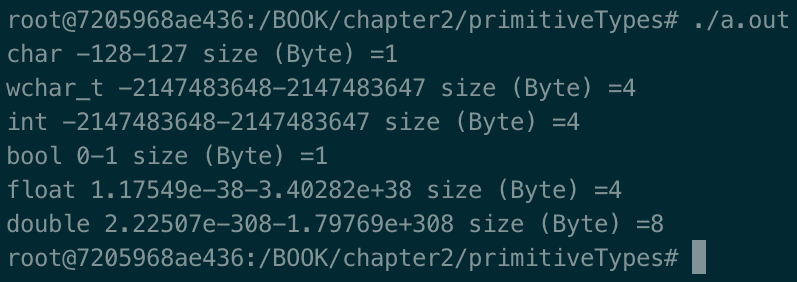
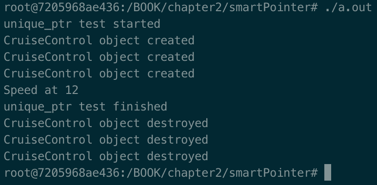
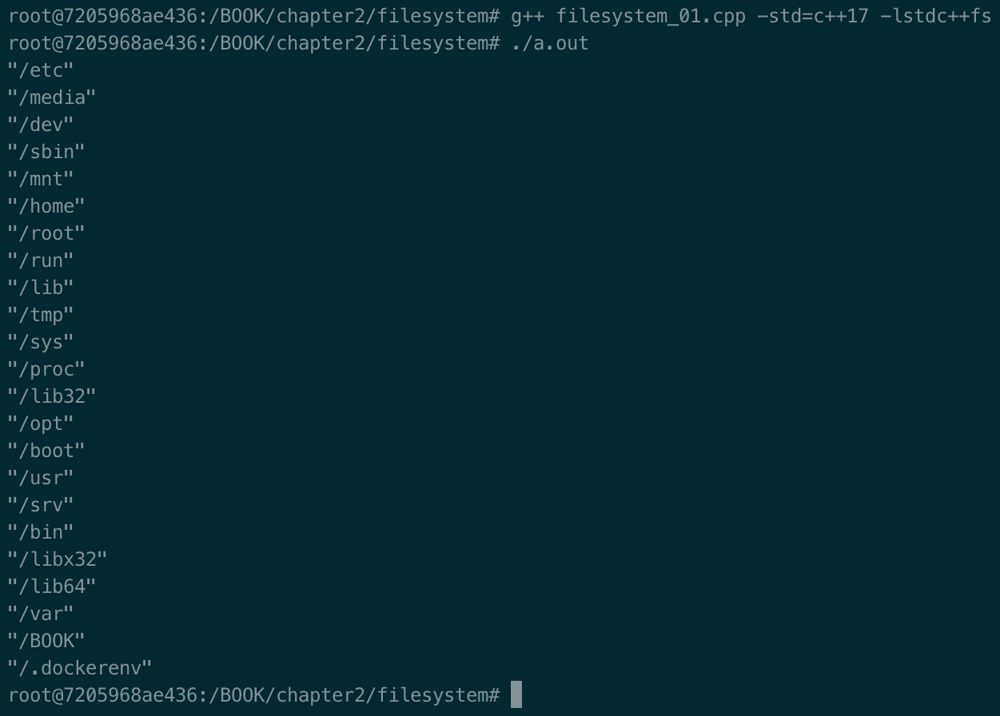

# 重温 C++

这一章是对 C++ 11-20 的复习，这将贯穿全书。我们将解释为什么 C++代表了一个伟大的机会，在编写比以往任何时候都简洁和更具可移植性的高质量代码时，不应该错过这个机会。

本章不包含所有由 C++ (11 到 20)引入的新特性——只是我们将在本书剩余部分使用的特性。具体来说，您将获得一个复习(如果您已经知道)或学习(如果您是新的)编写现代代码所需的最基本的新 C++技能。仅举几个例子，您将实际操作 lambda 表达式、原子和移动语义。

本章将涵盖以下食谱:

*   理解 C++基元类型
*   λ表达式
*   自动类型扣除和`decltype`
*   学习原子是如何工作的
*   了解`nullptr`如何工作
*   智能指针–`unique_ptr`和`shared_ptr`
*   学习语义是如何工作的
*   理解并发性
*   理解文件系统
*   C++核心指南
*   将 GSL 添加到您的制作文件中
*   理解概念
*   使用跨度
*   了解范围是如何工作的
*   学习模块如何工作

# 技术要求

为了让您立即试用本章中的程序，我们设置了一个 Docker 映像，其中包含了我们在本书中需要的所有工具和库。是基于 Ubuntu 19.04 的。

要进行设置，请执行以下步骤:

1.  从[www.docker.com](http://www.docker.com)下载并安装 Docker 引擎。
2.  从 Docker Hub 中拉出图像:`docker pull kasperondocker/system_programming_cookbook:latest`。
3.  图像现在应该可以使用了。输入以下命令查看图像:`docker images`。
4.  现在，你应该有如下图像:`kasperondocker/system_programming_cookbook`。
5.  借助以下命令，使用交互式外壳运行 Docker 映像:`docker run -it --cap-add sys_ptrace kasperondocker/system_programming_cookbook:latest /bin/bash`。
6.  运行容器上的外壳现已可用。使用`root@39a5a8934370/# cd /BOOK/`获取本书各章节开发的所有程序。

需要`--cap-add sys_ptrace`参数来允许 GDB 在 Docker 容器中设置断点，默认情况下，Docker 不允许这样做。

**Disclaimer**: The C++20 standard has been approved (that is, technically finalized) by WG21 in a meeting in Prague at the end of February. This means that the GCC compiler version that this book uses, 8.3.0, does not include (or has very, very limited support for) the new and cool C++20 features. For this reason, the Docker image does not include the C++20 recipe code. GCC keeps the development of the newest features in branches (you have to use appropriate flags for that, for example, `-std=c++2a`); therefore, you are encouraged to experiment with them by yourself. So, clone and explore the GCC contracts and module branches and have fun.

# 理解 C++基元类型

这个配方将显示由 C++标准定义的所有原始数据类型，以及它们的大小。

# 怎么做...

在这一节中，我们将进一步了解 C++标准定义了哪些原语，以及哪些其他信息是重要的。我们还将了解到，虽然标准没有为每一个定义大小，但它定义了另一个重要参数:

1.  首先，打开一个新的终端并输入以下程序:

```cpp
#include <iostream>
#include <limits>

int main ()
 {
    // integral types section
    std::cout << "char " << int(std::numeric_limits<char>::min())
              << "-" << int(std::numeric_limits<char>::max())
              << " size (Byte) =" << sizeof (char) << std::endl;
    std::cout << "wchar_t " << std::numeric_limits<wchar_t>::min()
              << "-" <<  std::numeric_limits<wchar_t>::max()
              << " size (Byte) ="
              << sizeof (wchar_t) << std::endl;
    std::cout << "int " << std::numeric_limits<int>::min() << "-"
              << std::numeric_limits<int>::max() << " size
                  (Byte) ="
              << sizeof (int) << std::endl;
    std::cout << "bool " << std::numeric_limits<bool>::min() << "-"
              << std::numeric_limits<bool>::max() << "
                  size (Byte) ="
              << sizeof (bool) << std::endl;

    // floating point types
    std::cout << "float " << std::numeric_limits<float>::min() <<    
                  "-"
              << std::numeric_limits<float>::max() << " size
                  (Byte) ="
              << sizeof (float) << std::endl;
    std::cout << "double " << std::numeric_limits<double>::min()
                  << "-"
              << std::numeric_limits<double>::max() << " size
                  (Byte) ="
              << sizeof (double) << std::endl;
    return 0;
 }
```

2.  接下来，构建(编译并链接)`g++ primitives.cpp`。
3.  这将产生一个名为`a.out`的可执行文件。

# 它是如何工作的...

前面程序的输出如下所示:



这表示类型可以表示的最小值和最大值，以及当前平台的字节大小。

C++标准**没有**定义每种类型的大小，但是定义了最小**宽度**T4:

*   `char`:最小宽度= 8
*   `short int`:最小宽度= 16
*   `int`:最小宽度= 16
*   `long int`:最小宽度= 32
*   `long int int`:最小宽度= 64

这一点有着巨大的含义，因为不同的平台可能有不同的大小，程序员应该处理这个问题。为了帮助我们获得一些关于数据类型的指导，有一个数据模型的概念。一个**数据模型**是由每个实现(编译器和操作系统遵循的架构的 psABI)做出的一组选择(每个类型一个特定的大小)来定义所有的原始数据类型。下表显示了现有的各种类型和数据模型的子集:

| **数据类型** | **LP32** | **ILP32** | **LLP64** | **LP64** |
| `char` | eight | eight | eight | eight |
| `short int` | Sixteen | Sixteen | Sixteen | Sixteen |
| `int` | Sixteen | Thirty-two | Thirty-two | Thirty-two |
| `long` | Thirty-two | Thirty-two | Thirty-two | Sixty-four |
| `pointer` | Thirty-two | Thirty-two | Sixty-four | Sixty-four |

Linux 内核对 64 位架构(x86_64)使用 LP64 数据模型。

我们简短地谈到了 psABI 主题(平台特定应用程序二进制接口(**ABI**)的缩写)。每个架构(例如 x86_64)都有一个操作系统遵循的 psABI 规范。 **GNU 编译器集合** ( **GCC** )必须知道这些细节，因为它必须知道它编译的原语类型的大小。`i386.h` GCC 头文件包含该架构的原始数据类型的大小:

```cpp
root@453eb8a8d60a:~# uname -a
 Linux 453eb8a8d60a 4.9.125-linuxkit #1 SMP Fri Sep 7 08:20:28 UTC 2018 x86_64 x86_64 x86_64 GNU/Linux
```

程序输出显示，当前的 OS(实际上是我们正在运行的 Ubuntu 映像)使用了预期的 LP64 数据模型，机器的架构是 x86_64。

# 还有更多...

正如我们所看到的，C++标准定义了以下基本数据类型:

*   整数:`int`
*   角色:`char`
*   布尔值： `bool`
*   浮点:`float`
*   双浮点:`double`
*   作废:`void`
*   宽字符:`wchar_t`
*   空指针:`nullptr_­t`

数据类型可以有其他信息，以便定义它们的类型:

*   修饰语:`signed`、`unsigned`、`long`和`short`
*   限定词:`const`和`restrict`
*   存储类型:`auto`、`static`、`extern`、`mutable`

显然，不是所有这些附加属性都可以应用于所有类型；例如，`unsigned`不能应用于`float`和`double`类型(它们各自的 IEEE 标准不允许这样做)。

# 请参见

特别是对于 Linux，Linux 内核文档通常是开始深入研究这个问题的好地方:[https://www.kernel.org/doc/html/latest](https://www.kernel.org/doc/html/latest/)。GCC 源代码显示了每个支持的体系结构的原始数据类型的大小。更多详情请参考以下链接:[https://github.com/gcc-mirror/gcc](https://github.com/gcc-mirror/gcc)。

# λ表达式

一个 **lambda 表达式**(或者 **lambda** **函数**)是一种定义匿名的、小的、一次性使用的函数的便捷方式，以便在需要的地方使用。Lambda 对于**标准模板库** ( **STL** )特别有用，我们会看到。

# 怎么做...

在本节中，我们将编写一些代码来熟悉 lambda 表达式。虽然机制很重要，但是要注意 lambda 的代码可读性，尤其是结合 STL。请遵循以下步骤:

1.  在这个程序中，lambda 函数获取一个整数并将其打印到标准输出。让我们打开一个名为`lambda_01.cpp`的文件，并在其中编写以下代码:

```cpp
#include <iostream>
#include <vector>
#include <algorithm>
int main ()
{
    std::vector<int> v {1, 2, 3, 4, 5, 6};
    for_each (begin(v), end(v), [](int x) {std::cout << x
        << std::endl;});
    return 0;
}
```

2.  在第二个程序中，lambda 函数通过引用捕获前缀，并将其添加到标准输出中的整数前面。让我们把下面的代码写在一个名为`lambda_02.cpp`的文件中:

```cpp
#include <iostream>
#include <vector>
#include <algorithm>
int main ()
{
    std::vector<int> v {1, 2, 3, 4, 5, 6};
    std::string prefix ("0");
    for_each (begin(v), end(v), [&prefix](int x) {std::cout
        << prefix << x << std::endl;});
    return 0;
}
```

3.  最后用`g++ lambda_02.cpp`编译。

# 它是如何工作的...

在第一个例子中，lambda 函数只是获取一个整数作为输入并打印出来。请注意，代码简洁易读。Lambda 可以通过引用`&`或通过值`=`捕获范围内的变量。

第二个程序的输出如下:


在第二个例子中，lambda **通过引用捕获变量前缀** ，使其对 lambda 可见。这里，我们通过引用捕获了`prefix`变量，但是我们可能捕获了以下任何一个:

*   所有变量通过引用`[&]`
*   所有变量按值`[=]`
*   指定*捕捉什么变量*和*如何捕捉它们*T0

在某些情况下，我们必须明确要返回的类型，如本例所示:

```cpp
[](int x) -> std::vector<int>{
             if (x%2)
                 return {1, 2};
             else
                 return {3, 4};
 });
```

名为**尾随返回类型**的`-> std::vector<int>`运算符告诉编译器，这个λ将返回一个整数向量。

# 还有更多...

λ可以分解为六个部分:

1.  捕获条款:`[]`
2.  参数表:`()`
3.  可变规格:`mutable`
4.  异常说明:`noexcept`
5.  尾随返回类型:`-> type`
6.  正文:`{}`

这里 *1* 、 *2* 、 *6* 为必选。

虽然可选，但是可变规范和异常规范值得一看，因为它们在某些情况下可能很方便。可变规范允许通过 lambda 的主体修改副值参数。参数列表中的一个变量通常由*按值常量*捕获，因此可变规范只是消除了这个限制。第二种情况是异常规范，我们可以用它来指定 lambda 可能引发的异常。

# 请参见

斯科特·梅耶斯的《有效的现代 C++ 》( T1)和比雅尼·斯特劳斯特鲁普的《T2 的 c++编程语言》( T3)这两本书非常详细地涵盖了这些主题。

# 自动类型演绎和类型演绎

C++提供了两种从表达式中扣除类型的机制:`auto`和`decltype()`。`auto`用于从初始值设定项中推导出一个类型，而`decltype()`用于推导出更复杂情况下的类型。这个食谱将展示如何使用两者的例子。

# 怎么做...

避免显式指定将要使用的变量类型可能会很方便(实际上也是如此)，尤其是当变量特别长并且在本地使用时:

1.  让我们从一个典型的例子开始:

```cpp
std::map<int, std::string> payslips;
// ... 
for (std::map<int, 
     std::string>::const_iterator iter = payslips.begin(); 
     iter !=payslips.end(); ++iter) 
{
 // ... 
}
```

2.  现在，我们用`auto`改写一下:

```cpp
std::map<int, std::string> payslips;
// ... 
for (auto iter = payslips.begin(); iter !=payslips.end(); ++iter) 
{
    // ... 
}
```

3.  让我们看另一个例子:

```cpp
auto speed = 123;         // speed is an int
auto height = calculate ();    // height will be of the
                         // type returned by calculate()
```

`decltype()`是 C++提供的另一种机制，当表达式比`auto`情况更复杂时，可以推导出表达式的类型。

4.  让我们用一个例子来看看这个:

```cpp
decltype(a) y = x + 1;  // deducing the type of a
decltype(str->x) y;     // deducing the type of str->x, where str is 
                        // a struct and x 
                        // an int element of that struct
```

这两个例子可以用`auto`代替`decltype()`吗？我们将在下一部分看一看。

# 它是如何工作的...

带有`auto`的第一个例子表明，在编译时，类型是从右边的参数推导出来的。`auto`用于简单情况。

`decltype()`推导表达式的类型。在本例中，它定义了`y`变量，因此它与`a`是同一类型。可以想象，这在`auto`上是不可能的。为什么呢？这很简单:`decltype()`告诉编译器*定义一个特定类型的变量*；在第一个例子中，`y`是一个与`a`类型相同的变量。用`auto`*自动推导类型。*

 *我们应该在任何时候使用`auto`和`decltype()`，而不必显式指定变量的类型；例如，当我们需要一个`double`型(而不是一个`float`)时。值得一提的是，`auto`和`decltype()`都是演绎编译器已经知道的表达式类型，所以**不是运行时机制**。

# 还有更多...

有一个具体的案例必须提及。当`auto`使用`{}`(统一初始值设定项)进行类型推演时，会引起一些头疼(或者至少是我们意想不到的行为)。让我们看一个例子:

```cpp
auto fuelLevel {0, 1, 2, 3, 4, 5};
```

在这种情况下，推导出的类型是`initializer_list<T>`，而不是我们所期望的整数数组。

# 请参见

斯科特·梅耶斯的《有效的现代 C++ 》( T1)和比雅尼·斯特劳斯特鲁普的《T2 的 c++编程语言》( T3)这两本书非常详细地涵盖了这些主题。

# 学习原子是如何工作的

传统上，C 和 C++在系统编程的可移植代码方面有着悠久的传统。C++11 标准中引入的`atomic`特性强化了这一点，它在本地添加了一个保证，即一个操作被其他线程视为原子操作。原子就是一个模板，比如`template <class T> struct atomic;`或者`template <class T> struct atomic<T*>;`。C++20 在`T`和`T*`中增加了`shared_ptr`和`weak_ptr`。对`atomic`变量执行的任何操作现在都受到保护，不受其他线程的影响。

# 怎么做...

`std::atomic`是现代 C++处理并发的一个重要方面。让我们写一些代码来掌握这个概念:

1.  第一段代码展示了`atomic`操作的基础。让我们现在写这个:

```cpp
std::atomic<int> speed (0);         // Other threads have access to the speed variable
auto currentSpeed = speed.load();   // default memory order: memory_order_seq_cst
```

2.  在第二个程序中，我们可以看到如果实现是无锁的或者已经使用锁实现了，那么`is_lock_free()`方法返回`true`。让我们编写这段代码:

```cpp
#include <iostream>
#include <utility>
#include <atomic>
struct MyArray { int z[50]; };
struct MyStr { int a, b; };
int main()
{
     std::atomic<MyArray> myArray;
     std::atomic<MyStr> myStr;
     std::cout << std::boolalpha
               << "std::atomic<myArray> is lock free? "
               << std::atomic_is_lock_free(&myArray) << std::endl
               << "std::atomic<myStr> is lock free? "
               << std::atomic_is_lock_free(&myStr) << std::endl;
}               
```

3.  让我们编译程序。这样做的时候，你可能需要用`g++ atomic.cpp -latomic`将`atomic`库添加到 g++(由于一个 GCC 错误)。

# 它是如何工作的...

`std::atomic<int> speed (0);`将`speed`变量定义为原子整数。虽然变量将是原子的，但是这个初始化**不是原子的**！相反，下面的代码:`speed +=10;`自动增加`10`的速度。这意味着不会有比赛条件。根据定义，当访问变量的线程中，至少有 1 个是写线程时，就会发生争用情况。

`std::cout << "current speed is: " << speed;`指令自动读取速度的当前值。注意从速度读取值是原子的，但接下来发生的不是原子的(即通过`cout`打印)。规则是读和写是原子的，但是周围的操作不是，正如我们所看到的。

第二个程序的输出如下:


原子的基本操作是加载、存储、交换和 **cas** (简称**比较和交换**)，它们在所有类型的原子上都可用。根据类型(例如，`fetch_add`)的不同，也有其他可用的选项。

不过，有一个问题仍然悬而未决。为什么`myArray`用锁而`myStr`是无锁的？原因很简单:C++为所有的基元类型提供了无锁实现，`MyStr`里面的变量都是基元类型。用户将设置`myStr.a`和`myStr.b`。`MyArray`另一方面，不是基本类型，所以底层实现会使用锁。

标准保证是，对于每个原子操作，每个线程都将取得进展。要记住的一个重要方面是编译器经常进行代码优化。atomics 的使用对编译器如何对代码进行重新排序施加了限制。限制的一个例子是，在写入`atomic`变量之前的任何代码都不能在原子写入之后移动*。*

# 还有更多...

在这个食谱中，我们使用了名为`memory_order_seq_cst`的默认记忆模型。其他一些可用的内存型号包括:

*   `memory_order_relaxed`:只保证当前操作原子性。也就是说，无法保证不同线程中的内存访问是如何相对于原子操作进行排序的。
*   `memory_order_consume`:一旦释放线程中所有对释放操作有依赖关系的内存访问都发生了，操作就被命令发生。
*   `memory_order_acquire`:一旦释放线程中对内存的所有访问都发生，操作就被命令发生。
*   `memory_order_release`:操作被命令发生在消耗或获取操作之前。
*   `memory_order_seq_cst`:操作顺序一致有序。

# 请参见

斯科特·梅耶斯的《有效的现代 C++ 》( T1)和比雅尼·斯特劳斯特鲁普的《T2 的 c++编程语言》( T3)这两本书非常详细地涵盖了这些主题。此外，赫伯·萨特在 YouTube 上免费提供的*原子武器*演讲([https://www.youtube.com/watch?v=A8eCGOqgvH4](https://www.youtube.com/watch?v=A8eCGOqgvH4))是一个很好的介绍。

# 了解 nullptr 的工作原理

在 C++11 之前，`NULL`标识符是用于指针的。在这个食谱中，我们将看到为什么这是一个问题，以及 C++11 如何解决它。

# 怎么做...

为了理解`nullptr`为什么重要，我们来看看`NULL`的问题:

1.  让我们编写以下代码:

```cpp
bool speedUp (int speed);
bool speedUp (char* speed);
int main()  
{
    bool ok = speedUp (NULL);
}
```

2.  现在，让我们使用`nullptr`重写前面的代码:

```cpp
bool speedUp (int speed);
bool speedUp (char* speed);
int main()  
{
    bool ok = speedUp (nullptr);
}
```

# 它是如何工作的...

第一个程序可能没有编译，或者(如果它编译了)调用了错误的方法。我们希望它改叫`bool speedUp (char* speed);`。`NULL`的问题恰恰是这样的:`NULL`被定义为`0`，这是一个整数类型，由**预处理器**使用(它将`NULL`的所有事件替换为`0`)。这是一个巨大的区别，因为`nullptr`现在属于 C++原语类型，由**编译器**管理。

对于第二个程序，调用`speedUp`(重载)方法，其中`char*`指针指向`nullptr`。这里没有歧义，我们称之为`char*`类型的版本。

# 还有更多...

`nullptr`代表*一个不指向任何物体的指针*:

```cpp
int* p = nullptr;
```

因此，不存在歧义，这意味着可读性提高了。另一个提高可读性的例子如下:

```cpp
if (x == nullptr) 
{
    // ...\
}
```

这使得代码更易读，并且清楚地表明我们正在比较指针。

# 请参见

斯科特·梅耶斯的《有效的现代 C++ 》( T1)和比雅尼·斯特劳斯特鲁普的《T2 的 c++编程语言》( T3)这两本书非常详细地涵盖了这些主题。

# 智能指针–唯一指针和共享指针

本食谱将展示`unique_ptr`和`shared_ptr`的基本用法。这些智能指针是不想手动处理内存释放的程序员的主要助手。一旦你学会了如何正确地使用它们，这将节省头痛和调试会话的夜晚。

# 怎么做...

在本节中，我们将了解两个智能指针`std::unique_ptr`和`std::shared_ptr`的基本用法:

1.  让我们通过开发以下类来开发一个`unique_ptr`示例:

```cpp
#include <iostream>
#include <memory>
class CruiseControl
{
public:
    CruiseControl()
    {
        std::cout << "CruiseControl object created" << std::endl;
    };
    ~CruiseControl()
    {
        std::cout << "CruiseControl object destroyed" << std::endl;
    }
    void increaseSpeedTo(int speed)
    {
        std::cout << "Speed at " << speed << std::endl;
    };
};
```

2.  现在，让我们通过调用前面的类来开发一个`main`类:

```cpp
int main ()
{
    std::cout << "unique_ptr test started" << std::endl;
    std::unique_ptr<CruiseControl> cruiseControl =
    std::make_unique<CruiseControl>();
    cruiseControl->increaseSpeedTo(12);
    std::cout << "unique_ptr test finished" << std::endl;
}
```

3.  我们来编译`g++ unique_ptr_01.cpp`。
4.  `unique_ptr`的另一个例子显示了它在数组中的行为。让我们重用同一个类(`CruiseControl`):

```cpp
int main ()
{
    std::cout << "unique_ptr test started" << std::endl;
    std::unique_ptr<CruiseControl[]> cruiseControl = 
        std::make_unique<CruiseControl[]>(3);
    cruiseControl[1].increaseSpeedTo(12); 
    std::cout << "unique_ptr test finished" << std::endl;
}
```

5.  让我们用一个小程序来看看`std::shared_ptr`的动作:

```cpp
#include <iostream>
 #include <memory>
class CruiseControl
{
public:
    CruiseControl()
    {
        std::cout << "CruiseControl object created" << std::endl;
    };
    ~CruiseControl()
    {
        std::cout << "CruiseControl object destroyed" << std::endl;
    }
    void increaseSpeedTo(int speed)
    {
        std::cout << "Speed at " << speed << std::endl;
    };
};
```

`main`看起来是这样的:

```cpp
int main ()
{
    std::cout << "shared_ptr test started" << std::endl;
    std::shared_ptr<CruiseControl> cruiseControlMaster(nullptr);
    {
        std::shared_ptr<CruiseControl> cruiseControlSlave = 
           std::make_shared<CruiseControl>();
        cruiseControlMaster = cruiseControlSlave;
    }
    std::cout << "shared_ptr test finished" << std::endl;
}
```

它是如何工作的...一节将详细介绍这三个程序。

# 它是如何工作的...

通过运行第一个`unique_ptr`程序，即`./a.out`，我们得到如下输出:


`unique_ptr`是一个体现独特所有权理念的**智能指针**。唯一所有权，简单来说就是有且只有一个变量可以*拥有*一个指针。这个概念的第一个结果是，两个唯一的指针变量上不允许有复制操作符。只允许`move`，所有权从一个变量转移到另一个变量。运行的可执行文件显示该对象在当前范围的末尾被解除分配(在本例中，是`main`函数):`CruiseControl object destroyed`。开发人员不需要在需要的时候费力地记住调用`delete`，但是仍然保持对内存的控制，这是 C++相对于基于垃圾收集器的语言的主要优势之一。

在第二个`unique_ptr`示例中，对于数组，有三个`CruiseControl`类型的对象已经被分配，然后被释放。为此，输出如下:



第三个例子展示了`shared_ptr`的用法。程序的输出如下:


`shared_ptr`智能指针表示一个对象被多个变量指向(即被所有者指向)的概念。在这种情况下，我们谈论的是共享所有权。很明显，规则不同于`unique_ptr`的情况。一个对象**不能被释放**直到至少有一个变量在使用它。在这个例子中，我们定义了一个指向`nullptr`的`cruiseControlMaster`变量。然后，我们定义了一个块，在这个块中，我们定义了另一个变量:`cruiseControlSlave`。到目前为止，一切顺利！然后，仍然在区块内部，我们将`cruiseControlSlave`指针分配给`cruiseControlMaster`。此时，分配的对象有两个指针:`cruiseControlMaster`和`cruiseControlSlave`。当这个块被关闭时，`cruiseControlSlave`析构函数被调用，但是对象没有被释放，因为它仍然被另一个使用:`cruiseControlMaster`！当程序结束时，我们看到`shared_ptr test finished`日志，紧接着`cruiseControlMaster`之后，因为它是唯一一个指向`CruiseControl`对象释放的，对象然后构造函数被调用，如`CruiseControl object destroyed`日志中所报告的。

很明显，`shared_ptr`数据类型有一个**引用计数**的概念来记录指针的数量。这些引用在构造函数期间增加(不总是；`move`构造函数不是)和复制赋值操作符，在析构函数中减少。

参考计数变量可以安全增减吗？指向同一个对象的指针可能在不同的线程中，所以操作这个变量可能是个问题。这不是问题，因为引用计数变量是原子管理的(也就是说，它是原子变量)。

关于尺寸的最后一点。`unique_ptr`和原始指针一样大，而`shared_ptr`通常是`unique_ptr`的两倍，因为引用计数变量。

# 还有更多...

我强烈建议始终使用`std::make_unique`和`std::make_shared`。它们的使用消除了代码重复并提高了异常安全性。想知道更多细节吗？`shared_ptr.h`([https://github . com/GCC-mirror/GCC/blob/master/libstdc % 2B % 2B-v3/include/bits/shared _ ptr . h](https://github.com/gcc-mirror/gcc/blob/master/libstdc%2B%2B-v3/include/bits/shared_ptr.h))和`shared_ptr_base.h`([https://github . com/GCC-mirror/GCC/blob/master/libstdc % 2B % 2B-v3/include/bits/shared _ ptr _ base . h](https://github.com/gcc-mirror/gcc/blob/master/libstdc%2B%2B-v3/include/bits/shared_ptr_base.h))包含 GCC `shared_ptr`实现，这样我们就可以看到如何操纵引用计数了

# 请参见

斯科特·梅耶斯的《有效的现代 C++ 》( T1)和比雅尼·斯特劳斯特鲁普的《T2 的 c++编程语言》( T3)这两本书非常详细地涵盖了这些主题。

# 学习移动语义是如何工作的

我们知道复制品很贵，尤其是重物。C++11 中引入的移动语义帮助我们避免昂贵的副本。`std::move`和`std::forward`背后的基本概念是**参考值**。这个食谱将告诉你如何使用`std::move`。

# 怎么做...

让我们开发三个程序来了解`std::move`及其普遍参考:

1.  让我们从开发一个简单的程序开始:

```cpp
#include <iostream>
#include <vector>
int main () 
{
    std::vector<int> a = {1, 2, 3, 4, 5};
    auto b = std::move(a);
    std::cout << "a: " << a.size() << std::endl;
    std::cout << "b: " << b.size() << std::endl;
}
```

2.  让我们开发第二个例子:

```cpp
#include <iostream>
#include <vector>
void print (std::string &&s)
{
    std::cout << "print (std::string &&s)" << std::endl;
    std::string str (std::move(s));
    std::cout << "universal reference ==> str = " << str
              << std::endl;
    std::cout << "universal reference ==> s = " << s << std::endl;
}
void print (std::string &s)
{
    std::cout << "print (std::string &s)" << std::endl;
}
int main()
{
    std::string str ("this is a string");
    print (str);
    std::cout << "==> str = " << str << std::endl;
    return 0;
}
```

3.  让我们看一个具有普遍意义的例子:

```cpp
#include <iostream>
void print (std::string &&s)
{
    std::cout << "print (std::string &&s)" << std::endl;
    std::string str (std::move(s));
    std::cout << "universal reference ==> str = " << str
              << std::endl;
    std::cout << "universal reference ==> s = " << s << std::endl;
}
void print (std::string &s)
{
    std::cout << "print (std::string &s)" << std::endl;
}
int main()
{
    print ("this is a string");
    return 0;
}
```

下一节将详细描述这三个程序。

# 它是如何工作的...

第一个程序的输出如下(`g++ move_01.cpp`和`./a.out`):


在这个程序中，`auto b = std::move(a);`做了几件事:

1.  它将向量`a`转换为**右值参考**。
2.  因为它是一个右值引用，所以调用向量移动构造函数，将`a`向量的内容移动到`b`向量。
3.  `a`已经没有原始数据了，`b`有了。

第二个程序的输出如下(`g++ moveSemantics2.cpp`和`./a.out`):


在第二个例子中，我们传递给`print`方法的`str`字符串是一个**左值引用**(也就是说，我们可以取那个变量的地址)，所以它是通过引用传递的。

第三个程序的输出如下(`g++ moveSemantics3.cpp`和`./a.out`):


在第三个例子中，被调用的方法是以**通用参考**作为参数的方法:`print (std::string &&s)`。这是因为我们不能取`this is a string`的地址，这意味着它是一个右值引用。

现在应该很清楚了`std::move`实际上并没有移动任何东西——它是一个函数模板，**对右值执行无条件强制转换**，就像我们在第一个例子中看到的那样。这允许我们将数据移动(而不是复制)到目标，并使源无效。`std::move`的好处是巨大的，尤其是每次我们看到一个方法(`T&&`)的右值引用参数时，它很可能是该语言以前版本(C++98 及以前)的副本。

*可能:这取决于编译器优化。

# 还有更多...

`std::forward`有些相似(但目的不同)。它是对右值引用的条件转换。请通过阅读下一节中引用的书籍来了解更多关于`std::forward`、右值和左值的信息。

# 请参见

斯科特·梅耶斯的《有效的现代 C++ 》( T1)和比雅尼·斯特劳斯特鲁普的《T2 的 c++编程语言》( T3)这两本书非常详细地涵盖了这些主题。

# 理解并发性

过去，C++开发人员通常使用线程库或本机线程机制(例如`pthread`，一个 Windows 线程)来编写程序。自 C++11 以来，这种情况发生了巨大的变化，并发性是另一个重要的特性，它朝着自洽语言的方向发展。我们将在本食谱中看到的两个新功能是`std::thread`和`std::async`。

# 怎么做...

在本节中，我们将学习如何将`std::thread`用于基本场景(创建和加入)，以及如何向其传递和接收参数:

1.  `std::thread`:使用基本线程方法`create`和`join`，编写以下代码:

```cpp
#include <iostream>
#include <thread>
void threadFunction1 ();
int main()
{
    std::thread t1 {threadFunction1};
    t1.join();
    return 0;
}
void threadFunction1 ()
{
    std::cout << "starting thread 1 ... " << std::endl;
    std::cout << "end thread 1 ... " << std::endl;
}
```

2.  用`g++ concurrency_01.cpp -lpthread`编译。

第二个例子类似于前面的例子，但是在这种情况下，我们传递并获取参数:

1.  `std::thread`:创建并连接一个线程，传递一个参数，得到一个结果。编写以下代码:

```cpp
#include <iostream>
#include <thread>
#include <vector>
#include <algorithm>
void threadFunction (std::vector<int> &speeds, int& res);
int main()
{
    std::vector<int> speeds = {1, 2, 3, 4, 5};
    int result = 0;
    std::thread t1 (threadFunction, std::ref(speeds), 
                    std::ref(result));
    t1.join();
    std::cout << "Result = " << result << std::endl;
    return 0;
}
void threadFunction (std::vector<int> &speeds, int& res)
{
    std::cout << "starting thread 1 ... " << std::endl;
    for_each(begin(speeds), end(speeds), [](int speed) 
    {
        std::cout << "speed is " << speed << std::endl;
    });
    res = 10;
    std::cout << "end thread 1 ... " << std::endl;
}
```

2.  使用`g++ concurrency_02.cpp -lpthread`编译。

第三个例子使用**异步**创建一个任务，执行它，得到结果，如下所示:

1.  `std::async`:这里我们可以看到为什么 async 被称为**基于任务的线程**。编写以下代码:

```cpp
root@b6e74d5cf049:/Chapter2# cat concurrency_03.cpp
#include <iostream>
#include <future>
int asyncFunction ();
int main()
{
    std::future<int> fut = std::async(asyncFunction);
    std::cout << "max = " << fut.get() << std::endl;
    return 0;
}
int asyncFunction()
{
    std::cout << "starting asyncFunction ... " << std::endl;
    int max = 0;
    for (int i = 0; i < 100000; ++i)
    {
        max += i;
    }
    std::cout << " Finished asyncFunction ..." << std::endl;
    return max;
}
```

2.  现在，我们需要编译程序。这里有一个陷阱。由于我们使用了线程机制，编译器依赖于本机实现，在我们的例子中是`pthread`。为了编译和链接没有错误(我们会得到一个未定义的引用)，我们需要包括`-lpthread`:

```cpp
g++ concurrency_03.cpp -lpthread
```

在第四个例子中，`std::async`与`std::promise`和`std::future`结合使用，是一种让两个任务相互通信的好且简单的方法。让我们来看看:

1.  `std::async`:这是另一个展示基本通信机制的`std::async`例子。让我们对它进行编码:

```cpp
#include <iostream>
#include <future>
void asyncProducer(std::promise<int> &prom);
void asyncConsumer(std::future<int> &fut);
int main()
{
    std::promise<int> prom;
    std::future<int> fut = prom.get_future();
    std::async(asyncProducer, std::ref(prom));
    std::async(asyncConsumer, std::ref(fut));
    std::cout << "Async Producer-Consumer ended!" << std::endl;
    return 0;
}
void asyncConsumer(std::future<int> &fut)
{
    std::cout << "Got " << fut.get() << " from the producer ... "
        << std::endl;
}
void asyncProducer(std::promise<int> &prom)
{
    std::cout << " sending 5 to the consumer ... " << std::endl;
    prom.set_value (5);
}
```

2.  最后编译:`g++ concurrency_04.cpp -lpthread`

# 它是如何工作的...

让我们分析一下前面的四个程序:

1.  `std::thread`:下面的程序展示了创建和连接的基本线程用法:


第一次测试没有什么复杂的。`std::thread`通过统一初始化用函数初始化并加入(等待线程完成)。线程将接受一个函数对象:

```cpp
struct threadFunction 
{
    int speed;
    void operator ()();
}
std::thread t(threadFunction);
```

2.  `std::thread`:创建并连接一个线程，传递一个参数，得到一个结果:


第二个测试展示了如何使用`std::vector<int>& speeds`将参数传递给线程，并获得返回参数`int& ret`。这个测试展示了如何将参数传递给一个线程，*并不是*多线程代码(也就是说，如果*至少有一个*线程会在其他线程上写，那么将相同的参数传递给其他线程会导致一个争用的情况)！

3.  `std::async`:这里我们可以看到 async 为什么叫**基于任务的** **穿线**:


请注意，当我们调用`std::async(asyncFunction);`时，我们可以在编译时使用`auto fut = std::async(asyncFunction);`从`std::async`推导返回的类型。

4.  `std::async`:这是另一个`std::async`的例子，展示了一个基本的通信机制:


消费者`void asyncConsumer(std::future<int> &fut)`调用未来的`get()`方法，通过承诺上的`set_value()`方法得到生产者设定的价值。`fut.get()`等待需要计算的值(也就是说，这是一个阻塞调用)。

# 还有更多...

C++并发库不仅仅包括这个配方中显示的特性，尽管这些是基础特性。请前往比雅尼·斯特劳斯特鲁普的《C++编程语言》*第五章*第三段，探索可用的全套并发工具。

# 请参见

斯科特·梅耶斯的《有效的现代 C++ 》( T1)和比雅尼·斯特劳斯特鲁普的《T2 的 c++编程语言》( T3)这两本书非常详细地涵盖了这些主题。

# 理解文件系统

C++17 在新特性方面标志着又一个巨大的里程碑。`filesystem`库提供了一种更简单的与文件系统交互的方式。灵感来自`Boost.Filesystem`(2003 年上市)。这个食谱将展示它的基本特征。

# 怎么做...

在本节中，我们将通过使用`directory_iterator`和`create_directories`展示两个`filesystem`库的例子。虽然这个名称空间下肯定还有更多，但这两个片段的目标是突出它们的简单性:

1.  `std::filesystem::directory_iterator`:我们来写下面的代码:

```cpp
#include <iostream>
#include <filesystem>
int main()
{
    for(auto& p: std::filesystem::directory_iterator("/"))
    std::cout << p << std::endl;
}
```

2.  现在用`g++ filesystem_01.cpp -std=c++17 -lstdc++fs`编译，其中 **`-std=c++17`** 告诉编译器使用 C++17 标准，`-lstdc++fs`告诉编译器使用`filesystem`库。

第二个例子是关于创建一个目录和一个文件:

1.  `std::filesystem::create_directories`:写下以下代码:

```cpp
#include <iostream>
#include <filesystem>
#include <fstream>
int main()
{
    std::filesystem::create_directories("test/src/config");
    std::ofstream("test/src/file.txt") << "This is an example!"
                                       << std::endl;
}
```

2.  编译同上例:`g++ filesystem_02.cpp -std=c++17 -lstdc++fs`。

只用两行代码，我们就创建了一个文件夹结构，一个文件，并且还在上面写了字！就这么简单(而且便携)。

# 它是如何工作的...

`filesystem`库位于`std::filesystem`命名空间下的`<filesystem>`头。这两个测试虽然非常简单，但却是展示`filesystem`库有多强大所必需的。第一个程序的输出如下:



`std::filesystem`方法的完整列表可以在这里找到:[https://en.cppreference.com/w/cpp/header/filesystem](https://en.cppreference.com/w/cpp/header/filesystem)。

`std::filesystem::create_directories`在当前文件夹中创建一个目录(递归地，如果`test/src`不存在的话)，在这种情况下。当然，也管理绝对路径，当前行将完全有效，即`std::filesystem::create_directories("/usr/local/test/config");`。

源代码的第二行使用`ofstream`创建一个名为`test/src/file.txt` 的输出文件流，并将`<<`追加到字符串中:`This is an example!` *。*

# 还有更多...

`filesystem`图书馆深受`Boost.Filesystem`的启发，从 2003 年开始提供。如果你想做一点实验和调试，只需给编译器添加`-g`选项(将调试符号添加到二进制文件中):`g++ **-g** fs.cpp -std=c++17 -lstdc++fs`。

# 请参见

斯科特·梅耶斯的《有效的现代 C++ 》( T1)和比雅尼·斯特劳斯特鲁普的《T2 的 c++编程语言》( T3)这两本书非常详细地涵盖了这些主题。

# C++核心指南

《C++核心指南》是由比雅尼·斯特劳斯特鲁普领导的一项合作努力，很像 C++语言本身。它们是许多组织多年讨论和设计的结果。他们的设计鼓励普遍适用性和广泛采用，但他们可以自由复制和修改，以满足您组织的需求*。*更准确地说，这些指南指的是 C++14 标准。

# 准备好

转到 GitHub，转到 C++核心指南文档([http://isocpp.github.io/CppCoreGuidelines/CppCoreGuidelines](http://isocpp.github.io/CppCoreGuidelines/CppCoreGuidelines)，以及 GitHub 项目页面:[https://github.com/isocpp/CppCoreGuidelines](https://github.com/isocpp/CppCoreGuidelines)。

# 怎么做...

《C++核心指南》分为易于浏览的部分。这些部分包括类和类层次结构、资源管理、性能和错误处理。《C++核心指南》是由比雅尼·斯特劳斯特鲁普和赫伯·萨特领导的一项合作努力，但总共有 200 多名投稿人参与(要了解更多信息，请访问[https://github . com/isocpp/cppcoreeguidelines/graph/投稿人](https://github.com/isocpp/CppCoreGuidelines/graphs/contributors))。他们提出的质量、建议和最佳实践令人难以置信。

# 它是如何工作的...

使用 C++ Core Guidelines 最常见的方法是在 GitHub 页面上保持浏览器选项卡打开，并为您的日常任务不断查阅它。

# 还有更多...

如果你想对已经提供的问题有所贡献，GitHub 页面包含了很多项目，可以随时挑选。更多信息请访问[https://github.com/isocpp/CppCoreGuidelines/issues](https://github.com/isocpp/CppCoreGuidelines/issues)。

# 请参见

本章的*在你的 makefile* 配方中添加 GSL 会有帮助。

# 将 GSL 添加到您的制作文件中

*“GSL”是本指南中指定的一小组类型和别名。在撰写本文时，它们在此的规范过于稀疏；我们计划添加一个 WG21 风格的接口规范，以确保不同的实现达成一致，并作为对可能的标准化的贡献提出建议，一如既往地服从委员会决定接受/改进/更改/拒绝的任何内容。”*–c++核心指南常见问题解答 50。

# 准备好

转到 GitHub，转到 C++核心指南文档:[http://isocpp.github.io/CppCoreGuidelines/CppCoreGuidelines](http://isocpp.github.io/CppCoreGuidelines/CppCoreGuidelines)。

# 怎么做...

在本节中，我们将通过修改 makefile 将**指南支持库** ( `gsl`)集成到一个程序中:

1.  下载并复制一个`gsl`实现(例如[https://github.com/microsoft/GSL](https://github.com/microsoft/GSL))。
2.  将`gsl`文件夹复制到您的项目中。
3.  将 include 添加到 makefile: `-I$HOME/dev/GSL/include`。
4.  在你的源文件中，包含`#include <gsl/gsl>`。

`gsl`目前提供以下内容:

*   `GSL.view`
*   `GSL.owner`
*   `GSL.assert: Assertions`
*   `GSL.util: Utilities`
*   `GSL.concept: Concepts`

# 它是如何工作的...

您可能已经注意到，要使`gsl`工作，您只需要在 makefile 中指定头文件文件夹路径，即`-I$HOME/dev/GSL/include`。另一个需要注意的细节是 makefile 中没有指定库。

这是因为整个实现是在`gsl`文件夹下的头文件内联*提供的。*

 *# 还有更多...

微软 GSL([http://isocpp.github.io/CppCoreGuidelines/CppCoreGuidelines](http://isocpp.github.io/CppCoreGuidelines/CppCoreGuidelines))只是微软维护的一个实现。你可以在这里找到另一个实现:[https://github.com/martinmoene/gsl-lite](https://github.com/martinmoene/gsl-lite)。这两个实现都已在麻省理工学院许可类型下发布。

# 请参见

*本章的 C++核心指南*食谱。

# 理解概念

一个**概念**是一个与模板结合使用的编译时谓词。C++20 标准通过为开发人员提供更多的编译时机会来传达其意图，无疑促进了泛型编程。我们可以将需求(或约束)等概念可视化，模板的用户必须遵守这些概念。为什么我们需要概念？你必须自己定义概念吗？这个食谱将回答这些和更多的问题。

# 怎么做...

在本节中，我们将使用`concepts`开发一个具体的模板示例:

1.  我们想从 C++标准库中创建自己版本的`std::sort`模板函数。让我们从在`.cpp`文件中编写以下代码开始:

```cpp
#include <algorithm>
#include <concepts>

namespace sp
{
    template<typename T>
        requires Sortable<T>
    void sort(T& container)
    {
        std::sort (begin(container), end(container));
    };
}
```

2.  现在，让我们使用我们的新模板类，其约束是我们传递的类型`std::vector`必须是可排序的；否则，编译器会通知我们:

```cpp
int main()
{
    std::vector<int> myVec {2,1,4,3};
    sp::sort(vec);

    return 0;
}
```

我们将在下一节中查看细节。

# 它是如何工作的...

我坚信`concepts`是缺失的特征。在他们之前，模板没有一套定义良好的需求，在编译错误的情况下，也没有对它的简单而简短的描述。这是推动`concepts`功能设计的两大支柱。

*步骤 1* 包括`std::sort`方法和`concepts`标题的算法`include`。为了不混淆编译器和我们自己，我们将新模板封装在一个名称空间`sp`中。如您所见，与我们过去使用的经典模板相比，差异非常小，差异在于`requires`关键字。

`requires`告知编译器(以及模板用户)该模板仅在`T Sortable`类型(`Sortable<T>`)下有效。好的；什么是`Sortable`？这是一个只有在评估为真时才满足的谓词。还有其他方法可以指定约束，如下所示:

*   跟在后面`requires`:

```cpp
template<typename T>
void sort(T& container) requires Sortable<T>;
```

*   作为`template`参数:

```cpp
template<Sortable T>
void sort(T& container)
```

我个人比较喜欢*里的风格怎么做...*节因为它更地道，更重要的是，允许我们把所有的`requires`保持在一起，就像这样:

```cpp
template<typename T>
 requires Sortable<T> && Integral<T>
void sort(T& container)
{
    std::sort (begin(container), end(container));
}; 
```

在这个例子中，我们想要传达我们的`sp::sort`方法对于类型`T`是有效的，也就是`Sortable`和`Integral`，不管什么原因。

*第二步*简单地使用我们新定制的排序版本。为此，我们实例化了一个向量(也就是`Sortable`！)并输入到`sp::sort`方法中。

# 还有更多...

可能有些情况下你需要创造自己的概念。标准库包含了很多，所以你很可能需要一个。正如我们在上一节中所学的，当且仅当一个概念被评估为真时，它才是谓词。将一个概念定义为两个现有概念的组合可能是这样的:

```cpp
template <typename T>
concept bool SignedSwappable() 
{
    return SignedIntegral<T>() && Swappable<T>();
}

```

在这里，我们可以使用`sort`方法:

```cpp
template<typename T>
 requires SignedSwappable<T>
void sort(T& container)
{
    std::sort (begin(container), end(container));
}; 
```

为什么这很酷？有几个原因:

*   它让我们立即知道模板期望什么，而不会迷失在实现细节中(也就是说，需求或约束是显式的)。
*   在编译时，编译器将评估是否满足约束。

# 请参见

*   *c++之旅，第二版，* B. Stroustrup: *第 7.2 章*和*第*章 *12.7* 获取标准库中定义的概念的完整列表。
*   [https://gcc.gnu.org/projects/cxx-status.html](https://gcc.gnu.org/projects/cxx-status.html)获取用 GCC 版本和状态映射的 C++20 特性列表。

# 使用跨度

我们可能会遇到这样的情况:我们需要编写一个方法，但是我们希望能够灵活地接受一个普通数组或 STL 容器作为输入。`std::span`解决了这个问题。它为用户提供了一个连续元素序列的视图。这个食谱会教你如何使用它。

# 怎么做...

在这个食谱中，我们将编写一个带有一个参数(`std::span`)的方法，可以在不同的上下文中使用。然后，我们将强调它提供的灵活性:

1.  让我们从添加我们需要的内容开始。然后，我们需要通过传递`std::span`类型的`container`变量来定义`print`方法:

```cpp
#include <iostream>
#include <vector>
#include <array>
#include <span>

void print(std::span<int> container)
{
    for(const auto &c : container) 
        std::cout << c << "-";
}
```

2.  在`main`中，我们想要通过调用`print`方法来打印我们的数组:

```cpp
int main()
{
    int elems[]{4, 2, 43, 12};
    print(elems);

    std::vector vElems{4, 2, 43, 12};
    print(vElems);
}
```

让我们看看这是如何工作的。

# 它是如何工作的...

`std::span`描述一个对象，它引用一个连续的元素序列。C++标准将数组定义为具有连续的内存部分。这无疑简化了`std::span`的实现，因为典型的实现包括一个指向序列的第一个元素和大小的指针。

*第 1 步*定义了传递`std::span`的`print`方法，我们可以解读为一个整数序列。任何具有连续内存的数组类型在方法中都将被视为一个序列。

*步骤 2* 使用两个不同数组的`print`方法，一个是 C 风格的，另一个是 STL 库的`std::vector`部分。由于两个数组都被定义在内存的连续部分，因此`std::span`能够无缝地管理它们。

# 还有更多...

我们的方法考虑`int`类型的`std::span`。您可能需要使该方法通用。在这种情况下，您需要编写如下内容:

```cpp
template <typename T>
void print(std::span<T> container)
{
    for(const auto &c : container) 
        std::cout << c << "-";
}
```

正如我们在*理解概念*食谱中所学，在这个模板中指定一些需求是明智的。因此，我们可能会写信给以下人员:

```cpp
template <typename T>
    requires Integral<T>
void print(std::span<T> container)
{
    for(const auto &c : container) 
        std::cout << c << "-";
}
```

`requires Integral<T>`将明确模板的`Integral`类型的需求。

# 请参见

*   *理解概念*食谱复习如何用模板编写概念并将其应用于`std::span`。
*   [https://gcc.gnu.org/projects/cxx-status.html](https://gcc.gnu.org/projects/cxx-status.html)获取用 GCC 版本及其状态映射的 C++20 特性列表。

# 了解范围是如何工作的

C++20 标准增加了范围，它是容器的抽象，允许程序在容器的元素上统一操作。此外，Ranges 代表了一种非常现代和简洁的编写富于表现力的代码的方式。我们将了解到，使用管道和适配器时，这种表现力会更强。

# 怎么做...

在这一节中，我们将编写一个程序来帮助我们学习 Ranges 与管道和适配器的主要用例。给定一系列温度，我们希望过滤掉负温度，并将正温度(暖温度)转换为华氏温度:

1.  在新的源文件上，键入以下代码。如您所见，两个 lambda 函数和一个`for`范围循环起作用:

```cpp
#include <vector>
#include <iostream>
#include <ranges>

int main()
{
    auto temperatures{28, 25, -8, -3, 15, 21, -1};
    auto minus = [](int i){ return i <= 0; };
    auto toFahrenheit = [](int i) { return (i*(9/5)) + 32; };
    for (int t : temperatures | std::views::filter(minus) 
                              | std::views::transform(toFahrenheit)) 
        std::cout << t << ' ';  // 82.4 77 59 69.8
}
```

我们将在下一节分析 Ranges 背后的原因。我们还将了解到 Ranges 是`concepts`的第一批用户。

# 它是如何工作的...

`std::ranges`代表一种非常现代的方式，以可读的格式描述容器上的一系列动作。这是语言提高可读性的情况之一。

*第 1 步*定义`temperatures`向量，其中包含一些数据。然后，我们定义了一个 lambda 函数，如果输入`i`大于或等于零，则该函数返回 true。我们定义的第二个λ将`i`转换为华氏温度。然后，我们循环温度(`viewable_range`)并通过管道连接到`filter`(在范围内称为`adaptor`)，这消除了基于`minus`λ函数的负温度。输出通过管道传输到另一个适配器，该适配器转换容器的每一个单独的项目，以便进行最后的循环并打印到标准输出。

C++20 在我们用来迭代容器元素的层次上提供了另一个层次，一个更现代、更习惯的层次。通过将`viewable_range`与适配器相结合，代码更加简洁、紧凑和可读。

C++20 标准库提供了更多遵循相同逻辑的适配器，包括`std::views::all`、`std::views::take`和`std::views::split`。

# 还有更多...

所有适配器都是模板，使用概念来定义特定适配器所需的需求。这方面的一个例子如下:

```cpp
template<ranges::input_range V,                  std::indirect_unary_predicate<ranges::iterator_t<V>> Pred >
    requires ranges::view<V> && std::is_object_v<Pred>
class filter_view : public ranges::view_interface<filter_view<V, Pred>>
```

这个模板就是我们在这个食谱中使用的`std::views::filter`。这个模板有两种类型:第一种是`V`，输入范围(即容器)，而第二种是`Pred`(在我们的例子中是 lambda 函数)。我们为此模板指定了两个约束:

*   `V`必须是视图
*   谓词必须是对象类型:函数、lambda 等等

# 请参见

*   *理解概念*食谱复习概念。
*   前往[https://github.com/ericniebler/range-v3](https://github.com/ericniebler/range-v3)查看 C++20 库提案作者(Eric Niebler)的`range`实现。
*   *学习[第 1 章](01.html)、*系统编程入门*中的 Linux 基础–shell*配方，注意到 C++20 Ranges 管道与我们在 shell 中看到的管道概念非常相似。
*   欲了解更多关于`std::is_object`的信息，请访问以下链接:[https://en.cppreference.com/w/cpp/types/is_object](https://en.cppreference.com/w/cpp/types/is_object)。

# 学习模块如何工作

在 C++20 之前，只有一种分部分构造程序的方法:通过`#include`指令(由预编译器解析)。最新标准增加了另一种更现代的方法来达到同样的效果，称为**模块**。本食谱将向您展示如何使用模块编写代码以及`#include`和模块之间的区别。

# 怎么做...

在本节中，我们将编写一个由两个模块组成的程序。这个程序是我们在*学习 Range 如何工作*食谱中开发的程序的改进。我们将把温度代码封装在一个模块中，并在客户端模块中使用它。让我们开始吧:

1.  让我们创建一个名为`temperature.cpp`的新`.cpp`源文件，并输入以下代码:

```cpp
export module temperature_engine;
import std.core
#include <ranges>

export 
std::vector<int> toFahrenheitFromCelsius(std::vector<int>& celsius)
{
    std::vector<int> fahrenheit;
    auto toFahrenheit = [](int i) { return (i*(9/5)) + 32; };
    for (int t : celsius | std::views::transform(toFahrenheit)) 
        fahrenheit.push_back(t);

    return fahrenheit;
}
```

2.  现在，我们必须使用它。创建一个新文件(例如，`temperature_client.cpp`)并包含以下代码:

```cpp
import temperature_engine;
import std.core;  // instead of iostream, containers 
                  // (vector, etc) and algorithm
int main()
{ 
    auto celsius = {28, 25, -8, -3, 15, 21, -1};
    auto fahrenheit = toFahrenheitFromCelsius(celsius);
    std::for_each(begin(fahrenheit), end(fahrenheit),
        [&fahrenheit](int i)
    {
        std::cout << i << ";";
    });
}
```

下一节将解释模块是如何工作的，它们与名称空间的关系，以及它们相对于`#include`预编译器指令的优势。

# 它是如何工作的...

模块是对`#include`指令的 C++20 解决方案。可能在这里是强制性的，因为数百万行遗留代码不能在一夜之间转换为使用模块。

*步骤 1* 的主要目标是定义我们的`temperature_engine`模块。第一行`export module temperature_engine;`，定义了我们要导出的模块。接下来，我们有`import std.core`。这是 C++20 带来的最大区别之一:不再需要使用`#include`。具体来说，`import std.core`相当于`#include <iostream>`。我们还`#include`了范围。在这种情况下，我们以旧的方式*向您展示了混合新旧解决方案的代码是可能的。这很重要，因为它将允许我们如何更好地管理到模块的过渡。每次我们想从我们的模块中导出一些东西，我们只需要在它前面加上`export`关键字，就像我们用`toFahrenheitFromCelsius`方法做的那样。方法的实现不受影响，所以它的逻辑不会改变。*

*步骤 2* 包含使用`temperature_engine`的模块客户端的代码。和上一步一样，我们只需要使用`import temperature_engine`并使用导出的对象。我们也用`import std.core`代替`#include <iostream>`。现在，我们可以像平常一样使用导出的方法，调用`toFahrenheitFromCelsius`并传递预期的输入参数。`toFahrenheitFromCelsius`方法返回一个整数向量，表示转换后的温度，单位为华氏度，这意味着我们只需要使用`for_each`模板方法，通过使用 **`import std.core`** 打印值，而我们通常会使用`#include <algorithm>`。

此时的主要问题是:为什么要用模块而不是`#include`？`Module`不仅仅代表了句法上的差异，它更深层次:

*   一个模块只编译一次，而`#includes`不编译。要使`#include`只编译一次，我们需要使用`#ifdef` `#define`和`#endif`预编译器。
*   模块可以以任何顺序导入，而不影响其含义。这对于`#include`来说是不一样的。
*   如果没有从模块中导出符号，客户端代码将无法使用它，如果用户使用了，编译器将发出错误通知。
*   与包含不同，模块是不可传递的。将模块`A`导入模块`B`，当模块`C`使用模块`B`时，并不意味着自动获得模块`A`的访问权限。

这对可维护性、代码结构和编译时间有很大影响。

# 还有更多...

一个反复出现的问题是，模块与名称空间不冲突(或重叠)吗？这是一个很好的观点，答案是否定的。名称空间和模块解决了两个不同的问题。命名空间是表达将一些声明组合在一起的意图的另一种机制。将组声明放在一起的其他机制是函数和类。如果两个班级发生冲突怎么办？我们可以将其中一个封装到一个名称空间中。你可以在*理解概念*食谱中看到一个这样的例子，在那里我们创建了我们自己的版本，叫做`sp::sort`。另一方面，模块是功能的逻辑集合。这两个概念是**正交的**，这意味着我可以让我的名字空间分布在更多的模块上。一个具体的例子是`std::vector`和`std::list`容器，它们在两个不同的模块中，但在同一个`namespace` : `std`上。

另一件值得强调的事情是，模块允许我们将模块的一部分设置为`private`，以使其他**翻译单元** ( **状态**)无法访问它。如果要将符号导出为不完整的类型，这很有用，例如:

```cpp
export module temperature_engine;
import std.core
#include <ranges>

export struct ConversionFactors;  //exported as incomplete type

export 
void myMethod(ConversionFactors& factors)
{
    // ...
}

module: private;
struct ConversionFactors
{
    int toFahrenheit;
    int toCelsius;
};
```

# 请参见

*   前往[https://gcc.gnu.org/projects/cxx-status.html](https://gcc.gnu.org/projects/cxx-status.html)查看模块(以及其他 C++20 特性)支持时间线。
*   Lambda 的复习食谱。**