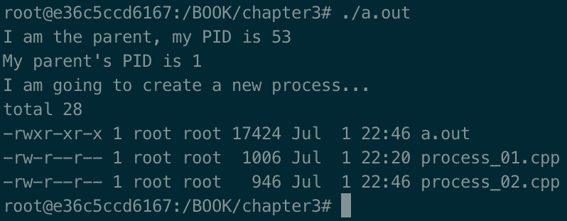
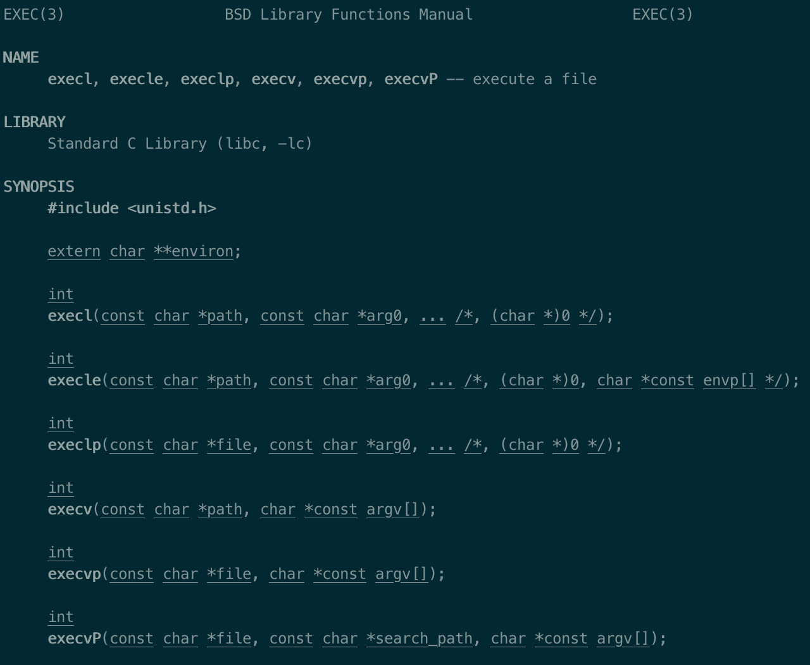
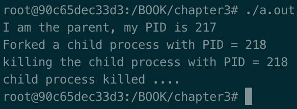

# 三、处理进程和线程

进程和线程是任何计算的基础。一个程序很少仅仅由一个线程或进程组成。在本章中，您将学习处理线程和进程的基本方法。您还将了解到与**便携式操作系统界面** ( **POSIX** )相比，处理线程是多么简单方便。作为系统开发人员核心技能的一部分，学习这些技能非常重要。C++ 在其标准库中没有*进程*的概念，所以将使用 Linux 原生实现。

本章将涵盖以下食谱:

*   开始新的进程
*   扼杀一个进程
*   创建新线程
*   创建守护进程

# 技术要求

为了让您立即尝试这些程序，我们设置了一个 Docker 映像，其中包含了我们在整本书中需要的所有工具和库。这是基于 Ubuntu 19.04 的。

要进行设置，请执行以下步骤:

1.  从[www.docker.com](https://www.docker.com/)下载安装 Docker 引擎。
2.  通过运行以下命令从 Docker Hub 中拉出图像:`docker pull kasperondocker/system_programming_cookbook:latest`。
3.  图像现在应该可以使用了。输入以下命令查看图像:`docker images`。

4.  你现在至少应该有这个形象:`kasperondocker/system_programming_cookbook`。
5.  借助以下命令，使用交互式外壳运行 Docker 映像:`docker run -it --cap-add sys_ptrace kasperondocker/system_programming_cookbook:latest /bin/bash`。
6.  运行容器上的外壳现已可用。键入`root@39a5a8934370/# cd /BOOK/`以获取所有开发的程序，按章节。

需要`--cap-add sys_ptrace`参数来允许 Docker 容器中的 **GNU 项目调试器** ( **GDB** )设置断点，默认情况下，Docker 不允许设置断点。

**Disclaimer**: The C++ 20 standard has been approved (that is, technically finalized) by WG21 in a meeting in Prague at the end of February. This means that the GCC compiler version that this book uses, 8.3.0, does not include (or has very, very limited support for) the new and cool C++ 20 features. For this reason, the Docker image does not include the C++ 20 recipe code. GCC keeps the development of the newest features in branches (you have to use appropriate flags for that, for example, `-std=c++ 2a`); therefore, you are encouraged to experiment with them by yourself. So, clone and explore the GCC contracts and module branches and have fun.

# 开始新的进程

这个食谱将展示如何以编程方式开始一个新的过程。C++ 标准不包括对进程的任何支持，因此将使用 Linux 本机实现。能够管理程序中的流程是一项重要的技能，本食谱将教你流程的基本概念、**流程标识符** ( **PID** )、父 PID 以及所需的系统调用。

# 怎么做...

这个食谱将展示如何启动一个子进程，以及如何通过使用 Linux 系统调用让父进程等待子进程完成。应该展示两种不同的技巧:第一种，父母只是叉孩子；第二种，子进程使用`execl`系统调用运行应用。

系统调用的另一种选择是使用外部库(或框架)，如 **Boost** 库。

1.  首先，在名为`process_01.cpp`的新文件中键入程序:

```cpp
#include <stddef.h>
#include <stdlib.h>
#include <unistd.h>
#include <sys/types.h>
#include <sys/wait.h>
#include <iostream>

int main(void)
{
    pid_t child;
    int status;
    std::cout << "I am the parent, my PID is " << getpid()
        << std::endl;
    std::cout << "My parent's PID is " << getppid() << std::endl;
    std::cout << "I am going to create a new process..."
        << std::endl;
    child = fork();
    if (child == -1)
    {
```

2.  我们必须考虑一个孩子可能没有分叉的情况，所以我们需要写下这一部分:

```cpp
        // fork() returns -1 on failure
        std::cout << "fork() failed." << std::endl;
        return (-1);
    }
    else if (child == 0)
    {
```

3.  这个分支是一个很好的例子，父母可以正确地分叉他们的孩子。这里的子节点只是将其 PID 打印到标准输出:

```cpp
      std::cout << "I am the child, my PID is " << std::endl;
      std::cout << "My parent's PID is " << getppid() << std::endl;
    }
    else
    {
```

4.  现在，我们必须让父进程等待子进程完成:

```cpp
        wait(&status); // wait for the child process to finish...
        std::cout << "I am the parent, my PID is still "
            << getpid() << std::endl;
    }
    return (0);
}
```

现在，让我们开发上一个程序的`fork-exec`版本。

1.  首先，在名为`process_02.cpp`的新文件中键入程序:

```cpp
#include <stddef.h>
#include <stdlib.h>
#include <stdio.h>
#include <unistd.h>
#include <sys/types.h>
#include <sys/wait.h>
#include <iostream>

int main(void)
{
    pxid_t child;
    int status;
    std::cout << "I am the parent, my PID is " 
              << getpid() << std::endl;
    std::cout << "My parent's PID is " 
              << getppid() << std::endl;
    std::cout << "I am going to create a new process..." 
              << std::endl;
    child = fork();
    if (child == -1)
    {
        // fork() returns -1 on failure
        std::cout << "fork() failed." << std::endl;
        return 1;
    }
    else if (child == 0)
    {
```

2.  下面的代码块显示了运行`execl`*`ls -l`的子部分:*

```cpp
        if (execl("/usr/bin/ls", "ls", "-l", NULL) < 0) 
        {
            std::cout << "execl failed!" << std::endl;
            return 2;
        }
        std::cout << "I am the child, my PID is " 
                  << getpid() << std::endl;
        std::cout << "My parent's PID is " 
                  << getppid() << std::endl;
    }
    else
    {
        wait(&status); // wait for the child process to finish...
    }
    return (0);
}
```

下一节将描述两种不同方法的细节(`fork`对`fork-exec` ) *。*

# 它是如何工作的...

让我们分析前面两个例子:

1.  `fork`系统调用:通过编译`g++ process_01.cpp`和运行`./a.out`，输出如下:


程序通过调用`fork`，创建调用过程的副本。这意味着这两个进程具有相同的代码，尽管它们是两个完全不同的进程，但代码库将是相同的。用户必须在`else if (child == 0)`部分钩住子代码。最终，父母将不得不等待孩子通过`wait(&status);`呼叫完成任务。另一种选择是`waitpid (123, &status, WNOHANG);`调用，它等待一个特定的 PID(或者等待所有子进程，如果第一个参数是`-1`)。`WNOHANG`使`waitpid`立即返回，即使孩子的状态不是立即可用。

如果父进程没有等待子进程完成，会发生什么？也就是说，发生的事情是没有`wait(&status);`调用？从技术上来说，父母会完成，而仍在奔跑的孩子会变成**僵尸**。这在 2.6 版本之前的 Linux 内核中是一个巨大的问题，因为僵尸进程一直留在系统中，直到它们等待*。孩子的过程现在被`init`过程所采用(其 PID 为`1`，定期等待可能死亡的孩子。*

 *2.  `fork-exec`系统调用:



最常见的创建流程的方式是`fork` / `exec`组合。正如我们所看到的，`fork`用自己的 PID 创建了一个全新的进程，但是现在，`else if (child == 0)`部分执行一个外部进程，它有一个不同的代码库。这个例子只是调用`ls -l`命令来列出文件和目录，但是开发人员可以将任何可执行文件放在这里。

# 还有更多...

为什么应该使用进程而不是线程是需要考虑的一个重要方面。答案视情况而定，但一般来说，应考虑以下几个方面:

*   线程在启动它的进程的相同内存空间中运行。这方面有利也有弊。主要的含义是，如果一个线程崩溃，整个应用就会崩溃。
*   线程间的通信比进程间的通信快得多。
*   可以用较低的权限(通过`setrlimit`)产生一个进程，以限制不可信代码可用的资源。
*   在进程中设计的程序比在线程中设计的程序更加分离。

这个食谱中的`fork` / `execl` / `wait`召唤有很多变体。`man pages`为整个通话系列提供全面的文档。以下截图指`man execl`:



# 请参见

参见[第 1 章](01.html)、*系统编程入门*，了解`man pages`和 Linux 的一般知识。

# 扼杀一个进程

在前面的食谱中，我们已经看到了两种方法来开始一个新的过程，在这个过程中，父母总是等待他们的孩子完成任务。情况并非总是如此。有时候，父母应该能够杀死孩子的过程。在这个食谱中，我们将看到一个如何做到这一点的例子。

# 准备好

作为先决条件，必须通过*开始一个新的过程*配方。

# 怎么做...

在本节中，我们创建了一个程序，其中父进程分叉其子进程，子进程将执行无限循环，父进程终止它:

1.  让我们开发将被父母杀死的子程序:

```cpp
#include <stddef.h>
#include <stdlib.h>
#include <stdio.h>
#include <unistd.h>
#include <sys/types.h>
#include <sys/wait.h>
#include <iostream>

int main(void)
{
    std::cout << "Running child ..." << std::endl;
    while (true)
        ;
}
```

2.  接下来，我们要开发父程序(`/BOOK/Chapter03`文件夹中的`process_03.cpp`):

```cpp
#include <stddef.h>
#include <stdlib.h>
#include <stdio.h>
#include <unistd.h>
#include <sys/types.h>
#include <sys/wait.h>
#include <iostream>
int main(void)
{
    pid_t child;
    int status;
    std::cout << "I am the parent, my PID is " << getpid() 
              << std::endl;
    child = fork();
    std::cout << "Forked a child process with PID = " 
              << child << std::endl;
    if (child == -1)
    {
        std::cout << "fork() failed." << std::endl;
        return 1;
    }
    else if (child == 0)
    {
```

3.  接下来，在父程序的子部分，我们启动上一步开发的子程序:

```cpp
        std::cout << "About to run the child process with PID = " 
                  << child << std::endl;
        if (execl("./child.out", "child.out", NULL) < 0)
        {
            std::cout << "error in executing child proceess " 
                      << std::endl;
            return 2;
        }
    }
    else
    {
```

4.  在父程序的父部分(`else`部分)，我们必须杀死子进程并检查它是否被正确杀死:

```cpp
        std::cout << "killing the child process with PID = " 
                  << child << std::endl;
        int status = kill (child, 9);
        if (status == 0)
            std::cout << "child process killed ...." << std::endl;
        else
            std::cout << "there was a problem killing
                the process with PID = " 
                      << child << std::endl;
    }
    return (0);
}
```

我们已经看到了父程序和子程序，父程序杀死子程序。在下一节中，我们将学习这些程序的机制。

# 它是如何工作的...

在这之前，我们必须编译子程序和父程序——`g++ process_03.cpp`和`g++ -o child.out process_04.cpp`。

在编译`process_04.cpp`时，我们需要根据父进程的需要指定`-o child.out`(进程名为`a.out` *)* 。通过运行它，产生的输出如下:



执行显示`PID = 218`的子进程被父进程正确杀死。

该配方中的代码只是*开始新流程*配方的变体。不同的是，现在，作为其细化的一部分，父进程杀死了子进程`int status = kill (child, 9);`。`kill`系统调用接受要终止的进程的 PID 作为第一个参数，接受要发送给子进程的信号作为第二个参数。接受的信号如下:

*   `1` = `HUP`(悬置)
*   `2` = `INT`(中断)
*   `3` = `QUIT`(退出)
*   `6` = `ABRT`(中止)
*   `9` = `KILL`(不可捕捉，不可忽略的杀戮)
*   `14` = `ALRM`(闹钟)
*   `15` = `TERM`(软件终止信号)

`man 2 kill`, the `kill` system call, sends a signal to a process. On success, return `0`; otherwise, return `-1`. You need to include `#include <sys/types.h>` and `#include <signal.h>` to use it.

# 还有更多...

在[第二章](02.html)、*重新审视 C++* 中的*理解并发*食谱中，如果可能的话，我们基于`std::thread`和`std::async`提供了两种备选解决方案(并根据本书的性质提倡它们)。下一个食谱还提供了一个使用`std::thread`的具体例子。

# 创建新线程

过程不是构建软件系统的唯一方式；一个轻量级的替代方法是使用线程。这个方法展示了如何使用 C++ 标准库创建和管理线程。我们已经看到，使用 C++ 标准库的主要优势是它的可移植性，以及它不依赖于外部库(例如，Boost)的事实。

# 怎么做...

我们将要编写的代码将是对一个大整数向量求和的并发版本。向量被分成两部分；每个线程计算其部分的总和，主线程显示结果。

1.  我们定义一个 10 万整数的向量，用`main`方法生成随机数:

```cpp
#include <iostream>
#include <thread>
#include <vector>
#include <algorithm>

void threadFunction (std::vector<int> &speeds, int start, int
    end, int& res);

int main()
{    
    std::vector<int> speeds (100000);
    std::generate(begin(speeds), end(speeds), [] () 
        { return rand() % 10 ; });

```

2.  接下来，启动第一个线程，传递前 50，000 个整数:

```cpp
    int th1Result = 0;
    std::thread t1 (threadFunction, std::ref(speeds), 0, 49999, 
        std::ref(th1Result));

```

3.  然后，启动第二个线程，传递第二个 50，000 个整数:

```cpp
    int th2Result = 0;    
    std::thread t2 (threadFunction, std::ref(speeds), 50000, 99999, 
        std::ref(th2Result));

```

4.  等待两个线程的结果:

```cpp
    t1.join();
    t2.join();
    std::cout << "Result = " << th1Result + th2Result
        << std::endl;
    return 0;
}

void threadFunction (std::vector<int> &speeds, int start, int 
    end, int& res)
{
    std::cout << "starting thread ... " << std::endl;
    for (int i = start; i <= end; ++ i)
    res += speeds[i];
    std::cout << "end thread ... " << std::endl;
}
```

下一节将解释这一动态。

# 它是如何工作的...

用`g++ thread_01.cpp -lpthread`编译程序并执行，输出如下:


在*第 1 步*中，我们定义了`threadFunction`方法，这是一个基本的线程单元，负责将`start`到`end`的元素汇总到`speeds`中，并将结果保存在`res`输出变量中。

在 s *步骤 2* 和*步骤 3* 中，我们启动了两个线程来对`t1`线程的前 5 万项和`t2`线程的后 5 万项进行计算。这两个线程同时运行，所以我们需要等待它们完成才能这样做。在*步骤 4* 中，我们等待`th1`和`th2`结果完成，将两个结果— `th1Results`和`th2Results`相加，并打印在标准输出(`stdout`)中。

# 还有更多...

*启动新流程*配方展示了如何创建流程，以及在什么情况下流程适合解决方案。值得强调的一个重要方面是，一个线程运行在创建它的进程的**相同的地址空间**中。尽管线程仍然是在一个更独立的(可运行的)模块中构建系统软件的一种好方法，但是如果一个线程崩溃(由于分段错误，或者如果 **`terminate`** 以某种方式被调用，等等)，整个应用就会崩溃。

从积极的一面来看，线程间的轻松通信，正如我们在前面的代码中看到的，非常简单和高效。此外，线程彼此共享**静态**和**堆**内存，以及创建它们的过程。

这个配方中的代码虽然简单，但是已经展示了一个任务(一个大数组的总和)是如何被并发执行的。顺便提一下，如果算法不是为并发运行而设计的，也就是说，如果线程之间存在依赖关系，那么多线程应用就毫无价值。

在这种情况下需要注意的是，如果两个线程同时在两个处理器上运行，我们会使用**并行**这个词。在这种情况下，我们没有这个保证。

我们已经使用了 C++ 标准库中的`std::thread`，但是同样的例子也可以使用`std::async`来编写。[第二章](02.html)、*重温 C++* ，展示了两者的一个例子。邀请您使用第二种方法重写该配方的代码。

# 请参见

在[第二章](02.html)、*重访 C++* 的*理解并发*配方中，有一个包含`std::thread`和`std::async`的配方介绍并发主题。还邀请您阅读斯科特·迈耶斯的*有效现代 C++* 和比雅尼·斯特劳斯特鲁普的*c++ 编程语言*中专门讨论线程的部分。

# 创建守护进程

系统编程实际上是密切处理操作系统资源、创建进程、线程、释放资源等等。有些情况下，我们需要一个进程来无限期地运行*；*即一个进程首先提供一些服务或者管理一个资源，然后一直保持运行。在后台无限期运行*的进程称为**守护进程**。这个方法将展示如何以编程方式产生守护进程。*

# 怎么做...

如上所述，守护进程是一个无限期运行的进程。一个进程，为了被归类为守护进程*，*必须有一些明确定义的属性，这些属性将在这个配方中用程序显示出来。

1.  通过调用`umask`系统调用，键入以下代码重置子进程的初始访问权限:

```cpp
#include <unistd.h>
#include <sys/stat.h>
#include <iostream>

int main(void)
{
    pid_t child;
    int status;
    std::cout << "I am the parent, my PID is " << getpid()
        << std::endl;
    std::cout << "I am going to create a new daemon process..."
        << std::endl;

    // 1\. clear file creation mask
    umask(0);

```

2.  为孩子键入要分叉的代码:

```cpp
    child = fork();
    if (child == -1)
    {
        std::cout << "fork() failed." << std::endl;
        return (-1);
    }
    else if (child == 0) // child (daemon) process
    {

```

3.  在子进程上键入`setsid`命令:

```cpp
        setsid();

```

4.  将工作目录更改为子进程(现在是守护进程):

```cpp
        if (chdir("/") < 0)
            std::cout << "Couldn't change directly" << std::endl;

```

5.  运行守护程序特定的任务——在这种情况下，只需休眠`10`秒:

```cpp
        // Attach here the daemon specific long running
        // tasks ... sleep for now.
        sleep (10);
    }

```

6.  父进程在`fork`后退出:

```cpp
    return (0);
}
```

下一节将更详细地解释这六点。

# 它是如何工作的...

用`g++ daemon_01.cpp`(在 Docker 映像的(`/BOOK/Chapter03`)文件夹中)编译代码并运行。输出如下:


当我们在 shell 上运行一个进程时，终端会等待子进程完成，然后再准备另一个命令。我们可以用`&`符号(例如`ls -l &`)运行命令，外壳会提示终端输入另一个命令。请注意，子进程仍将与父进程处于同一会话中。对于要成为守护进程的进程，应该应用以下规则(数字 *2* 和 *3* 是强制性的；其他是可选的):

1.  **用参数`0`** ( `umask(0)`)调用`umask`:父进程创建子进程时，继承文件模式创建掩码(即子进程将继承父进程的初始访问权限)。我们要确保重置它们。
2.  **让父进程在分叉**后退出:在前面的代码中，父进程创建了子进程后，返回。
3.  **叫** `setsid`。这有三个作用:
    *   子进程成为新创建会话的领导者。
    *   它成为新流程组的领导者。
    *   它与其控制终端分离。
4.  **更改工作目录**:父进程可能运行在一个可能不会存在很久的临时(或挂载)文件夹中。设置当前文件夹以满足守护进程的长期期望是一个很好的做法。
5.  **记录**:由于守护服务不再与任何终端设备相关联，将标准输入、输出和错误重定向到`/dev/null`是一个很好的做法。

# 还有更多...

到目前为止，进程的唯一标识符是 PID。也属于有**流程** **组 ID** ( **PGID** )的组。流程组是一个或多个流程的集合。同一组中的所有进程都可以从同一终端接收信号。每个组都有一个领导者，PGID 的值与领导者的 PID 相同。

会话是一个或多个组的集合。该配方显示，通过调用`setsid`方法可以创建一个新的会话。

一个会话可以有一个(单个)控制终端。`ps -efj`命令显示所有运行着`PID`、`PPID`和`PGID`的进程，以及每个进程的控制终端(`TTY`)信息:


输出显示`./a.out`守护进程有`PID = 19`，它是组(`PGID = 19`)的领导者，它没有连接到任何控制终端(`TTY= ?`)。

# 请参见

斯蒂文斯的《UNIX 环境下的高级编程》 【T4 环境下的高级编程】第 13 章致力于守护进程。*