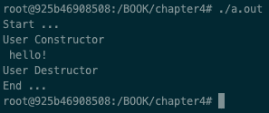
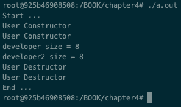
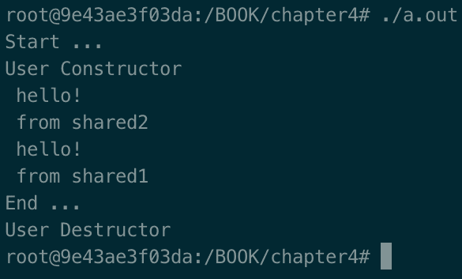
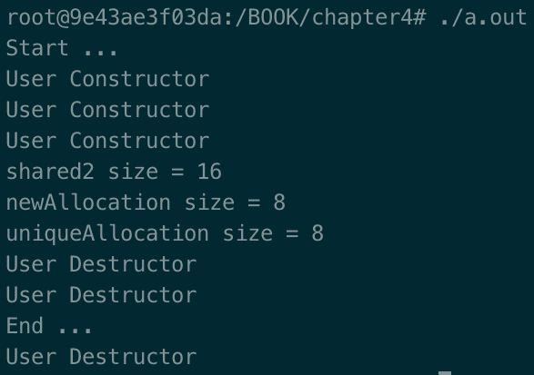
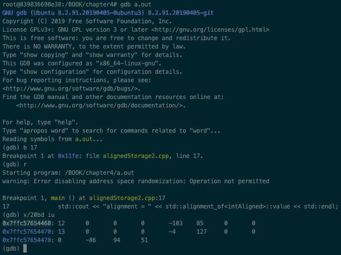

# 深入探讨内存管理

内存是处理系统开发的核心概念之一。分配、释放和学习如何管理内存，以及知道 C++ 可以提供什么来简化和管理内存，都是至关重要的。本章将通过学习如何使用 C++ 智能指针、对齐内存、内存映射输入/输出和分配器来帮助您掌握内存是如何工作的。

本章将涵盖以下主题:

*   学习自动记忆还是动态记忆
*   学习何时使用`unique_ptr`，以及尺寸的含义
*   学习何时使用`shared_ptr`，以及尺寸的含义
*   分配对齐的内存
*   检查分配的内存是否对齐
*   处理内存映射的输入/输出
*   亲自与分配器打交道

# 技术要求

为了让您立即尝试这些程序，我们设置了一个 Docker 映像，其中包含了我们在整本书中需要的所有工具和库。这是基于 Ubuntu 19.04 的。

要进行设置，请执行以下步骤:

1.  从[下载并安装 Docker 引擎](https://www.docker.com/)[r.com](https://www.docker.com/)。
2.  通过运行以下命令从 Docker Hub 中拉出图像:`docker pull kasperondocker/system_programming_cookbook:latest`。

3.  图像现在应该可以使用了。输入以下命令查看图像:`docker images`。
4.  你现在至少应该有这个形象:`kasperondocker/system_programming_cookbook`。
5.  借助以下命令，使用交互式外壳运行 Docker 映像:`docker run -it --cap-add sys_ptrace kasperondocker/system_programming_cookbook:latest /bin/bash`。
6.  运行容器上的外壳现已可用。按章节输入`root@39a5a8934370/# cd /BOOK/`获取所有开发的程序。

需要`--cap-add sys_ptrace`参数来允许 Docker 容器中的 **GNU 项目调试器** ( **GDB** )设置断点，默认情况下，Docker 不允许设置断点。

**Disclaimer**: The C++ 20 standard has been approved (that is, technically finalized) by WG21 in a meeting in Prague at the end of February. This means that the GCC compiler version that this book uses, 8.3.0, does not include (or has very, very limited support for) the new and cool C++ 20 features. For this reason, the Docker image does not include the C++ 20 recipe code. GCC keeps the development of the newest features in branches (you have to use appropriate flags for that, for example, `-std=c++ 2a`); therefore, you are encouraged to experiment with them by yourself. So, clone and explore the GCC contracts and module branches and have fun.

# 学习自动记忆还是动态记忆

本食谱将重点介绍 C++ 提供的两种主要内存分配策略:**自动**和**动态**内存分配。当变量的作用域持续到定义它的块的持续时间时，它是自动的，并且它的分配和解除分配是自动的(也就是说，不由开发人员决定)。变量在堆栈上分配。

如果变量分配在内存的动态部分(自由存储，通常称为*堆*)，则该变量是动态的，分配和解除分配由开发人员决定。动态内存分配提供的更大灵活性是有代价的，因为开发人员需要做更多的工作来避免内存泄漏、悬空指针等等。

# 怎么做...

本节将展示自动和动态变量分配的两个示例。

1.  让我们创建一个我们需要的实用程序类:

```cpp
class User
{
public:
    User(){
        std::cout << "User constructor" << std::endl;
    };
    ~User(){
        std::cout << "User Destructor" << std::endl;
    };

    void cheers() 
    {
        std::cout << " hello!" << std::endl;};
    };
};
```

2.  现在，让我们创建`main`模块来显示自动内存使用情况:

```cpp
#include <iostream>

int main()
{
    std::cout << "Start ... " << std::endl;
    {
        User developer;
        developer.cheers();
    }
    std::cout << "End ... " << std::endl;
}
```

3.  现在，我们将为动态内存使用编写`main`模块:

```cpp
#include <iostream>

int main()
{
    std::cout << "Start ... " << std::endl;
    {
        User* developer = new User();
        developer->cheers();
        delete developer;
    }
    std::cout << "End ... " << std::endl;
}
```

这两个节目，虽然结局相同，却展现了两种不同的处理记忆的方式。

# 它是如何工作的...

第一步，我们定义了一个`User`类，用来展示自动和动态内存分配的区别。它的构造函数和析构函数将用于显示类何时被分配和释放。

在*第 2 步*中，我们可以看到变量只是定义为`User developer;`。C++ 运行时将负责分配堆栈内存并释放它，而不需要开发人员做额外的工作。这种类型的内存管理更快更容易，但有两个主要成本:

*   内存量是有限的。
*   该变量仅在内部`{ }`块中有效且可见，在该块中它被分配。

在*步骤 3* 中，相同的对象被分配到动态内存(即**堆**)上。主要区别在于开发人员现在负责分配和解除分配所需的内存量。如果不释放内存(使用`free`)，就会出现泄漏。动态管理内存的优点如下:

*   灵活性:指针引用分配的内存(变量`developer`)可以在整个程序中使用。
*   可用内存的数量远远超过自动内存管理。

# 还有更多...

使用较新的 C++ 标准(从版本 11 开始)，可以安全地避免`new`和`delete`使用智能指针(`shared_ptr`和`unique_ptr`)。当不再使用内存时，这两个工具将负责释放内存。[第二章](02.html)、*重温 C++* ，提供了智能指针的复习。

# 请参见

接下来的两个食谱将显示何时使用`unique_ptr`和`shared_ptr`。

# 学习何时使用 unique_ptr，以及对大小的影响

在前面的食谱中，我们已经学习了 C++ 中管理内存的两种基本方式:自动和动态。我们还了解到，与自动内存(即从堆栈中获得的内存)相比，开发人员可以获得更多的动态内存，并且提供了极大的灵活性。另一方面，处理动态记忆可能是一种不愉快的经历:

*   指针不指示它是指向数组还是指向单个对象。
*   释放分配的内存时，不知道是必须使用`delete`还是`delete[]`，要看变量是怎么定义的。
*   没有明确的方法来判断指针是否悬空。

这些只是您在处理动态内存时可能会遇到的几个问题，然后是`new`和`delete`。`unique_ptr`是一个智能指针，这意味着它知道什么时候应该释放内存，减轻了开发人员的负担。在这个食谱中，你将学习如何正确使用`unique_ptr`和`make_unique`。

# 怎么做...

在这一部分，我们将开发一个程序来学习为什么`unique_ptr`是处理动态记忆的一种便捷方式；第二个方面是了解`unique_ptr`是否与原始指针大小相同:

1.  我们将重用在之前的配方中开发的`User`类。
2.  让我们编写`main`程序，用`make_unique`分配一个`User`对象，使用`unique_ptr`:

```cpp
#include <iostream>

int main()
{
    std::cout << "Start ... " << std::endl;
    {
        auto developer = std::make_unique<User>();
        developer->cheers();
    }
    std::cout << "End ... " << std::endl;
}
```

3.  让我们看看记忆的含义:

```cpp
auto developer = std::make_unique<User>();
developer->cheers();

User* developer2 = new User();
std::cout << "developer size = " << sizeof (developer) << std::endl;
std::cout << "developer2 size = " << sizeof (developer2) << std::endl;
delete developer2;
```

你认为`developer`和`developer2`的大小会有什么不同？

# 它是如何工作的...

在*步骤 2* 中，我们使用`unique_ptr`来定义使用`std::make_unique`分配的变量。一旦分配了变量，就没有内存泄漏的风险，因为析构函数会自动为我们释放内存。输出如下:



在*步骤 3* 中，我们想要检查`unique_ptr`与原始指针相比是否增加了任何内存。好消息是`unique_ptr`的大小和原始指针版本一样。该步骤的输出如下:



`developer`和`developer2`变量大小相同，开发者可以同样对待。

一个经验法则是将`unique_ptr`用于管理资源的变量，这些变量只拥有**的专属所有权**，这代表了大多数开发人员的用例。

# 还有更多...

默认情况下，`unique_ptr`为对象调用默认的`delete`析构函数，但是可以指定自定义的`delete`析构函数。如果指针变量不代表独占所有权，而是共享所有权，将其转换为`shared_ptr`很容易。

需要强调的一个重要方面是`make_unique`不是 C++ 11 标准库的一部分，而是 C++ 14 库的一部分。如果您使用的是 C++ 11 标准库，那么它的实现非常简单。

# 请参见

[第 2 章](02.html)、*重温 C++* 有一个关于智能指针的专用配方，其中一个配方是关于共享和唯一指针的。建议阅读斯科特·迈耶斯的《T4 有效的现代 c++》。

# 了解何时使用 shared_ptr，以及对大小的影响

在前面的食谱中，我们已经学习了如何使用`unique_ptr`以非常方便的方式管理动态内存(在堆上分配)。我们还了解到`unique_ptr`必须被使用，以防内存的独占所有权，或者内存管理的资源。但是如果我们有一个由更多实体共同拥有的资源呢？如果我们必须管理的内存必须在所有所有者都完成他们的工作后释放呢？嗯，这正是`shared_ptr`的用例。就像`unique_ptr`一样，对于`shared_ptr`我们不用`new`分配内存，但是有一个模板函数(C++ 标准库的一部分)`make_shared`。

# 怎么做...

在这一部分，我们将开发一个程序来展示如何使用`shared_ptr`。您将了解到，只有当没有所有者再使用内存时，才会释放内存:

1.  我们将重用第一个配方中开发的`User`类。现在让我们编写`main`模块:

```cpp
int main()
{
    std::cout << "Start ... " << std::endl;
    auto shared1 = std::make_shared<User>();
    {
        auto shared2 = shared1;
        shared2->cheers(); std::cout << " from shared2"
            << std::endl;
        shared1->cheers(); std::cout << " from shared1"
            << std::endl;
    }
    std::cout << "End ... " << std::endl;
}
```

2.  现在，让我们通过编写这个程序来看看`shared_ptr`使用的内存:

```cpp
int main()
{
    std::cout << "Start ... " << std::endl;
    auto shared1 = std::make_shared<User>();
   {
        auto shared2 = shared1;
        User* newAllocation = new User();
        auto uniqueAllocation = std::make_unique<User>();

        std::cout << "shared2 size = " << sizeof (shared2)
            << std::endl;
        std::cout << "newAllocation size = " <<
            sizeof (newAllocation) << std::endl;
        std::cout << "uniqueAllocation size = " <<
            sizeof (uniqueAllocation) << std::endl;

        delete newAllocation;
    }
    std::cout << "End ... " << std::endl;
}
```

此时，我们应该知道`unique_ptr`相对于原始指针的大小(正如我们在*学习何时使用 unique_ptr 以及*配方大小的含义中所学的)。`shared_ptr`变量的大小是多少？还是老样子？在下一节中，我们将了解这一重要方面。

# 它是如何工作的...

在前面的第一个程序中，我们展示了如何使用`shared_ptr`。首先，我们分配了一个内存块，其中包含一个类型为`User`带有`auto shared1 = std::make_shared<User>();`的对象。到目前为止，`User`资源归`shared1`变量所有。接下来，进入块，我们将`shared1`变量分配给`shared2`到`auto shared2 = shared1;`。这意味着包含`User`对象的内存现在被`shared1`和`shared2`指向。使用构造函数副本`auto shared2 (shared1);`也可以达到同样的目的。由于`User`现在由两个变量指向，所以只有当所有变量都超出范围时，才会释放已用内存。实际上，输出证明内存是在主块的末尾被解除分配的(调用了`User`的析构函数)，而不是像`unique_ptr`那样在内部块的末尾:



`shared_ptr`对记忆的影响和`unique_ptr`不一样。原因是`shared_ptr`实现需要一个原始指针来跟踪内存(类似于`unique_ptr`，另一个原始指针用于资源的引用计数。

这个引用计数变量必须是原子变量，因为它可以由不同的线程递增和递减:



在运行第二个程序时，`shared_ptr`变量的内存大小通常是原始指针大小的两倍，正如我们在前面的输出中看到的。

# 还有更多...

另一个不可忽视的有趣点是，由于`shared_ptr`包含一个原子变量，它通常比普通变量慢。

# 请参见

[第 2 章](02.html)*重温 C++* ，有一个关于智能指针的专用配方，其中一个配方是关于共享和唯一指针的。建议阅读斯科特·迈耶斯的《T4 有效的现代 c++》。

# 分配对齐的内存

编写系统程序可能需要使用在内存中对齐的数据，以便有效地访问硬件(在某些情况下，甚至完全访问硬件)。例如，在 32 位架构的机器上，我们分配的内存与 4 字节边界对齐。在这个食谱中，你将学习如何使用 C++ 11 `std::aligned_storage`来分配对齐的内存。当然，还有其他更传统的机制来分配对齐的内存，但本书的目标是尽可能多地使用 C++ 标准库工具。

# 怎么做...

在本节中，我们将编写一个程序，该程序将使用分配给`std::aligned_storage`的内存，并将显示`std::alignment_of`的使用:

1.  让我们从编写一个程序来检查当前机器上整数和双精度的默认对齐边界开始:

```cpp
#include <type_traits>
#include <iostream>
int main()
{
    std::cout << "int alignment = " << std::alignment_of<int>
        ::value << std::endl;
    std::cout << "double alignment = " << 
        std::alignment_of<double>::value << std::endl;
    return (0);
}
```

2.  现在，让我们编写一个程序来分配特定大小的内存。为此，我们使用`std::aligned_storage`:

```cpp
#include <type_traits>
#include <iostream>
typedef std::aligned_storage<sizeof(int), 8>::type intAligned;
int main()
{
    intAligned i, j;
    new (&i) int();
    new (&j) int();

    int* iu = &reinterpret_cast<int&>(i);
    *iu = 12;
    int* ju = &reinterpret_cast<int&>(j);
    *ju = 13;

    std::cout << "alignment = " << std::alignment
        _of<intAligned>::value << std::endl;
    std::cout << "value = " << *iu << std::endl;
    std::cout << "value2 = " << reinterpret_cast<int&>(i)
        << std::endl;
    return (0);
}
```

分配对齐的内存可能很棘手，C++ 标准库(从版本 11 开始)提供了这两个特性(`std::alignment_of`、`std::aligned_storage`)来简化它。下一节将描述其背后的机制。

# 它是如何工作的...

第一个程序相当简单，通过`std::alignment_of`显示了两种图元类型在内存中的自然对齐。通过编译(`g++ alignedStorage.cpp`)和运行程序，我们有以下输出:


这意味着每个整数将在边界的`4`字节对齐，浮点类型将与`8`字节对齐。

在第二个程序中，我们需要一个与`8`字节对齐的整数。通过编译它并运行可执行文件，输出如下所示:


你可能已经注意到我用`-g`选项进行了编译(添加调试符号)。我们这样做是为了用 GDB 的内存转储表明整数的内存在`8`字节处正确对齐:



从调试会话中，我们可以看到通过`x/20bd iu` ( `x` = *内存转储*)命令，我们在`iu`变量的地址后转储了`20`字节的内存。我们可以在这里看到一些有趣的东西:`iu`和`ju`变量都在`8`字节对齐。每个内存行显示`8`字节(测试一下:`0x7ffc57654470`*–*`0x7ffc57654468`=`8`)。

# 还有更多...

玩内存总是有风险的，这些新的 C++ 特性(以及其他在`std`命名空间中可用的特性)帮助我们**安全地玩**。建议还是一样:过早优化一定要谨慎使用；仅在必要时优化(即使用对齐内存)。最后一个建议:不鼓励使用`reinterpret_cast`，因为它在低水平上操纵记忆。你需要知道你在使用它的时候在做什么。

# 请参见

比雅尼·斯特劳斯特鲁普最新版*C+**+编程语言，第四版*有一段关于*内存对齐* ( *6.2.9* )和*对齐 _ 存储* ( *35.4.1* )。

# 检查分配的内存是否对齐

在前面的食谱中，您已经学习了如何使用 C++ 11 来分配对齐的内存。现在的问题是:我们如何知道记忆是正确对齐的？这个食谱会教你这个。

# 怎么做...

我们将使用前面的程序，通过稍微修改一下，我们将看到如何检查指针是否对齐:

1.  让我们修改之前的程序，如下所示:

```cpp
#include <type_traits>
#include <iostream>

using intAligned8 = std::aligned_storage<sizeof(int), 8>::type;
using intAligned4 = std::aligned_storage<sizeof(int), 4>::type;

int main()
{
    intAligned8 i; new(&i) int();
    intAligned4 j; new (&j) int();

    int* iu = &reinterpret_cast<int&>(i);
    *iu = 12;
    int* ju = &reinterpret_cast<int&>(j);
    *ju = 13;

    if (reinterpret_cast<unsigned long>(iu) % 8 == 0)
        std::cout << "memory pointed by the <iu> variable 
        aligned to 8 byte" << std::endl;
    else
        std::cout << "memory pointed by the <iu> variable NOT 
        aligned to 8 bytes" << std::endl;
    if (reinterpret_cast<unsigned long>(ju) % 8 == 0)
        std::cout << "memory pointed by the <ju> variable aligned to 
        8 bytes" << std::endl;
    else
        std::cout << "memory pointed by the <ju> variable NOT 
        aligned to 8 bytes" << std::endl;

    return (0);
}
```

我们特意创建了两个类型定义，一个用于对齐`8`字节(`intAligned8`)，一个用于对齐`4`字节(`intAligned4`)。

# 它是如何工作的...

在程序中，我们定义了两个变量`i`和`j`，分别为`intAligned8`和`intAligned4`类型。借助这两个变量(与`8`和`4`字节对齐)，我们可以通过检查`8`的除法结果是否为`0` : `((unsigned long)iu % 8 == 0)`来查看它们是否正确对齐。这确保了`iu`指针与`8`字节对齐。对于`ju`变量也是如此。通过运行前面的程序，我们将得到以下结果:


不出所料:`iu`与`8`字节对齐，而`ju`则不对齐。

# 还有更多...

正如你可能已经注意到的，我们使用`reinterpret_cast`来允许模数(`%`)操作符，而不是 C 型转换`((unsigned long)iu % 8 == 0)`。如果您在 C++ 中开发，出于两个基本原因，我们鼓励您使用命名转换(`static_cast`、`reinterpret_cast`、`const_cast`、`dynamic_cast`):

*   为了让程序员表达演员的意图
*   为了保证演员的安全

# 请参见

关于这个主题的更多信息可以在 W. Richard Stevens 和 Stephen A. Rago 的《UNIX 中的高级编程》 *环境*中找到。

当一部分内存对齐时，编译器可以进行很好的优化。编译器不可能知道这一点，因此无法进行任何优化。最后一个 C++ 20 标准增加了`std::assume_aligned`特性。这通知编译器指针的值是与特定字节数对齐的内存地址。可能发生的情况是，当我们分配一些对齐的内存时，指向该内存的指针被传递给其他函数。

`std::assume_aligned`功能通知编译器假定指针指向的内存已经对齐，因此进行优化是安全的:

```cpp
void myFunc (int* p)
{
    int* pAligned = std::assume_aligned<64>(p);
    // using pAligned from now on.
}

```

`std::assume_aligned<64>(p);`功能通知编译器`p`已经至少与`64`字节对齐。如果内存没有对齐，您将获得未定义的行为。

# 处理内存映射的输入/输出

有时候，我们需要以一种不太常规或者说不太常见的方式来操作记忆。正如我们所看到的，内存是用`new`分配的，用`delete`释放(或者更好的是用`make_unique`和`make_shared`)。可能有些情况下，我们需要跳过某一层——也就是说，使用 Linux 系统调用；为了表现；或者是因为我们无法用 C++ 标准库映射的自定义行为。这就是`mmap` Linux 系统调用(`man 2 mmap`)的情况。`mmap`是一个符合 POSIX 的系统调用，允许程序员将一个文件映射到内存的一部分。除此之外，`mmap`还允许分配内存，这个食谱会教你怎么做。

# 怎么做...

本节将展示两个`mmap`用例:第一，如何将一个文件映射到内存的一部分；第二，如何使用`mmap`分配内存。让我们首先编写一个将文件映射到内存的程序。

1.  在一个 shell 中，让我们创建一个名为`mmap_write.cpp`的新源文件。我们需要打开一个文件来映射:

```cpp
 int fd = open(FILEPATH, O_RDWR | O_CREAT | O_TRUNC, (mode_t)0600);
 if (fd == -1)
 {
    std::cout << "Error opening file " << FILEPATH << std::endl;
    return 1;
 }
```

2.  其次，我们必须在文件中创建一个空间，稍后我们将使用它(`mmap`不这样做):

```cpp
int result = lseek(fd, FILESIZE-1, SEEK_SET);
if (result == -1)
{
    close(fd);
    std::cout << "Error calling lseek " << std::endl;
    return 2;
}

result = write(fd, "", 1);
if (result != 1)
{
    close(fd);
    std::cout << "Error writing into the file " << std::endl;
    return 3;
}
```

3.  然后，我们可以将文件(由`fd`文件描述符表示)映射到`map`变量:

```cpp
 int* map = (int*) mmap(0, FILESIZE, PROT_READ | PROT_WRITE, 
     MAP_SHARED, fd, 0);
 if (map == MAP_FAILED)
 {
     close(fd);
     std::cout << "Error mapping the file " << std::endl;
     return 4;
 }
```

4.  最后，我们需要在其中写入一些价值:

```cpp
for (int i = 1; i <=NUM_OF_ITEMS_IN_FILE; ++ i)
    map[i] = 2 * i;
```

5.  我们不要忘记关闭使用的资源:

```cpp
if (munmap(map, FILESIZE) == -1)
    std::cout << "Error un-mapping" << std::endl;

close(fd);
```

6.  到目前为止看到的步骤都与用`mmap`写文件有关。为了完整起见，在这一步中，我们开发了一个程序来读取一个名为`mmap_read.cpp`的文件，它与我们所看到的非常相似。在这里，我们将只看到重要的部分(Docker 图像包含读者和作者的完整版本):

```cpp
int* map = (int*) mmap(0, FILESIZE, PROT_READ, MAP_SHARED, fd, 0);
if (map == MAP_FAILED)
{
    close(fd);
    std::cout << "Error mapping the file " << std::endl;
    return 4;
}

for (int i = 1; i <= NUM_OF_ITEMS_IN_FILE; ++ i)
    std::cout << "i = " << map[i] << std::endl;
```

现在我们来学习如何使用`mmap`来分配内存。

1.  现在我们用`mmap`来分配内存:

```cpp
#include <sys/mman.h>
#include <iostream>
#include <cstring>

constexpr auto SIZE = 1024;

int main(int argc, char *argv[])
{
    auto* mapPtr = (char*) mmap(0, SIZE, 
                                PROT_READ | PROT_WRITE, 
                                MAP_PRIVATE | MAP_ANONYMOUS, 
                                -1, 0);
 if (mapPtr == MAP_FAILED)
 {
     std::cout << "Error mapping memory " << std::endl;
     return 1;
 }
 std::cout << "memory allocated available from: " << mapPtr
   << std::endl;

 strcpy (mapPtr, "this is a string!");
 std::cout << "mapPtr val = " << mapPtr << std::endl;

 if (munmap(mapPtr, SIZE) == -1)
     std::cout << "Error un-mapping" << std::endl;

 return 0;
}
```

虽然简单，但这两个程序向您展示了如何使用`mmap`分配内存和管理文件。在下一节中，我们将看到它是如何工作的。

# 它是如何工作的...

在第一个程序中，我们学习了`mmap`最常见的用法:将文件映射到内存的一部分。由于在 Linux 中几乎任何资源都可以映射到一个文件，这意味着我们几乎可以用`mmap`将任何东西映射到内存。它确实接受文件描述符。通过首先编译并运行`mmap_write.cpp`程序，我们能够在内存中写入一个包含整数列表的文件。生成的文件将被称为`mmapped.txt`。有趣的是运行`mmap_read.cpp`读者程序。让我们编译并运行它:


我们可以看到，它正确地打印出了文件中的所有整数。

严格来说，`mmap`不在堆内存中分配内存，也不在栈上分配内存。它是一个独立的内存区域，仍然在进程的虚拟空间中。`munmap`反其道而行之:它释放映射的内存，并将数据刷新到文件中(这种行为可以通过`msync`系统调用来控制)。

第二个程序展示了`mmap`的第二个用例:以另一种方式为`new`和`malloc`分配内存。我们可以在对`mmap`的调用中看到一些差异:

*   `MAP_PRIVATE`:修改是私密的。对内存所做的任何修改都不会反映回文件或其他映射。文件被映射为写入时复制。
*   `MAP_ANONYMOUS`:表示将分配一部分大小为`SIZE`的内存，不与任何特定文件关联。
*   我们传递的第五个参数`-1`是为了分配内存(即没有文件描述符)。

我们分配了 1 KB 的内存，并使用了一个字符串。输出如下:


同样，当我们用`free`或`delete`释放内存时，我们需要用`munmap`释放映射内存。

# 还有更多...

`mmap`有几个优点值得一提:

1.  如果将`mmap`与`MAP_SHARED`或`MAP_SHARED_VALIDATE`标志一起使用，则读写内存映射文件可以避免从实际文件中复制`read()`和`write()`所需的内容。事实上，当我们将一大块数据写入文件时，缓冲区会从用户空间移动到内核空间，读取一大块数据时也是如此。
2.  读写内存映射文件是一种简单的内存访问。内存映射文件只能在内存中读写；在`munmap`调用时，内存被刷新回文件中。这种行为可以通过`msync`系统调用的`MS_SYNC`、`MS_ASYNC`和`MS_INVALIDATE`标志参数来控制。

3.  非常方便的是，当多个进程映射内存中的同一个文件时，数据在所有进程之间共享(`MAP_SHARED`)。

# 请参见

查看`man 2 mmap`了解更多信息。更多信息可以在罗伯特·拉芙的 *Linux 系统编程，第二版*中找到。

# 亲自与分配器打交道

C++ **标准模板库** ( **STL** )容器是一种简单有效的资源管理方式。容器的一个巨大好处是它们可以管理(几乎)任何类型的数据。然而，在处理系统编程时，我们可能需要为容器提供一种管理内存的替代方法。分配器正是这样:它们为容器提供了一个定制的实现。

# 怎么做...

在本食谱中，您将学习实现自己的自定义分配器(在本例中基于`mmap`)以提供给标准库容器(`std::vector`):

1.  让我们首先创建一个空的分配器模板:

```cpp
template<typename T>
class mmap_allocator
{
public:
    using value_type = T;

    template<typename U> struct rebind {
        using alloc = mmap_allocator<U>;
    };

    mmap_allocator(){};
    template <typename U>
    mmap_allocator(const mmap_allocator<U> &alloc) noexcept {};

    T* allocate(std::size_t n){};

    void deallocate(T* p, std::size_t n) {}
};
```

2.  可以看到，有复制构造函数、`allocate`和`deallocate`方法可以实现。让我们逐个实现它们(在这种情况下，不需要实现默认构造函数):

```cpp
    mmap_allocator(const mmap_allocator<U> &alloc) noexcept {
      (void) alloc;};
```

3.  接下来，执行`allocate`方法:

```cpp
    std::cout << "allocating ... n = " << n << std::endl;
    auto* mapPtr = static_cast<T*> (mmap(0, sizeof(T) * n, 
                                    PROT_READ | PROT_WRITE, 
                                    MAP_PRIVATE | MAP_ANONYMOUS, 
                                    -1, 0));
    if (mapPtr != MAP_FAILED)
        return static_cast<T*>(mapPtr);
    throw std::bad_alloc();
```

4.  最后，执行`deallocate`方法:

```cpp
    std::cout << "deallocating ... n = " << n << std::endl;
    (void) n;
    munmap(p, sizeof(T) * n);
```

5.  `main`方法是这样的:

```cpp
int main ()
{
    std::vector<int, mmap_allocator<int>> mmap_vector = {1, 2,
        3, 4, 5};

    for (auto i : mmap_vector)
        std::cout << i << std::endl;

    return 0;
}
```

`std::vector`的使用，可以看到，从用户的角度来看是无缝的。唯一的区别是指定我们想要使用哪个分配器。该容器将分配和释放内存，仅使用`mmap`和`munmap`，而不是基于`new`和`delete`的默认实现。

# 它是如何工作的...

这个程序的中心部分是两个方法:`allocate`，返回一个表示分配内存的指针，和`deallocate`，取一个指向要释放内存的指针。

在第一步中，我们已经画出了将要用来分配和释放内存的接口。这是一个模板类，因为我们希望它对任何类型都有效。如前所述，我们必须实现的两种方法是`allocate`和`deallocate`。

在第二步中，我们开发了复制构造函数，当我们想要构造一个对象时将调用它，传入相同类型的对象的输入。我们只是返回一个`typedef`，它将传达新对象使用哪个分配器。

第三步，我们实现了构造器，基本上是用`mmap`分配`T`类型的对象`n`的空间。我们已经在之前的食谱中看到了`mmap`的用法，因此邀请您再次阅读该食谱。

在第四步中，我们实现了`deallocate`方法，在这种情况下是调用`munmap`方法，该方法删除指定地址范围的映射。

最后，`main`方法展示了如何将我们的自定义分配器用于`std::vector`(它可以是任何容器——例如，列表)。在变量`mmap_vector`的定义中，我们传递了两个参数:第一个参数`int`，通知编译器它将是一个整数向量，第二个参数`mmap_allocator<int>`，指示使用我们的自定义分配器`mmap_allocator`，而不是默认分配器。

# 还有更多...

在系统编程中，有一个**内存池**的概念，该内存池是系统预先保留的，并且必须在资源的整个生命周期中使用。本食谱中看到的`map_allocator`类可以很容易地修改，在构造函数中预先分配一部分内存，并在不影响系统内存的情况下从池中获取和释放。

# 请参见

斯科特·梅耶斯的《有效的现代 C++ 》( T2)和比雅尼·斯特劳斯特鲁普的《c++ 程序设计》( T4)的《T5 语言》( T6)这两本书详细介绍了这些主题。有关`mmap`的更多详细信息，请参考*处理内存映射输入/输出*配方。