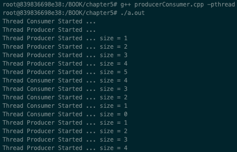
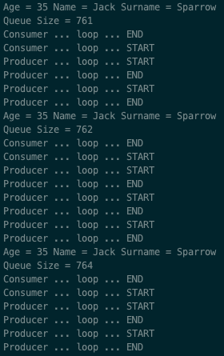

# 五、使用互斥、信号量和条件变量

本章将重点介绍可用于同步共享资源访问的最常见机制。我们将研究的同步机制可以防止一个关键部分(负责资源的程序段)被两个或多个进程或线程并发执行。在本章中，您将学习如何同时使用 POSIX 和 C++ 标准库同步构建块，例如互斥体、`std::condition_variable`、`std::promise`和`std::future`。

本章将涵盖以下食谱:

*   使用 POSIX 互斥体
*   使用 POSIX 信号量
*   POSIX 信号量高级用法
*   同步构造块
*   通过简单事件学习线程间通信
*   使用条件变量学习线程间通信

# 技术要求

为了让您可以立即试用本章中的所有程序，我们设置了一个 Docker 映像，其中包含了我们在本书中需要的所有工具和库。它基于 Ubuntu 19.04。

要进行设置，请执行以下步骤:

1.  从[www.docker.com](http://www.docker.com)下载并安装 Docker 引擎。
2.  从 Docker Hub 中拉出图像:`docker pull kasperondocker/system_programming_cookbook:latest`。
3.  图像现在应该可以使用了。键入`docker images`命令查看图像。
4.  你应该有如下图像:`kasperondocker/system_programming_cookbook`。
5.  使用`docker run -it --cap-add sys_ptrace kasperondocker/system_programming_cookbook:latest /bin/bash`命令运行带有交互式外壳的 Docker 图像。
6.  运行容器上的外壳现已可用。使用`root@39a5a8934370/# cd /BOOK/`获取本书将要开发的所有程序。

允许 GDB 设置断点需要`--cap-add sys_ptrace`参数。Docker 默认不允许这样做。

# 使用 POSIX 互斥体

这个方法将教你如何使用 POSIX 互斥锁来同步从多个线程对资源的访问。我们将通过开发一个包含方法(关键部分)的程序来实现这一点，该方法将执行不能并发运行的任务。我们将使用`pthread_mutex_lock`、`pthread_mutex_unlock`和`pthread_mutex_init` POSIX 方法来同步线程对它的访问。

# 怎么做...

在本食谱中，我们将创建一个多线程程序，只需将一个整数增加到`200000`。为此，我们将开发负责递增计数器的关键部分，它必须受到保护。然后，我们将开发主部分，它将创建两个线程并管理它们之间的协调。让我们继续:

1.  打开一个名为`posixMutex.cpp`的新文件，开发其结构和临界截面方法:

```cpp
#include <pthread.h>
#include <iostream>

struct ThreadInfo
{
    pthread_mutex_t lock;
    int counter;
};

void* increment(void *arg)
{
    ThreadInfo* info = static_cast<ThreadInfo*>(arg);
    pthread_mutex_lock(&info->lock);

    std::cout << "Thread Started ... " << std::endl;
    for (int i = 0; i < 100000; ++ i)
        info->counter++ ;
    std::cout << "Thread Finished ... " << std::endl;

    pthread_mutex_unlock(&info->lock);
    return nullptr;
}
```

2.  现在，在`main`部分，为线程间同步所需的锁添加`init`方法:

```cpp
int main()
{
    ThreadInfo thInfo;
    thInfo.counter = 0;
    if (pthread_mutex_init(&thInfo.lock, nullptr) != 0)
    {
        std::cout << "pthread_mutex_init failed!" << std::endl;
        return 1;
    }
```

3.  现在我们有了执行`increment`(也就是要保护的关键部分)的方法和管理线程间同步的锁，让我们创建线程:

```cpp
    pthread_t t1;
    if (pthread_create(&t1, nullptr, &increment, &thInfo) != 0)
    {
        std::cout << "pthread_create for t1 failed! " << std::endl;
        return 2;
    }

    pthread_t t2;
    if (pthread_create(&t2, nullptr, &increment, &thInfo) != 0)
    {
        std::cout << "pthread_create for t2 failed! " << std::endl;
        return 3;
    }
```

4.  现在，我们必须等待线程完成任务:

```cpp
    pthread_join(t1, nullptr);
    pthread_join(t2, nullptr);
    std::cout << "Threads elaboration finished. Counter = " 
              << thInfo.counter << std::endl;
    pthread_mutex_destroy(&thInfo.lock);
    return 0;
```

这个程序(可以在`/BOOK/Chapter05/`文件夹下的 Docker 图像中找到)向我们展示了如何使用 POSIX 互斥接口来同步线程之间共享资源的使用——在本例中是一个计数器。我们将在下一节详细解释这个过程。

# 它是如何工作的...

在第一步中，我们创建了将参数传递给线程所需的`struct`:`struct ThreadInfo`。在这个`struct`中，我们放置了保护资源`counter`和计数器本身所需的锁。然后，我们开发了`increment`功能。`increment`逻辑上需要锁定`pthread_mutex_lock(&info->lock);`资源，增加计数器(或临界段需要的任何其他动作)，解锁`pthread_mutex_unlock(&info->lock);`资源让其他线程也这样做。

第二步，我们开始开发`main`方法。我们做的第一件事是用`pthread_mutex_init`初始化锁互斥。这里，我们需要传递一个指向本地分配资源的指针。

在第三步中，我们创建了两个线程，`th1`和`th2`。这些人负责兼管`increment`法。这两个线程是通过传递在*步骤 2* 中分配的`thInfo`地址，用`pthread_create` POSIX API 创建的。如果线程创建成功，它会立即开始细化。

在第四步，也是最后一步，我们等待`th1`和`th2`将计数器的值打印到标准输出，我们期望是`200000`。通过编译`g++ posixMutex.cpp -lpthread`和运行`./a.out`程序，我们得到如下输出:


正如我们所看到的，这两个线程从不重叠执行。因此，关键部分中的计数器资源得到了适当的管理，并且输出是我们所期望的。

# 还有更多...

在这个食谱中，为了完整起见，我们使用了`pthread_create`。使用 C++ 标准库中的`std::thread`和`std::async`可以达到完全相同的目标。

The `pthread_mutex_lock()` function locks the mutex. If the mutex is already locked, the calling thread will be blocked until the mutex becomes available. The `pthread_mutex_unlock` function unlocks the mutex if the current thread holds the lock on a mutex; otherwise, it results in undefined behavior.

# 请参见

欢迎您修改本程序，并结合 C++ 标准库中的`std::thread`或`std::async`使用`pthread_mutex_lock`和`pthread_mutex_unlock`。参见[第二章](02.html)、*重访 C++* ，刷新自己对这个话题的认识。

# 使用 POSIX 信号量

POSIX 互斥体显然不是您可以用来同步对共享资源的访问的唯一机制。这个食谱将告诉你如何使用另一个 POSIX 工具来达到同样的结果。信号量不同于互斥体，这个食谱将教你它们的基本用法，而下一个将向你展示更高级的用法。信号量是线程和/或进程之间的通知机制。根据经验，尝试使用互斥作为同步机制，信号量作为通知机制。在这个配方中，我们将开发一个类似于我们在*中使用 POSIX 互斥体*配方构建的程序，但是这一次，我们将使用信号量保护关键部分。

# 怎么做...

在这个食谱中，我们将创建一个多线程程序来增加一个整数，直到它达到`200000`。同样，负责增量的代码部分必须受到保护，我们将使用 POSIX 信号量。`main`方法将创建两个线程，并确保资源被正确销毁。让我们开始吧:

1.  让我们打开一个名为`posixSemaphore.cpp`的新文件，开发结构和临界区方法:

```cpp
#include <pthread.h>
#include <semaphore.h>
#include <iostream>

struct ThreadInfo
{
    sem_t sem;
    int counter;
};

void* increment(void *arg)
{
    ThreadInfo* info = static_cast<ThreadInfo*>(arg);
    sem_wait(&info->sem);

    std::cout << "Thread Started ... " << std::endl;
    for (int i = 0; i < 100000; ++ i)
        info->counter++ ;
    std::cout << "Thread Finished ... " << std::endl;

    sem_post(&info->sem);
    return nullptr;
}
```

2.  现在，在`main`部分，为线程间同步所需的锁添加`init`方法:

```cpp
int main()
{
    ThreadInfo thInfo;
    thInfo.counter = 0;
    if (sem_init(&thInfo.sem, 0, 1) != 0)
    {
        std::cout << "sem_init failed!" << std::endl;
        return 1;
    }
```

3.  现在`init`部分已经完成，让我们编写启动两个线程的代码:

```cpp
pthread_t t1;
if (pthread_create(&t1, nullptr, &increment, &thInfo) != 0)
{
    std::cout << "pthread_create for t1 failed! " << std::endl;
    return 2;
}

pthread_t t2;
if (pthread_create(&t2, nullptr, &increment, &thInfo) != 0)
{
    std::cout << "pthread_create for t2 failed! " << std::endl;
    return 3;
}
```

4.  最后，这里是结束部分:

```cpp
    pthread_join(t1, nullptr);
    pthread_join(t2, nullptr);

    std::cout << "posixSemaphore:: Threads elaboration
        finished. Counter = " 
              << thInfo.counter << std::endl;
    sem_destroy(&thInfo.sem);
    return 0;
}
```

我们用于 POSIX 互斥体的相同程序现在用 POSIX 信号量运行。如您所见，程序的设计没有改变——真正改变的是我们用来保护关键部分的 API。

# 它是如何工作的...

第一部分包含用于与`increment`方法通信的结构和方法本身的定义。与程序的互斥版本相比，主要区别在于我们现在包含了`#include <semaphore.h>`头，这样我们就可以使用 POSIX 信号量 APIs。然后，在结构中，我们使用`sem_t`类型，这是保护关键部分的实际信号量。`increment`方法有两个壁垒保护实际逻辑:`sem_wait(&info->sem);`和`sem_post(&info->sem);`。这两种方法分别自动递减和递增`sem`计数器。`sem_wait(&info->sem);`通过将计数器递减`1`来获取锁。如果计数器的值大于 0，则获取锁，线程可以进入临界区。`sem_post(&info->sem);`退出临界区时，只需将计数器加 1。

第二步，我们通过调用`sem_init` API 初始化信号量。这里，我们传递了三个参数:

*   要初始化的信号量。
*   `pshared`论点。这表明信号量是在进程的线程之间共享还是在进程之间共享。`0`表示第一种选择。
*   最后一个参数表示信号量的初始值。通过将`1`传递给`sem_init`，我们要求信号量保护一个资源。信号量通过`sem_wait`和`sem_post`，将在内部自动增加和减少计数器，让每个线程一次一个地进入临界区。

在第三步中，我们创建了两个使用`increment`方法的线程。

在最后一步中，我们等待两个线程用`pthread_join`完成细化，并且，与本节最相关的是，我们通过传递到目前为止使用的信号量结构，用`sem_destroy`破坏了信号量结构。

让我们编译并执行程序:`g++ posixSemaphore.cpp -lpthread`。即使在这种情况下，我们也需要通过在使用`pthreads`时将`-lpthread`选项传递给 g++ 来将程序与`libpthread.a`链接起来。这样做的输出如下:


不出所料，输出显示计数器在`200000`。这也表明两条线程并不重叠。

# 还有更多...

我们通过将值`1`传递给`sem_init`方法，将`sem_t`用作二进制信号量。信号量可以用作*计数信号量*，这意味着将大于 1 的值传递给`init`方法。在这种情况下，意味着临界区将被 *N* 线程并发访问。

For more information on the GNU/Linux man pages, type `man sem_init` in a shell.

# 请参见

你可以在下一个食谱中找到更多关于*计数信号量*的信息，我们将在这里了解互斥体和信号量的区别。

欢迎您修改本程序，并结合 C++ 标准库中的`std::thread`或`std::async`使用`pthread_mutex_lock`和`pthread_mutex_unlock`。

# POSIX 信号量高级用法

*使用 POSIX 信号量*配方向我们展示了如何使用 POSIX 信号量来保护一个关键区域。在本食谱中，您将学习如何将其用作计数信号量和通知机制。我们将通过开发一个经典的发布-订阅程序来做到这一点，其中有一个发布者线程和一个消费者线程。这里的挑战是，我们希望将队列中项目的最大数量限制为一个定义的值。

# 怎么做...

在这个食谱中，我们将编写一个程序来表示计数信号量的典型用例——一个生产者-消费者问题，在这个问题中，我们希望将队列中的项目数量限制在一定的数量。让我们开始吧:

1.  让我们打开一个名为`producerConsumer.cpp`的新文件，并在两个线程中编码我们需要的结构:

```cpp
#include <pthread.h>
#include <semaphore.h>
#include <iostream>
#include <vector>

constexpr auto MAX_ITEM_IN_QUEUE = 5;

struct QueueInfo
{
    sem_t mutex;
    sem_t full;
    sem_t empty;
    std::vector<int> queue;
};
```

2.  现在，让我们为`producer`编写代码:

```cpp
void* producer(void *arg)
{
    QueueInfo* info = (QueueInfo*)arg;
    std::cout << "Thread Producer Started ... " << std::endl;
    for (int i = 0; i < 1000; i++)
    {
        sem_wait(&info->full);

        sem_wait(&info->mutex);
        info->queue.push_back(i);
        std::cout << "Thread Producer Started ... size = " 
                  << info->queue.size() << std::endl;
        sem_post(&info->mutex);

        sem_post(&info->empty);
    }
    std::cout << "Thread Producer Finished ... " << std::endl;
    return nullptr;
}
```

3.  我们对`consumer`也这样做:

```cpp
void* consumer(void *arg)
{
    QueueInfo* info = (QueueInfo*)arg;
    std::cout << "Thread Consumer Started ... " << std::endl;
    for (int i = 0; i < 1000; i++)
    {
        sem_wait(&info->empty);

        sem_wait(&info->mutex);
        if (!info->queue.empty())
        {
            int b = info->queue.back();
            info->queue.pop_back();
        }
        sem_post(&info->mutex);

        sem_post(&info->full);
    }
    std::cout << "Thread Consumer Finished ... " << std::endl;
    return nullptr;
}
```

4.  现在，我们需要对`main`方法进行编码，以便初始化资源(例如信号量):

```cpp
int main()
{
    QueueInfo thInfo;
    if (sem_init(&thInfo.mutex, 0, 1) != 0 ||
        sem_init(&thInfo.full, 0, MAX_ITEM_IN_QUEUE) != 0 ||
        sem_init(&thInfo.empty, 0, 0) != 0)
    {
        std::cout << "sem_init failed!" << std::endl;
        return 1;
    }

    pthread_t producerPthread;
    if (pthread_create(&producerPthread, nullptr, &producer, 
        &thInfo) != 0)
    {
        std::cout << "pthread_create for producer failed! "
            << std::endl;
        return 2;
    }
    pthread_t consumerPthread;
    if (pthread_create(&consumerPthread, nullptr, &consumer, 
        &thInfo) != 0)
    {
        std::cout << "pthread_create for consumer failed! "
           << std::endl;
        return 3;
    }
```

5.  最后，我们需要对释放资源的部分进行编码:

```cpp
    pthread_join(producerPthread, nullptr);
    pthread_join(consumerPthread, nullptr);

    sem_destroy(&thInfo.mutex);
    sem_destroy(&thInfo.full);
    sem_destroy(&thInfo.empty);
    return 0;
}
```

这个程序是基于信号量的消费者-生产者问题的典型实现，展示了如何将资源的使用限制在 *N* (在我们的例子中，`MAX_ITEM_IN_QUEUE`)。这个概念可以应用于其他问题，包括如何限制数据库的连接数等等。如果我们启动两个生产者线程，而不是一个生产者，会发生什么？

# 它是如何工作的...

在程序的第一步，我们定义了让两个线程通信所需的`struct`。它包含以下内容:

*   一`full`信号量(计数信号量):该信号量设置为`MAX_ITEM_IN_QUEUE`。这限制了队列中项目的数量。
*   一个`empty`信号量(计数信号量):这个信号量在队列为空时通知进程。
*   一个`mutex`信号量(二进制信号量):这是一个用信号量实现的互斥体，需要它来提供对队列访问的互斥。
*   队列:用`std::vector`实现。

第二步，我们实现了`producer`方法。该方法的核心部分是`for`循环实现。生产者的目标是同时将不超过`MAX_ITEM_IN_QUEUE`项的项推入队列，这样生产者试图通过减少`full`信号量(我们在`sem_init`中将其初始化为`MAX_ITEM_IN_QUEUE`，然后将项推入队列并增加空信号量(这给予消费者继续并从队列中读取的权限)来进入关键区域。为什么我们需要通知消费者可以阅读某个项目？换句话说，为什么我们需要在制作方调用`sem_post(&info->empty);`？如果我们不这样做，消费者线程将连续读取项目，并将继续增加`full`信号量到大于`MAX_ITEM_IN_QUEUE`的值，结果是队列中有超过`MAX_ITEM_IN_QUEUE`个项目。

第三步，我们实现了`consumer`方法。这是`producer`的镜面。消费者所做的是等待通知用`sem_wait(&info->empty);`从队列中读取一个项目，从队列中读取，然后递增`full`信号量。最后一步可以这样理解:我刚刚消费了队列中的一个项目。

第四步是启动两个线程并初始化三个信号量。

第五步是收尾部分。

如果我们启动更多的生产者，代码仍然可以工作，因为`full`和`empty`信号量将确保我们前面描述的行为，队列上的`mutex`确保一次只有一个项目在上面写入/读取。

POSIX 互斥体和信号量都可以在线程和进程之间使用。为了让一个信号量在进程之间工作，我们只需要在`sem_init`的第二个参数中传递一个不同于 0 的值。对于互斥体，我们需要在调用`pthread_mutexattr_setpshared`时传递`PTHREAD_PROCESS_SHARED`标志。通过构建和运行程序，我们将得到如下输出:



让我们在下一节看到更多关于这个食谱的内容。

# 还有更多...

值得强调的是，一个信号量可以被初始化(第三个参数`sem_init`方法)为三个可能的值:

*   致`1`:在这种情况下，我们使用信号量作为互斥体。
*   致`N`:在这种情况下，我们使用信号量作为*计数信号量*。
*   到`0`:我们像使用通知机制一样使用信号量(参见前面的`empty`信号量示例)。

一般来说，信号量必须被视为线程或进程之间的通知机制。

什么时候应该使用 POSIX 信号量和 POSIX 互斥体？尝试使用互斥作为同步机制，信号量作为通知机制。此外，考虑到 POSIX 互斥体通常比 Linux 内核中的 POSIX 信号量更快。

最后一件事:记住 POSIX 互斥体和信号量都会让任务进入睡眠状态，而 spinlocks 不会。事实上，当互斥体或信号量被锁定时，Linux 调度程序会将任务放入等待队列。

# 请参见

请查看以下列表了解更多信息:

*   本章中的*使用 POSIX 互斥体*方法学习如何编程 POSIX 互斥体
*   本章中的*使用 POSIX 信号量*方法来学习如何编程 POSIX 互斥体
*   *Linux 内核开发*，罗伯特·拉芙

# 同步构造块

根据这个食谱和接下来的两个，我们将回到 C++ 世界。在这个食谱中，我们将学习 C++ 同步构建块。具体来说，我们将结合**资源获取是初始化**(**RAI**)来研究使用`std::lock_guard`和`std::unique_lock`，这是一种面向对象的编程习惯用法，可以使代码更加健壮和可读。`std::lock_guard`和`std::unique_lock`用 RAII 概念将互斥体的 C++ 概念包装在两个类周围。`std::lock_guard`是最简单最小的守卫，而`std::unique_lock`则在它的基础上增加了一些功能。

# 怎么做...

在这个食谱中，我们将开发两个程序来学习如何使用`std::unique_lock`和`std::lock_guard`。让我们开始吧:

1.  从一个 shell 中，创建一个名为`lock_guard.cpp`的新文件。然后，编写`ThreadInfo`结构和`increment`(线程)方法的代码:

```cpp
#include <iostream>
#include <mutex>
#include <thread>

struct ThreadInfo
{
    std::mutex mutex;
    int counter;
};

void increment(ThreadInfo &info)
{
    std::lock_guard<std::mutex> lock(info.mutex);
    std::cout << "Thread Started ... " << std::endl;

    for (int i = 0; i < 100000; ++ i)
        info.counter++ ;

    std::cout << "Thread Finished ... " << std::endl;
}
```

2.  现在，为`main`方法编写代码，如下所示:

```cpp
int main()
{
    ThreadInfo thInfo;

    std::thread t1 (increment, std::ref(thInfo));
    std::thread t2 (increment, std::ref(thInfo));

    t1.join();
    t2.join();

    std::cout << "Threads elaboration finished. Counter = " 
              << thInfo.counter << std::endl;
    return 0;
}
```

3.  让我们为`std::unique_lock`编写相同的程序。从 shell 中，创建一个名为`unique_lock.cpp`的新文件，并为`ThreadInfo`结构和`increment`(线程)方法编写代码:

```cpp
#include <iostream>
#include <mutex>
#include <thread>
struct ThreadInfo
{
    std::mutex mutex;
    int counter;
};

void increment(ThreadInfo &info)
{
    std::unique_lock<std::mutex> lock(info.mutex);
    std::cout << "Thread Started ... " << std::endl;
    // This is a test so in a real scenario this is not be needed.
    // it is to show that the developer here has the possibility to 
    // unlock the mutex manually.
    // if (info.counter < 0)
    // {
    //    lock.unlock();
    //    return;
    // }
    for (int i = 0; i < 100000; ++ i)
        info.counter++ ;
    std::cout << "unique_lock:: Thread Finished ... " << std::endl;
}
```

4.  关于`main`方法，这里与我们在*中看到的使用 POSIX 互斥体*配方没有区别:

```cpp
int main()
{
    ThreadInfo thInfo;

    std::thread t1 (increment, std::ref(thInfo));
    std::thread t2 (increment, std::ref(thInfo));

    t1.join();
    t2.join();

    std::cout << "Unique_lock:: Threads elaboration finished. 
        Counter = " 
              << thInfo.counter << std::endl;
    return 0;
}
```

这两个程序是我们在*使用 POSIX 互斥体*配方中编写的程序的 C++ 版本。注意代码的简洁。

# 它是如何工作的...

`lock_guard.cpp`程序的*步骤 1* 定义了所需的`ThreadInfo`结构和`increment`方法。首先我们可以看到的是`std::mutex`作为临界区保护机制的使用。`increment`方法现在被简化了，对开发人员来说麻烦更少了。注意，我们有`std::lock_guard<std::mutex> lock(info.mutex);`变量定义。正如我们在方法中看到的，末尾没有`unlock()`调用——这是为什么呢？让我们看看`std::lock_guard`是如何工作的:它的构造函数锁定互斥体。由于`std::lock_guard`是一个类，当对象超出范围时(在这种情况下，在方法的末尾)，析构函数被调用。在`std::lock_guard`析构函数中调用`std::mutex`对象的解锁。这意味着无论`increment`方法发生什么，构造函数都会被调用，因此不存在死锁的风险，开发人员也不必处理`unlock()`。我们在这里描述的是 RAII C++ 技术，它将`info.mutex`对象的生命周期与`lock`变量的生命周期绑定在一起。

*步骤 2* 包含用于管理两个线程的主代码。在这种情况下，C++ 有一个更干净、更简单的接口。用`std::thread t1 (increment, std::ref(thInfo));`创建一个线程。这里，`std::thread`接受两个参数:第一个是线程将调用的方法，而第二个是传递给增量方法的`ThreadInfo`。

`unique_lock.cpp`程序是我们到目前为止描述的`lock_guard`的版本。主要区别在于`std::unique_lock`给了开发者更多的自由。在这种情况下，我们修改了`increment`方法来模拟`if (info.counter < 0)`情况下的互斥解锁需求。使用`std::unique_lock`，我们能够`unlock()`互斥并从方法返回。我们不能在`std::lock_guard`班做同样的事情。当然`lock_guard`无论如何都会在范围的末尾解锁，但是我们这里要强调的是，有了`std::unique_lock`，开发者可以随时手动解锁互斥体。

通过编译`lock_guard.cpp` : `g++ lock_guard.cpp -lpthread`并运行生成的可执行文件，我们得到如下输出:


`unique_lock.cpp` : `g++ unique_lock.cpp -lpthread`也是如此，输出如下:


不出所料，两个输出完全相同，优点是使用`lock_guard`的代码从开发人员的角度看起来更干净，肯定更安全。

# 还有更多...

正如我们在这个食谱中看到的，`std::lock_guard`和`std::unique_lock`是我们和`std::mutex` `object.lock_guard`一起使用的模板类。`unique_lock`可以用其他互斥对象来定义，比如 **`std::timed_mutex`** ，这允许我们在特定的时间内获得一个锁:

```cpp
#include <chrono>
using std::chrono::milliseconds;

std::timed_mutex timedMutex;
std::unique_lock<std::timed_mutex> lock {timedMutex, std::defer_lock};
lock.try_lock_for(milliseconds{5});
```

`lock`对象将在`5`毫秒内尝试获取锁。我们在添加`std::defer_lock`时要小心，它不会在构造时自动锁定互斥体。这只有在`try_lock_for`成功时才会发生。

# 请参见

以下是您可以参考的参考列表:

*   *Linux 内核开发*，罗伯特·拉芙
*   本章中的*使用 POSIX 互斥*配方
*   本章中的*使用 POSIX 信号量*配方
*   [第二章](02.html)、*重温 C++* ，重温 C++

# 通过简单事件学习线程间通信

到目前为止，我们知道如何使用 POSIX 和 C++ 标准库机制来同步关键部分。有些用例我们不需要显式使用锁；相反，我们可以使用更简单的通信机制。`std::promise`和`std::future`可以用来允许两个线程通信，而没有同步的麻烦。

# 怎么做...

在这个食谱中，我们将编写一个程序，将问题分成两部分:线程 1 将运行高度密集的计算，并将结果发送给线程 2，线程 2 是结果的消费者。我们将通过使用`std::promise`和`std::future`来做到这一点。让我们开始吧:

1.  打开一个名为`promiseFuture.cpp`的新文件，输入以下代码:

```cpp
#include <iostream>
#include <future>

struct Item
{
    int age;
    std::string nameCode;
    std::string surnameCode;
};

void asyncProducer(std::promise<Item> &prom);
void asyncConsumer(std::future<Item> &fut);
```

2.  写`main`的方法:

```cpp
int main()
{
    std::promise<Item> prom;
    std::future<Item> fut = prom.get_future();

    std::async(asyncProducer, std::ref(prom));
    std::async(asyncConsumer, std::ref(fut));

    return 0;
}
```

3.  消费者负责通过`std::future`获取结果并使用:

```cpp
void asyncConsumer(std::future<Item> &fut)
{
    std::cout << "Consumer ... got the result " << std::endl;
    Item item = fut.get();
    std::cout << "Age = " << item.age << " Name = "
        << item.nameCode
              << " Surname = " << item.surnameCode << std::endl;
}
```

4.  生产者执行一个细化来获取项目并将其发送给等待的消费者:

```cpp
void asyncProducer(std::promise<Item> &prom)
{
    std::cout << "Producer ... computing " << std::endl;

    Item item;
    item.age = 35;
    item.nameCode = "Jack";
    item.surnameCode = "Sparrow";

    prom.set_value(item);
}
```

这个程序展示了`std::promise`和`std::future`的典型用例，其中一次通信不需要互斥或信号量。

# 它是如何工作的...

在*步骤 1* 中，我们定义了在生产者和消费者之间使用的`struct Item`，并声明了两种方法的原型。

在*步骤 2* 中，我们通过传递定义的承诺和未来，使用`std::async`定义了两个任务。

在*第三步*中，`asyncConsumer`方法用`fut.get()`方法等待细化的结果，这是一个阻塞调用。

在*第 4 步*中，我们实现了`asyncProducer`方法。这个方法很简单——它只是返回一个固定的答案。在真实的场景中，生产者执行高度密集的细化。

这个简单的程序向我们展示了如何简单地将问题从信息的生产者(promise)和消费者(consumer)中分离出来，而不用考虑线程之间的同步。这种使用`std::promise`和`std::future`的解决方案只适用于一次通信类型(也就是说，我们不能在发送和获取项目的两个线程中有循环)。

# 还有更多...

`std::promise`和`std::future`只是 C++ 标准库提供的并发工具。除了`std::future`之外，C++ 标准库还提供了`std::shared_future`。在这个食谱中，我们有一个信息生产者和一个信息消费者，但是如果我们有更多的消费者呢？`std::shared_future`允许多个线程等待相同的信息(来自`std::promise`)。

# 请参见

斯科特·梅耶斯的《有效的现代 C++ 》( T1)和比雅尼·斯特劳斯特鲁普的《T2 的 c++ 编程语言》( T3)这两本书非常详细地涵盖了这些主题。

You're also invited to read more about concurrency through the C++ Core Guideline in the *CP: Concurrency and parallelism* ([https://github.com/isocpp/CppCoreGuidelines/blob/master/CppCoreGuidelines.md#cp-concurrency-and-parallelism](https://github.com/isocpp/CppCoreGuidelines/blob/master/CppCoreGuidelines.md#cp-concurrency-and-parallelism)) section.

# 使用条件变量学习线程间通信

在本食谱中，您将了解标准库中另一个允许多线程通信的 C++ 工具。我们将使用`std::condition_variable`和`std::mutex`来开发一个生产者-消费者程序。

# 怎么做...

该配方中的程序将使用`std::mutex`来保护队列免受并发访问，并使用`std::condition_variable`来通知消费者某个项目已被推入队列。让我们开始吧:

1.  打开一个名为`conditionVariable.cpp`的新文件，输入以下代码:

```cpp
#include <iostream>
#include <queue>
#include <condition_variable>
#include <thread>

struct Item
{
    int age;
    std::string name;
    std::string surname;
};

std::queue<Item> queue;
std::condition_variable cond;
std::mutex mut;

void producer();
void consumer();
```

2.  现在，让我们编写`main`方法，它为消费者和生产者创建线程:

```cpp
int main()
{
    std::thread t1 (producer);
    std::thread t2 (consumer);

    t1.join();
    t2.join();
    return 0;
}
```

3.  我们来定义一下`consumer`方法:

```cpp
void consumer()
{
    std::cout << "Consumer ... " << std::endl;
    while(true)
    {
        std::unique_lock<std::mutex> lck{mut};
        std::cout << "Consumer ... loop ... START" << std::endl;
        cond.wait(lck);
        // cond.wait(lck, []{ return !queue.empty();});
        auto item = queue.front();
        queue.pop();
        std::cout << "Age = " << item.age << " Name = " 
                  << item.name << " Surname = " << item.surname
                    << std::endl;
        std::cout << "Queue Size = " << queue.size() << std::endl;
        std::cout << "Consumer ... loop ... END" << std::endl;
        lck.unlock();
    }
}
```

4.  最后，我们来定义一下`producer`方法:

```cpp
void producer()
{
    while(true)
    {
        Item item;
        item.age = 35;
        item.name = "Jack";
        item.surname = "Sparrow";
        std::lock_guard<std::mutex> lock {mut};
        std::cout << "Producer ... loop ... START" << std::endl;
        queue.push(item);
        cond.notify_one();
        std::cout << "Producer ... loop ... END" << std::endl;
    }
}
```

虽然我们开发的程序解决了我们在前面的配方中看到的典型的生产者-消费者问题，但是代码更加地道，易于阅读，并且不容易出错。

# 它是如何工作的...

第一步，我们定义了`struct Item`我们需要从生产者传递到消费者。这一步有趣的点是`std::queue`变量的定义；它使用一个互斥体来同步对队列的访问和`std::condition_variable`来将事件从生产者传递给消费者。

在第二步中，我们定义了生产者线程和消费者线程，并调用了`join()`方法。

在第三步中，消费者方法本质上做了四件事:获取锁以从队列中读取项目，等待带有条件变量`cond`的生产者的通知，从队列中弹出一个项目，然后释放锁。有趣的是，条件变量使用`std::unique_lock`而不是`std::lock_guard`，原因很简单:只要调用条件变量上的`wait()`方法，锁就会(在内部)释放，这样生产者就不会被阻塞。当生产者调用`notify_one`方法时，消费者上的`cond`变量被唤醒并再次锁定互斥体。这允许它安全地从队列中弹出一个项目，并在最后用`lck.unlock()`再次释放锁。紧接在`cond.wait()`(注释掉的代码)之后，还有一种调用`wait()`的替代方法，即传递第二个参数，即谓词，如果第二个参数返回 false，谓词将进一步等待。在我们的例子中，如果队列不是空的，消费者就不会等待。

最后一步非常简单:我们创建一个项目，用互斥体上的`lock_guard`锁定它，并将其推送到队列中。注意，通过使用`std::lock_guard`，我们不需要调用解锁；`lock`变量的析构函数会处理这个问题。在结束当前循环之前，我们需要做的最后一件事是用`notify_one`方法通知消费者。

`g++ conditionVariable.cpp -lpthread`程序的编译和执行将产生以下输出:



请注意，由于`condition_variable`是异步的，生产者比消费者快得多，因此需要支付延迟。你可能已经注意到了，生产者和消费者无限运行，所以你必须手动停止这个过程( *Ctrl* + *C* )。

# 还有更多...

在这个食谱中，我们在生产者的`condition_variable`上使用了`notify_one`方法。另一种方法是使用`notify_all`，它会通知所有等待的线程。

需要强调的另一个重要方面是，当生产者想要通知其中一个等待线程计算中发生的事件，以便消费者可以采取行动时，最好使用条件变量。例如，假设生产者通知消费者已经推送了一个特殊项目，或者生产者通知队列管理器队列已满，因此必须产生另一个消费者。

# 请参见

*   [第二章](02.html)、*中的*创建新线程*食谱重温 C++* ，了解更多或刷新自己在 C++ 中的线程。
*   *比雅尼·斯特劳斯特鲁普的 C++ 编程语言*非常详细地涵盖了这些主题。