# 1。您的第一个 C++ 应用程序

概观

本章为您提供了开始构建基本 C++ 应用程序所需的基本工具和技术。我们将从将 C++ 应用程序分解为其核心组件开始，通过它们的角色来识别每个组件。然后，我们将看看定义 C++ 的核心语言，包括处理器前指令——允许我们在编译代码之前执行操作的语句。最后，在最后的练习中，我们将了解如何从我们的应用程序(输入/输出)中获取信息，然后将这些信息放在一起，您将在在线编译器中编写和运行自己的 C++ 应用程序。

# 简介

随着世界变得越来越智能，我们的设备也变得越来越智能。从手表到我们的冰箱，现在所有的东西都有能力运行代码，其中很大一部分是 C++。1972 年至 1973 年间，丹尼斯·里奇在贝尔实验室工作时创作了 C 语言程序。尽管由于低级内存访问等特性，C 语言的效率很高，但它是一种过程语言，因此不提供面向对象的特性。对此，Bjarne Stroustup 也在贝尔实验室工作时，于 1979 年开始研究“带类的 C”。1983 年，这种语言被改名为 C++，两年后的 1985 年，它迎来了第一次商业发布。此后，它经历了多次标准化，最后一次是在 2017 年 12 月，并继续由国际标准化组织管理。

从操作系统到尖端的 3D 游戏引擎，C++ 被广泛应用于各种领域，是无数系统和行业的支柱，尤其是因为它的高性能、灵活性和可移植性。C++ 让您更接近硬件，因此它通常是性能关键型应用程序的首选工具。

本课程的目标是揭开 C++ 编程语言的神秘面纱，并通过非常实用的方法让您尽快编写出高质量的代码。虽然理论当然是必需的，并且将在必要的地方被涵盖，但是我们将主要关注实际应用——通过处理真实世界的练习和活动来学习。

为了开始我们的旅程，我们看了语言的简史。虽然仅仅这一点并不能让你成为一个更好的程序员，但是了解我们正在做什么以及为什么做总是好的。通过学习这门语言的起源及其在工业中的应用，我们将为自己的未来之旅建立一个明智的起点。

然后，我们将直接开始剖析一个基本的 C++ 应用程序。通过将一个应用程序分解成它的组成部分，我们可以了解它包含的主要部分。然后，我们将通过在本章余下的介绍中更详细地查看每个部分来扩展这一基本理解。

当我们结束这一章时，我们不仅会了解语言的起源；我们还将熟悉应用程序的不同核心部分。我们将能够带着一种意义感和理解感来看一个示例 C++ 应用程序。然后，我们将利用这一基本理解进入下一章，在这一章中，我们将更深入地研究语言的特定特性和功能。

## c++ 的优势

在我们深入研究 C++ 程序的结构之前，让我们先来看看这种语言的几个主要优点:

*   **性能**:通过让程序员靠近硬件，C++ 让我们可以写出非常高效的程序。除了低级内存访问，代码和机器将做的事情之间的抽象比大多数其他语言都要小，这意味着您可以更好地操作系统。
*   **可移植性** : C++ 可以交叉编译到各种各样的平台，从手表到电视都可以运行。如果您正在为多个平台编写应用程序或库，那么 C++ 将大放异彩。
*   **通用** : C++ 是一种通用编程语言，从电子游戏到企业，无所不在。从直接内存管理到类和其他面向对象编程(OOP)原则，有了丰富的功能集，您可以让 C++ 为您服务。
*   **大型库**:由于这种语言被用在了如此多的应用中，所以有大量的库可供选择。有数百个开源存储库，信息的财富(以及随之而来的支持系统)是巨大的。

然而 C++ 是一把双刃剑，正如那句名言所说:*“权力大，责任大”*。C++ 给了你足够的空间去做伟大的事情，但如果使用不当也会给自己带来麻烦。Bjarne 自己也曾这样评价这种语言，*“C 让你很容易搬起石头砸自己的脚；C++ 让它变得更难，但当你这么做的时候，你的整个腿都会被炸掉。”*这并不是说无论如何都要避免 C++ 的使用，只是说要有意识、有考虑地使用它——这是下一章要传授的。

# 剖析一个 C++ 应用

有了对语言历史的简单了解，我们将开始我们的旅程，深入研究一个基本的 C++ 程序，看看我们正在使用什么。没有比你好世界更合适的开始了！。这个著名的程序把`Hello World!`的字样打印到控制台上，已经成为你们之前几十个程序员的起点。虽然是基本的，但它包含了 C++ 应用程序的所有关键组件，因此将为我们提供一个很好的示例来进行重构和学习。

让我们先来看一下整个计划:

```cpp
// Hello world example.
#include <iostream>
int main()
{
    std::cout << "Hello World!";
    return 0;
}
```

这个小程序仅由七行代码组成，包含了我们了解 C++ 程序基本结构所需的一切。在接下来的章节中，我们将更详细地介绍这个程序的各个方面，所以当我们分解这个程序时，如果不是所有的事情都有完美的意义，请不要担心。这里的目的只是让我们熟悉一些核心概念，然后在我们前进的过程中更详细地介绍它们。

从顶部开始，我们有一个**预处理器指令**:

```cpp
#include <iostream>
```

预处理器指令是允许我们在程序构建之前执行某些操作的语句。`include`指令是一个非常常见的指令，你会在大多数 C++ 文件中看到，它的意思是“复制到这里。”因此，在这种情况下，我们将把 **iostream 头文件**的内容复制到我们的应用程序中，这样做的时候，允许我们自己使用它提供的输入/输出功能。

接下来，我们有了我们的切入点`main()`:

```cpp
int main()
```

`main()`函数是你的 C++ 应用程序开始的地方。所有应用程序都将定义这个函数，它标志着我们的应用程序的开始——将运行的第一个代码。这通常是您最外层的循环，因为一旦这个函数中的代码完成，您的应用程序就会关闭。

接下来，我们有一个 IO 语句，它将向控制台输出一些文本:

```cpp
    std::cout << "Hello World!";
```

因为我们已经在应用程序的开始包含了`iostream`头，我们可以访问各种输入和输出功能。在这种情况下，`std::cout`。`cout`允许我们向控制台发送文本，所以当我们运行我们的应用程序时，我们看到文本`"Hello World!"`被打印。在接下来的章节中，我们将更详细地介绍数据类型。

最后，我们有一个`return`声明:

```cpp
    return 0;
```

这表明我们已经完成了当前函数。您返回的值将取决于函数，但在这种情况下，我们返回`0`来表示应用程序运行没有错误。由于这是我们应用程序中唯一的功能，所以我们一返回它就会结束。

这是我们的第一个 C++ 应用程序；没什么大不了的。从这里开始，天空是极限，我们可以构建像我们喜欢的那样大而复杂的应用程序，但是这里涵盖的基础将始终保持不变。

看到这个应用程序被打印出来是一回事，但是让我们在第一个练习中运行它。

## 练习 1:编译我们的第一个应用程序

在本练习中，我们将编译并运行我们的第一个 C++ 应用程序。在本书的整个过程中，我们将使用在线编译器(这样做的原因将在本练习后解释)，但是现在，让我们启动并运行该编译器。执行以下步骤完成练习:

注意

这个练习的代码文件可以在这里找到:[https://packt.live/2QEHoaI](https://packt.live/2QEHoaI)。

1.  Head to [cpp.sh](http://cpp.sh) and take a look around. This is the compiler that we'll be using. Once you go to the address, you should observe the following window:

    

    图 1.1: C++ 外壳，我们将使用的在线编译器

    **选项**:这可以让我们更改各种编译设置。我们不会碰这个的。

    **编译**:这显示了我们程序的状态。如果有任何编译问题，它们会显示在这里，这样我们就可以解决它们。

    **执行**:这个窗口是我们的控制台，允许我们和应用进行交互。我们将在这里输入我们的值，并查看应用程序的输出。

    对于我们的第一个程序，我们将运行我们在前面部分解构的“`Hello World!`”应用程序。

2.  在代码窗口中输入以下代码，替换已经存在的所有内容，然后点击`Run` :

    ```cpp
    //Hello world example.
    #include <iostream>
    int main()
    {
        std::cout <<"Hello World!";
        return 0;
    }
    ```

可以看到，控制台现在包含了文字 **Hello World！**，意思是我们的程序运行没有问题:


图 1.2:我们的“你好世界”程序的输出

尝试将文本更改为独特的内容，然后再次运行该程序。

注意

这里是在线 C++ 编译器的部分列表，您可以在练习时使用。如果你正在使用的那个变得迟钝，或者你根本找不到它，试试另一个。在线编译器很有用，因为除了编程语言之外，它们将你必须学习的东西减少到几乎没有。

Tutorialspoint C++ 编译器:这个网站允许你编译一个包含在单个文件中的 C++ 程序。它打印来自操作系统的错误消息。你可以在[https://www.tutorialspoint.com/compile_cpp_online.php](https://www.tutorialspoint.com/compile_cpp_online.php)找到它。

cpp.sh:这个网站允许你挑选一个 C++ 语言版本和警告级别，并编译一个单独的文件。但是，它不会打印来自操作系统的错误消息。你可以在[http://cpp.sh/](http://cpp.sh/)找到它。

godbolt 编译器浏览器:这个网站允许你在许多不同的编译器上编译一个文件，并显示输出汇编语言；对于某些口味来说，它的 UI 有点微妙。它打印来自操作系统的错误消息。你可以在[https://godbolt.org/](https://godbolt.org/)找到它。

这个网站允许你编译一个文件。它打印来自操作系统的错误消息。你可以在[http://coliru.stacked-crooked.com/](http://coliru.stacked-crooked.com/)找到它。

回复:这个网站允许你编译多个文件。你可以在[https://repl.it/languages/cpp](https://repl.it/languages/cpp)找到它。

这个网站允许你使用微软的 Visual C++ 编译一个文件。你可以在[https://rextester.com/](https://rextester.com/)找到它。

## C++ 构建管道 ine

在我们继续之前，让我们花点时间讨论一下构建管道。这是将我们编写的代码转换成机器能够运行的可执行文件的过程。当我们编写 C++ 代码时，我们正在编写一组高度抽象的指令。我们的机器并不像我们一样阅读 C++ 本身，同样，当我们编写 C++ 文件时，它们也无法运行。它们首先必须被编译成可执行文件。这个过程由许多不连续的步骤组成，并且将我们的代码转换成一种更加机器友好的格式:

*   **Preprocessor**: As the name implies, it runs through our code before it's compiled, resolving any preprocessor directives that we may have used. These include things such as `include` statements, which we saw previously, and others such as macros and defines that we'll look at later in this chapter.

    我们的文件现在仍然是人类可读的。把预处理器想象成一个有用的编辑器，它将运行你的代码，完成你标记的所有小工作，为下一步——编译器——准备我们的代码。

*   **编译**:编译器把我们人类可读的文件转换成计算机可以使用的格式——也就是二进制。这些都存储在以`.o`或`.obj`结尾的目标文件中，具体取决于平台。考虑一下我们之前剖析的小的`Hello World !`应用程序。所有这些代码都存在于一个文件 main.cpp 中。如果我们把它传递给编译器，我们会得到 main.o 一个目标文件，包含机器可以运行的源代码的二进制版本。这还没有完全准备好运行，您不能直接执行一个对象文件。在执行应用程序之前，我们需要查看管道的最后一步——链接器。
*   **链接器**:链接器是产生我们的可执行文件的最后一步。一旦编译器将我们的源代码转换成二进制对象，链接器就会通过并将它们链接在一起，组成最终的可执行文件。

上述步骤已在以下流程图中可视化:

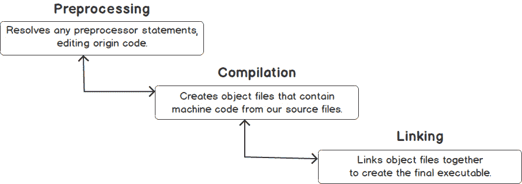

图 1.3:编译和链接的各个步骤

这三个步骤是每个 C++ 应用程序都要经历的，无论是单文件程序，比如“Hello World！”我们已经讨论过的程序，或者你可能在现实应用中看到的几千个文件的应用程序；这些基本步骤保持不变。

不同的操作系统有不同的工具集来执行这些操作，覆盖它们不仅会分散编写 C++ 本身的注意力，还可能根据设置产生不同的体验，尤其是因为它们总是在变化。这就是为什么在这本书里我们将使用在线编译器。我们不仅可以直接开始编写代码，而且可以确定每个人都会有相同的结果。

这些过程的概述有望提供一个坚实的基础概述，这样当您将来确实希望编译您的应用程序时，这个过程将是熟悉的，您将了解幕后发生了什么。

# C++ 关键词

**关键词**是 C++ 保留的词。因此，我们不能在我们的应用程序中使用它们，除了它们的预期目的。例如，一个常见的关键字是`if`，因此您将无法定义该名称的变量或函数。正是这些关键词构成了 C++ 语言，通过它们的使用，我们指导我们的程序应该做什么。

语言中定义了许多关键词，在这个早期阶段覆盖所有关键词是没有必要的。相反，让我们看看在接下来的章节中我们会遇到的关键词。

这些词有的定义基本类型，(`bool`、`char`、`int`等)，有的是定义程序流的语句(`if`、`else`、`switch`等)，有的定义对象和范围(`class`、`struct`、`namespace`等)。

我们将在整本书中使用这些词，但现在我们只需要知道这些词是由 C++ 保留的。你可以分辨出来，因为大多数现代文本编辑器会突出这些单词，从而使它们脱颖而出。让我们看看如何在代码编辑器中区分关键词。遵守以下程序:

```cpp
// Keywords example.
#include <iostream>
#include <string>
int main() 
{
    // Data type keywords.
    int myInt = 1;
    double myDouble = 1.5;
    char myChar = 'c';
    bool myBool = true;
    // Program flow keywords.
    if (myBool) 
    {
        std::cout << "true";
    } 
    else 
    {
        std::cout << "false";
    }
    struct myStruct 
    {
        int myInt = 1;
    };
}
```

在编译器窗口中，前面的代码将如下所示:

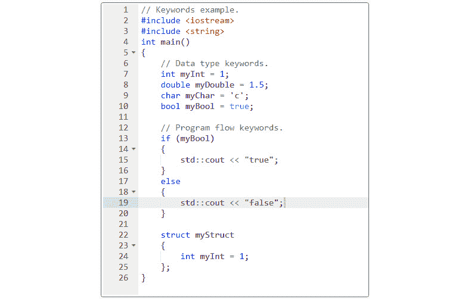

图 1.4:关键词及其突出显示

我们可以看到，这个程序中的关键词在编辑器中被赋予了特殊的呈现方式，通常是不同的颜色，来表示它们的状态。这在 IDEs 之间会有所不同。

注意

IDE 代表集成开发环境，是我们用来开发应用程序的软件。示例 ide 包括 Visual Studio 和 CLion。

## 关键词示例

没有必要逐个浏览每个关键词。我们将在后面介绍它们，但是我们可以快速了解一些常见的关键词组及其功能。

类型关键字表示 C++ 提供的基本变量类型。这些包括`int`、`bool`、`char`、`double`和`float`:

```cpp
    int myInt = 1;
    char myChar = 'a';
    bool myBool = true;
    double myDouble = 1.5;
    float myFloat = 1.5f;
```

程序流关键字允许我们构建应用程序的逻辑。其中包括`if`、`else`、`then`和`switch`，如下图所示:

```cpp
    if (expression)
    {
        // do this
    }
    else
    {
        // do this instead.
    }
```

访问修饰符决定了哪些其他类和组件可以看到和不能看到我们的 C++ 变量和函数。当构建类时(我们将很快看到)，我们有三种选择:`public`、`protected`和`private`。正确使用这些修饰符在构建健壮的系统中起着很大的作用，确保我们的数据和功能不会被滥用或危险地误用。这里有一个例子:

```cpp
class MyClass()
{
public:
    int var1; // Accessible to the class, everything that can see MyClass.
protected:
    int var2; // Accessible to the class, and any child classes.
private:
    int var3; // Accessible to the class only.
}
```

修饰符类型改变了我们变量的属性。这些包括`const`、`static`、`signed`和`unsigned`。通过将这些放在变量和函数前面，我们可以改变它们在应用程序中的行为方式，如下例所示:

```cpp
    unsigned int var1 = 1;      // Unsigned means it can only be positive.
    signed int var2 = -1;      // Signed can be both positive or negative.
    const std::string var3 = "Hello World"; // Const means the value                                             // cannot be modified
    static char var4 = 'c';     // Static means the value is shared                                 // between all instances of a given class.
```

# 预处理器指令

这个术语我们已经见过几次了，让我们来看看它的意思。预处理器指令是在编译代码之前运行的语句。这对于一系列不同的事情非常有用，从头文件到选择性代码编译。

## 包括

最常见的指令之一`#include`，我们已经看过了；这里的意思是“T2”。“当预处理运行时，它会将包含文件的内容复制并粘贴到它的位置。这意味着，包含`include`指令的类现在也可以访问该标题中定义的任何函数、变量、类等。

这个指令有两种变体:

```cpp
// Include example.
// Version 1 - Generally for system files.
#include <headerfile>
// Version 2 - Generally for programmer files.
#include "headerfile"
```

在`Version 1`中，您指导预处理器使用预定义的搜索路径来查找文件。这通常用于系统头，例如，这些路径可能由您的 IDE 设置；它们是实现定义的。

在`Version 2`中，你指导预处理器在文件所在的本地开始搜索。这通常用于包含您自己的项目标题。如果搜索失败，它将使用与`Version 1`相同的路径。

## 宏

`#define/#undef`指令允许我们在程序中定义宏。宏的工作原理类似于`#include`语句，因为它替换了内容。您可以定义一个名称，在它后面加上一些数据或功能，然后每当您想要使用该代码时，您可以用它定义的名称来引用它。当预编译器运行时，它将简单地用这个定义的内容替换宏名的实例。

宏的定义如下:

```cpp
#define name content
```

有了这个，前面代码中`name`的任何实例都将被`content`直接替换。让我们举一个简单的定义单词的例子:

```cpp
// Macro example 1 - Defining a value.
#include <iostream>
#include <string>
#define HELLO_WORLD "Hello World!"
int main()
{
    std::cout << HELLO_WORLD;
}
```

有了我们的宏，我们的输出行直接相当于以下内容:

```cpp
    std::cout << "Hello World!";
```

如果我们在在线编译器中运行这段代码，我们可以看到这一点。如您所见，我们可以在任何想要使用该字符串的地方获得输出`Hello World!`，我们可以使用宏来代替。

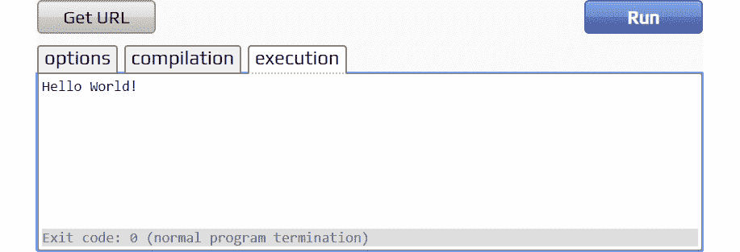

图 1.5:使用宏的 Hello World 输出

除了定义单个值，我们还可以定义功能，如下面的代码片段所示:

```cpp
// Macro example 2 - Defining functionality
#include <iostream>
#define MULTIPLY(a,b) (a * b)
int main()
{
    std::cout << MULTIPLY(3, 4);
}
```


图 1.6:使用宏定义乘法功能

注意

通过宏定义功能的一个显著好处是速度，因为它减少了函数调用的开销。然而，有一种更好的方法来实现这一点，那就是使用内联函数。

一旦定义，就可以使用`#undef`指令来定义宏。这将删除分配给宏的值/功能。如果在任何地方调用此宏，将会出现错误，因为它不再包含有效值。

我们可以通过第一个例子看到这一点。假设我们使用宏对`std::cout`进行了两次调用，但是在这两次调用之间，我们取消了宏的定义:

```cpp
// Macro example 3 – Undefined macro.
#include <iostream>
#include <string>
#define HELLO_WORLD "Hello World!"
int main()
{
    std::cout << HELLO_WORLD;
    #undef HELLO_WORLD
    std::cout << HELLO_WORLD;
}
```

当我们这次运行代码时，您会期望什么行为？


图 1.7:编译错误，因为“HELLO_WORLD”未定义

正如我们所看到的，第一次通话仍然正常。当编译器命中该行时，`HELLO_WORLD`仍然被定义。然而，当我们第二次调用时，`HELLO_WORLD`还没有定义，所以编译器抛出了一个错误。可以使用这种宏的一个例子是调试行为。您可以定义一个宏`DEBUG`，等于`1`，并在需要的地方使用它在应用程序中生成调试代码，在不需要的地方使用它`#undef`。

当我们开始使用宏时，定义它们是至关重要的，所以让我们看看如何确保这一点。

## 条件编译

我们刚刚看到，如果我们试图使用一个没有定义的宏，编译器会抛出一个错误。值得庆幸的是，我们有`#ifdef` / `#endif`指令来帮助我们防止这种情况，让我们检查当前是否定义了给定值。

如果我们举最后一个例子，我们得到了一个编译器错误，但是通过使用这些新的语句来防止这个错误，我们可以满足编译器，如下面的代码所示:

```cpp
// Macro example 4 – Ifdef macro.
#include <iostream>
#include <string>
#define HELLO_WORLD "Hello World!"
int main()
{
    #ifdef HELLO_WORLD
        std::cout << HELLO_WORLD;
    #endif
    #undef HELLO_WORLD
    #ifdef HELLO_WORLD
        std::cout << HELLO_WORLD;
    #endif
}
```

如果我们修改我们的程序并运行前面的代码，我们可以看到编译器现在满足了，并将正确运行程序，完全跳过第二个输出:


图 1.8:防止使用未定义的宏

这里发生的是`#ifdef` / `else`指令中的代码没有被编译到我们的最终程序中，如果当时没有定义指定的宏的话。我们还有可用的`#ifndef` 指令，用于检查该值是否未定义。这与`#ifdef`的用法相同，但明显返回相反的值；`true`当值未定义时，`false`如果是。

可以想象，我们可以将这些用于很多事情，并且还有其他指令允许我们用任何`constant`表达式来做这件事，而不仅仅是检查某个东西是否被定义。这些是`#if`、`#else`和`#elif`。

注意

常量表达式只是一个表达式，它的值可以在编译时(在程序运行之前)确定。

下面的程序展示了如何使用这些预处理器指令来操作编译到我们程序中的代码的例子:

```cpp
// Conditional compilation example.
#include <iostream>
#define LEVEL 3
int main()
{
    #if LEVEL == 0
        #define SCORE 0
    #else
    #if LEVEL == 1
        #define SCORE 15
    #endif
    #endif
    #if LEVEL == 2
        #define SCORE 30
    #elif LEVEL == 3
        #define SCORE 45
    #endif
    #ifdef SCORE
        std::cout << SCORE;
    #endif
}
```

这里，我们使用`LEVEL`宏的值来确定我们给`SCORE`宏什么值。让我们将这段代码复制到编译器中，看看它是如何工作的。改变`LEVEL`的值，看看这对输出有什么影响。

注意

如果我们使用`#if`和`#else`，每一个都需要自己匹配的对`#endif`的调用。`#elif`不是这样。

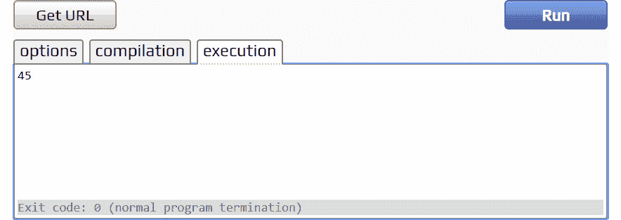

图 1.9:我们可以使用宏来确定编译了什么代码

正如我们所看到的，通过改变`LEVEL`的值，我们可以改变哪些代码最终被编译到我们的应用程序中。这在实践中的一个常见用途是编译特定于平台的东西。

假设您有一个函数需要在 OSX 和 Windows 之间做一些稍微不同的事情。解决这个问题的一种方法是将每个函数定义包装在一个平台定义中，以便为每个平台编译正确的函数。以下是该功能的一个示例:

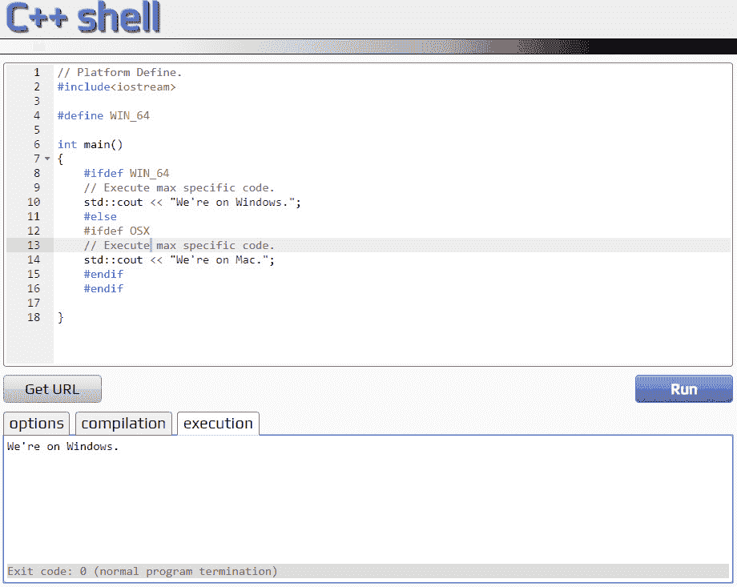

图 1.10:使用定义运行基于操作系统的特定代码

注意

使用`#ifdef`时没有`#elif`的等价物。相反，我们只需链接`#ifdef` / `#endif` 语句。

现在我们已经对预处理器指令有了一个基本的了解，我们将通过编写一个通过它们定义值的程序来应用我们所学的一些概念。

## 练习 2:使用预处理器指令定义值

在本练习中，我们将构建一个小应用程序，给考试分数一个字母等级。我们将在宏中定义分数阈值，并使用它们来分配分数:

注意

这个练习的完整代码可以在这里找到:[https://packt.live/2rZFyqB](https://packt.live/2rZFyqB)。

1.  We'll start by including our `iostream` and string headers, and defining our grade macros:

    ```cpp
    // Preprocessor directives activity.
    #include <iostream>
    #include <string>
    #define GRADE_C_THRESHOLD 25
    #define GRADE_B_THRESHOLD 50
    #define GRADE_A_THRESHOLD 75
    ```

    定义你认为合适的阈值。

2.  Allow the user of the program to input their test score by typing in the following code:

    ```cpp
    int main()
    {
        int value = 0;
        std::cout << "Please enter test score (0 - 100): ";
        std:: cin >> value;
    ```

    不要担心我们还没有涵盖我们将要使用的 IO 语句。我们接下来会报道他们。

3.  Output the grade the user got based on their test score.

    这是我们使用前面定义的值的地方。通过在宏中定义这些，我们可以在以后很容易地更新它们。这很好，因为它允许我们在一个位置修改阈值。因此，使用这些宏的所有地方都将被更新。使用以下代码来完成此操作:

    ```cpp
        if (value < GRADE_C_THRESHOLD) 
        {
            std::cout << "Fail";
        } 
        else if (value < GRADE_B_THRESHOLD) 
        {
            std::cout << "Pass: Grade C";
        } 
        else if (value < GRADE_A_THRESHOLD) 
        {
            std::cout << "Pass: Grade B";
        } 
        else 
        {
            std::cout << "Pass: Grade A";
        }
    }
    ```

4.  完整的代码如下:

    ```cpp
    // Preprocessor directives activity.
    #include <iostream>
    #include <string>
    #define GRADE_C_THRESHOLD 25
    #define GRADE_B_THRESHOLD 50
    #define GRADE_A_THRESHOLD 75
    int main() 
    {
        int value = 0;
        std::cout << "Please enter test score (0 - 100): ";
        std::cin >> value;
        if (value < GRADE_C_THRESHOLD) 
        {
            std::cout << "Fail";
        } 
        else if (value < GRADE_B_THRESHOLD) 
        {
            std::cout << "Pass: Grade C";
        } 
        else if (value < GRADE_A_THRESHOLD) 
        {
            std::cout << "Pass: Grade B";
        } 
        else 
        {
            std::cout << "Pass: Grade A";
        }
    } 
    ```

5.  Now let's run our program. If a user inputs a score between 1-100, we can provide them with a letter grade. For an input of **50**, you will obtain the following output:

    

图 1.11:给用户的测试分数分配一个字母等级

# 基本输入/输出语句

I/O 代表**输入/输出**，是我们从程序中获取信息的方式。这可以采取多种形式，从通过键盘输入文本，到用鼠标点击按钮，再到加载文件，等等。在本章中，总的来说，我们将继续讨论文本输入/输出。为此，我们将使用`iostream`标题。

在本节中，我们将直接从输入中读取，很少或没有数据验证。然而，在工作应用程序中，输入将被严格验证，以确保其格式正确。我们缺乏这一点严格来说只是为了举例。

`iostream`头包含我们通过键盘与应用程序接口所需的一切，允许我们将数据输入和输出应用程序。这是通过`std::cin`和`std::cout`对象完成的。

注意

这里的`std::`前缀表示命名空间。这将在本书后面更深入地讨论，但目前我们只能知道他们习惯于分组代码。

有几种方法可以从键盘上读取数据。首先，我们可以使用`std::cin`和提取操作符:

```cpp
    std::cin >> myVar
```

这将把您的输入放入`myVar`变量，并且对字符串和整数类型都有效。

观察以下包含`std::cin`对象的代码:

```cpp
// Input example.
#include <iostream>
#include <string>
int main()
{
    std::string name;
    int age;
    std::cout << "Please enter your name: ";
    std::cin >> name;
    std::cout << "Please enter you age: ";
    std::cin >> age;
    std::cout << name << std::endl;
    std::cout << age;
}
```

如果我们在编译器中运行这段代码，我们可以看到我们可以输入我们的详细信息，并将它们打印回我们:

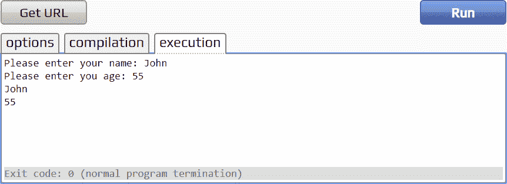

图 1.12:基本输入输出系统

如果您试图输入一个带有空格的名称，您将遇到一个问题，即只捕获了第一个名称。这让我们对`std::cin`是如何工作的有了更多的了解；即当遇到终止字符(空格、制表符或新行)时，它将停止捕获输入。我们现在可以明白为什么只有我们的名字被正确地捕获了。

知道提取`>>`操作符可以被链接也是有用的。这意味着以下两个代码示例是等效的:

**例 1** :

```cpp
    std::cin >> myVar1;
    std::cin >> myVar2;
```

**例 2** :

```cpp
    std::cin >> myVar1 >> myVar2;
```

为了避免遇到终止字符(如空格)时字符串被切断，我们可以使用`getline`函数将用户输入的全部内容拉进一个变量中。让我们使用这个函数更新我们的代码来获取用户名:

```cpp
    std::cout << "Please enter your name: ";
    getline(std::cin, name); 
```

如果我们再次运行代码，我们现在可以看到我们可以在名字中使用空格，并且`getline()`将捕获整个输入。使用`getline()`更好，因为这意味着我们不必担心直接使用`cin`提取会带来的线路问题。

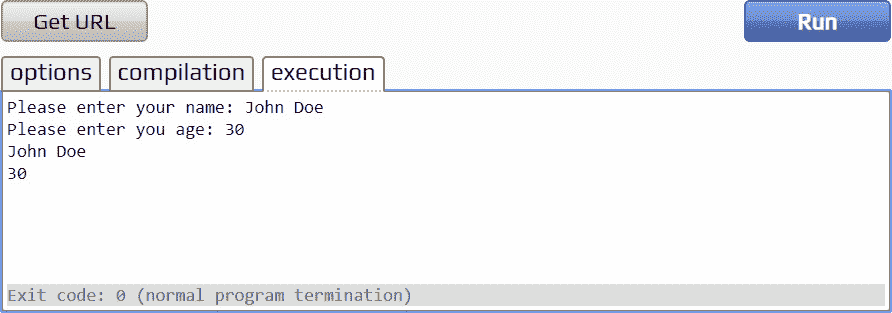

图 1.13:使用 getline()捕获整个输入

当我们使用`getline()`时，我们将用户的输入读入一个字符串，但这并不意味着我们不能用它来读取整数值。要将一个字符串值转换成它的整数等价物，我们有`std::stoi`函数。例如，字符串“`1`”将作为`int 1`返回。将其与`getline()`结合是解析整数输入的好方法:

```cpp
    std::string inputString = "";
    int inputInt = 0;
    getline(std::cin, inputString);
    inputInt = std::stoi(inputString);
```

无论我们使用哪种方法，我们都需要确保正确处理字符串和数值。例如，也许我们有一些期望用户输入数字的代码:

```cpp
    int number;
    std::cout << "Please enter a number between 1-10: ";
    std::cin >> number;
```

如果用户在这里输入一个字符串，也许他们输入`five`而不是输入数字，程序不会崩溃，但是我们的`number`变量不会被赋值。这是我们从用户那里获得输入时需要注意的事情。在我们尝试在程序中使用它之前，我们需要确保它的格式正确。

输出文本就像调用`std::cout`一样简单，使用插入操作符`<<`来传递我们的数据。这将同时接受字符串和数值，因此以下两个代码片段都将按预期工作:

```cpp
    std::cout << "Hello World";
    std::cout << 1;
```

与提取操作一样，插入操作符可以被链接以构建更复杂的输出:

```cpp
    std::cout << "Your age is " << age;
```

最后，当输出文本时，有时我们想要开始一个新行或者插入一个空白行。对此，我们有两个选择，`\n`和`std::endl`。这两个都将结束当前行并移动到下一行。鉴于此，以下代码片段给出了相同的输出:

```cpp
    std::cout << "Hello\nWorld\n!";
    std::cout << "Hello" << std::endl << "World" << std::endl << "!";endl
```

如前所述，还有其他类型的输入和输出与应用程序相关联；然而，大多数情况下，IO 将通过某种形式的 UI 得到促进。就我们的目的而言，这两个基本对象`std::cin` / `std::cout`就足够了。

我们将在下一个练习中应用我们对`getline()`方法和`std::cin`、`std:cout`和`std::endl` 对象的知识。

## 练习 3:阅读用户详细信息

在本练习中，我们将编写一个应用程序，允许您输入全名和年龄。然后我们将把这些信息打印出来，格式化成完整的句子。执行以下步骤完成练习:

注意

这个练习的完整代码可以在这里找到:[https://packt.live/37qJdhF](https://packt.live/37qJdhF)。

1.  Define the `firstName`, `lastName`, and `age` variables, which will hold our user's inputs, as shown in the following snippet:

    ```cpp
    // IO Exercise.
    #include <iostream>
    #include <string>
    int main()
    {
        std::string firstName;
        std::string lastName;
        int age;
    ```

    注意

    我们将在后面的章节中介绍数据类型，所以如果目前还不清楚这些变量类型的确切性质，请不要担心。

2.  输入以下代码，要求用户输入自己的名字:

    ```cpp
        std::cout << "Please enter your first name(s): ";
        getline(std::cin, firstName);
    ```

3.  We'll do the same for surnames, again using `getline()` using the following snippet:

    ```cpp
        std::cout << "Please enter your surname: ";
        getline(std::cin, lastName);
    ```

    对于我们的最终输入，我们将允许用户输入他们的年龄。对此，我们可以直接使用`cin`，因为这是我们的最后一次输入，所以我们不需要担心终止行字符，我们期待一个单一的数值。

4.  Type the following code to have the user input their age:

    ```cpp
        std::cout << "Please enter your age: ";
        std::cin >> age;
    ```

    注意

    同样，这只是因为我们正在编写简单的示例程序，所以我们信任用户输入正确的数据，而不做任何验证。在生产环境中，所有用户输入数据在使用前都将经过严格验证。

5.  最后，我们将把这些信息呈现给用户，利用链式插入来格式化完整的字符串和句子，代码如下:

    ```cpp
        std::cout << std::endl;
        std::cout << "Welcome " << firstName << " " << lastName               << std::endl;
        std::cout << "You are " << age << " years old." << std::endl;
    ```

6.  完整的代码如下:

    ```cpp
    // IO Exercise.
    #include <iostream>
    #include <string>
    int main() 
    {
        std::string firstName;
        std::string lastName;
        int age;
        std::cout << "Please enter your first name(s): ";
        getline(std::cin, firstName);
        std::cout << "Please enter your surname: ";
        getline(std::cin, lastName);
        std::cout << "Please enter your age: ";
        std::cin >> age;
        std::cout << std::endl;
        std::cout << "Welcome " << firstName << " " << lastName               << std::endl;
        std::cout << "You are " << age << " years old." << std::endl;
    }
    ```

7.  Run our application now and test it with some data.

    对于我们的测试数据(易小轩·多伊，年龄:30 岁)，我们获得以下输出:

    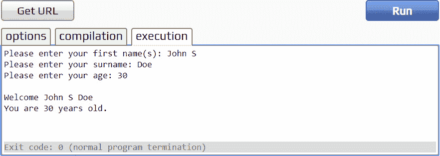

图 1.14:一个允许用户输入各种细节的小应用程序

因此，随着本练习的完成，我们已经通过基本的输入输出系统整合了一个小程序，允许用户输入一些个人信息。我们现在将进入下一个主题——函数。

# 功能

**c++ 中的函数**将我们的代码封装成功能的逻辑单元。然后我们可以调用这些函数，而不是在整个项目中使用重复的代码。例如，考虑一个小应用程序，它询问用户的姓名，问候他们，然后将该姓名存储在列表中，如下面的代码片段所示:

```cpp
    // Get name.
    std::cout << "Please enter your name: " << "\n";
    getline(std::cin, name);
    std::cout << "Welcome " << name << ".\n";
    names.push_back(name);
```

这是我们在应用程序的生命周期中可能要多次调用的代码，所以它是一个很好的函数候选。这样做的好处是，它减少了应用程序中的重复代码，为我们提供了一个可以维护代码和修复任何错误的地方。如果它在整个代码库中被复制，任何时候你想要升级它或者修复某个东西，你必须找到所有的实例并对每个实例执行。

一个函数被分成两部分:一个**声明**和一个**定义**。在函数声明中，您声明了关于该函数如何工作的最基本信息，即函数将返回的值类型、函数名称和任何参数。函数行为的实际逻辑由定义决定。让我们分解一个函数声明。

函数声明如下:

```cpp
return_type function_name(parameters);
```

*   **return_type** :这是您将从函数中返回的值的类型。如果不想返回任何内容，也可以返回`void`，一个 C++ 关键字。例如，如果您有一个将两个数字相加的函数，返回类型可能是`integer`。
*   **函数名**:这是函数的名字，也是你在代码中引用它的方式。
*   **参数**:这些是传递给函数的一组可选值。同样，以两个数字相加为例，您将有两个`integer`参数:您的第一个和第二个数字。

这个声明通常和其他函数声明一起存在于头文件(`.h`)中，然后它们被定义在`.cpp`文件中。*这就是为什么我们经常看到#include 指令*。我们在头文件中声明对象的功能，然后实际定义它们在`.cpp`文件中的工作方式。我们通常将它们分成单独的文件，因为这样可以隐藏实现细节。通常情况下，头文件是公开的，所以我们可以看到对象的功能并使用它，但是该功能的确切实现是保密的。

注意

我们暂时不担心这个。因为我们在一个文件中工作，所以我们将同时定义和声明函数，而不是单独定义和声明。

让我们回到前面的例子，我们可以获取允许用户输入姓名的代码片段，并在如下代码片段所示的函数中定义姓名:

```cpp
void GetNextName()
{
    std::string name;
    std::cout << "Please enter your name: " << "\n";
    getline(std::cin, name);
    std::cout << "Welcome " << name << ".\n";
    names.push_back(name);
}
```

现在，每次我们需要这个功能时，我们可以只调用这个函数。该函数提供了自己的变量`name`，供我们使用，但注意`names`变量是从主程序中使用的。这是可能的，因为它在函数的范围内。范围将在后面的章节中详细介绍，但是目前我们只能观察到`name`变量是在函数内部定义的，而`names`是在函数外部定义的。

很容易想象，现在我们没有重复的代码，只有对同一个函数的多次调用，这要整洁得多。这使得我们的代码更易读、更易维护、更容易调试。重构代码的这个过程叫做重构。我们应该始终致力于编写易于维护、调试和扩展的代码，良好的结构在其中起着重要作用。

## 通过值传递，通过引用传递

函数参数是我们传递给函数的值。如果我们认为我们的函数是一个离散的功能，那么我们的参数允许我们给它运行所需的东西。将参数传递给函数有两种方式，一种是通过值传递，另一种是通过引用传递，了解两者的区别很重要。

当我们通过值将一个参数传递给一个函数时，这意味着我们正在制作一个副本，并将使用它。可视化的最简单方法是编写一个小的测试应用程序。请遵守以下代码:

```cpp
// Pass by value-by-reference example.
#include <iostream>
#include <string>
void Modify(int a)
{
    a = a - 1;
}
int main()
{
    int a = 10;
    Modify(a);
    std::cout << a;
}
```

在这个简单的程序中，我们将一个数字定义为 10，将其传递给一个将从中减去 1 的函数，然后打印该值。因为我们从 10 开始，减去 1，所以可以合理地预计输出为 9。然而，当我们运行前面的代码片段时，我们获得了以下输出:

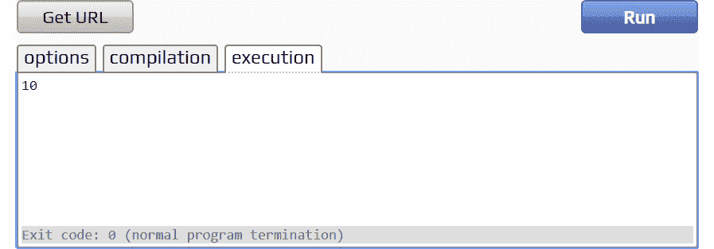

图 1.15:通过价值传递意味着变化不会持续

### 为什么我们输出 10？

因为当我们将`a`变量传递到函数中时，它是通过值传递的。该函数创建了`a`的本地副本，在本例中为 10，然后它对该值所做的任何事情都与我们传入的原始`a`值完全分离。

通过引用传递与此相反，表示“实际处理这个变量；不要复制。”同样，这是最容易看到的行动。让我们对我们的代码进行以下修改:

```cpp
void Modify(int& a)
```

一个非常微妙的变化，但是我们在这里所做的是在函数中的`int`类型之后添加`&`。这个符号的意思是“的地址”我们在书中后面的章节会更详细地介绍记忆，所以我们在这里保持轻松，但实际上它的意思是，“不要复制；实际使用这个值。”

让我们在做了这些更改后重新运行代码。

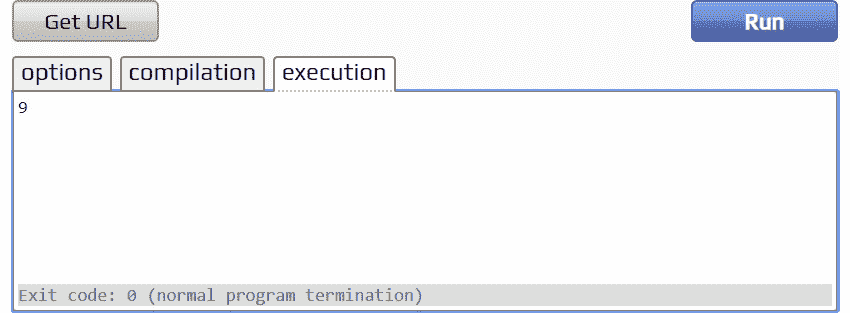

图 1.16:因为我们现在是通过引用传递的，所以变化确实存在

通过价值或参考传递是一个需要理解的重要概念。如果您正在处理大对象，传递值可能会很昂贵，因为必须构建/解构临时对象。这是另一个主题，将在后面的章节中介绍。目前，去掉值可以通过值或引用传递的事实(正如我们在这里看到的)就足够了。我们稍后将在此基础上进行构建。

## 功能过载

编写函数来封装我们的行为是朝着创建通用和可维护的代码迈出的一大步。然而，我们可以做得更多；我们可以让他们超负荷工作。在这种情况下，重载意味着提供多个版本的函数。假设我们定义一个简单的函数来乘以两个数字:

```cpp
int Multiply(int a, int b)
{
    return a * b;
}
```

这个函数的参数是类型`int`，那么如果我们想要乘以`float`类型或者`double`会发生什么呢？在这种情况下，它们会被转换成整数，我们会失去精度，这不是我们通常想要的。为了解决这个问题，我们可以提供函数的另一个声明，具有相同的名称，可以使用这些类型。我们的函数声明如下所示:

```cpp
int Multiply(int a, int b);
float Multiply(float a, float b);
double Multiply(double a, double b);
```

最棒的是我们不需要担心调用这个函数的正确版本。如果我们提供了正确的类型，编译器会自动为我们调用合适的函数。我们可以通过一个简单的测试看到这一点。我们可以为其中的每一个创建函数定义，并为每一个添加唯一的输出，这样我们就可以知道哪个被击中了。

下面是一个如何做到这一点的例子:

```cpp
// Function overloading example.
#include <iostream>
#include <string>
int Multiply(int a, int b)
{
    std::cout << "Called the int overload." << std::endl;
    return a * b;
}
float Multiply(float a, float b)
{
    std::cout << "Called the float overload." << std::endl;
    return a * b;
}
double Multiply(double a, double b)
{
    std::cout << "Called the double overload." << std::endl;
    return a * b;
}
int main()
{
    Multiply(3, 4);
    Multiply(4.f, 6.f);
    Multiply(5.0, 3.0);
    return 0;
}
```

在前面的代码中，我们有我们的重载函数和对它的三个调用，每个调用都有不同的类型。运行此应用程序时，将获得以下输出:


图 1.17:编译器知道要调用哪个版本的函数

正如我们所看到的，编译器知道调用哪个版本的函数，因为我们在每种情况下都匹配指定的参数类型。一个`multiply`函数有点多余，当然这是一个简单的用例，但是很好地展示了我们如何使我们的函数更加有用和灵活。

实现这种灵活性的另一种方法是通过模板。不是为每种类型重载一个函数，而是用一个模板创建一个单一的、高度通用的函数版本，可以接受任何类型。模板将在后面的章节中介绍。

## 默认参数

另一个让我们的函数更灵活的方法是使用默认参数。这允许我们将一些参数设置为可选的，我们通过在声明中给它们一个默认值来实现，如下所示:

```cpp
return_type function_name(type parameter1, type parameter2 = default value);
```

现在可以通过两种方式调用该函数:

```cpp
function_name(value1, value2);
```

在这种情况下，两个参数值都正常传递到函数中:

```cpp
function_name(value1);
```

在这种情况下，由于省略了第二个参数，因此将使用默认值。能够提供默认参数使我们的函数能够更加灵活，但这是有限度的。一个函数的重点是巧妙地封装某个行为，所以我们不想让它变得如此灵活，以至于它开始负责多个行为。在这种情况下，最好创建一个新的离散函数。

让我们用另一个练习快速看一下这个例子。

## 练习 4:功能

在本练习中，我们将定义并使用一个函数，该函数将输出两个数字中较大的一个。这个函数需要一个返回类型和两个参数。执行以下步骤完成练习:

注意

这个练习的完整代码可以在这里找到:[https://packt.live/346VDJv](https://packt.live/346VDJv)。

1.  Declare the function, assigning its return type, name, and parameters:

    ```cpp
    #include<iostream>
    int Max(int a, int b)
    ```

    正如我们之前看到的，如果我们纯粹在头文件中声明这个函数，我们会在它的末尾添加一个分号，并在其他地方定义它。然而，既然不是这样，我们就直接打开花括号并定义我们的功能。

2.  定义函数的行为。我们想要返回具有最高值的数字，所以这个的逻辑很简单，如下例所示:

    ```cpp
    int Max(int a, int b)
    {
        if (a > b)
        {
            return a;
        }
        else
        {
            return b;
        }
    }
    ```

3.  现在我们需要做的就是从用户那里得到两个数字。本章前面我们已经介绍了 IO，所以我们应该对此感到满意:

    ```cpp
    int main()
    {
        int value1 = 0;
        int value2 = 0;
        std::cout << "Please input number 1: ";
        std::cin >> value1;
        std::cout << "Please input number 2: ";
        std::cin >> value2;
    ```

4.  最后，我们需要向用户输出答案。我们之前也讨论过这个问题，但是这次，我们将调用我们的新函数，传递用户的号码:

    ```cpp
        std::cout << "The highest number is " << Max(value1, value2);
    }
    ```

    ，而不是在我们的`cout`语句中使用变量
5.  完整的代码如下:

    ```cpp
    // IO Exercise.
    #include <iostream>
    #include <string>
    int Max(int a, int b) 
    {
        if (a > b) 
        {
            return a;
        } 
        else 
        {
            return b;
        }
    }
    int main() 
    {
        int value1 = 0;
        int value2 = 0;
        std::cout << "Please input number 1: ";
        std::cin >> value1;
        std::cout << "Please input number 2: ";
        std::cin >> value2;
        std::cout << "The highest number is " << Max(value1, value2);
    }
    ```

6.  Run this in the compiler and test it with some numbers.

    对于我们的测试用例(1 和 10)，我们获得了以下输出:

    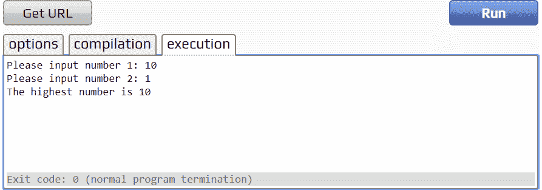

图 1.18:我们可以将函数视为其返回类型，在本例中为 int，并输出该值

通过将我们的代码拉成这样的函数，我们能够从很少的代码中获得广泛的功能。不仅如此，通过将该功能本地化为单个功能，我们给自己一个单点故障，这更容易调试。理论上，我们还获得了一段可重用的代码，可以部署在任何地方。好的程序架构是一门艺术，一种随着时间和经验发展的技能。

注意

我说“理论上”是因为虽然在这种非常简单的情况下，代码可以很容易地移动和重用，但在更大的系统中，情况往往不是这样。即使是简单的功能最终也是如此根深蒂固地存在于系统中(并被依赖关系所束缚)，以至于不容易在其他地方重新使用它。

分解了 C++ 应用程序的核心元素后，让我们看看如何从头开始编写我们自己的小应用程序，将我们在第一章中学到的一切付诸实践。

## 活动 1:编写自己的 C++ 应用程序

这项活动的目的是编写一个系统，询问用户的名字和年龄。用户将根据年龄分组，我们将使用宏来定义这些年龄段。我们将使用函数封装任何重复的功能，将用户的信息打印回给他们，以及他们分配的组(其名称也由您决定)。我们期望的结果将是一个小程序，能够将用户分类成组，如下面的截图所示:


图 1.19:我们的程序询问用户的姓名和年龄，并将他们分配到适当的组

在开始之前，请确保之前的所有练习都已完成，因为本练习将测试我们在本介绍性章节中介绍的许多主题。以下是完成活动的步骤:

注意

这个活动的代码可以在这里找到:[https://packt.live/2QD64k4](https://packt.live/2QD64k4)。

1.  使用`#defines`定义你的年龄段阈值。
2.  Define a name for each group using `#defines`.

    提示:复习*练习 2* 、*用预处理器指令*定义值来完成这一步。

3.  输出询问用户姓名的文本，并在变量中捕获响应。
4.  输出询问用户年龄的文本，并在变量中捕获响应。
5.  编写一个函数，接受年龄作为参数，并返回适当的组名。
6.  Output the user's name and the group that they have been assigned to.

    提示:复习*练习* *2* 和 *3* 完成第 4、5、6 步。

这个小程序涉及到我们在这一章介绍的所有内容。我们使用预处理器语句来定义一些应用程序数据，使用 IO 语句来获取应用程序中的数据，并将代码整齐地封装在函数中。在继续之前，请随意花一些时间使用这个应用程序，并根据自己的需要进行扩展。

注意

这个活动的解决方案可以在第 514 页找到。

# 总结

在第一章中，我们了解了一些 C++ 的历史，涵盖了它在多个行业中的各种应用，并解构了一个示例程序。这使我们能够识别组成 C++ 应用程序的核心组件和概念。

首先，我们讨论了这种语言的历史，看看它旨在解决的问题。有了这个上下文，我们解构了一个示例应用程序，确定了 C++ 应用程序的关键特性。

现在确定了这些关键概念，我们开始更详细地研究每个概念。我们学习了一些常见的 C++ 关键字以及它们的作用。我们研究了预处理器指令，以及如何在编译代码之前使用它们来执行操作。然后，我们查看基本的 IO 语句，使用`std::cin`和`std::cout`从我们的应用程序中获取信息。最后，我们研究了函数，我们可以将行为封装成良好的可重用代码块的方法。

为了将所有这些付诸实践，我们以一个编程任务结束，在这个任务中，我们从一个集合概要构建了一个应用程序。通过开发一个应用程序，允许用户输入他们的详细信息，然后将他们分组，我们将所学的技能付诸实践。

有了对 C++ 应用解剖的基本理解，我们现在可以开始深入研究 C++ 的语言特性和工具了。获得对应用程序的初步理解是必要的，这样我们就能理解我们的应用程序是如何构建和运行的。接下来，我们将关注控制流——我们控制哪些代码执行以及何时执行的方法，从而允许我们构建更大、更复杂的应用程序。