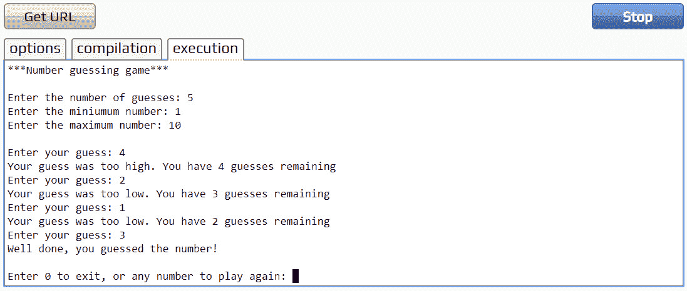
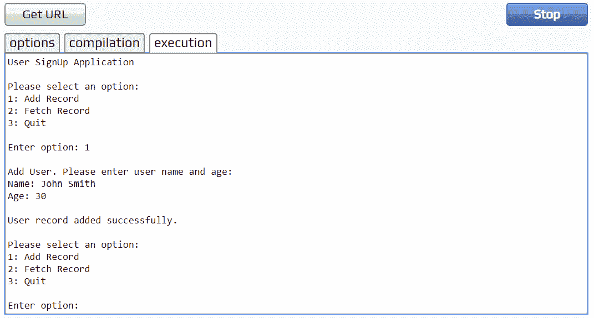
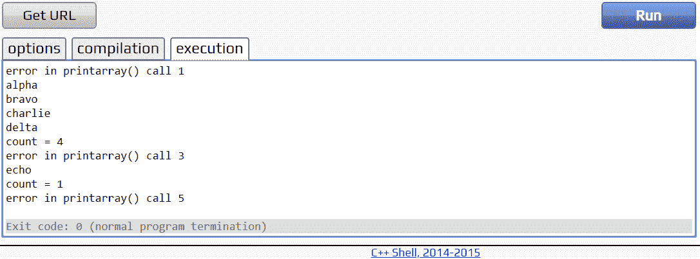
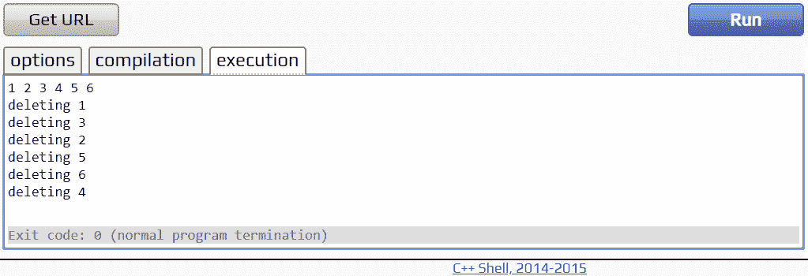
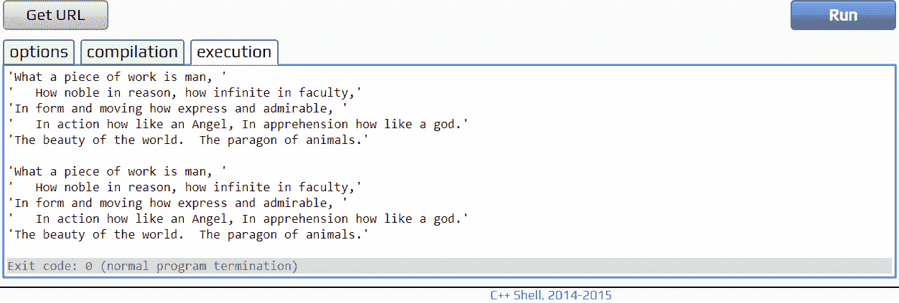
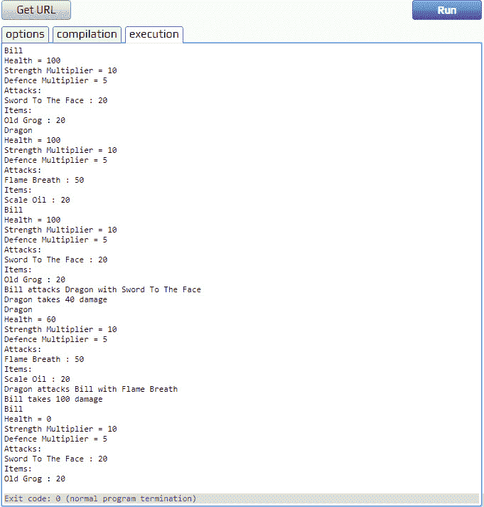
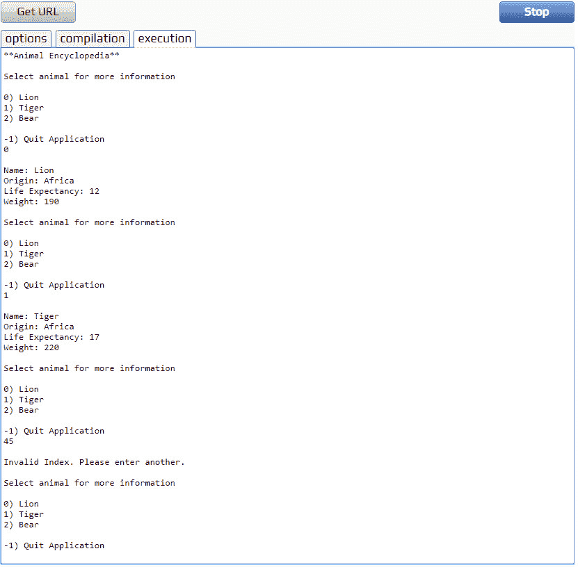

# 附录

## 关于

包括这一部分是为了帮助学生完成书中的活动。它包括学生完成和实现本书目标的详细步骤。

# 1.您的第一个 C++ 应用

## 活动 1:编写自己的 C++ 应用

**解决方案**:

1.  使用`#defines`定义你的年龄段阈值。
2.  Define a name for each group using `#defines`.

    以下是步骤 1 和 2 所需的代码:

    ```cpp
    // Activity 1\. 
    #include <iostream>
    #include <string>
    #define GROUP_1_THRESHOLD 12
    #define GROUP_2_THRESHOLD 28
    #define GROUP_1_NAME "Group A"
    #define GROUP_2_NAME "Group B"
    #define GROUP_3_NAME "Group C"
    ```

3.  输出一个文本字符串，询问用户的姓名，并在变量中捕获响应。
4.  输出询问用户年龄的文本，并在变量中捕获响应。
5.  编写一个函数，接受年龄作为参数，并返回适当的组名。
6.  Output the user's name, and the group that they have been assigned to.

    以下是执行步骤 3-6 所需的代码:

    ```cpp
    std::string GetGroup(int age);
    int main()
    {
        std::string name = "";
        int age = 0;
        std::string group = "";
        std::cout << "Please enter your name: ";
        getline(std::cin, name);
        std::cout << "And please enter your age: ";
        std::cin >> age;
        group = GetGroup(age);
        std::cout << "Welcome "<< name << ". You are in "               << group << ".\n";
    }
    std::string GetGroup(int age)
    {
        if (age <= GROUP_1_THRESHOLD)
        {
            return GROUP_1_NAME;
        }
        else if (age <= GROUP_2_THRESHOLD)
        {
            return GROUP_2_NAME;
        }
         else
        {
            return GROUP_3_NAME;
        }
    }
    ```

7.  Run the complete code. You will obtain the following output:

    

图 1.20:我们的程序询问用户的姓名和年龄，并将他们分配到适当的组

# 2.控制流

## 活动 2:使用循环和条件语句创建猜数字游戏

**解决方案**:

1.  声明我们需要的所有变量。这包括`guessCount`、`minNumber`、`maxNumber`和`randomNumber` :

    ```cpp
    // Activity 2: Number guessing game.
    #include <iostream>
    #include <string>
    int main()
    {
        // Declare variables.
        int guessCount = 0;
        int minNumber = 0;
        int maxNumber = 0;
        int randomNumber = 0;
        std::string input = "";
        bool bIsRunning = true;
    ```

2.  创建一个运行应用的主外部循环:

    ```cpp
        while (bIsRunning)
        {
        }
    ```

3.  Present the user with some introductory text (`"Enter the number of guesses"`) and get from them the following: a number of guesses, a minimum number, and a maximum number:

    ```cpp
        while (bIsRunning)
        {
            // Output instructions and get user inputs.
            std::cout << "***Number guessing game***\n";
            std::cout << "\nEnter the number of guesses: ";
            getline(std::cin, input);
            guessCount = std::stoi(input);

            std::cout << "Enter the minimum number: ";
            getline(std::cin, input);
            minNumber = std::stoi(input);

            std::cout <<"Enter the maximum number: ";
            getline(std::cin, input);
            maxNumber = std::stoi(input);
        }
    ```

    注意

    我们在这里不做检查，以确保最大数量大于最小数量。这是为了代码简洁，但是在编写产品代码时，总是有必要对用户输入进行健全性检查。

4.  Generate a random number within the range specified by the user:

    ```cpp
        while (bIsRunning)
        {    
            // Output instructions and get user inputs.
            //[…]
            // Generate random number within range.
            srand((unsigned)time(0));
            randomNumber = rand() % (maxNumber - minNumber + 1)         + minNumber;
        }
    ```

    注意

    我们在本章前面使用了同样的方法来生成随机数，因此返回到*练习 2.3* ，*将 if/else 链重构为开关/案例*，以便在必要时进行提醒。

5.  创建一个循环，重复用户指定的猜测次数。
6.  在`count`循环中，获取用户的猜测。
7.  在`count`循环内，检查用户的猜测是否正确，或者过高/过低。我们可以在这里使用`break`在猜对数值后退出。
8.  When the number has been found, or the user has run out of guesses, present them with the option to either continue or exit the application.

    执行步骤 5-8 的代码如下:

    ```cpp
        while  (bIsRunning)
        {
            // Output instructions and get user inputs.
            //[…]
            // Generate random number within range.
            //[…]
            // Process user guesses.
            for (int i = 0; i < guessCount; ++ i)
            {
                int guess = 0;
                std::cout << "\nEnter your guess: ";
                getline(std::cin, input);
                guess = std::stoi(input);
                if (guess == randomNumber)
                {
                    std::cout << "Well done, you guessed the number!\n";
                    break;
                }
                int guessesRemaining = guessCount - (i + 1);
                std::cout << "Your guess was too "                       << (guess < randomNumber ? "low. " : "high. ");
                std::cout << "You have " << guessesRemaining                       << (guessesRemaining > 1 ? " guesses" : "                       guess") << " remaining";
            }
            std::cout << "\nEnter 0 to exit, or any number                   to play again: ";
            getline(std::cin, input);
            if (std::stoi(input) == 0)
            {
                bIsRunning = false;
            }
        }
    ```

9.  Run the complete code. You will obtain the following output:

    

图 2.18:猜数字游戏输出

# 3.内置数据类型

## 活动 3:报名申请

**解决方案**:

1.  首先包含应用需要的各种标题:

    ```cpp
    // Activity 3: SignUp Application.
    #include <iostream>
    #include <string>
    #include <vector>
    #include <stdexcept>
    ```

2.  接下来，定义将在系统中表示记录的类。这将是一个人，包含姓名和年龄。另外，声明一个这种类型的向量来存储这些记录。使用向量是因为它提供了不必预先声明数组大小的灵活性:

    ```cpp
    struct Person
    {
        int age = 0;
        std::string name = "";
    };
    std::vector<Person> records;
    ```

3.  现在，您可以开始添加一些函数来添加和获取记录；首先，补充。记录由名字和年龄组成，所以编写一个函数，接受这两个作为参数，创建一个记录对象，并将其添加到我们的记录向量中。命名该功能`AddRecord` :

    ```cpp
    void AddRecord(std::string newName, int newAge)
    {
        Person newRecord;
        newRecord.name = newName;
        newRecord.age = newAge;
        records.push_back(newRecord);
        std::cout << "\nUser record added successfully.\n\n";
    };
    ```

4.  添加一个函数来获取记录。这个函数应该接受一个参数，一个用户标识，并返回该用户的记录。命名该功能`FetchRecord` :

    ```cpp
    Person FetchRecord(int userID)
    {
        return records.at(userID);
    };
    ```

5.  进入`main`功能，启动应用主体。从一个外部`main`循环开始，就像你在上一章中使用的那样，并向用户输出一些选项。你会给他们三个选择:`Add Record`、`Fetch Record`、`Quit` :

    ```cpp
    int main()
    {
        std::cout << "User SignUp Application\n" << std::endl;
        bool bIsRunning = true;
        while (bIsRunning)
        {
            std::cout << "Please select an option:\n";
            std::cout << "1: Add Record\n";
            std::cout << "2: Fetch Record\n";
            std::cout << "3: Quit\n\n";
    ```

6.  向用户展示这些选项，然后捕捉他们的输入:

    ```cpp
            std::cout << "Enter option: ";
            std::string inputString;
            std::getline(std::cin, inputString);
    ```

7.  现在有三种可能的分支，这取决于用户输入，我们将用`switch`语句来处理。案例 1 是添加一条记录，为此，您将获得用户的姓名和年龄，然后调用我们的`AddRecord`功能:

    ```cpp
            // Determine user selection.
            switch (std::stoi(inputString))
            {
                case 1:
                {
                    std::string name = "";
                    int age = 0;
                    std::cout << "\nAdd User. Please enter                           user name and age:\n";
                    std::cout << "Name: ";
                    std::getline(std::cin, name);
                    std::cout << "Age: ";
                    std::getline(std::cin, inputString);
                    age = std::stoi(inputString);
                    AddRecord(name, age);
                }
                break;
    ```

8.  下一种情况是用户想要获取记录。为此，你需要从用户那里得到一个`userID`，然后打电话给`FetchRecord`，输出其结果:

    ```cpp
                case 2:
                {
                    int userID = 0;
                    std::cout << "\nPlease enter user ID:\n";
                    std::cout << "User ID: ";
                    std::getline(std::cin, inputString);
                    userID = std::stoi(inputString);
                    Person person;
                    try
                    {
                        person = FetchRecord(userID);
                    }
                    catch (const std::out_of_range& oor) 
                    {
                        std::cout << "\nError: Invalid UserID.\n\n";
                    break;
                    }
                    std::cout << "User Name: " << person.name << "\n";
                    std::cout << "User Age: " << person.age << "\n\n";
                }
                break;
    ```

9.  下一种情况是用户想要退出应用。这个相当简单；你只需要退出我们的`main`循环:

    ```cpp
                case 3:
                    bIsRunning = false;
                break
    ```

10.  Finally, add a default case. This will handle invalid options entered by the user. All you'll do here is output an error message and send them back to the start of the application:

    ```cpp
                default:
                    std::cout << "\n\nError: Invalid option                           selection.\n\n";
                break;
                    }
                }
            }
    ```

    有了所有这些，应用应该可以运行了。

11.  运行完整的代码。您将获得以下输出:



图 3.27:我们的应用允许用户添加记录，然后通过一个 ID 调用它们

这个应用是迄今为止我们最复杂的，它汇集了我们到目前为止学到的所有东西；从函数，到控制流、类、范围、IO 等等。我们现在可以看到所有这些不同的元素如何结合在一起，让我们能够构建复杂的系统。这只是开始。我们只介绍了绝对的基础知识，我们已经可以看到如何将这些部分组合在一起来解决现实世界的问题。

# 4.经营者

## 活动 4:嘶嘶嗡嗡

**解决方案**:

1.  像往常一样，我们将从包含应用所需的头开始，并开始我们的主循环:

    ```cpp
    // Activity 4: Fizz Buzz.
    #include <iostream>
    int main()
    {
    ```

2.  接下来，我们将定义我们的循环。我们要打印 100 个数字，所以需要迭代 100 次，从 1:

    ```cpp
        for (int i = 1; i <= 100; ++ i)
        {
    ```

    开始
3.  `Fizz Buzz`应用告诉我们，对于 3 的倍数，我们将打印`Fizz`，对于 5 的倍数，我们将打印`Buzz`。但是，一个数可以同时是 3 和 5 的倍数；例如，15 是两者的倍数，因此我们接下来将定义一个布尔值`multiple`，这将有助于我们跟踪这一点，给它一个初始值`false` :

    ```cpp
        bool multiple = false;
    ```

4.  接下来，我们可以检查我们当前的循环值`i`是否是 3 的倍数。如果是这样，我们将打印单词`Fizz`并将我们的多个布尔值设置为`true` :

    ```cpp
        if (i % 3 == 0)
            {
                std::cout << "Fizz";
                multiple = true;
            }
    ```

5.  然后我们可以对`Buzz`进行同样的操作，检查`i`是否是 5 的倍数。同样，我们将把`multiple`的布尔值设置为`true`，如果是这样的话:

    ```cpp
        if (i % 5 == 0)
            {
                std::cout << "Buzz";
                multiple = true;
            }
    ```

6.  现在我们已经检查了我们的数字是 3 的倍数还是 5 的倍数，并且有一个布尔值，如果是`true`，我们可以用它来确定我们是否打印正常的数字。如果我们的`multiple` `bool`仍然是`false`的话，那么我们知道我们需要打印正常的号码，`i` :

    ```cpp
        if (!multiple)
            {
                std::cout << i;
            }
    ```

7.  最后，我们将做一点格式化。如果我们不在循环的最后一次迭代中，我们将打印一个逗号后跟一个空格。这将使我们的应用在打印时更加整洁:

    ```cpp
        if (i < 100)
            {
                std::cout << ", ";
            }
        }
    }
    ```

8.  Let's run the application now and see it in action. We should see numbers leading up to 100\. Multiples of 3 will be replaced by `Fizz`, multiples of 5 by `Buzz`, and multiples of both by `FizzBuzz`.

    

图 4.16:Fizz Buzz 应用——一个常见的编码测试练习

# 5.指针和引用

## 活动 5:使用指针和引用来操作字符串数组

**解决方案**:

1.  进入骨架`main()`功能:

    ```cpp
    #include <iostream>
    using namespace std;
    int main()
    {
        return 0;
    }
    ```

2.  Above `main()`, create an array of strings:

    ```cpp
    char const* array[26]
    {    "alpha", "bravo", "charlie", "delta", "echo"   };
    ```

    数组长度必须为 26 个元素，否则程序可能会因某些有效参数而崩溃。

3.  进入`printarray()`功能的骨架。定义参数。因为我们打印的是一个字符串数组，所以指针的类型是`char const**`。`count`的论点是`int&`。定义返回类型，在分配中指定为`int`:

    ```cpp
    int printarray(char const** begin, char const** end, int& count)
    {
        return 1;
    }
    ```

4.  清除`count` :

    ```cpp
        count = 0;
    ```

5.  输入代码以检测参数中的错误:

    ```cpp
        if (begin == nullptr || end == nullptr || 
            begin > end || end-begin > 26)
        {
            return 0;
        }
    ```

6.  Enter a loop to control printing:

    ```cpp
        for (count = 0; begin < end; ++ begin)
        {
            if (*begin != nullptr)
            {
                ++ count;
                cout << *begin << endl;
            }
        }
    ```

    有几种方法可以做到这一点。一种自我记录的方法是使用`for`循环，因为`for`循环有初始条件、延续条件和增量。它帮助你记住像这样的任务所需的所有部分。由于`for`循环最初没有任何其他事情要做，将计数设置为零移到`for`语句的初始化槽中。

7.  Inside `main()`, write some tests:

    ```cpp
        int count;
        if (printarray(nullptr, nullptr, count) == 0 || count != 0)
        {
            cout << "error in printarray() call 1" << endl;
        }
        else
        {
            cout << "count = " << count << endl;
        }
    ```

    所有其他测试看起来都差不多:

    ```cpp
        if (printarray(array, &array[4], count) == 0 || count != 4)
        {
            cout << "error in printarray() call 2" << endl;
        }
        else
        {
            cout << "count = " << count << endl;
        }
        if (printarray(&array[4], &array[3], count) == 0 || count != 0)
        {
            cout << "error in printarray() call 3" << endl;
        }
        else
        {
            cout << "count = " << count << endl;
        }
        if (printarray(&array[4], &array[10], count) == 0 || count != 1)
        {
            cout << "error in printarray() call 4" << endl;
        }
        else
        {
            cout << "count = " << count << endl;
        }
        if (printarray(&array[0], &array[100], count) == 0 || count != 0)
        {
            cout << "error in printarray() call 5" << endl;
        }
        else
        {
            cout << "count = " << count << endl;
        }
    ```

8.  Run the program. The output looks like this:

    

图 5.13:使用指针和引用来操作字符串数组

# 6.动态变量

## 活动 6:创建类实例的二分搜索法树

**解决方案**:

1.  Start with the skeleton `main()` function:

    ```cpp
    #include <iostream>
    using namespace std;
    int main()
    {
        return 0;
    }
    ```

    添加`struct numeric_tree`的定义。它需要一个`int value_`成员，以及指向左右子树的指针，左右子树本身就是`numeric_tree`实例:

    ```cpp
    struct numeric_tree
    {
        int value_;
        numeric_tree* left_;
        numeric_tree* right_;
    };
    ```

2.  这棵树的根叫做`root`。它指向`numeric_tree` :

    ```cpp
    numeric_tree* root = nullptr;
    ```

3.  `add()`函数将待添加的`int`值和指向`tree`的指针地址的指针作为参数，即指向指针:

    ```cpp
    void add(int v, numeric_tree** pp)
    {
    }
    ```

    的指针
4.  对于`add()`函数，请理解添加的项目将始终被添加到等于`nullptr` :

    ```cpp
        *pp = new numeric_tree;
         (*pp)->value_ = v;
         (*pp)->left_ = (*pp)->right_ = nullptr;
    ```

    的子树中
5.  函数`delete_tree()`最容易实现为递归函数:

    ```cpp
    void delete_tree(numeric_tree* item)
    {
        if (item == nullptr)
        {
            return;
        }
        else
        {
            delete_tree(item->left_);
            delete_tree(item->right_);
            cout << "deleting " << item->value_ << endl;
            delete item;
        }
    }
    ```

6.  `find()`函数将一个要添加的`int`值和一个指向`numeric_tree`的指针地址的指针作为参数，也就是指向指针的指针。`find()`返回指针对指针。`find()`可以递归或迭代实现。递归版本如下:

    ```cpp
    numeric_tree** find(int v, numeric_tree** pp)
    {
    }
    ```

7.  `find()`函数使用二分搜索法树的递归描述。如果`pp`指向的变量是`nullptr`，那么`find()`已经定位了插入点，返回:

    ```cpp
        if (*pp == nullptr)
        {
            return pp;
        }
    ```

8.  如果`v`参数小于当前项目的`value_`成员，则`find()`在左子树中递归。否则，它沿着右子树向下递归:

    ```cpp
        else if (v < (*pp)->value_)
        {
            return find(v, &((*pp)->left_));
        }
        else
        {
            return find(v, &((*pp)->right_));
        }
    ```

9.  完成的`find()`功能如下:

    ```cpp
    numeric_tree** find(int v, numeric_tree** pp)
    {
        if (*pp == nullptr)
        {
            return pp;
        }
        else if (v < (*pp)->value_)
        {
            return find(v, &((*pp)->left_));
        }
        else
        {
            return find(v, &((*pp)->right_));
        }
    }
    ```

10.  The `print()` function was previously described. It is best implemented recursively; `print()` looks like this:

    ```cpp
    void print(numeric_tree* item)
    {
        if (item == nullptr)
        {
            return;
        }
        else
        {
            print(item->left_);
            cout << item->value_ << " ";
            print(item->right_);
        }
    }
    ```

    使用二叉查找树的递归定义，如果指针是`nullptr`，则没有要打印的内容。否则，打印左边的子树(其中值较低)，然后打印当前项目的值，然后打印右边的子树(其中值较大)。

11.  在`main()`中，一次可以添加一个项目，但是我选择使用`for`循环从一组`int`值中插入每个项目来自动化这个过程。`for`循环为每个值调用`add()`:

    ```cpp
        int insert_order[] { 4, 2, 1, 3, 6, 5 };
        for (int i = 0; i < 6; ++ i)
        {
            int v = insert_order[i];
            add(v, find(v, &root));
        }
    ```

12.  It's appropriate to print the newly constructed tree. As you might expect, it looks like this:

    ```cpp
        print(root);
        cout << endl;
    ```

    注意`print()`并不输出`endl`，所以这要在之后进行。如果你想隐藏这个细节，你可以把`print()`用一个名字包装在另一个函数中，比如`print_tree()`。

13.  树是一种动态数据结构。完成后，必须将其删除。`delete_tree()`功能是这样做的:

    ```cpp
        delete_tree(root);
    ```

14.  The output of the program depends on your implementation choices. However, the output of the model program is as follows:

    

图 6.18:创建类实例的二分搜索法树的输出

# 7.动态变量的所有权和寿命

## 活动 7:使用动态变量存储一本书的单词

**解决方案**:

1.  从骨架`main()`程序开始。可能是这样的:

    ```cpp
    #include <iostream>
    #include <memory>
    using namespace std;
    int main()
    {
        return 0;
    }
    ```

2.  Define the `word` class:

    ```cpp
    class word
    {
        friend class line;
        unique_ptr<char[]> ptr_;
        int letters_;
        int spaces_;
        word* next_;
    public:
        word(char const* srcp, int l, int spaces);
        void to_string(char* dstp);
        int size();
    };// end word
    ```

    有一个保存单词字母的`unique_ptr<>`到`char`数组，以及字母和空格的计数。最后，因为一行中的单词将是一个链表，所以有一个下一个指针。

    构造函数复制单词串以及字母和空格的数量。`word`的析构函数是由编译器构建的。太聪明了。`to_string()`将单词复制到`char`缓冲区。在程序的其他地方，有些东西会调整`char`缓冲区的大小，但是为了测试，你可以只使用`char buf[100]`。`size()`返回单词中的字符数加上空格数。要确定一行的大小，请遍历该行中单词的链表，并将所有单词的大小相加。

    定义`line`类:

    ```cpp
    class line
    {
        friend class page;
        word* head_;
        line* next_;
    public:
        line(char const* str);
        ~line();
        void append(word* w);
        void to_string(char* dstp);
        int size();
    };// end line
    ```

    这包含单词列表的头节点和下一个指针，因为书是一个链接的行列表。`line`类的结构与`word`类相同。构造函数将字符串转换为单词列表。析构函数删除单词列表，因为第行有一个指向列表的指针。`to_string()`将单词列表转换为缓冲区中以空结尾的字符串。`size()`产生该行的字符数。

    使课程尽可能相似有助于你记住你必须做什么。`line`有一个附加功能，`append()`，在`line`的词表末尾增加一个新词。

3.  类`page`包含链表行的头节点。析构函数就像`line`的析构函数一样。现在，`append()`就跟`line`的`append()`功能一样。构造函数是空的，因为书是从外部构建的。`print()`在`cout`上出书:

    ```cpp
    class page
    {
        line* head_;
    public:
        page();
       ~page();
        void append(line* lp);
        void print();
    };// end page
    ```

4.  Let's look next at the contents of `main()`. The range-based `for` loop fetches the strings that comprise the book one at a time. As the lines are processed, they are each output, to give something to compare the reconstructed output against.

    为什么要在行周围打印单引号(`'\''`字符)？这样做是为了让您可以看到前导和尾随空格被正确打印。下一行创建一个`line`对象的`unique_ptr<>`实例。字符串指针被传递给构造函数，构造函数构建构成该行的单词。

    下一行将`line`实例追加到页面。循环结束后，程序在输出中放一个空行来分隔这本书的两个副本。最后一行调用`page::print()`，打印出书的所有行:

    ```cpp
        page pg;
        for (auto* p : book)
        {
            cout << '\'' << p << '\'' << endl;
            auto l = make_unique<line>(p);
            pg.append(l.release());
        }
        cout << endl;
        pg.print();
    ```

5.  The implementation of the `word` class looks like this:

    ```cpp
    word::word(char const* srcp, int l, int spaces)
        : ptr_(make_unique<char[]>(l+1)),
        letters_(l),
        spaces_(spaces)
    {
        char* dstp;
        for(dstp = ptr_.get(); l > 0; --l)
        {
            *dstp++ = *srcp++ ;
        }
        *dstp = '\0';
    }
    ```

    构造函数初始化列表包括将一个`unique_ptr<>`变成一个`char`数组，该数组足够大以容纳单词的非空格字符。构造器主体是一个简单的循环，用于将字符从`srcp`复制到`ptr_`指向的缓冲区中。请注意，数组中有`l + 1`字符的空间，其中必须包含空终止符。在`for`循环中，`dstp`在循环外声明，因为它需要是活动的，以设置尾部空终止。如果在`for`语句中声明了`dstp`，它将超出`for`循环的右括号范围。

6.  `word::to_string()`将单词的字符(后跟任何尾随空格)复制到`dstp`指向的缓冲区中。结尾增加了无效终止:

    ```cpp
    void word::to_string(char* dstp)
    {
        char* srcp = ptr_.get();
        for (int letters = letters_; letters > 0; --letters)
        {
            *dstp++ = *srcp++ ;
        }
        for (int spaces = spaces_; spaces > 0; --spaces)
        {
            *dstp++ = ' ';
        }
        *dstp = '\0';
    }
    ```

7.  `size()`返回单词构造时保存的字母数加上空格数:

    ```cpp
    int word::size()
    {
        return letters_ + spaces_;
    }
    ```

8.  `line`类的构造函数通过`str`输入字符串单步执行三个指针。`bp`是单词开头的指针。`ewp` ( **字尾指针**)从 bp 向前步进，直到第一个非字字符。`esp` ( **空格结束指针**)从`ewp`步进到第一个非空格字符。然后，创建一个新单词并将其附加到当前行。最后，`bp`前进到`esp`，循环重复:

    ```cpp
    line::line(char const* str)
        : head_(nullptr), 
        next_(nullptr)
    {
        char const* bp; // pointer to beginning
        char const* ewp;// pointer to end of word
        char const* esp;// pointer to end of spaces
        for (bp = str; *bp != '\0'; bp = esp)
        {
            for (ewp = bp; *ewp != '\0' && *ewp != ' '; ++ ewp)
            {
                // empty
            }
            for (esp = ewp; *esp != '\0' && *esp == ' '; ++ esp)
            {
                // empty
            }
            append(new word(bp, ewp-bp, esp-ewp));
        }
    }
    ```

9.  `line`的析构函数很简单。`head_`拥有`word`实例列表。每个`word`从列表中删除，然后删除:

    ```cpp
    line::~line()
    {
        while (head_ != nullptr)
        {
            auto wp = head_;
            head_ = head_->next_;
            delete wp;
        }
    }
    ```

10.  `append()`类似于我们之前看到的链表的`append()`函数。它使用指针对指针的习惯用法来指向需要更新的指针:

    ```cpp
    void line::append(word* w)
    {
        word** wpp = &head_;
        while((*wpp) != nullptr)
        {
            wpp = &((*wpp)->next_);
        }
        *wpp = w;
    }
    ```

11.  `line::to_string()`使用`word::to_string()`将每个单词的文本放到`dstp`指向的缓冲区中:

    ```cpp
    void line::to_string(char* dstp)
    {
        for (word* wp = head_; wp != nullptr; wp = wp->next_)
        {
            wp->to_string(dstp);
            dstp = dstp + wp->size();
        }
        *dstp = '\0';
    }
    ```

12.  `line::size()`遍历单词列表，将每个单词的大小相加。它为无效终止增加 1:

    ```cpp
    int line::size()
    {
        int size = 1;// for null terminator
        for (word* wp = head_; wp != nullptr; wp = wp->next_)
        {
            size = size + wp->size();
        }
        return size;
    }
    ```

13.  `page`的构造函数为空。这有一个初始化列表，将行列表的头节点设置为`nullptr` :

    ```cpp
    page::page():head_(nullptr) 
    {
        // empty
    }
    ```

14.  `page`的析构器和`line`的形态完全一样:

    ```cpp
    page::~page()
    {
        while (head_ != nullptr)
        {
            auto lp = head_;
            head_ = head_->next_;
            delete lp;
        }
    }
    ```

15.  `page::append()`与`line::append()`相同:

    ```cpp
    void page::append(line* lp)
    {
        line** lpp = &head_;
        while((*lpp) != nullptr)
        {
            lpp = &((*lpp)->next_);
        }
        *lpp = lp;
    }
    ```

16.  `print()`走`line`名单。对于每个`line`，`print()`创建一个动态缓冲区，其大小可容纳该`line`上单词的所有文本，然后要求`line::to_string()`填写`buffer`。最后`buffer`的内容打印在控制台上:

    ```cpp
    void page::print()
    {
        for (line* lp = head_; lp != nullptr; lp = lp->next_)
        {
            auto buffer = make_unique<char[]>(lp->size());
            lp->to_string(buffer.get());
            cout << '\'' << buffer.get() << '\'' << endl;
        }
    char const* book[] 
    {
        "What a piece of work is man,",
        "  How noble in reason, how infinite in faculty,",
        "In form and moving how express and admirable,",
        "  In action how like an Angel, In apprehension how like a god.",
        "The beauty of the world.    The paragon of animals.",
    };
    ```

17.  Compile and run the program if you haven't done so already. Its output looks like this:

    

图 7.12:使用动态变量存储一本书的单词

# 8.类和结构

## 活动 8:创建视频剪辑类

**解决方案**:

1.  创建`VideoClip`课程大纲:

    ```cpp
    1\. Create the VideoClip class outline:
    #include <iostream> 
    #include <string> 
    using namespace std; 
    class VideoClip 
    {
    public: 
    };

    int main() 
    {
        return 0; 
    }
    ```

2.  为视频长度和视频名称创建成员变量:

    ```cpp
    #include <iostream> 
    #include <string> 
    using namespace std; 
    class VideoClip 
    {
    public: 
    float m_videoLength; 
    string m_videoName; 
    }; 
    int main() 
    {
    return 0; 
    }
    ```

3.  编写一个默认构造函数，将视频长度和名称初始化为默认值:

    ```cpp
    #include <iostream>
    #include <string>
    using namespace std;
    class VideoClip
    {
    public:
        VideoClip()
        {
            m_videoLength = 0;
            m_videoName = "NOT SET";
        }
        float m_videoLength;
        string m_videoName;
    };
    int main()
    {
        return 0;
    }
    ```

4.  编写一个参数化构造函数，将视频长度和名称设置为传入的参数:

    ```cpp
    #include <iostream>
    #include <string>
    using namespace std;
    class VideoClip
    {
    public:
        VideoClip()
        {
            m_videoLength = 0;
            m_videoName = "NOT SET";
        }
        VideoClip(float videoLength, string videoName)
        {
            m_videoLength = videoLength;
            m_videoName = videoName;
        }
        float m_videoLength;
        string m_videoName;
    };
    int main()
    {
        return 0;
    }
    ```

5.  创建一个数据`char`数组和数据大小成员变量，并在两个构造函数中初始化它们:

    ```cpp
    #include <iostream>
    #include <string>
    #include <cstring> 
    using namespace std;
    class VideoClip
    {
    public:
        VideoClip()
        {
            m_videoLength = 0;
            m_videoName = "NOT SET";
            m_dataLength = 0;
            m_data = 0;
        }
        VideoClip(float videoLength, string videoName, const char* data)
        {
            m_videoLength = videoLength;
            m_videoName = videoName;
            m_dataLength= strlen(data);
            m_data = new char[m_dataLength + 1];
            strcpy(m_data, data); 
        }
        float m_videoLength;
        string m_videoName;
        int m_dataLength;
        char* m_data;
    };
    int main()
    {
        return 0;
    }
    ```

6.  创建正确处理数据数组复制的复制构造函数:

    ```cpp
        VideoClip(const VideoClip& vc) 
        {
            m_videoLength = vc.m_videoLength; 
            m_videoName = vc.m_videoName; 
            m_dataLength = vc.m_dataLength;
            m_data = new char[m_dataLength + 1]; 
            strcpy(m_data, vc.m_data); 
        }
        float m_videoLength;
        string m_videoName;
        int m_dataLength;
        char* m_data;
    };
    int main()
    {
        return 0;
    }
    ```

7.  创建一个复制赋值运算符重载，以正确处理数据数组的复制:

    ```cpp
        VideoClip& operator=(const VideoClip& rhs) 
        { 
            if(this != &rhs) 
            {
                m_videoLength = rhs.m_videoLength; 
                m_videoName = rhs.m_videoName; 
                m_dataLength = rhs.m_dataLength;
                char* newData = new char[m_dataLength]; 
                strcpy(newData, rhs.m_data); 
                delete[] m_data; 
                m_data = newData; 
            } 
            return *this; 
        } 
        float m_videoLength;
        string m_videoName;

        int m_dataLength;
        char* m_data;
    };
    int main()
    {
        return 0;
    }
    ```

8.  写一个删除分配的数据数组的析构函数:

    ```cpp
        ~VideoClip()
        {
            delete[] m_data; 
        }
        float m_videoLength;
        string m_videoName;
        int m_dataLength;
        char* m_data;
    };
    int main()
    {
        return 0;
    }
    ```

9.  更新`main`功能，创建三个不同的`videoClip`实例，并输出它们的值:

    ```cpp
    int main()
    {
        VideoClip vc1(10.0f, "Halloween (2019)",                   "dfhdhfidghirhgkhrfkghfkg");
        VideoClip vc2(20.0f, "Halloween (1978)", "jkghdfjkhgjhgfjdfg");
        VideoClip vc3(50.0f, "The Shining", "kotriothgrngirgr");
        cout << vc1.m_videoLength << " " << vc1.m_videoName << " "          << vc1.m_data << endl;
        cout << vc2.m_videoLength << " " << vc2.m_videoName << " "          << vc2.m_data << endl;
        cout << vc3.m_videoLength << " " << vc3.m_videoName << " "          << vc3.m_data << endl;
        return 0;
    }
    ```

10.  Test the copy constructor and copy assignment operators within the `main` function by initializing a video clip using an existing instance and also initializing an instance of a video clip with its constructor and then later assigning it to another existing instance:

    ```cpp
    int main()
    {
        VideoClip vc1(10.0f, "Halloween (2019)",                   "dfhdhfidghirhgkhrfkghfkg");
        VideoClip vc2(20.0f, "Halloween (1978)", "jkghdfjkhgjhgfjdfg");
        VideoClip vc3(50.0f, "The Shining", "kotriothgrngirgr");
        cout << vc1.m_videoLength << " " << vc1.m_videoName << " "          << vc1.m_data << endl;
        cout << vc2.m_videoLength << " " << vc2.m_videoName << " "          << vc2.m_data << endl;
        cout << vc3.m_videoLength << " " << vc3.m_videoName << " "          << vc3.m_data << endl;
        VideoClip vc4 = vc1;
        vc2 = vc4;
        cout << vc1.m_videoLength << " " << vc1.m_videoName << " "          << vc1.m_data << endl;
        cout << vc2.m_videoLength << " " << vc2.m_videoName << " "          << vc2.m_data << endl;
        cout << vc3.m_videoLength << " " << vc3.m_videoName << " "          << vc3.m_data << endl;
        cout << vc4.m_videoLength << " " << vc4.m_videoName << " "          << vc4.m_data << endl;
        return 0;
    }
    ```

    当您运行完整的代码时，您将获得以下输出:


图 8.12:视频剪辑类的可能输出

# 9.面向对象原则

## 活动 9:一个基本的 RPG 战斗系统

**解决方案**:

1.  为角色、攻击和项目创建类，每个类中有一个`name`变量，可以在构造函数中设置:

    ```cpp
    #include <iostream> 
    #include <cstring> 
    using namespace std; 
    class Attack 
    {
    public: 
        Attack(const char* name) 
        { 
            m_name = new char[strlen(name) + 1]; 
            strcpy(m_name, name); 
        } 
       ~Attack() 
        { 
            delete[] m_name; 
        } 
    private: 
        char* m_name; 
    };
    class Item 
    {
    public: 
        Item(const char* name) 
        { 
            m_name = new char[strlen(name) + 1]; 
            strcpy(m_name, name); 
         } 
       ~Item() 
        { 
            delete[] m_name; 
        } 
    private: 
        char* m_name; 
    }; 
    class Character 
    {
    public: 
        Character(const char* name) 
        { 
            m_name = new char[strlen(name) + 1]; 
            strcpy(m_name, name); 
        } 
       ~Character() 
        { 
            delete[] m_name; 
        } 
    private: 
        char* m_name; 
    }; 
    int main() 
    {
        return 0; 
    }
    ```

2.  给攻击一个攻击统计变量(`attackStat`)和物品一个治疗统计变量(`healStat`)。添加适当的吸气剂、沉降剂和施工添加剂:

    ```cpp
    class Attack 
    {
    public: 
        Attack(const char* name, int attackStat) 
        { 
            m_name = new char[strlen(name) + 1]; 
            strcpy(m_name, name); 
            m_attackStat = attackStat; 
        } 

       ~Attack() 
        { 
            delete[] m_name; 
        } 
    int getAttackStat() const { return m_attackStat; } 
        char* getName() const { return m_name; } 
    private: 
        char* m_name; 
    int m_attackStat; 
    }; 
    class Item 
    {
    public: 
        Item(const char* name, int healStat) 
        { 
            m_name = new char[strlen(name) + 1]; 
            strcpy(m_name, name); 
    m_healStat = healStat; 
        } 
       ~Item() 
        {
            delete[] m_name; 
        } 
        int getHealStat() const { return m_healStat; } 
        char* getName() const { return m_name; } 
    private: 
        char* m_name; 
        int m_healStat; 
    }; 
    class Character 
    {
    public: 
        Character(const char* name) 
        { 
            m_name = new char[strlen(name) + 1]; 
            strcpy(m_name, name); 
        } 
       ~Character() 
        { 
            delete[] m_name; 
        } 
    private: 
        char* m_name; 
    };
    ```

3.  让角色接受其构造函数中的一系列攻击和项目，并存储它们以便在需要使用时按名称查找:

    ```cpp
    class Character
    {
    public:
        Character(const char* name, Attack* attacks, Item* items)
        {
            m_name = new char[strlen(name) + 1];
            strcpy(m_name, name);
            m_attacksLength = sizeof(attacks)/sizeof(&attacks[0]);
            m_itemsLength = sizeof(items)/sizeof(&items[0]);
            m_attacks = new Attack*[m_attacksLength];
            m_items = new Item*[m_itemsLength];
            int i = 0;
            for(i = 0; i < m_attacksLength; i++)
            {
                Attack* attack = new Attack(attacks[i]);
                m_attacks[0] = attack;
            }
            for(i = 0; i < m_itemsLength; i++)
            {
                Item* item = new Item(items[i]);
                m_items[0] = item;
            }
        }
       ~Character()
        {
            delete[] m_name;
        }
    private:
        char* m_name;
        Attack** m_attacks;
        Item** m_items;
        int m_attacksLength;
        int m_itemsLength;
    };
    ```

4.  在`Character`类中添加一个生命值变量，并创建函数来攻击其他角色，使用物品，并对攻击做出反应:

    ```cpp
    class Character 
    {
    public: 
        Character(const char* name, Attack* attacks, Item* items) 
        { 
    m_health = 100; 
            m_name = new char[strlen(name) + 1]; 
            strcpy(m_name, name); 
            m_attacksLength = sizeof(attacks)/sizeof(&attacks[0]); 
            m_itemsLength = sizeof(items)/sizeof(&items[0]); 
            m_attacks = new Attack*[m_attacksLength]; 
            m_items = new Item*[m_itemsLength]; 
            int i = 0; 
            for(i = 0; i < m_attacksLength; i++) 
            {
                Attack* attack = new Attack(attacks[i]); 
                m_attacks[0] = attack; 
            }
            for(i = 0; i < m_itemsLength; i++) 
            { 
                Item* item = new Item(items[i]); 
                m_items[0] = item; 
            } 
        } 
        ~Character() 
        { 
            delete[] m_name; 
        } 

    void DoAttack(string moveName, Character& other) 
    { 
    other.DoDefend(GetAttackAmount(moveName)); 
        }
    void UseItem(string itemName) 
        {
    m_health += GetItemValue(itemName); 
        }
    private: 
    void DoDefend(int attackValue) 
        {
    m_health -= attackValue; 
        }
    int GetAttackAmount(string attackName) 
        {
    for(int i = 0; i < m_attacksLength; i++) 
            {
    if(m_attacks[i]->getName() == attackName) 
                {
    return m_attacks[i]->getAttackStat(); 
                }
            }
    return 0; 
        }
    int GetItemValue(string itemName) 
        {
    for(int i = 0; i < m_itemsLength; i++) 
            {
    if(m_items[i]->getName() == itemName) 
    { 
    return m_items[i]->getHealStat(); 
    } 
            }
    return 0; 
        }
        char* m_name; 
        Attack** m_attacks; 
        Item** m_items; 
        int m_health; 
        int m_attacksLength; 
        int m_itemsLength; 
    };
    ```

5.  创建名为`strengthMultiplier`和`defenceMultiplier`的成员变量。这些应该会影响角色的攻防统计:

    ```cpp
    class Character 
    {
    public: 
        Character(const char* name, int strengthMultiplier, int
        defenceMultiplier, Attack* attacks, Item* items) 
        { 
            m_health = 100; 

            m_name = new char[strlen(name) + 1]; 
            strcpy(m_name, name); 

    m_strengthMultiplier = strengthMultiplier; 
    m_defenceMultiplier = defenceMultiplier; 
            m_attacksLength = sizeof(attacks)/sizeof(&attacks[0]); 
            m_itemsLength = sizeof(items)/sizeof(&items[0]); 
            m_attacks = new Attack*[m_attacksLength]; 
            m_items = new Item*[m_itemsLength]; 
            int i = 0; 
            for(i = 0; i < m_attacksLength; i++) 
            { 
                Attack* attack = new Attack(attacks[i]); 
                m_attacks[0] = attack; 
            } 

            for(i = 0; i < m_itemsLength; i++) 
            { 
                Item* item = new Item(items[i]); 
                m_items[0] = item; 
            } 
        } 
        ~Character() 
        { 
            delete[] m_name; 
            delete[] m_attacks; 
            delete[] m_items; 
        } 
        const char* getName() { return m_name; } 

        void DoAttack(string moveName, Character& other) 
        {
            cout << m_name << " attacks " << other.getName()              << " with " << moveName << endl;
    other.DoDefend(GetAttackAmount(moveName) *                        m_strengthMultiplier); 
        } 
        void UseItem(string itemName) 
        { 
            m_health += GetItemValue(itemName); 
        } 
    private: 
        void DoDefend(int attackValue) 
        {
    int damage = attackValue / m_defenceMultiplier; 
    m_health -= damage; 
            cout << m_name << " takes " << damage << " damage" << endl; 
        } 
        int GetAttackAmount(string attackName) 
        {
            for(int i = 0; i < m_attacksLength; i++) 
            {
                if(m_attacks[i]->getName() == attackName) 
                {
                    return m_attacks[i]->getAttackStat(); 
                }
            }
            return 0; 
        }
        int GetItemValue(string itemName) 
        {
            for(int i = 0; i < m_itemsLength; i++) 
            {
                if(m_items[i]->getName() == itemName) 
                {
                    return m_items[i]->getHealStat(); 
                }
            }
            return 0; 
        }
        char* m_name; 
        Attack** m_attacks; 
        Item** m_items; 
        int m_health; 
    int m_strengthMultiplier; 
    int m_defenceMultiplier; 
        int m_attacksLength; 
        int m_itemsLength; 
    };
    ```

6.  在`Character`类中创建一个函数，将一个角色的名字和其他统计信息打印到控制台:

    ```cpp
    void Display()
        {
            cout << m_name << endl;
            cout << "Health = " << m_health << endl;
            cout << "Strength Multiplier = " << m_strengthMultiplier              << endl;
            cout << "Defence Multiplier = " << m_defenceMultiplier              << endl;
            cout << "Attacks:" << endl;
            for(int i = 0; i < m_attacksLength; i++)
            cout << m_attacks[i]->getName() << " : "              << m_attacks[igetAttackStat() << endl;
            cout << "Items:" << endl;
            for(int i = 0; i < m_itemsLength; i++)
            cout << m_items[i]->getName() << " : "              << m_items[i]->getHealStat() << endl;
        }
    ```

7.  用几个不同的字符测试主函数中的所有内容:

    ```cpp
    int main()
    {
        Attack billAttacks[] = { {"Sword To The Face", 20} };
        Item billItems[] = { {"Old Grog", 20} };
        Attack dragonAttacks[] = {{"Flame Breath", 50}};
        Item dragonItems[] = {{"Scale Oil", 20}};
        Character bill("Bill", 10, 5, billAttacks, billItems);
        bill.Display();
        Character dragon("Dragon", 10, 5, dragonAttacks, dragonItems);
        dragon.Display();
        bill.Display();
        bill.DoAttack("Sword To The Face", dragon);
        dragon.Display();
        dragon.DoAttack("Flame Breath", bill);
        bill.Display();
        return 0;
    }
    ```

8.  Run the complete code. You should obtain the following output:

    

图 9.11: RPG 战斗系统

# 10.高级面向对象原则

## 活动 10:百科全书应用

**解决方案**:

1.  首先包含应用所需的所有文件:

    ```cpp
    // Activity 10: Encyclopedia Application.
    #include <iostream>
    #include <string>
    #include <vector>
    ```

2.  创建一个结构，`AnimalInfo`，它可以存储名称、产地、预期寿命和重量:

    ```cpp
    struct AnimalInfo
    {
        std::string name = "";
        std::string origin = "";
        int lifeExpectancy = 0;
        float weight = 0;
    };
    ```

3.  创建一个函数，以简洁的格式打印数据。命名为`PrintAnimalInfo` :

    ```cpp
    void PrintAnimalInfo(AnimalInfo info)
    {
        std::cout << "Name: " << info.name << std::endl;
        std::cout << "Origin: " << info.origin << std::endl;
        std::cout << "Life Expectancy: " << info.lifeExpectancy               << std::endl;
        std::cout << "Weight: " << info.weight << std::endl;
    }
    ```

4.  现在，为我们的动物创建基类。命名为`Animal`。它应该提供一个类型为`AnimalInfo`的成员变量，以及一个返回它的函数。请务必使用适当的访问修饰符:

    ```cpp
    class Animal
    {
    public:
        AnimalInfo GetAnimalInfo() const { return animalInfo; };

    protected:
        AnimalInfo animalInfo;
    };
    ```

5.  接下来，创建第一个派生类`Lion`。该类将从`Animal`继承，为最终类，并在其构造函数中填写`AnimalInfo`成员:

    ```cpp
    class Lion final : public Animal
    {
    public:
        Lion()
        {   
            animalInfo.name = "Lion";
            animalInfo.origin = "Africa";
            animalInfo.lifeExpectancy = 12;
            animalInfo.weight = 190;
        }
    };
    ```

6.  接下来，创建第二个派生类`Tiger`。填写相同数据:

    ```cpp
    class Tiger final : public Animal
    {
    public:
        Tiger()
        {
            animalInfo.name = "Tiger";
            animalInfo.origin = "Africa";
            animalInfo.lifeExpectancy = 17;
            animalInfo.weight = 220;
        }
    };
    ```

7.  创建最终的派生类`Bear`，同时填写`AnimalInfo`成员:

    ```cpp
    class Bear final : public Animal
    {
    public:
        Bear()
        {
            animalInfo.name = "Bear";
            animalInfo.origin = "Eurasia";
            animalInfo.lifeExpectancy = 22;
            animalInfo.weight = 270;
        }
    };
    ```

8.  定义`main`功能。声明一个指向基本`Animal`类型的指针向量，并添加每个动物衍生类型:

    ```cpp
    int main()
    {
        std::vector<Animal*> animals;
        animals.push_back(new Lion());
        animals.push_back(new Tiger());
        animals.push_back(new Bear());
    ```

9.  输出应用标题:

    ```cpp
        std::cout << "**Animal Encyclopedia**\n";
    ```

10.  为应用创建`main`外部循环，并向用户输出一条消息，提示他们选择一个索引:

    ```cpp
        bool bIsRunning = true;
        while (bIsRunning)
        {
            std::cout << "\nSelect animal for more information\n\n";
    ```

11.  向用户输出可能的选择。为此使用`for`循环，每个选项都应该包括一个索引和动物的名称。还包括一个选项，用户可以通过输入`-1` :

    ```cpp
            for (size_t i = 0; i < animals.size(); ++ i)
            {
                std::cout << i << ") " << animals[i]->GetAnimalInfo().name                       << std::endl;
            }
            std::cout << "\n-1) Quit Application\n";
    ```

    退出应用
12.  获取用户输入并将其转换为整数:

    ```cpp
            // Get user input
            std::string input;
            int userChoice;
            getline(std::cin, input);
            userChoice = std::stoi(input);
    ```

13.  检查用户是否输入了`-1`，从而想要关闭应用。如果他们这样做，请处理:

    ```cpp
            // Sanity user input
            if (userChoice == -1)
            {
                bIsRunning = false;
            }
    ```

14.  接下来，检查用户输入的索引是否无效。无效索引是小于`-1`且大于动物矢量`–1`大小的索引(因为索引从 0 开始，而不是从 1 开始)。如果他们这样做了，输出一条错误消息，让他们重新选择:

    ```cpp
            else if (userChoice < -1 || userChoice >                 ((int)animals.size() - 1))
            {
                std::cout << "\nInvalid Index. Please enter another.\n";
            }
    ```

15.  如果用户输入一个有效的索引，调用前面创建的`PrintAnimalInfo`，传入你将从向量中得到的动物信息:

    ```cpp
            else
            {
                // Print animal info
                std::cout << std::endl;
                PrintAnimalInfo(animals[userChoice]->GetAnimalInfo());
            }
        }
    ```

16.  在主循环之外，清理指针。这包括删除它们的内存，将它们设置为`0`，然后清除向量:

    ```cpp
        // Cleanup.
        for (size_t i = 0; i < animals.size(); ++ i)
        {
            delete animals[i];
            animals[i] = nullptr;
        }
        animals.clear();
    }
    ```

17.  运行完整的代码。您将获得以下输出:



图 10.19:用户可以查看各种动物的信息

这个应用利用遗传和多态性来简化我们动物类型的存储。通过存储指向它们的基类的指针，我们可以将它们存储在一个集合中，这意味着我们可以在一个循环中迭代它们，并以多种形式调用它们的共享成员。继承、多态性和强制转换是重要的概念，尤其是在我们构建更大、更灵活的应用时。和他们在一起舒服会让我们充分利用 C++。

# 11.模板

## 活动 11:创建通用堆栈

**解决方案**:

1.  使用通用队列示例作为基础编写一个通用堆栈:

    ```cpp
    #include <iostream>
    #include <memory>
    using namespace std;
    template<class T>   
    class Stack   
    {  
        public:   
            Stack() { init(); } 
            explicit Stack(size_t numElements,                       const T& initialValue = T()) 
            {  
                init(numElements, initialValue); 
            }
            Stack(const Stack& q) { init(q.bottom(), q.top()); }
            Stack& operator=(const Stack& rhs)
            {
                if (&rhs != this)
                {
                    destroy();
                    init(rhs.bottom(), rhs.top());
                }
                return *this;
            }
           ~Stack() { destroy(); }
            T* top() { return stackDataEnd - 1; }  
            const T* top() const { return stackDataEnd - 1; }  
            T* bottom() { return stackData; }  
            const T* bottom() const { return stackData; }  
            size_t size() const { return stackDataEnd - stackData; }  
            bool empty() const { return size() == 0; }
    ```

2.  Alter the `pop()` function to handle a LIFO data structure:

    ```cpp
    void pop()
        {
            if (top() != 0)
            {
                alloc.destroy(top());
                stackDataEnd -= 1;
            }
        }
    ```

    注意

    正如活动简介中提到的，解决方案包括重用在*创建通用队列*部分中提供的代码。因此，在步骤 2 中只包括被改变的块。完整代码可以在这里找到:[https://packt.live/2r9XgYi](https://packt.live/2r9XgYi)。

3.  在`main`功能中测试堆栈，输出数据测试堆栈是否正常工作:

    ```cpp
    Activity 11.cpp
    104 int main() 
    105 {
    106     Stack<int> testStack; 
    107     testStack.push(1); 
    108     testStack.push(2); 
    109     cout << "stack contains values: "; 
    110 
    111     for (auto it = testStack.bottom(); it != testStack.top() + 1; ++ it) 
    112     { 
    113         cout << *it << " "; 
    114     } 
    115 
    116     cout << endl; 
    117     cout << "stack contains " << testStack.size() << " elements" << endl; 
    118     testStack.pop(); 
    119     cout << "stack contains values: "; 
    120 
    121     for (auto it = testStack.bottom(); it != testStack.top() + 1; ++ it) 
    122     { 
    123         cout << *it << " "; 
    124     } 
            //[…]
    151     return 0; 
    152 }
    The complete code for this step can be found at: https://packt.live/2r7Clp8
    ```

4.  当您成功运行完整的代码时，您将获得以下输出:


图 11.08:活动的最终输出

# 12.容器和迭代器

## 活动 12:将 RPG 战斗转换为使用标准库容器

**解决方案**:

1.  更改`Attack`、`Item`和`Character`类以使用字符串代替字符数组(这里显示的是`Attack`类):

    ```cpp
    class Attack
    {
    public:

        Attack(string name, int attackStat)
        {
            m_name = name;
            m_attackStat = attackStat;
        }
        int getAttackStat() const { return m_attackStat; }
        string getName() const { return m_name; }
    private:
        string m_name;
        int m_attackStat;
    };
    ```

2.  移除任何现在不需要的复制构造函数、析构函数和赋值实现(这里显示了`Item`类):

    ```cpp
    class Item
    {
    public:

        Item(string name, int healStat)
        {
            m_name = name;
            strcpy(m_name, name);
            m_healStat = healStat;
        }
        int getHealStat() const { return m_healStat; }
        string getName() const { return m_name; }
    private:
        string m_name;
        int m_healStat;
    };
    ```

3.  让`Character`类取`Attack`和`Item`的向量，而不是原始数组:

    ```cpp
    class Character
    {
    public:
        Character(string name, int strengthMultiplier,               int defenceMultiplier, 
        vector<Attack> attacks, vector<Item> items)
        {
            m_health = 100;
            m_name = name;
            m_strengthMultiplier = strengthMultiplier;
            m_defenceMultiplier = defenceMultiplier;
            m_attacks.insert(m_attacks.begin(), attacks.begin(),                          attacks.end());
            m_items.insert(m_items.begin(), items.begin(), items.end());
        }
    ```

4.  实现`attack`和`defend`功能，使用向量代替数组，更新显示功能，使用向量:

    ```cpp
        void DoAttack(string moveName, Character& other) 
        {
            cout << m_name << " attacks " << other.getName() << " with "              << moveName << endl; 
            other.DoDefend(GetAttackAmount(moveName) *                        m_strengthMultiplier); 
        }
        void DoAttack(Character& other) 
        {
            string attackName =         m_attacks[m_indexOfDefaultAttack].getName(); 
            cout << m_name << " attacks " << other.getName() << " with "              << attackName <<endl; 
            other.DoDefend(GetAttackAmount(attackName) *                        m_strengthMultiplier); 
        } 
        void UseItem(string itemName) 
        {
            int itemValue = GetItemValue(itemName); 
            cout << m_name << " uses " << itemName << " and gains "              << itemValue << "health" << endl; 
            m_health += itemValue; 
        }
        bool isDead() { return m_health <= 0; } 
        void Display() 
        { 
            cout << m_name << endl; 
            cout << "Health = " << m_health << endl; 
            cout << "Strength Multiplier = " << m_strengthMultiplier              << endl; 
            cout << "Defence Multiplier = " << m_defenceMultiplier              << endl; 
            cout << "Attacks:" << endl; 
            for(auto attack : m_attacks) 
                cout << attack.getName() << " : "                  << attack.getAttackStat() << endl; 
            cout << "Items:" << endl; 
            for(auto item : m_items) 
                cout << item.getName() << " : " << item.getHealStat()                  << endl; 
        } 
    private: 
        void DoDefend(int attackValue) 
        { 
            int damage = attackValue / m_defenceMultiplier; 
            m_health -= damage; 
            cout << m_name << " takes " << damage << " damage" << endl; 
        } 
        int GetAttackAmount(string attackName) 
        { 
            auto it = find_if(m_attacks.begin(), m_attacks.end(),                         [attackName](const Attack& attack){ return                          attack.getName() == attackName; }); 
            return (it != m_attacks.end()) ? (*it).getAttackStat() : 0; 
        }

        int GetItemValue(string itemName) 
        { 
            auto it = find_if(m_items.begin(), m_items.end(),                         [itemName](const Item& item){ return item.                         getName() == itemName; }); 
            return (it != m_items.end()) ? (*it).getHealStat() : 0; 
        }
        string m_name; 
        vector<Attack> m_attacks; 
        vector<Item> m_items; 
        int m_health; 
        int m_strengthMultiplier; 
        int m_defenceMultiplier; 
        int m_indexOfDefaultAttack; 
    }; 
    ```

5.  在`main`功能中，实现一个队列，里面存放不同的`Character`类型供玩家对战:

    ```cpp
    int main()
    {
        // Bill the player
        vector<Attack> billAttacks = { {"Sword To The Face", 20} };
        vector<Item> billItems = { {"Old Grog", 50} };
        Character bill("Bill", 2, 2, billAttacks, billItems);
        // Dragon
        vector<Attack> dragonAttacks = {{"Flame Breath", 20}};
        vector<Item> dragonItems = {{"Scale Oil", 20}};
        Character dragon("Dragon", 2, 1, dragonAttacks, dragonItems);
        // Zombie
        vector<Attack> zombieAttacks = {{"Bite", 50}};
        vector<Item> zombieItems = {{"Rotten Flesh", 20}};
        Character zombie("Zombie", 1, 3, zombieAttacks, zombieItems);
        // Witch
        vector<Attack> witchAttacks = {{"Super Spell", 50}};
        vector<Item> witchItems = {{"Cure Potion", 20}};
        Character witch("Witch", 1, 5, witchAttacks, witchItems);
        queue<Character> monsters;
        monsters.push(dragon);
        monsters.push(zombie);
        monsters.push(witch);
    ```

6.  与队列中的每个怪物战斗，直到队列为空，并显示一个`win`字符串。另外，允许使用物品和默认攻击:

    ```cpp
        bool playerTurn = true;    
        bool gameOver = false; 
        cout << "Bill finds himself trapped in a scary dungeon!             There seems to be a series of rooms, he enters             the first room..." << endl; 
        while(!monsters.empty() && !gameOver) 
        { 
            Character currentMonster = monsters.front(); 
            cout << "A monster appears, it looks like a " 
                 << currentMonster.getName() << endl; 
            while(!currentMonster.isDead()) 
            {
                cout << endl; 
                if(playerTurn) 
                { 
                    cout << "bill's turn" << endl; 
                    cout << "Bill can press 1 and enter to use                         an item and 2 and enter to attack the                         monster." << endl; 
                    bool madeChoice = false; 
                    while(!madeChoice) 
                    { 
                        int choice; 
                        cin >> choice; 
                        switch(choice) 
                        { 
                            case 1: 
                                bill.UseItem("Old Grog"); 
                                madeChoice = true; 
                            break; 
                            case 2: 
                                bill.DoAttack(currentMonster); 
                                madeChoice = true; 
                            break; 
                            default: 
                            break; 
                        } 
                    } 
                } 
                else 
                { 
                    cout << currentMonster.getName() << "'s turn" << endl;
                    currentMonster.DoAttack(bill); 
                }
                cout << "Bills health is " << bill.getHealth() << endl;
                cout << currentMonster.getName() << "'s health is "                  << currentMonster.getHealth() << endl; 
                if(currentMonster.isDead()) 
                {
                    cout << currentMonster.getName() << " is defeated"                      << endl; 
                    monsters.pop(); 
                }
                if(bill.isDead()) 
                {
                    gameOver = true; 
                    break; 
                }
                playerTurn = !playerTurn; 
            }
        }
        if(monsters.empty()) 
        {
            cout << "You win"; 
        }
        if(gameOver) 
        {
            cout << "You lose"; 
        } 
        return 0; 
    }
    ```

7.  运行完整的代码。您应该会收到以下输出:


图 12.14 :活动最终输出

# 13.C++ 中的异常处理

## 活动 13:处理异常

**解决方案**:

1.  从活动开始时显示的示例程序开始:

    ```cpp
    #include <iostream>
    using namespace std;
    int main()
    {
        bool continue_flag;
        do
        {
            continue_flag = do_something();
        }
        while (continue_flag == true);
        return 0;
    }
    }
    ```

2.  `std::runtime_error`，传感器错误的异常信号，在`<stdexcept>`标题中定义，所以我们需要包括`<stdexcept>`。根据编译器的不同，我们可能还需要包含`<exception>`头:

    ```cpp
    #include <exception>
    #include <stdexcept>
    ```

3.  在主循环中，用`try...catch`块替换对`do_something()`的调用。骨架`try...catch`块显示在这里:

    ```cpp
            try
            {
            }
            catch (exception& e)
            {
            }
    ```

4.  在`try`块中，调用`reactor_safety_check()`并将其值保存在`continue_flag`变量中:

    ```cpp
                continue_flag = reactor_safety_check();
    ```

5.  增加一个捕捉`runtime_error`的`catch`子句。它必须出现在赶上 T3 的 T2 条款之前。这个`catch`子句可以是空的，但是如果它输出一条描述`exception` :

    ```cpp
            catch (runtime_error& e)
            {
                cout << "caught runtime error " << e.what() << endl;
            }
    ```

    的消息可能是最好的
6.  添加一个捕获所有其他 C++ 异常的`catch`子句。这些异常是意料之外的，所以调用`SCRAM()`关闭反应堆，然后调用`break`，结束封闭的`do`循环。代替`break`，将`continue_flag`设置为`false`会有相同的效果:

    ```cpp
            catch (...)
            {
                cout << "caught unknown exception type" << endl;
                SCRAM();
                break;
            }
    ```

7.  添加一个捕获所有其他异常的`catch`子句。这是一个好主意，因为异常可能是任何类型的，我们不希望我们的反应堆安全检查在反应堆仍在运行的情况下退出。在本`catch`条款中，称呼`SCRAM()`，然后`break` :

    ```cpp
            catch (exception& e)
            {
                cout << "caught unknown exception type" << endl;
                SCRAM();
                break;
            }
    ```

8.  在`try...catch`块之后，输出消息`"main() exiting"`，这样我们知道程序以受控方式停止:

    ```cpp
        cout << "main() exiting" << endl;
    ```

9.  在`main()`上方，插入一个名为`SCRAM()`的`void`函数。`SCRAM()`打印消息。这里有一个它可能看起来像什么的例子:

    ```cpp
    void SCRAM()
    {
        cout << "SCRAM! I mean it. Get away from here!" << endl;
    }
    ```

10.  Add a `bool` function, `reactor_safety_check()`. It looks like this:

    ```cpp
    bool reactor_safety_check()
    {
        static int count = 0;
        ++ count;
        if (count % 17 == 0)
        {
            throw runtime_error("Sensor glitch");
        }
        else if (count % 69 == 0)
        {
            throw 123;
            //throw exception();
        }
        else if (count % 199 == 0)
        {
            return false;
        }

        return true;
    }
    ```

    注意`reactor_safety_check()`可能会抛出一个`std::exception`或者某个意外类型的异常，你应该用这两种方式测试你的代码。

11.  Compile and run the completed program. While different students' programs will produce somewhat different output, this program produces the following:

    

图 13.11:活动的最终输出

这是怎么回事？`do`循环调用`reactor_safety_check()`。大多数情况下，`reactor_safety_check()`正常返回，但有时会抛出异常，可能是因为传感器故障。报告此异常，允许继续执行，这导致循环重复调用`reactor_safety_check()`。我们的测试版`reactor_safety_check()`有时会调用一些其他的异常类型。当另一种异常发生时，该程序不知道该怎么办，所以它采取了唯一的行动，承诺不辐射 800 万伦敦人——它紧急关闭反应堆，打破循环。