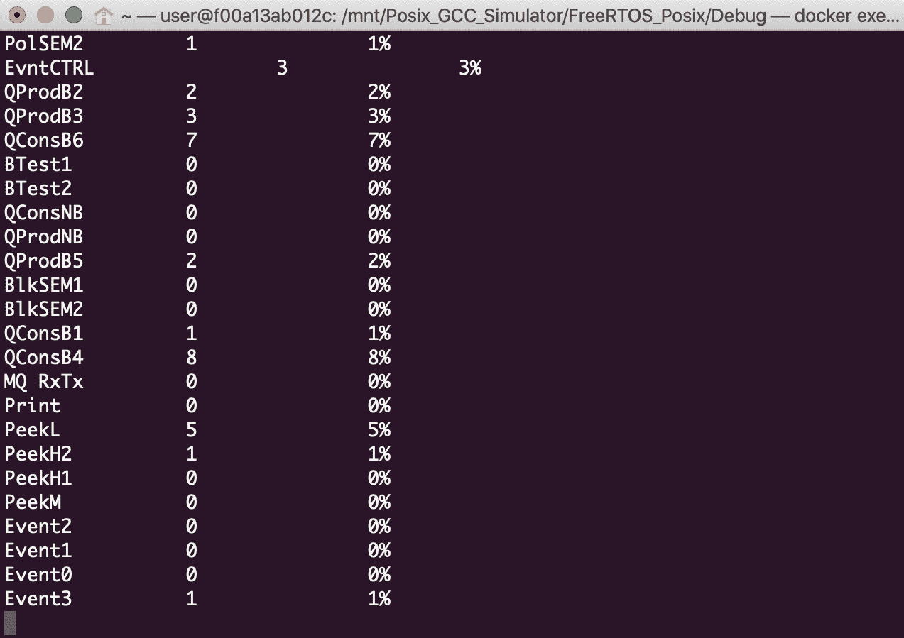

# 十三、实时系统指南

实时系统是一类反应时间很关键的嵌入式系统。不及时反应的后果因不同的应用而异。根据严重性，实时系统分为以下几类:

*   **硬实时**:错过期限不可接受，视为系统故障。这些通常是飞机、汽车和发电厂中的关键任务系统。
*   **确定实时**:错过截止日期在极少数情况下是可以接受的。截止日期后，结果的有用性为零。想想直播服务。视频帧传送太晚只能丢弃。只要不经常发生，这是可以容忍的。
*   **软实时**:错过期限可以接受。结果的有用性在截止日期后下降，导致整体质量下降，应该避免。这样的例子是捕获和同步来自多个传感器的数据。

实时系统不一定要求超快。他们需要的是可预测的反应时间。如果一个系统可以在 10 毫秒内正常响应一个事件，但通常需要更长的时间，那么它就不是一个实时系统。如果系统保证在 1 秒内响应，这就构成了硬实时。

确定性和可预测性是实时系统的主要特征。在这一章中，我们将探索不可预测行为的潜在来源以及减轻它们的方法。

本章涵盖以下主题:

*   在 Linux 中使用实时调度器
*   使用静态分配的内存
*   避免错误处理的异常
*   探索实时操作系统

本章中的方法将帮助您更好地理解实时系统的细节，并学习这种嵌入式系统的软件开发的一些最佳实践。

# 在 Linux 中使用实时调度器

Linux 是一个通用的操作系统，由于它的多功能性，被广泛应用于各种嵌入式设备中。它可以根据特定的硬件进行定制，并且是免费的。

Linux 不是实时操作系统，也不是实现硬实时系统的最佳选择。但是，它可以有效地用于构建软实时系统，因为它为时间关键型应用提供了实时调度程序。

在这个食谱中，我们将学习如何在我们的应用中使用 Linux 中的实时调度程序。

# 怎么做...

我们将创建一个使用实时调度程序的应用:

1.  在工作目录`~/test`中，创建一个名为`realtime`的子目录。
2.  使用您喜欢的文本编辑器在`realtime`子目录中创建一个`realtime.cpp`文件。
3.  添加所有必要的包含和命名空间:

```cpp
#include <iostream>
#include <system_error>
#include <thread>
#include <chrono>

#include <pthread.h>

using namespace std::chrono_literals;
```

4.  接下来，添加一个配置线程以使用实时调度程序的函数:

```cpp
void ConfigureRealtime(pthread_t thread_id, int priority) {
    sched_param sch;
    sch.sched_priority = 20;
    if (pthread_setschedparam(thread_id,
                              SCHED_FIFO, &sch)) {
        throw std::system_error(errno, 
                std::system_category(),
                "Failed to set real-time priority");
    }
}
```

5.  接下来，我们定义一个线程函数，我们希望它以正常优先级运行:

```cpp
void Measure(const char* text) {
    struct timespec prev;
    timespec_get(&prev, TIME_UTC);
    struct timespec delay{0, 10};
    for (int i = 0; i < 100000; i++) {
      nanosleep(&delay, nullptr);
    }
    struct timespec ts;
    timespec_get(&ts, TIME_UTC);
    double delta = (ts.tv_sec - prev.tv_sec) + 
        (double)(ts.tv_nsec - prev.tv_nsec) / 1000000000;
    std::clog << text << " completed in " 
              << delta << " sec" << std::endl;
}
```

6.  接下来是实时线程函数和启动两个线程的`main`函数:

```cpp
void RealTimeThread(const char* txt) {
    ConfigureRealtime(pthread_self(), 1);
    Measure(txt);
}

int main() {
    std::thread t1(RealTimeThread, "Real-time");
    std::thread t2(Measure, "Normal");
    t1.join();
    t2.join();
}
```

7.  最后，我们创建一个包含程序构建规则的`CMakeLists.txt`文件:

```cpp
cmake_minimum_required(VERSION 3.5.1)
project(realtime)
add_executable(realtime realtime.cpp)
target_link_libraries(realtime pthread)

SET(CMAKE_CXX_FLAGS "--std=c++ 14") 
set(CMAKE_CXX_COMPILER /usr/bin/arm-linux-gnueabihf-g++)
```

8.  现在，您可以构建和运行该应用。

# 它是如何工作的...

Linux 有几个应用于应用进程和线程的调度策略。`SCHED_OTHER`是默认的 Linux 分时策略。它面向所有线程，不提供实时机制。

在我们的应用中，我们使用另一个策略`SCHED_FIFO`。这是一个简单的调度算法。使用此调度程序的所有线程只能被具有更高优先级的线程抢占。如果线程进入睡眠状态，它将被放在具有相同优先级的线程队列的后面。

具有`SCHED_FIFO`策略的线程的优先级总是高于具有`SCHED_OTHER`策略的任何线程的优先级，并且一旦`SCHED_FIFO`线程变得可运行，它就立即抢占正在运行的`SCHED_OTHER`线程。从实用的角度来看，如果系统中只有一个`SCHED_FIFO`线程在运行，它可以根据需要使用尽可能多的 CPU 时间。`SCHED_FIFO`调度器的确定性行为和高优先级使其非常适合实时应用。

为了给线程分配实时优先级，我们定义了一个`ConfigureRealtime`函数。这接受两个参数——线程标识和所需的优先级:

```cpp
void ConfigureRealtime(pthread_t thread_id, int priority) {
```

该函数为`pthread_setschedparam`函数填充数据，该函数使用操作系统的低级应用编程接口来更改调度程序和线程的优先级:

```cpp
    if (pthread_setschedparam(thread_id,
 SCHED_FIFO, &sch)) {
```

我们定义了一个`Measure`函数，它运行一个繁忙的循环，调用一个`nanosleep`函数，参数要求它休眠 10 纳秒——时间太短，无法让另一个线程执行:

```cpp
    struct timespec delay{0, 10};
    for (int i = 0; i < 100000; i++) {
      nanosleep(&delay, nullptr);
    }
```

该函数捕获循环前后的时间戳，并以秒为单位计算经过的时间:

```cpp
    struct timespec ts;
    timespec_get(&ts, TIME_UTC);
    double delta = (ts.tv_sec - prev.tv_sec) + 
        (double)(ts.tv_nsec - prev.tv_nsec) / 1000000000;
```

接下来，我们将`RealTimeThread`函数定义为`Measure`函数的包装器。这会将当前线程的优先级设置为实时，并立即调用`Measure`:

```cpp
    ConfigureRealtime(pthread_self(), 1);
    Measure(txt);
```

在`main`函数中，我们启动两个线程，传递文本作为参数来区分它们的输出。如果我们在树莓 Pi 设备上运行该程序，我们可以看到以下输出:


实时线程花费的时间少了四倍，因为这不会被普通线程抢占。这种技术可以有效地用于满足 Linux 环境中的软实时要求。

# 使用静态分配的内存

正如在[第 6 章](06.html) *【内存管理】*中已经讨论过的，在实时系统中应该避免动态内存分配，因为通用内存分配器没有时间限制。虽然在大多数情况下，内存分配不会花费太多时间，但也不能保证。这对于实时系统是不可接受的。

避免动态内存分配最直接的方法是用静态分配来代替。C++ 开发人员经常使用`std::vector`来存储元素序列。由于它与 C 数组的相似性，它高效且易于使用，并且它的接口与标准库中的其他容器一致。由于向量具有可变数量的元素，因此它们广泛使用动态内存分配。然而，在许多情况下，可以使用`std::array`类来代替`std::vector`。它有相同的接口，只是它的元素数量是固定的，所以它的实例可以静态分配。这使得它成为内存分配时间至关重要时`std::vector`的良好替代品。

在本食谱中，我们将学习如何有效地使用`std::array`来表示固定大小的元素序列。

# 怎么做...

我们将创建一个应用，它使用 C++ 标准库算法的能力来生成和处理固定数据帧，而不使用动态内存分配:

1.  在工作目录`~/test`中，创建一个名为`array`的子目录。
2.  使用您喜欢的文本编辑器在`array`子目录中创建一个`array.cpp`文件。
3.  向`array.cpp`文件添加包括和新类型定义:

```cpp
#include <algorithm>
#include <array>
#include <iostream>
#include <random>

using DataFrame = std::array<uint32_t, 8>;
```

4.  接下来，我们添加一个生成数据帧的函数:

```cpp
void GenerateData(DataFrame& frame) {
  std::random_device rd;
 std::generate(frame.begin(), frame.end(),
 [&rd]() { return rd() % 100; });
}
```

5.  接下来是处理数据帧的函数:

```cpp
void ProcessData(const DataFrame& frame) {
  std::cout << "Processing array of "
            << frame.size() << " elements: [";
  for (auto x : frame) {
    std::cout << x << " ";
  }
  auto mm = std::minmax_element(frame.begin(),frame.end());
  std::cout << "] min: " << *mm.first
            << ", max: " << *mm.second << std::endl;
}
```

6.  添加一个将数据生成和处理联系在一起的`main`功能:

```cpp
int main() {
  DataFrame data;

  for (int i = 0; i < 4; i++) {
    GenerateData(data);
    ProcessData(data);
  }
  return 0;
}
```

7.  最后，我们创建一个包含程序构建规则的`CMakeLists.txt`文件:

```cpp
cmake_minimum_required(VERSION 3.5.1)
project(array)
add_executable(array array.cpp)

set(CMAKE_SYSTEM_NAME Linux)
set(CMAKE_SYSTEM_PROCESSOR arm)

SET(CMAKE_CXX_FLAGS_RELEASE "--std=c++ 17") 
SET(CMAKE_CXX_FLAGS_DEBUG "${CMAKE_CXX_FLAGS_RELEASE} -g -DDEBUG") 

set(CMAKE_C_COMPILER /usr/bin/arm-linux-gnueabihf-gcc)
set(CMAKE_CXX_COMPILER /usr/bin/arm-linux-gnueabihf-g++)

set(CMAKE_FIND_ROOT_PATH_MODE_PROGRAM NEVER)
set(CMAKE_FIND_ROOT_PATH_MODE_LIBRARY ONLY)
set(CMAKE_FIND_ROOT_PATH_MODE_INCLUDE ONLY)
set(CMAKE_FIND_ROOT_PATH_MODE_PACKAGE ONLY)
```

8.  现在，您可以构建和运行该应用。

# 它是如何工作的...

我们使用`std::array`模板来声明一个自定义的`DataFrame`数据类型。对于我们的示例应用，一个`DataFrame`是八个 32 位整数的序列:

```cpp
using DataFrame = std::array<uint32_t, 8>;
```

现在，我们可以在函数中使用新的数据类型来生成和处理数据帧。由于数据帧是一个数组，我们通过引用`GenerateData`函数来传递它，以避免额外的复制:

```cpp
void GenerateData(DataFrame& frame) {
```

`GenerateData`用随机数填充数据帧。由于`std::array`与标准库中的其他容器具有相同的接口，我们可以使用标准算法使代码更短、可读性更强:

```cpp
 std::generate(frame.begin(), frame.end(),
 [&rd]() { return rd() % 100; });
```

我们以类似的方式定义`ProcessData`函数。它也接受一个`DataFrame`，但它不应该修改它。我们使用常量引用来明确声明数据不会被修改:

```cpp
void ProcessData(const DataFrame& frame) {
```

`ProcessData`打印数据帧中的所有值，然后找到帧中的最小值和最大值。与内置数组不同，`std::arrays`在传递给函数时不会衰减为原始指针，因此我们可以使用基于范围的循环语法。您可能会注意到，我们没有将数组的大小传递给函数，也没有使用任何全局常数来查询它。它是`std::array`界面的一部分。它不仅减少了函数的参数数量，还确保我们在调用它时不会传递不正确的大小:

```cpp
  for (auto x : frame) {
    std::cout << x << " ";
  }
```

为了找到最小值和最大值，我们使用标准库的`std::minmax_`元素函数，而不是编写自定义循环:

```cpp
auto mm = std::minmax_element(frame.begin(),frame.end());
```

在`main`函数中，我们创建了一个`DataFrame`的实例:

```cpp
DataFrame data;
```

然后，我们运行一个循环。每次迭代时，都会生成并处理一个新的数据帧:

```cpp
GenerateData(data);
ProcessData(data);
```

如果我们运行应用，我们会得到以下输出:


我们的应用生成了四个数据帧，并且只使用几行代码和静态分配的数据来处理数据。这使得`std::array`成为实时系统开发者的好选择。此外，与内置数组不同，我们的函数是类型安全的，我们可以在构建时检测并修复许多编码错误。

# 还有更多...

C++ 20 标准引入了一个新的函数`to_array`，允许开发人员从一维内置数组中创建`std::array`的实例。详见`to_array`参考页面([https://en.cppreference.com/w/cpp/container/array/to_array](https://en.cppreference.com/w/cpp/container/array/to_array))中的更多细节和示例。

# 避免错误处理的异常

异常机制是 C++ 标准不可分割的一部分。这是在 C++ 程序中设计错误处理的推荐方法。然而，它确实有一些限制，并不总是能让它被实时系统所接受，尤其是安全关键的系统。

C++ 异常处理在很大程度上依赖于堆栈展开。一旦抛出异常，它就会通过调用堆栈向上传播到可以处理它的 catch 块。这意味着调用其路径中所有堆栈帧中所有本地对象的析构函数，很难确定和正式证明这个过程的最坏情况时间。

这就是为什么安全关键系统的编码指南，如 MISRA 或 JSF，明确禁止使用异常进行错误处理。

这并不意味着 C++ 开发人员必须回到传统的纯 C 错误代码。在本食谱中，我们将学习如何使用 C++ 模板来定义可以保存函数调用的结果或错误代码的数据类型。

# 怎么做...

我们将创建一个应用，它使用 C++ 标准库算法的能力来生成和处理固定数据帧，而不使用动态内存分配:

1.  在工作目录`~/test`中，创建一个名为`expected`的子目录。
2.  使用您喜欢的文本编辑器在`expected`子目录中创建一个`expected.cpp`文件。
3.  向`expected.cpp`文件添加包括和新类型定义:

```cpp
#include <iostream>
#include <system_error>
#include <variant>

#include <unistd.h>
#include <sys/fcntl.h>

template <typename T>
class Expected {
  std::variant<T, std::error_code> v;

public:
  Expected(T val) : v(val) {}
  Expected(std::error_code e) : v(e) {}

  bool valid() const {
    return std::holds_alternative<T>(v);
  }

  const T& value() const {
    return std::get<T>(v);
  }

  const std::error_code& error() const {
    return std::get<std::error_code>(v);
  }
};
```

4.  接下来，我们为 open POSIX 函数添加一个包装器:

```cpp
Expected<int> OpenForRead(const std::string& name) {
  int fd = ::open(name.c_str(), O_RDONLY);
  if (fd < 0) {
    return Expected<int>(std::error_code(errno, 
                         std::system_category()));
  }
  return Expected<int>(fd);
}
```

5.  添加显示如何使用`OpenForRead`包装器的`main`功能:

```cpp
int main() {
  auto result = OpenForRead("nonexistent.txt");
  if (result.valid()) {
    std::cout << "File descriptor"
              << result.value() << std::endl;
  } else {
    std::cout << "Open failed: " 
              << result.error().message() << std::endl;
  }
  return 0;
}
```

6.  最后，我们创建一个包含程序构建规则的`CMakeLists.txt`文件:

```cpp
cmake_minimum_required(VERSION 3.5.1)
project(expected)
add_executable(expected expected.cpp)

set(CMAKE_SYSTEM_NAME Linux)
#set(CMAKE_SYSTEM_PROCESSOR arm)

SET(CMAKE_CXX_FLAGS "--std=c++ 17") 

#set(CMAKE_C_COMPILER /usr/bin/arm-linux-gnueabihf-gcc)
#set(CMAKE_CXX_COMPILER /usr/bin/arm-linux-gnueabihf-g++)

set(CMAKE_FIND_ROOT_PATH_MODE_PROGRAM NEVER)
set(CMAKE_FIND_ROOT_PATH_MODE_LIBRARY ONLY)
set(CMAKE_FIND_ROOT_PATH_MODE_INCLUDE ONLY)
set(CMAKE_FIND_ROOT_PATH_MODE_PACKAGE ONLY)
```

7.  现在，您可以构建和运行该应用。

# 它是如何工作的...

在我们的应用中，我们创建了一个数据类型，它可以以类型安全的方式保存期望值或错误代码。C++ 17 提供了一个类型安全的联合类`std::variant,`，我们将把它用作模板类`Expected`的基础数据类型。

`Expected`类封装了一个`std::variant`字段，该字段可以保存两种数据类型之一，模板化类型`T`或`std::error_code`，这是错误代码的标准 C++ 推广:

```cpp
  std::variant<T, std::error_code> v;
```

虽然可以直接使用`std::variant`工作，但是我们公开了一些让它更方便的公共方法。如果结果保持模板化类型，则`valid`方法返回`true`，否则返回`false`:

```cpp
  bool valid() const {
    return std::holds_alternative<T>(v);
  }
```

`value`和`error`方法分别用于访问返回值或错误代码:

```cpp
  const T& value() const {
    return std::get<T>(v);
  }

  const std::error_code& error() const {
    return std::get<std::error_code>(v);
  }
```

一旦定义了`Expected`类，我们就创建一个使用它的`OpenForReading`函数。这将调用开放系统函数，并基于返回值创建一个保存文件描述符或错误代码的`Expected`实例:

```cpp
  if (fd < 0) {
    return Expected<int>(std::error_code(errno, 
 std::system_category()));
  }
  return Expected<int>(fd);
```

在`main`函数中，当我们对不存在的文件调用`OpenForReading`时，预计会失败。当我们运行应用时，我们可以看到以下输出:


我们的`Expected`类允许我们编写可能返回错误代码的函数，并以类型安全的方式执行。编译时类型验证帮助开发人员避免了许多传统错误代码常见的问题，使我们的应用更加健壮和安全。

# 还有更多...

我们对`Expected`数据类型的实现是`std::expected`类的变体([http://www . open-STD . org/JT C1/sc22/wg21/docs/papers/2018/p 0323 r 7 . html](http://www.open-std.org/jtc1/sc22/wg21/docs/papers/2018/p0323r7.html))被提议标准化，但未被批准。`std::expected`的一个实现可以在[https://github.com/TartanLlama/expected](https://github.com/TartanLlama/expected)的 GitHub 上找到。

# 探索实时操作系统

正如本章已经讨论过的，Linux 不是一个实时系统。对于软实时任务来说，这是一个不错的选择，但尽管它提供了实时调度器，但其内核过于复杂，无法保证硬实时应用所需的确定性水平。

时间关键型应用要么需要实时操作系统才能运行，要么设计和实现为在裸机上运行，根本没有操作系统。

实时操作系统通常比通用操作系统如 Linux 简单得多。此外，它们需要针对特定的硬件平台进行定制，通常是微控制器。

有许多实时操作系统，其中大多数是专有的，而不是免费的。FreeRTOS 是探索实时操作系统功能的良好起点。与大多数替代方案不同，它是开源的，可以免费使用，因为它是在麻省理工学院许可下发布的。它被移植到许多微控制器和小型微处理器上，但是即使您没有特定的硬件，Windows 和 POSIX 模拟器也是可用的。

在这个食谱中，我们将学习如何下载和运行 FreeRTOS POSIX 模拟器。

# 怎么做...

我们将在构建环境中下载并构建一个 FreeRTOS 模拟器:

1.  切换到你的 Ubuntu 终端，将当前目录改为`/mnt`:

```cpp
$ cd /mnt
```

2.  下载自由操作系统模拟器的源代码:

```cpp
$ wget -O simulator.zip http://interactive.freertos.org/attachments/token/r6d5gt3998niuc4/?name=Posix_GCC_Simulator_6.0.4.zip
```

3.  提取下载的档案:

```cpp
$ unzip simulator.zip
```

4.  将当前目录更改为`Posix_GCC_Simulator/FreeRTOS_Posix/Debug`:

```cpp
$ cd Posix_GCC_Simulator/FreeRTOS_Posix/Debug
```

5.  通过运行以下命令修复`makefile`中的小错误:

```cpp
$ sed -i -e 's/\(.*gcc.*\)-lrt\(.*\)/\1\2 -lrt/' makefile
```

6.  从源代码构建模拟器:

```cpp
$ make
```

7.  开始吧:

```cpp
$ ./FreeRTOS_Posix
```

此时，模拟器正在运行。

# 它是如何工作的...

我们已经知道，实时操作系统的内核通常比通用操作系统的内核简单得多。FreeRTOS 也是如此。

由于这种简单性，内核可以作为通用操作系统(如 Linux 或 Windows)中的进程来构建和运行。当从另一个操作系统中使用时，它不再是真正的实时，而是可以作为一个起点来探索自由操作系统应用编程接口，并开始开发以后可以在目标硬件平台的实时环境中运行的应用。

在这个食谱中，我们为 POSIX 操作系统下载并构建了 FreeRTOS 内核。

构建阶段很简单。一旦代码被下载并从档案中提取出来，我们运行`make`，这就构建了一个可执行文件`FreeRTOS-POSIX`。在运行`make`命令之前，我们通过在 GCC 命令行的末尾放置`-lrt`选项来修复`makefile`中的一个错误。我们通过运行`sed`来做到这一点:

```cpp
$ sed -i -e 's/\(.*gcc.*\)-lrt\(.*\)/\1\2 -lrt/' makefile
```

运行应用会启动内核和预打包的应用:



我们能够在构建环境中运行自由操作系统。您可以更深入地了解它的代码库和文档，以更好地理解实时操作系统的内部和 API。

# 还有更多...

如果你在 Windows 环境下工作，有一个更好支持的 Windows 版本的 FreeRTOS 模拟器。可以从[https://www . FreeRTOS . org/FreeRTOS-Windows-Simulator-Emulator-for-Visual Studio-and-Eclipse-mingw . html](https://www.freertos.org/FreeRTOS-Windows-Simulator-Emulator-for-Visual-Studio-and-Eclipse-MingW.html)下载，附带文档和教程。