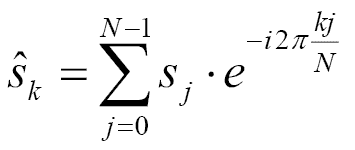
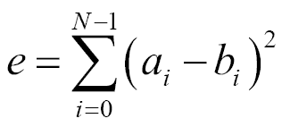
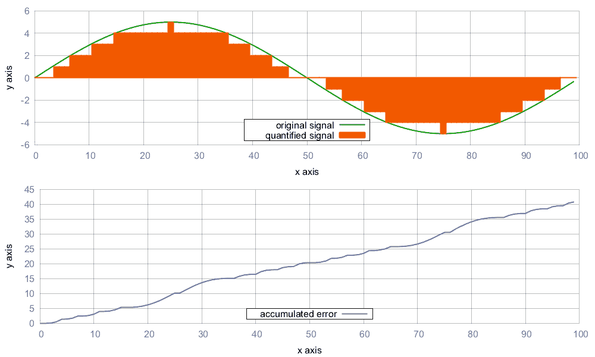
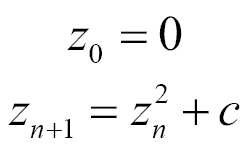
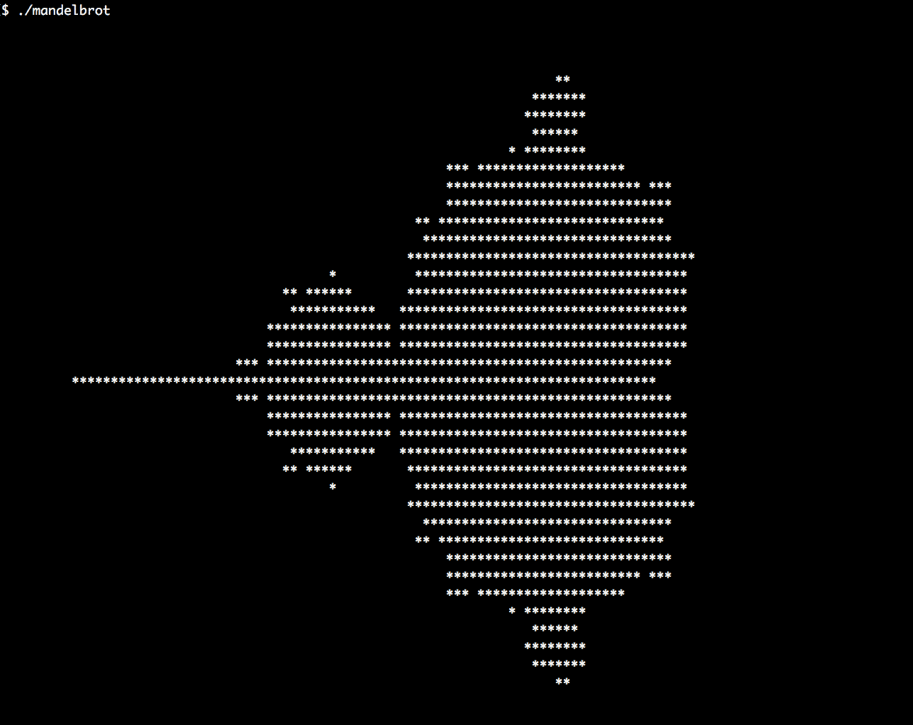
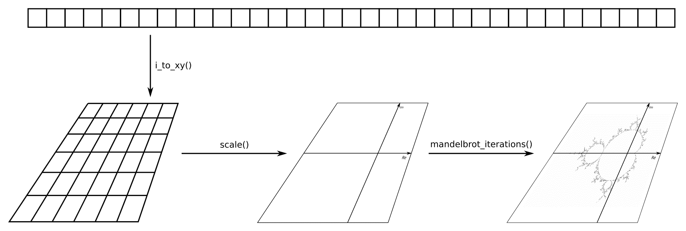
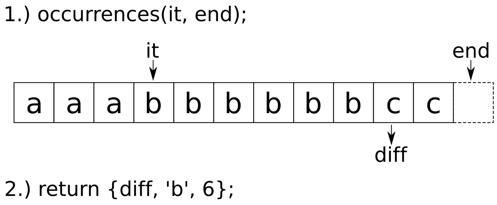

# STL 算法的高级使用

我们将在本章介绍以下食谱:

*   使用 STL 算法实现 trie 类
*   通过尝试实现搜索输入建议生成器
*   用 STL 数值算法实现傅里叶变换公式
*   计算两个向量的误差和
*   实现 ASCII 曼德尔布罗渲染器
*   构建我们自己的算法-拆分
*   从标准算法中组合有用的算法-收集
*   删除单词之间的连续空白
*   压缩和解压缩字符串

# 介绍

在最后一章中，我们访问了基本的 STL 算法，并使用它们执行了简单的任务，以获得典型 STL 接口的感觉:大多数 STL 算法接受一个或多个以迭代器对形式的范围作为输入/输出参数。它们通常也接受谓词函数、自定义比较函数或转换函数。最后，它们通常会再次返回迭代器，因为这些迭代器通常会在之后被输入到其他算法中。

虽然 STL 算法的目标是最小化，但它们的接口也尽量通用。这实现了最大的代码重用潜力，但看起来并不总是那么漂亮。一个熟悉所有算法的有经验的 C++程序员，如果试图用 STL 算法表达尽可能多的思想，那么他阅读别人的代码的时间会更长。这导致编码者和读者之间理解的最大化的共同点。程序员的大脑能够比理解一个复杂的循环更快地解析一个著名算法的名字，这个复杂的循环主要完成类似的工作，但在某些细节上略有不同。

在这一点上，我们如此直观地使用 STL 数据结构，以至于我们可以很好地避免指针、原始数组和其他粗糙的遗留结构。下一步是提升我们对 STL 算法的理解，通过用众所周知的 STL 算法表达它们，我们可以避免使用手工制造的循环控制结构复合体。通常，这是一个真正的改进，因为代码变得更短、更可读，同时更通用、数据结构不可知。实际上总是有可能避免编写手工循环，而是将算法从`std`命名空间中取出，但有时，它确实会导致*笨拙的代码*。我们不会区分什么是尴尬的，什么不是；我们只探索可能性。

在这一章中，我们将创造性地使用 STL 算法，以便寻找新的视野，并看看如何用现代 C++实现事物。在路上，我们将实现自己的类似 STL 的算法，这些算法可以很容易地与现有的数据结构和以同样方式设计的其他算法相结合。我们还将*结合*现有的 STL 算法，得到*新的*算法，这是以前没有的。这种组合算法允许在现有算法的基础上进行更复杂的算法，同时它们本身也非常短，并且以这种方式可读。在这个小小的旅程中，我们还将看到 STL 算法在哪些地方会受到可重用性或美观性的影响。只有当我们很好地了解所有的方法时，我们才能最好地决定哪种方法是正确的。

# 使用 STL 算法实现 trie 类

所谓的 **trie** 数据结构提供了一种以易于搜索的方式存储数据的有趣方式。当将文本的句子分割成单词列表时，通常可以将一些句子共有的前几个单词组合在一起。

我们来看看下图，句子`"hi how are you"`和`"hi how do you do"`保存在一个树状的数据结构中。他们的第一个共同点是`"hi how"`，然后他们就像一棵树一样分裂开来:


因为 trie 数据结构结合了常见的前缀，所以也被称为*前缀树*。用 STL 已经给我们的东西实现这样的数据结构是非常容易的。这一部分集中于实现我们自己的 trie 类。

# 怎么做...

在这一节中，我们将实现我们自己的前缀树，仅由 STL 数据结构和算法组成。

1.  我们将包括我们使用的 STL 部分的所有头，并声明我们默认使用`std`命名空间:

```cpp
      #include <iostream>
      #include <optional>
      #include <algorithm>
      #include <functional>
      #include <iterator>
      #include <map>
      #include <vector>
      #include <string>

      using namespace std;
```

2.  整个程序围绕着一个 trie，为此我们必须首先实现一个类。在我们的实现中，trie 基本上是一个递归地图。每个 trie 节点包含一个映射，该映射从有效载荷类型的实例`T`映射到下一个 trie 节点:

```cpp
      template <typename T>
      class trie
      {
          map<T, trie> tries;
```

3.  插入新项目序列的代码很简单。用户提供一个开始/结束迭代器对，我们递归地遍历它。如果用户输入序列是`{1, 2, 3}`，那么我们在子树中查找`1`，然后在下一个子树中查找`2`，以便得到`3`的子树。如果之前不存在这些子集合中的任何一个，它们将由`std::map`的`[]`操作符隐式添加:

```cpp
      public:
          template <typename It>
          void insert(It it, It end_it) {
              if (it == end_it) { return; }
              tries[*it].insert(next(it), end_it);
          }
```

4.  我们还定义了便利函数，使用户只需提供一个项目容器，然后自动查询迭代器:

```cpp
          template <typename C>
          void insert(const C &container) {
              insert(begin(container), end(container));
          }
```

5.  为了允许用户编写`my_trie.insert({"a", "b", "c"});`，我们必须帮助编译器从那一行正确地推导出所有类型，所以我们添加了一个函数，它用一个`initializer_list`参数重载了插入接口:

```cpp
          void insert(const initializer_list<T> &il) {
              insert(begin(il), end(il));
          }
```

6.  我们还想看看 trie 中有什么，所以我们需要一个`print`函数。为了打印，我们可以在 trie 中进行深度优先搜索。在从根节点向下到第一个叶节点的过程中，我们记录了已经看到的所有有效负载项。这样，一旦我们到达叶子，我们就有了一个完整的序列，这是很容易打印的。当`tries.empty()`是`true`时，我们看到了一片叶子。在递归`print`调用之后，我们再次弹出最后添加的有效载荷项:

```cpp
          void print(vector<T> &v) const {
              if (tries.empty()) {
                  copy(begin(v), end(v), 
                       ostream_iterator<T>{cout, " "});
                  cout << 'n';
              }
              for (const auto &p : tries) {
                  v.push_back(p.first);
                  p.second.print(v);
                  v.pop_back();
              }
          }
```

7.  递归`print`函数传递一个对有效载荷项目的可打印列表的引用，但是用户应该在没有任何参数的情况下调用它。因此，我们定义了一个无参数`print`函数，它构造了帮助列表对象:

```cpp
          void print() const {
              vector<T> v;
              print(v);
          }
```

8.  现在我们可以构建和打印尝试，我们可能想要搜索子树。其思想是，如果 trie 包含诸如`{a, b, c}`和`{a, b, d, e}`的序列，并且我们给它一个序列`{a, b}`，用于搜索，它将返回给我们包含`{c}`和`{d, e}`部分的子树。如果找到子树，我们返回一个`const`引用。如果 trie 不包含我们正在搜索的序列，则可能不存在这样的子树。在这种情况下，我们仍然需要返回*一些东西*。`std::optional`是一个很好的助手，因为如果没有匹配项，我们可以返回一个*空的*可选对象:

```cpp
          template <typename It>
          optional<reference_wrapper<const trie>> 
          subtrie(It it, It end_it) const {
              if (it == end_it) { return ref(*this); }
              auto found (tries.find(*it));
              if (found == end(tries)) { return {}; }

              return found->second.subtrie(next(it), end_it);
          }
```

9.  类似于`insert`方法，我们提供了一个单参数版本的`subtrie`方法，它自动从输入容器中获取迭代器:

```cpp
          template <typename C>
          auto subtrie(const C &c) { 
              return subtrie(begin(c), end(c));
          }
      };
```

10.  已经这样了。让我们通过实例化一个专门用于`std::string`对象的 trie 来将新的 trie 类用于我们的主函数，并用一些示例内容填充它:

```cpp
      int main()
      {
          trie<string> t;

          t.insert({"hi", "how", "are", "you"});
          t.insert({"hi", "i", "am", "great", "thanks"});
          t.insert({"what", "are", "you", "doing"});
          t.insert({"i", "am", "watching", "a", "movie"});
```

11.  让我们先打印整个 trie:

```cpp
          cout << "recorded sentences:n";
          t.print();
```

12.  然后我们获取所有以`"hi"`开头的输入句子的子树，并打印出来:

```cpp
          cout << "npossible suggestions after "hi":n";

          if (auto st (t.subtrie(initializer_list<string>{"hi"})); 
              st) {
              st->get().print();
          }
      }
```

13.  编译并运行该程序表明，当我们查询 trie 中的子树时，它确实只返回以`"hi"`开头的两个句子:

```cpp
      $ ./trie 
      recorded sentences:
      hi how are you 
      hi i am great thanks 
      i am watching a movie 
      what are you doing 

      possible suggestions after "hi":
      how are you 
      i am great thanks 
```

# 它是如何工作的...

有趣的是，单词序列*插入*的代码比*在子树中查找*给定单词序列的代码更短更简单。那么，让我们先来看看插入代码:

```cpp
template <typename It>
void trie::insert(It it, It end_it) {
    if (it == end_it) { return; }
    tries[*it].insert(next(it), end_it);
}
```

这对迭代器`it`和`end_it`代表要插入的单词序列。`tries[*it]`元素在子树中查找序列中的第一个单词，然后，`.insert(next(it), end_it)`在该较低的子树上重新启动相同的功能，迭代器一个单词*进一步*前进。`if (it == end_it) { return; }`行只是中止递归。空`return`语句什么都不做*，刚开始有点诡异。所有的插入都发生在`tries[*it]`语句中。`std::map`的括号操作符`[]`或者返回给定键的现有项目，或者它*用该键创建一个*。关联的值(映射的类型是这个配方中的一个 trie)是从它的默认构造函数构造的。这样，每当我们查找未知单词时，我们都在*隐式创建*一个新的 trie 分支。*

 *在子树中查找看起来更复杂，因为我们无法在隐式代码中隐藏太多的*:*

```cpp
template <typename It>
optional<reference_wrapper<const trie>> 
subtrie(It it, It end_it) const {
    if (it == end_it) { return ref(*this); }
    auto found (tries.find(*it));
    if (found == end(tries)) { return {}; }

    return found->second.subtrie(next(it), end_it);
}
```

这段代码基本围绕`auto found (tries.find(*it));`语句展开。我们使用`find`，而不是使用括号运算符(`[]`)来查找下一个更深的 trie 节点。如果我们使用`[]`运算符进行查找，trie 会为我们创建*缺失项，这是*而不是我们在仅仅查找某项是否存在时想要的*！(对了，试着那样做。上课的方法是`const`，所以这是不可能的。这可能是一个相当大的救命稻草，有助于我们预防错误。)*

另一个看起来可怕的细节是返回类型，`optional<reference_wrapper<const trie>>`。我们选择`std::optional`作为包装器，因为我们正在寻找的输入序列可能没有这样的子树。如果我们只插入`"hello my friend"`，就不会有`"goodbye my friend"`序列可查。在这种情况下，我们只返回`{}`，它给调用者一个空的可选对象。这仍然不能解释为什么我们用`reference_wrapper`而不是只写`optional<const trie &>`。这里的要点是，带有`trie&`类型成员变量的可选实例是不可重新分配的，因此不会编译。使用`reference_wrapper`实现引用会产生可重新分配的对象。

# 通过尝试实现搜索输入建议生成器

当在互联网上的搜索引擎中输入一些东西时，界面经常试图猜测完整的搜索查询会是什么样子。这种猜测通常基于过去流行的搜索查询。有时候，这样的搜索引擎猜测相当有趣，因为人们似乎会在搜索引擎中输入奇怪的查询。


在本节中，我们将使用我们在前面的食谱中实现的 trie 类，并构建一个小的搜索查询建议引擎。

# 怎么做...

在本节中，我们将实现一个终端应用，它接受一些输入，然后根据廉价的文本文件数据库，尝试猜测用户可能想要寻找什么:

1.  一如既往，包含优先，我们定义使用`std`命名空间:

```cpp
      #include <iostream>
      #include <optional>
      #include <algorithm>
      #include <functional>
      #include <iterator>
      #include <map>
      #include <list>
      #include <string>
      #include <sstream>
      #include <fstream>  

      using namespace std;
```

2.  我们使用 trie 配方中的 trie 实现:

```cpp
      template <typename T>
      class trie
      {
          map<T, trie> tries;

      public:
          template <typename It>
          void insert(It it, It end_it) {
              if (it == end_it) { return; }
              tries[*it].insert(next(it), end_it);
          }

          template <typename C>
          void insert(const C &container) {
              insert(begin(container), end(container));
          }

          void insert(const initializer_list<T> &il) {
              insert(begin(il), end(il));
          }

          void print(list<T> &l) const {
              if (tries.empty()) {
                  copy(begin(l), end(l), 
                       ostream_iterator<T>{cout, " "});
                  cout << 'n';
              }
              for (const auto &p : tries) {
                  l.push_back(p.first);
                  p.second.print(l);
                  l.pop_back();
              }
          }

          void print() const {
              list<T> l;
              print(l);
          }

          template <typename It>
          optional<reference_wrapper<const trie>>
          subtrie(It it, It end_it) const {
              if (it == end_it) { return ref(*this); }
              auto found (tries.find(*it));
              if (found == end(tries)) { return {}; }

      return found->second.subtrie(next(it), end_it);
          }

          template <typename C>
          auto subtrie(const C &c) const { 
              return subtrie(begin(c), end(c));
          }
      };
```

3.  让我们添加一个小助手函数，打印一行提示用户输入一些文本:

```cpp
      static void prompt()
      {
          cout << "Next input please:n > ";
      }
```

4.  在主功能中，我们打开一个文本文件，它充当我们的句子数据库。我们逐行读取文本文件，并将这些行输入到一个 trie 中:

```cpp
      int main()
      {
          trie<string> t;

          fstream infile {"db.txt"};
          for (string line; getline(infile, line);) {
              istringstream iss {line};
              t.insert(istream_iterator<string>{iss}, {});
          }
```

5.  现在我们已经从文本文件中的内容构建了 trie，我们需要实现一个用户查询它的接口。我们提示用户输入一些文本并等待一整行输入:

```cpp
          prompt();
          for (string line; getline(cin, line);) {
              istringstream iss {line};
```

6.  有了这个文本输入，我们查询 trie 以便从中获得一个子树。如果我们在文本文件中已经有了这样的输入序列，那么我们就可以打印出如何继续输入，就像在搜索引擎建议功能中一样。如果我们没有找到匹配的子树，我们只告诉用户:

```cpp
              if (auto st (t.subtrie(istream_iterator<string>{iss}, {})); 
                  st) {
                  cout << "Suggestions:n";
                  st->get().print();
              } else {
                  cout << "No suggestions found.n";
              }
```

7.  之后，我们再次打印提示文本，等待下一行用户输入。就这样。

```cpp
              cout << "----------------n";
              prompt();
          }
      }
```

8.  在考虑启动程序之前，我们需要在`db.txt`中填入一些内容。输入可以是任何东西，甚至不需要排序。每一行文本都是一个 trie 序列:

```cpp
      do ghosts exist
      do goldfish sleep
      do guinea pigs bite
      how wrong can you be
      how could trump become president
      how could this happen to me
      how did bruce lee die
      how did you learn c++
      what would aliens look like
      what would macgiver do
      what would bjarne stroustrup do
      ...
```

9.  我们需要创建`db.txt`才能运行程序。其内容可能如下所示:

```cpp
      hi how are you 
      hi i am great thanks 
      do ghosts exist
      do goldfish sleep
      do guinea pigs bite
      how wrong can you be
      how could trump become president
      how could this happen to me
      how did bruce lee die
      how did you learn c++
      what would aliens look like
      what would macgiver do
      what would bjarne stroustrup do
      what would chuck norris do
      why do cats like boxes
      why does it rain
      why is the sky blue
      why do cats hate water
      why do cats hate dogs
      why is c++ so hard
```

10.  编译和运行程序并输入一些输入，如下所示:

```cpp
      $ ./word_suggestion 
      Next input please:
       > what would
      Suggestions:
      aliens look like 
      bjarne stroustrup do 
      chuck norris do 
      macgiver do 
      ----------------
      Next input please:
       > why do
      Suggestions:
      cats hate dogs 
      cats hate water 
      cats like boxes 
      ----------------
      Next input please:
       > 
```

# 它是如何工作的...

上一份食谱解释了 trie 的工作原理，但是我们如何填充它以及如何查询它在这里看起来有点奇怪。让我们仔细看看用文本数据库文件的内容填充空 trie 的代码片段:

```cpp
fstream infile {"db.txt"};
for (string line; getline(infile, line);) {
    istringstream iss {line};
    t.insert(istream_iterator<string>{iss}, {});
}
```

循环用文本文件的内容逐行填充字符串`line`。然后，我们将字符串复制到一个`istringstream`对象中。从这样一个输入流对象，我们可以创建一个`istream_iterator`，这很有用，因为我们的 trie 不仅接受一个容器实例来查找子树，而且主要接受迭代器。这样，我们不需要构造一个向量或一个单词列表，并且可以直接使用字符串。最后一部分不必要的内存分配可以通过*将`line`的内容移动到`iss`来避免。遗憾的是，`std::istringstream`没有提供接受`std::string`值进行*移动*的构造函数。然而，它将*复制*它的输入字符串。*

当读取用户输入以在 trie 中查找它时，我们使用完全相同的策略，但是我们不使用输入*文件*流。我们用`std::cin`代替。这对我们的用例来说完全一样，因为`trie::subtrie`和`trie::insert`一样使用迭代器。

# 还有更多...

可以将*计数器变量*添加到 trie 的每个节点。这样，就可以计算*前缀在某些输入中出现的频率。由此，我们可以*根据出现频率对我们的建议进行排序，这实际上是搜索引擎的工作。智能手机触摸屏文本输入的单词建议也可以通过这种方式实现。**

这个修改留给读者做练习。

# 用 STL 数值算法实现傅里叶变换公式

**傅里叶变换**是信号处理中非常重要和著名的公式。它是在将近 200 年前发明的，但是有了计算机，它的用例数量真的激增了。它被用于音频/图像/视频压缩、音频过滤器、医学成像设备、在移动中听音乐时识别音乐曲目的手机应用等。

由于一般数值应用场景的广阔性(当然不仅仅是因为傅立叶变换)，STL 也试图在数值计算的环境中有用。傅立叶变换只是其中的一个例子，但也是一个棘手的例子。公式本身如下所示:



它描述的转变基本上是一个*的总和*。总和的每个元素是输入信号向量的数据点和表达式 *exp(-2 * i *的乘积...)*。这背后的数学对于不懂复数的人(或者只是不喜欢数学的人)来说有点吓人，但也不是真的需要完全理解数学才能*实现*它。当仔细查看公式时，它表示求和符号使用循环变量`j`在信号的每个数据点(长度为`N`个元素)上循环。变量`k`是另一个循环变量，因为傅立叶变换不是用来计算单个值，而是一个向量值。在这个向量中，每个数据点代表某个重复波频率的强度和相位，它是或不是原始信号的一部分。当用手动循环实现这一点时，我们将得到类似如下的代码:

```cpp
csignal fourier_transform(const csignal &s) { 
    csignal t(s.size()); 
    const double pol {-2.0 * M_PI / s.size()};

    for (size_t k {0}; k < s.size(); ++k) { 
        for (size_t j {0}; j < s.size(); ++j) { 
            t[k] += s[j] * polar(1.0, pol * k * j); 
        }
    } 
    return t; 
}
```

`csignal`类型可以是复数的`std::vector`向量。对于复数，有一个`std::complex` STL 类，帮助表示那些。`std::polar`功能基本上执行 *exp(-i * 2 *...)*部分。

这已经很好了，但是我们将使用 STL 工具来实现它。

# 怎么做...

在本节中，我们将实现傅立叶变换及其后向变换，然后用它来变换一些信号:

1.  首先，我们包括所有的头，并声明我们使用`std`命名空间:

```cpp
      #include <iostream>
      #include <complex>
      #include <vector>
      #include <algorithm>
      #include <iterator>
      #include <numeric>
      #include <valarray>
      #include <cmath>      

      using namespace std;
```

2.  信号的数据点是一个复数，应由`std::complex`表示，专用于`double`类型。这样，类型别名`cmplx`代表两个耦合的`double`值，代表复数的*实数*和*虚数*部分。一个完整的信号是这些项的向量，我们将其别名为`csignal`类型:

```cpp
      using cmplx   = complex<double>;
      using csignal = vector<cmplx>;
```

3.  为了迭代一个向上计数的数字序列，我们从数字迭代器配方中取出*数字迭代器*。公式中的变量`k`和`j`应迭代这些序列:

```cpp
      class num_iterator {
          size_t i;
      public:
          explicit num_iterator(size_t position) : i{position} {}

          size_t operator*() const { return i; }

          num_iterator& operator++() {
              ++i;
              return *this;
          }

          bool operator!=(const num_iterator &other) const {
              return i != other.i;
          }
      };
```

4.  傅立叶变换函数将只取一个信号并返回一个新信号。返回的信号代表输入信号的傅立叶变换。由于从傅里叶变换信号到原始信号的反向变换非常相似，我们提供了一个可选的`bool`参数，该参数选择变换方向。注意`bool`参数通常是不好的做法，尤其是如果我们在一个函数签名中使用多个`bool`参数。为了简洁起见，我们这里只有一个。
    我们做的第一件事是用初始信号的大小分配一个新的信号向量:

```cpp
      csignal fourier_transform(const csignal &s, bool back = false)
      {
          csignal t (s.size());
```

5.  公式中有两个因素，看起来总是一样的。让我们用它们自己的变量来包装它们:

```cpp
          const double pol {2.0 * M_PI * (back ? -1.0 : 1.0)};
          const double div {back ? 1.0 : double(s.size())};
```

6.  `std::accumulate`算法是执行总结项目的公式的合适选择。我们将在一系列向上计数的数值上使用`accumulate`。从这些值，我们可以形成每一步的总和。`std::accumulate`算法在每一步调用一个二元函数。该函数的第一个参数是在前面步骤中已经计算过的`sum`部分的当前值，其第二个参数是范围中的下一个值。我们在当前位置查找信号`s`的值，并将其乘以复因子`pol`。然后，我们返回新的部分和。二进制函数被包装到另一个λ表达式中，因为我们将为每个 T7 调用使用不同的 T6 值。因为这是一个二维循环算法，所以内λ代表内环，外λ代表外环:

```cpp
          auto sum_up ([=, &s] (size_t j) {
              return [=, &s] (cmplx c, size_t k) {
                  return c + s[k] * 
                      polar(1.0, pol * k * j / double(s.size()));
              };
          });
```

7.  傅立叶变换的内环部分现在由`std::accumulate`执行。对于算法的每个`j`位置，我们计算位置 *i = 0 的所有和的和...N* 。这个想法被包装成一个 lambda 表达式，我们将对结果傅立叶变换向量中的每个数据点执行该表达式:

```cpp
          auto to_ft ([=, &s](size_t j){
              return accumulate(num_iterator{0}, 
                                num_iterator{s.size()}, 
                                cmplx{},
                                sum_up(j))
                  / div;
          });
```

8.  在此之前，没有执行任何傅立叶代码。我们只准备了大量的功能代码，现在就付诸行动。一个`std::transform`调用将产生值 *j = 0...N* ，这是我们的外环。转换后的值都进入向量`t`，然后返回给调用者:

```cpp
          transform(num_iterator{0}, num_iterator{s.size()}, 
                    begin(t), to_ft);

          return t;
      }
```

9.  我们将实现一些功能，帮助我们为信号生成设置功能对象。第一个是余弦信号发生器。它返回一个 lambda 表达式，该表达式可以用作为参数提供的周期长度生成余弦信号。信号本身可以是任意长度的，但它有固定的周期长度。`N`的周期长度意味着信号将在`N`步后重复自身。lambda 表达式不接受任何参数。我们可以反复调用它，每次调用，它都会返回下一个时间点的信号数据点:

```cpp
      static auto gen_cosine (size_t period_len){
          return [period_len, n{0}] () mutable { 
              return cos(double(n++) * 2.0 * M_PI / period_len); 
          };
      }
```

10.  我们要产生的另一个信号是方波。它在值`-1`和`+1`之间振荡，除此之外没有其他值。公式看起来很复杂，但它只是将线性向上计数值`n`转换为`+1`和`-1`，振荡周期长度为`period_len`。
    注意，我们这次将`n`初始化为与`0`不同的值。这样，我们的方波开始于其输出值开始于`+1`的阶段:

```cpp
      static auto gen_square_wave (size_t period_len)
      {
          return [period_len, n{period_len*7/4}] () mutable {
              return ((n++ * 2 / period_len) % 2) * 2 - 1.0;
          };
      }
```

11.  通过分配一个新的向量并用重复信号发生器函数调用产生的值填充它，可以从这样的发生器产生一个实际的信号。`std::generate`做这项工作。它接受一个开始/结束迭代器对和一个生成器函数。对于每个有效的迭代器位置，它都执行`*it = gen()`。通过将此代码打包成一个函数，我们可以轻松生成信号矢量:

```cpp
      template <typename F>
      static csignal signal_from_generator(size_t len, F gen)
      {
          csignal r (len);
          generate(begin(r), end(r), gen);
          return r;
      }
```

12.  最后，我们需要打印结果信号。我们可以简单地通过将其值复制到输出流迭代器中来打印信号，但是我们需要首先转换数据，因为我们信号的数据点是复杂的值对。此时，我们只对每个数据点的真实价值部分感兴趣；因此，我们通过一个`std::transform`调用抛出它，这个调用只提取这一部分:

```cpp
      static void print_signal (const csignal &s)
      {
          auto real_val ([](cmplx c) { return c.real(); });
          transform(begin(s), end(s), 
                    ostream_iterator<double>{cout, " "}, real_val);
          cout << 'n';
      }
```

13.  傅立叶公式现在已经实现了，但是我们还没有要转换的信号。这就是我们在主要功能中所做的。让我们首先定义一个所有信号都符合的标准信号长度。

```cpp
      int main()
      {
          const size_t sig_len {100};
```

14.  现在让我们生成信号，转换它们，并打印它们，这发生在接下来的三个步骤中。第一步是产生余弦信号和方波信号。两者具有相同的总信号长度和周期长度:

```cpp
          auto cosine      (signal_from_generator(sig_len, 
                 gen_cosine(     sig_len / 2)));
          auto square_wave (signal_from_generator(sig_len,
                 gen_square_wave(sig_len / 2)));
```

15.  我们现在有一个余弦函数和一个方波信号。为了在它们中间产生第三个，我们取方波信号并计算其傅里叶变换(保存在`trans_sqw`向量中)。方波的傅里叶变换有一种特殊的形式，我们将对它进行一点处理。从索引`10`到`(signal_length - 10)`的所有项目都设置为`0.0`。其余部分保持不变*。将这种改变的傅立叶变换转换回信号时间表示将会给我们一个不同的信号。我们将看到最终的结果:*

```cpp
          auto trans_sqw (fourier_transform(square_wave));

          fill (next(begin(trans_sqw), 10), prev(end(trans_sqw), 10), 0);
          auto mid (fourier_transform(trans_sqw, true));
```

16.  现在我们有三个信号:`cosine`、`mid`和`square_wave`。对于每个信号，我们打印信号本身及其傅里叶变换。整个程序的输出将由六行非常长的双值列表组成:

```cpp
          print_signal(cosine);
          print_signal(fourier_transform(cosine));

          print_signal(mid);
          print_signal(trans_sqw);

          print_signal(square_wave);
          print_signal(fourier_transform(square_wave));
      }
```

17.  编译和运行程序会导致终端充满大量的数值。如果我们绘制输出，我们会得到如下图像:


# 它是如何工作的...

这个程序包含两个复杂的部分。一个是傅立叶变换本身，另一个是可变λ表达式信号的生成。

让我们先集中讨论傅立叶变换。raw 循环实现的核心(我们没有在实现中使用它，但在介绍中看到了它)如下所示:

```cpp
for (size_t k {0}; k < s.size(); ++k) {
    for (size_t j {0}; j < s.size(); ++j) {
        t[k] += s[j] * polar(1.0, pol * k * j / double(s.size()));
    }
}
```

使用 STL 算法，`std::transform`和`std::accumulate`，我们编写了代码，可以总结为以下伪代码:

```cpp
transform(num_iterator{0}, num_iterator{s.size()}, ...
    accumulate((num_iterator0}, num_iterator{s.size()}, ...
        c + s[k] * polar(1.0, pol * k * j / double(s.size()));
```

与循环变量相比，结果完全相同。这可以说是一个例子，严格使用 STL 算法不会导致更好的代码。然而，这种算法实现对于数据结构的选择是不可知的。它也适用于列表(尽管在我们的情况下这没有太大意义)。另一个好处是 C++17 STL 算法很容易*并行化*(我们将在本书的另一章中研究)，而原始循环必须被重组以支持多处理(除非我们使用像 *OpenMP* 这样的外部库，但是这些确实为我们重组了循环)。

另一个复杂的部分是信号产生。我们再来看看`gen_cosine`:

```cpp
static auto gen_cosine (size_t period_len)
{
    return [period_len, n{0}] () mutable {
        return cos(double(n++) * 2.0 * M_PI / period_len);
    };
}
```

lambda 表达式的每个实例代表一个函数对象，该对象在每次调用时都会修改自己的状态。其状态由变量`period_len`和`n`组成。`n`变量是每次调用都会修改的变量。信号在每个时间点都有不同的值，`n++`代表增加的时间点。为了从中获得实际的信号向量，我们创建了助手`signal_from_generator`:

```cpp
template <typename F>
static auto signal_from_generator(size_t len, F gen)
{
    csignal r (len);
    generate(begin(r), end(r), gen);
    return r;
}
```

这个助手分配一个具有选择长度的信号向量，并调用`std::generate`用数据点填充它。对于向量`r`的每一项，它都调用函数对象`gen`一次，这正是我们可以用`gen_cosine`创建的那种自修改函数对象。

Unfortunately, the STL way does *not* make this code more elegant. As soon as the ranges library joins the STL club (which is hopefully the case with C++20), this will most probably change.

# 计算两个向量的误差和

计算目标值和实际值之间的数值*误差*有不同的可能性。测量由许多数据点组成的信号之间的差异通常包括循环和减去相应的数据点，等等。

计算信号`a`和信号`b`之间误差的一个简单公式如下:



对于每一个 *i* ，它计算 *a[i] - b[i]* ，对该差值进行平方(这样，负差值和正差值变得可比较)，最后将这些值相加。这又是一种可以使用循环的情况，但是出于有趣的原因，我们将使用 STL 算法来实现。好消息是，我们通过这种方式免费获得了数据结构独立性。我们的算法将适用于向量和类似列表的数据结构，在这些数据结构中，直接索引是不可能的。

# 怎么做...

在本节中，我们将创建两个信号，并计算它们的误差和:

1.  一如既往，include 语句是第一位的。然后，我们声明使用`std`命名空间:

```cpp
      #include <iostream>
      #include <cmath>
      #include <algorithm>
      #include <numeric>
      #include <vector>
      #include <iterator>      

      using namespace std;
```

2.  我们将计算两个信号的误差和。这两个信号将是正弦波和它的副本，但值类型不同-原始正弦波保存在`double`变量的向量中，它的副本保存在`int`变量的向量中。因为将一个值从一个`double`变量复制到一个`int`变量会在小数点后减少它的小数部分，所以我们有一些*损失*。我们来命名一下`double`值的向量`as`，代表*模拟信号*，`int`值的向量`ds`，代表*数字信号*。然后，误差总和将告诉我们实际损失有多大:

```cpp
      int main()
      {
          const size_t sig_len {100};
          vector<double> as (sig_len); // a for analog
          vector<int>    ds (sig_len); // d for digital
```

3.  为了产生正弦波信号，我们用一个*可变的*计数器值`n`实现一个小的λ表达式。我们可以随时调用它，每次调用，它都会返回正弦波下一个时间点的值。`std::generate`调用用生成的信号填充信号向量，`std::copy`调用随后将所有值从`double`变量的向量复制到`int`变量的向量:

```cpp
          auto sin_gen ([n{0}] () mutable { 
              return 5.0 * sin(n++ * 2.0 * M_PI / 100); 
          });

          generate(begin(as), end(as), sin_gen);
          copy(begin(as), end(as), begin(ds));
```

4.  让我们首先打印信号，因为这样，它们可以稍后绘制:

```cpp
          copy(begin(as), end(as), 
               ostream_iterator<double>{cout, " "});
          cout << 'n';
          copy(begin(ds), end(ds), 
               ostream_iterator<double>{cout, " "});
          cout << 'n';
```

5.  现在，对于实际误差和，我们使用`std::inner_product`，因为它可以很容易地适用于计算信号向量的每两个对应元素之间的差异。它将遍历两个范围，在范围中相同的对应位置选取项目，计算它们之间的差异，将其平方，并累积结果:

```cpp
          cout << inner_product(begin(as), end(as), begin(ds), 
                                0.0, std::plus<double>{},
                                [](double a, double b) { 
                                    return pow(a - b, 2); 
                                }) 
               << 'n';
      }
```

6.  编译和运行程序给了我们两行长的信号输出和第三行，第三行包含单个输出值，这是两个信号之间的误差。错误为`40.889`。如果我们以连续的方式计算误差，首先针对第一对项目，然后针对前两对项目，然后针对前三对项目，以此类推，然后我们得到累积误差曲线，如图所示，该曲线在绘制的图表上可见:



# 它是如何工作的...

在这个食谱中，我们填充了循环两个向量的任务，得到它们对应值之间的差值，对它们求平方，最后将它们相加成一个`std::inner_product`调用。在路上，我们自己编写的唯一代码是 lambda 表达式`[](double a, double b) { return pow(a - b, 2); }`，它取其参数之差并将其平方。

浏览一下`std::inner_product`的一个可能实现，就可以知道这是为什么以及如何工作的:

```cpp
template<class InIt1, class InIt2, class T, class F, class G>
T inner_product(InIt1 it1, InIt1 end1, InIt2 it2, T val,
                F bin_op1, G bin_op2)
{
    while (it1 != end1) {
        val = bin_op1(val, bin_op2(*it1, *it2));
        ++it1;
        ++it2;
    }
    return value;
}
```

该算法接受第一个范围的一对开始/结束迭代器，以及第二个范围的另一个开始迭代器。在我们的例子中，它们是我们想要从中计算误差和的向量。下一个字符是初始值`val`。我们已经将其初始化为`0.0`。然后，算法接受两个二元函数，即`bin_op1`和`bin_op2`。

在这一点上，我们可能会意识到这个算法真的很类似于`std::accumulate`。唯一不同的是`std::accumulate`只在*一个*范围内工作。如果我们用`*it`交换`bin_op2(*it1, *it2)`语句，那么我们就基本上恢复了`accumulate`算法。因此，我们可以将`std::inner_product`视为`std::accumulate`的一个版本，即*将*拉成一对输入范围。

在我们的例子中，*拉链*功能是`pow(a - b, 2)`，就这样。对于另一个函数`bin_op1`，我们选择了`std::plus<double>`，因为我们希望所有的方块加在一起。

# 实现 ASCII 曼德尔布罗渲染器

1975 年，数学家贝诺特·曼德尔布罗创造了术语**分形**。分形是一个数学图形或集合，有一定的有趣的数学性质，但最终看起来只是一件艺术品，分形放大后也看起来*无限* *重复*。最受欢迎的分形之一是*曼德勃罗集*，可以在下面的海报上看到:


曼德尔布罗集合的图片可以通过迭代一个特定的公式来生成:



变量 *z* 和 *c* 是*复数*数。曼德尔布罗集合由所有这样的 *c* 值组成，如果公式*应用得足够频繁，则公式*会收敛到这些值。这是海报的彩色部分。有些值收敛得比较早，有些值收敛得比较晚，所以可以用不同的颜色可视化。有些根本不融合——这些被涂成黑色。

STL 附带了有用的`std::complex`类，我们将尝试在没有显式循环的情况下实现公式，只是为了更好地了解 STL。

# 怎么做...

在这一节中，我们将打印墙上海报中的相同图像，作为终端中的一小段 ASCII 艺术:

1.  首先，我们包括所有的头，并声明我们使用`std`命名空间:

```cpp
      #include <iostream>
      #include <algorithm>
      #include <iterator>
      #include <complex>
      #include <numeric>
      #include <vector>      

      using namespace std;
```

2.  曼德尔布罗集和公式对复数运算。因此，我们定义一个类型别名`cmplx`为类`std::complex`，专门处理双值。

```cpp
      using cmplx = complex<double>;
```

3.  可以用大约 20 行代码将 ASCII 曼德勃罗图像的所有代码组合在一起，但是我们将以单独的形式实现每个逻辑步骤，然后最终组装所有步骤。第一步是实现一个从整数坐标缩放到浮点坐标的函数。我们在开始时拥有的是终端上的字符位置的列和行。我们想要的是曼德尔布罗集坐标系中的复杂类型坐标。为此，我们实现了一个函数，该函数接受描述用户终端坐标系几何形状的参数，以及我们要转换到的系统。这些值用于构建 lambda 表达式，然后返回。λ表达式接受一个`int`坐标并返回一个`double`坐标:

```cpp
      static auto scaler(int min_from, int max_from, 
                         double min_to, double max_to)
      {
          const int    w_from   {max_from - min_from};
          const double w_to     {max_to - min_to};
          const int    mid_from {(max_from - min_from) / 2 + min_from};
          const double mid_to   {(max_to - min_to) / 2.0 + min_to};

          return [=] (int from) {
              return double(from - mid_from) / w_from * w_to + mid_to;
          };
      }
```

4.  现在我们可以在一维上变换点，但是曼德勃罗集合存在于二维坐标系中。为了从一个`(x, y)`坐标系转换到另一个坐标系，我们结合了一个 x 缩放器和一个 y 缩放器，并根据它们的输出构建了一个`cmplx`实例:

```cpp
      template <typename A, typename B>
      static auto scaled_cmplx(A scaler_x, B scaler_y)
      {
          return [=](int x, int y) {
              return cmplx{scaler_x(x), scaler_y(y)};
          };
      }
```

5.  在能够将坐标转换到正确的维度之后，我们现在可以实现曼德勃罗公式。我们现在实现的函数对终端窗口或线性平面变换的概念一无所知，所以我们可以专注于曼德勃罗数学。我们将`z`平方，并在一个循环中添加`c`，直到其`abs`值小于`2`。对于某些坐标，这种情况从来不会发生，所以如果迭代次数超过`max_iterations`，我们也会跳出循环。最后，我们返回在`abs`值收敛之前必须进行的迭代次数:

```cpp
      static auto mandelbrot_iterations(cmplx c)
      {
          cmplx z {};
          size_t iterations {0};
          const size_t max_iterations {1000};
          while (abs(z) < 2 && iterations < max_iterations) {
              ++iterations;
              z = pow(z, 2) + c;
          }
          return iterations;
      }
```

6.  我们现在可以从主函数开始，在主函数中，我们定义了终端尺寸，并实例化了一个函数对象`scale`，它可以缩放我们在两个轴上的坐标值:

```cpp
      int main()
      {
          const size_t w {100};
          const size_t h {40};

          auto scale (scaled_cmplx(
              scaler(0, w, -2.0, 1.0),
              scaler(0, h, -1.0, 1.0)
          ));
```

7.  为了对整个图像进行一维迭代，我们编写了另一个接受一维`i`坐标的变换函数。它根据我们假设的字符行宽度计算`(x, y)`坐标。在将`i`分解为行号和列号后，它用我们的`scale`函数对它们进行转换，并返回复坐标。

```cpp
          auto i_to_xy ([=](int i) { return scale(i % w, i / w); });
```

8.  我们现在可以做的是从一维坐标(T0)类型，通过二维坐标(T1)类型，转换到曼德勃罗集合坐标(T2)类型，然后从那里计算迭代次数(再次是 T3 类型)。让我们将所有这些结合在一个函数中，为我们建立这个调用链:

```cpp
          auto to_iteration_count ([=](int i) { 
              return mandelbrot_iterations(i_to_xy(i));
          });
```

9.  现在我们可以设置所有的数据。我们假设生成的 ASCII 图像宽为`w`个字符，高为`h`个字符。这可以保存在具有`w * h`元素的一维向量中。我们使用`std::iota`用值范围 *0 填充该向量...(w*h - 1)* 。这些数字可以作为我们构建的转换函数范围的输入源，我们刚刚将其封装在`to_iteration_count`中:

```cpp
          vector<int> v (w * h);
          iota(begin(v), end(v), 0);
          transform(begin(v), end(v), begin(v), to_iteration_count);
```

10.  基本上就是这样。现在我们有了`v`向量，我们用一维坐标初始化了它，但是它被曼德勃罗迭代计数器覆盖了。由此，我们现在可以打印一个漂亮的图像。我们可以将终端窗口`w`做成字符宽，这样我们就不需要在中间打印换行符。但是我们也可以创造性地滥用*`std::accumulate`来为我们做分割线。`std::accumulate`使用二进制函数缩小范围。我们为它提供了一个二进制函数，它接受一个输出迭代器(我们将在下一步中将其链接到终端)和一个范围内的单个值。如果迭代次数大于 50，我们将该值打印为`*`字符。否则，我们只打印一个空格字符。如果我们在*行尾*(因为计数器变量`n`可被`w`整除)，我们打印一个换行符:*

```cpp
          auto binfunc ([w, n{0}] (auto output_it, int x) mutable {
              *++output_it = (x > 50 ? '*' : ' ');
              if (++n % w == 0) { ++output_it = 'n'; }
              return output_it;
          });
```

11.  通过在输入范围上调用`std:accumulate`，结合我们的二进制打印功能和一个`ostream_iterator`，我们可以将计算出的曼德勃罗集刷新到终端窗口:

```cpp
          accumulate(begin(v), end(v), ostream_iterator<char>{cout}, 
                     binfunc);
      }
```

12.  编译并运行该程序会得到以下输出，它看起来像最初的详细曼德勃罗图像，但形式很简单:



# 它是如何工作的...

整个计算是在对一维数组的调用期间进行的:

```cpp
vector<int> v (w * h);
iota(begin(v), end(v), 0);
transform(begin(v), end(v), begin(v), to_iteration_count);
```

到底发生了什么，为什么会这样？`to_iteration_count`功能基本上是一条从`i_to_xy`经过`scale`到`mandelbrot_iterations`的调用链。下图说明了转换步骤:



这样，我们就可以用一维数组的索引作为输入，得到这个数组点所代表的二维平面的点上的 Mandelbrot 公式迭代次数。好的一点是，这三个转换彼此完全不可知。具有这种关注点分离的代码可以很好地测试，因为每个组件都可以单独测试，而不需要其他组件。这样，很容易发现和修复 bug，或者只是对其正确性进行推理。

# 构建我们自己的算法-拆分

在某些情况下，现有的 STL 算法是不够的。但是没有什么阻碍我们实现我们自己的。在解决一个具体问题之前，我们应该坚定地思考它，以便意识到许多问题可以用一般的方法来解决。如果我们在解决自己的问题时定期堆积一些新的库代码，那么当我们的程序员同事有类似的问题需要解决时，我们也在帮助他们。关键是要知道什么时候它足够通用，什么时候不要追求比需要的更多的通用——否则我们最终会得到一种新的通用语言。

在这个食谱中，我们正在实现一个算法，我们称之为`split`。它可以在特定值每次出现时拆分任意范围的项，并将由此产生的块复制到输出范围中。

# 怎么做...

在本节中，我们将实现我们自己的类似 STL 的算法`split`，然后我们通过拆分一个示例字符串来检查它:

1.  首先，我们包括一些 STL 库部分，并声明我们使用`std`命名空间:

```cpp
      #include <iostream>
      #include <string>
      #include <algorithm>
      #include <iterator>
      #include <list>      

      using namespace std;
```

2.  本节围绕的整个算法是`split`。它接受一对开始/结束输入迭代器和一个输出迭代器，这使得它最初类似于`std::copy`或`std::transform`。其他参数为`split_val`和`bin_func`。`split_val`参数是我们在输入范围内搜索的值，它代表我们切割输入间隔的一个分割点。`bin_func`参数是一个转换一对迭代器的函数，这对迭代器标记了这种分割块子范围的开始和结束。我们使用`std::find`迭代输入范围，因此我们从`split_val`值的出现跳到另一个出现。当把一个长字符串拆分成单个单词时，我们会从一个空格字符跳到另一个空格字符。对于每个拆分值，我们都会停下来形成一个块，并将其输入输出范围:

```cpp
      template <typename InIt, typename OutIt, typename T, typename F>
      InIt split(InIt it, InIt end_it, OutIt out_it, T split_val, 
                 F bin_func)
      {
          while (it != end_it) {
              auto slice_end (find(it, end_it, split_val));
              *out_it++ = bin_func(it, slice_end);

              if (slice_end == end_it) { return end_it; }
              it = next(slice_end);
          }
          return it;
      }
```

3.  让我们使用新的算法。我们构造了一个要拆分的字符串。标记最后一个块的结束和下一个块的开始的项目应该是破折号`'-'`:

```cpp
      int main()
      {
          const string s {"a-b-c-d-e-f-g"};
```

4.  每当算法在一对迭代器上调用它的`bin_func`时，我们都想从它构造一个新的字符串:

```cpp
          auto binfunc ([](auto it_a, auto it_b) {
              return string(it_a, it_b);
          });
```

5.  输出范围将是一串`std::list`。我们现在可以称之为`split`算法，与所有其他 STL 算法相比，它具有相似的设计:

```cpp
          list<string> l;
          split(begin(s), end(s), back_inserter(l), '-', binfunc);
```

6.  为了看看我们得到了什么，让我们打印新的字符串分块列表:

```cpp
          copy(begin(l), end(l), ostream_iterator<string>{cout, "n"});
      }
```

7.  编译并运行程序会产生以下输出。它不再包含破折号，并显示它已经隔离了单个单词(当然，在我们的示例字符串中，这些单词只是单个字符):

```cpp
      $ ./split 
      a
      b
      c
      d
      e
      f
      g
```

# 它是如何工作的...

`split`算法的工作方式与`std::transform`相似，因为它接受一对输入范围的开始/结束迭代器和一个输出迭代器。它对输入范围做了一些事情，最终导致对输出迭代器的赋值。除此之外，它接受一个名为`split_val`的项目值和一个二元函数。让我们重新审视整个实现，以充分理解它:

```cpp
template <typename InIt, typename OutIt, typename T, typename F>
InIt split(InIt it, InIt end_it, OutIt out_it, T split_val, F bin_func)
{
    while (it != end_it) {
        auto slice_end (find(it, end_it, split_val));
        *out_it++ = bin_func(it, slice_end);

        if (slice_end == end_it) { return end_it; }
        it = next(slice_end);
    }
    return it;
}
```

循环要求迭代，直到输入范围结束。在每次迭代中，使用`std::find`调用来查找输入范围中的下一个元素，该元素等于`split_val`。在我们的例子中，该元素是破折号字符(`'-'`)，因为我们希望在所有破折号位置拆分输入字符串。下一个破折号位置现在保存在`slice_end`中。在循环迭代之后，`it`迭代器被放在下一个经过分割位置的项目上。这样，循环直接从一个项目跳到另一个项目，而不是跳过每个项目。

在这个星座中，迭代器`it`指向最后一个切片的开始，而`slice_end`指向最后一个切片的结束。这两个迭代器组合在一起，标记了恰好代表两个破折号之间的一个片段的子范围的开始和结束。在一个字符串中，`"foo-bar-baz"`，这意味着我们有三次循环迭代，每次我们得到一对迭代器，它们围绕一个单词。但是我们实际上并不需要迭代器，而是`substrings`。二元函数`bin_func`为我们做到了这一点。当我们调用`split`时，我们给了它以下二元函数:

```cpp
[](auto it_a, auto it_b) {
    return string(it_a, it_b);
}
```

`split`函数通过`bin_func`抛出每对迭代器，然后将其送入输出迭代器。我们实际上从`bin_func`得到字符串实例，这导致了`"foo"`、`"bar"`和`"baz"`:

# 还有更多...

实现我们自己的字符串分割算法的一个有趣的替代方法是实现一个同样的*迭代器*。我们现在不打算实现这样的迭代器，但是让我们简单地看一下这样的场景。

迭代器需要在每次增量时在分隔符之间跳转。每当它被取消引用时，它需要从它当前指向的迭代器位置创建一个字符串对象，这可以使用我们之前使用的二进制函数`binfunc`来完成。

如果我们有一个名为`split_iterator`的迭代器类，而不是算法`split`，用户代码将如下所示:

```cpp
string s {"a-b-c-d-e-f-g"};
list<string> l;

auto binfunc ([](auto it_a, auto it_b) {
    return string(it_a, it_b);
});

copy(split_iterator{begin(s), end(s), ‘-‘, binfunc},{}, back_inserter(l));
```

这种方法的缺点是实现迭代器通常比单个函数更复杂。此外，迭代器代码中有许多微妙的边缘会导致错误，因此迭代器解决方案需要更繁琐的测试。另一方面，将这样的迭代器与其他 STL 算法结合起来非常简单。

# 从标准算法中组合有用的算法-收集

STL 算法可组合性的一个很好的例子是`gather`。当时 Adobe Systems 的首席科学家肖恩·帕朗特(Sean Parent)推广了这种算法，因为它既有用又简短。它的实现方式，是 STL 算法合成思想的理想海报子。

`gather`算法对任意项目类型的范围进行操作。它以这样一种方式修改项目的顺序，即特定的项目聚集在调用者选择的特定位置周围。

# 怎么做...

在本节中，我们将实现`gather`算法及其一个额外的变体。之后，我们看看如何使用它:

1.  首先，我们添加所有的 STL include 语句。然后，我们声明使用`std`命名空间:

```cpp
      #include <iostream>
      #include <algorithm>
      #include <string>
      #include <functional>      

      using namespace std;
```

2.  `gather`算法是标准算法组合的一个很好的例子。`gather`接受一个开始/结束迭代器对，和另一个迭代器`gather_pos`，它位于两者之间。最后一个参数是谓词函数。使用这个谓词函数，算法将把所有*做的*满足谓词的项目推到`gather_pos`迭代器附近。项目运动的实施由`std::stable_partition`完成。`gather`算法的返回值是一对迭代器。这些迭代器是从`stable_partition`调用返回的，这样，它们标记了现在收集的范围的开始和结束:

```cpp
      template <typename It, typename F>
      pair<It, It> gather(It first, It last, It gather_pos, F predicate)
      {
          return {stable_partition(first, gather_pos, not_fn(predicate)),
                  stable_partition(gather_pos, last, predicate)};
      }
```

3.  聚集的另一个变体是`gather_sort`。它的工作方式基本与`gather`相同，但不接受一元谓词函数；它接受二进制比较函数。这样就可以收集到`gather_pos`附近的数值，这些数值出现在*最小的*或*最大的*处:

```cpp
      template <typename It>

      void gather_sort(It first, It last, It gather_pos)

      {

        using T = typename std::iterator_traits<It>::value_type;

        stable_sort(first, gather_pos, greater<T>{});

        stable_sort(gather_pos, last, less<T>{});

      }
```

4.  让我们使用这些算法。我们从一个谓词开始，它告诉给定的字符参数是否是`'a'`字符。我们构造了一个字符串，它由非常交错的`'a'`和`'_'`字符组成:

```cpp
      int main()
      {
          auto is_a ([](char c) { return c == 'a'; });
          string a {"a_a_a_a_a_a_a_a_a_a_a"};
```

5.  我们构造一个迭代器，它指向新字符串的中间。让我们在上面调用`gather`看看会发生什么。`'a'`字符应该聚集在中间之后:

```cpp
          auto middle (begin(a) + a.size() / 2);

          gather(begin(a), end(a), middle, is_a);
          cout << a << 'n';
```

6.  让我们再次调用`gather`，但是这一次，`gather_pos`迭代器不在中间而是开始:

```cpp
          gather(begin(a), end(a), begin(a), is_a);
          cout << a << 'n';
```

7.  在第三次调用中，我们围绕结束迭代器收集项目:

```cpp
          gather(begin(a), end(a), end(a), is_a);
          cout << a << 'n';
```

8.  随着`gather`的最后一次召唤，我们再次尝试聚集中间所有`'a'`角色。这不会像预期的那样起作用，我们稍后会看到原因:

```cpp
          // This will NOT work as naively expected
          gather(begin(a), end(a), middle, is_a);
          cout << a << 'n';
```

9.  我们用下划线字符和一些数值构造另一个字符串。在该输入序列上，我们应用`gather_sort`。`gather_pos`迭代器是字符串的中间，二进制比较函数是`std::less<char>`:

```cpp
          string b {"_9_2_4_7_3_8_1_6_5_0_"};
          gather_sort(begin(b), end(b), begin(b) + b.size() / 2, 
                      less<char>{});
          cout << b << 'n';
      }
```

10.  编译和运行程序会产生以下有趣的输出。前三行看起来像是预期的，但是第四行看起来像是`gather`对字符串做了*什么也没做*。
    在最后一行，我们可以看到`gather_short`函数的结果。这些数字朝两个方向排序:

```cpp
      $ ./gather 
      _____aaaaaaaaaaa_____
      aaaaaaaaaaa__________
      __________aaaaaaaaaaa
      __________aaaaaaaaaaa
      _____9743201568______
```

# 它是如何工作的...

最初，`gather`算法很难掌握，因为它很短，但任务看似复杂。因此，让我们一步步来:


1.  初始状态是一系列项目，我们为它们提供了一个谓词函数。在图中，我们的谓词函数返回`true`的所有项目都用*灰色*绘制。迭代器`a`和`c`标记整个范围，迭代器`b`指向一个*枢轴*元素。枢轴元素是我们想要围绕其*聚集*所有灰色项目的元素。
2.  `gather`算法在范围`[a, b)`上调用`std::stable_partition`，在此过程中，它使用了一个*否定的*版本的谓词。它否定谓词，因为`std::stable_partition`将谓词返回`true`的所有项目移到*前面*。我们希望发生完全相反的情况。

3.  另一个`std::stable_partition`调用完成了，但是，这一次，在范围上，`[b, c)`和*没有*否定谓词。灰色项目被移动到输入范围的前面，这意味着它们都被移动到`b`指向的枢轴元素。
4.  项目现在聚集在`b`周围，算法将迭代器返回到现在连续的灰色项目范围的开始和结束。

我们在同一个范围内多次调用`gather`。首先，我们收集了范围中间的所有项目。然后我们收集了范围内的`begin()`和`end()`周围的物品。这些案例很有趣，因为它们总是导致*的一个`std::stable_partition`呼叫在一个*空的*范围内操作，这导致*没有动作*。*

我们用范围的参数`(begin, end, middle)`做了最后一次调用来再次聚集，但没有成功。为什么呢？起初，这看起来像一个 bug，但实际上，它不是。

想象一下字符范围`"aabb"`，以及谓词函数`is_character_a`，这仅适用于`'a'`项——如果我们用指向字符范围中间的第三个迭代器来调用它，我们会观察到同样的*错误*。原因是第一个`stable_partition`调用将在子范围`"aa"`上运行，而另一个`stable_partition`调用将在范围`"bb"`上运行。这一系列的通话不可能产生`"baab"`，这是我们最初天真的希望。

In order to get what we want in the last case, we could use `std::rotate(begin, begin + 1, end);`

`gather_sort`修改与`gather`基本相同。唯一不同的是，它不接受一元*谓词*函数，而是接受二元*比较*函数，就像`std::sort`一样。它没有两次呼叫`std::stable_partition`，而是两次呼叫`std::stable_sort`。

比较函数的否定不能用`not_fn`来完成，就像我们在`gather`算法中所做的一样，因为`not_fn`对二进制函数不起作用。

# 删除单词之间的连续空白

因为字符串通常是从用户输入中读取的，所以它们可能包含任意格式，并且经常需要清理。这方面的一个例子是包含太多空白的字符串。

在这一节中，我们将实现一个光滑的空白过滤算法，从字符串中移除多余的空白，但保留单个空白字符不变。我们把那个算法叫做`remove_multi_whitespace`，它的界面看起来会很像 STL。

# 怎么做...

在本节中，我们将实现`remove_multi_whitespace`算法，并了解其工作原理:

1.  像往常一样，我们先做一些 includes，然后声明我们默认使用`std`命名空间:

```cpp
      #include <iostream>
      #include <string>
      #include <algorithm>      

      using namespace std;
```

2.  我们实现了一种新的 STL 风格的算法`remove_multi_whitespace`。该算法删除了聚集出现的空格，但没有单个空格。这意味着一根弦线`"a b"`保持不变，但是一根像
    `"a b"`这样的弦收缩到`"a b"`。为了实现这一点，我们使用带有自定义二元谓词函数的`std::unique`。`std::unqiue`在一个可重复的范围内行走，并且总是观察连续的有效载荷项目对。然后询问谓词函数两项是否相等。如果是，则`std::unique`移除其中一个。之后，该范围不包含具有相邻相等项目的子范围。通常在这种情况下应用的谓词函数可以判断两个项目是否相等。我们要做的是，给`std::unique`一个谓词，它告诉是否有两个连续的*空格*，以便移除这些空格。就像`std::unique`一样，我们接受一对开始/结束迭代器，然后返回一个指向范围新结束的迭代器:

```cpp
      template <typename It>
      It remove_multi_whitespace(It it, It end_it)
      {
          return unique(it, end_it, [](const auto &a, const auto &b) {
              return isspace(a) && isspace(b);
          });
      }
```

3.  已经这样了。让我们构造一个包含一些不必要空白的字符串:

```cpp
      int main()
      {
          string s {"fooo     bar    t   baz"};

          cout << s << 'n';
```

4.  现在，我们在字符串上使用*擦除-移除成语*，以去除多余的空白字符:

```cpp
          s.erase(remove_multi_whitespace(begin(s), end(s)), end(s));

          cout << s << 'n';
      }
```

5.  编译和运行程序会产生以下输出:

```cpp
      $ ./remove_consecutive_whitespace 
      fooo     bar        baz
      fooo bar baz
```

# 它是如何工作的...

我们解决了问题的全部复杂性，没有任何循环或手动比较项目。我们只提供了一个谓词函数，它告诉我们两个给定的字符是否是*空白*字符。然后我们把这个谓词输入到`std::unique`和*噗*中，所有多余的空白都消失了。虽然这一章也包含了一些食谱，在这些食谱中，我们不得不更多地使用 STL 算法来表达我们的程序，但是这个算法是一个非常好且简短的例子。

这个有趣的组合是如何详细工作的？我们先来看看`std::unique`的一个可能实现:

```cpp
template<typename It, typename P>
It unique(It it, It end, P p)
{
    if (it == end) { return end; }

    It result {it};
    while (++it != end) {
        if (!p(*result, *it) && ++result != it) {
            *result = std::move(*it);
        }
    }
    return ++result;
}
```

循环遍历范围项，而它们不满足谓词条件。当一个项目满足谓词时，它会将这样一个项目移动一个项目到旧位置，即谓词最后一次触发的位置。不接受附加谓词函数的版本`std::unique`检查两个相邻项是否相等。这样，它就可以删除重复的 T4 字符，例如，将 T1 转换为 T2。

我们想要的不是抹去所有重复的*字符，而是重复的*空格*。因此，我们的谓词没有说*“两个自变量字符相等”*，而是说“*两个自变量字符都是空白字符”*。*

最后要注意的是`std::unique`和`remove_multi_whitespace`都没有真正从底层字符串中移除字符项。它们只根据字符串的语义移动字符串中的字符，并告诉新的结束位置。从新的结尾到旧的结尾删除所有现在已经过时的字符仍然必须完成。这就是我们写下以下内容的原因:

```cpp
s.erase(remove_multi_whitespace(begin(s), end(s)), end(s));
```

这遵循了我们已经从向量和列表中知道的*擦除-移除*习惯用法。

# 压缩和解压缩字符串

本节讨论的是编码面试中一个相对流行的任务。基本思想是一个函数，它取一个类似`"aaaaabbbbbbbccc"`的字符串，并将其转换为一个更短的字符串`"a5b7c3"`。之所以是`"a5"`是因为有五个`'a'`字。然后是`"b7"`因为有七个`'b'`字。这是一个非常简单的*压缩*算法。对于普通文本来说，它的效用降低了，因为普通语言通常不会如此重复，以至于在这种压缩方案下，它的文本表示会变得更短。然而，即使我们必须在没有计算机的白板上完成，它也相对容易实现。棘手的部分是，如果程序从一开始就没有很好的结构，那么很容易编写出有问题的代码。处理字符串通常不是一件困难的事情，但是如果使用遗留的 C 风格格式化函数，实现缓冲区溢出错误的机会在*周围潜伏很多*。

让我们尝试一种 STL 方法来使用这个简单的方案实现字符串压缩和解压缩。

# 怎么做...

在本节中，我们将为字符串实现简单的`compress`和`decompress`函数:

1.  我们首先包含一些 STL 库，然后我们声明使用`std`命名空间:

```cpp
      #include <iostream>
      #include <string>
      #include <algorithm>
      #include <sstream>
      #include <tuple>      

      using namespace std;
```

2.  对于我们廉价的压缩算法，我们试图找到包含相同字符范围的文本块，并单独压缩它们。每当我们从一个字符串位置开始时，我们都希望找到包含不同字符的第一个位置。我们用`std::find`找到范围内的第一个字符，这个字符与当前位置的字符不同。之后，我们返回一个元组，该元组包含第一个不同项的迭代器、填充当前范围的字符变量`c`，以及该子范围包含的出现次数:

```cpp
      template <typename It>
      tuple<It, char, size_t> occurrences(It it, It end_it)
      {
          if (it == end_it) { return {it, '?', 0}; }

          const char c {*it};
          const auto diff (find_if(it, end_it, 
                           [c](char x) { return c != x; }));

          return {diff, c, distance(it, diff)};
      }
```

3.  `compress`算法不断调用`occurrences`函数。这样，我们从一个相同的角色组跳到另一个。`r << c << n`行将字符推入输出流，然后显示它在这部分输入字符串中出现的次数。输出是一个字符串流，它会随着我们的输出自动增长。最后，我们从中返回一个字符串对象，它包含压缩的字符串:

```cpp
      string compress(const string &s)
      {
          const auto end_it (end(s));
          stringstream r;

          for (auto it (begin(s)); it != end_it;) {
              const auto [next_diff, c, n] (occurrences(it, end_it));
              r << c << n;
              it = next_diff;
          }

          return r.str();
      }
```

4.  `decompress`方法的工作原理类似，但要简单得多。它不断尝试从输入流中获取一个字符值，然后是下面的数字。根据这两个值，它可以构造一个包含数字所表示的字符的字符串。最后，我们再次从输出流中返回一个字符串。对了，这个`decompress`功能是*不安全*。它很容易被利用。你能猜到吗，怎么猜到的？我们将在后面讨论这个问题:

```cpp
      string decompress(const string &s)
      {
          stringstream ss{s};
          stringstream r;

          char c;
          size_t n;
          while (ss >> c >> n) { r << string(n, c); }

          return r.str();
      }
```

5.  在我们的主函数中，我们构造了一个具有大量重复的简单字符串，算法在这个字符串上运行得非常好。让我们打印压缩版本，然后是压缩和再次解压缩的版本。最后，我们应该得到与最初构建的字符串相同的字符串:

```cpp
      int main()
      { 
          string s {"aaaaaaaaabbbbbbbbbccccccccccc"};
          cout << compress(s) << 'n';
          cout << decompress(compress(s)) << 'n';
      }
```

6.  编译和运行程序会产生以下输出:

```cpp
      $ ./compress
      a9b9c11
      aaaaaaaaabbbbbbbbbccccccccccc
```

# 它是如何工作的...

这个程序基本围绕两个功能:`compress`和`decompress`。

解压缩函数非常简单，因为它只包含变量声明、一行代码(它实际上做了一些事情)和下面的 return 语句。做某事的代码行如下:

```cpp
while (ss >> c >> n) { r << string(n, c); }
```

它从字符串流`ss`中连续读取字符`c`和计数器变量`n`。`stringstream`类在这一点上对我们隐藏了很多字符串解析的魔力。成功后，它会在字符串流中构建一个解压缩的字符串块，最终的结果字符串可以从该字符串块返回给`decompress`的调用者。如果`c = 'a'`和`n = 5`，表达式`string(n, c)`将产生一个包含内容的字符串，`"aaaaa"`。

压缩功能更复杂。我们还为它编写了一个小助手函数。我们称之为辅助函数`occurences`。那么，我们先来看一下`occurrences`。下图显示了它的工作原理:



`occurences`函数接受两个参数:一个指向一个范围内字符序列开始的迭代器和该范围的结束迭代器。使用`find_if`，它会找到第一个与最初指向的字符不同的字符。在图中，这是迭代器，`diff`。新位置和旧迭代器位置之间的区别在于相等项目的数量(图中`diff - it`等于 **6** )。计算完这些信息后，`diff`迭代器可以被重用，以便执行下一次搜索。因此，我们将`diff`、子范围的字符以及子范围的长度打包成一个元组并返回。

有了像这样排列的信息，我们可以从一个子范围跳到另一个子范围，并将中间结果推入压缩的目标字符串:

```cpp
for (auto it (begin(s)); it != end_it;) { 
    const auto [next_diff, c, n] (occurrences(it, end_it)); 
    r << c << n; 
    it = next_diff; 
}
```

# 还有更多...

第四步，我们提到`decompress`功能不安全。事实上，它很容易被利用。

想象一下下面的输入字符串:`"a00000"`。压缩它将产生子串`"a1"`，因为只有一个字符，`'a'`。接下来是五次`'0'`，这将导致`"05"`。这一起导致压缩的字符串`"a105"`。不幸的是，这个压缩字符串表示*是字符`'a'`“*的 105 倍。这与我们的初始输入字符串无关。更糟糕的是，如果我们解压缩它，我们会从一个六个字符的字符串变成一个 105 个字符的字符串。想象一下更大的数字也是如此——用户可以很容易地*炸毁*我们的堆使用，因为我们的算法没有为这样的输入做好准备。

为了防止这种情况，例如`compress`功能可以拒绝带有数字的输入，或者它可以用一种特殊的方式屏蔽它们。`decompress`算法可以采用另一个条件，它对结果字符串的大小设置了一个上限。我把这个留给你做练习。****