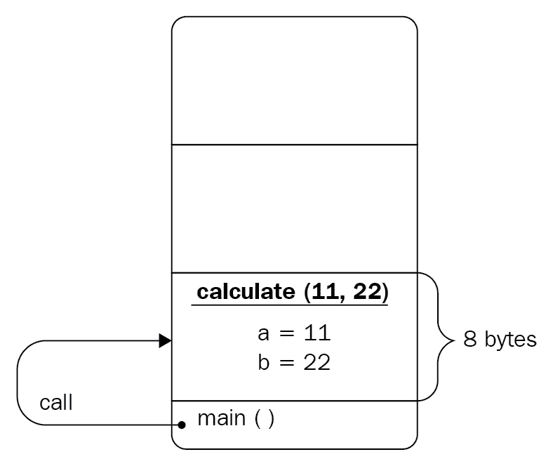
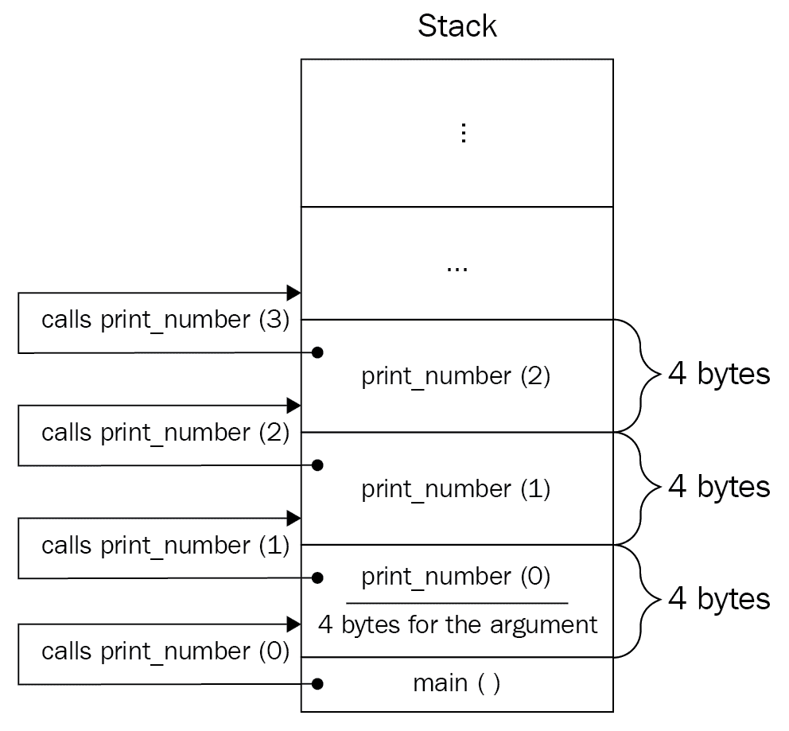
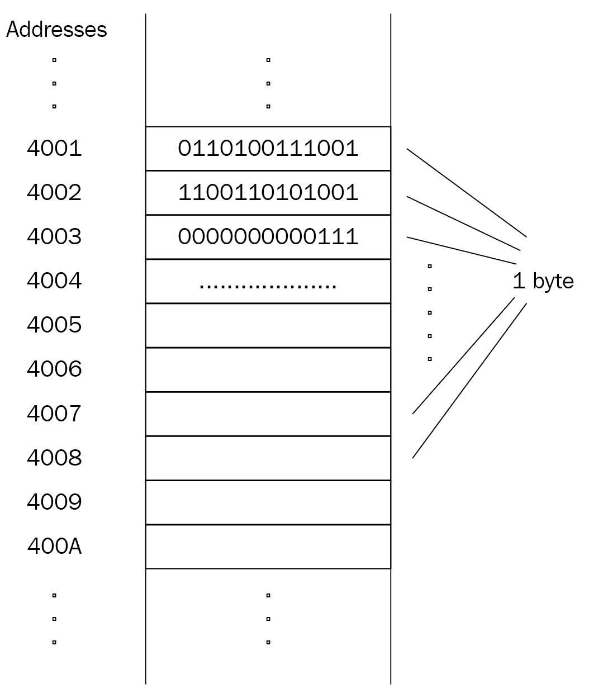
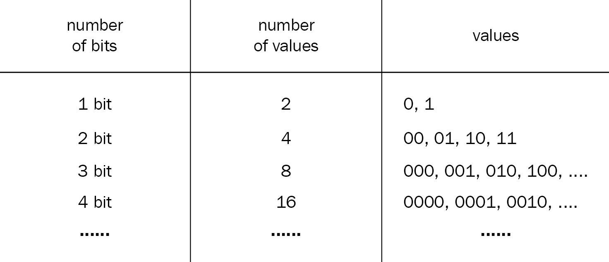
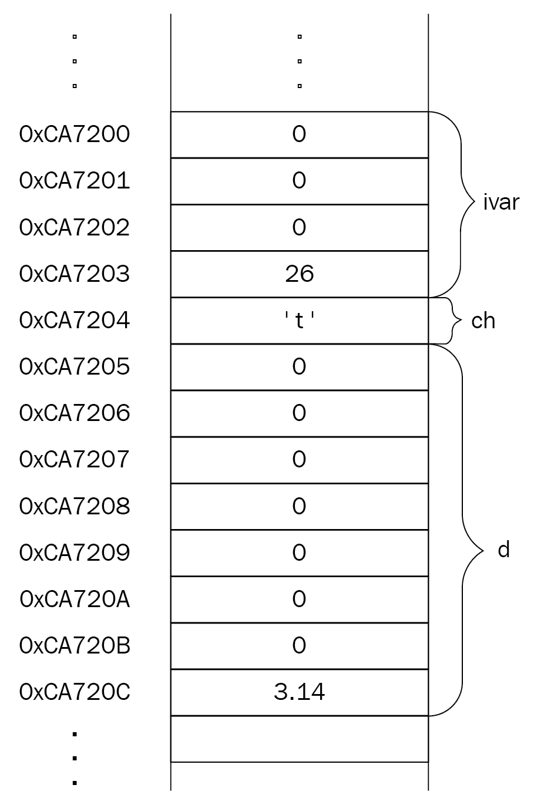
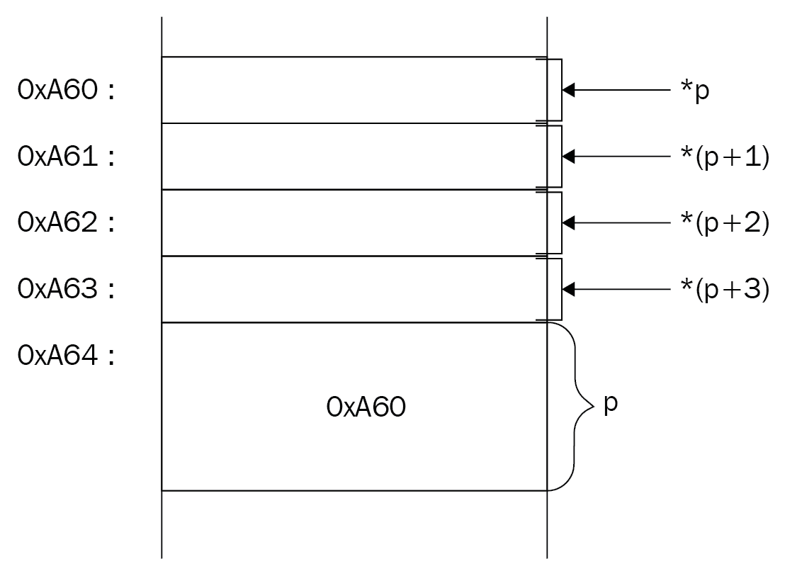
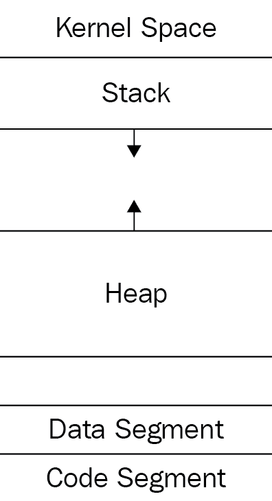
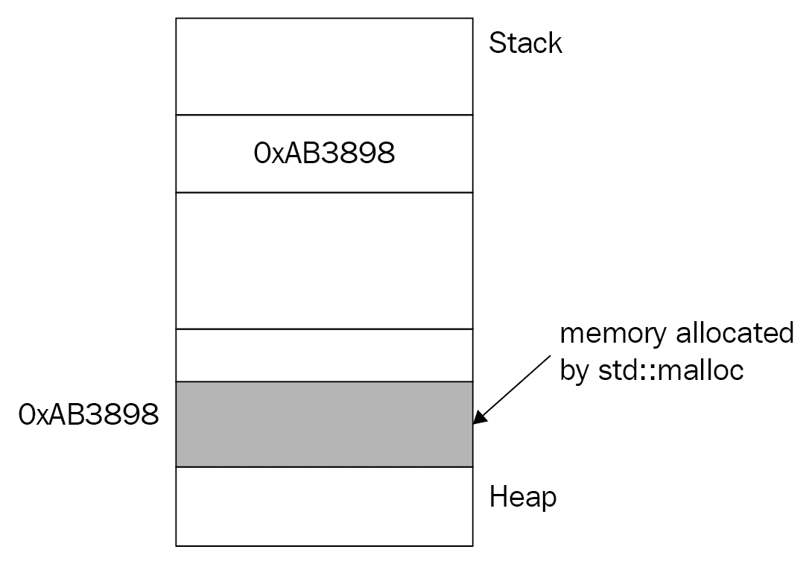
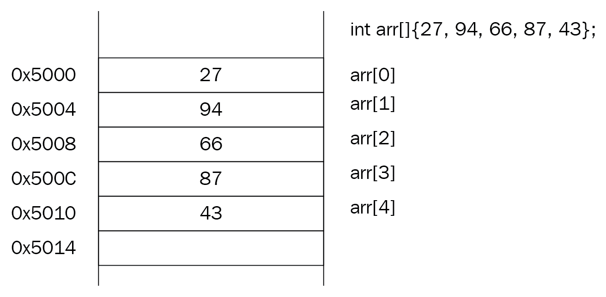

# 用 C++进行低级编程

最初，C++被认为是 C 语言的继承者；然而，从那以后，它演变成了一些大的，有时可怕的，甚至不可救药的东西。随着最近的语言更新，它现在代表了一种复杂的野兽，需要时间和耐心来驯服。我们将从几乎每种语言都支持的基本构造开始这一章，例如数据类型、条件和循环语句、指针、结构和函数。我们将从一个低级系统程序员的角度来看这些结构，好奇一条简单的指令是如何被计算机执行的。在为更高级和抽象的主题(如面向对象编程)建立坚实的基础时，对这些基本结构的深入理解是必不可少的。

在本章中，我们将了解以下方面的更多信息:

*   程序执行的细节及其入口点
*   `main()`函数的特殊性质
*   函数调用和递归背后的复杂性
*   内存段和寻址基础
*   数据类型和变量如何驻留在内存中
*   指针和数组
*   条件句和循环的低级细节

# 技术要求

带有选项`--std=c++2a`的 g++编译器用于编译整个章节的示例。

你可以在[https://github.com/PacktPublishing/Expert-CPP](https://github.com/PacktPublishing/Expert-CPP)找到本章用到的源文件。

# 程序执行

在[第 1 章](01.html)、*构建 C++应用*中，我们了解到编译器在编译源代码后会生成一个可执行文件。可执行文件包含可复制到计算机内存中的机器代码，由**中央处理器** ( **中央处理器**)运行。这种复制是由操作系统的内部工具加载程序完成的。所以**操作系统** ( **OS** )将程序的内容复制到内存中，并通过将其第一条指令传递给 CPU 来开始执行程序。

# main()

程序执行从`main()`功能开始，该功能是标准中规定的程序的*指定开始。输出`Hello, World!`消息的简单程序如下所示:*

```cpp
#include <iostream>
int main() {
  std::cout << "Hello, World!" << std::endl;
  return 0;
}
```

您可能在程序中遇到或使用了`main()`函数的参数。它有两个参数，`argc`和`argv,`允许从环境中传递字符串，通常被称为**命令行参数**。

`argc`和`argv`这两个名字都是约定俗成的，你想要什么都可以代替。`argc`参数保存传递给`main()`函数的命令行参数的数量；`argv`论点支持以下论点:

```cpp
#include <iostream>
int main(int argc, char* argv[]) {
 std::cout << "The number of passed arguments is: " << argc << std::endl;
 std::cout << "Arguments are: " << std::endl;
 for (int ix = 1; ix < argc; ++ix) {
   std::cout << argv[ix] << std::endl;
 }
 return 0;
}
```

例如，我们可以使用以下参数编译并运行前面的示例:

```cpp
$ my-program argument1 hello world --some-option
```

这将向屏幕输出以下内容:

```cpp
The number of passed arguments is: 5
Arguments are:
argument1
hello
world
--some-option
```

当你看论点的数量时，你会注意到它是`5`。第一个参数始终是程序的名称；这就是为什么我们在示例中跳过了它，从数字`1`开始循环。

Rarely, you can see a widely supported but not standardized third argument, most commonly named `envp`. The type of `envp` is an array of `char` pointers and it holds the environment variables of the system.

程序可以包含很多函数，但是程序的执行总是从`main()`函数开始，至少从程序员的角度来看是这样的。让我们试着编译以下代码:

```cpp
#include <iostream>

void foo() {
  std::cout << "Risky foo" << std::endl;
}

// trying to call the foo() outside of the main() function
foo();

int main() {
  std::cout << "Calling main" << std::endl;
  return 0;
}
```

g++在`foo();`调用`C++ requires a type specifier for all declarations`时引发错误。该调用被解析为声明，而不是要执行的指令。在`main()`之前我们尝试调用函数的方式对于经验丰富的开发人员来说可能看起来很傻，所以让我们尝试另一种方式。如果我们声明一个在初始化过程中调用函数的东西呢？在下面的例子中，我们定义了一个`BeforeMain`结构，构造函数打印了一条消息，然后我们在全局范围内声明了一个类型为`BeforeMain`的对象:

```cpp
#include <iostream>

struct BeforeMain {
  BeforeMain() {
 std::cout << "Constructing BeforeMain" << std::endl;
 }
};

BeforeMain b;

int main() {
  std::cout << "Calling main()" << std::endl;
  return 0;
}
```

该示例成功编译，程序输出如下内容:

```cpp
Constructing BeforeMain
Calling main()
```

如果我们在`BeforeMain`中添加一个成员函数并尝试调用它会怎么样？请参见下面的代码来理解这一点:

```cpp
struct BeforeMain {
  // constructor code omitted for brevity
 void test() {
 std::cout << "test function" << std::endl;
 }
};

BeforeMain b;
b.test(); // compiler error

int main() {
  // code omitted for brevity
}
```

对`test()`的调用不会成功。所以我们不能在`main()`之前调用函数，但是我们可以声明变量——默认情况下会被初始化的对象。所以在真正调用`main()`之前，肯定有一些东西会进行*初始化*。原来`main()`功能并不是一个程序的真正起点。程序的实际启动函数准备环境，即收集传递给程序的参数，然后调用`main()`函数。这是必需的，因为 C++支持需要在程序开始之前初始化的全局和静态对象，这意味着在调用`main()`函数之前。在 Linux 世界中，这个功能被称为`__libc_start_main`。编译器通过调用`__libc_start_main`来扩充生成的代码，而在调用`main()`函数之前，它可能调用也可能不调用其他初始化函数。抽象地说，假设前面的代码将被修改为类似于下面的内容:

```cpp
void __libc_start_main() {
  BeforeMain b;
  main();
}
__libc_start_main(); // call the entry point
```

在接下来的章节中，我们将更详细地研究入口点。

# main()的特殊属性

我们的结论是`main()`实际上不是程序的入口点，尽管标准规定它是指定的起点。编译器特别注意`main()`。它的行为类似于常规的 C++函数，但是除了是第一个被调用的函数之外，它还有其他特殊的属性。首先，它是唯一可以省略`return`语句的函数:

```cpp
int main() {
  // works fine without a return statement
}
```

返回值表示执行成功。通过返回`0`，我们的目的是告诉控件`main()`结束成功，所以如果控件到达结束时没有遇到对应的`return`语句，它将认为调用成功，效果与`return 0;`相同。

`main()`函数的另一个有趣的性质是它的返回类型不能自动推导。不允许使用`auto`占位符类型说明符，它表示返回类型将从函数的`return`语句中推导出来。以下是常规函数的工作原理:

```cpp
// C++11
auto foo() -> int {
  std::cout << "foo in alternative function syntax" << std::endl;
  return 0; } // C++14 auto foo() {
  std::cout << "In C++14 syntax" << std::endl;
  return 0;
}
```

通过放置`auto`说明符，我们告诉编译器自动推导`return`类型。在 C++11 中，我们还将类型名放在箭头(`->`)之后，尽管第二种语法更短。考虑`get_ratio()`函数，它以整数形式返回标准比率:

```cpp
auto get_ratio(bool minimum) {
  if (minimum) {
 return 12; // deduces return type int
  }
 return 18; // fine: get_ratio's return type is already deduced to int
}
```

To successfully compile C++ code containing new features specified in C++11, C++14, C++17, or C++20, you should use proper compiler flags. When compiling with g++, use the `--std` flag and specify the standard version. The recommended value is **`--std=c++2a`**.

这个例子编译成功，但是看看当我们用`main()`函数尝试同样的技巧时会发生什么:

```cpp
auto main() {
  std::cout << get_ratio(true);
  return 0;
}
```

编译器将产生以下错误:

*   `cannot initialize return object of type 'auto' with an rvalue of type 'int'`
*   `'main' must return 'int'`。

`main()`功能出现了一些奇怪的情况。这是因为`main()`函数允许省略`return`语句，但是对于编译器来说，`return`语句必须存在才能支持自动`return`类型推演。

重要的是要记住，如果有多个`return`语句，它们必须都推导到同一个类型。让我们假设我们需要一个更新版本的函数，它返回一个整数值(如前面的例子所示)，并且如果指定，返回一个更精确的`float`值:

```cpp
auto get_ratio(bool precise = false) {
  if (precise) {
    // returns a float value
    return 4.114f;
  }
  return 4; // returns an int value
}
```

前面的代码编译不成功，因为有两个推导类型不同的`return`语句。

# 康斯特布尔

`constexpr`说明符声明可以在编译时计算该函数的值。同样的定义也适用于变量。名字本身由`const`和`expression`组成。这是一个有用的特性，因为它允许最大限度地优化您的代码。让我们看看下面的例子:

```cpp
int double_it(int number) {
  return number * 2;
}

constexpr int triple_it(int number) {
  return number * 3;
}

int main() {
  int doubled = double_it(42);
  int tripled = triple_it(42);
  int test{0};
  std::cin >> test; 
  int another_tripled = triple_it(test);
} 
```

让我们看看编译器如何修改前面例子中的`main()`函数。假设编译器不会自行优化`double_it()`函数(例如，使其成为*内联*函数)，`main()`函数将采用以下形式:

```cpp
int main() {
  int doubled = double_it(42);
 int tripled = 126; // 42 * 3  int test = 0;  std::cin >> test;
  int another_tripled = triple_it(test);
}
```

`constexpr`不保证函数值在编译时计算；但是，如果在编译时`constexpr`函数的输入是已知的，编译器就能够这样做。这就是为什么前面的例子直接转换为`tripled`变量的计算值`126`，而对`another_tripled`变量没有影响，因为编译器(和我们)都不知道输入。

**C++20** introduces the `consteval` specifier, allowing you to insist on the compile-time evaluation of the function result. In other words, a `consteval` function produces a constant expression at compile time. The specifier makes the function an *immediate* one, which will produce an error if the function call cannot lead to a constant expression. The `main()` function cannot be declared as `constexpr`.

C++20 还引入了`constinit`说明符。我们使用`constinit`来声明一个具有静态或线程存储持续时间的变量。我们将在[第 8 章](08.html)、*并发和多线程*中讨论线程存储持续时间。与`constinit`最显著的区别在于，我们可以将其用于没有`constexpr`析构函数的对象。这是因为`constexpr`要求对象有静态初始化和不断销毁。此外，`constexpr`使对象常量化，而`constinit`则没有。但是，`constinit`要求对象有静态初始化。

# 递归

`main()`的另一个特殊性质是不能递归调用。从操作系统的角度来看，`main()`函数是程序的入口点，所以再次调用就意味着一切重新开始；因此，禁止使用。然而，仅仅因为函数调用自身就调用函数是部分正确的。例如，`print_number()`函数调用自己并且从不停止:

```cpp
void print_number(int num) {
 std::cout << num << std::endl;
 print_number(num + 1); // recursive call
}
```

调用`print_number(1)`功能会输出数字`1`、`2`、`3`等等。这更像是一个无限调用自己的函数，而不是一个正确的递归函数。我们应该增加一些属性来使`print_number()`函数成为一个有用的递归函数。首先，递归函数必须有一个基本情况，当进一步的函数调用停止时，这意味着递归停止传播。例如，如果我们想打印多达 100 个数字，我们可以为`print_number()`功能制作这样的场景:

```cpp
void print_number(int num) {
 if (num > 100) return; // base case
  std::cout << num << std::endl;
 print_number(num + 1); // recursive call
}
```

函数还有一个属性是递归的:解决最终会导致基本情况的小问题。在前面的例子中，我们已经通过解决函数的一个小问题，即打印一个数字，得到了它。打印完一个数字后，我们进入下一个小问题:打印下一个数字。最后，我们到了基本情况，我们完成了。函数调用自身没有任何魔力；可以把它想象成一个函数用相同的实现调用不同的函数。真正有趣的是递归函数如何影响程序的整体执行。让我们看一个从其他函数调用函数的简单例子:

```cpp
int sum(int n, int m) { return n + m; }
int max(int x, int y) { 
  int res = x > y ? x : y; 
  return res;
}
int calculate(int a, int b) {
  return sum(a, b) + max(a, b);
}

int main() {
  auto result = calculate(11, 22);
  std::cout << result; // outputs 55
}
```

调用函数时，会为其参数和局部变量分配内存空间。程序从`main()`函数开始，在本例中，该函数通过传递文字值`11`和`22`来调用`calculate()`函数。控制*跳转*到`calculate()`功能，`main()`功能有点像*保持*；它等待直到`calculate()`功能返回继续执行。`calculate()`函数有两个参数，`a`和`b`；虽然我们对`sum()`、`max()`和`calculate()`的参数命名不同，但我们可以在所有函数中使用相同的名称。为这两个参数分配了内存空间。假设一个 int 占用 4 个字节的内存，因此`calculate()`函数至少需要 8 个字节才能成功执行。分配 8 个字节后，值`11`和`22`应复制到相应的位置(详见下图):



`calculate()`函数调用函数`sum()`和`max()`，并将其参数值传递给它们。相应地，它等待这两个函数依次执行，以便形成返回到`main()`的值。`sum()`和`max()`功能不同时调用。首先，调用`sum()`，将变量`a`和`b`的值复制到为`sum()`的参数分配的位置，命名为`n`和`m`，这两个变量总共也需要 8 个字节。请看下图，以便更好地理解这一点:


计算并返回它们的总和。在函数完成并返回一个值后，内存空间被释放。这意味着变量`n`和`m`不再可访问，它们的位置可以重用。

We don't consider temporary variables at this point. We will revisit this example later to show the hidden details of function execution, including temporary variables and how to avoid them as much as possible.

`sum()`返回值后，调用`max()`函数。它遵循相同的逻辑:内存被分配给参数`x`和`y`，以及`res`变量。我们有意将三元运算符`(?:)`的结果存储在`res`变量中，以使`max()`函数为本例分配更多空间。因此，总共有 12 个字节分配给`max()`功能。此时，x `main()`功能仍处于保持状态，等待`calculate()`，而`calculate()`又处于保持状态，等待`max()`功能完成(详见下图):


当`max()`完成时，分配给它的内存被释放，它的返回值被`calculate()`用来形成一个要返回的值。同样，当`calculate()`返回时，内存被释放，`main()`函数的局部变量结果将包含`calculate()`返回的值。

`main()`函数随后完成工作，程序退出，也就是说，操作系统释放分配给程序的内存，以后可以将其重新用于其他程序。所描述的为函数分配和释放内存(解除分配)的过程是使用称为堆栈的概念来完成的。

A stack is a data structure *adapter*, which has its rules to insert and access the data inside of it. In the context of function calls, the stack usually means a memory segment provided to the program that automatically manages itself following the rules of the stack data structure adapter. We will discuss this in more detail later in this chapter.

回到递归，当函数调用自己时，内存应该分配给新调用的函数的参数和局部变量(如果有的话)。函数再次调用自己，这意味着堆栈将继续增长(为新函数提供空间)。我们调用同一个函数没关系；从栈的角度来看，每一个新的调用都是对一个完全不同的函数的调用，所以它会一边给它分配空间，脸上带着严肃的表情，一边吹着自己喜欢的歌。请看下图:



递归函数的第一次调用处于保持状态，等待同一个函数的第二次调用，后者又处于保持状态，等待第三次调用完成并返回一个值，后者又处于保持状态，依此类推。如果函数存在 bug 或者递归基数难以到达，栈迟早会过度增长，导致程序崩溃，原因称为**栈溢出**。

Though recursion provides more elegant solutions to a problem, try to avoid recursion in your programs and use the iterative approach (loops). In mission-critical system development guidelines such as the navigation system of a Mars rover, using recursion is completely prohibited.

在[第 1 章](01.html)*构建 C++应用*中，我们提到了协同程序。虽然我们将在本书的后面详细讨论它们，但是您应该注意到主函数不能是协同函数。

# 使用数据

当我们提到计算机内存时，我们默认考虑**随机存取存储器** ( **随机存取存储器**)，随机存取存储器也是静态随机存取存储器或动态随机存取存储器的统称；除非另有说明，否则我们将默认使用 DRAM。为了理清思路，让我们看一下下图，它展示了内存层次结构:


当我们编译一个程序时，编译器将最终的可执行文件存储在硬盘中。为了运行可执行文件，它的指令被加载到内存中，然后由中央处理器逐个执行。这使我们得出结论，任何需要执行的指令都应该在内存中。这是部分正确的。负责运行和监控程序的环境起着主要作用。

我们编写的程序在托管环境中执行，托管环境在操作系统中。操作系统不是直接将程序的内容(其指令和数据，即进程)加载到内存中，而是加载到***虚拟内存中，这种机制既可以方便地处理进程，也可以在进程之间共享资源。每当我们提到一个进程被加载到的内存时，我们指的是虚拟内存，虚拟内存反过来又将*的内容映射到内存中。****

***Most of the time, we use the terms RAM, DRAM, virtual memory, and memory interchangeably, considering virtual memory as an abstraction around the physical memory (the DRAM). 

让我们从介绍内存结构开始，然后研究内存中的数据类型。

# 虚拟内存

内存由许多盒子组成，每个盒子都能够存储指定数量的数据。我们将这些框称为*存储单元*，考虑到每个单元可以存储代表 8 位的 1 个字节。每个存储单元都是唯一的，即使它们存储相同的值。唯一性是通过对单元进行寻址来实现的，这样每个单元在存储器中都有其唯一的地址。第一个单元格的地址为 **0** ，第二个单元格为 **1** ，依此类推。

下图显示了存储器的摘录，每个单元都有其唯一的地址和存储 1 字节数据的能力:



前面的图可以用来抽象地表示物理和虚拟存储器。拥有额外的抽象层的意义在于管理流程和提供比物理内存更多的功能。例如，操作系统可以执行比物理内存更大的程序。以电脑游戏为例，一个程序占用了几乎 2 GB 的空间，一台电脑的物理内存为 512 MB。虚拟内存允许操作系统通过从物理内存中卸载旧部件并映射新部件来逐部分加载程序。

虚拟内存也更好地支持内存中有多个程序，从而支持多个程序的并行(或伪并行)执行。这也提供了共享代码和数据的有效使用，例如动态库。每当两个不同的程序需要使用同一个库时，这个库的单个实例就可能存在于内存中，并被两个程序使用，而它们彼此之间却不知道。请看下图，它描述了加载到内存中的三个程序:


在上图中有三个正在运行的程序；每个程序都占用了虚拟内存中的一些空间。**我的程序**完全包含在物理内存中，而**计算器**和**文本编辑器**部分映射到它。

# 演说

如前所述，每个存储单元都有其唯一的**地址**，这是每个单元唯一性的保证。地址通常以*十六进制*形式表示，因为它更短，转换成**二进制**比十进制数字更快。加载到虚拟内存中的程序运行并看到*逻辑*地址。这些地址，也称为虚拟地址，是*伪造的*，由操作系统提供，操作系统在需要时将*转换为*物理地址。为了优化翻译，中央处理器提供了**翻译后备缓冲器**，这是其**内存管理单元** ( **内存管理单元**)的一部分。翻译后备缓冲器缓存虚拟地址到物理地址的最近翻译。因此，高效的地址转换是一项软件/硬件任务。我们将在[第 5 章](05.html)、*内存管理和智能指针*中深入探讨地址结构和翻译细节。

地址的长度定义了系统可操作的总内存大小。当您遇到 32 位系统或 64 位系统之类的语句时，它实际上意味着地址的长度，也就是说，地址是 32 位或 64 位长。地址越长，内存越大。为了清楚起见，让我们比较一个 8 位长的地址和一个 32 位长的地址。如前所述，每个存储单元能够存储 1 字节的数据，并且具有唯一的地址。如果地址长度为 8 位，则第一个存储单元的地址全为零— **0000 0000** 。下一个小区的地址大一，就是 **0000 0001** 等等。

可以用 8 位表示的最大值是 **1111 1111** 。那么，一个 8 位的地址长度能代表多少个存储单元呢？这个问题值得更详细的回答。1 位可以表示多少个不同的值？两个！为什么这样因为 1 位可以代表 **1** 或 **0** 。2 位可以表示多少个不同的值？嗯， **00** 是一个值， **01** 是另一个值， **10** ，最后， **11** 。因此，总共四个不同的值可以用 2 位来表示。让我们做一张桌子:



我们可以在这里看到一个模式。一个数中的每个位置(每个位)可以有两个值，所以我们可以通过求*2<sup>N</sup>T5】来计算 *N* 位所代表的不同值的个数；因此，8 位表示的不同值的个数为 *2 <sup>8</sup> = 256* 。这意味着一个 8 位系统最多可以寻址 256 个存储单元。另一方面，32 位系统能够寻址 *2 <sup>32</sup> = 4 个 294 967 296* 存储单元，每个存储 1 字节的数据，即存储 *4294967296 * 1 字节= 4 GB* 的数据。*

# 数据类型

拥有数据类型到底有什么意义？为什么我们不能用 C++编程，用一些`var`关键字来声明变量，忘记`short`、`long`、`int`、`char`、`wchar`等变量呢？嗯，C++确实支持一个类似的构造，我们在本章前面已经使用过的`auto`关键字，一个所谓的*占位符类型说明符*。它被命名为占位符，因为它确实是一个占位符。我们不能(也绝不能)声明一个变量，然后在运行时改变它的类型。以下代码可能是有效的 JavaScript 代码，但绝对不是有效的 C++代码:

```cpp
var a = 12;
a = "Hello, World!";
a = 3.14;
```

想象一下，C++编译器可以编译这段代码。`a`变量应该分配多少字节的内存？在声明`var a = 12;`时，编译器可以将其类型推导为`int`并指定 4 字节的内存空间，但是当变量将其值更改为`Hello, World!`时，编译器必须重新分配空间，或者发明一个名为`std::string`类型的新隐藏变量`a1`。然后，编译器会尝试在代码中查找对变量的每一次访问，这些访问是以字符串的形式进行的，而不是以整数或双精度的形式，并用隐藏的`a1`替换变量。编译器可能会退出，开始问自己生命的意义。

我们可以用 C++声明类似于前面代码的内容，如下所示:

```cpp
auto a = 12;
auto b = "Hello, World!";
auto c = 3.14;
```

前面两个示例的区别在于，第二个示例声明了三种不同类型的三个不同变量。前面的非 C++代码只声明了一个变量，然后给它分配了不同类型的值。在 C++中你不能改变变量的类型，但是编译器允许你使用`auto`占位符，并通过赋值来推导变量的类型。

理解类型是在编译时推导出来的，而像 JavaScript 这样的语言允许您在运行时推导出类型，这一点至关重要。后者是可能的，因为这种程序在虚拟机等环境中运行，而运行 C++程序的唯一环境是操作系统。C++编译器必须生成一个有效的可执行文件，该文件可以复制到内存中，并且在没有支持系统的情况下运行。这迫使编译器事先知道变量的实际大小。知道大小对于生成最终的机器代码很重要，因为访问变量需要它的地址和大小，为变量分配内存空间需要它应该占用的字节数。

C++类型系统将类型分为两大类:

*   **基本型** ( `int`、`double`、`char`、`void`)
*   **复合类型**(指针、数组、类)

该语言甚至支持特殊的类型特征`std::is_fundamental`和`std::is_compound`，以找出类型的类别，例如:

```cpp
#include <iostream>
#include <type_traits>

struct Point {
  float x;
  float y;
};

int main() {
  std::cout << std::is_fundamental_v<Point> << " "
            << std::is_fundamental_v<int> << " "
            << std::is_compound_v<Point> << " "
            << std::is_compound_v<int> << std::endl;
}
```

我们使用了`std::is_fundamental_v`和`std::is_compound_v`辅助变量模板，定义如下:

```cpp
template <class T>
inline constexpr bool is_fundamental_v = is_fundamental<T>::value;
template <class T>
inline constexpr bool is_compound_v = is_compound<T>::value;
```

程序输出:`0 1 1 0`。

You can use the `std::boolalpha` I/O manipulator before printing the type categories to print `true` or `false` instead of `1` or `0`.

基本类型多为`int`或`double`等算术类型；甚至`char`式也是算术。它实际上包含一个数字而不是一个字符，例如:

```cpp
char ch = 65;
std::cout << ch; // prints A
```

一个`char`变量保存 1 个字节的数据，这意味着它可以表示 256 个不同的值(因为 1 个字节是 8 位，8 位可以用*2<sup>8</sup>T5】的方式来表示一个数字)。如果我们使用其中一个位作为*符号*位，例如，允许类型也支持负值，会怎么样？这就给我们留下了 7 位来表示实际值，按照同样的逻辑，它允许我们表示 27 个不同的值，即 128 个(包括 0 个)不同的正数值和相同数量的负值。排除 0 给出了符号`char`的-127 到+127 的范围。这种有符号和无符号的表示适用于几乎所有的整数类型。*

因此，无论何时遇到这种情况，例如，int 的大小是 4 字节，也就是 32 位，您应该已经知道可以用无符号表示法表示数字 0 到 2 <sup>32</sup> ，用有符号表示法表示值-2 <sup>31</sup> 到+2 <sup>31</sup> 。

# 两颗北极指极星

C++是一种独特的语言，因为它提供了对低级细节的访问，例如变量的地址。我们可以使用`&`运算符获取程序中声明的任何变量的地址，如图所示:

```cpp
int answer = 42;
std::cout << &answer;
```

这段代码将输出类似如下的内容:

```cpp
0x7ffee1bd2adc
```

请注意地址的十六进制表示。虽然这个值只是一个整数，但它被用来存储在一个称为指针的特殊变量中。指针只是一个能够存储地址值的变量，支持`*`运算符(解引用)，允许我们找到存储在地址的实际值。

例如，为了存储前面示例中变量答案的地址，我们可以声明一个指针，并将地址分配给它:

```cpp
int* ptr = &answer;
```

变量答案声明为`int`，通常占用 4 字节的内存空间。我们已经同意每个字节都有自己唯一的地址。我们能得出答案变量有四个唯一的地址吗？好吧，有和没有。它确实获取了四个不同但连续的内存字节，但是当对变量使用地址运算符时，它会返回其第一个字节的地址。让我们看一下声明几个变量的部分代码，然后说明它们是如何放在内存中的:

```cpp
int ivar = 26;
char ch = 't';
double d = 3.14;
```

数据类型的大小是由实现定义的，尽管 C++标准规定了每种类型支持的最小值范围。让我们假设实现为`int`提供 4 个字节，为 double 提供 8 个字节，为`char`提供 1 个字节。前面代码的内存布局应该如下所示:



注意内存布局中的`ivar`；它驻留在四个连续的字节中。

每当我们取一个变量的地址时，无论它是驻留在一个字节中还是多于一个字节中，我们都会得到该变量第一个字节的地址。如果大小不影响地址操作符背后的逻辑，那我们为什么要声明指针的类型呢？为了存储上例中`ivar`的地址，我们应该将指针声明为`int*`:

```cpp
int* ptr = &ivar;
char* pch = &ch;
double* pd = &d;
```

下图描述了前面的代码:


事实证明，在使用指针访问变量时，指针的类型至关重要。C++提供了解引用操作符(指针名称前的`*`符号):

```cpp
std::cout << *ptr; // prints 26
```

它基本上是这样工作的:

1.  读取指针的内容
2.  查找与指针中的地址相等的存储单元地址
3.  返回存储在该存储单元中的值

问题是，如果指针指向驻留在多个存储单元中的数据会怎么样？这就是指针的类型。当对指针解引用时，它的类型用于确定它应该从它所指向的存储单元开始读取和返回多少字节。

既然我们知道指针存储了变量第一个字节的地址，我们实际上可以通过向前移动指针来读取变量的任何字节。我们应该记住，地址只是一个数字，所以在它上面加上或减去另一个数字就会产生另一个地址。如果我们用`char`指针指向一个整数变量呢？

```cpp
int ivar = 26;
char* p = (char*)&ivar;
```

当我们试图取消引用`p`指针时，它将只返回`ivar`的第一个字节。

现在，如果我们想移动到`ivar`的下一个字节，我们将`1`添加到`char`指针:

```cpp
// the first byte
*p;
// the second byte
*(p + 1);
// the third byte
*(p + 2);

// dangerous stuff, the previous byte
*(p - 1);
```

请看下图；它清楚地显示了我们如何访问`ivar`整数的字节:



如果要读取第一个或最后两个字节，可以使用短指针:

```cpp
short* sh = (short*)&ivar;
std::cout << *sh; // print the value in the first two bytes of ivar
std::cout << *(sh + 1); // print the value in the last two bytes of ivar
```

You should be careful with pointer arithmetics, as adding or subtracting a number will actually move the pointer by the defined size of the data type. Adding 1 to an `int` pointer will add `sizeof(int) * 1` to the actual address.

指针的大小呢？如前所述，指针只是一个特殊的变量，因为它可以存储一个内存地址，并提供一个解引用运算符来返回位于该地址的数据。因此，如果指针只是一个变量，它也应该驻留在内存中。我们可能会认为`char`指针的大小小于`int`指针的大小，只是因为`char`的大小小于`int`的大小。

问题是:存储在指针中的数据与指针指向的数据类型无关。`char`和`int`指针都存储变量的地址，所以定义指针的大小，要考虑地址的大小。地址的大小由我们工作的系统定义。例如，在 32 位系统中，地址长度为 32 位，在 64 位系统中，地址长度为 64 位。这使我们得出一个合乎逻辑的结论:指针的大小是相同的，不管它指向的数据类型是什么:

```cpp
std::cout << sizeof(ptr) << " = " << sizeof(pch) << " = " << sizeof(pd);
```

它将在 32 位系统中输出`4 = 4 = 4`，在 64 位系统中输出`8 = 8 = 8`。

# 内存段

存储器由段组成，程序段在加载期间通过这些存储器段分布。这些是人为划分的内存地址范围，便于操作系统管理程序。二进制文件也分为段，如代码和数据。我们前面提到了代码和数据。节是链接器所需的二进制文件的一部分，它使用链接器正常工作所需的节，并将加载器所需的节组合成段。

基本上，当我们从运行时的角度讨论二进制文件时，我们指的是段。数据段包含程序所需和使用的所有数据，代码段包含处理完全相同数据的实际指令。然而，当我们提到数据时，我们并不是指程序中使用的每一条数据。让我们看一下这个例子:

```cpp
#include <iostream>
int max(int a, int b) { return a > b ? a : b; }
int main() {
  std::cout << "The maximum of 11 and 22 is: " << max(11, 22);
}
```

前面程序的代码段由`main()`和`max()`函数的指令组成，其中`main()`使用`cout`对象的`operator<<`打印消息，然后调用`max()`函数。哪些数据实际驻留在数据段中？是否包含`max()`函数的`a`和`b`参数？事实证明，数据段中包含的唯一数据是字符串`The maximum of 11 and 22 is:`，以及其他静态、全局或常量数据。我们没有声明任何全局或静态变量，所以唯一的数据是提到的消息。

有趣的是`11`和`22`的值。这些是文字值，这意味着它们没有地址；因此它们不位于存储器中的任何地方。如果它们不在任何地方，那么它们在程序中的位置的唯一合理解释就是它们位于代码段中。他们是`max()`召唤指令的一部分。

那么`max()`函数的`a`和`b`参数呢？虚拟内存中负责存储具有自动存储持续时间的变量的段来了——堆栈。如前所述，堆栈自动处理局部变量和函数参数的内存空间分配/释放。调用`max()`函数时，参数`a`和`b`将位于堆栈中。一般来说，如果一个对象被称为具有自动存储持续时间，那么存储空间将在封闭块的开始被分配。因此，当调用该函数时，它的参数被推入堆栈:

```cpp
int max(int a, int b) {
 // allocate space for the "a" argument
 // allocate space for the "b" argument
  return a > b ? a : b;
 // deallocate the space for the "b" argument
 // deallocate the space for the "a" argument
}
```

当函数完成时，自动分配的空间将在封闭代码块的末尾释放。

The enclosing code block represents not only the function body but also the block of the conditional statements and loops. 

据说参数(或局部变量)从堆栈中弹出。 **Push** 和 **pop** 是堆栈上下文中使用的术语。通过*推动*将数据插入堆栈，通过*弹出*将数据从堆栈中取出。你可能遇到过**后进先出**这个术语，代表**后进先出**。这完美地描述了堆栈的推送和弹出操作。

当程序运行时，操作系统提供固定大小的堆栈。堆栈的大小可以增长，如果增长到没有剩余空间的程度，就会因为堆栈溢出而崩溃。

# 相助

我们将堆栈描述为具有自动存储持续时间的变量管理器。*自动*这个词表明程序员不应该关心实际的内存分配和释放。只有预先知道数据的大小或数据的集合，才能实现自动存储持续时间。这样，编译器就知道函数参数和局部变量的数量和类型。在这一点上，它看起来非常好，但是程序倾向于处理动态数据——未知大小的数据。我们将在[第五章](05.html)、*内存管理和智能指针中详细学习动态内存管理；*现在，让我们看一下内存段的简化图，找出堆的用途:



程序使用堆段来请求比以前更多的内存空间。这是在运行时完成的，这意味着内存是在程序执行期间动态分配的。只要需要，程序就会向操作系统请求新的内存空间。操作系统实际上并不知道一个整数、一个用户定义的`Point`，甚至一组用户定义的`Point`是否需要内存。程序通过传递所需的实际字节大小来请求内存。例如，要为类型为`Point`的对象请求空间，`malloc()`功能可以如下使用:

```cpp
#include <cstdlib>
struct Point {
  float x;
  float y;
};

int main() {
 std::malloc(sizeof(Point));
}
```

The `malloc()` function came from the C language and to use it we need to include the `<cstdlib>` header file.

`malloc()`函数分配一个连续的`sizeof(Point)`字节的内存空间——比如说 8 字节。然后，它返回该内存第一个字节的地址，因为这是提供空间访问的唯一方法。问题是，`malloc()`实际上并不知道我们是为一个`Point`对象还是一个`int`请求内存空间，它只是返回`void*`。`void*`存储分配内存的第一个字节的地址，但绝对不能因为`void`没有定义数据的大小，就通过解引用指针来获取实际数据。请看下图；它显示`malloc`在堆上分配内存:



为了实际使用内存空间，我们需要将`void`指针转换为所需的类型:

```cpp
void* raw = std::malloc(sizeof(Point)); Point* p = static_cast<Point*>(raw); 
```

或者，只需声明并用强制转换结果初始化指针:

```cpp
Point* p = static_cast<Point*>(std::malloc(sizeof(Point))); 
```

C++通过引入`new`运算符解决了这个难题，该运算符自动获取要分配的内存空间大小，并将结果转换为所需的类型:

```cpp
Point* p = new Point;
```

Dynamic memory management is a manual process; there is no similar construct to the stack that automatically deallocates the memory space if it is not required anymore. To manage the memory resource correctly, we should use the `delete` operator when we want to deallocate the space. We will find out the details in [Chapter 5](05.html) *Memory Management and Smart Pointers*.

当我们访问`p`指向的`Point`对象的成员时会发生什么？取消引用`p`返回完整的`Point`对象，因此要更改成员`x`的值，我们应该执行以下操作:

```cpp
(*p).x = 0.24;
```

或者，更好的是，使用箭头操作符访问它:

```cpp
p->x = 0.24;
```

我们将在[第 3 章](03.html)、*面向对象编程的细节中深入探讨用户定义的类型和结构。*

# 数组

数组是提供连续存储在内存中的数据集合的基本数据结构。许多适配器，如堆栈，都是使用数组实现的。它们的唯一性是数组元素都是同一类型的，这在访问数组元素时起着关键作用。例如，下面的声明创建了一个 10 个整数的数组:

```cpp
int arr[]{0, 1, 2, 3, 4, 5, 6, 7, 8, 9};
```

数组的名称衰减为指向其第一个元素的指针。考虑到数组元素具有相同类型的事实，我们可以通过将指针前进到数组的第一个元素来访问数组的任何元素。例如，下面的代码打印数组的第三个元素:

```cpp
std::cout << *(arr + 2);
```

第一个要素也是如此；以下三行代码做着同样的事情:

```cpp
std::cout << *(arr + 0);
std::cout << *arr;
std::cout << arr[0];
```

为了确保`arr[2]`和`*(arr + 2)`做完全相同的事情，我们可以做以下事情:

```cpp
std::cout << *(2 + arr);
```

将`2`移到`+`后面不会影响结果，所以下面的代码也是有效的:

```cpp
std::cout << 2[arr];
```

它打印数组的第三个元素。

数组元素在恒定时间内被访问，这意味着访问数组的第一个和最后一个元素需要相同的时间。这是因为每次我们访问数组元素时，我们都会执行以下操作:

1.  通过添加相应的数值来推进指针
2.  读取放置在结果指针处的存储单元的内容

阵列的类型指示应该读取(或写入)多少存储单元。下图说明了访问:



当创建动态数组时，这个想法是至关重要的，动态数组是位于堆中而不是堆栈中的数组。正如我们已经知道的，从堆中分配内存给出了它的第一个字节的地址，所以访问第一个字节之外的元素的唯一机会是使用指针算法:

```cpp
int* arr = new int[10];
arr[4] = 2; // the same as *(arr + 4) = 2 
```

我们将在[第 6 章](06.html)、*深入研究 STL 中的数据结构和算法中讨论更多关于数组和其他数据结构的结构。*

# 控制流

几乎任何编程语言最基本的概念都是条件语句和循环。我们将详细探讨它们。

# 条件式

很难想象一个不包含条件语句的程序。检查函数的输入参数以确保它们的安全执行几乎是一种习惯。例如，`divide()`函数取两个参数，一个除以另一个，返回结果。很明显，我们需要确保除数不为零:

```cpp
int divide(int a, int b) {
 if (b == 0) {
    throw std::invalid_argument("The divisor is zero");
  }
  return a / b;
}
```

条件句是编程语言的核心；毕竟，程序是行动和决策的集合。例如，下面的代码使用条件语句从两个输入参数中找出最大值:

```cpp
int max(int a, int b) {
  int max;
 if (a > b) {
    // the if block
    max = a;
 } else {
    // the else block
    max = b;
  }
  return max;
}
```

前面的例子为了表达`if` - `else`语句的用法，故意过于简化。然而，我们最感兴趣的是这样一个条件语句的实现。编译器遇到`if`语句时会生成什么？CPU 一个接一个地按顺序执行指令，指令就是做一件事的简单命令。我们可以在 C++这样的高级编程语言中单行使用复杂的表达式，而汇编指令则是一个周期只能做一个简单操作的简单命令:`move`、`add`、`subtract`等等。

中央处理器从代码内存段中取出指令，对其进行解码，找出它应该做什么(移动数据、添加数字、减去数字)，然后执行该命令。

为了以最快的速度运行，中央处理器将操作数和执行结果存储在名为**寄存器**的存储单元中。你可以把寄存器看作是中央处理器的临时变量。寄存器是位于中央处理器内的物理存储单元，因此与随机存取存储器相比，存取速度要快得多。要从汇编语言程序访问寄存器，我们使用它们指定的名称，如`rax`、`rbx`、`rdx`等。中央处理器的命令作用于寄存器，而不是内存单元；这就是为什么 CPU 必须将变量的内容从存储器复制到寄存器，执行操作并将结果存储在寄存器中，然后将寄存器的值复制回存储单元。

例如，下面的 C++表达式只需要一行代码:

```cpp
a = b + 2 * c - 1;
```

它看起来类似于下面的程序集表示(注释添加在分号之后):

```cpp
mov rax, b; copy the contents of "b" 
          ; located in the memory to the register rax
mov rbx, c; the same for the "c" to be able to calculate 2 * c
mul rbx, 2; multiply the value of the rbx register with 
          ; immediate value 2 (2 * c)
add rax, rbx; add rax (b) with rbx (2*c) and store back in the rax
sub rax, 1; subtract 1 from rax
mov a, rax; copy the contents of rax to the "a" located in the memory
```

条件语句建议跳过部分代码。例如，调用`max(11, 22)`意味着将省略`if`块。为了用汇编语言表达这一点，使用了跳转的思想。我们比较两个值，并根据结果跳转到代码的指定部分。我们给这个部分贴上标签，这样就可以找到指令集。例如，要跳过将`42`添加到寄存器`rbx`中，我们可以使用无条件跳转指令`jpm`将*跳转到标注为`UNANSWERED`的部分，如图所示:*

```cpp
mov rax, 2
mov rbx, 0
jmp UNANSWERED
add rbx, 42; will be skipped
UNANSWERED:
  add rax, 1
  ; ...
```

`jmp`指令执行无条件跳转；这意味着它在没有任何条件检查的情况下，在指定的标签上开始执行第一条指令。好消息是，中央处理器也提供了条件跳转。`max()`功能的主体将转换为以下汇编代码(简化)，其中`jg`和`jle`命令分别解释为大于的*跳转和小于或等于*的*跳转(基于使用`cmp`指令的比较结果):*

```cpp
mov rax, max; copy the "max" into the rax register
mov rbx, a
mov rdx, b
cmp rbx, rdx; compare the values of rbx and rdx (a and b)
jg GREATER; jump if rbx is greater than rdx (a > b)
jl LESSOREQUAL; jump if rbx is lesser than
GREATER:
  mov rax, rbx; max = a
LESSOREQUAL:
  mov rax, rdx; max = b
```

在前面的代码中，标签`GREATER`和`LESSOREQUAL`表示之前实现的`max()`函数的`if`和`else`子句。

# switch 语句

像`switch`语句这样的条件使用相同的逻辑，如图所示:

```cpp
switch (age) {
case 18:
  can_drink = false;
  can_code = true;
  break;
case 21: 
  can_drink = true;
  can_code = true;
 break;
default: 
  can_drink = false;
}
```

假设`rax`代表年龄，`rbx`代表`can_drink`，`rdx`代表`can_code`。前面的例子将转化为下面的组装说明(简化以表达基本思想):

```cpp
cmp rax, 18
je CASE_18
cmp rax, 21
je CASE_21
je CASE_DEFAULT
CASE_18:
  mov rbx, 0; cannot drink
  mov rdx, 1; can code
  jmp BEYOND_SWITCH; break
CASE_21:
 mov rbx, 1
 mov rdx, 1
 jmp BEYOND_SWITCH
CASE_DEFAULT:
 mov rbx, 0
BEYOND_SWITCH:
  ; ....
```

每个`break`语句都翻译成跳转到`BEYOND_SWITCH`标签，所以如果我们忘记了`break`关键字，例如`age`是`18`的情况下，执行也会通过`CASE_21`到达。这就是为什么你不应该忘记`break`声明。

让我们找到一种避免在源代码中使用条件句的方法，既能使代码更短，又可能更快。我们将使用函数指针。

# 用函数指针替换条件句

之前，我们看了内存段，其中最重要的一段是代码段(也称为文本段)。该段包含程序映像，它是应该执行的程序指令。指令通常被分组到函数中，函数提供了一个唯一的名称，允许我们从其他函数中调用它们。函数位于可执行文件的代码段中。

函数有它的地址。我们可以声明一个获取函数地址的指针，然后在以后使用它来调用该函数:

```cpp
int get_answer() { return 42; }
int (*fp)() = &get_answer;
// int (*fp)() = get_answer; same as &get_answer
```

函数指针的调用方式与原始函数相同:

```cpp
get_answer(); // returns 42
fp(); // returns 42
```

假设我们正在编写一个程序，从输入中获取两个数字和一个字符，并对这些数字执行算术运算。操作由字符指定，无论是`+`、`-`、`*`还是`/`。我们实现了`add()`、`subtract()`、`multiply()`和`divide()`四个功能，并根据字符输入的值调用其中一个。

我们将使用哈希表将操作的类型映射到指定的函数，而不是在一堆`if`语句或一个`switch`语句中检查字符的值:

```cpp
#include <unordered_map>
int add(int a, int b) { return a + b; }
int subtract(int a, int b) { return a - b; }
int multiply(int a, int b) { return a * b; }
int divide(int a, int b) { return (b == 0) ? 0 : a / b; }

int main() {
 std::unordered_map<char, int (*)(int, int)> operations;
 operations['+'] = &add;
 operations['-'] = &subtract;
 operations['*'] = &multiply;
 operations['/'] = &divide;
  // read the input 
  char op;
  int num1, num2;
  std::cin >> num1 >> num2 >> op;
  // perform the operation, as follows
 operations[op](num1, num2);
}

```

如您所见，`std::unordered_map`将`char`映射到定义为`(*)(int, int)`的函数指针。也就是说，它可以指向任何接受两个整数并返回一个整数的函数。

The hash table is represented by `std::unordered_map`, defined in the `<unordered_map>` header. We will discuss it in detail in  [Chapter 6](06.html), *Digging into Data Structures and Algorithms in STL*

现在我们不需要写以下内容:

```cpp
if (op == '+') {
  add(num1, num2);
} else if (op == '-') {
  subtract(num1, num2);
} else if (op == '*') {
  ...
```

相反，我们简单地调用由字符映射的函数:

```cpp
operations[op](num1, num2);
```

Though the use of a hash table is much prettier and looks more professional, you should take care of unexpected cases, such as invalid user input. 

# 作为类型的函数

`unordered_map`的第二个参数是`int (*)(int, int)`，字面意思是指向取两个整数并返回一个整数的函数的指针。C++支持类模板`std::function`作为通用函数包装器，允许我们存储可调用对象，包括普通函数、lambda 表达式、函数对象等等。存储的对象被称为`std::function`的目标，如果没有目标，调用时会抛出`std::bad_function_call`异常。这有助于我们使`operations`哈希表接受任何可调用对象作为其第二个参数，并处理异常情况，如前面提到的无效字符输入。

下面的代码块说明了这一点:

```cpp
#include <functional>
#include <unordered_map>
// add, subtract, multiply and divide declarations omitted for brevity
int main() {
  std::unordered_map<char, std::function<int(int, int)> > operations;
  operations['+'] = &add;
  // ...
}
```

注意`std::function`的参数；它的形式是`int(int, int)`而不是`int(*)(int, int)`。使用`std::function`帮助我们处理异常情况。例如，调用`operations['x'](num1, num2);`将导致创建映射到角色`x`的空`std::function`。

并且调用它将引发异常，因此我们可以通过正确处理调用来确保代码的安全:

```cpp
// code omitted for brevity
std::cin >> num1 >> num2 >> op;
try {
 operations[op](num1, num2);
} catch (std::bad_function_call e) {
  // handle the exception
  std::cout << "Invalid operation";
}
```

最后，我们可以使用 *lambda 表达式—* 未命名的函数，这些函数在适当的位置构造，并且能够捕获范围内的变量。例如，我们可以在将 lambda 表达式插入哈希表之前创建它，而不是声明前面的函数，然后将它们插入哈希表:

```cpp
std::unordered_map<char, std::function<int(int, int)> > operations;
operations['+'] = [](int a, int b) { return a + b; }
operations['-'] = [](int a, int b) { return a * b; }
// ...
std::cin >> num1 >> num2 >> op;
try {
  operations[op](num1, num2);
} catch (std::bad_functional_call e) {
  // ...
}
```

Lambda 表达式将贯穿全书。

# 环

循环可能被认为是可重复的`if`语句，同样应该被翻译成 CPU 比较和跳转指令。例如，我们可以使用`while`循环计算从 0 到 10 的数字之和:

```cpp
auto num = 0;
auto sum = 0;
while (num <= 10) {
  sum += num;
  ++num;
}
```

这将转换为以下汇编代码(简化):

```cpp
mov rax, 0; the sum
mov rcx, 0; the num
LOOP:
  cmp rbx, 10
  jg END; jump to the END if num is greater than 10
  add rax, rcx; add to sum
  inc rcx; increment num
  jmp LOOP; repeat
END:
  ...
```

C++17 引入了可以在条件和循环中使用的 init 语句。在`while`循环外声明的`num`变量现在可以移入循环:

```cpp
auto sum = 0;
while (auto num = 0; num <= 10) {
  sum += num;
  ++num;
}
```

同样的规则也适用于`if`语句，例如:

```cpp
int get_absolute(int num) {
  if (int neg = -num; neg < 0) {
    return -neg;
  }
  return num;
}
```

C++11 引入了基于范围的`for`循环，使得语法更加清晰。例如，让我们使用新的`for`循环调用前面定义的所有算术运算:

```cpp
for (auto& op: operations) {
  std::cout << op.second(num1, num2);
}
```

迭代`unordered_map`返回第一个和第二个成员的一对，第一个是键，第二个是映射到该键的值。C++17 让我们走得更远，允许我们编写如下同样的循环:

```cpp
for (auto& [op, func]: operations) {
  std::cout << func(num1, num2);
}
```

了解编译器实际生成什么是设计和实现高效软件的关键。我们谈到了条件和循环的底层细节，这是几乎每个程序的基础。

# 摘要

在本章中，我们介绍了程序执行的细节。我们讨论了函数和具有一些特殊性质的`main()`函数。我们发现了递归是如何工作的，并且`main()`函数不能被递归调用。

由于 C++是少数支持低级编程概念(如按地址访问内存字节)的高级语言之一，我们研究了数据如何驻留在内存中，以及如何在访问数据时结合指针。对于专业的 C++程序员来说，了解这些细节是必须的。

最后，我们从汇编语言的角度讨论了条件句和循环。在本章中，我们介绍了 C++20 的特性。

在下一章中，我们将了解更多关于**面向对象编程** ( **OOP** )的内容，包括语言对象模型的内部细节。我们将深入研究虚函数的细节，看看如何使用多态性。

# 问题

1.  `main()`功能有多少参数？
2.  `constexpr`说明符是用来做什么的？
3.  为什么建议使用迭代而不是递归？
4.  栈和堆有什么区别？

5.  如果声明为`int*`，那么`ptr`的大小是多少？
6.  为什么对数组元素的访问被认为是恒定时间操作？
7.  如果我们在`switch`语句的任何情况下忘记`break`关键字会发生什么？
8.  如何将算术运算示例中的`multiply()`和`divide()`函数实现为λ表达式？

# 进一步阅读

关于本章所涉及的主题，您可以参考以下书籍了解更多信息: *C++高性能*，作者维克多·瑟尔和比约恩·安德里斯特([https://www.amazon.com/gp/product/1787120953](https://www.amazon.com/gp/product/1787120953))。***