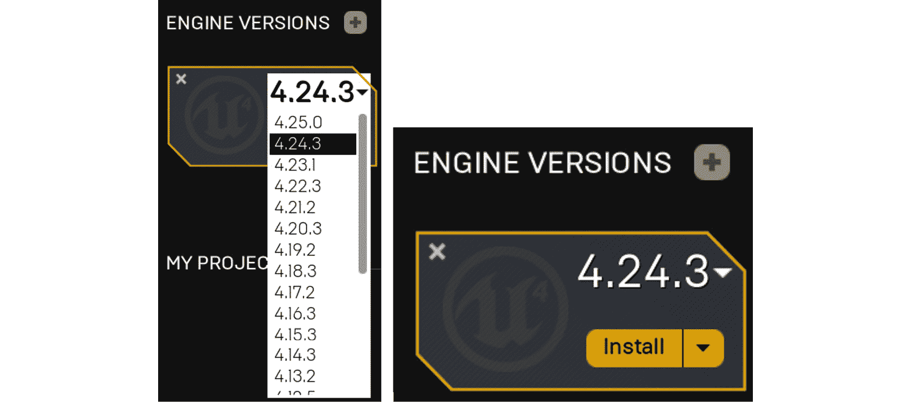

# 前言

# 关于书

游戏开发可以是一种创造性的满足爱好，也可以是一条全职的职业道路。这也是一个令人兴奋的方法来提高你的 C++技能，并将其应用于参与性和挑战性的项目。

*带虚幻引擎的游戏开发项目*从作为游戏开发者入门所需的基本技能开始。游戏设计的基本原理将被清楚地解释，并用实际的练习来演示。然后，你将把你所学到的东西运用到具有挑战性的活动中。

这本书首先介绍了虚幻编辑器和关键概念，如演员、蓝图、动画、继承和玩家输入。然后，您将进入三个项目中的第一个:构建躲避球游戏。在这个项目中，你将探索线条痕迹、碰撞、投射物、用户界面和音效，结合这些概念来展示你的新技能。

然后，您将进入第二个项目；一个侧滚游戏，在这里你将实现包括动画混合，敌人 AI，产卵对象和收藏品的概念。最后一个项目是一个 FPS 游戏，在这里你将涵盖创建多人环境背后的关键概念。

在这本虚幻引擎 4 游戏开发书的结尾，你将有信心和知识开始你自己的创意 UE4 项目，并把你的想法变成现实。

## 关于作者

*哈玛德·福兹*是 BIG insensitive 的领先游戏开发商(虚幻引擎)。

*贡萨洛·马克斯*从 6 岁开始就是一名活跃的游戏玩家。他曾在一家葡萄牙初创公司 Sensei Tech 担任自由职业者，在那里他利用 UE4 开发了一个内部系统，以产生有助于机器学习的数据集。

*大卫·佩雷拉*在 1998 年开始了这个游戏开发生涯，在那里他学会了使用 Clickteam 的《游戏工厂》，并开始制作自己的小游戏。大卫要感谢以下这些人:*我要感谢我的女朋友、我的家人和我的朋友在这次旅程中对我的支持。这本书献给我的祖母特蕾莎...!").*

*德文·雪莉*是一家名为《人能飞》的游戏工作室的技术设计师，致力于他们最新的用虚幻引擎 4 构建的 IP。Devin 在 Advancing Technology 大学学习游戏开发和游戏设计，并于 2012 年获得游戏设计学士学位。

## 观众

这本书适合任何想开始使用 UE4 进行游戏开发的人。对于任何以前使用过虚幻引擎并想巩固、提高和应用自己技能的人来说，它也将非常有用。为了更好地掌握本书中解释的概念，您必须事先了解 C++的基础知识，并理解变量、函数、类、多态性和指针。为了与本书中使用的 IDE 完全兼容，建议使用 Windows 系统。

## 关于章节

*第一章**虚幻引擎介绍*，探索虚幻引擎编辑器。将向您介绍编辑器的界面，了解如何在一个级别上操作参与者，了解蓝图可视化脚本语言的基础知识，并发现如何创建网格可以使用的材质资产。

*第二章*、*使用虚幻引擎*介绍虚幻引擎游戏基础，以及如何创建 C++项目和设置项目的内容文件夹。您还将被介绍动画的主题。

*第 3 章*、*角色类组件和蓝图设置*，向您介绍虚幻角色类，以及对象继承的概念和如何使用输入映射。

*第四章*、*玩家输入*，介绍玩家输入的话题。通过使用动作映射和轴映射，您将学习如何将按键或触摸输入与游戏中的动作(如跳跃或移动)相关联。

*第五章*、*线迹*，开始了一个叫躲避球的新项目。在本章中，您将了解线迹的概念以及它们在游戏中的各种使用方式。

*第六章*、*碰撞物体*，探讨物体碰撞的话题。您将了解碰撞组件、碰撞事件和物理模拟。你还将学习计时器、抛射体运动组件和物理材料的主题。

*第 7 章*、 *UE4 实用工具*，教你如何实现虚幻引擎中可用的一些有用的实用工具，包括演员组件、接口和蓝图函数库，这将有助于保持你的项目结构良好，并且对于加入你团队的其他人来说是可接近的。

*第八章*、*用户界面*，探讨游戏 UI 的话题。您将学习如何使用虚幻引擎的用户界面系统 UMG 制作菜单和平视显示器，以及如何使用进度条显示玩家角色的健康状况。

*第九章*、*视听元素*，介绍虚幻引擎中声音和粒子效果的话题。您将学习如何将声音文件导入到项目中，并将它们用作 2D 和 3D 声音，以及如何将现有的粒子系统添加到游戏中。最后，将会有一个新的关卡，使用最后几章中建立的所有游戏机制来结束躲避球项目。

*第 10 章*、*创造一个超视频 Scroller 游戏*，分解了超视频 Scroller 游戏项目的游戏机制。您将通过 Epic Games Launcher 创建 C++ SideScroller 项目模板，并通过操作默认人体模型骨架和导入自定义骨架网格来学习动画的基本概念。

*第 11 章*、*混合空间 1D、键绑定和状态机*，向您介绍了使用混合空间 1D 和动画状态机开发平滑动画混合的工具。您还将跳转到 C++代码，在键绑定和角色移动组件的帮助下开发玩家角色的冲刺机制。

*第 12 章*、*动画混合与蒙太奇*，向您介绍动画蓝图中的动画蒙太奇和动画混合功能，以开发玩家的角色投掷动画。您将了解动画片段，并使用每个骨骼的分层混合来正确混合角色的移动动画和投掷动画。

*第十三章*、*敌方人工智能*，涵盖 AI 以及如何利用行为树和黑板开发 AI。您将实现一个人工智能，使用您将开发的蓝图执行程序沿着自定义路径巡逻。

*第 14 章**产卵玩家抛射物*，向你介绍 Anim notifications 以及如何在游戏世界中产卵物体。您将实现一个自定义的动画通知，在投掷动画的特定帧产生玩家抛射体。你也将为玩家投射物开发功能，允许这个投射物摧毁敌人的人工智能。

*第 15 章*、*收藏品、充能器和皮卡*，演示了如何创建一个操纵玩家移动的自定义药剂充能器，以及一个玩家角色的可收藏硬币。您还将通过开发一个简单的用户界面来统计玩家发现的收藏品数量，从而了解更多关于 UMG 的信息。

*第 16 章*、*多人游戏基础知识*，向您介绍重要的多人游戏概念，如服务器-客户端架构、连接、参与者所有权、角色和变量复制。您还将学习如何制作 2D 混合空间以及如何使用“变换修改骨骼”节点。你将开始一个多人 FPS 项目，创建一个可以行走、跳跃、上下看的角色，并且有两个复制的属性:生命值和护甲。

*第 17 章*、*远程过程调用*，介绍了远程过程调用，如何在虚幻引擎 4 中使用枚举，如何使用双向循环数组索引。您还将通过添加武器和弹药的概念来扩展多人 FPS 项目。

*第 18 章*、*多人游戏*中的游戏框架类，是本书的最后一章，解释了多人游戏中游戏框架类存在于何处，如何使用游戏状态和玩家状态类，以及如何实现一些有用的内置功能。您还将看到如何在游戏模式中使用匹配状态和其他概念。最后，您将通过添加死亡、重生、记分牌、死亡限制和拾取的概念来完成多人 FPS 项目。

## 惯例

文本中的码字、文件夹名、文件名、文件扩展名、路径名、虚拟网址和用户输入如下所示:

“打开`Project Settings`，转到`Engine`部分的`Collision`小节。”

您在屏幕上看到的单词，例如菜单或对话框中的单词，也会出现在文本中，如下所示:

点击`New Object Channel`按钮，命名为`Dodgeball`，将其`Default Response`设置为`Block`

代码块设置如下:

```cpp
if (bCanSeePlayer)
{
  //Start throwing dodgeballs
  GetWorldTimerManager().SetTimer(ThrowTimerHandle,this,  &AEnemyCharacter::ThrowDodgeball,ThrowingInterval,true,  ThrowingDelay);
}
```

新术语、缩写和重要词汇如下所示:“在本章中，我们将介绍**远程过程调用** ( **RPC** s)，这是另一个重要的多人游戏概念，允许服务器在客户端上执行功能，反之亦然。”

## 开始之前

本节将指导您完成安装和配置步骤，为您设置必要的工作环境。

## 安装 Visual Studio

因为我们将在使用虚幻引擎 4 时使用 C++语言，所以我们需要一个能够轻松与引擎协同工作的 **IDE** ( **集成开发环境**)。Visual Studio Community 是您在 Windows 上可用于此目的的最佳集成开发环境。如果您使用的是 macOS 或 Linux，您将不得不使用另一个 IDE，例如 Visual Studio Code、QT Creator 或 Xcode(仅在 macOS 上可用)。

本书中给出的说明是特定于 Windows 上的 Visual Studio Community 的，因此如果您使用的是不同的操作系统和/或 IDE，那么您需要研究如何在您的工作环境中设置这些功能。在本节中，您将了解 Visual Studio 的安装，这样您就可以轻松编辑 UE4 的 C++文件:

1.  前往[https://visualstudio.microsoft.com/downloads](https://visualstudio.microsoft.com/downloads)的 Visual Studio 下载网页。我们将在本书(4.24.3)中使用的虚幻引擎 4 版本的推荐 Visual Studio 社区版本是 Visual Studio Community 2019。一定要下载那个版本。
2.  当你这样做的时候，打开你刚刚下载的可执行文件。它最终会将您带到下面的窗口，在这里您可以选择您的 Visual Studio 安装的模块。在这里，你需要勾选`Game Development with C++`模块，然后点击窗口右下角的`Install`按钮。单击该按钮后，Visual Studio 将开始下载和安装。安装完成后，它可能会要求您重新启动电脑。重新启动电脑后，应安装 Visual Studio 并准备使用。
3.  When you run Visual Studio for the first time, you may see a few windows, the first one of which is the login window. If you have a Microsoft Outlook/Hotmail account, you should use that account to log in, otherwise, you can skip login by clicking `Not now, maybe later`.

    注意

    如果您不输入电子邮件地址，在 Visual Studio 锁定之前，您只有 30 天的时间来使用它，您必须输入电子邮件地址才能继续使用它。

4.  之后，会要求你选择一个配色方案。`Dark`主题是最受欢迎的，也是我们将在本节中使用的主题。

最后，可以选择`Start Visual Studio`选项。但是，当您这样做时，您可以再次关闭它。在本书的前几章中，我们将深入研究如何使用 Visual Studio。

## 史诗游戏发射器

要访问虚幻引擎 4，您需要下载史诗游戏启动器，可通过以下链接获得:[https://www.unrealengine.com/get-now](https://www.unrealengine.com/get-now)。此链接将允许您下载适用于 Windows 和 macOS 的史诗游戏启动器。如果你使用 Linux，你必须下载虚幻引擎源代码，并从源代码编译它–[https://docs . unrealengine . com/en-US/GettingStarted/downloadinunreal Engine](https://docs.unrealengine.com/en-US/GettingStarted/DownloadingUnrealEngine):

1.  在这里，你必须选择`Publishing License`选项，然后点击它下面的`SELECT`按钮。该许可证将允许您使用 UE4 创建可以直接发布给用户的项目(例如，在数字游戏商店中)。然而，`Creators License`不允许你直接向你的最终用户发布你的作品。
2.  之后，您将被要求接受这些条款和条件，一旦您接受这些条款和条件，一个`.msi`文件将被下载到您的计算机上。下载完成后打开这个`.msi`文件，会提示你安装史诗游戏启动器。按照安装说明，然后启动史诗游戏启动器。当您这样做时，您应该会看到一个登录屏幕。
3.  If you already have an account, you can simply log in with your existing credentials. If you don't, you'll have to sign up for an Epic Games account by clicking the `Sign Up` text at the bottom.

    使用您的帐户登录后，您应该会看到`Home`标签。从那里，你可以点击显示`Unreal Engine`的文字进入`Unreal Engine`标签。

4.  当你做到这一点时，你将会看到`Unreal Engine`标签。虚幻引擎选项卡充当虚幻引擎资源的中心。从该页面，您将能够访问以下内容:
    *   `News`页面，在这里你可以看到所有最新的虚幻引擎新闻。
    *   `Youtube`频道，在这里你可以观看几十个教程和直播流，详细介绍几个不同的虚幻引擎主题。
    *   `AnswerHub`页面，在该页面上，您可以看到、询问和回答虚幻引擎社区提出和回答的问题。
    *   `Forums`页面，在这里你可以访问虚幻引擎论坛。
    *   `Roadmap`页面，在该页面上，您将能够访问虚幻引擎路线图，包括该引擎过去版本中提供的功能，以及当前正在为未来版本开发的功能。
5.  在史诗游戏启动器的顶部，在虚幻引擎选项卡中，您可以看到其他几个选项卡，如`Unreal Engine`选项卡(您当前看到的子选项卡)`Learn`选项卡和`Marketplace`选项卡。让我们看看这些虚幻引擎子选项卡。
6.  `Learn`选项卡将允许您访问几个与学习如何使用虚幻引擎 4 相关的资源。从这里，您将能够访问`Get Started with Unreal Engine 4`页面，该页面将带您进入一个页面，允许您选择如何开始学习虚幻引擎 4。
7.  您还可以访问`Documentation`页面，该页面包含对引擎源代码中使用的类的引用，以及`Unreal Online Learning`页面，该页面包含关于虚幻引擎 4 特定主题的几门课程。
8.  `Learn`标签的右边是`Marketplace`标签。该选项卡向您展示了虚幻引擎社区成员制作的几个资产和代码插件。在这里，你可以找到 3D 资产、音乐、关卡和代码插件，这些将帮助你推进和加速游戏的发展。
9.  最后，在`Marketplace`标签的右边，我们有`Library`标签。在这里，您将能够浏览和管理您所有的虚幻引擎版本安装、虚幻引擎项目和您的市场资产库。因为我们还没有这些东西，这些部分都是空的。让我们改变这一点。
10.  点击`ENGINE VERSIONS`文本右侧的黄色加号。这应该会出现一个新的图标，在那里你可以选择你想要的虚幻引擎版本。
11.  Throughout this book, we'll be using version `4.24.3` of Unreal Engine. After you've selected that version, click the `Install` button:

    

    图 0.1:允许您安装虚幻引擎 4.24.3 的图标

12.  After you've done this, you'll be able to choose the installation directory for this Unreal Engine version, which will be of your choosing, and you should then click the `Install` button again.

    注意

    如果您在安装 4.24 版本时遇到问题，请确保以最短的路径将其安装在您的 D 驱动器上(也就是说，不要试图将其安装在太深的文件夹中，并确保这些文件夹有短名称)。

13.  This will result in the installation of Unreal Engine 4.24.3 starting. When the installation is done, you can launch the editor by clicking the `Launch` button of the version icon:

    

图 0.2:安装完成后的版本图标

## 代码包

你可以在[https://packt.live/38urh8v](https://packt.live/38urh8v)的 GitHub 上找到这本书的代码文件。在这里，您将找到练习代码、活动解决方案、图像和任何其他资产，例如完成本书中实用元素所需的数据集。

## 取得联系

我们随时欢迎读者的反馈。

**综合反馈**:如果您对本书有任何疑问，请在留言主题中提及书名，发邮件至[customercare@packtpub.com](mailto:customercare@packtpub.com)。

**勘误表**:虽然我们已经尽了最大的努力来保证内容的准确性，但是错误还是会发生。如果你在这本书里发现了错误，如果你能向我们报告，我们将不胜感激。请访问[www.packtpub.com/support/errata](http://www.packtpub.com/support/errata)并填写表格。

**盗版**:如果您在互联网上遇到任何形式的我们作品的非法拷贝，如果您能提供我们的位置地址或网站名称，我们将不胜感激。请联系我们在[copyright@packt.com](mailto:copyright@packt.com)与材料的链接。

**如果你有兴趣成为一名作者**:如果有一个你有专长的话题，你有兴趣写或者投稿一本书，请访问[authors.packtpub.com](http://authors.packtpub.com)。

## 请留言评论

在亚马逊上留下详细、公正的评论，让我们知道你的想法。我们感谢所有反馈，这有助于我们继续生产优秀的产品，并帮助有抱负的开发人员提高技能。请抽出几分钟时间发表您的想法，这对我们有很大影响。