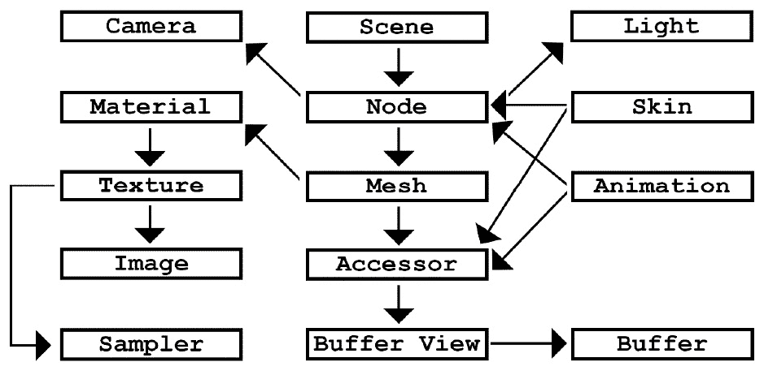
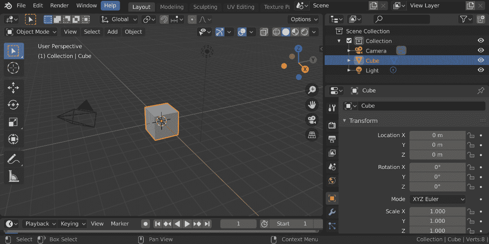

# *第七章*:探索 glTF 文件格式

在本章中，我们将探索 glTF，一种包含显示动画模型所需的所有内容的文件格式。这是大多数三维内容创建应用可以导出的标准格式，允许您加载任意模型。

本章重点介绍文件格式本身。后面的章节将集中在实现加载 glTF 文件的相关部分。到本章结束时，您应该对 glTF 文件格式有了坚实的了解。

本章将着重于培养以下技能:

*   了解 glTF 文件中包含哪些数据
*   使用 cgltf 实现 glTF 加载
*   学习如何从 Blender 导出 glTF 文件

# 技术要求

本章将涵盖加载和显示动画模型所需的 glTF 文件的每个概念。然而，这一章并不是文件格式的完整指南。在阅读本章之前，请花几分钟时间阅读[https://www.khronos.org/files/gltf20-reference-guide.pdf](https://www.khronos.org/files/gltf20-reference-guide.pdf)的参考指南，以熟悉 glTF 格式。

您将使用 cgltf([https://github.com/jkuhlmann/cgltf](https://github.com/jkuhlmann/cgltf))来解析 gltf 文件。如果 glTF 文件显示不正确，它可能是一个坏文件。如果您怀疑某个文件可能是坏的，请在[https://gltf-viewer.donmccurdy.com/](https://gltf-viewer.donmccurdy.com/)的 glTF 参考查看器中进行检查。

# 探索 glTF 文件的存储方式

glTF 文件存储为纯文本 JSON 文件或更紧凑的二进制表示。纯文本变体通常有一个`.gltf`扩展名，而二进制变体通常有一个`.glb`扩展名。

可能有多个文件。glTF 文件可以选择嵌入大块的二进制数据——甚至是纹理——也可以选择将它们存储在外部文件中。这反映在 Blender3D 的 glTF 导出选项的以下截图中:


图 7.1: Blender3D 的 glTF 导出选项

提供的样本文件本书的可下载内容存储为 glTF 嵌入文件(`.gltf`)。这是 glTF 的纯文本变体，可以用任何文本编辑器进行检查。更重要的是，它是一个需要跟踪的单一文件。即使本书提供的文件是 glTF 嵌入式格式，最终代码也将支持加载二进制格式和单独的文件(`.bin`)。

现在，您已经探索了存储 glTF 文件的不同方式，让我们准备好了解存储在 glTF 文件中的内容。glTF 文件旨在存储整个场景，而不仅仅是单个模型。在下一节中，您将探索 glTF 文件的预期用途。

## glTF 文件存储的是场景，而不是模型

重要的是要知道，glTF 文件意味着代表整个三维场景，而不仅仅是一个单一的动画模型。因此，glTF 支持您不需要在动画中使用的功能，例如相机和 PBR 材质。对于动画，我们只关心使用一小部分支持的功能。让我们概述一下它们是什么。

glTF 文件可以包含不同类型的网格。它包含静态网格，比如道具。这些网格仅由它们所附着的节点的动画来移动；它可以包含变形目标。变形动画可以用于面部表情等。

glTF 文件也可以包含蒙皮网格。这些是您将用于动画角色的网格。蒙皮网格描述模型的顶点如何受到模型的变换层次(或骨架)的影响。使用蒙皮网格，网格的每个顶点都可以绑定到层次结构中的关节。随着层级动画化，网格变形。

事实上，glTF 旨在描述一个场景，而不是一个单一的模型，这将使一些加载代码有点棘手。在下一节中，您将从高级角度开始探索 glTF 文件的实际内容。

# 探索 glTF 格式

glTF 文件的根是场景。一个 glTF 文件可以包含一个或多个场景。场景包含一个或多个节点。一个节点可以有皮肤、网格、动画、相机、灯光或混合权重。网格、皮肤和动画都在缓冲区中存储大量信息。要访问缓冲区，它们包含一个包含缓冲区视图的访问器，缓冲区视图又包含缓冲区。

通过文本提供的描述可能很难理解。下图说明了所描述的文件布局。由于 glTF 是一种场景描述格式，所以有相当多的数据类型我们不必在意。下一节将探讨这些问题:



图 7.2:glTF 文件的内容

现在，您已经对存储在 glTF 文件中的内容有了一个的概念，接下来的部分将探讨蒙皮动画所需的文件格式部分。

## 动画需要的部分

使用 glTF 文件加载动画模型时，文件所需的组件是场景、节点、网格和皮肤。这是一个可以使用的小子集；下图中突出显示了这些位及其关系。这些数据类型之间的关系可以描述如下:


图 7.3:用于蒙皮动画的部分 glTF 文件

上图省略了每个数据结构中的大部分数据，而是只关注实现蒙皮动画所需的内容。在下一节中，我们将探索 glTF 文件的哪些部分不需要蒙皮动画。

## 动画不需要的部分

要实现蒙皮动画，您不需要灯光、相机、材质、纹理、图像和采样器。在下一节中，您将探索如何从 glTF 文件中实际读取数据。

## 访问数据

访问数据变得有点棘手，但是不太难。网格、皮肤和动画对象都包含一个 glTF 访问器。这个**访问器**引用了一个**缓冲区视图**，而缓冲区视图引用了一个**缓冲区**。下图展示了这种关系:


图 7.4:访问 glTF 文件中的数据

给定这三个独立的步骤，如何访问缓冲区数据？在下一节中，您将学习如何使用缓冲区视图以及最后的访问器从缓冲区中解释数据。

### 缓冲器

把一个缓冲区想象成一个 OpenGL 缓冲区。它只是一个大的线性数组。这类似于你在 [*第 6 章*](06.html#_idTextAnchor104)*构建抽象渲染器*中构建的`Attributes`类。`Attributes`类的`Set`函数调用`glBufferData`，其签名如下:

```cpp
void glBufferData(GLenum target, GLsizeiptr size, 
                  void * data, GLenum usage);
```

glTF 中的一个缓冲区包含调用`glBufferData`函数所需的所有信息。它包含一个大小、一个空指针和可选的偏移量，这些偏移量只修改源指针和大小。把 glTF 缓冲区想象成用数据填充 OpenGL 缓冲区所需的一切。

在下一节中，您将学习如何将缓冲区视图与缓冲区结合使用。

### 缓冲视图

缓冲区只是一些大块的数据。缓冲区中存储的内容没有上下文。这就是缓冲区视图的作用。缓冲区视图描述缓冲区中的内容。如果一个缓冲区包含`glBufferData`的信息，那么一个缓冲区视图包含一些调用`glVertexAttribPointer`的参数。`glVertexAttribPointer`功能有以下签名:

```cpp
void glVertexAttribPointer(GLuint index, GLint size, 
                           GLenum type, GLboolean normalized,
                           GLsizei stride, void * pointer);
```

缓冲区视图包含`type`，它决定视图是顶点缓冲区还是索引缓冲区。这很重要，因为顶点缓冲区绑定到`GL_ARRAY_BUFFER`，但是索引缓冲区绑定到`GL_ELEMENT_ARRAY_BUFFER`。在 [*第 6 章*](06.html#_idTextAnchor104)*构建抽象渲染器*中，我们为这些不同的缓冲区类型构建了两个不同的类。

与缓冲区一样，缓冲区视图也包含一些可选的偏移量，这些偏移量进一步修改源指针的位置及其大小。在下一节中，您将探索如何使用描述缓冲区视图内容的访问器。

### 存取器

存取器存储更高级别的信息。最重要的是，访问者描述了您正在处理的数据类型，如`scalar`、`vec2`、`vec3`或`vec4`。`glVertexAttribPointer`的`size`论证就是利用这个数据确定的。

访问者回答诸如数据是否被规范化以及数据的存储模式是什么之类的问题。除了缓冲区和缓冲区视图已经包含的信息之外，访问器还包含附加的偏移量、大小和步幅信息。

下一节将演示如何将数据从 glTF 文件加载到线性标量数组中。

### 例子

即使有了访问器、缓冲区视图和缓冲区布局的关系，解析数据仍然可能有点混乱。为了稍微弄清楚一点，让我们探索一下如何将一个访问器转换为浮点值的平面列表。以下代码旨在作为示例；本书的其余部分不会用到它:

```cpp
vector<float> GetPositions(const GLTFAccessor& accessor) {
    // Accessors and sanity checks
    assert(!accessor.isSparse);
    const GLTFBufferView& bufferView = accessor.bufferView;
    const GLTFBuffer& buffer = bufferView.buffer;
    // Resize result
    // GetNumComponents Would return 3 for a vec3, etc.
    uint numComponents = GetNumComponents(accessor); 
    vector<float> result;
    result.resize(accessor.count * numComponents);
    // Loop trough every element in the accessor
    for (uint i = 0; i < accessor.count; ++ i) {
        // Find where in the buffer the data actually starts
        uint offset = accessor.offset + bufferView.offset;
        uint8* data = buffer.data;
        data += offset + accessor.stride * i;
        // Loop trough every component of current element
        float* target = result[i] * componentCount;
        for (uint j = 0; j < numComponents; ++ j) {
            // Omitting normalization 
            // Omitting different storage types
            target[j] = data + componentCount * j;
        } // End loop of every component of current element
    } // End loop of every accessor element
    return result;
}
```

解析 glTF 文件的代码会变得冗长；在前面的代码示例中，已经解析了 glTF 文件。加载 glTF 文件的大部分工作实际上是解析二进制或 JSON 数据。在下一节中，我们将探讨如何使用 cgltf 库来解析 gltf 文件。

# 探索 cgltf

在最后一节中，我们探讨了如何将 glTF 访问器转换为浮点数的线性数组。该代码省略了一些更复杂的任务，例如标准化数据或处理不同的存储类型。

提供的示例代码还假设数据已经解析出 JSON(或二进制)格式。编写一个 JSON 解析器不在本书的范围内，但是处理 glTF 文件却不是。

为了帮助管理加载 glTF 文件的一些复杂性，以及避免从头开始编写 JSON 解析器，下一节将教您如何使用 cgltf 加载 JSON 文件。Cgltf 是单头 glTF 加载库；你可以在 https://github.com/jkuhlmann/cgltf 的 GitHub 上找到它。在下一节中，我们将开始将 cgltf 集成到我们的项目中。

## 整合 cgltf

要将 cgltf 集成到项目中，请从位于[https://github.com/jkuhlmann/cgltf/blob/master/cgltf.h](https://github.com/jkuhlmann/cgltf/blob/master/cgltf.h)的 GitHub 下载头文件。然后，将这个头文件添加到项目中。接下来，向项目中添加一个新的`.c`文件，并将其命名为`cgltf.c`。该文件应包含以下代码:

```cpp
#pragma warning(disable : 26451)
#define _CRT_SECURE_NO_WARNINGS
#define CGLTF_IMPLEMENTATION
#include "cgltf.h"
```

CGLTF 现已集成到项目中。在本章中，您将实现解析 glTF 文件的代码。如何将 glTF 文件的内容加载到运行时数据中，将在后面的章节中随着该运行时数据的代码的编写而介绍。在下一节中，我们将学习如何实现 glTF 解析代码。

### 创建 glTF 加载程序

在这一节中，我们将探讨如何使用 cgltf 加载一个 glTF 文件。将文件加载到运行时数据结构`cgltf_data`中的代码很简单。在以后的章节中，您将学习如何解析这个`cgltf_data`结构的内容。

要加载一个文件，需要创建一个`cgltf_options`的实例。您不需要设置任何选项标志；只需为所有成员值实例化带有`0`的`cgltf_options`结构。接下来，声明一个`cgltf_data`指针。这个指针将被传递到的地址是`cgltf_parse_file`。在`cgltf_parse_file`填充了`cgltf_data`结构之后，您就可以解析文件的内容了。要稍后释放`cgltf_data`结构，请调用`cgltf_free`:

1.  创建一个包含`cgltf.h`的新文件`GLTFLoader.h`。为`LoadGLTFFile`和`FreeGLTFFile`函数添加函数声明:

    ```cpp
    #ifndef _H_GLTFLOADER_
    #define _H_GLTFLOADER_
    #include "cgltf.h"
    cgltf_data* LoadGLTFFile(const char* path);
    void FreeGLTFFile(cgltf_data* handle);
    #endif
    ```

2.  创建新文件，`GLTFLoader.cpp`。该函数采用一条路径并返回一个`cgltf_data`指针。在内部，该函数调用`cgltf_parse_file`从文件中加载 glTF 数据。`cgltf_load_buffers`用于加载任何外部缓冲区数据。最后，`cgltf_validate`确保刚加载的 glTF 文件有效:

    ```cpp
    cgltf_data* LoadGLTFFile(const char* path) {
        cgltf_options options;
        memset(&options, 0, sizeof(cgltf_options));
        cgltf_data* data = NULL;
        cgltf_result result = cgltf_parse_file(&options, 
                                            path, &data);
        if (result != cgltf_result_success) {
            cout << "Could not load: " << path << "\n";
            return 0;
        }
        result = cgltf_load_buffers(&options, data, path);
        if (result != cgltf_result_success) {
            cgltf_free(data);
            cout << "Could not load: " << path << "\n";
            return 0;
        }
        result = cgltf_validate(data);
        if (result != cgltf_result_success) {
            cgltf_free(data);
            cout << "Invalid file: " << path << "\n";
            return 0;
        }
        return data;
    }
    ```

3.  同样在`GLTFLoader.cpp`中实现`FreeGLTFFile`功能。这个功能很简单；如果输入指针不是`null`，它需要调用`cgltf_free`:

    ```cpp
    void FreeGLTFFile(cgltf_data* data) {
        if (data == 0) {
            cout << "WARNING: Can't free null data\n";
        }
        else {
            cgltf_free(data);
        }
    }
    ```

在后面的章节中，您将通过引入加载网格、姿势和动画的功能来扩展 glTF `Loader`功能。在下一节中，您将探索如何从 Blender3D 导出 glTF 文件。

# 探索样本资产

您将在本书中使用的示例文件是 CC0，来自四元数体上的公共领域许可资产。你可以在[http://quaternius.com/assets.html](http://quaternius.com/assets.html)找到类似风格的附加资产。

此外，后面的章节还包括来自 GDQuest 的开放三维人体模型的截图，可在 https://github.com/GDQuest/godot-3d-mannequin 获得麻省理工学院的许可。

有些资产已经有了 glTF 格式，但有些可能有`.blend`、`.fbx`或其他格式。当这种情况发生时，很容易将模型导入 Blender 并导出一个 glTF 文件。下一节将指导您从 Blender 导出 glTF 文件。

## 从搅拌机导出

Blender 是一个免费的、三维的内容创作工具。你可以从[https://www.blender.org/](https://www.blender.org/)下载搅拌机。以下说明是为 Blender 2.8 编写的，但是它们在更新的版本中也应该是一样的。

如果您正在导入的模型已经是一个`.blend`文件，只需双击它，它就会加载到 Blender 中。

如果模型的格式不同，如`.DAE`或`.FBX`，则需要导入。为此，打开 Blender，您应该会看到默认的场景加载。这个默认场景有一个立方体、一个光源和一个摄像机:



图 7.5:默认的混合 3D 场景

左键点击选择立方体，然后将鼠标悬停在三维视口上，点击*删除*键删除立方体。左键点击相机选择并点击*删除*键删除。对光也这样做。

你现在应该有一个空场景。从**文件**菜单中，选择**文件** | **导入**并选择合适的模型格式进行导入。找到您的文件并双击它以导入它。模型导入后，选择**文件** | **导出 glTF 2.0** 。将导出格式设置为 glTF(文本文件)或 glb(二进制文件)。

# 总结

在本章中，您学习了什么是 glTF 文件，glTF 格式的哪些部分对蒙皮动画有用，以及如何使用 cglTF 加载 glTF 文件。如果格式还是有点混乱，不用担心；当您开始解析 cgltf 文件中的各种数据时，这将更有意义。使用 cgltf 将让您专注于将 gltf 数据转换为有用的运行时结构，而不必担心手动解析 JSON 文件。在下一章中，您将通过实现曲线、帧和轨迹来开始实现动画的构建块。