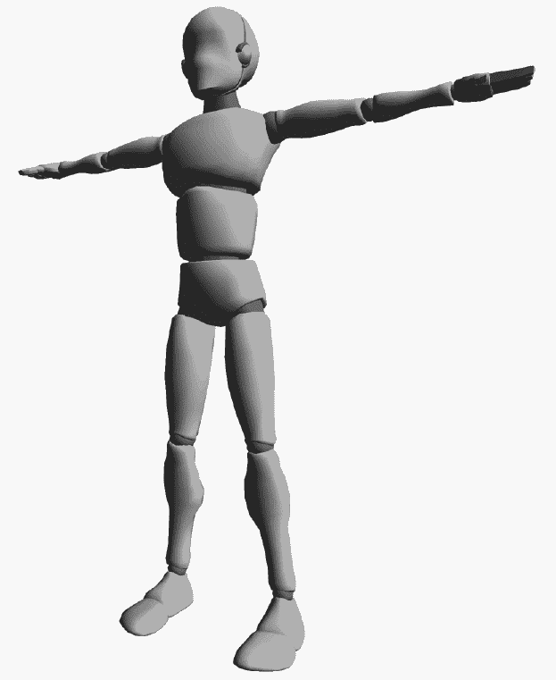
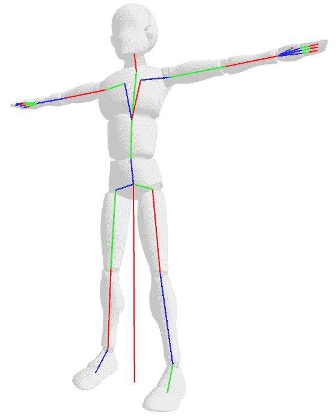
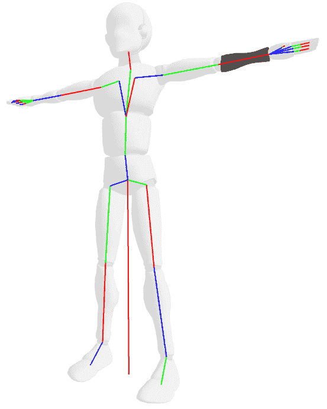

# *第十章*:网格剥皮

使网格变形以匹配动画姿势称为蒙皮。为了实现蒙皮，首先需要声明一个网格类。一旦声明了网格类，就可以使用着色器(GPU 蒙皮)或仅使用 C++ 代码(CPU 蒙皮)对其进行变形。这两种蒙皮方法都将在本章中介绍。到本章结束时，您应该能够执行以下操作:

*   了解蒙皮网格与非蒙皮网格有何不同
*   了解整个蒙皮管道
*   实现一个框架类
*   从 glTF 文件中加载骨骼的绑定姿势
*   实现蒙皮网格类
*   从 gLTF 文件加载蒙皮网格
*   实现中央处理器蒙皮
*   实现 GPU 蒙皮

# 探索网格

网格由几个顶点组成。通常，每个顶点至少有一个位置，一个法线，也许还有一个纹理坐标。这是简单静态网格顶点的定义。该定义具有以下顶点分量:

*   位置(`vec3`)
*   正常(`vec3`)
*   The texture coordinate (`vec2`)

    重要信息:

    本章中用来演示蒙皮的模型是来自 GDQuest 的 Godot 人体模型。这是麻省理工学院授权的模型，你可以在 https://github.com/GDQuest/godot-3d-mannequ 的 GitHub 上找到。

当一个网格被建模时，它是以某个姿势建模的。对于角色来说，这往往是一个 *T* 的姿势或者是一个 *A* 的姿势。建模的网格是静态的。下图显示了戈多人体模型的 *T* 姿势:



图 10.1:戈多人体模型的 T 型姿势

网格建模后，将在网格中创建骨架。网格中的每个顶点都被分配给骨骼的一个或多个骨骼。这个过程叫做索具。骨架是以适合网格内部的姿势创建的；这是模型的**绑定姿势**。



图 10.2:可视化网格和骨架的绑定姿势

绑定姿势和其余姿势通常是相同的，但并不总是这样。在本书中，我们将把这两种姿势作为单独的姿势来对待。上图显示了渲染在角色网格顶部的骨架的绑定姿势。在下一节中，您将探索如何对这样的网格进行蒙皮。

# 了解剥皮

蒙皮是指定哪个顶点应该被哪个骨骼变形的过程。一个顶点可能会受到多个骨骼的影响。刚性蒙皮是指将每个顶点与一个骨骼相关联。平滑蒙皮将顶点与多个骨骼相关联。

通常，顶点到骨骼的映射是按顶点进行的。这意味着每个顶点都知道自己属于哪个骨骼。有些文件格式以相反的方式存储这种关系，其中每个骨骼都包含一个它所影响的顶点列表。两种方法都有效；在本书的其余部分，映射是按顶点进行的。

若要(刚性)蒙皮网格，请将每个顶点指定给骨骼。要在代码中将关节指定给顶点，请为每个顶点添加一个新属性。该属性只是一个整数，它保存使顶点变形的骨骼的索引。下图中，所有应该分配给左下臂骨的三角形颜色都比网格的其余部分深:



图 10.3:隔离下臂

让我们花一点时间更详细地回顾一下顶点变换管道。这里引入**空间**的概念。空间是指用矩阵变换一个顶点。例如，如果你有一个投影矩阵，它会把一个顶点转换成 NDC 空间。顶点变换管道如下:

*   创建网格时，其所有顶点都在所谓的模型空间中。
*   模型空间顶点乘以模型矩阵，将它放入世界空间。
*   世界空间顶点乘以视图矩阵，将其放入相机空间。
*   摄像机空间顶点乘以投影矩阵，将其移动到 NDC 空间。

要对网格进行蒙皮，需要向顶点变换管道添加新的蒙皮步骤。蒙皮步骤将顶点从蒙皮空间移动到模型空间。这意味着新步骤先于转换管道中的任何其他步骤。

如果蒙皮空间顶点乘以当前动画姿势，则可以将其移回模型空间。本章的*实现 CPU 蒙皮*部分详细介绍了这种转换。一旦顶点回到模型空间，它应该已经被动画化了。动画姿势矩阵变换进行实际动画。动画顶点变换管道是这样工作的:

*   加载一个网格-它的所有顶点都在模型空间中。
*   模型空间顶点乘以蒙皮矩阵，将其移入蒙皮空间。
*   同族空间顶点乘以姿态矩阵，将其移回模型空间。
*   模型空间顶点乘以模型矩阵，将它放入世界空间。
*   世界空间顶点乘以视图矩阵，将其放入相机空间。
*   摄像机空间顶点乘以投影矩阵，将其移动到 NDC 空间。

要对网格进行蒙皮，需要将每个顶点转换为蒙皮空间。当皮肤空间中的顶点通过其所属关节的世界变换进行变换时，假设使用的姿势是绑定姿势，则该顶点应该在模型空间中结束。

在下一节中，您将通过实际示例探索蒙皮管道。

## 探索刚性蒙皮

要对网格进行蒙皮，每个顶点都需要乘以其所属关节的反向绑定姿势变换。要找到关节的反向绑定姿势变换，请找到关节的世界变换，然后反转它。当矩阵(或变换)乘以它的逆时，结果总是恒等式。

将皮肤空间网格的顶点乘以绑定姿势中关节的世界空间变换会撤销原始的反向绑定姿势乘法，`inverse bind pose * bind pose = identity`。但是，乘以不同的姿势会导致顶点从绑定姿势偏移两个姿势之间的增量。

让我们探索一个顶点是如何在视觉上移动到皮肤空间的。例如，将 Godot 人体模型前臂中的所有顶点乘以前臂骨骼的反向绑定姿势，仅将前臂三角形放入皮肤空间。这使得网格看起来如下图所示:


图 10.4:由反向绑定姿势变换的下臂网格

要将顶点从皮肤空间转换回模型空间，请依次应用姿势中每个骨骼的转换，直到到达目标骨骼。下图演示了从根骨到前臂骨需要走的六个步骤:


图 10.5:将变换链可视化到下臂

在代码中，到达骨骼所需的所有转换都可以使用矩阵乘法来累加。或者，如果使用`Transform`结构，可以使用组合方法。使用累积矩阵或变换将顶点移回模型空间只需一次。

将网格转换为皮肤空间是通过将每个顶点乘以其所属关节的反向绑定姿势来完成的。如何得到骨骼的反向绑定姿态矩阵？使用绑定姿势，找到骨骼的世界变换，将其转换为矩阵，并反转矩阵。

下图为皮肤空间中的戈多人体模型。看到这样的网格表示蒙皮管道中有错误。看到这样的网格最常见的原因是反向绑定姿势和动画姿势的乘法顺序有错误:


图 10.6:全网格乘以反向绑定姿势

到目前为止讨论的蒙皮实现称为刚性蒙皮。使用刚性蒙皮，每个顶点仅受一个骨骼的影响。在下一节中，您将开始探索平滑蒙皮，通过将多个骨骼影响指定给单个顶点，使蒙皮网格看起来更好。

## 刚性剥皮管道

让我们探索一下每个顶点必须经过的管道。下图显示了静态网格相对于刚性蒙皮网格的变换管道。下图中的步骤顺序是从左到右，跟随箭头:


图 10.7:顶点蒙皮管道

上图中所示的**刚性蒙皮顶点管线**的工作原理如下:

*   通过将顶点乘以指定给它的关节的反向绑定姿势矩阵，将顶点移动到皮肤空间中。
*   将蒙皮顶点乘以动画关节的世界矩阵。这导致顶点再次位于局部空间，但它变形为动画姿态。
*   一旦顶点处于动画局部位置，将其通过法线模型视图投影变换。
*   探索平滑蒙皮

刚性蒙皮的问题是弯曲关节。由于每个顶点都属于一个骨骼，所以位于肘关节等关节中的顶点不会自然弯曲。通过将三角形的不同顶点指定给不同的骨骼，可以避免网格中关节处(如肘部)的断裂。生成的网格不能很好地保持其体积，看起来很笨拙。

刚性蒙皮不是免费的；它为每个顶点引入了额外的矩阵乘法。这可以优化到只增加一次乘法，这将在下一章中介绍。在下一节中，您将探索平滑蒙皮。

## 探索平滑蒙皮

刚性蒙皮的主要问题是它可以在网格中创建视觉断点，如下图所示。即使解决了这些问题，光滑蒙皮时可弯曲关节周围的变形看起来也不太好:


图 10.8:刚性蒙皮的可见人工产物

平滑蒙皮比刚性蒙皮具有更少的伪影并更好地保持其体积。平滑蒙皮背后的想法是，不止一个骨骼可以影响一个顶点。每种影响也有权重。权重用于将蒙皮顶点混合成一个组合的最终顶点。所有重量加起来必须是 1。

将平滑蒙皮想象为多次蒙皮网格并混合结果。一根骨头能产生多少影响，在这里影响很大。一般四块骨头之后，每一块额外骨头的影响都不可见。这很方便，因为它允许您使用`ivec4`和`vec4`结构向顶点添加影响和权重。

下图显示了一个蒙皮的网格，中间的顶点附着在左边的顶部骨骼和右边的底部骨骼上。这是需要混合的两个蒙皮位置。如果每个姿势的权重为`0.5`，最终插值的顶点位置将位于顶点之间的一半。如下图的中间图所示:


图 10.9:为一个顶点指定多个关节

对顶点上的关节影响进行平均称为平滑蒙皮，或**线性混合蒙皮** ( **LBS** )。它有一些人工制品，但这是皮肤角色的标准方式。目前，LBS 是实现皮肤动画最流行的方式。

添加对平滑蒙皮的支持后，最终的顶点结构现在如下所示:

*   位置(`vec3`)
*   正常(`vec3`)
*   纹理坐标(`vec2`)
*   联合影响(`ivec4`)
*   The influence weights (`vec4`)

    重要信息

    glTF 支持将蒙皮网格附加到任意节点，并且这些节点可以被动画化。这为计算皮肤矩阵增加了一个额外的步骤。为了避免这个额外的步骤，我们将忽略网格轴，并假设所有网格节点全局变换都在原点。只要假设单个 glTF 文件只包含一个蒙皮网格，这是一个安全的假设。

平滑蒙皮是目前游戏动画中使用的标准形态。大多数游戏每个顶点使用四个骨骼，其工作方式与本章中将要实现的类似。在下一节中，您将实现一个`Skeleton`类来帮助跟踪皮肤网格所需的一些不同数据。

# 实现骨骼

为模型设置动画时，有几件事需要跟踪，例如动画姿势或反向绑定姿势。骨架的概念是将动画模型之间共享的数据组合成单一结构。

角色的所有实例都共享绑定姿势和反向绑定姿势。也就是说，如果屏幕上有 15 个角色，每个角色都有一个唯一的动画姿势，但它们都共享相同的静止姿势、绑定姿势、反向绑定姿势和关节名称。

在接下来的部分中，您将实现一个新的类-`Skeleton`类。这个`Skeleton`类包含两个动画网格可能需要的所有共享数据。它还跟踪其余姿势、绑定姿势、反向绑定姿势和关节名称。一些发动机称骨架为电枢或钻机。

## 骨骼类声明

`Skeleton`类包含角色的静止姿势和绑定姿势，角色每个关节的名称，最重要的是，反向绑定姿势。由于反向绑定姿势涉及到矩阵的反向，因此只应计算一次。按照以下步骤申报新的`Skeleton`类:

1.  创建新文件，`Skeleton.h`。在此文件中声明`Skeleton`类。将当前动画模型的静止姿势、绑定姿势、反向绑定姿势和关节名称添加到`Skeleton`类。反向绑定姿态应该实现为矩阵向量:

    ```cpp
    class Skeleton {
    protected:
        Pose mRestPose;
        Pose mBindPose;
        std::vector<mat4> mInvBindPose;
        std::vector<std::string> mJointNames;
    ```

2.  添加助手功能，`UpdateInverseBindPose`。只要设置了绑定姿势，该函数就会更新反向绑定姿势矩阵:

    ```cpp
    protected:
        void UpdateInverseBindPose();
    ```

3.  声明一个默认构造函数和一个便利构造函数。此外，声明方法来设置骨骼的静止姿势、绑定姿势和关节名称，并声明辅助函数来检索对骨骼所有变量的引用:

    ```cpp
    public:
        Skeleton();
        Skeleton(const Pose& rest, const Pose& bind, 
                 const std::vector<std::string>& names);
        void Set(const Pose& rest, const Pose& bind, 
                 const std::vector<std::string>& names);
        Pose& GetBindPose();
        Pose& GetRestPose();
        std::vector<mat4>& GetInvBindPose();
        std::vector<std::string>& GetJointNames();
        std::string& GetJointName(unsigned int index);
    }; // End Skeleton class
    ```

将`Skeleton`类想象成一个辅助类——它将绑定姿势、反向绑定姿势、静止姿势和关节名称放入一个易于管理的对象中。骨架是共享的；你可以有许多角色，每个角色都有一个独特的动画姿势，但是他们可以共享同一个骨架。在下一节中，您将实现`Skeleton`类。

## 骨架类实现

反向绑定姿势是以矩阵数组的形式存储在骨架中的。每当骨骼的绑定姿势更新时，也应该重新计算反向绑定姿势。为了找到反向绑定姿势，找到骨架中每个关节的世界空间矩阵，然后反向世界空间关节矩阵。创建新文件，`Skeleton.cpp`。然后，实现骨架构造函数。为此，请采取以下步骤:

1.  创建两个构造函数——默认构造函数不做任何事情。另一个便利构造器采用休息姿势、绑定姿势和关节名称。它调用`Set`方法:

    ```cpp
    Skeleton::Skeleton() { }
    Skeleton::Skeleton(const Pose& rest, const Pose& bind,
                    const std::vector<std::string>& names) {
        Set(rest, bind, names);
    }
    ```

2.  创建`Set`方法，该方法应该设置骨骼的内部姿势、绑定姿势和关节名称。设置绑定姿势后，调用`UpdateInverseBindPose`函数填充反向绑定姿势矩阵调色板:

    ```cpp
    void Skeleton::Set(const Pose& rest, const Pose& bind, 
                     const std::vector<std::string>& names) {
        mRestPose = rest;
        mBindPose = bind;
        mJointNames = names;
        UpdateInverseBindPose();
    }
    ```

3.  接下来执行`UpdateInverseBindPose`功能。确保矩阵向量具有正确的大小，然后循环遍历绑定姿势中的所有关节。获取每个关节的世界空间变换，将其转换为矩阵，并对矩阵求逆。这个逆矩阵是关节的逆绑定姿态矩阵:

    ```cpp
    void Skeleton::UpdateInverseBindPose() {
      unsigned int size = mBindPose.Size();
      mInvBindPose.resize(size);
      for (unsigned int i = 0; i < size; ++ i) {
        Transform world = mBindPose.GetGlobalTransform(i);
        mInvBindPose[i] = inverse(transformToMat4(world));
      }
    }
    ```

4.  在`Skeleton`类中实现简单的 getter 和 setter 函数:

    ```cpp
    Pose& Skeleton::GetBindPose() {
        return mBindPose;
    }
    Pose& Skeleton::GetRestPose() {
        return mRestPose;
    }
    std::vector<mat4>& Skeleton::GetInvBindPose() {
        return mInvBindPose;
    }
    std::vector<std::string>& Skeleton::GetJointNames() {
        return mJointNames;
    }
    std::string& Skeleton::GetJointName(unsigned int idx) {
        return mJointNames[idx];
    }
    ```

通过提供显式的 getter 函数，比如`Transform GetBindPoseTransform(unsigned int index)`，可以绕过返回引用。这在你完成下一章学习如何优化动画数据后更有意义。目前，更有价值的做法是访问这些引用，而不是修改它们。

要生成逆绑定姿态矩阵，不需要将变换转换成矩阵再进行逆变换；你可以把变换反过来，然后把它转换成矩阵。两者之间的性能差异极小。

`Skeleton`类跟踪动画模型的绑定姿势、反向绑定姿势和关节名称。该数据可以在模型的所有动画实例之间共享。在下一节中，您将从 glTF 文件中实现绑定姿势加载。glTF 格式不存储实际的绑定姿势。

# glTF–加载绑定姿势

你现在可以从一个 glTF 文件中加载绑定姿势了，但是有一个问题。glTF 文件不存储绑定姿势。相反，对于 glTF 文件包含的每个皮肤，它存储一个矩阵数组，该数组保存影响皮肤的每个关节的反向绑定姿势矩阵。

像这样存储反向绑定姿势矩阵有利于优化，这将在下一章中更有意义，但目前，这是我们必须处理的事情。那么，你如何得到捆绑姿势？

要获得绑定姿势，请加载静止姿势，并将静止姿势中的每个变换转换为世界空间变换。这确保了如果蒙皮没有为关节提供反向绑定姿势矩阵，一个好的默认值是可用的。

接下来，循环通过`.gltf`文件中的每个蒙皮网格。对于每个蒙皮网格，反转每个关节的反向绑定姿势矩阵。反转反向绑定姿态矩阵会产生绑定姿态矩阵。将绑定姿势矩阵转换为可在绑定姿势中使用的变换。

这是可行的，但是所有的关节变换都在世界空间中。您需要转换每个关节，使其位于关节的父关节的本地。采取以下步骤实现`GLTFLoader.cpp`中的`LoadBindPose`功能:

1.  通过构建一个变换向量开始实现`LoadBindPose`函数。用静止姿势中每个关节的全局变换填充变换向量:

    ```cpp
    Pose LoadBindPose(cgltf_data* data) {
        Pose restPose = LoadRestPose(data);
        unsigned int numBones = restPose.Size();
        std::vector<Transform> worldBindPose(numBones);
        for (unsigned int i = 0; i < numBones; ++ i) {
          worldBindPose[i] = restPose.GetGlobalTransform(i);
        }
    ```

2.  循环通过 glTF 文件中的每个蒙皮网格。将`inverse_bind_matrices`访问器读入一个大的浮点值向量。向量需要包含`contain numJoints * 16`元素，因为每个矩阵都是 4x4 矩阵:

    ```cpp
        unsigned int numSkins = data->skins_count;
        for (unsigned int i = 0; i < numSkins; ++ i) {
            cgltf_skin* skin = &(data->skins[i]);
            std::vector<float> invBindAccessor;
            GLTFHelpers::GetScalarValues(invBindAccessor, 
                         16, *skin->inverse_bind_matrices);
    ```

3.  对于皮肤中的每个关节，获取反向绑定矩阵。逆绑定姿态矩阵求逆，得到绑定姿态矩阵。将绑定姿势矩阵转换为变换。将这个世界空间变换存储在`worldBindPose`向量中:

    ```cpp
            unsigned int numJoints = skin->joints_count;
            for (int j = 0; j < numJoints; ++ j) { 
                // Read the ivnerse bind matrix of the joint
                float* matrix = &(invBindAccessor[j * 16]);
                mat4 invBindMatrix = mat4(matrix);
                // invert, convert to transform
                mat4 bindMatrix = inverse(invBindMatrix);
                Transform bindTransform = 
                                mat4ToTransform(bindMatrix);
                // Set that transform in the worldBindPose.
                cgltf_node* jointNode = skin->joints[j];
                int jointIndex = GLTFHelpers::GetNodeIndex(
                           jointNode, data->nodes, numBones);
                worldBindPose[jointIndex] = bindTransform;
            } // end for each joint
        } // end for each skin
    ```

4.  转换每个关节，使其相对于其父关节。要将关节移动到另一个关节的空间中，也就是说，使其相对于另一个关节，请将关节的世界变换与其父关节的逆世界变换相结合:

    ```cpp
        //Convert the world bind pose to a regular bind pose
        Pose bindPose = restPose;
        for (unsigned int i = 0; i < numBones; ++ i) {
            Transform current = worldBindPose[i];
            int p = bindPose.GetParent(i);
            if (p >= 0) { // Bring into parent space
                Transform parent = worldBindPose[p];
                current = combine(inverse(parent), current);
            }
            bindPose.SetLocalTransform(i, current);
        }
        return bindPose;
    } // End LoadBindPose function
    ```

重建绑定姿势并不理想，但这是你必须处理的 glTF 的一个怪癖。通过使用其余姿势作为默认关节值，任何没有反向绑定姿势矩阵的关节仍然具有有效的默认方向和大小。

在本节中，您学习了如何从 glTF 文件加载动画网格的绑定姿势。在下一节中，您将创建一个便利函数来仅通过一次函数调用从 glTF 文件加载骨架。

# glTF–加载骨骼

我们需要再实现一个加载功能——即`LoadSkeleton`功能。这是一个便利函数，它加载一个骨架而不需要调用三个独立的函数。

在`GLTFLoader.cpp`中实现`LoadSkeleton`功能。别忘了给`GLTFLoader.h`添加函数声明。该函数通过调用现有的`LoadPose`、`LoadBindPose`和`LoadJointNames`函数返回一个新的骨架:

```cpp
Skeleton LoadSkeleton(cgltf_data* data) {
    return Skeleton(
        LoadRestPose(data),
        LoadBindPose(data),
        LoadJointNames(data)
    );
}
```

`LoadSkeleton`函数只是一个助手函数，允许你用一个函数调用初始化一个骨架。在下一节中，您将实现一个`Mesh`类，它将让您显示动画网格。

# 实现网格

网格的定义取决于实现它的游戏(或引擎)。实现一个全面的网格类超出了本书的范围。相反，在本节中，您将声明一个简单版本的网格，它在中央处理器和图形处理器上存储一些数据，并提供一种将两者同步在一起的方法。

## 网格类声明

网格最基本的实现是什么？每个顶点都有一个位置、一个法线和一些纹理坐标。为了蒙皮网格，每个顶点也有四个可能影响它的骨骼和权重，以确定每个骨骼对顶点的影响程度。网格通常使用索引数组，但这是可选的。

在本节中，您将实现 CPU 和 GPU 蒙皮。要在中央处理器上蒙皮网格，您需要保留姿势和法线数据的附加副本，以及用于蒙皮的矩阵调色板。

创建一个新文件`Mesh.h`，在其中声明`Mesh`类。按照以下步骤申报新的`Mesh`类:

1.  开始声明`Mesh`类。它应该在中央处理器和图形处理器上维护网格数据的副本。存储定义每个顶点的位置、法线、tex 坐标、权重和影响的向量。包括可选的索引向量:

    ```cpp
    class Mesh {
    protected:
        std::vector<vec3> mPosition;
        std::vector<vec3> mNormal;
        std::vector<vec2> mTexCoord;
        std::vector<vec4> mWeights;
        std::vector<ivec4> mInfluences;
        std::vector<unsigned int> mIndices;
    ```

2.  前面代码中列出的每个向量也需要设置适当的属性。为每一个创建`Attribute`指针，以及一个索引缓冲区指针:

    ```cpp
    protected:
        Attribute<vec3>* mPosAttrib;
        Attribute<vec3>* mNormAttrib;
        Attribute<vec2>* mUvAttrib;
        Attribute<vec4>* mWeightAttrib;
        Attribute<ivec4>* mInfluenceAttrib;
        IndexBuffer* mIndexBuffer;
    ```

3.  添加姿势和正常数据的附加副本，以及用于 CPU 蒙皮的矩阵调色板:

    ```cpp
    protected:
        std::vector<vec3> mSkinnedPosition;
        std::vector<vec3> mSkinnedNormal;
        std::vector<mat4> mPosePalette;
    ```

4.  添加构造函数、复制构造函数、赋值操作符以及析构函数的声明:

    ```cpp
    public:
        Mesh();
        Mesh(const Mesh&);
        Mesh& operator=(const Mesh&);
        ~Mesh();
    ```

5.  为网格包含的所有属性声明 getter 函数。这些函数返回向量引用。向量引用不是只读的；加载网格时使用这些来填充网格数据:

    ```cpp
        std::vector<vec3>& GetPosition();
        std::vector<vec3>& GetNormal();
        std::vector<vec2>& GetTexCoord();
        std::vector<vec4>& GetWeights();
        std::vector<ivec4>& GetInfluences();
        std::vector<unsigned int>& GetIndices();
    ```

6.  声明`CPUSkin`功能，应用 CPU 网格蒙皮。要对网格进行蒙皮，您需要骨架和动画姿势。声明`UpdateOpenGLBuffers`函数，该函数将保存数据的向量同步到图形处理器:

    ```cpp
        void CPUSkin(Skeleton& skeleton, Pose& pose);
        void UpdateOpenGLBuffers();
        void Bind(int position, int normal, int texCoord, 
                  int weight, int influence);
    ```

7.  声明绑定、绘制和解除绑定网格的函数:

    ```cpp
        void Draw();
        void DrawInstanced(unsigned int numInstances);
        void UnBind(int position, int normal, int texCoord, 
                    int weight, int influence);
    };
    ```

这个`Mesh`类不是制作就绪的，但是它很容易使用，并且将适用于本书的其余部分。在下一节中，您将开始实现`Mesh`类。

## 网格类实现

`Mesh`类包含两个相同数据的副本。它将中央处理器端的所有顶点数据保存在矢量中，将图形处理器端的所有顶点数据保存在顶点缓冲对象中。这个类的预期用途是编辑中央处理器端的顶点，然后用`UpdateOpenGLBuffers`功能将更改同步到图形处理器。

新建一个文件，`Mesh.cpp`；您将在这个文件中实现`Mesh`类。按照以下步骤实施`Mesh`课程:

1.  实现默认构造函数，需要确保所有属性(和索引缓冲区)都已分配:

    ```cpp
    Mesh::Mesh() {
        mPosAttrib = new Attribute<vec3>();
        mNormAttrib = new Attribute<vec3>();
        mUvAttrib = new Attribute<vec2>();
        mWeightAttrib = new Attribute<vec4>();
        mInfluenceAttrib = new Attribute<ivec4>();
        mIndexBuffer = new IndexBuffer();
    }
    ```

2.  实现复制构造函数。以与构造函数相同的方式创建缓冲区，然后调用赋值运算符:

    ```cpp
    Mesh::Mesh(const Mesh& other) {
        mPosAttrib = new Attribute<vec3>();
        mNormAttrib = new Attribute<vec3>();
        mUvAttrib = new Attribute<vec2>();
        mWeightAttrib = new Attribute<vec4>();
        mInfluenceAttrib = new Attribute<ivec4>();
        mIndexBuffer = new IndexBuffer();
        *this = other;
    }
    ```

3.  实现赋值操作符，复制出 CPU 端成员(所有向量)，然后调用`UpdateOpenGLBuffers`函数将属性数据上传到 GPU:

    ```cpp
    Mesh& Mesh::operator=(const Mesh& other) {
        if (this == &other) {
            return *this;
        }
        mPosition = other.mPosition;
        mNormal = other.mNormal;
        mTexCoord = other.mTexCoord;
        mWeights = other.mWeights;
        mInfluences = other.mInfluences;
        mIndices = other.mIndices;
        UpdateOpenGLBuffers();
        return *this;
    }
    ```

4.  实现析构函数，确保删除构造函数分配的所有数据:

    ```cpp
    Mesh::~Mesh() {
        delete mPosAttrib;
        delete mNormAttrib;
        delete mUvAttrib;
        delete mWeightAttrib;
        delete mInfluenceAttrib;
        delete mIndexBuffer;
    }
    ```

5.  实现`Mesh` getter 函数。这些函数返回对向量的引用。参考文献返回后需要编辑:

    ```cpp
    std::vector<vec3>& Mesh::GetPosition() {
        return mPosition;
    }
    std::vector<vec3>& Mesh::GetNormal() {
        return mNormal;
    }
    std::vector<vec2>& Mesh::GetTexCoord() {
        return mTexCoord;
    }
    std::vector<vec4>& Mesh::GetWeights() {
        return mWeights;
    }
    std::vector<ivec4>& Mesh::GetInfluences() {
        return mInfluences;
    }
    std::vector<unsigned int>& Mesh::GetIndices() {
        return mIndices;
    }
    ```

6.  通过在每个属性对象上调用`Set`来实现`UpdateOpenGLBuffers`功能。如果其中一个中央处理器侧向量的大小为`0`，则无需设置:

    ```cpp
    void Mesh::UpdateOpenGLBuffers() {
        if (mPosition.size() > 0) {
            mPosAttrib->Set(mPosition);
        }
        if (mNormal.size() > 0) {
            mNormAttrib->Set(mNormal);
        }
        if (mTexCoord.size() > 0) {
            mUvAttrib->Set(mTexCoord);
        }
        if (mWeights.size() > 0) {
            mWeightAttrib->Set(mWeights);
        }
        if (mInfluences.size() > 0) {
            mInfluenceAttrib->Set(mInfluences);
        }
        if (mIndices.size() > 0) {
            mIndexBuffer->Set(mIndices);
        }
    }
    ```

7.  实现`Bind`功能。这将采用作为绑定槽索引的整数。如果绑定槽有效(即`0`或更大)，属性的`BindTo`功能为调用:

    ```cpp
    void Mesh::Bind(int position, int normal, int texCoord, 
                    int weight, int influcence) {
        if (position >= 0) {
            mPosAttrib->BindTo(position);
        }
        if (normal >= 0) {
            mNormAttrib->BindTo(normal);
        }
        if (texCoord >= 0) {
            mUvAttrib->BindTo(texCoord);
        }
        if (weight >= 0) {
            mWeightAttrib->BindTo(weight);
        }
        if (influcence >= 0) {
            mInfluenceAttrib->BindTo(influcence);
        }
    }
    ```

8.  实现`Draw`和`DrawInstanced`功能，调用相应的全局`::Draw`和`::DrawInstanced`功能:

    ```cpp
    void Mesh::Draw() {
        if (mIndices.size() > 0) {
            ::Draw(*mIndexBuffer, DrawMode::Triangles);
        }
        else {
            ::Draw(mPosition.size(), DrawMode::Triangles);
        }
    }
    void Mesh::DrawInstanced(unsigned int numInstances) {
        if (mIndices.size() > 0) {
            ::DrawInstanced(*mIndexBuffer, 
              DrawMode::Triangles, numInstances);
        }
        else {
            ::DrawInstanced(mPosition.size(), 
              DrawMode::Triangles, numInstances);
        }
    }
    ```

9.  实现`UnBind`函数，该函数也采用整数绑定槽作为参数，但在属性对象上调用`UnBindFrom`:

    ```cpp
    void Mesh::UnBind(int position, int normal, int texCoord, 
                      int weight, int influence) {
        if (position >= 0) {
            mPosAttrib->UnBindFrom(position);
        }
        if (normal >= 0) {
            mNormAttrib->UnBindFrom(normal);
        }
        if (texCoord >= 0) {
            mUvAttrib->UnBindFrom(texCoord);
        }
        if (weight >= 0) {
            mWeightAttrib->UnBindFrom(weight);
        }
        if (influcence >= 0) {
            mInfluenceAttrib->UnBindFrom(influence);
        }
    }
    ```

`Mesh`类包含保存中央处理器数据的向量和将该数据复制到图形处理器的属性。它提供了一个简单的界面来渲染整个网格。在下一节中，您将学习如何实现 CPU 蒙皮来制作网格动画。

### 实现中央处理器蒙皮

先在 CPU 上实现，更容易理解蒙皮，不用担心着色器。在本节中，您将创建一个 CPU 蒙皮参考实现。本章稍后将介绍 GPU 蒙皮。

重要信息:

如果您正在开发的平台具有有限数量的统一寄存器或较小的统一缓冲区，那么 CPU 换肤非常有用。

实现 CPU 蒙皮时，需要保留动画网格的两个副本。`mPosition`和`mNormal`向量不变。蒙皮位置和法线的结果存储在`mSkinnedPosition`和`mSkinnedNormal`中。这些矢量然后被同步到要绘制的位置和法线属性。

要对顶点进行蒙皮，需要计算蒙皮变换。皮肤变换需要通过反向绑定姿势，然后通过当前动画姿势来变换顶点。您可以通过在绑定姿势变换上调用反函数来实现这一点，然后将其与姿势变换相结合。

对于每个顶点，`mInfluences`向量中的`ivec4`包含影响顶点的关节标识。您需要通过所有四个关节来变换顶点，这意味着您将网格蒙皮四次——一次蒙皮到影响顶点的每个骨骼。

不是每个关节对最终顶点的贡献都是相同的。对于每个顶点，存储在`mWeights`中的`vec4`包含`0`到`1`的标量值。这些值用于将蒙皮顶点混合在一起。如果关节不影响顶点，则其权重为`0`，对最终蒙皮网格没有影响。

权重的内容预计将标准化，如果所有权重加在一起，它们等于`1`。这样，权重可以用来混合，因为它们加起来会产生`1`的影响。例如:(`0.5`、`0.5`、`0`、`0`)有效，而(`0.6`、`0.5`、`0`、`0`)无效。

按照以下步骤实现中央处理器蒙皮:

1.  开始执行`CPUSkin`功能。确保蒙皮向量有足够的存储空间，并从骨架中获取绑定姿势。接下来，循环通过每个顶点:

    ```cpp
    void Mesh::CPUSkin(Skeleton& skeleton, Pose& pose) {
        unsigned int numVerts = mPosition.size();
        if (numVerts == 0) { return;  }
        mSkinnedPosition.resize(numVerts);
        mSkinnedNormal.resize(numVerts);
        Pose& bindPose = skeleton.GetBindPose();
        for (unsigned int i = 0; i < numVerts; ++ i) {
            ivec4& joint = mInfluences[i];
            vec4& weight = mWeights[i];
    ```

2.  计算皮肤变换。变换第一个顶点和法向影响:

    ```cpp
            Transform skin0 = combine(pose[joint.x], 
                              inverse(bindPose[joint.x]));
            vec3 p0 = transformPoint(skin0, mPosition[i]);
            vec3 n0 = transformVector(skin0, mNormal[i]);
    ```

3.  对可能影响当前顶点的其他三个关节重复此过程:

    ```cpp
            Transform skin1 = combine(pose[joint.y], 
                              inverse(bindPose[joint.y]));
            vec3 p1 = transformPoint(skin1, mPosition[i]);
            vec3 n1 = transformVector(skin1, mNormal[i]);

            Transform skin2 = combine(pose[joint.z], 
                              inverse(bindPose[joint.z]));
            vec3 p2 = transformPoint(skin2, mPosition[i]);
            vec3 n2 = transformVector(skin2, mNormal[i]);

            Transform skin3 = combine(pose[joint.w], 
                              inverse(bindPose[joint.w]));
            vec3 p3 = transformPoint(skin3, mPosition[i]);
            vec3 n3 = transformVector(skin3, mNormal[i]);
    ```

4.  至此，您已经对顶点进行了四次蒙皮——对影响它的每个骨骼进行一次蒙皮。接下来，您需要将这些合并到最终的顶点中。
5.  使用`mWeights`混合蒙皮位置和正常位置。将位置和法线属性设置为新更新的蒙皮位置和法线:

    ```cpp
            mSkinnedPosition[i] = p0 * weight.x + 
                                  p1 * weight.y + 
                                  p2 * weight.z + 
                                  p3 * weight.w;
            mSkinnedNormal[i] = n0 * weight.x + 
                                n1 * weight.y + 
                                n2 * weight.z + 
                                n3 * weight.w;
        }
        mPosAttrib->Set(mSkinnedPosition);
        mNormAttrib->Set(mSkinnedNormal);
    }
    ```

让我们解开这里发生的事情。这是基本的蒙皮算法。每个顶点都有一个称为权重的`vec4`值和一个称为影响的`ivec4`值。每个顶点有四个影响的关节和四个权重。如果关节对顶点没有影响，权重可以是`0`。

`ivec4`影响的`x`、`y`、`z`和`w`分量是动画姿势和反向绑定姿势矩阵阵列中的索引。`vec4`权重的`x`、`y`、`z`和`w`分量是应用于`ivec4`影响的同一分量的标量权重。

循环通过所有顶点。对于每个顶点，通过影响顶点的每个关节的蒙皮变换来变换顶点的位置和法线。皮肤变换是反向绑定姿势和姿势变换的组合。这意味着你最终会蒙皮顶点四次。根据属于关节的重量缩放每个变换位置或法线，并将所有四个值相加。结果总和是蒙皮位置或法线。

这是蒙皮算法；无论如何表达，它都保持不变。有几种方法来表示联合变换，例如使用`Transform`对象、矩阵和对偶四元数。无论表示是什么，算法都保持不变。在下一节中，您将学习如何使用矩阵代替`Transform`对象来实现蒙皮算法。

### 使用矩阵进行蒙皮

对顶点进行蒙皮的常用方法是将矩阵线性混合成一个蒙皮矩阵，然后用这个蒙皮矩阵对顶点进行变换。为此，使用骨架中存储的反向绑定姿势，并从姿势中获取矩阵调色板。

要构建皮肤矩阵，将姿势矩阵乘以反向绑定姿势。请记住，首先应该通过反向绑定姿势来转换顶点，然后是动画姿势。通过从右向左乘法，这将反向绑定姿势放在右侧。

将影响当前顶点的每个关节的矩阵相乘，然后根据顶点的权重缩放生成的矩阵。一旦所有矩阵被缩放，将它们加在一起。生成的矩阵是皮肤矩阵，可用于变换顶点位置和法线。

以下代码使用矩阵调色板蒙皮重新实现了`CPUSkin`功能。这段代码非常类似于在 GPU 上运行蒙皮时需要实现的着色器代码:

```cpp
void Mesh::CPUSkin(Skeleton& skeleton, Pose& pose) {
    unsigned int numVerts = (unsigned int)mPosition.size();
    if (numVerts == 0) { return; }
    mSkinnedPosition.resize(numVerts);
    mSkinnedNormal.resize(numVerts);
    pose.GetMatrixPalette(mPosePalette);
    vector<mat4> invPosePalette = skeleton.GetInvBindPose();
    for (unsigned int i = 0; i < numVerts; ++ i) {
        ivec4& j = mInfluences[i];
        vec4& w = mWeights[i];
        mat4 m0=(mPosePalette[j.x]*invPosePalette[j.x])*w.x;
        mat4 m1=(mPosePalette[j.y]*invPosePalette[j.y])*w.y;
        mat4 m2=(mPosePalette[j.z]*invPosePalette[j.z])*w.z;
        mat4 m3=(mPosePalette[j.w]*invPosePalette[j.w])*w.w;
        mat4 skin = m0 + m1 + m2 + m3;
        mSkinnedPosition[i]=transformPoint(skin,mPosition[i]);
        mSkinnedNormal[i] = transformVector(skin, mNormal[i]);
    }
    mPosAttrib->Set(mSkinnedPosition);
    mNormAttrib->Set(mSkinnedNormal);
}
```

用矩阵蒙皮的代码看起来有点不同，但它仍然是相同的蒙皮算法。矩阵被缩放并相加在一起，而不是变换每个顶点四次并缩放结果。结果是一个单一的皮肤基质。

尽管顶点只变换一次，但引入了四种新的矩阵乘法。所需操作数量差不多，为什么要实现矩阵调色板蒙皮？当您实现图形处理器蒙皮时，很容易使用 GLSL 的内置矩阵。

在本节中，您实现了一个`Mesh`类。网格类使用以下顶点格式:

*   位置(`vec3`)
*   正常(`vec3`)
*   纹理坐标`(vec2`)
*   影响(`ivec4`)
*   重量(`vec4`)

使用此定义，可以渲染蒙皮网格。在下一节中，您将学习如何从 glTF 文件加载网格。

# GLTF–加载网格

现在你有了一个功能性的`Mesh`类，理论上你可以在 CPU 上皮肤网格。然而，有一个问题——你还不能从一个 glTF 文件中加载一个网格。接下来让我们解决这个问题。

首先创建一个新的助手功能，`MeshFromAttributes`。这只是一个助手函数，所以不需要将其公开给头文件。glTF 将网格存储为图元的集合，每个图元都是属性的集合。这些属性包含与我们的属性类相同的信息，例如位置、法线、权重等等。

`MeshFromAttribute`助手函数接受一个网格和一个`cgltf_attribute`函数，以及一些解析所需的附加数据。该属性包含我们的网格组件之一，如位置、法线、紫外线坐标、权重或影响。该属性提供适当的网格数据。

所有值都作为浮点数读入，但影响顶点的联合影响存储为整数。不要直接将浮点数转换为整数；由于精度问题，演员有可能会返回错误的号码。相反，通过添加 0.5 然后强制转换，将浮点数转换为整数。这样，整数截断总会使它成为正确的数字。

gLTF 存储相对于正在解析的皮肤的关节数组影响关节的索引，而不是节点层次结构。`joints`数组又是一个指向节点的指针。您可以使用这个节点指针，并使用`GetNodeIndex`函数将其转换为节点层次结构中的索引。

按照以下步骤从 glTF 文件中实现网格加载:

1.  在`GLTFHelpers`命名空间中实现`MeshFromAttribute`函数。通过计算当前组件有多少属性开始实现:

    ```cpp
    // In the GLTFHelpers namespace
    void GLTFHelpers::MeshFromAttribute(Mesh& outMesh, 
                      cgltf_attribute& attribute, 
                      cgltf_skin* skin, cgltf_node* nodes, 
                      unsigned int nodeCount) {
        cgltf_attribute_type attribType = attribute.type;
        cgltf_accessor& accessor = *attribute.data;
        unsigned int componentCount = 0;
        if (accessor.type == cgltf_type_vec2) {
            componentCount = 2;
        }
        else if (accessor.type == cgltf_type_vec3) {
            componentCount = 3;
        }
        else if (accessor.type == cgltf_type_vec4) {
            componentCount = 4;
        }
    ```

2.  使用`GetScalarValues`助手函数从提供的访问器中解析数据。创建参考网格的位置、法线、纹理坐标、影响和权重向量；`MeshFromAttribute`功能将写入这些参考:

    ```cpp
        std::vector<float> values;
        GetScalarValues(values, componentCount, accessor);
        unsigned int acessorCount = accessor.count;
        std::vector<vec3>& positions = outMesh.GetPosition();
        std::vector<vec3>& normals = outMesh.GetNormal();
        std::vector<vec2>& texCoords = outMesh.GetTexCoord();
        std::vector<ivec4>& influences = 
                                 outMesh.GetInfluences();
        std::vector<vec4>& weights = outMesh.GetWeights();
    ```

3.  循环遍历当前访问器中的所有值，并根据访问器类型将它们分配给适当的向量。位置、纹理坐标和权重组件都可以通过从值向量中读取数据并将其直接分配给网格中的适当向量来找到:

    ```cpp
        for (unsigned int i = 0; i < acessorCount; ++ i) {
            int index = i * componentCount;
            switch (attribType) {
            case cgltf_attribute_type_position:
                positions.push_back(vec3(values[index + 0], 
                                        values[index + 1],
                                        values[index + 2]));
                break;
            case cgltf_attribute_type_texcoord:
                texCoords.push_back(vec2(values[index + 0], 
                                        values[index + 1]));
                break;
            case cgltf_attribute_type_weights:
                weights.push_back(vec4(values[index + 0], 
                                       values[index + 1], 
                                       values[index + 2], 
                                       values[index + 3]));
                break;
    ```

4.  正常读数后，检查其平方长度。如果法线无效，返回一个有效的向量，并考虑记录一个错误。如果法线有效，在将其推入法线向量

    ```cpp
            case cgltf_attribute_type_normal:
            {
                vec3 normal = vec3(values[index + 0], 
                                   values[index + 1], 
                                   values[index + 2]);
                if (lenSq(normal) < 0.000001f) {
                    normal = vec3(0, 1, 0);
                }
                normals.push_back(normalized(normal));
            }
            break;
    ```

    之前对其进行归一化
5.  读入影响当前顶点的关节。这些关节存储为浮点数。将其转换为整数:

    ```cpp
            case cgltf_attribute_type_joints:
            {
                // These indices are skin relative.  This 
                // function has no information about the
                // skin that is being parsed. Add +0.5f to 
                // round, since we can't read integers
                ivec4 joints(
                    (int)(values[index + 0] + 0.5f),
                    (int)(values[index + 1] + 0.5f),
                    (int)(values[index + 2] + 0.5f),
                    (int)(values[index + 3] + 0.5f)
                );
    ```

6.  使用`GetNodeIndex`辅助函数转换关节索引，使它们从相对于`joints`数组变为相对于骨架层次:

    ```cpp
                    joints.x = GetNodeIndex(
                               skin->joints[joints.x], 
                               nodes, nodeCount);
                    joints.y = GetNodeIndex(
                               skin->joints[joints.y], 
                               nodes, nodeCount);
                    joints.z = GetNodeIndex(
                               skin->joints[joints.z], 
                               nodes, nodeCount);
                    joints.w = GetNodeIndex(
                               skin->joints[joints.w], 
                               nodes, nodeCount);
    ```

7.  确保即使无效节点的值也为`0`。任何负关节指数都会破坏蒙皮实现:

    ```cpp
                    joints.x = std::max(0, joints.x);
                    joints.y = std::max(0, joints.y);
                    joints.z = std::max(0, joints.z);
                    joints.w = std::max(0, joints.w);
                influences.push_back(joints);
            }
            break;
            }
        }
    }// End of MeshFromAttribute function
    ```

gLTF 中的**网格**由**图元**组成。一个图元包含位置和法线等属性。glTF 中的每一个图元都被表示为您到目前为止创建的框架中的网格，因为它没有子网格的概念。

现在完成`MeshFromAttribute`功能，接下来执行`LoadMeshes`功能。这是用来加载实际网格数据的功能；需要在`GLTFLoader.h`申报，在`GLTFLoader.cpp`执行。按照以下步骤实现`LoadMeshes`功能:

1.  要实现`LoadMeshes`功能，首先，遍历 glTF 文件中的所有节点。仅处理既有网格又有蒙皮的节点；应跳过任何其他节点:

    ```cpp
    std::vector<Mesh> LoadMeshes(cgltf_data* data) {
        std::vector<Mesh> result;
        cgltf_node* nodes = data->nodes;
        unsigned int nodeCount = data->nodes_count;
        for (unsigned int i = 0; i < nodeCount; ++ i) {
            cgltf_node* node = &nodes[i];
            if (node->mesh == 0 || node->skin == 0) {
                continue;
            }
    ```

2.  遍历 glTF 文件中的所有原语。为每个图元创建一个新网格。循环遍历图元中的所有属性，并通过调用`MeshFromAttribute`辅助函数

    ```cpp
            int numPrims = node->mesh->primitives_count;
            for (int j = 0; j < numPrims; ++ j) {
                result.push_back(Mesh());
                Mesh& mesh = result[result.size() - 1];
                cgltf_primitive* primitive = 
                           &node->mesh->primitives[j];
                unsigned int ac=primitive->attributes_count;
                for (unsigned int k = 0; k < ac; ++ k) {
                    cgltf_attribute* attribute = 
                             &primitive->attributes[k];
                    GLTFHelpers::MeshFromAttribute(mesh,
                               *attribute, node->skin, 
                               nodes, nodeCount);
                }
    ```

    填充网格数据
3.  检查原语是否包含索引。如果是，也需要填充网格的索引缓冲区:

    ```cpp
                if (primitive->indices != 0) {
                    int ic = primitive->indices->count;
                    std::vector<unsigned int>& indices = 
                                       mesh.GetIndices();
                    indices.resize(ic);
                    for (unsigned int k = 0; k < ic; ++ k) {
                       indices[k]=cgltf_accessor_read_index(
                                  primitive->indices, k);
                    }
                }
    ```

4.  网格完成了。调用`UpdateOpenGLBuffers`函数，确保网格可以渲染，并返回网格的结果向量:

    ```cpp
                mesh.UpdateOpenGLBuffers();
            }
        }
        return result;
    } // End of the LoadMeshes function
    ```

由于 glTF 存储了整个场景，而不仅仅是一个网格，因此它支持多个网格——每个网格都由图元组成，这些图元就是实际的三角形。glTF 中的图元可以认为是子网格。这里介绍的 glTF 加载器假设一个文件只包含一个模型。在下一节中，您将学习如何使用着色器将网格蒙皮从中央处理器移动到图形处理器。

# 实现 GPU 蒙皮

您在 [*第 6 章*](06.html#_idTextAnchor104) 、*构建抽象渲染器和 OpenGL* 中创建了一些基本着色器——即`static.vert`着色器和`lit.frag`着色器。`static.vert`着色器可用于显示静态、无网格的网格，该网格加载了和`LoadMeshes`功能。`static.vert`着色器甚至可以显示中央处理器蒙皮的网格。

创建新文件，`skinned.vert`。按照以下步骤实现可以执行矩阵调色板蒙皮的顶点着色器。代码与`static.vert`使用的代码非常相似；突出显示了差异:

1.  每个顶点获得两个新的分量，即影响顶点和每个关节权重的关节索引。这些新部件可以储存在`ivec4`和`vec4` :

    ```cpp
    #version 330 core
    uniform mat4 model;
    uniform mat4 view;
    uniform mat4 projection;
    in vec3 position;
    in vec3 normal;
    in vec2 texCoord;
    in vec4 weights;
    in ivec4 joints;
    ```

2.  接下来，向着色器添加两个矩阵数组——每个数组的长度为`120`。这个长度是任意的；着色器只需要与蒙皮网格有关节一样多的新统一矩阵。您可以通过在每次加载具有新骨骼数量的骨骼时在代码中生成新的着色器字符串来自动配置它:

    ```cpp
    uniform mat4 pose[120];
    uniform mat4 invBindPose[120];
    out vec3 norm;
    out vec3 fragPos;
    out vec2 uv;
    ```

3.  当着色器的主要功能运行时，计算皮肤矩阵。皮肤矩阵的生成方式与 CPU 皮肤相同-示例皮肤矩阵。它使用相同的逻辑，只是在 GPU 上执行的着色器中:

    ```cpp
    void main() {
    mat4 skin =(pose[joints.x]* invBindPose[joints.x]) 
                      * weights.x;
    skin+=(pose[joints.y] * invBindPose[joints.y]) 
                      * weights.y;
             skin+=(pose[joints.z] * invBindPose[joints.z])
                      * weights.z;
    skin+=(pose[joints.w] * invBindPose[joints.w]) 
                      * weights.w;
    ```

4.  网格在放置到世界上之前应该会变形。在应用模型矩阵之前，将顶点位置和法线乘以蒙皮矩阵。所有相关代码在此高亮显示:

    ```cpp
        gl_Position= projection * view * model * 
                     skin * vec4(position,1.0);

        fragPos = vec3(model * skin * vec4(position, 1.0));
        norm = vec3(model * skin * vec4(normal, 0.0f));
        uv = texCoord;
    }
    ```

要向顶点着色器添加蒙皮支持，可以向每个顶点添加两个新属性，这两个属性最多代表四个可以影响顶点的关节。利用关节和权重属性，构造皮肤矩阵。若要蒙皮网格，请在应用其余顶点变换管道之前，将顶点或法线乘以蒙皮矩阵。

# 总结

在本章中，您学习了捆绑姿势和静止姿势之间的区别。您还创建了一个包含这两者的`Skeleton`类。您学习了蒙皮的一般概念，包括刚性蒙皮(每个顶点一个骨骼)和平滑蒙皮(每个顶点多个骨骼)。

在本章中，我们实现了一个基本的网格类，并介绍了在中央处理器和图形处理器上蒙皮网格的过程，以及从不存储绑定姿势数据的 glTF 文件中加载绑定姿势的过程。

你现在可以应用你学到的技能。完成蒙皮代码后，您可以显示完全动画的模型。模型可以从 glTF 文件中加载，这是一个开放的文件格式规范。

在这本书的可下载示例中，`Chapter10/Sample01`包含一个绘制剩余姿势、绑定姿势和当前动画 ed 姿势的示例。`Chapter10/Sample02`演示如何同时使用 GPU 和 CPU 蒙皮。

在下一章中，您将学习如何优化动画管道的各个方面。这包括姿势生成、蒙皮和缓存变换父查找步骤。