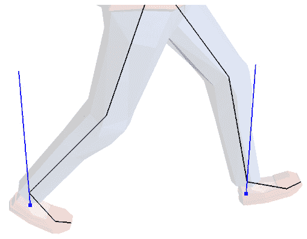
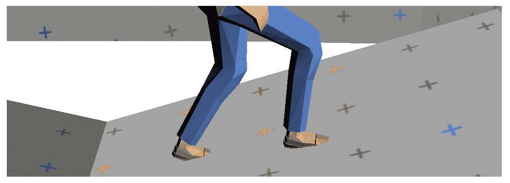

# *第十三章*:实现逆运动学

**逆运动学** ( **IK** )是求解一组关节应该如何定向以到达世界空间中指定点的过程。例如，您可以为角色指定一个触摸点。通过使用 IK，您可以了解如何以角色的手指始终接触特定点的方式旋转角色的肩膀、肘部和手腕。

IK 常用的算法有两种，即 CCD 和 FABRIK。这两者都将在本章中介绍。到本章结束时，您应该能够执行以下操作:

*   了解 CCD IK 的工作原理
*   实现一个电荷耦合器件求解器
*   了解 FABRIK 的工作原理
*   实现 FABRIK 求解器
*   实现球窝约束
*   实现铰链约束
*   了解 IK 解算器适合动画管道的位置和方式

# 创建电荷耦合器件解算器

在这一节，你将学习并实现 CCD IK 算法。 **CCD** 代表**循环坐标下降**。该算法可用于以链上的最后一个关节尽可能接近接触目标的方式设置关节链。您将能够使用电荷耦合器件来创建肢体和其他 IK 系统，其中需要使用目标点来解决链。

CCD 有三个重要的概念。首先是**目标**，你试图触及的空间点。接下来是 **IK 链**，这是一个需要旋转才能达到目标的所有关节的列表。最后是**末端执行器**，它是链条中的最后一个关节(需要接触目标的关节)。

有了目标、链和末端效应器，伪代码中的 CCD 算法如下所示:

```cpp
// Loop through all joints in the chain in reverse, 
// starting with the joint before the end effecor
foreach joint in ikchain.reverse() {
    // Find a vector from current joint to end effector
    jointToEffector = effector.position - joint.position
    // Find a vector from the current joint to the goal
    jointToGoal = goal.position - joint.position
    // Rotate the joint so the joint to effector vector 
    // matches the orientation of the joint to goal vector
    joint.rotation = fromToRotation(jointToEffector, 
                        jointToGoal) * joint.rotation
}
```

电荷耦合器件算法看起来很简单，但它是如何工作的？从效应器前的关节开始。旋转效应器对链条没有影响。找到从效应器前的关节到目标的向量，然后找到从关节到效应器的向量。旋转有问题的关节，使两个向量对齐。对每个接头重复上述步骤，直到基础接头:


图 13.1:可视化电荷耦合器件算法

看*图 13.1* ，末端执行器不接触目标。为什么不呢？CCD 是一种迭代算法，前面的步骤描述了一次迭代。需要每帧多次迭代来实现收敛。在接下来的部分中，我们将学习如何声明 CCD 求解器，这将引导我们实现`CCDSolver`类。

## 声明 CCD 求解器

在这个部分，你将声明 CCD 解算器。这将使您有机会在深入实现之前熟悉应用编程接口，并了解该类在高层次上是如何工作的。

创建一个新文件`CCDSolver.h`，在这个文件中声明`CCDSolver`类。`CCDSolver`类应该包含一个构成 IK 链的变换向量。假设 IK 链具有父子关系，其中每个索引都是它之前的索引的子级，使 0 成为我们的根节点。因此，IK 链中的每个变换都在局部空间中声明。按照以下步骤声明电荷耦合器件 IK 解算器:

1.  首先用三个变量声明`CCDSolver`类:形成 IK 链的变换列表，要执行的迭代次数，以及一些小的增量，可以用来控制在链被认为解决之前目标必须离目标有多近。同时声明默认构造函数:

    ```cpp
    class CCDSolver {
    protected:
        std::vector<Transform> mIKChain;
        unsigned int mNumSteps;
        float mThreshold;
    public:
        CCDSolver();
    ```

2.  为 IK 链的大小、步数和阈值实现 getter 和 setter 函数。声明哪个`[] operator`用于获取和设置局部联合变换。声明`GetGlobalTransform`函数，返回关节的全局变换:

    ```cpp
        unsigned int Size();
        void Resize(unsigned int newSize);
        Transform& operator[](unsigned int index);
        Transform GetGlobalTransform(unsigned int index);
        unsigned int GetNumSteps();
        void SetNumSteps(unsigned int numSteps);
        float GetThreshold();
        void SetThreshold(float value);
    ```

3.  声明`Solve`函数，将调用该函数求解 IK 链。提供了一个变换，但是只使用了变换的位置分量。如果解链，则`Solve`函数返回`true`，否则返回`false`:T4

`mNumSteps`变量用于确保求解器不会陷入无限循环。不能保证末端执行器会达到目标。限制迭代次数有助于避免潜在的无限循环。在下一节中，您将开始实现电荷耦合器件求解器。

## 实现 CCD 求解器

创建一个新文件`CCDSolver.cpp`，在其中实现 CCD 求解器。按照以下步骤实现电荷耦合器件解算器:

1.  定义默认构造函数，为步数和阈值赋值。使用小阈值，如`0.0001f`。使用`15`作为默认步数:

    ```cpp
    CCDSolver::CCDSolver() {
        mNumSteps = 15;
        mThreshold = 0.00001f;
    }
    ```

2.  执行`Size`和`Resize`功能，控制 IK 链的大小，`[] operator`包含链中每个关节的值:

    ```cpp
    unsigned int CCDSolver::Size() {
        return mIKChain.size();
    }
    void CCDSolver::Resize(unsigned int newSize) {
        mIKChain.resize(newSize);
    }
    Transform& CCDSolver::operator[](unsigned int index) {
        return mIKChain[index];
    }
    ```

3.  为求解器包含的步数和阈值实现 getter 和 setter 函数:

    ```cpp
    unsigned int CCDSolver::GetNumSteps() {
        return mNumSteps;
    }
    void CCDSolver::SetNumSteps(unsigned int numSteps) {
        mNumSteps = numSteps;
    }
    float CCDSolver::GetThreshold() {
        return mThreshold;
    }
    void CCDSolver::SetThreshold(float value) {
        mThreshold = value;
    }
    ```

4.  实现的`GetGlobalTransform`功能，可能看起来比较眼熟。它将指定关节的变换与其所有父关节的变换连接起来，并返回指定关节的全局变换:

    ```cpp
    Transform CCDSolver::GetGlobalTransform(unsigned int x) {
        unsigned int size = (unsigned int)mIKChain.size();
        Transform world = mIKChain[x];
        for (int i = (int) x - 1; i >= 0; --i) {
            world = combine(mIKChain[i], world);
        }
        return world;
    }
    ```

5.  通过确保链的大小有效并存储最后一个元素的索引和目标位置的向量的局部变量来实现`Solve`功能:

    ```cpp
    bool CCDSolver::Solve(const Transform& target) {
        unsigned int size = Size();
        if (size == 0) { return false; }
        unsigned int last = size - 1;
        float thresholdSq = mThreshold * mThreshold;
        vec3 goal = target.position;
    ```

6.  从`0`到`mNumSteps`循环执行正确的迭代次数。每次迭代时，获取末端执行器的位置，检查它是否足够接近目标。如果足够近，早点回来:

    ```cpp
        for (unsigned int i = 0; i < mNumSteps; ++ i) {
            vec3 effector = GetGlobalTransform(last).position;
            if (lenSq(goal - effector) < thresholdSq) {
                return true;
            }
    ```

7.  在每次迭代中，循环遍历整个 IK 链。在`size - 2`开始迭代；由于`size - 1`是最后一个元素，旋转最后一个元素对任何骨骼都没有影响:

    ```cpp
            for (int j = (int)size - 2; j >= 0; --j) {
    ```

8.  对于 IK 链中的每个关节，获取关节的世界变换。找到从关节位置到末端执行器位置的向量。找到从当前关节位置到目标位置的另一个向量:

    ```cpp
                effector=GetGlobalTransform(last).position;
                Transform world = GetGlobalTransform(j);
                vec3 position = world.position;
                quat rotation = world.rotation;
                vec3 toEffector = effector - position;
                vec3 toGoal = goal - position;
    ```

9.  接下来，找到一个四元数，它从位置到效应器向量旋转到位置到目标向量。有一种边缘情况，其中指向效应器或目标的向量可以是零向量:

    ```cpp
                quat effectorToGoal;
                if (lenSq(toGoal) > 0.00001f) {
                    effectorToGoal = fromTo(toEffector, 
                                            toGoal);
                }
    ```

10.  使用此向量将关节旋转到世界空间中的正确方向。通过关节先前世界旋转的逆旋转关节的世界空间方向，将四元数移回关节空间:

    ```cpp
                quat worldRotated =rotation * 
                                   effectorToGoal;
                quat localRotate = worldRotated * 
                                   inverse(rotation);
                mIKChain[j].rotation = localRotate * 
                                   mIKChain[j].rotation;
    ```

11.  当关节移动时，检查末端执行器在每次迭代中移动到目标的距离。如果足够接近，从函数中提前返回，值为`true` :

    ```cpp
                effector=GetGlobalTransform(last).position;
                if (lenSq(goal - effector) < thresholdSq) {
                    return true;
                }
             }
        }
    ```

12.  如果没有达到目标，IK 链就无法解决，至少在指定的迭代次数内无法解决。只需返回`false`以表示该功能未能达到其目标:

    ```cpp
        return false;
    } // End CCDSolver::Solve function
    ```

该电荷耦合器件解算器可用于求解具有一个原点和一个末端执行器的单个链。在单个链可以有多个末端效应器的情况下，有更高级的处理 IK 链的方法。然而，由于额外的实现复杂性，这些不太常见。在下一节，你将开始探索一种不同的 IK 算法，FABRIK。

# 创建 FABRIK 解算器

**FABRIK** ( **向前和向后到达反向运动学**)有一个更自然的，人形的看起来收敛。像电荷耦合器件一样，FABRIK 与具有基座、末端执行器和目标的 IK 链一起工作。与 CCD 不同的是，FABRIK 使用的是位置，而不是旋转。FABRIK 算法更容易理解，因为它可以只使用向量来实现。

在许多方面，FABRIK 可以作为电荷耦合器件的替代产品。这两种算法都解决了同一个问题，但它们采用不同的方法来解决它。对于人形动画，FABRIK 往往收敛得更快，看起来更好，因此您可能会将其用作角色肢体的解算器。

当涉及到人形钻机时，用位置而不是旋转来工作不会很好，人形钻机需要通过旋转关节来制作动画。这可以通过在算法中添加预处理和后处理步骤来解决。预处理步骤将把 IK 链中的所有变换转换成世界空间位置向量。后处理步骤将把这些向量转换成旋转数据。

FABRIK 算法有两个部分。首先，从末端效应器向后迭代到底部。向后迭代时，将效应器移动到目标。接下来，移动每个骨骼，使它们相对于效应器；这将保持链条完好无损。接下来，将底座移回其原始位置，并相对于底座移动每个骨骼，使链条保持完整。

在伪代码中，FABRIK 算法如下所示:

```cpp
void Iterate(const Transform& goal) {
    startPosition = chain[0]
    // Iterate backwards
    chain[size - 1] = goal.position;
    for (i = size - 2; i >= 0; --i) {
        current = chain[i]
        next = chain[i + 1]
        direction = normalize(current - next)
        offset = direction * length[i + 1]
        chain[i] = next + offset
    }
    // Iterate forwards
    chain[0] = startPosition
    for (i  = 1; i < size; ++ i) {
        current = chain[i]
        prev = chain[i - 1]
        direction = normalize(current - prev)
        offset = direction * length[i]
        chain[i] = prev + offset
    }
}
```

要可视化 FABRIK，请将末端效应器设置为目标所在的位置。找到从末端效应器到最后一个关节的向量。沿着该向量移动最后一个关节，保持其到末端执行器的距离。对每个关节重复上述步骤，直到到达底部。这将使底部接头移出位置。

要进行正向迭代，请将基础放回原位。找到下一个关节的向量。将下一个关节放在这个向量上，保持它到底部的距离。一直重复这个步骤:


图 13.2:可视化 FABRIK 算法

FABRIK 和 CCD 都将尝试求解一个 IK 链，但它们在目标上的收敛方式不同。CCD 倾向于卷曲，而 FABRIK 倾向于拉伸。FABRIK 通常会为人形动画生成更自然的结果。在下一节中，您将开始声明`FABRIKSolver`类，然后是该类的实现。

## 声明 FABRIK 求解器

FABRIK 求解器将需要更多内存来运行，因为它必须将局部联合变换转换为全局位置。该算法可以分解成几个步骤，这些步骤都可以作为受保护的辅助函数来实现。

创建新文件，`FABRIKSolver.h`。该文件将用于声明`FABRIKSolver`类。按照以下步骤申报`FABRIKSolver`类:

1.  首先声明`FABRIKSolver`类，它需要跟踪 IK 链、最大步数和一些距离阈值。声明一个世界空间位置向量和一个关节长度向量。这些向量是需要的，因为 FABRIK 算法不考虑旋转:

    ```cpp
    class FABRIKSolver {
    protected:
        std::vector<Transform> mIKChain;
        unsigned int mNumSteps;
        float mThreshold;
        std::vector<vec3> mWorldChain;
        std::vector<float> mLengths;
    ```

2.  声明助手功能，将 IK 链复制到世界位置向量，向前迭代，向后迭代，并将最终世界位置复制回 IK 链:

    ```cpp
    protected:
        void IKChainToWorld();
        void IterateForward(const vec3& goal);
        void IterateBackward(const vec3& base);
        void WorldToIKChain();
    ```

3.  为链的大小、求解链的迭代次数以及末端关节需要离目标多远的ε值声明一个默认的构造函数、getter 和 setter 函数:

    ```cpp
    public:
        FABRIKSolver();
        unsigned int Size();
        void Resize(unsigned int newSize);
        unsigned int GetNumSteps();
        void SetNumSteps(unsigned int numSteps);
        float GetThreshold();
        void SetThreshold(float value);
    ```

4.  为存储在 IK 链中的局部变换声明 getter 和 setter 函数。声明一个函数来检索关节的全局变换。最后，声明`Solve`函数，在给定目标时求解 IK 链:

    ```cpp
        Transform GetLocalTransform(unsigned int index);
        void SetLocalTransform(unsigned int index, 
                               const Transform& t);
        Transform GetGlobalTransform(unsigned int index);
        bool Solve(const Transform& target);
    };
    ```

FABRIK 算法实现起来比电荷耦合器件算法复杂一点，但是步骤更容易分解成函数。在下一节中，您将开始实现`FABRIKSolver`类的功能。

## 实现 FABRIK 求解器

FABRIK 算法适用于世界空间位置。这意味着，对于每次迭代，IK 链需要将局部关节变换转换为世界位置并存储结果。链求解后，世界位置向量需要转换回相对偏移，并存储回 IK 链中。

新建一个文件，`FABRIKSolver.cpp`；`FABRIKSolver`类将在这个文件中实现。按照以下步骤实施`FABRIKSolver`课程:

1.  实现`FABRIKSolver`类的构造函数。需要将步数和阈值设置为默认值:

    ```cpp
    FABRIKSolver::FABRIKSolver() {
        mNumSteps = 15;
        mThreshold = 0.00001f;
    }
    ```

2.  为步数和阈值实现简单的 getter 和 setter 函数:

    ```cpp
    unsigned int FABRIKSolver::GetNumSteps() {
        return mNumSteps;
    }
    void FABRIKSolver::SetNumSteps(unsigned int numSteps) {
        mNumSteps = numSteps;
    }
    float FABRIKSolver::GetThreshold() {
        return mThreshold;
    }
    void FABRIKSolver::SetThreshold(float value) {
        mThreshold = value;
    }
    ```

3.  为链的大小实现一个获取和设置函数。setter 函数需要设置链的大小、世界链和长度向量:

    ```cpp
    unsigned int FABRIKSolver::Size() {
        return mIKChain.size();
    }
    void FABRIKSolver::Resize(unsigned int newSize) {
        mIKChain.resize(newSize);
        mWorldChain.resize(newSize);
        mLengths.resize(newSize);
    }
    ```

4.  实现获取和设置 IK 链中元素的局部变换的方法:

    ```cpp
    Transform FABRIKSolver::GetLocalTransform(
                            unsigned int index) {
        return mIKChain[index];
    }
    void FABRIKSolver::SetLocalTransform(unsigned int index,
                                       const Transform& t) {
        mIKChain[index] = t;
    }
    ```

5.  实现 getter 函数来检索全局转换并将所有转换连接到根:

    ```cpp
    Transform FABRIKSolver::GetGlobalTransform(
                            unsigned int index) {
        unsigned int size = (unsigned int)mIKChain.size();
        Transform world = mIKChain[index];
        for (int i = (int)index - 1; i >= 0; --i) {
            world = combine(mIKChain[i], world);
        }
        return world;
    }
    ```

6.  执行`IKChainToWorld`功能，将 IK 链复制到世界变换向量中，并记录线段长度。长度数组存储关节与其父关节的距离。这意味着根关节将始终包含长度`0`。对于非根关节，`i`指数处的距离是关节`i`和`i–1`之间的距离:

    ```cpp
    void FABRIKSolver::IKChainToWorld() {
        unsigned int size = Size();
        for (unsigned int i = 0; i < size; ++ i) {
            Transform world = GetGlobalTransform(i);
            mWorldChain[i] = world.position;
            if (i >= 1) {
                vec3 prev = mWorldChain[i - 1];
                mLengths[i] = len(world.position - prev);
            }
        }
        if (size > 0) {
            mLengths[0] = 0.0f;
        }
    }
    ```

7.  接下来执行`WorldToIKChain`功能，将世界位置 IK 链转换回局部空间变换。穿过所有关节。对于每个关节，找到当前关节和下一个关节的世界空间变换。缓存当前关节的世界空间位置和旋转:

    ```cpp
    void FABRIKSolver::WorldToIKChain() {
        unsigned int size = Size();
        if (size == 0) { return; }
        for (unsigned int i = 0; i < size - 1; ++ i) {
            Transform world = GetGlobalTransform(i);
            Transform next = GetGlobalTransform(i + 1);
            vec3 position = world.position;
            quat rotation = world.rotation;
    ```

8.  创建一个从当前关节指向下一个关节的向量。这是当前节点和下一个节点之间的旋转:

    ```cpp
            vec3 toNext = next.position - position;
            toNext = inverse(rotation) * toNext;
    ```

9.  构建一个从下一个关节的世界空间 IK 链指向当前位置的向量。这是当前节点和下一个节点的期望位置之间的旋转:

    ```cpp
            vec3 toDesired = mWorldChain[i + 1] - position;
            toDesired = inverse(rotation) * toDesired;
    ```

10.  使用`fromTo`四元数函数对齐这两个向量。将最终增量旋转应用于当前关节的 IK 链旋转:

    ```cpp
            quat delta = fromTo(toNext, toDesired);
            mIKChain[i].rotation = delta * 
                                   mIKChain[i].rotation;
        }
    }
    ```

11.  接下来，实现`IterateBackward`函数，该函数将链中的最后一个元素设置为目标。这将打破 IK 链。使用存储的距离调整所有其他关节，使链条保持完整。此功能执行后，末端效应器始终位于目标位置，初始关节可能不再位于底部:

    ```cpp
    void FABRIKSolver::IterateBackward(const vec3& goal) {
        int size = (int)Size();
        if (size > 0) {
            mWorldChain[size - 1] = goal;
        }
        for (int i = size - 2; i >= 0; --i) {
            vec3 direction = normalized(mWorldChain[i] - 
                                        mWorldChain[i + 1]);
            vec3 offset = direction * mLengths[i + 1];
            mWorldChain[i] = mWorldChain[i + 1] + offset;
        }
    }
    ```

12.  实现`IterateForward`功能。此函数重新排列 IK 链，使第一个链接从链的原点开始。该功能需要将初始关节设置为在底部，并迭代所有其他关节，调整它们以保持 IK 链完整。该函数执行后，如果链是可解的并且有足够的迭代次数，末端执行器可能在目标位置:

    ```cpp
    void FABRIKSolver::IterateForward(const vec3& base) {
        unsigned int size = Size();
        if (size > 0) {
            mWorldChain[0] = base;
        }
        for (int i = 1; i < size; ++ i) {
            vec3 direction = normalized(mWorldChain[i] - 
                                        mWorldChain[i - 1]);
            vec3 offset = direction * mLengths[i];
            mWorldChain[i] = mWorldChain[i - 1] + offset;
        }
    }
    ```

13.  通过将 IK 链复制到世界位置向量中并填写长度向量，开始执行`Solve`功能。这可以通过`IKChainToWorld`助手功能来完成。缓存基地和球门位置:

    ```cpp
    bool FABRIKSolver::Solve(const Transform& target) {
        unsigned int size = Size();
        if (size == 0) { return false; }
        unsigned int last = size - 1;
        float thresholdSq = mThreshold * mThreshold;

        IKChainToWorld();
        vec3 goal = target.position;
        vec3 base = mWorldChain[0];
    ```

14.  从`0`迭代到`mNumSteps`。对于每次迭代，检查目标和末端效应器是否足够接近，以便求解链。如果是，使用`WorldToIKChain`助手功能将世界位置复制回链中，并提前返回。如果它们不够接近，通过调用`IterateBackward`和`IterateForward`方法进行迭代:

    ```cpp
        for (unsigned int i = 0; i < mNumSteps; ++ i) {
            vec3 effector = mWorldChain[last];
            if (lenSq(goal - effector) < thresholdSq) {
                WorldToIKChain();
                return true;
            }
            IterateBackward(goal);
            IterateForward(base);
        }
    ```

15.  迭代循环后，将世界位置向量复制回 IK 链，而不管求解器是否能够求解该链。最后检查一次末端效应器是否达到目标，并返回适当的布尔值:

    ```cpp
        WorldToIKChain();
        vec3 effector = GetGlobalTransform(last).position;
        if (lenSq(goal - effector) < thresholdSq) {
            return true;
        }
        return false;
    }
    ```

FABRIK 算法之所以受欢迎，是因为它倾向于快速收敛到最终目标，结果对于人形角色来说看起来很好，并且该算法易于实现。在下一节中，您将学习如何向 FABRIK 或 CCD 求解器添加约束。

# 实施约束

CCD 和 FABRIK 解算器都能产生好的结果，但都不能产生可预测的结果。在本节中，您将了解什么是约束，可以在哪里应用 IK 解算器约束，以及如何应用约束。这将让你建立更真实的 IK 解算器。

考虑一个应该代表一条腿的 IK 链。你会想要确保每个关节的运动是可预测的，例如，膝盖可能不应该向前弯曲。

这就是约束有用的地方。膝关节是一个铰链；如果应用了铰链约束，腿部 IK 链将看起来更真实。使用约束，可以为 IK 链中的每个关节设置规则。

以下步骤将向您展示如何在 CCD 和 FABRIK 解算器中应用约束:

1.  约束可以应用于 CCD 和 FABRIK 解算器，并且它们必须在每次迭代后应用。对于 CCD，这意味着在这里插入一位代码:

    ```cpp
    bool CCDSolver::Solve(const vec3& goal) {
        // Local variables and size check
        for (unsigned int i = 0; i < mNumSteps; ++ i) {
            // Check if we've reached the goal
            for (int j = (int)size - 2; j >= 0; --j) {
               // Iteration logic
     // -> APPLY CONSTRAINTS HERE!
                effector = GetGlobalTransform(last).position;
                if (lenSq(goal - effector) < thresholdSq) {
                    return true;
                }
             }
        }
        // Last goal check
    }
    ```

2.  将约束应用于 FABRIK 解算器更加复杂。约束应用于每次迭代，每次迭代都需要在世界位置链和 IK 链之间转换 IK 链。将数据复制到变换链后，每次迭代都应用约束:

    ```cpp
    bool FABRIKSolver::Solve(const vec3& goal) {
        // Local variables and size check
        IKChainToWorld();
        vec3 base = mWorldChain[0];
        for (unsigned int i = 0; i < mNumSteps; ++ i) {
            // Check if we've reached the goal
            IterateBackward(goal);
            IterateForward(base);
     WorldToIKChain();//NEW, NEEDED FOR CONSTRAINTS
     // -> APPLY CONSTRAINTS HERE!
     IKChainToWorld();//NEW, NEEDED FOR CONSTRAINTS
        }
        // Last goal check
    }
    ```

`Solve`函数是虚函数的原因是，您可以将每个`IKChain`类扩展到特定类型的链中，如`LegIKChain`或`ArmIKChain`，并将约束代码直接添加到求解方法中。在以下各节中，您将探索常见的约束类型。

## 球窝约束

球窝关节像肩关节一样工作。关节可以在所有三个轴上旋转，但是有一个角度约束阻止它自由旋转。*图 13.3* 直观显示了球窝约束的外观:


图 13.3:球窝约束可视化

要建立球窝约束，需要知道当前关节及其父关节的旋转。你可以从这些四元数中构造正向矢量，并检查正向矢量的角度。如果角度大于提供的极限，则需要调整旋转。

要限制旋转，找到旋转轴。两个向前方向的叉积垂直于两个方向；这是旋转轴。创建一个四元数，将沿该轴的角度限制带入当前关节的局部空间，并将该四元数设置为关节的旋转:

```cpp
void ApplyBallSocketConstraint(int i, float limit) { 
    quat parentRot = i == 0 ? mOffset.rotation : 
                     GetWorldTransform(i - 1).rotation;
    quat thisRot = GetWorldTransform(i).rotation;
    vec3 parentDir = parentRot * vec3(0, 0, 1);
    vec3 thisDir = thisRot * vec3(0, 0, 1);
    float angle = ::angle(parentDir, thisDir);
    if (angle > limit * QUAT_DEG2RAD) {
        vec3 correction = cross(parentDir, thisDir);
        quat worldSpaceRotation = parentRot * 
            angleAxis(limit * QUAT_DEG2RAD, correction);
        mChain[i].rotation = worldSpaceRotation * 
                             inverse(parentRot);
    }
}
```

球窝约束通常应用于角色的髋关节或肩关节。这些也往往是肢体 IK 链的根关节。在下一节中，您将探索另一种类型的约束，即铰链约束。

## 铰链约束

铰链约束类似于肘或膝。它只允许在一个特定的轴上旋转。*图 13.4* 从视觉上展示了铰链接头的外观:


图 13.4:可视化的铰链约束

要实现铰链约束，需要知道当前关节和父关节的世界空间旋转。将轴法线乘以两个旋转四元数，找到两者之间的四元数；这是将关节约束到轴上所需的旋转量。将此旋转带回关节空间并应用旋转:

```cpp
void ApplyHingeSocketConstraint(int i, vec3 axis) { 
    Transform joint = GetWorldTransform(i);
    Transform parent = GetWorldTransform(i - 1);
    vec3 currentHinge = joint.rotation * axis;
    vec3 desiredHinge = parent.rotation * axis;
    mChain[i].rotation = mChain[i].rotation * 
                         fromToRotation(currentHinge, 
                                        desiredHinge);
}
```

铰链约束常用于肘关节或膝关节。在下一节中，您将探讨如何使用 IK 将角色的脚与地面对齐。

# 使用 IK 将角色的脚与地面对齐

在本节中，您将学习如何使用 IK 来修改动画，使其看起来更加正确。具体来说，您将学习如何使用 IK 在不平坦的表面上行走时阻止角色的脚穿过地面。

现在，您可以使用 CCD 或 FABRIK 求解 IK 链，让我们探索如何使用这些解算器。IK 有两种常见的用途，即定位手或定位脚。在本节中，您将探索当角色行走时，如何将角色的脚夹在地上。

要解决夹脚问题，您可以对照当前全局位置检查脚的最后一个全局位置。如果脚的运动碰到路上的任何东西，把脚钉在地上。即使是最琐碎的解决方案也有边缘情况:如果上升运动太远会发生什么？在动画循环的哪一点，我们可以在固定位置和非固定位置之间进行插值？

为了便于实施，本章的接地箝位策略将保持简单。首先，检查脚是否与上面的任何东西碰撞，例如，穿过地形。为此，从角色的臀部到脚踝投射一条光线。

如果射线击中任何东西，击中点将是腿部 IK 链的目标。如果光线没有击中任何东西，角色脚踝的当前位置将是腿部 IK 链的目标。接下来，做同样的光线投射，但不要停留在人物的脚踝处；继续走。

如果这条射线击中任何东西，击中点就是未来的 IK 目标。如果光线没有击中任何东西，将未来的 IK 目标设置为当前的 IK 目标。现在有两个目标，一个是自由运动的，一个是固定在地上的。

如果使用当前目标，角色的脚可能会突然落地。如果你用未来的目标，角色不会走路——它只会在地上拖着脚。相反，你必须在两个目标之间插入一些值。

插值应该来自动画本身。当角色的脚向下时，应该使用当前目标；当它上升时，未来的目标应该被使用。当角色的脚被上下放置时，目标位置应该是`lerp`。

知道了 IK 目标，IK 解算器就可以计算出如何弯曲角色的腿。一旦腿部关节在世界空间中，我们调整脚的头部，使其始终在地形上，遵循一些类似于解决腿部的步骤。

在以下部分中，您将更详细地探索这里描述的每个步骤。然而，这里有一点蹊跷。所需的大多数值是特定于用于渲染的模型的；不同的角色需要不同的值。

## 寻找脚下目标

从角色臀部下方一点到脚踝下方一点直射一条光线。这个光线投射应该沿着脚踝的位置一直向下。然而，光线应该在击球下开始多远，以及应该在脚踝下走多远都是特定于模型的:



图 13.5:光线投射找足球门

不管命中点有多远，都要记录下这个光线投射的结果。该点将被视为 IK 目标，始终被夹在地面上。检查光线是否击中了其原点和脚踝底部之间的任何东西。如果是的话，那将是脚踝的进球。如果没有，脚踝的目标将是脚踝的位置。

重要的是要记住角色的脚踝是被定位的，而不是它的脚底。因此，球门点需要向上移动脚踝到地板的距离:


图 13.6:角色脚踝位置的偏移

这些脚部目标将控制 IK 系统如何覆盖动画。行走时，如果脚的运动没有受到阻碍，IK 系统应该不会被注意到。在下一节中，您将学习如何控制脚在动画和固定目标点之间的插值。

## 内插脚进球

要在当前和未来 IK 目标之间进行插值，您需要了解当前正在播放的动画剪辑。具体来说，你需要知道腿处于什么阶段；它是被停飞、被举起、被悬挂还是被放置？对这些信息进行编码的一种常见方法是使用标量曲线。

这个想法是创建两条标量曲线，一条用于左腿，一条用于右腿。这些曲线对应于当前步骤的步幅。例如，当左脚离开地面时，左标量曲线的值需要为 0。如果左脚在地面上，左曲线的值需要为 1。曲线如下所示:


图 13.7:步行周期步幅表示为标量曲线

根据当前标准化回放时间对这些曲线进行采样。结果值将介于 0 和 1 之间。将非 IK 调整动画和 IK 调整动画混合在一起时，使用此 0 到 1 的值作为混合权重。该曲线通常由眼睛使用曲线编辑器创作。该曲线特定于当前正在播放的动画。

在下一节中，您将探索如何调整 IK 角色的垂直放置，以避免肢体过度伸展。

## 垂直字符放置

接下来，角色需要垂直放置，这样看起来才好看。如果角色被放得太高，它会以腿处于过度伸展状态而结束。过低，IK 系统会过度弯曲腿部:


图 13.8:与采样动画相比，IK 过度伸展

角色的定位方式与它的建模方式有关。如果角色是在假设(0，0，0)是地面中心点的情况下建模的，您可以将它放在下面的表面上，并将其稍微沉入表面。

角色需要稍微沉入表面，以允许 IK 系统做一些工作，并避免过度伸展。这就提出了一个问题:角色的脚需要对准的表面是什么？对准位置可以来自碰撞/物理系统，或者在更简单的例子中，只是从角色直接向下的光线投射。

碰撞面和可视面不一样。考虑一个楼梯:碰撞几何体通常是一个斜坡。显示的几何形状看起来像一个真正的楼梯。在这种情况下，角色的位置应该相对于碰撞几何体，但是 IK 目标应该相对于视觉几何体定位。

如果只有一种几何图形用于碰撞和视觉效果，会怎么样？在这种情况下，将角色放在夹住的任意一个 IK 目标上，以较低者为准。这将确保在没有过度伸展的情况下始终可以到达地面。

## 传球

是时候解决腿 IK 链了。在此之前，将关节从动画姿势复制到 IK 解算器中。对于每条腿，将髋关节的全局变换复制到 IK 解算器的根部。将膝盖的局部变换复制到关节 1，将脚踝的局部变换复制到关节 2。然后，运行 IK 解算器。解算器会将角色的脚放在固定在地面上的目标点上。

## 脚部对正

夹紧的脚动画在这一点上是平滑的，脚将不再夹在地面内部。但是只有角色的腿看起来是正确的，而不是脚。看一看非平坦表面上的角色的脚——仍然有相当多的剪裁发生:



图 13.9:腿被夹在地上，但脚的方向不对

要解决这个问题，创建一个脚趾射线。脚趾射线将位于角色的踝关节处，沿角色的前向轴有一段距离。这将确保脚趾目标总是向前看，即使在动画中，脚趾指向下方。调整脚趾射线的垂直位置，从膝盖上方拍摄到脚趾下方一点:


图 13.10:向前投射偏移，即使脚趾指向下方

脚趾的位置类似于腿的位置。找到一个目标，即当前脚趾夹在地上的位置。通过动画的当前归一化时间，在地面夹紧目标和活动动画目标之间进行插值。

这个脚趾目标将用于旋转脚。找到一个从脚踝到当前脚趾位置的向量。找到一个从脚踝到球门脚趾位置的向量。创建一个在这两个向量之间旋转的四元数。用这个四元数旋转脚踝。

在本节中，您学习了如何找到脚目标，在它们之间进行插值，并使用这些目标和 IK 系统将角色的脚与地面对齐。地面对齐只是 IK 解算器的用例之一。类似的系统可以用手臂抓东西，也可以用全身来创造一个布娃娃系统。

# 总结

在本章中，您实现了 CCD 和 FABRIK IK 解算器。两个解算器都可以求解 IK 链，但它们的收敛方式不同。哪种算法效果更好在很大程度上取决于上下文。

您还学习了如何使用约束来限制特定关节的运动范围。在适当的约束条件下，IK 系统会修改当前动画，使其与环境交互。您在本章的脚踏实地部分探讨了如何实现这一点。

在本书的可下载内容中，本章有 4 个示例。`Sample00`包含至此的代码。`Sample01`演示如何使用 CCD 解算器，`Sample02`演示如何使用 FABRIK 解算器。`Sample03`演示角色沿着路径行走时的夹脚和地面对齐。

在下一章中，您将学习对偶四元数如何用于蒙皮。当网格弯曲或旋转时，双四元数蒙皮比线性混合蒙皮更好地保持网格的体积。

# 进一步阅读

除了 FABRIK 和 CCD 之外，IK 链有时会通过解析或雅可比矩阵求解:

*   有关分析 IK 解算器的更多信息，请访问。
*   完整的雅可比解算器实现包含在*游戏编程宝石 4* 中。